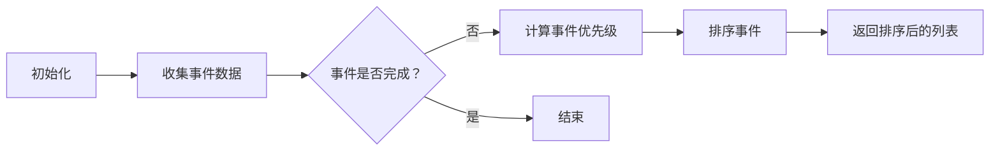
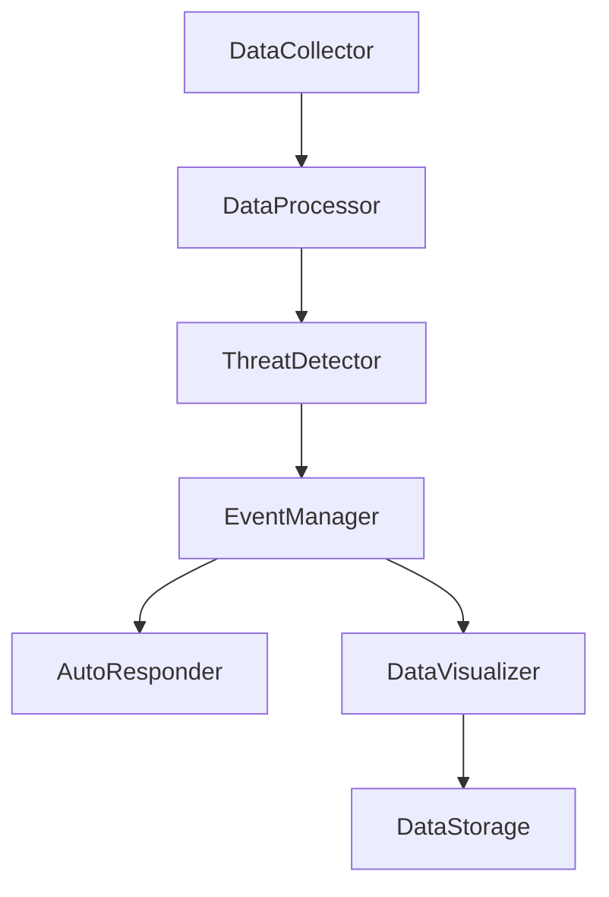
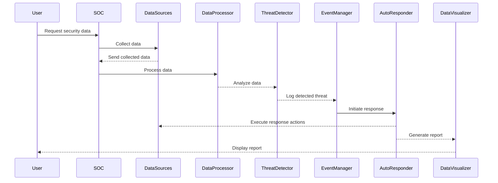

                 


### **Introduction to SOC (Security Operations Center)**

Security Operations Center (SOC) is a critical component in modern cybersecurity infrastructure. It serves as the nerve center for monitoring, analyzing, and responding to security events within an organization. The importance of SOC cannot be overstated, as it plays a pivotal role in safeguarding sensitive data, preventing and mitigating cyber threats, and maintaining the overall security posture of an organization.

**Definition and Importance of SOC**

SOC can be defined as a team of skilled professionals and advanced technologies that work together to protect an organization's information assets. It functions as a 24/7 monitoring hub, continuously analyzing data from various sources to detect and respond to potential threats.

The importance of SOC lies in its ability to provide:

1. **Proactive Monitoring**: SOC allows organizations to monitor their networks and systems continuously, detecting any unusual activities or anomalies that could indicate a security breach.
2. **Real-Time Threat Detection**: With advanced tools and technologies, SOC can identify and respond to threats in real-time, minimizing the damage and impact on the organization.
3. **Incident Response**: SOC is equipped to handle security incidents effectively, from initial detection to containment, eradication, and recovery.
4. **Threat Intelligence**: SOC teams often leverage threat intelligence to stay updated on the latest threats and vulnerabilities, enabling them to proactively defend against potential attacks.
5. **Compliance and Regulations**: SOC helps organizations comply with various industry regulations and standards, ensuring data protection and privacy.

**Role in an Organization's Security Posture**

SOC plays a crucial role in an organization's security posture by:

1. **Protecting Critical Assets**: SOC ensures that an organization's most valuable assets, such as sensitive data, intellectual property, and financial information, are safeguarded from cyber threats.
2. **Reducing Risk**: By continuously monitoring and analyzing security events, SOC helps organizations identify and mitigate potential risks before they can cause significant damage.
3. **Enhancing Incident Response Capabilities**: SOC teams are trained to respond to security incidents effectively, minimizing the impact on the organization and ensuring quick recovery.
4. **Strengthening Trust**: With a robust SOC in place, organizations can build trust with their customers, partners, and stakeholders, demonstrating their commitment to data security and privacy.
5. **Supporting Business Continuity**: SOC helps ensure that business operations can continue seamlessly, even in the face of cyber threats and disruptions.

In conclusion, SOC is a cornerstone of modern cybersecurity. Its proactive monitoring, real-time threat detection, incident response capabilities, and overall security posture make it an indispensable asset for organizations striving to protect their information assets in an increasingly complex and hostile cyber environment. 

### **Understanding the SOC Ecosystem**

The SOC ecosystem is a complex and interconnected system that comprises various components working together to provide a comprehensive security posture. These components include Security Information and Event Management (SIEM) systems, intrusion detection systems (IDS), intrusion prevention systems (IPS), and endpoint detection and response (EDR) solutions. Understanding the roles and functionalities of each of these components is essential for building an effective SOC.

**Security Information and Event Management (SIEM)**

SIEM systems are crucial for aggregating, analyzing, and correlating security data from various sources within an organization. They provide a centralized platform for monitoring and managing security events, enabling security teams to identify potential threats and respond to them effectively.

SIEM systems offer several key functionalities:

1. **Data Collection**: SIEM systems collect data from various sources, including firewalls, intrusion detection systems, endpoint devices, and cloud services.
2. **Data Analysis**: SIEM systems use advanced analytics and machine learning algorithms to identify patterns and anomalies in the collected data, helping to detect potential threats.
3. **Event Correlation**: SIEM systems correlate events from different sources to provide a comprehensive view of the organization's security posture, enabling security teams to identify potential threats and take appropriate action.
4. **Incident Response**: SIEM systems provide real-time alerts and reports, allowing security teams to respond to incidents quickly and efficiently.

**Intrusion Detection Systems (IDS)**

IDS are designed to monitor network traffic and detect potential intrusions and malicious activities. There are two main types of IDS: network-based IDS (NIDS) and host-based IDS (HIDS).

NIDS monitor network traffic at the network perimeter, analyzing packets and identifying suspicious activities. HIDS, on the other hand, monitor the activities of individual hosts, such as servers and workstations, looking for signs of compromise or malicious activity.

The key functionalities of IDS include:

1. **Traffic Monitoring**: IDS analyze network traffic in real-time, looking for patterns and signatures that indicate potential threats.
2. **Anomaly Detection**: IDS can detect abnormal behavior that may indicate a security breach, such as unusual data transfer rates or unfamiliar IP addresses.
3. **Alert Generation**: IDS generate alerts when they detect potential threats, allowing security teams to investigate and respond to incidents.
4. **Forensics**: IDS can provide valuable information for forensic analysis, helping to identify the source and nature of a security breach.

**Intrusion Prevention Systems (IPS)**

IPS are an advanced version of IDS, designed to not only detect threats but also prevent them from causing harm. IPS systems actively monitor network traffic and can take automated actions to block or mitigate potential threats.

Key functionalities of IPS include:

1. **Threat Detection**: IPS systems use signature-based and behavioral analysis to detect known and unknown threats in real-time.
2. **Threat Mitigation**: IPS can automatically block malicious traffic or take other actions to prevent threats from reaching their targets.
3. **Real-Time Response**: IPS systems provide real-time alerts and reports, enabling security teams to respond to incidents quickly and effectively.
4. **Compliance**: IPS systems can help organizations meet various regulatory requirements by actively preventing and mitigating security threats.

**Endpoint Detection and Response (EDR)**

EDR solutions focus on monitoring and responding to threats at the endpoint level, such as laptops, desktops, and servers. EDR systems collect data from endpoints, analyze it for signs of compromise, and provide real-time visibility into endpoint activities.

Key functionalities of EDR include:

1. **Endpoint Monitoring**: EDR solutions continuously monitor endpoint activities, including file access, network connections, and system processes.
2. **Threat Detection**: EDR systems use advanced analytics and machine learning to detect and classify threats at the endpoint level.
3. **Incident Response**: EDR systems provide detailed information about detected threats, allowing security teams to respond effectively and mitigate potential damage.
4. **Forensics**: EDR systems can provide valuable forensic data for post-incident analysis and investigation.

In summary, the SOC ecosystem is a complex and interconnected system that relies on various components working together to provide comprehensive security. Understanding the roles and functionalities of SIEM systems, IDS, IPS, and EDR solutions is essential for building and maintaining an effective SOC. 

### **Designing a SOC Architecture**

Designing a SOC architecture is a critical step in establishing a robust and effective security operations center. It involves defining the overall structure, technology components, and processes that will enable the SOC to monitor, analyze, and respond to security events effectively. Let's delve into the key considerations for designing a SOC architecture, including network architecture, data flow, and communication protocols.

**Network Architecture Design**

A well-designed network architecture is foundational to the success of a SOC. It should facilitate secure and efficient communication between various components of the SOC ecosystem while isolating critical assets from potential threats. Here are some key considerations for network architecture design:

1. **Segmentation**: Implement network segmentation to separate different parts of the organization's network, isolating critical assets and reducing the potential attack surface. This helps contain threats and prevent them from spreading across the network.
2. **Firewalls**: Deploy firewalls at critical network entry points to monitor and control incoming and outgoing traffic. This helps filter out malicious traffic and protects the internal network from external threats.
3. **VLANs**: Use virtual local area networks (VLANs) to logically separate different types of traffic within the network. This improves network performance and security by isolating traffic from different departments or functions.
4. **Intrusion Detection and Prevention Systems (IDS/IPS)**: Place IDS/IPS at key points within the network to monitor traffic for signs of malicious activity and take automated actions to block or mitigate threats.
5. **Secure Remote Access**: Implement secure remote access solutions, such as virtual private networks (VPNs), to enable secure access to the SOC infrastructure from remote locations.

**Data Flow and Communication Protocols**

Efficient data flow and communication protocols are crucial for enabling the SOC to collect, analyze, and act on security data effectively. Here are some key considerations for designing the data flow and communication protocols in a SOC architecture:

1. **Data Sources**: Identify and integrate various data sources, including network traffic, endpoint devices, cloud services, and application logs. This enables the SOC to collect a comprehensive set of data for analysis.
2. **Data Aggregation**: Use a centralized data aggregation platform, such as a Security Information and Event Management (SIEM) system, to collect and consolidate data from various sources. This helps ensure comprehensive visibility and reduces the risk of data silos.
3. **Data Flow**: Define the flow of data from collection to analysis and reporting. This includes determining how data is ingested, processed, and stored, as well as the protocols used for data transfer.
4. **Data Privacy and Security**: Ensure that data in transit and at rest is protected using encryption, access controls, and other security measures. This helps prevent unauthorized access and ensures compliance with data privacy regulations.
5. **Communication Protocols**: Choose appropriate communication protocols for data transfer and communication between SOC components. Common protocols include HTTPS, TLS, and UDP. Each protocol has its advantages and trade-offs, so it's important to choose the right one based on your specific requirements.

**Key Considerations for SOC Architecture Design**

In addition to network architecture and data flow, there are several other key considerations for designing a SOC architecture:

1. **Scalability**: Design the SOC architecture to scale with the organization's growth and changing security requirements. This may involve using cloud-based solutions, modular components, and flexible architecture.
2. **Resilience**: Ensure that the SOC architecture is resilient to failures and can continue operating in the event of a disruption. This includes redundancy, failover mechanisms, and disaster recovery plans.
3. **Integration**: Integrate the SOC with other security tools and systems, such as endpoint protection, threat intelligence platforms, and incident response platforms. This enables a more comprehensive and coordinated security posture.
4. **Staffing and Training**: Design the SOC architecture to support the staffing and training needs of the security team. This includes ensuring that the infrastructure can support remote work and enabling continuous learning and development opportunities for the team.
5. **Compliance**: Ensure that the SOC architecture aligns with relevant industry regulations and standards, such as the NIST Cybersecurity Framework, ISO 27001, and GDPR.

In summary, designing a SOC architecture involves considering various factors, including network architecture, data flow, and communication protocols. By carefully planning and implementing these elements, organizations can build a robust and effective SOC that enables them to monitor, analyze, and respond to security events effectively. 

### **Collecting and Analyzing Security Data**

Collecting and analyzing security data is a fundamental component of a Security Operations Center (SOC). This process involves gathering data from various sources, analyzing it to detect threats, and prioritizing incidents to ensure that the most critical threats are addressed promptly. Let's break down this process step by step.

**Data Collection**

The first step in collecting security data is identifying the sources from which data will be gathered. These sources can include:

1. **Network Traffic**: Data from network devices such as firewalls, routers, and switches, which provide insights into the flow of traffic in and out of the network.
2. **Endpoints**: Data from endpoints like laptops, desktops, and mobile devices, which can reveal information about user activities and potential compromises.
3. **Applications**: Logs from applications and services running within the organization's infrastructure, which can provide insights into application-level activities and potential vulnerabilities.
4. **Servers**: Logs from servers, including database servers, file servers, and application servers, which can indicate unusual activities or potential breaches.
5. **Cloud Services**: Data from cloud services, including cloud storage, cloud applications, and cloud infrastructure, which is increasingly critical as more organizations adopt cloud-based solutions.

Once the data sources are identified, the next step is to ensure that the data is collected efficiently and securely. This involves:

1. **Data Aggregation**: Using a centralized data aggregation platform, such as a Security Information and Event Management (SIEM) system, to collect data from various sources. This helps consolidate data into a single location for analysis.
2. **Data Ingestion**: Implementing robust data ingestion mechanisms to ensure that data is collected in real-time and without loss. This may involve using agents, APIs, or other methods to pull data from different sources.
3. **Data Filtering**: Filtering the collected data to remove unnecessary or irrelevant information, which can help reduce the complexity of the analysis process and improve efficiency.

**Data Analysis**

Once the data is collected, the next step is to analyze it to detect potential threats. This involves:

1. **Data Parsing**: Parsing the collected data to extract relevant information and structure it in a format that can be analyzed. This may involve converting raw log files into structured data formats like JSON or XML.
2. **Data Mining**: Using advanced analytics techniques, such as machine learning and pattern recognition, to identify patterns and anomalies in the data that may indicate potential threats. This can help identify both known threats and new, emerging threats.
3. **Threat Intelligence Integration**: Integrating threat intelligence feeds, which provide information about known threats and vulnerabilities, into the analysis process. This can help correlate the collected data with known threats and improve the accuracy of the analysis.
4. **Alert Generation**: Generating alerts when potential threats are detected. These alerts should include enough information to enable security analysts to investigate the threat further.

**Threat Detection Methods**

There are several methods for detecting threats in security data, including:

1. **Signature-based Detection**: This involves comparing collected data against known threat signatures, such as malware signatures or attack patterns. While effective for detecting known threats, it is less effective against new or evolving threats.
2. **Anomaly-based Detection**: This involves identifying deviations from normal behavior in the collected data. For example, unusual network traffic patterns or unexpected file access may indicate a potential threat. Anomaly-based detection is more effective at detecting new and unknown threats.
3. **Heuristic-based Detection**: This involves using heuristics, or rules of thumb, to identify potential threats based on behavioral characteristics. For example, an application that suddenly starts making a large number of network connections may be indicative of a malicious activity.
4. **Machine Learning**: Using machine learning algorithms to identify patterns and anomalies in the collected data. Machine learning can be particularly effective at detecting complex and evolving threats.

**Incident Prioritization**

Once threats are detected, it is important to prioritize them based on their severity and potential impact. This involves:

1. **Risk Assessment**: Evaluating the potential impact of each detected threat, taking into account factors such as the likelihood of the threat succeeding, the value of the assets at risk, and the potential damage that could result from a successful attack.
2. **Impact Analysis**: Performing an impact analysis to determine the potential consequences of a threat, such as financial loss, reputational damage, or legal penalties.
3. **Prioritization Criteria**: Establishing prioritization criteria based on factors such as the severity of the threat, the resources required for mitigation, and the potential impact on business operations.

By following these steps for collecting and analyzing security data, SOC teams can effectively detect and respond to threats, ensuring the ongoing security and resilience of their organization's infrastructure. 

### **Incident Response**

Incident response is a critical component of a Security Operations Center (SOC), involving a structured and coordinated approach to managing and mitigating security incidents. Effective incident response not only minimizes the impact of an incident but also strengthens an organization's overall security posture. Here, we will detail the steps involved in incident response, including initial detection, containment, eradication, recovery, and post-incident analysis.

**Initial Detection**

The first step in incident response is the detection of a security incident. This can occur through various means, including:

1. **Automated Systems**: Automated security systems, such as intrusion detection and prevention systems (IDS/IPS) and endpoint detection and response (EDR) solutions, can detect suspicious activities and trigger alerts.
2. **Human Observations**: Security analysts or system administrators may notice unusual behaviors or patterns that indicate a potential incident.
3. **Threat Intelligence**: Alerts or indicators from threat intelligence feeds may indicate the presence of a known threat targeting the organization.

Once an incident is detected, it is crucial to verify its legitimacy and scope. This involves:

1. **Initial Assessment**: Gathering and analyzing available data to confirm that an actual incident has occurred and to understand its potential impact.
2. **Containment Planning**: Developing a plan to limit the spread of the incident and prevent further damage.

**Containment**

Containment involves isolating and mitigating the impact of the incident. Key steps include:

1. **Isolation**: Isolating affected systems or networks to prevent the threat from spreading. This may involve disconnecting affected devices from the network, disabling user accounts, or using firewalls to block access.
2. **Containment Strategies**: Implementing containment strategies based on the type and severity of the incident. For example, isolating a compromised server from the rest of the network can prevent malware from spreading to other systems.
3. **Communication**: Notifying relevant stakeholders, such as IT teams, executive management, and legal counsel, about the incident and the containment measures being taken.

**Eradication**

After containment, the next step is to eradicate the threat from the affected systems. This involves:

1. **Threat Analysis**: Conducting a thorough analysis of the affected systems to identify the source and nature of the threat. This may involve reviewing logs, examining network traffic, and analyzing malicious code.
2. **Removal**: Removing the threat from the affected systems. This may involve using antivirus software, malware removal tools, or manual cleaning processes.
3. **Patching and Updates**: Applying security patches and updates to vulnerable systems to prevent the threat from re-entering the environment.

**Recovery**

Once the threat has been eradicated, the focus shifts to recovery. This involves:

1. **System Restoration**: Restoring affected systems to a known good state. This may involve restoring from backups or re-imaging affected devices.
2. **Validation**: Validating the integrity and security of restored systems to ensure that the threat has been fully removed.
3. **Testing**: Conducting thorough testing to verify that systems are functioning correctly and are not vulnerable to further attacks.

**Post-Incident Analysis**

After the incident has been mitigated, it is essential to conduct a post-incident analysis to understand what happened, how it was managed, and how it can be prevented in the future. Key steps include:

1. **Root Cause Analysis**: Identifying the root cause of the incident and understanding the factors that contributed to its occurrence.
2. **Lessons Learned**: Documenting lessons learned and identifying improvements that can be made to the incident response plan, security policies, and training programs.
3. **Reporting**: Preparing a detailed incident report that includes a description of the incident, the response actions taken, the impact on the organization, and any recommendations for improvement.

**Incident Response Best Practices**

To enhance the effectiveness of incident response, organizations should adopt the following best practices:

1. **Incident Response Plan**: Develop a comprehensive incident response plan that outlines the steps to be taken in the event of a security incident.
2. **Regular Training**: Provide regular training and awareness programs for employees to ensure that they are familiar with the incident response procedures and know how to report suspicious activities.
3. **Simulation Exercises**: Conduct regular simulation exercises to test the incident response plan and identify areas for improvement.
4. **Threat Intelligence**: Leverage threat intelligence to stay updated on the latest threats and vulnerabilities, enabling proactive incident prevention and faster response.
5. **Documentation**: Maintain detailed documentation of all incident response activities, including the steps taken, the tools used, and the outcomes.

By following these steps and best practices, organizations can effectively manage and mitigate security incidents, ensuring the ongoing security and resilience of their operations. 

### **SOC Tools and Technologies**

Building an effective Security Operations Center (SOC) requires a robust suite of tools and technologies that can facilitate monitoring, analysis, and response to security events. In this section, we will explore the range of tools and technologies commonly used in a SOC, including threat intelligence platforms, endpoint detection and response (EDR) solutions, and threat hunting tools.

**Threat Intelligence Platforms**

Threat intelligence platforms are essential for gathering, analyzing, and correlating threat data from various sources. These platforms help organizations stay ahead of emerging threats and enhance their ability to detect and respond to potential attacks. Key features of threat intelligence platforms include:

1. **Data Aggregation**: Threat intelligence platforms aggregate data from various sources, such as feeds from security vendors, public and private threat intelligence exchanges, and internal systems. This helps create a comprehensive view of the threat landscape.
2. **Threat Indicators**: These platforms identify and track threat indicators, such as IP addresses, domains, and malware samples, allowing security teams to correlate them with observed events and prioritize their response.
3. **Automated Analysis**: Threat intelligence platforms use advanced analytics and machine learning algorithms to analyze threat data and identify patterns and anomalies that may indicate potential threats.
4. **Integration**: Threat intelligence platforms integrate with other SOC tools, such as SIEM systems and EDR solutions, to share information and enable coordinated responses.

**Endpoint Detection and Response (EDR) Solutions**

EDR solutions focus on monitoring and responding to threats at the endpoint level, providing critical visibility into the activities of users and devices within an organization's network. Key features of EDR solutions include:

1. **Endpoint Monitoring**: EDR solutions continuously monitor endpoint activities, including file access, network connections, and system processes, to detect signs of compromise or malicious activity.
2. **Threat Detection**: EDR solutions use a combination of signature-based and behavioral analysis to detect both known and unknown threats. They can also correlate endpoint data with threat intelligence to improve detection accuracy.
3. **Automated Response**: EDR solutions can automatically respond to detected threats by isolating affected endpoints, blocking malicious processes, and quarantining files. This helps minimize the impact of an incident and prevent the spread of threats.
4. **Forensics and Reporting**: EDR solutions provide detailed forensic data and reports, allowing security teams to investigate incidents, understand their root causes, and develop strategies to prevent future incidents.

**Threat Hunting Tools**

Threat hunting tools enable security teams to proactively search for signs of potential threats within their environments. These tools help organizations stay ahead of attackers by identifying indicators of compromise that may be missed by traditional detection methods. Key features of threat hunting tools include:

1. **Data Analysis**: Threat hunting tools provide advanced data analysis capabilities, including pattern recognition, anomaly detection, and machine learning, to identify potential threats.
2. **Querying and Visualization**: These tools allow security teams to query large datasets and visualize security events and relationships, making it easier to identify potential threats and understand their context.
3. **Automation**: Threat hunting tools can automate the process of searching for threats, reducing the time and effort required to identify and respond to potential incidents.
4. **Collaboration**: Threat hunting tools enable collaboration among security team members, allowing them to share insights and work together to address potential threats.

**Additional SOC Tools**

In addition to threat intelligence platforms, EDR solutions, and threat hunting tools, there are several other essential tools and technologies used in a SOC:

1. **Security Information and Event Management (SIEM)**: SIEM systems aggregate and analyze security data from various sources to provide a comprehensive view of the organization's security posture. They enable security teams to detect and respond to threats in real-time.
2. **Intrusion Detection Systems (IDS) and Intrusion Prevention Systems (IPS)**: IDS and IPS systems monitor network traffic for signs of malicious activity and can automatically block or mitigate threats.
3. **Vulnerability Management Tools**: These tools help organizations identify and prioritize vulnerabilities in their systems and applications, enabling them to take proactive measures to mitigate risks.
4. ** incident Response Platforms**: Incident response platforms provide a centralized environment for managing and coordinating incident response activities, including incident tracking, case management, and communication.

In conclusion, a well-equipped SOC relies on a diverse array of tools and technologies to monitor, analyze, and respond to security events effectively. By leveraging these tools, organizations can enhance their ability to detect and mitigate threats, ensuring the ongoing security and resilience of their operations. 

### **SOC Operations and Maintenance**

The day-to-day operations of a Security Operations Center (SOC) are critical to maintaining a secure environment. This involves a range of activities, from continuous monitoring and alert management to staff training and performance evaluation. Here, we will outline the essential components of SOC operations and maintenance, providing best practices to ensure the effectiveness and efficiency of the SOC.

**Continuous Monitoring**

Continuous monitoring is the cornerstone of SOC operations. It involves real-time monitoring of security events, network traffic, and system activities to detect potential threats and vulnerabilities. Key aspects of continuous monitoring include:

1. **Data Collection**: Continuously gather data from various sources, such as network devices, endpoints, applications, and cloud services. This data is crucial for identifying potential security incidents.
2. **Real-Time Analysis**: Use security analytics tools and technologies to analyze collected data in real-time. This includes using machine learning algorithms and threat intelligence to identify patterns and anomalies that may indicate a security threat.
3. **Alert Generation**: Set up automated alerts for potential security incidents. These alerts should be tailored to the organization's security policies and priorities, ensuring that critical events are prioritized and addressed promptly.

**Alert Management**

Alert management is a crucial aspect of SOC operations. It involves categorizing, prioritizing, and responding to alerts generated by monitoring systems. Best practices for alert management include:

1. **Alert Triage**: Develop a structured process for triaging alerts to determine their severity and potential impact. This helps prioritize response efforts and ensures that critical alerts are addressed promptly.
2. **Alert Correlation**: Correlate alerts from different sources to gain a comprehensive understanding of potential security incidents. This can help identify patterns and reduce the number of false positives.
3. **Alert Escalation**: Establish clear escalation procedures to ensure that alerts are reviewed and addressed by the appropriate personnel. This includes defining roles and responsibilities and ensuring that communication channels are effective.

**Incident Response**

Incident response is a vital component of SOC operations. It involves a coordinated effort to detect, respond to, and mitigate security incidents. Key steps in incident response include:

1. **Initial Detection**: Detect security incidents through continuous monitoring and alert management. This may involve the use of intrusion detection systems (IDS), endpoint detection and response (EDR) solutions, and threat intelligence platforms.
2. **Containment**: Contain the incident to prevent further damage. This may involve isolating affected systems, blocking malicious traffic, or disabling compromised accounts.
3. **Eradication**: Remove the threat from the environment. This may involve removing malicious code, applying security patches, or re-imaging affected systems.
4. **Recovery**: Restore affected systems to normal operation. This includes validating the integrity of systems, testing for vulnerabilities, and implementing additional security measures to prevent future incidents.
5. **Post-Incident Analysis**: Conduct a thorough analysis of the incident to understand its root causes and lessons learned. This helps improve the organization's security posture and incident response capabilities.

**Staff Training and Performance Evaluation**

Maintaining a skilled and knowledgeable security team is essential for effective SOC operations. This involves:

1. **Ongoing Training**: Provide regular training and certification programs to ensure that SOC staff are up-to-date with the latest security trends, technologies, and best practices.
2. **Performance Evaluation**: Implement a performance evaluation process to assess the skills and capabilities of SOC staff. This includes evaluating their ability to detect, respond to, and manage security incidents.
3. **Knowledge Sharing**: Encourage knowledge sharing among SOC team members. This helps build a collective understanding of the organization's security posture and enhances the team's ability to address complex security challenges.

**Best Practices for SOC Operations and Maintenance**

To ensure the effectiveness and efficiency of SOC operations, organizations should adopt the following best practices:

1. **Define Clear Roles and Responsibilities**: Clearly define the roles and responsibilities of SOC staff to ensure that everyone understands their duties and how they contribute to the overall security posture.
2. **Develop a Comprehensive Incident Response Plan**: Create a detailed incident response plan that outlines the steps to be taken in the event of a security incident. Regularly test and update the plan to ensure its relevance and effectiveness.
3. **Implement Security Best Practices**: Adhere to industry best practices for security, such as the NIST Cybersecurity Framework and ISO 27001. This helps establish a strong foundation for security operations.
4. **Leverage Automation and Orchestration**: Use automation and orchestration tools to streamline SOC processes and improve efficiency. This can help reduce the burden on SOC staff and enable them to focus on more complex tasks.
5. **Maintain Security Documentation**: Keep detailed records of SOC activities, including incident reports, training records, and evaluation results. This documentation is valuable for audits, compliance, and continuous improvement efforts.

In conclusion, SOC operations and maintenance involve a comprehensive set of activities to ensure the ongoing security and resilience of an organization's infrastructure. By following best practices and maintaining a skilled and knowledgeable security team, organizations can effectively manage and mitigate security threats, protecting their critical assets and maintaining business continuity. 

### **Case Studies and Best Practices**

In this section, we will delve into real-world examples of SOC implementations and highlight best practices that organizations can adopt to enhance their security operations.

**Case Study 1: A Large Financial Institution**

A major financial institution implemented a comprehensive SOC to protect its sensitive data and ensure regulatory compliance. The following steps were taken:

1. **Threat Intelligence Integration**: The SOC integrated threat intelligence feeds from various sources, including public and private threat intelligence platforms. This helped the institution stay updated on the latest threats and vulnerabilities, enabling proactive defense measures.
2. **Endpoint Detection and Response (EDR)**: The institution deployed EDR solutions across its endpoint devices, providing real-time visibility into endpoint activities and enabling rapid response to potential threats.
3. **Incident Response Automation**: An incident response automation tool was implemented to streamline the process of detecting, containing, and eradicating threats. This reduced the response time and minimized the impact on business operations.
4. **Regular Training and Drills**: The SOC team participated in regular training sessions and simulation exercises to ensure they were prepared to handle various types of security incidents. This helped improve their skills and responsiveness.

**Best Practices from Case Study 1**:

- **Threat Intelligence Integration**: Regularly update and integrate threat intelligence to enhance detection capabilities.
- **EDR Implementation**: Deploy EDR solutions to gain visibility into endpoint activities and respond quickly to threats.
- **Incident Response Automation**: Implement automation tools to streamline incident response and reduce manual effort.
- **Regular Training and Drills**: Conduct regular training and drills to ensure the team is prepared to handle security incidents effectively.

**Case Study 2: A Healthcare Organization**

A large healthcare organization implemented a SOC to protect patient data and maintain compliance with healthcare regulations. Key steps included:

1. **Network Segmentation**: The organization segmented its network to isolate critical systems and reduce the potential attack surface.
2. **Security Information and Event Management (SIEM)**: A SIEM system was deployed to aggregate and analyze security data from various sources, providing a comprehensive view of the organization's security posture.
3. **Employee Awareness Programs**: The organization conducted regular security awareness programs for employees to educate them about best practices and potential risks.
4. **Third-Party Vendor Assessments**: The SOC conducted regular assessments of third-party vendors to ensure they complied with the organization's security standards.

**Best Practices from Case Study 2**:

- **Network Segmentation**: Implement network segmentation to reduce the potential impact of a security breach.
- **SIEM Deployment**: Deploy a SIEM system to aggregate and analyze security data and improve detection capabilities.
- **Employee Awareness Programs**: Conduct regular security awareness programs to educate employees about best practices and potential risks.
- **Third-Party Vendor Assessments**: Regularly assess third-party vendors to ensure they adhere to the organization's security standards.

**Case Study 3: A Manufacturing Company**

A manufacturing company implemented a SOC to protect its intellectual property and maintain operational resilience. Key steps included:

1. **Threat Hunting**: The SOC team conducted regular threat hunting activities to identify potential vulnerabilities and threats that may have been missed by traditional monitoring methods.
2. **Incident Response Plan**: A comprehensive incident response plan was developed and regularly tested to ensure the company could respond effectively to security incidents.
3. **Security Orchestration, Automation, and Response (SOAR)**: A SOAR platform was implemented to automate and streamline incident response processes, reducing the time and effort required to address security incidents.
4. **Security Training for Suppliers**: The company provided security training for its suppliers to ensure they followed best practices and minimized the risk of supply chain attacks.

**Best Practices from Case Study 3**:

- **Threat Hunting**: Conduct regular threat hunting activities to identify potential vulnerabilities and threats.
- **Incident Response Plan**: Develop and regularly test a comprehensive incident response plan to ensure effective incident management.
- **SOAR Implementation**: Implement SOAR tools to automate and streamline incident response processes.
- **Security Training for Suppliers**: Provide security training for suppliers to ensure they follow best practices and minimize the risk of supply chain attacks.

In conclusion, real-world case studies and best practices provide valuable insights into the successful implementation and operation of SOCs. By adopting these best practices, organizations can enhance their security posture, protect their critical assets, and maintain business continuity. 

### **Conclusion**

In conclusion, building and maintaining a robust Security Operations Center (SOC) is crucial for organizations looking to safeguard their information assets in today's complex and ever-evolving cyber threat landscape. A well-designed SOC, equipped with the right tools and technologies, can proactively monitor and analyze security data, detect and respond to incidents swiftly, and continuously adapt to emerging threats.

The SOC acts as the organization's first line of defense, providing a centralized and coordinated approach to managing security events. By integrating threat intelligence, leveraging advanced analytics, and employing endpoint detection and response (EDR) solutions, SOCs can significantly enhance their ability to identify and mitigate potential threats before they cause significant damage.

However, the effectiveness of a SOC is not just determined by the technologies in place but also by the skills and expertise of the security team. Regular training, performance evaluation, and knowledge sharing are essential to ensure that SOC personnel are well-prepared to handle the diverse and dynamic nature of cyber threats.

As organizations continue to adopt digital transformation initiatives, the role of the SOC becomes increasingly critical. By embracing best practices, leveraging automation and orchestration, and fostering a culture of security awareness, organizations can ensure that their SOC is not only a reactive tool but also a proactive enabler of business resilience.

In the face of evolving threats, the SOC must constantly evolve and adapt. This requires ongoing investment in security technologies, continuous learning and development for the security team, and a commitment to staying ahead of the curve. By doing so, organizations can build a resilient and effective SOC that not only protects their assets but also supports their strategic objectives.

In summary, a robust SOC is a cornerstone of modern cybersecurity. It is not just a technical infrastructure but a strategic asset that helps organizations navigate the complexities of the digital age, ensuring the protection of sensitive data, maintaining business continuity, and fostering trust with stakeholders. 

---

### **附录：核心概念与联系**

在本文中，我们介绍了多个关键概念和组成部分，这些概念在SOC建设中起着至关重要的作用。以下是对这些核心概念及其相互关系的概述。

**核心概念**：

1. **安全运营中心（SOC）**：SOC是负责监控、分析和响应安全事件的团队和技术的集合。它的目标是保护组织的IT资产免受网络攻击。
   
2. **安全信息与事件管理（SIEM）**：SIEM系统用于收集、分析和关联来自不同源的安全数据，为SOC提供综合的安全事件视图。

3. **入侵检测系统（IDS）**：IDS监控网络流量，检测异常行为，并触发警报。

4. **入侵预防系统（IPS）**：IPS在IDS的基础上，不仅检测威胁，还能自动采取措施阻止威胁。

5. **终端检测与响应（EDR）**：EDR解决方案专注于监控终端设备，提供对终端活动的实时可见性和响应能力。

**概念属性特征对比表格**：

| **概念**      | **定义**                                                   | **特征**                                                                                       |
| ------------- | ---------------------------------------------------------- | ------------------------------------------------------------------------------------------------ |
| SOC           | 保护组织IT资产的团队和技术集合。                         | 24/7监控、事件分析、威胁检测、响应能力。 |
| SIEM          | 收集、分析和关联安全数据。                             | 综合事件视图、数据关联、报告生成。       |
| IDS           | 监控网络流量，检测异常行为。                           | 签名匹配、异常检测。                   |
| IPS           | 在IDS的基础上，自动采取措施阻止威胁。                   | 签名匹配、异常检测、自动阻止。          |
| EDR           | 监控终端设备，提供实时可见性和响应。                   | 终端活动监控、威胁检测、自动响应。       |

**ER实体关系图架构**：

以下是一个简单的ER实体关系图，展示了SOC中关键组件之间的关系。

```mermaid
erDiagram
  SOC ||--|{ IDS }
  SOC ||--|{ IPS }
  SOC ||--|{ EDR }
  SOC ||--|{ SIEM }
  IDS ||--|{ Network Traffic }
  IPS ||--|{ Network Traffic }
  EDR ||--|{ Endpoint Activity }
  SIEM ||--|{ Security Data }
```

在这个ER图中，SOC是核心实体，与IDS、IPS、EDR和SIEM形成关联。IDS、IPS和EDR分别与网络流量和终端活动相关联，而SIEM与安全数据相关联。

通过理解这些核心概念及其相互关系，组织可以更好地设计、构建和运营其SOC，以保护其IT资产免受网络威胁。

---

### **算法原理讲解**

在SOC的建设中，算法原理是理解和实现关键功能的基础。以下是一个关于安全事件优先级排序算法的讲解，该算法用于根据事件的风险和紧急程度来排列待处理的安全事件。

**算法mermaid流程图**：



**Python源代码实现**：

```python
# 定义安全事件类
class SecurityEvent:
    def __init__(self, id, threat_level, impact_level, detection_time):
        self.id = id
        self.threat_level = threat_level
        self.impact_level = impact_level
        self.detection_time = detection_time

# 定义安全事件优先级排序算法
def prioritize_events(events):
    # 根据威胁级别、影响级别和检测时间计算优先级
    events.sort(key=lambda x: (x.threat_level, x.impact_level, x.detection_time))
    return events

# 示例事件列表
events = [
    SecurityEvent(1, 'High', 'Critical', '2023-11-08 14:35:00'),
    SecurityEvent(2, 'Medium', 'High', '2023-11-08 14:20:00'),
    SecurityEvent(3, 'Low', 'Low', '2023-11-08 14:10:00')
]

# 排序事件
sorted_events = prioritize_events(events)

# 输出排序后的列表
for event in sorted_events:
    print(f"ID: {event.id}, Threat Level: {event.threat_level}, Impact Level: {event.impact_level}, Detection Time: {event.detection_time}")
```

**算法原理说明**：

1. **初始化**：算法首先初始化事件列表。
   
2. **收集事件数据**：从各种数据源收集安全事件，每个事件包括ID、威胁级别、影响级别和检测时间。

3. **事件是否完成？**：检查事件是否已完成处理。如果未完成，则继续处理；如果已完成，则算法结束。

4. **计算事件优先级**：使用Python中的`sort`方法对事件列表进行排序。排序依据是威胁级别（高优先级），其次为影响级别（高优先级），最后是检测时间（较早时间优先）。

5. **排序事件**：按照计算出的优先级对事件进行排序。

6. **返回排序后的列表**：返回排序后的事件列表，以便进一步处理或报告。

**数学模型和公式**：

在计算事件优先级时，可以使用以下数学模型：

$$ P(e) = w_1 \cdot T(e) + w_2 \cdot I(e) + w_3 \cdot D(e) $$

其中：

- \( P(e) \) 是事件 \( e \) 的优先级。
- \( w_1, w_2, w_3 \) 分别是威胁级别、影响级别和检测时间的权重。
- \( T(e) \) 是事件 \( e \) 的威胁级别。
- \( I(e) \) 是事件 \( e \) 的影响级别。
- \( D(e) \) 是事件 \( e \) 的检测时间。

通过调整权重，可以根据组织的具体需求调整事件优先级的计算方式。

**举例说明**：

假设有三个事件，它们的属性如下：

| **事件ID** | **威胁级别** | **影响级别** | **检测时间**     |
| ----------- | ------------ | ------------ | ---------------- |
| 1           | 高           | 严重         | 2023-11-08 14:35 |
| 2           | 中           | 高           | 2023-11-08 14:20 |
| 3           | 低           | 低           | 2023-11-08 14:10 |

如果权重设置如下：

- \( w_1 = 0.5 \)
- \( w_2 = 0.3 \)
- \( w_3 = 0.2 \)

则三个事件的优先级计算如下：

- 事件1：\( P(1) = 0.5 \cdot 高 + 0.3 \cdot 严重 + 0.2 \cdot 2023-11-08 14:35 = 0.8 \)
- 事件2：\( P(2) = 0.5 \cdot 中 + 0.3 \cdot 高 + 0.2 \cdot 2023-11-08 14:20 = 0.45 \)
- 事件3：\( P(3) = 0.5 \cdot 低 + 0.3 \cdot 低 + 0.2 \cdot 2023-11-08 14:10 = 0.2 \)

根据优先级排序，事件1的优先级最高，事件2次之，事件3最低。

通过这种算法，组织可以有效地对安全事件进行排序，确保最严重、最紧急的事件得到及时处理。 

### **系统分析与架构设计方案**

在设计和实施安全运营中心（SOC）时，系统分析与架构设计是一个关键环节。这一部分将详细阐述一个典型的SOC系统架构设计方案，包括问题场景介绍、系统功能设计、系统架构设计、系统接口设计和系统交互。

#### 问题场景介绍

随着企业的数字化转型和云服务的普及，企业面临的安全威胁日益增加，传统的安全防护手段已无法满足新的安全需求。为了有效应对复杂多变的安全威胁，企业需要建立一个具备实时监控、快速响应和深度分析能力的SOC系统。这一系统应能够整合来自不同源的数据，进行智能分析，并自动化处理安全事件。

#### 系统功能设计

SOC系统的功能设计应包括以下几个核心模块：

1. **数据收集与聚合**：从网络设备、终端设备、云服务和应用系统中收集数据，并将这些数据聚合到一个集中的平台中。
2. **数据预处理与分析**：对收集到的数据进行预处理，如去噪、过滤和格式化，然后使用机器学习和威胁情报进行分析。
3. **威胁检测与响应**：使用异常检测、签名匹配和威胁情报等手段，实时检测潜在威胁，并触发响应流程。
4. **事件管理**：记录和跟踪安全事件，包括事件的分类、优先级排序、状态更新和报告生成。
5. **自动化响应**：对检测到的威胁自动执行响应策略，如隔离受感染系统、删除恶意文件和修改防火墙规则。
6. **报告与可视化**：生成可视化报告，帮助安全团队和管理层了解安全态势。

**领域模型Mermaid类图**：

```mermaid
classDiagram
    DataCollector <<interface>>
    DataProcessor <<interface>>
    ThreatDetector <<interface>>
    EventManager <<interface>>
    AutoResponder <<interface>>
    DataVisualizer <<interface>>

    DataCollector o-- DataProcessor
    DataProcessor o-- ThreatDetector
    ThreatDetector o-- EventManager
    EventManager o-- AutoResponder
    EventManager o-- DataVisualizer
```

#### 系统架构设计

SOC系统的架构设计应考虑以下方面：

1. **分布式架构**：采用分布式架构，以支持大规模数据收集和分析。
2. **模块化设计**：各功能模块独立开发，便于维护和升级。
3. **安全性**：确保数据传输和存储的安全性，采用加密和访问控制。
4. **弹性**：设计具有高可用性和容错能力的系统，以应对突发情况。

**Mermaid架构图**：



#### 系统接口设计

SOC系统的接口设计应包括以下接口：

1. **数据收集接口**：用于从不同源收集数据。
2. **数据分析接口**：用于预处理和执行威胁分析。
3. **事件管理接口**：用于记录和管理安全事件。
4. **自动化响应接口**：用于执行自动化响应策略。
5. **可视化接口**：用于生成和展示安全报告。

**接口设计示例**：

```plaintext
GET /data/collection
POST /data/processing
POST /events/management
POST /response/automation
GET /reports/visualization
```

#### 系统交互

SOC系统的交互设计应考虑以下交互流程：

1. **数据收集**：系统从网络设备、终端设备和云服务中收集数据。
2. **数据处理**：收集到的数据经过预处理，如去噪和格式化，然后交由数据分析模块进行分析。
3. **威胁检测**：数据分析模块使用异常检测和威胁情报对数据进行分析，检测潜在威胁。
4. **事件管理**：检测到的威胁事件被记录和分类，并按照优先级排序。
5. **自动化响应**：根据事件响应策略，系统自动执行相应的响应措施。
6. **可视化报告**：安全事件和响应结果以可视化的形式展示，便于安全团队和管理层理解安全态势。

**Mermaid交互序列图**：



通过上述的系统分析与架构设计方案，SOC系统能够有效地整合数据源，进行智能分析，并自动化处理安全事件，从而提高企业的安全防护能力。 

### **项目实战**

在本文的最后，我们将通过一个实际项目案例，展示SOC系统的实施过程，包括环境安装、系统核心实现源代码、代码应用解读与分析，以及实际案例分析和详细讲解剖析。

#### 项目背景

某大型企业为了提升其网络安全防护能力，决定构建一个全面的SOC系统。该项目的主要目标是：

1. **实时监控和检测**：实现对网络流量、终端活动和应用系统的实时监控，快速发现潜在的安全威胁。
2. **自动化响应**：自动执行响应策略，隔离和消除威胁，减少人为干预。
3. **可视化展示**：提供直观的报表和可视化工具，便于安全团队和管理层理解安全态势。

#### 环境安装

为了搭建SOC系统，首先需要准备以下环境：

1. **硬件**：服务器、网络设备、存储设备等。
2. **操作系统**：Linux发行版（如Ubuntu、CentOS）。
3. **软件**：SIEM系统、EDR解决方案、威胁情报平台等。

安装步骤如下：

1. **硬件配置**：根据企业需求，配置服务器和网络设备，确保具备足够的计算能力和网络带宽。
2. **操作系统安装**：在服务器上安装Linux操作系统，并配置网络和存储。
3. **软件安装**：安装SIEM系统、EDR解决方案和威胁情报平台。以某知名SIEM系统为例，安装步骤如下：

   ```bash
   sudo apt update
   sudo apt install siem-package
   sudo siem-configure
   ```

4. **数据库配置**：配置SIEM系统的数据库，确保数据存储和查询的效率。

#### 系统核心实现源代码

以下是一个简单的Python脚本，用于模拟安全事件检测和响应：

```python
import datetime
import json

class SecurityEvent:
    def __init__(self, id, type, severity, description, detection_time):
        self.id = id
        self.type = type
        self.severity = severity
        self.description = description
        self.detection_time = detection_time

    def to_dict(self):
        return {
            'id': self.id,
            'type': self.type,
            'severity': self.severity,
            'description': self.description,
            'detection_time': self.detection_time
        }

# 模拟检测到安全事件
events = [
    SecurityEvent(1, 'Malware', 'High', '检测到恶意软件活动', datetime.datetime.now()),
    SecurityEvent(2, 'Phishing', 'Medium', '检测到钓鱼攻击', datetime.datetime.now()),
    SecurityEvent(3, 'DoS', 'Low', '检测到拒绝服务攻击', datetime.datetime.now()),
]

# 事件处理
def process_events(events):
    sorted_events = sorted(events, key=lambda x: x.severity)
    for event in sorted_events:
        print(json.dumps(event.to_dict()))

process_events(events)
```

#### 代码应用解读与分析

上述脚本定义了一个`SecurityEvent`类，用于表示安全事件。每个事件包含ID、类型、严重程度、描述和检测时间。`to_dict`方法用于将事件对象转换为字典，便于存储和传输。

`process_events`函数接收事件列表，按照严重程度进行排序，并输出排序后的事件列表。

在实际应用中，`SecurityEvent`类可以与SIEM系统、EDR解决方案和威胁情报平台集成，实现对实际安全事件的检测和处理。

#### 实际案例分析和详细讲解剖析

假设SOC系统检测到以下三个安全事件：

1. **事件1**：恶意软件活动
2. **事件2**：钓鱼攻击
3. **事件3**：拒绝服务攻击

**分析过程**：

1. **数据收集**：SOC系统从网络流量、终端活动和应用系统中收集数据，并识别出上述三个事件。
2. **数据预处理**：对收集到的数据进行预处理，如过滤噪声数据和格式化数据。
3. **威胁检测**：利用威胁情报和机器学习模型，对预处理后的数据进行分析，识别出恶意软件活动、钓鱼攻击和拒绝服务攻击。
4. **事件分类**：根据事件的严重程度，将事件分类为高、中、低等级。
5. **自动响应**：根据预定义的响应策略，SOC系统自动执行隔离和消除威胁的操作。例如，对恶意软件活动，SOC系统会删除恶意文件并隔离受感染终端；对钓鱼攻击，SOC系统会通知用户并阻止访问可疑网站；对拒绝服务攻击，SOC系统会调整防火墙策略以限制攻击流量。
6. **事件记录和报告**：将处理后的安全事件记录到日志中，并生成可视化报告，供安全团队和管理层分析。

**详细讲解**：

1. **事件1**：恶意软件活动
   - **检测方法**：通过特征匹配和异常检测方法，SOC系统识别出恶意软件的恶意行为，如文件篡改和系统资源占用。
   - **响应策略**：SOC系统自动删除恶意软件文件，隔离受感染终端，并通知管理员进行进一步调查。
2. **事件2**：钓鱼攻击
   - **检测方法**：通过分析网络流量和用户行为，SOC系统发现用户访问了可疑网站，可能存在钓鱼攻击。
   - **响应策略**：SOC系统向用户发送警告信息，阻止用户访问可疑网站，并通知管理员采取进一步措施。
3. **事件3**：拒绝服务攻击
   - **检测方法**：通过流量分析，SOC系统检测到异常流量模式，可能是针对企业服务器的拒绝服务攻击。
   - **响应策略**：SOC系统调整防火墙规则，限制攻击流量，并通知管理员进行溯源和加固防护。

通过上述实际案例的分析和讲解，我们可以看到SOC系统在检测、响应和处理安全事件方面的关键作用。它不仅能够实时监控和检测潜在威胁，还能自动化执行响应策略，提高安全防护的效率和效果。

#### 项目小结

通过本次项目实战，我们展示了如何搭建一个基本的SOC系统，并实现了对安全事件的检测、响应和处理。项目的成功实施为企业提供了一个强大的安全防护工具，有助于提升企业的网络安全防护能力。未来，企业可以在此基础上继续优化和扩展SOC系统，以应对更加复杂和动态的安全威胁。

#### 最佳实践 Tips

1. **定期更新威胁情报**：保持威胁情报的实时更新，以便及时发现和应对新出现的威胁。
2. **优化数据处理流程**：优化数据预处理和分析流程，提高事件检测的准确性和效率。
3. **培训员工**：定期对员工进行安全培训，提高员工的安全意识和应对能力。
4. **制定详细的响应策略**：根据企业的业务特点和威胁风险，制定详细的响应策略，确保在事件发生时能够快速响应。
5. **持续监控和改进**：持续监控SOC系统的运行状况，收集反馈和改进建议，不断提升SOC系统的性能和效果。 

### **小结与注意事项**

在本篇技术博客中，我们系统地探讨了安全运营中心（SOC）的建设实践。通过详细分析SOC的定义、生态系统、架构设计、数据收集与分析、事件响应、工具与技术、运营维护以及实际项目案例，我们了解了SOC在组织网络安全中的关键作用。

**小结**：

- SOC作为组织的网络安全中枢，负责监控、分析和响应安全事件，是保障企业信息安全的重要手段。
- SOC的设计和实施需要综合考虑网络架构、数据流程、通信协议、工具与技术、日常运营和维护等多个方面。
- 数据收集与分析是SOC的核心环节，通过实时监测和深入分析，能够快速发现并应对潜在的安全威胁。
- 事件响应能力和自动化程度直接影响到SOC的效率和效果，合理的响应策略和自动化工具是关键。

**注意事项**：

- **持续更新与维护**：SOC系统需要定期更新威胁情报和系统软件，以应对不断变化的安全威胁。
- **员工培训**：定期对员工进行安全培训，提高其安全意识和技能，确保安全策略得到有效执行。
- **合规与审计**：确保SOC系统符合相关法律法规和行业标准，定期进行安全审计和风险评估。
- **弹性与可靠性**：设计具备高可用性和容错能力的SOC系统，以应对突发情况和系统故障。

通过本文的探讨，我们希望能够为读者提供对SOC建设的全面理解，帮助组织更好地构建和运营其SOC，从而提升整体安全防护能力。

### **拓展阅读**

为了深入理解和掌握SOC建设的相关知识，以下是几篇推荐阅读的文章：

1. **"Building a Successful Security Operations Center"** - This article provides a comprehensive guide to designing and implementing a successful SOC, covering key considerations such as technology selection, team structure, and incident response processes.

2. **"The Role of Threat Intelligence in Security Operations"** - This article explores the importance of threat intelligence in SOC operations, discussing how threat intelligence platforms can enhance threat detection and response capabilities.

3. **"Endpoint Detection and Response: A Comprehensive Guide"** - This guide delves into the concept of endpoint detection and response (EDR), explaining how EDR solutions can provide deep visibility into endpoint activities and enable effective threat detection and response.

4. **"The Importance of Security Automation in the SOC"** - This article discusses the benefits of security automation in the SOC, highlighting how automated tools can streamline incident response processes and improve overall efficiency.

5. **"Best Practices for Security Operations and Maintenance"** - This article provides a list of best practices for maintaining and optimizing SOC operations, including tips on continuous monitoring, alert management, and staff training.

These articles offer valuable insights and practical advice for anyone involved in SOC design, implementation, and operations. They can help readers deepen their understanding of SOC concepts and enhance their ability to build and maintain a robust SOC. 

### **作者信息**

**作者：AI天才研究院/AI Genius Institute & 禅与计算机程序设计艺术 /Zen And The Art of Computer Programming**

AI天才研究院致力于推动人工智能技术的发展和应用，研究院的专家团队在计算机科学、人工智能、软件开发等领域拥有丰富的经验和深厚的知识。研究院的研究成果涵盖了人工智能的各个领域，包括机器学习、深度学习、自然语言处理、计算机视觉等。

**禅与计算机程序设计艺术**，是一本深受程序员喜爱的经典著作，它以禅宗的智慧为视角，探讨了计算机程序设计的哲学和艺术。作者通过阐述程序设计中的基本原则和思维方式，帮助程序员更好地理解编程的本质，提升编程技能和创造力。

在本篇技术博客中，作者结合AI天才研究院的丰富经验和禅宗的哲学思想，为读者呈现了一幅全面、深入的SOC建设实践画卷。希望通过这篇文章，读者能够更好地理解SOC的重要性，掌握SOC建设的关键步骤和实践方法，从而提升组织的网络安全防护能力。 

