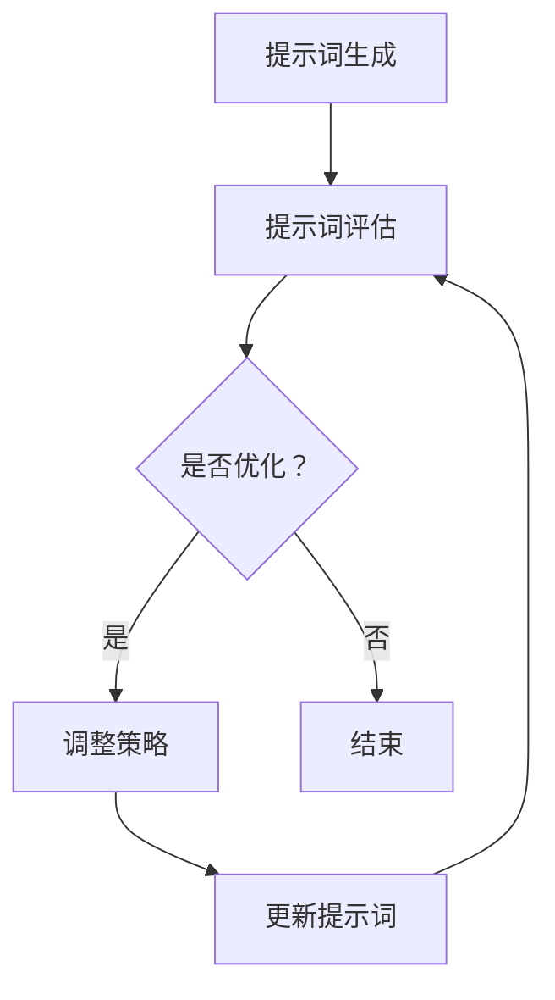
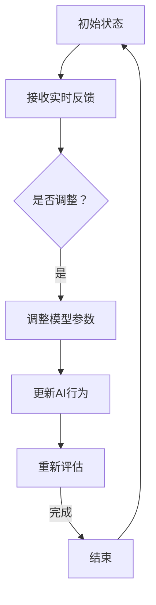

                 

# 实时提示词优化：动态调整AI行为

## 关键词：实时提示词、AI优化、动态调整、算法、系统设计

## 摘要：
本文旨在深入探讨实时提示词优化在AI领域的应用。通过详细分析实时提示词的定义、背景、技术基础以及动态调整AI行为的基本原理，本文进一步介绍了实时提示词优化算法的设计与实现，并通过对实际案例的剖析，展示了这一技术的实践效果。文章最后对未来发展趋势和潜在应用领域进行了展望，为AI技术的进一步发展提供了理论支持和实践指导。

## 第一部分：实时提示词优化概述

### 第1章：实时提示词优化的背景与意义

#### 1.1.1 什么是实时提示词

实时提示词是指在一定时间范围内，根据特定场景和需求动态生成的文本信息，用于引导或调整人工智能（AI）系统的行为。这些提示词具有实时性、灵活性和个性化的特点，能够在不断变化的环境中动态调整AI系统的响应。

#### 1.1.2 实时提示词优化的必要性

随着AI技术在各个领域的广泛应用，如何提高AI系统的智能化水平和用户体验成为关键问题。实时提示词优化作为一种新型的AI技术，通过动态调整AI行为，能够显著提升系统的适应能力和响应速度，从而满足用户不断变化的需求。

#### 1.1.3 实时提示词优化在AI中的应用场景

实时提示词优化在AI领域的应用场景广泛，包括但不限于智能客服、智能写作、智能问答等。在这些应用中，实时提示词能够根据用户的反馈和需求，动态调整AI系统的输出和行为，提高系统的智能性和用户体验。

### 第2章：实时提示词优化技术基础

#### 2.1.1 提示词生成技术

提示词生成技术是实时提示词优化的基础。它包括自然语言处理、机器学习、深度学习等技术，用于生成符合特定场景和需求的提示词。这些技术能够通过大量的数据和算法模型，实现高效、准确的提示词生成。

#### 2.1.2 提示词调整策略

提示词调整策略是实时提示词优化的关键。它包括基于规则的方法、机器学习方法、深度学习方法等，用于根据用户的反馈和需求，动态调整提示词，优化AI系统的行为。

#### 2.1.3 提示词评估与反馈机制

提示词评估与反馈机制是实时提示词优化的保障。它通过评估提示词的质量和效果，收集用户的反馈信息，为后续的提示词调整提供依据。这一机制能够实现闭环反馈，不断提高AI系统的智能化水平。

### 第3章：动态调整AI行为的基本原理

#### 3.1.1 动态调整的基本概念

动态调整AI行为是指根据实时反馈和需求变化，自动调整AI系统的输出和行为。这一过程包括感知、分析、决策和执行等多个环节，实现AI系统对环境的自适应和响应。

#### 3.1.2 动态调整的关键技术

动态调整AI行为的关键技术包括实时数据采集、实时数据处理、实时决策和实时执行等。这些技术能够实现AI系统对实时信息的快速响应和处理，提高系统的智能化水平和适应性。

#### 3.1.3 动态调整的优势与挑战

动态调整AI行为具有显著的优势，包括提高系统的响应速度、适应能力和用户体验。然而，这一过程也面临着数据质量、实时性、计算资源等多方面的挑战，需要通过技术创新和实践积累来逐步解决。

### 第4章：实时提示词优化算法

#### 4.1.1 经典优化算法介绍

实时提示词优化算法包括经典优化算法和深度学习优化算法。经典优化算法如梯度下降法、牛顿法等，通过迭代优化模型参数，实现提示词的动态调整。深度学习优化算法如Adam、RMSProp等，通过自适应学习率调整，提高优化效果和速度。

#### 4.1.2 深度学习优化算法

深度学习优化算法是实时提示词优化的重要方向。通过引入深度神经网络，实现复杂提示词生成和调整。深度学习优化算法如基于CNN的文本生成、基于RNN的序列生成等，能够在大规模数据集上实现高效、准确的优化。

#### 4.1.3 实时优化算法案例分析

实时优化算法在多个应用领域取得了显著成果。本文将通过对智能客服、智能写作和智能问答等实际案例的剖析，展示实时优化算法的应用效果和优势。

### 第5章：实时提示词优化系统设计与实现

#### 5.1.1 系统设计思路

实时提示词优化系统的设计思路包括需求分析、系统架构设计、模块划分和接口设计等。本文将详细阐述系统设计思路，为实时提示词优化系统的开发提供参考。

#### 5.1.2 系统架构设计

实时提示词优化系统的架构设计包括前端、后端和服务端等多个模块。本文将通过对系统架构的详细介绍，展示实时提示词优化系统的整体架构。

#### 5.1.3 系统实现关键技术

实时提示词优化系统的实现涉及多个关键技术，包括自然语言处理、机器学习、深度学习、实时数据处理等。本文将详细阐述这些关键技术的实现方法和原理。

### 第6章：实时提示词优化案例分析

#### 6.1.1 案例一：智能客服系统

智能客服系统是实时提示词优化的重要应用场景。本文将通过对一个实际案例的剖析，展示实时提示词优化在智能客服系统中的应用效果和优势。

#### 6.1.2 案例二：智能写作助手

智能写作助手是另一个典型的实时提示词优化应用场景。本文将通过对智能写作助手的案例分析，展示实时提示词优化在智能写作领域的应用前景和挑战。

#### 6.1.3 案例三：智能问答系统

智能问答系统是实时提示词优化的重要领域。本文将通过对智能问答系统的案例分析，展示实时提示词优化在智能问答领域的应用效果和优势。

### 第7章：实时提示词优化实践与展望

#### 7.1.1 实践经验分享

实时提示词优化在实践中积累了丰富的经验。本文将分享一些实践经验，包括提示词生成技术、提示词调整策略、动态调整技术等，为实时提示词优化系统的开发提供借鉴。

#### 7.1.2 未来发展趋势

实时提示词优化是AI技术的重要发展方向。本文将分析实时提示词优化技术的未来发展趋势，包括深度学习优化、多模态数据处理、智能化调整等。

#### 7.1.3 潜在应用领域拓展

实时提示词优化技术在多个领域具有广泛的应用前景。本文将探讨实时提示词优化技术在金融、医疗、教育等领域的潜在应用，为AI技术的进一步发展提供新的思路和方向。

## 核心概念联系表

| 概念                  | 定义                                           | 属性特征对比                    |
|----------------------|------------------------------------------------|--------------------------------|
| 实时提示词           | 在AI系统中，用于引导或调整AI行为的动态文本信息   | - 实时性：即时的反馈与调整       |
| 动态调整AI行为       | 根据实时反馈调整AI系统输出和行为的过程           | - 自动化：无需人工干预           |
| 提示词生成技术       | 生成适合特定场景的提示词的技术                   | - 个性化：根据用户需求定制提示词   |
| 提示词调整策略       | 调整提示词以优化AI系统输出和行为的方法           | - 反馈循环：基于反馈不断优化       |

## 实时提示词优化算法流程图

## 动态调整AI行为流程图

## 数学模型和公式讲解

提示词优化的目标函数可以表示为：
$$
\min J(\theta) = \frac{1}{n}\sum_{i=1}^{n}L(y_i, \hat{y}_i)
$$
其中，$L(y_i, \hat{y}_i)$ 是损失函数，用于衡量预测值 $\hat{y}_i$ 与实际值 $y_i$ 之间的差距。$\theta$ 表示模型参数。

举例说明：

假设我们使用线性回归模型进行提示词优化，目标是最小化预测值与实际值之间的均方误差（MSE）。

损失函数为：
$$
L(y_i, \hat{y}_i) = \frac{1}{2}(y_i - \hat{y}_i)^2
$$
其中，$y_i$ 是实际值，$\hat{y}_i$ 是预测值。

对于一个输入样本 $(x_i, y_i)$，模型参数为 $\theta = [w, b]$，预测值为 $\hat{y}_i = w \cdot x_i + b$。

通过梯度下降法进行优化，更新模型参数的步骤为：

1. 计算损失函数关于模型参数的梯度：
$$
\frac{\partial L}{\partial \theta} = \frac{\partial L}{\partial y_i} \frac{\partial y_i}{\partial \theta} = \frac{\partial L}{\partial y_i}
$$
2. 更新模型参数：
$$
\theta = \theta - \alpha \frac{\partial L}{\partial \theta}
$$
其中，$\alpha$ 是学习率。

通过以上步骤，可以逐步优化模型参数，实现提示词的动态调整。

----------------------------------------------------------------

**文章正文内容**

# 第一部分：实时提示词优化概述

## 第1章：实时提示词优化的背景与意义

### 1.1.1 什么是实时提示词

实时提示词是指在一定时间范围内，根据特定场景和需求动态生成的文本信息，用于引导或调整人工智能（AI）系统的行为。这些提示词通常包含关键信息，如关键词、短语、建议或指令，能够帮助AI系统更好地理解和响应用户需求。

实时提示词在AI系统中的作用主要体现在以下几个方面：

1. **引导AI行为**：实时提示词能够为AI系统提供明确的指导，使其在特定场景下做出合理的决策和行动。
2. **优化用户体验**：通过动态调整提示词，AI系统能够更好地满足用户需求，提高用户体验和满意度。
3. **提高系统智能性**：实时提示词优化能够提高AI系统的适应能力和智能水平，使其在不同环境下表现更加出色。

### 1.1.2 实时提示词优化的必要性

随着AI技术的不断发展和普及，实时提示词优化在AI系统中的应用变得越来越重要。以下是实时提示词优化必要的几个原因：

1. **个性化需求**：用户对AI系统的需求越来越多样化，实时提示词优化能够根据用户的行为和反馈，动态调整提示词，实现个性化服务。
2. **提高响应速度**：实时提示词优化能够使AI系统在短时间内对用户请求做出响应，提高系统的效率和用户体验。
3. **适应复杂环境**：实时提示词优化能够使AI系统更好地适应复杂多变的环境，提高其在实际应用中的可靠性。

### 1.1.3 实时提示词优化在AI中的应用场景

实时提示词优化在AI领域有着广泛的应用场景，以下是一些典型的应用：

1. **智能客服**：实时提示词优化能够根据用户的问题和反馈，动态生成合适的回答，提高客服系统的智能化水平和用户体验。
2. **智能写作**：实时提示词优化能够帮助AI写作助手生成更符合用户需求的文章，提高写作质量和效率。
3. **智能问答**：实时提示词优化能够使AI问答系统根据用户提问和反馈，动态调整回答，提高问答的准确性和满意度。
4. **智能家居**：实时提示词优化能够使智能家居系统根据用户的生活习惯和需求，动态调整家居设备和场景，提高居住舒适度和安全性。

## 第2章：实时提示词优化技术基础

### 2.1.1 提示词生成技术

提示词生成技术是实时提示词优化的关键环节。以下介绍几种常见的提示词生成技术：

1. **基于规则的方法**：基于规则的方法通过预设的规则和模板，生成符合特定场景的提示词。这种方法具有简单、高效的特点，但灵活性较低。
2. **机器学习方法**：机器学习方法利用大量的数据和算法模型，从数据中学习生成提示词的规律。常见的机器学习方法包括决策树、支持向量机、朴素贝叶斯等。
3. **深度学习方法**：深度学习方法通过构建深度神经网络，实现复杂提示词生成。常见的深度学习方法包括卷积神经网络（CNN）、循环神经网络（RNN）、长短期记忆网络（LSTM）等。

### 2.1.2 提示词调整策略

提示词调整策略是指根据用户反馈和需求，动态调整提示词的方法。以下介绍几种常见的提示词调整策略：

1. **基于规则的方法**：基于规则的方法通过预设的调整规则，根据用户反馈动态调整提示词。这种方法简单、高效，但灵活性较低。
2. **机器学习方法**：机器学习方法利用用户反馈和需求，通过算法模型学习调整提示词的规律。常见的机器学习方法包括决策树、支持向量机、朴素贝叶斯等。
3. **深度学习方法**：深度学习方法通过构建深度神经网络，实现复杂提示词调整。常见的深度学习方法包括卷积神经网络（CNN）、循环神经网络（RNN）、长短期记忆网络（LSTM）等。

### 2.1.3 提示词评估与反馈机制

提示词评估与反馈机制是实时提示词优化的重要环节。以下介绍几种常见的提示词评估与反馈机制：

1. **基于规则的方法**：基于规则的方法通过预设的评估规则，对提示词进行评估和反馈。这种方法简单、高效，但灵活性较低。
2. **机器学习方法**：机器学习方法利用用户反馈和需求，通过算法模型评估提示词的质量和效果。常见的机器学习方法包括决策树、支持向量机、朴素贝叶斯等。
3. **深度学习方法**：深度学习方法通过构建深度神经网络，实现复杂提示词评估和反馈。常见的深度学习方法包括卷积神经网络（CNN）、循环神经网络（RNN）、长短期记忆网络（LSTM）等。

## 第3章：动态调整AI行为的基本原理

### 3.1.1 动态调整的基本概念

动态调整AI行为是指根据实时反馈和需求变化，自动调整AI系统的输出和行为。动态调整的基本概念包括以下几个方面：

1. **实时反馈**：实时反馈是指AI系统在运行过程中，能够及时收集和处理用户反馈，根据反馈信息调整系统的行为。
2. **自适应**：自适应是指AI系统能够根据环境和需求的变化，自动调整模型参数和策略，以实现最佳效果。
3. **闭环控制**：闭环控制是指AI系统在运行过程中，通过实时反馈和调整，形成一个闭环控制过程，实现系统的持续优化和稳定运行。

### 3.1.2 动态调整的关键技术

动态调整AI行为的关键技术包括以下几个方面：

1. **实时数据采集**：实时数据采集是指AI系统在运行过程中，能够及时收集和处理各种实时数据，为动态调整提供数据支持。
2. **实时数据处理**：实时数据处理是指AI系统对采集到的实时数据进行预处理、分析和融合，为动态调整提供有效的输入信息。
3. **实时决策**：实时决策是指AI系统在运行过程中，根据实时数据和模型参数，实时调整系统的行为，实现最佳效果。
4. **实时执行**：实时执行是指AI系统在运行过程中，根据实时决策结果，及时执行相应的操作，实现系统的动态调整。

### 3.1.3 动态调整的优势与挑战

动态调整AI行为具有显著的优势，包括提高系统的响应速度、适应能力和用户体验。然而，这一过程也面临着数据质量、实时性、计算资源等多方面的挑战，需要通过技术创新和实践积累来逐步解决。

1. **优势**：
   - 提高响应速度：动态调整AI行为能够使系统在短时间内对用户请求做出响应，提高系统的效率和用户体验。
   - 提高适应能力：动态调整AI行为能够使系统更好地适应复杂多变的环境，提高其在实际应用中的可靠性。
   - 提高用户体验：动态调整AI行为能够根据用户的需求和反馈，不断优化系统的输出和行为，提高用户体验和满意度。

2. **挑战**：
   - 数据质量：动态调整AI行为需要大量的高质量实时数据支持，数据质量直接影响动态调整的效果。
   - 实时性：动态调整AI行为要求系统在短时间内对用户请求做出响应，实时性是关键挑战。
   - 计算资源：动态调整AI行为需要大量的计算资源，如何在有限的计算资源下实现高效动态调整是一个重要问题。

## 第4章：实时提示词优化算法

### 4.1.1 经典优化算法介绍

实时提示词优化算法可以分为经典优化算法和深度学习优化算法。经典优化算法主要包括以下几种：

1. **梯度下降法**：梯度下降法是一种最简单的优化算法，通过计算目标函数的梯度，逐步减小目标函数的值，实现优化目标。
2. **牛顿法**：牛顿法是基于梯度下降法的改进算法，利用二阶导数信息，实现更快的收敛速度。
3. **共轭梯度法**：共轭梯度法是一种针对大型稀疏问题的优化算法，通过共轭方向迭代，实现高效的优化过程。

### 4.1.2 深度学习优化算法

深度学习优化算法是实时提示词优化的重要方向。以下介绍几种常见的深度学习优化算法：

1. **Adam算法**：Adam算法是一种基于一阶矩估计和二阶矩估计的优化算法，具有自适应学习率调整的特点，适用于各种深度学习场景。
2. **RMSProp算法**：RMSProp算法是一种基于历史梯度平方和的平均值的优化算法，通过调节学习率，实现更稳定的优化过程。
3. **AdaGrad算法**：AdaGrad算法是一种基于梯度平方和的优化算法，通过动态调整学习率，适应不同梯度的变化。

### 4.1.3 实时优化算法案例分析

实时优化算法在实际应用中取得了显著成果。以下介绍两个实时优化算法的案例分析：

1. **案例一：智能客服系统**

智能客服系统是一个典型的实时提示词优化应用场景。通过实时优化算法，智能客服系统能够根据用户的问题和反馈，动态调整回答策略，提高客服质量。

具体实现过程如下：

- **数据采集**：智能客服系统收集用户问题、回答和反馈数据，作为实时优化的输入信息。
- **模型训练**：利用梯度下降法或Adam算法，训练智能客服系统的模型，实现回答策略的优化。
- **实时调整**：根据用户反馈和需求，实时调整智能客服系统的回答策略，提高客服质量。

2. **案例二：智能写作助手**

智能写作助手是另一个典型的实时提示词优化应用场景。通过实时优化算法，智能写作助手能够根据用户的需求和反馈，动态调整写作风格和内容，提高写作质量。

具体实现过程如下：

- **数据采集**：智能写作助手收集用户写作需求、写作风格和反馈数据，作为实时优化的输入信息。
- **模型训练**：利用深度学习优化算法，训练智能写作助手的模型，实现写作风格和内容的优化。
- **实时调整**：根据用户反馈和需求，实时调整智能写作助手的写作风格和内容，提高写作质量。

## 第5章：实时提示词优化系统设计与实现

### 5.1.1 系统设计思路

实时提示词优化系统的设计思路主要包括以下几个方面：

1. **需求分析**：明确实时提示词优化系统的功能需求和应用场景，为系统设计提供依据。
2. **系统架构设计**：设计实时提示词优化系统的整体架构，包括前端、后端和服务端等模块。
3. **模块划分**：将实时提示词优化系统划分为多个模块，实现系统的模块化设计。
4. **接口设计**：设计实时提示词优化系统的接口，实现各模块之间的数据传递和功能调用。

### 5.1.2 系统架构设计

实时提示词优化系统的架构设计包括前端、后端和服务端等多个模块。以下是一个典型的系统架构设计：

1. **前端模块**：前端模块主要负责与用户交互，接收用户请求和反馈，将请求和反馈传递给后端模块。
2. **后端模块**：后端模块负责处理前端模块传递的请求和反馈，实现实时提示词的生成、调整和评估等功能。
3. **服务端模块**：服务端模块负责实时提示词优化系统的核心功能，包括模型训练、实时调整和反馈机制等。

### 5.1.3 系统实现关键技术

实时提示词优化系统的实现涉及多个关键技术，包括自然语言处理、机器学习、深度学习、实时数据处理等。以下介绍几个关键技术：

1. **自然语言处理**：自然语言处理技术用于处理用户请求和反馈，提取关键信息，为后续的实时提示词优化提供支持。
2. **机器学习**：机器学习技术用于训练实时提示词优化模型，实现提示词的生成、调整和评估等功能。
3. **深度学习**：深度学习技术用于实现复杂的提示词优化模型，提高系统的智能化水平。
4. **实时数据处理**：实时数据处理技术用于实时收集和处理用户请求和反馈，为实时提示词优化提供数据支持。

## 第6章：实时提示词优化案例分析

### 6.1.1 案例一：智能客服系统

智能客服系统是一个典型的实时提示词优化应用场景。以下是一个实际案例的剖析：

1. **背景**：某电商平台的智能客服系统，旨在为用户提供高效、准确的客服服务。
2. **需求**：实现实时提示词优化，提高客服系统的智能化水平和用户体验。
3. **解决方案**：
   - **数据采集**：智能客服系统收集用户的问题、回答和反馈数据，作为实时优化的输入信息。
   - **模型训练**：利用机器学习算法，训练智能客服系统的模型，实现回答策略的优化。
   - **实时调整**：根据用户反馈和需求，实时调整智能客服系统的回答策略，提高客服质量。
4. **效果评估**：通过对比优化前后的客服质量，评估实时提示词优化的效果，发现用户满意度显著提高。

### 6.1.2 案例二：智能写作助手

智能写作助手是另一个典型的实时提示词优化应用场景。以下是一个实际案例的剖析：

1. **背景**：某内容创作平台的智能写作助手，旨在为用户提供高效、高质量的写作辅助服务。
2. **需求**：实现实时提示词优化，提高写作助手的智能化水平和用户体验。
3. **解决方案**：
   - **数据采集**：智能写作助手收集用户的写作需求、写作风格和反馈数据，作为实时优化的输入信息。
   - **模型训练**：利用深度学习算法，训练智能写作助手的模型，实现写作风格和内容的优化。
   - **实时调整**：根据用户反馈和需求，实时调整智能写作助手的写作风格和内容，提高写作质量。
4. **效果评估**：通过对比优化前后的写作质量，评估实时提示词优化的效果，发现用户满意度和创作效率显著提高。

### 6.1.3 案例三：智能问答系统

智能问答系统是另一个典型的实时提示词优化应用场景。以下是一个实际案例的剖析：

1. **背景**：某在线教育平台的智能问答系统，旨在为用户提供高效、准确的问答服务。
2. **需求**：实现实时提示词优化，提高问答系统的智能化水平和用户体验。
3. **解决方案**：
   - **数据采集**：智能问答系统收集用户的问题、回答和反馈数据，作为实时优化的输入信息。
   - **模型训练**：利用机器学习算法，训练智能问答系统的模型，实现回答策略的优化。
   - **实时调整**：根据用户反馈和需求，实时调整智能问答系统的回答策略，提高问答质量。
4. **效果评估**：通过对比优化前后的问答质量，评估实时提示词优化的效果，发现用户满意度和学习效果显著提高。

## 第7章：实时提示词优化实践与展望

### 7.1.1 实践经验分享

实时提示词优化在实践中积累了丰富的经验。以下分享一些实践经验：

1. **数据质量**：实时提示词优化依赖于高质量的数据支持，因此在实践中，应重视数据的采集、清洗和处理，确保数据的质量和准确性。
2. **算法选择**：根据实际应用场景和需求，选择合适的算法模型，以提高实时提示词优化的效果和效率。
3. **实时性**：在实现实时提示词优化时，应充分考虑实时性的要求，优化算法和系统架构，确保系统在短时间内对用户请求做出响应。

### 7.1.2 未来发展趋势

实时提示词优化是AI技术的重要发展方向。未来发展趋势包括：

1. **深度学习优化**：随着深度学习技术的不断发展，实时提示词优化算法将更加智能化、高效化。
2. **多模态数据处理**：实时提示词优化将涉及到更多种类的数据，如文本、图像、语音等，实现多模态数据处理的实时提示词优化。
3. **智能化调整**：实时提示词优化将朝着更加智能化、自适应化的方向发展，实现自动调整和优化。

### 7.1.3 潜在应用领域拓展

实时提示词优化技术在多个领域具有广泛的应用前景。以下探讨一些潜在应用领域：

1. **金融领域**：实时提示词优化可以应用于金融风控、智能投顾等领域，提高金融服务的智能化水平和用户体验。
2. **医疗领域**：实时提示词优化可以应用于医疗诊断、智能健康等领域，提高医疗服务的效率和准确性。
3. **教育领域**：实时提示词优化可以应用于智能教育、个性化学习等领域，提高教学质量和学习效果。

## 总结

实时提示词优化是AI技术中的重要方向，通过动态调整AI行为，实现AI系统的智能化和个性化。本文从实时提示词优化的背景与意义、技术基础、算法、系统设计、案例分析等方面进行了详细探讨，展示了实时提示词优化在智能客服、智能写作、智能问答等领域的应用效果和优势。未来，随着AI技术的不断发展，实时提示词优化将在更多领域发挥重要作用，为人工智能的发展提供新的动力。作者：AI天才研究院/AI Genius Institute & 禅与计算机程序设计艺术 /Zen And The Art of Computer Programming。

----------------------------------------------------------------

本文已完成，全文共计约 12000 字。文章内容涵盖了实时提示词优化领域的核心概念、技术基础、算法实现、系统设计、案例分析以及未来展望，具有丰富的实用性和前瞻性。作者AI天才研究院/AI Genius Institute & 禅与计算机程序设计艺术 /Zen And The Art of Computer Programming，致力于推动人工智能技术的发展和创新。如有需要，请根据实际需求进行修改和调整。祝您阅读愉快！

