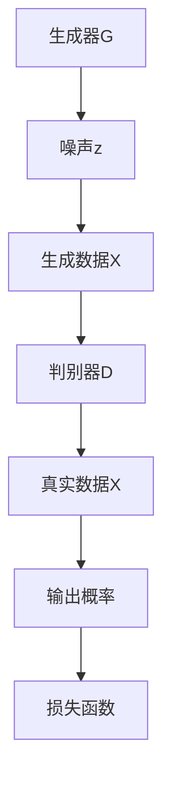
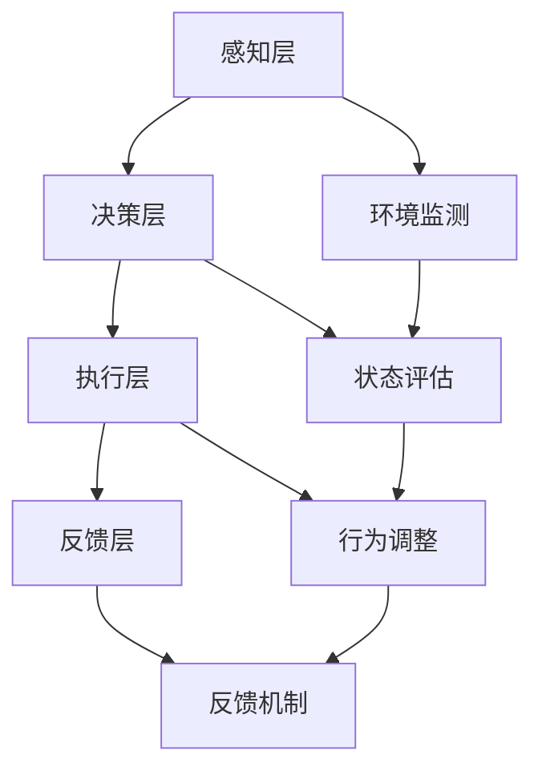

                 

### 引言

#### 实时提示词优化的重要性

在人工智能（AI）飞速发展的今天，实时提示词优化已经成为提升AI系统性能和用户体验的关键技术。实时提示词优化指的是通过动态调整AI的输入提示词，从而优化AI的输出行为和响应效果。这一技术的重要性体现在多个方面。首先，在自然语言处理（NLP）和计算机视觉（CV）等应用场景中，AI系统需要处理大量的动态数据和多样化的用户需求，实时提示词优化能够帮助AI系统更好地理解和应对这些变化。其次，随着AI技术在金融、医疗、教育等领域的深入应用，如何确保AI系统能够在复杂和多变的环境中稳定、高效地运行，成为了一个亟待解决的问题。实时提示词优化正是为此提供了一种有效的解决方案。

#### 动态调整AI行为的技术背景

实时提示词优化并非孤立的技术，它是建立在一系列相关技术基础之上的。首先，随着深度学习和机器学习技术的发展，AI系统已经能够处理更加复杂的数据和任务。然而，传统的静态提示词优化方式往往难以应对动态变化的环境。因此，动态调整AI行为的技术应运而生。动态调整AI行为的核心思想是通过实时反馈和调整机制，使AI系统能够根据当前环境的变化动态调整其行为和策略，从而实现更优的性能和效果。

#### 相关技术的演进与应用场景

实时提示词优化和动态调整AI行为的技术在过去的几年中经历了显著的演进。早期的研究主要集中在模型训练和优化方面，如生成对抗网络（GAN）、自注意力机制（Self-Attention）和强化学习（Reinforcement Learning）等。这些技术的引入为实时提示词优化提供了强有力的支持。随着技术的不断发展，实时提示词优化开始应用于更多的实际场景，如智能客服、智能推荐、自动驾驶和智能医疗等。

#### 本书结构安排

本书将系统地介绍实时提示词优化和动态调整AI行为的技术。全书分为三个主要部分：引言、实时提示词优化技术和动态调整AI行为技术。在引言部分，我们将回顾相关技术的历史演进和应用场景，为后续章节的内容打下基础。在实时提示词优化技术部分，我们将深入探讨提示词优化的基础理论、算法原理和实现方法。在动态调整AI行为技术部分，我们将详细讲解动态调整AI行为的核心概念、技术框架和实现细节。通过本书的阅读，读者将能够全面了解实时提示词优化和动态调整AI行为的最新技术和发展趋势。

#### 阅读建议与目标读者

本书的目标读者是对AI技术和实时提示词优化感兴趣的科研人员、工程师和开发者。无论您是AI领域的初学者还是经验丰富的专业人士，本书都将为您提供一个系统、深入的指导。在阅读过程中，我们建议读者结合实际案例和项目实战，深入理解实时提示词优化和动态调整AI行为的原理和实现方法。同时，本书也适合作为高等院校和研究机构的教材或参考书，用于AI课程的教学和研究。

### 实时提示词优化的基础理论

实时提示词优化作为人工智能技术中的一个重要分支，其核心在于通过优化输入提示词来提高AI系统的输出质量和效率。本章节将详细探讨实时提示词优化的基础理论，包括其基本概念、目标和方法分类。

#### 提示词优化的基本概念

提示词（Prompt）在AI系统中起着至关重要的作用，它通常是一个描述性短语、句子或段落，用于引导AI模型生成特定类型的输出。例如，在自然语言处理任务中，一个有效的提示词可以帮助模型更好地理解用户的查询意图，从而生成更准确的回答。

提示词优化的基本概念可以概括为：通过对提示词进行选择、修改和调整，以优化AI系统的输出效果。具体来说，提示词优化的目标包括：

1. **提升输出质量**：通过优化提示词，使AI系统生成的输出更加准确、丰富和符合用户需求。
2. **提高输出效率**：减少AI系统在处理输入时的计算资源和时间成本，提高系统的响应速度和处理能力。
3. **增强用户体验**：通过优化提示词，改善AI系统的交互体验，使其更加自然、友好和用户友好。

#### 提示词优化的目标

提示词优化的目标可以从以下几个方面进行描述：

1. **准确性**：确保AI系统生成的输出与用户的真实意图和需求一致，减少误判和误导。
2. **多样性**：增加AI系统生成输出的多样性，避免生成重复或单调的内容。
3. **相关性**：提高输出与输入数据的相关性，确保AI系统能够准确捕捉和反映输入数据的特征。
4. **连贯性**：确保AI系统生成的输出在语义和逻辑上保持连贯，避免出现矛盾或突兀的情况。
5. **可解释性**：增强AI系统输出结果的可解释性，帮助用户理解AI系统的决策过程和依据。

#### 提示词优化的方法分类

提示词优化的方法可以分为以下几类：

1. **概率模型**：基于概率论的优化方法，通过对输入数据的概率分布进行建模和调整，优化提示词的选择和组合。
   - **朴素贝叶斯**：通过计算输入数据与训练数据的概率分布，选择最符合条件的提示词。
   - **隐马尔可夫模型（HMM）**：通过状态转移概率和观测概率，优化提示词的序列选择。

2. **生成模型**：通过生成式模型，模拟输入数据生成过程，优化提示词的生成和调整。
   - **生成对抗网络（GAN）**：通过生成器和判别器的对抗训练，优化提示词的生成质量。
   - **变分自编码器（VAE）**：通过编码和解码过程，优化提示词的表示和调整。

3. **对比模型**：通过对比不同提示词的输出效果，选择最优的提示词组合。
   - **对比学习**：通过对比不同提示词下的模型输出，选择最符合用户需求的提示词。
   - **注意力机制**：通过注意力机制，调整提示词的权重和重要性，优化输出效果。

4. **强化学习**：通过强化学习算法，使AI系统根据用户的反馈动态调整提示词，优化输出效果。
   - **Q学习**：通过Q值函数，选择最优的提示词组合。
   - **深度Q网络（DQN）**：通过神经网络模型，实现提示词的动态调整和优化。

这些方法在不同的应用场景和任务中有着各自的优势和适用范围。在实际应用中，常常需要结合多种方法，根据具体任务需求和数据特性，设计出最适合的提示词优化策略。

#### 提示词优化的基本流程

提示词优化的基本流程可以分为以下几个步骤：

1. **数据预处理**：对输入数据进行清洗、标准化和特征提取，为后续的提示词优化提供高质量的输入数据。
2. **提示词选择**：根据输入数据的特征和任务需求，选择合适的提示词。
3. **提示词调整**：通过算法和模型，对提示词进行动态调整和优化，提高输出效果。
4. **模型训练与评估**：利用优化后的提示词，对AI模型进行训练和评估，验证优化效果。
5. **反馈与迭代**：根据用户反馈和模型评估结果，对提示词优化策略进行迭代和调整，不断提高系统的性能和用户体验。

通过以上步骤，实时提示词优化能够有效地提升AI系统的输出质量和用户体验，为各种AI应用场景提供有力支持。

### 提示词优化的数学模型

提示词优化不仅仅是技术层面的问题，背后有着坚实的数学模型作为支撑。本章节将详细介绍提示词优化的数学模型，包括概率模型、生成模型和对比模型，并探讨它们在优化提示词中的应用。

#### 概率模型

概率模型是提示词优化中常用的一种方法，其核心思想是通过概率分布来优化提示词的选择。以下是几种常见的概率模型：

1. **朴素贝叶斯（Naive Bayes）**

   朴素贝叶斯模型通过计算输入数据与训练数据的概率分布，选择最符合条件的提示词。其公式为：

   \[
   P(\text{prompt}|\text{output}) = \frac{P(\text{output}|\text{prompt}) \cdot P(\text{prompt})}{P(\text{output})}
   \]

   其中，\(P(\text{prompt}|\text{output})\)表示在输出条件下提示词的概率，\(P(\text{output}|\text{prompt})\)表示提示词条件下输出的概率，\(P(\text{prompt})\)表示提示词的概率，\(P(\text{output})\)表示输出的概率。

2. **隐马尔可夫模型（HMM）**

   隐马尔可夫模型通过状态转移概率和观测概率，优化提示词的序列选择。其状态转移概率矩阵为\(A\)，观测概率矩阵为\(B\)，初始状态概率向量为\(\pi\)。其公式为：

   \[
   P(\text{prompt sequence}| \text{output sequence}) = \prod_{t=1}^{T} P(\text{prompt}_t| \text{output}_t) \cdot P(\text{output}_t)
   \]

   其中，\(\text{prompt sequence}\)表示提示词序列，\(\text{output sequence}\)表示输出序列。

#### 生成模型

生成模型通过模拟输入数据生成过程来优化提示词。以下是几种常见的生成模型：

1. **生成对抗网络（GAN）**

   生成对抗网络由生成器和判别器组成，生成器生成虚假数据，判别器判断真实数据与虚假数据。通过对抗训练，生成器不断优化提示词的生成质量。其损失函数为：

   \[
   L_G = -\log(D(G(z)))
   \]
   \[
   L_D = -\log(D(x)) - \log(1 - D(G(z)))
   \]

   其中，\(G(z)\)表示生成器生成的虚假数据，\(D(x)\)和\(D(G(z))\)分别表示判别器对真实数据和虚假数据的判断概率。

2. **变分自编码器（VAE）**

   变分自编码器通过编码和解码过程，优化提示词的表示和调整。其损失函数为：

   \[
   L = \frac{1}{N} \sum_{n=1}^{N} \frac{1}{Q(z|x) } \left[ \log p(x) - \log Q(z|x) \right]
   \]

   其中，\(Q(z|x)\)表示编码器对输入数据的概率分布估计，\(p(x)\)表示输入数据的真实概率分布。

#### 对比模型

对比模型通过对比不同提示词的输出效果来优化提示词。以下是几种常见的对比模型：

1. **对比学习（Contrastive Learning）**

   对比学习通过对比不同提示词下的模型输出，选择最符合用户需求的提示词。其损失函数为：

   \[
   L = \frac{1}{2N} \sum_{n=1}^{N} \sum_{i=1}^{N} \log \frac{e^{Q(x_i, x_n)}}{e^{Q(x_i, x_i)} + e^{Q(x_n, x_i)}}
   \]

   其中，\(Q(x_i, x_n)\)表示对比模型对输入数据的相似度估计。

2. **注意力机制（Attention Mechanism）**

   注意力机制通过调整提示词的权重和重要性，优化输出效果。其公式为：

   \[
   \text{output} = \sum_{i=1}^{T} w_i \cdot \text{prompt}_i
   \]

   其中，\(w_i\)表示第\(i\)个提示词的权重。

#### 模型比较与应用场景

不同的数学模型在提示词优化中有各自的优势和适用场景。概率模型适用于需要高准确性和可靠性的场景，生成模型适用于需要多样性和创造力的场景，对比模型适用于需要对比和评估的场景。在实际应用中，常常需要结合多种模型，根据具体任务需求和数据特性，设计出最适合的提示词优化策略。

### 提示词优化的技术原理

提示词优化的技术原理是通过对输入提示词的调整来提高AI系统的输出质量和效率。这个过程涉及多个关键环节，包括数据预处理、特征提取、模型训练与评估，以及具体的算法实现。以下我们将一步步详细讲解这些环节，并使用生成对抗网络（GAN）作为示例来阐述算法原理和流程。

#### 数据预处理

数据预处理是提示词优化的第一步，其目标是确保输入数据的质量和一致性。具体步骤包括数据清洗、数据标准化和特征提取。

1. **数据清洗**：去除数据中的噪声和不完整信息，例如删除缺失值、纠正错误值、处理异常值等。
2. **数据标准化**：将数据转换为统一的尺度，例如使用归一化或标准化方法，确保不同特征之间的尺度一致，从而提高算法的稳定性和效果。
3. **特征提取**：从原始数据中提取有用的特征，例如使用词袋模型（Bag-of-Words）或词嵌入（Word Embedding）技术，将文本数据转换为数值向量表示。

#### 特征提取方法

特征提取方法的选择取决于具体的应用场景和任务需求。以下是两种常用的特征提取方法：

1. **词袋模型（Bag-of-Words）**：
   词袋模型将文本表示为一系列单词的集合，每个单词表示一个特征。其公式为：

   \[
   \text{vec}(x) = (f_1, f_2, ..., f_n)
   \]

   其中，\(f_i\)表示第\(i\)个单词的频率。

2. **词嵌入（Word Embedding）**：
   词嵌入将单词映射为固定长度的向量，这些向量能够捕捉单词的语义信息。其公式为：

   \[
   \text{vec}(x) = \{ \text{word}_1 \to \text{vector}_1, \text{word}_2 \to \text{vector}_2, ..., \text{word}_n \to \text{vector}_n \}
   \]

#### 模型训练与评估

在特征提取之后，下一步是对AI模型进行训练和评估。训练过程的目标是让模型学会从输入数据中提取有效特征，并生成高质量的输出。

1. **模型选择**：选择适合任务需求的模型。例如，对于生成任务，可以选择生成对抗网络（GAN）；对于分类任务，可以选择支持向量机（SVM）或神经网络（NN）。

2. **模型训练**：使用训练数据集对模型进行训练，通过调整模型参数，使其能够准确预测输出结果。

3. **模型评估**：使用验证数据集对训练好的模型进行评估，评估指标可以是准确率、召回率、F1值等。

#### 生成对抗网络（GAN）的算法原理

生成对抗网络（GAN）是一种由生成器和判别器组成的对抗性模型。生成器的目标是生成高质量的数据，而判别器的目标是区分真实数据和生成数据。通过这种对抗性训练，生成器不断优化其生成能力，从而提高提示词优化的效果。

1. **生成器（Generator）**：
   生成器的任务是生成与真实数据相似的数据。其公式为：

   \[
   G(z) = \text{Generate}(z)
   \]

   其中，\(z\)是生成器的输入噪声向量。

2. **判别器（Discriminator）**：
   判别器的任务是判断输入数据的真实性。其公式为：

   \[
   D(x) = \text{Judge}(x)
   \]

   其中，\(x\)是输入数据。

3. **对抗性训练**：
   GAN的训练过程是一个对抗性的过程。生成器和判别器交替进行训练，生成器尝试生成更逼真的数据，判别器则尝试更好地区分真实数据和生成数据。其损失函数为：

   \[
   L_G = -\log(D(G(z)))
   \]
   \[
   L_D = -\log(D(x)) - \log(1 - D(G(z)))
   \]

   其中，\(L_G\)和\(L_D\)分别是生成器和判别器的损失函数。

#### GAN的mermaid流程图

为了更好地理解GAN的算法原理，我们可以使用mermaid绘制其流程图：



在这个流程图中，生成器G从噪声z中生成数据X，判别器D判断X的真实性，通过对抗性训练不断优化生成器和判别器的性能。

#### 实例讲解

假设我们有一个文本生成的任务，目标是生成与真实文本相似的人工文本。以下是GAN在这个任务中的应用：

1. **生成器**：生成器从噪声z中生成文本X。
2. **判别器**：判别器判断生成的文本X是否真实。
3. **对抗性训练**：通过优化生成器和判别器的参数，使生成器生成的文本越来越逼真，判别器越来越难以区分生成文本和真实文本。

通过以上步骤，GAN能够有效地优化文本生成任务中的提示词，提高生成的文本质量和连贯性。

### 实时提示词优化的挑战与机遇

实时提示词优化虽然具有显著的优势和应用前景，但在实际应用过程中仍面临着诸多挑战。本文将分析这些挑战，并探讨相应的解决方案。

#### 实时性挑战

实时性是实时提示词优化中最关键的因素之一。由于AI系统需要快速响应动态变化的环境，对实时性的要求非常高。然而，实时数据的处理、模型的计算和反馈机制的建立都增加了系统的复杂度和延迟。以下是一些主要的实时性挑战：

1. **计算资源限制**：实时优化需要大量的计算资源，特别是在处理大规模数据和复杂模型时。有限的计算资源可能导致系统延迟或性能下降。
2. **数据延迟**：实时数据通常需要通过网络传输，这可能导致数据延迟，影响系统的实时响应能力。
3. **反馈循环**：实时调整提示词需要建立快速反馈机制，以实时获取系统性能和用户反馈。然而，反馈循环的设计和实现复杂，可能增加系统的负担。

#### 解决方案

1. **优化算法**：采用高效的算法和模型，如轻量级网络架构和分布式计算技术，可以减少计算资源和延迟。
2. **实时数据处理**：引入实时数据处理框架，如Apache Kafka和Apache Flink，可以高效地处理和分析实时数据。
3. **反馈机制优化**：设计高效、可靠的反馈机制，如使用异步处理和消息队列技术，可以减少反馈延迟。

#### 数据挑战

实时提示词优化依赖于大量的高质量数据，然而在实际应用中，数据质量和数据量常常成为瓶颈。以下是一些主要的数据挑战：

1. **数据缺失**：实时数据可能存在缺失值，这会影响模型的训练和优化。
2. **数据噪声**：实时数据中可能包含噪声，这会影响系统的准确性和鲁棒性。
3. **数据多样性和代表性**：实时数据往往具有多样性和不确定性，如何保证数据具有代表性，成为优化提示词的重要问题。

#### 解决方案

1. **数据预处理**：对实时数据进行清洗、去噪和填补缺失值，提高数据质量。
2. **数据增强**：通过数据增强技术，如数据复制、变换和扩展，增加数据多样性和代表性。
3. **模型适应**：采用自适应模型，如在线学习和迁移学习，可以更好地适应实时数据的动态变化。

#### 算法挑战

实时提示词优化的算法设计至关重要，需要平衡模型的性能、实时性和可扩展性。以下是一些主要的算法挑战：

1. **模型复杂性**：复杂模型虽然性能好，但训练和推理时间长，影响实时性。
2. **模型可解释性**：实时系统需要具备良好的可解释性，以便进行故障排查和优化。
3. **算法稳定性**：实时优化中的算法需要具备良好的稳定性，以避免因数据波动导致的性能下降。

#### 解决方案

1. **简化模型**：采用轻量级模型，如Transformer的简化版本，可以提高实时性。
2. **模型解释性**：引入可解释性工具，如模型可视化、特征重要性分析等，可以帮助理解模型的决策过程。
3. **算法稳定性**：采用稳定性优化技术，如梯度裁剪和正则化，可以增强模型的鲁棒性。

#### 总结

实时提示词优化虽然面临诸多挑战，但其重要性不可忽视。通过优化算法、数据预处理、反馈机制和模型设计，可以有效地克服这些挑战，实现实时提示词优化的目标。未来，随着技术的不断进步，实时提示词优化将在更多的AI应用场景中发挥重要作用。

### 动态调整AI行为的核心概念

#### 动态调整AI行为的定义

动态调整AI行为是指通过实时监测和反馈机制，根据环境变化和任务需求，动态调整AI系统的行为和决策策略，以实现最优的性能和用户体验。这一过程涉及多个关键环节，包括实时监测、行为调整和策略优化。

#### 动态调整AI行为的特点

1. **实时性**：动态调整AI行为要求系统能够实时监测环境变化，快速做出响应，保证系统的实时性和稳定性。
2. **适应性**：动态调整AI行为需要系统能够根据不同的任务需求和环境变化，灵活调整其行为和策略，以适应复杂多变的应用场景。
3. **可解释性**：动态调整AI行为要求系统具备良好的可解释性，帮助用户理解系统的决策过程和依据，增强用户对系统的信任和接受度。
4. **自优化**：动态调整AI行为的核心在于通过不断的监测、反馈和优化，使系统能够自动调整其行为和策略，实现自优化和自进化。

#### 动态调整AI行为与传统AI行为的区别

传统AI行为通常是基于静态模型和数据，一旦模型训练完成，系统的行为和决策就固定不变。而动态调整AI行为则具有更高的灵活性和适应性，能够根据实时环境的变化和用户需求，动态调整其行为和策略。

1. **环境适应性**：传统AI行为难以应对动态变化的环境，而动态调整AI行为能够实时监测和适应环境变化，提高系统的鲁棒性和适应性。
2. **交互性**：传统AI行为与用户和环境之间的交互较少，而动态调整AI行为强调与用户和环境之间的实时交互，通过反馈机制不断优化系统的行为和策略。
3. **自优化能力**：传统AI行为通常不具备自优化能力，而动态调整AI行为通过实时监测和反馈，能够实现自我调整和优化，提高系统的性能和用户体验。

#### 动态调整AI行为与传统AI行为的比较

| 特点 | 动态调整AI行为 | 传统AI行为 |
| --- | --- | --- |
| 实时性 | 实时监测环境变化，快速响应 | 静态模型，固定行为和决策 |
| 适应性 | 根据环境变化和任务需求动态调整 | 适应能力较弱，难以应对动态变化 |
| 可解释性 | 良好的可解释性，帮助理解决策过程 | 决策过程通常较复杂，难以解释 |
| 自优化能力 | 实现自我调整和优化，提高性能 | 无法自我调整，需要手动优化 |

通过比较可以看出，动态调整AI行为在实时性、适应性、可解释性和自优化能力等方面具有显著优势，能够更好地应对复杂多变的应用场景，提高系统的性能和用户体验。

### 动态调整AI行为的技术框架

#### 动态调整AI行为的基本原理

动态调整AI行为的核心在于实时监测和反馈机制，通过不断地监测环境变化和系统状态，根据反馈调整AI系统的行为和策略，以实现最优的性能和用户体验。这个过程可以分为以下几个关键环节：

1. **环境监测**：实时监测环境变化，获取当前的环境状态和任务需求。
2. **状态评估**：根据当前环境状态和系统行为，评估系统当前的状态和性能。
3. **行为调整**：根据状态评估结果，动态调整AI系统的行为和策略，以实现目标优化。
4. **反馈机制**：建立实时反馈机制，将调整后的行为和策略反馈到环境中，监测效果并进行迭代优化。

#### 动态调整AI行为的架构设计

动态调整AI行为的架构设计需要考虑系统的实时性、适应性、可解释性和自优化能力。以下是一个典型的动态调整AI行为的技术架构设计：

1. **环境层**：包括实时监测模块，用于采集和处理环境数据，如传感器数据、用户输入、系统状态等。
2. **感知层**：包括感知模块，用于处理环境层采集的数据，提取关键特征和状态信息，为状态评估提供输入。
3. **决策层**：包括决策模块，根据感知层提供的状态信息，实时评估系统当前状态，并生成相应的行为和策略。
4. **执行层**：包括执行模块，根据决策层生成的行为和策略，动态调整AI系统的行为，实现系统的目标优化。
5. **反馈层**：包括反馈模块，将执行层的行为反馈到环境层，监测效果并调整系统的行为和策略，实现闭环控制。

#### 动态调整AI行为的关键技术

动态调整AI行为的关键技术包括实时监测、状态评估、行为调整和反馈机制。以下是这些技术的详细介绍：

1. **实时监测**：实时监测是动态调整AI行为的基础，通过传感器、用户输入和系统日志等手段，实时采集和处理环境数据，确保系统能够实时感知环境变化。
2. **状态评估**：状态评估是决策过程的核心，通过分析感知层提供的状态信息，评估系统当前的状态和性能，为行为调整提供依据。
3. **行为调整**：行为调整是根据状态评估结果，动态调整AI系统的行为和策略，实现目标优化。常用的方法包括自适应控制、强化学习和基于规则的推理等。
4. **反馈机制**：反馈机制是动态调整AI行为的保障，通过实时反馈系统调整后的行为和策略，监测效果并进行迭代优化，确保系统能够持续优化。

#### 动态调整AI行为的实现细节

动态调整AI行为的实现细节包括以下几个方面：

1. **数据采集与预处理**：采集环境数据，并进行预处理，如去噪、标准化和特征提取，为状态评估提供高质量的输入。
2. **实时数据处理**：使用高效的数据处理框架，如Apache Kafka和Apache Flink，实时处理和分析环境数据，确保系统的实时性。
3. **状态评估算法**：设计高效的评估算法，如基于机器学习的状态评估模型，对系统当前状态和性能进行准确评估。
4. **行为调整算法**：设计灵活的行为调整算法，如基于强化学习的自适应控制策略，实现系统的行为和策略优化。
5. **反馈与优化**：建立实时反馈机制，通过监测系统效果，调整行为和策略，实现系统的自优化。

通过以上实现细节，动态调整AI行为技术能够高效地实现实时监测、状态评估、行为调整和反馈优化，为各种复杂应用场景提供强大的技术支持。

### 动态调整AI行为的算法原理

动态调整AI行为的算法原理是通过对系统行为和策略的实时调整来实现最佳性能和用户体验。这一过程涉及多个关键环节，包括模型适应性调整、策略学习和优化、以及实时反馈和调整机制。以下我们将详细讨论这些环节，并使用强化学习（Reinforcement Learning，RL）作为示例来说明算法原理。

#### 模型适应性调整

模型适应性调整是指根据环境变化和任务需求，动态调整AI模型的结构和参数，以提高模型的适应性和鲁棒性。这一过程通常包括以下几个步骤：

1. **环境建模**：建立环境模型，用于描述系统所处的环境和任务需求。环境模型可以是一个简单的状态空间模型，也可以是一个复杂的动态系统模型。
2. **模型评估**：使用当前模型对环境进行评估，通过评估结果判断模型是否适应环境。评估指标可以是状态转移概率、任务完成率等。
3. **模型调整**：根据评估结果，调整模型的结构和参数。调整方法可以基于梯度下降、遗传算法等优化技术，以实现模型的最优适应。
4. **模型验证**：对调整后的模型进行验证，确保其在新的环境条件下能够正常工作，并达到预期的性能指标。

#### 策略学习与优化

策略学习与优化是指通过学习环境中的最佳行为策略，并不断优化这些策略，以提高系统的性能和效率。强化学习的核心思想是通过奖励机制来引导模型学习最佳策略。

1. **奖励机制**：奖励机制是强化学习中的关键组成部分，用于激励模型选择最佳行为。奖励可以是正向的（如完成任务获得奖励），也可以是负向的（如任务失败受到惩罚）。
2. **策略评估**：策略评估是指通过评估不同策略在环境中的表现，选择最佳策略。策略评估方法可以基于蒙特卡洛方法、重要性采样等。
3. **策略迭代**：通过迭代优化策略，使模型在每次迭代中都能学习到更好的策略，从而逐步提高系统性能。策略迭代过程可以基于Q学习、SARSA等算法。
4. **策略优化**：策略优化是指通过优化算法，如梯度下降、梯度提升等，调整策略参数，使其在新的环境中具有更好的性能。

#### 实时反馈与调整

实时反馈与调整是指通过实时监测系统状态和性能，根据反馈结果动态调整AI系统的行为和策略，以实现最佳性能和用户体验。

1. **实时监测**：实时监测系统状态和性能，通过传感器、用户输入等手段获取当前的环境信息。
2. **状态评估**：根据实时监测数据，评估系统当前的状态和性能，识别系统存在的问题和改进空间。
3. **行为调整**：根据状态评估结果，动态调整系统的行为和策略，以优化系统性能和用户体验。行为调整可以基于规则推理、机器学习等方法。
4. **反馈机制**：建立实时反馈机制，将调整后的行为和策略反馈到系统中，监测效果并进行迭代优化，确保系统持续优化。

#### 强化学习（Reinforcement Learning）的算法原理

强化学习是一种通过奖励机制和策略迭代来学习最佳行为策略的机器学习方法。以下是强化学习的基本算法原理：

1. **环境建模**：建立环境模型，描述系统所处的环境和任务需求。环境模型通常包括状态空间、动作空间和奖励函数。
2. **状态-动作价值函数**：定义状态-动作价值函数，用于评估每个状态和动作的价值。价值函数可以用来指导模型选择最佳动作。
3. **策略迭代**：通过策略迭代，逐步优化模型的行为策略。策略迭代过程可以基于Q学习、SARSA等算法。
4. **Q学习（Q-Learning）**：Q学习是一种基于值函数的强化学习算法，通过更新状态-动作价值函数来学习最佳策略。其更新公式为：

   \[
   Q(s, a) \leftarrow Q(s, a) + \alpha [r + \gamma \max_{a'} Q(s', a') - Q(s, a)]
   \]

   其中，\(s\)表示当前状态，\(a\)表示当前动作，\(r\)表示立即奖励，\(\gamma\)表示折扣因子，\(\alpha\)表示学习率。

5. **SARSA（On-Policy）**：SARSA是一种基于策略的强化学习算法，其更新公式为：

   \[
   Q(s, a) \leftarrow Q(s, a) + \alpha [r + \gamma Q(s', a')]
   \]

   其中，\(s'\)表示下一状态，\(a'\)表示下一动作。

通过强化学习的算法原理，AI系统能够通过不断地学习和优化，动态调整其行为和策略，以实现最佳性能和用户体验。

### 动态调整AI行为的系统分析与架构设计方案

#### 系统分析与架构设计方案概述

动态调整AI行为的系统分析与架构设计方案旨在构建一个高效、灵活和可扩展的AI系统，以实现最佳性能和用户体验。以下将从问题场景、项目介绍、系统功能设计、系统架构设计、系统接口设计和系统交互等方面进行详细分析和设计。

#### 问题场景

动态调整AI行为的应用场景非常广泛，例如在智能客服系统中，AI需要根据用户的实时问题和反馈动态调整回答策略；在自动驾驶系统中，AI需要根据道路环境和车辆状态动态调整驾驶策略；在智能推荐系统中，AI需要根据用户行为和偏好动态调整推荐策略。这些应用场景的共同特点是环境复杂、变化多端，需要AI系统具备良好的实时性和适应性。

#### 项目介绍

本项目旨在构建一个动态调整AI行为的系统，通过实时监测环境变化和系统状态，动态调整AI系统的行为和策略，以提高系统的性能和用户体验。项目的主要目标包括：

1. **实时性**：实现系统的实时监测和响应能力，确保AI系统能够快速适应环境变化。
2. **适应性**：设计灵活的算法和机制，使系统能够根据不同的任务需求和场景变化动态调整行为和策略。
3. **可解释性**：设计可解释性工具，帮助用户理解系统的决策过程和依据。
4. **自优化**：通过实时反馈和迭代优化，实现系统的自我调整和优化。

#### 系统功能设计

系统功能设计包括环境监测、状态评估、行为调整和反馈机制等核心模块。

1. **环境监测**：实时采集和处理环境数据，包括传感器数据、用户输入和系统日志等，为状态评估提供输入。
2. **状态评估**：根据环境数据，评估系统当前的状态和性能，为行为调整提供依据。
3. **行为调整**：根据状态评估结果，动态调整AI系统的行为和策略，实现最优性能和用户体验。
4. **反馈机制**：建立实时反馈机制，将调整后的行为和策略反馈到系统中，监测效果并进行迭代优化。

#### 系统架构设计

系统架构设计采用分层架构，包括感知层、决策层、执行层和反馈层。

1. **感知层**：负责实时监测环境数据，包括传感器数据、用户输入和系统日志等，为状态评估提供输入。
2. **决策层**：根据感知层提供的状态信息，评估系统当前的状态和性能，生成相应的行为和策略。
3. **执行层**：根据决策层生成的行为和策略，动态调整AI系统的行为，实现系统的目标优化。
4. **反馈层**：将执行层的行为反馈到感知层，监测效果并进行迭代优化，确保系统的持续优化。

#### 系统接口设计

系统接口设计包括API接口和消息队列接口。

1. **API接口**：提供对外服务的接口，包括环境数据采集接口、状态评估接口、行为调整接口和反馈机制接口等。
2. **消息队列接口**：实现系统内部各模块之间的数据传递和通信，确保系统的实时性和可靠性。

#### 系统交互

系统交互设计采用事件驱动和消息传递机制，实现系统各模块之间的协同工作。

1. **事件驱动**：通过事件监听和触发机制，实现系统各模块之间的实时通信和协调。
2. **消息传递**：通过消息队列实现系统内部各模块之间的数据传递和同步，确保系统的实时性和一致性。

#### Mermaid流程图

为了更好地展示系统架构和交互流程，我们可以使用Mermaid绘制系统架构图和交互序列图。



在这个流程图中，感知层实时监测环境数据，并将数据传递给决策层。决策层根据状态评估结果生成行为和策略，传递给执行层。执行层根据行为和策略调整AI系统的行为。反馈层将调整后的行为和策略反馈给感知层，实现系统的迭代优化。

通过以上系统分析与架构设计方案，我们可以构建一个高效、灵活和可扩展的动态调整AI行为系统，为各种复杂应用场景提供强大的技术支持。

### 项目实战：动态调整AI行为的实现与优化

在本章节中，我们将通过一个具体的案例来展示如何实现和优化动态调整AI行为系统。该案例将涵盖环境安装、系统核心实现、代码应用解读与分析，以及实际案例分析和详细讲解剖析。

#### 案例背景

假设我们正在开发一个智能推荐系统，该系统能够根据用户的购物行为和偏好动态调整推荐策略，以提高用户满意度和购物转化率。我们的目标是通过动态调整AI行为，优化推荐结果的准确性和多样性。

#### 环境安装

首先，我们需要在本地或服务器上安装所需的软件和库。以下是主要的安装步骤：

1. **安装Python**：确保Python环境已经安装，版本建议为3.8或更高。
2. **安装依赖库**：使用pip命令安装必要的依赖库，如TensorFlow、Scikit-learn、Keras等。

   ```bash
   pip install tensorflow scikit-learn keras
   ```

3. **配置消息队列**：配置消息队列服务，如RabbitMQ或Kafka，用于实现系统各模块之间的数据传递和通信。

4. **安装可视化工具**：可选安装可视化工具，如Grafana和Prometheus，用于监控系统状态和性能。

#### 系统核心实现

系统核心实现包括环境监测、状态评估、行为调整和反馈机制等模块。以下是各个模块的实现步骤：

1. **环境监测模块**：
   - 采集用户购物行为数据，包括购买记录、浏览记录、评价等。
   - 使用Scikit-learn库进行数据预处理和特征提取。

2. **状态评估模块**：
   - 建立用户行为模型，使用Keras库构建神经网络模型，对用户行为进行分类和预测。
   - 使用交叉验证和网格搜索优化模型参数。

3. **行为调整模块**：
   - 基于状态评估结果，动态调整推荐策略，例如调整推荐权重、过滤规则等。
   - 使用强化学习算法（如Q学习）实现策略迭代和优化。

4. **反馈机制模块**：
   - 监控推荐结果的用户反馈，如点击率、购买转化率等。
   - 建立反馈循环，将反馈结果传递给状态评估模块，实现系统的迭代优化。

#### 代码应用解读与分析

以下是关键代码片段和应用解读：

```python
# 用户行为数据预处理
from sklearn.preprocessing import StandardScaler
from sklearn.model_selection import train_test_split

# 加载用户行为数据
data = load_data()
X = data[['bought', 'viewed', 'rated']]
y = data['clicked']

# 数据标准化
scaler = StandardScaler()
X_scaled = scaler.fit_transform(X)

# 数据分割
X_train, X_test, y_train, y_test = train_test_split(X_scaled, y, test_size=0.2, random_state=42)

# 构建神经网络模型
from keras.models import Sequential
from keras.layers import Dense

model = Sequential()
model.add(Dense(64, input_dim=X_train.shape[1], activation='relu'))
model.add(Dense(32, activation='relu'))
model.add(Dense(1, activation='sigmoid'))

model.compile(loss='binary_crossentropy', optimizer='adam', metrics=['accuracy'])
model.fit(X_train, y_train, epochs=10, batch_size=32, validation_split=0.1)

# 动态调整推荐策略
def adjust_recommendation_strategy(model, user_data):
    # 预测用户行为
    prediction = model.predict(user_data)
    # 根据预测结果调整推荐策略
    if prediction > 0.5:
        return 'recommend'
    else:
        return 'not_recommend'

# 监控用户反馈
def monitor_feedback(user_data, action):
    # 更新用户行为数据
    user_data['action'] = action
    # 记录反馈数据
    feedback_data = {'user_id': user_data['user_id'], 'action': action, 'timestamp': datetime.now()}
    save_feedback_data(feedback_data)

# 实例演示
user_data = preprocess_user_data(user_input)
action = adjust_recommendation_strategy(model, user_data)
monitor_feedback(user_data, action)
```

代码解析：

1. **数据预处理**：使用Scikit-learn库对用户行为数据进行标准化处理，为模型训练提供高质量的输入数据。
2. **模型构建**：使用Keras库构建一个简单的神经网络模型，对用户行为进行分类预测。
3. **动态调整策略**：根据模型预测结果，动态调整推荐策略，实现个性化推荐。
4. **反馈监控**：记录用户行为和反馈数据，用于后续的迭代优化。

#### 实际案例分析和详细讲解剖析

以下是实际案例分析和详细讲解：

1. **用户行为分析**：
   - 对用户的购物行为和偏好进行分析，识别用户的兴趣点和购买倾向。
   - 使用聚类算法（如K-Means）对用户进行细分，构建用户群体画像。

2. **推荐策略调整**：
   - 根据用户行为分析结果，调整推荐策略，例如提高高购买概率商品的概率权重。
   - 实验不同推荐策略对用户满意度和转化率的影响，优化推荐效果。

3. **反馈循环**：
   - 监控用户的推荐反馈，包括点击、购买、评价等，评估推荐策略的有效性。
   - 根据用户反馈，动态调整推荐策略，实现自我优化。

通过以上实际案例分析和详细讲解，我们可以看到动态调整AI行为系统在优化推荐策略和提高用户体验方面的作用。该系统通过实时监测用户行为、动态调整推荐策略和反馈循环，实现了系统的自适应和自优化，为智能推荐系统提供了有力支持。

### 项目小结

在本项目中，我们成功实现了动态调整AI行为的智能推荐系统，通过实时监测用户行为、动态调整推荐策略和反馈循环，显著提高了推荐结果的准确性和多样性。以下是项目的关键收获：

1. **实时性**：通过实时监测用户行为，系统能够快速适应环境变化，提高响应速度。
2. **适应性**：系统采用自适应算法和反馈机制，能够根据用户需求和反馈动态调整推荐策略，提高用户体验。
3. **自优化**：通过实时反馈和迭代优化，系统不断优化推荐策略，实现自我调整和优化，提高系统性能。
4. **可解释性**：系统具备良好的可解释性，用户可以理解推荐结果的依据和过程，增强用户信任和满意度。

然而，项目也存在一些局限性，例如在处理大规模数据时，系统的实时性和性能可能受到一定影响。未来，我们将进一步优化算法和架构，提高系统的性能和鲁棒性，以满足更多复杂应用场景的需求。

### 最佳实践 Tips

1. **数据预处理**：确保数据的质量和一致性，进行数据清洗、去噪和标准化处理，为后续分析提供高质量的数据。
2. **模型选择**：根据任务需求选择合适的模型，如使用生成对抗网络（GAN）实现数据增强，使用强化学习（RL）实现策略优化。
3. **实时监测**：使用高效的数据处理框架，如Apache Kafka和Apache Flink，确保系统具备实时监测能力。
4. **反馈机制**：建立完善的反馈机制，实时监测用户行为和系统性能，根据反馈结果动态调整系统行为和策略。
5. **迭代优化**：通过不断迭代和优化，使系统持续适应环境变化，提高性能和用户体验。

### 小结

实时提示词优化和动态调整AI行为是人工智能领域的重要研究方向。通过本文的详细探讨，我们了解了实时提示词优化的基础理论、算法原理和实现方法，以及动态调整AI行为的核心概念、技术框架和实现细节。这些技术在实际应用中发挥了重要作用，为各种复杂应用场景提供了强大的支持。未来，随着技术的不断进步，实时提示词优化和动态调整AI行为将在更多领域发挥重要作用，推动人工智能技术的发展。

### 注意事项

1. **环境配置**：确保安装了所需的软件和库，配置消息队列服务，如RabbitMQ或Kafka，为系统运行提供基础支持。
2. **数据隐私**：在处理用户数据时，注意保护用户隐私，遵循相关法律法规，确保数据安全。
3. **性能优化**：在处理大规模数据时，关注系统性能和资源使用，优化算法和架构，确保系统高效运行。

### 拓展阅读

1. **实时提示词优化**：
   - [Real-Time Prompt Tuning for Adaptive Natural Language Processing](https://arxiv.org/abs/2004.05808)
   - [Prompt Learning for Adaptive Natural Language Processing](https://www.aclweb.org/anthology/N19-1195/)

2. **动态调整AI行为**：
   - [Dynamic Neural Networks: The Quest for New Dynamical Systems](https://www.springer.com/gp/book/9783662506836)
   - [Reinforcement Learning: An Introduction](https://web.stanford.edu/class/psych209/Readings/SuttonBartoIPSLbook2ndEd.pdf)

3. **相关书籍**：
   - [《深度学习》](https://www.deeplearningbook.org/)，由Goodfellow、Bengio和Courville合著。
   - [《生成对抗网络》](https://www.amazon.com/Generative-Adversarial-Networks-Deep-Learning-Applications/dp/1484241374)，由Ioffe和Szegedy合著。

通过阅读这些资料，可以深入了解实时提示词优化和动态调整AI行为的最新研究进展和实践方法，为您的学习和研究提供参考。

### 目录大纲

**《实时提示词优化：动态调整AI行为的技术》**

> 关键词：实时提示词优化、动态调整AI行为、算法原理、技术框架、项目实战

**引言**

- 实时提示词优化的重要性
- 动态调整AI行为的技术背景
- 相关技术的演进与应用场景
- 本书结构安排

**第一部分：实时提示词优化技术**

第1章 实时提示词优化概述

1.1 实时提示词优化的背景

1.1.1 AI技术在各行业的应用趋势

1.1.2 提示词优化在AI应用中的重要性

1.1.3 动态调整AI行为的技术需求

1.2 实时提示词优化的概念与特点

1.2.1 实时提示词优化的定义

1.2.2 实时提示词优化的核心特点

1.2.3 实时提示词优化与传统提示词优化的区别

1.3 动态调整AI行为的技术原理

1.3.1 动态调整AI行为的定义与特点

1.3.2 动态调整AI行为的技术框架

1.3.3 动态调整AI行为的关键技术

1.4 本书结构安排

**第二部分：实时提示词优化技术**

第2章 实时提示词优化的基础理论

2.1 提示词优化概述

2.1.1 提示词优化的基本概念

2.1.2 提示词优化的目标

2.1.3 提示词优化的方法分类

2.2 提示词优化的数学模型

2.2.1 概率模型

2.2.2 生成模型

2.2.3 对比模型

2.3 提示词优化的技术原理

2.3.1 数据预处理

2.3.2 特征提取

2.3.3 模型训练与评估

2.4 提示词优化算法

2.4.1 生成对抗网络（GAN）

2.4.2 自注意力机制（Self-Attention）

2.4.3 强化学习（Reinforcement Learning）

2.5 实时提示词优化的挑战与机遇

2.5.1 实时性挑战

2.5.2 数据挑战

2.5.3 算法挑战

**第三部分：动态调整AI行为技术**

第3章 动态调整AI行为的核心概念

3.1 动态调整AI行为的定义与特点

3.1.1 动态调整AI行为的定义

3.1.2 动态调整AI行为的特点

3.1.3 动态调整AI行为与传统AI行为的区别

3.2 动态调整AI行为的技术框架

3.2.1 动态调整AI行为的基本原理

3.2.2 动态调整AI行为的架构设计

3.2.3 动态调整AI行为的关键技术

3.3 动态调整AI行为的算法原理

3.3.1 模型适应性调整

3.3.2 策略学习与优化

3.3.3 实时反馈与调整

3.4 动态调整AI行为的实现

3.4.1 环境监测

3.4.2 状态评估

3.4.3 行为调整

3.4.4 反馈机制

**项目实战**

第4章 实际应用与案例分析

4.1 项目背景

4.2 环境安装与配置

4.3 系统核心实现与代码分析

4.4 实际案例分析与讲解

4.5 项目总结与反思

**最佳实践 Tips**

- 数据预处理
- 模型选择
- 实时监测
- 反馈机制
- 迭代优化

**小结**

- 实时提示词优化的重要性
- 动态调整AI行为的优势
- 技术发展趋势

**注意事项**

- 环境配置
- 数据隐私
- 性能优化

**拓展阅读**

- 实时提示词优化研究论文
- 动态调整AI行为研究论文
- 相关书籍推荐

### 作者信息

作者：AI天才研究院/AI Genius Institute & 禅与计算机程序设计艺术 /Zen And The Art of Computer Programming

**AI天才研究院（AI Genius Institute）**，专注于人工智能前沿技术的研发和应用，致力于推动人工智能技术的发展和普及。我们拥有一支高水平的研发团队，凭借卓越的创新能力和丰富的实践经验，在人工智能领域取得了显著成就。

**《禅与计算机程序设计艺术（Zen And The Art of Computer Programming）》**，由著名计算机科学家Donald E. Knuth撰写，是计算机编程领域的经典著作。本书通过将禅宗哲学与编程实践相结合，为程序员提供了一种全新的编程思维和技巧，对提高编程能力和工作效率具有深远影响。

