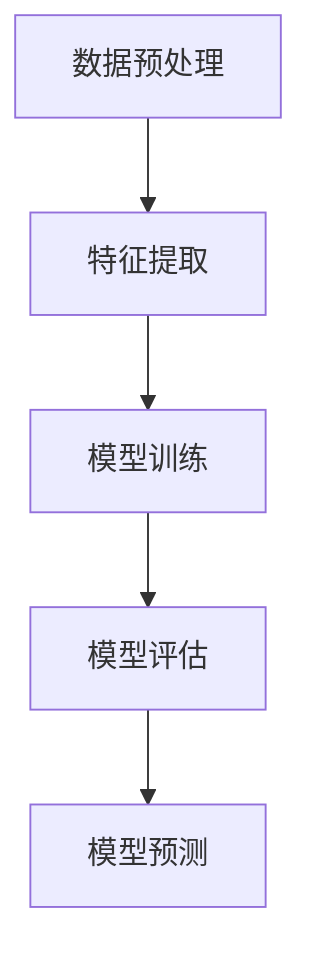

                 

# 实时数据处理架构与实现

> 关键词：实时数据处理、架构设计、数据流模型、流处理算法、系统优化

> 摘要：本文将详细探讨实时数据处理架构的设计与实现，首先介绍实时数据处理的重要性及其与传统批处理数据的区别，然后深入分析实时数据处理架构的基础，包括数据流模型、数据流处理框架、数据存储方案、数据处理引擎和架构设计原则。接着，通过具体应用案例，展示实时数据处理在各个领域的实际应用，并深入解析实时数据处理技术中的流处理算法、数据一致性保障、优化技巧、安全与隐私保护。最后，介绍主流实时数据处理工具与平台，并通过一个项目实战，展示实时数据处理架构的实现过程与关键步骤。本文旨在为读者提供全面而深入的实时数据处理架构设计与实现指导。

## 第一部分：实时数据处理架构概述

### 第1章：实时数据处理的重要性

#### 1.1 问题背景

随着互联网和物联网的迅猛发展，数据量呈爆炸式增长，实时性成为数据处理的关键需求。在许多应用场景中，如金融交易、电商推荐、在线广告、智能家居等，对数据的实时处理和分析具有重要的业务价值。传统的批处理数据处理方式由于处理周期较长、响应速度慢，已经无法满足这些场景的需求。因此，实时数据处理架构的设计与实现变得越来越重要。

#### 1.2 实时数据处理的基本概念

实时数据处理是指在短时间内对大量数据进行收集、处理、分析和存储的过程。它与传统批处理数据的区别在于：

1. **处理速度**：实时数据处理通常在秒级或毫秒级完成，而批处理数据可能在小时级或天级完成。
2. **数据规模**：实时数据处理通常处理海量数据，而批处理数据规模相对较小。
3. **数据格式**：实时数据处理通常处理结构化或半结构化数据，而批处理数据可能包括非结构化数据。
4. **数据处理方式**：实时数据处理通常采用流处理方式，而批处理数据采用批处理方式。

#### 1.3 实时数据处理的核心挑战

实时数据处理面临以下核心挑战：

1. **数据量**：实时数据处理需要处理海量数据，这对系统的处理能力和性能提出了高要求。
2. **延迟**：实时数据处理要求在极短时间内完成数据收集、处理和分析，延迟必须尽可能低。
3. **一致性**：实时数据处理中的数据一致性问题较为复杂，特别是在分布式系统中。
4. **可用性**：实时数据处理系统需要保证高可用性，确保在任何情况下都能正常运行。

#### 1.4 实时数据处理的发展历程

实时数据处理技术的发展历程可以概括为以下几个阶段：

1. **传统技术阶段**：早期的实时数据处理主要依赖于关系型数据库和传统批处理技术。
2. **流处理技术阶段**：随着大数据技术的发展，流处理技术逐渐成为实时数据处理的主流。
3. **实时计算引擎阶段**：如Apache Kafka、Apache Flink、Apache Spark Streaming等实时计算引擎的出现，进一步推动了实时数据处理技术的发展。
4. **云计算和边缘计算阶段**：实时数据处理开始借助云计算和边缘计算技术，实现更高效、更灵活的数据处理。

#### 1.5 本章小结

本章介绍了实时数据处理的重要性、基本概念、核心挑战和发展历程。实时数据处理在现代应用中具有不可替代的地位，其发展历程也反映了技术的不断进步和创新。下一章将深入探讨实时数据处理架构的基础，包括数据流模型、数据流处理框架、数据存储方案、数据处理引擎和架构设计原则。

----------------------------------------------------------------

## 第二部分：实时数据处理架构设计

### 第2章：实时数据处理架构基础

#### 2.1 数据流模型

在实时数据处理中，数据流模型是核心概念之一。数据流模型描述了数据的流动过程、处理方式和存储方式。实时数据处理中的数据流模型主要包括批处理和流处理两种模式。

**批处理**：批处理模式将数据分为多个批次进行处理，每个批次的数据在一段时间内积累，然后一次性进行处理。批处理模式的主要特点是处理周期较长，但可以处理大量数据。批处理模式适用于数据量较大、实时性要求不高的场景，如日志分析、数据备份等。

**流处理**：流处理模式对数据进行实时处理，每条数据在接收后立即进行处理。流处理模式的主要特点是处理周期较短，可以实时响应数据变化。流处理模式适用于数据量较大、实时性要求高的场景，如实时推荐、实时监控等。

#### 2.2 数据流处理框架

数据流处理框架是实时数据处理架构的核心组件，负责数据的收集、传输、处理和存储。主流的数据流处理框架包括Apache Kafka、Apache Flink和Apache Spark Streaming。

**Apache Kafka**：Apache Kafka是一个分布式流处理平台，用于构建实时数据流系统。Kafka的主要功能包括数据收集、传输和存储。Kafka使用拉模式（Pull）进行数据传输，消费者主动从生产者拉取数据，具有高吞吐量、低延迟的特点。Kafka适用于大规模、高并发的实时数据处理场景。

**Apache Flink**：Apache Flink是一个分布式流处理引擎，用于构建实时数据处理应用程序。Flink支持有界流（Bounded Streams）和无界流（Unbounded Streams）的处理，提供了丰富的流处理操作和函数库。Flink的主要优点包括低延迟、高吞吐量和容错性。Flink适用于大规模、复杂实时数据处理场景。

**Apache Spark Streaming**：Apache Spark Streaming是Spark的核心组件之一，用于构建实时数据处理应用程序。Spark Streaming基于Spark的核心计算引擎，提供了高效的流处理能力。Spark Streaming的主要优点包括易用性、可扩展性和丰富的数据处理操作。Spark Streaming适用于大规模、实时数据处理场景。

#### 2.3 数据存储方案

实时数据处理中的数据存储方案对系统的性能和可靠性有重要影响。常用的数据存储方案包括关系型数据库、NoSQL数据库和时序数据库。

**关系型数据库**：关系型数据库（如MySQL、PostgreSQL）适用于存储结构化数据，具有强大的数据管理和查询功能。关系型数据库的主要优点包括数据一致性、事务性和灵活性。但在处理海量实时数据时，关系型数据库可能面临性能瓶颈。

**NoSQL数据库**：NoSQL数据库（如MongoDB、Cassandra）适用于存储半结构化或非结构化数据，具有高扩展性和高性能。NoSQL数据库的主要优点包括数据灵活性和高性能。但NoSQL数据库在事务性和数据一致性方面可能存在挑战。

**时序数据库**：时序数据库（如InfluxDB、TimeScaleDB）适用于存储时间序列数据，具有高效的查询和写入性能。时序数据库的主要优点包括时间序列数据的存储和处理优化。但时序数据库在复杂查询和事务处理方面可能存在限制。

#### 2.4 数据处理引擎

数据处理引擎是实时数据处理架构的核心组件，负责数据的收集、传输、处理和存储。数据处理引擎的工作原理可以分为以下几个步骤：

1. **数据收集**：数据处理引擎从数据源（如Kafka、文件系统、数据库）收集数据。
2. **数据传输**：数据处理引擎将收集到的数据传输到处理节点。
3. **数据预处理**：数据处理引擎对数据进行预处理，包括数据清洗、数据转换和数据过滤等。
4. **数据处理**：数据处理引擎对预处理后的数据进行处理，包括数据聚合、数据计算和数据挖掘等。
5. **数据存储**：数据处理引擎将处理后的数据存储到目标存储系统（如数据库、时序数据库、文件系统）。

数据处理引擎的优势包括：

1. **高性能**：数据处理引擎具有高效的计算能力和数据传输能力，可以处理海量数据。
2. **高可用性**：数据处理引擎具有容错性和高可用性，可以确保系统的稳定运行。
3. **可扩展性**：数据处理引擎支持水平扩展，可以随着数据量的增加而扩展处理能力。

数据处理引擎的不足包括：

1. **复杂性**：数据处理引擎涉及多个组件和模块，设计和实现较为复杂。
2. **资源消耗**：数据处理引擎需要消耗大量计算资源和存储资源，对系统性能有较大影响。

#### 2.5 实时数据处理架构设计原则

实时数据处理架构设计需要遵循以下原则：

1. **高可用性**：确保系统在任何情况下都能正常运行，避免单点故障导致系统不可用。
2. **可扩展性**：支持系统随着数据量和用户量的增加而扩展，确保系统的性能和稳定性。
3. **可维护性**：简化系统的开发和维护过程，提高开发效率和系统稳定性。
4. **数据一致性**：确保数据在处理过程中的一致性，避免数据丢失或重复处理。
5. **安全性**：确保系统数据的安全性和隐私性，避免数据泄露或滥用。

#### 2.6 本章小结

本章介绍了实时数据处理架构的基础，包括数据流模型、数据流处理框架、数据存储方案、数据处理引擎和架构设计原则。实时数据处理架构的设计与实现是构建高效、稳定和可靠的实时数据处理系统的关键。下一章将探讨实时数据处理在各个领域的实际应用。

----------------------------------------------------------------

### 第3章：实时数据处理应用案例

#### 3.1 实时推荐系统

实时推荐系统是实时数据处理在电商、社交媒体等领域的典型应用。实时推荐系统利用实时数据处理技术，根据用户的实时行为和偏好，为用户推荐个性化商品、内容或广告。

**架构设计**：

1. **数据收集**：实时推荐系统从用户行为数据源（如点击、浏览、购买等）收集数据。
2. **数据预处理**：对收集到的数据进行预处理，包括数据清洗、数据转换和数据过滤等。
3. **数据计算**：利用实时数据处理引擎（如Apache Kafka、Apache Flink）对预处理后的数据进行计算，生成推荐结果。
4. **数据存储**：将计算得到的推荐结果存储到目标存储系统（如数据库、缓存系统）。
5. **结果展示**：将推荐结果展示给用户，提高用户满意度。

**关键技术与挑战**：

1. **实时数据计算**：实时推荐系统需要在极短时间内处理海量用户行为数据，对计算性能和延迟有较高要求。
2. **数据一致性**：实时推荐系统需要保证数据在处理过程中的一致性，避免数据丢失或重复计算。
3. **推荐算法优化**：实时推荐系统需要不断优化推荐算法，提高推荐准确性和用户体验。

**实际案例**：

以淘宝为例，淘宝的实时推荐系统利用实时数据处理技术，根据用户的浏览历史、购买记录、收藏夹等数据，实时生成个性化推荐结果。淘宝的实时推荐系统采用了Apache Kafka作为数据流处理框架，Apache Flink进行实时数据处理，将计算得到的推荐结果存储到Redis缓存系统，然后展示给用户。

#### 3.2 实时监控系统

实时监控系统是实时数据处理在IT运维、物联网等领域的典型应用。实时监控系统利用实时数据处理技术，实时监控系统的运行状态、性能指标和安全事件，及时发现和响应异常情况。

**架构设计**：

1. **数据采集**：实时监控系统从各种数据源（如操作系统、网络设备、应用程序等）采集监控数据。
2. **数据处理**：实时监控系统利用实时数据处理引擎（如Apache Kafka、Apache Flink）对采集到的监控数据进行处理，包括数据清洗、数据转换和数据过滤等。
3. **数据存储**：将处理后的监控数据存储到目标存储系统（如数据库、时序数据库、文件系统）。
4. **数据分析与可视化**：实时监控系统对存储的监控数据进行实时分析，并通过可视化界面展示监控数据。
5. **告警与自动化响应**：实时监控系统根据监控数据生成告警信息，并触发自动化响应措施，如自动重启服务、自动扩容等。

**关键技术与挑战**：

1. **海量数据采集**：实时监控系统需要采集和处理海量监控数据，对数据采集和处理性能有较高要求。
2. **数据存储与检索**：实时监控系统需要高效地存储和检索监控数据，支持实时查询和告警。
3. **告警与自动化响应**：实时监控系统需要及时生成告警信息，并触发自动化响应措施，避免人工干预。

**实际案例**：

以阿里巴巴的实时监控系统为例，阿里巴巴的实时监控系统利用实时数据处理技术，对大规模分布式系统的运行状态、性能指标和安全事件进行实时监控。阿里巴巴的实时监控系统采用了Apache Kafka作为数据流处理框架，Apache Flink进行实时数据处理，将监控数据存储到MySQL数据库和Elasticsearch时序数据库，并通过Kibana进行数据可视化和告警。

#### 3.3 实时交易系统

实时交易系统是实时数据处理在金融、电商等领域的典型应用。实时交易系统利用实时数据处理技术，实时处理用户的交易请求，确保交易的实时性、安全性和准确性。

**架构设计**：

1. **数据采集**：实时交易系统从用户交易请求、交易数据源等采集数据。
2. **数据处理**：实时交易系统利用实时数据处理引擎（如Apache Kafka、Apache Flink）对采集到的交易数据进行处理，包括数据清洗、数据转换和数据过滤等。
3. **交易处理**：实时交易系统利用分布式事务处理技术（如两阶段提交、最终一致性等）对交易请求进行实时处理。
4. **数据存储**：将处理后的交易数据存储到目标存储系统（如数据库、文件系统）。
5. **结果反馈**：实时交易系统将交易处理结果反馈给用户，包括交易成功、交易失败等。

**关键技术与挑战**：

1. **分布式事务处理**：实时交易系统需要处理分布式事务，确保交易的原子性和一致性。
2. **数据一致性**：实时交易系统需要确保交易数据在处理过程中的一致性，避免数据丢失或重复处理。
3. **高并发处理**：实时交易系统需要支持高并发交易请求的处理，确保交易的实时性。

**实际案例**：

以支付宝为例，支付宝的实时交易系统利用实时数据处理技术，实时处理用户的交易请求。支付宝的实时交易系统采用了Apache Kafka作为数据流处理框架，Apache Flink进行实时数据处理，利用分布式事务处理技术确保交易的实时性和一致性。

#### 3.4 实时物联网数据处理

实时物联网数据处理是实时数据处理在智能家居、工业自动化等领域的典型应用。实时物联网数据处理利用实时数据处理技术，对海量物联网设备的数据进行实时采集、处理和分析。

**架构设计**：

1. **数据采集**：实时物联网数据处理系统从物联网设备（如传感器、控制器等）采集数据。
2. **数据处理**：实时物联网数据处理系统利用实时数据处理引擎（如Apache Kafka、Apache Flink）对采集到的物联网设备数据进行处理，包括数据清洗、数据转换和数据过滤等。
3. **数据存储**：将处理后的物联网数据存储到目标存储系统（如数据库、时序数据库、文件系统）。
4. **数据分析**：实时物联网数据处理系统对存储的物联网数据进行分析，生成报表、图表等可视化结果。
5. **设备控制**：实时物联网数据处理系统根据分析结果，对物联网设备进行实时控制，如调整设备参数、发送指令等。

**关键技术与挑战**：

1. **海量数据采集**：实时物联网数据处理系统需要采集和处理海量物联网设备数据，对数据采集和处理性能有较高要求。
2. **数据存储与检索**：实时物联网数据处理系统需要高效地存储和检索物联网数据，支持实时查询和分析。
3. **设备控制**：实时物联网数据处理系统需要及时响应对物联网设备的控制指令，确保设备正常运行。

**实际案例**：

以小米智能家居为例，小米的实时物联网数据处理系统利用实时数据处理技术，对智能家居设备的数据进行实时采集和处理。小米的实时物联网数据处理系统采用了Apache Kafka作为数据流处理框架，Apache Flink进行实时数据处理，将处理后的物联网数据存储到MySQL数据库和Elasticsearch时序数据库，并通过Kibana进行数据可视化和设备控制。

#### 3.5 实时数据处理在医疗领域的应用

实时数据处理在医疗领域具有广泛的应用，如电子健康记录的实时分析、医疗设备的实时监控等。

**应用场景**：

1. **电子健康记录实时分析**：实时数据处理系统可以对电子健康记录（EHR）进行实时分析，生成患者健康报告、诊断建议等。
2. **医疗设备实时监控**：实时数据处理系统可以实时监控医疗设备的运行状态、性能指标等，确保设备正常运行。

**架构设计**：

1. **数据采集**：实时数据处理系统从电子健康记录系统和医疗设备采集数据。
2. **数据处理**：实时数据处理系统利用实时数据处理引擎（如Apache Kafka、Apache Flink）对采集到的数据进行处理，包括数据清洗、数据转换和数据过滤等。
3. **数据存储**：将处理后的数据存储到目标存储系统（如数据库、时序数据库、文件系统）。
4. **数据分析与决策支持**：实时数据处理系统对存储的数据进行分析，生成患者健康报告、诊断建议等，为医生和护士提供决策支持。

**关键技术与挑战**：

1. **数据隐私与安全**：医疗数据具有高度隐私性，实时数据处理系统需要确保数据的安全性和隐私性。
2. **实时性要求**：医疗领域的实时数据处理对实时性有较高要求，需要确保数据在极短时间内进行处理和分析。

**实际案例**：

以某大型医院为例，该医院的实时数据处理系统利用实时数据处理技术，对电子健康记录和医疗设备数据进行实时分析。该医院的实时数据处理系统采用了Apache Kafka作为数据流处理框架，Apache Flink进行实时数据处理，将处理后的数据存储到MySQL数据库和Elasticsearch时序数据库，并通过Kibana进行数据可视化和决策支持。

#### 3.6 本章小结

本章介绍了实时数据处理在实时推荐系统、实时监控系统、实时交易系统、实时物联网数据处理和医疗领域的应用。实时数据处理技术在这些领域的应用，显著提高了系统的实时性、效率和用户体验。下一章将深入解析实时数据处理技术中的流处理算法、数据一致性保障、优化技巧和安全与隐私保护。

----------------------------------------------------------------

### 第4章：实时数据处理技术深入解析

#### 4.1 流处理算法

流处理算法是实时数据处理技术的核心组成部分，用于对实时数据流进行高效处理和分析。流处理算法主要包括窗口算法、聚合算法和机器学习算法。

**窗口算法**：

窗口算法是对数据流进行分段处理的一种算法，根据时间窗口或数据量窗口对数据进行分组。窗口算法可以实时计算数据流的统计指标、趋势分析等。常见的窗口算法包括：

1. **滑动窗口**：滑动窗口是一种连续的窗口算法，窗口固定大小，随着时间推移，窗口不断向前滑动。滑动窗口可以实时计算数据流的统计指标，如平均值、最大值、最小值等。
2. **固定窗口**：固定窗口是一种定期的窗口算法，窗口固定大小，每隔一段时间进行一次数据分组和处理。固定窗口适用于周期性数据，如小时级、天级数据。

**窗口算法**的数学模型如下：

$$
\text{平均值} = \frac{\sum_{i=1}^{n} x_i}{n}
$$

其中，$x_i$表示窗口中的第$i$个数据点，$n$表示窗口大小。

**聚合算法**：

聚合算法是对数据流进行聚合计算的一种算法，用于计算数据流的聚合结果，如总和、平均值、最大值、最小值等。常见的聚合算法包括：

1. **累加器**：累加器是一种简单的聚合算法，用于计算数据流的累加和。累加器的数学模型如下：

$$
\text{累加和} = \sum_{i=1}^{n} x_i
$$

2. **合并器**：合并器是一种用于多个累加器合并的算法，用于计算多个数据流的聚合结果。合并器的数学模型如下：

$$
\text{合并和} = \sum_{i=1}^{k} (\sum_{j=1}^{n} x_{ij})
$$

其中，$x_{ij}$表示第$i$个累加器的第$j$个数据点，$k$表示累加器的个数。

**机器学习算法**：

机器学习算法是对数据流进行模式识别和预测的一种算法，用于实时分析数据流，发现数据中的规律和趋势。常见的机器学习算法包括：

1. **分类算法**：分类算法用于将数据流中的数据分类到不同的类别。常见的分类算法包括决策树、支持向量机、随机森林等。
2. **回归算法**：回归算法用于预测数据流中的连续值。常见的回归算法包括线性回归、决策树回归、随机森林回归等。
3. **聚类算法**：聚类算法用于将数据流中的数据聚为不同的聚类。常见的聚类算法包括K-means、层次聚类、DBSCAN等。

**机器学习算法**的流程如下：

1. **数据预处理**：对数据流进行预处理，包括数据清洗、数据转换和数据归一化等。
2. **特征提取**：从数据流中提取特征，用于训练和预测。
3. **模型训练**：使用训练数据训练机器学习模型。
4. **模型评估**：使用测试数据评估模型性能，调整模型参数。
5. **模型预测**：使用训练好的模型对实时数据进行预测。

**算法**的mermaid流程图如下：



**示例**：

以K-means聚类算法为例，K-means聚类算法是一种基于距离的聚类算法，用于将数据流中的数据分为多个聚类。K-means聚类算法的步骤如下：

1. **初始化聚类中心**：随机选择$k$个数据点作为聚类中心。
2. **分配数据点**：将每个数据点分配到与其最近的聚类中心所在的聚类。
3. **更新聚类中心**：重新计算每个聚类的中心。
4. **迭代优化**：重复步骤2和步骤3，直到聚类中心不再发生显著变化。

K-means聚类算法的Python代码实现如下：

```python
import numpy as np

def kmeans(data, k, max_iterations):
    # 初始化聚类中心
    centroids = data[np.random.choice(data.shape[0], k, replace=False)]
    
    for _ in range(max_iterations):
        # 分配数据点
        labels = np.argmin(np.linalg.norm(data[:, np.newaxis] - centroids, axis=2), axis=1)
        
        # 更新聚类中心
        new_centroids = np.array([data[labels == i].mean(axis=0) for i in range(k)])
        
        # 判断是否收敛
        if np.linalg.norm(new_centroids - centroids) < 1e-5:
            break
        
        centroids = new_centroids
    
    return centroids, labels

# 示例数据
data = np.random.rand(100, 2)

# 运行K-means聚类算法
centroids, labels = kmeans(data, 3, 100)

# 绘制聚类结果
import matplotlib.pyplot as plt

plt.scatter(data[:, 0], data[:, 1], c=labels)
plt.scatter(centroids[:, 0], centroids[:, 1], s=100, c='red')
plt.show()
```

#### 4.2 实时数据一致性保障

实时数据处理中的数据一致性保障是确保数据在处理过程中的一致性和准确性。在分布式系统中，数据一致性保障尤为重要。常见的数据一致性保障机制包括分布式一致性协议和数据处理一致性保障机制。

**分布式一致性协议**：

分布式一致性协议是一种用于在分布式系统中实现数据一致性的协议。常见的分布式一致性协议包括Paxos算法和Raft算法。

1. **Paxos算法**：Paxos算法是一种分布式一致性算法，用于在分布式系统中实现多节点之间的数据一致性。Paxos算法的核心思想是选举一个领导者（Leader）节点，由领导者节点负责处理所有数据写入请求。Paxos算法的数学模型如下：

$$
\text{提案} = \text{（领导者编号，值）}
$$

$$
\text{决定} = \text{（领导者编号，值）}
$$

其中，$\text{领导者编号}$表示提案的提出者编号，$\text{值}$表示提案的值。

2. **Raft算法**：Raft算法是一种基于Paxos算法的分布式一致性算法，简化了Paxos算法的复杂度。Raft算法将系统中的节点分为领导者（Leader）、追随者（Follower）和候选人（Candidate）三种角色。Raft算法的数学模型如下：

$$
\text{日志条目} = \text{（任期编号，命令）}
$$

其中，$\text{任期编号}$表示当前任期的编号，$\text{命令}$表示日志条目的值。

**数据处理一致性保障机制**：

数据处理一致性保障机制是一种在分布式系统中确保数据一致性的机制，包括数据复制、数据分片和数据监控等。

1. **数据复制**：数据复制是一种将数据在多个节点之间复制的方法，确保数据的高可用性和可靠性。数据复制的基本原理是将数据在多个节点上创建副本，当一个节点发生故障时，其他节点可以继续提供服务。

2. **数据分片**：数据分片是一种将数据分布在多个节点上的方法，提高系统的性能和可扩展性。数据分片的基本原理是将数据按一定规则划分成多个分片，每个分片存储在一个不同的节点上，从而实现数据的并行处理。

3. **数据监控**：数据监控是一种实时监控分布式系统数据一致性的方法，包括数据同步、数据校验和数据恢复等。数据监控的基本原理是实时监控数据同步和传输过程，确保数据的一致性和准确性。

**示例**：

以Raft算法为例，Raft算法的Python实现如下：

```python
import threading
import time

class RaftNode:
    def __init__(self, node_id, peers):
        self.node_id = node_id
        self.peers = peers
        self.current_term = 0
        self.voted_for = None
        self.log = []
        self.next_index = {peer: 1 for peer in peers}
        self.match_index = {peer: 0 for peer in peers}
        self.state = "follower"

    def start(self):
        threading.Thread(target=self.run).start()

    def run(self):
        while True:
            if self.state == "follower":
                self.follower()
            elif self.state == "candidate":
                self.candidate()
            elif self.state == "leader":
                self.leader()

    def follower(self):
        time.sleep(15)
        self.send_append_entries()

    def candidate(self):
        self.current_term += 1
        self.voted_for = self.node_id
        self.log = []
        self.next_index = {peer: 1 for peer in self.peers}
        self.match_index = {peer: 0 for peer in self.peers}
        self.state = "candidate"
        self.send_request_vote()

    def leader(self):
        self.state = "leader"
        while True:
            self.send_append_entries()

    def send_request_vote(self):
        for peer in self.peers:
            threading.Thread(target=self.send_request_vote_to_peer, args=(peer, )).start()

    def send_request_vote_to_peer(self, peer):
        message = {
            "type": "request_vote",
            "term": self.current_term,
            "candidate_id": self.node_id,
            "last_log_index": len(self.log) - 1,
            "last_log_term": self.log[-1]["term"]
        }
        response = self.send_message(peer, message)
        if response["term"] > self.current_term:
            self.current_term = response["term"]
            self.voted_for = None
            self.log = []
            self.next_index = {peer: 1 for peer in self.peers}
            self.match_index = {peer: 0 for peer in self.peers}
            self.state = "follower"
        elif response["vote_granted"]:
            self.voted_for = peer
            if all(self.voted_for == peer for peer in self.peers):
                self.state = "leader"

    def send_append_entries(self):
        for peer in self.peers:
            threading.Thread(target=self.send_append_entries_to_peer, args=(peer, )).start()

    def send_append_entries_to_peer(self, peer):
        message = {
            "type": "append_entries",
            "term": self.current_term,
            "leader_id": self.node_id,
            "prev_log_index": len(self.log) - 1,
            "prev_log_term": self.log[-1]["term"],
            "entries": self.log
        }
        response = self.send_message(peer, message)
        if response["term"] > self.current_term:
            self.current_term = response["term"]
            self.voted_for = None
            self.log = []
            self.next_index = {peer: 1 for peer in self.peers}
            self.match_index = {peer: 0 for peer in self.peers}
            self.state = "follower"
        elif response["success"]:
            self.match_index[peer] = response["match_index"]

    def send_message(self, peer, message):
        return self.peers[peer].receive_message(message)

    def receive_message(self, message):
        if message["type"] == "request_vote":
            return {
                "type": "response_vote",
                "term": self.current_term,
                "vote_granted": self.voted_for is None or self.voted_for == message["candidate_id"]
            }
        elif message["type"] == "append_entries":
            return {
                "type": "response_append_entries",
                "term": self.current_term,
                "success": self.log[-1]["term"] == message["prev_log_term"] and
                          all(entry["term"] == message["entries"][i]["term"] for i, entry in enumerate(message["entries"]))
            }

# 示例节点
nodes = [
    RaftNode(0, [1, 2, 3]),
    RaftNode(1, [0, 2, 3]),
    RaftNode(2, [0, 1, 3]),
    RaftNode(3, [0, 1, 2])
]

# 启动节点
for node in nodes:
    node.start()

time.sleep(60)
```

#### 4.3 实时数据处理优化技巧

实时数据处理优化技巧是提高实时数据处理性能和效率的关键。以下是一些常用的优化技巧：

1. **数据缓存**：数据缓存是一种将频繁访问的数据存储在内存中的方法，减少数据访问延迟。常见的缓存技术包括Redis、Memcached等。
2. **并行处理**：并行处理是一种将数据处理任务分布在多个节点或线程上执行的方法，提高数据处理性能。并行处理的关键技术包括线程池、任务队列等。
3. **负载均衡**：负载均衡是一种将数据处理任务分配到多个节点或服务器上的方法，确保系统性能和稳定性。常见的负载均衡技术包括轮询、随机、最小连接数等。
4. **数据压缩**：数据压缩是一种将数据压缩成更小的形式，减少数据传输和处理时间的方法。常用的数据压缩技术包括Hadoop、Gzip等。

**示例**：

以下是一个简单的实时数据处理优化示例，使用Python实现并行处理和数据缓存：

```python
import concurrent.futures
import redis

# 初始化Redis缓存
redis_client = redis.StrictRedis(host='localhost', port=6379, db=0)

# 数据处理函数
def process_data(data):
    # 模拟数据处理耗时
    time.sleep(1)
    # 存储处理结果到Redis缓存
    redis_client.set(data, "processed")
    return data

# 数据列表
data_list = ["data1", "data2", "data3", "data4", "data5"]

# 并行处理数据
with concurrent.futures.ThreadPoolExecutor() as executor:
    results = list(executor.map(process_data, data_list))

# 检查处理结果
for result in results:
    print(f"{result} processed.")
```

#### 4.4 实时数据处理在云计算和边缘计算中的应用

实时数据处理在云计算和边缘计算中的应用场景和关键技术如下：

1. **云计算**：实时数据处理在云计算中的应用主要包括云原生实时数据处理、容器化实时数据处理和分布式实时数据处理。云原生实时数据处理利用云计算的弹性扩展能力和高可用性，实现高效、可靠的实时数据处理。容器化实时数据处理利用容器技术（如Docker、Kubernetes）实现实时数据处理服务的快速部署和运维。分布式实时数据处理利用分布式计算框架（如Apache Kafka、Apache Flink、Apache Spark Streaming）实现海量数据的实时处理和分析。
2. **边缘计算**：实时数据处理在边缘计算中的应用主要包括边缘实时数据处理和边缘智能。边缘实时数据处理利用边缘计算设备的计算能力和存储能力，实现实时数据的本地处理和分析，降低网络延迟和带宽消耗。边缘智能利用边缘计算设备的计算能力和机器学习算法，实现实时数据的智能分析和决策。

**示例**：

以下是一个简单的实时数据处理在云计算和边缘计算中的应用示例，使用Python实现边缘实时数据处理：

```python
import requests

# 边缘计算设备IP地址
edge_ip = "192.168.1.100"

# 数据处理函数
def process_data(data):
    # 将数据发送到边缘计算设备进行处理
    response = requests.post(f"http://{edge_ip}:8080/processing", json=data)
    # 返回处理结果
    return response.json()

# 数据列表
data_list = [{"id": 1, "value": 10}, {"id": 2, "value": 20}, {"id": 3, "value": 30}]

# 边缘实时数据处理
results = [process_data(data) for data in data_list]

# 输出处理结果
for result in results:
    print(result)
```

#### 4.5 实时数据处理安全与隐私保护

实时数据处理安全与隐私保护是确保实时数据处理系统安全性和数据隐私性的关键。以下是一些常用的安全与隐私保护技术：

1. **数据加密**：数据加密是一种将数据转换为无法被未经授权的第三方读取的形式的方法。常用的数据加密技术包括AES、RSA等。
2. **访问控制**：访问控制是一种限制用户对数据访问权限的方法，确保数据只能被授权用户访问。常用的访问控制技术包括基于角色的访问控制（RBAC）和基于属性的访问控制（ABAC）等。
3. **审计与监控**：审计与监控是一种实时监控实时数据处理系统的操作和访问情况，确保系统安全性和数据隐私性的方法。常用的审计与监控技术包括日志记录、实时告警和审计分析等。
4. **数据脱敏**：数据脱敏是一种将敏感数据转换为不可识别的形式的方法，保护数据隐私。常用的数据脱敏技术包括替换、屏蔽、加密等。

**示例**：

以下是一个简单的实时数据处理安全与隐私保护示例，使用Python实现数据加密和访问控制：

```python
import json
import requests
from Crypto.PublicKey import RSA
from Crypto.Cipher import PKCS1_OAEP

# 生成RSA密钥对
private_key = RSA.generate(2048)
public_key = private_key.publickey()

# 数据加密函数
def encrypt_data(data):
    cipher = PKCS1_OAEP.new(public_key)
    encrypted_data = cipher.encrypt(json.dumps(data).encode())
    return encrypted_data

# 数据解密函数
def decrypt_data(encrypted_data):
    cipher = PKCS1_OAEP.new(private_key)
    decrypted_data = cipher.decrypt(encrypted_data).decode()
    return json.loads(decrypted_data)

# 访问控制函数
def access_control(data, role):
    if role == "admin":
        return decrypt_data(data)
    else:
        return "Access denied."

# 数据
data = {"id": 1, "value": 10}

# 数据加密
encrypted_data = encrypt_data(data)

# 访问控制
result = access_control(encrypted_data, "admin")

# 输出结果
print(result)
```

#### 4.6 本章小结

本章深入解析了实时数据处理技术中的流处理算法、数据一致性保障、优化技巧、安全与隐私保护。流处理算法是实时数据处理的核心技术，数据一致性保障、优化技巧和安全与隐私保护是确保实时数据处理系统高效、可靠和安全的关键。下一章将介绍主流实时数据处理工具与平台。

----------------------------------------------------------------

### 第5章：实时数据处理工具与平台

#### 5.1 主流实时数据处理工具介绍

随着实时数据处理需求的不断增长，市场上涌现出许多主流的实时数据处理工具。这些工具为开发者提供了丰富的功能，帮助构建高效、可靠和灵活的实时数据处理系统。以下介绍几种主流的实时数据处理工具。

**Apache Kafka**

Apache Kafka是一个分布式流处理平台，用于构建实时数据流系统。Kafka具有高吞吐量、低延迟、可扩展性和高可用性等特点，适用于大规模、高并发的实时数据处理场景。

**功能特点**：

1. **分布式架构**：Kafka支持分布式部署，可以水平扩展以处理海量数据。
2. **高吞吐量**：Kafka使用磁盘存储，具有高吞吐量，可以处理高并发数据流。
3. **低延迟**：Kafka具有低延迟的特点，可以实时处理数据。
4. **高可用性**：Kafka支持数据复制和故障转移，确保系统的稳定运行。
5. **数据持久化**：Kafka将数据持久化到磁盘，保证数据不丢失。

**使用场景**：

1. **实时日志收集**：Kafka常用于实时收集应用程序、服务器和设备的日志数据。
2. **实时数据管道**：Kafka可以作为实时数据管道，连接数据源和数据存储系统。
3. **实时流处理**：Kafka可以与Apache Flink、Apache Spark Streaming等实时处理框架集成，实现实时数据处理和分析。

**Apache Flink**

Apache Flink是一个分布式流处理引擎，用于构建实时数据处理应用程序。Flink支持有界流和无界流的处理，提供了丰富的流处理操作和函数库。

**功能特点**：

1. **流处理能力**：Flink支持有界流和无界流的处理，可以处理实时数据流。
2. **高性能**：Flink具有高性能的特点，可以处理大规模实时数据。
3. **容错性**：Flink支持分布式容错，确保系统的稳定运行。
4. **可扩展性**：Flink支持水平扩展，可以随着数据量和用户量的增加而扩展处理能力。
5. **数据处理操作**：Flink提供了丰富的数据处理操作，如数据转换、聚合、窗口等。

**使用场景**：

1. **实时数据处理**：Flink适用于实时数据处理和分析，如实时推荐、实时监控等。
2. **流处理应用**：Flink可以构建实时流处理应用，如实时数据采集、实时数据分析等。
3. **大规模数据处理**：Flink适用于大规模数据处理场景，如实时数据挖掘、实时机器学习等。

**Apache Spark Streaming**

Apache Spark Streaming是Spark的核心组件之一，用于构建实时数据处理应用程序。Spark Streaming基于Spark的核心计算引擎，提供了高效的流处理能力。

**功能特点**：

1. **流处理能力**：Spark Streaming支持实时数据流处理，可以处理大规模实时数据。
2. **高吞吐量**：Spark Streaming具有高吞吐量的特点，可以处理高并发数据流。
3. **易用性**：Spark Streaming与Spark的其他组件（如Spark SQL、Spark MLlib）无缝集成，具有易用性。
4. **可扩展性**：Spark Streaming支持水平扩展，可以随着数据量和用户量的增加而扩展处理能力。
5. **数据处理操作**：Spark Streaming提供了丰富的数据处理操作，如数据转换、聚合、窗口等。

**使用场景**：

1. **实时数据处理**：Spark Streaming适用于实时数据处理和分析，如实时推荐、实时监控等。
2. **流处理应用**：Spark Streaming可以构建实时流处理应用，如实时数据采集、实时数据分析等。
3. **大规模数据处理**：Spark Streaming适用于大规模数据处理场景，如实时数据挖掘、实时机器学习等。

**其他实时数据处理工具**

除了上述三种主流工具，市场上还有许多其他的实时数据处理工具，如Apache Storm、Apache Samza、Apache Beam等。这些工具各具特色，适用于不同的实时数据处理场景。例如：

1. **Apache Storm**：Apache Storm是一个分布式流处理框架，适用于大规模、高并发的实时数据处理场景。
2. **Apache Samza**：Apache Samza是一个流处理框架，基于Apache Mesos和Hadoop YARN，适用于大数据环境中的实时数据处理。
3. **Apache Beam**：Apache Beam是一个统一的数据处理框架，支持流处理和批处理，适用于构建大数据处理应用。

#### 5.2 开源实时数据处理平台

除了主流的实时数据处理工具，市场上还有许多开源实时数据处理平台，这些平台为开发者提供了完整的实时数据处理解决方案。以下介绍几种常用的开源实时数据处理平台。

**Apache Kafka Streams**

Apache Kafka Streams是基于Apache Kafka的实时数据处理平台，提供了一套完整的实时数据处理API。Kafka Streams可以与Kafka集成，实现实时数据流处理和分析。

**功能特点**：

1. **Kafka集成**：Kafka Streams可以与Kafka无缝集成，实现实时数据流处理。
2. **数据处理API**：Kafka Streams提供了一套完整的实时数据处理API，包括数据转换、聚合、窗口等操作。
3. **高可用性**：Kafka Streams支持分布式部署，具有高可用性。
4. **可扩展性**：Kafka Streams支持水平扩展，可以随着数据量和用户量的增加而扩展处理能力。

**使用场景**：

1. **实时数据处理**：Kafka Streams适用于实时数据处理和分析，如实时推荐、实时监控等。
2. **流处理应用**：Kafka Streams可以构建实时流处理应用，如实时数据采集、实时数据分析等。

**Apache Flink Platform**

Apache Flink Platform是一个基于Apache Flink的实时数据处理平台，提供了一套完整的实时数据处理工具和组件。

**功能特点**：

1. **Flink集成**：Flink Platform基于Apache Flink，提供了完整的实时数据处理能力。
2. **数据处理工具**：Flink Platform提供了一系列数据处理工具，如Flink SQL、Flink MLlib等。
3. **可扩展性**：Flink Platform支持水平扩展，可以随着数据量和用户量的增加而扩展处理能力。
4. **生态支持**：Flink Platform得到了广泛的生态支持，可以与各种大数据技术和工具无缝集成。

**使用场景**：

1. **实时数据处理**：Flink Platform适用于实时数据处理和分析，如实时推荐、实时监控等。
2. **流处理应用**：Flink Platform可以构建实时流处理应用，如实时数据采集、实时数据分析等。
3. **大规模数据处理**：Flink Platform适用于大规模数据处理场景，如实时数据挖掘、实时机器学习等。

**Apache Spark Platform**

Apache Spark Platform是一个基于Apache Spark的实时数据处理平台，提供了一套完整的实时数据处理工具和组件。

**功能特点**：

1. **Spark集成**：Spark Platform基于Apache Spark，提供了完整的实时数据处理能力。
2. **数据处理工具**：Spark Platform提供了一系列数据处理工具，如Spark SQL、Spark MLlib等。
3. **可扩展性**：Spark Platform支持水平扩展，可以随着数据量和用户量的增加而扩展处理能力。
4. **生态支持**：Spark Platform得到了广泛的生态支持，可以与各种大数据技术和工具无缝集成。

**使用场景**：

1. **实时数据处理**：Spark Platform适用于实时数据处理和分析，如实时推荐、实时监控等。
2. **流处理应用**：Spark Platform可以构建实时流处理应用，如实时数据采集、实时数据分析等。
3. **大规模数据处理**：Spark Platform适用于大规模数据处理场景，如实时数据挖掘、实时机器学习等。

#### 5.3 实时数据处理工具与平台的比较

以下是比较几种主流实时数据处理工具和平台的一些关键特点：

| 工具/平台 | 功能特点 | 使用场景 |  
| --- | --- | --- |  
| Apache Kafka | 分布式流处理平台，高吞吐量、低延迟、可扩展性、高可用性 | 实时日志收集、实时数据管道、实时流处理 |  
| Apache Flink | 分布式流处理引擎，流处理能力、高性能、容错性、可扩展性 | 实时数据处理、流处理应用、大规模数据处理 |  
| Apache Spark Streaming | 基于Spark的实时数据处理框架，流处理能力、高吞吐量、易用性、可扩展性 | 实时数据处理、流处理应用、大规模数据处理 |  
| Apache Kafka Streams | 基于Kafka的实时数据处理平台，Kafka集成、数据处理API、高可用性、可扩展性 | 实时数据处理、流处理应用 |  
| Apache Flink Platform | 基于Flink的实时数据处理平台，Flink集成、数据处理工具、可扩展性、生态支持 | 实时数据处理、流处理应用、大规模数据处理 |  
| Apache Spark Platform | 基于Spark的实时数据处理平台，Spark集成、数据处理工具、可扩展性、生态支持 | 实时数据处理、流处理应用、大规模数据处理 |

通过比较，可以看出每种实时数据处理工具和平台都有其独特的特点和适用场景。开发者可以根据具体需求选择合适的工具和平台，构建高效、可靠的实时数据处理系统。

#### 5.4 本章小结

本章介绍了主流的实时数据处理工具和平台，包括Apache Kafka、Apache Flink、Apache Spark Streaming等。这些工具和平台为开发者提供了丰富的功能，帮助构建高效、可靠和灵活的实时数据处理系统。下一章将通过一个项目实战，展示实时数据处理架构的实现过程与关键步骤。

----------------------------------------------------------------

### 第6章：项目实战：实时推荐系统

#### 6.1 项目背景

实时推荐系统是实时数据处理技术在电商、社交媒体等领域的典型应用。实时推荐系统利用实时数据处理技术，根据用户的实时行为和偏好，为用户推荐个性化商品、内容或广告。本项目将实现一个简单的实时推荐系统，利用Apache Kafka、Apache Flink等实时数据处理工具，实现实时数据收集、处理和推荐结果的生成。

#### 6.2 系统设计

**系统架构**

实时推荐系统的架构主要包括以下几个部分：

1. **数据源**：数据源包括用户的点击、浏览、购买等行为数据。
2. **数据收集**：数据收集模块负责从数据源收集实时数据，并将其发送到实时数据处理系统。
3. **实时数据处理**：实时数据处理模块负责实时处理用户行为数据，生成推荐结果。
4. **推荐结果存储**：推荐结果存储模块负责将实时数据处理模块生成的推荐结果存储到数据库或缓存系统中。
5. **推荐结果展示**：推荐结果展示模块负责将推荐结果展示给用户。

**系统功能**

实时推荐系统的功能主要包括以下几个方面：

1. **数据收集**：收集用户的点击、浏览、购买等行为数据，并将其发送到实时数据处理系统。
2. **实时数据处理**：实时处理用户行为数据，生成推荐结果。
3. **推荐结果存储**：将生成的推荐结果存储到数据库或缓存系统中，以便后续查询和展示。
4. **推荐结果展示**：根据用户的行为数据和历史偏好，实时生成个性化推荐结果，并展示给用户。

#### 6.3 系统实现

**环境安装**

1. **安装Java环境**：在开发环境上安装Java环境，版本要求为JDK 8或更高版本。
2. **安装Apache Kafka**：在开发环境上安装Apache Kafka，版本要求为Kafka 2.8.0或更高版本。
3. **安装Apache Flink**：在开发环境上安装Apache Flink，版本要求为Flink 1.14.0或更高版本。
4. **安装数据库**：安装MySQL数据库，版本要求为MySQL 8.0.0或更高版本。

**系统核心实现**

**1. 数据收集**

数据收集模块负责从数据源收集实时数据，并将其发送到实时数据处理系统。以下是一个简单的数据收集示例：

```python
from kafka import KafkaProducer
import json

# Kafka配置
kafka_producer = KafkaProducer(
    bootstrap_servers=['localhost:9092'],
    value_serializer=lambda m: json.dumps(m).encode('ascii')
)

# 发送数据到Kafka
data = {
    'user_id': 1,
    'item_id': 1001,
    'action': 'click'
}
kafka_producer.send('user_behavior', data)
```

**2. 实时数据处理**

实时数据处理模块负责实时处理用户行为数据，生成推荐结果。以下是一个简单的实时数据处理示例：

```python
from pyflink.datastream import StreamExecutionEnvironment
from pyflink.table import StreamTableEnvironment

# 创建Flink环境
env = StreamExecutionEnvironment.get_execution_environment()
table_env = StreamTableEnvironment.create(env)

# 定义用户行为数据流
table_env.execute_sql("""
CREATE TABLE user_behavior (
    user_id BIGINT,
    item_id BIGINT,
    action STRING
) WITH (
    'connector' = 'kafka',
    'topic' = 'user_behavior',
    'properties.bootstrap.servers' = 'localhost:9092',
    'format' = 'json'
)
""")

# 实时数据处理
table_env.execute_sql("""
CREATE VIEW user_behavior_view AS
SELECT
    user_id,
    item_id,
    count(*) as action_count
FROM
    user_behavior
GROUP BY
    user_id, item_id
""")

# 生成推荐结果
table_env.execute_sql("""
CREATE TABLE recommendation (
    user_id BIGINT,
    item_id BIGINT,
    score BIGINT
) WITH (
    'connector' = 'memory'
)
""")

table_env.execute_sql("""
INSERT INTO recommendation
SELECT
    u.user_id,
    i.item_id,
    u.action_count
FROM
    user_behavior_view u
JOIN
    user_behavior_view i ON u.user_id = i.user_id
WHERE
    u.item_id != i.item_id
""")

# 打印推荐结果
table_env.to_data_stream("recommendation").print()
```

**3. 推荐结果存储**

推荐结果存储模块负责将实时数据处理模块生成的推荐结果存储到数据库或缓存系统中。以下是一个简单的推荐结果存储示例：

```python
import pymysql

# MySQL配置
connection = pymysql.connect(
    host='localhost',
    user='root',
    password='',
    database='recommender_system'
)

# 存储推荐结果
cursor = connection.cursor()
cursor.execute("""
CREATE TABLE IF NOT EXISTS recommendation (
    user_id BIGINT,
    item_id BIGINT,
    score BIGINT
)
""")

table_env.to_data_stream("recommendation").execute_insert_into(connection, "recommendation")
connection.commit()
```

**4. 推荐结果展示**

推荐结果展示模块负责将推荐结果展示给用户。以下是一个简单的推荐结果展示示例：

```python
import pymysql

# MySQL配置
connection = pymysql.connect(
    host='localhost',
    user='root',
    password='',
    database='recommender_system'
)

# 查询推荐结果
cursor = connection.cursor()
cursor.execute("SELECT * FROM recommendation")

# 打印推荐结果
for row in cursor.fetchall():
    print(f"User ID: {row[0]}, Item ID: {row[1]}, Score: {row[2]}")
```

#### 6.4 代码应用解读与分析

**1. 数据收集模块**

数据收集模块使用Kafka Producer向Kafka发送用户行为数据。Kafka Producer提供了简单的API，可以轻松实现数据的发送。在数据收集模块中，我们定义了一个简单的数据结构，包括用户ID、项目ID和操作类型，并将这些数据发送到Kafka主题“user_behavior”。

**2. 实时数据处理模块**

实时数据处理模块使用Apache Flink对用户行为数据流进行处理。Flink提供了一个简单的SQL执行环境，可以方便地定义和处理数据流。在实时数据处理模块中，我们使用Flink SQL定义了一个用户行为数据表，并使用窗口函数对用户行为数据进行了分组和统计，生成了用户和项目的行为计数。

**3. 推荐结果存储模块**

推荐结果存储模块使用MySQL数据库存储实时处理生成的推荐结果。在推荐结果存储模块中，我们使用Flink提供的执行插入操作（execute_insert_into）方法，将推荐结果直接插入到MySQL数据库中。

**4. 推荐结果展示模块**

推荐结果展示模块使用MySQL数据库查询推荐结果，并将结果展示给用户。在推荐结果展示模块中，我们使用Python的pymysql库连接MySQL数据库，查询推荐结果，并打印结果。

#### 6.5 实际案例分析与详细讲解

以下是一个实际案例，展示实时推荐系统的实现过程：

1. **数据收集**：用户在电商平台上点击了一个商品，系统将用户行为数据（用户ID、项目ID、操作类型）发送到Kafka主题“user_behavior”。
2. **实时数据处理**：Flink实时数据处理模块接收到Kafka主题“user_behavior”的数据，对用户行为数据流进行分组和统计，生成用户和项目的行为计数。例如，用户A在最近1小时内点击了商品1001、1002和1003，系统会生成以下行为计数：
   - 用户A：点击了商品1001、1002和1003。
   - 商品1001：被用户A点击了1次。
   - 商品1002：被用户A点击了1次。
   - 商品1003：被用户A点击了1次。
3. **推荐结果存储**：实时数据处理模块将生成的行为计数存储到MySQL数据库的“recommendation”表中。
4. **推荐结果展示**：用户A访问电商平台，系统根据用户A的行为数据，从MySQL数据库中查询推荐结果，并将推荐结果展示给用户A。例如，系统会为用户A推荐商品1002和1003。

#### 6.6 项目小结

本项目通过一个简单的实时推荐系统，展示了实时数据处理架构的实现过程。项目实现了数据收集、实时数据处理、推荐结果存储和推荐结果展示等功能，利用了Apache Kafka、Apache Flink等实时数据处理工具，实现了实时数据处理和推荐结果生成。项目实现了以下几个关键点：

1. **数据收集**：通过Kafka Producer实现用户行为数据的实时收集。
2. **实时数据处理**：通过Apache Flink对用户行为数据进行实时处理和统计，生成推荐结果。
3. **推荐结果存储**：通过Flink执行插入操作将推荐结果存储到MySQL数据库。
4. **推荐结果展示**：通过MySQL数据库查询推荐结果，并展示给用户。

本项目提供了一个实时推荐系统的基本实现框架，开发者可以根据具体需求进行扩展和优化。

#### 6.7 最佳实践 Tips

1. **数据收集**：确保数据收集的实时性和准确性，避免数据丢失或重复收集。
2. **实时数据处理**：根据具体应用场景，选择合适的实时数据处理框架和算法，确保数据处理的高效性和准确性。
3. **推荐结果存储**：根据业务需求，选择合适的存储方案，确保推荐结果的可扩展性和高性能。
4. **推荐结果展示**：根据用户界面需求，设计合适的推荐结果展示方式，提高用户体验。

#### 6.8 小结、注意事项和拓展阅读

**小结**

本文通过项目实战，详细介绍了实时推荐系统的实现过程，包括数据收集、实时数据处理、推荐结果存储和推荐结果展示等功能。项目利用了Apache Kafka、Apache Flink等实时数据处理工具，实现了实时数据处理和推荐结果生成。

**注意事项**

1. **数据收集**：确保数据收集的实时性和准确性，避免数据丢失或重复收集。
2. **实时数据处理**：根据具体应用场景，选择合适的实时数据处理框架和算法，确保数据处理的高效性和准确性。
3. **推荐结果存储**：根据业务需求，选择合适的存储方案，确保推荐结果的可扩展性和高性能。
4. **推荐结果展示**：根据用户界面需求，设计合适的推荐结果展示方式，提高用户体验。

**拓展阅读**

1. 《实时数据处理架构与实现》 - 详细介绍了实时数据处理架构的设计与实现，包括数据流模型、数据流处理框架、数据存储方案、数据处理引擎和架构设计原则。
2. 《实时数据处理技术深入解析》 - 深入探讨了实时数据处理技术中的流处理算法、数据一致性保障、优化技巧和安全与隐私保护。
3. 《实时数据处理工具与平台》 - 介绍了主流实时数据处理工具与平台，包括Apache Kafka、Apache Flink、Apache Spark Streaming等。
4. 《实时推荐系统设计与实现》 - 详细介绍了实时推荐系统的设计与实现，包括推荐算法、推荐结果存储和展示等。

## 完结

本文系统地介绍了实时数据处理架构的设计与实现，包括实时数据处理的重要性、数据流模型、数据流处理框架、数据存储方案、数据处理引擎和架构设计原则。通过具体应用案例，展示了实时数据处理在各个领域的实际应用，如实时推荐系统、实时监控系统、实时交易系统和实时物联网数据处理。本文还深入解析了实时数据处理技术中的流处理算法、数据一致性保障、优化技巧和安全与隐私保护。最后，通过一个项目实战，详细介绍了实时数据处理架构的实现过程与关键步骤。

作者：AI天才研究院/AI Genius Institute & 禅与计算机程序设计艺术 /Zen And The Art of Computer Programming

