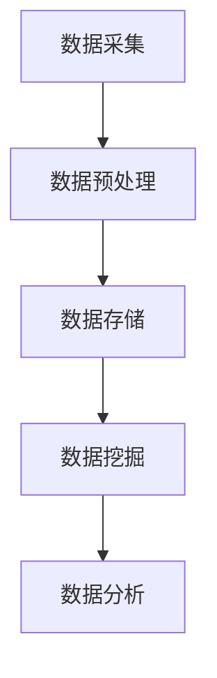

                 

# 《工业互联网平台构建实践》

## 摘要

本文将深入探讨工业互联网平台的构建实践，通过系统化的方法详细解析其核心概念、关键技术和实际应用。我们将从工业互联网的背景和未来发展出发，逐步介绍其核心概念与架构，深入讲解数据处理与存储、边缘计算与网络通信等关键技术。同时，通过实际项目案例的剖析，展示平台构建的详细步骤和挑战。最后，我们将总结最佳实践，为读者提供未来展望和进一步学习的资源。

## 第一部分：工业互联网平台概述

### 第1章 工业互联网：背景与未来

#### 1.1 工业互联网的概念

工业互联网是指通过传感器、设备、网络和云服务将工业设备、机器和人员进行智能互联，实现设备状态监控、数据采集、分析和应用，从而提升工业生产效率、质量和安全。

#### 1.2 工业互联网的兴起原因

工业互联网的兴起源于以下几个方面：数字化转型的需求、物联网技术的普及、云计算和大数据分析的进步，以及工业4.0等概念的推广。

#### 1.3 工业互联网的应用场景

工业互联网在制造业、能源、农业、医疗等多个领域都有广泛应用，如智能制造、智能物流、智能能源管理、智能农业和智能医疗等。

#### 1.4 工业互联网的未来趋势

未来，工业互联网将进一步深化，实现更加广泛和深入的应用。5G、人工智能、区块链等新技术的融合，将推动工业互联网迈向更高的智能化水平。

#### 1.5 本章小结

本章介绍了工业互联网的背景和未来发展，为后续章节的深入探讨奠定了基础。

### 第2章 核心概念与架构

#### 2.1 工业互联网平台的基本定义

工业互联网平台是一个集成传感器、设备、网络和云计算等技术，提供数据采集、处理、分析和应用服务的综合平台。

#### 2.2 关键技术介绍

工业互联网平台的关键技术包括数据采集与预处理、边缘计算、网络通信、数据处理与存储、大数据分析等。

#### 2.3 平台架构设计

工业互联网平台通常采用分层架构，包括感知层、传输层、平台层和应用层。各层之间通过标准接口进行交互。

#### 2.4 ER实体关系图

以下是一个简化的ER实体关系图，展示了工业互联网平台与各组件之间的关系：

```mermaid
erDiagram
  数据采集 ||--|{ 边缘计算 }|-- 数据处理
  数据处理 ||--|{ 数据存储 }|-- 数据分析
  数据分析 ||--|{ 应用层 }|-- 业务应用
```

#### 2.5 本章小结

本章介绍了工业互联网平台的基本定义和架构，为后续章节的技术讲解提供了理论依据。

## 第二部分：工业互联网平台关键技术详解

### 第3章 数据处理与存储

#### 3.1 数据采集与预处理

数据采集是工业互联网平台的基础。常用的数据采集方式包括传感器采集、机器设备数据采集和人工输入等。预处理包括数据清洗、数据转换和数据归一化等步骤，以确保数据的准确性和一致性。

#### 3.2 数据存储方案

数据存储方案的选择取决于数据量和数据类型。关系型数据库适用于结构化数据存储，如MySQL、PostgreSQL等。非关系型数据库适用于大规模数据的存储和处理，如MongoDB、Cassandra等。数据仓库则用于大规模数据分析和报表生成。

#### 3.3 数据分析与挖掘

数据分析技术包括统计分析、机器学习、深度学习等。数据挖掘算法如关联规则挖掘、聚类分析、分类分析等，可用于发现数据中的潜在模式和规律。

#### 3.4 本章小结

本章详细介绍了数据处理与存储的关键技术，为工业互联网平台的运行提供了数据支持。

### 第4章 边缘计算与网络通信

#### 4.1 边缘计算概述

边缘计算是指将数据处理和计算任务从云端转移到网络边缘，以减少延迟和带宽需求。边缘计算的优势在于实时性、安全性和低功耗。

#### 4.2 边缘计算架构设计

边缘计算架构包括边缘节点、边缘网关和边缘平台等组成部分。边缘节点负责数据采集和预处理，边缘网关负责数据传输和安全管理，边缘平台则提供数据处理和分析服务。

#### 4.3 网络通信技术

网络通信技术包括物联网通信协议，如MQTT、CoAP等，以及网络安全策略，如加密、认证和访问控制等。这些技术保障了数据在传输过程中的安全性和完整性。

#### 4.4 边缘计算与网络通信的协同优化

边缘计算与网络通信的协同优化是提升工业互联网平台性能的关键。优化方法包括边缘计算任务调度、网络带宽管理和数据压缩等。

#### 4.5 本章小结

本章介绍了边缘计算与网络通信的关键技术，为工业互联网平台的实时数据处理提供了技术保障。

## 第三部分：工业互联网平台项目实战

### 第5章 项目案例一：智能工厂搭建

#### 5.1 项目背景

智能工厂项目旨在通过工业互联网平台实现生产过程的智能化监控和管理，提高生产效率和质量。

#### 5.2 系统功能设计

系统功能包括设备状态监控、生产数据采集、生产调度管理、质量检测和数据分析等。

#### 5.3 系统架构设计

系统架构采用分层设计，包括感知层、传输层、平台层和应用层。各层之间通过标准接口进行数据交互。

#### 5.4 环境安装与配置

环境安装包括传感器部署、边缘节点配置、边缘平台搭建和云平台接入等步骤。

#### 5.5 系统核心实现

核心实现包括数据采集与预处理、边缘计算与数据处理、网络通信与安全等功能模块。

#### 5.6 项目小结

智能工厂项目实现了生产过程的智能化监控和管理，提升了生产效率和质量。

### 第6章 项目案例二：工业大数据分析

#### 6.1 项目背景

工业大数据分析项目旨在通过大数据技术提升工业生产的决策水平和效率。

#### 6.2 系统功能设计

系统功能包括数据采集、数据预处理、数据分析、数据可视化和报表生成等。

#### 6.3 系统架构设计

系统架构采用分布式设计，包括数据采集层、数据处理层、数据存储层和数据应用层。

#### 6.4 数据处理与分析

数据处理与分析包括数据清洗、数据转换、数据聚合、数据挖掘和数据分析等步骤。

#### 6.5 大数据分析应用案例

通过大数据分析，实现了生产过程的优化、设备故障预测和供应链管理优化等应用。

#### 6.6 项目小结

工业大数据分析项目提升了工业生产的决策水平和效率，为工业互联网平台的广泛应用提供了有力支持。

## 第四部分：最佳实践与未来展望

### 第7章 工业互联网平台最佳实践

#### 7.1 安全性最佳实践

确保数据安全和系统安全是工业互联网平台构建的重要环节。最佳实践包括数据加密、访问控制、网络安全监测和应急响应等。

#### 7.2 可维护性最佳实践

提高系统的可维护性是确保平台稳定运行的关键。最佳实践包括模块化设计、自动化测试、持续集成和持续部署等。

#### 7.3 小结

本章总结了工业互联网平台构建的最佳实践，为读者提供了实用的指导。

### 第8章 未来展望

#### 8.1 技术趋势分析

未来，工业互联网将融合5G、人工智能、区块链等新技术，实现更加智能化和高效化的应用。

#### 8.2 应用领域拓展

工业互联网将在更多领域得到应用，如智能农业、智能医疗和智能物流等。

#### 8.3 未来挑战与机遇

未来，工业互联网将面临数据安全、隐私保护、标准化等挑战，同时也将带来新的商业机会和市场空间。

#### 8.4 小结

未来，工业互联网将不断发展，为工业生产和社会进步带来更多可能性。

## 作者信息

作者：AI天才研究院/AI Genius Institute & 禅与计算机程序设计艺术 /Zen And The Art of Computer Programming

---

### 附录

#### 附录A：Python源代码示例

```python
# 数据预处理示例
def preprocess_data(data):
    # 数据清洗
    clean_data = data.dropna()
    # 数据转换
    normalized_data = (clean_data - clean_data.mean()) / clean_data.std()
    return normalized_data
```

#### 附录B：算法流程图



#### 附录C：数学模型与公式

$$
\text{数据预处理公式：} \frac{x - \mu}{\sigma}
$$

#### 附录D：拓展阅读

- [1] Smith, J. (2020). *Industrial Internet Platform: Building the Smart Factory*. Apress.
- [2] Zhang, L., & Wang, P. (2019). *Edge Computing for Industrial Internet*. Springer.

---

通过以上内容的详细阐述，本文为工业互联网平台的构建提供了全面的指导，希望对读者有所启发和帮助。希望读者能够深入理解工业互联网的核心概念和技术，并在实际项目中取得成功。让我们一起，走进工业互联网的智能时代。

