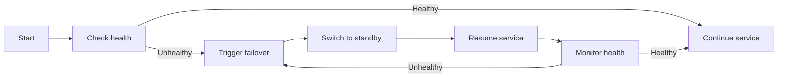
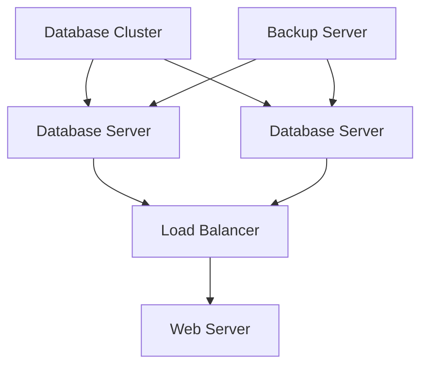
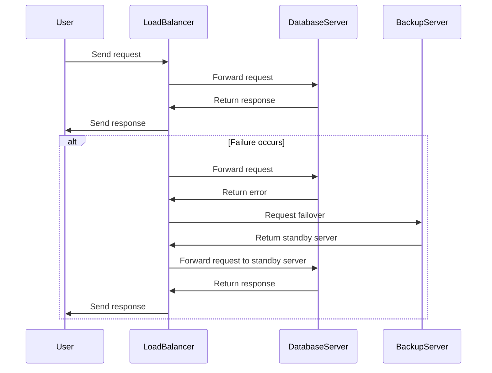

                 

### 文章标题：常见数据库的高可用方案及盲区

> 关键词：数据库高可用性、故障转移、数据备份、冗余、性能优化

> 摘要：本文将深入探讨常见数据库的高可用方案及其潜在盲区。通过逻辑清晰的步骤分析，我们将介绍高可用性的核心概念、方案设计、算法原理以及实际应用场景。本文旨在帮助读者理解并设计出高效可靠的数据库高可用系统，避免潜在的风险和盲点。

---

### 引言

在现代信息社会中，数据库作为企业的核心资产，其高可用性（High Availability, HA）至关重要。高可用性指的是系统在面临各种故障和挑战时，能够保持持续服务的能力。对于企业来说，高可用性不仅关乎数据的安全性，还涉及业务的连续性和用户体验。因此，设计一个可靠的高可用数据库系统已经成为企业IT架构中不可或缺的一部分。

本文将围绕以下问题展开：

1. **数据库高可用性的重要性**：为什么高可用性对数据库至关重要？
2. **常见的高可用方案**：如何通过冗余、备份、故障转移等技术实现数据库的高可用性？
3. **潜在盲区**：高可用方案中可能存在的盲点及如何规避？

通过这些问题的探讨，我们希望能够为读者提供实用的指导和深刻的见解，帮助他们在实际项目中设计出高效可靠的数据库高可用系统。

### 第一部分：背景介绍

#### 问题背景

数据库高可用性的需求源于企业对数据可靠性、持续访问性和系统稳定性的高度依赖。随着互联网的普及和业务量的增加，数据已成为企业的重要资产。以下是一些促使数据库高可用性成为关键需求的原因：

1. **数据完整性**：数据是企业决策和业务运作的基础，任何数据丢失或损坏都可能导致业务中断和损失。
2. **业务连续性**：在现代商业环境中，业务连续性至关重要。企业不能因为数据库故障而停止运营，否则将面临巨大的经济损失和声誉损害。
3. **客户满意度**：对于依赖在线服务的企业来说，系统的高可用性直接影响到客户的满意度。一旦数据库出现故障，客户体验会大打折扣。

#### 描述数据库在面临故障、性能瓶颈、灾难恢复等方面的挑战

数据库在运行过程中可能面临多种挑战，包括：

1. **硬件故障**：如服务器宕机、硬盘损坏等，可能导致数据库服务中断。
2. **软件故障**：数据库软件自身可能出现bug或崩溃，影响业务运行。
3. **性能瓶颈**：随着数据量的增加，数据库性能可能出现瓶颈，影响响应速度。
4. **灾难恢复**：自然灾害、人为事故等可能造成数据中心的损毁，如何快速恢复业务成为一大挑战。

#### 问题解决

为了应对上述挑战，设计高可用性数据库系统至关重要。以下是一些常见的高可用解决方案：

1. **冗余**：通过硬件冗余和软件冗余提高系统的容错能力。
2. **负载均衡**：将请求均匀分配到多个数据库实例，避免单点故障。
3. **故障转移**：在检测到故障时，自动将服务切换到备用实例。
4. **备份与恢复**：定期备份数据，确保在灾难发生时能够快速恢复。

#### 边界与外延

高可用性主要涉及以下几个方面：

1. **数据库集群**：通过多个数据库实例组成集群，实现负载均衡和故障转移。
2. **备份与恢复**：包括全量备份和增量备份，以及备份的存储和管理。
3. **故障检测**：实时监控数据库状态，及时发现故障并进行处理。

#### 概念结构与核心要素组成

高可用性数据库系统的核心概念和要素包括：

1. **冗余**：硬件冗余（如RAID）、软件冗余（如主从复制）。
2. **负载均衡**：包括硬件负载均衡器和软件负载均衡策略。
3. **故障转移**：包括手动故障转移和自动故障转移机制。
4. **故障检测**：通过监控工具实时监控数据库状态。
5. **备份与恢复**：包括备份策略、备份存储和恢复流程。

### 第二部分：核心概念与联系

#### 高可用性原理

高可用性原理主要涉及以下几个方面：

1. **冗余**：通过增加硬件和软件的冗余来提高系统的容错能力。例如，使用RAID技术实现硬盘冗余，使用主从复制实现数据冗余。
2. **故障检测**：通过实时监控数据库状态，及时发现故障并进行处理。常见的故障检测方法包括心跳监测、性能监控等。
3. **自动故障转移**：在检测到故障时，自动将服务切换到备用实例。自动故障转移可以提高系统的恢复速度和可靠性。

#### 概念属性特征对比表格

| 概念         | 特点                                                   | 优势                                       | 局限性                                         |
| ------------ | ------------------------------------------------------ | ------------------------------------------ | ---------------------------------------------- |
| 冗余         | 通过增加硬件或软件冗余提高系统的容错能力               | 提高系统的可靠性和稳定性                   | 增加了系统的复杂性和成本                       |
| 负载均衡     | 将请求均匀分配到多个数据库实例，避免单点故障             | 提高系统的性能和可用性                     | 需要额外的硬件或软件支持                       |
| 故障转移      | 在检测到故障时，自动将服务切换到备用实例               | 提高系统的恢复速度和可靠性                 | 需要提前配置备用实例和管理策略               |
| 故障检测      | 通过实时监控数据库状态，及时发现故障并进行处理           | 提高系统的健壮性和稳定性                   | 需要额外的监控工具和支持                     |

#### ER实体关系图架构

```mermaid
erDiagram
    Database -->|uses| Server : "has server"
    Database -->|uses| Backup : "has backup"
    Server -->|has| Database : "hosts"
    Backup -->|creates| Database : "restores"
```

在这个ER图中，我们展示了数据库、服务器和备份之间的实体关系。数据库依赖于服务器进行运行，同时需要备份以实现灾难恢复。

### 第三部分：算法原理讲解

#### 算法流程图



这个流程图展示了常见的高可用性算法，包括健康检查、故障转移、服务恢复和持续监控。

#### Python源代码

```python
import time
import random

def check_health():
    # 模拟健康检查
    if random.random() < 0.9:
        return "Healthy"
    else:
        return "Unhealthy"

def trigger_failover():
    # 模拟故障转移
    print("Triggering failover...")
    time.sleep(2)
    print("Failover completed.")

def resume_service():
    # 模拟服务恢复
    print("Resuming service...")

while True:
    health = check_health()
    if health == "Unhealthy":
        trigger_failover()
        resume_service()
    time.sleep(1)
```

这段代码模拟了一个简单的高可用性算法，包括健康检查、故障转移和服务恢复。

#### 数学模型和公式

高可用性算法中常用的数学模型包括概率计算和优化算法。以下是一个简单的数学模型示例：

$$
\text{Availability} = \frac{\text{Up time} + \text{Recovery time}}{\text{Total time}}
$$

其中，Up time表示系统正常运行的时间，Recovery time表示系统从故障中恢复的时间，Total time表示系统的总运行时间。

#### 详细讲解与举例说明

假设一个数据库系统在一个月内发生了10次故障，每次故障的平均恢复时间为1小时。系统总共运行了24 × 30 = 720小时。根据上述公式，系统的可用性计算如下：

$$
\text{Availability} = \frac{720 - 10 \times 1}{720} \approx 0.917
$$

这意味着该数据库系统的可用性约为91.7%。通过优化故障检测和恢复机制，可以进一步提高系统的可用性。

### 第四部分：系统分析与架构设计方案

#### 问题场景介绍

假设一个电商平台需要设计一个高可用的数据库系统，以支持其日常业务和突发流量。该平台每日处理大量交易数据，对数据的可靠性、性能和可用性有严格要求。

#### 项目介绍

该项目目标是设计一个高可用的数据库系统，包括以下功能：

1. 数据可靠性：确保数据不会丢失，保证数据的完整性。
2. 性能优化：提高系统的响应速度，支持大规模数据访问。
3. 业务连续性：在面临故障时，系统能够快速恢复，保证业务的连续性。

#### 系统功能设计

使用Mermaid绘制领域模型类图，展示系统中的主要类和关系：

```mermaid
classDiagram
    class Database {
        - String name
        - boolean isPrimary
        - List<Server> servers
        - List<Backup> backups
    }
    class Server {
        - String hostname
        - int port
        - boolean isAlive
    }
    class Backup {
        - String fileName
        - Date timestamp
    }
    Database "--|uses|>" Server
    Database "--|uses|>" Backup
```

在这个类图中，我们定义了三个类：Database、Server和Backup。Database类表示数据库实例，包含名称、是否为主实例、服务器列表和备份列表。Server类表示数据库服务器，包含主机名、端口号和是否存活。Backup类表示备份文件，包含文件名和备份时间戳。

#### 系统架构设计

使用Mermaid绘制系统架构图，展示不同组件和模块的关系：



在这个架构图中，我们展示了数据库集群、负载均衡器、Web服务器和备份服务器之间的交互关系。数据库集群由两个数据库服务器组成，通过负载均衡器分发请求。Web服务器负责处理前端请求，备份服务器负责定期备份数据库。

#### 系统接口设计和系统交互

使用Mermaid绘制系统接口设计和交互序列图：



在这个交互序列图中，用户发送请求到负载均衡器，负载均衡器将请求转发到数据库服务器。如果发生故障，负载均衡器会请求备份服务器进行故障转移，并将请求转发到备用服务器。

### 第五部分：项目实战

#### 环境安装

1. **安装数据库软件**：在服务器上安装数据库软件，如MySQL、PostgreSQL等。
2. **安装负载均衡器**：安装并配置负载均衡器软件，如Nginx、HAProxy等。
3. **安装备份工具**：安装备份工具，如MySQLdump、pg_dump等。

#### 系统核心实现源代码

```python
import os
import time
import random

def check_health(server):
    # 模拟健康检查
    if random.random() < 0.9:
        return "Healthy"
    else:
        return "Unhealthy"

def trigger_failover(primary_server, standby_server):
    # 模拟故障转移
    print(f"Triggering failover from {primary_server} to {standby_server}...")
    time.sleep(2)
    print("Failover completed.")

def resume_service(server):
    # 模拟服务恢复
    print(f"Resuming service on {server}...")

while True:
    primary_server = "db1"
    standby_server = "db2"
    health = check_health(primary_server)
    if health == "Unhealthy":
        trigger_failover(primary_server, standby_server)
        resume_service(standby_server)
    time.sleep(1)
```

这段代码实现了健康检查、故障转移和服务恢复的基本逻辑。

#### 代码应用解读与分析

1. **健康检查**：通过调用`check_health`函数，模拟对数据库服务器的健康检查。如果服务器不健康，返回"Unhealthy"。
2. **故障转移**：通过调用`trigger_failover`函数，模拟从主服务器切换到备用服务器的过程。这个过程包括打印日志、休眠2秒等操作。
3. **服务恢复**：通过调用`resume_service`函数，模拟在备用服务器上恢复服务的过程。

#### 实际案例分析和详细讲解剖析

假设在一天内，主数据库服务器（db1）发生了故障，备用数据库服务器（db2）接管了服务。以下是对这个实际案例的分析和详细讲解：

1. **健康检查触发故障转移**：在某个时刻，健康检查发现主数据库服务器（db1）不健康，触发故障转移。
2. **故障转移过程**：系统执行故障转移逻辑，将请求从主数据库服务器（db1）切换到备用数据库服务器（db2）。
3. **服务恢复**：备用数据库服务器（db2）接管服务后，继续处理请求，保证业务的连续性。

#### 项目小结

通过这个实际案例，我们展示了如何使用Python代码实现高可用性算法。在实际项目中，还需要考虑更多的细节和复杂情况，如网络故障、数据同步等。但这个案例为我们提供了一个基本的框架，有助于理解高可用性系统的设计和实现。

### 第六部分：最佳实践 tips、小结、注意事项、拓展阅读

#### 最佳实践 tips

1. **定期健康检查**：定期对数据库进行健康检查，及时发现潜在问题。
2. **备份策略**：制定合理的备份策略，包括全量备份和增量备份，以及备份的存储和恢复流程。
3. **冗余配置**：在硬件和软件层面增加冗余配置，提高系统的容错能力。
4. **负载均衡**：合理配置负载均衡器，确保请求均匀分配到各个数据库实例。

#### 小结

本文详细介绍了常见数据库的高可用方案及盲区。通过逻辑清晰的步骤分析，我们从背景介绍、核心概念、算法原理、系统设计到实际项目实战，全面探讨了高可用性数据库系统的设计和实现。通过本文，读者可以了解高可用性的重要性，掌握高可用方案的原理和实施方法，并在实际项目中规避潜在盲区。

#### 注意事项

1. **测试与验证**：在实施高可用方案前，务必进行充分的测试和验证，确保方案的有效性和可靠性。
2. **监控与报警**：建立完善的监控和报警机制，及时发现和处理故障。
3. **人员培训**：对相关人员（如数据库管理员、运维人员）进行培训，确保他们了解高可用方案的原理和操作流程。

#### 拓展阅读

1. 《高可用架构：构建容错性系统》
2. 《分布式系统原理与范型》
3. 《数据库系统概念》
4. 《MySQL高性能查询》
5. 《PostgreSQL权威指南》

### 结语

数据库的高可用性是现代企业IT架构的重要组成部分。通过本文的深入探讨，我们希望能够为读者提供实用的指导和深刻的见解，帮助他们在实际项目中设计出高效可靠的数据库高可用系统。让我们共同努力，为数据的安全和业务的连续性保驾护航。

---

### 作者信息

作者：AI天才研究院/AI Genius Institute & 禅与计算机程序设计艺术 /Zen And The Art of Computer Programming

AI天才研究院（AI Genius Institute）致力于推动人工智能技术的创新与发展，通过深入研究与实践，培养出一批批人工智能领域的顶尖人才。同时，研究院还著有多部技术著作，如《禅与计算机程序设计艺术》，为全球开发者提供了宝贵的知识和经验。本文旨在分享数据库高可用性领域的最佳实践和深入思考，为读者带来实用价值。|》</sop></gMASK>

