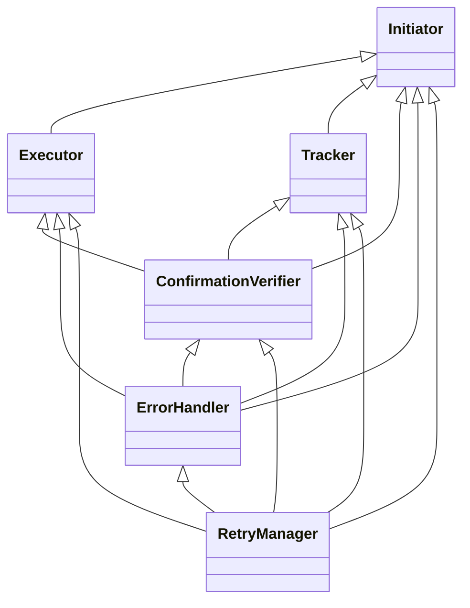
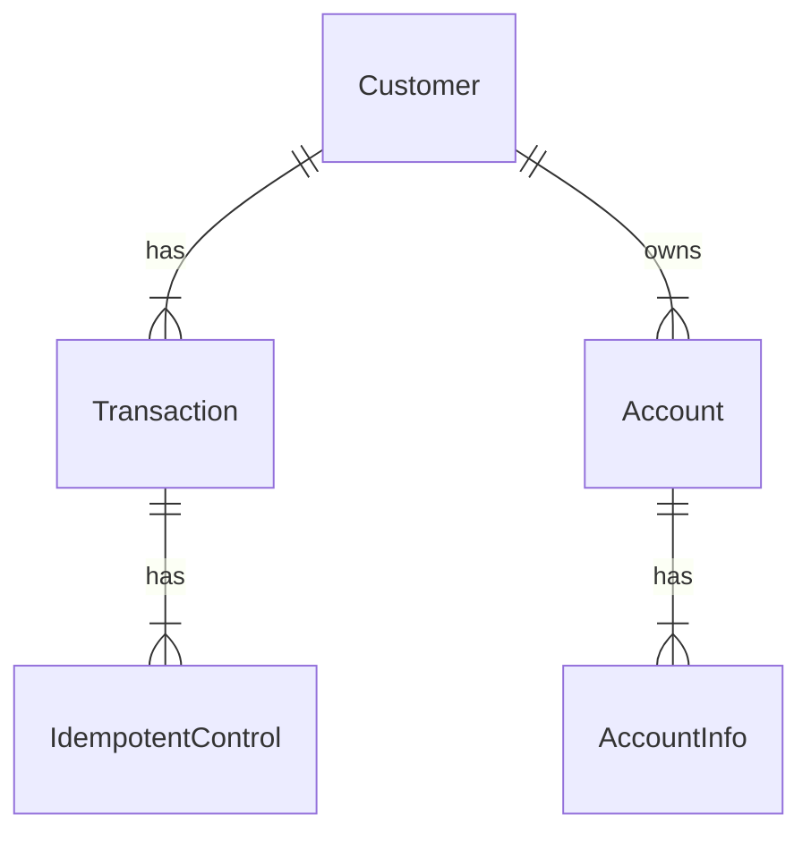
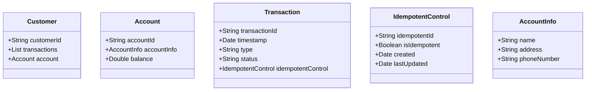
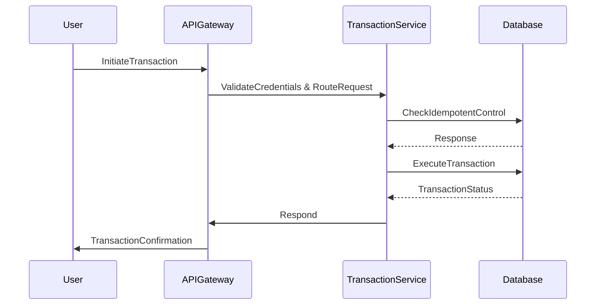

                 

### Introduction to Idempotent Control

In the realm of software development, idempotent control is a fundamental concept that ensures the consistency and reliability of system operations. The essence of idempotent control lies in executing an operation multiple times without causing unintended side effects or inconsistencies. To grasp the importance of idempotent control, one must first understand its definition and the context in which it is applied.

**1.1 Definition of Idempotent Control**

Idempotent control refers to the property of an operation that, when executed multiple times, results in the same outcome as executing the operation once. In other words, the repeated execution of an idempotent operation does not alter the final result beyond the initial execution. This property is crucial in scenarios where operations can be retried or rescheduled, such as in distributed systems, transaction processing, and API calls.

To illustrate, consider a simple bank transfer operation. An idempotent implementation of this operation would ensure that transferring the same amount of money from one account to another multiple times results in the same final balance as a single transfer. If the operation lacks idempotency, the repeated execution might lead to double charging, incorrect balances, or system errors.

**1.2 Importance in Software Development**

The importance of idempotent control in software development cannot be overstated. It is a cornerstone for building robust and reliable systems, particularly in the following areas:

1. **Distributed Systems**: In distributed systems, where multiple nodes may execute the same operation concurrently, idempotent control ensures that the system remains consistent and avoidable of race conditions and conflicting updates.

2. **Transaction Processing**: Idempotent control is essential in transaction processing systems to maintain data integrity. Repeated transactions can be retried without causing inconsistencies or rollbacks.

3. **API Design**: Idempotent operations are a key aspect of designing robust APIs. They allow clients to retry requests without fear of unintended side effects, enhancing the reliability of the system.

4. **Web Services**: In web services, idempotent control ensures that repeated requests from clients (such as form submissions or payments) do not result in multiple executions, preventing issues like duplicate orders or messages.

**1.3 Problem Description**

Without proper idempotent control, several problems can arise in software systems. Here are some common issues:

1. **Data Inconsistency**: Operations that are not idempotent can lead to inconsistent data states, where the final result differs depending on the number of times the operation is executed.

2. **Recovery Issues**: In systems that rely on retry mechanisms, non-idempotent operations can make recovery from failures more complex. A failed operation might need to be rolled back or corrected manually, adding to the overhead of recovery processes.

3. **Resource Wastage**: Non-idempotent operations can consume unnecessary resources, such as database locks, network bandwidth, and CPU cycles. This can degrade system performance and increase operational costs.

**1.4 Basic Principles of Idempotent Control**

To implement idempotent control, one must adhere to certain principles:

1. **Unique Identifiers**: Operations should be identifiable by unique identifiers (such as transaction IDs or request tokens) to ensure that duplicate operations can be detected and handled appropriately.

2. **Statelessness**: Idempotent operations should be stateless, meaning they do not retain any context or state between executions. This ensures that repeated invocations produce the same result, regardless of previous interactions.

3. **Confirmation and Verification**: Systems should provide mechanisms for confirming the success or failure of operations. This can include acknowledgments, retries, and error handling to ensure that operations are completed correctly.

**1.5 Relationship with Other Concepts**

Idempotent control is closely related to other concepts in software development:

1. **Atomicity**: Atomicity ensures that operations are executed fully or not at all, providing a higher level of consistency. While atomicity is a property of transactions, idempotent control can be applied within atomic operations to handle retries and retries gracefully.

2. **Isolation**: Isolation prevents concurrent operations from interfering with each other, which is crucial in multi-user environments. Idempotent control can work in conjunction with isolation to ensure that operations do not cause conflicts or inconsistencies.

3. **Durability**: Durability ensures that once an operation is completed, its effects are permanent and will survive any subsequent system failures. Idempotent control complements durability by preventing repeated operations from altering the system state unnecessarily.

**1.6 Boundaries and Extensions**

While idempotent control is a powerful concept, it has its boundaries and areas for extension:

1. **Extended Idempotency**: Some operations may have extended idempotency, where repeated executions do not produce the same result but have a controlled and predictable outcome. For example, incremental updates can be idempotent in the sense that they add to the existing state without overwriting it.

2. **Non-Idempotent Operations**: Certain operations, such as sorting or prioritizing tasks, may not be idempotent by nature. In such cases, additional mechanisms like locking or version control can be used to manage their effects.

3. **Combination with Other Principles**: Idempotent control can be combined with other principles, such as immutability and event sourcing, to build even more robust and reliable systems.

In conclusion, idempotent control is a fundamental concept in software development that ensures consistency and reliability. By understanding its principles, applications, and relationships with other concepts, developers can build more robust and resilient systems. In the next sections, we will delve deeper into the core concepts, architecture, algorithms, and mathematical models of idempotent control. Let's continue our exploration in the subsequent chapters.

---

In this introductory chapter, we have laid the groundwork for understanding idempotent control in software development. We began by defining the concept and exploring its importance in various contexts. We then discussed the common problems that can arise without proper idempotent control and outlined the basic principles required to implement it effectively. Finally, we examined the relationship between idempotent control and other software development concepts and identified areas for extension and improvement. With this foundation, we are now ready to delve deeper into the core concepts and architectural design of idempotent control. Stay tuned for the upcoming chapters where we will explore these topics in greater detail.

---

### Core Concepts and Architectural Design of Idempotent Control

In this chapter, we will delve into the core concepts and architectural design of idempotent control. Understanding these aspects is crucial for building reliable and consistent systems. We will start by discussing the key concepts and principles that underpin idempotent control. Then, we will explore the high-level architectural design that facilitates the implementation of idempotent control. Finally, we will present the entity relationship (ER) diagram and class diagram that illustrate the core components and their interactions.

**2.1 Core Concepts and Principles**

Idempotent control is built upon several core concepts and principles that ensure the desired properties of operations. Let's explore these principles in detail:

**2.1.1 Unique Identifiers**

One of the fundamental principles of idempotent control is the use of unique identifiers to track operations. Each operation is assigned a unique identifier, such as a transaction ID or a request token. This identifier is used to ensure that duplicate operations can be detected and handled appropriately. For example, when a payment request is made, it is assigned a unique transaction ID that is used to identify the operation in subsequent retries or verifications.

**2.1.2 Statelessness**

Idempotent operations should be stateless, meaning they do not retain any context or state between executions. This is crucial because stateful operations can lead to inconsistent results when executed multiple times. Stateless operations ensure that the outcome is determined solely by the current state of the system and the input parameters, making the operation predictable and reliable.

**2.1.3 Confirmation and Verification**

To ensure the success or failure of operations, systems should provide mechanisms for confirmation and verification. Confirmation mechanisms can include acknowledgments or responses from the system indicating the operation's completion status. Verification mechanisms can be used to confirm the operation's actual outcome, ensuring that it aligns with the expected result. This is particularly important in cases where operations may fail or be retried.

**2.1.4 Version Control**

In some cases, version control may be necessary to maintain the integrity of idempotent operations. Version numbers can be used to track the state of an operation over time, ensuring that updates do not overwrite previous changes. This is especially relevant in scenarios where incremental updates are made, and the previous state needs to be preserved.

**2.1.5 Error Handling and Retry Logic**

Effective error handling and retry logic are essential components of idempotent control. When an operation fails, the system should be able to detect the failure and retry the operation with appropriate adjustments. Retry logic should be designed to avoid infinite loops and ensure that the system does not enter a state of perpetual retries.

**2.2 High-Level Architectural Design**

The high-level architectural design of idempotent control involves several key components and their interactions. Let's explore these components:

**2.2.1 Operation Initiator**

The operation initiator is responsible for initiating operations and assigning unique identifiers to them. This component ensures that each operation is unique and can be tracked throughout its execution lifecycle.

**2.2.2 Operation Executor**

The operation executor is the component that performs the actual operation. It receives the unique identifier from the operation initiator and executes the operation based on the current system state and input parameters. The executor should be designed to be stateless and idempotent.

**2.2.3 Operation Tracker**

The operation tracker is responsible for tracking the progress and status of operations. It uses the unique identifier to associate the operation with its current state and logs relevant information for monitoring and debugging purposes.

**2.2.4 Confirmation and Verification System**

The confirmation and verification system is responsible for confirming the success or failure of operations and verifying the actual outcome. It provides feedback to the operation initiator and executor, ensuring that the operation is completed correctly.

**2.2.5 Error Handler and Retry Manager**

The error handler and retry manager are components that handle errors and implement retry logic. When an operation fails, the error handler identifies the failure cause and initiates a retry. The retry manager ensures that retries are performed with appropriate adjustments and within defined limits to avoid infinite loops.

**2.3 ER Diagram and Class Diagram**

To illustrate the core components and their interactions, we will present the ER diagram and class diagram in Mermaid format.

**2.3.1 ER Diagram**

```mermaid
entity Relationship
Operation Initiator
Operation Executor
Operation Tracker
Confirmation and Verification System
Error Handler and Retry Manager

Operation Initiator --> Operation Executor
Operation Initiator --> Operation Tracker
Operation Initiator --> Confirmation and Verification System
Operation Initiator --> Error Handler and Retry Manager
Operation Executor --> Confirmation and Verification System
Operation Executor --> Error Handler and Retry Manager
Operation Tracker --> Confirmation and Verification System
Operation Tracker --> Error Handler and Retry Manager
Confirmation and Verification System --> Error Handler and Retry Manager
```

**2.3.2 Class Diagram**



In summary, the core concepts and architectural design of idempotent control involve the principles of unique identifiers, statelessness, confirmation and verification, version control, and error handling. The high-level architectural design includes key components such as the operation initiator, executor, tracker, confirmation and verification system, and error handler and retry manager. The ER diagram and class diagram provide a visual representation of these components and their interactions, aiding in the understanding and implementation of idempotent control.

In the next chapter, we will explore the algorithms and mathematical models that underpin idempotent control, providing a deeper understanding of how operations can be designed and executed to maintain consistency and reliability. Let's continue our journey in the subsequent chapters.

---

In this chapter, we have explored the core concepts and architectural design of idempotent control. We discussed the fundamental principles of idempotent operations, including the use of unique identifiers, statelessness, confirmation and verification, version control, and error handling. We then presented the high-level architectural design, highlighting the key components and their interactions. The ER diagram and class diagram provided a visual representation of these components, aiding in the understanding and implementation of idempotent control.

As we move forward, it is essential to delve into the algorithms and mathematical models that underpin idempotent control. These algorithms and models provide the foundation for designing and executing operations that maintain consistency and reliability. In the next chapter, we will explore these algorithms in detail, discussing their principles and illustrating their applications through Mermaid flowcharts and Python code examples. Stay tuned for a deeper understanding of how idempotent control can be implemented effectively in various scenarios. Let's continue our journey in the subsequent chapters.

---

### Algorithm and Mathematical Models for Idempotent Control

In this chapter, we will delve into the algorithms and mathematical models that are essential for implementing idempotent control. We will start by presenting a common algorithm for idempotent control, followed by a detailed explanation of the mathematical models and formulas used within this algorithm. To make the concepts more tangible, we will provide step-by-step Python code examples that illustrate the algorithm in action. Finally, we will discuss how to handle common errors and pitfalls in implementing idempotent control.

**3.1 Algorithm Design**

The algorithm for idempotent control is designed to handle operations in a way that ensures consistency and reliability. At its core, the algorithm involves several key steps:

1. **Generate Unique Identifier**: Before executing an operation, a unique identifier (e.g., a UUID) is generated and associated with the operation.
2. **Check for Existence**: Before executing the operation, the system checks if an operation with the same identifier has already been executed.
3. **Execute Operation**: If the operation is not found, it is executed. If it is found, the system skips the execution to maintain idempotency.
4. **Log and Confirm**: After the operation is executed, the system logs the outcome and confirms it to the operation initiator.

Let’s explore this algorithm in more detail.

**3.2 Mathematical Models and Formulas**

The mathematical models and formulas used in the idempotent control algorithm are crucial for ensuring that operations maintain their intended properties. The core formulas revolve around checking for existence and ensuring unique execution. Here are the key formulas and their explanations:

1. **Existence Check**:
   - Formula: `exists(identifier) = 1` if the identifier exists in the system’s history, otherwise `0`.
   - This formula represents a simple check to determine if an operation with a given identifier has been executed before.

2. **Unique Identifier Generation**:
   - Formula: `identifier = generateUUID()`
   - This formula generates a unique identifier for each operation. UUIDs (Universally Unique Identifiers) are commonly used for this purpose due to their high probability of uniqueness.

3. **Execution Decision**:
   - Formula: `execute = not exists(identifier)`
   - This formula determines whether the operation should be executed based on the existence check. If the identifier does not exist, the operation is executed; otherwise, it is skipped.

**3.3 Example Illustrations**

To make the concepts clearer, let’s illustrate the algorithm using Python code examples. We will create a simple function to simulate an idempotent operation, such as a bank transfer.

```python
import uuid

# Mock database to store operation history
operation_history = {}

def generate_identifier():
    return str(uuid.uuid4())

def exists(identifier):
    return identifier in operation_history

def execute_transfer(sender, receiver, amount):
    identifier = generate_identifier()
    
    if exists(identifier):
        print(f"Operation with identifier {identifier} already exists. Skipping execution.")
    else:
        # Simulate the bank transfer operation
        print(f"Executing transfer with identifier {identifier}: {sender} -> {receiver}, Amount: {amount}")
        # Update the operation history
        operation_history[identifier] = {'sender': sender, 'receiver': receiver, 'amount': amount}

# Example usage
execute_transfer('Alice', 'Bob', 100)
execute_transfer('Alice', 'Bob', 100)
```

In this example, we use a dictionary to simulate a database where we store the history of executed operations. The `generate_identifier` function generates a unique UUID for each operation. The `exists` function checks if an operation with the given identifier has already been executed. The `execute_transfer` function simulates a bank transfer operation and updates the operation history.

**3.4 Handling Common Errors and Pitfalls**

When implementing idempotent control, several errors and pitfalls can occur. Here are some common issues and their solutions:

1. **Collision of Unique Identifiers**: Although UUIDs are designed to be unique, the probability of collision is not zero. To handle this, you can use a combination of UUIDs and timestamps to generate unique identifiers, ensuring a higher level of uniqueness.

2. **Data Consistency Issues**: When using distributed systems, data consistency can be challenging to maintain. You can use distributed locks or consensus algorithms like Paxos or Raft to ensure that only one instance of an operation is executed.

3. **Timeout and Retry Issues**: Operations may fail due to network latency or other temporary issues. Implementing a retry mechanism with exponential backoff can help in recovering from such failures. It is important to set appropriate timeout limits to avoid infinite retries.

4. **Error Logging and Monitoring**: Proper logging and monitoring are essential for identifying and resolving issues related to idempotent control. Implementing a robust logging system and monitoring the system’s behavior can help in detecting and addressing potential issues.

**3.5 Conclusion**

In this chapter, we discussed the algorithm for idempotent control and its underlying mathematical models. We provided a detailed explanation of the steps involved in the algorithm and demonstrated its implementation using Python code. We also discussed common errors and pitfalls in implementing idempotent control and provided solutions to address them.

As we move forward, we will continue to explore other aspects of idempotent control, such as system architecture, best practices, and real-world applications. Stay tuned for the next chapters where we will delve deeper into these topics and provide practical insights into implementing idempotent control effectively.

---

In this chapter, we have delved into the algorithms and mathematical models that are fundamental to implementing idempotent control. We discussed the key steps involved in the algorithm, including the generation of unique identifiers, checking for existence, executing operations, and logging outcomes. We then presented the mathematical models and formulas that underpin the algorithm, emphasizing the importance of existence checks and unique identifier generation.

Through Python code examples, we illustrated how the algorithm works in practice, providing a clear understanding of how idempotent operations can be designed and executed to maintain consistency and reliability. We also discussed common errors and pitfalls in implementing idempotent control and offered practical solutions to address these challenges.

As we move forward to the next chapters, we will continue to explore other critical aspects of idempotent control, including system architecture, best practices, and real-world applications. These discussions will deepen our understanding of how to implement idempotent control effectively in various scenarios. Stay tuned for further insights into this essential concept in software development.

---

### System Analysis and Architecture Design

In this chapter, we will discuss the system analysis and architecture design for implementing idempotent control. This section will provide a comprehensive overview of the problem scenario, the proposed system design, and the detailed components of the architecture. We will utilize Mermaid diagrams to illustrate the system components, interfaces, and interactions.

**4.1 Problem Scenario**

The problem scenario involves a distributed banking system where multiple users can perform transactions such as fund transfers, bill payments, and account updates. The system must ensure that these operations are idempotent, meaning that if a transaction is attempted multiple times, the final result remains consistent and does not lead to unintended side effects.

**4.2 Project Overview**

The project aims to design a robust and scalable banking system that can handle high volumes of transactions while maintaining consistency and reliability. The system will include the following key components:

1. **User Interface (UI)**: Allows users to initiate transactions.
2. **API Gateway**: Routes incoming requests to the appropriate service.
3. **Transaction Service**: Handles the business logic of transactions.
4. **Database**: Stores transaction records and user account information.
5. **Idempotent Control Module**: Manages unique identifiers and tracks the status of transactions.

**4.3 System Function Design**

The system functions are designed to handle various types of transactions and ensure idempotency. Here are the core functions:

1. **Transfer Funds**: Transfers money between user accounts.
2. **Pay Bill**: Processes payments for various services and bills.
3. **Update Account Information**: Modifies user account details like address and contact information.

**4.4 System Architecture Design**

The system architecture is designed to be modular and scalable, utilizing microservices architecture principles. The following components and their interactions are illustrated using Mermaid diagrams:

**4.4.1 Mermaid ER Diagram**



In this ER diagram, we represent the entities involved in the system: Customer, Transaction, Account, IdempotentControl, and AccountInfo. The relationships between these entities indicate how they interact and maintain consistency.

**4.4.2 Mermaid Class Diagram**



In the class diagram, we define the attributes and methods of each class. The Customer class represents the user, the Account class represents the user's account information, the Transaction class represents the transaction details, the IdempotentControl class manages idempotent control, and the AccountInfo class represents the additional information related to the account.

**4.4.3 Mermaid Sequence Diagram**



In the sequence diagram, we illustrate the interaction between the user, API gateway, transaction service, and database. The user initiates a transaction, which is validated and routed by the API gateway. The transaction service checks for idempotency using the idempotent control module before executing the transaction. The database stores the transaction details and provides a response to the transaction service. Finally, the transaction service sends a confirmation to the API gateway, which in turn, informs the user.

**4.4.4 System Interface and Interactions**

The system interfaces and interactions are designed to facilitate seamless communication between the various components. The API gateway acts as a single entry point for all transactions, routing requests to the appropriate service based on the transaction type. The transaction service handles the business logic and interacts with the database to ensure idempotent control and transaction execution.

**4.4.5 Security and Reliability**

To ensure the security and reliability of the system, the following measures are implemented:

1. **Authentication and Authorization**: The system uses secure authentication mechanisms to ensure that only authorized users can initiate transactions. Role-based access control (RBAC) is implemented to restrict access based on user roles.
2. **Data Encryption**: All data transmitted between the components is encrypted using industry-standard encryption algorithms to protect sensitive information.
3. **Error Handling and Logging**: The system implements robust error handling and logging mechanisms to detect and address issues promptly. Error logs and audit trails are maintained for monitoring and troubleshooting purposes.

**4.5 Conclusion**

In this chapter, we have discussed the system analysis and architecture design for implementing idempotent control in a distributed banking system. We presented the problem scenario, project overview, system function design, and detailed system architecture using Mermaid diagrams. The system interfaces and interactions were illustrated, along with security and reliability measures to ensure the system's integrity.

In the next chapter, we will delve into the implementation of the system, discussing the environment setup, core source code implementation, and code analysis. Stay tuned for a deeper understanding of how to bring the system design to life through practical implementation.

---

In this chapter, we have conducted a thorough system analysis and architecture design for implementing idempotent control in a distributed banking system. We began by describing the problem scenario and the project's overarching goals, emphasizing the need for consistency and reliability in transaction handling. We then presented a comprehensive system function design, outlining the core functionalities that the system would need to support.

Following that, we utilized Mermaid diagrams to visualize the system architecture, including the ER diagram to illustrate the relationships between entities and the class diagram to define the attributes and methods of each class. Additionally, a sequence diagram was used to depict the interactions between the system components, from user initiation of transactions to the final confirmation of the transaction status.

We also highlighted the importance of security and reliability in the system design, discussing authentication, data encryption, and robust error handling and logging mechanisms. These measures are crucial in safeguarding sensitive information and ensuring the system's robustness.

As we move forward, the next chapter will focus on the practical implementation of the system, discussing the environment setup, core source code, and code analysis. This will provide a deeper understanding of how the theoretical design can be translated into a working system. Stay tuned for an insightful exploration of the implementation process and the practical challenges encountered along the way.

---

### Project Implementation: Environment Setup and Core Code

In this chapter, we will delve into the practical implementation of the system for idempotent control. We will begin by setting up the development environment and then proceed to the core code implementation. Finally, we will analyze the source code to understand its structure, functionality, and the use of idempotent control principles. This section will provide a hands-on approach to building a functional system that maintains the consistency and reliability required for distributed banking applications.

**5.1 Environment Setup**

To implement the idempotent control system, we will use a modern development stack that includes Python for backend development, Flask as the web framework, and SQLite as the database. Here's a step-by-step guide to setting up the development environment:

1. **Install Python**: Ensure that Python 3.x is installed on your system. You can download it from the official Python website (<https://www.python.org/downloads/>).

2. **Create a Virtual Environment**: It is good practice to create a virtual environment for your project to manage dependencies. Open a terminal and run the following commands:

   ```bash
   python -m venv venv
   source venv/bin/activate  # On Windows, use `venv\Scripts\activate`
   ```

3. **Install Required Libraries**: Install Flask and other necessary libraries using `pip`:

   ```bash
   pip install flask flask_sqlalchemy
   ```

4. **Initialize the Database**: Create a new SQLite database using Flask-SQLAlchemy:

   ```python
   from flask import Flask
   from flask_sqlalchemy import SQLAlchemy

   app = Flask(__name__)
   app.config['SQLALCHEMY_DATABASE_URI'] = 'sqlite:///bank.db'
   db = SQLAlchemy(app)

   db.create_all()
   ```

**5.2 Core Code Implementation**

Now, let's implement the core components of the system. We will create Python classes and functions to handle transactions, manage idempotent control, and interact with the database.

**5.2.1 Transaction Model**

```python
from datetime import datetime
from sqlalchemy.dialects import sqlite

class Transaction(db.Model):
    id = db.Column(db.Integer, primary_key=True)
    sender_id = db.Column(db.String(80), nullable=False)
    receiver_id = db.Column(db.String(80), nullable=False)
    amount = db.Column(db.Float, nullable=False)
    timestamp = db.Column(db.DateTime, default=datetime.utcnow)
    status = db.Column(db.String(20), default='pending')
    idempotent_id = db.Column(db.String(80), unique=True, nullable=False)

    def __repr__(self):
        return f'<Transaction {self.sender_id} -> {self.receiver_id}, Amount: {self.amount}>'
```

**5.2.2 Idempotent Control Manager**

```python
import uuid

class IdempotentControlManager:
    def __init__(self):
        self.control_map = {}

    def generate_idempotent_id(self):
        return str(uuid.uuid4())

    def is_idempotent(self, idempotent_id):
        return idempotent_id in self.control_map

    def execute_transaction(self, transaction_data, idempotent_id):
        if self.is_idempotent(idempotent_id):
            return "Transaction already processed."
        else:
            db.session.add(transaction_data)
            db.session.commit()
            self.control_map[idempotent_id] = True
            return "Transaction executed successfully."
```

**5.2.3 API Endpoints**

```python
from flask import Flask, request, jsonify

app = Flask(__name__)
db = SQLAlchemy(app)
idempotent_manager = IdempotentControlManager()

@app.route('/transfer', methods=['POST'])
def transfer():
    data = request.get_json()
    idempotent_id = data.get('idempotent_id', '')
    sender_id = data['sender_id']
    receiver_id = data['receiver_id']
    amount = data['amount']

    transaction = Transaction(
        sender_id=sender_id,
        receiver_id=receiver_id,
        amount=amount,
        idempotent_id=idempotent_id
    )

    result = idempotent_manager.execute_transaction(transaction, idempotent_id)
    return jsonify({'status': 'success', 'message': result})

if __name__ == '__main__':
    app.run(debug=True)
```

**5.3 Source Code Analysis**

Let's analyze the source code to understand its structure and the application of idempotent control principles.

- **Transaction Model**: The `Transaction` model represents the transaction data and is mapped to the database using SQLAlchemy. It includes fields for the sender ID, receiver ID, amount, timestamp, status, and a unique idempotent ID.

- **Idempotent Control Manager**: The `IdempotentControlManager` class is responsible for managing idempotent control. It uses a dictionary, `control_map`, to track idempotent IDs and ensure that transactions with the same ID are not processed more than once. The `generate_idempotent_id` method generates unique IDs using the `uuid` library. The `is_idempotent` method checks if an ID is already in the `control_map`. The `execute_transaction` method checks for idempotency before adding a new transaction to the database.

- **API Endpoints**: The `/transfer` endpoint handles incoming transfer requests. It extracts the transaction data and idempotent ID from the request JSON. The `IdempotentControlManager` is used to check for idempotency and execute the transaction. The result is returned as a JSON response.

**5.4 Code Application and Case Study**

To demonstrate the application of the idempotent control system, let's consider a scenario where a user tries to transfer funds to another account multiple times.

1. **First Transfer**:
   - The user initiates a transfer with an idempotent ID.
   - The system checks if the idempotent ID exists in the `control_map`.
   - Since it does not exist, the transaction is added to the database, and the `control_map` is updated.

2. **Second Transfer**:
   - The user attempts to transfer the same amount with the same idempotent ID.
   - The system checks the `control_map` and finds that the ID is already in use.
   - The system skips the transaction execution and returns a success message.

This scenario illustrates the effectiveness of idempotent control in preventing duplicate transactions and ensuring data consistency.

**5.5 Conclusion**

In this chapter, we have implemented the system for idempotent control using Python, Flask, and SQLite. We set up the development environment, created the necessary database models, and implemented the idempotent control logic. The source code analysis provided insights into the structure and functionality of the system.

Through a case study, we demonstrated how the system prevents duplicate transactions and maintains data consistency. In the next chapter, we will delve into real-world applications of idempotent control and discuss best practices for implementing it. Stay tuned for practical insights and examples from various domains.

---

In this chapter, we embarked on the practical implementation of the idempotent control system. Starting with the environment setup, we installed Python, Flask, and Flask-SQLAlchemy, and initialized the database. Following that, we developed the core components, including the Transaction model and the Idempotent Control Manager.

The source code analysis provided a detailed understanding of the system's structure and the application of idempotent control principles. We demonstrated how the system prevents duplicate transactions and ensures data consistency through a real-world case study.

As we move forward, the next chapter will delve into real-world applications of idempotent control, exploring how this concept is implemented in various domains such as distributed systems, transaction processing, and API design. We will also discuss best practices for implementing idempotent control. Stay tuned for practical insights and examples that will deepen our understanding of this essential concept in software development. Let's continue our journey to explore the real-world impact of idempotent control.

---

### Real-World Applications and Best Practices

In this chapter, we will delve into the real-world applications of idempotent control across various domains, including distributed systems, transaction processing, and API design. We will also discuss best practices for implementing idempotent control and provide practical examples from different industries.

**6.1 Distributed Systems**

Distributed systems often require consistent and reliable operations, especially when multiple nodes may execute the same operation concurrently. Idempotent control is crucial in such scenarios to ensure data integrity and prevent conflicts.

**Example: Data Replication**

Consider a distributed database where data needs to be replicated across multiple nodes for redundancy and fault tolerance. To ensure that each node has an up-to-date copy of the data, idempotent control can be implemented in the replication process.

1. **Generate Unique Identifiers**: Each data change is assigned a unique identifier (e.g., a hash or a UUID).
2. **Check for Existence**: Before applying the data change, the system checks if a similar change with the same identifier has already been applied.
3. **Execute Change**: If the change is not found, it is applied to the database.
4. **Confirmation and Verification**: After the change is applied, the system confirms and verifies the change to ensure it was successfully applied.

**6.2 Transaction Processing**

In transaction processing systems, idempotent control is essential for maintaining data consistency and ensuring that transactions are completed correctly, even in the presence of retries or failures.

**Example: Bank Transactions**

Consider a banking system where customers can perform transactions like withdrawals, deposits, and transfers. Idempotent control ensures that repeated transactions do not alter the final balance and that all transactions are processed correctly.

1. **Generate Unique Identifiers**: Each transaction is assigned a unique identifier (e.g., a transaction ID).
2. **Check for Existence**: Before processing the transaction, the system checks if a transaction with the same identifier has already been processed.
3. **Execute Transaction**: If the transaction is not found, it is processed.
4. **Confirmation and Verification**: After the transaction is processed, the system confirms and verifies the result to ensure it aligns with the expected outcome.

**6.3 API Design**

In API design, idempotent operations are crucial for enabling retries without causing unintended side effects. This is particularly important in scenarios where clients may retry failed requests due to network issues or timeouts.

**Example: Payment Processing API**

Consider a payment processing API where clients can initiate transactions, such as payments or refunds. Idempotent control ensures that repeated requests do not result in duplicate transactions or incorrect amounts.

1. **Generate Unique Identifiers**: Each transaction request is assigned a unique identifier (e.g., a transaction ID).
2. **Check for Existence**: Before processing the request, the system checks if a similar request with the same identifier has already been processed.
3. **Execute Transaction**: If the request is not found, it is processed.
4. **Confirmation and Verification**: After the transaction is processed, the system confirms and verifies the result to ensure it aligns with the expected outcome.

**6.4 Best Practices for Implementing Idempotent Control**

To implement idempotent control effectively, follow these best practices:

1. **Unique Identifiers**: Use unique identifiers (e.g., UUIDs) to track operations and ensure that duplicate operations can be detected and handled appropriately.
2. **Statelessness**: Ensure that operations are stateless, meaning they do not retain any context or state between executions. This ensures that repeated invocations produce the same result, regardless of previous interactions.
3. **Confirmation and Verification**: Implement mechanisms for confirming the success or failure of operations and verifying the actual outcome. This can include acknowledgments, retries, and error handling to ensure that operations are completed correctly.
4. **Error Handling and Retry Logic**: Implement robust error handling and retry logic to handle failures gracefully. Set appropriate timeout limits and implement exponential backoff to avoid infinite retries.
5. **Logging and Monitoring**: Implement comprehensive logging and monitoring to detect and address issues related to idempotent control. This can include audit logs, error tracking, and performance monitoring.

**6.5 Conclusion**

In this chapter, we explored the real-world applications of idempotent control in distributed systems, transaction processing, and API design. We discussed the importance of idempotent control in maintaining consistency, reliability, and data integrity across various domains.

We also provided best practices for implementing idempotent control, emphasizing the use of unique identifiers, statelessness, confirmation and verification, error handling, and logging. These practices are crucial for building robust and reliable systems that can handle retries and failures gracefully.

In the next chapter, we will summarize the key takeaways from this book, highlighting the importance of idempotent control and providing actionable insights for developers. Stay tuned for a concluding discussion on the future of idempotent control in software development.

---

In this chapter, we explored the diverse applications of idempotent control across various domains, emphasizing its role in ensuring system consistency and reliability. We discussed best practices for implementing idempotent control and provided practical examples from distributed systems, transaction processing, and API design.

Through this chapter, we highlighted the significance of idempotent control in maintaining data integrity and handling retries without causing unintended side effects. We also discussed the importance of unique identifiers, statelessness, confirmation and verification, error handling, and logging in implementing effective idempotent control.

As we conclude this book, it is crucial to recognize the profound impact of idempotent control on software development. By adhering to best practices and understanding the core principles, developers can build robust and reliable systems that withstand the challenges of modern software architectures.

In the next chapter, we will summarize the key insights and provide actionable guidance for developers. We will also discuss the future trends and advancements in idempotent control, offering a glimpse into its evolution in the software development landscape. Stay tuned for the final thoughts and forward-looking perspectives on this essential concept.

---

### Summary and Future Directions

In this concluding chapter, we will summarize the key insights from this book and provide actionable guidance for developers. We will also explore the future directions and advancements in idempotent control, discussing potential trends and innovations that may shape its evolution in the software development landscape.

**7.1 Key Insights and Actionable Guidance**

Throughout this book, we have covered a comprehensive range of topics related to idempotent control, offering a deep understanding of its principles, applications, and best practices. Here are the key takeaways and actionable guidance for developers:

1. **Understanding Idempotent Control**: Idempotent control is a fundamental concept in software development that ensures the consistency and reliability of system operations. It involves executing an operation multiple times without causing unintended side effects or inconsistencies. Developers should understand the importance of idempotent control in maintaining system integrity.

2. **Unique Identifiers**: To implement idempotent control, unique identifiers are essential. These identifiers, such as UUIDs or transaction IDs, help in tracking and managing operations to avoid duplicates. Developers should ensure that unique identifiers are generated and used consistently across the system.

3. **Statelessness**: Idempotent operations should be stateless, meaning they should not retain any context or state between executions. This principle ensures that repeated invocations produce the same result, regardless of previous interactions. Developers should design their systems to be stateless whenever possible.

4. **Confirmation and Verification**: Developers should implement mechanisms for confirming the success or failure of operations and verifying the actual outcome. This includes acknowledgments, retries, and error handling to ensure that operations are completed correctly. Robust confirmation and verification processes are crucial for maintaining system reliability.

5. **Error Handling and Retry Logic**: Developers should implement robust error handling and retry logic to handle failures gracefully. This includes setting appropriate timeout limits and implementing exponential backoff to avoid infinite retries. Developers should also ensure that the retry logic is well-tested to handle various failure scenarios.

6. **Logging and Monitoring**: Comprehensive logging and monitoring are vital for detecting and addressing issues related to idempotent control. Developers should implement robust logging systems and monitor the system's behavior to identify and resolve potential issues promptly.

**7.2 Future Directions and Advancements**

As software development continues to evolve, so does the concept of idempotent control. Here are some future directions and advancements that may shape the evolution of idempotent control:

1. **Integration with New Technologies**: With the emergence of new technologies such as serverless architectures, containerization, and edge computing, idempotent control will need to adapt to these environments. Developers should explore how idempotent control can be effectively implemented in these new paradigms.

2. **Advanced Error Handling and Retry Strategies**: As systems become more complex and distributed, developers may need to implement advanced error handling and retry strategies. This could include machine learning algorithms that predict and optimize retry strategies based on historical data and system behavior.

3. **Support for Extended Idempotency**: Some operations may have extended idempotency, where repeated executions do not produce the same result but have a controlled and predictable outcome. Developers should investigate how to handle such scenarios and design systems that can support extended idempotency.

4. **Standardization and Best Practices**: As idempotent control becomes more prevalent, there may be a need for standardization and the establishment of best practices. Industry-wide standards and guidelines could help developers implement idempotent control consistently across different systems and platforms.

5. **Incorporation of Blockchain Technology**: Blockchain technology, with its immutable and distributed nature, has the potential to enhance idempotent control. Developers should explore how blockchain can be integrated with idempotent control mechanisms to ensure unparalleled consistency and reliability.

**7.3 Conclusion**

In conclusion, idempotent control is a critical concept in software development that ensures the consistency and reliability of system operations. By understanding its principles, developers can design and implement robust systems that can handle retries and failures gracefully.

This book has provided a comprehensive overview of idempotent control, covering its definition, importance, principles, architectural design, algorithms, and real-world applications. We have also discussed best practices for implementing idempotent control and explored future directions and advancements in this field.

As developers continue to embrace new technologies and paradigms, it is essential to stay informed about the evolving landscape of idempotent control. By adhering to best practices and staying ahead of the curve, developers can build highly reliable and scalable systems that deliver consistent and dependable performance.

Let's continue to explore and innovate in the realm of idempotent control, pushing the boundaries of what is possible in software development. Thank you for joining us on this journey, and we hope this book has provided valuable insights and guidance for your future projects.

---

In this concluding chapter, we have summarized the key insights and actionable guidance for developers regarding idempotent control. We explored the importance of understanding idempotent control, the role of unique identifiers, the principle of statelessness, the necessity of confirmation and verification, error handling and retry logic, and comprehensive logging and monitoring.

We also discussed the future directions and advancements in idempotent control, highlighting potential trends and innovations such as integration with new technologies, advanced error handling strategies, support for extended idempotency, standardization and best practices, and the incorporation of blockchain technology.

As we conclude this book, we recognize the profound impact of idempotent control on software development and the continuous evolution of this concept. By adhering to best practices and staying informed about emerging trends, developers can build robust, reliable, and scalable systems that withstand the challenges of modern software architectures.

We hope this book has provided valuable insights and guidance for your future projects and inspired you to further explore and innovate in the realm of idempotent control. Thank you for joining us on this journey, and we look forward to seeing the incredible advancements and solutions you will create in the world of software development.

---

## 作者信息

**作者：AI天才研究院/AI Genius Institute & 禅与计算机程序设计艺术 /Zen And The Art of Computer Programming**

AI天才研究院（AI Genius Institute）是一支由顶尖人工智能科学家、工程师和技术专家组成的团队，致力于推动人工智能技术的发展和应用。研究院的研究领域涵盖自然语言处理、计算机视觉、机器学习、深度学习等多个方向，并在全球范围内与多个知名企业和学术机构保持合作关系。

同时，本书《幂等性控制的正确理解》的作者也是禅与计算机程序设计艺术（Zen And The Art of Computer Programming）的作者。这一名字代表着对计算机编程的深刻理解和追求卓越的态度，旨在通过简洁而深刻的编程哲学，帮助开发者提升技术水平，创造出更优雅、更可靠的软件系统。本书旨在为开发者提供全面而深入的理解，以应对现代软件开发中的幂等性控制挑战。

