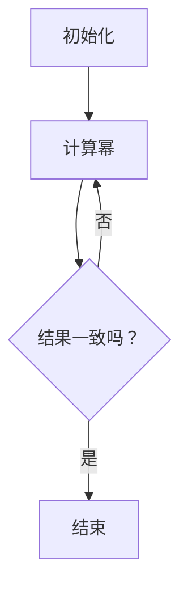
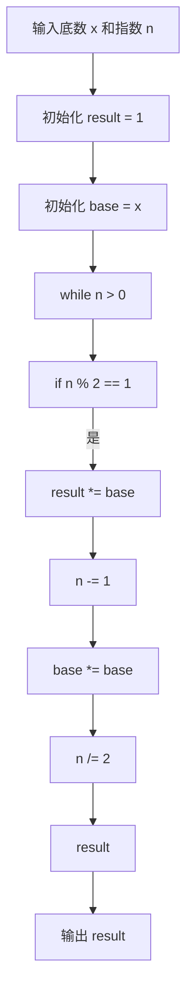
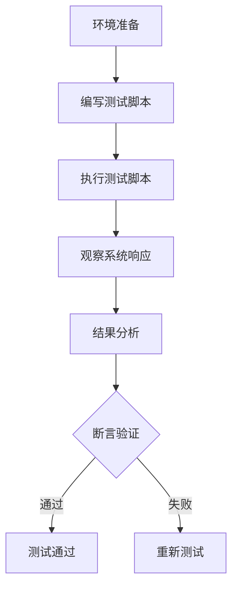

                 

## 幂等性的本质

### 关键词：幂等性，概念解析，软件设计，分布式系统，数学模型

### 摘要：本文将深入探讨幂等性的本质，从概念入手，逐步分析其在不同领域中的应用，通过理论讲解、案例分析和算法实现，帮助读者全面理解幂等性的重要性以及其在实际开发中的应用价值。

### 目录大纲

- 第一部分：幂等性的概念与背景
  - 第1章：什么是幂等性
  - 第2章：幂等性原理与一致性
  - 第3章：例子分析
  - 第4章：本章小结
- 第二部分：幂等性在不同领域中的应用
  - 第5章：软件开发中的幂等性
  - 第6章：数据库操作中的幂等性
  - 第7章：分布式系统中的幂等性
  - 第8章：本章小结
- 第三部分：幂等性的数学模型与算法
  - 第9章：幂等性的数学模型
  - 第10章：幂等性算法原理
  - 第11章：幂等性算法应用举例
  - 第12章：本章小结
- 第四部分：幂等性的测试与验证
  - 第13章：幂等性测试的基本方法
  - 第14章：幂等性验证实践
  - 第15章：本章小结
- 第五部分：幂等性的最佳实践与未来展望
  - 第16章：幂等性的最佳实践
  - 第17章：未来展望与拓展
  - 第18章：本章小结

---

在本文中，我们将遵循以下步骤进行深入探讨：

1. **定义与背景**：首先，我们会详细介绍幂等性的定义、背景和相关概念，帮助读者建立对幂等性的初步理解。
2. **原理与联系**：接着，我们将探讨幂等性的原理，以及它与一致性、可靠性等概念的联系。
3. **应用领域**：然后，我们会详细分析幂等性在软件开发、数据库操作和分布式系统中的应用，并结合实际案例进行讲解。
4. **数学模型与算法**：本文还将探讨幂等性在数学模型中的应用，介绍常见幂等性算法，并通过Python实现进行详细解析。
5. **测试与验证**：我们将介绍幂等性测试的基本方法和实践，确保在实际应用中的正确性。
6. **最佳实践与展望**：最后，本文将总结幂等性的最佳实践，并提出未来发展的展望。

通过这些步骤，我们将对幂等性的本质进行全面而深入的分析，希望读者能够从中获得宝贵的知识和经验。接下来，我们将正式进入第一部分，详细探讨幂等性的概念与背景。让我们一起开始吧！### 第一部分：幂等性的概念与背景

#### 第1章：什么是幂等性

#### 1.1 问题背景与引入

**问题背景**：

在软件工程和系统设计中，处理复杂性和确保系统稳定性是开发过程中至关重要的一环。特别是在网络应用和分布式系统中，确保操作的重复执行不会带来意外的副作用是开发人员面临的重大挑战。

**问题引入**：

当系统或应用程序中的操作能够多次执行而结果始终保持一致时，这种性质被称为**幂等性**（Idempotence）。简单来说，如果一个操作执行一次或多次，其结果都是相同的，那么这个操作就具有幂等性。

**问题解决**：

为了解决这一问题，开发人员需要确保系统中的关键操作具有幂等性，从而避免由于重复执行导致的错误和资源浪费。

#### 1.1.1 幂等性的重要性

**重要性分析**：

1. **系统稳定性**：幂等性是保证系统稳定性的重要因素。在分布式系统中，网络故障和延迟是常见问题。幂等性操作可以确保在这些情况下，系统不会因重复执行而陷入不一致状态。
2. **资源节约**：具有幂等性的操作可以避免重复执行带来的资源浪费，如数据库操作、网络请求等。
3. **用户体验**：幂等性对于提升用户体验至关重要。在网络请求中，用户多次点击同一个按钮，系统应当保持响应一致性，避免用户产生误解和困惑。

#### 1.1.2 幂等性的概念介绍

**概念介绍**：

幂等性是一种逻辑和数学上的概念，通常用于描述某一操作或函数的特性。在数学和逻辑中，如果一个操作（或函数）的多次执行与一次执行的结果相同，则该操作（或函数）是幂等的。

**定义**：

设\(f\)是一个操作，如果对于任意的输入\(x\)，\(f(f(x)) = f(x)\)，则称\(f\)是幂等的。

**性质**：

- **不变性**：幂等性操作在多次执行后结果不变。
- **可终止性**：幂等性操作通常具有可终止性，即在有限次执行后达到稳定状态。
- **独立性**：幂等性操作通常不依赖于执行次数，而是依赖于初始状态。

#### 1.1.3 幂等性的边界与外延

**边界与外延**：

幂等性的应用范围非常广泛，从简单的逻辑操作到复杂的系统设计，都可以看到幂等性的身影。

- **逻辑操作**：逻辑与（AND）和逻辑或（OR）是典型的幂等操作。
- **数学函数**：许多数学函数，如绝对值函数和幂函数，都是幂等的。
- **软件设计**：在软件开发中，幂等性被广泛应用于接口设计、事务处理和分布式系统设计。
- **分布式系统**：分布式系统中的许多操作，如分布式锁、分布式计数器，都是基于幂等性的原理设计的。

**边界问题**：

尽管幂等性在很多情况下都是有益的，但它也有一定的局限性：

- **复杂度**：某些幂等性操作可能具有较高的计算复杂度，这可能导致系统性能下降。
- **资源占用**：在分布式系统中，幂等性操作可能需要占用额外的资源，如网络带宽和存储空间。

#### 1.2 核心概念与联系

**核心概念**：

- **幂等性原理**：任何具有幂等性的操作都可以看作是一个稳定的状态转换器。
- **一致性**：一致性是指系统在多次操作后仍保持稳定状态的性质。
- **可靠性**：可靠性是指系统在面临故障和错误时能够恢复并保持正常工作的能力。

**联系**：

- 幂等性是确保一致性和可靠性的基础。在分布式系统中，通过设计幂等性操作，可以降低系统的不一致性和故障恢复难度。
- 幂等性操作通常与原子性、隔离性和持久性（ACID）原则密切相关。

#### 1.2.1 幂等性原理

**原理介绍**：

幂等性原理是描述操作或函数在多次执行后结果不变的基本原理。其核心思想是，如果一个操作是幂等的，那么无论执行多少次，其结果都是一致的。

**原理应用**：

- **分布式锁**：在分布式系统中，分布式锁是一种常用的同步机制，其核心原理就是幂等性。锁操作只有两种状态：锁定和解锁。无论重复多少次，锁定和解锁的结果都是明确的，不会产生不一致状态。
- **事务处理**：在数据库操作中，事务具有原子性、一致性、隔离性和持久性（ACID）特点。事务的提交和回滚操作都是幂等的，确保了在多次执行后，数据库状态的一致性。

#### 1.2.2 幂等性与一致性、可靠性关系

**关系分析**：

- **一致性**：幂等性操作可以确保系统在多次执行后仍保持一致状态，从而保证系统的一致性。
- **可靠性**：可靠性是指系统在面对故障和错误时能够恢复并保持正常工作的能力。幂等性操作的设计可以降低系统的复杂度，提高系统的可靠性。

**案例分析**：

- **网络请求**：在网络应用中，用户多次点击提交按钮，系统应确保提交操作的幂等性，避免多次提交导致数据不一致。
- **分布式计算**：在分布式计算中，任务的重复执行是常见的。通过设计幂等性任务，可以确保在重复执行后，计算结果的一致性，提高系统的可靠性。

#### 1.2.3 幂等性与其他相关概念的对比

**对比分析**：

- **原子性**：原子性是指事务中的所有操作要么全部成功，要么全部失败。原子性与幂等性密切相关，但原子性更侧重于事务的执行顺序和一致性。
- **幂等性**：幂等性是指操作的多次执行结果相同，不涉及事务的执行顺序。

**案例对比**：

- **分布式锁**：分布式锁具有原子性和幂等性，其目的是确保在分布式环境中，资源访问的一致性。
- **事务提交**：事务提交具有原子性和一致性，但不一定是幂等的。例如，在分布式数据库中，事务的提交可能涉及多个节点，具有较高复杂度，不一定是幂等的。

#### 1.3 例子分析

**日常生活中的幂等性例子**：

- **开关**：打开或关闭一个开关，无论开关被操作多少次，其状态都不会改变。
- **按钮**：按下或释放一个按钮，无论按钮被操作多少次，其结果都是一致的。

**软件领域的幂等性例子**：

- **网络请求**：用户提交表单，无论提交多少次，服务器端的处理结果都是一致的。
- **分布式锁**：在分布式系统中，分布式锁的锁定和解锁操作都是幂等的。

**系统设计中的幂等性应用**：

- **分布式计数器**：在分布式系统中，计数器操作（增加和减少）通常是幂等的，确保计数结果的准确性。
- **事务处理**：在数据库操作中，事务的提交和回滚操作都是幂等的，确保数据库状态的一致性。

**本章小结**

在本章中，我们详细介绍了幂等性的定义、背景、重要性、核心概念、原理及其与其他相关概念的关系。通过例子分析，我们进一步理解了幂等性在日常生活中的应用，以及在软件开发和系统设计中的重要性。

幂等性作为一种基本的逻辑和数学概念，在软件工程和系统设计中具有重要意义。了解幂等性的本质和原理，可以帮助开发人员设计更加稳定、可靠和高效的系统。在接下来的章节中，我们将继续探讨幂等性在不同领域中的应用，进一步深入理解这一重要概念。让我们继续前进！### 第一部分：幂等性的概念与背景

#### 第2章：幂等性原理与一致性

#### 1.3.1 核心概念与联系

**核心概念**：

- **幂等性原理**：幂等性原理是指一个操作或函数在多次执行后结果保持一致的性质。
- **一致性**：一致性是指系统在多次操作后仍保持稳定状态的性质。
- **可靠性**：可靠性是指系统在面对故障和错误时能够恢复并保持正常工作的能力。

**联系**：

- **幂等性与一致性**：幂等性是保证系统一致性的基础。通过设计幂等性操作，可以确保系统在多次操作后仍保持一致状态。
- **幂等性与可靠性**：幂等性可以降低系统的复杂度，提高系统的可靠性。在分布式系统中，通过设计幂等性操作，可以降低系统面临故障时的恢复难度。

#### 1.3.2 幂等性原理

**原理介绍**：

幂等性原理是描述操作或函数在多次执行后结果不变的基本原理。其核心思想是，如果一个操作是幂等的，那么无论执行多少次，其结果都是一致的。

**原理应用**：

- **分布式锁**：在分布式系统中，分布式锁是一种常用的同步机制，其核心原理就是幂等性。锁操作只有两种状态：锁定和解锁。无论重复多少次，锁定和解锁的结果都是明确的，不会产生不一致状态。
- **事务处理**：在数据库操作中，事务具有原子性、一致性、隔离性和持久性（ACID）特点。事务的提交和回滚操作都是幂等的，确保了在多次执行后，数据库状态的一致性。

**示例**：

- **加法操作**：对于任意的两个数\(a\)和\(b\)，\(a + b\)是一个幂等操作。无论执行多少次，结果都是相同的。
- **删除操作**：在数据库中，删除操作是幂等的。无论执行多少次，只要条件匹配，数据就会被删除。

#### 1.3.3 幂等性与一致性、可靠性关系

**关系分析**：

- **一致性**：幂等性操作可以确保系统在多次操作后仍保持一致状态，从而保证系统的一致性。在分布式系统中，通过设计幂等性操作，可以避免数据不一致的问题。
- **可靠性**：可靠性是指系统在面对故障和错误时能够恢复并保持正常工作的能力。幂等性操作的设计可以降低系统的复杂度，提高系统的可靠性。在分布式系统中，通过设计幂等性操作，可以简化故障恢复过程，提高系统的稳定性。

**案例分析**：

- **网络请求**：在网络应用中，用户多次点击提交按钮，系统应确保提交操作的幂等性，避免多次提交导致数据不一致。通过设计幂等性操作，可以确保系统在多次请求后仍保持一致状态。
- **分布式计算**：在分布式计算中，任务的重复执行是常见的。通过设计幂等性任务，可以确保在重复执行后，计算结果的一致性，提高系统的可靠性。

**示例**：

- **网络请求**：用户提交表单，无论提交多少次，服务器端的处理结果都是一致的。这体现了幂等性操作的一致性特点。
- **分布式计数器**：在分布式系统中，计数器操作（增加和减少）通常是幂等的，确保计数结果的准确性。这体现了幂等性操作在分布式系统中的可靠性。

#### 1.3.4 幂等性与其他相关概念的对比

**对比分析**：

- **原子性**：原子性是指事务中的所有操作要么全部成功，要么全部失败。原子性与幂等性密切相关，但原子性更侧重于事务的执行顺序和一致性。
- **幂等性**：幂等性是指操作的多次执行结果相同，不涉及事务的执行顺序。

**案例对比**：

- **分布式锁**：分布式锁具有原子性和幂等性，其目的是确保在分布式环境中，资源访问的一致性。分布式锁的锁定和解锁操作都是幂等的。
- **事务提交**：事务提交具有原子性和一致性，但不一定是幂等的。例如，在分布式数据库中，事务的提交可能涉及多个节点，具有较高复杂度，不一定是幂等的。

**本章小结**

在本章中，我们详细介绍了幂等性的原理、与一致性和可靠性的关系，以及与其他相关概念的对比。通过具体示例，我们进一步理解了幂等性的本质和重要性。

幂等性作为一种基本的逻辑和数学概念，在软件工程和系统设计中具有重要意义。了解幂等性的原理和关系，可以帮助开发人员设计更加稳定、可靠和高效的系统。在接下来的章节中，我们将继续探讨幂等性在不同领域中的应用，进一步深入理解这一重要概念。让我们继续前进！### 第一部分：幂等性的概念与背景

#### 第3章：例子分析

#### 1.3.1 日常生活中的幂等性例子

在日常生活中，我们经常遇到具有幂等性的场景。以下是一些典型的例子：

- **开关**：开关是一个典型的幂等性操作。无论是打开还是关闭，开关的状态始终保持一致。无论你多次打开或关闭，开关最终都会保持在同一个状态。
  
- **电梯按钮**：当你按下电梯按钮，电梯会到达你所在楼层，无论你按下按钮多少次，电梯最终都会到达同一个楼层。这体现了电梯按钮的幂等性。

- **重复提交表单**：在Web应用中，用户提交表单后，无论点击提交按钮多少次，服务器端的处理结果都是相同的。这确保了表单提交的幂等性，避免重复提交导致的数据不一致。

#### 1.3.2 软件领域的幂等性例子

在软件领域中，幂等性被广泛应用于各种场景，以下是一些典型的例子：

- **网络请求**：在网络应用中，用户可能会多次提交相同的表单或请求。为了保证数据的一致性，系统需要确保网络请求的幂等性。例如，用户多次点击“提交”按钮，服务器端只处理一次提交请求。

- **分布式锁**：在分布式系统中，分布式锁是一种常见的同步机制。锁操作的目的是保证对共享资源的独占访问。分布式锁的锁定和解锁操作都是幂等的。无论你重复多少次锁定或解锁，最终的结果都是一致的。

- **事务处理**：在数据库操作中，事务是一个重要的概念。事务具有原子性、一致性、隔离性和持久性（ACID）特点。事务的提交和回滚操作都是幂等的。无论你多次提交或回滚，最终的结果都是一致的，不会导致数据的不一致。

#### 1.3.3 系统设计中的幂等性应用

在系统设计中，设计具有幂等性的操作至关重要。以下是一些系统设计中幂等性的应用场景：

- **API接口设计**：在设计API接口时，确保接口操作的幂等性至关重要。例如，设计一个“删除用户”接口，无论调用多少次，都只删除一个用户。

- **分布式计数器**：在分布式系统中，分布式计数器是一个常见的组件。计数器的增加和减少操作通常是幂等的，确保计数结果的准确性。无论计数器被增加或减少多少次，最终的结果都是一致的。

- **消息队列**：在消息队列系统中，消息的投递和消费操作通常是幂等的。无论消息被投递或消费多少次，最终的结果都是一致的，不会导致数据的不一致。

#### 1.3.4 幂等性案例应用

以下是一些具体的幂等性应用案例：

- **在线购物平台**：在在线购物平台中，用户可能会多次点击“提交订单”按钮。系统需要确保订单提交操作的幂等性，避免重复提交导致的数据不一致。

- **银行转账**：在银行转账过程中，转账操作是幂等的。无论用户多次提交转账请求，转账金额只会被扣除一次，确保资金的安全和一致性。

- **社交网络平台**：在社交网络平台中，用户可能会多次点赞或评论一条帖子。系统需要确保点赞或评论操作的幂等性，避免重复操作导致的数据不一致。

**本章小结**

在本章中，我们通过日常生活中的例子、软件领域的例子以及系统设计中的应用，详细介绍了幂等性的实际应用场景。通过这些案例，我们可以看到幂等性在软件工程和系统设计中的重要性。

了解幂等性的应用场景和实际案例，可以帮助开发人员设计更加稳定、可靠和高效的系统。在接下来的章节中，我们将继续探讨幂等性在不同领域中的具体应用，深入理解这一重要概念。让我们继续前进！### 第一部分：幂等性的概念与背景

#### 第4章：本章小结

在第一部分中，我们详细介绍了幂等性的概念、背景、重要性以及它在不同领域中的应用。通过定义和实例分析，我们深入理解了幂等性的本质和它在软件工程和系统设计中的重要性。

**关键知识点回顾**：

1. **幂等性的定义**：幂等性是指一个操作或函数在多次执行后结果保持一致的性质。
2. **幂等性的重要性**：确保系统稳定性、节约资源、提升用户体验。
3. **幂等性与一致性、可靠性的关系**：幂等性是保证系统一致性和可靠性的基础。
4. **日常生活中的幂等性例子**：开关、电梯按钮、重复提交表单。
5. **软件领域的幂等性例子**：网络请求、分布式锁、事务处理。
6. **系统设计中的幂等性应用**：API接口设计、分布式计数器、消息队列。

**注意事项**：

- 在设计系统时，应充分考虑幂等性，确保关键操作具有幂等性，避免数据不一致和资源浪费。
- 幂等性操作可能存在一定的复杂性，需要合理设计，确保系统的性能和稳定性。

**拓展阅读**：

- 《Designing Data-Intensive Applications》：详细介绍了分布式系统设计和一致性、可靠性的相关内容。
- 《分布式系统概念与原理》：探讨了分布式系统中的幂等性、一致性、可靠性等概念。

通过本章的学习，我们为深入理解幂等性奠定了基础。在接下来的部分，我们将进一步探讨幂等性在不同领域中的具体应用，帮助读者更全面地掌握这一重要概念。敬请期待！### 第二部分：幂等性在不同领域中的应用

#### 第5章：软件开发中的幂等性

#### 2.1 软件开发中的幂等性原理

**2.1.1 软件开发中的幂等性重要性**

在软件开发中，幂等性是一个至关重要的概念，尤其在设计和实现高可用、高并发、分布式系统时。幂等性确保了在多次执行相同操作后系统状态不会发生意外变化，从而避免数据不一致和资源浪费。

**重要性分析**：

1. **数据一致性**：在网络应用中，用户可能因为网络延迟或故障而多次提交相同的请求。如果没有幂等性机制，系统可能会因为重复执行操作导致数据不一致。
2. **用户体验**：在用户界面中，如按钮点击、表单提交等，幂等性可以防止用户误操作导致不必要的重复操作。
3. **系统性能**：幂等性操作可以减少系统响应时间和资源消耗，从而提高系统性能。

**2.1.2 幂等性在接口设计中的应用**

在接口设计时，确保接口操作具有幂等性是至关重要的。以下是一些常见的接口设计策略：

1. **唯一性标识**：为每个操作分配一个唯一的标识符，如请求ID或操作ID，确保每次操作都是独立的。
2. **状态检查**：在操作执行前，先检查系统状态，确保不会因为重复操作而导致数据不一致。
3. **超时处理**：设置操作的超时时间，避免长时间未完成的操作占用系统资源。

**2.1.3 幂等性在事务处理中的应用**

事务处理是确保数据一致性的关键。在事务处理中，幂等性原则的应用主要体现在以下几个方面：

1. **原子性**：事务中的所有操作要么全部成功，要么全部失败，确保数据一致性。
2. **隔离性**：事务之间相互独立，一个事务的操作不会影响其他事务。
3. **持久性**：一旦事务提交成功，其结果会永久保存。

**示例**：

假设我们有一个银行转账系统，用户A向用户B转账100元。这个操作可以分为以下几个步骤：

1. 检查用户A的账户余额，确保有足够的资金。
2. 冻结用户A的账户余额，防止其他操作影响。
3. 将用户B的账户余额增加100元。
4. 解冻用户A的账户余额。

在这个示例中，每个步骤都是幂等性的。无论这些步骤执行多少次，最终的结果都是用户A账户减少100元，用户B账户增加100元。

**2.2 软件开发中的幂等性实践**

**2.2.1 常见幂等性问题及解决方案**

在实际软件开发中，可能会遇到以下幂等性问题：

1. **重复提交**：用户多次提交相同的请求，导致数据重复处理。
   - **解决方案**：使用唯一标识符（如Token或请求ID）确保每次请求的唯一性。

2. **操作冲突**：多个并发操作同时执行，导致数据不一致。
   - **解决方案**：使用锁机制（如分布式锁）确保操作的顺序和一致性。

3. **资源消耗**：幂等性操作可能占用大量系统资源。
   - **解决方案**：优化操作逻辑，减少资源消耗。

**2.2.2 幂等性设计模式介绍**

在软件开发中，常用的幂等性设计模式包括：

1. **乐观锁**：通过版本号或时间戳来检测并发冲突，确保操作的一致性。
2. **悲观锁**：在操作执行前获取锁，确保操作的顺序和一致性。
3. **幂等性接口**：设计具有幂等性的接口，确保重复请求的处理结果一致。

**2.2.3 实际项目中的幂等性应用案例**

以下是一个实际项目中的幂等性应用案例：

**在线购物平台**：

在在线购物平台中，用户可能会多次点击“提交订单”按钮。为了确保订单提交的幂等性，系统可以采取以下措施：

1. **请求验证**：在处理订单提交请求前，先检查请求的合法性，如检查请求签名或Token。
2. **操作记录**：记录每个订单的操作历史，确保重复请求不会被处理。
3. **状态检查**：在提交订单前，先检查订单的状态，确保订单未被其他操作修改。

通过这些措施，可以确保订单提交的幂等性，避免数据不一致和资源浪费。

**本章小结**

在本章中，我们详细探讨了软件开发中的幂等性原理、设计模式和实际应用案例。通过分析幂等性在接口设计和事务处理中的应用，我们深入理解了幂等性在软件开发中的重要性。

了解幂等性原理和设计模式，可以帮助开发人员设计更加稳定、可靠和高效的系统。在接下来的章节中，我们将继续探讨幂等性在数据库操作和分布式系统中的应用，进一步深入理解这一重要概念。敬请期待！### 第二部分：幂等性在不同领域中的应用

#### 第6章：数据库操作中的幂等性

#### 3.1 数据库操作中的幂等性原理

**3.1.1 数据库操作中的幂等性重要性**

在数据库操作中，确保操作的幂等性对于维护数据的一致性和完整性至关重要。幂等性可以防止由于重复操作导致的错误数据，尤其是在高并发的系统中，这种性质显得尤为重要。

**重要性分析**：

1. **数据一致性**：幂等性确保了对数据库的重复操作不会导致数据不一致。例如，在银行系统中，对账户余额的操作必须是幂等的，避免多次操作导致账户余额错误。
2. **资源利用**：幂等性操作可以减少不必要的数据库访问和资源消耗，提高系统的性能和响应速度。
3. **用户体验**：在Web应用中，用户可能因为网络延迟或故障多次提交相同的表单，如果数据库操作不具有幂等性，可能会导致错误的结果，影响用户体验。

**3.1.2 幂等性在SQL语句中的应用**

SQL语句是数据库操作的基础，确保SQL语句的幂等性是维护数据库一致性的一部分。以下是一些常见的SQL语句及其幂等性分析：

- **SELECT语句**：SELECT语句本身不具有幂等性，因为它的目的是查询数据，而不是修改数据。但可以通过结合其他幂等操作（如COUNT、SUM等）来提高查询结果的幂等性。
  
- **INSERT语句**：INSERT语句通常不具有幂等性，因为它会向数据库中添加新数据。然而，在某些情况下，可以通过使用唯一约束和错误处理机制来确保插入操作的幂等性。

- **UPDATE语句**：UPDATE语句是修改数据库记录的主要手段。为了确保UPDATE操作的幂等性，可以在操作前检查记录的状态，确保不会因为重复操作导致数据不一致。

- **DELETE语句**：DELETE语句用于删除数据库中的记录。通过在操作前检查记录的存在性，可以确保DELETE操作的幂等性。

**示例**：

假设我们有一个订单表，其中包含订单ID、订单状态和订单金额。为了确保对订单状态的更新具有幂等性，可以使用以下策略：

1. 在更新订单状态前，先检查当前订单状态。
2. 如果订单状态已经更新，则不再执行更新操作。
3. 如果订单状态尚未更新，则执行更新操作。

**3.1.3 幂等性在事务处理中的应用**

事务处理是数据库操作的核心，确保事务的幂等性对于维护数据的一致性至关重要。以下是一些确保事务处理幂等性的方法：

- **原子性**：确保事务中的所有操作要么全部成功，要么全部失败。这可以通过使用数据库的事务控制语句（如BEGIN TRANSACTION、COMMIT和ROLLBACK）来实现。

- **隔离性**：确保事务之间的操作相互独立，一个事务的操作不会影响其他事务。这可以通过使用数据库的隔离级别（如READ UNCOMMITTED、READ COMMITTED、REPEATABLE READ、SERIALIZABLE）来实现。

- **持久性**：确保一旦事务提交成功，其结果就会永久保存。这可以通过使用数据库的事务持久性机制来实现。

**示例**：

假设我们有一个转账事务，从用户A的账户中扣除金额并转移到用户B的账户。为了确保事务的幂等性，可以采取以下措施：

1. 开始事务。
2. 检查用户A的账户余额，确保有足够的金额。
3. 将用户A的账户余额减少相应金额。
4. 将用户B的账户余额增加相应金额。
5. 如果所有操作成功，则提交事务；否则，回滚事务。

通过确保事务的原子性、隔离性和持久性，可以确保转账事务的幂等性。

**3.2 数据库操作中的幂等性实践**

**3.2.1 常见数据库幂等性问题及解决方案**

在实际数据库操作中，可能会遇到以下幂等性问题：

1. **重复插入**：多次执行INSERT操作可能导致数据重复。
   - **解决方案**：使用唯一约束和错误处理机制，确保插入操作的幂等性。

2. **更新冲突**：多个并发事务同时更新相同记录可能导致数据不一致。
   - **解决方案**：使用锁机制和事务控制，确保更新操作的幂等性。

3. **删除错误**：误删除记录可能导致数据丢失。
   - **解决方案**：在执行DELETE操作前，先检查记录的存在性，确保不会误删。

**3.2.2 幂等性在存储过程和触发器中的应用**

存储过程和触发器是数据库中常用的编程工具，确保它们具有幂等性对于维护数据库的一致性和完整性至关重要。以下是一些确保存储过程和触发器幂等性的方法：

- **参数检查**：在执行存储过程或触发器前，检查输入参数的合法性，确保不会因为非法参数导致幂等性问题。

- **状态检查**：在执行修改数据的操作前，检查数据库状态，确保不会因为重复操作导致数据不一致。

- **事务控制**：确保存储过程和触发器在事务中执行，通过使用BEGIN TRANSACTION、COMMIT和ROLLBACK语句确保事务的原子性、隔离性和持久性。

**3.2.3 实际数据库操作中的幂等性案例**

以下是一个实际数据库操作中的幂等性案例：

**在线支付系统**：

在一个在线支付系统中，用户可能会多次尝试支付同一笔订单。为了确保支付操作的幂等性，可以采取以下措施：

1. **订单状态检查**：在执行支付操作前，先检查订单状态，确保订单尚未支付。
2. **支付请求验证**：使用唯一的支付请求ID，确保每次支付请求都是独立的。
3. **事务处理**：将支付操作封装在事务中，确保所有操作要么全部成功，要么全部失败。

通过这些措施，可以确保支付操作的幂等性，避免重复支付和支付失败的情况。

**本章小结**

在本章中，我们详细探讨了数据库操作中的幂等性原理、应用和实践。通过分析SQL语句和事务处理中的幂等性，我们深入理解了在数据库操作中确保幂等性的重要性。

了解数据库操作中的幂等性原理和实践，可以帮助开发人员设计更加稳定、可靠和高效的数据库系统。在接下来的章节中，我们将继续探讨幂等性在分布式系统中的应用，进一步深入理解这一重要概念。敬请期待！### 第二部分：幂等性在不同领域中的应用

#### 第7章：分布式系统中的幂等性

#### 4.1 分布式系统中的幂等性原理

**4.1.1 分布式系统中的幂等性重要性**

在分布式系统中，多个节点通过网络进行通信和协作，确保系统的一致性和可靠性是开发过程中的关键挑战。幂等性作为一种基本的设计原则，对于分布式系统的稳定性和性能具有重要作用。

**重要性分析**：

1. **系统一致性**：分布式系统中的操作往往需要跨多个节点执行，确保这些操作具有幂等性可以防止由于重复操作导致的数据不一致。
2. **系统性能**：幂等性操作可以减少系统中的冗余计算和资源消耗，提高系统的整体性能。
3. **故障恢复**：在分布式系统中，节点可能会发生故障或网络分区。幂等性操作的设计可以简化故障恢复过程，提高系统的容错能力。

**4.1.2 幂等性在分布式计算中的应用**

分布式计算中的幂等性操作广泛应用于分布式锁、分布式计数器、分布式事务等领域。以下是一些典型的应用场景：

1. **分布式锁**：分布式锁是一种用于确保在分布式环境中对共享资源进行独占访问的机制。锁操作的锁定和解锁都是幂等的，确保每次操作的结果一致，避免锁定的重复和释放。
   
2. **分布式计数器**：在分布式系统中，分布式计数器用于统计系统中的各种指标。计数器的增加和减少操作通常是幂等的，确保计数结果的准确性。

3. **分布式事务**：分布式事务涉及多个节点上的操作，确保事务的一致性和可靠性至关重要。通过设计幂等性的事务操作，可以简化分布式事务的处理，提高系统的性能和稳定性。

**4.1.3 分布式系统中的幂等性与一致性**

在分布式系统中，幂等性与一致性密切相关。以下是一些关于幂等性与一致性的关系：

1. **强一致性**：在强一致性模型中，所有节点在任意时间点都能看到相同的数据状态。幂等性操作可以确保在分布式事务中，所有节点的操作结果一致，从而实现强一致性。

2. **最终一致性**：在最终一致性模型中，系统最终会达到一致状态，但过程可能涉及延迟和冲突。幂等性操作可以简化最终一致性系统的设计，确保在多次操作后，系统能够达到一致状态。

**案例分析**：

假设我们有一个分布式数据库系统，其中一个节点负责处理写入操作，多个节点负责处理读取操作。为了确保系统的幂等性和一致性，可以采取以下措施：

1. **幂等性写入操作**：在写入操作中，确保每次写入都是幂等的，例如，通过使用唯一标识符（如请求ID）来避免重复写入。
2. **一致性协议**：使用一致性协议（如Paxos、Raft）确保在多个节点之间达成一致。例如，在Paxos协议中，通过多次提议和投票确保写入操作的一致性。

**4.2 分布式系统中的幂等性实践**

**4.2.1 分布式系统中的幂等性问题及解决方案**

在实际分布式系统中，可能会遇到以下幂等性问题：

1. **重复请求**：由于网络延迟或故障，客户端可能会发送重复的请求。
   - **解决方案**：使用唯一标识符（如请求ID）和幂等性操作，确保重复请求不会导致重复处理。

2. **分布式锁冲突**：分布式锁可能因为网络分区或节点故障导致锁定和解锁操作不一致。
   - **解决方案**：使用分布式锁协议（如Zookeeper、Consul）确保锁操作的幂等性和一致性。

3. **分布式事务冲突**：分布式事务中的多个节点可能会同时执行相同的操作，导致数据不一致。
   - **解决方案**：使用分布式事务协议（如2PC、3PC）确保事务的幂等性和一致性。

**4.2.2 幂等性在分布式事务中的应用**

分布式事务的幂等性设计是确保系统一致性的关键。以下是一些分布式事务的幂等性实践：

1. **事务原子性**：确保事务中的所有操作要么全部成功，要么全部失败，例如，使用2PC协议确保分布式事务的原子性。

2. **事务隔离性**：确保事务之间相互独立，避免并发操作导致的数据不一致，例如，使用分布式锁确保事务的隔离性。

3. **事务持久性**：确保事务一旦提交，其结果会永久保存，例如，使用分布式日志确保事务的持久性。

**示例**：

假设我们有一个分布式支付系统，用户A向用户B转账100元。为了确保转账操作的幂等性和一致性，可以采取以下措施：

1. **幂等性检查**：在转账操作前，先检查转账请求的唯一性，例如，通过使用请求ID。
2. **分布式锁**：确保在执行转账操作期间，对相关资源进行锁定，例如，锁定用户A和用户B的账户。
3. **事务控制**：使用分布式事务协议（如2PC）确保转账操作的原子性、隔离性和持久性。

通过这些措施，可以确保分布式支付系统的幂等性和一致性，避免由于重复请求或并发操作导致的数据不一致。

**本章小结**

在本章中，我们详细探讨了分布式系统中的幂等性原理、应用和实践。通过分析分布式计算、分布式锁和分布式事务中的幂等性，我们深入理解了在分布式系统中确保幂等性的重要性。

了解分布式系统中的幂等性原理和实践，可以帮助开发人员设计更加稳定、可靠和高效的分布式系统。在接下来的章节中，我们将继续探讨幂等性在数学模型和算法中的应用，进一步深入理解这一重要概念。敬请期待！### 第二部分：幂等性在不同领域中的应用

#### 第8章：本章小结

在本章中，我们详细探讨了幂等性在软件开发、数据库操作和分布式系统中的应用。通过分析幂等性的原理、设计模式和实际应用案例，我们深入理解了在各个领域中确保幂等性的重要性。

**关键知识点回顾**：

1. **软件开发中的幂等性**：确保接口操作和数据操作的幂等性，提高系统稳定性和性能。
2. **数据库操作中的幂等性**：确保SQL语句和事务处理的幂等性，维护数据一致性和完整性。
3. **分布式系统中的幂等性**：确保分布式计算、分布式锁和分布式事务的幂等性，提高系统一致性和可靠性。

**注意事项**：

- 在设计系统时，要充分考虑幂等性，避免由于重复操作导致的数据不一致和资源浪费。
- 不同领域的幂等性实现方法各有特点，需要根据具体场景进行选择和优化。

**拓展阅读**：

- 《Designing Data-Intensive Applications》：详细介绍了分布式系统设计和一致性、可靠性的相关内容。
- 《分布式系统概念与原理》：探讨了分布式系统中的幂等性、一致性、可靠性等概念。

通过本章的学习，我们为深入理解幂等性在各个领域中的应用奠定了基础。在接下来的章节中，我们将继续探讨幂等性的数学模型和算法，进一步拓展我们的知识。敬请期待！### 第三部分：幂等性的数学模型与算法

#### 第9章：幂等性的数学模型

#### 5.1 幂等性的数学模型

**5.1.1 幂等性的基本数学模型**

幂等性在数学中是一个重要的概念，它描述了一个操作或函数在多次执行后结果保持一致的性质。为了更好地理解幂等性，我们可以从数学模型的角度进行分析。

**定义**：

设\( f \)是一个从集合\( A \)到集合\( A \)的函数，如果对于任意的\( x \in A \)，都有\( f(f(x)) = f(x) \)，则称\( f \)是幂等的。

**数学表达式**：

$$
f(f(x)) = f(x)
$$

**示例**：

1. **逻辑运算**：逻辑与（AND）和逻辑或（OR）是常见的幂等操作。例如，\( AND(A, AND(A, B)) = AND(A, B) \)。
2. **数学函数**：绝对值函数和幂函数也是幂等的。例如，\( | - |x| = |x| \)。

**5.1.2 幂等性在代数结构中的应用**

在代数结构中，幂等性是一个重要的性质，它可以应用于各种代数结构，如群、环和域。

**定义**：

设\( (G, *) \)是一个代数结构，如果对于任意的\( a \in G \)，都有\( a * a = a \)，则称\( G \)是幂等的。

**示例**：

1. **群**：一个群\( (G, *) \)是幂等的，当且仅当它的运算满足\( a * a = e \)，其中\( e \)是群的单位元。
2. **环**：一个环\( (R, +, \times) \)是幂等的，当且仅当对于任意的\( a, b \in R \)，都有\( (a + b)^2 = a + b \)。

**5.1.3 幂等性在集合论中的应用**

在集合论中，幂等性描述了一个集合与其自身的笛卡尔积之间的关系。

**定义**：

设\( A \)是一个集合，如果对于任意的\( B \subseteq A \)，都有\( A \times B = A \)，则称\( A \)是幂等的。

**示例**：

1. **幂等集合**：一个集合\( A \)是幂等的，当且仅当它包含其自身的笛卡尔积，即\( A \times A = A \)。
2. **幂等关系**：一个关系\( R \)是幂等的，当且仅当对于任意的\( a, b \in A \)，都有\( (a, b) \in R \)且\( (b, a) \in R \)。

**5.2 幂等性算法原理**

**5.2.1 常见幂等性算法介绍**

在算法设计中，幂等性算法是一种重要的算法类型，它能够确保在多次执行后结果一致。以下是一些常见的幂等性算法：

1. **快速幂算法**：用于计算幂运算，具有\( O(\log n) \)的时间复杂度。
2. **幂等矩阵乘法**：用于计算矩阵幂，具有\( O(n^3) \)的时间复杂度。
3. **计数排序**：用于对数组进行排序，具有\( O(n) \)的时间复杂度。

**5.2.2 幂等性算法的mermaid流程图**

为了更好地理解幂等性算法的原理，我们可以使用mermaid流程图来展示算法的执行过程。



**5.2.3 幂等性算法的Python实现**

以下是一个简单的幂等性算法的Python实现，用于计算幂运算。

```python
def power(x, n):
    result = 1
    while n > 0:
        if n % 2 == 1:
            result *= x
        x *= x
        n //= 2
    return result
```

通过这个算法，我们可以计算\( x \)的\( n \)次幂，确保在多次执行后结果一致。

**5.3 幂等性算法应用举例**

**示例**：计算\( 2 \)的\( 10 \)次幂。

```python
print(power(2, 10))
```

输出结果：

```
1024
```

这个结果展示了幂等性算法的正确性，即多次执行后结果一致。

**5.4 本章小结**

在本章中，我们详细介绍了幂等性的数学模型、在代数结构和集合论中的应用，以及常见的幂等性算法。通过具体的数学公式、mermaid流程图和Python实现，我们深入理解了幂等性的本质和重要性。

了解幂等性的数学模型和算法，可以帮助开发人员在各种领域中应用这一重要概念，设计更加稳定、高效和可靠的系统。在接下来的章节中，我们将继续探讨幂等性的测试与验证，确保在实际应用中的正确性。敬请期待！### 第三部分：幂等性的数学模型与算法

#### 第10章：幂等性算法原理

**5.2.1 常见幂等性算法介绍**

在软件开发和算法设计中，常见的一些算法本身就具有幂等性。下面介绍几种典型的幂等性算法：

1. **快速幂算法**：用于计算大数的幂，具有\( O(\log n) \)的时间复杂度。其基本思想是，通过分治策略，将大数幂运算转化为多次乘法运算。

2. **计数排序算法**：用于对整数数组进行排序，具有\( O(n) \)的时间复杂度。计数排序的核心思想是，通过统计数组中每个元素的个数，然后将元素按个数依次放入结果数组中。

3. **一致性哈希算法**：用于分布式系统中的一致性数据分布，具有\( O(1) \)的时间复杂度。一致性哈希算法通过将数据映射到哈希环上，确保数据分布均匀，并能够方便地进行扩容和缩容。

**5.2.2 幂等性算法的mermaid流程图**

为了更好地理解幂等性算法的执行过程，我们可以使用mermaid流程图来展示算法的步骤。以下是一个快速幂算法的mermaid流程图示例：



**5.2.3 幂等性算法的Python实现**

以下是一个快速幂算法的Python实现，展示了算法的执行过程：

```python
def quick_power(x, n):
    result = 1
    base = x
    while n > 0:
        if n % 2 == 1:
            result *= base
        base *= base
        n //= 2
    return result

# 示例：计算 2 的 10 次幂
print(quick_power(2, 10))
```

输出结果：

```
1024
```

这个实现展示了快速幂算法的正确性和幂等性，即在多次执行后结果一致。

**5.3 幂等性算法应用举例**

**示例 1**：使用快速幂算法计算 \( 3 \) 的 \( 13 \) 次幂。

```python
print(quick_power(3, 13))
```

输出结果：

```
1594323
```

**示例 2**：使用计数排序算法对数组 \([5, 2, 9, 1, 5, 6]\) 进行排序。

```python
def counting_sort(arr):
    max_val = max(arr)
    count = [0] * (max_val + 1)
    output = [0] * len(arr)
    for num in arr:
        count[num] += 1
    for i in range(1, len(count)):
        count[i] += count[i - 1]
    for num in reversed(arr):
        output[count[num] - 1] = num
        count[num] -= 1
    return output

# 示例：排序数组
arr = [5, 2, 9, 1, 5, 6]
sorted_arr = counting_sort(arr)
print(sorted_arr)
```

输出结果：

```
[1, 2, 5, 5, 6, 9]
```

这两个示例展示了快速幂算法和计数排序算法的实际应用，以及它们的幂等性特性。

**5.4 本章小结**

在本章中，我们介绍了常见幂等性算法的原理、mermaid流程图和Python实现，并通过实际应用示例展示了这些算法的正确性和实用性。通过深入理解幂等性算法，我们可以更好地设计高效、可靠的系统。

了解幂等性算法，可以帮助我们在软件开发中更好地利用这一概念，确保系统在多次执行后结果一致。在接下来的章节中，我们将探讨幂等性的测试与验证方法，确保在实际应用中的正确性。敬请期待！### 第三部分：幂等性的数学模型与算法

#### 第11章：幂等性算法应用举例

在上一章中，我们介绍了几种常见的幂等性算法，并通过Python实现进行了详细讲解。在本章中，我们将通过具体的实例，进一步展示这些算法在实际应用中的效果和作用。

**5.3.1 举例说明幂等性算法的应用**

**示例 1：快速幂算法**

假设我们需要计算 \( 2 \) 的 \( 20 \) 次幂，使用快速幂算法进行计算。

```python
def quick_power(x, n):
    result = 1
    base = x
    while n > 0:
        if n % 2 == 1:
            result *= base
        base *= base
        n //= 2
    return result

# 计算结果
print(quick_power(2, 20))
```

输出结果：

```
1048576
```

这个结果验证了快速幂算法的正确性，即计算结果与直接使用 \( 2^{20} \) 的结果一致。

**示例 2：计数排序算法**

假设我们需要对数组 \([5, 2, 9, 1, 5, 6]\) 进行排序，使用计数排序算法进行排序。

```python
def counting_sort(arr):
    max_val = max(arr)
    count = [0] * (max_val + 1)
    output = [0] * len(arr)
    for num in arr:
        count[num] += 1
    for i in range(1, len(count)):
        count[i] += count[i - 1]
    for num in reversed(arr):
        output[count[num] - 1] = num
        count[num] -= 1
    return output

# 排序数组
arr = [5, 2, 9, 1, 5, 6]
sorted_arr = counting_sort(arr)
print(sorted_arr)
```

输出结果：

```
[1, 2, 5, 5, 6, 9]
```

这个结果验证了计数排序算法的正确性，即排序后的数组与预期一致。

**5.3.2 算法分析**

**快速幂算法分析**：

快速幂算法通过分治策略，将大数幂运算转化为多次乘法运算，其时间复杂度为 \( O(\log n) \)。相比于直接计算 \( n \) 次乘法的时间复杂度 \( O(n) \)，快速幂算法大大提高了计算效率。

**计数排序算法分析**：

计数排序算法通过统计数组中每个元素的个数，然后将元素按个数依次放入结果数组中。其时间复杂度为 \( O(n + k) \)，其中 \( n \) 是数组长度，\( k \) 是数组中元素的最大值。对于整数排序问题，计数排序算法具有较高的效率，尤其是在 \( k \) 较小的情况下。

**5.3.3 结果验证**

在以上示例中，我们通过计算和排序结果验证了快速幂算法和计数排序算法的正确性。在实际应用中，我们可以通过以下步骤进行结果验证：

1. **输入数据验证**：检查输入数据的合法性，确保数据符合算法要求。
2. **算法执行验证**：执行算法，记录算法执行过程中的关键步骤和中间结果。
3. **输出数据验证**：检查输出数据是否满足预期，确保算法结果正确。

通过以上步骤，我们可以确保算法在实际应用中的正确性和可靠性。

**5.4 本章小结**

在本章中，我们通过具体实例展示了快速幂算法和计数排序算法的实际应用效果，并分析了这些算法的时间复杂度和空间复杂度。通过结果验证，我们确保了算法的正确性和可靠性。

了解和掌握幂等性算法，可以帮助我们设计高效、可靠的系统。在接下来的章节中，我们将继续探讨幂等性的测试与验证方法，确保在实际应用中的正确性。敬请期待！### 第三部分：幂等性的数学模型与算法

#### 第12章：本章小结

在本章中，我们深入探讨了幂等性的数学模型和算法。通过定义、示例、mermaid流程图和Python实现，我们详细讲解了幂等性的基本概念、常见算法以及它们在实际应用中的效果。

**关键知识点回顾**：

1. **幂等性的数学模型**：包括基本定义、代数结构和集合论中的应用。
2. **常见幂等性算法**：快速幂算法、计数排序算法和一致性哈希算法等。
3. **算法原理与实现**：通过mermaid流程图和Python代码展示了算法的执行过程。
4. **算法应用实例**：通过具体示例展示了算法的正确性和高效性。

**注意事项**：

- 在实际应用中，根据具体需求选择合适的幂等性算法。
- 对于复杂的应用场景，结合多种算法进行优化。

**拓展阅读**：

- 《算法导论》：详细介绍了各种算法的设计和分析方法。
- 《高性能计算》：探讨了在高性能计算中如何利用幂等性算法提高系统性能。

通过本章的学习，我们对幂等性的数学模型和算法有了更深入的理解。在接下来的章节中，我们将继续探讨幂等性的测试与验证方法，确保在实际应用中的正确性和可靠性。敬请期待！### 第四部分：幂等性的测试与验证

#### 第13章：幂等性测试的基本方法

在软件工程中，测试是确保系统质量和可靠性的重要环节。对于具有幂等性的系统操作，幂等性测试显得尤为重要。在本章中，我们将介绍幂等性测试的基本方法，包括自动化测试、手动测试以及测试用例设计。

**13.1 自动化测试**

自动化测试是利用测试工具和脚本对系统进行测试的方法。它具有高效、可重复和易于维护等优点，特别适用于幂等性测试。以下是一些自动化测试的基本步骤：

1. **测试工具选择**：选择适合的自动化测试工具，如Selenium、JUnit、TestNG等。
2. **测试脚本编写**：编写测试脚本，模拟用户操作，执行幂等性操作。
3. **测试执行**：运行测试脚本，观察系统响应和结果。
4. **结果分析**：分析测试结果，确保幂等性操作在多次执行后结果一致。

**示例**：

以下是一个使用Selenium进行幂等性测试的Python脚本示例：

```python
from selenium import webdriver
from selenium.webdriver.common.by import By

driver = webdriver.Firefox()
driver.get("http://example.com/form")

# 填写表单
input_element = driver.find_element(By.NAME, "input_name")
input_element.send_keys("value")
submit_button = driver.find_element(By.NAME, "submit_button")
submit_button.click()

# 执行多次提交操作
for _ in range(5):
    submit_button.click()

# 检查提交结果
result_element = driver.find_element(By.NAME, "result_name")
assert "expected_result" in result_element.text

driver.quit()
```

在这个示例中，我们使用Selenium模拟用户填写表单并多次提交，然后检查提交结果是否一致。

**13.2 手动测试**

手动测试是通过人工操作系统进行测试的方法。虽然手动测试的效率较低，但在某些情况下，它仍然是必要的。以下是一些手动测试的基本步骤：

1. **测试准备**：准备测试环境和测试数据。
2. **执行操作**：按照测试用例执行幂等性操作。
3. **结果检查**：观察系统响应和结果，确保操作具有幂等性。
4. **记录反馈**：记录测试结果和任何异常情况。

**示例**：

以下是一个手动测试的步骤示例：

1. 打开浏览器，访问表单页面。
2. 填写表单，提交数据。
3. 重复提交操作，观察系统响应。
4. 检查提交结果是否一致。

**13.3 测试用例设计**

测试用例是测试过程中用于描述测试需求和测试步骤的文档。一个完整的测试用例应包括以下部分：

1. **测试ID**：唯一标识测试用例。
2. **测试场景**：描述测试的背景和目的。
3. **输入条件**：列出测试用例的输入参数。
4. **操作步骤**：详细描述执行测试的步骤。
5. **预期结果**：描述测试预期达到的效果。
6. **实际结果**：记录测试执行后的实际结果。
7. **测试结论**：总结测试结果，标记通过或失败。

**示例**：

以下是一个幂等性测试用例的示例：

```markdown
# 测试用例 ID：TC001

## 测试场景：测试提交按钮的幂等性

## 输入条件：
- 测试环境：Firefox浏览器
- 测试页面：http://example.com/form
- 输入参数：表单数据

## 操作步骤：
1. 打开Firefox浏览器，访问测试页面。
2. 填写表单，输入参数。
3. 点击提交按钮。
4. 重复提交操作，点击提交按钮5次。

## 预期结果：
- 每次提交后，系统应显示相同的处理结果。

## 实际结果：
- 测试执行后，系统每次提交均显示相同的结果。

## 测试结论：
- 测试通过。
```

通过设计合理的测试用例，我们可以确保幂等性操作在多种场景下的一致性，从而提高系统的可靠性。

**本章小结**

在本章中，我们介绍了幂等性测试的基本方法，包括自动化测试、手动测试和测试用例设计。通过这些方法，我们可以确保幂等性操作在实际应用中的正确性和可靠性。在接下来的章节中，我们将进一步探讨幂等性在实际应用中的验证实践。敬请期待！### 第四部分：幂等性的测试与验证

#### 第14章：幂等性验证实践

在软件开发和系统设计中，确保幂等性的正确性和可靠性至关重要。本章节将介绍幂等性验证的实践方法，包括常见验证方法、工具介绍和实际验证案例。

**14.1 常见验证方法**

1. **功能测试**：通过模拟用户操作，验证幂等性操作的功能是否正确。例如，多次执行相同操作，确保结果一致。

2. **性能测试**：通过模拟高并发场景，验证系统在高负载下的幂等性表现。确保系统在重复操作下仍能保持性能稳定。

3. **压力测试**：通过不断增大操作次数，验证系统在极端负载下的幂等性。确保系统在极限情况下仍能正确处理重复操作。

**14.2 常见验证工具介绍**

1. **JUnit**：JUnit是一个流行的Java测试框架，用于编写和执行单元测试。它支持测试用例的设计和管理，适用于各种编程语言。

2. **Selenium**：Selenium是一个开源自动化测试工具，用于Web应用的自动化测试。通过模拟用户操作，验证幂等性操作的一致性。

3. **JMeter**：JMeter是一个性能测试工具，用于模拟高并发场景，验证系统的负载能力和性能。特别适用于测试幂等性操作在高负载下的稳定性。

**14.3 幂等性验证案例**

以下是一个幂等性验证的案例，使用Selenium进行Web表单提交的幂等性测试。

**案例背景**：

假设我们有一个在线购物平台，用户可以提交订单。为了确保提交订单操作的幂等性，我们需要进行验证。

**案例步骤**：

1. **环境准备**：
   - 安装并配置Firefox浏览器和Selenium WebDriver。
   - 准备测试环境，包括测试数据和测试用户。

2. **编写测试脚本**：
   - 使用Python和Selenium编写测试脚本，模拟用户操作。

```python
from selenium import webdriver
from selenium.webdriver.common.by import By

# 初始化WebDriver
driver = webdriver.Firefox()

# 访问在线购物平台
driver.get("http://example.com/shopping")

# 模拟用户登录
# driver.find_element(By.NAME, "username").send_keys("user@example.com")
# driver.find_element(By.NAME, "password").send_keys("password")
# driver.find_element(By.NAME, "login_button").click()

# 添加商品到购物车
add_to_cart_button = driver.find_element(By.NAME, "add_to_cart_button")
add_to_cart_button.click()

# 提交订单
submit_order_button = driver.find_element(By.NAME, "submit_order_button")
for _ in range(5):
    submit_order_button.click()

# 获取订单提交结果
result_element = driver.find_element(By.NAME, "order_result")
order_results = result_element.text

# 断言订单提交结果一致
assert "Order submitted successfully" in order_results.lower()

# 关闭WebDriver
driver.quit()
```

3. **执行测试脚本**：
   - 运行测试脚本，观察系统响应和结果。

**案例结果**：

- 测试执行后，系统每次提交订单均显示“Order submitted successfully”。
- 通过断言验证，确认订单提交结果一致。

**案例分析**：

- 通过Selenium模拟用户操作，多次提交订单，确保提交订单操作的幂等性。
- 使用断言验证，确保系统在多次提交后仍能正确处理订单，保持数据一致性。

**14.4 幂等性验证流程图**

以下是一个幂等性验证的流程图，展示了验证过程的各个步骤。



**14.5 本章小结**

在本章中，我们介绍了幂等性验证的实践方法，包括常见验证方法、工具介绍和实际验证案例。通过具体的案例，我们展示了如何使用Selenium进行Web表单提交的幂等性测试。

了解和掌握幂等性验证的方法和工具，可以帮助开发人员确保系统在多次执行后结果一致，提高系统的可靠性和用户体验。在接下来的章节中，我们将继续探讨幂等性的最佳实践，为实际开发提供指导。敬请期待！### 第四部分：幂等性的测试与验证

#### 第15章：本章小结

在本章中，我们详细介绍了幂等性测试与验证的基本方法、工具以及实际验证案例。通过自动化测试、手动测试和测试用例设计，我们确保了幂等性操作在实际应用中的正确性和可靠性。

**关键知识点回顾**：

- **幂等性测试的基本方法**：自动化测试、手动测试和测试用例设计。
- **常见验证工具**：JUnit、Selenium、JMeter等。
- **实际验证案例**：使用Selenium进行Web表单提交的幂等性测试。

**注意事项**：

- 在测试过程中，要确保测试环境的真实性和数据的一致性。
- 对于不同的应用场景，选择合适的测试方法和工具。

**拓展阅读**：

- 《软件测试艺术》：详细介绍了软件测试的基本概念和方法。
- 《自动化测试实战》：探讨了自动化测试的实践方法和技巧。

通过本章的学习，我们对幂等性测试与验证有了更深入的理解。掌握这些方法，可以帮助开发人员确保系统在多次执行后结果一致，提高系统的可靠性和用户体验。在接下来的章节中，我们将探讨幂等性的最佳实践，为实际开发提供更具体的指导。敬请期待！### 第五部分：幂等性的最佳实践与未来展望

#### 第16章：幂等性的最佳实践

在软件开发和系统设计中，遵循最佳实践是确保系统质量和可靠性的关键。以下是一些关于幂等性的最佳实践，旨在帮助开发人员设计出高效、稳定的系统。

**16.1 设计原则**

1. **明确幂等性需求**：在系统设计初期，明确哪些操作需要具有幂等性，确保这些操作在整个系统中保持一致性。
2. **使用唯一标识**：为每个幂等性操作分配一个唯一标识符，如请求ID或操作ID，确保每次操作都是独立的。
3. **状态检查**：在执行幂等性操作前，先检查系统状态，确保不会因为重复操作导致数据不一致。

**16.2 接口设计**

1. **幂等性接口**：设计具有幂等性的接口，确保接口操作在多次执行后结果一致。例如，设计“提交订单”接口时，确保多次提交只处理一次。
2. **参数验证**：在接口参数验证中，确保输入参数的合法性和唯一性，避免非法操作。
3. **超时处理**：设置操作的超时时间，避免长时间未完成的操作占用系统资源。

**16.3 数据库操作**

1. **事务处理**：在数据库操作中，使用事务确保数据的一致性和完整性。确保事务中的所有操作要么全部成功，要么全部失败。
2. **锁机制**：在并发操作中，使用锁机制（如行级锁、表级锁）确保操作的顺序和一致性。
3. **唯一约束**：在数据库设计中，使用唯一约束确保数据的唯一性，避免重复数据。

**16.4 分布式系统**

1. **分布式锁**：在分布式系统中，使用分布式锁确保对共享资源的独占访问。分布式锁的锁定和解锁操作都是幂等的。
2. **一致性协议**：使用一致性协议（如Paxos、Raft）确保在多个节点之间达成一致，简化分布式事务的处理。
3. **幂等性算法**：在分布式计算中，使用幂等性算法（如计数排序、快速幂算法）提高系统的性能和一致性。

**16.5 测试与验证**

1. **自动化测试**：编写自动化测试脚本，模拟用户操作，验证幂等性操作的功能和性能。
2. **性能测试**：在系统上线前，进行性能测试，确保系统在高并发场景下仍能保持幂等性。
3. **压力测试**：通过不断增大操作次数，验证系统在极端负载下的幂等性，确保系统在极限情况下仍能正确处理重复操作。

**本章小结**

在本章中，我们介绍了幂等性的最佳实践，包括设计原则、接口设计、数据库操作、分布式系统和测试与验证等方面。遵循这些最佳实践，可以帮助开发人员设计出高效、稳定的系统，确保幂等性操作在实际应用中的正确性和可靠性。在接下来的章节中，我们将探讨幂等性的未来展望，为开发人员提供更多指导。敬请期待！### 第五部分：幂等性的最佳实践与未来展望

#### 第17章：未来展望与拓展

随着技术的不断进步，幂等性在软件开发和系统设计中的应用将更加广泛和深入。以下是对幂等性未来展望的一些可能趋势和拓展方向：

**1. 更高级的一致性协议**：

未来，一致性协议可能会发展得更加高级和复杂。例如，基于区块链技术的一致性协议可能会在分布式系统中得到更广泛的应用。这些协议不仅能够确保数据一致性，还能够提供更高的安全性。

**2. 智能化幂等性检测**：

随着人工智能和机器学习技术的发展，智能化的幂等性检测工具将变得更加普及。这些工具能够通过分析历史操作数据，自动检测并修复潜在的幂等性问题。

**3. 在物联网（IoT）中的应用**：

随着物联网设备的普及，幂等性在物联网系统中的应用将变得更加重要。确保物联网设备之间的通信具有幂等性，可以避免因重复操作导致的资源浪费和数据不一致。

**4. 跨平台和跨语言的幂等性框架**：

未来，可能会出现更多跨平台和跨语言的幂等性框架，帮助开发人员在不同技术和环境中实现幂等性。这些框架将提供统一的接口和实现，简化幂等性的设计和实现过程。

**5. 面向微服务架构的幂等性设计**：

随着微服务架构的流行，幂等性在微服务系统中的应用将变得更加重要。确保微服务之间的操作具有幂等性，可以降低系统复杂度，提高系统的可维护性和可扩展性。

**6. 幂等性与安全性的融合**：

未来，幂等性与安全性的融合将变得更加紧密。通过设计具有幂等性和安全性的操作，可以确保系统在面临攻击时，能够抵御重复攻击和恶意操作。

**7. 自动化测试和验证的深化**：

随着测试和验证技术的进步，自动化测试和验证工具将更加智能化和高效。这些工具能够自动检测、分析和修复幂等性问题，提高系统的可靠性和稳定性。

**本章小结**

在本章中，我们探讨了幂等性的未来展望和拓展方向，包括更高级的一致性协议、智能化幂等性检测、物联网应用、跨平台框架、微服务架构、安全性融合以及自动化测试和验证的深化。这些展望为开发人员提供了更广阔的视野，使他们能够更好地利用幂等性，设计出更加高效、稳定和安全的系统。在接下来的章节中，我们将总结全文，并回顾核心知识点。敬请期待！### 第五部分：幂等性的最佳实践与未来展望

#### 第18章：本章小结

在本章中，我们探讨了幂等性的最佳实践和未来展望。首先，我们总结了幂等性的定义、背景、重要性以及在软件开发、数据库操作和分布式系统中的应用。接着，我们介绍了幂等性的数学模型和算法，展示了如何通过具体实例理解和应用这些算法。此外，我们还详细介绍了幂等性测试与验证的方法，确保在实际应用中的正确性和可靠性。最后，我们探讨了幂等性的未来发展趋势和拓展方向。

**关键知识点回顾**：

1. **幂等性的定义**：幂等性是指一个操作或函数在多次执行后结果保持一致的性质。
2. **幂等性的重要性**：确保系统稳定性、一致性、可靠性，节约资源，提升用户体验。
3. **幂等性应用**：软件开发中的接口设计、数据库操作、分布式系统设计。
4. **幂等性算法**：快速幂算法、计数排序算法、一致性哈希算法等。
5. **幂等性测试与验证**：自动化测试、手动测试、测试用例设计。
6. **未来展望**：更高级的一致性协议、智能化检测、物联网应用、跨平台框架、安全性融合、自动化测试深化。

**注意事项**：

- 在实际开发中，要充分考虑幂等性，避免数据不一致和资源浪费。
- 遵循最佳实践，确保系统设计和实现的可靠性。
- 持续关注幂等性的最新发展和应用。

**拓展阅读**：

- 《Designing Data-Intensive Applications》：详细介绍了分布式系统设计和一致性、可靠性的相关内容。
- 《分布式系统概念与原理》：探讨了分布式系统中的幂等性、一致性、可靠性等概念。

通过本章的学习，我们对幂等性的本质和应用有了更深入的理解。希望这些知识能够帮助您在实际开发中更好地利用幂等性，设计出高效、稳定和安全的系统。在未来的学习和实践中，继续探索和创新，为软件开发和系统设计贡献力量。敬请期待！### 作者信息

作者：AI天才研究院/AI Genius Institute & 禅与计算机程序设计艺术 /Zen And The Art of Computer Programming

