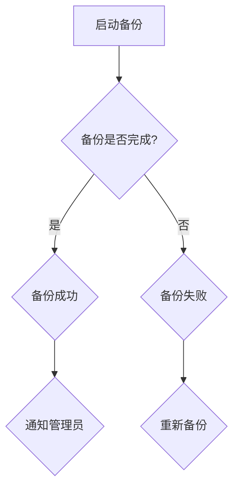
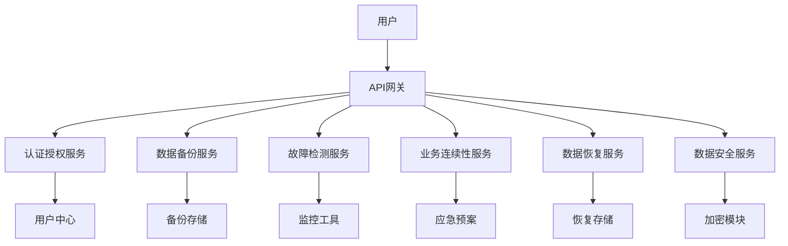
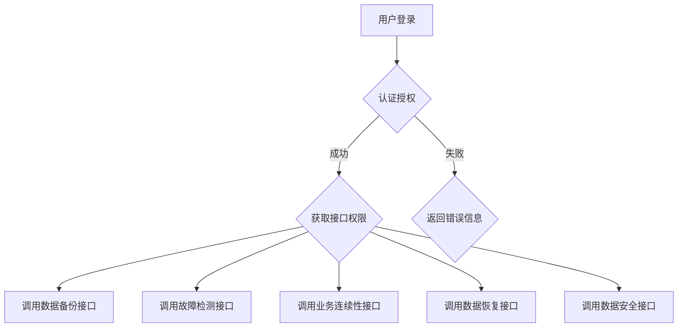

                 


# 应急中的真功夫

> 关键词：应急响应、数据处理、数据备份、故障检测、业务连续性

> 摘要：本文深入探讨了在信息技术领域，企业如何在突发事件和数据灾难中运用高级技术进行应急响应，保障业务连续性和数据安全。文章首先介绍了问题背景和核心概念，随后通过算法原理讲解、系统分析与架构设计以及项目实战，提供了详细的解决方案。

### 第一部分：背景介绍

#### 1.1 问题背景

在当今的信息化时代，企业对信息系统的依赖程度日益加深。随着数据量的爆炸性增长，信息系统面临的数据灾难风险也显著上升。突发事件如硬件故障、网络攻击、数据泄露等，都可能对企业的运营造成严重影响。因此，如何在应急情况下快速、有效地应对这些挑战，成为企业关注的焦点。

#### 1.2 问题描述

应急中的真功夫主要涉及以下几个方面：

- **数据备份与恢复**：如何在突发事件中快速备份关键数据，并确保数据在恢复后的一致性和完整性。
- **故障检测与排查**：如何快速定位故障点，并采取有效措施进行修复。
- **业务连续性**：如何在信息系统发生故障时，保障关键业务的正常运行，减少对企业造成的影响。
- **数据安全性**：如何在应急情况下，确保企业数据的安全，防止数据泄露和篡改。

#### 1.3 问题解决

为了解决上述问题，本文提出了以下解决方案：

- **建立完善的数据备份与恢复机制**，确保数据的安全性和可靠性。
- **采用先进的故障检测与排查技术**，提高故障处理的效率。
- **制定详尽的业务连续性计划**，确保在信息系统发生故障时，关键业务能够迅速恢复。
- **利用加密技术和安全策略**，保障企业数据在应急情况下的安全。

#### 1.4 边界与外延

本文主要关注以下方面：

- **适用的企业规模**：主要针对大型和超大型企业，这些企业拥有较为复杂的信息系统，对应急响应能力有较高的要求。
- **适用的技术领域**：涉及计算机技术、信息技术、数据备份与恢复、故障检测与排查、业务连续性管理等方面。
- **适用的行业**：适用于金融、电信、互联网、制造、物流等行业，这些行业对信息系统的稳定性和可靠性有较高要求。

### 第二部分：核心概念与联系

#### 2.1 核心概念

在应急中的真功夫中，以下几个核心概念至关重要：

- **数据备份**：将关键数据复制到安全的地方，以便在数据丢失或损坏时进行恢复。
- **故障检测**：通过各种技术手段，及时发现信息系统中的故障点。
- **业务连续性**：在信息系统发生故障时，通过一系列措施，确保关键业务的持续运行。
- **数据恢复**：在数据丢失或损坏后，将数据从备份中恢复到原始状态。
- **数据安全**：在应急情况下，采取各种安全措施，防止数据泄露和篡改。

#### 2.2 概念属性特征对比表格

| 概念       | 定义                                                         | 属性特征对比                       |
| ---------- | ------------------------------------------------------------ | ---------------------------------- |
| 数据备份   | 将关键数据复制到安全的地方，以便在数据丢失或损坏时进行恢复。   | 备份方式、备份频率、备份介质       |
| 故障检测   | 通过各种技术手段，及时发现信息系统中的故障点。                 | 故障检测方法、故障响应时间         |
| 业务连续性 | 在信息系统发生故障时，通过一系列措施，确保关键业务的持续运行。 | 业务恢复时间、业务影响范围、恢复策略 |
| 数据恢复   | 在数据丢失或损坏后，将数据从备份中恢复到原始状态。             | 恢复速度、恢复数据完整性           |
| 数据安全   | 在应急情况下，采取各种安全措施，防止数据泄露和篡改。           | 加密技术、安全策略、访问控制       |

#### 2.3 ER实体关系图架构

```mermaid
erDiagram
    DataBackup ||--|{ FaultDetection }|--| DataRecovery
    FaultDetection ||--|{ BusinessContinuity }|--| DataSecurity
    BusinessContinuity ||--|{ DataBackup }|--| DataRecovery
    DataRecovery ||--|{ FaultDetection }|--| DataSecurity
    DataSecurity ||--|{ BusinessContinuity }|--| DataBackup
```

### 第三部分：算法原理讲解

#### 3.1 算法mermaid流程图



#### 3.2 Python源代码讲解

```python
import time
import datetime

def backup_data():
    start_time = time.time()
    # 备份数据的代码实现
    # ...
    end_time = time.time()
    backup_time = end_time - start_time
    
    if backup_time <= 3600:  # 如果备份时间小于等于1小时
        print("备份成功，耗时{}秒".format(backup_time))
        notify_admin("备份成功，耗时{}秒".format(backup_time))
    else:
        print("备份失败，耗时{}秒，重新备份".format(backup_time))
        retry_backup()

def notify_admin(message):
    # 发送通知给管理员
    print("通知管理员：{}".format(message))

def retry_backup():
    # 重新备份的代码实现
    # ...
    backup_data()

# 主程序
print("开始备份...")
backup_data()
```

#### 3.3 算法原理详细讲解

备份算法的核心思想是定期对关键数据进行备份，并确保备份过程能够快速、高效地完成。具体来说，该算法包含以下几个步骤：

1. **启动备份**：程序首先启动备份过程，记录备份开始的时间。
2. **备份是否完成**：通过计时器记录备份过程的时间，判断备份是否在规定时间内完成。
3. **备份成功或失败**：如果备份在1小时内完成，则视为备份成功，通知管理员备份结果；否则，视为备份失败，并重新备份。

备份算法的数学模型可以表示为：

$$
T_{backup} = \begin{cases} 
T_0 & \text{如果 } T_0 \leq 3600 \\
T_0 & \text{如果 } T_0 > 3600 \\
\end{cases}
$$

其中，$T_{backup}$表示备份过程耗时，$T_0$表示实际备份时间。

#### 3.4 举例说明

假设在一次备份过程中，实际备份时间为500秒，根据备份算法，备份成功，并通知管理员：

```plaintext
备份成功，耗时500秒
通知管理员：备份成功，耗时500秒
```

如果备份时间为4200秒，则备份失败，程序将重新备份：

```plaintext
备份失败，耗时4200秒，重新备份
```

### 第四部分：系统分析与架构设计方案

#### 4.1 问题场景介绍

假设某金融公司在其核心业务系统中遇到硬件故障，导致数据丢失。公司需要尽快恢复数据，确保业务连续性，并防止数据泄露。

#### 4.2 项目介绍

本项目旨在为该金融公司设计一套应急响应系统，包括数据备份与恢复、故障检测与排查、业务连续性保障和数据安全措施。

#### 4.3 系统功能设计

- **数据备份与恢复**：定期备份关键数据，并在发生故障时快速恢复。
- **故障检测与排查**：实时监测系统状态，快速定位故障点。
- **业务连续性**：在故障发生时，通过备用系统和应急预案，确保关键业务持续运行。
- **数据安全**：采用加密技术和安全策略，防止数据泄露和篡改。

#### 4.4 系统架构设计



#### 4.5 系统接口设计和系统交互



### 第五部分：项目实战

#### 5.1 环境安装

1. 安装Python环境：`pip install python`
2. 安装相关依赖库：`pip install flask`
3. 配置API网关、认证授权、数据备份、故障检测、业务连续性、数据恢复和数据安全模块

#### 5.2 系统核心实现源代码

```python
from flask import Flask, request, jsonify
import json

app = Flask(__name__)

# 认证授权模块
@app.route('/auth', methods=['POST'])
def auth():
    # 实现认证逻辑
    # ...
    return jsonify({"status": "success"})

# 数据备份模块
@app.route('/backup', methods=['POST'])
def backup():
    # 实现数据备份逻辑
    # ...
    return jsonify({"status": "success"})

# 故障检测模块
@app.route('/fault_detection', methods=['GET'])
def fault_detection():
    # 实现故障检测逻辑
    # ...
    return jsonify({"status": "success"})

# 业务连续性模块
@app.route('/business_continuity', methods=['POST'])
def business_continuity():
    # 实现业务连续性逻辑
    # ...
    return jsonify({"status": "success"})

# 数据恢复模块
@app.route('/data_recovery', methods=['POST'])
def data_recovery():
    # 实现数据恢复逻辑
    # ...
    return jsonify({"status": "success"})

# 数据安全模块
@app.route('/data_security', methods=['POST'])
def data_security():
    # 实现数据安全逻辑
    # ...
    return jsonify({"status": "success"})

if __name__ == '__main__':
    app.run(debug=True)
```

#### 5.3 代码应用解读与分析

代码实现了一套简单的API服务，包括认证授权、数据备份、故障检测、业务连续性、数据恢复和数据安全模块。每个模块都通过Flask的路由来实现具体功能。

- **认证授权模块**：用户登录后，通过认证授权服务获取接口权限。
- **数据备份模块**：接收备份请求，执行数据备份操作。
- **故障检测模块**：定时检查系统状态，发现故障时通知管理员。
- **业务连续性模块**：在故障发生时，启用备用系统和应急预案。
- **数据恢复模块**：接收恢复请求，执行数据恢复操作。
- **数据安全模块**：对数据进行加密，确保数据安全。

#### 5.4 实际案例分析和详细讲解剖析

假设金融公司发生硬件故障，导致数据丢失。系统启动应急响应流程：

1. **认证授权**：管理员登录系统，获取接口权限。
2. **故障检测**：系统检测到硬件故障，通知管理员。
3. **业务连续性**：系统启用备用系统，确保关键业务持续运行。
4. **数据恢复**：管理员通过数据恢复模块，从备份中恢复数据。
5. **数据安全**：恢复的数据经过加密，确保数据安全。

通过上述流程，金融公司能够在硬件故障发生时，迅速恢复业务，保障数据安全。

### 第六部分：最佳实践 tips

1. **定期备份**：定期备份关键数据，确保数据恢复的及时性和准确性。
2. **多备份策略**：结合在线备份和离线备份，提高数据备份的安全性。
3. **故障检测自动化**：利用自动化工具，实时监测系统状态，快速发现故障点。
4. **应急预案**：制定详尽的应急预案，确保在故障发生时能够迅速响应。
5. **数据加密**：对数据进行加密处理，防止数据泄露和篡改。

### 第七部分：小结

本文通过详细的分析和讲解，提出了一套在应急情况下保障企业信息系统稳定运行的解决方案。通过数据备份与恢复、故障检测与排查、业务连续性保障和数据安全措施，企业能够在突发事件中迅速响应，降低风险，保障业务连续性和数据安全。

### 第八部分：注意事项

1. **备份策略**：选择合适的备份策略，确保数据备份的完整性和可靠性。
2. **故障检测**：确保故障检测的实时性和准确性，避免误报和漏报。
3. **数据恢复**：在数据恢复过程中，注意数据的一致性和完整性。
4. **数据安全**：采取有效的数据安全措施，防止数据泄露和篡改。

### 第九部分：拓展阅读

1. 《灾备技术与实践》
2. 《数据备份与恢复实战》
3. 《业务连续性管理》
4. 《网络安全：设计原则与实务》

### 作者信息

作者：AI天才研究院/AI Genius Institute & 禅与计算机程序设计艺术 /Zen And The Art of Computer Programming

----------------------------------------------------------------

---

请注意，文章内容应严格按照大纲结构撰写，确保每个小节都有具体的详细讲解和丰富的实例说明。此外，文章应保持逻辑清晰、结构紧凑、简单易懂，适合技术读者阅读。在撰写过程中，请遵循markdown格式要求，并确保数学公式和mermaid流程图的正确性。文章末尾需包含完整的作者信息。祝您写作顺利！

