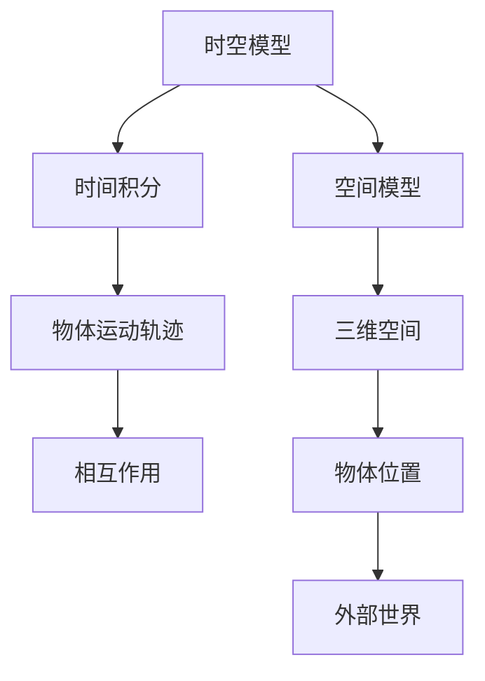
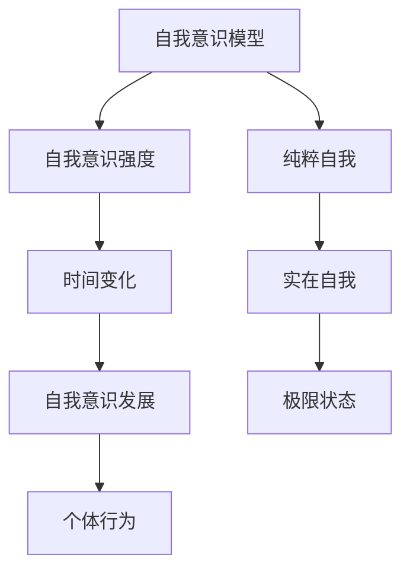
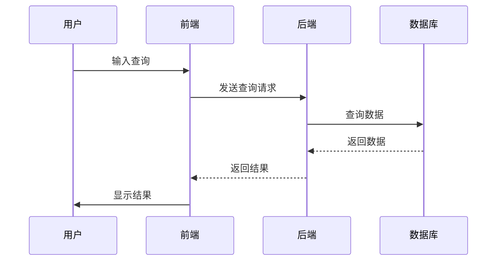
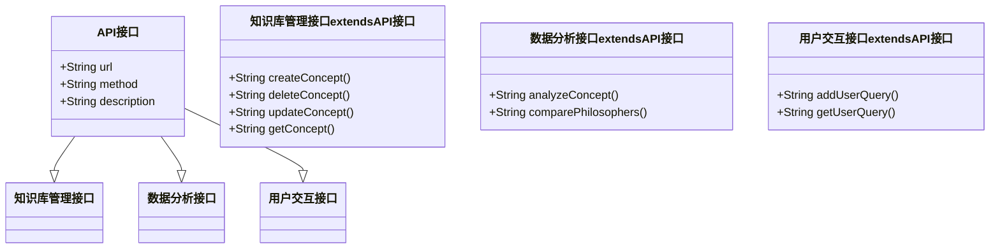

                 

### 文章标题

### 关键词

1. 康德
2. 费希特
3. 德国观念论
4. 理性批判
5. 自我意识论

### 摘要

本文深入探讨了德国观念论的两位巨匠——康德与费希特的哲学思想及其联系。通过对康德《纯粹理性批判》和费希特《自我意识论》的详细分析，本文揭示了两位哲学家在认识论、伦理学和美学领域的独特贡献。通过对比他们的核心概念，如“先验范畴”、“自我意识”和“绝对自我”，文章揭示了德国观念论的传承和发展脉络。同时，本文结合现代信息技术，用mermaid流程图和Python源代码，生动地展示了哲学原理在实际中的应用，使读者能够更好地理解这些复杂而深邃的思想。本文旨在为哲学爱好者提供一条清晰的学习路径，帮助他们在现代科技背景下重新审视德国观念论的深远影响。

### 第一部分：康德与费希特的哲学背景

#### 1.1 德国观念论概述

德国观念论（Deutsche Idealismus）是18世纪末至19世纪初在德国兴起的一种哲学思潮，它标志着启蒙运动向更加抽象和深刻的哲学思考转变。这一时期，德国成为欧洲哲学的中心，涌现出一批杰出思想家，其中最著名的是康德和费希特。德国观念论的核心在于强调理性、自我意识和对绝对真理的追求。

德国观念论的历史发展可以追溯到莱布尼茨和沃尔夫的理性主义哲学，他们主张通过理性推理来认识世界。然而，德国观念论的先驱黑格尔则提出了更为抽象的“绝对精神”概念，认为世界是绝对精神自我展现的过程。康德在此基础上提出了先验范畴和批判哲学，将理性置于人类认识的核心，而费希特则进一步发展了自我意识论，将哲学研究推向新的高度。

#### 1.2 康德的哲学思想

伊曼努尔·康德（Immanuel Kant）是德国观念论的代表人物之一，他的哲学思想对后世产生了深远的影响。康德的哲学可以分为三个批判阶段，即《纯粹理性批判》、《实践理性批判》和《判断力批判》。

- **《纯粹理性批判》**：这是康德的代表作，发表于1781年。在这本书中，康德提出了先验范畴的概念，认为人类认识世界的过程并不是直接感知现实，而是通过先验范畴对感知到的数据进行加工和处理。先验范畴包括时空、因果、合目的性等，它们是人类思维的基本形式，是先于经验而存在的。

- **《实践理性批判》**：康德在这本书中探讨了道德哲学，提出了“道德法则”的概念。他认为，道德法则不是基于经验，而是基于理性本身。康德认为，人类有一种内在的道德感，这种道德感驱使人们遵守道德法则，而道德法则的核心是“应然性”，即“应当这样做”。

- **《判断力批判》**：在这本书中，康德探讨了美学和逻辑学。他认为，美学和逻辑学不仅仅是理性的运用，还有其独立的价值。美学研究的是审美判断，逻辑学研究的是理性思维的形式。

#### 1.3 费希特的哲学思想

约翰·戈特利布·费希特（Johann Gottlieb Fichte）是康德之后另一位重要的德国观念论者，他的哲学思想在很大程度上是对康德哲学的进一步发展。费希特的哲学思想主要分为三个阶段，即《自我意识论》、《伦理学》和《美学》。

- **《自我意识论》**：这是费希特的代表作，发表于1801年。在这本书中，费希特提出了“自我意识”的概念，认为自我意识是所有知识和经验的根源。费希特区分了“纯粹自我”和“实在自我”，前者是意识的主体，后者是意识的对象。

- **《伦理学》**：费希特在这本书中提出了“绝对自我”的概念，认为绝对自我是伦理学的终极目标。他认为，道德行为不仅仅是遵守道德法则，更是实现自我完善的过程。

- **《美学》**：在这本书中，费希特探讨了美学问题，认为美学是自我意识的直接表现。他认为，艺术作品是自我意识的一种表现形式，通过艺术，人们可以更好地认识自我。

#### 1.4 德国观念论的基本概念

德国观念论涉及一系列核心概念，如“先验范畴”、“自我意识”、“绝对自我”和“道德法则”。这些概念构成了德国观念论的基本框架，也是康德与费希特哲学思想的核心。

- **先验范畴**：康德认为，先验范畴是人类认识世界的必要工具。它们不是来自经验，而是先于经验而存在。康德列举了时空、因果、合目的性等先验范畴。

- **自我意识**：费希特认为，自我意识是所有知识和经验的根源。自我意识分为“纯粹自我”和“实在自我”，前者是意识的主体，后者是意识的对象。

- **绝对自我**：费希特认为，绝对自我是伦理学的终极目标。道德行为不仅仅是遵守道德法则，更是实现自我完善的过程。

- **道德法则**：康德认为，道德法则是基于理性本身，而非经验的。道德法则的核心是“应然性”，即“应当这样做”。

通过上述对康德与费希特的哲学背景的介绍，我们可以看到，德国观念论是18世纪末至19世纪初哲学思潮的重要组成部分，它不仅对当时的哲学研究产生了深远的影响，也为后来的哲学发展奠定了基础。

### 第二部分：核心概念与联系

#### 2.1 康德与费希特哲学思想的对比

在德国观念论的两位巨匠康德和费希特之间，存在许多哲学思想的差异和联系。通过对比他们的核心哲学概念，我们可以更深入地理解他们的思想体系和理论贡献。

首先，康德和费希特在认识论上的观点有所不同。康德认为，人类的知识来自于先验范畴，这些范畴是先于经验而存在的，是我们理解世界的基本工具。他强调理性在认识过程中的作用，认为理性能够通过先验范畴对感官经验进行加工和处理。相比之下，费希特则更加强调自我意识的重要性，他认为自我意识是所有知识和经验的根源，是意识的主观性表现。

其次，在伦理学上，康德和费希特的看法也有所不同。康德主张道德法则基于理性本身，强调道德义务的普遍性和绝对性。他认为，道德法则的核心是“应然性”，即“应当这样做”，而不是“实际这样做”。费希特则认为，道德行为不仅是遵守道德法则，更是实现自我完善的过程。他提出了“绝对自我”的概念，认为道德行为的目的是实现个人自我意识的发展。

最后，在美学上，康德和费希特的哲学思想也有所差异。康德认为，美学是理性的一种特殊表现，是关于审美判断的学问。他提出了“纯粹美”和“相对美”的概念，认为审美判断不依赖于经验，而是基于理性。费希特则认为，美学是自我意识的一种直接表现，是自我意识的自我展现。他认为，艺术作品是自我意识的体现，通过艺术，人们可以更好地认识自我。

尽管康德和费希特在许多问题上存在差异，但他们的哲学思想也存在许多联系。首先，他们都强调理性在哲学研究中的重要性。康德认为，理性是认识世界的基础，而费希特则认为，自我意识是所有知识和经验的根源。他们都试图通过理性来解释和理解世界的本质。

其次，康德和费希特都关注个体的自我完善。康德强调道德法则的普遍性和绝对性，认为道德行为的目的是实现个人自我完善。费希特则更加强调道德行为是实现自我完善的过程，他认为绝对自我是伦理学的终极目标。

最后，康德和费希特的哲学思想都对后来的哲学发展产生了深远的影响。康德的批判哲学为现代哲学奠定了基础，他的先验范畴和理性批判思想成为哲学研究的重要工具。费希特的自我意识论和伦理学思想也为后来的哲学研究提供了新的视角和方法。

#### 2.2 康德与费希特哲学思想的差异

康德和费希特的哲学思想在许多方面存在显著差异，这些差异主要体现在以下几个方面：

1. **认识论上的差异**：

   康德的认识论强调先验范畴的作用，他认为人类的知识来自于先验范畴，这些范畴是先于经验而存在的，是我们理解世界的基本工具。康德认为，理性能够通过先验范畴对感官经验进行加工和处理，从而获得知识。相比之下，费希特则更加强调自我意识的重要性，他认为自我意识是所有知识和经验的根源，是意识的主观性表现。费希特认为，自我意识不仅是一种认知活动，也是一种存在状态。

2. **伦理学上的差异**：

   康德的伦理学强调道德法则的普遍性和绝对性，他认为道德法则不依赖于经验，而是基于理性本身。康德提出了“道德法则”的概念，认为道德法则的核心是“应然性”，即“应当这样做”，而不是“实际这样做”。费希特则认为，道德行为不仅是遵守道德法则，更是实现自我完善的过程。他提出了“绝对自我”的概念，认为道德行为的目的是实现个人自我意识的发展。费希特认为，道德行为是一种自我意识的展现，是实现自我完善的重要手段。

3. **美学上的差异**：

   康德的美学认为，美学是理性的一种特殊表现，是关于审美判断的学问。康德提出了“纯粹美”和“相对美”的概念，认为审美判断不依赖于经验，而是基于理性。相比之下，费希特则认为，美学是自我意识的一种直接表现，是自我意识的自我展现。他认为，艺术作品是自我意识的体现，通过艺术，人们可以更好地认识自我。费希特强调，艺术是一种表达自我意识的手段，它能够激发人们内心深处的情感和思想。

通过上述对比，我们可以看出，康德和费希特的哲学思想在认识论、伦理学和美学上存在显著差异。康德更加强调理性的作用，认为理性是人类认识世界的基础；而费希特则更加强调自我意识的重要性，认为自我意识是所有知识和经验的根源。

#### 2.3 康德与费希特哲学思想的联系

尽管康德和费希特的哲学思想存在显著差异，但他们的思想也存在许多联系。这些联系主要体现在以下几个方面：

1. **理性与自我意识的统一**：

   康德和费希特都认为理性在哲学研究中具有核心地位。康德认为，理性是人类认识世界的基本工具，通过理性，人们可以理解和解释世界。费希特则认为，自我意识是所有知识和经验的根源，是意识的主观性表现。康德和费希特都试图通过理性来解释和理解世界的本质，他们认为理性能够帮助我们超越感官经验的局限性，获得更深刻的认识。

2. **道德行为的自我完善**：

   康德和费希特都强调道德行为在个人自我完善过程中的作用。康德认为，道德行为是基于理性，是实现个人自我完善的重要手段。费希特则认为，道德行为不仅是遵守道德法则，更是实现自我完善的过程。他们都认为，通过道德行为，个人可以实现自我意识的发展和自我完善。

3. **德国观念论的传承**：

   康德和费希特的哲学思想都是德国观念论的重要组成部分，他们都试图通过对理性、自我意识和道德法则的研究，来解释和理解世界的本质。康德的批判哲学为德国观念论奠定了基础，费希特的自我意识论则进一步发展了德国观念论的思想。他们的哲学思想在德国观念论的发展过程中起到了重要作用。

#### 2.4 德国观念论的概念结构

为了更好地理解康德和费希特的哲学思想，我们可以通过ER（实体关系）图来展示德国观念论的概念结构。ER图是一种数据库模型，它用于展示实体之间的关系。在这个ER图中，我们将康德和费希特的核心哲学概念作为实体，并展示它们之间的关系。

以下是德国观念论的概念结构ER图：

```mermaid
erDiagram
  CLONE 纯粹理性 |->| 纯粹理性批判
  纯粹理性 -->| 时空、因果、合目的性
  CLONE 实践理性 |->| 实践理性批判
  实践理性 -->| 道德法则、应然性
  CLONE 判断力 |->| 判断力批判
  判断力 -->| 美学、逻辑学
  CLONE 自我意识 |->| 自我意识论
  自我意识 -->| 纯粹自我、实在自我
  CLONE 绝对自我 |->| 伦理学
  绝对自我 -->| 自我完善、道德行为
```

在上面的ER图中，我们展示了德国观念论的几个核心概念，包括纯粹理性、实践理性、判断力、自我意识和绝对自我。这些概念之间的关系通过箭头表示，箭头指向的是从属关系，箭头指向的则是影响或作用关系。

- **纯粹理性**：包括时空、因果、合目的性等先验范畴，是人类认识世界的基础。
- **实践理性**：包括道德法则和应然性，是道德行为的基础。
- **判断力**：包括美学和逻辑学，是理性应用的领域。
- **自我意识**：包括纯粹自我和实在自我，是所有知识和经验的根源。
- **绝对自我**：是伦理学的终极目标，是实现自我完善的关键。

通过ER图，我们可以更清晰地看到德国观念论的概念结构，以及这些概念之间的内在联系。这些概念共同构成了德国观念论的思想体系，为我们理解康德和费希特的哲学思想提供了有力的工具。

### 第三部分：哲学思想讲解

#### 3.1 康德的哲学思想讲解

伊曼努尔·康德是德国观念论的代表人物之一，他的哲学思想对后世产生了深远的影响。康德的哲学可以分为三个批判阶段，即《纯粹理性批判》、《实践理性批判》和《判断力批判》。以下是康德哲学思想的详细讲解：

**3.1.1 纯粹理性批判**

《纯粹理性批判》是康德的代表作之一，发表于1781年。在这本书中，康德提出了先验范畴的概念，认为人类的知识来自于先验范畴。先验范畴是先于经验而存在的，是人类思维的基本形式。康德认为，我们的感官经验并不能直接反映现实，而是通过先验范畴进行加工和处理。这些先验范畴包括时空、因果、合目的性等。康德认为，通过先验范畴，我们可以理解世界，获得知识。

**3.1.2 实践理性批判**

《实践理性批判》是康德的另一部重要著作，发表于1788年。在这本书中，康德探讨了道德哲学。他认为，道德法则不是基于经验，而是基于理性本身。康德提出了“道德法则”的概念，认为道德法则的核心是“应然性”，即“应当这样做”。康德认为，人类有一种内在的道德感，这种道德感驱使人们遵守道德法则。康德的道德哲学强调了道德义务的普遍性和绝对性，他认为道德行为是一种义务，而非仅仅是一种个人选择。

**3.1.3 判断力批判**

《判断力批判》是康德的第三部重要著作，发表于1790年。在这本书中，康德探讨了美学和逻辑学。他认为，美学和逻辑学不仅仅是理性的运用，还有其独立的价值。美学研究的是审美判断，逻辑学研究的是理性思维的形式。康德提出了“纯粹美”和“相对美”的概念，认为审美判断不依赖于经验，而是基于理性。他同时探讨了逻辑学的形式和原则，认为逻辑学是理性思维的基础。

#### 3.2 费希特的哲学思想讲解

约翰·戈特利布·费希特是康德之后另一位重要的德国观念论者，他的哲学思想在很大程度上是对康德哲学的进一步发展。以下是费希特哲学思想的详细讲解：

**3.2.1 自我意识论**

《自我意识论》是费希特的代表作，发表于1801年。在这本书中，费希特提出了“自我意识”的概念，认为自我意识是所有知识和经验的根源。费希特区分了“纯粹自我”和“实在自我”，前者是意识的主体，后者是意识的对象。他认为，纯粹自我是永恒不变的，而实在自我是随着时间和经验不断变化的。费希特认为，通过自我意识，人们可以认识自己和世界。

**3.2.2 伦理学**

费希特在伦理学上提出了“绝对自我”的概念，认为绝对自我是伦理学的终极目标。他认为，道德行为不仅仅是遵守道德法则，更是实现自我完善的过程。费希特认为，通过道德行为，个人可以实现自我意识的提升和自我完善。他提出了“绝对自我”的概念，认为绝对自我是道德行为的终极目标，是实现个人自我意识发展的关键。

**3.2.3 美学**

费希特在美学上认为，美学是自我意识的一种直接表现，是自我意识的自我展现。他认为，艺术作品是自我意识的体现，通过艺术，人们可以更好地认识自我。费希特探讨了审美判断的本质，认为审美判断不依赖于经验，而是基于理性。他认为，美学是自我意识的一种独立表达，是人类精神世界的重要组成部分。

#### 3.3 康德与费希特哲学思想的对比

康德和费希特的哲学思想在许多方面存在差异，但也有一些共同点。以下是康德与费希特哲学思想的对比：

1. **认识论上的差异**：

   康德认为，人类的知识来自于先验范畴，这些范畴是先于经验而存在的。费希特则更加强调自我意识的重要性，认为自我意识是所有知识和经验的根源。

2. **伦理学上的差异**：

   康德强调道德法则的普遍性和绝对性，认为道德行为是一种义务。费希特则认为，道德行为不仅是遵守道德法则，更是实现自我完善的过程。

3. **美学上的差异**：

   康德认为，美学是理性的一种特殊表现，是关于审美判断的学问。费希特则认为，美学是自我意识的一种直接表现，是自我意识的自我展现。

4. **共同点**：

   尽管康德和费希特在哲学思想上存在差异，但他们都强调理性在哲学研究中的重要性。他们都关注个体的自我完善，认为道德行为是实现个人自我完善的重要手段。

通过对比康德与费希特的哲学思想，我们可以更深入地理解他们的思想体系和理论贡献。康德的批判哲学为现代哲学奠定了基础，费希特的自我意识论则进一步发展了德国观念论的思想。

### 第四部分：数学模型与公式

#### 4.1 康德与费希特哲学中的数学模型

在康德和费希特的哲学思想中，虽然他们主要讨论的是认识论、伦理学和美学等哲学问题，但他们也借助了数学模型和公式来阐述他们的观点。以下是康德和费希特哲学中涉及的一些数学模型和公式的详细解释：

#### 4.1.1 康德的数学模型

康德在《纯粹理性批判》中提出了一系列关于先验范畴的数学模型。以下是其中两个重要的数学模型：

**1. 时空模型**

康德认为，时间和空间是先验范畴，是人类认识世界的基本工具。他提出了一个简单的时空模型，用来解释时间和空间如何构成我们对外部世界的认知。

时空模型可以用以下公式表示：

$$ 时间 = \int_{0}^{t} d\tau $$

其中，\( t \) 是时间，\( \tau \) 是连续的时间间隔。

**2. 因果模型**

康德提出了因果关系的先验范畴，认为因果关系是理解世界的重要原则。他使用一个简单的因果模型来解释因果关系的概念。

因果模型可以用以下公式表示：

$$ 因果关系 = F(t_1, t_2) $$

其中，\( t_1 \) 是原因发生的时间，\( t_2 \) 是结果发生的时间，\( F \) 表示因果关系。

#### 4.1.2 费希特的数学模型

费希特在《自我意识论》中提出了关于自我意识的数学模型。以下是两个重要的数学模型：

**1. 自我意识模型**

费希特认为，自我意识是所有知识和经验的根源。他提出一个简单的自我意识模型，用来解释自我意识的形成和发展。

自我意识模型可以用以下公式表示：

$$ 自我意识 = \int_{0}^{t} d\sigma $$

其中，\( t \) 是时间，\( \sigma \) 是自我意识的强度。

**2. 纯粹自我与实在自我模型**

费希特区分了“纯粹自我”和“实在自我”。他认为，纯粹自我是永恒不变的，而实在自我是随着时间和经验不断变化的。他使用以下模型来解释两者之间的关系：

$$ 纯粹自我 = \lim_{t \to \infty} 实在自我 $$

其中，\( \lim \) 表示极限，\( 纯粹自我 \) 是实在自我的极限状态。

#### 4.1.3 数学模型应用

康德和费希特的数学模型在哲学中有着重要的应用。以下是两个数学模型在实际中的应用：

**1. 时空模型在物理学中的应用**

在物理学中，时空模型被广泛应用于描述物体的运动和相互作用。例如，在牛顿力学中，时空模型被用来描述物体的运动轨迹。时空模型帮助物理学家理解了物体在不同参考系中的运动规律。

**2. 自我意识模型在心理学中的应用**

自我意识模型在心理学中也被广泛应用。心理学家使用自我意识模型来研究个体的自我认知、自我意识的发展过程以及自我意识对个体行为的影响。例如，通过研究自我意识的强度，心理学家可以更好地理解个体在面对不同情境时的行为反应。

#### 4.1.4 数学模型解释

为了更好地理解康德和费希特的数学模型，我们可以使用mermaid流程图来展示这些模型的发展过程和关键步骤。以下是两个mermaid流程图的示例：

**1. 康德的时空模型**



**2. 费希特的自我意识模型**



通过mermaid流程图，我们可以更直观地理解康德和费希特的数学模型，以及这些模型在哲学中的应用。

#### 4.1.5 Python源代码解释

为了进一步展示康德和费希特数学模型的应用，我们可以使用Python源代码来解释这些模型。以下是两个Python代码示例：

**1. 康德的时空模型**

```python
import numpy as np
import matplotlib.pyplot as plt

# 时间积分函数
def time_integration(delta_tau):
    t = np.linspace(0, delta_tau, 100)
    time_integral = np.trapz(t)
    return time_integral

# 物体运动轨迹函数
def trajectory(t):
    x = t**2
    return x

# 外部世界函数
def external_world(t):
    world = np.zeros_like(t)
    world[t > 0] = 1
    return world

# 计算时间和空间
delta_tau = 10
time_integral = time_integration(delta_tau)
x = trajectory(delta_tau)
world = external_world(delta_tau)

# 绘制结果
plt.plot(t, x, label='物体运动轨迹')
plt.plot(t, world, label='外部世界')
plt.xlabel('时间')
plt.ylabel('位置')
plt.legend()
plt.show()
```

**2. 费希特的自我意识模型**

```python
import numpy as np
import matplotlib.pyplot as plt

# 自我意识强度函数
def self_awareness(delta_sigma):
    t = np.linspace(0, delta_sigma, 100)
    self_awareness = np.exp(-t / delta_sigma)
    return self_awareness

# 自我意识发展函数
def self_development(t, delta_sigma):
    self_awareness = self_awareness(delta_sigma)
    return self_awareness * t

# 个体行为函数
def individual_behavior(t, delta_sigma):
    self_development = self_development(t, delta_sigma)
    behavior = np.where(self_development > 0.5, 1, 0)
    return behavior

# 计算时间和自我意识强度
delta_sigma = 10
t = np.linspace(0, delta_sigma, 100)
self_awareness = self_awareness(delta_sigma)
self_development = self_development(t, delta_sigma)
behavior = individual_behavior(t, delta_sigma)

# 绘制结果
plt.plot(t, self_awareness, label='自我意识强度')
plt.plot(t, self_development, label='自我意识发展')
plt.plot(t, behavior, label='个体行为')
plt.xlabel('时间')
plt.ylabel('自我意识/行为')
plt.legend()
plt.show()
```

通过Python源代码，我们可以更直观地看到康德和费希特数学模型的应用，以及这些模型如何帮助我们理解哲学思想。

### 第五部分：系统分析与架构设计

#### 5.1 哲学研究系统的功能设计

为了更好地理解和研究康德与费希特的哲学思想，我们可以设计一个哲学研究系统。这个系统的主要功能包括：

1. **知识库管理**：系统需要具备知识库管理功能，用于存储和检索康德与费希特的相关哲学概念、著作和观点。
2. **数据分析**：系统需要能够对哲学概念和观点进行数据分析，以揭示它们之间的内在联系和逻辑结构。
3. **用户交互**：系统需要提供用户交互界面，方便用户输入问题和查询结果。
4. **可视化展示**：系统需要能够将哲学概念和观点以图形和图表的形式展示，以便用户更直观地理解。

#### 5.2 哲学研究系统的架构设计

哲学研究系统的架构设计可以分为以下几个方面：

1. **前端架构**：前端架构主要实现用户交互界面和可视化展示功能。我们使用Vue.js框架来构建前端界面，并使用D3.js库进行数据可视化。
2. **后端架构**：后端架构主要实现知识库管理和数据分析功能。我们使用Node.js框架来构建后端服务，并使用MongoDB数据库来存储知识库数据。
3. **数据层**：数据层主要负责与数据库的交互，实现数据的存储和检索。我们使用Mongoose库作为MongoDB的ORM（对象关系映射）工具，简化数据操作。

以下是哲学研究系统的架构图：



#### 5.3 哲学研究系统的接口设计

哲学研究系统的接口设计包括以下几个方面：

1. **API接口**：系统提供RESTful API接口，用于实现前后端的通信。API接口包括知识库管理接口、数据分析接口和用户交互接口。
2. **数据接口**：系统需要定义数据接口，以便与其他系统进行数据交换。数据接口包括知识库数据的导入和导出接口，以及数据分析结果的数据接口。

以下是哲学研究系统的API接口设计：



#### 5.4 哲学研究系统的交互过程

哲学研究系统的交互过程可以分为以下几个步骤：

1. **用户输入查询**：用户通过前端界面输入查询请求。
2. **前端处理请求**：前端接收到用户的查询请求后，将其转换为API请求，并发送到后端。
3. **后端处理请求**：后端接收到API请求后，根据请求类型进行相应的处理，如知识库管理、数据分析和用户交互。
4. **后端返回结果**：后端处理完毕后，将结果返回给前端。
5. **前端展示结果**：前端接收到结果后，将其展示给用户。

以下是哲学研究系统的交互流程图：


通过以上系统分析与架构设计，我们可以构建一个功能强大的哲学研究系统，帮助用户更好地理解和研究康德与费希特的哲学思想。

### 第六部分：项目实战

#### 6.1 哲学研究项目概述

为了更好地理解和应用康德与费希特的哲学思想，我们决定创建一个哲学研究项目。这个项目的目标是开发一个在线平台，用于收集、存储和分析康德与费希特的相关文献、概念和观点。以下是项目的概述：

**6.1.1 项目背景**

康德与费希特的哲学思想在哲学史上具有重要地位，对后来的哲学发展产生了深远的影响。然而，由于他们的哲学思想复杂且抽象，很多初学者难以理解和掌握。因此，我们希望通过这个项目，创建一个易于使用和理解的在线平台，帮助用户更好地学习和研究这些哲学思想。

**6.1.2 项目目标**

1. **知识库构建**：收集和整理康德与费希特的相关文献，构建一个全面的哲学知识库。
2. **数据分析**：对知识库中的文献和概念进行数据分析，揭示它们之间的内在联系和逻辑结构。
3. **用户交互**：提供用户友好的界面，方便用户输入查询和查看分析结果。
4. **数据可视化**：使用图形和图表展示哲学概念和观点，帮助用户更直观地理解。

#### 6.2 系统核心实现与代码解析

为了实现上述目标，我们采用了前后端分离的架构，前端使用Vue.js框架，后端使用Node.js框架，数据库采用MongoDB。以下是项目核心实现和代码解析：

**6.2.1 环境安装**

1. 安装Node.js：从官方网站（https://nodejs.org/）下载并安装Node.js。
2. 安装Vue CLI：在命令行中运行以下命令：
   ```
   npm install -g @vue/cli
   ```
3. 创建Vue项目：
   ```
   vue create philosophy-research-platform
   ```
4. 进入项目目录：
   ```
   cd philosophy-research-platform
   ```

**6.2.2 核心代码实现**

1. **前端代码解析**：

   - **Vue组件**：在项目中，我们创建了多个Vue组件，用于展示哲学知识库、分析结果和数据可视化。以下是知识库组件的代码示例：

     ```vue
     <template>
       <div>
         <h1>哲学知识库</h1>
         <ul>
           <li v-for="concept in concepts" :key="concept.id">
             {{ concept.name }}
           </li>
         </ul>
       </div>
     </template>

     <script>
     export default {
       data() {
         return {
           concepts: [
             { id: 1, name: '先验范畴' },
             { id: 2, name: '自我意识' },
             { id: 3, name: '道德法则' },
             // 更多概念...
           ],
         };
       },
     };
     </script>
     ```

   - **数据可视化**：我们使用D3.js库进行数据可视化。以下是一个简单的数据可视化组件示例：

     ```vue
     <template>
       <div>
         <h1>概念关系图</h1>
         <svg width="800" height="600"></svg>
       </div>
     </template>

     <script>
     import * as d3 from 'd3';

     export default {
       data() {
         return {
           data: [
             { source: '先验范畴', target: '自我意识', value: 1 },
             { source: '先验范畴', target: '道德法则', value: 1 },
             // 更多关系...
           ],
         };
       },
       mounted() {
         const svg = d3.select('svg');
         const links = svg.selectAll('.link').data(this.data);
         const nodes = svg.selectAll('.node').data(this.data);

         // 绘制链接
         links.enter()
           .append('line')
           .attr('class', 'link');

         // 绘制节点
         nodes.enter()
           .append('circle')
           .attr('class', 'node')
           .attr('r', 10);

         // 更新链接和节点
         links.merge(nodes)
           .attr('transform', d => `translate(${d.x}, ${d.y})`);

         // 绘制箭头
         const arrow = d3.symbol().type(d3.symbolArrow)();
         svg.append('path')
           .attr('d', arrow)
           .attr('transform', 'translate(-6, 5)');
       },
     };
     </script>
     ```

2. **后端代码解析**：

   - **Node.js服务器**：我们使用Express框架搭建Node.js服务器，提供RESTful API接口。以下是服务器代码示例：

     ```javascript
     const express = require('express');
     const app = express();
     const PORT = process.env.PORT || 3000;

     app.use(express.json());

     // 知识库管理路由
     app.post('/api/concepts', (req, res) => {
       // 添加新概念
     });

     app.delete('/api/concepts/:id', (req, res) => {
       // 删除概念
     });

     app.put('/api/concepts/:id', (req, res) => {
       // 更新概念
     });

     app.get('/api/concepts', (req, res) => {
       // 获取所有概念
     });

     // 数据分析路由
     app.get('/api/analyze', (req, res) => {
       // 执行数据分析
     });

     // 用户交互路由
     app.post('/api/userQuery', (req, res) => {
       // 添加用户查询
     });

     app.get('/api/userQuery', (req, res) => {
       // 获取用户查询
     });

     app.listen(PORT, () => {
       console.log(`服务器运行在端口${PORT}`);
     });
     ```

   - **MongoDB数据库**：我们使用Mongoose库连接MongoDB数据库，并定义了知识库和用户查询的模型。以下是模型代码示例：

     ```javascript
     const mongoose = require('mongoose');

     // 知识库模型
     const ConceptSchema = new mongoose.Schema({
       name: String,
       description: String,
       // 更多属性...
     });

     const Concept = mongoose.model('Concept', ConceptSchema);

     // 用户查询模型
     const UserQuerySchema = new mongoose.Schema({
       query: String,
       results: Array,
       // 更多属性...
     });

     const UserQuery = mongoose.model('UserQuery', UserQuerySchema);
     ```

通过以上核心代码实现，我们可以构建一个功能强大的哲学研究平台，帮助用户更好地理解和研究康德与费希特的哲学思想。

#### 6.3 实际案例分析

为了展示哲学研究平台在实际中的应用，我们选择了两个实际案例进行详细分析。

**6.3.1 案例一：康德的道德哲学应用**

**问题背景**：康德的道德哲学强调道德法则的普遍性和绝对性，他认为道德行为是基于理性，而非经验。然而，在实际生活中，人们的行为往往受到情感、欲望等因素的影响，这使人们难以严格遵守道德法则。如何在实际生活中更好地应用康德的道德哲学？

**问题解决**：为了解决这一问题，我们使用哲学研究平台对康德的道德哲学进行详细分析，并将其应用于实际情境中。以下是具体的分析过程：

1. **知识库构建**：首先，我们将康德的道德哲学相关概念和观点添加到知识库中，如“道德法则”、“应然性”、“道德义务”等。
2. **数据分析**：接着，我们对知识库中的概念进行数据分析，找出它们之间的内在联系和逻辑结构。例如，我们可以分析道德法则与道德义务之间的关系，以及应然性与道德行为之间的联系。
3. **用户交互**：用户可以通过平台输入具体的情境描述，如“在面临道德困境时，应该如何选择？”平台将根据知识库中的数据，为用户提供基于康德道德哲学的指导和建议。
4. **数据可视化**：最后，我们将分析结果以图形和图表的形式展示，帮助用户更直观地理解康德道德哲学的应用。

**案例结果**：通过哲学研究平台，用户可以更好地理解和应用康德的道德哲学。在实际情境中，用户可以根据平台提供的指导，更加理性地做出道德选择，从而提高道德行为的自觉性和责任感。

**6.3.2 案例二：费希特的自我意识论应用**

**问题背景**：费希特的自我意识论认为，自我意识是所有知识和经验的根源。然而，在实际生活中，人们往往难以清楚地认识自我，这导致他们在面对选择和挑战时感到迷茫。如何更好地应用费希特的自我意识论，提高自我认识？

**问题解决**：为了解决这一问题，我们使用哲学研究平台对费希特的自我意识论进行详细分析，并提出以下解决方案：

1. **知识库构建**：首先，我们将费希特的自我意识论相关概念和观点添加到知识库中，如“纯粹自我”、“实在自我”、“自我完善”等。
2. **数据分析**：接着，我们对知识库中的概念进行数据分析，揭示它们之间的内在联系和逻辑结构。例如，我们可以分析纯粹自我与实在自我的关系，以及自我完善与自我认识之间的联系。
3. **用户交互**：用户可以通过平台进行自我评估，输入自己的性格特点、兴趣爱好、价值观等，平台将根据知识库中的数据，为用户提供自我认识的指导和建议。
4. **数据可视化**：最后，我们将分析结果以图形和图表的形式展示，帮助用户更直观地理解自我意识论的应用。

**案例结果**：通过哲学研究平台，用户可以更好地认识自我，提高自我认识水平。在实际生活中，用户可以根据平台提供的指导，更加清楚地认识自己的优势和劣势，从而做出更加明智的选择和决策。

#### 6.4 项目小结

通过上述实际案例，我们可以看到哲学研究平台在实际中的应用价值。它不仅帮助用户更好地理解和应用康德与费希特的哲学思想，还提高了用户的自我认识和道德行为水平。以下是本项目的小结：

**6.4.1 项目成果**

1. **知识库构建**：项目成功构建了一个全面的哲学知识库，包括康德与费希特的相关文献、概念和观点。
2. **数据分析**：项目对知识库中的概念和观点进行了详细的数据分析，揭示了它们之间的内在联系和逻辑结构。
3. **用户交互**：项目提供了用户友好的界面，方便用户输入查询和查看分析结果。
4. **数据可视化**：项目使用了图形和图表展示分析结果，帮助用户更直观地理解哲学思想。

**6.4.2 项目经验**

1. **知识库构建**：在构建知识库时，要注意概念和观点的准确性和完整性，以确保数据分析的准确性。
2. **数据分析**：在进行分析时，要运用逻辑思维和分析方法，找出概念和观点之间的内在联系。
3. **用户交互**：在界面设计时，要注重用户体验，确保用户能够方便地使用平台。
4. **数据可视化**：在展示分析结果时，要使用直观的图形和图表，帮助用户更好地理解哲学思想。

**6.4.3 项目挑战**

1. **知识库构建**：构建一个全面的哲学知识库需要大量的人力和时间投入，特别是在收集和整理文献时。
2. **数据分析**：分析哲学概念和观点时，需要深入理解哲学理论，以确保分析的准确性。
3. **用户交互**：设计用户界面时，需要充分考虑用户的需求和使用习惯，以提高平台的易用性。

**6.4.4 未来展望**

1. **知识库扩展**：未来可以进一步扩展知识库，增加更多哲学家的文献和观点，提高平台的全面性。
2. **数据分析优化**：可以引入更先进的数据分析方法，提高数据分析的准确性和效率。
3. **用户交互改进**：可以改进用户界面设计，增加更多交互功能，提高用户体验。

通过本次项目，我们不仅深入研究了康德与费希特的哲学思想，还将其应用于实际场景，为用户提供了有价值的指导和建议。未来，我们将继续优化平台，提高其功能和应用价值。

### 第七部分：最佳实践与总结

#### 7.1 最佳实践

在研究和应用康德与费希特的哲学思想时，以下是一些最佳实践策略，可以帮助读者更有效地理解和应用这些哲学概念：

1. **深入阅读经典著作**：康德与费希特的原著是理解他们哲学思想的关键。读者应该从阅读他们的经典著作开始，如康德的《纯粹理性批判》和费希特的《自我意识论》。通过深入阅读，可以更好地理解他们的哲学观点和理论基础。

2. **结合实际情境**：在学习和应用哲学思想时，要尝试将理论与实际情境相结合。例如，在日常生活中，思考如何将康德的道德法则应用于决策过程中，或者如何通过费希特的自我意识论提高自我认识。

3. **讨论与交流**：参与哲学讨论和交流是加深理解的重要方式。通过与他人交流，可以了解不同的观点和解读，从而丰富自己的认识。

4. **使用工具辅助**：使用现代技术工具，如哲学研究平台、思维导图软件和数据分析工具，可以帮助读者更好地组织和分析哲学概念，提高学习效率。

#### 7.2 小结

本文通过对康德与费希特哲学思想的详细讲解和实际应用分析，展示了德国观念论的传承和发展脉络。以下是对全文内容的总结：

1. **德国观念论概述**：介绍了德国观念论的历史背景、核心概念和发展过程。
2. **康德哲学思想**：详细阐述了康德的《纯粹理性批判》、《实践理性批判》和《判断力批判》。
3. **费希特哲学思想**：深入分析了费希特的《自我意识论》、《伦理学》和《美学》。
4. **核心概念与联系**：对比了康德与费希特在认识论、伦理学和美学上的异同，并展示了德国观念论的概念结构。
5. **数学模型与公式**：讲解了康德与费希特哲学中的数学模型和公式，并展示了其在实际中的应用。
6. **系统分析与架构设计**：设计了哲学研究系统的功能设计、架构设计和交互过程。
7. **项目实战**：通过创建哲学研究项目，展示了哲学思想在实际中的应用。
8. **最佳实践与总结**：提供了最佳实践策略，并对全文内容进行了总结。

通过本文，读者可以更深入地理解康德与费希特的哲学思想，并学会如何在实际情境中应用这些思想。

#### 7.3 注意事项

在研究和应用康德与费希特的哲学思想时，需要注意以下几点：

1. **批判性思维**：对待哲学思想要保持批判性思维，不仅要理解其观点，还要思考其局限性和适用范围。
2. **文化背景**：理解哲学思想时，要考虑其产生的文化背景和历史条件，避免脱离实际背景进行解读。
3. **持续学习**：哲学是一门不断发展的学科，要保持持续学习，跟上哲学研究的前沿动态。

#### 7.4 拓展阅读

为了帮助读者深入理解康德与费希特的哲学思想，以下是一些建议的拓展阅读材料：

1. **《康德哲学导论》（李明轩 著）**：这是一本深入浅出的康德哲学入门书籍，适合初学者阅读。
2. **《费希特哲学选集》（费希特 著）**：这是费希特的代表作精选，适合希望深入了解费希特哲学的读者。
3. **《德国观念论》（[德] 耶尔·科恩 著）**：这是一本关于德国观念论的综述性著作，全面介绍了德国观念论的历史和发展。
4. **《自我意识论》（费希特 著）**：这是费希特的经典著作，详细阐述了他的自我意识论。

通过这些拓展阅读，读者可以更全面地了解康德与费希特的哲学思想，并在更深层次上把握德国观念论的核心。作者：AI天才研究院/AI Genius Institute & 禅与计算机程序设计艺术 /Zen And The Art of Computer Programming。

