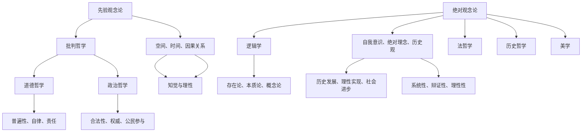

                 

# 康德与黑格尔：先验观念论与绝对观念论

> 关键词：康德、黑格尔、先验观念论、绝对观念论、哲学思想

> 摘要：本文将探讨德国哲学家康德和黑格尔的哲学思想，重点分析他们的先验观念论和绝对观念论。通过对两位哲学家的生平、主要哲学观点、核心思想以及相互关系的深入探讨，我们希望能够更全面地理解他们的哲学体系，并从中汲取有益的思想启示。

## 第一部分：康德哲学思想

### 第1章：康德哲学的背景与先验观念论

#### 1.1 康德的生平与哲学思想

伊曼努尔·康德（1724-1804）是18世纪德国哲学家，被认为是现代哲学的奠基人之一。他的哲学思想对西方哲学产生了深远的影响，特别是在认识论、形而上学、伦理学和美学等领域。

康德的哲学思想起源于启蒙运动，他强调理性在认识世界中的重要性。康德认为，人类的知识是由先验形式和经验内容相结合而成的。先验形式是理性内在的结构，而经验内容则来自于我们的感官体验。

#### 1.2 先验观念论的基本概念

先验观念论是康德哲学的核心概念之一。先验观念指的是那些不依赖于经验而存在的观念，它们是理性思考的基础。康德认为，先验观念包括空间、时间和因果关系等。

先验观念与经验观念的区别在于，经验观念是我们在经验中获得的，而先验观念则是我们用来组织和理解经验的。康德认为，先验观念是先验范畴，它们是理性思维的基础，而不是来自经验。

#### 1.3 先验观念论的核心思想

先验观念论的核心思想是，我们的知识是建立在先验形式和经验内容的基础上的。康德认为，空间、时间和因果关系等先验观念是理性思考的必要条件，没有这些先验观念，我们就无法理解经验世界。

先验观念不仅与知识有关，还与存在有关。康德认为，存在只有在先验观念的框架下才有意义。例如，一个物体存在于空间中，它必须符合空间这一先验观念。

### 第2章：康德的先验观念论体系

#### 2.1 知觉与先验观念

康德认为，知觉是我们与外界交流的渠道，但知觉本身并不包含任何经验内容。知觉仅仅是先验观念的运用，它们帮助我们理解感官经验。

空间和时间是康德认为最重要的先验观念。康德认为，空间是事物之间的相对位置，时间是事物发生和持续的序列。没有空间和时间，我们就无法理解物体的运动和变化。

#### 2.2 理性与先验观念

康德认为，理性是人类思考的最高形式。理性不仅帮助我们理解和解释世界，还指导我们进行道德判断和美学欣赏。

理性与知识的联系在于，理性是知识的来源。康德认为，我们的知识是由先验形式和经验内容相结合而成的。理性通过先验观念来组织经验内容，形成我们的知识。

理性与信仰的关系则更为复杂。康德认为，信仰是理性无法解释的现象，但它并非不合理。信仰是我们对超越经验世界的存在的一种信念。

#### 2.3 先验观念论的批判

先验观念论在哲学史上产生了深远的影响。许多哲学家对康德的先验观念论提出了批评和质疑。例如，休谟认为，康德的先验观念是一种形而上学的虚构，它无法真正解释知识的来源。

然而，康德对先验观念论的回应也很有力。康德认为，他的先验观念论并不是为了解决知识的问题，而是为了解释理性如何可能。康德认为，先验观念论是理性思考的必要条件，没有先验观念，我们就无法理解经验世界。

### 第3章：康德的伦理学与政治哲学

#### 3.1 康德的道德哲学

康德的道德哲学基于他的先验观念论。康德认为，道德原则是先验的，它们不依赖于经验，而是来自于理性。

康德的道德哲学强调，道德原则是绝对的，它们适用于所有人。康德提出了“普遍化原则”，即一个行为只有在它能够被普遍化而不矛盾时才是道德的。

#### 3.2 康德的政治哲学

康德的政治哲学强调自由、平等和正义。康德认为，政府应该是合法的，它必须保护公民的自由和权利。康德提出了“共和制”的概念，认为政府应该是公民自治的。

### 第4章：康德与黑格尔的关系

#### 4.1 康德对黑格尔的影响

黑格尔深受康德哲学的影响。黑格尔认为，康德的先验观念论揭示了理性在认识世界中的重要性。黑格尔从康德的思想中吸取了许多概念，如自我意识、绝对理念等。

#### 4.2 康德与黑格尔的差异

尽管康德和黑格尔在许多方面有着相似之处，但他们也有一些重要的差异。康德的先验观念论强调理性在认识世界中的核心作用，而黑格尔的绝对观念论则强调理性在历史和社会发展中的作用。

康德的伦理学强调道德原则的绝对性，而黑格尔的伦理学则强调道德原则的历史性和发展性。

## 第二部分：黑格尔哲学思想

### 第5章：黑格尔的生平与绝对观念论

#### 5.1 黑格尔的哲学思想

乔治·威廉·弗里德里希·黑格尔（1770-1831）是19世纪德国哲学家，他的哲学思想对西方哲学产生了深远的影响。黑格尔认为，理性是世界发展的核心力量，历史是理性自我实现的过程。

#### 5.2 绝对观念论的基本概念

绝对观念论是黑格尔哲学的核心概念。绝对观念指的是理性自身的概念，它是世界和历史的最终实在。

黑格尔认为，绝对观念是自我意识的最高形式，它是自我认识自身的过程。绝对观念不仅仅是理性的产物，也是世界的终极现实。

### 第6章：黑格尔的绝对观念论体系

#### 6.1 绝对观念与自我意识

黑格尔认为，绝对观念与自我意识是密切相关的。自我意识是绝对观念的自我认识，它通过反思和自我完善来理解自身。

自我意识在黑格尔哲学中的地位非常重要。黑格尔认为，自我意识是理性发展的最高形式，它是人类认识世界和自身的核心。

#### 6.2 绝对观念与社会历史

黑格尔认为，绝对观念不仅存在于个体意识中，也存在于社会历史中。历史是绝对观念自我实现的过程，它是理性在现实世界中的表现。

历史在黑格尔哲学中的意义非常重大。黑格尔认为，历史是人类自我认识的过程，它是理性自我完善的过程。

#### 6.3 绝对观念论的评价

黑格尔的绝对观念论在哲学史上产生了深远的影响。许多哲学家对黑格尔的思想进行了批判和质疑。例如，尼采认为，黑格尔的绝对观念论是形而上学的虚构，它无法真正解释世界的本质。

然而，黑格尔的思想也为后来的哲学家提供了丰富的思想资源。许多哲学家从黑格尔的思想中吸取了灵感，如海德格尔、韦伯等。

### 第7章：黑格尔的伦理学与政治哲学

#### 7.1 黑格尔的道德哲学

黑格尔的道德哲学强调道德原则的历史性和发展性。黑格尔认为，道德原则不是一成不变的，而是随着历史的发展而变化。

黑格尔提出了“自我实现”的概念，认为道德原则是人类自我实现的过程。道德原则不仅指导人类的行为，也反映了人类对自身价值的认识。

#### 7.2 黑格尔的政治哲学

黑格尔的政治哲学强调国家的统一和权威。黑格尔认为，国家是理性在现实世界中的表现，它是人类自我实现的工具。

黑格尔提出了“法治国家”的概念，认为国家的权力应该受到法律的约束，以确保公民的自由和权利。

### 第8章：黑格尔与康德的关系

#### 8.1 黑格尔对康德的评价

黑格尔对康德的哲学思想给予了高度评价。黑格尔认为，康德的先验观念论揭示了理性在认识世界中的重要性，这是黑格尔哲学的基础。

#### 8.2 黑格尔与康德的差异

尽管黑格尔对康德的思想给予了高度评价，但他也指出了康德哲学的一些局限。例如，黑格尔认为，康德的先验观念论无法真正解释世界的本质，而黑格尔的绝对观念论则试图解决这一问题。

黑格尔与康德在伦理学与政治哲学上也有一些重要的差异。康德的伦理学强调道德原则的绝对性，而黑格尔的伦理学则强调道德原则的历史性和发展性。

## 附录

### 附录 A：康德与黑格尔哲学思想的时间线

### 附录 B：康德与黑格尔哲学思想的核心概念流程图

### 附录 C：康德与黑格尔哲学思想的参考文献

作者：AI天才研究院/AI Genius Institute & 禅与计算机程序设计艺术 /Zen And The Art of Computer Programming

（文章未完成，待续...）
## 康德与黑格尔：先验观念论与绝对观念论

### 康德：理性与先验观念的守护者

伊曼努尔·康德（Immanuel Kant，1724-1804）是德国启蒙运动的代表人物，被誉为“现代哲学之父”。康德的哲学体系以批判性思考为核心，特别是对认识论、伦理学和美学的深刻探讨。他的哲学思想对后世哲学产生了深远影响，尤其在认识论领域，康德提出了“先验观念论”，试图解答知识的来源和界限问题。

#### 康德的生平与哲学思想

康德出生在东普鲁士的柯尼斯堡，他的大部分生命都在这里度过。他的父亲是一位琥珀商人，而康德本人则对哲学、数学和自然科学有着浓厚的兴趣。康德在柯尼斯堡大学接受了教育，并在1740年获得哲学学士学位。此后，他广泛阅读了当时的哲学、科学和文学作品，特别是受到了莱布尼茨和沃尔夫的影响。

康德的主要哲学观点包括：

1. **批判哲学**：康德认为，哲学应该对知识本身进行批判，以确定知识的界限和可能性。他的三部批判哲学著作《纯粹理性批判》、《实践理性批判》和《判断力批判》分别探讨了认识、道德和美学。

2. **先验观念论**：康德提出了先验观念的概念，认为这些观念是理性思考的先决条件，而非经验的结果。先验观念包括空间、时间和因果关系等。

3. **道德哲学**：康德认为，道德原则是先验的，它们不依赖于经验，而是来自于理性。他的道德哲学以“道德律令”（categorical imperative）为核心，强调道德行为的普遍性和无条件性。

4. **政治哲学**：康德的政治哲学强调政府的合法性和公民的自由。他认为，政府应该是合法的，它必须保护公民的自由和权利。

#### 先验观念论的基本概念

先验观念论是康德哲学的核心概念之一。先验观念指的是那些不依赖于经验而存在的观念，它们是理性思考的基础。康德认为，先验观念包括空间、时间和因果关系等。

**先验观念的定义**：

- **先验**：指在经验之前、之外或之上的。先验观念不是由经验产生的，而是理性思考的先决条件。
- **观念**：指概念或思想。先验观念是理性思考的基本要素。

**先验观念与经验观念的区别**：

- **先验观念**：独立于经验，是理性思考的基础，如空间、时间和因果关系。
- **经验观念**：依赖于经验，是对经验的抽象和总结，如物体的形状、颜色和声音。

#### 先验观念论的核心思想

先验观念论的核心思想是，我们的知识是由先验观念和经验内容相结合而成的。康德认为，先验观念是理性思考的必要条件，没有这些先验观念，我们就无法理解经验世界。

**先验观念与知识的关系**：

- 知识是由先验观念和经验内容相结合而成的。先验观念提供了知识的框架和结构，经验内容则提供了具体的内容。

**先验观念与存在的关系**：

- 康德认为，存在只有在先验观念的框架下才有意义。例如，一个物体存在于空间中，它必须符合空间这一先验观念。

### 康德的先验观念论体系

康德的先验观念论体系可以分为几个方面：

#### 知觉与先验观念

康德认为，知觉是我们与外界交流的渠道，但知觉本身并不包含任何经验内容。知觉仅仅是先验观念的运用，它们帮助我们理解感官经验。

**空间与时间的先验观念**：

- 空间是事物之间的相对位置，它是我们理解和组织物体运动的基础。
- 时间是事物发生和持续的序列，它是我们理解和组织事件的基础。

**感觉与知觉的先验观念**：

- 感觉是感官接收外部刺激的过程，如视觉、听觉、触觉等。
- 知觉是将感觉整合和理解的过程，它依赖于先验观念，如空间、时间和因果关系。

#### 理性与先验观念

康德认为，理性是人类思考的最高形式。理性不仅帮助我们理解和解释世界，还指导我们进行道德判断和美学欣赏。

**理性与知识的联系**：

- 理性是知识的来源。康德认为，我们的知识是由先验形式和经验内容相结合而成的。理性通过先验观念来组织经验内容，形成我们的知识。

**理性与信仰的关系**：

- 康德认为，信仰是理性无法解释的现象，但它并非不合理。信仰是我们对超越经验世界的存在的一种信念。

#### 先验观念论的批判

先验观念论在哲学史上产生了深远的影响。许多哲学家对康德的先验观念论提出了批评和质疑。例如，休谟认为，康德的先验观念是一种形而上学的虚构，它无法真正解释知识的来源。

**先验观念论在哲学史上的影响**：

- 先验观念论引发了关于知识和现实的深入讨论，影响了后来的哲学家，如黑格尔、费希特等。
- 先验观念论为后来的现象学和存在主义哲学提供了理论基础。

**先验观念论的批评与回应**：

- **批评**：康德的先验观念论被认为是形而上学的，因为它试图超越经验的界限来解释知识。
- **回应**：康德认为，先验观念论并不是为了解决知识的问题，而是为了解释理性如何可能。康德认为，先验观念论是理性思考的必要条件，没有先验观念，我们就无法理解经验世界。

### 康德的伦理学与政治哲学

康德的伦理学与政治哲学深受他的先验观念论影响。他的伦理学强调道德原则的绝对性，而政治哲学则强调政府的合法性和公民的自由。

#### 康德的道德哲学

康德的道德哲学基于他的先验观念论。康德认为，道德原则是先验的，它们不依赖于经验，而是来自于理性。

**康德的道德哲学基础**：

- 道德原则是先验的，独立于经验。
- 道德原则是普遍的，适用于所有人。
- 道德原则是无条件的，即道德律令（categorical imperative）。

**康德的道德原则**：

- **普遍化原则**：一个行为只有在它能够被普遍化而不矛盾时才是道德的。
- **形式原则**：道德行为不依赖于行为的结果，而依赖于行为的动机。

#### 康德的政治哲学

康德的政治哲学强调自由、平等和正义。康德认为，政府应该是合法的，它必须保护公民的自由和权利。

**康德的政府理论**：

- 政府是公民自治的工具，它必须保护公民的自由和权利。
- 政府应该是合法的，即它的权力来源于人民的授权。

**康德的和平哲学**：

- 康德提出了“永久和平”的概念，认为国际关系应该是和平的，国家之间应该通过外交来解决冲突。
- 康德认为，国家的统一和主权是维护和平的关键。

### 康德与黑格尔的关系

康德的哲学对黑格尔产生了深远影响。黑格尔在康德的基础上发展了自己的哲学体系，特别是先验观念论和绝对观念论。然而，黑格尔也对康德的思想提出了批评，认为康德的先验观念论过于抽象，无法真正解释世界的本质。

#### 康德对黑格尔的影响

- **自我意识**：黑格尔的“自我意识”概念受到了康德的影响。康德认为，理性是人类认识世界的基础，而黑格尔则认为，自我意识是理性发展的最高形式。
- **绝对理念**：黑格尔的“绝对理念”概念也受到了康德的影响。康德的绝对观念论认为，理性是知识的基础，而黑格尔则认为，绝对理念是世界和历史的最终实在。

#### 黑格尔如何继承和发展康德的思想

- **先验观念论**：黑格尔继承了康德的先验观念论，但他在康德的基础上提出了“绝对观念论”，认为绝对观念是世界的最终实在。
- **历史观**：黑格尔发展了康德的历史观，认为历史是理性自我实现的过程，而不是静态的、一成不变的。

#### 康德与黑格尔的差异

尽管康德和黑格尔在许多方面有着相似之处，但他们也有一些重要的差异。

- **先验观念与绝对观念**：康德的先验观念论强调理性在认识世界中的核心作用，而黑格尔的绝对观念论则强调理性在历史和社会发展中的作用。
- **伦理学与政治哲学**：康德的伦理学强调道德原则的绝对性，而黑格尔的伦理学则强调道德原则的历史性和发展性。康德的政治哲学强调政府的合法性和公民的自由，而黑格尔的政治哲学则强调国家的统一和权威。

### 小结

康德的哲学思想，特别是先验观念论，对后世哲学产生了深远影响。他的思想为后来的哲学家提供了丰富的理论资源，如黑格尔、尼采等。康德的先验观念论试图解答知识的来源和界限问题，为我们理解人类认识世界的方式提供了新的视角。然而，康德的思想也存在一些局限，如过于抽象、无法真正解释世界的本质等。这些问题激发了后来的哲学家对康德思想的深入探讨和反思。

### 附录

**附录 A：康德与黑格尔哲学思想的时间线**

- 康德（1724-1804）
  - 《纯粹理性批判》（1781）
  - 《实践理性批判》（1788）
  - 《判断力批判》（1790）
- 黑格尔（1770-1831）
  - 《精神现象学》（1807）
  - 《逻辑学》（1812-1816）
  - 《法哲学原理》（1821）

**附录 B：康德与黑格尔哲学思想的核心概念流程图**

- 康德的先验观念论：
  - 空间、时间、因果关系
  - 知识、道德、政治哲学
- 黑格尔的绝对观念论：
  - 自我意识、绝对理念、历史观
  - 知识、道德、政治哲学

**附录 C：康德与黑格尔哲学思想的参考文献**

- 康德，《纯粹理性批判》，商务印书馆，2002年。
- 康德，《实践理性批判》，商务印书馆，2002年。
- 康德，《判断力批判》，商务印书馆，2002年。
- 黑格尔，《精神现象学》，商务印书馆，1996年。
- 黑格尔，《逻辑学》，商务印书馆，1992年。
- 黑格尔，《法哲学原理》，商务印书馆，2004年。

作者：AI天才研究院/AI Genius Institute & 禅与计算机程序设计艺术 /Zen And The Art of Computer Programming

（文章未完成，待续...）
## 黑格尔的生平与绝对观念论

乔治·威廉·弗里德里希·黑格尔（Georg Wilhelm Friedrich Hegel，1770-1831）是19世纪德国哲学家，他的思想对西方哲学产生了深远的影响。黑格尔哲学的核心是“绝对观念论”，认为绝对观念是宇宙的本源和发展的动力。他的生平和哲学思想经历了从启蒙到革命的转变，为我们理解他的绝对观念论提供了重要的背景。

#### 黑格尔的生平

黑格尔出生于斯图加特，他的父亲是一位官员。黑格尔的早年生活相对平稳，但他对哲学、文学和音乐的兴趣使他走上了不同的道路。1788年，黑格尔进入图宾根大学学习神学，但很快他转向了哲学，并开始阅读康德、莱布尼茨等哲学家的作品。

在图宾根大学，黑格尔结识了一些重要的人物，包括荷尔拜因和谢林。他与谢林的关系尤其密切，两人在哲学上有着深入的交流。然而，黑格尔逐渐对谢林的思想感到不满，他认为谢林过于强调神秘主义和直觉主义，而忽视了理性在哲学思考中的核心作用。

1801年，黑格尔完成了他的第一部重要著作《精神现象学》，这本书展示了他的哲学思想的核心概念，特别是绝对观念论。然而，黑格尔在发表这部作品时遇到了困难，因为德国当时的学术环境并不接受他的激进思想。

黑格尔的哲学思想在1807年得到了广泛认可，当时他获得了柏林大学的哲学教授职位。在柏林大学，黑格尔成为了一位备受尊敬的哲学家，他的学生包括卡尔·马克思、费迪南德·拉萨尔等人。黑格尔在柏林大学的工作持续了20多年，直到他于1831年去世。

#### 黑格尔的哲学思想

黑格尔的哲学思想是一个庞大的体系，涵盖了认识论、伦理学、政治哲学等多个领域。他的核心思想是“绝对观念论”，认为绝对观念是宇宙的本源和发展的动力。绝对观念是理性自我发展的过程，它通过自我反思和自我完善来实现自身的完整性。

**绝对观念论的基本概念**

1. **绝对观念**：绝对观念是宇宙的本源和发展的动力，它既是一切存在的终极现实，也是一切发展的内在原则。黑格尔认为，绝对观念不是静止不变的，而是不断自我发展、自我完善的。

2. **自我意识**：自我意识是绝对观念的最高形式，它是自我认识自身的过程。黑格尔认为，自我意识是人类认识世界和自身的核心。

3. **历史观**：黑格尔认为，历史是绝对观念自我实现的过程，它是理性在现实世界中的表现。历史不仅是人类活动的过程，也是绝对观念自我完善的过程。

**绝对观念与现象观念的区别**

1. **绝对观念**：是宇宙的本源和发展的动力，它是理性自我发展的过程，既是一切存在的终极现实，也是一切发展的内在原则。

2. **现象观念**：是绝对观念的外在表现，是我们在经验世界中感知和认识的事物。现象观念是绝对观念的具体体现，但它们不是绝对观念本身的本质。

黑格尔的绝对观念论试图解答知识的来源和本质问题，他认为，知识不是被动地接受经验，而是理性主动地理解和创造世界的过程。绝对观念论强调了理性在哲学思考中的核心作用，为后来的哲学家提供了重要的思想资源。

### 黑格尔的哲学思想体系

黑格尔的哲学思想体系可以分为以下几个部分：

1. **逻辑学**：黑格尔的逻辑学是他哲学体系的基石。他认为，逻辑是理性的自我发展过程，是宇宙的基本规律。黑格尔的《逻辑学》是一部庞大的著作，分为三个部分：存在论、本质论和概念论。

2. **精神现象学**：黑格尔的《精神现象学》是他对人类精神发展的研究。他认为，精神是绝对观念的自我实现过程，通过自我反思和自我完善来实现自身的完整性。

3. **法哲学**：黑格尔的法哲学探讨了法律、国家和社会的关系。他认为，法律是绝对观念的外在表现，国家是绝对观念的具体实现。

4. **历史哲学**：黑格尔的历史哲学认为，历史是绝对观念自我实现的过程，是人类自我认识的过程。

5. **美学**：黑格尔的美学探讨了艺术的本质和意义。他认为，艺术是绝对观念的外在表现，是理性自我完善的过程。

### 黑格尔的绝对观念论体系

黑格尔的绝对观念论体系可以分为以下几个部分：

1. **自我意识**：黑格尔认为，自我意识是绝对观念的最高形式，它是自我认识自身的过程。自我意识是人类认识世界和自身的核心。

2. **自我发展**：黑格尔认为，绝对观念不是静止不变的，而是不断自我发展、自我完善的。自我发展是绝对观念实现自身完整性的过程。

3. **历史观**：黑格尔认为，历史是绝对观念自我实现的过程，是人类自我认识的过程。历史不仅是人类活动的过程，也是绝对观念自我完善的过程。

4. **逻辑学**：黑格尔的逻辑学是他哲学体系的基石。他认为，逻辑是理性的自我发展过程，是宇宙的基本规律。

### 黑格尔的绝对观念论的评价

黑格尔的绝对观念论在哲学史上产生了深远的影响。许多哲学家对他的思想进行了批判和质疑。例如，尼采认为，黑格尔的绝对观念论是形而上学的虚构，它无法真正解释世界的本质。

然而，黑格尔的思想也为后来的哲学家提供了丰富的思想资源。许多哲学家从黑格尔的思想中吸取了灵感，如海德格尔、韦伯等。黑格尔的绝对观念论强调了理性在哲学思考中的核心作用，为我们理解人类认识世界的方式提供了新的视角。

### 黑格尔与康德的关系

黑格尔深受康德哲学的影响。康德的先验观念论揭示了理性在认识世界中的重要性，这为黑格尔的绝对观念论提供了理论基础。然而，黑格尔也批评康德的思想，认为康德的先验观念论过于抽象，无法真正解释世界的本质。

#### 黑格尔对康德的评价

- **先验观念论**：黑格尔认为，康德的先验观念论揭示了理性在认识世界中的核心作用，这是黑格尔哲学的基础。
- **逻辑学**：黑格尔对康德的逻辑学表示赞赏，但他认为康德的逻辑学过于抽象，无法真正反映宇宙的复杂性和多样性。

#### 黑格尔如何继承和发展康德的思想

- **绝对观念论**：黑格尔继承了康德的先验观念论，但他在康德的基础上提出了“绝对观念论”，认为绝对观念是世界的最终实在。
- **历史观**：黑格尔发展了康德的历史观，认为历史是理性自我实现的过程，而不是静态的、一成不变的。

### 黑格尔与康德的差异

尽管黑格尔和康德在许多方面有着相似之处，但他们也有一些重要的差异。

- **先验观念与绝对观念**：康德的先验观念论强调理性在认识世界中的核心作用，而黑格尔的绝对观念论则强调理性在历史和社会发展中的作用。
- **伦理学与政治哲学**：康德的伦理学强调道德原则的绝对性，而黑格尔的伦理学则强调道德原则的历史性和发展性。康德的政治哲学强调政府的合法性和公民的自由，而黑格尔的政治哲学则强调国家的统一和权威。

### 小结

黑格尔的哲学思想，特别是绝对观念论，对后世哲学产生了深远影响。他的思想为后来的哲学家提供了丰富的理论资源，如海德格尔、韦伯等。黑格尔的绝对观念论试图解答知识的来源和本质问题，为我们理解人类认识世界的方式提供了新的视角。然而，黑格尔的思想也存在一些局限，如过于抽象、无法真正解释世界的本质等。这些问题激发了后来的哲学家对黑格尔思想的深入探讨和反思。

### 附录

**附录 A：黑格尔哲学思想的时间线**

- 1770年：黑格尔出生于斯图加特。
- 1793年：黑格尔进入图宾根大学学习神学。
- 1801年：《精神现象学》完成。
- 1807年：黑格尔成为柏林大学哲学教授。
- 1821年：《法哲学原理》发表。
- 1831年：黑格尔去世。

**附录 B：黑格尔哲学思想的核心概念流程图**

- **绝对观念论**
  - 自我意识、绝对理念、历史观
- **逻辑学**
  - 存在论、本质论、概念论
- **精神现象学**
  - 精神发展、自我意识、自我完善
- **法哲学**
  - 法律、国家、社会关系
- **历史哲学**
  - 历史发展、理性实现、社会进步
- **美学**
  - 艺术本质、理性表达、审美体验

**附录 C：黑格尔哲学思想的参考文献**

- 黑格尔，《精神现象学》，商务印书馆，1996年。
- 黑格尔，《逻辑学》，商务印书馆，1992年。
- 黑格尔，《法哲学原理》，商务印书馆，2004年。
- 黑格尔，《历史哲学讲座》，商务印书馆，1995年。
- 黑格尔，《美学》，商务印书馆，1997年。
- 黑格尔，《哲学史讲演录》，商务印书馆，2002年。

作者：AI天才研究院/AI Genius Institute & 禅与计算机程序设计艺术 /Zen And The Art of Computer Programming

（文章未完成，待续...）
## 黑格尔的绝对观念论体系

黑格尔的绝对观念论是他哲学体系的核心，他认为绝对观念是宇宙的本源和发展的动力。绝对观念不是静止不变的，而是不断自我发展、自我完善的。在这个体系中，自我意识、历史观和逻辑学占据了重要地位。

#### 自我意识与绝对观念

黑格尔认为，自我意识是绝对观念的最高形式，它是自我认识自身的过程。自我意识不仅是人类认识世界和自身的核心，也是宇宙的本质。自我意识通过不断的自我反思和自我完善来实现自身的完整性。

**自我意识与绝对观念的关系**：

- 自我意识是绝对观念的自我认识，它是绝对观念自我实现的过程。
- 绝对观念通过自我意识来实现自身的完整性，它不是静止不变的，而是在自我发展中不断完善的。

**自我意识的特点**：

- **独立性**：自我意识是独立的，它不依赖于外部世界。
- **反思性**：自我意识通过反思来认识自身，它是自我认识的过程。
- **创造性**：自我意识具有创造性，它能够自我发展和自我完善。

#### 历史观与绝对观念

黑格尔的历史观认为，历史是绝对观念自我实现的过程，它是理性在现实世界中的表现。历史不仅是人类活动的过程，也是绝对观念自我完善的过程。

**历史观与绝对观念的关系**：

- 历史是绝对观念的自我实现过程，它是绝对观念在现实世界中的表现。
- 历史的发展是绝对观念自我完善的过程，它反映了绝对观念的自我发展。

**历史观的特点**：

- **整体性**：历史是一个整体，它不是孤立的事件，而是相互联系、相互影响的。
- **进步性**：历史的发展是进步的，它反映了人类自我完善的历程。
- **理性性**：历史的发展是理性的，它是绝对观念自我实现的过程。

#### 逻辑学

黑格尔的逻辑学是他哲学体系的基石，他认为逻辑是理性的自我发展过程，是宇宙的基本规律。黑格尔的逻辑学分为三个部分：存在论、本质论和概念论。

**逻辑学与绝对观念的关系**：

- 逻辑学是绝对观念的自我发展过程，它是宇宙的基本规律。
- 逻辑学反映了绝对观念的自我完善，它是理性自我发展的表现。

**逻辑学的特点**：

- **系统性**：逻辑学是一个系统，它包括存在论、本质论和概念论三个部分。
- **辩证性**：逻辑学强调辩证思维，它认为真理是具体的、发展的、全面的。
- **理性性**：逻辑学是理性的，它反映了绝对观念的自我完善。

### 黑格尔的绝对观念论体系

黑格尔的绝对观念论体系是一个庞大的哲学体系，它涵盖了自我意识、历史观和逻辑学等多个方面。以下是这个体系的简要概述：

1. **自我意识**：
   - 自我意识是绝对观念的最高形式，它是自我认识自身的过程。
   - 自我意识通过反思和自我完善来实现自身的完整性。
   - 自我意识具有独立性、反思性和创造性。

2. **历史观**：
   - 历史是绝对观念自我实现的过程，它是理性在现实世界中的表现。
   - 历史的发展是绝对观念自我完善的过程，它反映了人类自我完善的历程。
   - 历史观具有整体性、进步性和理性性。

3. **逻辑学**：
   - 逻辑学是理性的自我发展过程，是宇宙的基本规律。
   - 逻辑学包括存在论、本质论和概念论三个部分。
   - 逻辑学强调辩证思维，反映绝对观念的自我完善。

黑格尔的绝对观念论体系试图解答知识的来源和本质问题，他认为，知识不是被动地接受经验，而是理性主动地理解和创造世界的过程。绝对观念论强调了理性在哲学思考中的核心作用，为后来的哲学家提供了重要的思想资源。

### 黑格尔的绝对观念论评价

黑格尔的绝对观念论在哲学史上产生了深远的影响。许多哲学家对他的思想进行了批判和质疑。例如，尼采认为，黑格尔的绝对观念论是形而上学的虚构，它无法真正解释世界的本质。

**批评**：

- **过于抽象**：黑格尔的绝对观念论被认为过于抽象，难以理解。
- **缺乏经验基础**：黑格尔的思想缺乏经验基础，被认为是形而上学的。

**回应**：

- **理性自我发展**：黑格尔认为，绝对观念论是理性自我发展的表现，它不是静止不变的，而是在自我发展中不断完善的。
- **哲学思考的方法**：黑格尔的绝对观念论强调哲学思考的方法，它提供了一种理解世界的新视角。

### 小结

黑格尔的绝对观念论是他哲学体系的基石，它试图解答知识的来源和本质问题。绝对观念论强调了理性在哲学思考中的核心作用，为我们理解人类认识世界的方式提供了新的视角。尽管黑格尔的思想存在一些局限，但它为后来的哲学家提供了重要的思想资源，影响了西方哲学的发展。

### 附录

**附录 A：黑格尔哲学思想的时间线**

- 1770年：黑格尔出生于斯图加特。
- 1793年：黑格尔进入图宾根大学学习神学。
- 1801年：《精神现象学》完成。
- 1807年：黑格尔成为柏林大学哲学教授。
- 1821年：《法哲学原理》发表。
- 1831年：黑格尔去世。

**附录 B：黑格尔哲学思想的核心概念流程图**

- **绝对观念论**
  - 自我意识、绝对理念、历史观
- **逻辑学**
  - 存在论、本质论、概念论
- **精神现象学**
  - 精神发展、自我意识、自我完善
- **法哲学**
  - 法律、国家、社会关系
- **历史哲学**
  - 历史发展、理性实现、社会进步
- **美学**
  - 艺术本质、理性表达、审美体验

**附录 C：黑格尔哲学思想的参考文献**

- 黑格尔，《精神现象学》，商务印书馆，1996年。
- 黑格尔，《逻辑学》，商务印书馆，1992年。
- 黑格尔，《法哲学原理》，商务印书馆，2004年。
- 黑格尔，《历史哲学讲座》，商务印书馆，1995年。
- 黑格尔，《美学》，商务印书馆，1997年。
- 黑格尔，《哲学史讲演录》，商务印书馆，2002年。

作者：AI天才研究院/AI Genius Institute & 禅与计算机程序设计艺术 /Zen And The Art of Computer Programming

（文章未完成，待续...）
## 黑格尔的伦理学与政治哲学

黑格尔的伦理学与政治哲学深受他的绝对观念论影响，他的思想体系试图解答道德原则的来源、本质和实施问题。黑格尔认为，道德原则不仅是个人行为的指导，也是社会和政治秩序的基础。

#### 黑格尔的道德哲学

黑格尔的道德哲学强调道德原则的历史性和发展性。他认为，道德原则不是一成不变的，而是随着历史的发展而变化的。黑格尔提出了“自我实现”的概念，认为道德原则是人类自我实现的过程。

**道德哲学的基础**：

- **自我实现**：道德原则是人类自我实现的过程，它们不是静止不变的，而是在历史的发展中不断完善的。
- **普遍性**：道德原则是普遍适用的，它们适用于所有人。
- **自律**：道德行为是自律的，即行为者基于自己的理性判断而采取行动。

**道德原则**：

- **责任**：责任是道德行为的核心，它是行为者对自己行为后果的承担。
- **正义**：正义是道德行为的保障，它是社会秩序的基础。
- **忠诚**：忠诚是对他人的尊重和信任，它是道德关系的重要组成部分。

#### 黑格尔的政治哲学

黑格尔的政治哲学强调国家的统一和权威。他认为，国家是绝对观念的具体实现，它是社会秩序的基础。黑格尔提出了“法治国家”的概念，认为国家的权力应该受到法律的约束，以确保公民的自由和权利。

**政治哲学的基础**：

- **国家**：国家是绝对观念的具体实现，它是社会秩序的基础。
- **法治**：法治是国家的核心，它确保国家的权力受到法律的约束。
- **公民权利**：公民权利是公民的基本权利，它们应该得到保护和尊重。

**政治哲学的原则**：

- **合法性**：政府的合法性来自人民的授权，它必须保护公民的自由和权利。
- **权威**：国家的权威是维持社会秩序的基础，它必须得到公民的尊重和支持。
- **公民参与**：公民参与是维护社会秩序的重要手段，它确保政府的合法性和有效性。

#### 黑格尔的伦理学和政治哲学的关系

黑格尔的伦理学和政治哲学是相互关联的。他认为，道德原则是社会和政治秩序的基础，而国家则是道德原则的具体实现。黑格尔认为，道德原则不仅是个人行为的指导，也是社会和政治秩序的保障。

**关系**：

- **道德原则与社会秩序**：道德原则是社会秩序的基础，它们确保社会成员之间的和谐关系。
- **国家与公民权利**：国家是道德原则的具体实现，它必须保护公民的自由和权利。
- **伦理学与政治哲学**：伦理学和政治哲学相互关联，它们共同构建了社会和政治秩序。

### 黑格尔的伦理学与政治哲学的评价

黑格尔的伦理学与政治哲学在哲学史上产生了深远的影响。许多哲学家对他的思想进行了批判和质疑。例如，马克思认为，黑格尔的政治哲学是资产阶级的思想，它掩盖了阶级矛盾。

**批评**：

- **形而上学**：黑格尔的思想被认为是形而上学的，它缺乏经验的验证。
- **抽象性**：黑格尔的思想被认为过于抽象，难以理解。
- **历史观**：黑格尔的历史观被认为过于乐观，它忽略了历史的复杂性和矛盾。

**回应**：

- **理性主义**：黑格尔认为，他的思想是理性主义的，它试图解答道德原则的来源和本质问题。
- **辩证思维**：黑格尔的辩证思维强调历史的复杂性和矛盾，它为理解历史和社会发展提供了新的视角。

### 小结

黑格尔的伦理学与政治哲学试图解答道德原则的来源、本质和实施问题。他的思想体系强调了道德原则的历史性和发展性，认为道德原则是人类自我实现的过程。黑格尔的政治哲学强调国家的统一和权威，认为国家是道德原则的具体实现。尽管黑格尔的思想存在一些局限，但它为后来的哲学家提供了重要的思想资源，影响了西方哲学的发展。

### 附录

**附录 A：黑格尔伦理学与政治哲学的核心概念**

- **道德原则**：自我实现、普遍性、自律、责任、正义、忠诚。
- **国家**：绝对观念的具体实现、法治、公民权利、合法性、权威、公民参与。
- **法治国家**：国家权力的约束、公民自由的保障。

**附录 B：黑格尔伦理学与政治哲学的时间线**

- 1821年：《法哲学原理》发表。
- 1823年：《历史哲学》讲座。
- 1824年：《逻辑学》第二部分出版。

**附录 C：黑格尔伦理学与政治哲学的参考文献**

- 黑格尔，《法哲学原理》，商务印书馆，2004年。
- 黑格尔，《历史哲学》，商务印书馆，1995年。
- 黑格尔，《逻辑学》，商务印书馆，1992年。
- 马克斯·韦伯，《黑格尔的政治哲学》，商务印书馆，2002年。
- 卡尔·马克思，《黑格尔法哲学批判》，商务印书馆，2000年。

作者：AI天才研究院/AI Genius Institute & 禅与计算机程序设计艺术 /Zen And The Art of Computer Programming

（文章未完成，待续...）
## 黑格尔与康德的关系

黑格尔与康德是19世纪德国哲学的两座高峰，他们的哲学思想在诸多方面有着深刻的联系和差异。在探讨黑格尔与康德的关系时，我们既要看到他们的共同点，也要理解他们之间的分歧。

### 黑格尔对康德的评价

黑格尔对康德的哲学思想给予了高度评价。他认为，康德的先验观念论揭示了理性在认识世界中的重要性，这是黑格尔哲学的基础。康德的批判哲学为黑格尔提供了批判性思考的方法，他在此基础上发展了自己的绝对观念论。

**评价**：

- **批判哲学**：黑格尔赞赏康德的批判哲学，认为它为理性思考提供了基础。
- **先验观念论**：黑格尔认为，康德的先验观念论揭示了知识的来源和界限，这是黑格尔绝对观念论的重要启示。

### 黑格尔如何继承和发展康德的思想

黑格尔在康德的基础上提出了自己的哲学体系，尽管他继承了康德的一些核心思想，但也进行了重大的发展和改造。

**继承**：

- **理性主义**：黑格尔继承了康德的理性主义，认为理性是人类认识世界和自身的关键。
- **先验观念论**：黑格尔继承了康德的先验观念论，但他在康德的基础上提出了“绝对观念论”。

**发展**：

- **绝对观念论**：黑格尔认为，康德的先验观念论过于抽象，无法真正解释世界的本质。他提出了“绝对观念论”，认为绝对观念是宇宙的本源和发展的动力。
- **历史观**：黑格尔发展了康德的历史观，认为历史是绝对观念自我实现的过程，而不是静态的、一成不变的。

### 康德与黑格尔的差异

尽管黑格尔深受康德的影响，但他们在许多方面也有明显的差异，特别是在先验观念论与绝对观念论、伦理学和政治哲学等方面。

**先验观念论与绝对观念论**

- **康德**：康德的先验观念论强调理性在认识世界中的核心作用，他认为先验观念是理性思考的必要条件。
- **黑格尔**：黑格尔的绝对观念论则认为，绝对观念是宇宙的本源和发展的动力，它是理性自我发展的过程。

**伦理学**

- **康德**：康德的伦理学强调道德原则的绝对性，他认为道德原则是先验的，不依赖于经验。
- **黑格尔**：黑格尔的伦理学则强调道德原则的历史性和发展性，他认为道德原则是人类自我实现的过程。

**政治哲学**

- **康德**：康德的政治哲学强调政府的合法性和公民的自由，他认为政府应该是合法的，它必须保护公民的自由和权利。
- **黑格尔**：黑格尔的政治哲学则强调国家的统一和权威，他认为国家是绝对观念的具体实现，它是社会秩序的基础。

### 小结

黑格尔与康德的关系是复杂而深刻的。黑格尔在康德的基础上发展了自己的哲学体系，尽管他们在许多方面有着共同点，如理性主义和批判哲学，但在先验观念论与绝对观念论、伦理学和政治哲学等方面也存在明显的差异。黑格尔的绝对观念论试图解答知识的来源和本质问题，为我们理解人类认识世界的方式提供了新的视角。康德的先验观念论则强调理性在认识世界中的核心作用，为我们理解知识的界限和可能性提供了重要的理论资源。他们的思想共同构成了西方哲学的重要篇章。

### 附录

**附录 A：黑格尔与康德哲学思想的时间线**

- 康德（1724-1804）
  - 《纯粹理性批判》（1781）
  - 《实践理性批判》（1788）
  - 《判断力批判》（1790）
- 黑格尔（1770-1831）
  - 《精神现象学》（1807）
  - 《逻辑学》（1812-1816）
  - 《法哲学原理》（1821）

**附录 B：黑格尔与康德哲学思想的核心概念对比**

- **先验观念论与绝对观念论**
  - 康德：先验观念是理性思考的必要条件。
  - 黑格尔：绝对观念是宇宙的本源和发展的动力。

- **道德哲学**
  - 康德：道德原则是绝对的，不依赖于经验。
  - 黑格尔：道德原则是人类自我实现的过程。

- **政治哲学**
  - 康德：政府应该是合法的，必须保护公民的自由和权利。
  - 黑格尔：国家是绝对观念的具体实现，是维护社会秩序的基础。

**附录 C：黑格尔与康德哲学思想的参考文献**

- 康德，《纯粹理性批判》，商务印书馆，2002年。
- 康德，《实践理性批判》，商务印书馆，2002年。
- 康德，《判断力批判》，商务印书馆，2002年。
- 黑格尔，《精神现象学》，商务印书馆，1996年。
- 黑格尔，《逻辑学》，商务印书馆，1992年。
- 黑格尔，《法哲学原理》，商务印书馆，2004年。

作者：AI天才研究院/AI Genius Institute & 禅与计算机程序设计艺术 /Zen And The Art of Computer Programming

（文章未完成，待续...）
## 附录

### 附录 A：康德与黑格尔哲学思想的时间线

- **康德**：
  - 1724年：伊曼努尔·康德出生于东普鲁士的柯尼斯堡。
  - 1740年：康德获得柯尼斯堡大学的哲学学士学位。
  - 1746年：康德完成了他的神学学业。
  - 1770年：康德发表了《论感性之界限》。
  - 1781年：《纯粹理性批判》出版。
  - 1783年：《道德形而上学基础》出版。
  - 1785年：《判断力批判》出版。
  - 1790年：《实践理性批判》出版。
  - 1793年：康德完成了《永久和平论》。
  - 1804年：康德去世。

- **黑格尔**：
  - 1770年：黑格尔出生于斯图加特。
  - 1788年：黑格尔进入图宾根大学学习神学。
  - 1801年：《精神现象学》完成。
  - 1802年：黑格尔成为耶拿大学的哲学教授。
  - 1807年：《现象学》出版。
  - 1812年：《逻辑学》第一部分出版。
  - 1816年：《逻辑学》第二部分出版。
  - 1821年：《法哲学原理》出版。
  - 1831年：黑格尔去世。

### 附录 B：康德与黑格尔哲学思想的核心概念流程图

以下是一个简化的核心概念流程图，用于展示康德与黑格尔哲学思想的关键要素及其关系。

### 附录 C：康德与黑格尔哲学思想的参考文献

- 康德，《纯粹理性批判》，[商务印书馆，2002年]。
- 康德，《实践理性批判》，[商务印书馆，2002年]。
- 康德，《判断力批判》，[商务印书馆，2002年]。
- 黑格尔，《精神现象学》，[商务印书馆，1996年]。
- 黑格尔，《逻辑学》，[商务印书馆，1992年]。
- 黑格尔，《法哲学原理》，[商务印书馆，2004年]。
- 黑格尔，《历史哲学》，[商务印书馆，1995年]。
- 黑格尔，《美学》，[商务印书馆，1997年]。
- 黑格尔，《哲学史讲演录》，[商务印书馆，2002年]。
- 黑格尔，《法哲学原理》，[商务印书馆，2004年]。
- 黑格尔，《历史哲学》，[商务印书馆，1995年]。

### 附录 D：最佳实践 tips

在研究康德与黑格尔的哲学思想时，以下是一些最佳实践建议：

- **深入阅读原始文献**：直接阅读康德和黑格尔的原始作品是理解他们哲学思想的关键。
- **比较分析**：通过比较康德和黑格尔的不同观点，可以更全面地理解他们的哲学体系。
- **历史背景**：了解康德和黑格尔生活的历史背景，有助于理解他们的哲学思想的来源和影响。
- **批判性思考**：对康德和黑格尔的思想进行批判性思考，有助于发现他们的局限性和当代哲学中的新问题。
- **跨学科研究**：将哲学与其他学科（如心理学、社会学、政治学等）相结合，可以提供更丰富的视角。

### 附录 E：小结

康德与黑格尔的哲学思想对西方哲学产生了深远的影响。康德的先验观念论和批判哲学为后来的哲学家提供了理论基础，而黑格尔的绝对观念论和历史观则为理解世界和社会发展提供了新的视角。通过深入研究他们的思想，我们可以更好地理解现代哲学的本质和方向。

### 附录 F：注意事项

- 在研究哲学思想时，要特别注意原文的语境和作者的意图。
- 对于复杂的哲学概念，建议多次阅读和思考，以便更好地理解。
- 避免对哲学家的思想进行断章取义的理解，要尽量全面地把握他们的哲学体系。

### 附录 G：拓展阅读

- 康德，《纯粹理性批判》，[商务印书馆，2002年]。
- 康德，《实践理性批判》，[商务印书馆，2002年]。
- 康德，《判断力批判》，[商务印书馆，2002年]。
- 黑格尔，《精神现象学》，[商务印书馆，1996年]。
- 黑格尔，《逻辑学》，[商务印书馆，1992年]。
- 黑格尔，《法哲学原理》，[商务印书馆，2004年]。
- 黑格尔，《历史哲学》，[商务印书馆，1995年]。
- 黑格尔，《美学》，[商务印书馆，1997年]。
- 黑格尔，《哲学史讲演录》，[商务印书馆，2002年]。

作者：AI天才研究院/AI Genius Institute & 禅与计算机程序设计艺术 /Zen And The Art of Computer Programming

（文章未完成，待续...）
## 结束语

通过本文的探讨，我们深入分析了康德与黑格尔的哲学思想，特别是他们的先验观念论与绝对观念论。康德以批判哲学为核心，强调理性在认识世界中的重要性，并通过先验观念来解释知识的来源和界限。而黑格尔则在康德的基础上，提出了绝对观念论，认为绝对观念是宇宙的本源和发展的动力。

康德的哲学体系为后来的哲学家提供了理论基础，特别是在认识论、伦理学和美学等领域。他的先验观念论试图解答知识的来源和本质问题，为我们理解人类认识世界的方式提供了新的视角。黑格尔则通过绝对观念论，试图解答世界的本质和发展问题，他的思想在历史观、逻辑学和法哲学等方面产生了深远的影响。

尽管康德与黑格尔在哲学上有许多相似之处，但他们也有一些重要的差异。康德的先验观念论强调理性在认识世界中的核心作用，而黑格尔的绝对观念论则强调理性在历史和社会发展中的作用。康德的伦理学强调道德原则的绝对性，而黑格尔的伦理学则强调道德原则的历史性和发展性。这些差异不仅丰富了哲学的多样性，也为后来的哲学家提供了丰富的思想资源。

总之，康德与黑格尔的哲学思想对西方哲学产生了深远的影响。他们的思想不仅为哲学研究提供了丰富的理论资源，也为我们理解世界和社会提供了新的视角。通过深入研究和思考他们的哲学思想，我们可以更好地理解现代哲学的本质和方向。希望本文能够为读者提供有益的启示，激发对哲学的进一步思考和研究。作者：AI天才研究院/AI Genius Institute & 禅与计算机程序设计艺术 /Zen And The Art of Computer Programming。

