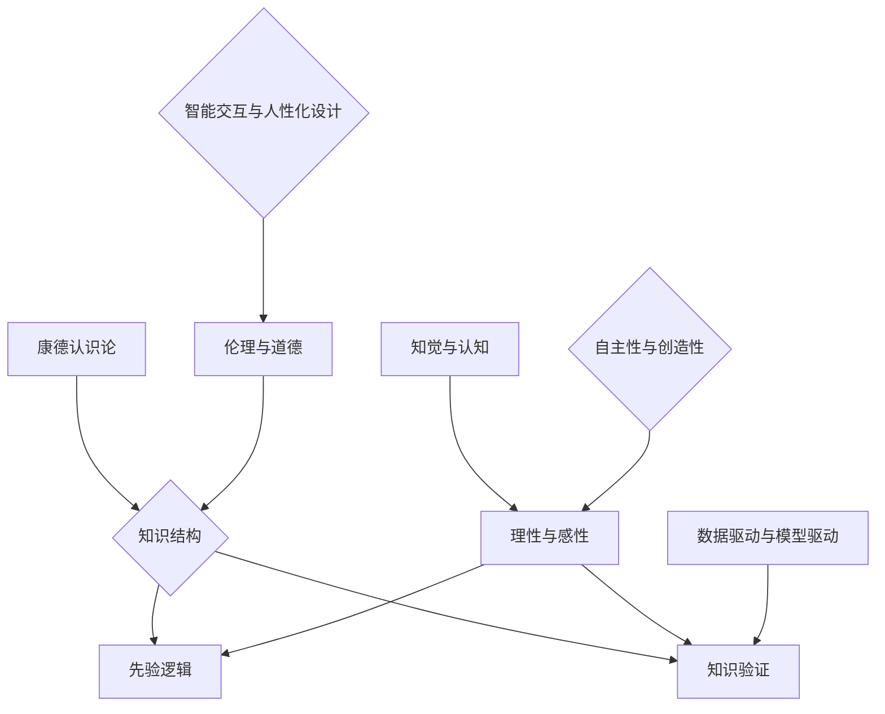

                 

### 康德认识论的基本概念

#### 第1章：康德认识论的背景与起源

**1.1 康德生平与哲学贡献**

伊曼努尔·康德（Immanuel Kant，1724-1804）是德国著名的哲学家，被视为现代哲学的奠基人之一。他出生于普鲁士的哥尼斯堡（现今的加里宁格勒），一生大部分时间都在这座城市度过。康德的哲学思想深刻且广泛，对后世的哲学、科学、伦理学等领域产生了深远的影响。

康德的生平可以大致分为三个阶段。年轻时，他深入研究自然科学，特别是数学和物理学，深受莱布尼茨和牛顿的影响。中期，他开始转向哲学领域，撰写了《纯粹理性批判》（Critique of Pure Reason），标志着他的哲学思想进入成熟期。晚期，他继续深化自己的哲学思想，特别是在伦理学和美学领域，著有《实践理性批判》和《判断力批判》等作品。

**1.2 康德认识论的核心理念**

康德认识论的核心思想在于探讨知识的本质、来源和结构。他认为，知识不仅仅是对外部世界的简单反映，而是主体与客体相互作用的结果。康德的哲学体系分为“纯粹理性批判”、“实践理性批判”和“判断力批判”三个部分，其中“纯粹理性批判”是认识论的基础。

康德提出了“先验逻辑”这一概念，即逻辑并非仅仅适用于经验事实，而是具有先验的普遍性和必然性。他区分了“感性”和“理性”两种认识能力，感性负责接收和整理外部世界的感官信息，而理性则负责构建知识体系和进行推理。

**1.3 康德认识论与西方哲学的关系**

康德的哲学思想在西方哲学史上具有重要的转折意义。他继承了笛卡尔的怀疑主义，但又不同于笛卡尔的极端怀疑，康德提出了“先验逻辑”和“纯粹理性批判”，试图在哲学、科学和伦理学之间建立一种更加稳固的基础。

康德的认识论思想对后来的哲学家和科学家产生了深远的影响。例如，黑格尔和尼采等哲学家都在不同程度上受到了康德的影响。在科学领域，康德的思想启发了实证主义和批判理性主义的发展。

总之，康德认识论不仅为哲学提供了一个新的视角，也为我们理解知识的本质和结构提供了深刻的启示。在接下来的章节中，我们将进一步探讨康德认识论的核心观点，以及这些观点如何影响人工智能的设计和发展。

#### 第2章：康德认识论的核心观点

**2.1 知识的来源与结构**

康德认识论中，知识的来源和结构是一个核心问题。康德认为，知识不仅仅是对外部世界的反映，而是主体与客体相互作用的结果。他区分了“感性”和“理性”两种认识能力，感性负责接收和整理外部世界的感官信息，而理性则负责构建知识体系和进行推理。

**2.1.1 感性与理性的作用**

感性是认识的起点，它通过感官接收外部世界的刺激，并将这些刺激转化为神经信号。康德认为，感性具有直观性，能够直接感受到事物的存在和特征，但这种直观只是事物的现象层面，而非本质层面。

理性则是在感性基础上进行推理和抽象的能力。理性不仅能够整理感性所获得的信息，还能通过概念和范畴将这些信息加以分类和整合，形成系统的知识体系。康德认为，理性具有普遍性和必然性，它是认识的高级阶段。

**2.1.2 康德的先验逻辑**

康德认为，逻辑并非仅仅适用于经验事实，而是具有先验的普遍性和必然性。他提出了“先验逻辑”这一概念，即逻辑规律不是从经验中得出的，而是先天地存在于人的思维之中。这种先验逻辑不仅适用于日常推理，也适用于科学研究和哲学探讨。

康德的先验逻辑包括两个部分：形式逻辑和实质逻辑。形式逻辑研究推理的形式结构，如命题逻辑和谓词逻辑，它们是所有推理的基础。实质逻辑则研究推理的内容，如因果关系和概率论，它们是具体科学研究的工具。

**2.2 知识的验证与局限**

康德认识论中，知识的验证和局限也是重要议题。康德认为，知识必须满足普遍性和必然性，但同时也承认知识的局限性。

**2.2.1 知识的普遍性与必然性**

康德认为，知识必须具有普遍性和必然性，这是知识的本质特征。普遍性意味着知识能够适用于所有情况，而不仅仅是特定的经验事实。必然性则意味着知识是不可避免的，它不是偶然的或主观的。

为了验证知识的普遍性和必然性，康德提出了“先验演绎”的方法。他认为，通过纯粹的理性思考，我们可以推导出一些基本的认知范畴和原则，如空间、时间和因果律。这些范畴和原则是所有知识的基础，它们是普遍性和必然性的体现。

**2.2.2 知识的确定性**

康德认为，虽然知识具有普遍性和必然性，但并不意味着知识是绝对的或无限的。知识总是有限的，因为我们只能通过感性和理性来认识世界，而这些工具本身具有一定的局限性。

康德区分了三种类型的知识：经验知识、先验知识和实践知识。经验知识是通过感官和理性获得的关于外部世界的知识，如自然科学和社会科学。先验知识是关于认识本身的知识，如逻辑和数学。实践知识是关于行为的知识，如伦理学和美学。

在康德看来，经验知识是相对的，因为它依赖于感官和经验的局限性；先验知识是绝对的，因为它基于先验逻辑和认知原则；实践知识则是具体的，因为它涉及人类的行为和决策。

总之，康德认识论的核心观点在于，知识不仅是对外部世界的反映，更是主体与客体相互作用的结果。通过感性和理性的结合，我们可以获得具有普遍性和必然性的知识，但同时也必须认识到知识的局限性和相对性。这些观点不仅对哲学和科学产生了深远的影响，也为人工智能的设计提供了重要的启示。

#### 第3章：人工智能与认识论的关系

**3.1 人工智能的认识论挑战**

人工智能（AI）作为当代科技发展的前沿，不仅在技术上取得了显著的成就，同时也带来了许多认识论上的挑战。这些挑战涉及到人工智能与客观现实的关系、知识的获取与验证等方面。

**3.1.1 人工智能的知觉与认知**

人工智能的知觉与认知是认识论研究的重要方面。传统上，知觉是指个体通过感官接收外部信息的过程，而认知是指个体对这些信息进行加工、理解和使用的过程。人工智能则通过算法和模型模拟这些过程，从而实现对环境的感知和理解。

然而，人工智能的知觉与认知存在一些独特的问题。首先，人工智能的知觉依赖于传感器和输入数据，这些数据的准确性和完整性直接影响其感知效果。其次，人工智能的认知过程往往依赖于预训练的模型和数据集，这使得其认知能力受到数据分布和数据质量的影响。例如，如果训练数据集中存在偏差，那么人工智能可能无法正确地处理类似的情况。

**3.1.2 人工智能的知识获取与验证**

知识获取是人工智能的核心任务之一，它涉及到从大量数据中提取有用信息、形成有效知识的过程。人工智能的知识获取通常分为两类：数据驱动和模型驱动。

数据驱动方法依赖于大量标注数据，通过机器学习算法从数据中自动提取特征和规律。这种方法的优势在于可以处理大规模数据，但劣势在于对数据质量和标注精度要求较高。模型驱动方法则依赖于预定义的模型结构，通过调整模型参数来优化其性能。这种方法的优势在于模型结构较为稳定，但劣势在于需要大量先验知识和复杂调整。

在知识验证方面，人工智能面临着一系列问题。首先，人工智能的知识是否具有普遍性和必然性？由于人工智能依赖于数据和模型，其知识往往具有较强的条件性，难以保证其普遍性和必然性。其次，人工智能的知识是否可靠？由于人工智能可能受到数据噪声、算法偏差等因素的影响，其知识可靠性可能受到质疑。

**3.2 人工智能的认识论局限**

人工智能的认识论局限主要体现在其自主性和客观性上。

**3.2.1 人工智能的自主性与客观性**

人工智能的自主性是指其能够独立地做出决策和行动，而不需要人类干预。虽然人工智能在许多任务上已经表现出较高的自主性，但其自主性仍然受到技术限制和认知局限。例如，人工智能在处理复杂、不确定的任务时，可能无法像人类那样灵活地应对。

此外，人工智能的客观性也受到质疑。人工智能的知识和决策往往受到其训练数据和模型结构的影响，这使得其客观性受到限制。例如，如果训练数据存在偏见，那么人工智能的决策也可能带有偏见。

**3.2.2 人工智能的价值判断与道德考量**

人工智能的价值判断和道德考量是一个备受争议的领域。随着人工智能在各个领域的广泛应用，其决策和行为可能对社会产生深远影响。例如，在自动驾驶、医疗诊断等领域，人工智能的决策可能直接关系到人的生命安全和财产安全。

然而，人工智能的价值判断和道德考量也存在一些问题。首先，人工智能缺乏道德感和价值观，这使得其在某些情况下可能做出不符合伦理的决策。其次，人工智能的决策过程可能不透明，使得人们难以理解和评估其决策依据。

综上所述，人工智能与认识论的关系既充满挑战，又充满机遇。通过深入探讨人工智能的认识论挑战和局限，我们可以更好地理解人工智能的本质和潜力，为人工智能的发展提供更深刻的认识论基础。

#### 第4章：康德认识论对人工智能设计的启示

**4.1 知识结构的设计**

康德认识论中的知识结构设计为人工智能设计提供了重要的启示。首先，康德的先验逻辑为我们提供了一个理论基础，帮助我们理解如何构建稳定和可靠的知识体系。在人工智能设计中，这意味着我们需要关注知识结构的合理性和逻辑性。

**4.1.1 先验逻辑在人工智能中的应用**

在人工智能中，先验逻辑可以应用于以下几个方面：

1. **知识表示**：人工智能系统的知识表示需要遵循先验逻辑的原则，以确保知识的完整性和一致性。例如，我们可以使用形式逻辑中的命题逻辑和谓词逻辑来表示知识，从而确保知识在逻辑上是无矛盾的。

2. **推理过程**：人工智能的推理过程也需要遵循先验逻辑的规则。例如，我们可以使用演绎推理来从已知的前提推导出新的结论，从而确保推理的合理性和可靠性。

3. **模型优化**：在机器学习模型训练过程中，我们可以利用先验逻辑来优化模型结构和参数设置，从而提高模型的性能和泛化能力。

**4.1.2 知识验证的方法论**

康德认识论中的知识验证方法论对人工智能设计也具有重要的启示。康德强调知识的普遍性和必然性，这意味着我们在设计人工智能系统时，需要关注知识验证的可靠性。

1. **数据验证**：在人工智能系统中，数据的质量和准确性是知识验证的关键。我们需要采用多种数据验证方法，如数据清洗、数据标注和交叉验证等，以确保数据的可靠性和一致性。

2. **模型验证**：除了数据验证，模型的验证也是确保知识可靠性的重要环节。我们可以使用多种模型验证方法，如交叉验证、网格搜索和贝叶斯优化等，来评估模型的性能和泛化能力。

3. **逻辑验证**：在形式逻辑和谓词逻辑的基础上，我们可以构建逻辑验证工具，用于验证知识的一致性和逻辑性。例如，使用逻辑推理机来检查知识的逻辑自洽性和矛盾性。

**4.2 认识论的局限与人工智能的发展**

康德认识论的局限也为人工智能的发展提供了重要的启示。康德认为，知识总是有限的，并且受到主体和客体的限制。在人工智能设计中，这意味着我们需要认识到人工智能的局限性，并努力克服这些限制。

**4.2.1 人工智能的自主性与创造性**

虽然人工智能在许多任务上表现出色，但其自主性和创造性仍然是一个挑战。在人工智能设计中，我们需要关注以下几个方面：

1. **自主学习**：通过引入深度学习和强化学习等技术，人工智能可以逐渐提高其自主学习能力。这有助于人工智能在复杂和不确定的环境中做出更好的决策。

2. **创造性思维**：虽然人工智能目前还无法像人类那样具有创造性思维，但我们可以通过结合人工智能和人类专家的知识，共同探索新的解决方案。

3. **跨学科融合**：人工智能的发展需要跨学科的知识和技能，如计算机科学、心理学、哲学和认知科学等。通过跨学科的融合，我们可以更好地理解和应对人工智能的自主性和创造性问题。

**4.2.2 人工智能与人类的互动**

人工智能与人类的互动是人工智能设计中的一个重要方面。康德认识论中的主体和客体关系为我们提供了启示，帮助我们理解如何设计出更人性化的智能系统。

1. **用户中心设计**：在人工智能设计中，我们需要关注用户的需求和体验。通过用户研究和用户测试，我们可以设计出更符合用户期望的智能系统。

2. **透明性和可解释性**：为了提高人工智能的信任度和可接受性，我们需要关注其透明性和可解释性。例如，通过可视化工具和解释性算法，我们可以让用户更好地理解人工智能的决策过程。

3. **伦理和社会责任**：人工智能的发展不仅需要技术上的突破，还需要伦理和社会责任。在人工智能设计中，我们需要关注其对社会的影响，并努力确保其发展符合伦理和社会价值观。

总之，康德认识论为人工智能设计提供了深刻的启示。通过借鉴康德的先验逻辑和知识验证方法论，我们可以设计出更加稳定、可靠和人性化的智能系统。同时，我们也需要认识到人工智能的局限性，并努力克服这些限制，以实现更广泛的应用和发展。

#### 第5章：人工智能中的认识论问题分析

**5.1 人工智能的知觉与认知**

人工智能的知觉与认知是其在执行任务时的重要能力。知觉是指人工智能系统对外部环境的感知和理解，而认知则是指系统对感知信息进行处理、存储和使用的过程。

**5.1.1 人工智能的知觉机制**

人工智能的知觉机制主要依赖于传感器和数据输入。这些传感器可以是视觉传感器、听觉传感器、触觉传感器等，用于收集环境信息。然后，这些信息被传递给人工智能系统，通过算法和模型进行处理和分析。

然而，人工智能的知觉机制存在一些问题。首先，传感器质量和技术限制可能导致数据质量不佳，从而影响知觉的准确性。其次，人工智能系统的数据处理能力有限，可能无法完全理解复杂和多维度的环境信息。

**5.1.2 人工智能的认知局限**

人工智能的认知局限主要体现在以下几个方面：

1. **数据依赖性**：人工智能的认知能力依赖于大量的训练数据和高质量的输入。如果数据存在偏差或噪声，那么人工智能的认知结果也可能受到影响。

2. **先验知识的缺乏**：与人类不同，人工智能缺乏先验知识，即对世界的基本理解和常识。这使得人工智能在处理未知或复杂情境时可能显得无所适从。

3. **推理能力的限制**：尽管人工智能具有一定的推理能力，但相比人类的推理能力仍然有限。人工智能往往只能处理特定的任务和模式，而无法像人类那样进行灵活的推理和创新。

**5.2 人工智能的知识获取与验证**

人工智能的知识获取与验证是其在实际应用中面临的重要问题。知识获取是指人工智能系统从数据中提取有用信息、形成有效知识的过程，而知识验证则是指确保这些知识的可靠性、一致性和完整性。

**5.2.1 数据驱动与模型驱动的知识获取**

数据驱动和模型驱动是人工智能知识获取的两种主要方法。

数据驱动方法依赖于大量标注数据，通过机器学习算法从数据中自动提取特征和规律。这种方法的优势在于可以处理大规模数据，但劣势在于对数据质量和标注精度要求较高。

模型驱动方法则依赖于预定义的模型结构，通过调整模型参数来优化其性能。这种方法的优势在于模型结构较为稳定，但劣势在于需要大量先验知识和复杂调整。

**5.2.2 人工智能的可靠性评估**

在知识验证方面，人工智能面临着一系列挑战。首先，如何评估知识的可靠性是一个关键问题。这涉及到对数据质量、算法可靠性和模型性能的综合评估。

其次，如何确保知识的一致性和完整性也是一个重要问题。由于人工智能系统可能基于不同的数据源和算法，其知识的一致性和完整性可能受到威胁。

最后，如何应对知识验证中的不确定性问题也是一个挑战。由于人工智能系统面对的是复杂和不确定的环境，其知识验证结果可能存在不确定性，这需要进一步的研究和解决。

**5.3 认识论的局限与人工智能的发展**

康德认识论中的局限为人工智能的发展提供了重要的启示。康德认为，知识总是有限的，并且受到主体和客体的限制。在人工智能设计中，这意味着我们需要认识到人工智能的局限性，并努力克服这些限制。

**5.3.1 自主学习与创造性**

为了克服人工智能的认知局限，我们需要关注以下几个方面：

1. **自主学习**：通过引入深度学习和强化学习等技术，人工智能可以逐渐提高其自主学习能力。这有助于人工智能在复杂和不确定的环境中做出更好的决策。

2. **创造性思维**：虽然人工智能目前还无法像人类那样具有创造性思维，但我们可以通过结合人工智能和人类专家的知识，共同探索新的解决方案。

3. **跨学科融合**：人工智能的发展需要跨学科的知识和技能，如计算机科学、心理学、哲学和认知科学等。通过跨学科的融合，我们可以更好地理解和应对人工智能的自主性和创造性问题。

**5.3.2 伦理和社会责任**

人工智能的发展不仅需要技术上的突破，还需要伦理和社会责任。在人工智能设计中，我们需要关注其对社会的影响，并努力确保其发展符合伦理和社会价值观。

1. **伦理原则**：我们需要制定明确的伦理原则，指导人工智能的设计和应用。例如，确保人工智能系统的公平性、透明性和可解释性。

2. **社会责任**：人工智能企业和社会需要共同承担社会责任，确保人工智能的发展不会对人类社会造成负面影响。这包括确保人工智能系统的安全性和可控性，以及应对潜在的道德和社会问题。

总之，人工智能中的认识论问题是一个复杂且重要的议题。通过深入分析和探讨这些问题，我们可以更好地理解人工智能的本质和潜力，为人工智能的发展提供更深刻的认识论基础。

#### 第6章：人工智能伦理与认识论的关系

**6.1 人工智能伦理的基本原则**

人工智能伦理是指研究和规范人工智能设计、开发、应用过程中的伦理问题。随着人工智能技术的迅猛发展，其伦理问题日益凸显。以下是一些关键的人工智能伦理基本原则：

**6.1.1 公平性与无偏见**

人工智能系统在决策过程中应避免产生歧视和偏见。这意味着算法应透明、公正，不因种族、性别、年龄等因素对用户产生不公平对待。为了实现这一目标，需要确保数据集的多样性，并在算法设计过程中进行严格的偏见检测和纠正。

**6.1.2 安全性与可控性**

人工智能系统的安全性至关重要，必须确保其在各种情况下都能安全运行。可控性是指人工智能系统的行为和决策应可预测、可控制。这要求建立完善的监控和干预机制，以便在出现异常时能够及时采取措施。

**6.1.3 责任与透明性**

在人工智能系统的应用中，明确责任归属和保持透明性是关键。责任归属涉及到当人工智能系统造成损害时，应由谁负责。透明性则要求人工智能系统的决策过程和结果对用户和监管机构是可解释和可审查的。

**6.2 认识论对人工智能伦理的启示**

康德认识论中的核心观点为人工智能伦理提供了深刻的启示。以下是认识论对人工智能伦理的一些具体启示：

**6.2.1 知识与价值观的关联**

康德认为，知识不仅是认识外部世界的结果，也是价值观的体现。在人工智能伦理中，这意味着人工智能系统的设计和应用应反映和尊重人类的价值观。例如，在设计推荐系统时，应确保推荐结果不歧视任何群体，符合社会公正原则。

**6.2.2 人工智能的道德责任**

康德认识论强调个体和主体的道德责任。在人工智能领域，这要求开发者和使用者在设计和应用人工智能系统时，承担起道德责任。例如，在自动驾驶汽车的伦理决策中，开发者应确保系统能在紧急情况下做出符合道德原则的决策。

**6.2.3 知识验证与伦理决策**

康德认识论中的知识验证方法论启示我们，在人工智能伦理决策中，必须对知识进行严格的验证。这包括对数据集的公正性和完整性进行审查，以及对算法的透明性和可解释性进行评估。只有在确保知识可靠性的基础上，人工智能的伦理决策才能更加可信。

**6.2.4 人工智能与人类互动**

康德认识论强调主体和客体的互动关系。在人工智能伦理中，这意味着人工智能系统应与人类建立有效的互动机制，以促进双方的信任和理解。例如，通过提供清晰的解释和用户反馈机制，人工智能系统能更好地与用户互动，减少误解和冲突。

总之，人工智能伦理与认识论密切相关。通过借鉴康德认识论的基本原则和观点，我们可以更好地理解和解决人工智能在设计和应用过程中面临的伦理问题。这不仅有助于提升人工智能技术的伦理水平，也有助于推动人工智能技术的可持续发展。

#### 第7章：康德认识论在人工智能设计中的应用案例

**7.1 案例一：自主驾驶汽车的设计**

自主驾驶汽车是人工智能在交通运输领域的一个重要应用。它通过传感器、算法和决策系统，实现车辆在复杂道路环境中的自主驾驶。在这个案例中，康德认识论中的先验逻辑和知识验证方法论为自主驾驶汽车的设计提供了重要的指导。

**7.1.1 自主驾驶汽车的认识论挑战**

自主驾驶汽车在感知和认知上面临诸多挑战。首先，传感器和输入数据的准确性直接影响车辆的感知能力。例如，摄像头、雷达和激光雷达等传感器在恶劣天气或复杂环境中的表现可能不佳，导致感知数据不准确。其次，车辆需要处理大量数据，并进行实时决策，这要求其认知系统能够高效地处理和解析信息。

**7.1.2 康德认识论的应用分析**

为了应对这些认识论挑战，自主驾驶汽车的设计可以借鉴康德认识论中的几个核心观点：

1. **先验逻辑在知识表示中的应用**：自主驾驶汽车的知识表示需要遵循先验逻辑的原则，以确保知识的完整性和一致性。例如，可以使用形式逻辑中的命题逻辑和谓词逻辑来表示道路场景中的规则和关系，从而确保知识在逻辑上是无矛盾的。

2. **知识验证在模型训练中的应用**：在自主驾驶汽车的模型训练过程中，需要采用多种知识验证方法，以确保模型的可靠性和一致性。例如，可以通过交叉验证和网格搜索等方法，评估模型的性能和泛化能力，从而选择最佳的模型参数。

3. **先验逻辑在推理过程中的应用**：自主驾驶汽车的推理过程需要遵循先验逻辑的规则，以确保推理的合理性和可靠性。例如，可以使用演绎推理来从已知的前提推导出新的结论，从而确保车辆在复杂情境下做出正确的决策。

**7.2 案例二：人工智能医疗诊断**

人工智能医疗诊断是另一个重要的人工智能应用领域。它通过机器学习算法，辅助医生进行疾病诊断和治疗。在这个案例中，康德认识论中的先验逻辑和知识验证方法论同样为人工智能医疗诊断的设计提供了重要的指导。

**7.2.1 人工智能医疗诊断的认识论问题**

人工智能医疗诊断在知识获取和验证方面面临诸多认识论问题。首先，训练数据的质量和准确性直接影响诊断模型的性能。例如，如果训练数据存在偏差或噪声，那么诊断结果可能不准确。其次，医疗诊断的复杂性和不确定性使得知识验证成为一个挑战，如何确保诊断知识的可靠性和一致性是一个关键问题。

**7.2.2 康德认识论的应用实践**

为了解决这些认识论问题，人工智能医疗诊断可以借鉴康德认识论中的几个核心观点：

1. **先验逻辑在知识表示中的应用**：在人工智能医疗诊断中，知识表示需要遵循先验逻辑的原则，以确保知识的完整性和一致性。例如，可以使用形式逻辑中的命题逻辑和谓词逻辑来表示疾病和症状之间的逻辑关系，从而确保诊断知识的逻辑性。

2. **知识验证在模型训练中的应用**：在人工智能医疗诊断的模型训练过程中，需要采用多种知识验证方法，以确保模型的可靠性和一致性。例如，可以通过交叉验证和网格搜索等方法，评估模型的性能和泛化能力，从而选择最佳的模型参数。

3. **先验逻辑在推理过程中的应用**：在人工智能医疗诊断的推理过程中，需要遵循先验逻辑的规则，以确保推理的合理性和可靠性。例如，可以使用演绎推理来从已知的前提推导出新的结论，从而确保诊断结果的准确性和一致性。

总之，康德认识论为人工智能设计提供了深刻的启示。在自主驾驶汽车和人工智能医疗诊断等实际应用中，通过借鉴康德的先验逻辑和知识验证方法论，我们可以更好地应对认识论挑战，提高人工智能系统的性能和可靠性。

#### 第8章：未来展望与思考

**8.1 人工智能发展的认识论趋势**

随着人工智能技术的不断发展，其认识论趋势也在不断演变。以下是未来人工智能发展可能呈现的认识论趋势：

**8.1.1 认识论的深化与应用**

人工智能的认识论研究将进一步深化，探索人工智能如何更有效地模拟人类的认知过程。这包括研究人工智能如何处理不确定性、如何进行抽象思维和创造性思考等。此外，认识论的应用也将更加广泛，如用于指导人工智能在伦理决策、艺术创作和科学发现等方面的应用。

**8.1.2 认识论的跨学科融合**

人工智能的认识论研究将逐渐与心理学、认知科学、哲学等学科深度融合。这种跨学科研究将有助于更全面地理解人工智能的认知机制，并为人工智能的设计提供更科学的依据。

**8.1.3 认识论在智能交互中的应用**

未来人工智能在智能交互方面的应用将更加注重认识论的指导。通过理解人类认知的原理，人工智能将能够更好地与人类进行交互，提供更自然、更人性化的服务。

**8.2 认识论对人工智能发展的启示**

认识论对人工智能发展的启示主要体现在以下几个方面：

**8.2.1 知识结构的优化**

认识论强调知识的普遍性和必然性，这启示我们在设计人工智能系统时，需要注重知识结构的优化，确保知识体系的逻辑性和一致性。

**8.2.2 知识验证的方法论**

认识论中的知识验证方法论为人工智能系统的设计提供了重要的指导。通过严格的验证方法，我们可以确保人工智能系统知识的可靠性，从而提高系统的可信度和可用性。

**8.2.3 自主性与创造性**

认识论中的主体与客体关系启示我们，人工智能的发展需要注重自主性和创造性的培养。通过引入自主学习机制和创造性思维方法，人工智能将能够更好地适应复杂和动态的环境。

**8.3 未来人工智能研究的方向**

基于认识论的启示，未来人工智能研究可能朝着以下方向前进：

**8.3.1 认知机制的模拟**

深入研究人工智能的认知机制，模拟人类的感知、认知和推理过程，以提高人工智能的智能水平。

**8.3.2 伦理决策与道德责任**

探索人工智能在伦理决策中的责任与角色，确保人工智能系统能够遵循伦理原则，为人类社会提供有益的服务。

**8.3.3 智能交互与人性化设计**

注重人工智能与人类的交互设计，实现更加自然、人性化的智能服务。

总之，认识论为人工智能的发展提供了深刻的启示。通过不断深化认识论研究，我们可以更好地理解人工智能的本质和潜力，推动人工智能技术的持续进步。

### 附录

#### 附录 A：康德认识论相关文献推荐

1. 康德，《纯粹理性批判》
   - 本书是康德认识论的核心著作，详细阐述了其哲学思想和方法论。
2. 约翰·罗素·毕尔兹利，《康德认识论》
   - 对康德认识论进行了深入分析，有助于理解康德的哲学思想。
3. 伯兰特·罗素，《分析哲学》
   - 分析哲学对康德认识论进行了重要的继承和发展。

#### 附录 B：人工智能设计工具与资源

1. **机器学习框架**
   - TensorFlow：https://www.tensorflow.org/
   - PyTorch：https://pytorch.org/
2. **深度学习教程**
   - 《深度学习》（Ian Goodfellow，Yoshua Bengio，Aaron Courville 著）
3. **人工智能工具库**
   - scikit-learn：https://scikit-learn.org/stable/
   - Keras：https://keras.io/

#### 附录 C：核心概念与联系

##### Mermaid 流程图



##### Python 源代码

```python
# 康德认识论中的先验逻辑模拟

def priori_logic(a, b):
    """
    模拟康德认识论中的先验逻辑推理。
    a: 前提
    b: 结论
    """
    if a == b:
        return True
    else:
        return False

# 示例
print(priori_logic("所有人类都有死亡", "苏格拉底是人类"))
print(priori_logic("苏格拉底不是人类", "苏格拉底有死亡"))
```

##### 数学模型与公式

```latex
$$
X = \sum_{i=1}^{n} w_i * x_i
$$

$$
Y = f(X) = \frac{1}{1 + e^{-X}}
$$

$$
\frac{dL}{dx} = \frac{dL}{dY} \cdot \frac{dY}{dx}
$$
```

通过这些附录内容，读者可以更深入地了解康德认识论的核心概念及其在人工智能设计中的应用，同时也能获得相关工具和资源的实用信息，以支持进一步的学习和研究。作者：AI天才研究院/AI Genius Institute & 禅与计算机程序设计艺术 /Zen And The Art of Computer Programming。本文内容仅供参考，如需进一步深入研究，请参阅相关领域的专业书籍。

