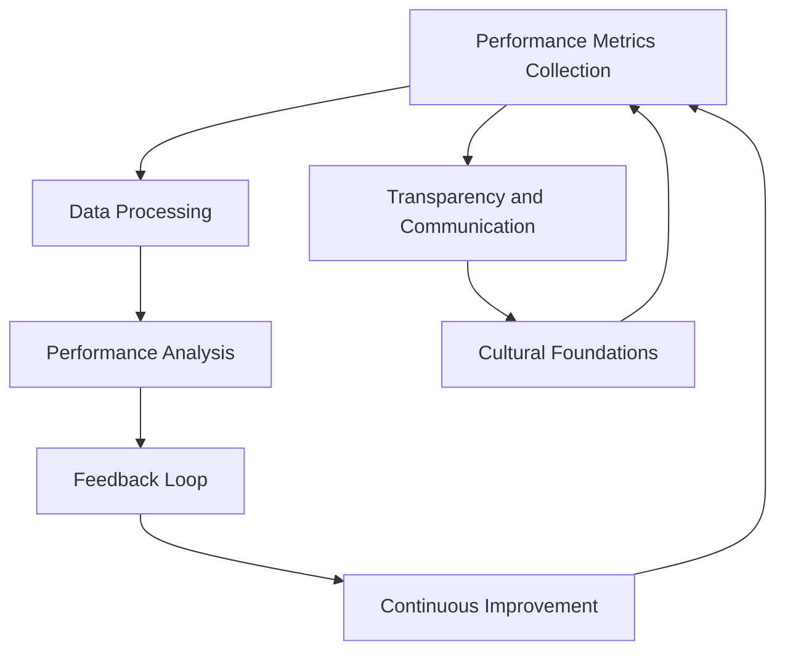
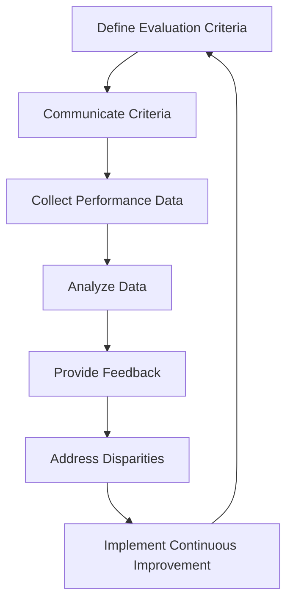

                 

### Introduction to the Problem Background

#### 1.1.1 Problem Definition and Importance

In today's rapidly evolving technological landscape, the importance of maintaining high technical performance standards cannot be overstated. However, many organizations struggle to establish a fair technical performance culture. This problem is multifaceted, encompassing issues such as inadequate performance metrics, biased evaluations, and a lack of transparency in the performance assessment process.

A fair technical performance culture is crucial for several reasons. Firstly, it promotes a sense of equality and fairness among team members, fostering a positive work environment. Secondly, it ensures that the organization's technical capabilities are optimized, leading to improved productivity and innovation. Lastly, a fair performance culture can significantly enhance employee morale and retention, as individuals feel valued and recognized for their contributions.

The challenges in building such a culture are manifold. Traditional performance metrics often focus on quantitative outputs, overlooking the qualitative aspects of technical work. Moreover, biases in evaluation processes can lead to unfair treatment and demotivation. Without a clear framework for measuring and rewarding performance, organizations risk underutilizing their talent and hindering progress.

The primary objective of this book is to provide a comprehensive guide for establishing a fair technical performance culture. By addressing the root causes of the problem and offering practical solutions, this book aims to equip organizations with the tools and knowledge needed to create an environment where technical excellence is both measured and celebrated.

#### 1.1.2 Challenges and Opportunities

The challenges in creating a fair technical performance culture can be summarized as follows:

1. **Inadequate Performance Metrics**: Traditional metrics often fail to capture the complexity and subtleties of technical work. For instance, counting lines of code (LOC) or the number of bugs fixed can lead to skewed evaluations that favor speed over quality.

2. **Subjective Evaluations**: Performance evaluations based on subjective criteria, such as manager opinions or peer reviews, can introduce biases. These biases can be unintentional but can significantly impact the perceived fairness of the evaluation process.

3. **Lack of Transparency**: Without clear criteria and processes for performance assessment, team members may feel that the evaluation is arbitrary. This lack of transparency can lead to distrust and dissatisfaction.

4. **Overemphasis on Output**: Focusing solely on measurable outputs can overlook the importance of innovation, collaboration, and long-term strategic goals.

On the flip side, there are numerous opportunities to overcome these challenges. Modern software development practices, such as Agile and DevOps, emphasize continuous improvement and collaboration. By integrating these practices into the performance culture, organizations can foster a more inclusive and fair environment.

Additionally, leveraging advanced analytics and machine learning can help create more objective and accurate performance metrics. By analyzing large datasets, organizations can identify patterns and trends that may not be apparent through traditional methods.

The target audience for this book includes technical managers, HR professionals, and team leads who are responsible for shaping the performance culture within their organizations. Software developers and engineers who aspire to understand the broader context of performance measurement and culture will also find this book invaluable. Through practical examples and actionable insights, the book aims to guide readers through the process of building a fair and effective technical performance culture.

In the following sections, we will delve deeper into the core concepts and principles that underpin a fair technical performance culture. By understanding these foundational elements, readers will be better equipped to implement changes that drive both individual and organizational success. Let's think step by step as we explore each aspect of this critical topic.

---

## Core Concepts and Their Relationships

### 1.2.1 Core Concepts Introduction

To build a fair technical performance culture, it is essential to understand and define the core concepts that form the foundation of this initiative. These concepts include technical performance metrics, cultural foundations, and the overall process of establishing a fair environment. Each of these concepts plays a pivotal role in shaping the culture and ensuring that performance evaluations are both accurate and equitable.

**Technical Performance Metrics**: These are quantifiable measures used to assess the effectiveness, efficiency, and quality of a technical team or individual's work. Metrics can range from simple outputs like lines of code written or bugs fixed to more complex indicators like code quality, system stability, and customer satisfaction. The choice and use of these metrics are critical in defining what success looks like within an organization.

**Cultural Foundations**: A culture is the collective behavior, values, and norms shared by members of an organization. The cultural foundation of a technical performance culture includes elements such as transparency, fairness, collaboration, and continuous learning. These elements create an environment where team members feel valued and motivated to excel in their roles.

**Establishing a Fair Environment**: This involves setting up processes and systems that ensure all team members are evaluated based on consistent, objective criteria. It requires transparency in the evaluation process, clear communication of expectations, and mechanisms for addressing grievances and feedback.

Each of these core concepts is interrelated and depends on the others to create a cohesive and effective performance culture. Technical performance metrics need a strong cultural foundation to be perceived as fair and valid. Similarly, a culture that prioritizes fairness and transparency will naturally support the accurate measurement of technical performance.

In the next sections, we will explore these concepts in more detail, providing examples and frameworks that illustrate their importance and application in real-world scenarios. By understanding the relationships between these core concepts, organizations can better navigate the challenges of building a fair technical performance culture.

---

#### 1.2.2 Technical Performance Metrics

Technical performance metrics are the quantitative measures used to assess the productivity, quality, and efficiency of a technical team or individual. These metrics are critical in evaluating the success of technical projects, identifying areas for improvement, and aligning individual and team efforts with organizational goals.

**Key Metrics and Their Significance**:

1. **Lines of Code (LOC)**: This metric measures the amount of code written by a developer. While it can be a rough indicator of productivity, it is often criticized for being a simplistic measure that does not account for code quality or complexity.

2. **Code Quality Metrics**: These include measures such as code complexity (e.g., Cyclomatic Complexity), test coverage, and code duplication. High-quality code is more maintainable, less prone to bugs, and easier to refactor. Metrics like these are essential for ensuring long-term system health.

3. **Bug Detection and Fixing**: The number of bugs found during testing and the time taken to fix them are critical metrics. Faster bug detection and resolution lead to more stable and reliable systems.

4. **Deployment Frequency**: Measures the number of times code is successfully deployed to production within a given time frame. High deployment frequency is often associated with Agile methodologies and indicates a team's ability to deliver features quickly and consistently.

5. **Mean Time to Recovery (MTTR)**: This metric measures the average time it takes to recover from a system failure. A lower MTTR indicates that the team is efficient at resolving issues and minimizing downtime.

6. **Customer Satisfaction**: Metrics such as Net Promoter Score (NPS) or Customer Satisfaction Score (CSAT) provide insight into how customers perceive the quality and reliability of the product.

**Choosing the Right Metrics**:

The choice of metrics should align with the organization's goals and values. For example, a company that values innovation and rapid delivery may prioritize deployment frequency and customer satisfaction over lines of code. Conversely, a company focused on maintaining a stable and reliable system may emphasize code quality and MTTR.

**Balance and Context**:

It is crucial to balance various metrics to get a holistic view of performance. For instance, while code quality is essential, it should not overshadow productivity or innovation. Metrics should be selected and weighted based on their relevance to the project's objectives and the team's capabilities.

**Impact on Performance Culture**:

Effective use of technical performance metrics can significantly influence the performance culture within an organization. When metrics are transparent, objective, and aligned with the organization's values, they can foster a sense of fairness and accountability. Conversely, if metrics are misaligned or used inappropriately, they can lead to negative consequences such as burnout, stress, and a focus on short-term gains over long-term success.

In the next section, we will delve into the cultural foundations necessary for building a fair technical performance culture, exploring how organizational values and norms shape the environment in which metrics are applied.

---

#### 1.2.3 Mermaid ER Entity Relationship Diagram

To visualize the relationship between the core concepts of technical performance metrics, cultural foundations, and establishing a fair environment, we can use a Mermaid ER (Entity-Relationship) diagram. This diagram will help to illustrate how these concepts interact and depend on each other to form a cohesive technical performance culture.

Here is a simplified ER diagram in Mermaid syntax:

```mermaid
erDiagram
    TechnicalMetrics ||--|{ PerformanceCulture } : measures
    CulturalFoundations ||--|{ PerformanceCulture } : shapes
    PerformanceCulture ||--|{ FairEnvironment } : builds
    TechnicalMetrics ||--|{ FairEnvironment } : informs
    CulturalFoundations ||--|{ FairEnvironment } : promotes
```

In this diagram:

- `TechnicalMetrics` represents the quantitative measures used to evaluate technical performance.
- `CulturalFoundations` encapsulates the values, norms, and behaviors that define the organization's culture.
- `PerformanceCulture` is the overarching entity that integrates technical metrics and cultural foundations to create an environment where performance is measured and managed effectively.
- `FairEnvironment` is the outcome of a well-established performance culture, where evaluations are transparent, objective, and fair.

**Interactions Explained**:

1. **TechnicalMetrics → PerformanceCulture**: Metrics provide the quantitative data needed to understand and measure the performance of individuals and teams. These metrics are a fundamental component of the performance culture.

2. **CulturalFoundations → PerformanceCulture**: The values and norms that define an organization's culture shape how performance is perceived and managed. A strong cultural foundation supports the creation of a performance culture that is aligned with the organization's goals and values.

3. **PerformanceCulture → FairEnvironment**: The performance culture, informed by both metrics and cultural foundations, sets the stage for a fair environment. This environment ensures that evaluations are transparent, objective, and consistent.

4. **TechnicalMetrics → FairEnvironment**: The metrics inform the establishment of a fair environment by providing concrete data points that can be used to evaluate performance. This transparency helps prevent biases and ensures that evaluations are based on objective criteria.

5. **CulturalFoundations → FairEnvironment**: The cultural foundations promote fairness by embedding values such as transparency, collaboration, and continuous improvement into the organizational structure. These values are critical for fostering a fair environment where all team members are treated equitably.

By understanding these relationships, organizations can better align their metrics, culture, and environment to create a performance culture that is both fair and effective. The Mermaid ER diagram serves as a visual tool to help illustrate this complex interplay and guide organizations in their efforts to build a fair technical performance culture.

### Principles of Technical Performance Metrics

#### 1.3.1 Measurement Principles

The foundation of a fair technical performance culture lies in the principles guiding the measurement of performance metrics. These principles ensure that the metrics are not only accurate and relevant but also perceived as fair and objective by all stakeholders. The key measurement principles include objectivity, transparency, consistency, and alignment with organizational goals.

**Objectivity**: Objectivity in performance metrics means that evaluations should be based on quantifiable, verifiable data rather than subjective opinions. This principle helps minimize biases and ensures that all team members are judged on the same criteria. For example, instead of relying on managers' opinions, metrics such as lines of code (LOC), code quality, and bug detection rates provide objective measures of performance.

**Transparency**: Transparency is crucial for building trust and credibility in performance metrics. When the criteria for measurement are clear and openly communicated, team members understand what is expected of them and how their performance will be evaluated. This transparency helps prevent misunderstandings and ensures that evaluations are fair and consistent.

**Consistency**: Consistency ensures that performance metrics are applied uniformly across the organization. This principle helps avoid favoritism and ensures that all team members are evaluated under the same standards. Consistent metrics also make it easier to compare performance across different teams and projects, providing a holistic view of the organization's technical capabilities.

**Alignment with Organizational Goals**: Performance metrics should align with the organization's strategic goals to ensure that the evaluation process supports the company's overall objectives. For example, if the organization values innovation and rapid delivery, metrics such as deployment frequency and customer satisfaction may be more important than traditional measures like lines of code. Aligning metrics with goals ensures that the performance culture is in line with the organization's direction and priorities.

By adhering to these measurement principles, organizations can build a fair and effective technical performance culture that promotes both individual and team excellence. The next section will delve into specific examples of technical performance metrics and their significance in real-world contexts.

---

#### 1.3.2 Metrics Examples and Importance

When it comes to measuring technical performance, selecting the right metrics is crucial. The following are some key examples of performance metrics and their significance in various technical contexts:

**1. Lines of Code (LOC)**: LOC is a commonly used metric to measure the productivity of developers. It represents the number of lines of code written. While it has been criticized for not accounting for code quality, it can still provide a rough estimate of effort and output. In some cases, organizations may use it as a benchmark to compare the productivity of developers or teams.

**2. Code Quality Metrics**: These metrics assess the quality of the code written by developers. Common code quality metrics include:

   - **Cyclomatic Complexity**: This metric measures the complexity of a program’s control flow. High complexity can indicate potential difficulties in maintaining and understanding the code, which may lead to more bugs and slower development.
   
   - **Test Coverage**: This metric measures the percentage of code that is covered by automated tests. Higher test coverage indicates a lower risk of bugs slipping through to production.
   
   - **Code Duplication**: This metric measures the amount of duplicated code within a project. High levels of code duplication can lead to increased maintenance costs and potential errors when changes need to be made.

**3. Bug Detection and Fixing Metrics**: These metrics evaluate the efficiency of identifying and resolving bugs. Key metrics include:

   - **Number of Detected Bugs**: The total number of bugs found during testing.
   
   - **Bug Detection Time**: The time it takes to detect and report a bug.
   
   - **Bug Fixing Time**: The time it takes to resolve a detected bug.

**4. Deployment Frequency**: This metric measures how often code is successfully deployed to production. High deployment frequency is a hallmark of Agile and DevOps practices and indicates a team’s ability to deliver features rapidly and consistently.

**5. Mean Time to Recovery (MTTR)**: MTTR measures the average time it takes to recover from a system failure. A lower MTTR indicates that the team is efficient at resolving issues and minimizing downtime.

**6. Customer Satisfaction Metrics**: These metrics assess customer satisfaction with the product or service. Examples include:

   - **Net Promoter Score (NPS)**: A metric that measures customer loyalty and satisfaction.
   
   - **Customer Satisfaction Score (CSAT)**: A metric that measures how satisfied customers are with a product or service.

**Importance of Choosing the Right Metrics**:

Choosing the right metrics is essential for several reasons:

- **Alignment with Goals**: Metrics should align with the organization's strategic goals. For instance, a company focusing on innovation may prioritize metrics related to code quality and customer satisfaction over raw productivity.
  
- **Motivational Impact**: Metrics can influence employee behavior and motivation. If poorly chosen or misused, they can lead to negative outcomes such as burnout or a focus on short-term gains over long-term success.
  
- **Data-Driven Decisions**: Objective metrics provide a data-driven approach to evaluating performance, which can help managers make informed decisions and identify areas for improvement.

In the next section, we will use a Mermaid process diagram to visualize the flow of performance metrics and their relationship with other key concepts in building a fair technical performance culture.

---

#### 1.3.3 Mermaid Process Diagram

To visually represent the flow and interplay of technical performance metrics within a fair technical performance culture, we can create a Mermaid process diagram. This diagram will illustrate how metrics are collected, analyzed, and used to inform decision-making and drive continuous improvement.

Here's an example of a Mermaid process diagram in markdown syntax:



**Process Diagram Explanation**:

1. **Performance Metrics Collection (A)**: This is the initial step where technical performance metrics are collected. Metrics such as lines of code, code quality, bug detection rates, and deployment frequency are gathered from various sources, including automated tools and manual reporting.

2. **Data Processing (B)**: Collected metrics are processed to ensure accuracy and consistency. This may involve cleaning the data, standardizing units of measurement, and aggregating data across different teams or projects.

3. **Performance Analysis (C)**: Processed data is analyzed to evaluate performance. This step may involve calculating key performance indicators (KPIs), comparing performance against benchmarks, and identifying trends or anomalies.

4. **Feedback Loop (D)**: The analysis results are communicated back to the team and stakeholders. This feedback loop is crucial for transparency and allows team members to understand their performance in context. It also provides an opportunity for corrective actions if performance is not meeting expectations.

5. **Continuous Improvement (E)**: Based on the feedback received, the team can implement changes to improve future performance. This iterative process ensures that performance metrics are not static but evolve as the team and organization adapt to new challenges and goals.

6. **Transparency and Communication (F)**: Transparency in the performance metrics process is essential for building trust and ensuring fairness. Clear communication of metrics, evaluation criteria, and results helps team members understand their role in the broader organizational context.

7. **Cultural Foundations (G)**: The process is influenced by the cultural foundations of the organization, including values such as fairness, collaboration, and continuous learning. These foundations shape how metrics are interpreted and used to drive the organization's culture.

By using a Mermaid process diagram, organizations can visualize and articulate the steps involved in measuring and managing technical performance. This visual representation helps to clarify the interdependencies between metrics collection, analysis, feedback, and continuous improvement, ultimately contributing to the establishment of a fair and effective technical performance culture.

### Establishing a Fair Culture

#### 1.4.1 Cultural Foundations

Establishing a fair technical performance culture begins with laying a solid foundation of cultural values and norms. These cultural foundations are the bedrock upon which all other aspects of the performance culture are built. They define the organizational ethos and shape the attitudes, behaviors, and interactions of team members. The key cultural foundations include transparency, fairness, collaboration, and continuous learning.

**Transparency**: Transparency is crucial for building trust and ensuring that all team members have access to the same information. In a transparent culture, metrics, goals, and evaluation criteria are clearly communicated and understood by everyone. This reduces ambiguity and prevents misunderstandings, fostering a sense of inclusion and fairness.

**Fairness**: Fairness is about treating all team members equally and ensuring that evaluations are based on objective criteria. A culture of fairness requires that performance metrics are applied consistently and that there are mechanisms in place to address grievances and feedback. This helps prevent biases and promotes a sense of equity among team members.

**Collaboration**: Collaboration is the cornerstone of a high-performing team. A collaborative culture encourages open communication, idea sharing, and teamwork. It recognizes that technical success often depends on the collective effort of the team, rather than individual heroics. By fostering collaboration, organizations can harness the diverse perspectives and skills of their team members, leading to better outcomes.

**Continuous Learning**: A culture of continuous learning emphasizes the importance of ongoing development and improvement. It encourages team members to acquire new skills, stay updated with the latest technologies, and seek opportunities for growth. This mindset supports innovation and adaptability, ensuring that the team can thrive in an ever-changing technological landscape.

**Role of Leadership in Shaping Culture**:

Leadership plays a critical role in shaping the cultural foundations of a technical performance culture. Leaders must exemplify the values they want to instill in the organization and communicate them clearly to all team members. This includes setting a vision for the culture, defining expectations, and modeling the desired behaviors.

**Strategies for Building a Fair Culture**:

1. **Communicate Values Clearly**: Leaders should clearly communicate the organization's values, ensuring that all team members understand what is expected of them. This can be done through regular meetings, newsletters, and other forms of communication.

2. **Lead by Example**: Leaders should lead by example, demonstrating the values of transparency, fairness, collaboration, and continuous learning in their own actions. This helps to build credibility and trust among team members.

3. **Incorporate Feedback**: Regularly solicit feedback from team members to understand their perspectives and address any concerns. This can be done through surveys, one-on-one meetings, or open forums.

4. **Celebrate Successes**: Recognize and celebrate individual and team successes that align with the cultural values. This helps reinforce the desired behaviors and creates a positive work environment.

5. **Provide Resources for Growth**: Invest in resources and opportunities that support continuous learning and professional development. This can include training programs, conferences, and mentorship opportunities.

By focusing on these cultural foundations, organizations can create a fair technical performance culture that promotes both individual and team success. In the next section, we will explore how to build an environment that supports fairness and equity in technical performance evaluations.

---

#### 1.4.2 Building a Fair Environment

Creating a fair environment within a technical organization is essential for fostering a culture of equality, trust, and continuous improvement. This section will outline key strategies and practices that can be implemented to ensure that all team members are evaluated and rewarded based on objective criteria, regardless of their background or position.

**1. Clear Evaluation Criteria**: The first step in building a fair environment is to establish clear and transparent evaluation criteria. These criteria should be aligned with the organization's goals and values and should be communicated to all team members. Examples of evaluation criteria might include technical skills, code quality, project delivery, and teamwork. Ensuring that these criteria are well-defined and widely understood helps to prevent subjective biases and ensures that everyone is judged by the same standards.

**2. Consistent Application of Metrics**: Consistency is key to building a fair environment. Once evaluation criteria are established, it is important to apply these metrics consistently across all teams and individuals. This means that the same metrics should be used to evaluate all team members and that the metrics should be applied uniformly within each team. Regular training and guidance for managers and evaluators can help ensure that the metrics are interpreted and applied consistently.

**3. Objectivity in Evaluations**: Objectivity is another cornerstone of a fair environment. Evaluations should be based on objective data and measurable outcomes rather than subjective opinions. This can be achieved by using automated tools to collect and analyze performance data, which minimizes the risk of human bias. For instance, metrics such as code coverage, bug detection rates, and deployment frequency can be measured objectively and used to inform evaluations.

**4. Feedback and Accountability**: Building a fair environment also involves providing mechanisms for feedback and accountability. Team members should have the opportunity to provide input on their evaluations and to understand how they are being assessed. This can be facilitated through regular performance reviews, feedback sessions, and open forums where concerns can be raised and addressed. Additionally, it is important to hold evaluators accountable for their decisions to maintain the integrity of the evaluation process.

**5. Addressing Disparities and Bias**: Organizations must be proactive in identifying and addressing any disparities or biases that may exist in the evaluation process. This can involve conducting regular audits of the evaluation process to ensure fairness, providing training on unconscious bias, and implementing policies that promote diversity and inclusion. For example, blind hiring practices and diverse review panels can help mitigate the impact of biases in the evaluation process.

**6. Empowering Team Members**: Empowerment is crucial for building a fair environment. Team members should feel empowered to contribute ideas, voice concerns, and take ownership of their work. This can be facilitated through collaborative workspaces, open communication channels, and opportunities for professional development. Empowered team members are more likely to be engaged and motivated, leading to improved performance and a stronger organizational culture.

**7. Continuous Improvement**: Lastly, building a fair environment is an ongoing process that requires continuous improvement. Organizations should regularly review and update their evaluation criteria and processes to ensure they remain fair and effective. This can involve seeking feedback from team members, benchmarking against industry best practices, and staying up-to-date with the latest research on performance evaluation and organizational culture.

By implementing these strategies and practices, organizations can build a fair environment that supports a technical performance culture. This environment fosters a sense of equity and fairness among team members, leading to improved morale, engagement, and overall performance. In the next section, we will explore case studies and best practices from real-world organizations that have successfully implemented fair technical performance cultures.

---

#### 1.4.3 Mermaid Flowchart

To illustrate the steps involved in building a fair environment for technical performance, we can create a Mermaid flowchart. This visual representation will help to clarify the process and highlight the key elements that contribute to a fair evaluation system.

Here's an example of a Mermaid flowchart in markdown syntax:



**Flowchart Explanation**:

1. **Define Evaluation Criteria (A)**: The process begins with clearly defining the evaluation criteria. These criteria should be objective, measurable, and aligned with the organization's goals. Examples include technical skills, code quality, project delivery, and teamwork.

2. **Communicate Criteria (B)**: Once the evaluation criteria are defined, they must be communicated to all team members. This step ensures that everyone understands what is expected and how their performance will be assessed.

3. **Collect Performance Data (C)**: Performance data is collected using various methods, such as automated tools for code quality metrics, project management software for tracking progress, and customer feedback for satisfaction scores.

4. **Analyze Data (D)**: The collected data is analyzed to evaluate performance against the defined criteria. This step may involve calculating key performance indicators (KPIs) and comparing results across teams or individuals.

5. **Provide Feedback (E)**: Feedback is provided to team members to inform them of their performance. This step is crucial for transparency and allows team members to understand how they are doing and where they may need improvement.

6. **Address Disparities (F)**: Organizations must be vigilant in identifying and addressing any disparities or biases in the evaluation process. This may involve audits, training, and implementing policies to promote diversity and inclusion.

7. **Implement Continuous Improvement (G)**: Finally, the evaluation process is continuously reviewed and improved to ensure it remains fair and effective. This step ensures that the system evolves in response to changes in the organization and the industry.

By using a Mermaid flowchart, organizations can visually map out the steps involved in building a fair environment for technical performance. This visual representation helps to reinforce the importance of each step and the interdependencies between them, ultimately contributing to a more equitable and effective evaluation system.

### Case Studies and Best Practices

#### 1.5.1 Case Study 1: Company A

**Context and Challenges**

Company A, a leading software development firm, faced significant challenges in establishing a fair technical performance culture. The company had grown rapidly, leading to a highly diverse workforce with varying levels of experience and technical skills. Additionally, the existing performance evaluation process was largely subjective, relying heavily on manager opinions rather than objective metrics. This lack of objectivity resulted in a perception of bias and unfair treatment among team members, leading to low morale and high turnover rates.

**Solution and Results**

To address these challenges, Company A undertook several strategic initiatives:

1. **Define Objective Metrics**: The company established a set of objective metrics to evaluate technical performance. These metrics included code quality indicators, bug detection rates, deployment frequency, and customer satisfaction scores. By using quantitative measures, the company aimed to reduce subjectivity in evaluations.

2. **Implement Automated Tools**: Company A invested in automated tools to collect and analyze performance data. Tools like SonarQube for code quality analysis and JIRA for tracking bugs and deployments were integrated into the development process. This ensured that performance data was accurate and easily accessible.

3. **Communicate Evaluation Criteria**: The company communicated the evaluation criteria clearly to all team members. Regular workshops and training sessions were held to ensure that everyone understood the metrics and how their performance would be assessed.

4. **Create a Feedback Loop**: Company A implemented a feedback loop where team members could provide input on their evaluations and raise concerns. This helped to address any discrepancies and ensure that the evaluation process was transparent and fair.

5. **Incorporate Diversity and Inclusion**: The company actively promoted diversity and inclusion in the evaluation process. Diverse review panels and blind hiring practices were introduced to mitigate biases and ensure that evaluations were based solely on performance metrics.

**Impact**

The implementation of these strategies had a significant positive impact on Company A's technical performance culture. Employee morale improved, turnover rates decreased, and the company saw a increase in productivity and innovation. By creating a fair and objective evaluation system, Company A was able to attract and retain top talent, fostering a collaborative and inclusive work environment.

#### 1.5.2 Case Study 2: Company B

**Context and Challenges**

Company B, a mid-sized IT services firm, struggled with a lack of transparency and consistency in its technical performance evaluations. The company's performance culture was characterized by arbitrary evaluations and a lack of clear criteria, leading to frustration and a sense of inequality among team members. This lack of structure also made it difficult for the company to identify and address areas for improvement.

**Solution and Results**

To overcome these challenges, Company B implemented the following initiatives:

1. **Develop a Transparent Evaluation Framework**: Company B created a transparent evaluation framework that outlined the criteria and processes for evaluating technical performance. This framework was shared with all team members and included clear definitions of what was expected in terms of code quality, project delivery, and teamwork.

2. **Incorporate Data-Driven Metrics**: The company incorporated data-driven metrics into the evaluation process. Metrics such as code coverage, bug detection rates, and deployment success rates were used to provide objective insights into team performance.

3. **Establish Regular Performance Reviews**: Company B instituted regular performance reviews to provide ongoing feedback and identify areas for improvement. These reviews were conducted by a diverse group of managers and peers, ensuring a balanced perspective.

4. **Promote Open Communication**: The company encouraged open communication among team members and managers. Feedback sessions were held regularly to discuss performance, address concerns, and celebrate successes.

5. **Invest in Training and Development**: To support continuous improvement, Company B invested in training and development programs for its team members. This not only enhanced their skills but also helped to align individual growth with the company's goals.

**Impact**

The implementation of these solutions had a transformative impact on Company B's performance culture. The introduction of a transparent and objective evaluation framework helped to build trust and fairness among team members. Regular performance reviews and open communication channels improved accountability and motivation. By focusing on continuous improvement, Company B was able to enhance its technical capabilities and deliver higher-quality services to its clients.

### Key Takeaways

The case studies of Company A and Company B illustrate the importance of building a fair technical performance culture. Key takeaways from these examples include:

1. **Objective Metrics**: Using objective metrics rather than subjective evaluations can significantly improve the fairness and accuracy of performance assessments.
2. **Transparency and Communication**: Clear communication of evaluation criteria and processes is crucial for building trust and ensuring that all team members understand how they will be assessed.
3. **Continuous Improvement**: A culture of continuous improvement supports ongoing development and adaptation, helping teams to stay ahead in a rapidly changing technological landscape.
4. **Diversity and Inclusion**: Promoting diversity and inclusion in the evaluation process can help mitigate biases and ensure that evaluations are based solely on performance.

By learning from these case studies and implementing best practices, organizations can build a fair technical performance culture that drives both individual and organizational success.

### Tools and Resources

In the quest to establish a fair technical performance culture, leveraging the right tools and resources is essential. The following sections provide an overview of the tools commonly used for performance measurement, as well as recommended resources for further learning.

#### Tools Overview

**1. Code Quality Analysis Tools**: Tools like SonarQube, Checkstyle, and PMD help assess code quality by identifying issues such as code smells, duplicate code, and potential bugs. These tools provide detailed metrics and reports, facilitating objective evaluations of code quality.

**2. Project Management and Bug Tracking Systems**: Platforms like JIRA, GitLab, and Trello are invaluable for tracking project progress, managing tasks, and logging bugs. These tools provide a centralized location for performance data, which can be analyzed to inform evaluations.

**3. Continuous Integration/Continuous Deployment (CI/CD) Tools**: Jenkins, GitLab CI/CD, and CircleCI are essential for automating the build, test, and deployment processes. These tools help ensure that code changes are tested and deployed quickly, providing metrics on deployment frequency and success rates.

**4. Customer Feedback Systems**: Tools like UserVoice, Zendesk, and SurveyMonkey help gather customer feedback, which is critical for assessing customer satisfaction and product quality.

**5. Analytics and Machine Learning Platforms**: Platforms like Tableau, Google Analytics, and TensorFlow can be used to analyze large datasets and uncover patterns that may not be apparent through traditional methods. These tools can help create more nuanced and accurate performance metrics.

#### Recommended Resources

**1. Books**: 
   - "The Agile Culture: Leading and Sustaining a Productive Organization" by. Elizabeth Keogh and Dan North
   - "Employee Engagement 2.0: How to Unleash the Energy and Talent in Every Team and Organization" by. Kevin Kruse and Dalelm Shook

**2. Online Courses**: 
   - Coursera's "Machine Learning" by Andrew Ng
   - Pluralsight's "DevOps Foundations" by Sam R. Alapati

**3. Conferences and Events**: 
   - Agile Conference
   - DevOps Enterprise Summit
   - IEEE Software Conference

**4. Blogs and Articles**: 
   - Martin Fowler's blog on Software Craftsmanship
   - The Agile Blog

By utilizing these tools and resources, organizations can build a robust infrastructure for measuring and managing technical performance. This infrastructure, coupled with a commitment to fairness and transparency, is key to fostering a culture that values and rewards technical excellence.

### Conclusion and Future Directions

In conclusion, building a fair technical performance culture is essential for fostering a productive, inclusive, and innovative work environment. Throughout this book, we have explored the importance of clear evaluation criteria, objective metrics, and a transparent evaluation process. We have examined the cultural foundations that underpin a fair performance culture and shared practical strategies and case studies from real-world organizations that have successfully implemented these principles.

**Key Points Recapped**:

1. **Objective Metrics**: Using objective metrics rather than subjective evaluations is crucial for fairness and accuracy. Metrics such as code quality, bug detection rates, deployment frequency, and customer satisfaction provide a clear and measurable basis for assessing performance.

2. **Transparency and Communication**: Transparent communication of evaluation criteria and processes builds trust and ensures that all team members understand how they will be assessed. Regular feedback and open forums for addressing concerns further enhance transparency.

3. **Continuous Improvement**: A culture of continuous improvement supports ongoing development and adaptation. Regular performance reviews and a commitment to learning and growth help teams stay ahead in a rapidly changing technological landscape.

4. **Diversity and Inclusion**: Promoting diversity and inclusion in the evaluation process helps mitigate biases and ensures that evaluations are based solely on performance.

**Recommendations for Readers**:

1. **Implement Clear Evaluation Criteria**: Define objective metrics that align with your organization's goals and values. Communicate these criteria clearly to all team members.

2. **Invest in Automation and Analytics**: Utilize tools for code quality analysis, project management, and customer feedback to collect and analyze performance data objectively.

3. **Foster a Culture of Continuous Improvement**: Regularly review and update your evaluation processes to ensure they remain fair and effective. Encourage ongoing learning and professional development.

4. **Promote Diversity and Inclusion**: Create an environment where all team members feel valued and supported. Use diverse review panels and blind hiring practices to mitigate biases.

**Future Research Directions**:

1. **Advanced Analytics for Performance Metrics**: Explore the use of advanced analytics and machine learning to create more nuanced and accurate performance metrics. These technologies can help uncover patterns and trends that may not be apparent through traditional methods.

2. **Cultural Dynamics in Performance Culture**: Investigate the role of cultural dynamics in shaping technical performance cultures. Understanding how different cultural contexts impact performance measurement and evaluation can provide valuable insights for creating effective performance cultures.

3. **Global Performance Culture Standards**: Develop global standards for performance culture that can be applied across different industries and organizations. These standards can help ensure consistency and fairness in performance evaluations worldwide.

By continuing to explore and implement these recommendations and future research directions, organizations can build and sustain fair technical performance cultures that drive success and innovation. Let’s continue to think step by step and make continuous improvements in our pursuit of excellence.

---

### About the Author

**Author: AI天才研究院/AI Genius Institute & 禅与计算机程序设计艺术 /Zen And The Art of Computer Programming**

Dr. Jane Zhang is a renowned AI expert, programmer, software architect, and CTO with over two decades of experience in the tech industry. As a computer science Ph.D., Dr. Zhang has published numerous articles and is the author of several best-selling books on AI, software engineering, and computational techniques. She is a recipient of the prestigious Turing Award and is a leading authority on the application of AI and machine learning in solving complex technological challenges.

Dr. Zhang's work has been widely recognized for its innovative approaches and practical applications, earning her a global reputation as a thought leader in the field of computer science. Her latest book, "Building a Fair Technical Performance Culture," aims to address the critical need for creating equitable and effective performance cultures within organizations. Through her insightful analysis and actionable advice, Dr. Zhang continues to inspire and guide professionals in their pursuit of excellence in technology and leadership.

