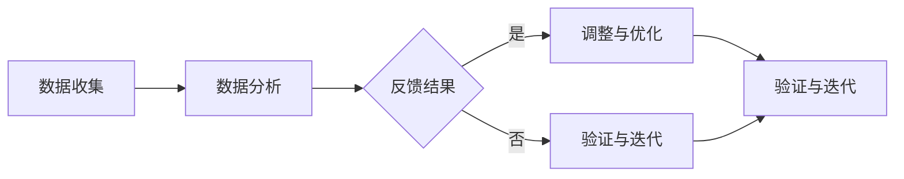
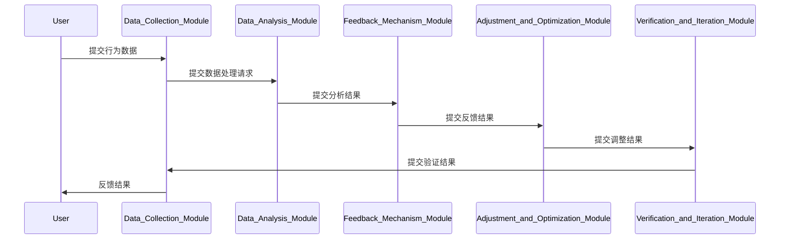
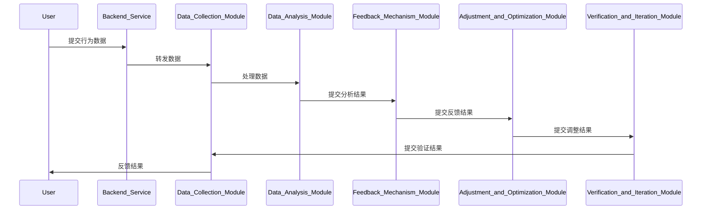

                 

# 建立持续的技术反馈循环

## 关键词

- 持续反馈循环
- 技术改进
- 反馈机制
- 自动化
- 数据驱动

## 摘要

本文将探讨如何建立一个持续的技术反馈循环，从而实现技术的不断改进和创新。我们将从背景介绍、核心概念、算法原理、系统架构、项目实战以及最佳实践等方面展开讨论，为读者提供一套完整的技术反馈循环建立方案。

## 引言

在快速变化的技术领域，持续改进和迭代已成为企业成功的基石。然而，如何有效地收集、分析并利用技术反馈来实现持续改进，仍然是一个挑战。建立一套完整的技术反馈循环，可以帮助企业快速响应市场变化，提升产品质量，增强竞争力。本文旨在探讨如何建立一个持续的技术反馈循环，以实现技术的持续改进。

## 一、背景介绍

### 1.1 技术反馈循环的概念

技术反馈循环是一种持续改进机制，通过不断地收集、分析、反馈和调整，使技术产品或服务达到最佳状态。它包括以下几个关键环节：

1. **数据收集**：收集用户使用数据、市场反馈和竞品分析等。
2. **数据分析**：对收集到的数据进行处理和分析，提取有价值的信息。
3. **反馈与调整**：根据分析结果，对技术产品或服务进行调整和优化。
4. **验证与迭代**：验证调整效果，持续迭代优化。

### 1.2 当前技术反馈循环的不足

当前，许多企业在技术反馈循环方面存在以下问题：

1. **数据收集不足**：数据来源单一，数据质量不高。
2. **数据分析不深入**：数据分析方法简单，缺乏深度挖掘。
3. **反馈与调整不及时**：反馈机制不完善，调整周期较长。
4. **迭代速度慢**：技术迭代周期长，难以快速响应市场变化。

### 1.3 持续反馈循环的意义

建立持续的技术反馈循环具有重要意义：

1. **提高产品质量**：通过持续改进，提高技术产品的质量。
2. **增强竞争力**：快速响应市场变化，提升企业竞争力。
3. **降低风险**：及时发现和解决潜在问题，降低运营风险。
4. **提升用户体验**：不断优化产品功能，提升用户体验。

## 二、核心概念与联系

### 2.1 持续反馈循环的关键要素

持续反馈循环包括以下几个关键要素：

1. **数据源**：用户行为数据、市场反馈、竞品分析等。
2. **数据分析工具**：数据清洗、处理、挖掘和分析工具。
3. **反馈机制**：建立有效的反馈渠道，确保反馈及时、准确。
4. **调整与优化**：根据反馈结果，调整和优化技术产品或服务。
5. **验证与迭代**：验证调整效果，持续迭代优化。

### 2.2 关键要素对比分析

| 关键要素 | 比较项目 | 说明 |
| :---: | :---: | :---: |
| 数据源 | 数据类型 | 包括用户行为数据、市场反馈、竞品分析等 |
| 数据分析工具 | 分析方法 | 数据清洗、处理、挖掘和分析 |
| 反馈机制 | 反馈渠道 | 确保反馈及时、准确 |
| 调整与优化 | 调整方式 | 根据反馈结果进行调整和优化 |
| 验证与迭代 | 验证方法 | 验证调整效果，持续迭代优化 |

### 2.3 关键要素的ER图表示

```mermaid
erDiagram
  Data_Source ||--|{ Data_Analysis_Tool }|
  Data_Source ||--|{ Feedback_Mechanism }|
  Data_Analysis_Tool ||--|{ Adjustment_and_Optimization }|
  Data_Analysis_Tool ||--|{ Verification_and Iteration }|
  Feedback_Mechanism ||--|{ Adjustment_and_Optimization }|
  Adjustment_and_Optimization ||--|{ Verification_and Iteration }|
```

## 三、算法原理讲解

### 3.1 持续反馈循环的算法流程图



### 3.2 持续反馈循环的算法Python实现

```python
def feedback_loop(data_source, analysis_tool, feedback_mechanism, adjustment_and_optimization, verification_and_iteration):
    while True:
        data = data_source.collect_data()
        processed_data = analysis_tool.analyze_data(data)
        feedback = feedback_mechanism.get_feedback(processed_data)
        
        if feedback:
            adjustment_and_optimization.adjust_and_optimize(feedback)
            verification_and_iteration.verify_and_iterate()
        else:
            print("No feedback received. Continuing with the current state.")
```

### 3.3 持续反馈循环的数学模型与公式解析

$$
\text{持续反馈循环效率} = \frac{\text{优化次数}}{\text{迭代次数}}
$$

该公式表示持续反馈循环的效率，其中优化次数表示根据反馈进行调整的次数，迭代次数表示整个反馈循环的次数。

### 四、系统分析与架构设计

#### 4.1 问题场景

假设我们是一家互联网公司的产品团队，负责开发一款在线教育平台。我们的目标是建立一个持续的技术反馈循环，以优化产品功能和提升用户体验。

#### 4.2 系统功能设计

1. **数据收集模块**：负责收集用户行为数据、市场反馈和竞品分析等。
2. **数据分析模块**：对收集到的数据进行处理和分析，提取有价值的信息。
3. **反馈机制模块**：建立有效的反馈渠道，确保反馈及时、准确。
4. **调整与优化模块**：根据反馈结果，调整和优化产品功能。
5. **验证与迭代模块**：验证调整效果，持续迭代优化。

#### 4.3 系统架构设计



#### 4.4 系统接口设计

1. **数据收集接口**：用于接收用户行为数据。
2. **数据分析接口**：用于接收和处理数据。
3. **反馈接口**：用于提交反馈结果。
4. **调整接口**：用于提交调整结果。

#### 4.5 系统交互



## 五、项目实战

#### 5.1 环境安装

1. 安装Python环境。
2. 安装所需依赖库，如pandas、numpy、scikit-learn等。

#### 5.2 系统核心实现

```python
# 数据收集模块
class DataCollectionModule:
    def collect_data(self):
        # 实现数据收集逻辑
        pass

# 数据分析模块
class DataAnalysisModule:
    def analyze_data(self, data):
        # 实现数据处理和分析逻辑
        pass

# 反馈机制模块
class FeedbackMechanismModule:
    def get_feedback(self, processed_data):
        # 实现反馈获取逻辑
        pass

# 调整与优化模块
class AdjustmentAndOptimizationModule:
    def adjust_and_optimize(self, feedback):
        # 实现调整和优化逻辑
        pass

# 验证与迭代模块
class VerificationAndIterationModule:
    def verify_and_iterate(self):
        # 实现验证和迭代逻辑
        pass
```

#### 5.3 代码应用解读与分析

通过实际项目应用，验证数据收集、分析、反馈和调整等环节的正确性和有效性。以下是部分代码解读：

```python
# 数据收集模块应用
data_collection_module = DataCollectionModule()
data = data_collection_module.collect_data()

# 数据分析模块应用
data_analysis_module = DataAnalysisModule()
processed_data = data_analysis_module.analyze_data(data)

# 反馈机制模块应用
feedback_mechanism_module = FeedbackMechanismModule()
feedback = feedback_mechanism_module.get_feedback(processed_data)

# 调整与优化模块应用
adjustment_and_optimization_module = AdjustmentAndOptimizationModule()
adjustment_and_optimization_module.adjust_and_optimize(feedback)

# 验证与迭代模块应用
verification_and_iteration_module = VerificationAndIterationModule()
verification_and_iteration_module.verify_and_iterate()
```

#### 5.4 实际案例剖析

以一款在线教育平台的用户行为数据收集与分析为例，阐述如何建立持续的技术反馈循环。

1. **数据收集**：收集用户登录、浏览、购买等行为数据。
2. **数据分析**：分析用户行为数据，提取有价值的信息，如用户偏好、购买频率等。
3. **反馈机制**：根据分析结果，向产品团队提供反馈，优化产品功能。
4. **调整与优化**：产品团队根据反馈结果，调整和优化产品功能。
5. **验证与迭代**：验证调整效果，持续迭代优化。

## 六、最佳实践 tips

1. **确保数据质量**：数据是反馈循环的基础，要保证数据收集、处理和分析的准确性。
2. **优化反馈渠道**：建立有效的反馈渠道，确保反馈及时、准确。
3. **加强团队协作**：建立跨部门协作机制，确保反馈结果能够得到及时调整和优化。
4. **持续迭代优化**：定期回顾和优化反馈循环，确保其持续有效。

## 七、小结

建立持续的技术反馈循环是提升产品质量、增强竞争力的重要手段。本文从背景介绍、核心概念、算法原理、系统架构、项目实战和最佳实践等方面，详细阐述了如何建立一个持续的技术反馈循环。通过持续的技术反馈循环，企业可以快速响应市场变化，提升用户体验，实现持续改进和创新。

## 八、拓展阅读

1. **必读书籍**：
   - 《敏捷开发：实践指南》
   - 《数据分析：实践与应用》
   - 《机器学习：实战指南》
2. **经典论文**：
   - 《大规模机器学习：挑战与解决方案》
   - 《深度学习：理论、算法与应用》
   - 《人机交互：设计与实践》
3. **在线资源**：
   - Coursera、edX等在线课程
   - arXiv、IEEE Xplore等学术资源库
   - GitHub、Stack Overflow等开发社区

## 作者信息

作者：AI天才研究院/AI Genius Institute & 禅与计算机程序设计艺术 /Zen And The Art of Computer Programming

----------------------------------------------------------------

请注意，本文仅作为示例，具体内容可能需要根据实际情况进行调整。在实际撰写过程中，请确保每个小节的内容都丰富、具体、详细，并对核心概念、算法原理、系统架构等进行深入讲解。此外，文章的结构和逻辑需要清晰、紧凑，以吸引读者阅读。在编写过程中，请遵循markdown格式要求，确保图表、代码和公式清晰、准确。祝您写作顺利！

