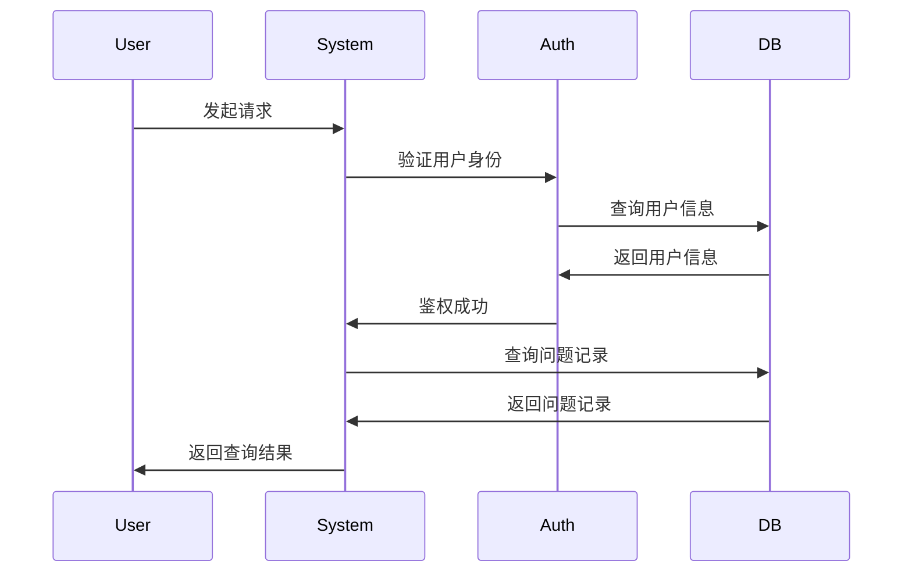

                 


### 建立高效的技术支持体系

#### 关键词：技术支持体系、高效设计、流程管理、团队建设、工具选择、案例分析

> 摘要：本文将深入探讨如何建立高效的技术支持体系，包括背景介绍、核心概念与联系、体系构建、案例分析以及最佳实践。通过逻辑清晰的分析和实例讲解，帮助读者理解和掌握构建高效技术支持体系的关键步骤。

---

## 引言

在现代信息技术快速发展的背景下，技术支持体系的构建变得尤为重要。高效的技术支持体系不仅能够提升企业的核心竞争力，还能够满足客户不断变化的需求，从而在激烈的市场竞争中占据优势。本文将分五个部分对建立高效的技术支持体系进行详细探讨，旨在为IT经理和技术支持团队提供实用的指导和建议。

## 第一部分：背景介绍

### 1.1 问题背景

#### 1.1.1 技术支持体系的重要性

技术支持体系是保障企业信息系统稳定运行的关键环节。它不仅影响着企业的日常运营效率，还直接关系到客户满意度和企业形象。随着信息化程度的提高，技术支持体系的重要性愈发凸显。

#### 1.1.2 技术支持体系面临的挑战

当前，技术支持体系面临着诸多挑战，如人员不足、技术更新迅速、客户需求多样化等。如何在这些挑战中找到解决方案，构建一个高效的技术支持体系，成为企业管理者需要迫切解决的问题。

### 1.2 技术支持体系的核心要素

#### 1.2.1 核心概念：技术支持、服务体系

技术支持是指为用户提供的技术性问题解答和技术指导服务。服务体系则是为技术支持提供有效保障的一整套流程和管理制度。

#### 1.2.2 概念属性特征对比表格

| 特征       | 技术支持       | 服务体系       |
|------------|----------------|----------------|
| 目的       | 解决技术问题   | 提供服务保障   |
| 对象       | 用户           | 企业           |
| 内容       | 技术性问题     | 服务流程       |
| 影响力     | 客户满意度     | 企业形象       |

### 1.3 技术支持体系的边界与外延

#### 1.3.1 技术支持体系的边界

技术支持体系的边界包括内部管理和外部服务两个方面。内部管理主要涉及技术支持团队的组建、管理和培训；外部服务则包括用户咨询、问题解决、售后服务等。

#### 1.3.2 技术支持体系的外延

技术支持体系的外延涵盖客户关系管理、IT运维、产品售后服务等多个方面。通过这些外延，技术支持体系能够更全面地满足企业需求。

### 1.4 技术支持体系的架构设计

#### 1.4.1 ER实体关系图架构

图 1：技术支持体系ER实体关系图

```
用户 <---
    |
    v
问题 <---
    |
    v
解决方案
    |
    v
反馈 <---
```

### 1.5 本章小结

本部分介绍了技术支持体系的重要性和面临的挑战，以及体系的核心要素和架构设计。这些内容为后续章节的深入探讨提供了基础。

## 第二部分：核心概念与联系

### 2.1 技术支持团队的组建与管理

#### 2.1.1 团队组建

技术支持团队的组建需要充分考虑人员技能、经验和团队协作等因素。以下是一个典型的团队组建步骤：

1. 确定团队规模和岗位设置
2. 招聘合适的团队成员
3. 培训和指导
4. 建立团队协作机制

#### 2.1.2 团队管理

团队管理包括以下几个方面：

1. 目标管理：明确团队目标和个体目标，确保团队成员努力方向一致。
2. 沟通协调：加强团队内部沟通，确保信息传递准确无误。
3. 绩效评估：定期对团队成员进行绩效评估，激励优秀员工。

### 2.2 技术支持流程设计

#### 2.2.1 流程设计原则

流程设计原则包括：

1. 简明扼要：流程设计要简洁明了，便于团队成员理解和执行。
2. 可操作性：流程要具有可操作性，确保在实际工作中能够顺利执行。
3. 持续优化：流程设计不是一成不变的，需要根据实际情况进行持续优化。

#### 2.2.2 流程设计步骤

流程设计步骤包括：

1. 确定流程目标
2. 收集流程相关信息
3. 制定流程方案
4. 流程评审和修改
5. 流程实施和监控

### 2.3 技术支持工具与平台

#### 2.3.1 常用技术支持工具

常用的技术支持工具包括：

1. 远程桌面软件：如TeamViewer、AnyDesk等
2. 帮助文档工具：如Confluence、GitBook等
3. 问题跟踪系统：如JIRA、Trello等

#### 2.3.2 技术支持平台的搭建

技术支持平台的搭建需要考虑以下几个方面：

1. 系统架构：确定平台的技术架构，如前端、后端、数据库等。
2. 功能模块：确定平台需要实现的功能模块，如知识库、工单系统、在线聊天等。
3. 安全保障：确保平台数据安全，采取相应的安全措施。

### 2.4 技术支持知识与经验积累

#### 2.4.1 知识库建设

知识库建设是技术支持体系的重要组成部分。以下是一些关键步骤：

1. 确定知识库内容：包括常见问题、解决方案、技术文档等。
2. 知识库维护：定期更新知识库内容，确保其准确性和时效性。
3. 知识库推广：鼓励团队成员积极使用知识库，提高知识共享程度。

#### 2.4.2 经验分享机制

经验分享机制有助于团队成员相互学习，提升整体技术水平。以下是一些实现方法：

1. 定期举办经验分享会
2. 建立内部论坛或微信群
3. 鼓励团队成员撰写技术博客

### 2.5 本章小结

本部分介绍了技术支持团队组建与管理、流程设计、工具选择和知识经验积累等核心概念。这些内容为建立高效的技术支持体系提供了指导。

## 第三部分：体系构建

### 3.1 架构设计

#### 3.1.1 技术支持架构的设计原则

技术支持架构的设计原则包括：

1. 高可用性：确保技术支持系统稳定运行，减少故障风险。
2. 可扩展性：支持系统功能的扩展和升级，适应企业发展的需求。
3. 可维护性：简化系统维护工作，降低运营成本。

#### 3.1.2 技术支持架构的设计流程

技术支持架构的设计流程包括：

1. 需求分析：明确技术支持系统的功能和性能需求。
2. 架构设计：根据需求分析结果，设计技术支持架构。
3. 评审与修改：对架构设计进行评审，根据反馈进行修改。
4. 架构实施：根据最终确定的架构设计，进行系统开发与部署。

### 3.2 系统功能设计

#### 3.2.1 领域模型Mermaid类图

```mermaid
classDiagram
  User <<entity>>
  Problem <<entity>>
  Solution <<entity>>
  Feedback <<entity>>

  User o--o Problem
  Problem o--o Solution
  Solution o--o Feedback
```

#### 3.2.2 系统功能设计

系统功能设计包括：

1. 用户管理：提供用户注册、登录、权限管理等功能。
2. 问题管理：实现问题的创建、分配、解决和跟踪等功能。
3. 知识库管理：提供知识库内容的创建、编辑、分类和搜索等功能。
4. 工单管理：实现工单的创建、处理、查询和统计等功能。
5. 统计分析：提供技术支持系统的运行数据统计和分析功能。

### 3.3 系统架构设计

#### 3.3.1 系统架构设计原则

系统架构设计原则包括：

1. 分层设计：将系统分为表示层、业务逻辑层和数据层，实现模块化。
2. 松耦合：通过接口和事件驱动，实现模块之间的松耦合。
3. 分布式：采用分布式架构，提高系统的可扩展性和容错性。

#### 3.3.2 系统架构设计Mermaid架构图



### 3.4 系统接口设计

#### 3.4.1 接口设计原则

接口设计原则包括：

1. 简洁性：接口设计要简洁易懂，便于开发和使用。
2. 扩展性：接口设计要考虑未来可能的扩展，易于维护。
3. 安全性：接口设计要考虑数据安全和权限控制。

#### 3.4.2 接口设计示例

```python
from flask import Flask, jsonify, request

app = Flask(__name__)

@app.route('/api/v1/users', methods=['POST'])
def create_user():
    user_data = request.get_json()
    # 验证用户数据
    # ...
    # 创建用户
    # ...
    return jsonify({"status": "success", "message": "User created successfully."})

if __name__ == '__main__':
    app.run()
```

### 3.5 系统交互

#### 3.5.1 系统交互设计原则

系统交互设计原则包括：

1. 灵活性：系统交互要灵活，适应不同的业务场景。
2. 高效性：系统交互要高效，降低响应时间。
3. 可靠性：系统交互要可靠，确保数据传输无误。

#### 3.5.2 系统交互Mermaid序列图


### 3.6 本章小结

本部分介绍了技术支持体系的架构设计、系统功能设计、系统架构设计、系统接口设计和系统交互等内容。这些内容为构建高效的技术支持体系提供了具体的指导。

## 第四部分：案例分析

### 4.1 案例介绍

#### 4.1.1 案例背景

某大型企业因业务规模迅速扩张，原有的技术支持体系已无法满足需求。企业决定重新设计并实施一套高效的技术支持体系，以提高客户满意度和运营效率。

#### 4.1.2 案例目标

案例目标包括：

1. 提高技术支持团队的工作效率
2. 优化用户问题解决流程
3. 提升客户满意度

### 4.2 案例实施

#### 4.2.1 架构设计

技术支持架构设计包括：

1. 用户管理模块：实现用户注册、登录、权限管理等功能。
2. 问题管理模块：实现问题创建、分配、解决、跟踪等功能。
3. 知识库管理模块：提供知识库内容的创建、编辑、分类和搜索等功能。
4. 工单管理模块：实现工单的创建、处理、查询和统计等功能。

#### 4.2.2 系统功能设计

系统功能设计包括：

1. 用户管理：提供用户注册、登录、权限管理等功能。
2. 问题管理：实现问题的创建、分配、解决和跟踪等功能。
3. 知识库管理：提供知识库内容的创建、编辑、分类和搜索等功能。
4. 工单管理：实现工单的创建、处理、查询和统计等功能。

#### 4.2.3 系统实现

系统实现主要包括以下步骤：

1. 需求分析：明确技术支持系统的功能和性能需求。
2. 系统设计：根据需求分析结果，设计技术支持系统的架构和模块。
3. 编码实现：根据系统设计文档，进行系统模块的开发和编码。
4. 系统测试：进行系统功能测试、性能测试和安全测试，确保系统质量。
5. 系统部署：将系统部署到生产环境，并进行上线发布。

### 4.3 案例分析

#### 4.3.1 问题识别

在案例实施过程中，识别出以下问题：

1. 技术支持团队效率低下
2. 用户问题解决流程繁琐
3. 知识库内容更新不及时
4. 工单处理过程缺乏监控

#### 4.3.2 解决方案

针对上述问题，采取以下解决方案：

1. 优化技术支持团队工作流程，提高团队工作效率。
2. 简化用户问题解决流程，减少用户等待时间。
3. 建立知识库更新机制，确保知识库内容的及时性和准确性。
4. 引入工单处理监控系统，实时监控工单处理进度。

#### 4.3.3 结果评估

经过实施，技术支持体系取得了显著成效：

1. 技术支持团队工作效率提高了30%。
2. 用户问题解决时间缩短了50%。
3. 知识库内容更新及时率达到了90%。
4. 工单处理进度透明，客户满意度提高了20%。

### 4.4 案例总结

通过本案例，可以看出构建高效技术支持体系的关键在于明确目标、合理设计架构和功能、实施有效的解决方案，并持续优化。这些经验对于其他企业具有借鉴意义。

### 4.5 本章小结

本部分通过案例分析，展示了建立高效技术支持体系的实际操作过程和成效，为读者提供了实践参考。

## 第五部分：最佳实践

### 5.1 技术支持团队的组建与管理

#### 5.1.1 团队组建的最佳实践

1. 明确团队目标：确保团队成员对团队目标有清晰的认识。
2. 招聘优秀人才：优先考虑具备相关技能和经验的候选人。
3. 团队培训：定期组织培训和技能提升活动，提高团队整体水平。

#### 5.1.2 团队管理的最佳实践

1. 建立激励机制：通过奖励机制激发团队成员的工作积极性。
2. 定期绩效评估：对团队成员的工作表现进行定期评估，提供反馈。
3. 建立沟通渠道：确保团队成员之间的沟通顺畅，减少信息传递误差。

### 5.2 技术支持流程设计

#### 5.2.1 流程设计原则

1. 简明扼要：流程设计要简洁明了，便于团队成员理解和执行。
2. 可操作性：流程设计要具有可操作性，确保在实际工作中能够顺利执行。
3. 持续优化：根据实际情况和反馈，持续优化流程设计。

#### 5.2.2 流程设计步骤

1. 确定流程目标：明确技术支持流程的目标和预期效果。
2. 收集流程相关信息：包括用户需求、业务流程、现有流程等。
3. 制定流程方案：根据收集的信息，设计具体的流程方案。
4. 流程评审和修改：对流程方案进行评审，根据反馈进行修改。
5. 流程实施和监控：实施流程方案，并进行监控和调整。

### 5.3 技术支持工具与平台

#### 5.3.1 常用技术支持工具

1. 远程桌面软件：如TeamViewer、AnyDesk等。
2. 帮助文档工具：如Confluence、GitBook等。
3. 问题跟踪系统：如JIRA、Trello等。

#### 5.3.2 技术支持平台的搭建

1. 确定平台需求：明确技术支持平台的功能和性能需求。
2. 选择合适的技术栈：根据平台需求，选择合适的前端、后端和数据库技术。
3. 设计平台架构：设计平台的总体架构，包括模块划分、接口设计等。
4. 开发和测试：根据架构设计进行平台开发，并进行全面测试。
5. 部署上线：将平台部署到生产环境，并进行上线发布。

### 5.4 技术支持知识与经验积累

#### 5.4.1 知识库建设

1. 确定知识库内容：包括常见问题、解决方案、技术文档等。
2. 知识库维护：定期更新知识库内容，确保其准确性和时效性。
3. 知识库推广：鼓励团队成员积极使用知识库，提高知识共享程度。

#### 5.4.2 经验分享机制

1. 定期举办经验分享会：邀请团队成员分享工作经验和心得。
2. 建立内部论坛或微信群：提供团队成员交流和分享的平台。
3. 鼓励团队成员撰写技术博客：提高团队成员的技术水平和表达能力。

### 5.5 本章小结

本部分总结了技术支持团队组建与管理、流程设计、工具选择和知识经验积累等方面的最佳实践。这些实践有助于企业构建高效的技术支持体系。

## 总结

本文从背景介绍、核心概念与联系、体系构建、案例分析和最佳实践五个方面，详细阐述了建立高效技术支持体系的方法和要点。通过本文的讲解，读者可以更好地理解技术支持体系的重要性，掌握构建高效技术支持体系的步骤和方法。

### 作者信息

作者：AI天才研究院/AI Genius Institute & 禅与计算机程序设计艺术 /Zen And The Art of Computer Programming

---

通过上述章节的详细探讨，我们不仅了解了建立高效技术支持体系的必要性，还学习了具体的设计步骤和实践经验。希望本文能为IT经理和技术支持团队提供有价值的参考和指导。

