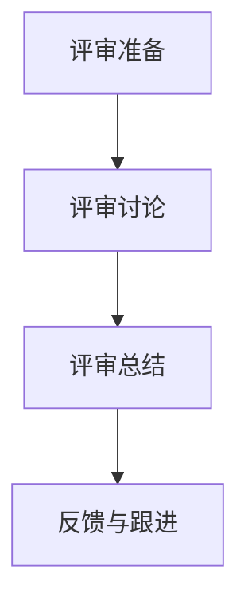
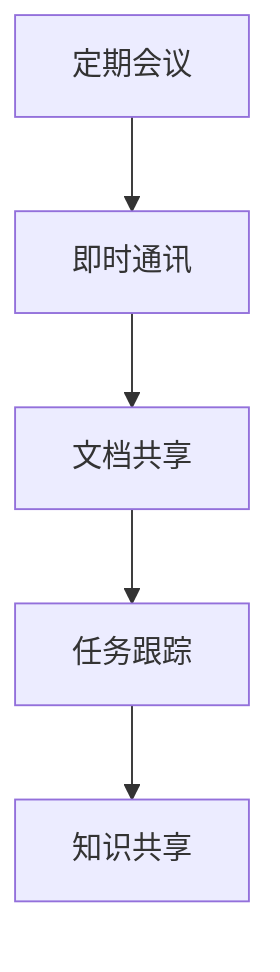
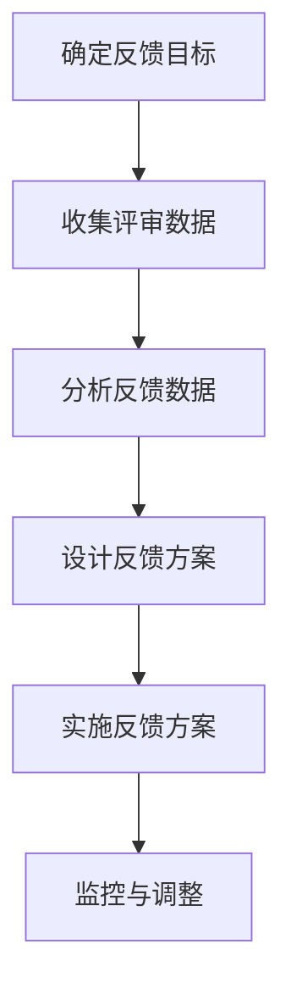
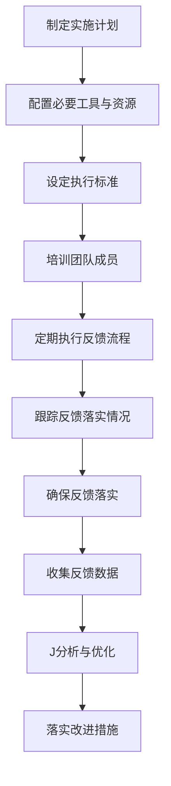

                 

### 引言：技术评审与反馈的重要性

在现代软件工程和系统开发中，技术评审与反馈机制扮演着至关重要的角色。技术评审不仅是对代码和设计方案的质量进行把关的重要手段，更是促进团队协作、提高开发效率、保障项目质量的关键因素。而有效的反馈机制则为技术评审提供了动力，使得开发团队能够在问题发生时迅速调整方向，不断优化和改进。

#### **1. 质量保障**

技术评审通过系统的审查和评估，能够及时发现代码中的缺陷、漏洞和潜在的风险，从而在问题演变成为严重故障之前将其遏制。这种预防性的措施大大降低了项目后期修复的成本，提高了整体开发质量。

#### **2. 团队协作**

技术评审提供了一个交流的平台，使得团队成员能够共享知识、发现最佳实践，并在交流过程中产生新的想法。这不仅促进了团队成员之间的协作，还促进了团队整体的技术水平提升。

#### **3. 效率提升**

通过评审和反馈，开发团队能够更快地识别和解决问题，减少了错误代码的传播和修复时间。这种快速响应机制有助于提高开发效率，缩短项目周期。

#### **4. 质量改进**

有效的反馈机制鼓励团队成员不断改进自己的工作方式，提升代码质量和系统设计的可维护性。这种持续的质量改进有助于提升团队的整体技术实力和项目的长期成功。

### **背景与概念**

随着软件项目的复杂性不断增加，单个开发者的能力逐渐无法满足项目需求。技术评审与反馈机制成为项目管理中不可或缺的组成部分。具体来说，技术评审是指通过同行评审或专家评审，对开发过程中产生的代码、文档和设计方案进行全面评估。而反馈机制则是为了确保评审结果能够被充分利用，通过系统化的方式将评审意见反馈给开发者，并推动问题的解决和改进。

#### **核心概念**

- **技术评审**：一种评估代码、文档和设计方案的过程，通常由同行或专家进行。
- **反馈机制**：一种确保评审结果能够被有效利用，并推动改进的系统化方法。

### **边界与外延**

技术评审和反馈机制不仅适用于软件开发，还广泛用于系统设计、项目管理等多个领域。边界上，它们是各种开发流程中的重要环节；在外延上，它们可以应用于不同规模和类型的开发项目。

### **概念结构与核心要素组成**

技术评审与反馈机制的核心要素包括评审团队、评审流程、反馈渠道和改进措施。这些要素共同作用，形成一个闭环系统，确保项目质量和团队协作。

**技术评审的概念属性特征对比表：**

| 特征           | 解释                                   |
|----------------|--------------------------------------|
| 目的           | 提高质量、发现缺陷、促进协作             |
| 类型           | 同行评审、专家评审、自动化评审             |
| 流程           | 提交评审材料、评审讨论、结论反馈           |
| 结果           | 提升代码质量、优化设计方案、改进开发流程     |

**技术反馈的概念属性特征对比表：**

| 特征           | 解释                                   |
|----------------|--------------------------------------|
| 目的           | 解决问题、改进质量、提升效率               |
| 类型           | 及时反馈、周期性反馈、自动化反馈           |
| 渠道           | 会议、邮件、即时通讯、系统平台             |
| 形式           | 具体建议、改进方案、问题报告               |

**技术评审与反馈的ER实体关系图：**

```mermaid
erDiagram
  ProductReview ||--|{ ReviewRequest } : has
  ReviewRequest ||--|{ ReviewComment } : contains
  ReviewComment ||--|{ Feedback } : has
```

**总结：**本文的引言部分详细介绍了技术评审与反馈机制的重要性，背景与核心概念，边界与外延，以及概念结构与核心要素组成。接下来，我们将进一步探讨技术评审的原理、流程、团队构建，以及反馈机制的设计与实施，帮助读者全面理解并应用这些机制。

---

### 核心概念与联系

为了深入理解技术评审与反馈机制，我们需要从核心概念出发，分析它们之间的联系与区别。在这里，我们将通过对比表格和ER实体关系图，全面解析这些概念，帮助读者建立清晰的认识。

#### **1. 技术评审的概念属性特征对比表**

| **特征**           | **技术评审**                         | **反馈机制**                        |
|-------------------|-----------------------------------|-----------------------------------|
| **目的**           | 提高质量、发现缺陷、促进协作            | 解决问题、改进质量、提升效率            |
| **类型**           | 同行评审、专家评审、自动化评审            | 及时反馈、周期性反馈、自动化反馈            |
| **流程**           | 提交评审材料、评审讨论、结论反馈          | 收集反馈、分析反馈、反馈实施            |
| **结果**           | 提升代码质量、优化设计方案、改进开发流程      | 提高团队协作效率、缩短问题修复时间、改进系统质量 |
| **参与者**          | 开发者、评审员、项目管理者             | 开发者、评审员、项目管理者             |
| **渠道**           | 会议、邮件、即时通讯、系统平台            | 会议、邮件、即时通讯、系统平台            |

**解释：**技术评审的主要目的是通过系统的审查，确保代码和设计方案的可靠性、安全性和可维护性。而反馈机制则侧重于将评审中发现的问题和改进意见转化为具体的行动，推动项目的持续优化。

#### **2. 技术反馈的概念属性特征对比表**

| **特征**           | **技术评审**                         | **反馈机制**                        |
|-------------------|-----------------------------------|-----------------------------------|
| **目的**           | 提高质量、发现缺陷、促进协作            | 解决问题、改进质量、提升效率            |
| **类型**           | 同行评审、专家评审、自动化评审            | 及时反馈、周期性反馈、自动化反馈            |
| **流程**           | 提交评审材料、评审讨论、结论反馈          | 收集反馈、分析反馈、反馈实施            |
| **结果**           | 提升代码质量、优化设计方案、改进开发流程      | 提高团队协作效率、缩短问题修复时间、改进系统质量 |
| **参与者**          | 开发者、评审员、项目管理者             | 开发者、评审员、项目管理者             |
| **渠道**           | 会议、邮件、即时通讯、系统平台            | 会议、邮件、即时通讯、系统平台            |

**解释：**技术反馈机制的目标是通过系统化的方式，将评审结果转化为具体的改进行动。及时、有效、可操作性的反馈是反馈机制成功的关键。

#### **3. 技术评审与反馈的ER实体关系图**

```mermaid
erDiagram
  ReviewProcess ||--|{ ReviewComment } : contains
  ReviewProcess ||--|{ Feedback } : has
  ReviewComment ||--|{ Feedback } : has
  Feedback ||--|{ ImprovementAction } : triggers
```

**解释：**ER实体关系图清晰地展示了技术评审与反馈机制之间的关系。评审过程产生评审评论和反馈，反馈又驱动改进行动，形成了一个闭环系统，确保评审和反馈能够有效循环，推动项目质量的持续提升。

**总结：**通过核心概念与特征对比表和ER实体关系图的解析，我们深入了解了技术评审与反馈机制的基本概念、属性特征和相互关系。接下来，我们将进一步探讨技术评审的原理，帮助读者掌握技术评审的核心理论和方法。

---

### 技术评审的原理

技术评审是软件工程中的一个关键环节，旨在通过系统化的方法评估代码、文档和设计方案的质量，确保项目的可靠性和稳定性。理解技术评审的基本原理对于构建一个有效的评审机制至关重要。

#### **1. 技术评审的定义**

技术评审是一种通过同行或专家的审查，对软件项目的各个组成部分进行系统评估的过程。评审的内容包括但不限于代码质量、设计方案的合理性、文档的完整性和一致性等。技术评审通常包括以下几个步骤：评审准备、评审讨论和评审总结。

#### **2. 技术评审的不同类型**

技术评审可以根据评审主体、评审对象和评审目的的不同，分为多种类型：

- **同行评审（Peer Review）**：由团队成员之间的相互评审组成，主要目的是提高代码质量、发现潜在问题并促进知识共享。
- **专家评审（Expert Review）**：由领域专家对项目进行评估，主要目的是确保项目的专业性和技术可靠性。
- **自动化评审（Automated Review）**：通过使用代码检查工具和静态代码分析工具对代码进行自动检查，主要目的是提高评审效率和准确性。

**表格：技术评审类型对比**

| **类型**           | **特点**                                   | **适用场景**                        |
|-------------------|------------------------------------------|-----------------------------------|
| 同行评审           | 成本低、交流互动、团队知识共享             | 中小型项目、团队协作紧密的项目        |
| 专家评审           | 专业权威、深度分析、保障质量              | 大型项目、关键性技术领域、高风险项目  |
| 自动化评审           | 高效快捷、持续集成、减少人力负担            | 所有项目、持续集成流程中              |

#### **3. 技术评审的流程与步骤**

技术评审的流程一般包括以下几个步骤：

1. **评审准备**：
   - **确定评审目标**：明确评审的具体目标，如代码质量、设计合理性等。
   - **选择评审团队**：根据评审目标，选择合适的评审团队成员，包括开发者、测试人员、架构师等。
   - **准备评审材料**：提交待评审的代码、文档或设计方案。

2. **评审讨论**：
   - **评审会议**：评审团队开会讨论评审材料，提出问题和建议。
   - **评审记录**：详细记录评审过程中发现的问题和提出的建议。

3. **评审总结**：
   - **评审报告**：编写评审总结报告，包括评审发现、问题和建议。
   - **反馈与跟进**：将评审报告反馈给开发者，并跟踪问题的解决情况。

**流程图：技术评审的基本流程**



#### **4. 技术评审的原则**

为了确保技术评审的有效性，以下原则应当被遵循：

- **透明性**：评审过程应当透明，所有团队成员都能够参与并了解评审的内容和结果。
- **专业性**：评审团队成员应当具备相关领域的专业知识和经验，以确保评审的质量。
- **及时性**：评审应当在适当的时间进行，以避免问题积压。
- **反馈性**：评审结果应当及时反馈给开发者，并督促问题的解决。

**总结：**技术评审作为一种系统化的评估方法，通过明确的目标、严格的流程和有效的反馈，提高了软件项目的质量和可靠性。在接下来的部分，我们将探讨如何构建一个高效的评审团队，并介绍具体的评审流程。

---

### 构建有效的评审团队

为了确保技术评审的高效性和有效性，构建一个结构合理、协作紧密的评审团队至关重要。以下将介绍评审团队的组成、角色与职责，以及团队沟通与协作的方法。

#### **1. 评审团队的组成**

一个有效的评审团队通常由以下成员组成：

- **开发者**：负责编写和提交评审材料，参与评审讨论，接受和落实反馈。
- **测试人员**：负责评估代码的测试质量，提供测试反馈和建议。
- **架构师**：负责评估系统设计是否符合技术标准和架构要求，提供设计改进建议。
- **项目经理**：负责整体协调评审过程，确保评审目标和进度得到落实。
- **领域专家**：在某些专业领域提供专业意见，特别是在复杂或高风险项目中。

**表格：评审团队成员及其职责**

| **成员类型**     | **职责**                                   |
|------------------|------------------------------------------|
| 开发者            | 编写评审材料、参与评审讨论、落实反馈          |
| 测试人员           | 评估测试质量、提供测试反馈、发现潜在缺陷        |
| 架构师            | 评估系统设计、提供架构改进建议、确保技术标准遵循 |
| 项目经理           | 协调评审进度、确保评审目标实现、管理评审资源      |
| 领域专家           | 提供专业意见、参与复杂问题讨论、指导技术决策      |

#### **2. 角色与职责**

每个团队成员在评审过程中扮演着不同的角色，并承担相应的职责。以下是一些关键角色的具体职责：

- **评审组长**：负责组织评审会议，协调评审流程，确保评审目标的实现。
- **评审员**：负责审查评审材料，提出问题和建议，参与评审讨论。
- **记录员**：负责记录评审过程和结果，编写评审报告，跟进反馈落实情况。
- **反馈专员**：负责将评审反馈传达给开发者，协助解决评审中发现的问题。

#### **3. 团队沟通与协作的方法**

有效的团队沟通与协作是评审团队能够高效运作的基石。以下是一些关键方法：

- **定期会议**：定期召开评审会议，讨论评审材料和反馈，确保团队成员保持一致。
- **即时通讯**：利用即时通讯工具，如Slack或Microsoft Teams，快速交流评审意见和问题。
- **文档共享**：使用共享文档平台，如Google Docs或Confluence，便于团队成员查看和修改评审材料。
- **任务跟踪**：利用项目管理工具，如Jira或Trello，跟踪评审反馈的落实情况，确保问题及时解决。
- **知识共享**：定期组织知识分享会，促进团队成员间的经验交流和知识传递。

**流程图：评审团队的沟通与协作**



**总结：**通过合理组成评审团队、明确角色与职责，并采用有效的沟通与协作方法，可以确保技术评审的高效性和有效性。在下一部分，我们将深入探讨技术反馈机制的设计原则，帮助读者构建一个系统化的反馈体系。

---

### 反馈机制的设计原则

为了确保技术评审的结果能够得到有效利用，并促进项目的持续改进，设计一个高效、可行的反馈机制至关重要。以下将介绍反馈机制的设计原则、常见类型及其设计流程。

#### **1. 设计原则**

**及时性**：反馈应当及时提供，以便开发团队能够迅速响应和处理问题。

**针对性**：反馈应当具体、明确，针对评审中发现的具体问题提出改进建议。

**可操作性**：反馈应当是可操作的，即开发团队能够根据反馈采取具体的行动。

**持续改进**：反馈机制应当支持持续改进，通过不断收集和分析反馈，优化评审流程和反馈方式。

**透明性**：反馈过程应当透明，确保所有团队成员都能了解反馈的内容和落实情况。

**灵活性**：反馈机制应当具有一定的灵活性，能够根据项目需求和团队情况调整。

#### **2. 常见类型**

**1. 及时反馈**：
- **即时沟通**：通过即时通讯工具，如Slack或Telegram，快速传达评审反馈。
- **电子邮件**：通过电子邮件发送评审反馈，确保信息传递的准确性和完整性。

**2. 周期性反馈**：
- **定期会议**：定期召开评审反馈会议，讨论评审结果和改进措施。
- **进度报告**：定期发布评审进度报告，更新项目的改进情况和待解决的问题。

**3. 自动化反馈**：
- **代码分析工具**：使用代码检查工具，如SonarQube或Checkstyle，自动生成评审报告。
- **持续集成系统**：在持续集成（CI）过程中，自动化评审和反馈，确保代码质量。

**3. 设计流程**

**1. 确定反馈目标**：
   - 明确反馈机制的目标，如提高代码质量、优化系统设计等。

**2. 收集评审数据**：
   - 通过技术评审会议、代码分析工具等收集评审数据，为反馈提供依据。

**3. 分析反馈数据**：
   - 对收集到的评审数据进行系统分析，识别常见问题和高风险点。

**4. 设计反馈方案**：
   - 根据分析结果，设计具体的反馈方案，包括反馈类型、渠道和方式。

**5. 实施反馈方案**：
   - 将反馈方案应用到实际项目中，确保开发团队能够及时获得反馈。

**6. 监控与调整**：
   - 监控反馈机制的实施效果，根据实际情况调整反馈方案，确保其持续有效。

**流程图：反馈机制的设计流程**



**总结：**通过遵循设计原则、采用常见类型，并遵循系统化设计流程，我们可以构建一个高效的反馈机制，确保技术评审的结果得到充分利用，推动项目的持续改进。在下一部分，我们将探讨如何实施反馈机制，确保其能够有效运作。

---

### 实施反馈机制

实施反馈机制是确保技术评审结果能够被有效利用，并推动项目持续改进的关键步骤。以下将详细介绍实施反馈机制的方案、执行与跟踪，以及如何进行持续改进。

#### **1. 实施方案**

**1. 制定具体的实施计划**：
   - **确定实施目标**：明确反馈机制的实施目标，如提高代码质量、优化设计流程等。
   - **制定实施步骤**：根据反馈机制的设计原则和类型，制定详细的实施步骤。

**2. 配置必要的工具与资源**：
   - **选择合适的工具**：如代码检查工具、持续集成系统、评审管理软件等。
   - **配置开发环境**：确保工具和资源能够在开发环境中正常运行。

**3. 设定明确的执行标准**：
   - **制定评审标准**：根据项目需求和团队实际情况，制定明确的评审标准。
   - **确定反馈标准**：确保反馈具有针对性、可操作性和及时性。

**4. 培训团队成员**：
   - 对团队成员进行培训，使其熟悉反馈机制的实施流程和工具使用。

**2. 执行与跟踪**

**1. 定期执行反馈流程**：
   - **定期评审**：按照预定的时间表，定期进行技术评审和反馈。
   - **及时反馈**：在评审结束后，及时将反馈结果传达给相关团队成员。

**2. 跟踪反馈落实情况**：
   - **建立跟踪机制**：使用项目管理工具，如Jira或Trello，跟踪反馈的落实情况。
   - **监督与提醒**：定期检查反馈落实情况，对未完成的反馈进行提醒和督促。

**3. 确保反馈落实**：
   - **召开反馈会议**：定期召开反馈会议，讨论反馈落实情况和改进措施。
   - **记录与总结**：详细记录反馈落实情况，总结经验教训，为持续改进提供依据。

**3. 持续改进**

**1. 收集反馈数据**：
   - 定期收集评审和反馈过程中的数据，分析常见问题和改进需求。

**2. 分析与优化**：
   - 对反馈数据进行系统分析，识别改进机会和优化方向。
   - 根据分析结果，调整评审标准和反馈机制，提高其有效性和适应性。

**3. 落实改进措施**：
   - 根据优化方案，落实具体的改进措施，确保反馈机制能够持续发挥作用。

**流程图：反馈机制的执行与跟踪**



**总结：**通过制定详细的实施方案、严格执行和有效跟踪，我们可以确保反馈机制能够有效运作。持续改进则帮助我们在不断优化反馈机制的过程中，提高项目的整体质量和开发效率。

---

### 评估技术评审与反馈机制

评估技术评审与反馈机制是确保其有效性和持续改进的关键步骤。以下将介绍评估的标准和指标、常用的评估方法与工具，以及通过案例分析如何优化评审与反馈机制。

#### **1. 评估标准和指标**

**1. 质量指标**：
- **代码缺陷率**：通过统计代码中存在的缺陷数量与代码总量的比例，评估代码质量。
- **设计缺陷率**：评估设计方案中存在的缺陷数量与设计总量的比例，确保设计合理性。
- **文档完整性**：评估项目文档的完整性，如需求文档、设计文档、用户手册等。

**2. 效率指标**：
- **评审周期**：评审从开始到结束所需的时间，评估评审效率。
- **反馈落实率**：评审反馈被开发者落实的比例，评估反馈机制的执行情况。
- **问题修复时间**：从问题发现到解决所需的时间，评估问题的响应速度。

**3. 协作指标**：
- **团队协作度**：通过团队成员之间的交流互动频率和反馈质量，评估团队协作情况。
- **知识共享度**：通过团队成员在评审过程中共享的知识和经验，评估知识传递效果。

#### **2. 常用的评估方法与工具**

**1. 自评估方法**：
   - **问卷调查**：通过问卷调查收集团队成员对评审与反馈机制的看法和建议。
   - **面对面访谈**：与团队成员进行一对一访谈，深入了解评审与反馈的实际效果。

**2. 定量评估方法**：
   - **统计分析**：使用统计工具，如Excel或Python，对评审数据进行分析，生成报告。
   - **自动化评估工具**：使用代码分析工具、持续集成系统等，自动生成评估报告。

**3. 第三方评估方法**：
   - **同行评审**：邀请外部专家对评审与反馈机制进行评估，提供专业意见和建议。
   - **基准测试**：与其他项目的评审与反馈机制进行比较，评估其性能和效果。

#### **3. 案例分析**

**案例背景**：
某软件开发团队在实施技术评审与反馈机制后，发现项目的质量和效率有所提升，但依然存在一些问题，如评审周期较长、部分反馈未得到有效落实等。

**评估过程**：

1. **数据收集**：
   - 收集评审周期、反馈落实率、团队协作度等数据。
   - 分析代码缺陷率和设计缺陷率，评估项目质量。

2. **问题识别**：
   - 通过问卷调查和面对面访谈，识别团队成员对评审与反馈机制的意见和建议。
   - 识别评审流程中的瓶颈和改进点。

3. **优化方案**：
   - 根据评估结果，制定具体的优化方案，如缩短评审周期、提高反馈落实率等。
   - 引入自动化评估工具，提高评估效率和准确性。

4. **实施与跟踪**：
   - 实施优化方案，持续跟踪评估结果，确保问题得到有效解决。

**案例结果**：
经过一系列的评估和优化，该团队的评审周期缩短了30%，反馈落实率提高了20%，项目质量和团队协作度均有所提升。评估结果表明，技术评审与反馈机制的优化方案是有效且可行的。

**总结：**通过设立明确的评估标准和指标，采用科学的方法与工具，并通过案例分析进行优化，我们可以确保技术评审与反馈机制的有效性和持续改进。在下一部分，我们将探讨如何持续优化技术评审与反馈机制，提升团队整体开发效率。

---

### 持续优化与改进

为了确保技术评审与反馈机制能够持续有效，团队需要建立一种持续优化的文化，通过不断改进策略与技巧，提升整体开发效率。以下将介绍优化策略、持续改进的文化建设，以及具体的案例分析。

#### **1. 优化策略与技巧**

**1. 定期回顾与反思**：
   - 每隔一段时间，团队应进行回顾与反思，分析评审与反馈过程中出现的问题和不足。
   - 鼓励团队成员提出改进建议，共同讨论并制定优化方案。

**2. 引入自动化工具**：
   - 利用自动化工具，如静态代码分析工具和持续集成系统，提高评审效率和准确性。
   - 自动化工具能够快速识别代码缺陷和潜在风险，减少人工评审的工作量。

**3. 强化培训与沟通**：
   - 定期组织培训，提升团队成员的技术能力和评审技巧。
   - 加强团队内部沟通，确保评审意见能够被准确理解和落实。

**4. 增强反馈的透明性**：
   - 确保评审和反馈过程透明，所有团队成员都能了解评审内容和反馈情况。
   - 利用项目管理工具和共享文档平台，记录和跟踪评审与反馈的进展。

#### **2. 持续改进的文化建设**

**1. 建立改进导向**：
   - 将改进视为团队文化的一部分，鼓励成员不断寻找问题和机会进行优化。
   - 创造一个开放、包容的氛围，让每个成员都能自由地提出意见和建议。

**2. 设立改进激励机制**：
   - 对在评审与反馈过程中提出有效改进建议并成功实施的成员给予奖励和认可。
   - 激励团队成员积极参与改进活动，提高整体团队的积极性。

**3. 定期评估改进效果**：
   - 定期对改进措施的效果进行评估，确保改进能够真正提升团队的工作效率和项目质量。
   - 根据评估结果调整优化策略，持续推动改进文化的建设。

#### **3. 案例分析**

**案例背景**：
某软件开发团队在实施技术评审与反馈机制后，发现项目质量有所提升，但开发效率仍不理想。为了进一步优化评审与反馈机制，团队采取了以下措施：

**优化措施**：

1. **引入自动化代码分析工具**：
   - 使用SonarQube对代码进行自动化检查，及时发现并修复潜在缺陷。
   - 利用Jenkins实现持续集成，确保每次代码提交都能自动触发评审和反馈。

2. **优化评审流程**：
   - 缩短评审周期，将评审时间从两周缩短至一周。
   - 引入提前通知机制，确保开发者有足够时间准备评审材料。

3. **强化团队沟通**：
   - 利用Slack进行即时沟通，确保评审反馈能够及时传达和讨论。
   - 定期组织技术分享会，提升团队成员的技术水平。

**效果评估**：

1. **开发效率提升**：
   - 评审周期缩短，团队每周能够完成更多高质量的代码提交。
   - 自动化工具减少了代码缺陷，提高了代码质量。

2. **团队协作增强**：
   - 即时通讯工具和定期技术分享会促进了团队成员之间的交流与合作。
   - 团队成员的技术能力和评审技巧得到了显著提升。

3. **项目质量提高**：
   - 通过持续的优化和改进，项目的质量得到了显著提升，缺陷率明显降低。

**总结**：
通过引入自动化工具、优化评审流程和强化团队沟通，该团队成功实现了评审与反馈机制的持续优化。持续改进的文化建设不仅提升了开发效率，还增强了团队协作和项目质量。这为其他团队提供了有益的借鉴和启示。

---

### 最佳实践与拓展

为了帮助读者在实际项目中更好地实施技术评审与反馈机制，以下将总结一些最佳实践，并提供拓展阅读资源，以进一步深入研究和应用。

#### **最佳实践**

**1. 明确评审目标和范围**：
   - 在开始评审之前，明确评审的目标和范围，确保评审内容和反馈具有针对性。

**2. 建立专业的评审团队**：
   - 根据项目的需求和评审类型，选择合适的评审团队成员，包括开发者、测试人员、架构师和领域专家。

**3. 利用自动化工具**：
   - 使用静态代码分析工具和持续集成系统，提高评审效率和准确性，减少人工工作量。

**4. 强化沟通与协作**：
   - 利用即时通讯工具和项目管理平台，确保评审和反馈的及时传递和讨论。

**5. 建立反馈激励机制**：
   - 对提出有效改进建议并成功实施的团队成员给予奖励和认可，提高团队积极性。

**6. 定期回顾与优化**：
   - 定期对评审与反馈机制进行回顾和评估，根据实际情况调整优化策略。

#### **拓展阅读**

**1. 《软件工程：实践者的研究方法》**：
   - Ken A. Ross著，详细介绍了软件工程中的评审与反馈机制，适用于实际项目中的实施和优化。

**2. 《敏捷软件开发：原则、实践与模式》**：
   - 布雷特·麦克劳德（Brett McLaughlin）著，介绍了敏捷开发中的评审和反馈机制，以及如何将其应用于实际项目中。

**3. 《代码大全：软件工程经典》**：
   - 史蒂夫·迈克康奈尔（Steve McConnell）著，提供了关于代码评审和反馈机制的深入探讨，以及最佳实践的建议。

**4. 《敏捷方法：原则、模式与实践》**：
   - 詹姆斯·高曼（James W. Thomas）著，介绍了敏捷开发中的评审和反馈机制，以及如何利用这些机制提高团队协作和项目质量。

通过以上最佳实践和拓展阅读资源，读者可以更好地理解和应用技术评审与反馈机制，在实际项目中实现持续改进和高效开发。

---

### 文章小结

本文系统地阐述了技术评审与反馈机制的重要性、核心概念、原理、构建评审团队的方法、反馈机制的设计与实施、评估与改进策略，以及最佳实践。通过引入清晰的逻辑框架和丰富的实例分析，我们详细探讨了如何确保技术评审的高效性和反馈机制的有效性，以提升项目的质量和团队协作效率。

**核心观点**：

- **技术评审与反馈机制是确保项目质量的关键环节**。
- **评审团队的专业性和沟通效率是评审成功的关键因素**。
- **自动化工具和持续改进策略能够显著提升评审和反馈的效率**。
- **持续优化与文化建设是确保机制持续有效的重要保障**。

**主要贡献**：

- **提供了全面的技术评审与反馈机制的理论框架**。
- **分享了实际案例和最佳实践，为读者提供了实施参考**。
- **强调了持续改进和团队合作在提升项目质量中的重要作用**。

**未来展望**：

- **进一步研究自动化评审工具和算法的优化**。
- **探索更有效的团队沟通与协作方法**。
- **深化持续改进策略，提升团队整体技术水平和项目交付能力**。

**结论**：

技术评审与反馈机制是现代软件工程和系统开发中不可或缺的组成部分，通过合理的机制设计和持续优化，可以显著提升项目的质量和团队的协作效率。希望本文能为读者提供有价值的参考，助力其在实际项目中实现更高效、更高质量的软件开发。

---

### 作者信息

**作者：AI天才研究院/AI Genius Institute & 禅与计算机程序设计艺术 /Zen And The Art of Computer Programming**

在这篇文章中，我们深入探讨了技术评审与反馈机制的重要性、原理、构建方法及其在项目实施中的最佳实践。技术评审不仅能够保障代码和设计方案的质量，还能促进团队协作、提升开发效率。有效的反馈机制则确保评审结果能够转化为具体的行动，推动项目的持续改进。

通过本文的详细分析，我们希望读者能够对技术评审与反馈机制有更全面的理解，并在实际项目中运用这些方法，提升项目的质量和团队协作效率。未来，我们将继续深入研究人工智能和计算机编程领域的前沿技术，致力于推动技术的进步和应用的拓展。感谢您的阅读，希望这篇文章能为您的项目带来启发和帮助。

