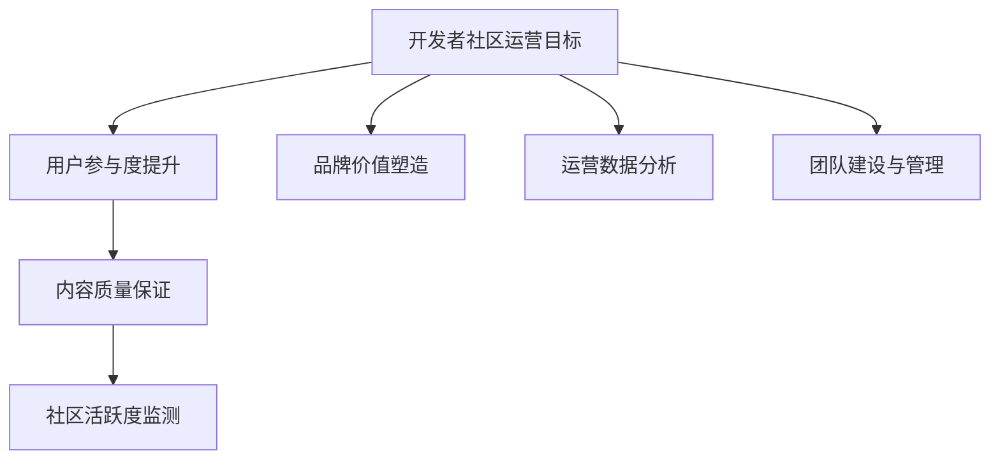
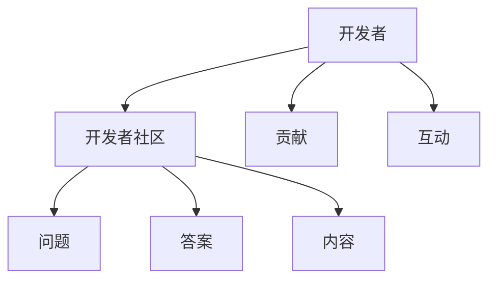

                 

# 开发者社区运营：建立活跃的技术社区

## 关键词：开发者社区、运营策略、活跃度提升、成功实践

## 摘要

随着数字化转型的加速，开发者社区作为技术交流和创新的重要平台，其活跃度直接影响着技术生态的健康成长。本文将围绕开发者社区运营，通过逻辑清晰的步骤分析和思考，探讨如何建立并维护一个活跃的技术社区。我们将从社区概述、运营策略与实施、活跃度提升策略、品牌建设与推广、运营数据分析与优化以及团队建设与管理等方面进行深入探讨，并结合成功案例分析，为开发者社区运营提供实用的指导和建议。

## 1. 引言

### 1.1 背景介绍

在当今快速变化的技术环境中，开发者社区已成为技术创新和知识共享的重要阵地。开发者社区不仅促进了技术的传播，还为开发者提供了一个互动交流的平台，有助于解决技术难题、分享经验、探索新趋势。然而，如何运营一个活跃、有价值的开发者社区，仍然是一个挑战。

### 1.2 问题描述

开发者社区面临的挑战包括用户参与度低、内容质量参差不齐、社区氛围不健康等。这些问题不仅影响了社区的活跃度，还阻碍了其价值的实现。因此，如何有效地运营开发者社区，提升其活跃度，已成为行业关注的热点问题。

### 1.3 问题解决

本文将提出一系列策略和方法，旨在帮助开发者社区运营者解决上述问题。通过详细的步骤分析和实践指导，我们将为开发者社区运营提供有力的支持和建议。

### 1.4 边界与外延

本文的研究将重点关注开发者社区运营的核心要素，包括社区定位、运营策略、活跃度提升、品牌建设、数据分析与优化以及团队建设等方面。同时，我们也将探讨这些要素之间的相互作用和影响。

### 1.5 概念结构与核心要素组成

开发者社区运营涉及多个核心概念和要素，如社区目标、用户参与、内容质量、活跃度提升、品牌价值等。以下是一个简单的概念结构与核心要素组成图：

## 2. 开发者社区概述

### 2.1 核心概念

开发者社区是一个由开发者组成的在线平台，旨在促进技术交流和知识共享。它不仅为开发者提供了一个学习、讨论和解决问题的场所，还是技术创新和协作的重要推动力。

### 2.2 概念属性特征对比表格

| 特征         | 定义                                                         | 对比分析                                                     |
| ------------ | ------------------------------------------------------------ | ------------------------------------------------------------ |
| 开放性       | 开发者可以自由加入和退出社区，参与讨论和贡献内容             | 与封闭式社区相比，开放性使得社区资源更丰富，用户参与度更高     |
| 参与性       | 开发者积极参与社区活动，包括提问、回答、分享经验等           | 高参与性有助于提升社区活跃度，促进知识传播                     |
| 互动性       | 社区成员之间进行积极的交流和互动，解决技术难题，共同进步     | 互动性是社区核心价值之一，有助于建立紧密的社区氛围             |
| 专业性       | 社区内容专注于技术领域，具有高专业性和高质量                   | 与其他非技术性社区相比，专业性是开发者社区的重要特征           |
| 可持续性     | 社区能够长期稳定运营，不断吸引新的用户和贡献者               | 可持续性是社区健康发展的基础，需要持续的运营和维护支持         |

### 2.3 ER实体关系图架构

以下是一个简单的ER实体关系图，描述了开发者社区的核心实体及其关系：

## 3. 开发者社区运营策略

### 3.1 社区运营目标与定位

开发者社区运营的首要任务是明确社区的目标和定位。社区目标应该包括以下几个方面：

- 促进技术交流：为开发者提供一个交流平台，分享技术经验和知识。
- 解决技术难题：建立问答系统，帮助开发者解决实际问题。
- 推广技术创新：鼓励开发者分享新技术、新工具和新方法。
- 培养社区氛围：建立积极、友好、互助的社区文化。

### 3.2 社区运营策略

为了实现上述目标，开发者社区需要采取一系列运营策略：

- **内容策略**：确保社区内容的质量和多样性，包括技术文章、教程、案例研究等。
- **互动策略**：鼓励社区成员之间的互动，包括提问、回答、讨论、分享等。
- **推广策略**：通过多种渠道宣传社区，吸引更多开发者加入。
- **活动策略**：定期举办线上或线下活动，增强社区成员的参与感和归属感。

### 3.3 社区运营实施步骤

社区运营的实施可以分为以下几个步骤：

1. **需求调研**：了解开发者需求，确定社区的核心主题和方向。
2. **平台搭建**：选择合适的社区平台，搭建基础框架。
3. **内容生产**：鼓励社区成员贡献内容，同时引入外部专家和内容创作者。
4. **互动管理**：建立互动机制，确保社区成员之间的积极交流。
5. **活动组织**：策划并组织线上或线下活动，增强社区凝聚力。
6. **数据分析**：定期分析社区数据，优化运营策略。

### 3.4 社区管理方法

社区管理是确保社区健康发展的关键。以下是一些有效的社区管理方法：

- **用户管理**：对用户进行分类和管理，确保社区安全。
- **内容审核**：建立内容审核机制，确保社区内容的质量和合规性。
- **活动管理**：策划和组织社区活动，提升用户参与度。
- **反馈机制**：建立反馈渠道，及时回应用户需求和问题。

### 3.5 社区激励措施

为了提升社区活跃度，可以采取以下激励措施：

- **积分制度**：根据用户贡献度发放积分，积分可以兑换礼品或特权。
- **排名奖励**：定期发布活跃用户排名，给予物质或精神奖励。
- **专家访谈**：邀请技术专家进行访谈，分享经验和见解。
- **竞赛活动**：举办技术竞赛，鼓励开发者展示自己的才能。

### 3.6 社区风险管理

社区运营过程中，需要关注以下风险：

- **内容风险**：确保社区内容的质量和安全，防止不良信息的传播。
- **法律风险**：遵守相关法律法规，避免侵权行为。
- **安全风险**：保护用户隐私和数据安全，防止网络攻击。
- **运营风险**：合理规划社区资源，避免运营失误。

### 3.7 案例分析：成功开发者社区运营实践

**Docker 社区**：Docker 是一个开源的容器化平台，其社区以其活跃度和高质量著称。Docker 社区成功运营的关键在于：

- **内容丰富**：提供大量的教程、文档、案例研究，满足开发者需求。
- **互动积极**：活跃的问答区和讨论区，鼓励开发者之间的互动。
- **活动频繁**：定期举办技术大会和在线研讨会，提升社区凝聚力。
- **品牌建设**：通过品牌活动，如 DockerCon，增强社区的品牌影响力。

## 4. 读者反馈与拓展

### 4.1 书籍受众定位与适用人群

本文适合以下人群阅读：

- 开发者社区运营者：了解社区运营的核心策略和方法，提升社区活跃度。
- 技术管理人员：掌握技术社区运营的最佳实践，推动技术创新和知识共享。
- 开发者：获取技术交流和解决问题的平台，提升个人技能和职业发展。

### 4.2 书籍特色与创新点

本文的特色和创新点包括：

- **实践性**：结合成功案例分析，提供实用的运营策略和实践指导。
- **系统性**：从多个维度深入探讨开发者社区运营，形成完整的运营体系。
- **全面性**：覆盖社区运营的各个方面，包括内容、互动、活动、品牌等。

### 4.3 读者学习建议与反馈渠道

建议读者：

- 结合实际经验，分析并应用文中提出的策略和方法。
- 参与社区讨论，提出自己的见解和问题，与其他读者交流。
- 关注技术动态，不断更新和优化社区运营策略。

反馈渠道：

- 本文下方评论区：欢迎读者留言讨论，分享经验和见解。
- 社交媒体：关注本文作者的社交媒体账号，获取更多技术资讯和交流机会。

### 4.4 拓展阅读与后续研究建议

后续研究可以关注以下方向：

- 开发者社区运营中的新兴技术趋势，如区块链、人工智能等。
- 开发者社区国际化运营的策略和实践，促进全球化合作。
- 开发者社区与学术界的合作模式，推动技术研究和应用。

## 5. 第二部分：开发者社区运营策略与实施

### 5.1 开发者社区概述

开发者社区是一个由开发者组成的在线平台，旨在促进技术交流和知识共享。它为开发者提供了一个互动交流的空间，使他们能够分享经验、解决技术难题、探索新技术趋势。开发者社区的核心目标包括：

- **技术交流**：提供一个开放的平台，让开发者能够分享他们的知识和经验，共同学习成长。
- **知识共享**：鼓励开发者贡献内容，包括技术文章、教程、案例研究等，形成丰富的知识库。
- **社区建设**：通过互动和活动，培养积极、友好的社区文化，增强成员的归属感。

开发者社区的重要性体现在以下几个方面：

- **促进技术创新**：通过社区交流，开发者可以快速了解最新的技术动态和趋势，推动技术创新。
- **解决技术难题**：开发者社区提供了一个问答平台，成员可以在其中提问和回答问题，共同解决技术难题。
- **知识积累**：开发者社区通过内容贡献和共享，积累了大量的技术资料，成为开发者学习和成长的重要资源。
- **职业发展**：开发者可以在社区中展示自己的技能和成果，提升个人知名度，拓展职业发展机会。

### 5.2 开发者社区运营目标与定位

开发者社区运营的目标和定位决定了社区的发展方向和运营策略。以下是一些关键的运营目标和定位：

#### 目标

1. **用户增长**：吸引更多的开发者加入社区，提升社区的用户基数。
2. **内容丰富**：提供高质量、多样化的内容，满足开发者的学习需求。
3. **互动活跃**：鼓励开发者之间的互动，提升社区的活跃度。
4. **品牌建设**：建立社区的品牌形象，提升社区的影响力和知名度。
5. **持续发展**：确保社区能够长期稳定运营，不断吸引新的用户和贡献者。

#### 定位

1. **技术主题**：社区应聚焦于特定的技术领域，如前端开发、后端开发、人工智能等，以便为开发者提供专业的技术资源。
2. **受众群体**：明确社区的受众群体，如初级开发者、中级开发者、高级开发者或行业专家等，以满足不同层次开发者的需求。
3. **内容类型**：社区应涵盖多种类型的内容，包括技术文章、教程、案例研究、视频教程、直播课程等。
4. **互动形式**：社区应提供多样化的互动形式，如问答、讨论区、论坛、聊天室等，以促进开发者之间的交流和合作。
5. **社区文化**：建立积极、友好、互助的社区文化，鼓励开发者积极参与社区活动，共同维护社区氛围。

### 5.3 开发者社区运营策略

为了实现上述目标和定位，开发者社区需要采取一系列运营策略：

#### 内容策略

1. **内容审核**：建立内容审核机制，确保社区内容的质量和合规性，防止低质量、有害信息的传播。
2. **内容多样化**：提供多种类型的内容，如技术文章、教程、视频教程、案例研究等，满足不同开发者的需求。
3. **内容更新频率**：定期发布新内容，保持社区的活力，吸引开发者持续关注。

#### 互动策略

1. **问答机制**：建立完善的问答系统，鼓励开发者提问和回答问题，解决技术难题。
2. **讨论区**：设置多个主题的讨论区，促进开发者之间的讨论和交流。
3. **直播和研讨会**：定期举办直播和研讨会，邀请行业专家分享经验和见解，提升社区的专业性。

#### 推广策略

1. **社交媒体推广**：利用社交媒体平台，如微博、微信、Twitter 等，宣传社区活动和内容，吸引更多开发者加入。
2. **合作伙伴关系**：与相关机构、企业建立合作伙伴关系，共同推广社区，扩大影响力。
3. **线上和线下活动**：组织线上和线下活动，如技术大会、研讨会、沙龙等，提升社区的品牌知名度。

#### 活动策略

1. **主题沙龙**：定期举办主题沙龙，邀请行业专家和技术爱好者分享经验和见解。
2. **技术竞赛**：举办技术竞赛，鼓励开发者展示自己的才能，提升社区活力。
3. **公益活动**：组织公益活动，如技术培训、编程马拉松等，回馈开发者社区。

### 5.4 开发者社区实施步骤

实施开发者社区运营可以分为以下几个步骤：

#### 第一步：需求调研

1. **确定社区目标**：明确社区的目标和定位，确保社区发展方向与开发者的需求相符。
2. **调研开发者需求**：通过问卷调查、访谈等方式，了解开发者对社区的需求，包括内容类型、互动形式、活动偏好等。

#### 第二步：平台搭建

1. **选择社区平台**：根据社区目标和发展需求，选择合适的社区平台，如Discourse、PHPWind、Discuz！等。
2. **搭建基础框架**：配置服务器、数据库、用户管理等基本功能，确保社区能够正常运行。

#### 第三步：内容生产

1. **鼓励内容贡献**：建立内容贡献机制，鼓励开发者撰写技术文章、教程、案例研究等。
2. **引入外部专家**：邀请行业专家和技术创作者，贡献高质量的内容，提升社区的专业性。

#### 第四步：互动管理

1. **建立问答系统**：建立问答系统，提供技术问题的解答，促进开发者之间的交流和互动。
2. **管理讨论区**：设置讨论区管理员，负责监督讨论区的秩序，确保讨论的积极性。

#### 第五步：活动组织

1. **策划活动**：根据社区目标和开发者需求，策划和组织线上或线下活动，如技术沙龙、研讨会、技术竞赛等。
2. **活动推广**：通过社交媒体、合作伙伴关系等方式，宣传社区活动，吸引更多开发者参与。

#### 第六步：数据分析

1. **用户行为分析**：通过数据分析，了解用户行为，优化社区运营策略。
2. **内容分析**：分析社区内容的表现，提升内容质量和多样性。

#### 第七步：持续优化

1. **定期反馈**：收集社区成员的反馈和建议，及时调整运营策略。
2. **技术升级**：定期升级社区平台，提高用户体验，确保社区稳定运行。

### 5.5 开发者社区管理方法

开发者社区管理是确保社区健康发展和成员满意度的重要环节。以下是一些有效的社区管理方法：

#### 用户管理

1. **用户分类**：根据用户的技术水平、活跃度等因素，对用户进行分类和管理。
2. **权限设置**：根据用户的角色和权限，设置不同的访问权限和功能权限。
3. **用户行为监控**：监控用户的行为，及时发现和处理违规行为。

#### 内容管理

1. **内容审核**：建立内容审核机制，确保社区内容的质量和合规性。
2. **内容分类**：对社区内容进行分类，方便用户快速查找和阅读。
3. **内容更新**：定期更新社区内容，保持社区的新鲜感和活力。

#### 互动管理

1. **问答管理**：建立问答管理系统，确保问题的及时解答和互动的积极性。
2. **讨论区管理**：设置讨论区管理员，监督讨论区的秩序，确保讨论的积极性和友好性。
3. **活动管理**：建立活动管理系统，负责活动策划、组织、推广和反馈。

#### 活动管理

1. **活动策划**：根据社区目标和开发者需求，策划和组织有针对性的活动。
2. **活动推广**：通过社交媒体、合作伙伴关系等方式，宣传社区活动，吸引更多开发者参与。
3. **活动反馈**：收集活动反馈，总结活动经验，不断优化活动策划和组织。

#### 反馈机制

1. **用户反馈**：建立用户反馈渠道，收集用户对社区运营的反馈和建议。
2. **定期评估**：定期评估社区运营效果，优化运营策略。
3. **持续改进**：根据用户反馈和评估结果，不断改进社区运营和管理方法。

### 5.6 开发者社区激励措施

为了提升开发者社区的活跃度和用户满意度，可以采取一系列激励措施：

#### 积分制度

1. **积分获取**：用户可以通过参与社区活动、回答问题、贡献内容等方式获取积分。
2. **积分兑换**：用户可以使用积分兑换社区提供的礼品、优惠券等。
3. **积分排名**：定期发布积分排名，激励用户积极参与社区互动和贡献。

#### 奖励制度

1. **优秀贡献者奖励**：对在社区中表现出色的贡献者，给予物质奖励或荣誉证书。
2. **优秀回答者奖励**：对在问答区中给出优秀回答的用户，给予奖励，鼓励更多用户参与问答。
3. **活动奖励**：在社区活动中设置奖品，激励用户积极参与。

#### 专家访谈

1. **邀请专家**：定期邀请行业专家进行访谈，分享他们的经验和见解。
2. **专家问答**：举办专家问答活动，让开发者有机会直接与专家交流，解决技术难题。
3. **专家专栏**：建立专家专栏，发布专家的文章和分享，提升社区的专业性。

#### 竞赛活动

1. **技术竞赛**：举办技术竞赛，鼓励开发者展示自己的技能和成果。
2. **创新奖项**：设立创新奖项，奖励在技术上有创新性贡献的开发者。
3. **展示平台**：为参赛者提供展示平台，提升他们的知名度和影响力。

### 5.7 开发者社区风险管理

在开发者社区运营过程中，风险管理至关重要，以下是一些常见的社区风险和管理策略：

#### 内容风险

1. **内容审核**：建立严格的审核机制，确保社区内容的质量和合规性。
2. **侵权处理**：发现侵权内容，及时删除并追究侵权者的责任。
3. **版权保护**：保护原创内容，防止未经授权的转载和复制。

#### 法律风险

1. **合规管理**：确保社区运营符合相关法律法规，如网络安全法、个人信息保护法等。
2. **合同审查**：与合作方签订合同，明确双方的权利和义务，防范法律风险。
3. **法律咨询**：定期咨询专业律师，确保社区运营的合法性和合规性。

#### 安全风险

1. **数据安全**：采取加密技术，确保用户数据的安全。
2. **网络安全**：加强网络安全防护，防范网络攻击和黑客入侵。
3. **隐私保护**：保护用户隐私，不泄露用户个人信息。

#### 运营风险

1. **资源管理**：合理规划社区资源，避免资源浪费和运营失误。
2. **风险管理**：建立风险预警机制，及时发现和应对运营风险。
3. **应急预案**：制定应急预案，确保在突发事件时能够迅速响应和处置。

### 5.8 案例分析：成功开发者社区运营实践

**GitHub 社区**：GitHub 是一个全球最大的代码托管平台和开发者社区，其成功运营的经验值得借鉴。

1. **内容丰富**：GitHub 提供了大量的开源代码和文档，吸引了无数开发者前来学习和贡献。
2. **互动积极**：GitHub 的仓库和问题页面鼓励开发者之间的互动，解决了大量的技术难题。
3. **品牌建设**：GitHub 通过举办全球性的开发大会和活动，提升了品牌影响力和社区凝聚力。
4. **安全可靠**：GitHub 采用严格的审核机制和加密技术，确保了社区内容的安全和用户的隐私。

### 5.9 读者反馈与拓展

#### 反馈渠道

- **评论区**：欢迎读者在本文下方评论区留言，分享自己的见解和问题。
- **社交媒体**：关注本文作者的社交媒体账号，获取更多技术资讯和交流机会。

#### 拓展阅读

- **相关书籍**：《GitHub 运维之道》、《技术管理实战：从优秀到卓越》
- **相关文章**：《如何运营一个成功的开发者社区》、《社区运营实战：从入门到精通》

### 5.10 本章小结

本章详细介绍了开发者社区运营的策略与实施，包括社区概述、运营目标与定位、运营策略、实施步骤、管理方法、激励措施、风险管理和成功案例分析。通过本章的学习，读者可以了解到开发者社区运营的核心要素和实践方法，为建立和运营一个成功的开发者社区提供指导。

## 6. 第三部分：技术社区活跃度提升策略

### 6.1 技术社区活跃度概述

技术社区的活跃度是衡量社区健康程度和用户参与度的重要指标。一个活跃的技术社区能够吸引更多开发者加入，促进知识的传播和技术的创新。活跃度可以通过多种方式衡量，如发帖数量、回复率、用户参与度、活动参与度等。提升技术社区活跃度需要从多个方面入手，包括内容建设、互动策略、活动策划、用户激励等。

### 6.2 提升技术社区活跃度的策略与方法

为了提升技术社区的活跃度，可以采取以下策略和方法：

#### 1. 内容建设策略

- **高质量内容生产**：确保社区内容的质量和多样性，包括技术文章、教程、案例分析、视频教程等。高质量的内容能够吸引开发者关注和分享。
- **内容多样化**：提供多种类型的内容，满足不同开发者的需求。例如，对于新手开发者，可以提供入门教程和基础文章；对于高级开发者，可以提供高级技术和创新案例。
- **定期更新**：定期发布新内容，保持社区的新鲜感和活力。可以通过发布专栏、定期更新热门话题等方式，激发用户参与。

#### 2. 互动策略

- **问答系统优化**：优化问答系统，提供便捷的提问和回答机制，鼓励开发者提问和回答问题。可以设置热门问题、精选回答等栏目，提升用户的互动体验。
- **讨论区管理**：管理好讨论区，鼓励积极讨论，避免低质量内容和恶意攻击。可以设置讨论区管理员，负责维护讨论区的秩序。
- **互动活动**：举办线上或线下互动活动，如技术沙龙、研讨会、编程比赛等，增强社区成员的参与感。

#### 3. 活动策划

- **主题活动**：定期举办主题活动，如技术大会、编程马拉松、黑客松等，吸引开发者参与。可以通过奖金、奖品等方式激励参与者。
- **合作活动**：与相关机构、企业合作，共同举办活动，扩大影响力。例如，可以与大学合作举办编程竞赛，邀请知名企业进行技术分享。
- **线上活动**：利用线上平台举办活动，如直播、研讨会、网络研讨会等，方便更多开发者参与。

#### 4. 用户激励措施

- **积分制度**：建立积分制度，鼓励用户参与社区活动，回答问题，贡献内容。积分可以兑换礼品、优惠券等。
- **荣誉制度**：设立荣誉制度，对在社区中表现优秀的用户给予表彰和奖励，提升他们的知名度和影响力。
- **专家访谈**：邀请技术专家进行访谈，分享他们的经验和见解，提升社区的专业性和吸引力。

### 6.3 案例研究：提高技术社区活跃度的成功实践

**Stack Overflow**：Stack Overflow 是全球最大的开发者问答社区，其成功运营的经验对于提高技术社区活跃度具有重要参考价值。

1. **高质量内容**：Stack Overflow 提供了高质量的技术问答，吸引了大量开发者前来寻找解决方案和分享知识。
2. **互动机制**：Stack Overflow 优化了问答系统，提供了便捷的提问和回答机制，用户可以快速得到问题的解答。
3. **活动策划**：Stack Overflow 定期举办技术大会和在线研讨会，邀请知名开发者和技术专家分享经验和见解。
4. **用户激励**：Stack Overflow 设立了积分制度和荣誉制度，鼓励用户参与社区活动，贡献内容。

### 6.4 技术社区内容建设策略

技术社区的内容建设是提升社区活跃度的关键。以下是一些有效的内容建设策略：

#### 1. 内容规划

- **明确内容方向**：根据社区的目标和定位，明确内容主题和方向。例如，如果社区专注于前端开发，可以提供前端技术文章、教程和案例研究。
- **制定内容计划**：制定详细的内容发布计划，包括发布频率、内容类型和主题等。确保内容发布的连续性和系统性。

#### 2. 内容创作

- **鼓励用户创作**：鼓励社区成员创作内容，提供创作平台和指导。可以通过征文活动、内容奖励等方式激发用户的创作热情。
- **引入外部专家**：邀请行业专家和技术创作者，贡献高质量的内容，提升社区的专业性和权威性。

#### 3. 内容审核

- **内容审核机制**：建立严格的内容审核机制，确保社区内容的质量和合规性。审核标准应包括内容的真实性、准确性、相关性、专业性等。
- **用户反馈机制**：建立用户反馈机制，让用户参与内容审核，提出建议和意见。及时处理用户反馈，优化内容质量。

#### 4. 内容推广

- **内部推广**：在社区内部推广优质内容，例如通过推荐系统、热门话题、排行榜等方式，提高内容的曝光率。
- **外部推广**：利用社交媒体、合作伙伴关系等方式，宣传社区内容和活动，吸引更多开发者关注。

### 6.5 技术社区互动与沟通策略

互动与沟通是技术社区的核心价值之一。以下是一些有效的互动与沟通策略：

#### 1. 问答互动

- **优化问答系统**：提供便捷的提问和回答机制，确保用户能够快速得到问题的解答。可以设置热门问题、精选回答等栏目，提升用户的互动体验。
- **鼓励专业回答**：鼓励专业人士和经验丰富的开发者回答问题，提供高质量的解决方案。可以设置回答评级机制，奖励优秀回答者。

#### 2. 讨论区互动

- **管理好讨论区**：设立讨论区管理员，负责监督讨论区的秩序，确保讨论的积极性和友好性。可以设置讨论区规则，明确讨论的主题和范围。
- **主题讨论**：定期举办主题讨论，鼓励用户围绕特定话题进行深入讨论，促进知识的交流和创新。

#### 3. 线上互动

- **举办线上活动**：定期举办线上活动，如直播、研讨会、网络研讨会等，方便开发者参与。可以通过直播平台、社交媒体等方式，扩大活动的覆盖范围。
- **互动工具**：提供多种互动工具，如聊天室、投票、问卷调查等，增强用户之间的互动和沟通。

#### 4. 线下互动

- **举办线下活动**：定期举办线下活动，如技术沙龙、研讨会、编程马拉松等，增强社区成员的参与感和归属感。可以通过邀请行业专家、组织技术交流等方式，提升活动的质量。

### 6.6 技术社区用户激励机制

用户激励机制是提升技术社区活跃度的重要手段。以下是一些有效的用户激励机制：

#### 1. 积分制度

- **积分获取**：用户可以通过参与社区活动、回答问题、贡献内容等方式获取积分。积分可以用于兑换礼品、优惠券等。
- **积分兑换**：建立积分兑换机制，让用户可以用积分兑换社区提供的各种奖励，如书籍、电子产品、社区会员等。

#### 2. 奖励制度

- **优秀贡献者奖励**：对在社区中表现突出的贡献者，给予物质奖励或荣誉证书。例如，可以设立“最佳贡献者”、“最具价值专家”等奖项。
- **竞赛奖励**：举办技术竞赛，为获胜者提供奖品和荣誉，激励开发者展示自己的技能和成果。

#### 3. 专家访谈

- **邀请专家**：定期邀请行业专家进行访谈，分享他们的经验和见解。通过专家访谈，提升社区的专业性和影响力。
- **专家专栏**：建立专家专栏，发布专家的文章和分享，让更多开发者受益。

#### 4. 社区荣誉

- **设立社区荣誉**：对在社区中做出突出贡献的用户，授予荣誉称号，如“社区明星”、“社区领袖”等。这些荣誉可以提升用户的知名度和影响力。

### 6.7 技术社区活跃度监测与评估

监测和评估技术社区活跃度是确保社区健康发展的关键。以下是一些有效的监测与评估方法：

#### 1. 数据监测

- **用户行为数据**：通过数据分析工具，监控用户的行为数据，如发帖数量、回复数量、活动参与度等。这些数据可以反映社区的活跃程度。
- **互动数据**：分析互动数据，如问答系统的互动次数、讨论区的活跃度等，了解社区成员之间的互动情况。

#### 2. 用户反馈

- **用户调研**：通过问卷调查、访谈等方式，收集用户的反馈和建议。用户反馈可以反映社区运营的现状和改进方向。
- **用户满意度调查**：定期进行用户满意度调查，了解用户对社区的整体满意度。通过满意度调查，可以发现社区存在的问题和改进机会。

#### 3. 活动评估

- **活动效果评估**：对举办的活动进行效果评估，分析活动的参与人数、满意度、反馈意见等。通过活动评估，优化活动的策划和组织。
- **活动改进**：根据评估结果，对活动进行改进，提高活动的质量和效果。

### 6.8 案例分析：技术社区活跃度提升实践

**Dev.to**：Dev.to 是一个以技术博客和问答为核心的开发者社区，其成功提升活跃度的经验值得借鉴。

1. **内容建设**：Dev.to 提供了高质量的技术博客和问答内容，吸引了大量开发者加入。
2. **互动策略**：Dev.to 优化了问答系统，鼓励用户提问和回答问题，提升了社区的互动性。
3. **用户激励**：Dev.to 设立了积分制度和荣誉制度，激励用户参与社区活动，贡献内容。
4. **活动策划**：Dev.to 定期举办线上和线下活动，如技术沙龙、编程比赛等，增强了社区的活跃度。

### 6.9 读者反馈与拓展

#### 反馈渠道

- **评论区**：欢迎读者在本文下方评论区留言，分享自己的见解和问题。
- **社交媒体**：关注本文作者的社交媒体账号，获取更多技术资讯和交流机会。

#### 拓展阅读

- **相关书籍**：《社交网络分析》、《社区运营实战：从入门到精通》
- **相关文章**：《如何提升技术社区活跃度》、《技术社区运营之道》

### 6.10 本章小结

本章详细介绍了技术社区活跃度提升的策略与方法，包括内容建设、互动策略、活动策划、用户激励等。通过案例分析，读者可以了解到成功提升技术社区活跃度的实践经验和具体操作方法。通过本章的学习，读者可以掌握提升技术社区活跃度的关键策略，为自己的社区运营提供指导。

## 7. 第四部分：技术社区品牌建设与推广

### 7.1 技术社区品牌建设概述

技术社区品牌建设是提升社区影响力和用户忠诚度的重要途径。品牌建设不仅关系到社区在开发者心中的形象，还直接影响社区的长期发展。一个强大的品牌能够让社区在众多竞争者中脱颖而出，吸引更多开发者加入和参与。技术社区品牌建设主要包括品牌定位、价值观塑造、视觉识别系统等方面。

### 7.2 技术社区品牌定位与价值观

品牌定位是技术社区品牌建设的基础，决定了社区在开发者心中的形象和定位。以下是一些关键的定位策略：

1. **专业性**：明确社区的专业方向，如前端开发、后端开发、人工智能等，打造专业性的技术交流平台。
2. **创新性**：突出社区的创新精神，鼓励开发者分享新技术、新工具和新方法，推动技术进步。
3. **实用性**：提供实用性的技术内容，满足开发者解决实际问题的需求，提升社区的实际价值。
4. **友好性**：营造友好、互助的社区氛围，增强开发者之间的联系和互动。

品牌价值观是社区运营的指导思想，反映了社区的核心价值观和理念。以下是一些关键的品牌价值观：

1. **开放性**：鼓励开放的心态，欢迎不同背景和水平的开发者加入社区，共同学习成长。
2. **分享精神**：倡导分享知识，通过贡献内容、参与讨论，共同提升社区的整体水平。
3. **互惠互利**：强调互惠互利，通过社区的资源和平台，帮助开发者解决技术难题，实现个人和社区的双赢。
4. **持续进步**：鼓励开发者不断学习和进步，追求技术创新和个人成长。

### 7.3 技术社区品牌视觉识别系统

品牌视觉识别系统是品牌建设的重要组成部分，通过统一的视觉元素，如标志、颜色、字体等，传达社区的品牌形象和价值观。以下是一些关键的品牌视觉识别系统策略：

1. **标志设计**：设计简洁、独特、易于识别的标志，反映社区的专业性和创新性。标志可以结合技术元素，如代码、算法等，增加品牌的辨识度。
2. **色彩选择**：选择具有专业性和视觉冲击力的色彩，如蓝色、绿色等，传达技术、科技和创新的形象。同时，色彩应保持一致性，增强品牌的识别度。
3. **字体设计**：选择清晰、易读、有辨识度的字体，如衬线体或非衬线体，确保品牌信息的传达效果。字体应与标志和色彩保持一致，形成统一的视觉体验。
4. **应用场景**：确保品牌视觉识别系统在不同应用场景下，如网站、海报、宣传册等，保持一致性和连贯性，提升品牌的整体形象。

### 7.4 技术社区品牌传播策略

品牌传播是提升技术社区品牌知名度和影响力的关键步骤。以下是一些有效的品牌传播策略：

1. **社交媒体推广**：利用社交媒体平台，如微博、微信、Twitter 等，发布社区活动、内容更新、用户故事等，吸引开发者关注和参与。
2. **内容营销**：通过高质量的内容营销，如技术文章、案例研究、视频教程等，提升社区的权威性和专业性。可以邀请行业专家进行访谈，分享他们的见解和经验。
3. **合作伙伴关系**：与相关机构、企业建立合作伙伴关系，共同推广社区，扩大品牌影响力。可以通过合作活动、联合推广等方式，实现共赢。
4. **线下活动**：举办线下活动，如技术沙龙、研讨会、编程比赛等，增强社区成员的参与感和归属感。可以通过媒体报道、社交媒体宣传等方式，扩大活动的影响力。
5. **广告投放**：在开发者聚集的平台和网站上进行广告投放，如技术论坛、开发者社区等，提升品牌的曝光率和知名度。

### 7.5 技术社区线上线下活动策划

线上线下活动是技术社区品牌建设的重要手段，能够增强社区成员的参与感和归属感。以下是一些活动策划的关键点：

1. **活动主题**：确定明确的活动主题，如技术趋势、编程比赛、创新分享等，确保活动具有吸引力和针对性。
2. **活动形式**：根据活动主题，选择合适的活动形式，如讲座、研讨会、编程比赛、黑客松等。可以结合线上和线下形式，满足不同用户的参与需求。
3. **活动筹备**：提前筹备活动，包括确定时间、地点、嘉宾、内容等。可以通过问卷调查、预告宣传等方式，提前告知用户，提高活动的参与度。
4. **活动推广**：通过社交媒体、官方网站、合作伙伴渠道等，宣传活动内容和时间，吸引更多用户参与。
5. **活动反馈**：活动结束后，收集用户反馈，总结活动经验和不足，为下一次活动提供改进方向。

### 7.6 技术社区合作伙伴关系建立

合作伙伴关系是提升技术社区品牌影响力的重要手段。以下是一些关键的合作关系建立策略：

1. **目标明确**：明确合作目标，如推广社区、扩大用户群体、共同举办活动等，确保合作方向一致。
2. **资源整合**：根据合作伙伴的资源优势，整合双方的资源，实现优势互补。例如，可以共同举办活动、共享用户资源等。
3. **合作模式**：选择合适的合作模式，如联合推广、资源共享、活动合作等。可以根据实际情况，灵活调整合作模式，实现最佳效果。
4. **沟通协作**：建立良好的沟通协作机制，确保合作过程中的信息畅通和问题解决。可以通过定期会议、邮件沟通等方式，保持合作双方的紧密联系。

### 7.7 技术社区品牌推广案例分析

**GitHub 社区**：GitHub 是全球最大的代码托管和开发者社区，其品牌推广的成功经验具有借鉴意义。

1. **社交媒体推广**：GitHub 利用社交媒体平台，如 Twitter、LinkedIn 等，发布社区动态、用户故事、技术趋势等内容，吸引了大量开发者关注。
2. **内容营销**：GitHub 发布高质量的技术文章、教程、案例研究等，提升了社区的权威性和专业性。
3. **合作伙伴关系**：GitHub 与多家知名企业、教育机构建立合作关系，共同推广社区，扩大影响力。
4. **活动策划**：GitHub 定期举办技术大会、研讨会、编程比赛等活动，增强了社区的活跃度和用户参与感。

### 7.8 读者反馈与拓展

#### 反馈渠道

- **评论区**：欢迎读者在本文下方评论区留言，分享自己的见解和问题。
- **社交媒体**：关注本文作者的社交媒体账号，获取更多技术资讯和交流机会。

#### 拓展阅读

- **相关书籍**：《品牌营销实战》、《社交媒体营销》
- **相关文章**：《如何建立技术社区品牌》、《技术社区品牌推广策略》

### 7.9 本章小结

本章详细介绍了技术社区品牌建设与推广的策略与方法，包括品牌定位、价值观塑造、视觉识别系统、品牌传播策略、活动策划和合作伙伴关系建立等。通过案例分析，读者可以了解到成功的技术社区品牌建设经验，为自己的社区运营提供参考。通过本章的学习，读者可以掌握技术社区品牌建设的关键要素，提升社区的品牌影响力和用户忠诚度。

## 8. 第五部分：技术社区运营数据分析与优化

### 8.1 技术社区运营数据分析概述

技术社区运营数据分析是提升社区运营效率和效果的关键步骤。通过数据分析，运营团队可以深入了解用户行为、内容表现和社区活跃度，从而制定更加精准的运营策略。数据分析工具和技巧的选择、用户画像分析、内容分析和互动行为分析是技术社区运营数据优化的重要环节。

### 8.2 数据分析工具与技巧

#### 1. 数据分析工具

技术社区运营常用的数据分析工具有：

- **Google Analytics**：一款功能强大的网站分析工具，可以监控用户流量、行为和转化率等。
- **Matomo**：一款开源的网站分析工具，提供了丰富的报表和自定义功能，适合中小型社区使用。
- **Kibana**：一款基于Elasticsearch的数据可视化工具，可以处理和分析大量的社区数据。
- **Tableau**：一款专业的数据可视化工具，能够将复杂的数据转化为直观的图表和报告。

#### 2. 数据分析技巧

有效运用以下数据分析技巧，可以提高数据解读和分析的效率：

- **数据可视化**：通过图表和图形，将复杂的数据转化为直观的信息，帮助运营团队快速理解数据趋势和问题。
- **趋势分析**：分析社区用户行为和内容表现的趋势，识别高峰和低谷，为运营决策提供依据。
- **用户细分**：将用户按照不同的维度进行细分，如活跃度、兴趣、行为等，以便更好地理解和满足不同用户的需求。
- **关联分析**：分析不同指标之间的关联性，如用户行为和内容表现之间的关系，发现潜在的问题和机会。
- **异常检测**：识别社区中的异常行为和事件，如异常高的发帖量或异常低的用户参与度，及时采取应对措施。

### 8.3 技术社区用户画像分析

用户画像分析是了解社区用户特征和需求的重要手段。通过用户画像分析，运营团队可以更好地定位用户群体，制定针对性的运营策略。以下是一个简单的用户画像分析步骤：

1. **收集用户数据**：从社区系统中提取用户行为数据，如注册信息、发帖记录、回答记录、互动频率等。
2. **数据清洗**：清洗和整理用户数据，去除重复、无效和错误的数据，确保数据的准确性和完整性。
3. **用户分类**：根据用户行为和特征，将用户分为不同的群体，如新手开发者、中级开发者、高级开发者等。
4. **特征提取**：提取用户的关键特征，如年龄、性别、地域、职业、技术兴趣等，为用户画像提供详细的描述。
5. **用户画像构建**：将用户特征整合为一个综合的用户画像，用于指导运营决策。

以下是一个简单的用户画像示例：

| 用户特征       | 描述                         |
| -------------- | ---------------------------- |
| 年龄           | 25-34岁                      |
| 性别           | 男                         |
| 地域           | 北京                        |
| 职业           | 软件工程师                  |
| 技术兴趣       | 前端开发、人工智能、云计算   |
| 活动频率       | 每周至少访问一次社区         |
| 内容偏好       | 技术文章、案例分析、教程     |

### 8.4 技术社区内容分析

内容分析是提升社区内容质量和用户满意度的关键步骤。通过内容分析，运营团队可以了解用户对内容的偏好和反馈，从而优化内容生产和推广策略。以下是一个简单的内容分析步骤：

1. **内容分类**：将社区内容按照主题、类型、难度等维度进行分类，如技术文章、教程、案例分析、视频教程等。
2. **内容评估**：评估内容的质量和影响力，如阅读量、点赞数、评论数、分享量等。
3. **用户反馈**：收集用户对内容的反馈，如评论、投票、反馈表等，了解用户的满意度和改进意见。
4. **内容优化**：根据内容评估和用户反馈，对内容进行优化，如调整内容结构、增加相关链接、改进语言表达等。
5. **内容推广**：制定内容推广策略，如利用社交媒体、邮件营销、合作伙伴渠道等，提高内容的曝光率和传播效果。

### 8.5 技术社区互动行为分析

互动行为分析是了解社区用户互动模式和活跃度的关键步骤。通过互动行为分析，运营团队可以识别活跃用户和潜在问题，从而优化互动策略和社区管理。以下是一个简单的互动行为分析步骤：

1. **互动数据收集**：从社区系统中提取互动数据，如发帖记录、回复记录、点赞记录、评论记录等。
2. **行为分类**：根据用户互动行为，将行为分为不同的类别，如提问、回答、讨论、分享等。
3. **活跃度分析**：分析用户的活跃度，如发帖频率、回复频率、互动时长等，识别高活跃度和低活跃度的用户。
4. **互动模式分析**：分析用户互动的模式和规律，如热门话题、互动高峰时段等，为互动策略提供依据。
5. **问题识别**：识别社区中的潜在问题，如恶意评论、低质量回答、不良互动等，及时采取应对措施。

### 8.6 数据驱动的社区优化策略

数据驱动的社区优化策略是基于数据分析结果，制定和调整社区运营策略的过程。以下是一些数据驱动的社区优化策略：

1. **内容优化**：根据内容分析结果，调整内容类型、结构和发布频率，提高内容的吸引力和用户满意度。
2. **互动激励**：根据互动行为分析结果，制定互动激励措施，如积分制度、排名奖励等，提升用户互动积极性。
3. **活动策划**：根据用户画像和互动行为分析，策划和举办符合用户兴趣和需求的活动，提高活动参与度和效果。
4. **用户体验**：根据用户反馈和数据分析，优化社区功能和用户体验，如改进界面设计、提升加载速度、增加互动功能等。
5. **社区管理**：根据数据分析结果，优化社区管理策略，如调整管理员职责、改进内容审核机制等，提升社区整体运营效率。

### 8.7 技术社区案例分析：数据优化实践

**Stack Overflow**：Stack Overflow 是全球最大的开发者问答社区，其成功运营得益于数据驱动的社区优化策略。

1. **内容优化**：Stack Overflow 通过分析用户行为数据，识别热门问题和热门话题，调整内容发布策略，确保提供用户感兴趣的内容。
2. **互动激励**：Stack Overflow 设立了积分制度和排名奖励，激励用户参与问答和讨论，提高社区活跃度。
3. **用户体验**：Stack Overflow 不断优化社区界面和功能，提高用户的使用体验，如改进搜索功能、优化问答系统等。
4. **社区管理**：Stack Overflow 通过数据分析，识别社区中的潜在问题，及时采取措施，如清理垃圾帖子、处理恶意评论等。

### 8.8 读者反馈与拓展

#### 反馈渠道

- **评论区**：欢迎读者在本文下方评论区留言，分享自己的见解和问题。
- **社交媒体**：关注本文作者的社交媒体账号，获取更多技术资讯和交流机会。

#### 拓展阅读

- **相关书籍**：《数据驱动运营》、《数据挖掘：实践指南》
- **相关文章**：《技术社区数据分析实战》、《如何利用数据分析优化技术社区运营》

### 8.9 本章小结

本章详细介绍了技术社区运营数据分析与优化的方法，包括数据分析工具与技巧、用户画像分析、内容分析和互动行为分析等。通过数据驱动的社区优化策略，读者可以了解到如何利用数据提升技术社区运营效率和效果。本章的学习有助于读者掌握技术社区运营数据分析的核心技能，为自己的社区运营提供有力支持。

## 9. 第六部分：技术社区风险管理

### 9.1 技术社区风险管理概述

技术社区在运营过程中可能会面临多种风险，包括内容风险、法律风险、安全风险和运营风险等。风险管理是确保社区健康发展和用户安全的重要环节。有效的风险管理策略可以降低社区运营中的不确定性，提高社区的稳定性和可持续性。

### 9.2 风险识别与评估

风险识别与评估是风险管理的第一步。以下是一些常见的技术社区风险及其识别与评估方法：

#### 1. 内容风险

**风险识别**：内容风险主要包括低质量内容、侵权内容、不当言论等。

**评估方法**：通过内容审核机制，定期检查社区内容，识别和删除低质量、侵权或不当的内容。可以设置人工审核和自动化工具相结合的方式，提高风险识别的准确性。

#### 2. 法律风险

**风险识别**：法律风险包括侵权、隐私保护、合规性等问题。

**评估方法**：定期审查社区政策，确保社区运营符合相关法律法规。可以聘请专业律师进行法律咨询，评估社区运营中的潜在法律风险。

#### 3. 安全风险

**风险识别**：安全风险包括数据泄露、网络攻击、恶意软件等。

**评估方法**：采用安全测试工具，定期对社区系统进行安全扫描，识别和修复潜在的安全漏洞。可以设置安全监控机制，实时监测社区系统的运行状态，发现和应对安全事件。

#### 4. 运营风险

**风险识别**：运营风险包括资源不足、用户流失、服务质量下降等。

**评估方法**：通过数据分析，监控社区运营指标，如用户活跃度、内容质量、服务质量等。定期评估运营绩效，识别和解决运营中的问题。

### 9.3 风险应对策略

针对识别出的风险，需要制定相应的应对策略，确保社区的安全和稳定运营。以下是一些常见的风险应对策略：

#### 1. 内容风险管理

**策略**：

- **内容审核机制**：建立严格的内容审核机制，确保社区内容的质量和合规性。可以设置管理员和内容审核团队，负责审核社区内容。
- **用户举报机制**：建立用户举报机制，鼓励用户举报低质量、侵权或不当内容。对举报内容进行快速处理，确保社区内容的健康。
- **版权保护**：采取版权保护措施，防止社区内容被未经授权的转载和复制。可以与版权机构合作，监控和维权。

#### 2. 法律风险管理

**策略**：

- **合规管理**：确保社区运营符合相关法律法规，如网络安全法、个人信息保护法等。可以设置合规专员，负责审查和更新社区政策。
- **法律咨询**：定期聘请专业律师进行法律咨询，评估社区运营中的潜在法律风险。建立法律顾问制度，为社区运营提供法律支持。
- **知识产权保护**：加强对知识产权的保护，防止社区内容被侵权。可以与知识产权机构合作，开展知识产权保护活动。

#### 3. 安全风险管理

**策略**：

- **安全监控**：采用安全测试工具，定期对社区系统进行安全扫描，识别和修复潜在的安全漏洞。设置实时监控机制，及时发现和应对安全事件。
- **数据加密**：采取数据加密技术，确保用户数据的安全。可以采用SSL证书、数据加密软件等，提高数据传输和存储的安全性。
- **网络安全**：加强网络安全防护，防范网络攻击和黑客入侵。可以采用防火墙、入侵检测系统、防病毒软件等，提高社区的网络安全水平。

#### 4. 运营风险管理

**策略**：

- **资源管理**：合理规划社区资源，避免资源浪费和运营失误。可以设置资源管理专员，负责监控和调配社区资源。
- **服务质量管理**：提高服务质量，确保用户满意。可以通过用户反馈机制，及时发现和解决用户问题，提升社区服务质量。
- **应急预案**：制定应急预案，确保在突发事件时能够迅速响应和处置。可以设置应急响应团队，负责应急预案的制定和执行。

### 9.4 风险监控与预警机制

建立有效的风险监控与预警机制，是确保社区安全运营的重要手段。以下是一些关键的风险监控与预警机制：

#### 1. 风险监控

- **实时监控**：采用实时监控工具，监控社区系统的运行状态和用户行为。及时发现和应对异常情况，确保社区的安全和稳定。
- **日志分析**：定期分析社区日志，识别潜在的安全事件和运营问题。可以设置日志分析工具，自动生成监控报表，提供决策依据。
- **用户行为分析**：通过用户行为分析，识别异常行为和潜在风险。可以采用行为分析工具，监控用户的登录、访问、操作等行为，及时发现异常。

#### 2. 预警机制

- **预警系统**：建立预警系统，实时监测社区中的异常情况和风险事件。可以通过短信、邮件、APP推送等方式，及时通知相关人员。
- **应急响应**：制定应急响应流程，确保在突发事件时能够迅速响应和处置。可以设置应急响应小组，负责应急预案的执行和协调。
- **风险报告**：定期生成风险报告，总结社区运营中的风险事件和应对措施。可以设置风险报告生成工具，自动生成风险报告，为决策提供参考。

### 9.5 技术社区法律合规风险

法律合规风险是技术社区运营中不可忽视的重要风险。以下是一些常见的法律合规风险及其应对措施：

#### 1. 个人信息保护

**风险**：社区在收集、处理和存储用户个人信息时，可能违反个人信息保护法。

**应对措施**：

- **隐私政策**：制定明确的隐私政策，告知用户个人信息的使用目的、范围和权限。
- **用户同意**：确保用户在注册和使用社区时，明确同意个人信息的使用。
- **数据安全**：采取数据加密、访问控制等技术措施，确保用户个人信息的安全。

#### 2. 知识产权保护

**风险**：社区内容可能存在侵权行为，如抄袭、盗用等。

**应对措施**：

- **版权声明**：在社区中明确声明所有内容的版权信息，告知用户侵权行为的法律责任。
- **版权监测**：定期进行版权监测，识别和删除侵权内容。
- **合作保护**：与版权机构合作，共同维护知识产权。

#### 3. 网络安全

**风险**：社区可能面临网络攻击、数据泄露等安全风险。

**应对措施**：

- **安全策略**：制定网络安全策略，包括访问控制、数据备份、应急响应等。
- **安全培训**：定期进行安全培训，提高用户的安全意识和应对能力。
- **安全审计**：定期进行安全审计，识别和修复安全隐患。

### 9.6 技术社区安全风险

技术社区安全风险是影响社区运营和用户信任的重要因素。以下是一些常见的安全风险及其应对措施：

#### 1. 数据泄露

**风险**：用户个人信息、社区数据等可能被黑客窃取或泄露。

**应对措施**：

- **数据加密**：采用数据加密技术，确保数据在传输和存储过程中的安全。
- **访问控制**：设置访问控制机制，限制对敏感数据的访问。
- **安全审计**：定期进行安全审计，识别和修复数据泄露风险。

#### 2. 网络攻击

**风险**：社区可能面临DDoS攻击、SQL注入等网络攻击。

**应对措施**：

- **防火墙**：部署防火墙，防止非法访问和攻击。
- **入侵检测**：部署入侵检测系统，实时监测网络攻击行为。
- **应急响应**：制定应急响应计划，快速应对网络攻击。

#### 3. 恶意软件

**风险**：社区中可能存在恶意软件，如病毒、木马等。

**应对措施**：

- **防病毒软件**：部署防病毒软件，定期扫描社区系统，清除恶意软件。
- **恶意软件监测**：部署恶意软件监测工具，实时监测和识别恶意软件。
- **用户教育**：提高用户的安全意识，防止恶意软件的传播。

### 9.7 案例分析：技术社区风险应对实践

**Reddit**：Reddit 是一个全球知名的社交新闻网站和开发者社区，其在风险管理和应对方面有许多成功的实践。

1. **内容管理**：Reddit 采取了严格的内容审核机制，确保社区内容的质量和合规性。通过用户举报和人工审核，Reddit 能够及时发现和处理低质量、侵权或不当内容。
2. **安全防护**：Reddit 采用了多种安全防护措施，包括防火墙、入侵检测系统和数据加密等，确保社区系统的安全运行。
3. **法律合规**：Reddit 与多家律师事务所合作，制定详细的隐私政策和版权政策，确保社区运营符合相关法律法规。
4. **用户教育**：Reddit 定期进行用户安全教育，提高用户的安全意识和应对能力，防止网络攻击和恶意软件的传播。

### 9.8 读者反馈与拓展

#### 反馈渠道

- **评论区**：欢迎读者在本文下方评论区留言，分享自己的见解和问题。
- **社交媒体**：关注本文作者的社交媒体账号，获取更多技术资讯和交流机会。

#### 拓展阅读

- **相关书籍**：《网络安全实战指南》、《风险管理实践》
- **相关文章**：《技术社区风险管理》、《如何应对技术社区的安全挑战》

### 9.9 本章小结

本章详细介绍了技术社区风险管理的概述、识别与评估、应对策略、监控与预警机制以及法律合规和安全风险等。通过案例分析，读者可以了解到成功的技术社区风险应对实践。本章的学习有助于读者掌握技术社区风险管理的核心技能，提升社区的安全性和稳定性。

## 10. 第七部分：技术社区运营团队建设与管理

### 10.1 技术社区运营团队概述

技术社区运营团队是确保社区健康发展和持续运营的关键。一个高效的运营团队能够有效地管理社区内容、促进用户互动、策划和组织活动，从而提升社区的价值和用户满意度。技术社区运营团队通常包括以下关键角色：

- **社区经理**：负责整体运营策略的制定和执行，协调团队工作，确保社区目标的实现。
- **内容编辑**：负责社区内容的策划、创作、审核和发布，确保内容的质量和多样性。
- **互动管理**：负责社区互动的管理，包括问答系统的运营、讨论区的维护、用户互动的促进等。
- **活动策划**：负责社区活动的策划、组织和推广，提升用户的参与度和社区活跃度。
- **数据分析**：负责社区数据收集、分析和报告，为运营决策提供数据支持。
- **技术支持**：负责社区平台的维护、升级和安全保障，确保社区的稳定运行。

### 10.2 团队组织结构与职责分工

一个高效的技术社区运营团队需要一个明确的组织结构和清晰的职责分工。以下是一个典型的团队组织结构和职责分工：

#### 组织结构

1. **社区管理团队**：由社区经理领导，负责制定和执行社区运营策略，协调各个职能小组的工作。
2. **内容团队**：由内容编辑、内容创作者和其他相关成员组成，负责内容策划、创作、审核和发布。
3. **互动团队**：由互动管理专员和其他相关成员组成，负责社区互动的管理和维护。
4. **活动团队**：由活动策划专员和其他相关成员组成，负责社区活动的策划、组织和推广。
5. **数据分析团队**：由数据分析专员和其他相关成员组成，负责社区数据收集、分析和报告。
6. **技术支持团队**：由技术支持专员和其他相关成员组成，负责社区平台的维护、升级和安全保障。

#### 职责分工

- **社区经理**：制定社区运营策略和目标，协调团队工作，确保社区目标的实现。负责社区的整体规划和方向，解决团队面临的重大问题。
- **内容编辑**：策划和创作社区内容，审核和发布内容，确保内容的质量和多样性。负责内容团队的管理，与其他团队成员协作，确保内容的顺利发布。
- **互动管理**：管理社区问答系统和讨论区，促进用户互动和讨论。负责互动团队的管理，与其他团队成员协作，提升社区的互动氛围。
- **活动策划**：策划和组织社区活动，推广活动，提升用户的参与度和社区活跃度。负责活动团队的管理，与其他团队成员协作，确保活动的顺利进行。
- **数据分析**：收集和整理社区数据，分析用户行为和内容表现，为运营决策提供数据支持。负责数据分析团队的管理，与其他团队成员协作，优化社区运营策略。
- **技术支持**：维护社区平台的稳定性，保障系统的正常运行。负责技术支持团队的管理，与其他团队成员协作，确保社区平台的稳定和安全。

### 10.3 团队成员能力提升策略

为了确保技术社区运营团队的持续发展和高效运营，团队成员的能力提升至关重要。以下是一些有效的团队成员能力提升策略：

#### 1. 在职培训

- **内部培训**：定期组织内部培训，提高团队成员的专业技能和知识水平。可以通过内部讲座、研讨会、工作坊等形式，分享最佳实践和经验。
- **外部培训**：鼓励团队成员参加外部培训课程和行业会议，学习最新的技术和行业动态。可以通过线上课程、线下培训、行业峰会等渠道，提升团队成员的专业能力。

#### 2. 继续教育

- **学历教育**：鼓励团队成员参加学历教育，提升学术水平和专业素养。可以通过在职研究生、MBA课程等形式，提高团队成员的管理能力和领导力。
- **在线学习**：利用在线学习平台，如Coursera、edX等，参加相关课程学习，获取专业证书和认证。这有助于团队成员不断提升自己的专业知识和技能。

#### 3. 职业发展规划

- **个性化发展**：为团队成员制定个性化的职业发展规划，根据其兴趣和特长，提供相应的培训和发展机会。可以通过一对一辅导、职业咨询等方式，帮助团队成员明确职业目标，制定发展路径。
- **轮岗机会**：提供轮岗机会，让团队成员在不同岗位上积累经验，提升综合素质。这有助于团队成员了解社区运营的各个方面，增强团队协作能力。

#### 4. 团队协作与沟通

- **团队建设活动**：定期组织团队建设活动，增强团队凝聚力。可以通过团队拓展、团队聚餐、团建旅游等形式，促进团队成员之间的交流和互动。
- **有效的沟通**：建立有效的沟通机制，鼓励团队成员开放沟通，分享想法和问题。可以通过定期的团队会议、项目汇报、邮件沟通等方式，确保信息的畅通和问题的及时解决。

### 10.4 团队协作与沟通

团队协作与沟通是确保技术社区运营团队高效运作的关键。以下是一些有效的团队协作与沟通策略：

#### 1. 明确目标和责任

- **制定明确的团队目标**：确保每个团队成员都清楚团队的目标和期望，增强团队凝聚力。可以通过团队会议、目标设定等形式，明确团队目标和责任。
- **分配明确的任务**：根据团队成员的能力和特长，合理分配任务，确保每个成员都有明确的职责。这有助于提升团队成员的工作积极性和责任感。

#### 2. 建立有效的沟通渠道

- **定期团队会议**：定期召开团队会议，讨论项目进展、问题解决和改进措施。这有助于团队成员了解项目整体进展，共同面对挑战。
- **实时沟通工具**：利用实时沟通工具，如Slack、Microsoft Teams、WhatsApp等，确保团队成员之间的实时沟通和信息共享。这有助于提升团队协作效率，及时解决问题。

#### 3. 促进知识共享

- **内部知识库**：建立内部知识库，收集和整理团队成员的经验和知识，实现知识共享。这有助于团队成员快速获取所需信息，提升工作效率。
- **经验分享会**：定期举办经验分享会，让团队成员分享自己的经验和见解。这有助于团队成员互相学习，共同进步。

#### 4. 鼓励创新和反馈

- **创新文化**：建立创新文化，鼓励团队成员提出新的想法和解决方案。可以设置创新奖，激励团队成员勇于尝试和创新。
- **反馈机制**：建立有效的反馈机制，鼓励团队成员提出意见和建议。可以通过定期的反馈会议、匿名反馈等方式，收集团队成员的反馈，改进团队工作。

### 10.5 团队管理方法

有效的团队管理方法是确保技术社区运营团队高效运作和持续发展的关键。以下是一些常用的团队管理方法：

#### 1. 目标管理

- **设定明确的团队目标**：确保每个团队成员都清楚团队的目标和期望，增强团队凝聚力。可以通过SMART原则（具体、可衡量、可实现、相关、时限性）设定目标。
- **目标分解和责任分配**：将团队目标分解为具体的任务和责任，分配给每个团队成员。这有助于明确每个成员的职责，提升工作效率。

#### 2. 激励与奖励

- **激励制度**：建立激励机制，激励团队成员积极工作。可以通过绩效奖金、项目奖金、荣誉证书等方式，奖励表现优秀的团队成员。
- **认可和表扬**：及时认可和表扬团队成员的成就和贡献，增强他们的工作动力和归属感。

#### 3. 绩效评估

- **设定绩效指标**：根据团队目标和任务，设定具体的绩效指标，如完成率、质量、效率等。
- **定期绩效评估**：定期对团队成员进行绩效评估，了解他们的工作表现和进步情况。通过绩效评估，发现团队中的问题，提供改进建议。

#### 4. 沟通与反馈

- **建立有效的沟通机制**：确保团队成员之间的信息畅通和有效沟通。可以通过定期的团队会议、项目汇报、一对一沟通等方式，促进团队成员之间的沟通和协作。
- **及时反馈**：及时给予团队成员反馈，帮助他们了解自己的工作表现，改进不足。可以通过定期的绩效反馈、工作总结等方式，提供具体的反馈和建议。

#### 5. 团队文化建设

- **塑造团队文化**：建立积极、友好、互助的团队文化，增强团队凝聚力。可以通过团队价值观、团队口号、团队活动等方式，塑造团队文化。
- **团队协作**：鼓励团队成员之间的协作和合作，共同完成任务。可以通过团队合作项目、团队竞赛等方式，提升团队协作能力。

### 10.6 团队绩效评估与激励机制

团队绩效评估与激励机制是确保技术社区运营团队高效运作和持续发展的重要环节。以下是一些关键点：

#### 1. 绩效评估指标

- **工作量**：根据团队成员的工作量，如任务完成数量、工作时间等，评估其工作表现。
- **工作质量**：根据团队成员的工作质量，如任务完成质量、工作成果等，评估其工作表现。
- **工作效率**：根据团队成员的工作效率，如完成任务的时间、工作效率等，评估其工作表现。
- **团队协作**：根据团队成员在团队协作中的表现，如沟通能力、协作效果等，评估其工作表现。

#### 2. 绩效评估方法

- **定量评估**：通过量化的指标，如工作量、工作质量、工作效率等，进行评估。这种方法客观、直观，但可能忽视团队成员的个性化表现。
- **定性评估**：通过主观的评估，如团队领导、同事的评价等，进行评估。这种方法更全面，但可能存在主观偏差。

#### 3. 激励机制

- **绩效奖金**：根据团队成员的绩效评估结果，发放绩效奖金。这可以激励团队成员努力工作，提高绩效。
- **晋升机会**：为表现优秀的团队成员提供晋升机会，提升其职业发展空间。这可以激励团队成员不断提升自己的能力和表现。
- **荣誉奖励**：为在团队中表现突出的团队成员颁发荣誉证书或奖品，增强其工作动力和归属感。这可以激励团队成员积极参与社区运营。

### 10.7 技术社区运营团队文化建设

团队文化建设是技术社区运营团队长期发展的基础。以下是一些关键点：

#### 1. 确立团队价值观

- **开放分享**：鼓励团队成员开放分享，共享知识和经验。这可以促进团队内部的协作和创新。
- **尊重信任**：建立相互尊重和信任的团队文化，增强团队成员之间的信任和合作。这可以提升团队凝聚力和工作效率。
- **持续学习**：鼓励团队成员持续学习，不断提升自己的技能和知识。这可以保持团队的竞争力，适应快速变化的技术环境。

#### 2. 建立团队活动

- **团队建设活动**：定期组织团队建设活动，如团建旅游、户外拓展等，增强团队成员之间的互动和信任。这可以提升团队的凝聚力和团队精神。
- **文化沙龙**：举办文化沙龙，让团队成员分享自己的文化见解和经验。这可以丰富团队文化，增强团队的文化认同感。

#### 3. 塑造团队形象

- **团队形象设计**：设计具有团队特色的标志、口号等，提升团队的识别度和形象。这可以在社区内外树立团队的形象和品牌。
- **品牌传播**：通过社交媒体、官方网站等渠道，宣传团队文化和成就，提升团队在社区中的影响力和知名度。这可以增强团队的社会认可度和影响力。

### 10.8 案例分析：技术社区运营团队建设实践

**GitHub**：GitHub 是全球最大的开发者社区，其在运营团队建设方面有许多成功的实践。

1. **团队文化建设**：GitHub 确立了开放分享、尊重信任和持续学习的团队价值观，建立了积极、友好、互助的团队文化。
2. **能力提升**：GitHub 为团队成员提供丰富的培训和学习机会，提升他们的专业技能和知识水平。
3. **激励机制**：GitHub 设立了绩效奖金、晋升机会和荣誉奖励等激励机制，激励团队成员努力工作，提升绩效。
4. **团队协作**：GitHub 强调团队合作，通过内部邮件、GitHub 内部仓库等工具，促进团队成员之间的协作和沟通。

### 10.9 读者反馈与拓展

#### 反馈渠道

- **评论区**：欢迎读者在本文下方评论区留言，分享自己的见解和问题。
- **社交媒体**：关注本文作者的社交媒体账号，获取更多技术资讯和交流机会。

#### 拓展阅读

- **相关书籍**：《团队管理实战》、《团队协作与沟通》
- **相关文章**：《技术社区团队建设与管理》、《如何打造高效的社区运营团队》

### 10.10 本章小结

本章详细介绍了技术社区运营团队建设与管理的概述、组织结构、职责分工、能力提升策略、团队协作与沟通、管理方法、绩效评估与激励机制以及团队文化建设等。通过案例分析，读者可以了解到成功的技术社区运营团队建设实践。本章的学习有助于读者掌握技术社区运营团队管理的核心技能，提升团队的整体绩效和社区的发展。

## 11. 第八部分：技术社区运营成功案例与启示

### 11.1 技术社区成功案例分析

技术社区的运营成功案例众多，以下列举几个具有代表性的案例，并分析其成功原因。

#### 1. GitHub

**背景**：GitHub 是一个基于 Git 的开源协作平台，自 2008 年成立以来，已成为全球最大的开发者社区。

**成功原因**：

- **开放性和透明度**：GitHub 强调开放性和透明度，使得开发者可以自由地贡献代码、提交问题和参与讨论。
- **强大的社交功能**：GitHub 集成了社交功能，如关注、点赞、分享等，使得开发者之间的互动更加便捷。
- **丰富的内容**：GitHub 提供了海量的开源项目和文档，满足了开发者学习和工作的需求。
- **社区活动**：GitHub 定期举办全球性的技术大会和编程马拉松，提升了社区的活跃度和影响力。

#### 2. Stack Overflow

**背景**：Stack Overflow 是一个问答式的开发者社区，成立于 2008 年，致力于帮助开发者解决编程问题。

**成功原因**：

- **高质量的内容**：Stack Overflow 强调内容的质量，通过投票和审核机制，筛选出高质量的问题和答案。
- **问答机制**：Stack Overflow 的问答机制设计合理，用户可以快速提问和回答问题，解决了大量的技术难题。
- **社区文化**：Stack Overflow 建立了积极的社区文化，鼓励开发者互相帮助，共同进步。
- **持续优化**：Stack Overflow 不断优化用户体验，提高网站的加载速度和稳定性，提升了用户满意度。

#### 3. Dev.to

**背景**：Dev.to 是一个以博客和问答为核心的开发者社区，成立于 2016 年，致力于分享知识和经验。

**成功原因**：

- **内容多样性**：Dev.to 提供了多种类型的内容，如技术博客、教程、视频等，满足了不同开发者的需求。
- **用户参与**：Dev.to 鼓励用户参与内容创作和讨论，通过积分制度和荣誉制度，激励用户贡献内容。
- **社区互动**：Dev.to 强调社区互动，通过线上和线下活动，增强了用户的参与感和归属感。
- **技术支持**：Dev.to 提供了强大的技术支持，包括代码高亮、Markdown 编辑器等，提升了用户体验。

### 11.2 案例启示与运营经验总结

从上述成功案例中，可以总结出以下运营经验：

1. **内容为王**：高质量的内容是技术社区的核心。要确保社区内容的丰富性、多样性和专业性，满足开发者的学习需求。
2. **用户体验**：提供良好的用户体验是提升社区活跃度的关键。要优化网站的加载速度、界面设计和交互体验，提高用户的满意度。
3. **用户互动**：鼓励用户互动和参与是提升社区活跃度的有效方法。要设计合理的问答机制、讨论区和管理方法，促进用户之间的交流。
4. **社区文化**：建立积极的社区文化，鼓励开发者互相帮助、分享经验和知识，共同维护社区氛围。
5. **活动策划**：定期举办线上和线下活动，增强社区的互动和参与感。可以通过技术大会、研讨会、编程马拉松等活动，提升社区的影响力。
6. **技术支持**：提供强大的技术支持，包括代码高亮、Markdown 编辑器、搜索优化等，提升用户体验。
7. **激励机制**：建立激励机制，如积分制度、荣誉制度等，激励用户参与社区活动和内容创作。

### 11.3 技术社区运营趋势与展望

随着数字化转型的深入和技术的快速发展，技术社区运营也呈现出一些新的趋势：

1. **人工智能应用**：人工智能技术将在技术社区运营中发挥重要作用，如智能问答系统、个性化推荐等，提升用户体验和社区活跃度。
2. **国际化发展**：技术社区将更加注重国际化发展，吸引全球的开发者参与，促进技术的全球传播和交流。
3. **垂直领域深耕**：技术社区将更加注重垂直领域深耕，提供专业、细分的知识库和资源，满足特定领域开发者的需求。
4. **社交媒体整合**：技术社区将更加注重与社交媒体的整合，通过社交媒体平台扩大影响力，吸引更多的开发者加入。
5. **数据驱动的运营**：技术社区将更加依赖数据分析和用户行为分析，制定更加精准的运营策略，提升社区活跃度和用户满意度。

### 11.4 读者反馈与拓展

#### 反馈渠道

- **评论区**：欢迎读者在本文下方评论区留言，分享自己的见解和问题。
- **社交媒体**：关注本文作者的社交媒体账号，获取更多技术资讯和交流机会。

#### 拓展阅读

- **相关书籍**：《开发者社区运营实战》、《技术社区管理指南》
- **相关文章**：《技术社区的未来发展趋势》、《技术社区运营的最佳实践》

### 11.5 本章小结

本章通过分析技术社区的成功案例，总结了技术社区运营的经验和趋势。读者可以从中获得启示，为自己的技术社区运营提供指导。随着技术的不断进步和社区运营的不断发展，技术社区将迎来更加美好的未来。通过不断学习和实践，我们可以为技术社区的发展贡献力量。

