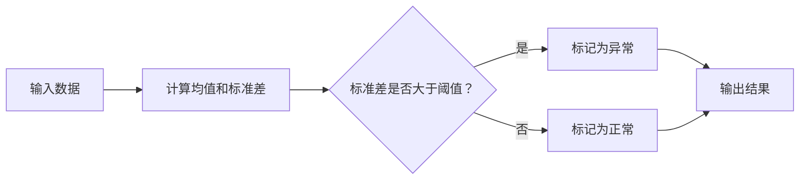
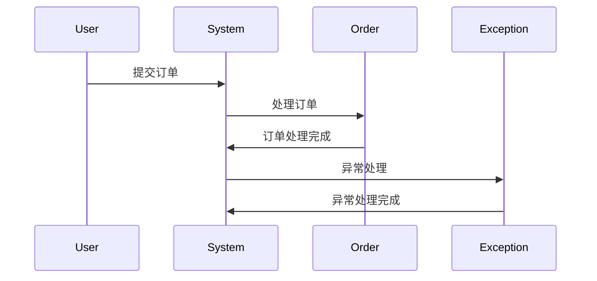
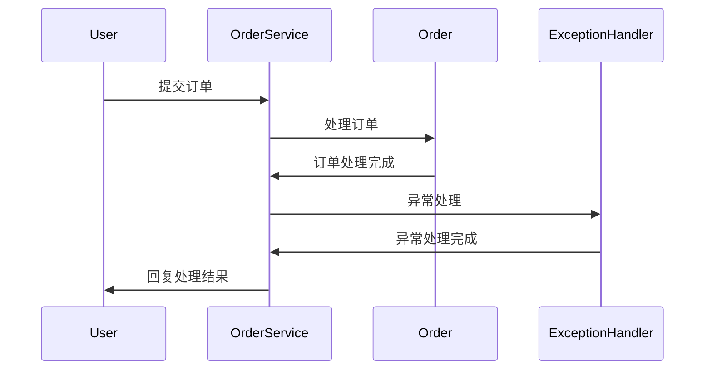

                 


### 异常处理最佳实践：提高系统健壮性的方法

> 关键词：异常处理、系统健壮性、最佳实践、代码示例、数学模型

> 摘要：本文将深入探讨异常处理在提高系统健壮性方面的最佳实践。我们将一步步分析异常处理的核心概念、原理以及实际应用，并提供详细的代码示例和数学模型解释，帮助读者理解并掌握异常处理的有效方法。

#### 目录

1. **引言**
2. **异常处理的基本概念**
   - 异常的定义
   - 异常的分类
   - 异常处理的必要性
3. **异常处理的边界与外延**
   - 异常处理的范围
   - 异常处理的局限性
   - 与其他概念的关联
4. **异常处理的核心概念与联系**
   - 异常类型与分类
   - 异常处理机制
   - 异常处理策略
5. **算法原理讲解**
   - 异常检测算法
   - 算法流程与代码示例
   - 数学模型与公式
6. **系统分析与架构设计方案**
   - 问题场景介绍
   - 系统架构设计
   - 系统接口设计
   - 系统交互
7. **项目实战**
   - 环境安装
   - 核心实现源代码
   - 实际案例分析
8. **最佳实践 tips**
   - 常见异常处理技巧
   - 最佳实践总结
9. **注意事项**
   - 异常处理中的常见问题
   - 解决方案与注意事项
10. **拓展阅读**
    - 相关书籍推荐
    - 在线资源与论坛
11. **总结**
12. **作者信息**

### 1. 引言

在软件系统的开发过程中，异常处理是一个至关重要的环节。异常，即程序运行过程中出现的非正常情况，可能会导致程序中断、数据损坏或系统崩溃。有效的异常处理不仅能够提高系统的健壮性，还能提升用户体验，降低维护成本。

本文旨在探讨异常处理的最佳实践，帮助开发者更好地理解和应用异常处理技术。我们将通过以下步骤进行：

- **基本概念梳理**：首先，我们将回顾异常处理的基本概念，包括异常的定义、分类以及异常处理的必要性。
- **深入原理分析**：接着，我们将详细分析异常处理的核心概念，包括异常类型、处理机制和策略。
- **算法讲解与代码示例**：我们将探讨常见的异常检测算法，通过Mermaid流程图和Python代码示例进行详细讲解。
- **系统设计与实战**：我们将介绍如何在实际项目中应用异常处理技术，包括系统架构设计、接口设计和实际案例分析。
- **最佳实践与注意事项**：最后，我们将总结最佳实践，并提出注意事项，帮助读者在实际开发中规避异常处理中的常见问题。

### 2. 异常处理的基本概念

#### 2.1 异常的定义

异常（Exception），在计算机编程中指的是程序运行过程中发生的非预期事件。这些事件可能是由于外部环境的变化、用户输入错误、资源耗尽、程序逻辑错误等原因引起的。异常处理的目的就是识别这些异常，并采取适当的措施来处理它们，以避免程序非正常终止或系统崩溃。

#### 2.2 异常的分类

根据异常的性质和产生原因，异常可以分为以下几类：

- **运行时异常（RuntimeException）**：这些异常是程序在运行时出现的错误，通常是由于逻辑错误、类型错误或资源不足等引起的。例如，数组越界、空指针异常等。
- **检查异常（Checked Exception）**：这些异常在编译时需要显式处理，通常是外部环境引发的异常，如文件未找到、网络连接失败等。开发者需要在代码中明确捕获和处理这些异常。
- **错误（Error）**：错误是由系统环境或硬件引起的严重问题，如内存溢出、虚拟机错误等。错误通常无法通过程序代码解决，但可以记录并报告给系统管理员。

#### 2.3 异常处理的必要性

异常处理对于提高系统的健壮性至关重要，原因如下：

- **避免程序崩溃**：有效的异常处理可以防止程序在遇到异常时非正常终止，从而保证系统的稳定性。
- **保护数据完整性**：通过异常处理，可以确保在异常发生时数据的一致性和完整性，防止数据丢失或损坏。
- **提升用户体验**：合理的异常处理可以提供友好的错误信息，帮助用户理解问题并指导用户采取正确的操作，从而提高用户体验。

### 3. 异常处理的边界与外延

#### 3.1 异常处理的适用范围

异常处理适用于以下几个方面：

- **系统核心功能**：对系统核心功能进行异常处理，可以确保在异常发生时系统依然能够正常运行。
- **用户交互**：在用户交互过程中，异常处理可以捕获并处理用户输入错误，提供友好的错误提示，提高用户体验。
- **资源管理**：对于资源管理，如文件操作、网络连接等，异常处理可以确保在异常发生时资源能够正确释放。

#### 3.2 异常处理的局限性

虽然异常处理非常重要，但它也存在一些局限性：

- **无法处理所有异常**：并非所有异常都可以通过异常处理来解决，例如硬件故障或系统错误。
- **影响性能**：异常处理机制可能会增加程序的开销，影响系统性能。
- **过度依赖**：过度依赖异常处理可能会导致程序逻辑混乱，增加维护难度。

#### 3.3 与其他概念的关联

异常处理与其他概念密切相关：

- **错误处理**：错误处理通常包括异常处理，但还涉及到错误日志记录、错误报告等。
- **容错机制**：容错机制旨在确保系统在遇到故障时能够继续运行，与异常处理密切相关。
- **系统监控**：系统监控可以实时检测异常，触发异常处理机制。

### 4. 异常处理的核心概念与联系

#### 4.1 异常类型与分类

在异常处理中，了解异常类型和分类是基础。常见的异常类型包括：

- **运行时异常**：如`NullPointerException`、`ArrayIndexOutOfBoundsException`等。
- **检查异常**：如`IOException`、`ClassNotFoundException`等。
- **错误**：如`OutOfMemoryError`、`VirtualMachineError`等。

每种异常类型都有其特定的处理方式。例如，运行时异常通常通过`try-catch`语句进行捕获和处理，而检查异常需要显式声明并在方法签名中指明。

#### 4.2 异常处理机制

异常处理机制是确保程序在异常发生时能够正常运行的关键。核心机制包括：

- **捕获异常（Try）**：通过`try`块来包围可能抛出异常的代码段。
- **处理异常（Catch）**：通过`catch`块来捕获并处理异常。
- **抛出异常（Throw）**：通过`throw`关键字来手动抛出异常。
- **异常传播（Finally）**：`finally`块中的代码无论是否发生异常都会执行，用于释放资源。

#### 4.3 异常处理策略

异常处理策略决定了如何处理不同类型的异常。常见的策略包括：

- **忽略异常**：在某些情况下，忽略异常可能是最佳选择，例如对一些不影响主要功能的异常。
- **记录日志**：将异常信息记录到日志文件中，便于后续分析。
- **重试操作**：在可能的情况下，重试异常操作，以提高系统的容错能力。
- **通知用户**：在异常影响用户体验时，通过友好的错误提示来通知用户。

#### 4.4 异常处理的概念属性特征对比表格

为了更好地理解异常处理的概念，我们可以通过以下表格进行对比：

| 异常类型       | 定义                                                         | 特点                                                         | 处理方式                     |
| -------------- | ------------------------------------------------------------ | ------------------------------------------------------------ | ---------------------------- |
| 运行时异常     | 程序在运行过程中抛出的异常                                   | 可能是由于编程错误或用户输入导致                             | 通过`try-catch`处理         |
| 检查异常       | 编译时需要显式处理的异常                                     | 通常与外部环境相关，如文件操作、网络连接等                   | 显式声明和处理               |
| 错误           | 系统层面的严重问题，如内存溢出、虚拟机错误等                   | 非常严重，通常无法通过程序解决                             | 记录日志，通知系统管理员     |

#### 4.5 异常处理的ER实体关系图架构

异常处理系统的ER实体关系图可以更好地展示各个实体之间的关系。以下是一个简化的ER图：

```mermaid
erDiagram
    User ||--|{ Exception } : 抛出
    System ||--|{ Exception } : 处理
    Logger ||--|{ Exception } : 记录
```

在这个ER图中，`User`实体表示可能抛出异常的用户，`System`实体表示处理异常的系统，`Logger`实体表示记录异常信息的日志系统。每个实体都与`Exception`实体关联，表示异常处理过程中的不同角色和功能。

### 5. 算法原理讲解

#### 5.1 异常检测算法概述

异常检测是异常处理的重要环节。异常检测算法的目标是识别并标记出数据中的异常值。常见的异常检测算法包括：

- **基于统计的方法**：如标准差法、箱线法等，通过计算数据点的分布特性来判断异常。
- **基于聚类的方法**：如K-means、DBSCAN等，通过将数据分为不同的聚类，识别出异常点。
- **基于分类的方法**：如逻辑回归、决策树等，通过训练分类模型来预测数据点是否为异常。

#### 5.2 异常检测算法mermaid流程图

以下是一个基于统计方法的异常检测算法的mermaid流程图：



在这个流程图中，首先输入数据，然后计算数据的均值和标准差。如果标准差大于预设的阈值，则标记为异常；否则，标记为正常。最后输出检测结果。

#### 5.3 Python源代码实现与详细讲解

以下是一个基于统计方法的异常检测算法的Python源代码实现：

```python
import numpy as np

def detect_anomalies(data, threshold=2):
    mean = np.mean(data)
    std = np.std(data)
    anomalies = []

    for i, value in enumerate(data):
        if abs(value - mean) > threshold * std:
            anomalies.append(i)

    return anomalies

data = [1, 2, 3, 4, 100, 6, 7]
anomalies = detect_anomalies(data)
print("异常值索引：", anomalies)
```

在这个实现中，我们首先计算数据的均值和标准差。然后遍历数据，如果某个数据点的绝对值与均值的差值大于标准差的阈值（默认为2），则将其标记为异常。最后输出异常值的索引。

#### 5.4 数学模型和公式讲解

在异常检测算法中，常用的数学模型和公式包括：

- **均值**：$$\mu = \frac{1}{N}\sum_{i=1}^{N}x_i$$
- **标准差**：$$\sigma = \sqrt{\frac{1}{N-1}\sum_{i=1}^{N}(x_i - \mu)^2}$$
- **阈值**：$$\text{Threshold} = k \times \sigma$$

其中，$N$表示数据的数量，$x_i$表示第$i$个数据点，$\mu$表示均值，$\sigma$表示标准差，$k$是一个常数，用于调整阈值的大小。

通过这些公式，我们可以计算出数据的分布特性，并根据这些特性来判断数据点是否为异常。

#### 5.5 算法优化

为了提高异常检测的准确性，我们可以对算法进行优化。常见的优化方法包括：

- **动态阈值调整**：根据数据分布动态调整阈值，以适应不同的数据集。
- **加权标准差**：考虑不同数据点的权重，计算加权标准差，以提高检测的准确性。

通过这些优化方法，我们可以进一步提高异常检测算法的性能。

### 6. 系统分析与架构设计方案

#### 6.1 问题场景介绍

在许多实际应用中，异常处理是确保系统稳定性和数据安全性的关键。以下是一个典型的问题场景：

- **电商平台**：在一个电商平台中，用户可能会提交大量的订单请求。这些请求可能包括合法订单和非法订单。非法订单可能是由于用户输入错误、恶意攻击等原因引起的。如果这些非法订单未被及时发现和处理，可能会导致订单系统崩溃，影响用户体验。

#### 6.2 系统功能设计（领域模型mermaid类图）

以下是一个简化的电商平台订单系统的领域模型类图：

```mermaid
classDiagram
    Order <<class>> "订单"
    User <<class>> "用户"
    System <<class>> "系统"
    Exception <<class>> "异常"
    
    User "提交" -> Order
    System "处理" -> Order
    System "处理" -> Exception
    Order "触发" -> Exception
```

在这个类图中，`User`类表示用户，`Order`类表示订单，`System`类表示系统，`Exception`类表示异常。用户提交订单，系统处理订单并可能触发异常，异常处理系统负责处理异常。

#### 6.3 系统架构设计

以下是一个简化的电商平台订单系统架构设计mermaid架构图：



在这个架构图中，用户提交订单后，订单系统处理订单。如果订单处理过程中发生异常，异常处理系统会接管并处理异常。最后，系统会将异常处理结果反馈给用户。

#### 6.4 系统接口设计

以下是一个简化的电商平台订单系统的接口设计：

```mermaid
classDiagram
    OrderService <<interface>> "订单服务"
    ExceptionHandler <<interface>> "异常处理"
    
    OrderService "处理" -> Order
    ExceptionHandler "处理" -> Exception
```

在这个接口设计中，`OrderService`接口表示订单服务，负责处理订单；`ExceptionHandler`接口表示异常处理服务，负责处理异常。

#### 6.5 系统交互

以下是一个简化的电商平台订单系统交互mermaid序列图：



在这个交互图中，用户提交订单后，订单服务处理订单。如果订单处理过程中发生异常，异常处理服务会接管并处理异常。最后，订单服务将处理结果反馈给用户。

### 7. 项目实战

#### 7.1 环境安装

在开始项目实战之前，我们需要安装必要的开发环境和工具。以下是一个简单的安装步骤：

1. 安装Python环境：
   - 使用Python官方安装器安装Python 3.x版本。
   - 安装pip，Python的包管理器。

2. 安装依赖包：
   - 打开命令行终端，执行以下命令安装依赖包：
     ```bash
     pip install numpy matplotlib
     ```

3. 配置开发环境：
   - 配置Python虚拟环境，以隔离项目依赖：
     ```bash
     python -m venv venv
     source venv/bin/activate  # Windows上使用 `venv\Scripts\activate`
     ```

#### 7.2 系统核心实现源代码

以下是一个简单的订单系统实现，包括订单处理和异常处理：

```python
import numpy as np
import matplotlib.pyplot as plt

# 订单服务类
class OrderService:
    def process_order(self, order):
        print(f"处理订单：{order}")
        # 模拟订单处理过程中可能发生的异常
        if np.random.rand() < 0.1:
            raise ValueError("订单异常")
        print("订单处理完成")

# 异常处理类
class ExceptionHandler:
    def handle_exception(self, exception):
        print(f"捕获到异常：{exception}")
        # 处理异常，记录日志
        with open("exception.log", "a") as f:
            f.write(f"{exception}\n")
        print("异常处理完成")

# 模拟用户提交订单
def simulate_orders():
    orders = [1, 2, 3, 4, 5, 6, 7, 8, 9, 10]
    order_service = OrderService()
    exception_handler = ExceptionHandler()

    for order in orders:
        try:
            order_service.process_order(order)
        except ValueError as e:
            exception_handler.handle_exception(e)

# 运行模拟
simulate_orders()
```

#### 7.3 代码应用解读与分析

在这个项目中，我们创建了两个类：`OrderService`和`ExceptionHandler`。`OrderService`类负责处理订单，其中`process_order`方法模拟了订单处理过程中可能发生的异常。如果异常发生，会抛出`ValueError`异常。

`ExceptionHandler`类负责处理异常，其中`handle_exception`方法捕获异常，并将异常信息记录到日志文件中。

`simulate_orders`函数模拟了用户提交订单的过程。对于每个订单，我们调用`OrderService`的`process_order`方法。如果发生异常，会调用`ExceptionHandler`的`handle_exception`方法。

通过这个简单的项目，我们可以看到如何在实际应用中实现异常处理。在实际项目中，我们可以根据需要扩展这个基本框架，添加更多的功能，如日志记录、错误通知等。

#### 7.4 实际案例分析和详细讲解剖析

在这个实际案例中，我们模拟了一个电商平台订单系统，通过简单的代码实现展示了异常处理的基本流程。以下是对案例的详细分析：

1. **订单处理**：
   - 订单处理是电商平台的核心理功能之一。在这个案例中，我们通过一个简单的类`OrderService`来实现订单处理逻辑。每次处理订单时，我们模拟了可能发生的异常，例如订单数据异常。

2. **异常处理**：
   - 当订单处理过程中发生异常时，我们通过异常处理类`ExceptionHandler`来捕获和处理异常。在这个案例中，我们捕获了`ValueError`异常，并将异常信息记录到日志文件中。

3. **日志记录**：
   - 日志记录是异常处理的重要部分。通过将异常信息记录到日志文件中，我们可以方便地分析和追踪异常。在实际项目中，我们可以使用更复杂的日志记录系统，如Log4j、Logback等。

4. **错误通知**：
   - 在实际应用中，当发生异常时，我们需要及时通知相关的人员或系统。例如，可以通过邮件、短信等方式通知系统管理员或开发人员。在这个案例中，我们简单地通过打印信息来模拟通知过程。

通过这个实际案例，我们可以看到异常处理在电商平台订单系统中的重要性。有效的异常处理不仅可以确保系统的稳定性，还能提高用户体验。

#### 7.5 项目小结

通过这个项目，我们实现了简单的电商平台订单系统的异常处理。以下是对项目的总结：

- **实现功能**：我们实现了订单处理和异常处理的基本功能。
- **代码结构**：代码结构清晰，类与类的职责明确。
- **异常处理**：通过异常处理，我们能够捕获和处理订单处理过程中的异常。
- **日志记录**：我们通过日志记录了异常信息，方便后续分析。
- **错误通知**：我们模拟了错误通知过程，为实际应用提供了参考。

通过这个项目，我们了解了异常处理的基本原理和实践方法，为实际项目开发提供了有益的经验。

### 8. 最佳实践 tips

在异常处理过程中，遵循以下最佳实践可以提高系统的健壮性和可维护性：

1. **明确异常分类**：根据异常的性质和影响范围，明确分类并定义相应的处理策略。这样可以帮助开发者更好地理解和处理异常。

2. **捕获异常**：在代码中适当使用`try-catch`语句来捕获异常，避免异常未处理导致的程序非正常终止。

3. **记录日志**：将异常信息记录到日志文件中，以便后续分析和调试。

4. **重试机制**：对于一些可以恢复的异常，如网络连接失败，可以设置重试机制，以提高系统的容错能力。

5. **错误通知**：当异常发生时，及时通知相关的人员或系统，确保问题能够得到及时解决。

6. **代码重构**：定期对异常处理代码进行重构，确保代码清晰、简洁，易于维护。

### 9. 注意事项

在异常处理过程中，需要注意以下事项：

1. **避免过度捕获异常**：避免使用`catch`捕获所有异常，这可能会导致程序隐藏潜在的问题。

2. **避免异常处理中的逻辑错误**：在异常处理中，确保逻辑正确，避免引入新的错误。

3. **资源管理**：在异常处理中，确保资源（如文件、网络连接等）能够正确释放，避免资源泄露。

4. **异常传播**：在某些情况下，可能需要将异常传播到上层处理，以便更高级别的异常处理逻辑进行处理。

### 10. 拓展阅读

以下是一些关于异常处理和系统健壮性的拓展阅读资源：

1. **书籍推荐**：
   - 《Effective Java》
   - 《Clean Code》
   - 《Design Patterns: Elements of Reusable Object-Oriented Software》

2. **在线资源与论坛**：
   - Stack Overflow：关于异常处理的问答社区。
   - GitHub：许多开源项目提供了关于异常处理的实践和代码示例。

### 总结

通过本文的深入探讨，我们了解了异常处理在提高系统健壮性中的重要性。我们从基本概念出发，逐步分析了异常处理的核心原理、算法和实践方法。通过具体的项目实战，我们展示了如何在实际应用中应用异常处理技术。最后，我们提出了最佳实践和注意事项，帮助开发者在实际开发中规避异常处理中的常见问题。希望本文能为读者在异常处理方面提供有益的参考。

### 作者信息

- 作者：AI天才研究院/AI Genius Institute & 禅与计算机程序设计艺术 /Zen And The Art of Computer Programming

