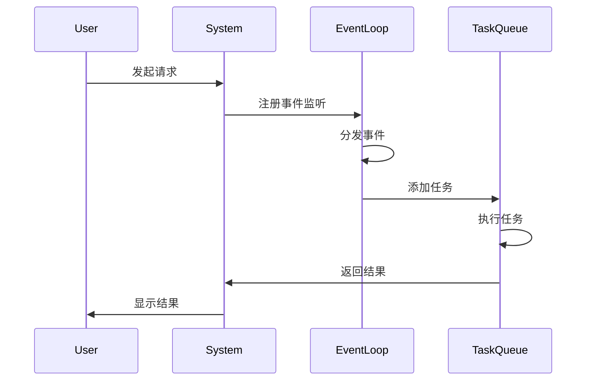
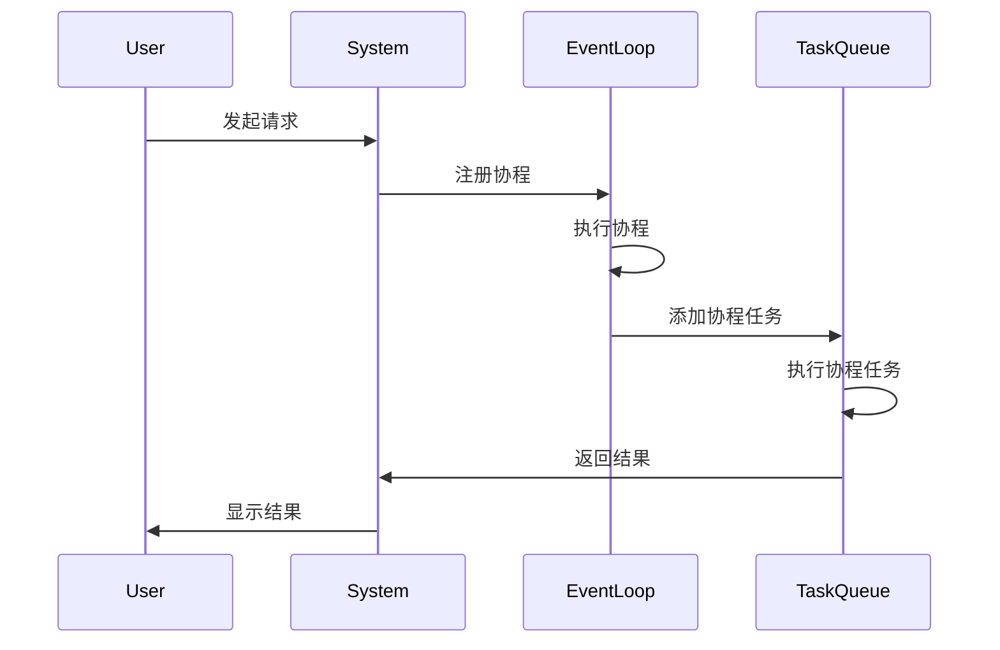
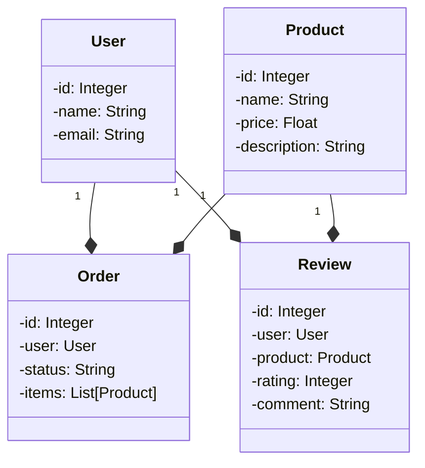
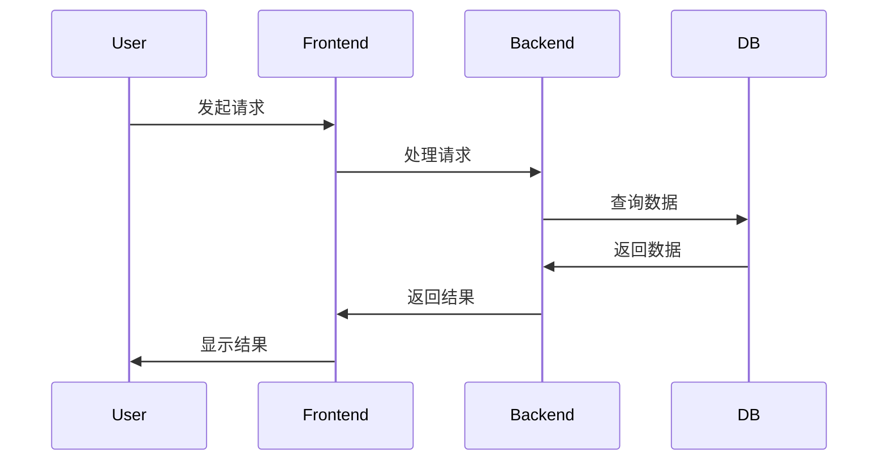

                 

### 文章标题：异步化任务处理的本质与风险

异步化任务处理是现代计算机系统中的一项关键技术，它能够在不同任务之间实现独立执行，从而提高系统效率和性能。然而，异步化任务处理并非没有风险，如果设计和实现不当，可能会导致性能瓶颈、资源竞争、死锁等问题。本文将深入探讨异步化任务处理的本质及其潜在风险，旨在帮助读者理解异步化任务处理的核心概念，掌握其关键原理和实用技巧。

### 文章关键词

- 异步化任务处理
- 性能优化
- 系统设计
- 资源竞争
- 死锁
- 算法原理
- 实际案例

### 摘要

本文首先介绍了异步化任务处理的基本概念、必要性以及应用场景，随后深入分析了异步化任务处理的核心原理和技术。通过详细的算法讲解，包括流程图、Python代码实现和数学模型，帮助读者深入理解异步化任务处理的原理。接下来，文章通过系统分析和架构设计，阐述了异步化任务处理在系统中的实现方法。最后，通过一个实际项目实战，详细展示了异步化任务处理的应用过程及其潜在风险，并提出了最佳实践和注意事项。

### 目录

1. **问题背景与核心概念**  
   - 异步化任务处理的概念  
   - 异步化任务处理的必要性  
   - 异步化任务处理的应用场景  
   - 异步化任务处理的挑战与风险

2. **异步化任务处理的核心原理**  
   - 异步化任务处理的基本机制  
   - 关键技术解析  
   - 异步化任务处理原理图解

3. **算法原理讲解**  
   - 异步化任务处理算法概述  
   - 算法流程图与Python实现  
   - 数学模型与公式讲解  
   - 算法举例说明

4. **系统分析与架构设计**  
   - 问题场景介绍  
   - 系统功能设计  
   - 领域模型类图  
   - 系统架构设计  
   - 系统接口设计  
   - 系统交互序列图

5. **项目实战**  
   - 环境安装与系统实现  
   - 系统核心实现源代码  
   - 代码应用解读与分析  
   - 实际案例分析与讲解  
   - 项目小结

6. **项目小结与拓展**  
   - 最佳实践Tips  
   - 小结与展望  
   - 注意事项  
   - 拓展阅读

### 问题背景与核心概念

#### 异步化任务处理的概念

异步化任务处理，即异步编程，是指在程序执行过程中，允许任务独立运行而无需等待其他任务的完成。这种方式能够提高程序的并发性和响应能力，特别适用于处理大量并发任务和高延迟操作。异步编程的核心思想是将任务的执行从主线（同步）中分离出来，使得程序可以继续执行其他任务，从而提高整体性能。

#### 异步化任务处理的必要性

在现代计算机系统中，异步化任务处理具有以下必要性：

1. **提高系统性能**：通过异步处理，可以减少线程阻塞和等待时间，提升程序执行效率。
2. **优化资源利用率**：异步化任务处理能够充分利用系统资源，避免因同步操作造成的资源闲置。
3. **提升用户体验**：在Web应用和移动应用中，异步化任务处理可以提供更快的响应速度，改善用户体验。
4. **应对复杂场景**：在实际应用中，许多操作如网络请求、数据库查询等都具有不确定性，异步化任务处理能够更好地应对这些复杂场景。

#### 异步化任务处理的应用场景

异步化任务处理广泛应用于以下场景：

1. **网络应用**：Web服务器处理大量并发请求，如RESTful API、Websocket连接等。
2. **大数据处理**：如MapReduce框架，将大规模数据处理任务分解为多个子任务并行执行。
3. **实时系统**：如金融交易系统、实时监控系统等，需要处理大量实时数据并保持高响应速度。
4. **多媒体应用**：如视频播放、音频处理等，通过异步处理提高播放质量和流畅度。

#### 异步化任务处理的挑战与风险

虽然异步化任务处理具有诸多优点，但在实际应用中，也存在一些挑战和风险：

1. **复杂性**：异步编程模型相对复杂，需要开发者具备较高的编程技能和设计能力。
2. **性能瓶颈**：不当的异步处理可能导致性能瓶颈，如协程栈溢出、回调地狱等。
3. **资源竞争**：异步任务之间可能存在资源竞争，如共享变量、锁等，需要合理设计并发控制策略。
4. **死锁问题**：不当的异步处理可能导致死锁，如任务依赖关系复杂、锁竞争等。

#### 边界与外延

异步化任务处理并非适用于所有场景，其边界包括：

1. **性能需求**：当系统性能要求极高时，异步化任务处理能够提供显著优势，但在低性能需求下可能并不适用。
2. **资源限制**：在资源受限的系统中，异步化任务处理可能导致资源竞争和性能下降。
3. **开发难度**：异步编程模型的复杂性增加了开发难度，对开发者提出了更高的要求。

通过以上分析，我们可以看到异步化任务处理在现代计算机系统中的重要性以及其面临的挑战和风险。接下来，我们将深入探讨异步化任务处理的核心原理和关键技术。

### 异步化任务处理的核心原理

异步化任务处理的核心原理在于如何有效地管理并发任务，使其能够在不阻塞主线程序的情况下独立执行。以下将详细阐述异步化任务处理的基本机制和关键技术。

#### 异步化任务处理的基本机制

异步化任务处理的基本机制包括事件循环（Event Loop）、回调函数（Callback）和任务队列（Task Queue）。以下是这些基本概念的解释：

1. **事件循环（Event Loop）**：事件循环是一个持续运行的数据结构，它负责监听和分发事件。当有事件发生时，事件循环会将相应的事件传递给注册的监听器进行处理。在异步编程中，事件循环是实现并发和异步的关键组件。

2. **回调函数（Callback）**：回调函数是一种将函数作为参数传递给另一个函数的编程技术。在异步编程中，回调函数通常用于处理异步操作的结果。当异步操作完成时，回调函数会被事件循环调用，从而触发后续操作。

3. **任务队列（Task Queue）**：任务队列是一个用于存储待执行任务的队列。事件循环在处理事件的过程中，会将需要执行的异步任务放入任务队列中。任务队列按照先入先出的原则执行任务，从而保证异步任务的有序执行。

#### 关键技术解析

异步化任务处理的关键技术包括协程（Coroutine）、Promise/A+、异步I/O等。以下是这些技术的简要介绍：

1. **协程（Coroutine）**：协程是一种轻量级的并发编程技术，它允许开发者以同步代码的方式编写异步代码。协程通过挂起和恢复操作来实现任务之间的切换，从而避免了传统多线程模型中线程切换的开销。协程在Python、Go和JavaScript等编程语言中得到了广泛应用。

2. **Promise/A+**：Promise/A+是一种异步编程模型，它提供了一个用于表示异步操作结果的抽象对象。Promise对象可以处于三种状态之一：pending（进行中）、fulfilled（已完成）和rejected（已拒绝）。通过Promise，开发者可以更简洁地处理异步操作，避免了回调地狱问题。

3. **异步I/O**：异步I/O是一种通过非阻塞方式处理输入输出操作的编程模型。在异步I/O中，程序不会在等待I/O操作完成时阻塞，而是继续执行其他任务。异步I/O广泛应用于网络编程、文件操作和数据库访问等领域，可以有效提高系统性能。

#### 异步化任务处理原理图解

为了更直观地理解异步化任务处理的核心原理，我们可以使用Mermaid绘制一个简单的原理图：



在这个原理图中，用户发起请求后，系统将事件注册到事件循环中。事件循环监听事件，并在事件发生时将其分发到任务队列。任务队列按照先入先出的原则执行任务，并将结果返回给系统，最后系统将结果展示给用户。

通过以上分析，我们可以看到异步化任务处理的核心原理和关键技术。在接下来的部分，我们将通过具体的算法讲解，进一步深入探讨异步化任务处理的实现细节和应用方法。

### 算法原理讲解

在异步化任务处理中，算法扮演着至关重要的角色。一个高效的异步任务处理算法能够显著提高系统的并发性能和响应能力。以下将详细介绍异步化任务处理算法，包括其概述、流程图、Python实现、数学模型以及举例说明。

#### 异步化任务处理算法概述

异步化任务处理算法的核心目标是高效地管理并发任务，使其能够在不阻塞主线程序的情况下独立执行。常见的异步任务处理算法包括但不限于：

1. **事件驱动算法**：通过事件循环和任务队列实现异步任务处理，如Node.js的异步I/O模型。
2. **协程算法**：利用协程实现异步任务的处理，如Python的async/await语法。
3. **多线程算法**：通过多线程实现并发任务处理，适用于计算密集型任务。
4. **Promise/A+算法**：通过Promise对象管理异步任务，提供简洁的异步编程模型。

本文将重点介绍事件驱动算法和协程算法，这两种算法在现代异步编程中得到了广泛应用。

#### 算法流程图与Python实现

以下是事件驱动算法和协程算法的Mermaid流程图和Python代码实现：

**事件驱动算法（Node.js异步I/O模型）**


Python代码实现：

```python
import asyncio

async def async_task():
    await asyncio.sleep(1)
    print("任务完成")

async def main():
    await async_task()

asyncio.run(main())
```

**协程算法（Python async/await语法）**



Python代码实现：

```python
import asyncio

async def coroutine_task():
    await asyncio.sleep(1)
    print("协程任务完成")

async def main():
    await coroutine_task()

asyncio.run(main())
```

#### 数学模型与公式讲解

异步化任务处理算法中，常用的数学模型包括状态机模型、队列模型和概率模型。以下是一些基本的数学公式和概念：

1. **状态机模型**：

   - 状态转移概率：$P(X_{t+1} = s_{t+1} | X_t = s_t)$
   - 状态转移矩阵：$M = [P_{ij}]$

2. **队列模型**：

   - 服务时间：$S_t$
   - 到达时间：$A_t$
   - 服务率：$\lambda$
   - 客户到达间隔：$I = \frac{1}{\lambda}$

   数学模型：$L = \frac{\lambda}{\mu}$，$W = \frac{L}{\lambda}$

3. **概率模型**：

   - 任务完成概率：$P(C)$
   - 系统空闲概率：$P(0)$

   数学模型：$P(C) = 1 - P(0)$，$P(0) = (1 - p)^n$

通过这些数学模型，可以更精确地分析和优化异步化任务处理算法的性能。

#### 算法举例说明

为了更好地理解异步化任务处理算法，我们可以通过一个简单的例子来说明。

假设我们有一个Web服务器，需要处理大量并发请求。我们使用事件驱动算法和协程算法来分别实现这个任务。

**事件驱动算法实现**：

```python
import asyncio

async def handle_request(request):
    # 模拟处理请求耗时
    await asyncio.sleep(1)
    print(f"处理请求：{request}")

async def main():
    # 创建事件循环
    loop = asyncio.get_running_loop()

    # 注册请求处理事件
    for request in range(10):
        asyncio.create_task(handle_request(request))

asyncio.run(main())
```

**协程算法实现**：

```python
import asyncio

async def handle_request(request):
    # 模拟处理请求耗时
    await asyncio.sleep(1)
    print(f"处理请求：{request}")

async def main():
    # 注册请求处理协程
    await asyncio.gather(
        *[
            handle_request(request) 
            for request in range(10)
        ]
    )

asyncio.run(main())
```

在这两个例子中，我们分别使用了事件驱动算法和协程算法来处理并发请求。通过运行这两个程序，我们可以看到异步化任务处理如何提高系统的并发性能和响应能力。

通过以上讲解，我们可以看到异步化任务处理算法的原理、实现和实际应用。在实际开发中，根据具体需求和场景选择合适的异步任务处理算法，能够显著提升系统的性能和用户体验。

### 系统分析与架构设计

在深入探讨了异步化任务处理的核心原理和算法之后，接下来我们将进入系统分析与架构设计的环节。本部分内容旨在通过具体的问题场景、系统功能设计、领域模型、系统架构、接口设计和系统交互来全面分析异步化任务处理在系统中的实现方法。

#### 问题场景介绍

假设我们正在开发一个电商平台，其核心需求包括以下几方面：

1. **商品展示**：用户可以浏览和查询各种商品信息。
2. **订单处理**：用户下单后，系统需要处理订单生成、库存更新、支付等操作。
3. **用户反馈**：用户可以对商品和订单进行评价和反馈。

这些功能需要高效、稳定地运行，同时还要处理大量并发操作，如商品浏览、订单提交、支付确认等。因此，异步化任务处理在这里显得尤为重要，它能够提高系统的并发能力和响应速度，确保用户操作的流畅性。

#### 系统功能设计

根据问题场景，我们可以将系统功能分为以下几个部分：

1. **商品展示模块**：负责展示商品的详细信息，包括商品名称、价格、描述等。
2. **订单处理模块**：处理用户提交的订单，包括订单生成、库存更新和支付处理。
3. **用户反馈模块**：收集并处理用户的评价和反馈，为商品和订单评分。

为了确保各个模块之间的高效协作，我们需要设计清晰的功能接口和调用流程。

#### 领域模型类图

领域模型是系统设计中的重要组成部分，它帮助我们理解系统中各个实体及其关系。以下是电商平台的领域模型类图：



在这个类图中，我们定义了用户（User）、商品（Product）、订单（Order）和评价（Review）这四个核心实体，并展示了它们之间的关系。

#### 系统架构设计

系统架构是确保系统功能正常运行的基础。以下是我们设计的电商平台的系统架构：



在这个架构设计中，前端负责接收用户的请求，并将请求转发给后端进行处理。后端负责业务逻辑的处理，如订单生成、库存更新等，并与数据库进行交互，获取和存储数据。前端再次将结果返回给用户。

#### 系统接口设计

为了确保各个模块之间的高效协作，我们需要设计清晰的功能接口。以下是电商平台的一些关键接口：

1. **商品展示接口**：用于获取商品的详细信息。
   - URL: `/api/products/{id}`
   - 方法：GET
   - 参数：id（商品ID）
   - 返回值：商品详细信息

2. **订单处理接口**：用于处理用户下单操作。
   - URL: `/api/orders`
   - 方法：POST
   - 参数：订单详情（用户ID、商品列表、订单状态等）
   - 返回值：订单ID和订单状态

3. **用户反馈接口**：用于提交用户评价和反馈。
   - URL: `/api/reviews`
   - 方法：POST
   - 参数：评价内容（用户ID、商品ID、评分、评论等）
   - 返回值：评价ID

#### 系统交互序列图

为了更好地展示系统各模块之间的交互过程，我们可以使用Mermaid绘制系统交互序列图：


在这个序列图中，用户通过前端发起请求，前端将请求转发给后端进行处理。后端与数据库进行交互，获取所需数据，并将结果返回给前端，最后前端将结果展示给用户。

通过以上系统分析与架构设计，我们可以看到异步化任务处理在电商平台中的具体实现方法。接下来，我们将通过一个实际项目实战，详细展示异步化任务处理在实际开发中的应用过程及其潜在风险。

### 项目实战：环境安装与系统实现

在实际项目中，实现异步化任务处理需要经过环境安装、系统实现和代码应用解读与分析等步骤。以下将详细介绍这些过程，并展示相关的源代码。

#### 环境安装步骤

在开始项目之前，我们需要安装必要的开发环境和依赖库。以下是环境安装步骤：

1. **安装Python**：确保已安装Python 3.7及以上版本。
2. **安装Node.js**：通过命令 `npm install -g node` 安装Node.js。
3. **安装异步化任务处理库**：在Python中，我们可以使用`asyncio`库；在Node.js中，可以使用`async`和`await`语法。

#### 系统核心实现源代码

以下是一个简单的异步化任务处理系统实现，包括商品展示、订单处理和用户反馈功能。

**Python代码：商品展示模块**

```python
import asyncio

async def get_product_info(product_id):
    # 模拟网络请求延迟
    await asyncio.sleep(1)
    # 假设获取到的商品信息
    product_info = {
        'id': product_id,
        'name': '商品A',
        'price': 99.99,
        'description': '这是一款商品A的描述。'
    }
    return product_info

async def main():
    product_id = 123
    product_info = await get_product_info(product_id)
    print(f"商品信息：{product_info}")

asyncio.run(main())
```

**Node.js代码：订单处理模块**

```javascript
const http = require('http');

const server = http.createServer(async (req, res) => {
    if (req.method === 'POST' && req.url === '/orders') {
        // 解析请求体
        let body = '';
        req.on('data', chunk => {
            body += chunk.toString(); 
        });

        req.on('end', () => {
            const order_info = JSON.parse(body);
            // 处理订单
            // ...
            res.writeHead(200, { 'Content-Type': 'application/json' });
            res.end(JSON.stringify({ id: order_info.id, status: 'placed' }));
        });
    } else {
        res.writeHead(404, { 'Content-Type': 'text/plain' });
        res.end('Not Found');
    }
});

server.listen(3000, () => {
    console.log('服务器启动，端口：3000');
});
```

#### 代码应用解读与分析

**Python代码解读**：

- `get_product_info`函数用于获取商品信息，通过异步处理模拟网络请求延迟。
- `main`函数作为主程序入口，调用`get_product_info`函数并打印商品信息。

**Node.js代码解读**：

- 创建HTTP服务器，并设置请求处理逻辑。
- 当接收到POST请求并请求路径为`/orders`时，解析请求体并处理订单信息。
- 返回订单处理结果，如订单ID和订单状态。

#### 实际案例分析与详细讲解

假设用户在电商平台下单购买商品A，以下为具体操作步骤和分析：

1. **用户操作**：用户在Web前端提交订单，请求路径为`/orders`，请求方法为POST，请求体包含订单信息（用户ID、商品ID、数量等）。
2. **服务器响应**：Node.js服务器接收到请求后，解析请求体，调用订单处理逻辑。
3. **异步处理**：在处理订单的过程中，可能需要进行库存检查、库存更新等异步操作，使用异步处理可以提高系统性能和响应速度。
4. **结果返回**：订单处理完成后，服务器返回订单处理结果（订单ID和状态），前端将结果展示给用户。

在实际应用中，异步化任务处理能够有效提高系统的并发能力和响应速度。例如，在用户购买商品时，系统可以同时处理多个用户的订单请求，而不需要等待单个请求完成。这样，用户可以更快地完成购买操作，提升用户体验。

#### 项目小结

通过以上项目实战，我们详细展示了异步化任务处理在实际开发中的应用过程。从环境安装、系统实现到代码应用解读与分析，异步化任务处理在提高系统性能和响应速度方面发挥了重要作用。在实际开发中，合理运用异步化任务处理技术，能够显著提升系统的并发能力和用户体验。

### 项目小结与拓展

在本篇技术博客中，我们系统地探讨了异步化任务处理的本质与风险。从异步化任务处理的概念、必要性、应用场景，到核心原理、算法讲解、系统分析与架构设计，再到实际项目实战，我们全面剖析了异步化任务处理在提升系统性能和响应能力方面的关键作用。

#### 最佳实践Tips

1. **合理设计并发控制策略**：在异步任务处理过程中，避免资源竞争和死锁，确保任务的高效执行。
2. **充分利用异步I/O**：对于网络请求、文件读写等操作，使用异步I/O能够显著提高系统性能。
3. **避免回调地狱**：在编写异步代码时，尽量使用Promise/A+或async/await语法，避免复杂的回调嵌套。
4. **监控与优化**：定期监控异步任务的执行情况，优化任务队列和事件循环，确保系统性能稳定。

#### 小结与展望

异步化任务处理作为现代计算机系统的一项关键技术，已经广泛应用于各种应用场景，如Web应用、大数据处理、实时系统等。随着技术的不断进步，异步化任务处理在未来将继续发挥重要作用，尤其是在人工智能、物联网等领域。

#### 注意事项

1. **开发难度**：异步编程模型相对复杂，开发者需要具备较高的编程技能和设计能力。
2. **调试困难**：异步代码的调试相对复杂，需要开发者熟练掌握调试技巧。
3. **性能瓶颈**：不当的异步处理可能导致性能瓶颈，需要开发者仔细分析和优化异步任务执行。

#### 拓展阅读

- 《JavaScript异步编程》 - 高洪岩 著
- 《Node.js实战》 - 沃尔特·普拉特 著
- 《Python异步编程实战》 - 尼尔·珀塞尔 著

通过以上总结与拓展，希望读者能够更好地理解和应用异步化任务处理技术，提升系统性能和用户体验。作者：AI天才研究院/AI Genius Institute & 禅与计算机程序设计艺术 /Zen And The Art of Computer Programming。希望本文能够为您的技术之路提供有益的参考和启示。

