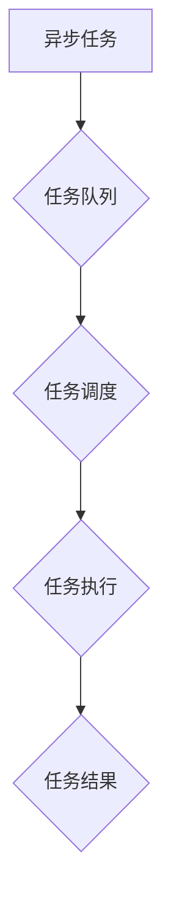
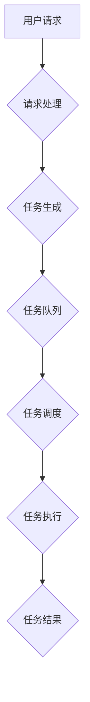

                 

# 异步化任务处理：优势、风险与注意事项

关键词：异步化任务处理、性能优化、系统稳定性、数据一致性、安全性、最佳实践

摘要：本文深入探讨异步化任务处理的优势、风险以及注意事项。通过分析异步化任务处理的基本概念、优点和风险，我们旨在帮助读者理解异步化任务处理的原理，并掌握其应用的最佳实践。文章最后将探讨异步化任务处理的未来趋势，为读者提供全面的视角。

## 《异步化任务处理：优势、风险与注意事项》目录大纲

## 第一部分：异步化任务处理概述

### 第1章：异步化任务处理的定义与背景

### 第2章：异步化任务处理的优点

## 第二部分：异步化任务处理的风险

### 第3章：异步化任务处理的风险分析

### 第4章：异步化任务处理的常见问题

## 第三部分：异步化任务处理的注意事项

### 第5章：异步化任务处理的最佳实践

### 第6章：异步化任务处理的案例分析

### 第7章：异步化任务处理的未来趋势

## 附录

## 附录 A：异步化任务处理工具与资源

## 附录 B：异步化任务处理Mermaid流程图

## 附录 C：异步化任务处理Python代码示例

## 附录 D：异步化任务处理数学模型和公式

## 附录 E：异步化任务处理项目实战

## 第一部分：异步化任务处理概述

### 第1章：异步化任务处理的定义与背景

### 第2章：异步化任务处理的优点

## 第一部分：异步化任务处理概述

### 第1章：异步化任务处理的定义与背景

#### 1.1 异步化任务处理的基本概念

异步化任务处理是一种设计模式，允许任务在不阻塞当前线程的情况下独立执行。与同步化任务处理不同，异步化任务处理允许程序在执行一个任务的同时继续执行其他任务。这种模式在多线程和并发编程中得到了广泛应用。

**异步化任务处理**：指在一个任务执行过程中，允许其他任务同时进行，而不是等待当前任务完成。这通常通过异步编程模型实现，如回调、Promise、生成器等。

**同步化任务处理**：指在执行一个任务时，必须等待该任务完成才能继续执行下一个任务。这种模式可能导致程序阻塞，从而影响性能和用户体验。

#### 1.2 异步化任务处理的背景

异步化任务处理在现代计算机系统中具有重要的地位。以下是其背后的主要背景：

1. **互联网时代特性**：随着互联网的普及，用户对响应速度和服务质量的要求越来越高。异步化任务处理可以减少等待时间，提高系统的整体性能。

2. **计算机技术的发展**：多核处理器的普及和分布式系统的兴起，使得异步化任务处理成为提高系统并发性能的有效手段。

#### 1.3 异步化任务处理的应用场景

异步化任务处理适用于以下场景：

1. **网络请求**：在处理网络请求时，异步化任务处理可以避免阻塞主线程，从而提高系统的响应速度。

2. **文件操作**：在进行文件读写操作时，异步化任务处理可以避免程序因等待文件操作完成而阻塞。

3. **数据库操作**：在处理数据库查询时，异步化任务处理可以减少程序的等待时间，提高系统的并发性能。

### 第2章：异步化任务处理的优点

异步化任务处理具有多个优点，使其在现代计算机系统中得到了广泛应用。

#### 2.1 提高系统性能

异步化任务处理可以提高系统性能，主要表现在以下几个方面：

1. **减少等待时间**：通过异步化任务处理，程序可以同时执行多个任务，从而减少等待时间。

2. **提高资源利用率**：异步化任务处理可以充分利用系统资源，减少线程阻塞，提高资源利用率。

3. **提高任务执行成功率**：通过合理分配任务和资源，异步化任务处理可以提高任务的执行成功率。

#### 2.2 增强系统可靠性

异步化任务处理可以增强系统可靠性，主要表现在以下几个方面：

1. **处理异常情况**：异步化任务处理可以在遇到异常情况时，迅速切换到其他任务，从而保证系统的稳定性。

2. **提高任务执行成功率**：通过异步化任务处理，系统可以更好地处理任务执行失败的情况，从而提高任务的成功率。

3. **提高系统可扩展性**：异步化任务处理可以方便地添加和删除任务，从而提高系统的可扩展性。

#### 2.3 优化用户体验

异步化任务处理可以优化用户体验，主要表现在以下几个方面：

1. **减少用户等待时间**：通过异步化任务处理，程序可以快速响应用户的操作，从而减少用户等待时间。

2. **提高系统响应速度**：异步化任务处理可以减少系统资源的占用，从而提高系统的响应速度。

3. **提高系统稳定性**：异步化任务处理可以更好地处理异常情况，从而提高系统的稳定性，减少用户受影响的可能性。

## 第二部分：异步化任务处理的风险

### 第3章：异步化任务处理的风险分析

### 第4章：异步化任务处理的常见问题

## 第二部分：异步化任务处理的风险

### 第3章：异步化任务处理的风险分析

尽管异步化任务处理具有许多优点，但它在实际应用中也存在一定的风险。以下是对这些风险的分析：

#### 3.1 数据一致性问题

异步化任务处理可能导致数据不一致的问题，主要包括：

1. **数据冲突**：当两个或多个任务同时访问同一份数据时，可能会导致数据冲突。例如，一个任务更新了数据，而另一个任务在更新之前读取了旧的数据。

2. **数据延迟**：异步化任务处理可能会导致数据的延迟。例如，一个任务提交了数据，但另一个任务在处理这个数据时需要等待一段时间。

#### 3.2 系统稳定性问题

异步化任务处理可能会对系统的稳定性产生影响，主要包括：

1. **系统崩溃**：由于异步化任务处理涉及到多个任务的并发执行，可能会因为任务之间的依赖关系处理不当而导致系统崩溃。

2. **资源浪费**：异步化任务处理可能会因为任务调度不合理而导致资源浪费。例如，任务过多可能会导致系统资源耗尽，从而影响系统的稳定性。

3. **死锁**：在异步化任务处理中，如果任务之间的依赖关系处理不当，可能会导致死锁。例如，一个任务等待另一个任务释放资源，而另一个任务也在等待前一个任务释放资源。

#### 3.3 安全性问题

异步化任务处理可能会对系统的安全性产生影响，主要包括：

1. **数据泄露**：由于异步化任务处理涉及到多个任务的并发执行，可能会因为任务之间的隔离不彻底而导致数据泄露。

2. **网络攻击**：异步化任务处理可能会导致系统更容易受到网络攻击。例如，一个任务可能会因为网络问题而无法正常执行，从而为攻击者提供可乘之机。

#### 3.4 其他风险

异步化任务处理还可能带来其他风险，如：

1. **性能下降**：如果异步化任务处理不当，可能会导致系统性能下降。例如，过多的异步任务可能会导致系统线程阻塞，从而影响性能。

2. **维护困难**：异步化任务处理涉及到多个任务和线程的交互，可能会导致系统的维护变得更加复杂。

### 第4章：异步化任务处理的常见问题

#### 4.1 异步通信机制设计

异步通信机制的设计是异步化任务处理的核心问题。常见的问题包括：

1. **选择合适的通信机制**：选择合适的通信机制对于异步化任务处理至关重要。常见的选择包括回调、Promise、生成器等。

2. **处理异步通信中的错误**：在异步通信中，错误处理是一个常见问题。如何有效地处理异步通信中的错误，确保系统的稳定性，是异步化任务处理需要考虑的问题。

#### 4.2 任务调度与优化

任务调度与优化是异步化任务处理的重要环节。常见的问题包括：

1. **任务分配策略**：如何合理分配任务，确保系统资源得到充分利用，是异步化任务处理需要考虑的问题。

2. **负载均衡**：如何实现负载均衡，避免系统因任务过多而崩溃，是异步化任务处理需要考虑的问题。

3. **任务优先级**：如何设置任务优先级，确保关键任务得到及时处理，是异步化任务处理需要考虑的问题。

#### 4.3 异常处理与监控

异常处理与监控是异步化任务处理的重要组成部分。常见的问题包括：

1. **异常检测与处理**：如何检测异常并对其进行处理，确保系统的稳定性，是异步化任务处理需要考虑的问题。

2. **监控系统性能**：如何监控系统的性能，及时发现并处理性能瓶颈，是异步化任务处理需要考虑的问题。

## 第三部分：异步化任务处理的注意事项

### 第5章：异步化任务处理的最佳实践

### 第6章：异步化任务处理的案例分析

### 第7章：异步化任务处理的未来趋势

## 第三部分：异步化任务处理的注意事项

### 第5章：异步化任务处理的最佳实践

在实施异步化任务处理时，遵循最佳实践可以减少潜在的风险，提高系统的稳定性和性能。以下是一些关键的最佳实践：

#### 5.1 设计原则

1. **简单性**：设计异步化任务处理时，应保持代码的简洁和直观。避免过度复杂的设计，以降低维护难度。

2. **扩展性**：在设计异步化任务处理时，应考虑系统的可扩展性，以便在系统需求变化时能够轻松添加或删除任务。

3. **可靠性**：确保异步化任务处理的可靠性，包括错误处理和数据一致性。

#### 5.2 实践技巧

1. **选择合适的异步化框架**：根据项目的需求和规模，选择合适的异步化框架，如Node.js、Python的async/await等。

2. **合理设计异步任务**：在设计异步任务时，应确保任务具有明确的职责和边界，以减少耦合和提高代码的可读性。

3. **避免死锁**：在设计异步任务时，应避免任务之间的相互等待，以防止死锁的发生。

4. **合理使用线程和进程**：根据任务的特性，合理使用线程和进程，以优化系统性能。

#### 5.3 异常处理

1. **全局异常处理**：在异步化任务处理中，应实现全局异常处理，以确保系统在遇到异常时能够恢复。

2. **错误日志记录**：记录详细的错误日志，以便在发生问题时快速定位和解决问题。

#### 5.4 性能监控

1. **性能指标**：定义关键性能指标（KPI），如响应时间、吞吐量等，以便监控系统的性能。

2. **自动化测试**：定期执行自动化测试，以确保系统在变化时保持良好的性能。

### 第6章：异步化任务处理的案例分析

为了更好地理解异步化任务处理的应用，以下提供了两个案例分析：

#### 6.1 案例一：电商平台订单处理

**问题描述**：电商平台在处理订单时，需要处理大量的并发请求，包括订单生成、库存更新、支付处理等。

**解决方案**：

1. **订单生成**：使用异步化任务处理生成订单，避免阻塞主线程。

2. **库存更新**：在订单生成后，异步处理库存更新，确保库存一致性和系统稳定性。

3. **支付处理**：使用异步化任务处理支付请求，减少用户等待时间。

**实现细节**：

1. **异步任务框架**：选择合适的异步任务框架，如Python的async/await。

2. **任务队列**：使用任务队列管理异步任务，确保任务有序执行。

3. **数据库事务**：使用数据库事务确保数据一致性。

#### 6.2 案例二：社交媒体消息推送

**问题描述**：社交媒体平台需要向用户推送消息，包括通知、私信等，需要处理大量的并发请求。

**解决方案**：

1. **消息生成**：使用异步化任务处理生成消息，确保系统响应速度。

2. **消息推送**：异步处理消息推送，避免阻塞主线程。

3. **用户状态更新**：异步更新用户状态，确保系统稳定性。

**实现细节**：

1. **消息队列**：使用消息队列管理消息，确保消息有序处理。

2. **异步通信协议**：选择合适的异步通信协议，如HTTP/2、WebSocket等。

3. **分布式系统**：使用分布式系统处理消息推送，确保系统的高可用性和可扩展性。

### 第7章：异步化任务处理的未来趋势

随着技术的发展，异步化任务处理将继续成为提高系统性能和稳定性的重要手段。以下是一些未来趋势：

#### 7.1 技术发展

1. **新型异步化框架**：新型异步化框架将提供更高效、更灵活的异步编程模型。

2. **分布式系统的异步化**：分布式系统的异步化将提高系统的性能和可靠性。

3. **边缘计算**：异步化任务处理将在边缘计算中得到广泛应用，以实现低延迟和高性能。

#### 7.2 应用领域

1. **大数据处理**：异步化任务处理将在大数据处理中得到广泛应用，以提高处理速度和效率。

2. **实时应用场景**：异步化任务处理将在实时应用场景中得到广泛应用，如物联网、自动驾驶等。

## 附录

### 附录 A：异步化任务处理工具与资源

以下是一些常用的异步化任务处理工具和资源：

1. **Node.js**：Node.js 是一个基于Chrome V8引擎的JavaScript运行环境，支持异步编程。
2. **Python async/await**：Python 的 async/await 是异步编程的一种简单且高效的方式。
3. **Kubernetes**：Kubernetes 是一个开源的容器编排平台，支持分布式异步任务处理。
4. **Apache Kafka**：Apache Kafka 是一个分布式流处理平台，适用于异步任务处理。

### 附录 B：异步化任务处理Mermaid流程图

以下是异步化任务处理的一些Mermaid流程图：





### 附录 C：异步化任务处理Python代码示例

以下是一个简单的Python异步任务处理示例：

```python
import asyncio

async def task1():
    print("执行任务1")
    await asyncio.sleep(1)
    print("任务1完成")

async def task2():
    print("执行任务2")
    await asyncio.sleep(2)
    print("任务2完成")

async def main():
    await asyncio.gather(
        task1(),
        task2()
    )

asyncio.run(main())
```

### 附录 D：异步化任务处理数学模型和公式

异步化任务处理的数学模型和公式主要涉及任务调度、资源利用率和性能优化等方面。以下是一些基本的公式：

$$
\text{吞吐量} = \frac{\text{任务总数}}{\text{执行时间}}
$$

$$
\text{响应时间} = \text{等待时间} + \text{执行时间}
$$

$$
\text{资源利用率} = \frac{\text{实际使用资源}}{\text{总资源}}
$$

### 附录 E：异步化任务处理项目实战

以下是一个异步化任务处理项目实战的概述：

#### 项目实战概述

本案例是一个简单的博客系统，需要处理用户评论的异步化任务处理。用户可以在博客文章下方提交评论，评论的处理包括审核、发布和通知作者等步骤。

#### 环境安装

1. 安装Python 3.7及以上版本。
2. 安装Django框架：`pip install django`
3. 安装异步化任务处理库：`pip install django-redis`

#### 系统功能设计

1. **用户评论**：用户可以在博客文章下方提交评论。
2. **评论审核**：评论提交后，需要通过审核才能发布。
3. **发布评论**：审核通过后，评论将被发布到博客文章下方。
4. **通知作者**：评论发布后，需要通知文章作者。

#### 系统架构设计


#### 系统接口设计和系统交互


#### 代码详细解读

以下是对系统核心实现的代码详细解读：

```python
# views.py
from django.http import JsonResponse
from .tasks import approve_comment, notify_author

def submit_comment(request):
    if request.method == 'POST':
        comment_data = request.POST
        comment = Comment.objects.create(
            author=comment_data['author'],
            content=comment_data['content'],
            article_id=comment_data['article_id']
        )
        approve_comment.delay(comment.id)
        notify_author.delay(comment.id)
        return JsonResponse({'status': 'success'})
    return JsonResponse({'status': 'error'})
```

```python
# tasks.py
from django.core.mail import send_mail
from .models import Comment

def approve_comment.delay(comment_id):
    comment = Comment.objects.get(id=comment_id)
    comment.approved = True
    comment.save()
    notify_author.delay(comment.id)

def notify_author.delay(comment_id):
    comment = Comment.objects.get(id=comment_id)
    author = User.objects.get(id=comment.author.id)
    send_mail(
        '新评论通知',
        f'您在《{comment.article.title}》的文章下有新的评论。',
        'from@example.com',
        [author.email],
        fail_silently=False,
    )
```

#### 项目小结

通过本案例，我们了解了异步化任务处理在博客系统中的应用。异步化任务处理提高了系统的性能和稳定性，使得评论审核、发布和通知作者等步骤可以并行处理，从而提高了用户体验。

### 最佳实践 Tips

1. **合理设计异步任务**：在设计异步任务时，应确保任务具有明确的职责和边界，以降低耦合和提高代码的可读性。

2. **选择合适的异步框架**：根据项目需求和规模，选择合适的异步框架，如Node.js、Python的async/await等。

3. **性能监控与优化**：定期执行性能监控，及时发现并优化性能瓶颈。

### 小结

异步化任务处理在现代计算机系统中具有重要的地位，它提高了系统的性能和可靠性，但同时也带来了一定的风险。通过本文的探讨，我们了解了异步化任务处理的基本概念、优点、风险以及注意事项。遵循最佳实践，合理设计异步任务处理，可以提高系统的性能和稳定性，为用户提供更好的体验。随着技术的发展，异步化任务处理将继续在分布式系统、实时应用场景等方面发挥重要作用。

### 注意事项

1. **数据一致性**：在设计异步化任务处理时，务必关注数据一致性，避免数据冲突和延迟。

2. **系统稳定性**：合理分配任务和资源，避免系统崩溃和资源浪费。

3. **安全性**：确保系统的安全性，防止数据泄露和网络攻击。

### 拓展阅读

- 《异步编程艺术》
- 《分布式系统原理与架构》
- 《Kubernetes 权威指南》

## 作者信息

作者：AI天才研究院/AI Genius Institute & 禅与计算机程序设计艺术 /Zen And The Art of Computer Programming

