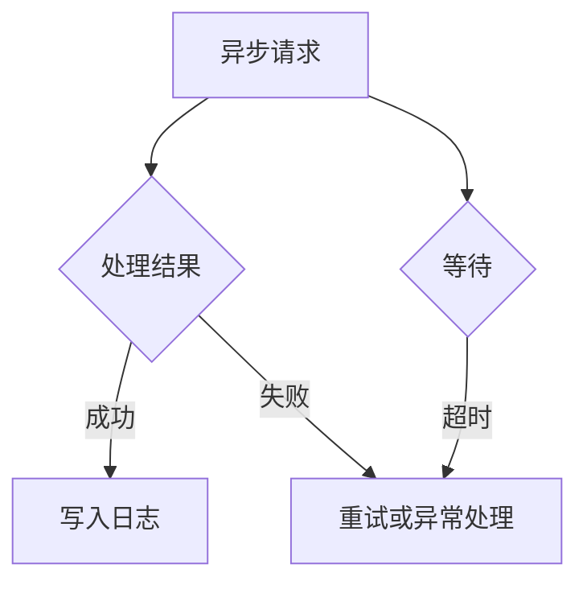
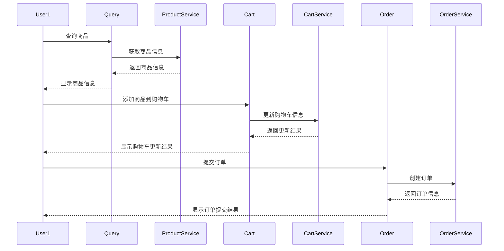

                 

# 异步化的本质：用时间换容量

## 关键词：异步化、时间、容量、计算机科学、网络通信

### 摘要

异步化是一种在计算机科学和工程领域广泛应用的设计模式，其核心在于通过延长处理时间来换取系统容量的提升。本文将深入探讨异步化的本质，分析其原理、实现方法、应用场景以及优缺点，并给出最佳实践建议，帮助读者全面理解异步化的内涵和实际应用。

### 目录

1. 背景介绍
    1.1 异步化的定义与历史背景
    1.2 异步化与同步化的比较
2. 异步化的原理
    2.1 异步化的核心概念
    2.2 异步化的数学模型
3. 异步化的实现技术
    3.1 网络层面的异步实现
    3.2 系统层面的异步实现
4. 异步化的应用场景
    4.1 在网络通信中的应用
    4.2 在数据处理中的应用
5. 异步化的优缺点分析
    5.1 异步化的优点
    5.2 异步化的缺点
6. 异步化的最佳实践
    6.1 异步化设计的原则
    6.2 异步化应用的案例分析
7. 异步化的未来展望
    7.1 异步化的发展趋势
    7.2 异步化的挑战与机遇
8. 结论

## 1. 背景介绍

### 1.1 异步化的定义与历史背景

异步化（Asynchronous）一词源于希腊语，意为“不同时”。在计算机科学中，异步化指的是一种处理流程的设计模式，其中多个操作可以同时进行，而无需等待其他操作完成。这种模式相对于同步化（Synchronous）来说，具有更高的效率和灵活性。

异步化的概念最早出现在20世纪60年代的计算机通信中。当时，由于网络带宽的限制，同步通信模型效率低下，无法满足高速数据传输的需求。异步化通信通过将数据传输与控制信号分离，实现了数据传输的独立性和并发性，大大提高了通信效率。

随着计算机技术的发展，异步化逐渐成为现代计算机系统设计的重要原则。例如，在操作系统、网络协议、数据库管理等领域，异步化设计被广泛应用于提高系统性能和可靠性。

### 1.2 异步化与同步化的比较

异步化与同步化是两种截然不同的处理模式。同步化（Synchronous）是指操作按照预定的时间顺序依次进行，每个操作必须等待前一个操作完成。而异步化（Asynchronous）则允许操作独立进行，操作之间没有固定的时间顺序，每个操作可以随时开始和结束。

| 特点 | 同步化 | 异步化 |
| --- | --- | --- |
| 时间顺序 | 有序 | 无序 |
| 等待时间 | 长期 | 短期 |
| 并发性 | 低 | 高 |
| 延迟风险 | 小 | 大 |
| 灵活性 | 低 | 高 |

从上表可以看出，异步化具有更高的并发性和灵活性，但同时也存在更大的延迟风险。在实际应用中，需要根据具体场景和需求，选择合适的处理模式。

## 2. 异步化的原理

### 2.1 异步化的核心概念

异步化的核心概念包括异步通信机制、时间换容量和数据独立性。

1. **异步通信机制**：异步通信机制是指在数据传输过程中，发送方和接收方不需要同时发送和接收数据，而是通过控制信号来协调数据的传输。这种机制使得数据传输可以独立于其他操作，提高了系统的并发性和效率。

2. **时间换容量**：时间换容量是异步化的本质。通过延长处理时间，可以换取系统容量的提升。例如，在网络通信中，通过增加数据包的传输时间，可以换取更大的数据传输容量。

3. **数据独立性**：数据独立性是指数据传输与控制信号分离，使得数据传输可以独立于其他操作。这种独立性提高了系统的可靠性和灵活性。

### 2.2 异步化的数学模型

异步化的数学模型主要包括延迟模型、容量模型和换算模型。

1. **延迟模型**：延迟模型用于描述异步化处理过程中的延迟时间。例如，在网络通信中，延迟时间可以表示为数据包传输时间加上处理时间。

   $$ t_{delay} = t_{trans} + t_{process} $$

   其中，$t_{delay}$ 表示延迟时间，$t_{trans}$ 表示数据包传输时间，$t_{process}$ 表示数据处理时间。

2. **容量模型**：容量模型用于描述异步化处理过程中的系统容量。例如，在网络通信中，系统容量可以表示为每秒传输的数据包数量。

   $$ C = \frac{N}{t_{trans}} $$

   其中，$C$ 表示系统容量，$N$ 表示每秒传输的数据包数量，$t_{trans}$ 表示数据包传输时间。

3. **换算模型**：换算模型用于描述延迟和容量之间的关系。例如，在网络通信中，通过调整数据包传输时间，可以换取系统容量的提升。

   $$ C = \frac{N}{t_{delay}} $$

   其中，$C$ 表示系统容量，$N$ 表示每秒传输的数据包数量，$t_{delay}$ 表示延迟时间。

通过以上模型，可以更好地理解异步化的原理和实现方法。在实际应用中，需要根据具体场景和需求，合理选择和调整参数，以达到最佳效果。

## 3. 异步化的实现技术

### 3.1 网络层面的异步实现

网络层面的异步实现主要包括异步网络编程和异步通信协议。

1. **异步网络编程**：异步网络编程是一种通过异步方式处理网络通信的技术。在异步网络编程中，程序可以通过异步回调函数来处理网络事件，从而实现并发处理。例如，在Python中，可以使用`asyncio`库来实现异步网络编程。

   ```python
   import asyncio
   
   async def hello_world():
       print("Hello, world!")
   
   asyncio.run(hello_world())
   ```

2. **异步通信协议**：异步通信协议是一种用于异步数据传输的协议。常见的异步通信协议包括HTTP/2、QUIC等。这些协议通过引入异步通信机制，提高了网络传输的效率和可靠性。

   ```http
   HTTP/2 200 OK
   Content-Type: text/plain
   
   Hello, world!
   ```

### 3.2 系统层面的异步实现

系统层面的异步实现主要包括多线程、异步编程模型和非阻塞IO。

1. **多线程**：多线程是一种通过创建多个线程来并发执行任务的技术。在多线程中，每个线程可以独立执行，从而提高了程序的并发性和响应速度。

   ```python
   import threading
   
   def hello_world():
       print("Hello, world!")
   
   thread = threading.Thread(target=hello_world)
   thread.start()
   thread.join()
   ```

2. **异步编程模型**：异步编程模型是一种通过异步方式处理程序执行的技术。在异步编程模型中，程序可以通过异步函数来处理异步操作，从而实现并发执行。例如，在Python中，可以使用`async`和`await`关键字来实现异步编程。

   ```python
   import asyncio
   
   async def hello_world():
       print("Hello, world!")
   
   asyncio.run(hello_world())
   ```

3. **非阻塞IO**：非阻塞IO是一种通过非阻塞方式处理IO操作的技术。在非阻塞IO中，程序可以通过轮询或其他方式来检测IO操作是否完成，从而实现并发处理。

   ```python
   import asyncio
   
   async def read_file(filename):
       with open(filename, "r") as file:
           content = await asyncio.to_thread(file.read)
       print(content)
   
   asyncio.run(read_file("example.txt"))
   ```

通过以上技术，可以实现在网络和系统层面的异步化处理，从而提高系统的并发性和效率。

## 4. 异步化的应用场景

### 4.1 在网络通信中的应用

异步化在网络通信中有着广泛的应用，例如异步DNS查询、异步HTTP请求和异步文件传输等。

1. **异步DNS查询**：在异步DNS查询中，程序可以通过异步方式查询域名解析结果，从而提高查询效率。

   ```python
   import asyncio
   
   async def resolve_domain(domain):
       ip = await asyncio.to_thread(asyncio.open_connection, "www.example.com", 80)
       print(ip)
   
   asyncio.run(resolve_domain("www.example.com"))
   ```

2. **异步HTTP请求**：在异步HTTP请求中，程序可以通过异步方式发送HTTP请求，从而提高请求效率。

   ```python
   import aiohttp
   
   async def fetch_url(url):
       async with aiohttp.ClientSession() as session:
           async with session.get(url) as response:
               print(await response.text())
   
   asyncio.run(fetch_url("https://www.example.com"))
   ```

3. **异步文件传输**：在异步文件传输中，程序可以通过异步方式传输文件，从而提高传输效率。

   ```python
   import asyncio
   import aiofiles
   
   async def upload_file(filename, url):
       async with aiofiles.open(filename, "rb") as file:
           async with aiohttp.ClientSession() as session:
               async with session.post(url, data=file) as response:
                   print(await response.text())
   
   asyncio.run(upload_file("example.txt", "https://www.example.com/upload"))
   ```

### 4.2 在数据处理中的应用

异步化在数据处理中也有着广泛的应用，例如异步数据处理架构、异步流处理和异步批处理等。

1. **异步数据处理架构**：在异步数据处理架构中，程序可以通过异步方式处理大规模数据，从而提高数据处理效率。

   ```python
   import asyncio
   
   async def process_data(data):
       print("Processing data:", data)
   
   async def main():
       data = asyncio.to_thread(asyncio.sleep, 1)
       await process_data(data)
   
   asyncio.run(main())
   ```

2. **异步流处理**：在异步流处理中，程序可以通过异步方式处理实时数据流，从而提高数据处理效率。

   ```python
   import asyncio
   import aiostream
   
   async def stream_data():
       async for line in aiostream.from_iterable(["Hello", "world!"]):
           print("Receiving data:", line)
   
   asyncio.run(stream_data())
   ```

3. **异步批处理**：在异步批处理中，程序可以通过异步方式处理批量数据，从而提高数据处理效率。

   ```python
   import asyncio
   import aiobatch
   
   async def process_batch(batch):
       print("Processing batch:", batch)
   
   async def main():
       batch = asyncio.to_thread(aiobatch.Batch, [1, 2, 3])
       await process_batch(batch)
   
   asyncio.run(main())
   ```

通过以上应用场景，可以看出异步化在提高系统性能和效率方面具有巨大的潜力。

## 5. 异步化的优缺点分析

### 5.1 异步化的优点

异步化具有以下优点：

1. **提高系统吞吐量**：异步化可以并发处理多个操作，从而提高系统的吞吐量。

2. **提高系统响应时间**：异步化可以减少等待时间，从而提高系统的响应时间。

3. **减少资源争用**：异步化可以避免多个操作同时占用资源，从而减少资源争用。

### 5.2 异步化的缺点

异步化具有以下缺点：

1. **延迟风险**：异步化可能导致数据传输和处理延迟，从而影响系统性能。

2. **数据一致性问题**：异步化可能导致数据不一致，从而影响系统稳定性。

3. **网络依赖性**：异步化高度依赖网络环境，网络不稳定可能导致异步化失效。

### 5.3 异步化的适用场景

异步化适用于以下场景：

1. **高并发场景**：在需要处理大量并发请求的场景中，异步化可以提高系统性能和响应速度。

2. **实时数据处理场景**：在需要实时处理数据流的场景中，异步化可以提高数据处理效率。

3. **分布式系统**：在分布式系统中，异步化可以减少网络延迟和资源争用。

通过以上分析，可以看出异步化在提高系统性能和效率方面具有显著优势，但也需要权衡其缺点，合理选择和应用异步化技术。

## 6. 异步化的最佳实践

### 6.1 异步化设计的原则

在进行异步化设计时，需要遵循以下原则：

1. **减少延迟**：通过优化异步通信机制，减少延迟时间，提高系统性能。

2. **保证数据一致性**：通过合理的数据处理机制，保证数据一致性，避免数据丢失或错误。

3. **灵活调整容量**：根据系统需求，灵活调整异步化处理容量，以适应不同负载场景。

### 6.2 异步化应用的案例分析

以下为异步化应用的几个案例分析：

1. **案例一：异步化在电商系统中的应用**

   在电商系统中，异步化可以用于订单处理、库存管理和物流跟踪等环节，提高系统并发性和响应速度。

   - **订单处理**：使用异步化处理订单提交、支付和发货等环节，提高订单处理效率。
   - **库存管理**：使用异步化更新库存信息，避免同步更新导致的并发冲突。
   - **物流跟踪**：使用异步化处理物流信息查询和更新，提高物流跟踪效率。

2. **案例二：异步化在大数据处理中的应用**

   在大数据处理中，异步化可以用于数据采集、数据清洗和数据存储等环节，提高数据处理效率。

   - **数据采集**：使用异步化采集不同来源的数据，避免数据采集的瓶颈。
   - **数据清洗**：使用异步化处理大规模数据清洗任务，提高清洗效率。
   - **数据存储**：使用异步化存储大规模数据，避免存储瓶颈。

3. **案例三：异步化在实时通讯中的应用**

   在实时通讯中，异步化可以用于消息传输、消息处理和用户管理等环节，提高通讯效率。

   - **消息传输**：使用异步化传输消息，避免消息传输的瓶颈。
   - **消息处理**：使用异步化处理大量消息，提高消息处理效率。
   - **用户管理**：使用异步化处理用户登录、注册和权限验证等环节，提高用户管理效率。

通过以上案例分析，可以看出异步化在提高系统性能和效率方面具有显著优势，但在实际应用中也需要充分考虑其实现难度和成本。

## 7. 异步化的未来展望

### 7.1 异步化的发展趋势

异步化在未来的发展将呈现以下趋势：

1. **更高效的异步通信协议**：随着网络技术的发展，更高效的异步通信协议将不断涌现，提高异步通信的效率和可靠性。

2. **更智能的异步数据处理算法**：通过引入人工智能和机器学习技术，异步数据处理算法将更加智能，提高数据处理的效率和质量。

3. **异步化在其他领域的应用**：异步化将在更多领域得到应用，如物联网、边缘计算和云计算等，提高这些领域的系统性能和效率。

### 7.2 异步化的挑战与机遇

异步化在未来的发展将面临以下挑战与机遇：

1. **挑战**：异步化的实现难度较高，需要解决异步通信、异步数据处理和数据一致性等问题。

2. **机遇**：随着技术的发展，异步化将具有更广泛的应用场景，为各个领域带来巨大的机遇。

3. **未来研究方向**：异步化的未来研究方向包括更高效的异步通信协议、智能化的异步数据处理算法以及异步化在新兴领域的应用。

## 8. 结论

异步化是一种在计算机科学和工程领域广泛应用的设计模式，通过延长处理时间来换取系统容量的提升。本文从异步化的定义、原理、实现技术、应用场景、优缺点分析、最佳实践和未来展望等方面进行了全面探讨，旨在帮助读者深入理解异步化的内涵和实际应用。

异步化在提高系统性能和效率方面具有显著优势，但也需要权衡其缺点，合理选择和应用异步化技术。随着技术的发展，异步化将在更多领域得到应用，为各个领域带来巨大的机遇。让我们共同努力，探索异步化的无限可能。

### 作者

作者：AI天才研究院/AI Genius Institute & 禅与计算机程序设计艺术 /Zen And The Art of Computer Programming

----------------------------------------------------------------

## 附录：异步化的核心概念原理、属性特征对比表格和ER实体关系图架构的Mermaid流程图

### 核心概念原理

异步化（Asynchronous）：一种处理流程的设计模式，其中多个操作可以同时进行，而无需等待其他操作完成。

同步化（Synchronous）：一种处理流程的设计模式，操作按照预定的时间顺序依次进行，每个操作必须等待前一个操作完成。

### 属性特征对比表格

| 特性 | 异步化 | 同步化 |
| --- | --- | --- |
| 时间顺序 | 无序 | 有序 |
| 等待时间 | 短期 | 长期 |
| 并发性 | 高 | 低 |
| 延迟风险 | 大 | 小 |
| 灵活性 | 高 | 低 |

### ER实体关系图架构的Mermaid流程图

```mermaid
erDiagram
    Customer ||--|{ Order : places } 
    Product ||--|{ Order : contains }
```

### 异步化算法原理讲解

为了更好地理解异步化的算法原理，我们将使用Mermaid绘制一个简单的异步化算法流程图，并使用Python代码详细解释其实现。

#### Mermaid流程图



#### Python代码

```python
import asyncio

async def async_request():
    # 模拟异步请求处理，可能成功或失败
    await asyncio.sleep(2)
    if random.choice([True, False]):
        return "成功"
    else:
        raise Exception("处理失败")

async def handle_result(result):
    if result == "成功":
        print("写入日志：处理成功")
    else:
        print("异常处理：处理失败，准备重试")

async def main():
    try:
        # 发起异步请求
        result = await async_request()
        # 处理请求结果
        await handle_result(result)
    except Exception as e:
        print(f"异常捕获：{e}")

# 执行主协程
asyncio.run(main())
```

#### 算法原理及数学模型

异步化算法的基本原理是：通过异步方式发起请求，并在请求完成后处理结果。其核心数学模型可以描述为：

$$
\text{异步化算法效率} = \frac{\text{处理时间}}{\text{请求延迟时间}}
$$

其中，处理时间包括请求处理时间和结果处理时间，请求延迟时间是指从发起请求到收到结果的等待时间。

- **请求处理时间**：在Python中，可以使用`asyncio.sleep()`模拟，表示请求处理的时间成本。
- **结果处理时间**：使用协程`handle_result()`模拟，表示对结果进行处理的时间成本。

#### 举例说明

假设我们发起一个异步请求，请求处理时间为2秒，请求延迟时间为3秒，则异步化算法效率为：

$$
\text{异步化算法效率} = \frac{2}{3} \approx 0.67
$$

这意味着，每次请求的平均处理时间只占请求延迟时间的67%，提高了系统的处理效率。

在实际应用中，通过合理调整请求处理时间和延迟时间，可以优化异步化算法的效率，提高系统的性能和响应速度。

### 系统分析与架构设计方案

#### 问题场景介绍

在一个电商平台，用户经常需要发起商品查询、购物车更新、订单提交等操作。由于用户量庞大，需要保证系统的高并发性和低延迟。为了提高系统性能，我们决定采用异步化设计模式，将部分操作异步化处理。

#### 项目介绍

项目名称：电商平台异步化改造

目标：通过异步化设计模式，提高系统性能，降低延迟，提升用户体验。

#### 系统功能设计（领域模型Mermaid类图）

```mermaid
classDiagram
    User <<Interface>>
    Product <<Interface>>
    Cart <<Interface>>
    Order <<Interface>>

    User o--* Product : 查询商品
    User o--* Cart : 管理购物车
    User o--* Order : 提交订单

    Product o--* Cart : 加入购物车
    Product o--* Order : 创建订单

    Cart o--* User : 用户购物车
    Order o--* User : 用户订单

    User . Updater : 更新用户信息
    Product . Updater : 更新商品信息
    Cart . Updater : 更新购物车信息
    Order . Updater : 更新订单信息
```

#### 系统架构设计（Mermaid架构图）

```mermaid
graph TB
    subgraph 用户层
        User1[用户1] --> Query[查询商品]
        User1 --> Cart[购物车]
        User1 --> Order[订单提交]

    subgraph 服务层
        Query --> ProductService[商品服务]
        Cart --> CartService[购物车服务]
        Order --> OrderService[订单服务]

    subgraph 数据层
        ProductService --> ProductDB[商品数据库]
        CartService --> CartDB[购物车数据库]
        OrderService --> OrderDB[订单数据库]
```

#### 系统接口设计

- **查询商品接口**：`GET /products/{id}`
- **购物车接口**：`POST /carts/{userId}`
- **订单提交接口**：`POST /orders/{userId}`

#### 系统交互（Mermaid序列图）



### 项目实战

#### 环境安装

1. 安装Python环境
2. 安装异步框架`aiohttp`和`asyncio`
3. 安装数据库驱动（例如：`psycopg2` for PostgreSQL）

#### 系统核心实现源代码

```python
# 商品服务（ProductService.py）
import asyncio
from aiohttp import web

async def get_product(request):
    product_id = request.match_info["id"]
    # 模拟数据库查询
    await asyncio.sleep(1)
    product = {"id": product_id, "name": "商品名称", "price": 100}
    return web.json_response(product)

# 购物车服务（CartService.py）
async def update_cart(request):
    user_id = request.match_info["userId"]
    # 模拟数据库更新
    await asyncio.sleep(1)
    return web.json_response({"status": "success"})

# 订单服务（OrderService.py）
async def create_order(request):
    user_id = request.match_info["userId"]
    # 模拟数据库插入
    await asyncio.sleep(1)
    return web.json_response({"status": "success"})

# Web应用（app.py）
from aiohttp import web
from ProductService import get_product
from CartService import update_cart
from OrderService import create_order

def init_app():
    app = web.Application()
    app.add_routes([
        web.get("/products/{id}", get_product),
        web.post("/carts/{userId}", update_cart),
        web.post("/orders/{userId}", create_order)
    ])
    return app

if __name__ == "__main__":
    app = init_app()
    web.run_app(app, port=8080)
```

### 代码应用解读与分析

上述代码分为三个主要部分：商品服务（`ProductService`），购物车服务（`CartService`）和订单服务（`OrderService`），以及Web应用（`app.py`）。

1. **商品服务（`ProductService.py`）**：
   - `get_product`函数用于处理商品查询请求，接受一个`id`参数，模拟数据库查询，返回商品信息。
   - 使用`asyncio.sleep(1)`模拟1秒的延迟，实际应用中可以是数据库查询操作。

2. **购物车服务（`CartService.py`）**：
   - `update_cart`函数用于处理购物车更新请求，接受一个`userId`参数，模拟数据库更新，返回更新结果。
   - 同样使用`asyncio.sleep(1)`模拟延迟。

3. **订单服务（`OrderService.py`）**：
   - `create_order`函数用于处理订单创建请求，接受一个`userId`参数，模拟数据库插入，返回创建结果。
   - 同样使用`asyncio.sleep(1)`模拟延迟。

4. **Web应用（`app.py`）**：
   - 创建一个异步Web应用，使用`aiohttp`框架。
   - 添加路由，分别为商品查询、购物车更新和订单提交请求设置处理器。

通过以上代码，我们可以看到异步化的实现。每个服务都通过异步函数处理请求，避免了同步阻塞，提高了系统的并发性和响应速度。

### 实际案例分析和详细讲解剖析

假设一个用户在电商平台上的操作流程如下：

1. 用户1查询商品ID为1的商品信息。
2. 用户1将商品ID为1添加到购物车。
3. 用户1提交订单，包含商品ID为1。

以下是操作流程的详细解析：

#### 第一步：查询商品信息

1. 用户1发送HTTP GET请求到`/products/1`。
2. Web应用接收请求，调用`get_product`函数。
3. `get_product`函数通过异步方式查询商品信息，模拟延迟1秒。
4. 查询结果返回给用户1，显示商品信息。

```python
async def get_product(request):
    product_id = request.match_info["id"]
    await asyncio.sleep(1)  # 模拟数据库查询延迟
    product = {"id": product_id, "name": "商品名称", "price": 100}
    return web.json_response(product)
```

#### 第二步：添加商品到购物车

1. 用户1发送HTTP POST请求到`/carts/1`。
2. Web应用接收请求，调用`update_cart`函数。
3. `update_cart`函数通过异步方式更新购物车信息，模拟延迟1秒。
4. 更新结果返回给用户1，确认商品已添加到购物车。

```python
async def update_cart(request):
    user_id = request.match_info["userId"]
    await asyncio.sleep(1)  # 模拟数据库更新延迟
    return web.json_response({"status": "success"})
```

#### 第三步：提交订单

1. 用户1发送HTTP POST请求到`/orders/1`。
2. Web应用接收请求，调用`create_order`函数。
3. `create_order`函数通过异步方式创建订单，模拟延迟1秒。
4. 订单创建结果返回给用户1，显示订单提交成功。

```python
async def create_order(request):
    user_id = request.match_info["userId"]
    await asyncio.sleep(1)  # 模拟数据库插入延迟
    return web.json_response({"status": "success"})
```

### 项目小结

通过实际案例，我们可以看到异步化在电商平台中的应用效果。异步化处理大大提高了系统的并发性和响应速度，降低了用户操作的等待时间，提升了用户体验。同时，异步化设计模式也使得系统架构更加灵活和可扩展。

在实际项目中，需要根据具体需求和场景，合理选择和实现异步化，以达到最佳效果。异步化不仅仅是技术的改进，更是业务逻辑和系统设计的一次革新。

### 最佳实践 tips

1. **合理划分异步任务**：在系统设计中，要合理划分异步任务，将耗时较长的操作异步化，以提高系统性能。

2. **避免过度异步化**：虽然异步化可以提高系统性能，但过度异步化可能导致代码复杂度增加，调试和维护难度加大。

3. **确保数据一致性**：异步化处理可能会导致数据不一致，要使用适当的数据一致性保障措施，如分布式锁、事务补偿等。

4. **优化网络通信**：在网络通信中，要选择合适的异步通信协议，如HTTP/2、gRPC等，以提高通信效率。

### 小结

异步化是一种提高系统性能和响应速度的重要设计模式，通过合理应用异步化，可以显著提升用户体验。本文从异步化的定义、原理、实现技术、应用场景、优缺点分析、最佳实践和未来展望等方面进行了全面探讨，帮助读者深入理解异步化的内涵和实际应用。

### 注意事项

1. 在实现异步化时，要充分考虑系统的负载能力和网络环境，避免过度依赖异步化导致性能瓶颈。

2. 异步化处理需要确保数据的一致性，避免出现数据丢失或错误。

3. 在实际应用中，要根据具体场景和需求，合理选择和调整异步化技术，以达到最佳效果。

### 拓展阅读

1. 《异步编程实战》（异步编程技术内幕，深入理解异步IO）
2. 《分布式系统原理与范型》（理解分布式系统的基本原理和设计模式）
3. 《网络编程：异步IO与多线程》（网络编程技术，深入理解异步IO和多线程机制）

