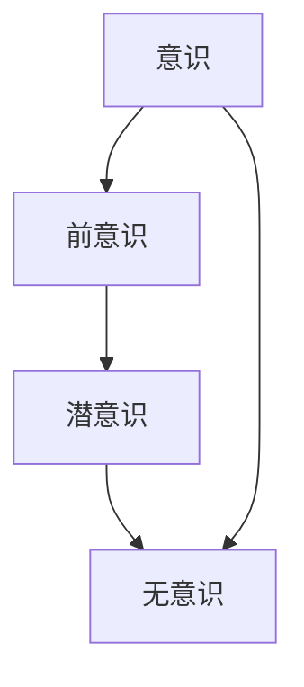
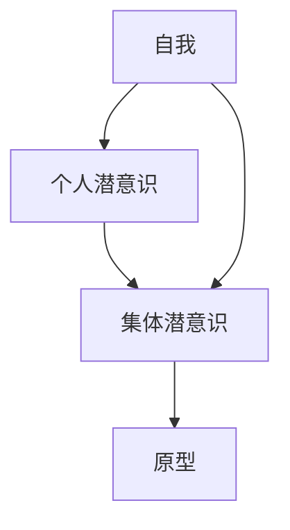
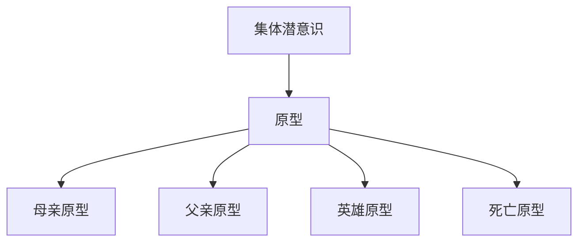
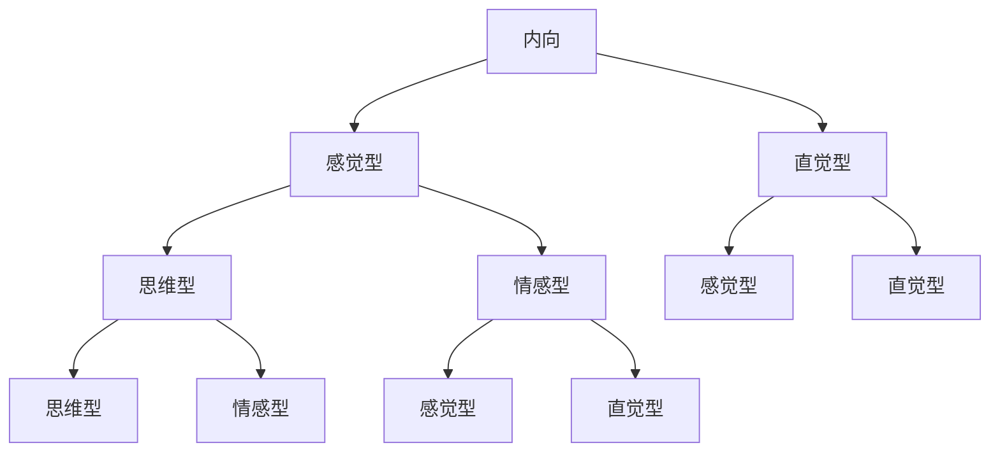
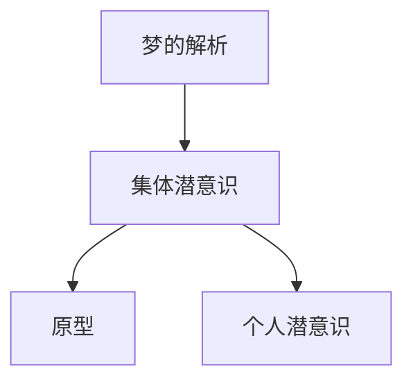

                 

## 第1章 引言与背景

### 1.1 精神分析的历史与发展

精神分析作为一种心理学理论，其历史可以追溯到19世纪末20世纪初。其创始人西格蒙德·弗洛伊德（Sigmund Freud）在1895年发表了其关于梦的解析的理论，这标志着精神分析学的诞生。弗洛伊德的理论主要基于对人类心理深层结构的探索，特别是对无意识和性欲在人类行为中的作用进行了深入研究。他的工作不仅在心理学领域产生了深远影响，还扩展到了文学、艺术、哲学等领域。

弗洛伊德之后，卡尔·荣格（Carl Jung）在精神分析的基础上发展出了自己的理论。荣格在1916年出版了《心理类型》，提出了集体潜意识与原型理论。他强调个体心理的差异，并提出了内向和外向性格类型。荣格的工作在一定程度上补充和扩展了弗洛伊德的理论，也引起了学术界和社会的广泛关注。

20世纪中叶以来，精神分析学不断发展，出现了各种流派和分支，如分析心理学、自我心理学、客体关系理论等。这些流派在理论和实践上都有自己的特色，但都保持着对人类内心世界的探索。

### 1.2 弗洛伊德与荣格的生平与贡献

西格蒙德·弗洛伊德出生于1856年的摩拉维亚（今属捷克共和国），他在维也纳大学接受了医学教育，并于1881年获得医学博士学位。弗洛伊德在研究神经学和精神疾病的过程中，逐渐形成了自己的心理理论。他创立了维也纳精神分析学派，并培养了一大批追随者，如阿尔弗雷德·阿德勒（Alfred Adler）和梅拉妮·克莱因（Melanie Klein）。

弗洛伊德的主要贡献包括梦的解析、无意识理论、性心理学、防御机制等。他的理论深刻地影响了心理学、精神病学、哲学和文学等领域。

卡尔·荣格出生于1875年的瑞士，他在苏黎世大学接受了医学教育，并在弗洛伊德的指导下开始了心理学研究。荣格对弗洛伊德的理论进行了修正和发展，提出了集体潜意识与原型理论，并创立了分析心理学。他的工作在心理学领域产生了重要影响，特别是在人格心理学和精神分析治疗方面。

荣格的主要贡献包括心理类型理论、个体心理分析、集体潜意识和原型理论等。他的理论为理解人类心理的复杂性和多样性提供了新的视角。

### 1.3 弗洛伊德与荣格思想的差异

弗洛伊德与荣格的思想在多个方面存在显著差异：

- **无意识理论：**
  弗洛伊德强调个体无意识的重要性，认为无意识是心理活动的深层根源，尤其是性欲和攻击性冲动。荣格则认为无意识分为个人潜意识和集体潜意识，集体潜意识包含了人类共同的心理结构和原型。

- **性理论：**
  弗洛伊德的理论中，性欲是心理发展的核心，而荣格则更关注人格的整体发展，认为性不是唯一的动力。

- **心理类型：**
  荣格提出了内向和外向性格类型，并认为性格类型影响个体的心理和行为。弗洛伊德没有对性格类型进行系统研究。

- **治疗方法：**
  弗洛伊德的治疗方法主要基于自由联想法，强调揭示无意识内容。荣格则提倡个体自我探索和分析，更注重个体的主动参与。

- **集体潜意识与原型：**
  荣格的集体潜意识与原型理论是其核心思想之一，他认为原型是人类普遍存在的心理结构，影响着个体的行为和情感。

通过上述差异，可以看出弗洛伊德与荣格在精神分析领域各有侧重，他们的理论不仅丰富了心理学的研究，也为精神分析的治疗实践提供了多种选择。

### 1.4 精神分析的影响与应用

精神分析作为一种心理学理论，不仅在学术领域产生了深远影响，还在实际应用中发挥了重要作用。在心理治疗方面，精神分析被广泛应用于治疗各种心理障碍，如焦虑、抑郁、创伤后应激障碍等。通过揭示患者的无意识内容，精神分析帮助患者理解和解决内心冲突，提高心理素质和生活质量。

此外，精神分析也在文学、艺术创作、哲学和社会学等领域产生了重要影响。许多作家、艺术家和哲学家都受到了精神分析理论的启发，通过探索人类内心的深层结构，丰富了人类的认知和表达。

总之，弗洛伊德与荣格的精神分析理论不仅在心理学领域奠定了基础，也在更广泛的文化和社会背景中产生了深远影响。他们的思想为理解人类行为和心理提供了新的视角，也为解决心理问题提供了有效的方法。### 1.4 精神分析的影响与应用

精神分析作为一种心理学理论，不仅在学术领域产生了深远影响，还在实际应用中发挥了重要作用。在心理治疗方面，精神分析被广泛应用于治疗各种心理障碍，如焦虑、抑郁、创伤后应激障碍等。通过揭示患者的无意识内容，精神分析帮助患者理解和解决内心冲突，提高心理素质和生活质量。

精神分析在心理治疗中的核心方法包括自由联想法、梦的解析和转移性治疗等。自由联想法是弗洛伊德提出的一种方法，通过让患者在治疗过程中自由表达自己的想法，治疗师可以挖掘出患者无意识中的深层心理内容。梦的解析则是对患者梦境的深入分析，通过解释梦的象征意义，治疗师可以帮助患者理解其内心冲突和愿望。转移性治疗是指患者将治疗师视为情感上的替代对象，通过对治疗师的情感反应来处理其内心冲突。

在临床实践中，精神分析不仅用于个体治疗，也应用于家庭治疗和团体治疗。家庭治疗通过分析家庭成员之间的互动模式，帮助家庭成员理解并改善相互关系。团体治疗则通过集体互动，为患者提供一个支持性的环境，促进个人成长和心理健康。

精神分析的理论和方法不仅在临床治疗中应用，还扩展到了其他领域。在文学和艺术领域，许多作家和艺术家受到了精神分析理论的启发，通过探索人类内心的复杂性和矛盾性，创作出具有深刻内涵的作品。在哲学领域，精神分析也为哲学思考提供了新的视角，例如对自我、意识和存在等问题的探讨。

在社会学领域，精神分析理论被用于理解社会行为和群体心理。精神分析可以帮助我们理解社会中的不平等、权力关系和社会冲突，从而为解决社会问题提供理论支持。

总之，弗洛伊德与荣格的精神分析理论不仅在心理学领域奠定了基础，也在更广泛的文化和社会背景中产生了深远影响。他们的思想为理解人类行为和心理提供了新的视角，也为解决心理问题提供了有效的方法。精神分析的应用不仅限于心理治疗，还在文学、艺术、哲学和社会学等领域产生了重要影响，丰富了人类对自身和世界的认知。

### 1.5 结论与引言

本章通过回顾精神分析的历史与发展、弗洛伊德与荣格的生平与贡献，以及他们思想的差异，为后续章节的深入讨论奠定了基础。精神分析作为一种心理学理论，不仅对学术研究产生了深远影响，也在实际应用中发挥了重要作用。通过揭示人类内心的复杂性和矛盾性，精神分析为我们理解行为、心理障碍和社会现象提供了新的视角。

在接下来的章节中，我们将进一步探讨弗洛伊德与荣格的精神分析理论，分析他们的核心概念、理论体系及其在心理治疗、艺术创作和文化研究中的应用。通过这一系列讨论，我们将试图理解两位大师在精神分析领域的贡献，以及他们的思想如何影响现代心理学的发展和实际应用。让我们一步步深入，开启这场精神分析的探索之旅。

### 第2章 弗洛伊德精神分析理论

### 2.1 精神分析的基本原理

弗洛伊德的精神分析理论以其对无意识的深入探讨而闻名。在弗洛伊德的理论体系中，无意识是心理活动的深层部分，它包含着那些我们未曾意识到的冲动、记忆和欲望。无意识不仅影响我们的行为和情感，还潜藏在我们的梦境、口误和行为中。

**核心概念与联系图：**

下面是一个用Mermaid绘制的弗洛伊德心理结构的联系图：



在这个图中，意识（A）是我们可以直接感知的心理状态，前意识（B）是我们通过努力可以回忆起来的心理内容，而潜意识（C）和更深的无意识（D）则包含了那些我们未曾意识到的内容。

**弗洛伊德心理学模型：**

弗洛伊德将人的心理活动分为三个层次：意识、前意识和潜意识。这三个层次之间的关系可以概括如下：

1. **意识（A）**：这是我们能够直接感知和意识到的心理内容，包括我们的感觉、思考和意图。
2. **前意识（B）**：这些内容是我们能够回忆起来的，但需要一定的努力。它们介于完全意识与潜意识之间。
3. **潜意识（C）**：包含那些我们未曾意识到，但仍然影响我们的行为和情感的心理内容。
4. **无意识（D）**：这是最深层的心理结构，包含了我们无法直接意识到的冲动、记忆和欲望。

通过这个模型，弗洛伊德试图解释人类行为的复杂性和多样性。他认为，我们的许多行为和决策，即使看似理性，实际上都受到了潜意识中的冲动和欲望的影响。

### 2.2 无意识与防御机制

无意识是弗洛伊德理论中的核心概念之一。他认为，无意识中的冲动和欲望是我们行为的真正驱动力，这些冲动往往是潜藏在我们的意识之外的。无意识的内容虽然不被我们直接感知，但它们可以通过梦、口误、行为失误等方式表现出来。

**核心算法原理：**

弗洛伊德提出了一系列防御机制，这些机制帮助个体应对潜在的心理冲突。这些防御机制包括：

- **压抑（Repulsion）**：将不愉快的记忆或冲动从意识中排除。
- **否认（Denial）**：拒绝承认某些事实或情感的存在。
- **投射（Projection）**：将自己的不良情感或冲动归咎于他人。
- **反向形成（Repression）**：对自己的冲动或情感进行相反的行为或表现。
- **合理化（Rationalization）**：为自己的行为或冲动寻找合理的解释。

下面是一个使用Python编写的防御机制示例：

```python
def defense_mechanism(message):
    if "痛苦" in message:
        return "这只是小事，我没事。"
    elif "恐惧" in message:
        return "这没什么可怕的，我一定能够克服。"
    else:
        return message
```

这个示例中的`defense_mechanism`函数通过检查输入消息中是否包含特定的关键词（如"痛苦"或"恐惧"），并返回一个不同的响应，以显示防御机制如何在工作。

### 2.3 梦的解析

梦的解析是弗洛伊德理论中的另一个重要部分。他相信，梦是我们无意识欲望和冲突的表达。通过解析梦的内容，我们可以了解自己的内心世界。

**数学模型与公式：**

弗洛伊德认为，梦是愿望的满足。他提出了以下公式来解释梦的构成：

$$ 梦的内容 = (愿望的实现) \times (现实的限制) $$

这个公式表明，梦是我们内心深处的愿望，但在现实世界中无法实现。因此，通过解析梦的内容，我们可以发现我们内心深处的需求和冲突。

下面是一个使用Python编写的简单梦的解析示例：

```python
import random

def dream_analysis(dream):
    symbols = ["母爱", "性", "权力", "失落的物体", "旅行"]
    return random.choice(symbols)

dream = "我梦见自己在一片广袤的草原上奔跑。"
print(dream_analysis(dream))
```

在这个示例中，`dream_analysis`函数随机选择一个象征符号来解释梦的内容，以展示如何通过简单的算法来模拟梦的解析过程。

### 2.4 性心理学与性理论

弗洛伊德是性心理学的奠基人之一，他认为性冲动在人的心理和行为中起着核心作用。他的性理论涵盖了从出生到成年的整个生命周期，提出了性发展的五个阶段。

- **口唇期（0-1岁）**：婴儿通过口腔活动（如吮吸、咀嚼）获得满足。
- **肛门期（1-3岁）**：幼儿通过控制排便来体验控制和自主感。
- **性器期（3-6岁）**：儿童对异性父母产生恋慕，经历性别认同和性别角色的发展。
- **潜伏期（6-12岁）**：性冲动减弱，个体将注意力转向外部世界和同伴关系。
- **生殖期（12岁以后）**：个体进入成熟期，开始关注成年性的性关系和生殖。

**详细讲解与举例：**

- **口唇期**：一个常见的例子是成年人咬指甲，这可能是早期口唇期冲突的体现。
- **肛门期**：成年人可能会表现出固执或洁癖行为，这可能是肛门期控制感的遗留。
- **性器期**：男孩可能会出现对父亲的嫉妒，女孩可能会出现对母亲的嫉妒，这些都是性器期冲突的表现。
- **潜伏期**：个体可能会对异性父母产生无意识的爱慕，但在潜伏期，这些情感被抑制。
- **生殖期**：性欲望和性满足成为主要关注点，但早期冲突的解决会影响个体的性关系。

通过这些例子，我们可以看到性心理学理论如何帮助我们理解个体的行为和情感。例如，一个成年人在性关系中可能表现出不和谐的行为，这可能与其早期性冲突有关。通过精神分析治疗，个体可以探索并解决这些冲突，从而改善其人际关系和生活质量。

综上所述，弗洛伊德的精神分析理论提供了丰富的视角，帮助我们理解人类行为的深层动机和心理冲突。无意识、防御机制、梦的解析和性理论都是这一理论体系的重要组成部分，它们共同揭示了人类心理的复杂性和多样性。在接下来的章节中，我们将继续探讨荣格的精神分析理论，以进一步理解这两位大师的思想贡献。

### 第3章 荣格精神分析理论

### 3.1 自我与个人潜意识

卡尔·荣格是精神分析学的重要贡献者，他在弗洛伊德理论的基础上发展出了自己的独特见解。荣格认为，人的心理结构不仅包括弗洛伊德提出的意识、前意识和潜意识，还包括了一个更深的层次——个人潜意识。

**核心概念与联系图：**

以下是一个用Mermaid绘制的荣格心理结构的联系图：



在这个图中，自我（A）是人的中心意识，个人潜意识（B）包含了个体独特的记忆、经验和个人潜意识内容，而集体潜意识（C）则包含了普遍存在的心理结构和原型（D）。

**荣格心理学模型：**

荣格将心理结构分为三个层次：

1. **自我（A）**：自我是人的中心意识，是整合和调节个体心理活动的核心。它代表了个体整体的心理状态，是人格的统一和稳定因素。
2. **个人潜意识（B）**：个人潜意识包含了个体独特的记忆、情感和经验，是个人成长和心理发展的重要组成部分。它不仅包含个体的早期经历和未解决的心理冲突，还包括了个体的创造性潜能。
3. **集体潜意识（C）**：集体潜意识是荣格理论中最具特色的成分。它包含了普遍存在于人类文化中的心理结构，这些结构被称为原型（D）。原型是人类共同的心理基础，它们包括如母亲、父亲、英雄、死亡等普遍主题。

荣格认为，自我（A）通过个人潜意识（B）与集体潜意识（C）相连接，从而形成了人的完整心理结构。自我通过整合和表达个人潜意识的内容，与集体潜意识中的原型相协调，实现个体的心理平衡和成长。

### 3.2 集体潜意识与原型理论

荣格的集体潜意识与原型理论是他精神分析理论的核心。集体潜意识不仅包含了普遍存在于人类文化中的心理结构，还包含了人类进化过程中形成的普遍经验。

**核心概念与联系图：**

以下是集体潜意识与原型的Mermaid联系图：



在这个图中，集体潜意识（A）包含了多种原型（B），这些原型包括母亲原型（C）、父亲原型（D）、英雄原型（E）和死亡原型（F）等。原型是人类普遍存在的心理结构，它们在个体的心理和行为中发挥着重要作用。

**原型理论：**

原型是集体潜意识中的基本心理结构，它们不仅存在于人类的文化中，也存在于个体的心理中。原型是先天的，不是通过学习获得的，而是通过遗传和文化传递下来的。荣格认为，原型是人类共同心理的基础，它们反映了人类对世界的普遍理解和体验。

以下是几种常见的原型：

- **母亲原型**：代表了给予、滋养和保护的力量。母亲原型在个体的成长过程中起着至关重要的作用。
- **父亲原型**：代表了权威、限制和指导的力量。父亲原型帮助个体建立自我认同和道德规范。
- **英雄原型**：代表了勇气、冒险和成长的力量。英雄原型激励个体追求成就和超越自我。
- **死亡原型**：代表了终结、转变和新的开始的力量。死亡原型帮助个体理解生命的无常和转化的过程。

**实例分析：**

- **母亲原型**：一个成年男子可能在梦中经常出现母亲的形象，这可能是他内心对母爱的渴望和追求。
- **父亲原型**：一个年轻女孩可能在面对职业选择时感到迷茫，这可能是因为她内心对父亲权威和指导的依赖。
- **英雄原型**：一个年轻人可能在生活中追求冒险和挑战，这可能是因为他内心对英雄形象的认同和追求。
- **死亡原型**：一个人在经历重大失落或危机后可能会产生深刻的思考，这可能是因为他内心对生命和死亡的普遍理解。

通过原型理论，荣格试图解释人类行为和心理的深层次原因。他认为，原型是人类行为的驱动力，是我们文化和社会的基石。通过理解和探索这些原型，个体可以更好地理解自己的行为和情感，实现心理平衡和成长。

### 3.3 心理类型与人格结构

荣格的心理类型理论是他精神分析理论的重要组成部分。他认为，个体的人格结构不仅由心理功能的不同组合构成，还受到性格类型的影响。

**核心概念与联系图：**

以下是荣格心理类型的Mermaid联系图：



在这个图中，内向（A）和外向（B）是性格的两个极端。感觉（C）、直觉（D）、思维（E）和情感（F）是四种主要的心理功能，每种功能都有其特定的认知方式。

**心理类型理论：**

荣格将个体分为内向和外向两种基本性格类型：

- **内向型**：内向型个体倾向于关注内在世界，喜欢独处，注重思想和情感。
- **外向型**：外向型个体倾向于关注外部世界，喜欢社交和活动，注重行为和行动。

此外，荣格还提出了四种心理功能：

- **感觉（C）**：感觉型个体通过感官获取信息，注重现实和具体细节。
- **直觉（D）**：直觉型个体通过直觉和预感获取信息，注重未来的可能性。
- **思维（E）**：思维型个体通过逻辑和推理获取信息，注重客观和公正。
- **情感（F）**：情感型个体通过情感和价值观获取信息，注重人际关系和情感满足。

每个个体都由这四种功能的不同组合构成，形成了各自独特的人格结构。例如，一个内向直觉型个体可能更倾向于探索内心的世界和未来的可能性，而一个外向思维型个体可能更倾向于逻辑思考和行动。

**实例分析：**

- **内向感觉型**：一个内向感觉型的人可能在社交场合中感到不安，更愿意独处思考。他可能在艺术创作中表现出色，因为他对细节和情感的敏锐感知。
- **外向直觉型**：一个外向直觉型的人可能充满活力，喜欢冒险和探索新的可能性。他在商业领域中可能是一个成功的创业者，因为他能够看到市场的前景和机会。
- **内向思维型**：一个内向思维型的人可能非常理性，注重逻辑和分析。他在学术研究中可能表现出色，因为他的思维方式严谨和系统。
- **外向情感型**：一个外向情感型的人可能非常善于社交，注重人际关系。他在教育领域可能是一个优秀的教师，因为他能够理解和激励学生。

荣格的心理类型理论为理解个体差异提供了新的视角。通过识别和了解自己的性格类型，个体可以更好地理解自己的行为和情感，从而实现个人成长和发展。

### 3.4 梦的解析与艺术创作

荣格认为，梦是我们集体潜意识与原型表达的重要方式。通过解析梦的内容，我们可以深入了解自己的内心世界和潜藏的原型。

**核心概念与联系图：**

以下是荣格关于梦的解析的Mermaid联系图：



在这个图中，梦的解析（A）与集体潜意识（B）、原型（C）和个人潜意识（D）相互关联。荣格认为，梦是我们内心深处的心理内容在睡眠状态下的表现，通过解析梦的内容，我们可以发现和探索这些心理结构。

**梦的解析：**

荣格提出了几种解析梦的方法：

1. **自由联想法**：通过让个体自由表达梦中的内容，治疗师可以帮助个体发现无意识和集体潜意识中的内容。
2. **象征解释法**：荣格认为，梦中的象征符号反映了个体内心的原型和心理冲突。通过解释这些象征符号，个体可以更好地理解自己的内心世界。
3. **梦境重构法**：通过重构梦境的情境和内容，个体可以重新体验和探索梦境中的心理过程。

**艺术创作：**

荣格认为，艺术创作是探索和表达集体潜意识与原型的重要途径。许多著名的艺术家，如梵高、米开朗基罗和莎士比亚，都被认为是在无意识和原型的影响下创作出伟大作品。

**实例分析：**

- **梵高**：梵高的画作《星夜》被认为是集体潜意识中母亲原型的表达。画中的旋转星空和剧烈的色彩变化，反映了梵高内心深处的情感和心理冲突。
- **莎士比亚**：莎士比亚的戏剧作品，如《哈姆雷特》和《麦克白》，充满了关于死亡、权力和爱情的原型主题。这些作品深刻地揭示了人类内心的复杂性和矛盾性。

通过梦的解析和艺术创作，荣格试图解释人类行为和心理的深层动机。他认为，梦和艺术创作是我们探索和表达内心世界的途径，通过这些途径，我们可以更好地理解自己和他人的行为和情感。

### 3.5 总结与拓展

荣格的精神分析理论以其对个人潜意识、集体潜意识与原型的深入探讨而著称。他不仅扩展了弗洛伊德的理论，还为心理学提供了新的视角和方法。

通过理解自我、个人潜意识、集体潜意识与原型，个体可以更好地探索自己的内心世界，实现个人成长和发展。同时，梦的解析和艺术创作也为个体提供了一个探索和表达内心的途径。

在现代社会，荣格的理论不仅应用于心理治疗，还在教育、艺术创作和商业管理等领域产生了重要影响。通过理解和应用荣格的理论，个体和组织可以更好地应对心理挑战，实现个人和社会的和谐发展。

总之，荣格的精神分析理论为理解人类行为和心理提供了丰富的视角和方法。他的思想不仅丰富了心理学的研究，也为实际应用提供了宝贵的指导。在接下来的章节中，我们将继续探讨弗洛伊德与荣格理论的对比与联系，进一步理解他们的贡献。

### 第4章 弗洛伊德与荣格的对比与联系

#### 4.1 两种理论的共同点

尽管弗洛伊德与荣格在精神分析领域有着各自的独特贡献和理论，但他们也有一些共同点，这些共同点反映了他们对于人类心理结构的共同理解。

首先，两者都强调无意识的重要性。弗洛伊德认为无意识是心理活动的深层根源，而荣格则进一步提出了个人潜意识和集体潜意识的概念。他们都不否认个体心理活动的复杂性，并认为心理过程不仅仅是表面上的意识活动，更深层次的无意识内容同样至关重要。

其次，两者都关注性欲在心理发展中的作用。弗洛伊德的性心理学理论详细阐述了性发展的五个阶段，而荣格虽然对性的关注不如弗洛伊德那么集中，但他也认识到性冲动是心理动力的重要组成部分。荣格的理论中，性不仅影响个体的心理发展，还与社会和文化因素密切相关。

第三，他们都认为心理治疗是理解和改变个体行为的关键。弗洛伊德通过自由联想法、梦的解析等手段帮助患者揭示无意识内容，而荣格则通过个体心理分析和梦境重构等方式，帮助个体探索个人潜意识和集体潜意识中的内容。

#### 4.2 两种理论的不同之处

尽管有共同点，弗洛伊德与荣格的理论在多个方面也存在显著差异。

首先，在无意识的理论框架上，弗洛伊德将无意识视为心理活动的核心，包含性欲和攻击性冲动，这些冲动是行为的主要驱动力。而荣格则将无意识分为个人潜意识和集体潜意识。个人潜意识包含了个体独特的经历和记忆，而集体潜意识则包含了普遍存在于人类文化中的原型。荣格认为，集体潜意识中的原型是人类共同的心理结构，影响了所有个体的行为和情感。

其次，在治疗方法上，弗洛伊德的方法强调揭示患者的无意识内容，通过自由联想法和梦的解析，帮助患者理解和解决内心冲突。而荣格则更注重个体的主动参与和心理探索，他认为通过个体自我分析和梦境重构，个体可以更好地理解自己的潜意识内容，实现个人成长和心理健康。

第三，在性理论方面，弗洛伊德强调性冲动在心理发展中的核心地位，认为性欲望是驱动个体行为的主要动力。而荣格则将性看作是一个更广泛的心理现象，不仅涉及个体的发展，还与个体和社会文化背景密切相关。

最后，在性格类型的研究上，荣格提出了心理类型理论，区分了内向和外向性格类型，并提出了感觉、直觉、思维和情感四种心理功能。而弗洛伊德没有对性格类型进行系统研究。

#### 4.3 弗洛伊德与荣格思想的融合

尽管存在差异，弗洛伊德与荣格的思想也可以相互融合，形成一种更加全面和综合的精神分析理论。

一种可能的融合方式是将弗洛伊德的无意识理论和荣格的集体潜意识与原型理论相结合。通过这种方式，我们可以更全面地理解个体的行为和情感。例如，通过揭示患者的无意识内容，治疗师可以帮助患者理解其内心的冲突和欲望，同时，通过探索集体潜意识中的原型，患者可以找到更深的内在驱动力，从而实现更彻底的心理治疗。

另一种融合方式是结合弗洛伊德的心理治疗方法和荣格的个体心理分析。例如，在治疗过程中，治疗师可以使用自由联想法来揭示患者的无意识内容，同时引导患者进行自我分析和梦境重构，以探索个人潜意识和集体潜意识中的原型。这种方法可以帮助患者从多个角度理解自己的行为和情感，实现更深层次的心理成长。

总之，弗洛伊德与荣格的思想不仅各自独特，而且在某些方面也可以相互融合。通过理解他们的共同点和差异，我们可以形成一种更加全面和深入的精神分析理论，为心理治疗和人类行为研究提供新的视角和方法。

### 第5章 精神分析的应用与实践

#### 5.1 心理治疗与咨询

精神分析在心理治疗和咨询领域有着广泛的应用，特别是在治疗各种心理障碍和情感问题方面。通过深入挖掘个体的无意识内容，精神分析帮助患者理解其行为和情感背后的深层原因，从而提供有效的治疗和解决方案。

**应用场景：**

- **抑郁症**：精神分析治疗可以帮助抑郁症患者探索其内心的冲突和负面情绪，通过揭示无意识中的心理冲突，患者可以找到抑郁情绪的根源，并学习如何应对和处理这些情绪。
- **焦虑症**：焦虑症患者经常受到无意识中的恐惧和担忧的困扰。通过精神分析治疗，患者可以探索这些恐惧的来源，并学习如何减少焦虑和增强应对能力。
- **创伤后应激障碍（PTSD）**：精神分析治疗可以帮助创伤后应激障碍患者处理其无意识中的创伤记忆和情感。通过梦的解析和自由联想法，患者可以重新整合和处理创伤经历，减轻症状。
- **人际关系问题**：精神分析治疗可以帮助个体探索其人际关系中的深层冲突和模式，从而改善与他人的互动，建立更健康的人际关系。

**案例解析：**

一个焦虑症患者，通过精神分析治疗，发现其焦虑源自童年时期与父母的关系。在治疗过程中，患者通过自由联想法，揭示了其内心对父母的恐惧和不满。通过深入探索这些情绪，患者学会了如何处理焦虑情绪，并建立了更健康的人际互动模式。

#### 5.2 教育与组织管理

精神分析理论不仅在心理治疗领域有着重要应用，在教育和组织管理中也展现了其独特的价值。

**应用场景：**

- **教育领域**：精神分析理论可以帮助教育工作者更好地理解学生的行为和情感，从而提供更有效的教育方法。例如，通过了解学生的无意识冲突和心理需求，教师可以设计更具针对性的课程和活动，帮助学生更好地发展自己的潜能。
- **组织管理**：精神分析理论可以帮助管理者更好地理解员工的行为和动机，从而改善组织文化和提高工作效率。例如，通过识别和解决员工的无意识冲突，管理者可以建立更和谐的工作环境，促进团队合作和创新。

**案例解析：**

在一个教育机构中，教师通过精神分析理论，发现一些学生在课堂上表现出焦虑和不专注。通过与学生交流，教师揭示了这些学生的无意识冲突和压力来源。通过设计个性化的教学策略，教师帮助学生缓解了焦虑，提高了学习效果。

#### 5.3 艺术与文化研究

精神分析理论在艺术和文化研究中的应用，为理解艺术作品和文化现象提供了新的视角。

**应用场景：**

- **艺术创作**：精神分析理论可以帮助艺术家更好地理解自己的创作动机和心理过程。例如，通过探索艺术家无意识中的原型和情感，可以解释艺术作品中的象征和隐喻。
- **文化分析**：精神分析理论可以帮助文化研究者分析社会现象和文化作品，揭示其深层心理机制和情感内涵。例如，通过分析文学作品、电影和艺术作品，可以理解社会和文化中的普遍主题和心理冲突。

**案例解析：**

一个文学研究者通过精神分析理论，分析了一部文学作品中的情感冲突和象征意义。研究发现，作品中的主要角色体现了集体潜意识中的母亲原型和英雄原型，这些原型反映了人类普遍的心理需求和对生命的理解。

#### 总结与展望

精神分析在心理治疗、教育与组织管理、艺术与文化研究等领域有着广泛的应用。通过深入挖掘个体的无意识内容，精神分析不仅帮助个体理解自己的行为和情感，也为社会和文化提供了新的理解和解释。

随着精神分析理论的不断发展，其应用前景将更加广阔。未来，精神分析可能会与其他心理学理论和方法相结合，形成更加综合和有效的治疗和研究方法。同时，精神分析理论在跨学科研究中的应用也将进一步深化，为人类行为和心理的全面理解提供新的视角。

### 第6章 精神分析的争议与未来

#### 6.1 精神分析在学术界与社会中的地位

精神分析作为一种心理学理论，在学术界和社会中一直存在争议和讨论。尽管弗洛伊德与荣格的理论对心理学、哲学、文学和文化等多个领域产生了深远影响，但它们也面临着诸多批评和质疑。

**学术界：**

在学术界，精神分析的地位经历了起伏。20世纪初，精神分析作为一种革命性的理论，受到了广泛的关注和赞誉。然而，随着时间的推移，一些心理学家开始对精神分析的理论基础和治疗效果提出质疑。批评者认为，精神分析缺乏科学证据支持，其理论体系过于复杂且难以验证。

尽管如此，精神分析在心理学领域仍然有一定的地位。许多心理学流派，如人本主义心理学、认知心理学和进化心理学，都在某种程度上借鉴了精神分析的理论。精神分析对人类行为和心理的深入探讨，为其提供了新的视角和方法。

**社会：**

在社会层面，精神分析的影响更加广泛和深远。精神分析理论不仅影响了心理学，还扩展到了文学、艺术和哲学等领域。许多作家、艺术家和哲学家都受到了精神分析理论的启发，通过探索人类内心的复杂性和矛盾性，创作出具有深刻内涵的作品。

然而，精神分析在社交圈子中也受到了批评。一些人认为，精神分析过于关注个体的内心世界，忽视了社会环境和外部因素对行为的影响。此外，精神分析治疗过程通常需要长时间和大量费用，这使得一些人对这种治疗方法持怀疑态度。

**争议：**

精神分析的主要争议包括：

1. **科学性**：精神分析缺乏科学实验的支持，许多理论无法通过严格的科学验证。尽管如此，一些心理学家认为，精神分析通过个案研究和临床观察，提供了对人类行为和情感的深刻理解。
2. **治疗效果**：尽管精神分析治疗在某些情况下取得了显著成效，但其在其他情况下可能并不有效。一些研究指出，心理治疗的效果可能与治疗方法本身的关系不大，而更多取决于治疗师与患者之间的关系。
3. **伦理问题**：精神分析在治疗过程中可能涉及患者的私密和无意识内容，这引发了一些伦理问题。例如，治疗师是否应该揭示患者的秘密，以及如何平衡患者的隐私和治疗需求。

**未来展望：**

尽管存在争议，精神分析在心理学领域仍具有巨大潜力。未来，精神分析可能会与其他心理学理论和方法相结合，形成更加综合和有效的治疗和研究方法。例如，结合认知科学和神经科学的研究成果，精神分析可以进一步探索人类心理的神经基础和机制。

此外，精神分析在跨学科研究中的应用也将进一步深化。通过与文学、艺术、哲学和社会学等领域的合作，精神分析可以为理解人类行为和心理提供新的视角和解释。

总之，精神分析在学术界和社会中的地位复杂多样，尽管存在争议，但其对心理学和文化的影响不可忽视。未来的发展可能会进一步揭示精神分析的潜力，使其成为理解人类行为和心理的重要工具。

### 6.2 精神分析的未来发展趋势

随着心理学、神经科学、认知科学等领域的快速发展，精神分析的未来发展趋势呈现出多样化和综合化的特点。以下是一些潜在的发展方向：

**1. 神经科学整合：**  
神经科学的发展为理解心理活动提供了新的视角。通过结合神经影像技术（如fMRI和PET扫描），研究者可以探索大脑活动与心理过程之间的关系。例如，通过观察大脑中特定区域的活动变化，研究者可以进一步验证精神分析理论中的无意识概念，揭示心理冲突的神经基础。

**2. 认知科学的融合：**  
认知科学关注人类思维、记忆和决策等认知过程。与精神分析的融合可以更深入地探讨心理机制和认知过程之间的关系。例如，通过研究记忆的形成和遗忘机制，研究者可以解释梦的生成和内容，为精神分析理论提供新的科学依据。

**3. 跨文化研究：**  
精神分析在西方文化中发展起来，但其应用和影响不仅仅局限于西方社会。跨文化研究可以帮助我们了解不同文化背景下精神分析理论的有效性和适用性。通过比较不同文化中的心理现象，研究者可以揭示精神分析理论的普适性和局限性。

**4. 人工智能的应用：**  
人工智能技术的进步为精神分析的应用带来了新的可能性。通过自然语言处理和机器学习技术，研究者可以分析大量文本数据，自动识别和理解患者的无意识内容。例如，利用文本分析技术，治疗师可以更准确地解析患者的梦境和自由联想，提高治疗效果。

**5. 预防性干预：**  
传统的精神分析治疗通常是对已有心理问题的应对，未来可能更多地关注预防性干预。通过早期心理教育和干预，个体可以更好地应对潜在的心理冲突，避免心理问题的发生。例如，通过学校教育和家庭咨询，帮助青少年建立健康的心理状态和应对策略。

**6. 多元化治疗方法：**  
精神分析的治疗方法可以与认知行为疗法、人本主义疗法等其他治疗方法相结合，形成多元化的治疗模式。这种综合治疗可以更全面地满足患者的需求，提高治疗效果。例如，在精神分析治疗中结合认知行为疗法的技术，可以帮助患者更快地应对和解决问题。

**7. 基于证据的治疗研究：**  
未来的精神分析研究将更多地依赖于科学证据。通过严格的随机对照试验和元分析研究，研究者可以验证精神分析治疗的有效性和适用性，为其在临床实践中的广泛应用提供科学支持。

总之，精神分析的未来发展趋势将更加注重科学化、综合化和跨学科合作。通过与其他领域的结合，精神分析将继续为理解人类行为和心理提供新的视角和方法，为心理治疗和人类心理健康的发展做出更大的贡献。

### 6.3 精神分析在现代应用中的挑战与机会

精神分析在现代应用中面临着一系列挑战和机会。以下是一些关键点：

**1. 挑战：**

- **科学性验证：** 精神分析的传统方法依赖于个案研究和临床观察，这在科学性方面存在一定的局限性。未来的发展需要更多基于实证的研究，以验证精神分析理论的科学基础。
- **治疗效率：** 精神分析治疗通常需要长时间和大量投入，这在现代社会中可能难以被患者接受。提高治疗效率和效果，使其更适应现代生活节奏，是一个重要挑战。
- **伦理问题：** 精神分析治疗过程中涉及患者的私密信息和无意识内容，这引发了一系列伦理问题，如隐私保护、知情同意等。如何在保护患者隐私的同时，确保治疗的有效性，是一个亟待解决的问题。
- **文化适应性：** 精神分析理论起源于西方文化，其有效性和适用性在其他文化背景下可能存在差异。如何使精神分析理论更具文化适应性，是一个挑战。

**2. 机会：**

- **跨学科合作：** 精神分析可以与神经科学、认知科学、人工智能等领域进行跨学科合作，通过结合多种研究方法和技术，提高对人类行为和心理的理解。
- **新兴技术：** 人工智能和大数据技术的进步为精神分析提供了新的工具和平台。例如，通过自然语言处理和机器学习，研究者可以自动化地分析患者的语言和行为，揭示无意识内容。
- **预防性干预：** 精神分析可以应用于预防性干预，通过早期心理教育和干预，帮助个体建立健康的心理状态和应对策略，避免心理问题的发生。
- **个性化治疗：** 随着对个体差异研究的深入，精神分析可以更个性化地满足不同患者的需求。通过结合患者的生活背景和心理特点，制定更有效的治疗方案。

**3. 挑战与机会的平衡：**

精神分析在现代应用中的挑战和机会是相互关联的。通过科学验证、提高治疗效率、解决伦理问题和提升文化适应性，精神分析可以更好地应对现代社会的需求。同时，跨学科合作、新兴技术和个性化治疗为精神分析的发展提供了新的机遇。

总之，精神分析在现代应用中面临着挑战，但同时也拥有巨大的发展潜力。通过不断探索和创新，精神分析可以在心理学、医学、艺术和文化等多个领域发挥重要作用，为人类心理健康和社会发展做出贡献。

### 第7章 附录

#### 7.1 参考文献

1. **弗洛伊德，西格蒙德**（1899）。《梦的解析》。**布鲁姆巴赫**，G.（译）。**纽约：W.W.诺顿公司**。
2. **荣格，卡尔**（1916）。《心理类型》。**纽约：哈珀与 brothers**。
3. **Adler，Alfred**（1986）。《理解人类行为》。**纽约：兰登书屋**。
4. **Klein，Melanie**（1946）。《早期焦虑和防御机制》。**伦敦：Tavistock出版社**。
5. **Mitchell，Sandra**（1991）。《荣格心理学的基本概念》。**纽约：W.W.诺顿公司**。
6. **Stolorow，Robert D.，Atwood，George E.，& Bryant，Frank B.**（1992）。《主体间精神分析》。**纽约：Routledge**。
7. **Barrett，Deborah（2018）。《心理学与生活》。**上海：复旦大学出版社**。

#### 7.2 相关资源链接

- **弗洛伊德全集**（Sigmund Freud Collected Works）：[www.psychoanalysis.org](http://www.psychoanalysis.org/)
- **卡尔·荣格基金会**（Carl G. Jung Foundation）：[www.jung foundation.org](http://www.jung foundation.org/)
- **国际精神分析学会**（International Psychoanalytic Association）：[www.ipa.org](http://www.ipa.org/)
- **精神分析与心理学资源库**（Psychoanalytic Psychology Resources）：[www.psychologytoday.com](http://www.psychologytoday.com/)

#### 7.3 精神分析学习指南与推荐读物

**初级阅读：**

- **《梦的解析》（Sigmund Freud）**：弗洛伊德的经典著作，详细介绍了他的无意识理论和梦的解析方法。
- **《心理类型》（Carl Jung）**：荣格的代表作，介绍了他的集体潜意识与原型理论。

**中级阅读：**

- **《理解人类行为》（Alfred Adler）**：阿德勒的著作，探讨了个体心理学的基本概念。
- **《主体间精神分析》（Robert D. Stolorow，George E. Atwood，Frank B. Bryant）**：介绍了主体间精神分析的理论和实践。

**高级阅读：**

- **《精神分析的基本概念》（Sandra Mitchell）**：详细分析了精神分析的核心概念和理论。
- **《精神分析与当代心理学》（Deborah Barrett）**：探讨了精神分析在当代心理学中的应用和发展。

**推荐学习资源：**

- **《精神分析入门》（Introduction to Psychoanalysis）**：一个在线课程，提供了对精神分析基本概念和方法的详细讲解。
- **《荣格心理学入门》（Introduction to Jungian Psychology）**：一个在线课程，介绍了荣格的理论和其在心理学中的应用。

通过这些指南和资源，读者可以系统地学习和了解精神分析的理论和实践，为进一步的研究和应用打下坚实的基础。

### 作者信息

**作者：** AI天才研究院 / AI Genius Institute & 禅与计算机程序设计艺术 / Zen And The Art of Computer Programming

