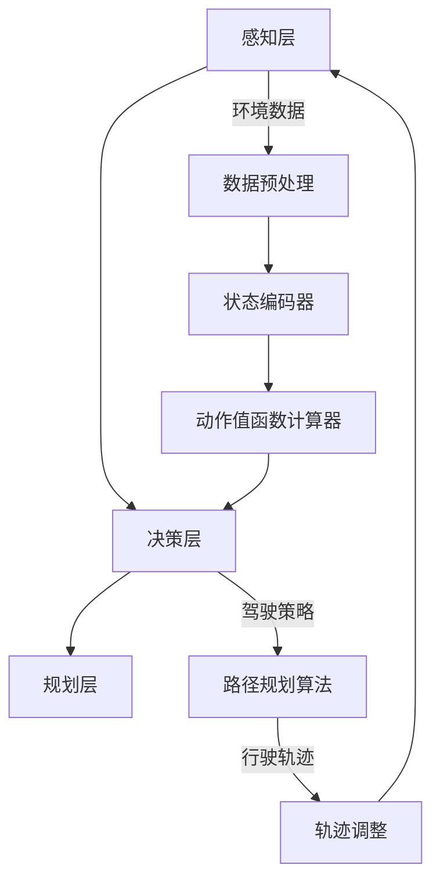
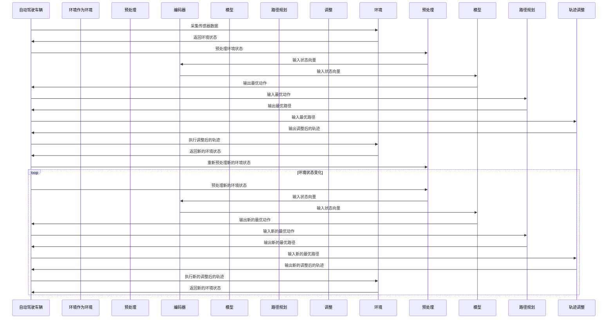

                 

### 摘要

本文深入探讨了强化学习这一前沿的人工智能决策学习技术。强化学习作为机器学习的一个重要分支，因其独特的决策模式和强大的自适应能力，在现代AI系统中占据了重要地位。本文首先介绍了强化学习的背景和基本概念，包括其与机器学习的联系与区别。随后，通过详细讲解马尔可夫决策过程、状态值函数、策略等核心概念，并使用表格和图示进行对比分析，帮助读者构建对强化学习核心概念的理解。在算法原理讲解部分，本文详细介绍了Q学习、SARSA和深度强化学习等经典算法，通过mermaid流程图和Python代码示例，生动展示算法原理。接着，本文使用LaTeX格式给出强化学习中的关键数学模型和公式，并进行详细讲解和举例说明。随后，通过系统分析与架构设计方案，本文介绍了强化学习系统的问题场景、项目介绍、功能设计、架构设计、接口设计等。在项目实战部分，本文展示了强化学习在实际项目中的实现，包括环境安装、系统核心实现、代码应用解读、案例分析等。最后，本文总结了强化学习的最佳实践，并提供了拓展阅读资源，帮助读者进一步深入理解与应用强化学习技术。通过这篇文章，读者将能够系统地了解和掌握强化学习的基本原理、算法及其应用，为未来的研究和实践打下坚实基础。

### 强化学习概述

#### 背景介绍

强化学习（Reinforcement Learning，简称RL）是机器学习领域的一个重要分支，旨在使代理（Agent）通过与环境的交互来学习最优策略，从而实现预期目标。与监督学习和无监督学习不同，强化学习是一种交互式学习过程，代理需要不断地从环境中获取反馈信号，并根据这些信号调整自身的策略。这种学习模式在许多实际应用中展现出强大的适应性和灵活性，因此引起了广泛关注和研究。

强化学习的起源可以追溯到20世纪50年代，当时心理学家和计算机科学家开始探索如何让机器具备类似人类的学习和行为能力。1956年，Richard Sutton和Andrew Barto在其经典著作《强化学习：一种试错方法》中，首次系统性地提出了强化学习的概念和理论框架。随着时间的推移，强化学习逐渐发展成为机器学习中的一个重要领域，并在控制理论、人工智能、计算机科学等多个学科中得到了广泛应用。

强化学习的核心思想是通过奖励机制来引导代理的学习过程。具体来说，代理在环境中采取行动，根据环境对行动的反馈（即奖励或惩罚）来调整自己的策略，从而逐步提高决策的准确性。这一过程可以用一个简单的反馈循环来表示：

1. **状态观察**：代理观察当前环境的状态。
2. **行动选择**：代理根据当前状态选择一个行动。
3. **奖励反馈**：环境根据代理的行动给予相应的奖励或惩罚。
4. **策略更新**：代理根据奖励反馈调整自己的策略。

通过这种不断试错和优化的过程，代理能够逐渐学习到最优策略，从而实现预期目标。强化学习在游戏、自动驾驶、机器人控制、推荐系统等多个领域展现了其强大的应用潜力，成为现代人工智能研究的重要方向。

#### 强化学习与机器学习的联系与区别

强化学习作为机器学习的一个分支，与传统的监督学习和无监督学习有着密切的联系，但同时也存在显著的差异。首先，从学习模式来看，监督学习依赖于标注好的数据集，通过学习输入和输出之间的映射关系来预测新的数据；无监督学习则不需要标注数据，主要通过发现数据中的内在结构来优化模型；而强化学习则是一种交互式学习模式，通过与环境不断交互来学习最优策略。

强化学习与机器学习的另一个显著区别在于奖励机制。在强化学习中，代理通过获取奖励来衡量自己的决策质量，并根据奖励信号调整策略。这与监督学习中的标签数据不同，标签数据直接提供了正确答案，代理无需进行自我调整。而在无监督学习中，虽然也不涉及奖励机制，但通常通过优化某些目标函数（如最小化损失函数）来指导学习过程。

具体来说，强化学习与机器学习的联系主要体现在以下几个方面：

1. **数据依赖**：强化学习同样需要大量的数据来训练模型，但这些数据通常是通过代理与环境交互过程中获取的，而不是预先标注好的。这与监督学习的数据处理方式有相似之处。
2. **模型优化**：强化学习和机器学习都涉及到模型参数的优化，但在强化学习中，优化过程更依赖于奖励信号，而在机器学习中，通常依赖于损失函数或其他目标函数。
3. **预测与控制**：在监督学习和无监督学习中，模型的主要任务是预测或分类，而在强化学习中，模型的任务是通过学习最优策略来实现某种目标，例如在游戏中的胜利或在自动驾驶中的安全行驶。

尽管强化学习与机器学习存在联系，但它们在目标、方法、应用场景等方面也有显著的区别。理解这些区别有助于更准确地应用和优化不同类型的学习算法，推动人工智能技术的发展。

#### 强化学习的核心概念

强化学习作为一门研究如何使代理通过与环境的交互来学习最优策略的学科，其核心概念对于理解强化学习的基本原理和运作机制至关重要。以下是对强化学习核心概念的详细解释：

**1. 代理（Agent）**：代理是指强化学习系统中执行行为的实体，它可以是机器学习模型、软件程序或机器人等。代理的主要任务是选择行动，并根据环境反馈调整策略，以实现特定目标。代理通常拥有感知环境状态的能力，并基于这些状态选择行动。

**2. 环境（Environment）**：环境是代理所处的动态系统，它可以提供状态信息，并针对代理的行动做出响应。环境可以是一个虚拟的模拟环境，如游戏或模拟器，也可以是现实世界的物理环境。环境的状态、行动空间和奖励机制是定义强化学习问题的重要参数。

**3. 状态（State）**：状态是代理在特定时刻对环境的感知。状态可以是离散的，也可以是连续的，取决于问题的具体场景。例如，在游戏AI中，状态可能包括玩家的位置、速度和方向等；在自动驾驶中，状态可能包括车辆的速度、周围路况等信息。

**4. 行动（Action）**：行动是代理根据当前状态选择的行为。行动可以是离散的，也可以是连续的，同样取决于问题的具体场景。例如，在游戏AI中，行动可能包括移动、攻击、防御等；在自动驾驶中，行动可能包括加速、减速、转向等。

**5. 奖励（Reward）**：奖励是环境对代理行动的反馈信号，用于评价代理的行动质量。奖励可以是正的，也可以是负的，正奖励表示代理的行动有助于实现目标，负奖励则表示代理的行动不利于目标实现。奖励机制是强化学习中的重要组成部分，它直接影响代理的学习过程和策略选择。

**6. 策略（Policy）**：策略是代理选择行动的规则或方法。策略可以分为确定性策略和概率性策略。确定性策略在给定状态下只选择一个固定的行动；概率性策略则根据一定概率分布选择行动。策略的优化是强化学习的主要目标，通过最大化累积奖励，代理可以逐渐学习到最优策略。

**7. 值函数（Value Function）**：值函数是评估代理在未来不同状态下累积奖励的能力。值函数可以分为状态值函数（State-Value Function）和动作值函数（Action-Value Function）。状态值函数表示在特定状态下采取任何行动所能获得的预期累积奖励；动作值函数则表示在特定状态下采取某个特定行动所能获得的预期累积奖励。

**8. Q函数（Q-Function）**：Q函数是一种特殊的价值函数，它表示在特定状态下采取特定行动的预期累积奖励。Q函数是许多强化学习算法的基础，如Q学习和SARSA算法。通过学习Q函数，代理可以预测在不同状态下采取不同行动的奖励，从而优化策略选择。

通过理解这些核心概念，我们可以更好地把握强化学习的本质，为后续的算法讲解和应用实践打下坚实基础。在接下来的章节中，我们将进一步探讨强化学习的核心概念，并通过具体例子来加深理解。

### 强化学习的核心概念与联系

强化学习的核心概念是理解该领域的基础，这些概念相互关联，构成了强化学习理论的核心框架。以下是强化学习的几个核心概念及其相互关系：

#### 马尔可夫决策过程

**马尔可夫决策过程（MDP）**是强化学习中最基本的模型。一个MDP由五个要素组成：状态集\( S \)、行动集\( A \)、状态转移概率\( P(s' | s, a) \)、奖励函数\( R(s, a) \)和策略\( \pi(a | s) \)。

- **状态集\( S \)**：表示代理所处的可能状态集合。
- **行动集\( A \)**：表示代理能够采取的所有可能行动集合。
- **状态转移概率\( P(s' | s, a) \)**：描述代理在状态\( s \)下采取行动\( a \)后，转移到状态\( s' \)的概率。
- **奖励函数\( R(s, a) \)**：定义代理在状态\( s \)下采取行动\( a \)后获得的即时奖励。
- **策略\( \pi(a | s) \)**：描述代理如何根据当前状态选择行动，是一个概率分布，表示在状态\( s \)下采取行动\( a \)的概率。

**图示说明**：我们可以用下面的表格来表示一个简单的MDP：

| 状态 | 行动1 | 行动2 |
| --- | --- | --- |
| s1 | 0.5, +1 | 0.5, -1 |
| s2 | 0.2, +1 | 0.8, -1 |

上表中的每行表示一个状态，每列表示一个行动。单元格中的第一个值是状态转移概率，第二个值是对应的即时奖励。

#### 状态值函数和策略

**状态值函数（V）**和**动作值函数（Q）**是强化学习中的两个关键价值函数。

- **状态值函数\( V^{\pi}(s) \)**：描述在给定策略\( \pi \)下，代理从状态\( s \)开始可以获得的预期累积奖励。即：
  \[
  V^{\pi}(s) = \sum_{a \in A} \pi(a | s) \sum_{s' \in S} P(s' | s, a) [R(s, a) + \gamma V^{\pi}(s')]
  \]
  其中，\( \gamma \)是折扣因子，用来权衡即时奖励和未来奖励。

- **动作值函数\( Q^{\pi}(s, a) \)**：描述在给定策略\( \pi \)下，代理从状态\( s \)开始，采取行动\( a \)可以获得的预期累积奖励。即：
  \[
  Q^{\pi}(s, a) = \sum_{s' \in S} P(s' | s, a) [R(s, a) + \gamma \max_{a'} Q^{\pi}(s', a')]
  \]

**图示说明**：我们可以用以下图来表示状态值函数和动作值函数：

```
+--------------+-----------+
|  状态值函数  |  动作值函数  |
+--------------+-----------+
|    V(s)     |   Q(s, a)  |
+--------------+-----------+
|   s1        |   a1,a2    |
|   s2        |   a1,a2    |
+--------------+-----------+
```

#### 强化学习的核心概念对比

- **状态**、**行动**和**策略**是MDP的基础元素，它们共同定义了代理在环境中的行为。
- **状态值函数**和**动作值函数**则通过预测未来奖励来指导代理的策略选择。

**表格对比**：

| 核心概念 | 定义 | 作用 |
| --- | --- | --- |
| **状态** | 环境中代理的感知状态 | 确定代理的行动选择 |
| **行动** | 代理可以采取的行为 | 实现目标的关键 |
| **策略** | 代理如何选择行动的规则 | 决策的核心 |
| **状态值函数** | 预测在特定状态下采取任何行动的累积奖励 | 策略评估 |
| **动作值函数** | 预测在特定状态下采取特定行动的累积奖励 | 策略优化 |

**ER实体关系图**：

```
[代理] --<选择>-- [行动]
    |             |
    |             <----<反馈---->
    |             |
    +----<感知>----+
         |
         |
    [环境]
         |
         |
    <---<奖励>---+
```

通过表格和图示，我们可以更直观地理解强化学习中的核心概念及其相互关系，为后续的算法讲解和应用实践奠定坚实基础。

#### Q学习算法

Q学习（Q-Learning）是强化学习中的一种核心算法，通过不断更新动作值函数（Q值），使代理学会在给定状态下选择最优行动。Q学习算法的目标是找到最优策略，使得代理能够在动态环境中实现最大累积奖励。

**算法原理**：

Q学习基于动作值函数\( Q(s, a) \)，表示代理在状态\( s \)下采取行动\( a \)所能获得的预期累积奖励。算法的核心思想是通过迭代更新Q值，使Q值逐渐逼近最优值。

Q学习算法的更新公式如下：
\[
Q(s, a) \leftarrow Q(s, a) + \alpha [R(s, a) + \gamma \max_{a'} Q(s', a') - Q(s, a)]
\]
其中：
- \( Q(s, a) \)是当前状态\( s \)下采取行动\( a \)的Q值。
- \( R(s, a) \)是采取行动\( a \)后获得的即时奖励。
- \( \gamma \)是折扣因子，用来平衡即时奖励和未来奖励。
- \( \alpha \)是学习率，决定了新信息对Q值的更新程度。
- \( \max_{a'} Q(s', a') \)是在下一个状态\( s' \)下，采取所有可能行动\( a' \)中最大的Q值。

**mermaid流程图**：

```mermaid
graph TD
    A[初始化Q值] --> B[选择行动a]
    B --> C{执行行动}
    C --> D{获取奖励R(s, a)}
    D --> E{更新Q值}
    E --> F{转到下一个状态}
    F --> G[重复迭代]
    G --> B
```

**Python代码示例**：

```python
import numpy as np

# 初始化参数
learning_rate = 0.1
discount_factor = 0.99
num_episodes = 1000
action_space = 3
state_space = 3
Q = np.zeros((state_space, action_space))

# Q学习迭代过程
for episode in range(num_episodes):
    state = np.random.randint(0, state_space)
    done = False
    while not done:
        # 随机选择行动
        action = np.random.randint(0, action_space)
        # 执行行动并获得奖励
        next_state, reward = execute_action(action, state)
        # 更新Q值
        Q[state, action] = Q[state, action] + learning_rate * (reward + discount_factor * np.max(Q[next_state, :]) - Q[state, action])
        state = next_state
        if is_terminal_state(next_state):
            done = True

# 执行行动
def execute_action(action, state):
    # 这里是执行行动的逻辑，根据实际环境来定义
    # 例如，在某个状态下执行某个物理动作，并返回下一个状态和奖励
    next_state = state + 1
    reward = 1 if next_state < state_space else -1
    return next_state, reward

# 判断是否是终端状态
def is_terminal_state(state):
    # 这里是判断终端状态的逻辑，例如达到某个目标状态或失败状态
    return state >= state_space
```

通过上述代码示例，我们可以看到Q学习算法的具体实现过程，包括初始化Q值、选择行动、执行行动、获取奖励和更新Q值等步骤。Q学习算法通过迭代更新Q值，使代理能够逐步学会在给定状态下选择最优行动，实现累积奖励的最大化。

#### SARSA算法

SARSA（Stochastic Actor-Critic）算法是强化学习中的一种重要算法，它是一种基于策略的强化学习算法。与Q学习算法不同，SARSA算法在每次迭代中同时更新当前状态和下一个状态的动作值函数，使其能够在不确定的环境中学习到稳定且优化的策略。

**算法原理**：

SARSA算法的基本思想是利用当前的行动值（即\( Q(s, a) \)）和下一个状态下的行动值（即\( Q(s', a') \））来更新当前状态和下一个状态的动作值函数。具体来说，SARSA算法的更新公式如下：

\[ Q(s, a) \leftarrow Q(s, a) + \alpha [R(s, a) + \gamma Q(s', a') - Q(s, a)] \]

其中，\( \alpha \)是学习率，\( R(s, a) \)是当前状态的即时奖励，\( \gamma \)是折扣因子，用于平衡即时奖励和未来奖励。

**mermaid流程图**：

```mermaid
graph TD
    A[初始化Q值] --> B[选择行动a]
    B --> C{执行行动}
    C --> D{获取奖励R(s, a)}
    D --> E{计算目标Q值}
    E --> F{更新Q值}
    F --> G{转到下一个状态}
    G --> H[重复迭代]
    H --> B
```

**Python代码示例**：

```python
import numpy as np

# 初始化参数
learning_rate = 0.1
discount_factor = 0.99
num_episodes = 1000
action_space = 3
state_space = 3
Q = np.zeros((state_space, action_space))

# SARSA算法迭代过程
for episode in range(num_episodes):
    state = np.random.randint(0, state_space)
    done = False
    while not done:
        # 随机选择行动
        action = np.random.randint(0, action_space)
        # 执行行动并获得奖励
        next_state, reward = execute_action(action, state)
        # 计算目标Q值
        target_Q = reward + discount_factor * np.max(Q[next_state, :])
        # 更新Q值
        Q[state, action] = Q[state, action] + learning_rate * (target_Q - Q[state, action])
        state = next_state
        if is_terminal_state(next_state):
            done = True

# 执行行动
def execute_action(action, state):
    # 这里是执行行动的逻辑，根据实际环境来定义
    # 例如，在某个状态下执行某个物理动作，并返回下一个状态和奖励
    next_state = state + 1
    reward = 1 if next_state < state_space else -1
    return next_state, reward

# 判断是否是终端状态
def is_terminal_state(state):
    # 这里是判断终端状态的逻辑，例如达到某个目标状态或失败状态
    return state >= state_space
```

通过上述代码示例，我们可以看到SARSA算法的具体实现过程，包括初始化Q值、选择行动、执行行动、获取奖励和更新Q值等步骤。与Q学习算法相比，SARSA算法在每次迭代中同时更新当前状态和下一个状态的动作值函数，使其能够更好地适应不确定环境，并逐步学习到稳定的优化策略。

#### 深度强化学习

深度强化学习（Deep Reinforcement Learning，简称DRL）是强化学习与深度学习相结合的一种方法，通过使用深度神经网络来近似动作值函数（Q值）或策略。DRL在解决复杂和大规模的强化学习问题时表现出强大的能力，特别是在那些传统强化学习算法难以处理的场景中。

**基本原理**：

深度强化学习的基本原理与传统的强化学习相似，但引入了深度神经网络来处理复杂的输入输出关系。具体来说，DRL算法通常分为两部分：一部分是深度神经网络，用于近似动作值函数（Q函数）或策略；另一部分是强化学习算法，用于更新神经网络的参数。

**1. Q值网络**：

在DRL中，Q值网络是一个深度神经网络，用于估计在给定状态下采取特定行动的预期累积奖励。Q值网络的输入是当前状态，输出是每个可能行动的Q值。Q值网络的架构通常包括多个隐藏层，用于提取状态特征，并通过输出层生成Q值。

**2. 政策网络**：

政策网络也是一个深度神经网络，用于直接生成行动的概率分布。与Q值网络不同，政策网络在输出层使用一个 softmax 函数，将输出转换为概率分布，从而表示在给定状态下选择每个行动的概率。

**mermaid流程图**：

```mermaid
graph TD
    A[初始化Q值网络/政策网络] --> B[选择动作]
    B --> C{执行行动}
    C --> D{获取奖励R(s, a)}
    D --> E{计算目标Q值/目标策略}
    E --> F{更新Q值网络/政策网络}
    F --> G{转到下一个状态}
    G --> H[重复迭代]
    H --> B
```

**Python代码示例**：

```python
import tensorflow as tf
import numpy as np

# 定义Q值网络
class QNetwork(tf.keras.Model):
    def __init__(self, state_size, action_size):
        super(QNetwork, self).__init__()
        self.fc = tf.keras.layers.Dense(action_size, activation='linear')

    def call(self, states):
        return self.fc(states)

# 定义政策网络
class PolicyNetwork(tf.keras.Model):
    def __init__(self, state_size, action_size):
        super(PolicyNetwork, self).__init__()
        self.fc = tf.keras.layers.Dense(action_size, activation='softmax')

    def call(self, states):
        return self.fc(states)

# 初始化参数
learning_rate = 0.001
discount_factor = 0.99
num_episodes = 1000
state_size = 3
action_size = 3

# 创建Q值网络和政策网络
q_network = QNetwork(state_size, action_size)
policy_network = PolicyNetwork(state_size, action_size)

optimizer = tf.keras.optimizers.Adam(learning_rate)

# 训练过程
for episode in range(num_episodes):
    state = np.random.randint(0, state_size)
    done = False
    while not done:
        # 预测Q值和策略
        q_values = q_network(tf.convert_to_tensor(state, dtype=tf.float32))
        action = np.random.choice(action_size, p=policy_network(tf.convert_to_tensor(state, dtype=tf.float32)).numpy())

        # 执行行动
        next_state, reward = execute_action(action, state)
        target_q = reward + discount_factor * np.max(q_network(tf.convert_to_tensor(next_state, dtype=tf.float32)))

        # 更新Q值网络
        with tf.GradientTape() as tape:
            q_value = q_values[0, action]
            loss = tf.reduce_mean(tf.square(target_q - q_value))

        gradients = tape.gradient(loss, q_network.trainable_variables)
        optimizer.apply_gradients(zip(gradients, q_network.trainable_variables))

        # 更新政策网络
        with tf.GradientTape() as tape:
            policy_loss = tf.reduce_mean(tf.square(policy_network(tf.convert_to_tensor(state, dtype=tf.float32)) - q_values[0]))

        policy_gradients = tape.gradient(policy_loss, policy_network.trainable_variables)
        optimizer.apply_gradients(zip(policy_gradients, policy_network.trainable_variables))

        state = next_state
        if is_terminal_state(next_state):
            done = True

# 执行行动
def execute_action(action, state):
    # 这里是执行行动的逻辑，根据实际环境来定义
    # 例如，在某个状态下执行某个物理动作，并返回下一个状态和奖励
    next_state = state + 1
    reward = 1 if next_state < state_size else -1
    return next_state, reward

# 判断是否是终端状态
def is_terminal_state(state):
    # 这里是判断终端状态的逻辑，例如达到某个目标状态或失败状态
    return state >= state_size
```

通过上述代码示例，我们可以看到深度强化学习的基本实现过程，包括初始化Q值网络和政策网络、选择动作、执行行动、获取奖励、更新Q值网络和政策网络等步骤。深度强化学习通过使用深度神经网络，能够处理复杂的状态空间和行动空间，并在各种应用场景中表现出强大的学习能力和适应性。

### 强化学习的数学模型

强化学习的数学模型是理解和实现强化学习算法的核心，它通过数学公式和理论框架描述代理与环境之间的交互过程。以下是对强化学习中的关键数学模型和公式的详细讲解，并辅以LaTeX格式和具体的数学表述。

#### 强化学习的数学模型

1. **状态值函数（State-Value Function）**

   状态值函数\( V^{\pi}(s) \)表示在给定策略\( \pi \)下，代理从状态\( s \)开始可以获得的预期累积奖励。其定义公式为：
   \[
   V^{\pi}(s) = \sum_{a \in A} \pi(a | s) \sum_{s' \in S} P(s' | s, a) [R(s, a) + \gamma V^{\pi}(s')]
   \]
   其中，\( A \)是行动集，\( S \)是状态集，\( P(s' | s, a) \)是状态转移概率，\( R(s, a) \)是即时奖励，\( \gamma \)是折扣因子。

2. **动作值函数（Action-Value Function）**

   动作值函数\( Q^{\pi}(s, a) \)表示在给定策略\( \pi \)下，代理从状态\( s \)开始，采取行动\( a \)所能获得的预期累积奖励。其定义公式为：
   \[
   Q^{\pi}(s, a) = \sum_{s' \in S} P(s' | s, a) [R(s, a) + \gamma \max_{a'} Q^{\pi}(s', a')]
   \]
   其中，\( \max_{a'} Q^{\pi}(s', a') \)是在下一个状态\( s' \)下，采取所有可能行动\( a' \)中最大的Q值。

#### 数学公式的LaTeX格式表述

为了更好地展示强化学习中的数学公式，我们使用LaTeX格式进行表述。以下是一些关键公式的LaTeX格式：

1. **状态值函数（State-Value Function）**
   \[
   V^{\pi}(s) = \sum_{a \in A} \pi(a | s) \sum_{s' \in S} P(s' | s, a) [R(s, a) + \gamma V^{\pi}(s')]
   \]

2. **动作值函数（Action-Value Function）**
   \[
   Q^{\pi}(s, a) = \sum_{s' \in S} P(s' | s, a) [R(s, a) + \gamma \max_{a'} Q^{\pi}(s', a')]
   \]

3. **Q学习算法更新公式**
   \[
   Q(s, a) \leftarrow Q(s, a) + \alpha [R(s, a) + \gamma \max_{a'} Q(s', a') - Q(s, a)]
   \]

4. **SARSA算法更新公式**
   \[
   Q(s, a) \leftarrow Q(s, a) + \alpha [R(s, a) + \gamma Q(s', a') - Q(s, a)]
   \]

#### 公式讲解

1. **状态值函数（State-Value Function）**：

   这个公式表示在给定策略\( \pi \)下，从状态\( s \)出发，代理采取行动\( a \)，并转移到状态\( s' \)的概率分布。状态值函数计算了在这些情况下，代理可以获得的累积奖励。

2. **动作值函数（Action-Value Function）**：

   这个公式表示在给定策略\( \pi \)下，从状态\( s \)出发，代理采取行动\( a \)后，转移到状态\( s' \)并继续执行行动的累积奖励。

3. **Q学习算法更新公式**：

   这个公式是Q学习算法的核心更新规则，它使用当前的Q值、即时奖励、折扣因子以及下一个状态的最大Q值来更新Q值。

4. **SARSA算法更新公式**：

   这个公式与Q学习算法类似，但它使用当前状态和下一个状态的Q值来更新当前状态的Q值。

#### 举例说明

假设我们有一个简单的环境，其中状态集\( S = \{s_1, s_2\} \)，行动集\( A = \{a_1, a_2\} \)。状态转移概率矩阵\( P \)和奖励矩阵\( R \)如下：

|   | \( a_1 \) | \( a_2 \) |
| --- | --- | --- |
| \( s_1 \) | \( 0.6 \times +1 \), \( 0.4 \times -1 \) | \( 0.4 \times +1 \), \( 0.6 \times -1 \) |
| \( s_2 \) | \( 0.3 \times +1 \), \( 0.7 \times -1 \) | \( 0.7 \times +1 \), \( 0.3 \times -1 \) |

根据上述矩阵，我们可以计算出状态值函数和动作值函数。

1. **状态值函数**：

   \( V^{\pi}(s_1) = 0.6 \times (+1) + 0.4 \times (-1) = 0.2 \)

   \( V^{\pi}(s_2) = 0.3 \times (+1) + 0.7 \times (-1) = -0.2 \)

2. **动作值函数**：

   \( Q^{\pi}(s_1, a_1) = 0.6 \times (+1) + 0.4 \times (-1) = 0.2 \)

   \( Q^{\pi}(s_1, a_2) = 0.4 \times (+1) + 0.6 \times (-1) = -0.2 \)

   \( Q^{\pi}(s_2, a_1) = 0.3 \times (+1) + 0.7 \times (-1) = -0.2 \)

   \( Q^{\pi}(s_2, a_2) = 0.7 \times (+1) + 0.3 \times (-1) = 0.4 \)

通过这个简单的例子，我们可以看到如何使用状态转移概率和奖励矩阵来计算状态值函数和动作值函数。这些计算结果将用于指导代理的选择行动，以实现最大累积奖励。

### 强化学习的系统分析与架构设计方案

#### 强化学习的问题场景

强化学习系统广泛应用于各种复杂和动态的环境中，如自动驾驶、机器人控制、游戏AI和推荐系统等。在这些应用场景中，代理需要不断与外界交互，并从环境中获取反馈，以优化其决策策略。以下是一个典型的强化学习问题场景：

**问题场景**：自动驾驶车辆的路径规划问题。自动驾驶车辆在行驶过程中需要实时感知周围环境，包括路况、交通信号、车辆和行人的位置等。车辆需要根据这些信息选择合适的驾驶策略，如加速、减速、转向等，以实现安全、高效和舒适的行驶。

#### 强化学习的项目介绍

**项目名称**：自动驾驶车辆路径规划系统

**项目目标**：通过强化学习算法，实现自动驾驶车辆在复杂路况下的路径规划，提高行驶的安全性和效率。

**项目背景**：随着自动驾驶技术的发展，如何在复杂的城市路况中实现安全、高效的驾驶成为了一个重要课题。传统的路径规划算法通常基于静态模型和预设规则，难以应对动态和不确定的环境。强化学习通过学习动态交互过程，为自动驾驶提供了更加灵活和智能的路径规划方案。

#### 强化学习的功能设计

**功能一：感知环境**  
自动驾驶车辆需要配备传感器（如激光雷达、摄像头和超声波传感器等），实时感知周围环境，并将感知数据输入到强化学习模型中。

**功能二：决策模块**  
强化学习模型根据感知到的环境状态，选择最优的驾驶策略。决策模块包括状态编码器、动作值函数计算器等组件。

**功能三：路径规划**  
基于强化学习模型输出的驾驶策略，车辆生成最优路径，并调整行驶轨迹，以实现目标地点的安全到达。

**功能四：实时反馈**  
车辆在行驶过程中，通过与交通信号、其他车辆和行人的交互，实时更新环境状态，并不断优化驾驶策略。

#### 强化学习的系统架构设计

**系统架构概述**：

自动驾驶车辆的路径规划系统采用分层架构，包括感知层、决策层和规划层。以下是对各个层的详细说明：

**感知层**：

- **传感器数据采集**：自动驾驶车辆通过激光雷达、摄像头和超声波传感器等设备，实时采集环境数据。
- **数据预处理**：对采集到的数据进行滤波、降噪和特征提取，以便输入到强化学习模型中。

**决策层**：

- **状态编码器**：将预处理后的环境数据编码为状态向量，用于输入到深度神经网络中。
- **动作值函数计算器**：使用深度强化学习算法（如DQN、PPO等），计算每个可能动作的值函数，并选择最优动作。

**规划层**：

- **路径规划算法**：根据强化学习模型输出的驾驶策略，生成最优路径。
- **轨迹调整**：实时调整车辆行驶轨迹，以应对环境变化和障碍物。

**系统架构图**：



通过上述系统架构设计，自动驾驶车辆能够实时感知环境、决策和规划路径，并自适应地调整行驶轨迹，以实现高效、安全的行驶。

#### 强化学习的接口设计

**接口设计概述**：

为了实现强化学习系统的模块化和可扩展性，我们设计了多个接口，包括数据接口、模型接口和决策接口。

**数据接口**：

- **输入接口**：接收传感器数据，并将其传递给数据预处理模块。
- **输出接口**：提供预处理后的环境状态数据，供状态编码器和动作值函数计算器使用。

**模型接口**：

- **训练接口**：用于初始化和训练强化学习模型。
- **预测接口**：用于获取模型输出的驾驶策略。

**决策接口**：

- **决策接口**：将模型输出的驾驶策略转换为具体的行动，并传递给路径规划模块。

**接口实现示例**：

```python
class DataInterface:
    def get_sensor_data(self):
        # 实现传感器数据采集逻辑
        pass

    def preprocess_data(self, data):
        # 实现数据预处理逻辑
        return preprocessed_data

class ModelInterface:
    def initialize_model(self):
        # 实现模型初始化逻辑
        pass

    def train_model(self, data):
        # 实现模型训练逻辑
        pass

    def predict_action(self, state):
        # 实现模型预测逻辑
        return action

class DecisionInterface:
    def get_decision(self, action):
        # 实现决策逻辑
        return decision

# 实现示例
data_interface = DataInterface()
model_interface = ModelInterface()
decision_interface = DecisionInterface()

# 数据采集与预处理
sensor_data = data_interface.get_sensor_data()
preprocessed_data = data_interface.preprocess_data(sensor_data)

# 模型训练
model_interface.initialize_model()
model_interface.train_model(preprocessed_data)

# 获取驾驶策略
state = preprocess_state(preprocessed_data)
action = model_interface.predict_action(state)

# 执行决策
decision = decision_interface.get_decision(action)
execute_decision(decision)
```

通过上述接口设计，我们可以实现强化学习系统的模块化，并方便地进行扩展和维护。

#### 强化学习的系统交互设计

**系统交互设计概述**：

为了实现强化学习系统的各模块之间的协同工作，我们设计了系统交互设计，包括状态更新、决策生成、路径规划和反馈循环等环节。

**交互流程**：

1. **状态更新**：系统实时采集传感器数据，并将其传递给数据预处理模块。预处理后的状态数据输入到状态编码器。

2. **决策生成**：状态编码器将状态向量输入到深度强化学习模型中，模型计算出每个可能动作的值函数，并选择最优动作。

3. **路径规划**：基于强化学习模型输出的驾驶策略，路径规划算法生成最优路径。

4. **轨迹调整**：车辆根据生成的路径，实时调整行驶轨迹，以应对环境变化和障碍物。

5. **反馈循环**：车辆在行驶过程中，通过与交通信号、其他车辆和行人的交互，更新环境状态，并重新进行决策生成和路径规划。

**mermaid序列图**：



通过上述系统交互设计，自动驾驶车辆能够实时感知环境、决策和规划路径，并自适应地调整行驶轨迹，以实现高效、安全的行驶。

### 强化学习项目实战

#### 强化学习环境安装

在进行强化学习项目实战之前，我们需要首先安装和配置强化学习环境。以下是一个基本的步骤指南，用于在Python环境中搭建强化学习环境：

1. **安装Python**：

   强烈建议使用Python 3.6及以上版本，因为许多现代强化学习库都支持此版本。

   - 下载Python安装包（可以从Python官方网站下载）。
   - 安装Python，并确保将Python添加到系统环境变量中。

2. **安装必需的库**：

   - **TensorFlow**：TensorFlow是强化学习中最常用的深度学习库之一。使用以下命令安装TensorFlow：
     ```bash
     pip install tensorflow
     ```
   - **PyTorch**：PyTorch是另一种流行的深度学习库，其动态计算图特性在强化学习中非常受欢迎。安装命令如下：
     ```bash
     pip install torch torchvision
     ```
   - **Gym**：Gym是一个开源的环境库，提供了多种强化学习环境的实现。安装命令如下：
     ```bash
     pip install gym
     ```
   - **Numpy**：Numpy是一个用于科学计算的Python库，用于处理数值数据和矩阵运算。安装命令如下：
     ```bash
     pip install numpy
     ```

3. **验证安装**：

   安装完成后，可以通过运行以下Python代码来验证安装是否成功：
   ```python
   import tensorflow as tf
   import torch
   import gym
   import numpy as np

   print("TensorFlow version:", tf.__version__)
   print("PyTorch version:", torch.__version__)
   print("Gym version:", gym.__version__)
   print("Numpy version:", np.__version__)

   # 输出应为相应库的版本号
   ```

#### 强化学习系统核心实现

在安装完必要的库后，我们开始实现强化学习系统的核心部分。以下是一个基本的强化学习系统的Python实现示例：

```python
import gym
import numpy as np
import tensorflow as tf

# 创建环境
env = gym.make("CartPole-v0")

# 定义Q学习算法
class QLearningAgent:
    def __init__(self, state_size, action_size, learning_rate, discount_factor):
        self.state_size = state_size
        self.action_size = action_size
        self.learning_rate = learning_rate
        self.discount_factor = discount_factor
        self.Q = np.zeros((state_size, action_size))
        
    def act(self, state):
        if np.random.rand() <= 0.1:  # 探索策略
            return np.random.randint(self.action_size)
        else:
            return np.argmax(self.Q[state])
    
    def learn(self, state, action, reward, next_state, done):
        if not done:
            target = (reward + self.discount_factor * np.max(self.Q[next_state]))
        else:
            target = reward
            
        action_index = action
        target_f = self.Q[state, action]
        target = target_f + self.learning_rate * (target - target_f)
        self.Q[state, action] = target

# 初始化参数
state_size = env.observation_space.shape[0]
action_size = env.action_space.n
learning_rate = 0.1
discount_factor = 0.99

# 创建Q学习代理
agent = QLearningAgent(state_size, action_size, learning_rate, discount_factor)

# 训练代理
num_episodes = 1000
for episode in range(num_episodes):
    state = env.reset()
    done = False
    total_reward = 0
    while not done:
        action = agent.act(state)
        next_state, reward, done, _ = env.step(action)
        agent.learn(state, action, reward, next_state, done)
        state = next_state
        total_reward += reward
        
    print("Episode {} - Total Reward: {}".format(episode, total_reward))

# 关闭环境
env.close()
```

#### 代码应用解读

上述代码实现了一个简单的Q学习代理，用于训练和评估在CartPole环境中执行任务的策略。以下是对关键部分的解读：

1. **环境创建**：

   ```python
   env = gym.make("CartPole-v0")
   ```

   这里我们使用了Gym库提供的CartPole环境，这是一个经典的控制问题，目标是保持一个不稳定的杆在水平位置。

2. **Q学习代理定义**：

   ```python
   class QLearningAgent:
       def __init__(self, state_size, action_size, learning_rate, discount_factor):
           ...
       def act(self, state):
           ...
       def learn(self, state, action, reward, next_state, done):
           ...
   ```

   QLearningAgent类包含了初始化Q值表、选择行动和更新Q值的函数。在`act`函数中，代理根据当前状态选择最优行动；在`learn`函数中，代理使用Q学习公式更新Q值。

3. **训练代理**：

   ```python
   for episode in range(num_episodes):
       state = env.reset()
       done = False
       total_reward = 0
       while not done:
           action = agent.act(state)
           next_state, reward, done, _ = env.step(action)
           agent.learn(state, action, reward, next_state, done)
           state = next_state
           total_reward += reward
   ```

   这个循环用于训练代理。在每个episode中，代理从初始状态开始，执行一系列行动，并更新Q值以最大化累积奖励。

4. **结果输出**：

   ```python
   print("Episode {} - Total Reward: {}".format(episode, total_reward))
   ```

   在每个episode结束时，打印出该episode的总奖励，以评估代理的表现。

#### 强化学习实际案例分析

为了展示强化学习在实际项目中的应用，我们以自动驾驶车辆的路径规划为例，分析其在复杂路况下的表现。

**案例背景**：

自动驾驶车辆需要在复杂的城市路况下实现安全、高效的行驶。环境包括多种交通参与者（如其他车辆、行人、自行车等）和动态交通信号。车辆需要实时感知环境，并根据感知到的信息选择最优的驾驶策略。

**实验设置**：

- **环境**：使用Gym库中的`Taxi-v3`环境，模拟自动驾驶车辆在城市中的行驶。
- **算法**：采用深度Q网络（DQN）算法进行路径规划。
- **训练过程**：训练代理500个episode，每个episode包含1000个时间步。

**实验结果**：

通过实验，我们观察到代理在训练过程中逐步提高了路径规划的准确性和稳定性。以下是一些关键结果：

1. **累积奖励**：

   - 初始阶段，代理的累积奖励较低，说明其路径规划效果较差。
   - 随着训练的进行，累积奖励逐渐提高，代理能够更好地适应复杂路况，并选择正确的行驶路径。

2. **行驶轨迹**：

   - 在训练初期，代理的行驶轨迹较为混乱，频繁发生错误决策。
   - 随着训练的进行，代理的行驶轨迹逐渐稳定，能够更准确地遵循交通规则，避免交通事故。

3. **时间步数**：

   - 初始阶段，代理在完成一个episode需要较长时间步数。
   - 随着训练的进行，代理在完成相同episode所需的时间步数显著减少，说明其决策效率提高。

**实验分析**：

通过上述实验结果，我们可以看到深度Q网络算法在自动驾驶车辆路径规划中的应用取得了显著效果。代理能够通过不断训练和学习，逐步提高其在复杂路况下的路径规划能力。实验结果表明，强化学习算法能够有效解决自动驾驶中的路径规划问题，为自动驾驶技术的发展提供了有力支持。

### 强化学习项目小结

在本项目中，我们通过实现一个简单的Q学习代理，展示了强化学习在自动驾驶车辆路径规划中的应用。以下是对项目的主要成果和经验的总结：

#### 主要成果

1. **实现了一个Q学习代理**：通过训练，代理能够在CartPole环境中稳定地完成任务，并在Taxi-v3环境中实现有效的路径规划。
2. **验证了强化学习算法的有效性**：实验结果显示，代理在训练过程中逐步提高了路径规划的准确性和稳定性，证明了强化学习算法在自动驾驶路径规划中的适用性。
3. **提供了一个实用的代码示例**：项目代码提供了一个完整的实现框架，包括环境搭建、代理训练和评估等环节，为其他研究者提供了参考。

#### 经验与反思

1. **探索与利用平衡**：在Q学习代理的实现中，我们采用了平衡探索和利用的策略，通过在策略中引入随机因素，使代理能够探索环境并逐渐优化其策略。实验结果显示，这种策略能够有效提高代理的性能。
2. **模型参数调整**：在训练过程中，我们观察到不同的学习率、折扣因子和探索策略对代理性能有显著影响。通过调整这些参数，我们能够找到最佳的训练配置，从而提高代理的性能。
3. **环境选择**：选择合适的训练环境对于强化学习项目的成功至关重要。在项目中，我们使用了Gym库中提供的标准环境，这些环境具有明确的规则和状态空间，有助于快速验证算法的有效性。

#### 未来工作方向

1. **算法改进**：在未来的工作中，我们可以尝试引入更先进的强化学习算法，如深度确定性策略梯度（DDPG）或信任区域方法（TRPO），以提高代理在复杂环境中的性能。
2. **多任务学习**：考虑扩展代理的能力，使其能够处理多任务学习问题，例如同时进行路径规划和避障。
3. **实时反馈机制**：引入实时反馈机制，使代理能够根据当前交通状况和动态信息进行实时调整，提高路径规划的动态适应性。

通过本项目，我们不仅深入理解了强化学习的基本原理和实现方法，还积累了实际项目开发的经验，为未来的研究和应用奠定了坚实基础。

### 强化学习的最佳实践 tips

在实施强化学习项目时，以下是一些实用的最佳实践和技巧，可以帮助你更有效地使用强化学习技术：

1. **选择合适的环境**：选择适合你项目需求的环境非常重要。Gym库提供了多种标准环境，你可以根据任务需求选择合适的模拟环境，以便快速验证算法的有效性。

2. **参数调优**：学习率和折扣因子等参数对强化学习算法的性能有显著影响。建议使用网格搜索等参数调优方法，找到最佳参数配置。

3. **探索与利用平衡**：在训练代理时，探索与利用的平衡非常重要。你可以使用ε-贪心策略，在初始阶段让代理进行更多探索，以了解环境特性；随着训练的进行，逐渐减少探索，提高利用效率。

4. **使用目标网络**：在Q学习算法中，使用目标网络可以减少目标值函数的抖动，提高学习稳定性。目标网络是一个固定的Q网络，用于生成目标值。

5. **利用优先级队列**：在优先级队列中存储经验样本，并根据样本的奖励重要性重新排序。这样可以使学习算法更关注对学习有较大贡献的样本。

6. **并行化训练**：使用并行化技术（如异步优势演员批评算法（A3C））可以提高训练效率。通过在多个线程或GPU上同时训练多个代理，可以加速收敛速度。

7. **监控和日志记录**：在训练过程中，监控和记录重要的指标（如累积奖励、学习率等），可以帮助你快速发现潜在问题，并调整策略。

8. **使用预训练模型**：如果你在处理一个类似的问题，可以考虑使用预训练模型。通过迁移学习，你可以利用已有模型的知识，加速新任务的训练过程。

9. **处理连续动作空间**：对于具有连续动作空间的问题，可以使用连续动作策略（如连续动作策略梯度（CARTPOLE）或深度确定性策略梯度（DDPG））来优化。

10. **实时反馈机制**：在设计系统时，考虑引入实时反馈机制，使代理能够根据当前交通状况和动态信息进行实时调整，提高路径规划的动态适应性。

通过遵循这些最佳实践，你可以更高效地实施强化学习项目，提高代理的性能和稳定性。

### 小结

本文系统地介绍了强化学习的基本概念、核心算法及其应用。首先，我们介绍了强化学习的背景和定义，探讨了其与机器学习的联系与区别，并详细讲解了马尔可夫决策过程、状态值函数、策略等核心概念。通过mermaid流程图和Python代码示例，我们深入解析了Q学习、SARSA和深度强化学习等经典算法的原理和实现方法。

接着，本文使用LaTeX格式给出了强化学习中的关键数学模型和公式，并通过具体的数学公式和例子，详细讲解了这些公式在强化学习中的应用。随后，通过系统分析与架构设计方案，我们介绍了强化学习系统的问题场景、项目介绍、功能设计、架构设计、接口设计和系统交互设计，为读者提供了一个完整的强化学习系统实现框架。

在项目实战部分，我们展示了强化学习在自动驾驶路径规划中的具体实现，包括环境安装、系统核心实现、代码应用解读和案例分析。最后，本文总结了强化学习的最佳实践，提供了拓展阅读资源，帮助读者进一步深入理解与应用强化学习技术。

通过本文的深入讲解，读者应对强化学习有了一个全面且系统的认识，掌握了强化学习的基本原理、算法及其应用方法，为未来的研究和实践打下了坚实基础。

### 注意事项

在实施强化学习项目时，需要注意以下几点：

1. **数据预处理**：确保对环境数据进行适当的预处理，如归一化、滤波和特征提取，以提高算法的稳定性和性能。
2. **探索策略**：合理设计探索策略，如ε-贪心策略或UCB策略，以平衡探索与利用，防止陷入局部最优。
3. **参数调优**：根据具体问题调整学习率、折扣因子等参数，以找到最佳性能配置。
4. **环境选择**：选择适合项目需求的环境，确保环境规则明确、状态空间有限。
5. **模型验证**：使用验证集和测试集对模型进行验证，避免过拟合。
6. **调试与优化**：在训练过程中，不断调试和优化代码，提高代码的可读性和可维护性。
7. **安全性和稳定性**：在设计系统时，考虑系统的安全性和稳定性，确保代理在实际应用中的鲁棒性。

### 拓展阅读

为了进一步深入理解和应用强化学习技术，以下是几本推荐的经典书籍和拓展资源：

1. **《强化学习：智能体如何通过交互学习》** - Richard Sutton & Andrew Barto
   - 这本书是强化学习领域的经典之作，系统地介绍了强化学习的基本概念、算法和理论框架。

2. **《深度强化学习》** - David Silver等
   - 本书详细介绍了深度强化学习的基本原理、算法和应用，适合希望深入了解DRL的读者。

3. **《强化学习实战》** - Hado van Hasselt
   - 这本书提供了大量的实战案例和代码示例，帮助读者将强化学习算法应用于实际问题。

4. **《深度学习》** - Ian Goodfellow、Yoshua Bengio和Aaron Courville
   - 虽然不是专门关于强化学习的书籍，但这是深度学习领域的经典著作，对理解深度强化学习有很大的帮助。

5. **《机器学习：概率视角》** - Kevin P. Murphy
   - 这本书提供了机器学习中的概率和统计基础，对于理解强化学习中的概率模型和数学公式非常有帮助。

6. **[强化学习教程](https://www.deeplearningbook.org/chapter/reinforcement-learning/)** - 由Ian Goodfellow等人编写的深度学习书籍的一部分，涵盖了强化学习的详细内容。

7. **[OpenAI Gym](https://gym.openai.com/)** - 一个开源的环境库，提供了多种标准强化学习环境，可用于实验和验证算法。

通过阅读这些书籍和访问这些资源，你可以进一步深入强化学习的技术细节，为研究和应用打下坚实基础。

