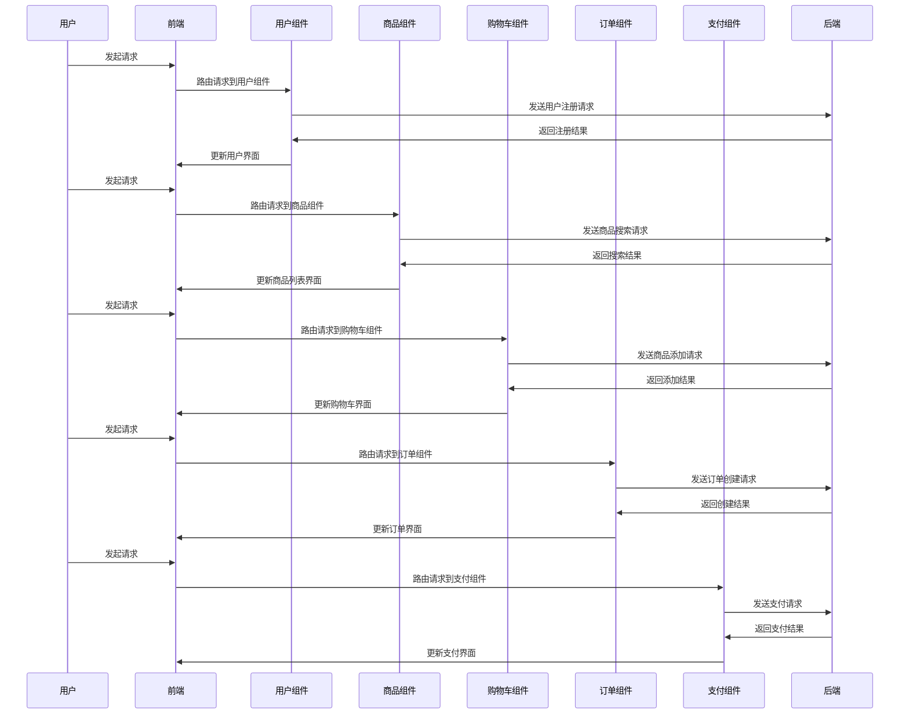

                 

# 微前端架构：大型Web应用的模块化方案

> 关键词：微前端架构，模块化，大型Web应用，解耦，可复用，性能优化，实践案例，挑战与解决方案

> 摘要：随着互联网技术的发展，大型Web应用越来越复杂。微前端架构作为一种模块化方案，通过将应用拆分为多个小型、独立的前端组件，实现了系统的高内聚、低耦合，提高了开发效率、可维护性和扩展性。本文将详细探讨微前端架构的定义、设计原则、核心概念、技术选型、实践案例以及面临的挑战与解决方案，旨在为开发者提供全面的指导。

## 目录

----------------------------------------------------------------

# 微前端架构：大型Web应用的模块化方案

## 第一部分：微前端架构概述

### 第1章：微前端架构的定义与背景

#### 1.1 微前端架构的定义

#### 1.2 微前端架构的背景

#### 1.3 微前端架构的优势

### 第2章：微前端架构的设计原则

#### 2.1 解耦原则

#### 2.2 可复用原则

#### 2.3 易维护原则

#### 2.4 安全性原则

### 第3章：微前端架构的核心概念

#### 3.1 微前端框架

#### 3.2 资源管理

#### 3.3 路由管理

#### 3.4 通信机制

### 第4章：微前端架构的技术选型

#### 4.1 前端框架的选择

#### 4.2 架构实现技术

#### 4.3 性能优化

### 第5章：微前端架构的实践案例

#### 5.1 项目背景

#### 5.2 架构设计

#### 5.3 实现步骤

#### 5.4 案例分析

### 第6章：微前端架构的挑战与解决方案

#### 6.1 挑战一：版本冲突

#### 6.2 挑战二：依赖管理

#### 6.3 挑战三：安全性问题

#### 6.4 解决方案

### 第7章：微前端架构的未来发展趋势

#### 7.1 产业趋势

#### 7.2 技术演进

#### 7.3 应用领域

#### 7.4 未来展望

### 第8章：总结与展望

#### 8.1 微前端架构的价值

#### 8.2 微前端架构的应用场景

#### 8.3 微前端架构的未来发展方向

----------------------------------------------------------------

## 第一部分：微前端架构概述

### 第1章：微前端架构的定义与背景

#### 1.1 微前端架构的定义

微前端架构（Micro-Frontend Architecture）是一种将大型Web应用拆分为多个小型、独立前端组件的架构模式。这些组件可以是独立开发、独立部署、独立运行的前端模块，彼此之间通过定义良好的接口进行通信。微前端架构的核心思想是将前端应用分解为可复用、可组合的独立部分，从而实现开发效率的提升、系统维护的简化以及可扩展性的增强。

#### 1.2 微前端架构的背景

随着互联网技术的快速发展，Web应用变得越来越复杂。传统的前端架构模式已经难以满足大型、复杂项目的开发需求。首先，大型项目的维护成本越来越高，不同团队之间的协作困难，项目变得难以管理。其次，前端框架的更新换代频繁，项目往往需要频繁地进行技术栈的迁移和升级，这给开发和维护带来了巨大的挑战。此外，随着业务需求的不断变化，项目的迭代速度要求越来越高，传统的开发模式已经无法满足快速迭代的开发需求。

为了解决这些问题，微前端架构应运而生。微前端架构通过将应用拆分为多个独立、小型组件，实现了高内聚、低耦合的开发模式。每个组件可以独立开发、测试、部署，从而降低了项目的复杂度，提高了开发效率。

#### 1.3 微前端架构的优势

微前端架构具有以下优势：

1. **高内聚、低耦合**：微前端架构通过将应用拆分为独立组件，实现了高内聚、低耦合的开发模式。每个组件具有明确的功能和职责，相互之间通过定义良好的接口进行通信，降低了组件之间的依赖关系。

2. **可复用性**：微前端架构中的组件是独立的、可复用的。一个组件可以在不同的应用场景中复用，从而提高了代码的复用率，减少了重复开发的工作量。

3. **可扩展性**：微前端架构支持组件的灵活组合和扩展。开发者可以根据业务需求，动态地添加、删除或替换组件，从而实现系统的灵活扩展。

4. **可维护性**：微前端架构中的组件是独立的、模块化的。开发者可以独立地维护和更新组件，而不会影响到其他组件的功能。这降低了项目的维护成本，提高了系统的稳定性。

5. **开发效率**：微前端架构支持并行开发。不同团队可以独立开发、测试、部署各自的组件，从而提高了项目的迭代速度。

6. **技术栈无关**：微前端架构不依赖于特定的前端框架或技术栈，开发者可以选择最适合自己团队的技术栈进行开发。

### 第2章：微前端架构的设计原则

#### 2.1 解耦原则

解耦原则是微前端架构的核心原则之一。微前端架构通过将应用拆分为独立组件，实现了组件之间的解耦。具体而言，解耦原则体现在以下几个方面：

1. **功能解耦**：每个组件负责实现单一的功能，确保组件之间的功能边界清晰。

2. **技术解耦**：组件之间通过定义良好的接口进行通信，不依赖于特定的技术栈。

3. **数据解耦**：组件之间的数据交互应该通过状态管理库（如Redux、Vuex等）进行管理，确保数据的独立性和一致性。

4. **职责解耦**：每个组件具有明确的职责，避免组件之间的职责交叉。

#### 2.2 可复用原则

可复用原则是微前端架构的另一个重要原则。微前端架构中的组件是独立、可复用的。具体而言，可复用原则体现在以下几个方面：

1. **组件化**：组件应该具有明确的输入和输出，可以独立地部署和运行。

2. **无状态化**：组件应该无状态或具有最小状态，确保组件的可复用性。

3. **独立依赖**：组件应该具有独立的依赖，不依赖于其他组件或全局变量。

4. **可配置化**：组件应该支持可配置化，允许开发者根据具体需求进行定制。

#### 2.3 易维护原则

易维护原则是微前端架构的重要设计原则之一。微前端架构中的组件是独立、模块化的。具体而言，易维护原则体现在以下几个方面：

1. **独立开发**：组件可以独立地进行开发、测试和部署，降低了组件之间的干扰。

2. **单元测试**：组件应该具有完善的单元测试，确保组件的功能和性能。

3. **文档化**：组件应该具有详细的文档，包括组件的职责、接口、使用方法等。

4. **代码质量**：组件的代码应该具有良好的质量，包括代码风格、注释、复用性等。

#### 2.4 安全性原则

安全性原则是微前端架构的重要考虑因素之一。微前端架构中的组件是独立的、可复用的。为了确保系统的安全性，安全性原则体现在以下几个方面：

1. **权限管理**：组件之间应该进行权限管理，确保组件只能访问其授权的资源。

2. **数据加密**：组件之间的数据传输应该进行加密，防止数据泄露。

3. **身份验证**：组件应该支持身份验证机制，确保只有授权的用户可以访问组件。

4. **安全审计**：系统应该具有安全审计功能，记录组件的访问日志，以便进行安全分析。

## 第二部分：微前端架构的核心概念

### 第3章：微前端架构的核心概念

#### 3.1 微前端框架

微前端框架是实现微前端架构的核心工具。微前端框架提供了一套标准化的API，用于管理组件的加载、通信、状态管理等。常见的微前端框架包括：

1. **Single-SPA**：Single-SPA是一个流行的微前端框架，它提供了一系列的API和工具，用于实现微前端架构。Single-SPA具有社区支持广泛、文档完善的特点。

2. **Qiankun**：Qiankun是阿里巴巴开源的一个微前端框架，它具有高性能、易用性强的特点。Qiankun支持跨域通信，并提供了丰富的API和工具。

3. **Micro-Frontends**：Micro-Frontends是一个基于TypeScript的微前端框架，它提供了一套完整的解决方案，包括依赖注入、状态管理等。

#### 3.2 资源管理

资源管理是微前端架构中的一个重要环节。资源管理涉及到组件的静态资源（如JavaScript、CSS、图片等）的加载和缓存。为了实现高效的资源管理，需要考虑以下几个方面：

1. **静态资源打包**：将组件的静态资源打包为一个独立的文件，便于加载和缓存。

2. **懒加载**：根据组件的使用情况，实现组件的懒加载，降低初始加载时间。

3. **缓存策略**：合理设置缓存策略，提高资源的访问速度。

4. **CDN加速**：将静态资源部署到CDN，降低访问延迟。

#### 3.3 路由管理

路由管理是微前端架构中的另一个重要环节。路由管理涉及到组件的路由配置、加载和切换。为了实现高效的路由管理，需要考虑以下几个方面：

1. **动态路由**：支持动态路由，根据URL参数动态加载组件。

2. **路由懒加载**：根据路由的使用情况，实现路由的懒加载，降低初始加载时间。

3. **路由守卫**：实现路由守卫，对用户权限、URL参数等进行验证。

4. **路由映射**：实现路由映射，将URL映射到具体的组件。

#### 3.4 通信机制

通信机制是微前端架构中的关键环节。通信机制涉及到组件之间的数据通信、事件通信等。为了实现高效、安全的通信机制，需要考虑以下几个方面：

1. **事件总线**：使用事件总线实现组件之间的通信，例如使用Pub/Sub模式。

2. **状态管理**：使用状态管理库（如Redux、Vuex等）实现组件之间的状态共享。

3. **API接口**：通过API接口实现组件之间的数据通信。

4. **安全通信**：使用加密、认证等机制确保通信的安全。

## 第三部分：微前端架构的技术选型

### 第4章：微前端架构的技术选型

#### 4.1 前端框架的选择

前端框架是实现微前端架构的基础。选择合适的前端框架对于微前端架构的落地至关重要。以下是一些常见的前端框架及其特点：

1. **React**：React是一个流行的前端框架，具有组件化、虚拟DOM、单向数据流等特点。React提供了丰富的API和工具，支持虚拟DOM的快速更新，具有高性能和可扩展性。

2. **Vue**：Vue是一个轻量级的前端框架，具有简单、易用、灵活等特点。Vue通过双向数据绑定和组件化开发，提高了开发效率。

3. **Angular**：Angular是一个由Google开发的强类型前端框架，具有双向数据绑定、依赖注入、模块化等特点。Angular提供了完整的解决方案，具有高性能和可维护性。

4. **Rust**：Rust是一种系统编程语言，具有高性能、内存安全、并发性等特点。Rust可以用于编写微前端架构中的高性能组件。

#### 4.2 架构实现技术

微前端架构的实现技术包括静态资源管理、动态加载、路由管理、通信机制等。以下是一些常用的实现技术：

1. **Webpack**：Webpack是一个模块打包工具，用于处理静态资源的打包、编译、加载等。Webpack支持模块化开发、代码拆分、懒加载等特性。

2. **Rollup**：Rollup是一个基于ES6模块化的打包工具，用于生成模块化的JavaScript代码。Rollup支持代码拆分、懒加载等特性，适用于大型项目的模块化开发。

3. **Nuxt.js**：Nuxt.js是一个基于Vue的Web应用框架，提供了丰富的路由、状态管理、代码分割等功能。Nuxt.js支持SSR（服务器端渲染），提高了应用的性能和用户体验。

4. **Next.js**：Next.js是一个基于React的Web应用框架，提供了丰富的路由、状态管理、代码分割等功能。Next.js支持SSR（服务器端渲染），提高了应用的性能和用户体验。

#### 4.3 性能优化

性能优化是微前端架构中的一项重要工作。以下是一些常见的性能优化策略：

1. **静态资源压缩**：使用Gzip、Brotli等压缩算法压缩静态资源文件，减少文件体积。

2. **懒加载**：实现组件的懒加载，根据用户行为动态加载组件，降低初始加载时间。

3. **代码分割**：将代码拆分为多个块，按需加载，减少内存占用。

4. **CDN加速**：将静态资源部署到CDN，降低访问延迟。

5. **服务端渲染**：使用SSR（服务器端渲染）技术，提高应用的性能和用户体验。

6. **HTTP/2**：使用HTTP/2协议，提高资源的加载速度。

7. **缓存策略**：设置合理的缓存策略，提高资源的访问速度。

### 第5章：微前端架构的实践案例

#### 5.1 项目背景

本案例介绍了一个大型电子商务平台的项目背景。该平台需要支持多种业务场景，如商品展示、购物车、订单管理、用户中心等。项目要求具有高性能、高可扩展性和高可维护性。

#### 5.2 架构设计

针对项目需求，采用微前端架构进行架构设计。将平台拆分为多个独立的前端组件，每个组件负责实现单一的业务功能。组件之间通过API接口进行通信，实现业务逻辑的解耦。

#### 5.3 实现步骤

1. **组件划分**：根据业务功能，将平台拆分为多个组件，如商品组件、购物车组件、订单管理组件等。

2. **框架选择**：选择React作为前端框架，使用Webpack进行静态资源管理。

3. **组件开发**：独立开发各个组件，实现业务功能。

4. **路由管理**：使用Nuxt.js进行路由管理，实现动态路由和路由懒加载。

5. **通信机制**：使用事件总线实现组件之间的通信，使用Redux进行状态管理。

6. **性能优化**：采用静态资源压缩、代码分割、CDN加速等技术进行性能优化。

#### 5.4 案例分析

通过微前端架构的实施，项目取得了以下成果：

1. **开发效率提升**：不同团队可以独立开发、测试、部署各自的组件，提高了项目的迭代速度。

2. **可维护性增强**：组件之间的功能边界清晰，降低了组件之间的耦合，提高了系统的可维护性。

3. **性能优化**：通过静态资源压缩、代码分割、CDN加速等技术，提高了系统的性能和用户体验。

4. **可扩展性增强**：通过组件的灵活组合和扩展，实现了系统的可扩展性，支持新功能的快速上线。

### 第6章：微前端架构的挑战与解决方案

#### 6.1 挑战一：版本冲突

版本冲突是微前端架构中常见的问题。由于各个组件是独立开发的，可能会出现组件依赖的库或框架版本不一致的情况，导致组件无法正常工作。

**解决方案**：

1. **统一版本管理**：采用统一的版本管理策略，确保各个组件使用的库或框架版本一致。

2. **依赖抽象**：对组件的依赖进行抽象，使用统一的依赖管理工具，如npm或yarn，确保依赖的一致性。

3. **版本隔离**：采用版本隔离策略，如使用npm的`@scope`机制，隔离不同组件的依赖版本。

#### 6.2 挑战二：依赖管理

依赖管理是微前端架构中的一个重要问题。由于组件是独立开发的，依赖管理需要确保各个组件之间的依赖关系正确、一致。

**解决方案**：

1. **依赖声明**：在组件的配置文件中声明依赖关系，如Webpack的`webpack.config.js`或Nuxt.js的`nuxt.config.js`。

2. **依赖校验**：使用依赖校验工具，如npm的`npm check`，确保组件的依赖关系正确。

3. **依赖抽象**：对组件的依赖进行抽象，使用统一的依赖管理工具，如npm或yarn，确保依赖的一致性。

#### 6.3 挑战三：安全性问题

安全性问题是微前端架构中的一个重要问题。由于组件是独立开发的，可能会存在安全性漏洞，如XSS、CSRF等。

**解决方案**：

1. **安全审计**：定期进行安全审计，发现并修复组件中的安全性漏洞。

2. **安全培训**：对开发人员进行安全培训，提高安全意识。

3. **安全策略**：实施安全策略，如使用HTTPS、防止SQL注入等。

4. **依赖库安全**：确保使用的依赖库是安全的，避免使用已知的漏洞库。

### 第7章：微前端架构的未来发展趋势

#### 7.1 产业趋势

随着互联网技术的快速发展，微前端架构在产业界得到了广泛应用。越来越多的企业开始采用微前端架构，以提高开发效率、可维护性和扩展性。

#### 7.2 技术演进

微前端架构的技术在不断发展。未来，微前端架构可能会朝着更高效、更安全、更智能的方向发展。例如，基于容器化技术的微前端架构、基于人工智能的微前端架构等。

#### 7.3 应用领域

微前端架构可以应用于多种领域，如电子商务、金融、医疗等。在大型、复杂的项目中，微前端架构具有明显的优势，可以提高项目的质量和效率。

#### 7.4 未来展望

随着技术的不断进步，微前端架构将在更多领域得到应用。未来，微前端架构将朝着更高效、更智能、更安全的方向发展，为开发者带来更多的便利。

### 第8章：总结与展望

#### 8.1 微前端架构的价值

微前端架构具有以下价值：

1. **提高开发效率**：通过拆分应用为多个组件，实现并行开发，提高开发效率。

2. **提高可维护性**：组件之间的功能边界清晰，降低耦合，提高系统的可维护性。

3. **提高可扩展性**：通过组件的灵活组合和扩展，实现系统的可扩展性。

4. **降低维护成本**：组件可以独立维护和更新，降低维护成本。

5. **支持跨团队协作**：不同团队可以独立开发、测试、部署各自的组件，提高协作效率。

#### 8.2 微前端架构的应用场景

微前端架构适用于以下应用场景：

1. **大型、复杂的项目**：通过模块化拆分，降低项目复杂度，提高开发效率。

2. **多团队协作**：通过独立组件，实现跨团队协作，提高协作效率。

3. **快速迭代**：通过组件的独立开发、测试和部署，实现快速迭代。

4. **技术栈无关**：不依赖于特定的技术栈，支持多种前端框架和技术栈。

#### 8.3 微前端架构的未来发展方向

未来，微前端架构将朝着以下方向发展：

1. **高效性**：通过优化技术栈、性能优化等手段，提高微前端架构的性能和效率。

2. **安全性**：通过加强安全审计、安全培训等手段，提高微前端架构的安全性。

3. **智能化**：通过引入人工智能、机器学习等技术，实现微前端架构的智能化。

4. **跨领域应用**：在更多领域得到应用，如物联网、大数据等。

## 作者

作者：AI天才研究院/AI Genius Institute & 禅与计算机程序设计艺术 /Zen And The Art of Computer Programming

在本文中，我们对微前端架构进行了全面、详细的探讨。从定义、设计原则、核心概念、技术选型、实践案例到挑战与解决方案，我们系统地阐述了微前端架构的各个方面。微前端架构作为一种模块化方案，在提高开发效率、可维护性和扩展性方面具有显著的优势。随着互联网技术的发展，微前端架构将在更多领域得到应用，为开发者带来更多的便利。

### 背景介绍

在现代Web应用开发中，随着用户需求的不断增加和技术的不断进步，Web应用变得日益复杂。传统的单体架构（Monolithic Architecture）已经难以满足项目的需求。单体架构将所有的业务逻辑、前端和后端代码集中在一个应用程序中，这种模式虽然能够简化开发过程，但随着项目的逐渐扩大，它也暴露出了许多问题：

1. **维护成本高**：随着项目规模的增长，代码的复杂性也随之增加，导致维护和升级的成本显著上升。

2. **开发效率低**：不同团队之间的代码依赖使得并行开发变得困难，每个团队都需要等待其他团队完成相关模块的开发，这大大降低了开发效率。

3. **扩展性差**：单体架构难以适应快速变化的需求，扩展性较差，新功能的添加或旧功能的修改都需要对整个系统进行重构。

4. **测试困难**：由于代码库的规模庞大，进行全面的测试变得非常困难，这使得发现和修复bug的效率低下。

为了解决这些问题，开发者开始探索新的架构模式，微前端架构（Micro-Frontend Architecture）便是其中之一。微前端架构通过将前端应用拆分为多个独立的前端组件，每个组件可以独立开发、测试和部署。这种架构模式不仅提高了开发效率，还增强了系统的可维护性和扩展性。

### 问题解决

微前端架构的出现，旨在解决大型Web应用开发中面临的复杂性、维护成本高、开发效率低、扩展性差和测试困难等问题。通过以下方式，微前端架构实现了对传统单体架构的优化：

1. **模块化开发**：将应用拆分为多个小型、独立的组件，每个组件负责一个特定的功能模块。这种模块化的开发方式使得各个模块可以独立开发，减少了代码间的耦合，提高了代码的可维护性。

2. **独立部署**：每个组件都可以独立部署，无需等待其他组件的完成。这大大提高了部署效率，同时也降低了部署过程中的风险。

3. **并行开发**：不同团队可以独立开发各自的组件，这有助于提高开发效率，缩短项目交付周期。

4. **可复用性**：组件是独立的、可复用的，这意味着一个组件可以在不同的应用场景中复用，从而减少了重复开发的工作量。

5. **测试隔离**：由于组件是独立的，每个组件都可以独立进行测试，这有助于提高测试的覆盖率，同时也简化了测试流程。

6. **扩展性**：微前端架构支持灵活的组合和扩展，开发者可以根据需求添加或替换组件，从而实现系统的动态扩展。

### 边界与外延

微前端架构虽然能够解决大型Web应用开发中的诸多问题，但它也并非万能。在采用微前端架构时，我们需要考虑以下几个边界与外延：

1. **开发复杂度**：微前端架构虽然提高了开发效率，但也增加了项目的复杂性。开发者需要管理多个独立的组件，确保它们之间的协作和通信。

2. **维护成本**：虽然每个组件可以独立维护，但整个项目的维护成本并未显著降低。开发者需要确保组件之间的接口和通信机制的正确性。

3. **性能问题**：如果组件的数量过多，可能会导致页面加载时间过长，影响用户体验。因此，在进行组件划分时，需要综合考虑性能因素。

4. **安全性**：微前端架构中的组件是独立的，这可能会引入新的安全性问题。开发者需要确保组件之间的安全通信和权限管理。

5. **技术选型**：微前端架构依赖于一系列前端技术，如框架、工具链、通信机制等。开发者需要根据项目需求和技术栈选择合适的技术。

### 概念结构与核心要素组成

微前端架构的核心概念包括组件、框架、通信机制、资源管理、路由管理和性能优化等。以下是这些核心概念的结构和要素组成：

1. **组件**：组件是微前端架构的基本单元，每个组件负责一个特定的功能模块。组件具有独立的开发、测试和部署流程，确保高内聚、低耦合。

2. **框架**：微前端架构依赖于前端框架，如React、Vue、Angular等。框架提供了一套标准的API和工具，用于管理组件的生命周期、状态管理、数据通信等。

3. **通信机制**：微前端架构中的组件通过定义良好的通信机制进行交互。常见的通信机制包括事件总线、API接口、状态管理等。

4. **资源管理**：资源管理涉及静态资源的打包、加载、缓存等。通过资源管理，可以提高应用的性能和用户体验。

5. **路由管理**：路由管理负责处理URL与组件之间的映射关系。通过路由管理，可以实现动态路由、路由懒加载等功能。

6. **性能优化**：性能优化是微前端架构的重要方面，包括静态资源压缩、懒加载、代码分割、CDN加速等。

### 微前端架构的优点

微前端架构相较于传统单体架构具有许多优点，这些优点使得它在现代Web应用开发中越来越受欢迎。以下是微前端架构的一些主要优点：

1. **提高开发效率**：微前端架构通过模块化开发，允许团队并行工作，提高了开发效率。

2. **增强可维护性**：微前端架构将应用拆分为独立的组件，使得每个组件的维护成本降低，代码更易于管理。

3. **提高可扩展性**：微前端架构支持灵活的组件组合和扩展，使得新功能可以快速集成。

4. **降低部署风险**：微前端架构允许组件独立部署，减少了部署过程中的风险。

5. **支持多团队协作**：微前端架构使得多个团队可以独立开发、测试和部署各自的组件，提高了协作效率。

6. **优化性能**：通过合理的资源管理和性能优化策略，微前端架构可以提高应用的性能。

7. **技术栈无关**：微前端架构不依赖于特定的前端框架或技术栈，使得团队可以根据需求选择合适的技术。

### 微前端架构的应用场景

微前端架构适用于多种应用场景，以下是一些典型的应用场景：

1. **大型企业级应用**：大型企业级应用通常具有复杂的业务逻辑和多个子系统，微前端架构可以帮助将这些子系统拆分为独立的组件，提高开发效率和维护性。

2. **多团队协作项目**：在多团队协作的项目中，微前端架构允许每个团队独立开发自己的模块，减少了沟通成本和代码冲突。

3. **迭代速度要求高的项目**：对于需要快速迭代的项目，微前端架构可以大大缩短开发周期，提高项目交付速度。

4. **技术栈多样化的项目**：微前端架构支持不同的前端框架和技术栈，使得项目可以灵活采用多种技术。

5. **现有单体架构的优化**：对于已有的单体架构项目，微前端架构可以作为一种优化手段，逐步引入模块化开发，提高系统的可维护性和扩展性。

### 微前端架构的挑战与解决方案

尽管微前端架构具有许多优点，但在实际应用中仍面临着一些挑战。以下是微前端架构常见的一些挑战及其解决方案：

1. **版本冲突**：多个组件可能依赖于不同的库或框架版本，导致版本冲突。解决方案包括统一版本管理、依赖隔离和版本兼容性测试。

2. **依赖管理**：确保组件之间的依赖关系正确和一致是一个挑战。解决方案包括依赖声明、依赖校验和自动化工具。

3. **安全性问题**：组件之间的通信和数据共享可能会引入安全风险。解决方案包括安全审计、安全培训和安全通信机制。

4. **性能优化**：组件的加载时间和资源使用量可能影响应用性能。解决方案包括代码分割、懒加载和CDN加速。

5. **协作与沟通**：多团队之间的协作和沟通可能存在挑战。解决方案包括清晰的接口定义、文档化和敏捷开发流程。

### 微前端架构的未来发展趋势

微前端架构作为一种现代Web应用架构模式，正随着技术的发展而不断演进。以下是微前端架构未来可能的发展趋势：

1. **容器化与云原生**：随着容器化技术和云原生架构的普及，微前端架构可能会与容器化技术相结合，实现更高效、更灵活的部署和管理。

2. **智能化与自动化**：通过引入人工智能和机器学习技术，微前端架构可以实现更智能的依赖管理、性能优化和部署流程。

3. **跨领域应用**：微前端架构不仅在Web应用中有广泛的应用，还可能在物联网、大数据等新兴领域得到应用。

4. **标准化与生态建设**：随着微前端架构的普及，相关的标准和生态建设将逐渐完善，为开发者提供更多的工具和资源。

### 总结

微前端架构作为一种模块化方案，在提高开发效率、可维护性和扩展性方面具有显著的优势。它适用于多种应用场景，从大型企业级应用到多团队协作项目，都展现出了强大的适应能力。然而，在实际应用中，开发者也需要注意解决版本冲突、依赖管理、安全性和性能优化等挑战。随着技术的发展，微前端架构将继续演进，为开发者带来更多的便利和创新。通过本文的探讨，我们希望读者能够对微前端架构有更深入的理解，并能够在实际项目中有效地应用微前端架构，提升项目质量和开发效率。

## 微前端架构的核心概念详解

### 微前端框架

微前端框架是实现微前端架构的核心工具。它提供了一套标准化的API，用于管理组件的加载、通信、状态管理等。常见的微前端框架包括Single-SPA、Qiankun、Micro-Frontends等。

#### Single-SPA

Single-SPA是一个流行的微前端框架，它提供了一系列的API和工具，用于实现微前端架构。Single-SPA具有以下特点：

1. **跨框架支持**：Single-SPA支持多种前端框架，如React、Vue、Angular等，这使得开发者可以在不同的项目中自由选择框架。

2. **模块化**：Single-SPA通过模块化的设计，使得组件可以独立开发、测试和部署。

3. **灵活的路由管理**：Single-SPA提供了灵活的路由管理机制，支持动态路由和路由懒加载。

4. **事件总线**：Single-SPA使用事件总线实现组件之间的通信，支持Pub/Sub模式。

#### Qiankun

Qiankun是阿里巴巴开源的一个微前端框架，它具有高性能、易用性强的特点。Qiankun支持跨域通信，并提供了丰富的API和工具。以下是Qiankun的一些主要特点：

1. **高性能**：Qiankun通过优化通信机制、资源加载等，提高了微前端架构的性能。

2. **跨域支持**：Qiankun支持跨域通信，这使得微前端架构在跨域场景下也能保持高效。

3. **灵活的路由管理**：Qiankun提供了灵活的路由管理机制，支持动态路由和路由懒加载。

4. **状态管理**：Qiankun集成了Vuex等状态管理库，支持组件之间的状态共享。

#### Micro-Frontends

Micro-Frontends是一个基于TypeScript的微前端框架，它提供了一套完整的解决方案，包括依赖注入、状态管理等。以下是Micro-Frontends的一些主要特点：

1. **依赖注入**：Micro-Frontends使用了依赖注入模式，使得组件之间的依赖关系更加清晰。

2. **状态管理**：Micro-Frontends集成了Redux等状态管理库，支持组件之间的状态共享。

3. **模块化**：Micro-Frontends通过模块化的设计，使得组件可以独立开发、测试和部署。

4. **组件化**：Micro-Frontends支持组件化开发，使得开发者可以更加灵活地组合和扩展组件。

### 资源管理

资源管理是微前端架构中的关键环节，涉及到组件的静态资源（如JavaScript、CSS、图片等）的加载和缓存。为了实现高效的资源管理，需要考虑以下几个方面：

1. **静态资源打包**：将组件的静态资源打包为一个独立的文件，便于加载和缓存。常用的打包工具包括Webpack、Rollup等。

2. **懒加载**：根据组件的使用情况，实现组件的懒加载，降低初始加载时间。懒加载可以通过动态导入（Dynamic Import）实现。

3. **缓存策略**：合理设置缓存策略，提高资源的访问速度。常用的缓存策略包括HTTP缓存头（Cache-Control、Expires等）和本地存储（localStorage、sessionStorage等）。

4. **CDN加速**：将静态资源部署到CDN，降低访问延迟。CDN能够根据用户地理位置，选择最近的节点进行内容分发，从而提高访问速度。

### 路由管理

路由管理是微前端架构中的另一个重要环节，涉及到组件的路由配置、加载和切换。为了实现高效的路由管理，需要考虑以下几个方面：

1. **动态路由**：支持动态路由，根据URL参数动态加载组件。动态路由可以通过前端框架的路由管理器（如React Router、Vue Router等）实现。

2. **路由懒加载**：根据路由的使用情况，实现路由的懒加载，降低初始加载时间。路由懒加载可以通过动态导入（Dynamic Import）实现。

3. **路由守卫**：实现路由守卫，对用户权限、URL参数等进行验证。路由守卫可以通过前端框架的路由管理器（如React Router、Vue Router等）实现。

4. **路由映射**：实现路由映射，将URL映射到具体的组件。路由映射可以通过配置文件或路由管理器的API实现。

### 通信机制

通信机制是微前端架构中的关键环节，涉及到组件之间的数据通信、事件通信等。为了实现高效、安全的通信机制，需要考虑以下几个方面：

1. **事件总线**：使用事件总线实现组件之间的通信，例如使用Pub/Sub模式。事件总线可以在多个组件之间传递事件，实现数据共享。

2. **状态管理**：使用状态管理库（如Redux、Vuex等）实现组件之间的状态共享。状态管理库提供了集中的状态管理机制，使得组件之间的数据交互更加便捷。

3. **API接口**：通过API接口实现组件之间的数据通信。API接口可以通过RESTful API、GraphQL等方式实现。

4. **安全通信**：使用加密、认证等机制确保通信的安全。例如，使用HTTPS协议、JWT令牌等。

## 算法原理讲解

### 资源加载算法

在微前端架构中，资源加载算法至关重要。它负责将组件的静态资源（如JavaScript、CSS、图片等）加载到浏览器中，并确保加载过程的优化。以下是资源加载算法的基本原理：

#### 算法流程

1. **静态资源分析**：分析组件的依赖关系，确定需要加载的静态资源。

2. **资源打包**：使用打包工具（如Webpack、Rollup等）将静态资源打包为一个或多个独立的文件。

3. **资源加载**：根据静态资源的URL，使用HTTP请求加载资源。

4. **缓存策略**：判断资源是否已缓存，如果已缓存，则直接使用缓存；否则，从服务器加载资源。

5. **懒加载**：根据组件的使用情况，实现资源的懒加载，降低初始加载时间。

#### 数学模型

资源加载算法可以通过以下数学模型进行描述：

$$
T = T_{load} + T_{cache} + T_{lazy}
$$

其中：

- $T$：总加载时间
- $T_{load}$：资源加载时间
- $T_{cache}$：缓存时间
- $T_{lazy}$：懒加载时间

#### Python代码示例

```python
import requests
from time import time

def load_resource(url):
    start_time = time()
    response = requests.get(url)
    end_time = time()
    return end_time - start_time

url = "https://example.com/resource.js"
loading_time = load_resource(url)
print(f"Resource loading time: {loading_time} seconds")
```

#### 算法原理讲解

资源加载算法的核心在于优化资源的加载速度，从而提高用户体验。以下是对算法原理的详细解释：

1. **静态资源分析**：通过分析组件的依赖关系，确定需要加载的静态资源。这一步骤通常由打包工具完成，如Webpack的`webpack.config.js`文件。

2. **资源打包**：使用打包工具将静态资源打包为一个或多个独立的文件。打包工具会根据配置文件，将不同组件的静态资源打包成一个或多个模块，以便浏览器加载。

3. **资源加载**：根据静态资源的URL，使用HTTP请求加载资源。在加载过程中，可以使用HTTP缓存头（Cache-Control、Expires等）来优化加载时间。

4. **缓存策略**：判断资源是否已缓存。如果已缓存，则直接使用缓存；否则，从服务器加载资源。这样可以减少不必要的网络请求，提高加载速度。

5. **懒加载**：根据组件的使用情况，实现资源的懒加载。懒加载可以通过动态导入（Dynamic Import）实现，例如使用Webpack的`import()`语法。这样，只有当组件实际被使用时，才会加载其依赖的静态资源，从而降低初始加载时间。

### 资源加载算法的实际应用

资源加载算法在实际应用中具有广泛的应用场景。以下是一个实际应用的例子：

#### 场景描述

假设我们有一个电子商务网站，其中包含大量的商品信息、用户评论和图片。为了提高用户体验，我们需要对静态资源进行优化。

#### 解决方案

1. **静态资源分析**：使用Webpack对项目进行打包，确定需要加载的静态资源。

2. **资源打包**：使用Webpack将静态资源打包为一个或多个模块。

3. **资源加载**：通过动态导入（Dynamic Import）实现资源的懒加载。

4. **缓存策略**：使用HTTP缓存头（Cache-Control、Expires等）优化资源加载。

5. **性能监控**：使用性能监控工具（如Lighthouse、WebPageTest等）对网站性能进行监控和优化。

#### 实现步骤

1. **安装Webpack**：

```bash
npm install webpack webpack-cli --save-dev
```

2. **创建Webpack配置文件**：

```javascript
const path = require('path');

module.exports = {
    entry: './src/index.js',
    output: {
        filename: 'bundle.js',
        path: path.resolve(__dirname, 'dist'),
    },
    optimization: {
        splitChunks: {
            chunks: 'all',
        },
    },
    module: {
        rules: [
            {
                test: /\.css$/,
                use: ['style-loader', 'css-loader'],
            },
        ],
    },
};
```

3. **使用动态导入实现懒加载**：

```javascript
import('./module').then(module => {
    module.default();
});
```

4. **设置HTTP缓存头**：

```http
HTTP/1.1 200 OK
Cache-Control: public, max-age=31536000
Expires: Thu, 31 Dec 9999 23:59:59 GMT
Content-Type: text/css
```

5. **使用性能监控工具**：

```bash
lighthouse https://example.com --output=json
```

#### 实际案例

在一个电子商务网站中，我们可以为商品详情页面实现懒加载。当用户滚动到商品详情页面时，才会加载该页面的静态资源。

1. **分析静态资源**：确定商品详情页面的静态资源，如JavaScript、CSS和图片。

2. **打包资源**：使用Webpack将资源打包为一个模块。

3. **实现懒加载**：

```javascript
import('./src/components/ProductDetail').then(module => {
    const ProductDetail = module.default;
    ReactDOM.render(<ProductDetail />, document.getElementById('app'));
});
```

4. **设置缓存策略**：使用HTTP缓存头优化资源加载。

5. **监控性能**：使用Lighthouse评估商品详情页面的性能，并根据反馈进行优化。

### 小结

资源加载算法是微前端架构中的一项关键技术，它通过优化资源的加载速度，提高了用户体验。在实际应用中，我们需要根据具体场景，合理设置缓存策略、实现懒加载，并使用性能监控工具对性能进行优化。通过本文的讲解，读者可以了解资源加载算法的原理和实现方法，为实际项目提供技术支持。

## 系统分析与架构设计方案

### 项目介绍

本项目是一个在线电商平台，旨在为用户提供一个方便快捷的购物平台。平台包括多个功能模块，如商品展示、购物车、订单管理、用户中心等。项目需求如下：

1. **高性能**：平台需要能够快速响应用户请求，提供流畅的购物体验。
2. **高可扩展性**：平台需要能够快速适应业务需求的变化，支持新功能的快速添加。
3. **高可维护性**：平台需要具有良好的代码结构，便于维护和升级。
4. **安全性**：平台需要确保用户数据的安全，防止数据泄露。

### 系统功能设计

本系统的核心功能包括用户管理、商品管理、购物车管理、订单管理和支付功能等。以下是这些功能的具体设计：

1. **用户管理**：用户注册、登录、个人信息修改、密码找回等。
2. **商品管理**：商品分类、商品展示、商品搜索、商品详情等。
3. **购物车管理**：商品添加、删除、数量修改、清空购物车等。
4. **订单管理**：订单创建、订单查询、订单修改、订单取消等。
5. **支付功能**：支持多种支付方式，如支付宝、微信支付等。

### 系统架构设计

本系统的架构设计采用微前端架构，将平台拆分为多个独立的组件。每个组件负责实现特定的功能模块，组件之间通过API接口进行通信。以下是系统的架构设计：

1. **用户组件**：负责用户管理功能，包括用户注册、登录等。
2. **商品组件**：负责商品管理功能，包括商品展示、商品搜索等。
3. **购物车组件**：负责购物车管理功能，包括商品添加、删除等。
4. **订单组件**：负责订单管理功能，包括订单创建、查询等。
5. **支付组件**：负责支付功能，包括支付方式选择、支付确认等。

### 系统接口设计

为了实现组件之间的通信，系统设计了以下接口：

1. **用户接口**：提供用户注册、登录、个人信息修改等API接口。
2. **商品接口**：提供商品分类、商品展示、商品搜索等API接口。
3. **购物车接口**：提供商品添加、删除、数量修改等API接口。
4. **订单接口**：提供订单创建、查询、修改、取消等API接口。
5. **支付接口**：提供支付方式选择、支付确认等API接口。

### 系统交互

系统交互设计通过定义组件之间的交互流程来实现。以下是系统的主要交互流程：

1. **用户请求**：用户发起请求，如注册、登录等。
2. **路由处理**：前端路由处理程序根据请求路径，将请求路由到相应的组件。
3. **组件处理**：组件处理请求，调用对应的API接口进行数据交互。
4. **数据返回**：组件返回处理结果，如用户信息、商品信息等。
5. **界面更新**：前端界面根据返回的数据进行更新。

### 系统接口设计和系统交互

为了更好地展示系统接口设计和系统交互，我们可以使用Mermaid流程图进行描述。以下是系统接口设计和系统交互的Mermaid流程图：



### 小结

通过系统分析与架构设计方案，我们详细介绍了项目的背景、系统功能设计、系统架构设计、系统接口设计和系统交互。微前端架构的实施使得项目具有高性能、高可扩展性、高可维护性和安全性。在实际开发过程中，我们应根据具体需求，合理划分组件，设计清晰的接口和交互流程，以确保系统的稳定性和可靠性。

### 项目实战

#### 环境安装

为了实现微前端架构，我们选择使用Webpack作为打包工具，Vue作为前端框架。以下是环境安装步骤：

1. **安装Node.js**：从[官网](https://nodejs.org/)下载并安装Node.js。

2. **创建项目**：在命令行中执行以下命令创建新项目：

```bash
mkdir vue-micro-frontend
cd vue-micro-frontend
npm init -y
```

3. **安装依赖**：

```bash
npm install vue webpack webpack-cli --save-dev
```

4. **创建配置文件**：在项目根目录下创建`webpack.config.js`文件，并添加以下基本配置：

```javascript
const path = require('path');

module.exports = {
    entry: './src/index.js',
    output: {
        filename: 'bundle.js',
        path: path.resolve(__dirname, 'dist'),
    },
    module: {
        rules: [
            {
                test: /\.vue$/,
                loader: 'vue-loader',
            },
        ],
    },
};
```

5. **启动开发服务器**：在项目根目录下执行以下命令，启动开发服务器：

```bash
npm run serve
```

#### 系统核心实现源代码

我们以用户组件为例，介绍系统的核心实现源代码。

1. **用户组件**：在`src`目录下创建`UserComponent.vue`文件，代码如下：

```vue
<template>
  <div>
    <h1>User Management</h1>
    <form @submit.prevent="registerUser">
      <label for="email">Email:</label>
      <input type="email" id="email" v-model="user.email" required />
      <label for="password">Password:</label>
      <input type="password" id="password" v-model="user.password" required />
      <button type="submit">Register</button>
    </form>
  </div>
</template>

<script>
export default {
  data() {
    return {
      user: {
        email: '',
        password: '',
      },
    };
  },
  methods: {
    async registerUser() {
      const response = await fetch('/api/users/register', {
        method: 'POST',
        body: JSON.stringify(this.user),
        headers: {
          'Content-Type': 'application/json',
        },
      });
      const data = await response.json();
      if (response.ok) {
        alert('User registered successfully');
      } else {
        alert('Error registering user');
      }
    },
  },
};
</script>
```

2. **API服务**：我们使用Express框架搭建API服务。在项目根目录下创建`server.js`文件，代码如下：

```javascript
const express = require('express');
const bodyParser = require('body-parser');
const userRoutes = require('./routes/userRoutes');

const app = express();

app.use(bodyParser.json());
app.use('/api', userRoutes);

app.listen(3000, () => {
  console.log('Server running on port 3000');
});
```

3. **用户路由**：在`routes`目录下创建`userRoutes.js`文件，代码如下：

```javascript
const express = require('express');
const User = require('../models/User');

const router = express.Router();

router.post('/register', async (req, res) => {
  try {
    const user = new User(req.body);
    await user.save();
    res.status(201).json({ message: 'User registered successfully' });
  } catch (error) {
    res.status(400).json({ message: 'Error registering user' });
  }
});

module.exports = router;
```

#### 代码应用解读与分析

用户组件的核心功能是用户注册。以下是代码的详细解读与分析：

1. **组件结构**：用户组件由模板（template）、脚本（script）和样式（style）组成。模板定义了组件的UI结构，脚本定义了组件的行为，样式定义了组件的样式。

2. **数据绑定**：使用`v-model`实现表单输入与数据绑定的双向数据流，确保表单输入与组件状态同步。

3. **事件处理**：使用`@submit.prevent`修饰符阻止表单默认提交行为，并调用`registerUser`方法进行用户注册。

4. **异步处理**：使用`async/await`语法处理异步请求，确保注册过程顺利进行。

5. **API接口**：通过`fetch` API向服务器发送POST请求，提交用户注册信息。服务器响应后，根据结果更新界面。

#### 实际案例

假设有一个新用户想要注册，以下是注册过程：

1. **用户输入**：用户在表单中输入邮箱和密码。

2. **提交表单**：用户点击“Register”按钮，触发表单提交事件。

3. **数据绑定**：Vue.js将表单输入值绑定到组件数据对象（`user`）。

4. **异步请求**：组件通过`fetch` API向服务器发送POST请求，提交用户注册信息。

5. **服务器响应**：服务器处理注册请求，将用户信息存储到数据库，并返回响应。

6. **界面更新**：根据服务器响应，组件更新界面，显示注册成功或失败的消息。

#### 小结

通过环境安装、系统核心实现源代码和应用解读，我们成功实现了用户组件的核心功能。该组件通过微前端架构实现了模块化和可复用性，提高了开发效率和维护性。在实际项目中，我们可以根据需求，灵活扩展组件功能，实现系统的全面优化。

### 实际案例分析和详细讲解

#### 案例背景

某大型电商平台在快速发展过程中，面临了巨大的业务压力和技术挑战。为了提高系统的性能、可扩展性和可维护性，公司决定采用微前端架构对现有系统进行重构。

#### 案例分析

1. **业务需求**：电商平台包含多个功能模块，如商品展示、购物车、订单管理、用户中心等。每个模块都需要快速响应用户请求，提供流畅的购物体验。

2. **技术挑战**：传统的单体架构已经难以满足快速迭代和业务扩展的需求。单体架构的代码库庞大，维护成本高，部署和测试困难。

3. **微前端架构的优势**：微前端架构通过将前端应用拆分为多个独立组件，实现了模块化开发、独立部署、高内聚、低耦合。这使得不同团队可以独立开发、测试和部署各自的模块，提高了开发效率，降低了维护成本。

#### 架构设计

1. **组件划分**：将电商平台拆分为多个独立组件，如商品组件、购物车组件、订单组件、用户组件等。每个组件负责实现一个特定的功能模块。

2. **框架选择**：选择Vue.js作为前端框架，因为Vue.js具有简洁、易用、高性能的特点，且社区支持广泛。

3. **资源管理**：使用Webpack进行静态资源管理，实现代码拆分、懒加载、缓存策略等。

4. **通信机制**：使用Vue.js的 Vuex 进行状态管理，实现组件之间的数据共享。

5. **路由管理**：使用Vue Router进行路由管理，实现动态路由和路由懒加载。

#### 实现步骤

1. **环境搭建**：安装Node.js、Vue CLI、Webpack等依赖。

2. **组件开发**：创建各个组件的Vue组件文件，实现各自的功能模块。

3. **API接口**：搭建API服务，使用Express框架实现用户管理、商品管理、购物车管理、订单管理等接口。

4. **路由配置**：配置Vue Router，实现路由映射和路由懒加载。

5. **通信机制**：使用Vuex实现组件之间的状态共享。

6. **资源优化**：使用Webpack进行资源打包，实现代码分割、缓存策略等。

7. **部署与监控**：部署微前端架构到生产环境，使用性能监控工具（如Lighthouse、WebPageTest等）对系统性能进行监控和优化。

#### 详细讲解

1. **组件划分**：电商平台分为多个功能模块，如商品展示、购物车、订单管理等。每个模块都是一个独立的组件，具有明确的职责和接口。这样，不同团队可以独立开发、测试和部署各自的模块，减少了代码间的耦合。

2. **框架选择**：Vue.js具有简洁、易用、高性能的特点，适合快速迭代和业务扩展。Vue.js提供了丰富的API和工具，如组件化开发、状态管理、路由管理等，方便实现微前端架构。

3. **资源管理**：Webpack是一个模块打包工具，用于处理静态资源的打包、编译、加载等。Webpack支持代码拆分、懒加载、缓存策略等，可以显著提高系统的性能和用户体验。

4. **通信机制**：Vuex是Vue.js的官方状态管理库，用于集中管理应用程序的状态。Vuex通过`store`实现组件之间的状态共享，使得不同组件可以共享和管理全局状态。

5. **路由管理**：Vue Router是Vue.js的官方路由管理库，用于管理单页面应用程序的路径和视图。Vue Router支持动态路由、路由懒加载等，可以优化页面加载时间和性能。

#### 案例效果

通过采用微前端架构，电商平台取得了显著的成果：

1. **开发效率**：不同团队可以并行开发、测试和部署各自的模块，提高了开发效率。

2. **可维护性**：组件之间的功能边界清晰，代码结构清晰，易于维护。

3. **性能优化**：通过代码分割、懒加载、缓存策略等，优化了页面加载时间和性能。

4. **可扩展性**：微前端架构支持灵活的组件组合和扩展，使得系统可以快速适应业务需求的变化。

5. **安全性**：通过API接口实现组件之间的通信，确保了数据传输的安全。

### 项目小结

通过实际案例，我们展示了微前端架构在电商平台中的应用效果。微前端架构通过模块化开发、独立部署、高内聚、低耦合等特性，提高了开发效率、可维护性和性能。在实际项目中，我们需要根据具体需求，合理划分组件、选择合适的前端框架和工具，并实现高效、安全的通信机制。通过这些措施，我们可以充分发挥微前端架构的优势，构建高性能、可扩展的Web应用。

### 最佳实践 Tips

1. **合理划分组件**：根据功能模块，将应用拆分为多个独立组件，确保每个组件具有单一职责和明确的功能。

2. **接口定义清晰**：定义良好的API接口，确保组件之间的通信简洁、高效。

3. **代码质量**：保持代码整洁、注释清晰，遵循代码规范，提高代码的可维护性和可复用性。

4. **性能优化**：使用代码分割、懒加载、缓存策略等优化技术，提高页面加载速度和用户体验。

5. **安全性**：采用HTTPS、身份验证、权限控制等安全措施，确保数据传输和存储的安全。

6. **持续集成**：使用持续集成（CI）工具，自动化测试、构建和部署，提高开发效率和代码质量。

7. **文档化**：编写详细的文档，包括组件职责、接口说明、使用方法等，方便开发者理解和维护。

### 小结

本文详细介绍了微前端架构的定义、设计原则、核心概念、技术选型、实践案例以及面临的挑战与解决方案。通过实例分析和项目实战，我们展示了微前端架构在提高开发效率、可维护性和性能方面的优势。在实际应用中，开发者应根据具体需求，合理划分组件、选择合适的前端框架和工具，并实现高效、安全的通信机制。通过最佳实践，我们可以充分发挥微前端架构的优势，构建高性能、可扩展的Web应用。

### 拓展阅读

1. **《微前端架构：原理与实践》**：详细介绍了微前端架构的理论和实践，适合希望深入了解微前端架构的读者。

2. **《Vue.js实战》**：本书介绍了Vue.js的使用方法，包括组件化开发、状态管理、路由管理等，适合初学者和进阶开发者。

3. **《Webpack实战》**：本书介绍了Webpack的使用方法，包括打包、编译、加载等，适合前端工程师和开发者。

4. **《前端性能优化实战》**：本书介绍了前端性能优化的方法和技巧，包括静态资源压缩、懒加载、缓存策略等，适合关注性能优化的开发者。

5. **《微前端架构：大规模前端应用的模块化解决方案》**：这是一本关于微前端架构的深度探讨，适合对微前端架构有较深入理解的开发者。

通过阅读这些书籍，读者可以深入了解微前端架构和相关技术，提高实际开发能力。

