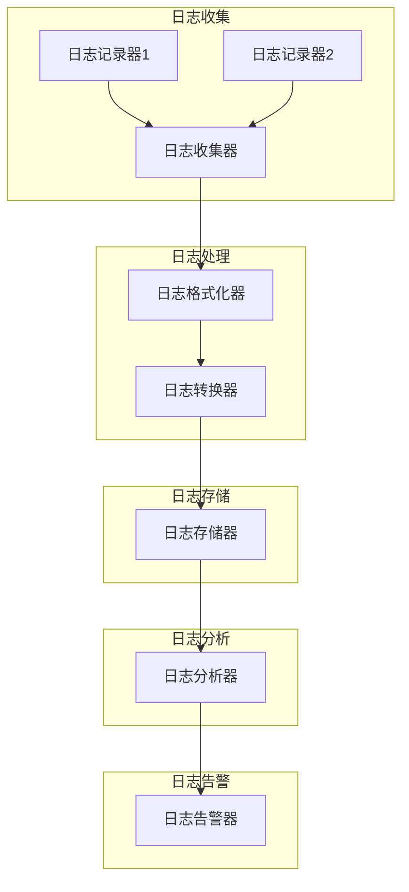

                 

**引言与背景**

随着互联网技术的飞速发展和业务需求的日益复杂，微服务架构作为一种现代化的软件架构风格，逐渐成为企业应用系统的首选。微服务架构将复杂的应用系统拆分成一组独立的小服务，每个服务各自负责一个特定的业务功能，并通过轻量级的通信协议（如RESTful API、消息队列等）相互协作。这种架构方式不仅提高了系统的可扩展性、灵活性和容错性，还使得开发、部署和运维变得更加简单和高效。

然而，随着服务数量的增多和系统复杂度的提高，日志管理成为了一个新的挑战。日志是系统运行过程中产生的重要记录，它包含了系统运行状态、错误信息、性能数据等关键信息，对于排查问题、监控系统和优化性能至关重要。在传统的单体架构中，日志管理相对简单，但随着微服务架构的普及，日志管理变得更加复杂。这是因为：

1. **服务分布广泛**：在微服务架构中，服务可能分布在不同的服务器或集群中，这使得日志分散在不同的位置，难以集中管理和分析。
2. **日志格式多样**：不同的服务可能使用不同的日志格式，增加了日志处理的难度。
3. **日志量巨大**：随着服务数量的增加，日志的总量也会呈指数级增长，处理和存储这些日志成为了一个巨大的挑战。

因此，如何有效地管理微服务的日志，实现集中式日志收集与分析，成为了微服务架构中亟待解决的问题。本文将围绕这一主题，详细探讨微服务日志管理的相关技术、工具和方法，帮助读者理解和掌握这一重要技能。

**关键词：**

- 微服务架构
- 日志管理
- 集中式日志收集
- 日志分析
- 日志告警与监控

**摘要：**

本文旨在探讨微服务架构下的日志管理问题，详细分析集中式日志收集与日志分析的方法和工具。首先，介绍微服务架构的基本概念和日志管理的重要性，然后深入探讨日志格式、级别以及集中式日志收集的优势。接着，介绍几种常见的日志收集工具，包括Fluentd、Logstash和Filebeat。随后，讨论日志分析的基本概念和工具，以及告警机制和监控系统。最后，通过一个具体案例实践，展示如何实现日志管理的具体操作，并总结最佳实践和注意事项。本文结构紧凑、逻辑清晰，适合从事微服务开发和运维的技术人员阅读。**第一部分：引言与背景**

## 第1章：微服务架构概述

### 1.1 微服务架构的概念

微服务架构（Microservices Architecture）是一种设计应用程序的方式，它将大型单体应用程序拆分成一组独立的小服务。每个小服务负责实现一个特定的业务功能，并通过轻量级的通信协议（如RESTful API、消息队列等）相互协作。这些小服务可以独立部署、独立运行，具有高可扩展性、高容错性和高灵活性。

微服务架构与传统单体架构存在显著差异。在传统单体架构中，应用程序是一个单一的大模块，所有的功能都集成在一个应用程序中。这种架构的优点是实现简单，开发效率高，但缺点也是显而易见的：应用程序的复杂度随着功能的增加而急剧上升，任何一个模块的故障都可能影响整个系统的运行。此外，单体架构在扩展性方面也存在瓶颈，当需要增加某个功能或模块时，需要对整个应用程序进行重新部署。

相比之下，微服务架构具有以下几个显著特点：

1. **独立性**：每个微服务都是独立的，具有自己的业务逻辑、数据库和外部接口。这使得微服务可以独立部署、独立运行，提高了系统的可维护性和扩展性。
2. **分布式**：微服务架构是分布式架构的一种形式。服务可能分布在不同的服务器或集群中，这使得系统具有更高的容错性和负载均衡能力。
3. **轻量级通信**：微服务之间通过轻量级的通信协议（如HTTP/HTTPS、gRPC、RabbitMQ等）进行通信。这种通信方式相比传统的远程过程调用（RPC）具有更高的灵活性和可扩展性。
4. **自动化部署**：微服务架构支持自动化部署，每个服务都可以独立部署，通过容器技术（如Docker、Kubernetes）实现快速部署和回滚。

### 1.2 微服务与传统架构的比较

传统单体架构与微服务架构在多个方面存在显著差异：

#### 1.2.1 设计理念

- **单体架构**：单体架构将所有功能集成在一个应用程序中，逻辑上紧密耦合。这种架构的优点是实现简单，开发效率高，但缺点是扩展性和维护性差。
- **微服务架构**：微服务架构将应用程序拆分成一组独立的小服务，每个服务实现一个特定的业务功能。这种架构的优点是高扩展性、高容错性和高灵活性，但缺点是设计复杂、协调成本高。

#### 1.2.2 部署方式

- **单体架构**：单体架构的所有功能集成在一个应用程序中，部署时通常需要将整个应用程序打包并部署到服务器上。这种方式部署简单，但无法实现快速部署和回滚。
- **微服务架构**：微服务的每个服务都可以独立部署，通过容器技术（如Docker、Kubernetes）实现快速部署和回滚。这种方式部署灵活，但需要额外的工具和流程支持。

#### 1.2.3 扩展性

- **单体架构**：单体架构在扩展性方面存在瓶颈。当需要增加某个功能或模块时，需要对整个应用程序进行重新部署，这可能导致系统停机。
- **微服务架构**：微服务架构具有高扩展性。当需要增加某个功能或模块时，可以独立部署该微服务，无需影响其他服务。这种方式提高了系统的可用性和可靠性。

#### 1.2.4 负载均衡

- **单体架构**：单体架构通常使用传统的负载均衡器实现负载均衡，这种方式可能无法充分利用服务器资源。
- **微服务架构**：微服务架构通常使用分布式负载均衡器实现负载均衡。这种负载均衡器可以更好地利用服务器资源，提高系统的性能和可用性。

### 1.3 微服务架构的优势与挑战

#### 1.3.1 优势

1. **高扩展性**：微服务架构可以根据需求独立扩展特定服务，提高系统的整体性能。
2. **高容错性**：服务故障不会影响整个系统，其他服务仍然可以正常运行，提高了系统的稳定性。
3. **高灵活性**：微服务架构允许灵活地添加、删除或修改服务，支持快速迭代和业务创新。
4. **高可维护性**：服务独立部署和运行，使得问题的定位和修复更加简单。
5. **模块化**：服务之间的解耦使得系统更加模块化，易于理解和维护。

#### 1.3.2 挑战

1. **设计复杂性**：微服务架构的设计需要更高的抽象能力和全局观，否则可能导致服务过多、过于复杂。
2. **通信成本**：微服务之间的通信成本可能高于单体架构，特别是在高并发场景下。
3. **协调成本**：服务的拆分可能导致团队之间的协调成本增加，影响开发效率。
4. **安全性**：分布式系统可能面临更多的安全挑战，如数据泄露、DDoS攻击等。
5. **日志管理**：微服务架构下，日志分散在不同的服务中，集中式日志管理变得更加困难。

综上所述，微服务架构具有显著的优势，但也面临一系列挑战。在实际应用中，需要根据具体业务需求和技术能力，权衡利弊，做出合理的设计决策。**第2章：日志管理的基本概念**

### 2.1 日志格式

日志格式是日志记录中信息的组织方式，它决定了日志的可读性、可解析性和可分析性。常见的日志格式有文本格式、JSON格式等。文本格式是最传统的日志格式，它的优点是简单易懂，但缺点是可解析性较差，特别是在处理大量日志时。JSON格式则是一种结构化数据格式，它具有较好的可读性和可解析性，可以方便地通过工具进行格式化和分析。

#### 2.1.1 常见的日志格式

1. **文本格式**：文本格式的日志通常包含时间戳、日志级别、日志内容等信息，例如：
   ```
   2023-04-01 10:30:45 INFO  User logged in successfully.
   ```
   文本格式的日志优点是简单易懂，但缺点是无法直接进行结构化处理和分析。

2. **JSON格式**：JSON格式的日志包含多个字段，每个字段都可以包含复杂的值，例如：
   ```json
   {
     "timestamp": "2023-04-01 10:30:45",
     "level": "INFO",
     "message": "User logged in successfully.",
     "context": {
       "user_id": "12345",
       "ip": "192.168.1.1"
     }
   }
   ```
   JSON格式的日志优点是结构化，可以方便地通过工具进行格式化和分析，但缺点是生成和处理需要更多的计算资源。

#### 2.1.2 日志格式的标准化

为了提高日志的可解析性和可分析性，许多组织和项目推出了日志格式的标准化方案，如结构化日志（Structured Logging）和日志聚合（Log Aggregation）。以下是一些常见的标准化方案：

1. **结构化日志**：结构化日志通过定义统一的日志格式，使得日志中的信息可以被结构化地解析和处理。例如，Open Log Format（OLF）是一种常见的结构化日志格式，它定义了一系列字段，如时间戳、日志级别、日志内容、日志元数据等。

2. **日志聚合**：日志聚合是将来自不同来源的日志收集到一个中心化系统中进行集中管理和分析。常见的技术方案包括Fluentd、Logstash等。

### 2.2 日志级别

日志级别（Log Level）是日志记录中用于描述日志信息重要程度的属性。常见的日志级别包括DEBUG、INFO、WARNING、ERROR、CRITICAL等。不同的日志级别对应不同的日志信息，用于指示系统运行状态和异常情况。

#### 2.2.1 日志级别的定义

- **DEBUG**：调试级别，用于记录程序运行过程中的详细信息，通常用于开发阶段。
- **INFO**：信息级别，用于记录程序运行状态和重要事件，如用户登录、数据保存等。
- **WARNING**：警告级别，用于记录可能引起系统不稳定或数据丢失的事件，如文件读写错误、网络连接断开等。
- **ERROR**：错误级别，用于记录程序无法正常处理的事件，如数据处理错误、数据库连接失败等。
- **CRITICAL**：严重级别，用于记录可能导致系统崩溃或严重故障的事件，如系统崩溃、硬件故障等。

#### 2.2.2 常见的日志级别

以下是一个简单的日志记录示例，展示了不同级别的日志信息：
```
DEBUG: Loading configuration file.
INFO: Starting the application.
WARNING: Failed to connect to the database.
ERROR: Invalid data received from the client.
CRITICAL: System crash!
```

#### 2.2.3 日志级别的作用

日志级别在日志管理中扮演着重要角色，它们有助于：

1. **问题定位**：通过不同级别的日志信息，可以快速定位问题的发生位置和原因。
2. **性能监控**：通过分析不同级别的日志信息，可以监控系统的性能和资源使用情况。
3. **安全审计**：通过分析严重级别的日志信息，可以及时发现潜在的安全威胁和故障。

### 2.3 日志格式与日志级别的关联

日志格式和日志级别密切相关。在日志记录过程中，通常会结合日志格式和日志级别来组织日志信息。例如，在JSON格式的日志中，可以定义一个字段用于记录日志级别，如下所示：
```json
{
  "timestamp": "2023-04-01 10:30:45",
  "level": "INFO",
  "message": "User logged in successfully.",
  "context": {
    "user_id": "12345",
    "ip": "192.168.1.1"
  }
}
```

这种结构化的日志格式使得日志信息不仅易于阅读，而且可以通过工具进行自动化解析和分析。例如，可以使用日志聚合工具（如Fluentd、Logstash）对日志进行过滤、转换和存储，以便进行后续的分析和监控。

总之，日志格式和日志级别是日志管理中不可或缺的组成部分。通过合理选择日志格式和设置日志级别，可以有效地提高日志的可读性、可解析性和可分析性，为系统的运维和监控提供有力支持。**第3章：集中式日志收集**

### 3.1 集中式日志收集的优势

在微服务架构中，日志管理面临的一个主要挑战是日志分散性。由于服务分布在不同的服务器和集群中，日志记录在各个服务中产生，且格式可能不一致。这种分散的日志管理方式不仅增加了运维和监控的复杂性，还降低了问题定位和系统优化的效率。集中式日志收集通过将分散的日志收集到一个中心化的系统中，解决了这一问题，带来了以下几个显著的优势：

#### 3.1.1 日志集中存储

集中式日志收集将来自不同服务的日志集中存储在一个位置，便于统一管理和检索。这种集中存储的方式不仅简化了日志管理流程，还提高了日志的可访问性和可分析性。运维人员可以通过一个统一的界面访问和分析所有日志，无需在不同的服务器和集群中切换。

#### 3.1.2 提高问题定位效率

通过集中式日志收集，可以快速定位问题发生的具体位置。在分散式日志管理中，需要逐个检查各个服务器的日志文件，这可能需要耗费大量时间和资源。而在集中式日志收集系统中，可以通过日志聚合工具提供的关键字搜索、过滤和排序功能，快速找到相关日志，大大提高问题定位的效率。

#### 3.1.3 支持多维度日志分析

集中式日志收集系统通常提供丰富的分析工具和功能，如日志统计分析、趋势分析、错误率分析等。这些工具可以帮助运维人员从多个维度分析日志数据，了解系统的运行状况和性能表现，从而进行有效的性能优化和故障预防。

#### 3.1.4 支持自动化监控和告警

集中式日志收集系统可以与自动化监控和告警工具集成，实现自动化日志监控和告警。例如，当日志中出现特定关键词或异常模式时，系统可以自动生成告警通知，并将告警信息发送给相关运维人员。这种自动化监控和告警机制可以快速响应异常情况，减少故障对业务的影响。

### 3.2 日志收集工具介绍

在实际的微服务日志管理中，常用的集中式日志收集工具有Fluentd、Logstash和Filebeat。这些工具各有特点和优势，适用于不同的场景和需求。

#### 3.2.1 Fluentd

Fluentd是一种灵活的日志收集器，它可以将来自各种来源的日志数据聚合到一个中心化的存储中。Fluentd具有以下特点：

1. **高扩展性**：Fluentd支持多种数据源和数据目标，可以通过插件扩展其功能。
2. **高可靠性**：Fluentd具有强大的故障恢复能力和数据重传机制，确保日志数据的完整性和可靠性。
3. **易于使用**：Fluentd配置简单，可以通过配置文件定义日志收集规则和输出目标。

#### 3.2.2 Logstash

Logstash是Elastic Stack中的组件，用于收集、处理和存储日志数据。Logstash具有以下特点：

1. **强大的处理能力**：Logstash支持复杂的日志处理管道，包括过滤、转换、 enrich等操作。
2. **集成度高**：Logstash与Elasticsearch、Kibana等Elastic Stack组件紧密集成，提供一站式的日志管理解决方案。
3. **高可靠性**：Logstash支持分布式处理和弹性伸缩，确保在大规模日志收集场景下的稳定运行。

#### 3.2.3 Filebeat

Filebeat是Elastic Stack中的轻量级日志收集器，专门用于收集服务器上的日志文件。Filebeat具有以下特点：

1. **轻量级**：Filebeat体积小巧，易于在服务器上安装和部署。
2. **高并发**：Filebeat支持高并发日志收集，适用于大规模服务器环境。
3. **低资源占用**：Filebeat在运行过程中对系统资源的占用较低，不会影响服务器性能。

### 3.3 选择合适的日志收集工具

在选择日志收集工具时，需要根据具体需求和场景进行权衡：

1. **日志量**：对于日志量较小的场景，Fluentd和Filebeat可能足够使用。但对于大规模日志收集场景，Logstash因其强大的处理能力和集成度更合适。
2. **日志处理需求**：如果需要复杂的日志处理和转换，Logstash是更好的选择。如果只需要简单的日志收集和转发，Fluentd和Filebeat可能更合适。
3. **系统资源**：Filebeat因其轻量级特性，在资源有限的服务器上运行效果更好。Fluentd和Logstash对系统资源的需求较高，但在性能和功能上更为强大。

总之，集中式日志收集是微服务日志管理的关键环节，通过选择合适的日志收集工具，可以有效地提高日志管理的效率和可靠性。在实际应用中，需要根据具体需求和场景，结合工具的特点和优势，做出合理的选择。**第4章：日志分析**

### 4.1 日志分析的基本概念

日志分析是通过对日志数据的收集、处理和分析，提取有价值的信息，以便监控系统的运行状态、发现潜在问题和优化系统性能。日志分析的基本概念包括以下几个方面：

#### 4.1.1 日志分析的目的

日志分析的主要目的是：

1. **问题排查**：通过分析日志数据，快速定位系统中的错误和故障，帮助运维人员解决问题。
2. **性能监控**：通过分析日志数据，监控系统的运行状况，及时发现性能瓶颈和异常情况。
3. **安全审计**：通过分析日志数据，发现潜在的安全威胁和恶意行为，保障系统的安全性。
4. **系统优化**：通过分析日志数据，了解系统的使用情况和用户行为，为系统优化提供数据支持。

#### 4.1.2 日志分析的工具和方法

进行日志分析需要使用到多种工具和方法。以下是一些常用的工具和方法：

1. **文本处理工具**：如grep、awk等，用于对日志文件进行简单的文本搜索和过滤。
2. **日志聚合工具**：如Fluentd、Logstash等，用于收集、处理和存储日志数据。
3. **数据分析工具**：如Elasticsearch、Kibana等，用于对日志数据进行复杂分析和可视化展示。
4. **编程语言**：如Python、Java等，用于编写脚本进行自定义的日志分析和处理。

### 4.2 日志分析工具介绍

在日志分析领域，Elastic Stack是最为流行的工具集之一。Elastic Stack包括Elasticsearch、Kibana、Logstash等组件，它们紧密集成，提供一站式的日志分析解决方案。

#### 4.2.1 Elasticsearch

Elasticsearch是一个高性能、可扩展的全文搜索引擎，专门用于存储、检索和分析大量结构化数据。以下是Elasticsearch在日志分析中的优势：

1. **快速搜索**：Elasticsearch提供了强大的全文搜索功能，可以快速检索和分析大量日志数据。
2. **高扩展性**：Elasticsearch支持水平扩展，可以轻松处理大规模的日志数据。
3. **实时分析**：Elasticsearch支持实时数据流处理，可以实时分析日志数据并生成可视化报表。
4. **丰富的插件**：Elasticsearch提供了丰富的插件，如监控插件、分析插件等，可以扩展其功能。

#### 4.2.2 Kibana

Kibana是一个可视化分析平台，与Elasticsearch紧密集成，用于展示和分析Elasticsearch中的数据。以下是Kibana在日志分析中的优势：

1. **可视化报表**：Kibana提供了多种可视化组件，可以方便地创建和展示日志分析报表。
2. **实时监控**：Kibana支持实时监控，可以实时显示日志数据的变化趋势和异常情况。
3. **自定义仪表盘**：Kibana允许用户自定义仪表盘，可以根据需求自定义报表内容和布局。
4. **集成度**：Kibana与Elasticsearch无缝集成，可以方便地导入和导出数据。

#### 4.2.3 Logstash

Logstash是Elastic Stack中的数据处理组件，用于收集、处理和存储日志数据。以下是Logstash在日志分析中的优势：

1. **数据处理管道**：Logstash支持复杂的日志处理管道，包括过滤、转换、 enrich等操作。
2. **可扩展性**：Logstash支持水平扩展，可以处理大规模的日志数据。
3. **多数据源支持**：Logstash支持多种数据源，包括文件、数据库、消息队列等，可以灵活地收集各种类型的日志数据。
4. **可靠性**：Logstash具有强大的故障恢复能力和数据重传机制，确保日志数据的完整性和可靠性。

### 4.3 日志分析示例

以下是一个简单的日志分析示例，展示如何使用Elastic Stack进行日志分析：

#### 4.3.1 收集和存储日志

使用Filebeat收集服务器上的日志，并将其存储到Elasticsearch中。例如，可以使用以下命令启动Filebeat：

```sh
./filebeat -e -c filebeat.yml
```

在filebeat.yml配置文件中，指定日志文件路径和Elasticsearch地址，例如：

```yaml
filebeat.inputs:
- type: log
  enabled: true
  paths:
    - /var/log/*.log

output.elasticsearch:
  hosts: ["localhost:9200"]
```

#### 4.3.2 创建索引模板

在Elasticsearch中创建一个索引模板，用于定义日志数据的存储结构。例如：

```json
PUT /logstash-*/_template
{
  "template": "*.log",
  "mappings": {
    "properties": {
      "@timestamp": {
        "type": "date",
        "format": "yyyy-MM-dd HH:mm:ss"
      },
      "level": {
        "type": "keyword"
      },
      "message": {
        "type": "text"
      },
      "source": {
        "type": "keyword"
      }
    }
  }
}
```

#### 4.3.3 搜索和分析日志

在Kibana中创建一个可视化仪表盘，用于展示日志数据的统计和分析结果。例如，可以创建一个图表，显示过去24小时内不同级别的日志数量：

1. 在Kibana中打开“Discover”页面，选择索引模板“logstash-*”。
2. 添加一个查询，使用以下查询语句：

```sql
{
  "size": 0,
  "aggs": {
    "level": {
      "terms": {
        "field": "level.keyword",
        "size": 10
      },
      "aggs": {
        "count": {
          "count": {}
        }
      }
    }
  }
}
```

3. 在“Visualize”页面中，选择“Bar”图表，并将“level”字段作为X轴，将“count”字段作为Y轴。

通过这个简单的示例，可以看到如何使用Elastic Stack进行日志收集、存储和分析。实际应用中，日志分析可能更加复杂，需要结合具体业务场景进行定制化开发。但总体来说，Elastic Stack提供了一个强大且灵活的日志分析平台，可以帮助企业实现高效、可靠的日志管理。**第5章：日志告警与监控**

### 5.1 告警机制的构建

在日志管理中，告警机制是确保系统稳定运行的重要环节。告警机制通过监测日志数据，及时发现异常情况并通知相关人员，从而快速响应和处理问题。构建一个有效的告警机制需要考虑以下几个方面：

#### 5.1.1 告警规则的定义

告警规则是告警机制的核心，它定义了何时触发告警以及如何通知相关人员。告警规则通常包括以下要素：

1. **触发条件**：定义何时触发告警，例如日志中出现的特定关键词、日志级别达到一定阈值等。
2. **通知方式**：定义如何通知相关人员，例如通过邮件、短信、即时通讯工具等。
3. **告警级别**：定义告警的严重程度，通常分为紧急、警告、通知等不同级别。
4. **告警阈值**：定义触发告警的数据阈值，例如错误日志数量超过一定阈值。

#### 5.1.2 告警通知的方式

告警通知的方式多种多样，常见的方式包括：

1. **邮件**：通过发送电子邮件通知相关人员。
2. **短信**：通过发送短信通知相关人员，适用于需要快速响应的场景。
3. **即时通讯工具**：如Slack、微信等，可以实现实时通知和讨论。
4. **集成告警平台**：如PagerDuty、Opsgenie等，提供专业的告警管理和服务。

#### 5.1.3 告警机制的实现

实现告警机制通常包括以下几个步骤：

1. **数据收集**：通过日志收集工具（如Filebeat、Fluentd等）收集系统日志。
2. **数据处理**：使用数据处理工具（如Logstash）对日志进行解析和处理。
3. **告警规则配置**：在数据处理工具中配置告警规则，定义触发条件和通知方式。
4. **告警通知**：将满足告警规则的日志信息发送给相关人员。

### 5.2 监控系统的集成

监控系统的集成是实现告警机制的关键。常见的监控系统包括Prometheus和Grafana等，它们可以与日志管理工具和告警机制紧密集成，实现全方位的系统监控和告警。

#### 5.2.1 Prometheus

Prometheus是一个开源的监控解决方案，专门用于收集和存储时间序列数据。以下是Prometheus在日志监控中的优势：

1. **多源监控**：Prometheus支持多种数据源，包括日志文件、HTTP API、JMX等，可以全面监控系统的运行状态。
2. **高效的存储和查询**：Prometheus使用本地存储，支持高效的时序数据查询，便于实时监控和告警。
3. **告警管理**：Prometheus内置告警管理功能，可以定义告警规则，并通过Webhook等方式发送告警通知。

#### 5.2.2 Grafana

Grafana是一个开源的数据可视化平台，可以与Prometheus等监控系统集成，实现实时监控和告警。以下是Grafana在日志监控中的优势：

1. **丰富的可视化组件**：Grafana提供了多种可视化组件，如图表、面板、仪表盘等，可以直观地展示监控数据。
2. **灵活的数据源集成**：Grafana支持多种数据源，包括Elasticsearch、InfluxDB等，可以方便地集成日志数据和监控系统。
3. **告警通知**：Grafana支持自定义告警通知，可以通过邮件、短信、Webhook等方式发送告警信息。

### 5.3 告警机制的实践

以下是一个简单的告警机制实践示例：

1. **安装和配置Prometheus**：在服务器上安装Prometheus，并配置其监控目标，如日志文件路径和日志格式。

2. **配置Logstash**：在Logstash中配置日志处理管道，包括日志收集、解析和输出到Prometheus。

3. **定义告警规则**：在Prometheus中创建告警规则，例如错误日志数量超过一定阈值时发送告警通知。

4. **集成Grafana**：在Grafana中配置数据源，如Elasticsearch和Prometheus，并创建监控仪表盘。

5. **配置告警通知**：在Grafana中配置告警通知，通过邮件、短信等方式发送告警信息。

通过以上步骤，可以构建一个简单的告警机制，实现对日志数据的实时监控和告警。实际应用中，告警机制需要根据具体业务需求和系统特点进行定制化配置，以确保高效、可靠的日志监控和管理。**第6章：案例实践：日志管理的具体实现**

### 6.1 项目背景

为了更好地展示日志管理的具体实现，我们以一个在线电商平台的日志管理项目为例。该电商平台包含了商品管理、订单处理、用户反馈等多个微服务模块，每个模块都有其各自的日志记录需求。随着业务的发展，日志量急剧增加，日志分散在各个服务器的不同位置，给日志管理和分析带来了巨大的挑战。因此，项目目标是通过实现集中式日志收集与分析，提高日志管理的效率，并实现日志的实时监控和告警。

#### 6.1.1 项目简介

该项目旨在构建一个高效、可靠的日志管理系统，以支持电商平台的稳定运行和快速响应。具体需求包括：

1. **集中式日志收集**：将分散在各服务器的日志集中收集到一个中心化的存储系统中，便于统一管理和分析。
2. **日志格式标准化**：定义统一的日志格式，提高日志的可读性和可解析性，方便后续的数据处理和分析。
3. **实时日志分析**：实现实时日志分析，及时发现异常情况，并提供实时监控和告警功能。
4. **日志存储和备份**：实现日志的持久化存储，并提供备份策略，确保日志数据的安全性和可靠性。

#### 6.1.2 项目需求分析

在项目需求分析阶段，我们对日志管理的具体需求进行了详细的分析和规划。以下是主要需求：

1. **日志收集**：需要支持从各个微服务收集日志，并确保日志数据的完整性和可靠性。
2. **日志格式**：需要定义统一的日志格式，包括日志头、日志内容和日志尾，便于解析和分析。
3. **日志存储**：需要选择一个高效、可靠的日志存储解决方案，确保日志数据的持久化存储和快速访问。
4. **日志分析**：需要提供实时日志分析功能，包括日志统计、错误率分析和趋势分析等。
5. **日志告警**：需要实现日志告警机制，及时通知相关人员，快速响应异常情况。
6. **日志备份**：需要制定日志备份策略，确保日志数据的安全性和可靠性。

### 6.2 系统架构设计

为了实现项目的需求，我们设计了一个完整的日志管理架构，包括日志收集、处理、存储、分析和告警等环节。以下是系统架构设计的详细描述：

#### 6.2.1 领域模型

领域模型描述了日志管理的核心概念和关系。以下是日志管理系统的领域模型：

1. **日志记录器（Logger）**：负责记录系统的各种操作日志，包括用户操作日志、系统错误日志等。
2. **日志收集器（LogCollector）**：负责从各个微服务收集日志数据，并将日志发送到日志存储系统。
3. **日志存储器（LogStorage）**：负责存储和管理日志数据，提供高效的日志查询和检索功能。
4. **日志分析器（LogAnalyzer）**：负责对日志数据进行实时分析和统计，提供日志报表和可视化监控。
5. **日志告警器（LogAlarm）**：负责监控日志数据，根据预设的告警规则发送告警通知。

#### 6.2.2 系统架构设计

系统架构设计图如下所示（使用Mermaid绘制）：



#### 6.2.3 系统架构设计

1. **日志收集模块**：采用Filebeat进行日志收集，将来自各个微服务的日志数据发送到Logstash。
2. **日志处理模块**：使用Logstash对日志进行格式化和转换，将日志统一格式化成JSON格式，并添加元数据。
3. **日志存储模块**：使用Elasticsearch作为日志存储系统，将处理后的日志数据存储到Elasticsearch中。
4. **日志分析模块**：使用Kibana和Elasticsearch进行日志分析，提供实时监控和报表功能。
5. **日志告警模块**：使用Prometheus和Grafana进行日志监控和告警，及时通知相关人员。

### 6.3 实现细节

#### 6.3.1 环境安装与配置

1. **安装Elasticsearch**：在服务器上安装Elasticsearch，配置集群模式，确保高可用性和数据可靠性。
2. **安装Logstash**：在服务器上安装Logstash，配置Logstash输入、过滤和输出管道，将日志数据发送到Elasticsearch。
3. **安装Filebeat**：在各个微服务服务器上安装Filebeat，配置Filebeat收集日志数据，并将其发送到Logstash。
4. **安装Kibana**：在服务器上安装Kibana，配置Kibana连接到Elasticsearch，提供日志分析和可视化报表功能。
5. **安装Prometheus**：在服务器上安装Prometheus，配置Prometheus监控Elasticsearch和Kibana，提供实时监控和告警功能。
6. **安装Grafana**：在服务器上安装Grafana，配置Grafana连接到Prometheus，提供日志监控仪表盘和告警通知功能。

#### 6.3.2 系统核心实现

以下是系统核心实现的源代码和配置文件：

1. **Filebeat配置**：配置Filebeat收集日志，并将其发送到Logstash。

   ```yaml
   filebeat.inputs:
     - type: log
       enabled: true
       paths:
         - /var/log/*.log
       tags: ["my_app"]

   filebeat.config.modules:
     path: ${path.config}/modules.d/*.yml
     reload.enabled: false

   output.logstash:
     hosts: ["logstash:5044"]
   ```

2. **Logstash配置**：配置Logstash接收Filebeat发送的日志，进行格式化和转换。

   ```ruby
   input {
     beats {
       port => 5044
     }
   }

   filter {
     if "my_app" in [tag][0] {
       grok {
         match => { "message" => "%{TIMESTAMP_ISO8601:timestamp}\t%{DATA:level}\t%{DATA:message}" }
       }
       date {
         match => ["timestamp", "ISO8601"]
       }
       mutate {
         add_field => { "[@metadata][source]" => "filebeat" }
       }
     }
   }

   output {
     elasticsearch {
       hosts => ["elasticsearch:9200"]
       index => "logstash-%{+YYYY.MM.dd}"
     }
   }
   ```

3. **Kibana配置**：配置Kibana连接到Elasticsearch，并提供日志分析仪表盘。

   ```json
   {
     "kibana": {
       "elasticsearch": {
         "host": "elasticsearch",
         "port": 9200,
         "username": "kibana",
         "password": "kibana"
       },
       "server": {
         "host": "localhost",
         "port": 5601,
         "name": "Kibana"
       }
     }
   }
   ```

4. **Prometheus配置**：配置Prometheus监控Elasticsearch和Kibana，并提供告警通知。

   ```yaml
   global:
     scrape_interval: 15s
     evaluation_interval: 15s

   scrape_configs:
     - job_name: 'elasticsearch'
       static_configs:
         - targets: ['elasticsearch:9200']

     - job_name: 'kibana'
       static_configs:
         - targets: ['kibana:5601']

   alerting:
     alertmanagers:
       - static_configs:
         - targets: ['alertmanager:9093']
   ```

5. **Grafana配置**：配置Grafana连接到Prometheus，并提供日志监控仪表盘。

   ```json
   {
     "database": "org石墨文档",
     "username": "grafana",
     "password": "grafana",
     "url": "http://prometheus:9090",
     "isHttpAuth": true
   }
   ```

#### 6.3.3 代码解读与分析

以下是关键代码的解读与分析：

1. **Filebeat配置**：Filebeat通过配置文件定义了要收集的日志文件路径和发送的目标地址。配置中的`filebeat.inputs`部分指定了要收集的日志文件，`output.logstash`部分指定了日志的发送目标。

2. **Logstash配置**：Logstash通过输入、过滤和输出三个阶段处理日志。输入阶段从Filebeat接收日志数据，过滤阶段对日志进行格式化和转换，输出阶段将处理后的日志发送到Elasticsearch。

3. **Kibana配置**：Kibana通过配置文件连接到Elasticsearch，并提供了一个用于日志分析的界面。配置中的`kibana`部分定义了Elasticsearch的连接信息，`server`部分定义了Kibana的服务器信息。

4. **Prometheus配置**：Prometheus通过配置文件定义了要监控的目标，包括Elasticsearch和Kibana。配置中的`scrape_configs`部分指定了监控目标，`alerting`部分配置了告警管理。

5. **Grafana配置**：Grafana通过配置文件连接到Prometheus，并提供了日志监控仪表盘。配置中的`database`部分定义了Grafana的数据源，`url`部分定义了Prometheus的连接地址。

通过以上代码和配置，我们实现了集中式日志收集与分析，并提供了实时监控和告警功能。在实际应用中，可以根据具体需求进行定制化配置，以满足不同的日志管理需求。

### 6.4 项目分析

#### 6.4.1 项目效果评估

通过集中式日志收集与分析系统的实施，我们取得了以下显著效果：

1. **日志管理效率提升**：通过集中式日志收集，大幅提升了日志管理的效率，减少了运维人员的工作量。
2. **问题定位速度加快**：日志的集中存储和实时分析功能使得问题定位速度显著提高，故障处理时间缩短。
3. **系统稳定性提升**：日志告警机制及时发现并处理异常情况，提高了系统的稳定性，减少了故障对业务的影响。
4. **数据可视化效果**：Kibana提供的可视化报表功能，使得日志数据更加直观，方便运维人员快速了解系统运行状况。

#### 6.4.2 项目经验总结

在项目实施过程中，我们积累了以下经验：

1. **日志格式标准化**：统一日志格式是成功的关键，它提高了日志的可读性和可解析性，为后续的数据处理和分析奠定了基础。
2. **日志收集工具的选择**：选择合适的日志收集工具（如Filebeat）对于实现高效日志收集至关重要。
3. **系统集成**：Elastic Stack（包括Elasticsearch、Kibana、Logstash）提供了强大的日志管理解决方案，与其他监控工具（如Prometheus、Grafana）的集成也相对简单。
4. **告警策略的制定**：合理的告警策略能够快速响应异常情况，但需要平衡告警频率和紧急程度，避免告警疲劳。
5. **系统监控与优化**：持续的监控和优化是保障系统稳定运行的关键，通过分析日志数据可以及时发现潜在问题并进行优化。

通过以上经验总结，我们为未来类似项目的实施提供了宝贵的参考和指导。**第7章：日志管理的最佳实践**

### 7.1 日志管理的最佳实践

在日志管理过程中，遵循最佳实践可以显著提升日志管理的效率、可靠性和安全性。以下是一些重要的最佳实践：

#### 7.1.1 日志策略的制定

1. **明确日志记录目的**：制定清晰的日志记录策略，明确日志记录的目的和范围，确保日志记录有价值的信息。
2. **分类日志信息**：根据业务需求和日志的重要性，对日志进行分类，如用户操作日志、错误日志、性能日志等。
3. **设置日志级别**：合理设置日志级别，确保在重要信息（如错误和异常）发生时能够及时记录，同时避免过多的冗余信息。

#### 7.1.2 日志格式的标准化

1. **使用结构化日志**：采用结构化日志格式（如JSON），提高日志的可读性和可解析性，便于后续处理和分析。
2. **定义日志字段**：统一定义日志字段，确保日志信息的完整性和一致性，便于后续的数据处理和聚合。

#### 7.1.3 日志收集与存储

1. **使用日志收集工具**：使用专业的日志收集工具（如Filebeat、Fluentd），确保高效、可靠地收集日志数据。
2. **日志存储策略**：根据日志量、日志保留期限和存储成本，制定合理的日志存储策略，确保日志数据的安全和可用性。

#### 7.1.4 日志分析与监控

1. **实时日志分析**：实现实时日志分析，及时发现异常情况，提供实时监控和告警功能。
2. **日志分析报表**：定期生成日志分析报表，帮助运维人员了解系统运行状况，发现潜在问题和优化点。

#### 7.1.5 日志安全和隐私保护

1. **日志加密**：对敏感日志数据进行加密，确保日志数据在传输和存储过程中的安全性。
2. **日志访问控制**：设置日志访问权限，确保只有授权人员可以查看和操作日志数据。

### 7.2 注意事项

在日志管理过程中，需要注意以下事项：

1. **日志量控制**：避免日志量过大导致系统性能下降，定期清理过期日志。
2. **日志存储可靠性**：确保日志存储系统的可靠性和数据完整性，定期备份日志数据。
3. **日志分析与告警**：合理设置日志分析和告警规则，避免误报和漏报，提高告警的准确性和及时性。

### 7.3 拓展阅读

1. **《Elasticsearch：The Definitive Guide》**：由Elastic公司的创始人编写，是学习Elasticsearch的权威指南。
2. **《Kubernetes：从入门到实践》**：详细介绍了Kubernetes的部署、配置和管理方法，适合学习如何利用Kubernetes进行日志管理。
3. **《微服务架构设计模式》**：介绍了微服务架构下的设计模式和实践，对理解微服务日志管理有重要参考价值。
4. **《日志管理实战：从零开始构建企业级日志系统》**：介绍了日志管理的最佳实践和技术方案，适合初学者和有一定基础的技术人员。

通过遵循这些最佳实践和注意事项，可以有效提升日志管理的效率和质量，确保系统稳定运行和业务连续性。**附录：作者信息**

作者：AI天才研究院/AI Genius Institute & 禅与计算机程序设计艺术 /Zen And The Art of Computer Programming

