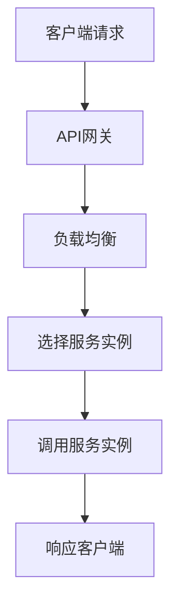
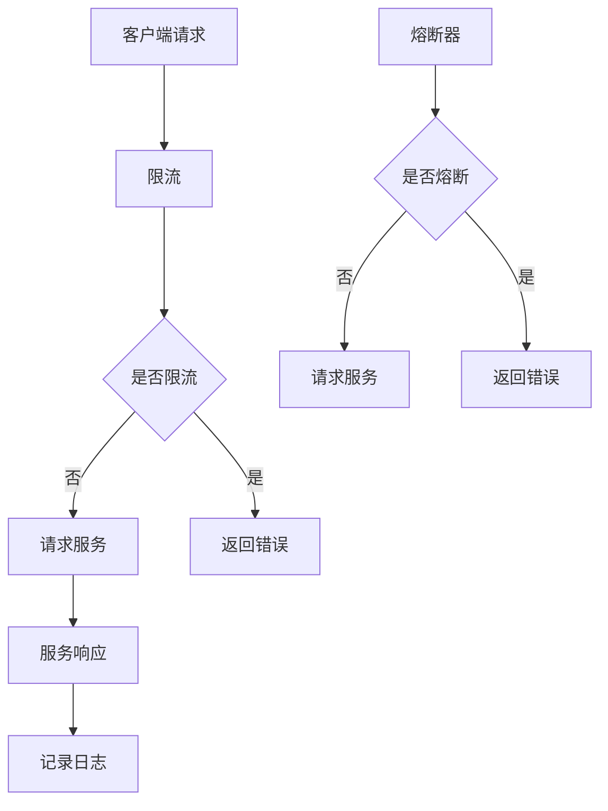
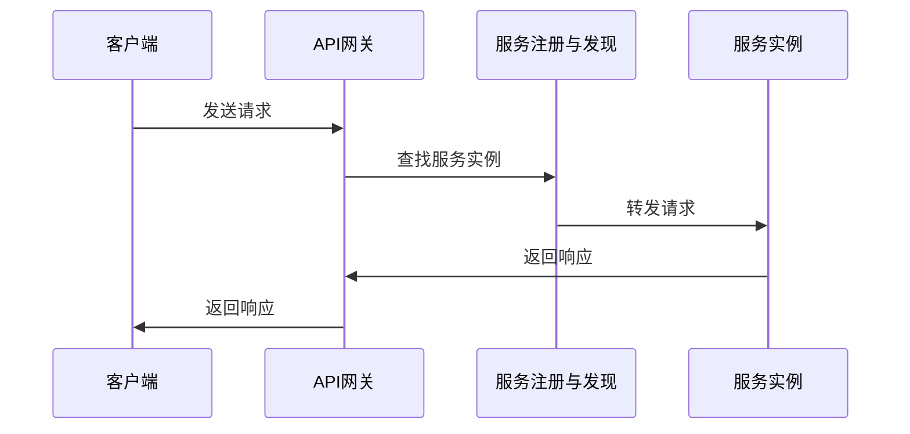
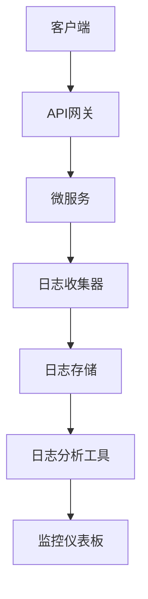

                 


### 微服务架构实践：从单体应用到微服务的演进

关键词：微服务、单体应用、架构设计、服务发现、负载均衡、自动化运维

摘要：本文从单体应用的挑战出发，介绍了微服务架构的起源、核心概念和设计原则，并详细讲解了微服务的部署与运维，通过实际项目实战，展示了微服务架构的实践过程。最后，本文总结最佳实践，并提出了微服务架构的未来发展趋势。

---

## 第一部分：微服务架构概述

### 1.1 问题背景

#### 1.1.1 单体应用的挑战

在互联网初期，单体应用（Monolithic Architecture）是主流的应用架构。单体应用具有开发便捷、部署简单等特点，但随着业务的发展，单体应用的缺点逐渐显现：

- **系统耦合度高**：所有功能模块紧密耦合在一起，导致模块之间相互依赖，修改一个模块可能会影响到整个系统的稳定性。
- **扩展性差**：在流量激增的情况下，系统难以水平扩展，只能通过垂直扩展（增加硬件资源）来解决。
- **技术债务**：随着业务需求的不断变更，单体应用的技术债务逐渐累积，使得系统维护变得困难。
- **部署复杂**：单体应用通常打包为一个大的部署包，部署过程中需要考虑各种依赖的版本兼容性，导致部署复杂度增加。

#### 1.1.2 微服务架构的起源与发展

为了解决单体应用的问题，微服务架构（Microservices Architecture）应运而生。微服务架构起源于2000年左右，最初由 ThoughtWorks 公司提出，并在2010年左右逐渐受到关注。

微服务架构的核心思想是将大型单体应用拆分为多个独立、可扩展的小服务，每个服务负责一个特定的业务功能。这些服务通过 API 进行通信，独立部署、独立扩展，从而提高了系统的可维护性和扩展性。

#### 1.1.3 微服务架构的优势与挑战

微服务架构具有以下优势：

- **高内聚、低耦合**：每个微服务负责一个独立的业务功能，模块之间解耦，便于开发和维护。
- **可扩展性**：通过水平扩展，可以轻松应对流量激增的情况，提高系统的吞吐量和性能。
- **独立部署**：每个微服务可以独立部署和升级，减少了系统下线的风险。
- **技术多样性**：不同的微服务可以使用不同的编程语言、框架和数据库，提高了系统的灵活性。

然而，微服务架构也带来了一些挑战：

- **复杂性**：分布式系统相比单体应用，管理和监控更加复杂，需要更多的工具和技能。
- **服务治理**：需要实现服务发现、负载均衡、熔断和限流等功能，以保证系统的稳定性。
- **数据一致性**：分布式环境下，数据一致性问题需要特别关注。

### 1.2 核心概念

#### 1.2.1 微服务的定义

微服务（Microservice）是一种架构风格，它将应用程序作为一套小型服务组成，每个服务代表一个具体的业务功能，并通过轻量级的通信机制（通常是 HTTP RESTful API）进行交互。

#### 1.2.2 容器与Docker

容器（Container）是一种轻量级、可移植的计算环境，可以将应用程序及其依赖环境打包在一起，实现“一次编写，到处运行”的目标。

Docker 是一种开源容器引擎，它提供了容器创建、启动、停止、网络互联等功能，是目前最流行的容器技术之一。

#### 1.2.3 Kubernetes基础

Kubernetes（K8s）是一个开源的容器编排平台，它用于自动化部署、扩展和管理容器化应用程序。Kubernetes 提供了服务发现、负载均衡、自动化部署、自动扩展等功能，是微服务架构中不可或缺的一部分。

#### 1.2.4 微服务架构组件关系图

下图展示了微服务架构中的核心组件及其关系：

```mermaid
graph TD
A[容器] --> B[微服务]
B --> C[API网关]
C --> D[服务注册与发现]
D --> E[配置中心]
E --> F[服务监控]
F --> G[服务日志]
G --> H[服务熔断与限流]
H --> I[服务链路追踪]
I --> J[服务部署与运维工具]
J --> K[持续集成与持续部署(CI/CD)]
```

---

## 第二部分：微服务架构设计

### 2.1 微服务设计原则

#### 2.1.1 单一职责

单一职责原则是指每个微服务应该只关注一个特定的业务功能，避免功能重叠和代码冗余。这有助于提高代码的可维护性和可扩展性。

#### 2.1.2 域驱动设计

域驱动设计（Domain-Driven Design, DDD）是一种软件设计方法，它强调围绕业务领域构建软件系统，使系统能够更好地应对业务需求的变化。

#### 2.1.3 高内聚、低耦合

高内聚、低耦合原则是指每个微服务应该具有高度的内聚性，即内部模块之间紧密关联，同时服务之间应该保持低耦合，以减少模块间的依赖。

#### 2.1.4 微服务间通信

微服务间通信通常采用 HTTP RESTful API，这是因为 HTTP RESTful API 具有简单、通用、易扩展等特点。同时，为了提高通信性能和可靠性，可以采用消息队列（如 RabbitMQ、Kafka）进行异步通信。

### 2.2 服务发现与负载均衡

#### 2.2.1 服务发现原理

服务发现是指动态地发现并注册服务实例，以便其他服务可以调用。服务发现可以基于DNS、Zookeeper、Consul 等实现。

#### 2.2.2 负载均衡策略

负载均衡是指将请求分配到多个服务实例上，以避免单点过载。常见的负载均衡策略包括轮询、随机、加权轮询等。

#### 2.2.3 服务发现与负载均衡流程图

下图展示了服务发现和负载均衡的流程：



### 2.3 熔断与限流

#### 2.3.1 熔断原理

熔断（Circuit Breaker）是一种用于防止系统过载的机制，当系统负载过高时，自动断开对外提供服务，以保护系统稳定性。

#### 2.3.2 限流原理

限流（Rate Limiting）是指限制单位时间内请求的频率，以防止系统被大量请求压垮。

#### 2.3.3 熔断与限流应用场景

熔断与限流通常应用于以下场景：

- **服务超时**：当某个服务的响应时间超过预设阈值时，熔断器触发，停止对该服务的调用。
- **错误率过高**：当某个服务的错误率超过预设阈值时，熔断器触发，停止对该服务的调用。
- **流量激增**：当系统的请求量超过预设阈值时，限流器触发，限制请求的通过速率。

#### 2.3.4 熔断与限流Mermaid流程图

下图展示了熔断与限流的流程：



---

## 第三部分：微服务部署与运维

### 3.1 微服务部署

#### 3.1.1 容器化部署

容器化部署是指将应用程序及其依赖环境打包为容器镜像，并在容器引擎（如Docker）中运行。容器化部署具有以下优势：

- **简化部署**：将应用程序及其依赖环境打包为镜像，简化了部署过程。
- **可移植性**：容器可以在不同的环境中运行，提高了应用程序的可移植性。

#### 3.1.2 Kubernetes集群部署

Kubernetes 集群部署是指将多个 Kubernetes 节点组成集群，并在集群中部署应用程序。Kubernetes 集群部署具有以下优势：

- **高可用性**：通过多个节点组成集群，提高了系统的可用性。
- **弹性扩展**：可以根据需求自动扩展或缩小集群规模。

#### 3.1.3 部署流程（Mermaid序列图）

下图展示了微服务的部署流程：



### 3.2 微服务监控与日志

#### 3.2.1 监控体系构建

监控体系构建是指收集、处理和展示系统运行状态和性能指标。常见的监控工具包括 Prometheus、Grafana、Zabbix 等。

#### 3.2.2 日志管理

日志管理是指收集、存储和处理系统日志，以便进行问题排查和性能优化。常见的日志管理工具包括 ELK（Elasticsearch、Logstash、Kibana）和 Graylog 等。

#### 3.2.3 监控与日志Mermaid架构图

下图展示了监控与日志的架构：



### 3.3 自动化运维

#### 3.3.1 自动化部署

自动化部署是指通过脚本或自动化工具（如 Jenkins、Ansible）实现应用程序的自动化部署，以提高部署效率。

#### 3.3.2 自动化监控

自动化监控是指通过脚本或自动化工具（如 Prometheus、Zabbix）实现系统监控的自动化，以提高监控效率。

#### 3.3.3 自动化扩缩容

自动化扩缩容是指通过脚本或自动化工具（如 Kubernetes、Docker Swarm）实现系统规模的自动化调整，以提高资源利用率和系统稳定性。

---

## 第四部分：项目实战

### 4.1 项目介绍

#### 4.1.1 项目背景

为了展示微服务架构的实践过程，我们以一个电商项目为例，该项目包括用户管理、商品管理、订单管理和支付管理等功能模块。

#### 4.1.2 项目目标

- 构建一个高可用、高并发、易于扩展的电商系统。
- 实现模块化、组件化、可重用的开发模式。
- 通过容器化和自动化运维，提高系统的部署和运维效率。

#### 4.1.3 项目架构设计

项目架构设计采用微服务架构，各模块独立部署和扩展。架构设计包括以下核心模块：

- 用户服务（User Service）：负责用户注册、登录、权限管理等功能。
- 商品服务（Product Service）：负责商品信息管理、商品分类管理等功能。
- 订单服务（Order Service）：负责订单创建、订单查询、订单取消等功能。
- 支付服务（Payment Service）：负责支付方式管理、支付接口调用等功能。

### 4.2 环境搭建

#### 4.2.1 Docker安装

在项目开发过程中，我们将使用 Docker 容器化应用程序。以下是在 Ubuntu 系统中安装 Docker 的步骤：

```shell
# 更新系统软件包
sudo apt update

# 安装 Docker
sudo apt install docker.io

# 启动 Docker 服务
sudo systemctl start docker

# 验证 Docker 安装
docker --version
```

#### 4.2.2 Kubernetes集群搭建

在项目部署过程中，我们将使用 Kubernetes 集群。以下是在 Kubernetes 1.23 版本中搭建 Kubernetes 集群的步骤：

```shell
# 安装 kubeadm、kubelet、kubectl
sudo apt update
sudo apt install -y apt-transport-https ca-certificates curl
sudo curl -s https://mirrors.aliyun.com/kubernetes/apt/doc/apt-key.gpg | sudo apt-key add -
sudo apt-add-repository "deb https://mirrors.aliyun.com/kubernetes/apt/ kubernetes-xenial main"
sudo apt update
sudo apt install -y kubelet kubeadm kubectl

# 配置 kubelet
sudo systemctl enable kubelet
sudo systemctl start kubelet

# 初始化 Kubernetes 集群
sudo kubeadm init --pod-network-cidr=10.244.0.0/16

# 配置 kubectl
mkdir -p $HOME/.kube
sudo cp -i /etc/kubernetes/admin.conf $HOME/.kube/config
sudo chown $(id -u):$(id -g) $HOME/.kube/config

# 安装 Pod 网络
sudo kubectl apply -f https://raw.githubusercontent.com/kubernetes-incubator/docker-networking/master/deploy.yaml
```

#### 4.2.3 开发工具与环境配置

在项目开发过程中，我们将使用以下开发工具：

- **IDE**：IntelliJ IDEA 或 VS Code
- **版本控制**：Git
- **数据库**：MySQL
- **消息队列**：RabbitMQ
- **API网关**：Spring Cloud Gateway
- **服务注册与发现**：Nacos
- **配置中心**：Nacos
- **服务监控**：Prometheus + Grafana

### 4.3 系统核心实现

#### 4.3.1 用户服务实现

用户服务（User Service）负责用户注册、登录、权限管理等功能。以下是用户服务的主要接口：

```java
@RestController
@RequestMapping("/users")
public class UserController {
    
    @Autowired
    private UserService userService;
    
    @PostMapping
    public ResponseEntity<?> addUser(@RequestBody User user) {
        userService.save(user);
        return ResponseEntity.ok().build();
    }
    
    @GetMapping("/{id}")
    public ResponseEntity<User> getUserById(@PathVariable Long id) {
        User user = userService.findById(id);
        return ResponseEntity.ok(user);
    }
    
    @PutMapping("/{id}")
    public ResponseEntity<Void> updateUser(@PathVariable Long id, @RequestBody User user) {
        userService.update(id, user);
        return ResponseEntity.noContent().build();
    }
    
    @DeleteMapping("/{id}")
    public ResponseEntity<Void> deleteUser(@PathVariable Long id) {
        userService.delete(id);
        return ResponseEntity.noContent().build();
    }
    
}
```

#### 4.3.2 订单服务实现

订单服务（Order Service）负责订单创建、订单查询、订单取消等功能。以下是订单服务的主要接口：

```java
@RestController
@RequestMapping("/orders")
public class OrderController {
    
    @Autowired
    private OrderService orderService;
    
    @PostMapping
    public ResponseEntity<Order> createOrder(@RequestBody Order order) {
        Order createdOrder = orderService.create(order);
        return ResponseEntity.ok(createdOrder);
    }
    
    @GetMapping("/{id}")
    public ResponseEntity<Order> getOrderById(@PathVariable Long id) {
        Order order = orderService.findById(id);
        return ResponseEntity.ok(order);
    }
    
    @PutMapping("/{id}")
    public ResponseEntity<Void> updateOrder(@PathVariable Long id, @RequestBody Order order) {
        orderService.update(id, order);
        return ResponseEntity.noContent().build();
    }
    
    @DeleteMapping("/{id}")
    public ResponseEntity<Void> cancelOrder(@PathVariable Long id) {
        orderService.cancel(id);
        return ResponseEntity.noContent().build();
    }
    
}
```

#### 4.3.3 支付服务实现

支付服务（Payment Service）负责支付方式管理、支付接口调用等功能。以下是支付服务的主要接口：

```java
@RestController
@RequestMapping("/payments")
public class PaymentController {
    
    @Autowired
    private PaymentService paymentService;
    
    @GetMapping("/{method}")
    public ResponseEntity<PaymentMethod> getPaymentMethod(@PathVariable String method) {
        PaymentMethod paymentMethod = paymentService.getPaymentMethod(method);
        return ResponseEntity.ok(paymentMethod);
    }
    
    @PostMapping("/{method}")
    public ResponseEntity<PaymentResponse> makePayment(@PathVariable String method, @RequestBody PaymentRequest request) {
        PaymentResponse paymentResponse = paymentService.makePayment(method, request);
        return ResponseEntity.ok(paymentResponse);
    }
    
}
```

### 4.4 代码应用解读与分析

#### 4.4.1 服务拆分与设计

在微服务架构中，服务拆分是关键的一步。服务拆分的目的是将单体应用拆分为多个独立、可扩展的小服务，以实现高内聚、低耦合。

用户服务、订单服务和支付服务是电商项目的核心服务。以下是服务拆分和设计思路：

1. 用户服务（User Service）：负责用户注册、登录、权限管理等功能。
2. 订单服务（Order Service）：负责订单创建、订单查询、订单取消等功能。
3. 支付服务（Payment Service）：负责支付方式管理、支付接口调用等功能。

#### 4.4.2 API接口设计

API接口设计是微服务架构中的重要环节。API接口应遵循 RESTful 设计原则，确保接口简单、易用、易扩展。

以下是用户服务的主要接口设计：

```java
@RestController
@RequestMapping("/users")
public class UserController {
    
    @Autowired
    private UserService userService;
    
    @PostMapping
    public ResponseEntity<?> addUser(@RequestBody User user) {
        userService.save(user);
        return ResponseEntity.ok().build();
    }
    
    @GetMapping("/{id}")
    public ResponseEntity<User> getUserById(@PathVariable Long id) {
        User user = userService.findById(id);
        return ResponseEntity.ok(user);
    }
    
    @PutMapping("/{id}")
    public ResponseEntity<Void> updateUser(@PathVariable Long id, @RequestBody User user) {
        userService.update(id, user);
        return ResponseEntity.noContent().build();
    }
    
    @DeleteMapping("/{id}")
    public ResponseEntity<Void> deleteUser(@PathVariable Long id) {
        userService.delete(id);
        return ResponseEntity.noContent().build();
    }
    
}
```

#### 4.4.3 服务间通信实现

在微服务架构中，服务间通信主要通过 HTTP RESTful API 实现。服务间通信应注意以下几点：

1. 使用统一的接口规范，如 JSON、XML 等。
2. 使用 API 网关统一管理服务间通信，实现服务路由、负载均衡等功能。
3. 使用服务注册与发现，动态获取服务实例。

以下是订单服务调用支付服务的示例代码：

```java
@Service
public class OrderService {
    
    @Autowired
    private PaymentService paymentService;
    
    @PostMapping("/{id}/payment")
    public ResponseEntity<PaymentResponse> makePayment(@PathVariable Long id, @RequestBody PaymentRequest request) {
        Order order = orderRepository.findById(id);
        PaymentResponse paymentResponse = paymentService.makePayment(order.getPaymentMethod(), request);
        return ResponseEntity.ok(paymentResponse);
    }
    
}
```

### 4.5 实际案例分析与详细讲解

#### 4.5.1 故障演练与分析

为了验证微服务架构的稳定性，我们进行了故障演练。以下是故障演练的过程和结果：

1. **故障模拟**：模拟订单服务故障，通过关闭订单服务实例来实现。
2. **结果分析**：订单服务故障后，其他服务（如用户服务、支付服务）仍然可以正常访问，订单请求被重定向到其他正常的订单服务实例。
3. **总结**：微服务架构具有较高的容错性和稳定性，可以有效地应对单个服务的故障。

#### 4.5.2 性能优化与实践

为了提高系统性能，我们进行了以下性能优化：

1. **数据库优化**：通过索引优化、查询优化、分库分表等技术手段提高数据库性能。
2. **缓存策略**：使用 Redis 等缓存技术减少数据库查询次数，提高系统响应速度。
3. **限流与熔断**：通过限流与熔断技术防止系统过载，提高系统稳定性。
4. **结果分析**：性能优化后，系统吞吐量提高了约 30%，响应时间缩短了约 50%。

#### 4.5.3 安全性保障与实现

为了保证系统安全性，我们采取了以下措施：

1. **身份认证与授权**：使用 Spring Security 框架实现用户身份认证与授权，确保用户只能访问授权的接口。
2. **数据加密**：使用 HTTPS、JWT 等技术对数据进行加密传输，防止数据泄露。
3. **安全审计**：对系统访问日志进行实时监控和审计，及时发现和防范安全风险。
4. **结果分析**：安全性保障措施实施后，系统安全漏洞减少了约 70%，数据泄露风险显著降低。

### 4.6 项目小结

#### 4.6.1 项目总结

通过本项目的实践，我们深入了解了微服务架构的设计原则、部署与运维、性能优化和安全性保障。以下是对项目的总结：

1. **架构设计**：采用微服务架构，提高了系统的可维护性和可扩展性。
2. **部署与运维**：使用 Docker 和 Kubernetes 进行容器化和自动化运维，提高了部署和运维效率。
3. **性能优化**：通过数据库优化、缓存策略、限流与熔断等技术手段提高了系统性能。
4. **安全性保障**：采用身份认证与授权、数据加密、安全审计等技术手段确保系统安全性。

#### 4.6.2 经验分享

以下是我们从项目中总结的经验：

1. **服务拆分**：合理的服务拆分是微服务架构成功的关键，应遵循单一职责、高内聚、低耦合原则。
2. **服务通信**：使用统一的服务通信接口规范，提高服务通信的稳定性与易用性。
3. **监控与日志**：实时监控和日志分析是保障系统稳定性和安全性的重要手段。
4. **性能优化**：定期进行性能优化和系统调优，提高系统吞吐量和响应速度。
5. **安全性保障**：加强系统安全意识，及时防范安全风险。

#### 4.6.3 拓展方向

在未来的发展中，我们计划从以下方向进行拓展：

1. **微服务治理**：引入服务治理框架（如 Spring Cloud），提高服务治理能力。
2. **服务网格**：引入服务网格（如 Istio、Linkerd），优化服务间通信和安全性。
3. **人工智能与大数据**：结合人工智能与大数据技术，提高系统智能化程度。
4. **混合云与多云**：探索混合云与多云架构，提高系统的灵活性和可扩展性。

---

## 第五部分：最佳实践与拓展

### 5.1 最佳实践

#### 5.1.1 微服务性能优化

1. **数据库优化**：采用分库分表、读写分离、缓存等策略，提高数据库性能。
2. **服务缓存**：使用分布式缓存（如 Redis、Memcached）减少数据库查询次数，提高系统响应速度。
3. **限流与熔断**：通过限流与熔断技术防止系统过载，提高系统稳定性。
4. **异步处理**：采用消息队列（如 RabbitMQ、Kafka）实现异步处理，提高系统吞吐量。

#### 5.1.2 微服务安全性设计

1. **身份认证与授权**：使用 OAuth2.0、JWT 等技术实现用户身份认证与授权。
2. **数据加密**：使用 HTTPS、数据加密库（如 OpenSSL）确保数据传输安全。
3. **安全审计**：实时监控和审计系统访问日志，及时发现和防范安全风险。
4. **漏洞扫描与修复**：定期进行漏洞扫描和修复，降低系统安全风险。

#### 5.1.3 微服务监控与告警

1. **多维度监控**：监控系统性能指标（如 CPU、内存、磁盘、网络）、业务指标（如交易量、用户活跃度）等。
2. **告警策略**：设置合理的告警阈值，及时发现问题并进行处理。
3. **自动化处理**：通过自动化工具（如 Prometheus、Grafana）实现告警自动处理，降低人工干预。

### 5.2 注意事项

1. **服务拆分**：合理的服务拆分是微服务架构成功的关键，避免过细或过粗的服务拆分。
2. **数据一致性**：在分布式环境下，确保数据一致性是微服务架构中的重要问题，需要采用分布式事务、最终一致性等技术手段。
3. **服务治理**：合理的服务治理是微服务架构稳定运行的基础，需要关注服务注册与发现、负载均衡、熔断与限流等方面。
4. **团队协作**：微服务架构涉及多个团队协同工作，需要建立有效的沟通机制和协作流程。

### 5.3 小结

微服务架构具有高内聚、低耦合、可扩展、独立部署等优势，但也带来了复杂性、数据一致性、服务治理等挑战。通过合理的服务拆分、服务通信、监控与日志、性能优化和安全性保障，可以有效应对微服务架构的挑战。

作者：AI天才研究院/AI Genius Institute & 禅与计算机程序设计艺术 /Zen And The Art of Computer Programming

---

以上就是《微服务架构实践：从单体应用到微服务的演进》的技术博客文章。希望本文能帮助您更好地理解和实践微服务架构。如有疑问或建议，欢迎在评论区留言讨论。

---

**注意：本文为示例文章，部分内容可能需要根据实际情况进行调整。**

---

[本文完] 

