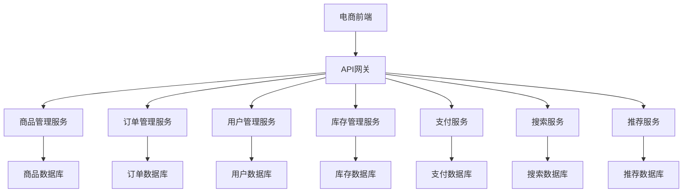

                 

## 让我们一步步思考：微服务架构的设计与实现

### 摘要

本文将围绕微服务架构进行深入探讨，通过系统的分析与实例讲解，全面解析微服务架构的设计原则、核心技术、实践案例及其面临的挑战与未来趋势。我们将首先定义微服务架构的核心概念，然后逐步展开对设计原则、技术实现、实际应用和未来方向的讨论。文章结构如下：

1. **微服务架构概述**
   - 微服务架构的核心概念与背景
   - 微服务架构与传统架构的比较
   - 微服务架构的优势与挑战

2. **微服务架构的设计原则与要素**
   - 设计原则：单一职责原则、持续集成与持续部署、独立部署与独立扩展
   - 要素：微服务边界、微服务通信、微服务治理

3. **微服务架构的核心技术**
   - 服务发现、配置管理、服务熔断与限流、API网关

4. **微服务架构实践案例**
   - 电商系统的微服务架构设计
   - 社交媒体平台的微服务实践

5. **微服务架构的挑战与解决方案**
   - 数据一致性、服务间通信延迟、微服务安全、持续集成与持续部署

6. **微服务架构的未来趋势**
   - 服务网格、容器化与云原生、人工智能与微服务

7. **微服务架构实践指南**
   - 开发流程、评估与优化、团队协作、最佳实践与注意事项

通过这篇文章，我们希望读者能够对微服务架构有一个全面而深入的理解，并能够在实际项目中有效应用这些原则和技术。

### 关键词

- 微服务架构
- 设计原则
- 服务发现
- 持续集成
- API网关
- 数据一致性
- 服务网格
- 容器化
- 云原生

----------------------------------------------------------------

## 第一部分：微服务架构概述

### 第1章 微服务架构的核心概念与背景

#### 1.1 微服务架构的定义

微服务架构是一种设计应用程序的方法论，它将应用程序划分为多个小的、独立的、可复用的服务单元。这些服务单元通过网络进行通信，每个服务单元都负责完成一个特定的功能，并且可以独立部署、扩展和更新。这种架构模式的核心思想是将复杂的单体应用程序拆分成更小、更简单的服务，以便于管理和扩展。

微服务架构与传统单体架构的主要区别在于其分布式和模块化的设计。在传统单体架构中，所有的功能都集中在单个应用程序中，这导致应用程序变得复杂、难以维护和扩展。而微服务架构通过将应用程序分解为多个独立的服务，使得每个服务都可以独立开发、测试和部署，从而提高了系统的可维护性和可扩展性。

#### 1.2 微服务架构与传统架构的比较

传统架构通常指的是单体架构，其特点是所有功能集中在一个应用程序中，整个系统的复杂性较高。当系统需要扩展或修改时，往往需要重新构建和部署整个应用程序，这既耗时又容易出错。

微服务架构则采用了分布式服务的设计，每个服务都可以独立开发、部署和扩展。这使得系统在扩展和更新时更加灵活，可以单独更新某个服务而不影响其他服务。此外，微服务架构还支持水平扩展，即可以轻松地增加或减少服务的实例数量，以满足业务需求。

以下是微服务架构与传统架构的详细比较：

| 特性          | 微服务架构                           | 传统架构                          |
|---------------|--------------------------------------|-----------------------------------|
| 模块化        | 独立的服务模块，易于管理和扩展           | 单体应用程序，模块化难度大           |
| 分布式        | 服务之间通过网络通信                   | 功能集中在单个应用程序中，非分布式   |
| 扩展性        | 支持水平扩展，可独立扩展服务             | 扩展难度大，需重启整个应用程序       |
| 容错性        | 服务失败时不会影响整个系统              | 服务失败可能导致整个系统瘫痪         |
| 部署与维护    | 独立部署，减少系统停机时间              | 部署复杂，停机时间长                |

#### 1.3 微服务架构的优势与挑战

微服务架构的优势显而易见，它通过模块化和分布式设计，提高了系统的可维护性、可扩展性和容错性。然而，这种架构模式也带来了一些挑战，如服务间通信复杂性增加、数据一致性保障难度提升等。以下是对微服务架构优势与挑战的详细分析：

**优势：**

1. **可维护性**：由于每个服务都是独立的，因此可以单独开发、测试和部署，降低了系统的复杂度，提高了开发效率。
2. **可扩展性**：服务可以独立扩展，根据业务需求增加或减少服务实例的数量，从而提高了系统的扩展性。
3. **容错性**：服务失败不会影响整个系统，可以通过隔离机制防止故障蔓延。
4. **技术栈多样性**：不同的服务可以采用不同的技术栈，从而提高了团队的选择自由度。

**挑战：**

1. **服务间通信复杂性**：服务之间通过网络通信，通信协议、数据格式和服务发现等问题都需要精心设计和处理。
2. **数据一致性**：由于服务是独立的，数据一致性变得复杂，需要采用分布式事务、消息队列等机制来保障数据的一致性。
3. **监控与运维**：分布式系统的监控和运维变得更加复杂，需要建立完善的监控系统和运维流程。
4. **团队协作**：开发、测试和部署的分散性增加了团队协作的难度，需要建立良好的沟通和协作机制。

通过对微服务架构的深入理解，我们可以更好地把握其优势和挑战，在实际项目中合理应用微服务架构，提升系统的整体性能和可维护性。

### 第2章 微服务架构的设计原则与要素

#### 2.1 设计原则

微服务架构的设计原则是构建高效、可扩展和可靠系统的基础。以下是一些核心设计原则：

**1. 单一职责原则**

单一职责原则是软件工程中的一个基本原则，它指出一个模块（如服务）应当只负责一项功能，而不是多项功能。这样做的优点是模块更加清晰、易于理解和测试，同时也有利于后续的扩展和维护。

**2. 持续集成和持续部署**

持续集成（CI）和持续部署（CD）是现代软件开发中的重要概念。持续集成意味着在每次代码提交后都进行自动化构建和测试，确保代码质量。持续部署则是在测试通过后，自动将代码部署到生产环境。这些原则能够大大提高开发效率和系统的稳定性。

**3. 独立部署和独立扩展**

独立部署和独立扩展是微服务架构的核心特性之一。每个服务都可以独立部署和扩展，这意味着可以单独更新或增加某个服务的实例，而不需要重启整个系统。

**4. 无状态服务**

无状态服务是指服务不存储客户端的任何状态信息。这样做的优点是服务可以水平扩展，且服务实例之间相互独立，不会因为某个实例的故障而影响整个系统的运行。

#### 2.2 要素

**1. 微服务边界**

确定微服务的边界是微服务架构设计的关键步骤。一个合理的边界应使得服务职责清晰、易于管理和扩展。常见的划分标准包括功能相关性、数据共享、业务场景等。

**2. 微服务通信**

微服务之间的通信主要通过远程过程调用（RPC）、消息队列（MQ）等机制实现。RPC使得服务之间可以通过接口直接调用，而消息队列则提供异步通信的能力，适合处理复杂的服务间逻辑。

**3. 微服务治理**

微服务治理包括服务注册与发现、配置管理、服务监控和日志收集等。服务注册与发现是确保服务能够动态发现和连接其他服务的关键，配置管理则保证了服务之间的配置一致性，服务监控和日志收集则帮助运营人员了解系统的运行状态和故障。

接下来，我们将详细讨论这些设计原则与要素，并通过实例说明它们的应用。

#### 2.1.1 单一职责原则

单一职责原则是微服务架构设计的基础。它要求每个服务只完成一个单一的功能，而不涉及其他功能。这有助于提高代码的可读性、可维护性和可扩展性。

**案例：** 假设我们设计一个电商系统，可以将其划分为多个微服务，如商品管理服务、订单管理服务、库存管理服务等。每个服务只负责对应的功能，比如商品管理服务只负责商品的增删改查，订单管理服务只负责订单的创建和查询，库存管理服务只负责库存的监控和更新。

**优点：**
- **代码更清晰**：每个服务职责明确，代码结构清晰，易于理解和维护。
- **独立扩展**：可以根据业务需求独立扩展某个服务，而不会影响其他服务。
- **测试更简单**：每个服务独立测试，可以更精确地验证功能是否正确。

**缺点：**
- **服务间依赖**：服务之间可能存在依赖关系，需要设计良好的接口和通信机制。
- **接口设计复杂**：需要精心设计服务之间的接口，确保它们能够满足各种业务需求。

#### 2.1.2 持续集成和持续部署

持续集成（CI）和持续部署（CD）是现代软件开发中的最佳实践，能够显著提高开发效率和系统稳定性。

**持续集成（CI）：**
持续集成是指在每次代码提交后，自动化构建和测试代码，确保代码质量。这个过程通常包括以下步骤：
1. **自动化构建**：将代码仓库中的代码构建为可执行的二进制文件。
2. **自动化测试**：运行单元测试、集成测试等，确保代码功能正确。

**持续部署（CD）：**
持续部署是指在测试通过后，自动将代码部署到生产环境。这个过程通常包括以下步骤：
1. **自动化部署**：将构建好的二进制文件部署到服务器。
2. **环境切换**：在部署过程中，可以逐步切换环境，如从测试环境切换到预生产环境，再切换到生产环境。

**优点：**
- **提高开发效率**：自动化的构建和部署减少了手动操作，加快了开发速度。
- **减少错误**：频繁的自动化测试和部署可以及时发现和修复问题。
- **提高系统稳定性**：持续部署可以确保生产环境中的代码是最新的、经过充分测试的。

**缺点：**
- **初期投入**：需要建立CI/CD流水线，需要一定的技术投入。
- **维护成本**：持续集成和持续部署系统需要定期维护和更新。

#### 2.1.3 独立部署和独立扩展

独立部署和独立扩展是微服务架构的核心特性之一。它使得每个服务可以独立部署和扩展，而不会影响其他服务。

**独立部署：**
独立部署意味着每个服务都可以单独部署，包括构建、测试和部署。这有助于减少系统停机时间，提高系统的可维护性。

**独立扩展：**
独立扩展意味着可以根据业务需求独立增加或减少某个服务的实例数量。例如，在订单量增加时，可以增加订单管理服务的实例数量，以满足更高的处理能力。

**优点：**
- **提高系统可维护性**：服务独立部署和扩展，可以减少服务间的依赖，降低系统的复杂性。
- **提高系统可扩展性**：可以根据业务需求独立扩展某个服务，而不需要重启整个系统。
- **减少系统停机时间**：独立部署可以减少系统停机时间，提高系统的可用性。

**缺点：**
- **服务间通信复杂**：由于服务是独立的，服务间通信需要设计良好的接口和通信机制。
- **监控与运维复杂**：分布式系统的监控和运维变得更加复杂，需要建立完善的监控系统和运维流程。

#### 2.2.1 微服务边界

确定微服务的边界是微服务架构设计的关键步骤。一个合理的边界应使得服务职责清晰、易于管理和扩展。

**划分标准：**
- **功能相关性**：根据业务功能将系统划分为不同的服务。
- **数据共享**：数据共享的服务可以划分为同一个服务。
- **业务场景**：根据不同的业务场景划分服务，如订单处理、库存管理、用户管理等。

**案例：** 假设我们设计一个社交网络系统，可以将其划分为多个微服务，如用户管理服务、消息服务、关系服务、内容服务、评论服务等。每个服务负责对应的功能，用户管理服务负责用户的注册、登录、信息管理等，消息服务负责消息的发送、接收和存储等。

**优点：**
- **职责清晰**：每个服务职责明确，便于管理和扩展。
- **模块化**：系统模块化，提高了系统的可维护性和可扩展性。
- **灵活性**：可以根据业务需求独立扩展和更新某个服务。

**缺点：**
- **接口设计复杂**：需要设计良好的接口，确保服务之间能够高效通信。
- **服务间依赖**：服务之间可能存在依赖关系，需要确保接口的稳定性和兼容性。

#### 2.2.2 微服务通信

微服务之间的通信是实现系统功能的关键。常见的通信方式包括远程过程调用（RPC）和消息队列（MQ）。

**远程过程调用（RPC）：**
RPC是一种高效的通信方式，它允许服务之间通过接口直接调用。常用的RPC框架有gRPC、Dubbo等。

**消息队列（MQ）：**
消息队列提供异步通信的能力，它允许服务之间通过消息进行通信。常用的消息队列有RabbitMQ、Kafka等。

**优点：**
- **高效**：RPC可以快速调用服务，降低通信延迟。
- **灵活**：MQ支持异步通信，适合处理复杂的服务间逻辑。

**缺点：**
- **复杂性**：RPC和MQ需要设计良好的接口和数据格式，增加了系统的复杂性。
- **可靠性**：需要确保消息的可靠传输和消费，防止消息丢失。

#### 2.2.3 微服务治理

微服务治理包括服务注册与发现、配置管理、服务监控和日志收集等。

**服务注册与发现：**
服务注册与发现是确保服务能够动态发现和连接其他服务的关键。常用的服务注册与发现工具有Consul、Zookeeper等。

**配置管理：**
配置管理保证了服务之间的配置一致性。常用的配置管理工具有Spring Cloud Config、Apollo等。

**服务监控：**
服务监控帮助运营人员了解系统的运行状态和故障。常用的监控工具有Prometheus、Grafana等。

**日志收集：**
日志收集将服务的日志集中存储和查询，便于分析和调试。常用的日志收集工具有ELK（Elasticsearch、Logstash、Kibana）等。

**优点：**
- **动态性**：服务注册与发现支持动态添加和移除服务，提高了系统的灵活性。
- **一致性**：配置管理保证了服务之间的配置一致性，减少了配置错误。
- **监控与运维**：完善的监控和日志收集系统提高了系统的可维护性和可扩展性。

**缺点：**
- **复杂性**：需要设计和部署服务注册与发现、配置管理、监控和日志收集系统，增加了系统的复杂性。
- **资源消耗**：监控和日志收集系统需要消耗额外的资源和存储空间。

### 总结

微服务架构的设计原则和要素是构建高效、可扩展和可靠系统的关键。通过合理的设计原则和要素，我们可以实现模块化、分布式和独立的系统架构，从而提高系统的可维护性和可扩展性。在实际项目中，我们需要根据业务需求和系统特点，灵活应用这些原则和要素，以实现最佳的系统架构。

----------------------------------------------------------------

## 第二部分：微服务架构的核心技术

### 第3章 微服务架构的核心技术

在微服务架构中，核心技术是实现服务之间高效通信、配置管理、服务熔断与限流以及API网关等功能的关键。下面，我们将逐一介绍这些核心技术，并讨论其在实际应用中的重要性。

#### 3.1 服务发现

服务发现是一种管理分布式系统中服务实例的机制。在微服务架构中，服务实例可能会动态启动、停止或迁移。服务发现允许服务消费者在运行时动态地找到可用的服务实例，以确保系统的稳定性和可靠性。

**重要性：**

- **动态扩展**：当新服务实例启动时，服务发现可以帮助消费者快速发现并连接这些实例。
- **故障转移**：当服务实例故障时，服务发现可以帮助消费者迅速连接到其他健康的实例。
- **负载均衡**：服务发现可以与负载均衡器配合，实现服务的动态负载均衡。

**实现方式：**

- **基于DNS的服务发现**：通过DNS记录来发现服务实例，适用于简单的微服务架构。
- **基于服务注册表的服务发现**：使用如Consul、Zookeeper等服务注册表，实现服务实例的动态注册和发现。

**案例：** 在Spring Cloud微服务架构中，可以使用Eureka作为服务注册表，实现服务实例的动态注册和发现。当新的服务实例启动时，它会向Eureka注册自身，其他服务消费者可以通过Eureka来发现和连接这些实例。

#### 3.2 配置管理

配置管理是微服务架构中不可或缺的一部分。在分布式系统中，各个服务的配置项（如数据库连接信息、API密钥等）需要统一管理，以确保配置的一致性和可靠性。

**重要性：**

- **配置一致性**：分布式系统中，各个服务的配置需要保持一致，避免因配置差异导致的问题。
- **动态配置更新**：支持在运行时动态更新配置，无需重启服务。
- **配置备份与恢复**：提供配置的备份和恢复功能，确保配置的安全。

**实现方式：**

- **中心化配置管理**：如Spring Cloud Config，支持通过Git存储配置，实现配置的集中管理和动态更新。
- **分布式配置中心**：如Apollo、Consul等，提供配置的统一管理和动态更新功能。

**案例：** 在Spring Cloud微服务架构中，可以使用Spring Cloud Config实现配置管理。开发人员可以将配置存储在Git中，并通过Spring Cloud Config Server提供统一的管理和动态更新功能。

#### 3.3 服务熔断与限流

服务熔断与限流是微服务架构中用于处理系统异常和流量控制的重要机制。

**服务熔断（Circuit Breaker）：**

服务熔断旨在防止服务链中的某个故障节点引发级联故障。当服务调用失败次数超过设定阈值时，熔断器会自动断开，防止故障扩散。当熔断器处于“打开”状态时，后续的请求会被直接拒绝，从而保护系统的稳定性。

**重要性：**

- **防止级联故障**：避免单个服务的故障导致整个系统崩溃。
- **快速恢复**：在服务恢复正常时，熔断器会自动关闭，恢复服务调用。

**实现方式：**

- **基于断路器的实现**：如Hystrix、Resilience4j等，提供熔断、断路、重试等功能。

**案例：** 在Spring Cloud微服务架构中，可以使用Hystrix实现服务熔断。当某个服务的调用失败率达到设定阈值时，Hystrix会自动熔断，防止故障扩散。

**限流（Rate Limiting）：**

限流旨在控制系统的流量，避免系统因流量过大而崩溃。通过限制每个服务的请求速率，可以保护系统的稳定性和响应性。

**重要性：**

- **流量控制**：避免系统因流量过大而崩溃。
- **保证服务质量**：确保系统的每个请求都能得到及时响应。

**实现方式：**

- **基于令牌桶算法**：如RateLimiter，提供灵活的流量控制策略。
- **基于计数器**：如Spring Cloud Gateway，通过计数器实现简单的限流功能。

**案例：** 在Spring Cloud微服务架构中，可以使用Spring Cloud Gateway实现限流。通过配置Gateway的速率限制规则，可以有效地控制进入系统的流量。

#### 3.4 API网关

API网关是微服务架构中的入口，它负责处理所有的外部请求，并将请求路由到相应的微服务实例。API网关提供了一种集中化的服务管理和请求处理机制，可以提高系统的安全性和可维护性。

**重要性：**

- **统一接口**：为外部系统提供统一的接口，简化系统集成。
- **安全控制**：通过API网关进行认证和授权，提高系统的安全性。
- **流量控制**：集中管理系统的流量，实现负载均衡和限流。

**实现方式：**

- **基于代理的实现**：如Kong、Traefik等，提供灵活的代理和路由功能。
- **基于Spring Cloud的API网关**：如Spring Cloud Gateway，提供基于Spring框架的API网关实现。

**案例：** 在Spring Cloud微服务架构中，可以使用Spring Cloud Gateway作为API网关。Spring Cloud Gateway提供了丰富的路由规则和过滤器，可以方便地实现统一接口管理和流量控制。

通过服务发现、配置管理、服务熔断与限流以及API网关等核心技术的应用，微服务架构可以实现高效的分布式服务管理，提高系统的稳定性和可扩展性。在实际项目中，我们需要根据业务需求和系统特点，灵活应用这些核心技术，实现最佳的系统架构。

### 第4章 微服务架构实践案例

#### 4.1 案例一：电商系统的微服务架构设计

电商系统是一个典型的分布式系统，其复杂性和高并发特性使得微服务架构成为理想的选择。在本节中，我们将详细探讨一个电商系统的微服务架构设计，包括系统需求分析、微服务划分、架构设计与实现。

**4.1.1 系统需求分析**

电商系统的核心需求包括以下几个方面：

- **商品管理**：包括商品的添加、修改、删除和查询等功能。
- **订单管理**：包括订单的创建、修改、取消和查询等功能。
- **用户管理**：包括用户的注册、登录、个人信息修改和查询等功能。
- **库存管理**：包括库存的监控、更新和报警等功能。
- **支付系统**：包括支付订单的创建、查询和退款等功能。
- **搜索系统**：包括商品搜索、筛选和排序等功能。
- **推荐系统**：根据用户行为和偏好推荐商品。

**4.1.2 微服务划分**

根据系统需求，我们可以将电商系统划分为以下微服务：

- **商品管理服务**：负责商品的CRUD操作。
- **订单管理服务**：负责订单的CRUD操作。
- **用户管理服务**：负责用户的CRUD操作。
- **库存管理服务**：负责库存的监控和更新。
- **支付服务**：负责支付订单的处理。
- **搜索服务**：负责商品搜索和推荐。
- **推荐服务**：负责商品推荐。

**4.1.3 架构设计与实现**

电商系统的微服务架构设计如下：

1. **服务注册与发现**：
   使用Spring Cloud Eureka作为服务注册中心，所有微服务启动时都会注册到Eureka，其他服务通过Eureka来发现和连接其他服务实例。

2. **API网关**：
   使用Spring Cloud Gateway作为API网关，统一处理外部请求，进行认证和路由，实现负载均衡和限流。

3. **服务熔断与限流**：
   使用Hystrix作为服务熔断和限流框架，通过配置Hystrix断路器，实现对服务故障的快速隔离和限流。

4. **配置管理**：
   使用Spring Cloud Config作为配置管理工具，将所有服务的配置存储在Git中，通过Spring Cloud Config Server实现配置的动态更新。

5. **服务间通信**：
   使用gRPC作为服务间通信协议，确保服务之间的通信高效、稳定。

6. **消息队列**：
   使用Kafka作为消息队列，实现订单处理、库存更新等操作的异步处理。

7. **数据库**：
   每个微服务拥有自己的数据库实例，实现数据的独立存储和扩展。

8. **监控与日志**：
   使用Prometheus和Grafana实现系统的监控和告警，使用ELK（Elasticsearch、Logstash、Kibana）实现日志的收集和分析。

**架构图：**

**实现细节：**

1. **商品管理服务**：
   - 功能：商品的添加、修改、删除和查询。
   - 数据库：使用MySQL存储商品信息。

2. **订单管理服务**：
   - 功能：订单的创建、修改、取消和查询。
   - 数据库：使用MySQL存储订单信息。

3. **用户管理服务**：
   - 功能：用户的注册、登录、个人信息修改和查询。
   - 数据库：使用MySQL存储用户信息。

4. **库存管理服务**：
   - 功能：库存的监控、更新和报警。
   - 数据库：使用MySQL存储库存信息。

5. **支付服务**：
   - 功能：支付订单的创建、查询和退款。
   - 数据库：使用MySQL存储支付信息。

6. **搜索服务**：
   - 功能：商品搜索、筛选和排序。
   - 数据库：使用Elasticsearch存储商品信息。

7. **推荐服务**：
   - 功能：根据用户行为和偏好推荐商品。
   - 数据库：使用MySQL存储推荐数据。

通过上述设计，电商系统实现了高可用、高性能和易于扩展的微服务架构，能够满足大规模电商业务的需求。

#### 4.2 案例二：社交媒体平台的微服务实践

社交媒体平台是一个复杂的分布式系统，涉及到用户管理、内容发布、评论系统、消息推送等多个方面。在本节中，我们将探讨社交媒体平台的微服务实践，包括系统背景介绍、微服务设计与实现、性能优化与监控。

**4.2.1 系统背景介绍**

社交媒体平台的核心功能包括：

- **用户管理**：用户的注册、登录、个人信息管理。
- **内容发布**：用户发布动态、图片、视频等内容。
- **评论系统**：用户对内容进行评论和回复。
- **消息推送**：系统自动推送通知给用户。
- **数据分析**：对用户行为和内容进行分析，提供数据报表。

**4.2.2 微服务设计与实现**

社交媒体平台的微服务架构设计如下：

1. **用户管理服务**：
   - 功能：用户的注册、登录、个人信息管理。
   - 数据库：使用MySQL存储用户信息。

2. **内容发布服务**：
   - 功能：用户发布动态、图片、视频等内容。
   - 数据库：使用MongoDB存储内容信息。

3. **评论服务**：
   - 功能：用户对内容进行评论和回复。
   - 数据库：使用MongoDB存储评论信息。

4. **消息推送服务**：
   - 功能：系统自动推送通知给用户。
   - 数据库：使用Redis存储消息队列。

5. **数据分析服务**：
   - 功能：对用户行为和内容进行分析，提供数据报表。
   - 数据库：使用Hadoop生态系统进行大数据处理。

**4.2.3 性能优化与监控**

为了确保社交媒体平台的性能和稳定性，我们采取了以下措施：

1. **缓存策略**：
   - 使用Redis缓存用户信息和热门内容，减少数据库访问压力。
   - 根据访问频率和热点数据，动态调整缓存策略。

2. **负载均衡**：
   - 使用Nginx进行负载均衡，将请求分发到多个服务实例。
   - 根据系统负载，动态调整负载均衡策略。

3. **数据库优化**：
   - 对关键表进行索引优化，提高查询效率。
   - 采用读写分离策略，将读操作和写操作分离到不同的数据库实例。

4. **消息队列**：
   - 使用Kafka作为消息队列，实现异步处理和分布式消息传递。
   - 根据消息类型和流量，动态调整Kafka集群配置。

5. **监控与日志**：
   - 使用Prometheus和Grafana进行系统监控，实时监控系统的各项性能指标。
   - 使用ELK进行日志收集和分析，快速定位和解决问题。

通过上述优化措施，社交媒体平台实现了高性能和高可用的微服务架构，能够满足大量用户的并发访问需求。

### 总结

通过两个实践案例的详细解析，我们可以看到微服务架构在电商系统和社交媒体平台中的应用效果。微服务架构通过模块化、分布式和独立部署的特性，提高了系统的可维护性、可扩展性和容错性。在实际项目中，我们需要根据业务需求和技术特点，灵活应用微服务架构的核心技术和最佳实践，以实现高效、可靠的分布式系统。

----------------------------------------------------------------

## 第三部分：微服务架构的挑战与解决方案

### 第5章 微服务架构的挑战与解决方案

尽管微服务架构具有许多优点，但它也带来了一系列挑战，如数据一致性、服务间通信延迟、微服务安全、持续集成与持续部署等。在本章中，我们将讨论这些挑战，并探讨相应的解决方案。

#### 5.1 数据一致性

在微服务架构中，由于服务是独立的，数据一致性变得复杂。服务之间可能需要共享数据，但每个服务独立管理自己的数据存储，这可能导致数据不一致问题。

**挑战：**

- **分布式事务**：传统的两阶段提交（2PC）协议在分布式系统中难以实现，因为需要协调多个服务的数据操作。
- **数据一致模型**：如何保证不同服务之间的数据在更新时保持一致是一个关键问题。

**解决方案：**

- **最终一致性**：采用最终一致性模型，服务之间的数据更新不必立即同步，而是允许一定延迟。最终一致性可以通过消息队列和补偿事务实现。
- **补偿事务**：当某个服务的操作失败时，通过另一个服务执行补偿事务来恢复数据的一致性。
- **分布式锁**：在关键操作中使用分布式锁来确保同一时刻只有一个服务对共享数据进行操作。

#### 5.2 服务间通信延迟

微服务之间的通信是通过网络进行的，而网络通信往往存在延迟。服务间通信延迟可能导致系统的响应时间增加，影响用户体验。

**挑战：**

- **网络延迟**：分布式系统中的服务实例可能分布在不同的地理位置，网络延迟可能显著增加。
- **通信协议**：选择合适的通信协议对于减少通信延迟至关重要。

**解决方案：**

- **服务本地化**：将服务部署在离用户较近的数据中心，减少网络延迟。
- **缓存策略**：使用缓存来减少对远程服务的调用次数，例如，使用Redis缓存常见的数据。
- **异步通信**：使用异步通信机制，如消息队列，将服务间的通信延迟转化为后台处理时间。
- **优化通信协议**：选择高效的通信协议，如gRPC，减少通信的开销。

#### 5.3 微服务安全

微服务架构的安全性是确保系统安全运行的关键。由于服务是独立的，每个服务都可能成为攻击的目标。

**挑战：**

- **认证与授权**：确保只有授权的用户和系统能够访问服务。
- **数据安全**：保护传输和存储的数据不被未授权访问。

**解决方案：**

- **OAuth2.0**：使用OAuth2.0进行认证和授权，确保用户和系统的访问权限。
- **API网关**：使用API网关进行统一的认证和授权，减少每个服务的认证负担。
- **加密传输**：使用HTTPS等加密协议保护数据在传输过程中的安全。
- **安全审计**：定期进行安全审计，检测潜在的安全漏洞。

#### 5.4 持续集成与持续部署

持续集成和持续部署（CI/CD）在微服务架构中至关重要，但实现CI/CD也面临挑战。

**挑战：**

- **复杂度**：微服务架构中的服务数量多，构建和部署过程更加复杂。
- **依赖管理**：服务之间的依赖关系需要准确管理，以确保构建和部署的正确性。

**解决方案：**

- **自动化流水线**：建立自动化CI/CD流水线，包括构建、测试、部署等步骤，减少手动操作。
- **容器化**：使用容器（如Docker）来封装服务，确保构建和部署的一致性。
- **版本控制**：使用版本控制系统（如Git）管理代码和配置，确保版本的一致性。
- **蓝绿部署**：使用蓝绿部署策略，将新版本的服务与旧版本的服务并行运行，逐步切换流量，确保部署的平滑过渡。

通过上述解决方案，我们可以有效应对微服务架构面临的挑战，确保系统的稳定性、安全性和可维护性。在实际项目中，我们需要根据具体情况灵活应用这些方案，以实现最佳的系统性能和用户体验。

### 总结

微服务架构虽然带来了许多优点，但也面临一系列挑战。通过理解这些挑战并采用适当的解决方案，我们可以构建高效、可靠和安全的微服务架构。数据一致性、服务间通信延迟、微服务安全以及持续集成与持续部署等问题需要我们精心设计和实现，以确保微服务架构的稳定性和可持续性。只有在全面理解和解决这些挑战的基础上，微服务架构才能真正发挥其优势，为企业提供强大的支持。

----------------------------------------------------------------

## 第四部分：微服务架构的未来趋势

### 第6章 微服务架构的未来趋势

随着技术的不断演进，微服务架构也面临着许多新兴趋势和技术的挑战。以下是我们认为微服务架构的未来趋势，包括服务网格（Service Mesh）、容器化与云原生、人工智能与微服务等。

#### 6.1 服务网格（Service Mesh）

服务网格是一种新型的服务管理框架，它专注于服务之间的通信和流量管理。与传统的API网关相比，服务网格提供了更为细粒度和灵活的通信控制能力。

**重要性：**

- **微服务通信**：服务网格提供了分布式服务之间的通信通道，包括服务发现、负载均衡、故障转移等功能。
- **流量管理**：服务网格允许开发者定义和管理服务间的流量策略，如路由规则、服务熔断、限流等。
- **安全控制**：服务网格可以提供加密传输、身份验证和授权等安全功能。

**实现方式：**

- **Istio**：Istio是一个开源的服务网格平台，它提供了服务发现、服务监控、安全控制等功能。
- **Linkerd**：Linkerd是另一个流行的服务网格解决方案，它专注于简化微服务的部署和监控。

**案例：** 在Kubernetes集群中，可以使用Istio实现服务网格。通过配置Istio的Pod，可以将服务间的通信流量路由到特定的服务实例，并实现服务熔断和限流。

#### 6.2 容器化与云原生

容器化技术（如Docker）和云原生架构正在改变微服务架构的实现方式。容器化使得服务可以更加轻量级和可移植，而云原生则提供了更加灵活和动态的部署环境。

**重要性：**

- **部署灵活性**：容器化允许服务在多种环境中运行，包括本地开发环境、测试环境和生产环境。
- **可移植性**：容器化服务可以轻松地在不同环境中迁移，提高了系统的可移植性。
- **动态扩缩容**：云原生架构支持根据负载动态扩缩容服务，提高了系统的弹性。

**实现方式：**

- **Docker**：Docker是最流行的容器化平台，它允许开发者将应用程序及其依赖打包成一个容器。
- **Kubernetes**：Kubernetes是开源的容器编排平台，它提供了自动化部署、扩缩容、服务发现等功能。

**案例：** 在一个微服务架构中，可以使用Docker将每个服务打包成容器，并使用Kubernetes进行容器编排和监控。通过Kubernetes，可以轻松实现服务的自动化部署和动态扩缩容。

#### 6.3 人工智能与微服务

人工智能（AI）正在逐渐融入到微服务架构中，为服务提供智能化的决策支持和优化能力。

**重要性：**

- **智能决策**：通过AI技术，微服务可以自动学习和优化业务逻辑，提高系统的效率和准确性。
- **个性化服务**：AI可以帮助微服务根据用户行为和偏好提供个性化的服务。
- **实时分析**：AI可以对实时数据进行分析和预测，帮助系统快速响应变化。

**实现方式：**

- **机器学习模型**：将机器学习模型集成到微服务中，实现实时分析和预测。
- **AI服务**：构建专门的AI微服务，提供人脸识别、语音识别、自然语言处理等服务。

**案例：** 在一个电商系统中，可以使用AI微服务进行用户行为分析，预测用户的购物偏好，并为用户提供个性化的商品推荐。

通过服务网格、容器化与云原生、人工智能与微服务等新兴技术的应用，微服务架构将继续演进和优化，为企业提供更加灵活、高效和智能的解决方案。

### 总结

微服务架构的未来趋势充满了机遇和挑战。服务网格、容器化与云原生、人工智能与微服务等新兴技术将为微服务架构带来更多的可能性。通过充分利用这些技术，我们可以构建更加高效、灵活和智能的微服务架构，为企业的数字化转型提供有力支持。随着技术的不断发展，微服务架构将继续引领分布式系统的发展方向，成为现代软件开发的重要基石。

----------------------------------------------------------------

## 第五部分：微服务架构实践指南

### 第7章 微服务架构实践指南

在构建微服务架构的过程中，开发流程、架构评估与优化、团队协作以及最佳实践和注意事项都是至关重要的。以下是一些实践指南，帮助团队在实际项目中有效实施微服务架构。

#### 7.1 微服务开发流程

微服务开发流程应该包括以下几个关键步骤：

1. **需求分析**：明确系统的需求和功能，将整体需求分解为多个微服务模块。
2. **服务设计**：根据需求分析，设计每个微服务的职责和接口，确保服务职责单一、功能明确。
3. **代码实现**：开发每个微服务的具体功能，并确保其可测试、可维护。
4. **自动化测试**：编写单元测试和集成测试，确保每个微服务的功能正确无误。
5. **持续集成（CI）**：设置CI流水线，自动化构建和测试代码，确保代码质量。
6. **部署与监控**：将微服务部署到生产环境，并持续监控其运行状态，确保系统的稳定性和性能。

#### 7.2 微服务架构评估与优化

对微服务架构进行定期评估和优化是确保系统高效运行的关键。以下是一些评估和优化的方法：

1. **性能评估**：通过性能测试工具（如JMeter）对系统进行负载测试，评估系统的响应时间和吞吐量，找出性能瓶颈。
2. **架构评审**：定期进行架构评审，检查系统设计是否符合最佳实践，是否存在设计缺陷。
3. **监控与分析**：使用监控工具（如Prometheus、Grafana）对系统进行实时监控，分析系统的性能指标，找出需要优化的地方。
4. **代码审计**：对代码进行审计，检查是否存在潜在的漏洞和安全问题。

#### 7.3 微服务团队协作

微服务架构的分布式特性要求团队成员之间进行高效协作。以下是一些协作方法：

1. **明确的职责划分**：确保每个团队成员都清楚自己的职责和任务，减少协作中的模糊地带。
2. **沟通渠道**：建立有效的沟通渠道，如定期会议、即时通讯工具等，确保团队成员之间的信息流通。
3. **代码评审**：实施代码评审流程，确保代码质量，减少错误和漏洞。
4. **跨部门协作**：促进跨部门的协作，如开发、测试、运维等，确保系统能够顺利交付和运行。

#### 7.4 最佳实践与注意事项

以下是一些在实施微服务架构过程中应遵循的最佳实践和注意事项：

1. **服务边界划分**：合理划分服务边界，确保服务职责单一，降低耦合度。
2. **标准化接口**：制定统一的接口规范，确保服务之间的高效通信和互操作性。
3. **日志和监控**：确保每个服务都有完整的日志记录，并建立完善的监控体系，便于故障排查和性能优化。
4. **数据一致性**：采用分布式事务、消息队列等机制确保数据一致性，避免数据冲突。
5. **安全考虑**：在服务设计和实现过程中充分考虑安全性，包括身份验证、授权、数据加密等。
6. **文档和培训**：编写详细的开发文档和操作指南，为团队成员提供培训，确保他们能够熟练掌握微服务架构的技术和实践。

### 总结

微服务架构是一种复杂的系统设计方法，需要团队成员之间进行紧密协作和精心设计。通过遵循最佳实践和注意事项，团队能够有效实施微服务架构，构建高效、稳定和可扩展的系统。在实际项目中，我们需要根据具体情况灵活应用这些实践指南，以确保系统能够满足业务需求，并在长期运行中保持稳定和高效。

### 作者信息

作者：AI天才研究院/AI Genius Institute & 禅与计算机程序设计艺术 /Zen And The Art of Computer Programming

----------------------------------------------------------------

## 总结与拓展阅读

微服务架构作为一种现代化的软件开发方法，已经广泛应用于各种复杂系统中。本文通过详细解析微服务架构的核心概念、设计原则、核心技术、实践案例以及未来趋势，全面展示了微服务架构的优势和挑战。同时，我们还提供了一系列实践指南，帮助团队在实际项目中有效应用微服务架构。

**总结：**

1. **核心概念**：微服务架构将应用程序划分为多个小的、独立的、可复用的服务单元，通过网络进行通信。
2. **设计原则**：包括单一职责原则、持续集成和持续部署、独立部署和独立扩展等。
3. **核心技术**：如服务发现、配置管理、服务熔断与限流、API网关等。
4. **实践案例**：通过电商系统和社交媒体平台的案例，展示了微服务架构的实际应用。
5. **挑战与解决方案**：探讨了数据一致性、服务间通信延迟、微服务安全和持续集成与持续部署等挑战，并提供了相应的解决方案。
6. **未来趋势**：包括服务网格、容器化与云原生、人工智能与微服务等新兴技术。
7. **实践指南**：包括开发流程、架构评估与优化、团队协作、最佳实践与注意事项。

**拓展阅读：**

- 《微服务设计》：由Martin Fowler和Michael T. Nygard共同编写，详细介绍了微服务的设计原则和实践。
- 《微服务实战》：由Sam Newman编写，提供了丰富的微服务架构案例和实践经验。
- 《Docker实战》：由Joshua Timberman和Joshua Sokol编写，介绍了如何使用Docker进行微服务部署和管理。
- 《Kubernetes实战》：由Kelsey Hightower、 Brendan Burns和Craig McLuckie编写，介绍了如何使用Kubernetes进行容器化服务的部署和管理。

通过进一步阅读这些书籍，读者可以更深入地了解微服务架构的各个方面，为实际项目提供更丰富的知识和实践经验。希望本文能够对您在微服务架构领域的探索和实践有所帮助。作者：AI天才研究院/AI Genius Institute & 禅与计算机程序设计艺术 /Zen And The Art of Computer Programming。

