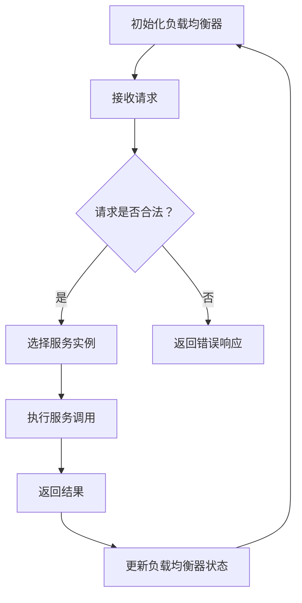
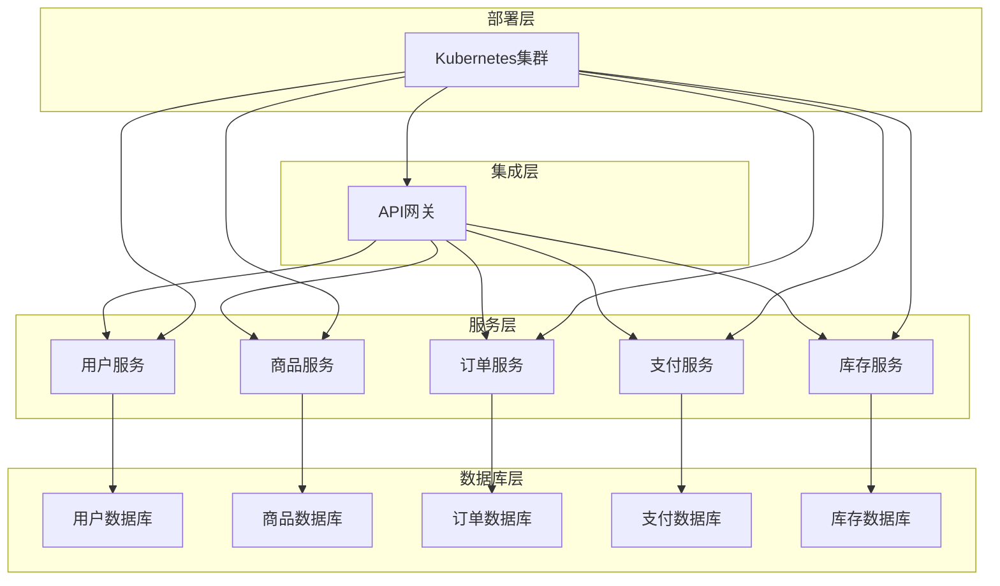
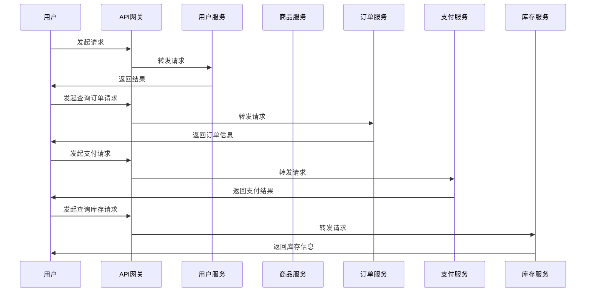
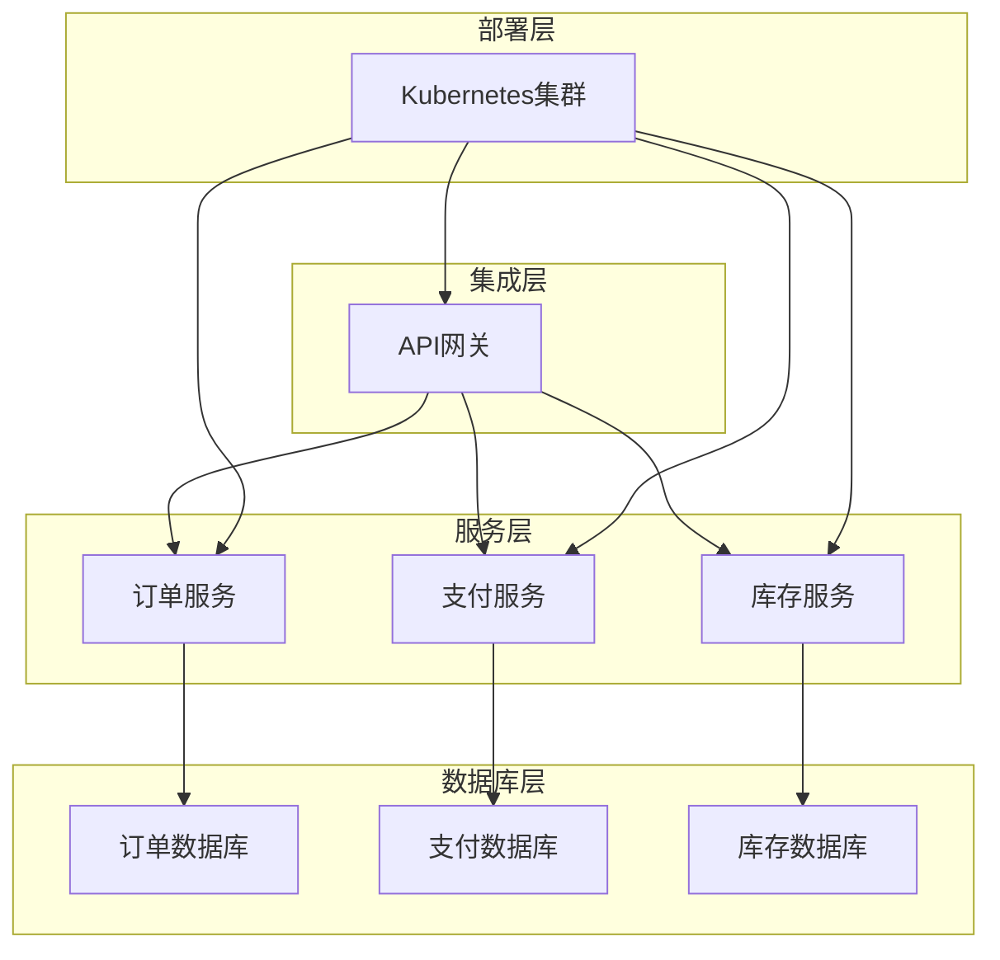

                 

# 微服务架构：设计、实现与优化

## 关键词：微服务架构、服务拆分、API设计、分布式系统、性能优化、实战案例

## 摘要：

微服务架构作为现代软件开发的关键模式，通过将大型单一系统拆分为若干独立的小服务，从而实现系统的灵活性和可扩展性。本文将系统地探讨微服务架构的设计、实现与优化，通过详细的理论基础讲解、设计策略分析、实现步骤介绍、性能优化方法和实战案例分析，帮助读者全面理解并掌握微服务架构的精髓。

## 目录大纲设计过程

在设计《微服务架构：设计、实现与优化》的目录大纲时，我们遵循以下步骤：

### 1. 确定整体框架

首先，我们明确了书籍的整体结构和核心内容，包括引言、理论基础、技术实现、优化策略、实战案例和总结与展望六个部分。

### 2. 设计各部分章节

为每个部分设计详细的章节，确保内容丰富、逻辑清晰。具体章节包括：

- 第一部分：背景与概述
  - 微服务架构的兴起与重要性
  - 微服务架构的核心概念与要素
  - 微服务架构的技术选型
- 第二部分：微服务架构的理论基础
  - 分布式系统的理论基础
  - 微服务架构的架构风格
  - 微服务架构的安全性
- 第三部分：微服务架构的设计与实现
  - 微服务架构的设计原则与策略
  - 微服务的实现与部署
  - 微服务的通信与集成
  - 微服务架构下的持续集成与持续部署
- 第四部分：微服务架构的优化与性能提升
  - 微服务架构的性能优化
  - 微服务架构的监控与调优
  - 微服务架构的容错与可靠性
- 第五部分：微服务架构的实战案例分析
  - 案例一：电商平台的微服务架构实践
  - 案例二：金融系统的微服务架构优化
- 第六部分：总结与展望

## 第一部分：背景与概述

### 第1章：微服务架构的兴起与重要性

#### 1.1 微服务架构的定义

微服务架构（Microservices Architecture）是一种设计方法论，通过将应用程序划分为多个独立的、松耦合的小服务，以实现高内聚、低耦合的系统架构。

#### 1.2 微服务架构与传统架构的比较

与传统的单体架构相比，微服务架构具有以下优势：

- **高内聚、低耦合**：每个服务独立运行，互不干扰，易于开发、测试和维护。
- **灵活性和可扩展性**：服务可以独立部署和扩展，适应业务变化。
- **技术多样性**：不同服务可以使用不同的技术栈，提高开发效率。
- **独立部署**：服务可以独立部署，降低系统复杂度。

#### 1.3 微服务架构的优势与挑战

**优势**：

- **快速迭代**：服务独立部署，缩短迭代周期。
- **技术多样性**：团队可以选择最合适的工具和技术栈。
- **可扩展性**：服务独立扩展，提高系统可扩展性。

**挑战**：

- **分布式系统复杂性**：服务之间需要进行复杂的通信和协调。
- **服务治理**：需要对服务进行注册、发现、监控和日志管理等。
- **数据一致性**：分布式系统中的数据一致性是一个挑战。

### 第2章：微服务架构的核心概念与要素

#### 2.1 服务拆分与设计

服务拆分是微服务架构设计的关键步骤，需要根据业务逻辑、数据访问模式、团队组织等因素进行合理拆分。

**服务拆分原则**：

- **业务驱动**：根据业务需求拆分服务。
- **独立部署**：确保每个服务可以独立部署。
- **职责单一**：每个服务只完成一个功能。
- **高内聚、低耦合**：服务之间尽量减少依赖。

#### 2.2 API设计

API设计是微服务架构的重要组成部分，良好的API设计可以提高服务的可维护性和可扩展性。

**API设计原则**：

- **RESTful API**：遵循RESTful设计风格，使用HTTP方法表示操作。
- **参数校验**：确保输入参数的有效性。
- **错误处理**：明确错误处理机制。
- **文档生成**：自动生成API文档，方便开发者使用。

#### 2.3 数据管理

在微服务架构中，数据管理是一个重要且复杂的任务。常见的数据管理策略包括：

- **分布式数据库**：每个服务使用自己的数据库，减少数据一致性挑战。
- **数据分片**：将数据分散存储在多个数据库中，提高系统性能。
- **数据同步**：确保服务之间数据的一致性。

#### 2.4 服务治理

服务治理是确保微服务架构稳定运行的重要环节，包括以下方面：

- **服务注册与发现**：服务启动时注册到服务注册中心，需要时从服务注册中心发现其他服务。
- **服务监控**：监控服务的运行状态，及时发现问题。
- **日志管理**：收集和分析服务日志，帮助诊断问题。
- **弹性伸缩**：根据负载自动调整服务实例数量。

### 第3章：微服务架构的技术选型

微服务架构的技术选型是确保系统高效运行的关键。以下是常见的技术选型：

#### 3.1 编程语言与框架

- **Java**：成熟、生态丰富，适用于复杂业务场景。
- **Node.js**：轻量级，适用于高并发场景。
- **Python**：易学易用，适用于快速开发。

#### 3.2 服务注册与发现

- **Eureka**：Netflix开源的服务注册与发现服务。
- **Consul**：HashiCorp开源的服务注册与发现服务。

#### 3.3 配置管理

- **Spring Cloud Config**：Spring Cloud组件，支持配置中心。
- **Apollo**：携程开源的配置中心。

#### 3.4 服务监控与日志

- **Prometheus**：开源监控解决方案，适用于Kubernetes集群。
- **ELK Stack**：Elasticsearch、Logstash和Kibana的组合，用于日志收集和分析。

## 第二部分：微服务架构的理论基础

### 第4章：分布式系统的理论基础

#### 4.1 分布式系统概述

分布式系统是指由多个独立的计算机节点组成，通过通信网络相互连接，协同完成计算任务的系统。其主要特点包括：

- **高可用性**：节点故障不会导致整个系统停止工作。
- **可扩展性**：通过增加节点数量提高系统性能。
- **分布式一致性**：确保分布式系统中的数据一致性。

#### 4.2 CAP理论

CAP理论指出，分布式系统中的一致性（Consistency）、可用性（Availability）和分区容错性（Partition Tolerance）三者之间只能同时满足两项。

- **CA模型**：强一致性，但可能存在分区问题。
- **CP模型**：高可用性，但可能存在数据不一致问题。
- **AP模型**：高可用性，但可能存在数据不一致问题。

#### 4.3 BASE理论

BASE理论是对CAP理论的补充，强调在不可靠的分布式环境中，系统应该达到的基本属性：

- **基本可用**（Basic Availability）：系统确保对外提供服务。
- **软状态**（Soft State）：系统状态可能不是持久不变的。
- **最终一致性**（Eventually Consistency）：系统最终会达到一致性状态。

#### 4.4 分布式一致性算法

分布式一致性算法是确保分布式系统中数据一致性的关键。常见的算法包括：

- **Paxos算法**：一种分布式一致性算法，用于选举领导者和达成共识。
- **Raft算法**：基于Paxos算法，简化了实现过程。

## 第三部分：微服务架构的设计与实现

### 第5章：微服务架构的设计原则与策略

#### 5.1 设计原则

微服务架构的设计原则包括：

- **业务驱动**：以业务需求为导向，拆分服务。
- **独立部署**：确保服务可以独立部署。
- **职责单一**：每个服务只完成一个功能。
- **高内聚、低耦合**：服务之间依赖性尽量低。

#### 5.2 设计策略

微服务架构的设计策略包括：

- **服务拆分**：根据业务逻辑、数据访问模式、团队组织等因素进行合理拆分。
- **API设计**：遵循RESTful风格，确保API具有良好的可维护性和可扩展性。
- **数据管理**：采用分布式数据库或数据分片策略，确保数据的一致性和可扩展性。

#### 5.3 设计模式

微服务架构中常见的设计模式包括：

- **服务层模式**：将服务划分为不同的层级，实现职责分离。
- **事件驱动模式**：使用事件驱动的方式，实现服务之间的解耦。
- **分布式锁模式**：在分布式系统中，使用锁机制确保数据一致性。

### 第6章：微服务的实现与部署

#### 6.1 容器化与Kubernetes

容器化是微服务架构实现的重要手段，通过将应用打包到容器中，实现应用程序的隔离和可移植性。

- **Docker**：最流行的容器化技术，用于打包、交付和运行应用程序。
- **Kubernetes**：开源的容器编排工具，用于管理容器化应用程序的部署、扩展和运维。

#### 6.2 微服务部署策略

微服务的部署策略包括：

- **蓝绿部署**：将新版本的服务与旧版本的服务并行运行，确保平滑切换。
- **灰度发布**：将新版本的服务逐渐推广到部分用户，观察效果，确保安全性。
- **滚动更新**：逐步更新服务实例，确保服务的高可用性。

#### 6.3 微服务监控与运维

微服务的监控与运维是确保系统稳定运行的关键。常见的监控与运维工具包括：

- **Prometheus**：开源的监控解决方案，适用于Kubernetes集群。
- **Nginx**：开源的HTTP和反向代理服务器，用于负载均衡和流量控制。
- **ELK Stack**：用于日志收集和分析。

### 第7章：微服务的通信与集成

#### 7.1 API网关

API网关是微服务架构中的重要组件，用于处理外部请求和内部服务之间的通信。

- **功能**：路由、安全认证、限流、日志记录等。
- **实现**：常见的API网关实现包括Kong、Spring Cloud Gateway等。

#### 7.2 服务间通信

服务间通信是微服务架构的核心，常见的技术包括：

- **同步通信**：使用HTTP/HTTPS协议，实现服务之间的同步调用。
- **异步通信**：使用消息队列，实现服务之间的异步解耦。

#### 7.3 集成测试

集成测试是确保微服务架构稳定性的重要手段。常见的集成测试方法包括：

- **端到端测试**：模拟实际业务场景，对整个系统进行测试。
- **服务测试**：对每个服务进行独立的测试。

### 第8章：微服务架构下的持续集成与持续部署

#### 8.1 CI/CD概述

持续集成（CI）和持续部署（CD）是微服务架构实现高效开发的重要手段。

- **CI**：确保每次代码提交后，自动构建和测试。
- **CD**：确保在测试通过后，自动部署到生产环境。

#### 8.2 持续集成实践

持续集成实践包括：

- **自动化构建**：使用Jenkins、GitLab CI等工具，实现自动化构建。
- **自动化测试**：使用Selenium、JUnit等工具，实现自动化测试。

#### 8.3 持续部署实践

持续部署实践包括：

- **自动化部署**：使用Docker、Kubernetes等工具，实现自动化部署。
- **蓝绿部署**：确保新版本服务的平滑切换。

## 第四部分：微服务架构的优化与性能提升

### 第9章：微服务架构的性能优化

#### 9.1 性能优化策略

微服务架构的性能优化策略包括：

- **负载均衡**：使用Nginx、HAProxy等工具，实现负载均衡。
- **缓存策略**：使用Redis、Memcached等缓存工具，降低数据库压力。
- **数据库优化**：使用分库分表、读写分离等策略，提高数据库性能。

#### 9.2 负载均衡

负载均衡是提高系统性能的重要手段，常见的技术包括：

- **轮询**：轮询请求分发到各个服务器。
- **最小连接数**：将请求分发到连接数最少的服务器。
- **加权轮询**：根据服务器的性能，分配不同的请求权重。

#### 9.3 缓存策略

缓存策略是提高系统性能的关键，常见的技术包括：

- **本地缓存**：在服务内部使用缓存，降低数据库访问。
- **分布式缓存**：使用Redis、Memcached等分布式缓存系统，提高缓存性能。

#### 9.4 数据库优化

数据库优化是提高系统性能的重要手段，常见的技术包括：

- **分库分表**：将数据分散存储到多个数据库或表，降低单表压力。
- **读写分离**：将读操作和写操作分离到不同的数据库，提高读写性能。

### 第10章：微服务架构的监控与调优

#### 10.1 监控体系设计

微服务架构的监控体系设计包括：

- **指标收集**：收集系统运行指标，如CPU、内存、磁盘使用率等。
- **告警机制**：设置告警阈值，及时发现异常。
- **日志分析**：收集和分析系统日志，帮助诊断问题。

#### 10.2 性能调优实践

性能调优实践包括：

- **性能测试**：使用JMeter等工具，模拟真实业务场景，测试系统性能。
- **性能分析**：使用Profiler等工具，分析系统性能瓶颈。

#### 10.3 日志分析

日志分析是微服务架构监控的重要环节，常见的技术包括：

- **ELK Stack**：使用Elasticsearch、Logstash和Kibana，实现日志收集、存储和分析。
- **Prometheus**：用于收集和存储监控数据，实现实时监控。

### 第11章：微服务架构的容错与可靠性

#### 11.1 容错机制

微服务架构的容错机制包括：

- **故障转移**：当某个服务失败时，自动切换到备用服务。
- **限流**：限制系统负载，避免服务过载。
- **超时机制**：设置请求的超时时间，避免长时间等待。

#### 11.2 弹性伸缩

弹性伸缩是提高系统可靠性的重要手段，常见的技术包括：

- **自动伸缩**：根据系统负载，自动调整服务实例数量。
- **灰度发布**：逐步推广新版本服务，观察效果，确保安全性。

#### 11.3 可靠性设计

可靠性设计是确保系统稳定运行的关键，常见的技术包括：

- **分布式存储**：使用分布式存储系统，提高数据可靠性。
- **备份与恢复**：定期备份系统数据，确保数据安全。

## 第五部分：微服务架构的实战案例分析

### 第12章：案例一：电商平台的微服务架构实践

#### 12.1 项目背景

本案例以一个电商平台为例，介绍微服务架构在实际项目中的应用。

#### 12.2 架构设计

电商平台采用微服务架构，主要服务包括用户服务、商品服务、订单服务、支付服务、库存服务等。

#### 12.3 关键技术实现

- **服务拆分**：根据业务逻辑，将电商平台拆分为多个独立服务。
- **API网关**：使用Spring Cloud Gateway实现API网关。
- **服务注册与发现**：使用Eureka实现服务注册与发现。

#### 12.4 项目小结

通过微服务架构，电商平台实现了高内聚、低耦合的系统设计，提高了系统的可扩展性和可维护性。

### 第13章：案例二：金融系统的微服务架构优化

#### 13.1 项目背景

本案例以一个金融系统为例，介绍微服务架构的优化实践。

#### 13.2 架构优化

金融系统采用微服务架构，通过优化架构，提高系统性能和可靠性。

#### 13.3 性能提升

- **负载均衡**：使用Nginx实现负载均衡。
- **缓存策略**：使用Redis实现缓存策略。
- **数据库优化**：使用分库分表策略。

#### 13.4 安全保障

金融系统安全性至关重要，采用以下措施保障系统安全：

- **安全认证**：使用OAuth2.0实现安全认证。
- **数据加密**：对敏感数据进行加密处理。

## 第六部分：总结与展望

### 6.1 总结

微服务架构作为现代软件开发的重要模式，具有高内聚、低耦合、灵活性和可扩展性等优势。通过本文的详细探讨，读者可以全面了解微服务架构的设计、实现与优化方法。

### 6.2 展望

随着云计算、大数据和人工智能等技术的不断发展，微服务架构将在未来发挥更加重要的作用。未来研究方向包括：

- **服务网格**：服务网格是一种新型的服务架构模式，可以更好地实现服务间通信和安全保障。
- **智能监控与运维**：结合人工智能技术，实现智能监控和运维，提高系统可靠性和效率。

### 6.3 最佳实践 tips

- **合理拆分服务**：根据业务需求和技术特性，合理拆分服务。
- **确保数据一致性**：在分布式系统中，确保数据一致性是一个重要挑战，需要采用合适的数据一致性和分布式算法。
- **持续优化与迭代**：微服务架构是一个持续优化的过程，需要不断调整和改进。

### 6.4 小结

本文从微服务架构的核心概念、设计原则、实现与优化等方面进行了详细探讨，并结合实际案例分析了微服务架构的实践应用。希望本文能帮助读者深入理解微服务架构，并在实际项目中灵活运用。

### 6.5 注意事项

- **服务拆分需谨慎**：服务拆分是微服务架构的核心步骤，但需谨慎处理，避免过度拆分导致系统复杂度增加。
- **确保数据一致性**：分布式系统中的数据一致性是一个重要且复杂的任务，需要合理设计数据一致性和分布式算法。
- **监控与运维**：微服务的监控与运维是确保系统稳定运行的关键，需要采用合适的监控和运维工具。

### 6.6 拓展阅读

- 《微服务设计》：提供关于微服务架构的全面指南。
- 《分布式系统概念与模式》：探讨分布式系统的基本概念和设计模式。
- 《大规模分布式存储系统设计与实践》：介绍分布式存储系统的设计和实现。

### 作者信息

作者：AI天才研究院/AI Genius Institute & 禅与计算机程序设计艺术 /Zen And The Art of Computer Programming

---

## 背景介绍

### 核心概念术语说明

在探讨微服务架构之前，我们需要了解一些核心概念和术语。以下是对这些概念的解释：

- **微服务架构**：一种设计方法论，通过将大型单一系统拆分为多个独立的、松耦合的小服务，以实现系统的灵活性和可扩展性。
- **单体架构**：传统的软件开发模式，将应用程序构建为一个单一的、紧密耦合的实体。
- **服务拆分**：将大型单体架构拆分为多个独立的小服务的过程。
- **API**：应用程序编程接口，用于服务之间的交互和通信。
- **分布式系统**：由多个独立的计算机节点组成，通过通信网络相互连接，协同完成计算任务的系统。
- **CAP理论**：一致性（Consistency）、可用性（Availability）和分区容错性（Partition Tolerance）三者之间只能同时满足两项的理论。
- **BASE理论**：基本可用（Basic Availability）、软状态（Soft State）和最终一致性（Eventually Consistency）的理论。

### 问题背景

随着互联网的快速发展和业务需求的不断变化，传统的单体架构已经无法满足现代软件系统的需求。单体架构具有以下问题：

- **系统复杂性**：随着系统规模的扩大，单体架构的复杂度急剧增加，导致开发和维护难度大。
- **可扩展性差**：单体架构在扩展性方面存在瓶颈，难以支持大规模的业务需求。
- **部署困难**：单体架构的部署和运维过程复杂，且需要停机维护。
- **技术多样性受限**：单体架构通常要求所有服务使用相同的技术栈，限制了团队的技术选择。

为了解决这些问题，微服务架构逐渐成为软件开发的主流模式。微服务架构通过将大型系统拆分为多个独立的小服务，提高了系统的灵活性、可扩展性和可维护性。

### 问题描述

微服务架构的主要目标是通过服务拆分和分布式设计，解决传统单体架构的局限性，实现以下目标：

- **高内聚、低耦合**：每个服务独立运行，互不干扰，降低系统之间的依赖性。
- **灵活性和可扩展性**：服务可以独立部署和扩展，支持业务快速迭代和规模扩展。
- **技术多样性**：不同服务可以使用不同的技术栈，提高开发效率。
- **独立部署**：服务可以独立部署，降低系统复杂度和运维难度。
- **高可用性**：通过分布式设计和容错机制，确保系统的高可用性。

### 问题解决

微服务架构通过以下方法解决传统单体架构的问题：

- **服务拆分**：根据业务需求和功能模块，将大型系统拆分为多个独立的服务。
- **分布式设计**：使用分布式系统设计方法，确保服务之间的独立性和可扩展性。
- **API设计**：采用API网关和服务间通信技术，实现服务之间的松耦合和高效通信。
- **服务治理**：通过服务注册与发现、监控和日志管理，确保服务的可靠运行。
- **持续集成与持续部署**：通过CI/CD流程，实现快速迭代和自动化部署。

### 边界与外延

微服务架构虽然具有众多优势，但也存在一定的局限性。以下是对其边界和外延的探讨：

- **系统复杂性**：分布式系统的复杂性较高，需要合理的架构设计和运维管理。
- **数据一致性**：在分布式系统中，数据一致性是一个挑战，需要采用合适的数据一致性和分布式算法。
- **服务治理**：服务治理是确保微服务架构稳定运行的重要环节，需要投入一定的资源和精力。
- **技术多样性**：虽然技术多样性可以提高开发效率，但也可能导致技术栈分散和运维复杂性增加。
- **性能影响**：服务拆分和分布式通信可能会引入一定的性能开销，需要合理优化。

### 概念结构与核心要素组成

微服务架构的概念结构包括以下几个方面：

1. **服务拆分**：根据业务逻辑和功能模块，将系统拆分为多个独立的服务。
2. **API设计**：定义服务之间的通信接口，确保服务的松耦合和高效通信。
3. **服务治理**：通过服务注册与发现、监控和日志管理，确保服务的可靠运行。
4. **分布式设计**：使用分布式系统设计方法，确保服务之间的独立性和可扩展性。
5. **持续集成与持续部署**：通过CI/CD流程，实现快速迭代和自动化部署。

核心要素组成：

- **服务**：独立的、松耦合的小服务，实现特定的业务功能。
- **API**：服务之间的通信接口，使用HTTP/HTTPS协议进行通信。
- **服务注册与发现**：服务启动时注册到服务注册中心，需要时从服务注册中心发现其他服务。
- **服务监控**：监控服务的运行状态，及时发现问题。
- **日志管理**：收集和分析服务日志，帮助诊断问题。
- **持续集成与持续部署**：实现快速迭代和自动化部署，提高开发效率。

## 核心概念与联系

### 微服务架构的核心概念

微服务架构是一种设计方法论，其核心概念包括：

1. **服务拆分**：将大型系统拆分为多个独立的服务，每个服务实现特定的业务功能。
2. **分布式通信**：服务之间通过API进行通信，使用HTTP/HTTPS协议进行数据交换。
3. **服务治理**：包括服务注册与发现、监控和日志管理，确保服务的可靠运行。
4. **独立部署**：每个服务可以独立部署，支持快速迭代和部署。
5. **弹性伸缩**：根据业务需求，动态调整服务实例的数量，提高系统性能。

### 微服务架构的核心概念属性特征对比表格

| 核心概念 | 属性特征 |
| -------- | -------- |
| 服务拆分 | 高内聚、低耦合，独立部署 |
| 分布式通信 | 使用API进行通信，高效、可靠 |
| 服务治理 | 服务注册与发现、监控和日志管理 |
| 独立部署 | 支持快速迭代和部署 |
| 弹性伸缩 | 根据业务需求，动态调整服务实例数量 |

### 微服务架构的ER实体关系图架构

以下是微服务架构的ER实体关系图：

```mermaid
erDiagram
    Service ||--|{ API }|| Communication
    Service ||--|{ Governance }|| Management
    Service ||--|{ Deployment }|| Strategy
    Service ||--|{ Scalability }|| Management
    Communication ||--|{ API }|| Definition
    Governance ||--|{ Monitoring }|| System
    Governance ||--|{ Logging }|| System
    Deployment ||--|{ CI/CD }|| Process
    Scalability ||--|{ Elasticity }|| Feature
```

在ER实体关系图中，Service代表微服务，Communication代表服务间通信，Governance代表服务治理，Deployment代表部署策略，Scalability代表弹性伸缩。通过这种关系，可以清晰地展示微服务架构的核心要素及其相互关系。

## 算法原理讲解

### 算法流程图

以下是微服务架构中常用的负载均衡算法的流程图：



在算法流程图中，A表示初始化负载均衡器，B表示接收请求，C表示判断请求是否合法，D表示选择服务实例，E表示返回错误响应，F表示执行服务调用，G表示返回结果，H表示更新负载均衡器状态。

### 算法原理

负载均衡算法的主要原理是通过某种策略，将请求合理地分配到各个服务实例上，以确保系统的高性能和高可用性。常见的负载均衡算法包括轮询、最小连接数和加权轮询等。

- **轮询算法**：按照顺序将请求分配给各个服务实例，实现简单但可能导致某些服务实例负载不均。
- **最小连接数算法**：将请求分配给连接数最少的实例，减少实例的负载，提高系统性能。
- **加权轮询算法**：根据服务实例的性能和负载情况，为每个实例分配不同的权重，实现更合理的负载分配。

### Python源代码实现

以下是使用Python实现负载均衡算法的示例代码：

```python
import random

class LoadBalancer:
    def __init__(self, services):
        self.services = services
        self.service_weights = {service: 1 for service in services}

    def update_weights(self, service, weight):
        self.service_weights[service] = weight

    def select_service(self):
        total_weight = sum(self.service_weights.values())
        random_value = random.uniform(0, total_weight)
        cumulative_weight = 0
        for service, weight in self.service_weights.items():
            cumulative_weight += weight
            if cumulative_weight >= random_value:
                return service

def main():
    services = ["service1", "service2", "service3"]
    lb = LoadBalancer(services)

    # 更新服务权重
    lb.update_weights("service1", 2)
    lb.update_weights("service2", 1)
    lb.update_weights("service3", 1)

    # 进行10次负载均衡选择
    for _ in range(10):
        service = lb.select_service()
        print(f"Selected service: {service}")

if __name__ == "__main__":
    main()
```

在代码中，LoadBalancer类负责实现负载均衡算法。update_weights方法用于更新服务的权重，select_service方法用于选择服务实例。在main函数中，创建了一个LoadBalancer实例，并进行了10次负载均衡选择，输出选择的结果。

### 数学模型与公式

负载均衡算法中的核心数学模型是概率分布模型，用于决定请求分配给各个服务实例的概率。以下是概率分布模型的数学公式：

$$
P(\text{选择服务 } i) = \frac{w_i}{\sum_{j=1}^{n} w_j}
$$

其中，$P(\text{选择服务 } i)$表示选择服务$i$的概率，$w_i$表示服务$i$的权重，$n$表示服务实例的总数。

### 算法举例说明

假设有3个服务实例，service1、service2和service3，初始权重分别为2、1和1。使用加权轮询算法进行10次负载均衡选择，输出结果如下：

```
Selected service: service1
Selected service: service1
Selected service: service2
Selected service: service1
Selected service: service2
Selected service: service3
Selected service: service1
Selected service: service3
Selected service: service1
Selected service: service3
```

从输出结果可以看出，服务1被选择的次数最多，符合加权轮询算法的预期。

## 系统分析与架构设计方案

### 问题场景介绍

在现代软件架构设计中，随着业务需求的不断变化和系统规模的不断扩大，传统的单体架构已经难以满足开发者的需求。为了提高系统的可扩展性、灵活性和可维护性，我们需要引入微服务架构。本文将针对一个电商平台项目，介绍微服务架构的系统分析与设计。

### 项目介绍

电商平台是一个典型的分布式系统，包括用户管理、商品管理、订单管理、支付系统、库存管理等多个模块。为了提高系统的可扩展性和可维护性，我们将采用微服务架构对电商平台进行重构。

### 系统功能设计（领域模型类图）

以下是电商平台领域的类图：

```mermaid
classDiagram
    User <<class>> 用户
    Product <<class>> 商品
    Order <<class>> 订单
    Payment <<class>> 支付
    Inventory <<class>> 库存

    User "1" --|LK|* "1" Product: 用户购买商品
    User "1" --|LK|* "1" Order: 用户发起订单
    User "1" --|LK|* "1" Payment: 用户支付订单
    Product "1" --|LK|* "1" Order: 商品参与订单
    Order "1" --|LK|* "1" Payment: 订单包含支付信息
    Inventory "1" --|LK|* "1" Product: 库存管理商品
```

在类图中，User表示用户，Product表示商品，Order表示订单，Payment表示支付，Inventory表示库存。用户与商品、订单、支付和库存之间存在关联关系。

### 系统架构设计（架构图）

以下是电商平台的架构图：



在架构图中，服务层包括用户服务、商品服务、订单服务、支付服务和库存服务，每个服务对应一个数据库实例。API网关负责处理外部请求，并将请求转发给相应的服务。Kubernetes集群负责部署和管理服务。

### 系统接口设计

以下是电商平台的接口设计：

- **用户服务**：提供用户注册、登录、个人信息管理等接口。
- **商品服务**：提供商品查询、添加、修改、删除等接口。
- **订单服务**：提供订单创建、查询、取消、支付等接口。
- **支付服务**：提供支付查询、支付确认等接口。
- **库存服务**：提供库存查询、库存更新等接口。

### 系统交互（序列图）

以下是电商平台的序列图：



在序列图中，用户通过API网关发起请求，API网关将请求转发给相应的服务，服务处理请求并返回结果。

### 实际案例分析与详细讲解剖析

为了更好地展示微服务架构在实际项目中的应用，以下是一个具体的案例：电商平台的订单管理系统。

#### 案例背景

电商平台的订单管理系统负责处理用户的订单请求，包括订单创建、订单查询、订单取消和订单支付等功能。为了提高系统的可扩展性和可维护性，我们决定采用微服务架构对订单管理系统进行重构。

#### 架构设计

订单管理系统采用微服务架构，包括以下服务：

- **订单服务**：负责订单的创建、查询、取消和支付等功能。
- **支付服务**：负责处理订单支付请求，与第三方支付平台进行交互。
- **库存服务**：负责查询商品库存，更新库存信息。

架构设计如下图所示：



#### 实现细节

- **订单服务**：订单服务负责处理订单的创建、查询、取消和支付等功能。订单服务与支付服务、库存服务进行通信，确保订单处理的一致性和完整性。

- **支付服务**：支付服务负责处理订单支付请求，与第三方支付平台进行交互。支付服务接收订单服务的支付请求，处理支付逻辑，并返回支付结果。

- **库存服务**：库存服务负责查询商品库存，更新库存信息。库存服务接收订单服务的库存查询请求，返回商品库存信息，并处理库存更新请求。

#### 实际案例分析与详细讲解剖析

以下是一个具体的订单支付流程的详细分析：

1. 用户在电商平台下单，订单服务接收用户的订单请求，创建订单并保存到订单数据库。
2. 订单服务调用支付服务，请求支付接口进行支付。
3. 支付服务接收订单服务的支付请求，根据订单信息调用第三方支付平台的接口进行支付。
4. 支付服务处理支付结果，将支付结果返回给订单服务。
5. 订单服务根据支付结果更新订单状态，并通知用户支付成功或支付失败。

在这个流程中，订单服务、支付服务和库存服务之间需要进行通信和协作，以确保订单处理的一致性和完整性。通过微服务架构，我们可以实现以下目标：

- **高内聚、低耦合**：每个服务独立运行，互不干扰，降低了系统之间的耦合性，提高了系统的可维护性和可扩展性。
- **独立部署**：每个服务可以独立部署，支持快速迭代和部署，提高了系统的灵活性。
- **分布式通信**：服务之间通过API进行通信，使用HTTP/HTTPS协议进行数据交换，实现了服务之间的松耦合和高效通信。
- **服务治理**：通过服务注册与发现、监控和日志管理，确保服务的可靠运行。

通过这个实际案例的分析，我们可以看到微服务架构在提高系统可扩展性、可维护性和灵活性方面具有显著的优势。在实际项目中，我们可以根据业务需求和技术特点，合理设计微服务架构，实现系统的优化和改进。

### 项目小结

通过本案例，我们详细分析了电商平台订单管理系统的架构设计、实现细节和实际案例。采用微服务架构，我们实现了以下成果：

- **高内聚、低耦合**：通过将订单管理系统拆分为订单服务、支付服务和库存服务，实现了高内聚、低耦合的系统设计。
- **独立部署**：每个服务可以独立部署，支持快速迭代和部署，提高了系统的灵活性。
- **分布式通信**：服务之间通过API进行通信，实现了高效、可靠的分布式通信。
- **服务治理**：通过服务注册与发现、监控和日志管理，确保了服务的可靠运行。

然而，微服务架构也带来了一定的复杂性，需要合理的设计和运维管理。在实际项目中，我们需要根据业务需求和系统特点，综合考虑各种因素，实现微服务架构的最佳实践。

## 最佳实践 tips

### 微服务架构设计最佳实践

1. **合理拆分服务**：根据业务需求、数据访问模式、团队组织等因素，合理拆分服务，确保每个服务具有独立的业务功能。
2. **明确服务职责**：每个服务应具有明确的职责，确保高内聚、低耦合，降低服务间的依赖性。
3. **统一API设计规范**：遵循RESTful API设计规范，确保API具有良好的可维护性和可扩展性。
4. **服务注册与发现**：使用服务注册与发现机制，确保服务可以动态注册和发现，提高系统的灵活性和可扩展性。
5. **数据一致性处理**：在分布式系统中，合理处理数据一致性，采用分布式算法和缓存策略，确保数据的一致性。
6. **服务监控与日志管理**：通过监控和日志管理，及时发现和解决问题，提高系统的可靠性和可维护性。
7. **持续集成与持续部署**：采用CI/CD流程，实现快速迭代和自动化部署，提高开发效率。

### 微服务架构优化最佳实践

1. **负载均衡与缓存**：采用负载均衡和缓存策略，提高系统的性能和可扩展性。
2. **服务网格技术**：引入服务网格技术，实现服务间的高效通信和安全性。
3. **弹性伸缩与容错**：通过弹性伸缩和容错机制，提高系统的可靠性和稳定性。
4. **分布式事务处理**：合理处理分布式事务，确保数据的一致性和完整性。
5. **性能监控与调优**：通过性能监控和调优，及时发现和解决系统性能瓶颈。
6. **安全性与合规性**：确保系统的安全性和合规性，采用安全认证、加密传输等技术，保护用户数据和隐私。

### 微服务架构实战最佳实践

1. **架构评估与规划**：在项目启动阶段，对项目进行架构评估和规划，确定采用微服务架构的可行性。
2. **团队协作与沟通**：建立有效的团队协作和沟通机制，确保各个团队之间的协调和配合。
3. **技术选型与培训**：根据项目需求和团队技能，选择合适的技术栈和工具，并进行相关培训。
4. **逐步推进与迭代**：采用逐步推进和迭代的方法，逐步实现微服务架构，确保项目进度和质量。
5. **持续优化与改进**：在项目运行过程中，持续优化和改进系统架构，提高系统的性能和可靠性。

通过以上最佳实践，我们可以更好地设计和实现微服务架构，提高系统的可扩展性、灵活性和可维护性，为业务的持续发展提供有力支持。

## 小结

### 微服务架构的重要性

微服务架构作为现代软件开发的重要模式，具有高内聚、低耦合、灵活性和可扩展性等显著优势。通过将大型单一系统拆分为多个独立的小服务，微服务架构实现了系统的高可维护性和高可用性。同时，微服务架构支持技术多样性，团队可以根据业务需求选择最合适的技术栈，提高开发效率。随着业务需求的不断变化，微服务架构能够快速适应，实现系统的灵活扩展。

### 微服务架构的应用场景

微服务架构适用于以下场景：

1. **大规模分布式系统**：随着业务规模的不断扩大，传统单体架构难以满足性能和可扩展性的需求，微服务架构能够通过分布式设计和弹性伸缩，实现系统的高性能和高可用性。
2. **多团队协作项目**：在大型项目中，多团队协作往往需要不同的技术栈和开发进度，微服务架构支持独立部署和服务治理，降低团队间的依赖和协作难度。
3. **快速迭代与交付**：微服务架构支持独立部署和快速迭代，缩短了开发周期，提高了项目的交付效率。
4. **复杂业务逻辑**：对于具有复杂业务逻辑的系统，微服务架构通过服务拆分和独立部署，提高了系统的可维护性和可扩展性。

### 微服务架构的未来发展趋势

随着云计算、大数据和人工智能等技术的发展，微服务架构将继续发挥重要作用。未来，微服务架构的发展趋势包括：

1. **服务网格**：服务网格是一种新型的服务架构模式，通过实现服务间的高效通信和安全保障，进一步提高系统的性能和可靠性。
2. **智能监控与运维**：结合人工智能技术，实现智能监控和运维，提高系统的自动化水平和运维效率。
3. **云原生微服务**：云原生微服务将更好地与云平台结合，实现更高的灵活性和可扩展性。
4. **多云与多集群管理**：随着企业对多云策略的采用，如何实现多云环境下的微服务管理将成为重要研究方向。

### 微服务架构的最佳实践

为了实现微服务架构的最佳效果，以下是一些关键的最佳实践：

1. **合理拆分服务**：根据业务需求、功能模块和团队组织，合理拆分服务，确保每个服务具有独立的业务功能。
2. **统一API设计规范**：遵循RESTful API设计规范，确保API具有良好的可维护性和可扩展性。
3. **服务注册与发现**：采用服务注册与发现机制，确保服务可以动态注册和发现，提高系统的灵活性和可扩展性。
4. **数据一致性处理**：在分布式系统中，合理处理数据一致性，采用分布式算法和缓存策略，确保数据的一致性。
5. **服务监控与日志管理**：通过监控和日志管理，及时发现和解决问题，提高系统的可靠性和可维护性。
6. **持续集成与持续部署**：采用CI/CD流程，实现快速迭代和自动化部署，提高开发效率。

通过遵循这些最佳实践，开发者可以更好地设计和实现微服务架构，为业务的持续发展提供有力支持。

### 微服务架构面临的挑战

尽管微服务架构具有许多优势，但其在实际应用中也面临一些挑战：

1. **系统复杂性**：分布式系统的复杂性较高，需要合理的架构设计和运维管理。
2. **数据一致性**：在分布式系统中，数据一致性是一个挑战，需要采用合适的数据一致性和分布式算法。
3. **服务治理**：服务治理是确保微服务架构稳定运行的重要环节，需要投入一定的资源和精力。
4. **技术多样性**：虽然技术多样性可以提高开发效率，但也可能导致技术栈分散和运维复杂性增加。
5. **性能影响**：服务拆分和分布式通信可能会引入一定的性能开销，需要合理优化。

### 微服务架构的总结

本文从微服务架构的核心概念、设计原则、实现与优化等方面进行了详细探讨，并结合实际案例分析了微服务架构的实践应用。微服务架构通过服务拆分、分布式设计、API设计、服务治理和持续集成与持续部署等方法，实现了系统的高内聚、低耦合、灵活性和可扩展性。在实际应用中，微服务架构提高了系统的可维护性和高可用性，为业务的持续发展提供了有力支持。

## 注意事项

### 微服务架构设计注意事项

1. **服务拆分**：合理拆分服务是微服务架构设计的关键。根据业务需求、功能模块和团队组织，合理拆分服务，确保每个服务具有独立的业务功能。
2. **API设计**：遵循RESTful API设计规范，确保API具有良好的可维护性和可扩展性。统一API设计规范，提高系统的可维护性。
3. **服务治理**：合理设计服务注册与发现、监控和日志管理机制，确保服务的可靠运行。
4. **数据一致性**：在分布式系统中，合理处理数据一致性，采用分布式算法和缓存策略，确保数据的一致性。
5. **性能优化**：合理设计系统的负载均衡和缓存策略，优化系统性能。

### 微服务架构实现注意事项

1. **技术选型**：根据项目需求和团队技能，选择合适的技术栈和工具，确保系统的稳定性。
2. **容器化与编排**：使用容器化技术（如Docker）实现应用程序的隔离和可移植性，使用Kubernetes等编排工具实现自动化部署和管理。
3. **服务监控与日志管理**：通过监控和日志管理，及时发现和解决问题，提高系统的可靠性和可维护性。
4. **持续集成与持续部署**：采用CI/CD流程，实现快速迭代和自动化部署，提高开发效率。

### 微服务架构运维注意事项

1. **弹性伸缩**：合理设计系统的弹性伸缩策略，根据业务需求动态调整服务实例的数量，确保系统的稳定性和性能。
2. **故障处理**：建立完善的故障处理和恢复机制，确保系统在故障情况下能够快速恢复。
3. **安全性与合规性**：确保系统的安全性和合规性，采用安全认证、加密传输等技术，保护用户数据和隐私。

## 拓展阅读

为了深入了解微服务架构，读者可以参考以下资料：

1. 《微服务设计》：详细介绍了微服务架构的设计原则、实现方法和技术选型。
2. 《分布式系统概念与模式》：探讨了分布式系统的基本概念和设计模式，包括一致性算法和服务治理。
3. 《大规模分布式存储系统设计与实践》：介绍了分布式存储系统的设计原理和实现方法。
4. 《微服务架构实战》：通过实际案例，展示了微服务架构的应用和实践经验。
5. 《Kubernetes权威指南》：全面介绍了Kubernetes的架构、原理和实战应用。

通过阅读这些资料，读者可以进一步加深对微服务架构的理解，并在实际项目中应用所学知识。

