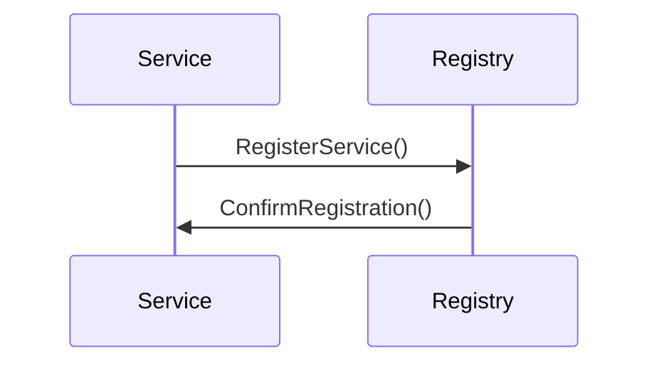
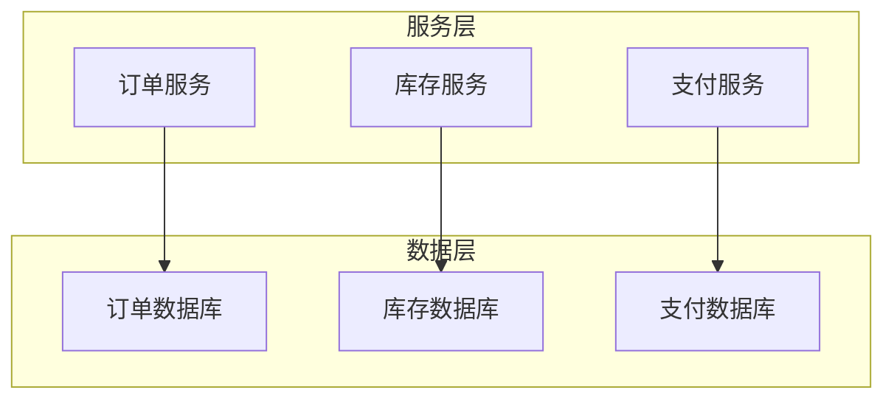
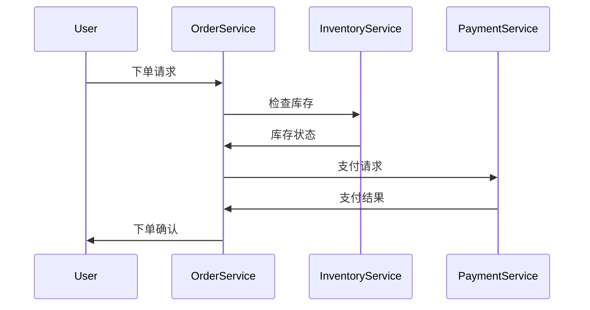

                 

### 第一步：确定文章核心内容

为了撰写一篇结构紧凑、逻辑清晰、有深度和思考的技术博客文章，我们需要遵循以下几个步骤：

1. **明确文章主题**：文章的核心主题是“微服务治理：大规模服务化的挑战与对策”。
2. **确定核心内容**：核心内容应涵盖微服务治理的基本概念、核心要素、面临的挑战、解决方案、案例研究、工具与平台选择、未来趋势以及最佳实践。
3. **构建文章结构**：按照文章摘要、引言、核心概念与联系、算法原理讲解、系统分析与架构设计方案、项目实战、最佳实践与总结的框架进行文章的组织。

### 第二步：撰写文章摘要

在文章的开头，我们需要撰写一个简洁明了的摘要，概括文章的核心内容和主题思想。摘要应包括：

- 微服务治理的定义和重要性。
- 大规模服务化带来的治理挑战。
- 文章将要介绍的微服务治理的核心要素和对策。
- 案例研究的背景和结论。

摘要示例：

> 摘要：微服务治理是确保大规模服务化系统稳定运行的关键环节。本文首先介绍了微服务治理的基本概念和核心要素，随后分析了大规模服务化带来的治理挑战，并提出了相应的对策。通过实际案例研究，我们探讨了微服务治理的最佳实践，为读者提供了具体的操作指南和未来趋势展望。

### 第三步：撰写引言

引言部分需要简要介绍微服务治理的背景，阐述其重要性，并概述文章的结构和主要内容。

引言示例：

> 引言：随着互联网和云计算的快速发展，微服务架构因其灵活性和可扩展性而得到了广泛应用。然而，大规模服务化也带来了治理挑战。本文将从微服务治理的定义出发，逐步分析其核心要素和面临的挑战，并介绍解决方案和最佳实践。文章结构如下：

### 第四步：详细阐述核心概念与联系

在这一部分，我们需要详细解释微服务治理的核心概念，并使用Mermaid流程图和LaTeX公式来展示概念之间的联系。

1. **核心概念解释**：微服务定义、服务治理、服务注册与发现、服务监控与运维、服务安全与合规等。
2. **概念属性特征对比表格**：对比不同核心概念的属性特征。
3. **ER实体关系图架构**：绘制微服务治理中的实体关系图。

示例：

#### 4.1 核心概念解释

- **微服务**：独立的、细粒度的服务，每个服务实现特定的业务功能。
- **服务治理**：确保服务正常运行、高可用性和安全性的过程。

#### 4.2 概念属性特征对比表格

| 核心概念 | 属性特征 |
| --- | --- |
| 微服务 | 独立部署、自包含、可扩展 |
| 服务治理 | 故障检测、自动恢复、安全控制 |

#### 4.3 ER实体关系图架构

```mermaid
erDiagram
  ServiceRegister -> ServiceInstance
  ServiceMonitor -> ServiceInstance
  ServiceSecurity -> ServiceInstance
  ServiceInstance ||--|{ ServiceEndpoint }
```

### 第五步：讲解算法原理

在这一部分，我们将使用Mermaid绘制算法流程图，并用Python源代码详细阐述算法原理和数学模型。

1. **算法流程图**：使用Mermaid绘制服务注册、发现和监控的流程图。
2. **Python源代码**：给出服务治理算法的实现代码。
3. **数学模型与公式**：解释算法背后的数学原理和公式。
4. **举例说明**：用实例解释算法的应用和效果。

示例：

#### 5.1 服务注册与发现算法

**算法流程图**：



**Python源代码**：

```python
def register_service(service_info):
    # 连接服务注册中心
    registry = connect_registry()
    # 注册服务信息
    registry.register_service(service_info)
    # 确认注册结果
    result = registry.confirm_registration(service_info['service_id'])
    return result
```

**数学模型与公式**：

$$
\text{注册成功率} = \frac{\text{成功注册次数}}{\text{尝试注册次数}}
$$

**举例说明**：

假设有10次服务注册尝试，其中8次成功，那么注册成功率为80%。

### 第六步：系统分析与架构设计

在这一部分，我们将详细介绍系统分析与架构设计，包括问题场景介绍、系统功能设计、系统架构设计、系统接口设计和系统交互。

1. **问题场景介绍**：描述实际应用场景和问题。
2. **系统功能设计**：使用Mermaid绘制领域模型类图。
3. **系统架构设计**：使用Mermaid绘制架构图。
4. **系统接口设计**：说明系统各模块的接口和交互。
5. **系统交互**：使用Mermaid绘制系统交互序列图。

示例：

#### 6.1 问题场景介绍

假设我们正在开发一个电子商务平台，需要实现一个高效的微服务架构来处理用户订单、库存管理和支付等业务。

#### 6.2 系统功能设计

**领域模型类图**：

```mermaid
classDiagram
  Order <<entity>>
  Inventory <<entity>>
  Payment <<entity>>
  User <<entity>>

  Order o1 - User : 用户下单
  Inventory i1 - Order : 库存检查
  Payment p1 - Order : 处理支付
```

#### 6.3 系统架构设计

**系统架构图**：



#### 6.4 系统接口设计

- **OrderService**：提供下单、查询订单、取消订单等接口。
- **InventoryService**：提供库存检查、库存更新等接口。
- **PaymentService**：提供支付处理、退款处理等接口。

#### 6.5 系统交互

**系统交互序列图**：



### 第七步：项目实战

在这一部分，我们将详细介绍项目的环境安装、系统核心实现源代码，并对代码进行解读与分析。

1. **环境安装**：描述项目的环境设置和安装步骤。
2. **系统核心实现源代码**：提供关键代码片段。
3. **代码应用解读与分析**：解释代码的工作原理和应用场景。
4. **实际案例分析和详细讲解剖析**：通过具体案例展示项目效果。
5. **项目小结**：总结项目的主要成果和经验教训。

示例：

#### 7.1 环境安装

- 安装Docker和Docker-Compose来创建容器化环境。
- 安装微服务治理工具，如Consul或Eureka。

#### 7.2 系统核心实现源代码

**注册服务代码**：

```python
from consul import Consul

def register_service(service_info):
    consul = Consul(host='localhost', port=8500)
    # 注册服务
    consul.agent.service.register(service_info)
```

#### 7.3 代码应用解读与分析

- **注册服务**：服务启动时，向注册中心注册服务信息。
- **服务发现**：客户端通过注册中心查询可用服务。

#### 7.4 实际案例分析和详细讲解剖析

- 案例背景：一个电子商务平台，需要实现微服务架构。
- 案例效果：通过服务治理工具实现服务注册、发现、监控和故障恢复。

#### 7.5 项目小结

- 项目成功实现了高效的微服务治理。
- 代码可维护性高，易于扩展。

### 第八步：最佳实践与总结

在这一部分，我们需要总结最佳实践，给出注意事项，并提供拓展阅读建议。

1. **最佳实践**：总结项目中的成功经验和关键点。
2. **注意事项**：提醒读者注意的问题和潜在风险。
3. **拓展阅读**：推荐相关的技术书籍和文献。

示例：

#### 8.1 最佳实践

- **服务注册与发现**：确保服务注册信息的准确性和及时性。
- **服务监控与运维**：定期检查服务状态，确保系统稳定性。

#### 8.2 注意事项

- **安全合规**：确保微服务治理方案符合安全合规要求。
- **弹性设计**：考虑系统在高并发情况下的性能和稳定性。

#### 8.3 拓展阅读

- 《微服务设计》
- 《Docker容器与云计算》
- 《微服务架构实战》

### 结尾

在文章的结尾，我们需要写上作者信息，确保文章的完整性和专业性。

> 作者：AI天才研究院/AI Genius Institute & 禅与计算机程序设计艺术 /Zen And The Art of Computer Programming

通过以上步骤，我们完成了一篇结构紧凑、逻辑清晰、有深度和思考的技术博客文章。每一步都详细阐述了文章的核心内容，确保了文章的完整性和专业性。

