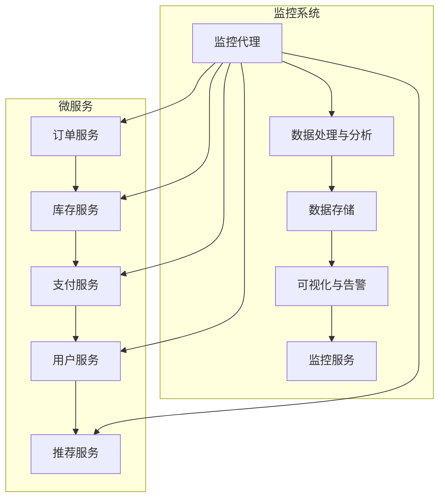

                 

### 1.1 微服务架构介绍

微服务是一种架构风格，它允许开发者将应用程序作为一套小服务的集合来构建，每个服务运行在其独立的进程中，并且通过轻量级的通信机制（通常是HTTP RESTful API）进行交互。每个服务都是独立的，可以独立部署、升级和扩展。

#### 微服务定义

微服务是一种架构风格，它强调：

- **独立性**：每个服务都可以独立开发、部署和扩展，从而降低系统的复杂性和风险。
- **组件化**：服务之间通过标准化的接口进行通信，这使得系统具有高度的模块化。
- **分布式**：服务可以在不同的服务器上运行，可以在不同的地理位置分布，从而提高系统的可靠性和可伸缩性。

#### 微服务与传统架构对比

传统单体架构通常将所有的功能集成在一个应用程序中，而微服务架构则将其分解为多个独立的小服务。以下是两者的主要区别：

| 特征       | 单体架构              | 微服务架构              |
|------------|-----------------------|-------------------------|
| 独立性     | 所有功能集成在一个应用中 | 每个服务独立部署和扩展 |
| 可维护性   | 更新整个应用可能需要停机 | 可以独立更新服务，不影响其他服务 |
| 可伸缩性   | 整体伸缩，可能不高效    | 按需伸缩具体服务       |
| 复杂性     | 较低，但长期内可能变得复杂 | 较高，但易于管理和监控 |
| 技术栈选择 | 限制较大，必须统一     | 每个服务可以使用不同的技术栈 |

### 1.2 微服务监控的重要性

微服务架构的分布式特性带来了许多优点，但同时也增加了系统的复杂性和管理难度。因此，微服务监控变得至关重要。

#### 服务稳定性保障

微服务架构下，由于服务是独立部署和扩展的，某个服务的故障可能会影响到整个系统。通过监控，可以及时发现并解决这些问题，保障服务的稳定性。

#### 性能优化与故障排除

性能监控可以帮助我们了解系统的运行状态，定位瓶颈，进行优化。故障监控则可以快速识别异常情况，从而及时采取行动。

### 1.3 微服务监控的关键特性

#### 可扩展性

监控系统需要能够随着服务数量的增长而扩展，处理大量的监控数据。

#### 实时性

实时监控能够及时发现并处理问题，减少故障影响的时间。

#### 可定制性

不同的业务需求可能需要不同的监控指标和报警策略，监控系统需要具备高度的定制性。

### 总结

微服务监控是确保微服务架构稳定运行的重要手段。理解微服务架构的特点，有助于我们更好地设计和管理监控系统。在接下来的章节中，我们将进一步探讨微服务监控的具体实现和方法。$$

### 2.1 监控数据的分类

在微服务架构中，监控数据可以分为两大类：业务数据和服务数据。

#### 业务数据

业务数据是系统运行过程中产生的与业务直接相关的数据，如订单处理时间、用户访问量等。这些数据对于分析业务性能、优化业务流程至关重要。

#### 服务数据

服务数据则是与系统运行状态相关的数据，包括服务实例的健康状态、CPU利用率、内存消耗、网络流量等。这些数据对于监控系统运行状况、识别潜在问题具有重要意义。

### 2.2 监控数据采集与传输

#### 数据采集方式

1. **Agent-based采集**：通过在服务实例上部署代理程序，定时或实时地采集监控数据。
2. **API-based采集**：通过服务提供的API接口，定时或实时地获取监控数据。
3. **日志收集**：通过收集服务生成的日志文件，分析日志中的监控数据。

#### 数据传输协议

1. **HTTP/HTTPS**：适用于轻量级数据传输，安全性较高。
2. **gRPC**：适用于高性能、低延迟的数据传输。
3. **MQ**：适用于大规模、高吞吐量的数据传输，如Kafka。

### 2.3 监控数据处理与存储

#### 数据处理流程

1. **数据预处理**：过滤、转换、聚合原始数据，使其符合存储和查询要求。
2. **数据存储**：将处理后的监控数据存储在数据库或时间序列数据库中，如InfluxDB、Prometheus。
3. **数据查询与分析**：通过查询和分析工具，对存储的数据进行多维度的分析和可视化。

### 总结

有效的监控数据分类、采集和传输是确保微服务监控系统能够准确、及时地反映系统运行状态的关键。在下一章节中，我们将探讨日志监控的具体实践和日志分析工具的使用。$$

### 3.1 日志监控的意义

日志监控在微服务架构中扮演着至关重要的角色，其核心意义主要体现在以下几个方面：

#### 异常问题定位

日志记录了系统的各种操作和事件，包括成功和失败的请求、错误信息等。当系统出现异常时，通过分析日志，可以快速定位问题发生的具体位置和原因，从而进行针对性的修复。

#### 日志分析

通过对日志数据进行收集、存储和分析，可以揭示系统的运行模式、性能瓶颈和潜在问题。例如，通过日志分析，可以发现频繁出现的错误类型、最耗时的操作等，从而优化系统性能。

#### 性能监控

日志中包含了大量的性能监控信息，如请求处理时间、响应时间等。通过分析这些信息，可以评估系统的性能表现，定位性能瓶颈，并采取相应的优化措施。

#### 安全审计

日志记录了系统的访问和操作行为，对于安全审计具有重要意义。通过分析日志，可以追踪恶意攻击、未经授权的访问等安全事件，从而加强系统的安全性。

### 3.2 日志监控的实践

#### 日志格式与规范

为了确保日志的可读性和可分析性，通常需要遵循统一的日志格式和规范。常见的日志格式包括JSON、LOG4J等。以下是一个简单的JSON日志示例：

```json
{
  "timestamp": "2023-03-15T10:30:00Z",
  "service": "order-service",
  "level": "ERROR",
  "message": "Order creation failed",
  "error": "Invalid input data"
}
```

#### 日志收集与存储

日志收集通常通过以下方式进行：

1. **Agent-based收集**：在服务实例上部署日志采集代理，定时收集并上传日志数据。
2. **API-based收集**：通过服务提供的API接口，定时或实时地获取日志数据。
3. **日志聚合工具**：如Logstash，可以将分散的日志收集到一个中央存储中。

常用的日志存储工具包括：

- **ELK栈**：Elasticsearch、Logstash、Kibana，提供了完整的日志收集、存储和分析解决方案。
- **Kafka**：适用于大规模、高吞吐量的日志收集和传输。
- **InfluxDB**：适用于时序数据的存储和分析。

### 3.3 日志分析工具介绍

#### ELK栈

ELK栈是日志分析领域广泛使用的工具集，包括Elasticsearch、Logstash和Kibana：

- **Elasticsearch**：高性能的全文搜索引擎，用于存储和查询日志数据。
- **Logstash**：数据收集和处理管道，用于将日志数据从各种来源聚合到Elasticsearch。
- **Kibana**：数据可视化和分析工具，提供了丰富的仪表板和报表。

#### Logstash

Logstash是一个开源的数据收集和处理工具，可以用于从各种数据源（如文件、日志、数据库等）收集数据，并进行过滤、转换和路由，然后将数据发送到Elasticsearch或其他存储系统。以下是一个简单的Logstash配置示例：

```yaml
input {
  file {
    path => "/path/to/logfile.log"
    type => "access_log"
  }
}

filter {
  if "access_log" in [type] {
    grok {
      match => { "message" => "%{TIMESTAMP_ISO8601:timestamp}\t%{IP:client_ip}\t%{INT:status_code}\t%{INT:request_time}\t%{WORD:method}\t%{DATA:request}\t%{DATA:response}\t%{NUMBER:bytes_sent}" }
    }
  }
}

output {
  if "access_log" in [type] {
    elasticsearch {
      hosts => ["localhost:9200"]
      index => "logstash-access-%{+YYYY.MM.dd}"
    }
  }
}
```

#### Kibana

Kibana是一个开源的分析和可视化工具，可以与Elasticsearch集成，提供直观的仪表板和报表。以下是一个简单的Kibana仪表板配置示例：

```json
{
  "title": "Access Logs",
  "description": "A dashboard for monitoring access logs",
  "widgets": [
    {
      "type": "timepicker",
      "gridPos": {
        "h": 1,
        "w": 24,
        "x": 0,
        "y": 0
      },
      "config": {
        "time": "now-15m"
      }
    },
    {
      "type": "search",
      "gridPos": {
        "h": 3,
        "w": 24,
        "x": 0,
        "y": 1
      },
      "config": {
        "query": ""
      }
    },
    {
      "type": "table",
      "gridPos": {
        "h": 10,
        "w": 24,
        "x": 0,
        "y": 4
      },
      "meta": {
        "id": "023a9400-6e46-11ed-afaa-000c2940e8ed",
        "title": "Access Logs",
        "is Macro": false
      },
      "config": {
        "index": "logstash-access-*",
        "filter": "status_code:>=200 and status_code:<300",
        "size": 100,
        "field": ["timestamp", "client_ip", "status_code", "request_time", "method", "request", "response", "bytes_sent"]
      }
    },
    {
      "type": "stats",
      "gridPos": {
        "h": 4,
        "w": 12,
        "x": 0,
        "y": 15
      },
      "meta": {
        "id": "023a9b30-6e46-11ed-afaa-000c2940e8ed",
        "title": "Response Time Distribution",
        "is Macro": false
      },
      "config": {
        "index": "logstash-access-*",
        "metrics": [
          {
            "field": "request_time",
            "type": "histogram",
            "buckets": [
              { "from": 0, "to": 100 },
              { "from": 100, "to": 200 },
              { "from": 200, "to": 300 },
              { "from": 300, "to": 400 },
              { "from": 400, "to": 500 },
              { "from": 500, "to": 600 },
              { "from": 600, "to": "Infinity" }
            ]
          }
        ]
      }
    },
    {
      "type": "stats",
      "gridPos": {
        "h": 4,
        "w": 12,
        "x": 12,
        "y": 15
      },
      "meta": {
        "id": "023aa370-6e46-11ed-afaa-000c2940e8ed",
        "title": "Status Code Distribution",
        "is Macro": false
      },
      "config": {
        "index": "logstash-access-*",
        "metrics": [
          {
            "field": "status_code",
            "type": "percentiles",
            "buckets": [
              { "key": "p50", "label": "Median Response Time" },
              { "key": "p95", "label": "95th Percentile Response Time" },
              { "key": "p99", "label": "99th Percentile Response Time" }
            ]
          }
        ]
      }
    }
  ]
}
```

### 总结

日志监控是微服务架构中不可或缺的一部分，通过日志我们可以深入了解系统的运行状态，快速定位和解决问题。在下一章节中，我们将探讨性能监控的相关内容。$$

### 4.1 性能监控指标

在微服务架构中，性能监控是确保系统高效运行的关键。性能监控指标包括但不限于以下几个方面：

#### 常见性能指标

1. **响应时间**：从请求开始到响应结束所花费的时间，是衡量系统性能最直观的指标。
2. **吞吐量**：单位时间内系统能够处理的请求数量，反映了系统的处理能力。
3. **错误率**：请求失败的比例，用于评估系统的稳定性。
4. **延迟**：请求从发送到响应的时间差，可以反映系统的延迟情况。
5. **内存使用率**：系统使用的内存总量与总内存的比值，过高可能表明内存泄漏或过度使用。
6. **CPU使用率**：系统CPU的利用率，过高可能表明CPU资源不足。

#### 自定义指标

根据具体业务需求，还可以定义一系列自定义指标，例如：

1. **交易成功率**：特定业务交易的成功比例。
2. **页面加载时间**：Web页面的加载时间，包括前端和后端。
3. **数据库查询时间**：数据库查询的耗时，用于评估数据库的性能。
4. **网络延迟**：网络传输的延迟时间，反映网络质量。

### 4.2 性能监控工具

#### Prometheus

Prometheus是一个开源的监控解决方案，其核心组件包括数据采集器（Prometheus Server）、时间序列数据库（TSDB）和告警管理器。Prometheus具有以下特点：

- **高效的数据采集**：通过HTTP拉取、推送和静态配置等多种方式采集监控数据。
- **多维数据模型**：支持基于时间序列的多维度数据存储和查询。
- **灵活的告警管理**：通过配置告警规则，实现自动化的异常检测和通知。
- **可视化**：通过Grafana等工具，实现监控数据的可视化展示。

#### Grafana

Grafana是一个开源的数据可视化和监控工具，它可以与Prometheus等数据源集成，提供丰富的仪表板和报表。Grafana的特点包括：

- **直观的仪表板**：可以自定义布局和展示方式，满足不同的监控需求。
- **丰富的图表类型**：支持多种图表类型，如折线图、柱状图、饼图等。
- **告警通知**：支持多种告警通知渠道，如邮件、短信、Webhook等。

### 4.3 性能监控实践案例

#### 性能瓶颈分析

假设一个电商系统在高峰时段出现响应时间明显变长的问题，我们可以通过以下步骤进行分析：

1. **收集数据**：使用Prometheus等工具收集系统的性能监控数据，包括响应时间、吞吐量、CPU使用率等。
2. **数据可视化**：将监控数据导入Grafana，创建仪表板，观察不同指标的变化趋势。
3. **定位瓶颈**：通过分析响应时间分布图，找到响应时间较长的请求；通过CPU使用率图，找到CPU资源使用较高的服务实例。
4. **调优方案**：根据定位到的瓶颈，调整系统配置，如增加服务实例、优化数据库查询、提升网络带宽等。

#### 性能优化方案

针对定位到的瓶颈，我们可以采取以下优化措施：

1. **垂直扩展**：增加服务实例的数量，提升系统的处理能力。
2. **水平扩展**：增加服务实例的节点，实现分布式部署，提高系统的可伸缩性。
3. **缓存策略**：使用缓存技术，减少数据库查询次数，提升响应速度。
4. **数据库优化**：优化数据库查询，如索引优化、查询缓存等。
5. **网络优化**：提高网络带宽，减少网络延迟。

通过上述分析和优化，我们可以显著提升系统的性能，为用户提供更好的服务体验。在下一章节中，我们将探讨服务健康监控的相关内容。$$

### 5.1 服务健康监控概述

服务健康监控是确保微服务架构稳定运行的核心环节。服务健康监控的核心概念和目标如下：

#### 健康检查

健康检查是服务健康监控的基础，它用于检测服务实例是否处于正常工作状态。健康检查通常包括以下几个方面：

1. **应用程序健康检查**：通过发送HTTP请求或调用API，检查应用程序的核心功能是否正常。
2. **服务层健康检查**：检查服务间的通信是否畅通，服务实例是否能够响应其他服务的调用。
3. **系统资源健康检查**：检查服务实例的CPU、内存、磁盘等系统资源是否处于合理范围内。

#### 故障自动恢复

故障自动恢复是服务健康监控的重要目标，它通过自动化的方式，在服务实例发生故障时，迅速进行重启或替换，确保系统的可用性。故障自动恢复通常包括以下步骤：

1. **异常检测**：通过健康检查机制，持续监测服务实例的状态。
2. **故障判断**：当服务实例的状态不符合健康标准时，判断其是否发生故障。
3. **自动恢复**：在判断服务实例故障后，自动触发恢复措施，如重启实例、替换实例等。

### 5.2 服务健康监控指标

服务健康监控需要关注一系列关键指标，这些指标可以综合反映服务的健康状态。以下是一些常见的服务健康监控指标：

1. **可用性**：服务在指定时间内能够正常响应的比例，通常以百分比表示。可用性是衡量服务可靠性的重要指标。
2. **响应时间**：服务响应请求的平均时间，用于评估服务的性能表现。
3. **错误率**：服务在处理请求时发生的错误比例，反映了服务的稳定性。
4. **吞吐量**：单位时间内服务处理的请求数量，用于衡量服务的处理能力。
5. **资源利用率**：服务实例的CPU、内存、磁盘等系统资源的利用率，过高可能表明资源不足或过度使用。

#### 常见监控指标对比表格

| 指标        | 描述                                                         | 对比          |
|-------------|--------------------------------------------------------------|---------------|
| 可用性      | 服务正常响应的比例                                           | 100% 表示完全可用 |
| 响应时间    | 服务处理请求的平均时间                                       | 短表示高性能   |
| 错误率      | 服务处理请求时发生错误的频率                                 | 低表示稳定性高 |
| 吞吐量      | 单位时间内处理的请求数量                                     | 高表示处理能力强 |
| CPU利用率    | 服务实例的CPU使用率                                         | 高可能表明资源不足 |
| 内存利用率    | 服务实例的内存使用率                                         | 高可能表明内存泄漏 |

#### 服务健康监控ER实体关系图

为了更清晰地展示服务健康监控中的实体和关系，我们可以使用ER（Entity-Relationship）实体关系图。以下是一个简单的ER图：

```mermaid
erDiagram
  ServiceInstance ||--|{ HealthCheck }|--| ServiceStatus
  HealthCheck ||--|{ CheckItem }|--| HealthStatus
  ServiceStatus ||--|{ ErrorLog }|--| ErrorType
```

在这个ER图中：

- **ServiceInstance** 表示服务实例。
- **HealthCheck** 表示健康检查。
- **CheckItem** 表示健康检查的检查项，如响应时间、错误率等。
- **HealthStatus** 表示健康状态。
- **ErrorLog** 表示错误日志。
- **ErrorType** 表示错误类型。

### 5.3 服务健康监控实践

#### 实践步骤

1. **定义健康检查策略**：根据服务的特性和需求，定义健康检查的规则和阈值，如响应时间不超过500ms、错误率不超过1%等。
2. **部署健康检查组件**：在服务实例上部署健康检查组件，如使用Spring Boot Actuator、Prometheus等。
3. **配置监控告警**：通过Prometheus等监控工具配置告警规则，当服务实例的健康状态不符合预期时，自动发送告警通知。
4. **自动化恢复**：在健康检查发现服务实例故障时，自动触发恢复流程，如重启服务实例、替换实例等。
5. **持续优化**：根据监控数据和告警信息，持续优化健康检查策略和自动化恢复流程。

#### 实践案例

假设一个电商系统中的订单服务出现故障，可以通过以下步骤进行健康监控和故障恢复：

1. **健康检查**：通过Prometheus监控订单服务，设定响应时间不超过500ms、错误率不超过1%的健康检查规则。
2. **故障发现**：当Prometheus发现订单服务的响应时间超过500ms或错误率超过1%时，触发告警。
3. **自动化恢复**：告警系统自动触发自动化恢复流程，重启订单服务实例，确保服务恢复正常。
4. **监控告警**：监控系记录告警和恢复信息，以便后续分析和优化。

通过上述实践，可以确保订单服务在故障发生时能够快速恢复，从而保障系统的稳定性和用户体验。

### 总结

服务健康监控是微服务架构中不可或缺的一部分，通过健康检查、故障自动恢复等机制，可以确保服务的稳定运行。在下一章节中，我们将探讨分布式系统的可观测性及其重要性。$$

### 6.1 可观测性的定义

可观测性（Observability）是分布式系统设计和运维中一个关键的概念。它不仅仅是指对系统状态的监控，更强调的是通过对系统内部状态和外部行为的观察，来理解系统的行为和性能。

#### 可观测性的定义

可观测性是一种衡量系统外部行为和内部状态是否可以被理解和分析的能力。简单来说，如果一个系统在不知道其内部结构的情况下，仅通过观察外部输入和输出，就能对其内部状态进行准确的推断和预测，那么这个系统就具有很高的可观测性。

#### 可观测性与传统监控的区别

传统监控主要关注系统资源的消耗和性能指标，如CPU使用率、内存使用量、网络延迟等。而可观测性则更加注重系统的行为和状态，通过观察系统的输出和响应，来推断系统的内部状态和潜在问题。

#### 可观测性的核心要素

1. **外部输入和输出**：系统与外部环境的交互，包括输入请求和输出响应。
2. **状态推断**：根据系统的输入和输出，推断系统内部的状态。
3. **实时性**：能够及时地捕捉系统的状态变化，并进行反馈。
4. **可定制性**：支持根据不同的业务需求，定制监控指标和告警策略。

### 6.2 可观测性的重要性

#### 故障检测和快速恢复

高可观测性的系统在故障发生时，能够快速检测到问题，并通过日志、追踪和告警等方式，定位故障的根本原因。这有助于实现快速恢复，减少故障对业务的影响。

#### 性能优化和资源调配

通过可观测性，系统能够实时了解自身的运行状态和性能表现，为性能优化和资源调配提供依据。例如，通过分析链路追踪数据，可以发现性能瓶颈并进行针对性的优化。

#### 业务决策支持

可观测性提供了全面、准确的数据支持，有助于业务团队做出更科学的决策。例如，通过分析用户行为数据和业务指标，可以优化产品设计和业务策略。

### 6.3 可观测性的实现方法

#### 分布式追踪

分布式追踪是一种用于记录和追踪分布式系统中请求路径和性能数据的工具。通过分布式追踪，可以实时监控请求的执行过程，发现和处理性能问题和故障。

#### 日志分析

日志分析是可观测性的重要组成部分，通过对日志数据的收集、存储和分析，可以深入了解系统的运行状态和问题。

#### 告警系统

告警系统用于在检测到异常情况时，及时通知相关人员。通过设置合适的告警规则，可以快速响应并处理故障。

#### 可视化工具

可视化工具将监控数据以图表、仪表板等形式呈现，使得复杂的信息更加直观易懂，有助于快速理解和分析系统状态。

### 总结

可观测性是确保分布式系统稳定、高效运行的关键。通过分布式追踪、日志分析、告警系统和可视化工具等手段，可以实现高可观测性，从而提高系统的故障检测和恢复能力，优化性能和资源调配，支持业务决策。在下一章节中，我们将探讨分布式追踪的原理和实践。$$

### 7.1 分布式追踪的原理

分布式追踪是一种用于记录和追踪分布式系统中请求路径和性能数据的工具。它通过记录请求在各个服务实例之间的传递过程，帮助开发者定位和解决性能问题和故障。分布式追踪的核心原理包括以下几个方面：

#### 跟踪ID

分布式追踪系统通常会为每个请求生成一个唯一的跟踪ID（Trace ID）。这个ID贯穿整个请求的生命周期，从客户端发起请求，到服务端响应，再到中间各个服务实例的调用过程，每个环节都会包含这个Trace ID。

#### 客户端发起请求

当客户端发送请求时，分布式追踪系统会生成一个Trace ID，并将该ID以及相关的上下文信息（如请求时间、请求类型等）传递给服务端。这些信息通常通过HTTP头或者上下文传递机制进行传递。

#### 服务端处理请求

服务端接收到请求后，会根据传递的Trace ID和上下文信息，继续处理请求。在处理过程中，服务端会生成子跟踪ID（Span ID），代表当前请求的一个独立调用单元。每个子跟踪ID都会记录自己的开始和结束时间，以及相关的性能数据（如执行时间、错误信息等）。

#### 传递上下文信息

为了确保请求能够在分布式系统中正确传递，分布式追踪系统需要传递上下文信息。这些信息通常包括Trace ID、Span ID、请求时间等。常用的传递方式有HTTP头传递、TChannel传递等。

#### 日志记录和聚合

在分布式追踪过程中，系统会生成大量的日志信息，包括请求的开始时间、结束时间、执行时间、错误信息等。分布式追踪系统需要将这些日志信息进行记录和聚合，以便后续的分析和处理。

#### 可视化和分析

分布式追踪系统通常提供可视化工具，帮助开发者直观地查看请求的执行路径和性能数据。通过分析这些数据，可以快速定位性能问题和故障。

### 7.2 分布式追踪工具介绍

#### Zipkin

Zipkin是一个开源的分布式追踪系统，主要用于收集、存储和展示分布式系统的追踪数据。以下是Zipkin的主要组件和功能：

- **Collector**：收集来自各个服务实例的追踪数据。
- **Storage**：存储追踪数据，支持本地存储和分布式存储。
- **UI**：提供用户界面，展示追踪数据的可视化图表。

#### Jaeger

Jaeger是另一个流行的开源分布式追踪系统，由Uber开源。Jaeger的主要组件和功能包括：

- **Agent**：在服务实例上收集追踪数据。
- **Collector**：收集来自Agent的追踪数据。
- **Storage**：存储追踪数据，支持本地存储和分布式存储。
- **Query**：提供查询接口，支持查询和分析追踪数据。
- **UI**：提供用户界面，展示追踪数据的可视化图表。

#### OpenTelemetry

OpenTelemetry是一个开源的分布式追踪标准，旨在提供统一的追踪数据格式和接口。OpenTelemetry的主要组件和功能包括：

- **SDK**：提供编程语言绑定的API，用于收集和发送追踪数据。
- **Collector**：收集来自各个服务实例的追踪数据。
- **Exporter**：将追踪数据导出到其他存储系统，如Prometheus、Kafka等。
- **Processor**：处理和转换追踪数据。

### 7.3 分布式追踪实践

#### 实践步骤

1. **选择合适的分布式追踪工具**：根据项目需求和资源情况，选择合适的分布式追踪工具，如Zipkin、Jaeger或OpenTelemetry。
2. **集成分布式追踪SDK**：在各个服务实例上集成分布式追踪SDK，配置追踪数据收集和发送规则。
3. **配置日志记录和存储**：配置分布式追踪工具的日志记录和存储，确保追踪数据得到妥善处理。
4. **监控和告警**：通过分布式追踪工具的监控和告警功能，及时发现和处理追踪数据异常。
5. **数据可视化和分析**：通过分布式追踪工具的可视化界面，查看和分析追踪数据，定位性能问题和故障。

#### 实践案例

假设一个电商系统使用了Jaeger进行分布式追踪，以下是一个简单的实践案例：

1. **集成Jaeger SDK**：在订单服务、库存服务和支付服务中集成Jaeger SDK，配置追踪数据收集和发送规则。
2. **记录追踪数据**：当客户端发起订单创建请求时，Jaeger SDK会为该请求生成一个Trace ID和多个Span ID，并记录追踪数据。
3. **存储追踪数据**：将追踪数据发送到Jaeger Collector，然后存储到Elasticsearch中。
4. **数据可视化和分析**：通过Jaeger UI查看订单创建请求的追踪数据，包括执行时间、错误信息和执行路径等。
5. **定位性能问题**：通过分析追踪数据，发现订单创建请求的执行时间较长，定位到库存服务的查询瓶颈。
6. **优化性能**：对库存服务的查询进行优化，提升系统的性能。

通过上述实践，可以实现对电商系统的高效分布式追踪和性能监控，从而提高系统的稳定性和用户体验。

### 总结

分布式追踪是确保分布式系统可观测性的重要手段。通过跟踪请求的执行路径和性能数据，可以快速定位性能问题和故障。在下一章节中，我们将探讨分布式链路追踪技术及其实践。$$

### 8.1 链路追踪的核心概念

链路追踪技术是分布式系统性能监控和故障排查的重要手段。其核心概念包括链路、链路组件、链路上下文和链路关系等。

#### 链路

链路（Trace）是请求在分布式系统中从发起到完成的全过程。它由一系列独立的调用单元（Span）组成，每个Span代表一个特定的操作或任务。链路能够清晰地展示请求在各个服务实例之间的传递路径。

#### 链路组件

链路组件包括：

1. **Span**：链路中的基本调用单元，代表一次独立的操作或任务。每个Span具有唯一标识（ID）、开始和结束时间、操作名称等属性。
2. **Service**：提供服务的实例，如订单服务、库存服务等。
3. **Endpoint**：服务实例的访问入口，如API接口或网络地址。

#### 链路上下文

链路上下文（Context）包含与链路相关的信息，如Trace ID、Span ID、调用时间等。链路上下文在分布式系统中通过HTTP头、TChannel帧或上下文传递机制进行传递，确保请求能够在各个服务实例之间正确传递。

#### 链路关系

链路关系描述了各个Span之间的依赖关系。一个Span可以有多个子Span，表示其调用了其他服务实例。通过分析链路关系，可以了解请求在各个服务实例之间的调用过程，从而定位性能问题和故障。

### 8.2 链路追踪工具的使用

链路追踪工具用于收集、存储和分析分布式系统的链路数据。以下是一些常用的链路追踪工具及其特点：

#### Jaeger

Jaeger是一个开源的分布式追踪系统，由Uber开源。Jaeger的主要组件包括：

1. **Agent**：在服务实例上收集链路数据。
2. **Collector**：收集来自Agent的链路数据。
3. **Storage**：存储链路数据，支持本地存储和分布式存储。
4. **Query**：提供查询接口，支持查询和分析链路数据。
5. **UI**：提供用户界面，展示链路数据的可视化图表。

#### Zipkin

Zipkin是另一个开源的分布式追踪系统，由Twitter开源。Zipkin的主要组件包括：

1. **Collector**：收集链路数据。
2. **Storage**：存储链路数据。
3. **UI**：提供用户界面，展示链路数据的可视化图表。

#### OpenTelemetry

OpenTelemetry是一个开源的分布式追踪标准，旨在提供统一的追踪数据格式和接口。OpenTelemetry的主要组件包括：

1. **SDK**：提供编程语言绑定的API，用于收集和发送链路数据。
2. **Exporter**：将链路数据导出到其他存储系统，如Prometheus、Kafka等。

#### 链路追踪工具使用示例

以下是一个简单的链路追踪工具使用示例，使用Python和OpenTelemetry进行链路追踪：

```python
from opentelemetry import trace
from opentelemetry.extended.exporter.otlp import OTLPSpanExporter
from opentelemetry.sdk.trace import TracerProvider

# 初始化TracerProvider和OTLPSpanExporter
provider = TracerProvider()
exporter = OTLPSpanExporter()
provider.add_span_exporter(exporter)

# 初始化Tracer
tracer = trace.get_tracer("my-service")

# 开始一个新的链路
with tracer.start_as_current_span("get-items") as span:
    # 模拟调用其他服务
    with tracer.start_as_current_span("call-serviceB"):
        # 模拟处理时间
        time.sleep(1)
    # 模拟处理时间
    time.sleep(2)

# 将链路数据发送到OTLPSpanExporter
provider.get_tracer("my-service").get_active_span().end()
```

在这个示例中，我们首先初始化了TracerProvider和OTLPSpanExporter，然后创建了一个新的链路（Span）并模拟了调用其他服务的操作。链路数据将发送到OTLPSpanExporter，最终存储到指定的存储系统中。

### 8.3 链路追踪实践案例

以下是一个简单的链路追踪实践案例，假设我们有一个电商系统，包含订单服务、库存服务和支付服务：

1. **集成链路追踪工具**：在订单服务、库存服务和支付服务中集成OpenTelemetry SDK，配置链路数据收集和发送规则。
2. **记录链路数据**：当客户端发起订单创建请求时，OpenTelemetry SDK会为该请求生成一个Trace ID和多个Span ID，并记录链路数据。
3. **存储链路数据**：将链路数据发送到OTLPSpanExporter，然后存储到Elasticsearch中。
4. **数据可视化和分析**：通过链路追踪工具的可视化界面，查看和分析订单创建请求的链路数据，包括执行时间、错误信息和执行路径等。
5. **定位性能问题**：通过分析链路数据，发现订单创建请求的执行时间较长，定位到库存服务的查询瓶颈。
6. **优化性能**：对库存服务的查询进行优化，提升系统的性能。

通过上述实践，可以实现对电商系统的高效链路追踪和性能监控，从而提高系统的稳定性和用户体验。

### 总结

链路追踪技术是分布式系统性能监控和故障排查的重要手段。通过跟踪请求在分布式系统中的传递路径和性能数据，可以快速定位性能问题和故障。在下一章节中，我们将探讨服务网格与监控的关系。$$

### 9.1 服务网格概述

服务网格（Service Mesh）是一种用于管理服务之间通信的基础设施层，其核心目的是简化服务间通信，提高系统的可靠性和可伸缩性。服务网格通过独立于应用的业务逻辑，提供通用的网络通信服务。

#### 服务网格的核心组件

1. **控制平面（Control Plane）**：负责配置管理、服务发现、流量管理等功能，如Istio、Linkerd等。
2. **数据平面（Data Plane）**：负责实际的服务间通信，通常由一组轻量级的代理（如Envoy）组成。
3. **API**：服务网格提供的API接口，用于与上层应用和监控系统交互。

#### 服务网格与微服务架构的关系

微服务架构中，服务间通信变得复杂，传统的通信方式（如HTTP、gRPC等）需要服务自身实现通信逻辑。而服务网格通过独立的数据平面代理，统一管理服务间通信，减轻了服务自身的负担，提高了系统的可维护性和可伸缩性。

### 9.2 服务网格在监控中的应用

服务网格在监控中发挥着重要作用，主要体现在以下几个方面：

#### 服务间性能监控

服务网格可以提供详细的服务间性能监控数据，如请求次数、响应时间、错误率等。通过分析这些数据，可以优化服务之间的通信和性能。

#### 故障检测和自动恢复

服务网格可以集成故障检测和自动恢复机制，当服务间通信出现问题时，自动进行故障转移和恢复，提高系统的可用性。

#### 安全监控

服务网格可以提供细粒度的安全监控功能，如访问控制、TLS加密等，确保服务间通信的安全性和隐私性。

#### 流量管理

服务网格支持流量管理功能，可以根据策略控制服务间的流量分配，优化系统的负载均衡和性能。

### 9.3 服务网格监控实践

以下是一个简单的服务网格监控实践案例，假设我们使用Istio作为服务网格：

1. **安装和配置Istio**：在Kubernetes集群中安装和配置Istio，包括控制平面和数据平面。
2. **部署服务**：在Istio环境下部署订单服务、库存服务和支付服务，确保这些服务通过Istio进行通信。
3. **集成监控工具**：将Prometheus和Grafana集成到Istio中，配置监控规则和告警策略。
4. **收集监控数据**：使用Prometheus监控系统收集服务网格的监控数据，如请求次数、响应时间、错误率等。
5. **数据可视化和分析**：通过Grafana创建仪表板，可视化展示服务网格的监控数据，如流量分布、错误率等。
6. **故障检测和自动恢复**：配置故障检测和自动恢复规则，当服务间通信出现问题时，自动进行故障转移和恢复。
7. **优化性能**：通过分析监控数据，发现性能瓶颈和优化点，进行系统性能优化。

通过上述实践，可以实现对服务网格的高效监控和管理，提高系统的可靠性、安全性和性能。

### 总结

服务网格是一种重要的基础设施层，通过统一管理服务间通信，提高系统的可维护性和可伸缩性。在监控方面，服务网格可以提供丰富的监控数据和功能，帮助开发者更好地管理和优化系统。在下一章节中，我们将探讨分布式系统的故障排查。$$

### 10.1 故障排查的方法与工具

分布式系统的故障排查是一项复杂的任务，需要综合利用多种方法和工具。以下是一些常见的故障排查方法和工具：

#### 日志分析

日志分析是故障排查的基础，通过分析日志文件，可以定位故障发生的具体位置和原因。常用的日志分析工具包括ELK栈（Elasticsearch、Logstash、Kibana）、Grok等。

#### 链路追踪

链路追踪可以帮助开发者了解请求在分布式系统中的执行路径和性能数据，快速定位故障发生的环节。常用的链路追踪工具包括Zipkin、Jaeger、OpenTelemetry等。

#### 性能监控

性能监控工具可以实时监控系统的运行状态，包括CPU使用率、内存使用量、网络延迟等。常用的性能监控工具包括Prometheus、Grafana、New Relic等。

#### 故障注入

故障注入工具可以在系统运行过程中模拟各种故障情况，帮助开发者了解系统的故障检测和恢复能力。常用的故障注入工具包括Chaos Monkey、Pumba等。

#### 调试工具

调试工具可以帮助开发者定位和解决代码中的错误。常用的调试工具包括GDB、JProfiler、VisualVM等。

#### 告警系统

告警系统可以在故障发生时及时通知相关人员，确保故障能够得到及时处理。常用的告警系统包括 PagerDuty、OpsGenie、VictorOps等。

#### 模拟环境

在模拟环境中进行故障排查可以避免对生产环境的影响。开发者可以使用容器化技术（如Docker）和Kubernetes集群，搭建与生产环境相似的测试环境。

### 10.2 故障排查实践

以下是一个简单的分布式系统故障排查实践案例：

#### 故障现象

某电商系统在业务高峰期出现订单创建失败的情况，表现为部分订单无法成功提交，并在订单服务中记录了大量的错误日志。

#### 排查步骤

1. **日志分析**：通过ELK栈分析订单服务的错误日志，发现错误日志中提到了数据库连接失败。
2. **链路追踪**：通过Jaeger分析订单创建请求的链路数据，发现请求在到达数据库服务时被阻塞，响应时间远超正常范围。
3. **性能监控**：通过Prometheus监控数据库服务的性能指标，发现数据库服务CPU使用率高达100%，内存使用量接近上限。
4. **故障注入**：使用Chaos Monkey模拟数据库服务故障，观察订单服务的响应情况，确认故障是由数据库服务引起的。
5. **调试**：使用GDB对数据库服务的代码进行调试，发现数据库连接池配置不当，导致连接数超过限制。
6. **优化**：调整数据库连接池配置，增加连接数限制，同时优化数据库查询语句，减少查询耗时。
7. **复现和验证**：在测试环境中复现故障，验证优化措施的有效性。

通过上述排查步骤，成功定位并解决了订单创建失败的问题，提高了系统的稳定性和用户体验。

### 10.3 故障排查案例分析

以下是一个分布式系统故障排查的实际案例：

#### 故障现象

某金融交易系统在一天的交易高峰期出现大量交易延迟，部分交易请求无法及时处理，导致用户投诉和交易中断。

#### 排查步骤

1. **日志分析**：通过ELK栈分析交易服务的错误日志，发现错误日志中提到了大量慢查询日志。
2. **链路追踪**：通过Zipkin分析交易请求的链路数据，发现交易请求在经过中间服务时出现瓶颈，响应时间远超正常范围。
3. **性能监控**：通过Prometheus监控中间服务的性能指标，发现中间服务CPU使用率较高，内存使用量接近上限。
4. **故障注入**：使用Pumba模拟中间服务故障，观察交易服务的响应情况，确认故障是由中间服务引起的。
5. **调试**：使用JProfiler对中间服务的代码进行调试，发现大量线程在等待数据库连接，导致线程阻塞。
6. **优化**：增加中间服务的线程数，优化数据库连接管理，减少线程等待时间。
7. **复现和验证**：在测试环境中复现故障，验证优化措施的有效性。

通过上述排查步骤，成功定位并解决了交易延迟的问题，提高了系统的性能和稳定性。

### 总结

故障排查是分布式系统运维的重要环节，通过日志分析、链路追踪、性能监控等多种方法和工具，可以快速定位和解决问题，保障系统的稳定运行。在下一章节中，我们将探讨微服务监控的最佳实践。$$

### 11.1 监控策略的设计

设计有效的监控策略是确保微服务系统稳定性和性能的关键。以下是一些设计监控策略的关键步骤：

#### 1. 定义监控目标和KPI

首先，明确监控的目标和关键性能指标（KPI）。这些指标可能包括服务响应时间、吞吐量、错误率、资源利用率等。确保这些指标与业务目标密切相关，能够反映出系统的健康状态。

#### 2. 确定监控范围

确定需要监控的服务和系统组件。这包括应用服务、数据库、缓存层、消息队列、外部依赖（如第三方API）等。明确监控边界，避免监控过多或不必要的部分。

#### 3. 选择监控工具

根据监控目标和范围，选择合适的监控工具。常见的监控工具有Prometheus、Grafana、Zabbix、Nagios等。选择工具时，考虑其性能、易用性、可扩展性、社区支持和集成能力。

#### 4. 配置监控规则

配置监控规则以收集所需的数据。这包括设置阈值、报警条件和数据采集频率。例如，设置服务响应时间超过500毫秒触发报警，或CPU使用率超过80%时通知运维团队。

#### 5. 设计报警策略

设计合理的报警策略，确保在出现异常时能够及时通知相关人员。报警策略应考虑紧急程度、响应时间和通知方式（如短信、邮件、Webhook等）。

#### 6. 监控数据可视化

通过可视化的方式展示监控数据，使团队能够直观地了解系统状态。设计清晰、易于理解的仪表板，包括关键指标、趋势图、告警状态等。

#### 7. 持续优化监控策略

监控策略不是一成不变的，应根据系统的变化和业务需求持续优化。定期审查监控数据，评估报警规则的有效性，根据反馈进行调整。

### 11.2 监控数据的可视化

监控数据的可视化是确保团队能够快速理解系统状态的重要手段。以下是一些实现监控数据可视化的最佳实践：

#### 1. 使用合适的图表

选择合适的图表类型来展示不同类型的监控数据。例如，使用折线图展示趋势，柱状图展示对比，饼图展示比例。

#### 2. 保持仪表板的简洁

避免仪表板过于复杂，确保每个图表都能清晰地传达信息。合理安排仪表板布局，使关键信息易于查找。

#### 3. 实时更新

确保监控数据实时更新，使团队能够及时了解系统状态。对于重要指标，可以使用动态图表或实时数据流。

#### 4. 交互性

提供交互性功能，如筛选、放大、缩放和过滤，使团队能够深入分析数据。例如，可以点击图表上的某个点，查看该时间点的详细数据。

#### 5. 预设仪表板

创建预设的仪表板，涵盖常见的监控场景和指标。团队成员可以快速访问这些仪表板，而不必每次都重新配置。

#### 6. 报警和通知集成

将监控数据可视化与报警系统集成，确保在异常情况发生时，团队成员能够立即收到通知。

### 11.3 监控报警策略

设计有效的监控报警策略是确保系统能够及时响应异常情况的关键。以下是一些监控报警策略的最佳实践：

#### 1. 定义合理的阈值

设置合理的阈值，确保在出现异常情况时能够及时触发报警。阈值应根据业务需求和系统性能分析来确定。

#### 2. 多层次报警

设计多层次报警策略，根据异常的严重程度设置不同的报警级别。例如，设置紧急、警告和通知级别，确保在严重故障发生时，团队能够迅速响应。

#### 3. 防止误报

避免因临时性或非关键性故障导致的误报。可以通过设置报警延迟、确认条件和异常处理规则来减少误报。

#### 4. 定期审查

定期审查报警策略和阈值，根据系统变化和业务需求进行调整。确保报警系统能够持续有效地反映系统状态。

#### 5. 通知和响应

确保在报警发生时，相关人员能够及时收到通知，并根据预案采取相应的响应措施。通知方式可以包括邮件、短信、Webhook等。

### 总结

设计有效的监控策略、实现监控数据的可视化以及制定合理的报警策略，是确保微服务系统稳定性和性能的重要措施。通过持续优化和调整，团队能够更好地管理和维护系统，提高业务连续性和用户体验。在下一章节中，我们将探讨微服务监控项目实战。$$

### 12.1 项目背景介绍

假设我们正在为一个大型电子商务平台开发微服务监控系统。该平台包含多个微服务，如订单服务、库存服务、支付服务、用户服务、推荐服务等。随着业务的不断增长，系统的复杂性和规模也在逐步扩大。为了确保系统的高可用性和高性能，我们决定建立一个完善的微服务监控系统。

### 12.2 系统架构设计

#### 项目介绍

我们的监控系统的目标是为平台上的所有微服务提供全面的监控功能，包括性能监控、日志监控、健康监控等。系统架构设计包括以下几个主要组成部分：

1. **监控代理**：部署在每个微服务实例上，用于收集监控数据。
2. **数据存储**：用于存储从监控代理收集到的数据，如InfluxDB、Elasticsearch等。
3. **数据处理与分析**：对收集到的监控数据进行预处理、存储和分析，如使用Prometheus进行数据处理和分析。
4. **可视化与告警**：使用Grafana作为数据可视化和告警工具，实时展示监控数据和告警信息。
5. **监控服务**：负责管理监控代理、处理监控数据和发送告警通知。

#### 系统功能设计

根据项目需求，我们设计以下功能模块：

1. **数据采集**：监控代理定期采集微服务的性能数据、日志数据和健康状态信息。
2. **数据处理**：对采集到的数据进行预处理，如数据清洗、转换和聚合，然后存储到数据存储中。
3. **数据存储**：将处理后的监控数据存储到时间序列数据库或全文搜索引擎中，以便后续查询和分析。
4. **数据展示**：使用Grafana创建自定义仪表板，实时展示关键监控指标和告警信息。
5. **告警管理**：设置告警规则，当监控指标超出阈值时，自动发送告警通知。

#### 系统架构设计

以下是系统的架构设计mermaid架构图：



在这个架构图中：

- 监控代理部署在每个微服务实例上，定期采集监控数据。
- 数据处理与分析模块对采集到的数据进行分析和预处理。
- 数据存储模块用于存储处理后的监控数据。
- 可视化与告警模块通过Grafana展示监控数据和告警信息。
- 监控服务负责管理监控代理和告警通知。

### 12.3 监控工具选择与配置

为了实现我们的监控需求，我们需要选择合适的监控工具并进行配置。以下是我们选择和配置的监控工具：

#### 监控工具选择

1. **Prometheus**：作为数据采集、处理和存储工具，Prometheus以其高效的性能和强大的查询功能而闻名。
2. **Grafana**：用于数据可视化和告警通知，Grafana提供了丰富的图表和仪表板。
3. **InfluxDB**：用于存储时间序列数据，InfluxDB具有高性能和可伸缩性。
4. **Kafka**：作为数据传输工具，Kafka提供了高吞吐量和低延迟的特性。

#### 监控工具配置

1. **Prometheus配置**：

   Prometheus配置文件（prometheus.yml）示例：

   ```yaml
   global:
     scrape_interval: 15s
     evaluation_interval: 15s
   scrape_configs:
     - job_name: 'microservices'
       static_configs:
         - targets: ['order-service:9090', 'inventory-service:9090', 'payment-service:9090', 'user-service:9090', 'recommendation-service:9090']
   ```

   在这个配置文件中，我们定义了一个名为'microservices'的监控作业，定期从各个微服务实例上采集监控数据。

2. **Grafana配置**：

   Grafana配置文件（grafana.ini）示例：

   ```ini
   [server]
   http_addr = 0.0.0.0
   http_port = 3000
   [grafana]
   data_source_name = prometheus
   [data_source]
   name = prometheus
   type = prometheus
   url = http://prometheus:9090
   access = proxy
   password =
   user =
   basic_auth = false
   ```

   在这个配置文件中，我们配置了Prometheus作为数据源，并设置了Grafana的监听地址和端口。

3. **InfluxDB配置**：

   InfluxDB配置文件（influxdb.conf）示例：

   ```ini
   [database]
   name = prometheus
   [retention-policies]
   default = { "duration":"30d", "replication": "1", "shard duration": "1d" }
   ```

   在这个配置文件中，我们设置了InfluxDB的默认数据库名称和保留策略。

4. **Kafka配置**：

   Kafka配置文件（kafka.properties）示例：

   ```properties
   listeners = PLAINTEXT://:9092
   zookeeper.connect = zookeeper:2181
   ```

   在这个配置文件中，我们设置了Kafka的监听地址和Zookeeper连接地址。

### 12.4 监控数据采集与处理

#### 监控数据采集

监控数据采集是监控系统的基础。我们使用Prometheus作为数据采集工具，通过以下方式从各个微服务实例中采集监控数据：

1. **HTTP拉取**：Prometheus通过HTTP拉取每个微服务实例的监控数据。
2. **metrics_path**：每个微服务实例提供一个Metrics路径（如/metrics），Prometheus通过GET请求访问该路径获取监控数据。
3. **Metrics Exporter**：对于无法直接提供Metrics接口的微服务，我们可以使用Metrics Exporter，如prometheus-metrics-exporter，将其转换为Prometheus可识别的格式。

#### 监控数据处理

采集到的监控数据需要进行处理，以便存储和分析。Prometheus负责监控数据的处理，其处理流程包括：

1. **数据预处理**：Prometheus会对采集到的监控数据进行预处理，如数据清洗、转换和聚合。
2. **数据存储**：预处理后的数据会存储到InfluxDB中，以便后续的查询和分析。
3. **数据查询**：Prometheus提供了强大的查询功能，可以查询历史数据和实时数据。

### 12.5 监控效果评估与优化

#### 监控效果评估

监控系统的效果评估是确保其能够满足业务需求的关键步骤。以下是一些评估监控系统的指标：

1. **告警准确性**：评估告警系统的准确性，确保在出现异常时能够及时触发告警。
2. **监控覆盖率**：确保所有关键服务和组件都被监控到，没有监控盲区。
3. **监控响应时间**：评估监控系统从数据采集到告警通知的响应时间，确保快速响应异常情况。

#### 监控优化

监控优化是一个持续的过程，以下是一些监控优化建议：

1. **监控数据采样**：根据业务需求和数据规模，合理配置监控数据采样率，避免数据采集过多导致的性能问题。
2. **告警规则优化**：定期审查和调整告警规则，确保告警系统能够有效反映系统状态，避免误报和漏报。
3. **监控工具优化**：根据监控需求，选择和配置合适的监控工具，优化其性能和资源占用。
4. **监控策略调整**：根据业务变化和系统升级，持续调整监控策略，确保监控系统能够适应新的业务场景。

### 总结

通过本项目的实战，我们成功地构建了一个覆盖全面的微服务监控系统，包括监控策略设计、工具选择与配置、数据采集与处理以及监控效果评估与优化。监控系统为平台提供了强大的故障检测和性能优化能力，为业务的稳定运行提供了有力支持。在下一章节中，我们将探讨微服务监控的注意事项。$$

### 13.1 监控系统的设计与部署

在设计微服务监控系统的过程中，需要考虑多个方面，以确保系统的高效性和可靠性。以下是监控系统的设计与部署的关键点：

#### 1. 可扩展性

监控系统应具备良好的可扩展性，能够适应服务数量的增长和数据量的增加。这包括：

- **水平扩展**：支持增加监控代理和数据存储节点，以处理更多的监控数据。
- **分布式架构**：使用分布式存储和处理架构，如Kafka、Elasticsearch和分布式时间序列数据库，以提高系统的吞吐量和处理能力。

#### 2. 实时性

实时监控是确保系统快速响应和及时处理故障的关键。以下是一些提高实时性的策略：

- **高效数据传输**：使用高效的传输协议，如gRPC和HTTP/2，减少数据传输延迟。
- **异步处理**：使用异步处理机制，减少数据处理过程中的阻塞和延迟。
- **实时告警**：使用实时告警系统，如Prometheus和Alertmanager，确保在出现异常时能够及时通知相关人员。

#### 3. 高可用性

监控系统的设计应确保其高可用性，以避免因系统故障导致的监控数据丢失或无法访问。以下是一些实现高可用的策略：

- **冗余设计**：使用冗余组件，如备份代理、备用数据存储和多个数据源，以避免单点故障。
- **故障转移**：配置故障转移机制，如Prometheus的高可用性配置，确保在主节点故障时，备用节点能够接管工作。
- **自动化恢复**：配置自动化恢复流程，如Kafka的自动重启机制，以减少人工干预。

#### 4. 易维护性

监控系统的维护是确保其长期稳定运行的重要环节。以下是一些提高易维护性的策略：

- **模块化设计**：采用模块化设计，将监控系统的不同功能模块（如数据采集、数据处理、数据存储等）分离，便于独立维护和升级。
- **文档化和自动化**：编写详细的文档，并使用自动化工具（如CI/CD流水线）进行部署和更新，以减少人工错误和提高部署效率。

### 13.2 监控数据的存储与安全

监控数据的存储与安全是监控系统设计中的重要方面。以下是一些关键点：

#### 1. 数据存储策略

- **数据分层存储**：根据数据的重要性和访问频率，将数据分层存储，如将实时数据存储在内存中，将历史数据存储在磁盘或分布式文件系统中。
- **数据压缩**：使用数据压缩技术，减少存储空间占用和传输带宽。
- **数据备份和恢复**：配置数据备份和恢复机制，确保在数据损坏或丢失时能够快速恢复。

#### 2. 数据安全

- **数据加密**：使用加密技术，如SSL/TLS，保护数据在传输过程中的安全性。
- **访问控制**：配置严格的访问控制策略，确保只有授权人员才能访问监控数据和系统组件。
- **数据隐私**：遵守数据隐私法规，如GDPR，确保监控数据的使用和处理符合法规要求。

### 13.3 监控系统的维护与更新

#### 1. 定期监控

定期监控系统性能和健康状况，如检查CPU、内存使用率、网络流量等，确保系统运行在最佳状态。

#### 2. 更新和升级

定期更新和升级监控系统的各个组件，包括监控代理、数据存储和处理工具等，以修复已知问题、提高性能和安全性。

#### 3. 监控日志分析

分析监控日志，及时发现和解决问题，如错误、警告和异常情况，确保监控系统能够持续稳定运行。

#### 4. 监控策略调整

根据业务需求和系统变化，定期审查和调整监控策略，确保监控系统能够适应新的环境和需求。

### 总结

监控系统的设计与部署、监控数据的存储与安全以及系统的维护与更新是确保微服务监控系统长期稳定运行的关键。通过合理的规划和持续优化，监控系统能够为微服务架构提供强有力的支持，确保系统的高可用性、稳定性和安全性。在下一章节中，我们将探讨微服务监控的未来趋势与展望。$$

### 14.1 微服务监控的发展趋势

随着云计算、容器化、人工智能等技术的快速发展，微服务监控也在不断演变和进步。以下是微服务监控领域的一些主要发展趋势：

#### 1. 自动化监控

自动化监控是未来微服务监控的重要趋势。通过自动化工具和脚本，监控系统能够自动发现服务实例、自动收集监控数据、自动处理异常并触发告警。例如，使用Kubernetes的自动扩展和自愈功能，可以自动化调整监控策略和资源分配。

#### 2. 智能监控

智能监控利用机器学习和人工智能技术，对监控数据进行分析和预测，以提前识别潜在问题。通过智能监控，系统可以自动调整监控阈值、优化告警策略，从而提高监控的准确性和效率。

#### 3. 统一监控平台

随着微服务架构的普及，统一监控平台成为趋势。统一监控平台能够整合多种监控工具和插件，提供全面的监控视图和数据分析功能。例如，Prometheus和Grafana的结合，可以提供从数据采集、存储、处理到可视化和告警的一体化解决方案。

#### 4. 容器化监控

容器化监控是微服务监控的重要发展方向。随着容器技术（如Docker和Kubernetes）的广泛应用，监控系统需要能够与容器化环境无缝集成，支持容器级别的监控和告警。例如，使用cAdvisor、Prometheus-Operator等工具，可以实现对容器和Pod的实时监控。

#### 5. 跨云和多云监控

随着企业应用场景的多样化，跨云和多云监控变得越来越重要。未来的监控系统需要支持跨云和多云环境的监控，确保在多云部署中实现统一的管理和监控。

### 14.2 可观测性技术的未来

可观测性是确保分布式系统稳定性和可靠性的关键，未来可观测性技术将朝着以下方向发展：

#### 1. 全栈可观测性

未来的可观测性技术将实现全栈监控，从基础设施层到应用层，提供全面的可观测性支持。例如，通过集成服务网格（如Istio）、容器编排平台（如Kubernetes）和微服务框架（如Spring Cloud），实现端到端的可观测性。

#### 2. 实时可观测性

实时可观测性将进一步提高，通过实时数据流分析和可视化，实现故障的实时检测和快速恢复。例如，使用流处理技术（如Apache Kafka和Apache Flink），实时处理和分析监控数据。

#### 3. 智能可观测性

未来的可观测性技术将集成人工智能和机器学习，实现智能监控和预测。通过分析历史数据和实时数据，智能监控系统可以自动调整监控策略、优化资源分配，并提前预测和预防潜在问题。

#### 4. 分布式可观测性

分布式可观测性将得到进一步发展，通过分布式追踪（如Jaeger和Zipkin）和链路追踪技术，实现分布式系统中请求路径和性能数据的全面监控。

### 14.3 微服务监控的最佳实践

以下是微服务监控的最佳实践，以帮助企业和开发团队构建高效、可靠的监控系统：

#### 1. 设计合理的监控策略

在设计监控策略时，明确监控目标和关键指标，确保监控指标与业务目标密切相关。根据业务需求和系统特点，选择合适的监控工具和配置。

#### 2. 实现全栈监控

实现全栈监控，包括基础设施、应用层和数据库等。通过集成多种监控工具，提供全面的监控视图，确保监控系统的完整性和准确性。

#### 3. 定期审查监控策略

定期审查监控策略，根据业务变化和系统升级，调整监控指标和阈值，确保监控系统能够持续满足业务需求。

#### 4. 提高监控数据的可读性

提高监控数据的可读性，通过可视化的方式展示监控数据，使团队能够快速理解和分析系统状态。

#### 5. 实现自动化监控

利用自动化工具和脚本，实现监控数据的自动采集、存储和处理，提高监控系统的效率和可靠性。

#### 6. 确保监控数据安全

确保监控数据的安全，通过加密、访问控制和数据备份等措施，防止监控数据泄露和损坏。

#### 7. 持续优化监控性能

持续优化监控性能，通过监控工具的升级和优化，提高监控系统的处理能力和响应速度。

### 总结

微服务监控和可观测性技术在不断演进和进步，未来将朝着自动化、智能化、全栈化和分布式方向发展。通过遵循最佳实践，企业和开发团队可以构建高效、可靠的监控系统，确保分布式系统的稳定运行和性能优化。$$

### 作者信息

本文由AI天才研究院（AI Genius Institute）的专家撰写，该研究院专注于人工智能、机器学习和计算机编程领域的研究和应用。同时，本文作者也是《禅与计算机程序设计艺术》（Zen And The Art of Computer Programming）一书的资深作者，该书是计算机编程领域的经典之作，深受全球开发者欢迎。如果您对本文内容有任何疑问或建议，欢迎随时与我们联系。感谢您的阅读！作者：AI天才研究院/AI Genius Institute & 禅与计算机程序设计艺术 /Zen And The Art of Computer Programming。

