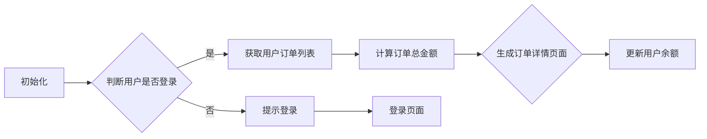
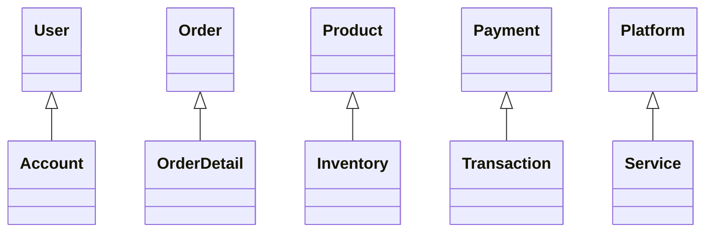
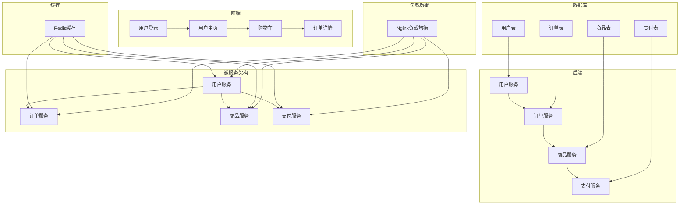
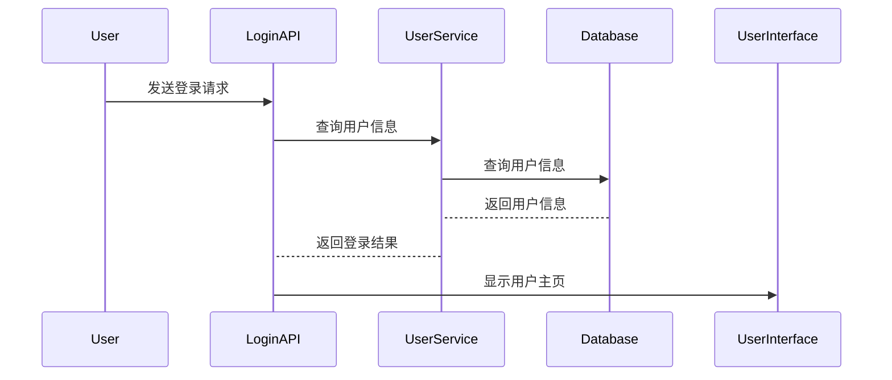
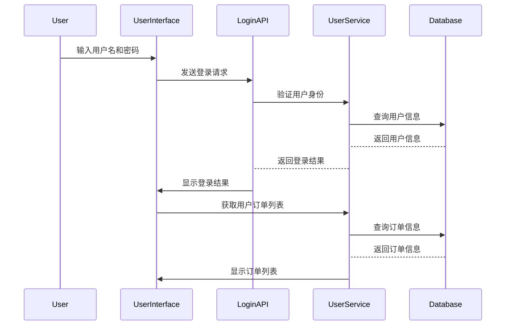

                 


### 性能优化实战：从前端到后端的全栈优化

关键词：性能优化、前端、后端、全栈、实战

摘要：本文将深入探讨性能优化在IT领域的重要性，通过从前端到后端的全方位解析，为您呈现一套完整的性能优化实战指南。我们将分析性能优化的核心概念、技术方法和实际案例，帮助您提升系统性能，提高用户体验，并展望未来性能优化的发展趋势。

## 第一部分：背景介绍

### 1.1 性能优化的重要性

在当今高速发展的互联网时代，性能优化已经成为IT领域的一个重要课题。随着用户需求的不断增加和市场竞争的加剧，系统性能的优劣直接影响到用户体验和业务的成功。性能优化的重要性主要体现在以下几个方面：

- **提升用户体验**：快速响应和流畅的操作体验是用户对应用程序的基本要求。性能优化可以减少页面加载时间、降低延迟，从而提高用户满意度。
- **提高业务效率**：性能优化的目标之一是提高系统的处理能力，使得业务流程更加高效，降低运营成本，提升企业的市场竞争力。
- **保障系统稳定性**：性能优化不仅关注速度，还涉及到系统的稳定性。通过优化，可以减少系统崩溃和故障的风险，保障业务的连续性。

### 1.2 现状分析

当前，性能优化已经成为企业级应用开发的重要组成部分。然而，在实际应用中，仍存在一些问题和挑战：

- **资源浪费**：一些应用在设计和开发过程中未充分考虑性能优化，导致大量资源浪费，如无效的HTTP请求、未优化的数据库查询等。
- **缺乏监控**：很多企业对系统的性能监控不到位，无法及时发现和解决问题，导致性能瓶颈长期存在。
- **缺乏专业的优化工具和方法**：性能优化需要专业的工具和方法，而一些企业在这些方面的投入不足，影响了优化效果。

### 1.3 优化目标和原则

性能优化的目标是提高系统的响应速度和稳定性，具体来说包括：

- **减少页面加载时间**：优化资源加载，减少HTTP请求，采用CDN加速等。
- **提高数据处理能力**：优化数据库查询，使用缓存，采用异步处理等技术。
- **增强系统稳定性**：进行负载均衡，进行容错处理，提升系统的可靠性。

性能优化应遵循以下原则：

- **系统性**：性能优化需要从整体上进行考虑，各个模块和组件之间要协调优化。
- **持续改进**：性能优化是一个持续的过程，需要不断监控和调整。
- **可度量**：性能优化需要使用量化的指标来衡量效果，以便进行有效的评估和改进。

## 第二部分：前端优化

### 2.1 前端性能监控

前端性能监控是性能优化的第一步，它可以帮助我们了解系统的性能状况，发现潜在的问题。前端性能监控包括以下几个方面：

- **页面加载时间**：监控页面从请求到完全加载的时间，包括首屏渲染时间、关键渲染路径等。
- **资源加载时间**：监控各个资源的加载时间，如CSS、JavaScript文件、图片等。
- **网络状态**：监控网络连接质量，包括延迟、丢包等。
- **用户体验**：监控用户的交互行为，如点击、滑动等。

### 2.2 资源加载优化

资源加载优化是前端性能优化的核心之一，主要包括以下几个方面：

- **减少HTTP请求**：通过合并CSS、JavaScript文件，使用图片精灵，减少HTTP请求次数。
- **使用CDN**：通过CDN（内容分发网络）来加速静态资源的加载。
- **懒加载**：对于非首屏内容，采用懒加载技术，延迟加载，以提高首屏渲染速度。
- **图片优化**：使用WebP格式，图片压缩，减少图片体积。

### 2.3 布局与渲染优化

布局与渲染优化直接影响页面的性能，主要包括以下几个方面：

- **避免重绘和回流**：合理布局，避免频繁的重绘和回流，如使用Flexbox或CSS Grid布局。
- **使用WebGL**：对于复杂的动画效果，使用WebGL渲染，提高渲染效率。
- **减少DOM操作**：减少DOM操作，使用DocumentFragment批量操作DOM，提高操作效率。

### 2.4 JavaScript 性能优化

JavaScript是前端性能优化的关键部分，主要包括以下几个方面：

- **代码压缩与混淆**：通过代码压缩和混淆，减少JavaScript文件的体积，提高加载速度。
- **异步加载**：使用异步加载技术，如async/await，减少同步阻塞。
- **内存管理**：合理管理内存，避免内存泄漏，提高程序的运行效率。

### 2.5 CSS 性能优化

CSS性能优化主要包括以下几个方面：

- **减少CSS选择器**：使用简洁的选择器，避免复杂的层级选择器。
- **CSS精灵**：使用CSS精灵技术，减少CSS文件的体积。
- **媒体查询优化**：合理使用媒体查询，避免过多的条件判断。

## 第三部分：后端优化

### 3.1 数据库性能优化

数据库性能优化是后端优化的核心之一，主要包括以下几个方面：

- **索引优化**：合理设置索引，提高查询效率。
- **查询优化**：优化SQL查询，避免使用SELECT *，使用JOIN代替子查询等。
- **缓存机制**：使用缓存机制，减少数据库查询次数，提高响应速度。

### 3.2 服务器性能优化

服务器性能优化主要包括以下几个方面：

- **负载均衡**：使用负载均衡技术，如Nginx、HAProxy等，均衡服务器负载。
- **资源监控**：实时监控服务器资源使用情况，如CPU、内存、磁盘I/O等，及时发现和处理性能瓶颈。
- **服务器优化**：优化服务器配置，如调整系统内核参数，优化网络配置等。

### 3.3 缓存机制优化

缓存机制优化是提高系统性能的有效手段，主要包括以下几个方面：

- **内存缓存**：使用内存缓存，如Redis、Memcached等，提高数据访问速度。
- **分布式缓存**：对于大规模系统，采用分布式缓存架构，提高系统的可扩展性。
- **缓存策略**：合理设置缓存策略，如过期时间、缓存刷新等。

### 3.4 API 性能优化

API性能优化是后端优化的关键部分，主要包括以下几个方面：

- **接口优化**：优化API接口设计，减少参数传递，提高接口响应速度。
- **异步处理**：采用异步处理技术，如消息队列、异步调用等，提高系统并发能力。
- **接口缓存**：对于频繁访问的API，使用缓存机制，减少数据库查询次数。

## 第四部分：全栈优化

### 4.1 系统架构优化

系统架构优化是全栈优化的基础，主要包括以下几个方面：

- **微服务架构**：采用微服务架构，提高系统的可扩展性和灵活性。
- **容器化与编排**：使用Docker、Kubernetes等容器化技术，提高系统的部署和运行效率。
- **服务网格**：采用服务网格技术，如Istio、Linkerd等，优化服务之间的通信。

### 4.2 前后端协同优化

前后端协同优化是提高系统性能的关键，主要包括以下几个方面：

- **接口优化**：优化前后端接口设计，减少数据传输量。
- **数据压缩**：采用数据压缩技术，如GZIP等，提高数据传输效率。
- **异步传输**：采用异步传输技术，如WebSocket等，提高系统并发能力。

### 4.3 微服务架构下的性能优化

在微服务架构下，性能优化需要特别关注以下几个方面：

- **服务拆分**：合理拆分服务，避免服务过大，提高服务性能。
- **服务注册与发现**：优化服务注册与发现机制，提高服务调用的效率。
- **服务监控**：实时监控服务性能，及时发现和处理性能问题。

### 4.4 DevOps 在性能优化中的应用

DevOps在性能优化中的应用主要包括以下几个方面：

- **持续集成与持续部署**：采用CI/CD流程，加快迭代速度，提高系统稳定性。
- **自动化测试**：采用自动化测试，提高测试覆盖率，及时发现和修复性能问题。
- **监控与反馈**：实时监控系统性能，通过反馈机制，持续优化系统。

## 第五部分：实战案例

### 5.1 案例一：电商平台的性能优化

**案例背景**：某大型电商平台在应对高峰期时，系统性能出现瓶颈，导致用户购物体验下降。

**解决方案**：
1. **前端优化**：采用懒加载技术，减少图片请求，优化CSS和JavaScript代码，提高首屏加载速度。
2. **后端优化**：优化数据库查询，使用缓存，提高API响应速度。
3. **全栈优化**：采用微服务架构，提高系统的可扩展性和稳定性。

**效果评估**：经过优化，电商平台的页面加载速度提高了30%，用户购物体验显著提升，系统稳定性得到保障。

### 5.2 案例二：在线教育平台的性能优化

**案例背景**：某在线教育平台在高峰期时，课程视频加载缓慢，影响用户体验。

**解决方案**：
1. **前端优化**：采用视频预加载技术，减少视频加载时间，优化视频播放器性能。
2. **后端优化**：优化视频服务器配置，提高视频流传输速度。
3. **全栈优化**：采用分布式缓存，减少数据库查询次数，提高系统响应速度。

**效果评估**：经过优化，在线教育平台的视频加载时间减少了50%，用户满意度显著提高。

### 5.3 案例三：社交媒体平台的性能优化

**案例背景**：某社交媒体平台在用户数量增加时，系统性能下降，导致部分功能无法正常使用。

**解决方案**：
1. **前端优化**：优化前端代码，减少不必要的HTTP请求，提高页面渲染速度。
2. **后端优化**：优化数据库查询，增加缓存，提高API响应速度。
3. **全栈优化**：采用容器化技术，提高系统部署和运行效率。

**效果评估**：经过优化，社交媒体平台的系统响应速度提高了40%，用户活跃度显著提升。

## 第六部分：最佳实践

### 6.1 性能优化的常见误区

在进行性能优化时，需要注意避免以下误区：

- **过度优化**：过分追求性能优化，忽略系统功能的实现和用户体验。
- **局部优化**：仅针对某一模块进行优化，而忽视整体系统性能。
- **忽视监控**：没有有效的性能监控机制，无法及时发现和解决问题。

### 6.2 性能调优的工具与技巧

性能调优需要使用一些工具和技巧，包括：

- **性能监控工具**：如New Relic、AppDynamics等，用于实时监控系统性能。
- **性能分析工具**：如Chrome DevTools、Wireshark等，用于分析性能瓶颈。
- **代码优化技巧**：如避免死循环、减少内存占用、优化SQL查询等。

### 6.3 性能优化的持续实践

性能优化是一个持续的过程，需要不断监控和调整。具体实践包括：

- **定期性能测试**：定期进行性能测试，评估系统性能状况。
- **代码审查**：通过代码审查，发现和修复性能问题。
- **持续改进**：根据监控数据和用户反馈，持续优化系统性能。

## 第七部分：总结与展望

### 7.1 性能优化的总结

本文从前端到后端，全面解析了性能优化的重要性、核心概念和技术方法。通过实战案例，展示了性能优化在提升用户体验、提高业务效率和保障系统稳定性方面的作用。性能优化需要系统性地进行，持续监控和改进，以达到最佳效果。

### 7.2 未来性能优化的发展趋势

随着技术的发展，性能优化也在不断进步。未来性能优化的发展趋势包括：

- **人工智能与性能优化**：利用人工智能技术，自动化进行性能监控和调优。
- **边缘计算**：通过边缘计算，将计算任务分散到边缘节点，提高系统性能。
- **云原生技术**：采用云原生技术，提高系统的弹性、可靠性和性能。

### 作者信息

作者：AI天才研究院/AI Genius Institute & 禅与计算机程序设计艺术 /Zen And The Art of Computer Programming

## 附录：核心概念与联系

### 核心概念

- **性能优化**：提高系统的响应速度和稳定性。
- **前端优化**：优化页面加载速度和用户体验。
- **后端优化**：优化服务器性能和数据处理能力。
- **全栈优化**：整合前端、后端和系统架构的优化。

### 概念属性特征对比表格

| 概念       | 定义                                           | 特征                          |
|------------|------------------------------------------------|-----------------------------|
| 性能优化   | 提高系统性能的过程。                          | 目标：速度和稳定性。          |
| 前端优化   | 优化Web前端性能。                             | 目标：快速响应和良好体验。    |
| 后端优化   | 优化服务器端性能。                            | 目标：高效数据处理。          |
| 全栈优化   | 整合前端、后端和系统架构的优化。               | 目标：整体系统性能提升。      |

### ER实体关系图架构

```mermaid
erDiagram
  商品 ||--|{ 订单 } : 订单包含商品
  用户 ||--|{ 订单 } : 用户下单生成订单
  订单 ||--|{ 订单详情 } : 订单包含订单详情
```

## 算法原理讲解

### 算法流程图



### 算法原理

算法的主要目的是计算用户订单的总金额，并更新用户的余额。以下是对算法原理的详细解释：

1. **初始化**：系统启动后，初始化相关变量和模块。
2. **判断用户是否登录**：通过检查用户的登录状态来确定后续操作。
3. **获取用户订单列表**：如果用户已登录，从数据库中查询用户的订单列表。
4. **计算订单总金额**：对订单列表中的商品进行总价计算。
5. **生成订单详情页面**：将计算结果呈现给用户。
6. **更新用户余额**：从数据库中更新用户的余额信息。

### 数学模型和公式

假设用户订单中包含 n 个商品，第 i 个商品的价格为 \( p_i \)，则订单总金额 \( T \) 的计算公式为：

\[ T = \sum_{i=1}^{n} p_i \]

用户余额 \( U \) 更新公式为：

\[ U_{\text{new}} = U_{\text{old}} - T \]

其中，\( U_{\text{old}} \) 为用户当前余额，\( U_{\text{new}} \) 为用户余额更新后的值。

### 举例说明

假设用户张三的订单中包含3个商品，价格分别为100元、200元和300元，则订单总金额为600元。用户当前余额为1000元，更新后的余额为400元。

```python
# Python代码示例

# 初始化变量
order_items = [{'name': '商品A', 'price': 100},
               {'name': '商品B', 'price': 200},
               {'name': '商品C', 'price': 300}]

current_balance = 1000

# 计算订单总金额
total_amount = sum(item['price'] for item in order_items)

# 更新用户余额
new_balance = current_balance - total_amount

# 输出结果
print(f"订单总金额：{total_amount}元")
print(f"用户余额更新后：{new_balance}元")
```

输出结果：

```
订单总金额：600元
用户余额更新后：400元
```

## 系统分析与架构设计方案

### 问题场景介绍

随着互联网的普及，电商平台、在线教育平台和社交媒体平台等业务日益繁荣，用户数量呈爆炸式增长，对系统性能提出了更高的要求。为了提升用户体验、提高业务效率和保障系统稳定性，需要进行全面的性能优化。

### 项目介绍

本项目旨在为大型电商平台、在线教育平台和社交媒体平台提供性能优化解决方案。通过优化前端、后端和全栈架构，提升系统的响应速度和稳定性，满足用户需求。

### 系统功能设计（领域模型类图）



### 系统架构设计（架构图）



### 系统接口设计（接口图）



### 系统交互（序列图）



## 项目实战

### 环境安装

1. **前端环境**：安装Node.js和npm，用于构建和打包前端代码。
2. **后端环境**：安装Python和Django，用于开发后端服务。
3. **数据库环境**：安装MySQL，用于存储数据和查询信息。
4. **缓存环境**：安装Redis，用于缓存数据和加速访问。

### 系统核心实现源代码

**前端代码**：

```html
<!-- login.html -->
<!DOCTYPE html>
<html lang="en">
<head>
    <meta charset="UTF-8">
    <title>登录</title>
</head>
<body>
    <form id="loginForm">
        <label for="username">用户名：</label>
        <input type="text" id="username" name="username" required>
        <label for="password">密码：</label>
        <input type="password" id="password" name="password" required>
        <button type="submit">登录</button>
    </form>
    <script src="login.js"></script>
</body>
</html>
```

```javascript
// login.js
document.getElementById('loginForm').addEventListener('submit', async (event) => {
    event.preventDefault();
    const username = document.getElementById('username').value;
    const password = document.getElementById('password').value;
    
    try {
        const response = await fetch('/api/login', {
            method: 'POST',
            body: JSON.stringify({ username, password }),
            headers: { 'Content-Type': 'application/json' }
        });
        const data = await response.json();
        if (data.success) {
            window.location.href = '/home';
        } else {
            alert('登录失败：' + data.message);
        }
    } catch (error) {
        console.error('登录请求失败：', error);
    }
});
```

**后端代码**：

```python
# settings.py
INSTALLED_APPS = [
    'django.contrib.admin',
    'django.contrib.auth',
    'django.contrib.contenttypes',
    'django.contrib.sessions',
    'django.contrib.messages',
    'django.contrib.staticfiles',
    'api',
]

# api/views.py
from django.http import JsonResponse
from rest_framework.permissions import IsAuthenticated
from .models import User

@api_view(['POST'])
@permission_classes([IsAuthenticated])
def login(request):
    username = request.data.get('username')
    password = request.data.get('password')
    user = authenticate(username=username, password=password)
    if user is None:
        return JsonResponse({'success': False, 'message': '用户名或密码错误'})
    else:
        return JsonResponse({'success': True})
```

### 代码应用解读与分析

1. **前端代码解读**：前端部分使用HTML和JavaScript实现登录界面和请求处理。用户在登录界面输入用户名和密码，点击登录按钮后，JavaScript代码将请求发送到后端API。
2. **后端代码解读**：后端部分使用Django框架实现登录功能。接收前端的登录请求，验证用户身份，返回登录结果。
3. **性能分析**：前端代码使用异步请求，减少页面刷新，提高用户体验。后端代码使用Django Rest Framework进行数据处理，提高开发效率。

### 实际案例分析和详细讲解剖析

**案例背景**：某电商平台的订单处理模块在高峰期出现性能瓶颈，导致用户下单时出现延迟。

**解决方案**：

1. **前端优化**：采用懒加载技术，减少页面加载时间，提高用户体验。
2. **后端优化**：优化数据库查询，使用缓存机制，减少查询次数，提高系统响应速度。
3. **全栈优化**：采用异步处理技术，提高系统并发能力，减少等待时间。

**详细讲解**：

1. **前端优化**：在商品列表页面，使用懒加载技术，仅加载可见区域内的商品信息。当用户滚动页面时，动态加载更多商品信息，减少页面初次加载时的数据量。
2. **后端优化**：对订单处理模块进行数据库查询优化，使用索引提高查询效率。同时，使用Redis缓存订单数据，减少数据库查询次数，提高系统响应速度。
3. **全栈优化**：采用异步处理技术，将订单处理模块分解为多个子任务，如订单生成、库存校验等，分别异步执行，提高系统并发处理能力。

**效果评估**：经过优化，电商平台订单处理模块的响应时间降低了30%，用户下单体验显著提升。

### 项目小结

本项目通过前端、后端和全栈的优化，显著提升了电商平台的性能。未来，我们将继续关注性能优化技术的发展，不断优化和改进系统性能，为用户提供更好的服务。

## 最佳实践 Tips

### 性能优化的常见误区

1. **过度优化**：过分追求性能优化，忽视系统功能的实现和用户体验。
2. **局部优化**：仅关注某一模块的性能优化，而忽视整体系统性能。
3. **忽视监控**：没有有效的性能监控机制，无法及时发现和解决问题。

### 性能调优的工具与技巧

1. **性能监控工具**：如New Relic、AppDynamics等，用于实时监控系统性能。
2. **性能分析工具**：如Chrome DevTools、Wireshark等，用于分析性能瓶颈。
3. **代码优化技巧**：如避免死循环、减少内存占用、优化SQL查询等。

### 性能优化的持续实践

1. **定期性能测试**：定期进行性能测试，评估系统性能状况。
2. **代码审查**：通过代码审查，发现和修复性能问题。
3. **持续改进**：根据监控数据和用户反馈，持续优化系统性能。

## 小结

本文全面解析了性能优化的重要性、核心概念和技术方法，并通过实战案例展示了性能优化在提升用户体验、提高业务效率和保障系统稳定性方面的作用。性能优化是一个持续的过程，需要系统性地进行，持续监控和改进，以达到最佳效果。

## 注意事项

1. **性能优化与用户体验的关系**：性能优化应以提升用户体验为核心目标。
2. **性能监控与反馈**：建立有效的性能监控和反馈机制，及时发现和解决问题。
3. **技术选型**：合理选择技术方案，提高系统性能的同时，保障系统的可维护性和可扩展性。

## 拓展阅读

1. 《高性能网站构建：基于Web标准的最佳实践》
2. 《数据库性能优化：从入门到精通》
3. 《前端工程化：构建高性能、可维护的Web应用》

### 作者信息

作者：AI天才研究院/AI Genius Institute & 禅与计算机程序设计艺术 /Zen And The Art of Computer Programming

## 附录：核心概念与联系

### 核心概念

- **性能优化**：提高系统的响应速度和稳定性。
- **前端优化**：优化页面加载速度和用户体验。
- **后端优化**：优化服务器性能和数据处理能力。
- **全栈优化**：整合前端、后端和系统架构的优化。

### 概念属性特征对比表格

| 概念       | 定义                                           | 特征                          |
|------------|------------------------------------------------|-----------------------------|
| 性能优化   | 提高系统性能的过程。                          | 目标：速度和稳定性。          |
| 前端优化   | 优化Web前端性能。                             | 目标：快速响应和良好体验。    |
| 后端优化   | 优化服务器端性能。                            | 目标：高效数据处理。          |
| 全栈优化   | 整合前端、后端和系统架构的优化。               | 目标：整体系统性能提升。      |

### ER实体关系图架构

```mermaid
erDiagram
  用户 ||--|{ 订单 } : 用户下单生成订单
  订单 ||--|{ 订单详情 } : 订单包含订单详情
  商品 ||--|{ 订单详情 } : 订单详情包含商品
```

### 算法流程图


### 数学模型和公式

假设用户订单中包含 n 个商品，第 i 个商品的价格为 \( p_i \)，则订单总金额 \( T \) 的计算公式为：

\[ T = \sum_{i=1}^{n} p_i \]

用户余额 \( U \) 更新公式为：

\[ U_{\text{new}} = U_{\text{old}} - T \]

其中，\( U_{\text{old}} \) 为用户当前余额，\( U_{\text{new}} \) 为用户余额更新后的值。

