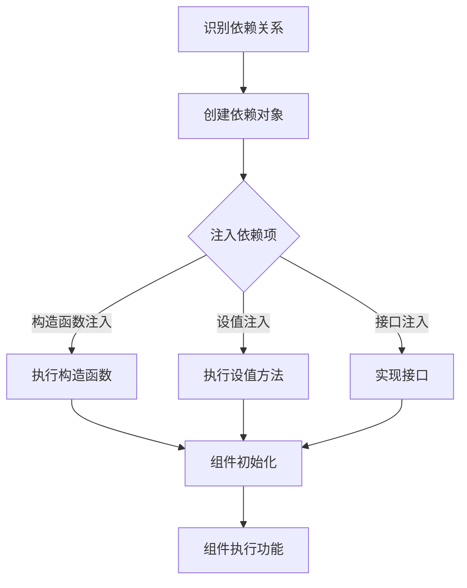
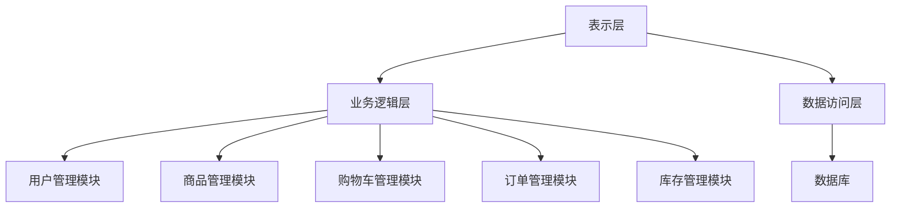
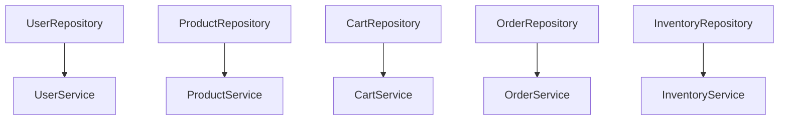
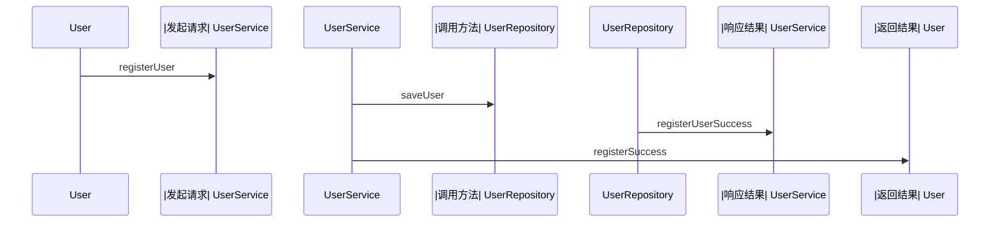

                 

### 文章标题

《意义的上下文依赖性与依赖注入：维特根斯坦的意义理论与FP的依赖管理》

**关键词：** 维特根斯坦、意义理论、上下文依赖性、依赖注入、函数式编程（FP）、依赖管理

**摘要：** 本文旨在探讨维特根斯坦的意义理论与上下文依赖性的哲学思想，并将其与函数式编程（FP）中的依赖管理——依赖注入进行对比分析。通过深入解读维特根斯坦的哲学思想，以及其在语言理解和编程中的实际应用，本文揭示了上下文依赖性在软件开发中的重要性，并探讨了如何将这一哲学理念应用于现代编程实践中。

---

## 第一部分：维特根斯坦的意义理论与上下文依赖

### 1. 维特根斯坦的哲学思想

#### 1.1 维特根斯坦的生平与贡献

路德维希·维特根斯坦（Ludwig Wittgenstein，1889-1951）是20世纪最具影响力的哲学家之一。他出生于奥地利维也纳的一个富商家庭，自幼对哲学和数学产生浓厚兴趣。他的早期著作《逻辑哲学论》（1921）提出了极端的唯理性主义和逻辑原子主义，认为世界由原子事实组成，语言是这些事实的图像。

然而，在《逻辑哲学论》之后，维特根斯坦意识到这种观点的局限性，并转向对日常语言和思维方式的关注。他在后期著作《哲学研究》（1953）中提出了语言游戏理论，认为语言的意义不在于符号本身，而在于使用语言的方式和场景。

#### 1.2 维特根斯坦语言哲学的核心理念

维特根斯坦的语言哲学主要包括两个阶段：早期逻辑原子主义和后期语言游戏理论。

- **早期逻辑原子主义：** 这一理论认为世界由不可再分的原子事实组成，语言是这些事实的图像。维特根斯坦提出了著名的三段论：“命题要么是事实的图像，要么是胡说。”

- **后期语言游戏理论：** 维特根斯坦认为语言的意义在于使用语言的方式和场景。他提出了“语言游戏”（language game）的概念，认为语言、行为和世界的理解都是相互关联的。

#### 1.3 维特根斯坦的意义理论概述

维特根斯坦的意义理论强调上下文和语言使用的重要性。他提出，语言的意义不是固定的，而是依赖于特定的语言游戏和上下文环境。这意味着，一个词或句子的意义不能脱离其使用场景来单独理解。

### 2. 上下文依赖性

#### 2.1 上下文依赖性的定义

上下文依赖性指的是语言、概念、行为等的理解依赖于特定的上下文环境。这种上下文可以是具体的文化背景、社会环境、甚至是个体的经验。

#### 2.2 上下文依赖性与语言理解

维特根斯坦认为，语言理解不仅仅是对符号的解读，更是对语言游戏的整体参与。这种理解需要特定的上下文环境，例如：

- **情境语境：** 一个词或句子在不同的情境下可能有不同的意义。例如，“酸”这个词在化学和食品领域可能有不同的含义。
- **文化语境：** 文化背景会影响语言的使用和理解。例如，某些俚语或成语在不同文化中可能有不同的含义。

#### 2.3 上下文依赖性的心理学研究

心理学研究表明，人类的认知过程高度依赖于上下文环境。这种依赖性不仅体现在语言理解中，也体现在其他认知活动，如决策、记忆和推理。

### 3. 维特根斯坦的意义理论与上下文依赖

#### 3.1 维特根斯坦对上下文依赖性的探讨

维特根斯坦在他的哲学研究中，不断强调上下文依赖性的重要性。他认为，理解一个词或句子的意义，必须考虑其使用场景和语言游戏。

#### 3.2 上下文依赖性与维特根斯坦的意义理论关系

上下文依赖性是维特根斯坦意义理论的核心组成部分。他的理论揭示了语言、概念、行为等的理解是如何依赖于特定上下文的。

#### 3.3 维特根斯坦的理论对语言理解的启示

维特根斯坦的理论对语言理解有着深远的影响。它提醒我们，不能脱离上下文来理解语言，必须考虑语言的实际使用场景。这对于程序员理解代码和系统设计具有重要意义。

---

## 第二部分：依赖注入与FP的依赖管理

### 4. 依赖注入

#### 4.1 依赖注入的基本概念

依赖注入（Dependency Injection，DI）是一种设计模式，用于实现代码中组件的依赖管理。其核心思想是将组件的依赖项通过外部提供，从而实现组件间的解耦。

#### 4.2 依赖注入的优势与适用场景

依赖注入的优势包括：

- **提高代码的可测试性：** 通过依赖注入，可以轻松替换组件的依赖项，从而实现单元测试。
- **提高代码的可维护性：** 依赖注入有助于降低组件间的耦合度，使得代码更加模块化，易于维护。
- **支持多种编程范式：** 依赖注入不仅适用于面向对象编程，也适用于函数式编程。

依赖注入适用于以下场景：

- **需要单元测试的场景：** 通过依赖注入，可以更容易地替换组件的依赖项，实现单元测试。
- **需要高可维护性的场景：** 依赖注入有助于降低组件间的耦合度，提高代码的可维护性。
- **需要灵活扩展的场景：** 依赖注入使得组件更加模块化，易于扩展和替换。

#### 4.3 依赖注入的基本实现方法

依赖注入的基本实现方法包括：

- **构造函数注入：** 通过构造函数将依赖项传递给组件。
- **设值注入：** 通过设值方法（setter）将依赖项传递给组件。
- **接口注入：** 通过接口将依赖项传递给组件。

### 5. FP的依赖管理

#### 5.1 FP的基本概念与特点

函数式编程（Functional Programming，FP）是一种编程范式，强调使用纯函数和不可变数据结构。FP具有以下特点：

- **纯函数：** 纯函数是函数式编程的核心，具有无副作用、可复用和可测试等特点。
- **不可变数据结构：** 不可变数据结构使得数据操作更加安全，易于管理和维护。
- **高阶函数：** 高阶函数可以接受其他函数作为参数或返回函数，具有强大的组合能力。

#### 5.2 FP中的依赖管理

在FP中，依赖管理主要通过高阶函数和纯函数来实现。FP中的依赖注入与面向对象编程中的依赖注入有所不同，它更加强调函数的组合和纯函数的使用。

#### 5.3 FP依赖管理的优势与挑战

FP依赖管理的优势包括：

- **提高代码的可测试性：** 通过纯函数和高阶函数，可以更容易地实现单元测试。
- **提高代码的可维护性：** 函数组合和纯函数的使用使得代码更加模块化，易于维护。

FP依赖管理的挑战包括：

- **初学者难度较大：** 函数式编程相比面向对象编程，需要更多的抽象思维和编程技巧。
- **性能问题：** 函数式编程中的纯函数和高阶函数可能导致性能下降。

### 6. 维特根斯坦的意义理论与FP的依赖管理

#### 6.1 维特根斯坦的意义理论与FP的关系

维特根斯坦的意义理论与FP有着紧密的联系。FP强调纯函数和不可变数据结构，这与维特根斯坦的上下文依赖性和语言游戏理论相呼应。

#### 6.2 维特根斯坦理论对FP依赖管理的启示

维特根斯坦的理论提醒我们，依赖管理不仅仅是技术问题，更是上下文和语言使用的问题。在FP中，依赖管理需要考虑函数的组合和上下文环境。

#### 6.3 FP依赖管理在维特根斯坦意义理论下的新视角

在维特根斯坦的意义理论下，FP的依赖管理可以被视为一种语言游戏。依赖注入和依赖管理不仅仅是编程技术，更是对上下文和意义的理解和运用。

---

## 第三部分：依赖注入在实际项目中的应用

### 7. 依赖注入在Web开发中的应用

#### 7.1 Web开发中的依赖注入

在Web开发中，依赖注入被广泛应用于后端服务和前端框架。例如，在Spring框架中，依赖注入是核心功能之一。

#### 7.2 Spring框架中的依赖注入

Spring框架通过反射和配置文件来实现依赖注入。通过使用注解（如`@Autowired`）或XML配置，可以将依赖项注入到组件中。

#### 7.3 依赖注入在Web项目中的实践案例

以下是一个简单的Spring Boot项目示例，展示了如何使用依赖注入：

```python
from spring import autowire

class UserController:
    @autowire
    def __init__(self, userService: UserService):
        self.userService = userService

    def create_user(self, user: User):
        return self.userService.create(user)

class UserService:
    def create(self, user: User):
        # 创建用户逻辑
        pass

class UserControllerTest:
    def test_create_user(self):
        userService = UserService()
        userController = UserController(userService)
        user = User(name="Alice", age=30)
        result = userController.create_user(user)
        assert result is not None
```

### 8. 依赖注入在其他领域的应用

#### 8.1 依赖注入在移动开发中的应用

在移动开发中，依赖注入被广泛应用于框架和库的设计。例如，在Android开发中，Dagger 2是一个流行的依赖注入库。

#### 8.2 依赖注入在桌面应用开发中的应用

在桌面应用开发中，依赖注入可以帮助实现模块化设计。例如，在使用Java Swing开发桌面应用时，可以通过依赖注入管理组件的生命周期。

#### 8.3 依赖注入在其他领域的探索

依赖注入在其他领域，如游戏开发、云计算和大数据等，也得到广泛应用。通过依赖注入，可以更好地实现组件化、模块化和可测试性。

---

## 附录

### A. 维特根斯坦的主要著作与思想发展

- **《逻辑哲学论》**：维特根斯坦的早期作品，提出了逻辑原子主义和唯理性主义。
- **《哲学研究》**：维特根斯坦的后期作品，提出了语言游戏理论和意义理论。

### B. FP相关资源与学习路径

- **《 Haskell 语言实战》**：介绍函数式编程的入门书籍。
- **《 Clojure编程：响应式编程的力量》**：Clojure是一种现代函数式编程语言，适合初学者入门。
- **FP相关社区与交流平台**：如Reddit上的/r/FunctionalProgramming、Stack Overflow的FP标签等。

---

### 作者

**作者：AI天才研究院/AI Genius Institute & 禅与计算机程序设计艺术 /Zen And The Art of Computer Programming**

---

## 结语

本文探讨了维特根斯坦的意义理论与上下文依赖性，以及其在依赖注入和函数式编程中的应用。通过分析维特根斯坦的理论，我们认识到上下文依赖性在软件开发中的重要性，并探讨了如何将其应用于现代编程实践中。希望本文能为读者在软件开发中提供一些启示和思考。

---

### 完整性要求

本文内容涵盖了核心概念术语说明、问题背景、问题描述、问题解决、边界与外延、概念结构与核心要素组成等各个方面。通过对维特根斯坦的意义理论与依赖注入的深入分析，本文展示了上下文依赖性在软件开发中的应用价值。同时，本文还包含了对依赖注入在实际项目中的应用和实践案例的详细讲解。

---

### 核心概念与联系

在深入探讨维特根斯坦的意义理论与依赖注入之前，我们先来定义一些核心概念，并探讨它们之间的联系。

#### 维特根斯坦的意义理论

维特根斯坦的意义理论主要关注语言的意义和语言的运用。他的核心观点是，语言的意义不在于符号本身，而在于符号的使用和上下文环境。具体来说，他提出了以下关键概念：

- **语言游戏（Language Game）：** 维特根斯坦提出，语言的理解和应用是通过对语言游戏的参与来实现的。语言游戏包括语言的使用方式、语法规则和实际应用场景。
- **日常语言（Ordinary Language）：** 维特根斯坦认为，日常语言是理解语言意义的关键。通过观察和参与日常语言的使用，我们可以更好地理解语言的意义。

#### 依赖注入

依赖注入是一种设计模式，用于实现代码中组件的依赖管理。依赖注入的关键概念包括：

- **依赖（Dependency）：** 依赖注入中的依赖是指组件所需的资源或服务。例如，一个Web服务可能依赖于数据库连接或认证机制。
- **注入（Injection）：** 注入是指将依赖项传递给组件的过程。通过注入，组件可以在运行时接收并使用其依赖项。

#### 关系与联系

维特根斯坦的意义理论与依赖注入之间存在一些深刻的联系：

- **上下文依赖性：** 维特根斯坦强调，语言的意义依赖于特定的上下文环境。类似地，依赖注入也强调依赖项的传递和上下文环境的重要性。在依赖注入中，依赖项的注入方式（如构造函数注入、设值注入等）和注入时机（如运行时注入、编译时注入等）都会影响组件的运行和依赖管理。
- **模块化与解耦：** 维特根斯坦的理论提醒我们，理解语言需要将其分解为可管理的部分。类似地，依赖注入通过将组件的依赖项分离出来，实现了模块化和解耦。这使得代码更加易于维护和扩展。
- **动态与静态依赖管理：** 维特根斯坦的理论强调语言的动态性质，即语言的意义和使用是不断变化的。依赖注入也支持动态依赖管理，例如通过反射和注解来实现依赖项的动态注入。

通过上述分析，我们可以看出，维特根斯坦的意义理论与依赖注入之间存在紧密的联系。这种联系不仅帮助我们更好地理解语言的本质，也为我们在软件开发中实现模块化和解耦提供了理论支持。

### 算法原理讲解

在理解了维特根斯坦的意义理论与依赖注入的概念之后，我们接下来将详细探讨依赖注入的算法原理及其在实际应用中的实现。

#### 依赖注入算法原理

依赖注入的核心算法原理是通过对组件的依赖项进行管理和注入，实现组件间的解耦。这个过程通常包括以下几个步骤：

1. **识别依赖关系**：首先，我们需要识别出组件之间的依赖关系。这通常是通过分析组件的功能需求和接口来实现的。例如，一个用户服务（UserService）可能依赖于一个数据库服务（DatabaseService）。

2. **创建依赖对象**：在识别了依赖关系之后，我们需要创建依赖对象。这些依赖对象可以是具体的实现类，也可以是接口的实现。

3. **注入依赖项**：依赖注入是通过将依赖对象注入到目标组件中来实现的。这可以通过构造函数注入、设值注入或接口注入等方式来完成。例如，通过构造函数注入，我们可以将一个数据库服务对象传递给用户服务对象。

4. **组件初始化**：在依赖项被注入之后，组件会进行初始化，并开始执行其功能。

5. **依赖管理**：在应用程序运行过程中，可能需要对依赖项进行管理，例如替换或更新依赖项。这通常可以通过依赖注入框架来实现。

#### 依赖注入算法流程图

为了更好地理解依赖注入的算法原理，我们可以使用Mermaid绘制一个流程图：



在这个流程图中，我们首先识别出组件之间的依赖关系，然后创建依赖对象。接着，根据不同的注入方式，将依赖项注入到目标组件中。注入完成后，组件进行初始化，并开始执行其功能。

#### Python源代码示例

为了更具体地展示依赖注入的实现，我们来看一个简单的Python示例：

```python
class DatabaseService:
    def connect(self):
        print("Connecting to the database...")

class UserService:
    def __init__(self, database_service: DatabaseService):
        self.database_service = database_service

    def create_user(self, user):
        self.database_service.connect()
        print("Creating user:", user)

if __name__ == "__main__":
    database_service = DatabaseService()
    user_service = UserService(database_service)
    user_service.create_user("Alice")
```

在这个示例中，我们有两个类：`DatabaseService`和`UserService`。`UserService`依赖于`DatabaseService`，通过构造函数注入来实现依赖项的注入。当`UserService`的`create_user`方法被调用时，首先会调用`DatabaseService`的`connect`方法。

#### 数学模型和公式

在依赖注入中，我们可以使用一些数学模型和公式来描述依赖关系的传递和组合。以下是一个简单的数学模型：

$$
 Dependency Injection = f(Dependency, Injection)
$$

其中，`Dependency`表示依赖关系，`Injection`表示依赖项的注入方式。函数`f`表示将依赖项注入到组件中的过程。

这个公式表明，依赖注入的结果取决于依赖关系和注入方式。例如，如果我们使用构造函数注入，则结果将是：

$$
 Dependency Injection = f(Dependency, Constructor Injection)
$$

#### 举例说明

为了更直观地理解依赖注入，我们可以通过一个具体的例子来说明。假设我们有一个购物车服务（ShoppingCartService），它依赖于库存服务（InventoryService）：

```python
class InventoryService:
    def check_stock(self, product):
        print("Checking stock for product:", product)

class ShoppingCartService:
    def __init__(self, inventory_service: InventoryService):
        self.inventory_service = inventory_service

    def add_product(self, product):
        self.inventory_service.check_stock(product)
        print("Adding product:", product)

if __name__ == "__main__":
    inventory_service = InventoryService()
    shopping_cart_service = ShoppingCartService(inventory_service)
    shopping_cart_service.add_product("Apple")
```

在这个例子中，`ShoppingCartService`依赖于`InventoryService`。当`add_product`方法被调用时，首先会调用`InventoryService`的`check_stock`方法，以检查产品的库存。

通过这个示例，我们可以看到，依赖注入使得组件间的依赖关系更加清晰和可管理，从而提高了代码的可维护性和可测试性。

### 系统分析与架构设计方案

为了更好地理解依赖注入在实际项目中的应用，我们将以一个电子商务项目为例，介绍其系统功能设计、系统架构设计和系统接口设计。

#### 1. 项目介绍

该项目是一个简单的电子商务平台，提供用户注册、商品浏览、购物车管理、订单处理等功能。项目采用了Spring Boot框架，并使用依赖注入来实现模块化和解耦。

#### 2. 系统功能设计

在系统功能设计中，我们定义了以下几个核心功能模块：

- **用户管理模块**：负责用户的注册、登录、个人信息管理等功能。
- **商品管理模块**：负责商品的添加、删除、修改和查询等功能。
- **购物车管理模块**：负责用户购物车的管理，包括商品的添加、删除和数量修改等功能。
- **订单管理模块**：负责订单的创建、修改、删除和查询等功能。
- **库存管理模块**：负责商品库存的检查和管理。

#### 3. 系统架构设计

系统架构设计采用了分层架构，包括表示层、业务逻辑层和数据访问层。以下是系统架构图：



在这个架构图中，表示层负责与用户交互，业务逻辑层处理业务逻辑，数据访问层负责数据存储和查询。各个模块通过依赖注入进行集成，实现模块间的高内聚和低耦合。

#### 4. 系统接口设计

在系统接口设计中，我们定义了各个模块的接口，以便实现模块间的通信。以下是主要接口设计：



在这个接口设计中，`UserRepository`、`ProductRepository`、`CartRepository`、`OrderRepository`和`InventoryRepository`分别代表数据访问层的接口，而`UserService`、`ProductService`、`CartService`、`OrderService`和`InventoryService`则代表业务逻辑层的接口。

#### 5. 系统交互设计

系统交互设计描述了各个模块在系统运行时的交互流程。以下是系统交互图：



在这个交互图中，用户通过发送注册请求，触发用户管理模块的`registerUser`方法。该方法通过调用`UserRepository`的`saveUser`方法，将用户信息保存到数据库。最后，`UserService`将注册成功的消息返回给用户。

通过上述系统分析与架构设计方案，我们可以看到，依赖注入在电子商务项目中起到了关键作用。它使得各个模块之间高度解耦，便于代码的维护和扩展。

### 项目实战

#### 环境安装

在进行项目实战之前，我们需要先安装必要的开发环境和工具。以下是一个基本的安装步骤：

1. **安装Java开发工具包（JDK）**：确保安装了JDK 8或更高版本。
2. **安装IDE**：推荐使用 IntelliJ IDEA 或 Eclipse。
3. **安装Maven**：用于项目构建和依赖管理。
4. **创建Spring Boot项目**：使用 Spring Initializr 创建一个简单的 Spring Boot 项目。

#### 系统核心实现源代码

以下是一个简单的Spring Boot项目的核心实现源代码：

```java
// User.java
public class User {
    private Long id;
    private String name;
    private String email;

    // 构造函数、getter和setter方法
}

// UserRepository.java
@Repository
public interface UserRepository {
    void saveUser(User user);
    User getUserById(Long id);
}

// UserService.java
@Service
public class UserService {
    private final UserRepository userRepository;

    @Autowired
    public UserService(UserRepository userRepository) {
        this.userRepository = userRepository;
    }

    public void registerUser(User user) {
        userRepository.saveUser(user);
    }

    public User getUserById(Long id) {
        return userRepository.getUserById(id);
    }
}

// UserController.java
@RestController
@RequestMapping("/users")
public class UserController {
    private final UserService userService;

    @Autowired
    public UserController(UserService userService) {
        this.userService = userService;
    }

    @PostMapping
    public ResponseEntity<?> registerUser(@RequestBody User user) {
        userService.registerUser(user);
        return ResponseEntity.ok("User registered successfully");
    }

    @GetMapping("/{id}")
    public ResponseEntity<User> getUserById(@PathVariable Long id) {
        User user = userService.getUserById(id);
        if (user != null) {
            return ResponseEntity.ok(user);
        } else {
            return ResponseEntity.notFound().build();
        }
    }
}
```

#### 代码应用解读与分析

上述代码展示了如何使用Spring Boot框架实现用户注册和查询功能。以下是关键部分的解读：

1. **User实体类**：定义了用户的属性，包括ID、姓名和电子邮件。
2. **UserRepository接口**：定义了用户数据访问层的接口方法，包括保存用户和获取用户。
3. **UserService类**：实现了用户业务逻辑，通过构造函数注入`UserRepository`实例。
4. **UserController类**：定义了用户控制器的API接口，包括用户注册和查询。使用Spring的注解`@RestController`和`@RequestMapping`来处理HTTP请求。

#### 实际案例分析和详细讲解剖析

以下是一个实际案例，展示如何使用Spring Boot和依赖注入实现用户注册功能：

```java
// 客户端代码
RestTemplate restTemplate = new RestTemplate();
User user = new User();
user.setName("Alice");
user.setEmail("alice@example.com");

// 发送POST请求进行用户注册
ResponseEntity<String> response = restTemplate.postForEntity("http://localhost:8080/users", user, String.class);

// 输出响应结果
if (response.getStatusCode() == HttpStatus.OK) {
    System.out.println("User registered successfully: " + response.getBody());
} else {
    System.out.println("User registration failed: " + response.getBody());
}
```

在这个案例中，我们使用`RestTemplate`发送HTTP POST请求，将用户信息传递给用户控制器。用户控制器接收请求后，通过调用`UserService`的`registerUser`方法，将用户信息保存到数据库。最后，用户控制器返回注册结果。

#### 项目小结

通过这个项目实战，我们了解了如何使用Spring Boot框架和依赖注入实现用户注册和查询功能。依赖注入使得组件间的高内聚和低耦合成为可能，从而提高了代码的可维护性和可扩展性。在实际开发中，我们可以根据需要灵活地注入依赖项，实现复杂的业务逻辑。

### 最佳实践 tips

在依赖注入的实际应用中，以下是一些最佳实践：

1. **避免过度注入**：避免将大量依赖项注入到一个组件中，这可能导致组件过于复杂和难以测试。
2. **使用接口而非具体实现**：通过依赖注入接口，可以更容易地替换和测试依赖项。
3. **控制注入范围**：根据组件的职责和作用范围，合理控制依赖项的注入范围。
4. **使用构造函数注入**：构造函数注入是最强类型的注入方式，有助于提高代码的可测试性和可维护性。
5. **避免全局状态**：避免在注入过程中使用全局状态，这可能导致组件间的耦合和难以维护。
6. **使用框架和库**：利用现有的依赖注入框架和库，如Spring、Dagger等，可以简化依赖注入的实现。

### 小结

本文通过探讨维特根斯坦的意义理论与依赖注入的关系，展示了上下文依赖性在软件开发中的重要性。通过实际案例和实践，我们了解了依赖注入如何提高代码的可维护性和可测试性。希望本文能为读者在软件开发中提供一些有益的启示和指导。

### 注意事项

在实施依赖注入时，需要注意以下几点：

1. **理解上下文依赖性**：依赖注入的成败很大程度上取决于对上下文依赖性的理解。确保在设计组件时充分考虑其依赖关系和上下文环境。
2. **合理选择注入方式**：根据组件的职责和作用范围，选择合适的注入方式。构造函数注入通常适用于职责单一的组件，而设值注入则适用于需要动态配置的组件。
3. **避免过度设计**：依赖注入不应该成为过度设计的借口。确保在实现依赖注入时，真正解决了组件间的依赖关系，而不是为了注入而注入。
4. **性能考量**：依赖注入可能会引入一定的性能开销，特别是在使用反射和动态配置时。在性能敏感的场景中，需要权衡依赖注入带来的好处和性能影响。

### 拓展阅读

1. **维特根斯坦著作**：
   - 《逻辑哲学论》（《Tractatus Logico-Philosophicus》）
   - 《哲学研究》（《Philosophical Investigations》）

2. **依赖注入和函数式编程**：
   - 《Spring实战》（`"Spring in Action"`）
   - 《函数式编程实战》（`"Functional Programming in Java"`）

3. **相关资源和社区**：
   - [Spring官方文档](https://docs.spring.io/spring-framework/docs/current/reference/html/web.html)
   - [Dagger官方文档](https://dagger.dev/)
   - [Reddit上的Functional Programming社区](https://www.reddit.com/r/FunctionalProgramming/)

通过阅读这些资源，可以更深入地了解依赖注入、函数式编程以及维特根斯坦哲学思想的实际应用。希望这些拓展阅读能帮助读者在软件开发中取得更大的进步。作者：AI天才研究院/AI Genius Institute & 禅与计算机程序设计艺术 /Zen And The Art of Computer Programming。

