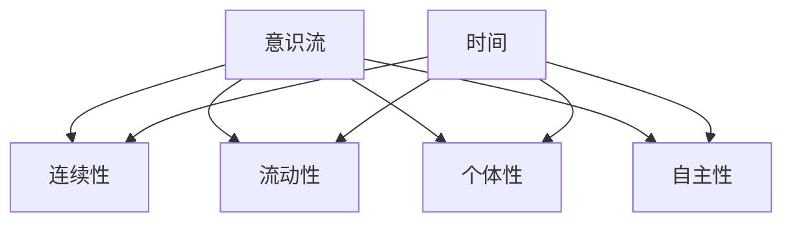
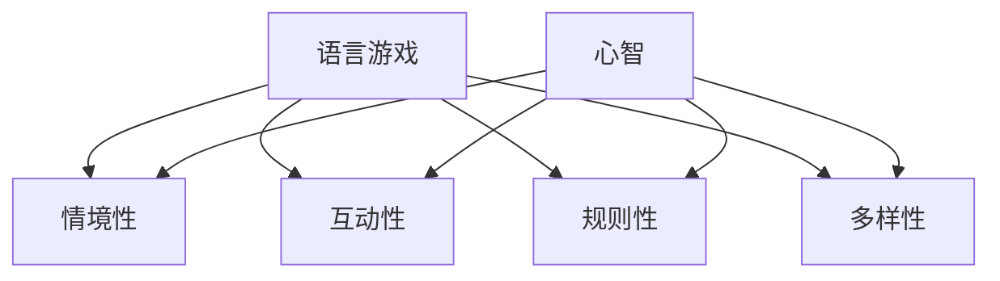
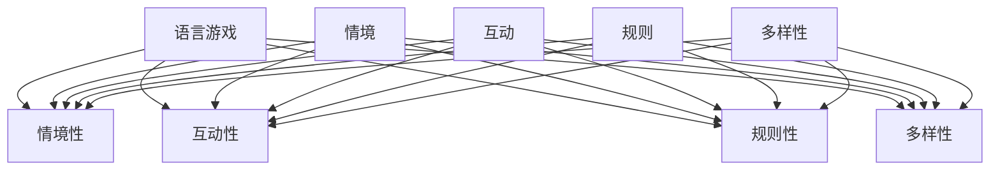
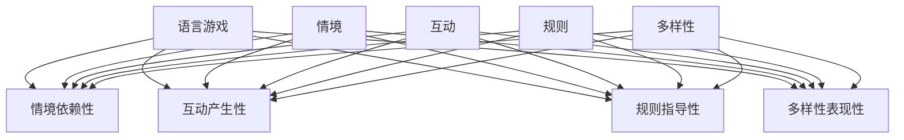
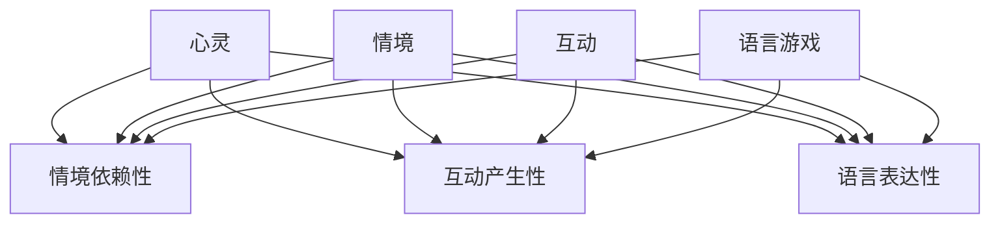
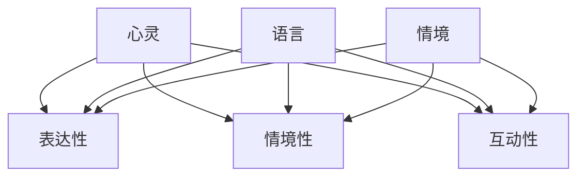
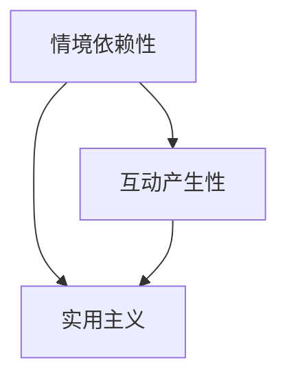

                 

### 文章标题与关键词

**意识流与语言游戏：柏格森与维特根斯坦对心智的探索**

**关键词：柏格森、维特根斯坦、心智、意识流、语言游戏、哲学、心理学**

**摘要：本文将深入探讨法国哲学家亨利·柏格森和英国哲学家路德维希·维特根斯坦对心智的探索。通过对他们各自的哲学理论和心智概念的分析，本文旨在揭示两位哲学家在心智研究中的贡献和差异，并探讨其对现代心理学和人工智能领域的启示。**

### 引言

#### 心智探讨的背景与意义

心智（mind）是一个涵盖广泛且复杂的概念，涉及认知、情感、意识等多个层面。自古以来，哲学家、心理学家和其他学者都对心智进行了深入的探讨。在西方哲学中，心智探讨可以追溯到古希腊时期，如亚里士多德的灵魂学说。而在现代，心智研究已经成为心理学、哲学和神经科学等多个领域的核心议题。

在人工智能（AI）快速发展的今天，心智研究的重要性更加凸显。人工智能的核心目标是模拟和增强人类智能，而心智则是实现这一目标的关键。理解心智的本质、运作机制以及心智与行为之间的关系，对于推动人工智能的发展具有重要意义。

#### 柏格森哲学及其对心智的思考

亨利·柏格森（Henri Bergson）是20世纪初期的重要哲学家，他的哲学思想对心智研究产生了深远的影响。柏格森提出了“意识流”（stream of consciousness）的概念，认为心智是一种不断流动的、动态的过程，而不是一系列离散的心理状态。他强调时间的流动性和心理经验的连续性，认为意识流是我们感知和理解世界的基础。

柏格森的心智理论对心理学和哲学领域产生了重要影响。他的观点促使心理学家关注个体内心的感知和情感体验，推动了认知心理学的发展。同时，柏格森的理论也为后来的意识流文学和电影艺术提供了理论基础。

#### 维特根斯坦哲学及其对心智的思考

路德维希·维特根斯坦（Ludwig Wittgenstein）是20世纪最重要的哲学家之一，他的哲学思想对心智研究同样具有重要价值。维特根斯坦提出了“语言游戏”（language game）的概念，认为语言和心智之间的关系是互动和相互依存的。他主张，理解语言的意义在于理解语言在特定情境下的使用，而不是追求抽象的本质。

维特根斯坦的心智理论对哲学和语言学领域产生了深远的影响。他的观点促使哲学家和语言学家重新思考语言的本质和意义，推动了语言哲学和心智哲学的发展。同时，维特根斯坦的理论也为后来的认知科学和人工智能研究提供了启示。

#### 柏格森与维特根斯坦心智理论的联系与区别

柏格森和维特根斯坦在心智研究上有许多共同点，例如他们都关注心智的动态性和互动性。然而，他们的理论也存在显著差异。柏格森强调时间的流动性和心理经验的连续性，而维特根斯坦则关注语言的情境性和使用者的主观性。

柏格森的心智理论更侧重于心理过程的动态性和流动性，而维特根斯坦的理论则更注重语言的实际应用和意义。尽管存在差异，但两位哲学家的理论都对心智研究产生了深远的影响，为后来的学者提供了丰富的思想资源。

### 心智概念的历史与发展

#### 心智概念的定义与类型

心智（mind）是一个复杂且多层次的概念，可以从不同角度进行定义和分类。从哲学角度，心智通常指人的内在精神活动，包括认知、情感、意志等方面。从心理学角度，心智主要涉及认知功能，如感知、记忆、思考、学习等。

心智概念可以大致分为以下几种类型：

1. **认知心智**：主要关注心智的认知功能，包括感知、记忆、思考、判断等。
2. **情感心智**：关注心智的情感体验，如情感反应、情绪调控等。
3. **意志心智**：关注心智的意志行为，如决策、动机、目标设定等。
4. **综合心智**：将认知、情感和意志功能结合起来，形成一个整体的心智模型。

#### 心智概念在西方哲学中的演变

西方哲学中，心智概念经历了漫长的演变过程。古希腊时期的哲学家如亚里士多德，将心智视为灵魂的一部分，强调心智与身体的关系。中世纪时期的经院哲学家进一步探讨了心智的本质和功能，如圣奥古斯丁提出了灵魂不朽的观点。

近代哲学中，笛卡尔提出了“我思故我在”的命题，将心智视为独立于身体的存在。康德则从先验逻辑角度探讨了心智的结构和功能，强调心智的自主性和客观性。

20世纪以来，柏格森和维特根斯坦等哲学家进一步丰富了心智概念，将心智视为一个动态的、互动的过程，而不是静态的实体。这一观点对后来的心理学、哲学和认知科学产生了深远的影响。

#### 心智概念在心理学中的发展

心理学作为研究心智的科学，对心智概念进行了深入的探讨和发展。早期的心理学研究主要集中在心理过程的描述和解释，如行为主义心理学强调行为的可观察性和可预测性，而认知心理学则关注心智的认知过程，如感知、记忆、思考等。

近年来，心理学研究逐渐将心智视为一个动态的、互动的系统，强调心智与环境之间的相互作用。认知心理学、社会心理学、发展心理学等多个领域都在从不同角度探讨心智的本质和功能，推动了心智研究的发展。

### 柏格森对心智的探索

#### 柏格森的意识流理论

亨利·柏格森（Henri Bergson）的意识流理论是他哲学思想的核心。他认为，心智不是一个静态的实体，而是一个动态的、流动的过程，这个流动的过程被称为“意识流”（stream of consciousness）。意识流是不可分割的，是连续的，就像一条不断流淌的河流，而不是一系列孤立的心理状态。

#### 意识流的概念与特点

意识流具有以下几个特点：

1. **连续性**：意识流是一个连续的过程，没有中断和跳跃。
2. **流动性**：意识流像一条河流，不断变化和流动。
3. **自主性**：意识流是自主的，不受外界刺激的控制。
4. **个体性**：每个人的意识流都是独特的，反映了个体独特的心理体验。

#### 意识流的心理学意义

柏格森的意识流理论对心理学产生了深远的影响。首先，它促使心理学家关注个体的内心体验，强调主观性和个体性。其次，它为理解心理过程提供了新的视角，使心理学家能够更深入地探讨心智的动态性和复杂性。

#### 意识流与认知功能的关系

意识流与认知功能之间存在紧密的关系。柏格森认为，意识流是认知功能的基础，认知功能是在意识流的背景下发生的。例如，感知、记忆、思考等认知功能都是在意识流的流动过程中实现的。意识流为认知功能提供了一个连续的背景，使认知功能能够有效地运作。

#### 柏格森的时间理论

柏格森的时间理论是他的哲学体系的重要组成部分。他认为，时间是流动的、动态的，而不是静态的。这种流动的时间被称为“生命时间”（duration），它与物理时间的线性流逝不同。生命时间是内在的、主观的，而物理时间是外在的、客观的。

#### 柏格森的时间观

柏格森的时间观具有以下几个特点：

1. **主观性**：生命时间是主观的，每个人对时间的感知是不同的。
2. **动态性**：生命时间是动态的，不断变化和流逝。
3. **个体性**：每个人的生命时间是独特的，反映了个体独特的心理体验。

#### 意识流与时间的关系

柏格森认为，意识流与时间之间存在紧密的关系。意识流是时间的体现，时间是意识流的基础。意识流的连续性和流动性体现了时间的动态性，而时间的流动性和主观性则反映了意识流的特性。因此，理解意识流就是理解时间。

#### 柏格森时间理论在心理学中的应用

柏格森的时间理论在心理学中得到了广泛的应用。首先，它为理解心理过程提供了新的视角，使心理学家能够更深入地探讨心智的动态性和复杂性。其次，它为认知心理学的研究提供了理论支持，帮助心理学家更好地理解记忆、思考等认知功能。

#### 柏格森的心智哲学

柏格森的心智哲学强调心智的动态性和流动性。他认为，心智不是一个静态的实体，而是一个动态的、不断变化的过程。这种动态性体现在意识流和时间的关系中，使心智成为一个充满活力和创造力的系统。

#### 心智与身体的关系

柏格森认为，心智与身体是相互关联的。心智不是独立于身体的，而是与身体紧密相连的。心智的动态性和流动性是通过身体的活动表现出来的，而身体的活动则受到心智的指导和调节。

#### 柏格森心智理论对现代心理学的影响

柏格森的心智理论对现代心理学产生了深远的影响。首先，它促使心理学家关注个体的内心体验，强调主观性和个体性。其次，它为理解心理过程提供了新的视角，使心理学家能够更深入地探讨心智的动态性和复杂性。最后，它为认知心理学的研究提供了理论支持，帮助心理学家更好地理解记忆、思考等认知功能。

### 维特根斯坦对心智的探索

#### 维特根斯坦的语言游戏理论

路德维希·维特根斯坦（Ludwig Wittgenstein）的语言游戏理论是他哲学思想的核心。他认为，语言的意义不在于语言本身，而在于语言的使用情境。语言游戏是维特根斯坦用来描述语言使用和意义的一种概念，他认为语言的意义取决于语言在特定情境下的使用。

#### 语言游戏的概念与特点

语言游戏具有以下几个特点：

1. **情境性**：语言游戏的意义取决于语言在特定情境下的使用。
2. **互动性**：语言游戏是参与者之间的一种互动，语言的意义在互动中产生和体现。
3. **规则性**：语言游戏有一定的规则，这些规则指导语言的使用和互动。
4. **多样性**：不同的语言游戏有不同的规则和意义，语言游戏是多样化的。

#### 语言游戏与心智的关系

维特根斯坦认为，心智与语言游戏之间存在紧密的关系。心智是语言游戏的基础，语言游戏是心智的表达。心智通过语言游戏来理解和表达世界，而语言游戏则通过心智来产生意义。

#### 语言游戏在维特根斯坦哲学中的地位

语言游戏在维特根斯坦哲学中占据核心地位。他认为，理解语言的意义在于理解语言在特定情境下的使用，而不是追求抽象的本质。语言游戏为理解语言的意义提供了一个具体和实用的方法，使哲学家和语言学家能够更深入地探讨语言的本质。

#### 维特根斯坦的心灵哲学

维特根斯坦的心灵哲学强调心智的情境性和互动性。他认为，心智不是一个独立于世界的实体，而是与世界紧密相连的。心智通过与世界互动来产生意义，这种互动使心智成为一个充满活力和创造力的系统。

#### 心灵与语言的关系

维特根斯坦认为，心灵与语言之间存在着紧密的关系。心灵是语言的基础，语言是心灵的表达。心灵通过语言来理解和表达世界，而语言则通过心灵来产生意义。这种关系使心灵和语言成为一个统一的整体。

#### 维特根斯坦心灵哲学的意义

维特根斯坦的心灵哲学对哲学和语言哲学产生了深远的影响。首先，它促使哲学家和语言学家重新思考语言的本质和意义，强调语言的情境性和互动性。其次，它为理解心智提供了新的视角，使哲学家和心理学家能够更深入地探讨心智的运作机制。

### 维特根斯坦对心智研究的贡献

#### 维特根斯坦对心智研究的方法论贡献

维特根斯坦对心智研究的方法论贡献主要体现在他的语言游戏理论中。他认为，理解心智不在于抽象的思考，而在于具体的使用情境。这种方法论强调实际的语言使用和情境互动，为心智研究提供了一种新的视角。

#### 维特根斯坦心智理论在哲学领域的影响

维特根斯坦的心智理论在哲学领域产生了深远的影响。首先，他的语言游戏理论重新定义了语言的意义，使哲学家能够更深入地探讨语言的本质和功能。其次，他的心智理论为哲学提供了新的研究方法，使哲学家能够从具体的使用情境出发，探讨心智的运作机制。

#### 维特根斯坦对现代心理学的影响

维特根斯坦对现代心理学的影响主要体现在他的语言游戏理论和心智哲学中。首先，他的语言游戏理论为心理学家提供了新的研究方法，使心理学家能够从具体的使用情境出发，探讨心智的运作机制。其次，他的心智理论为心理学提供了新的视角，使心理学家能够更深入地探讨心智的本质和功能。

### 比较与反思

#### 柏格森与维特根斯坦心智理论的对比

柏格森与维特根斯坦在心智研究上有许多共同点，但也存在显著差异。

**共同点**：

1. **动态性**：两位哲学家都强调心智的动态性和互动性。
2. **情境性**：他们都认为心智的意义取决于具体的使用情境。
3. **主观性**：他们都强调心智的主观性和个体性。

**差异**：

1. **意识流与语言游戏**：柏格森强调意识流的连续性和流动性，而维特根斯坦强调语言游戏的情境性和互动性。
2. **时间与语言**：柏格森关注时间的流动性和主观性，而维特根斯坦关注语言的使用和意义。
3. **心智与身体**：柏格森认为心智与身体是相互关联的，而维特根斯坦则强调心智与世界的互动。

#### 对心智研究的启示与未来方向

柏格森与维特根斯坦的心智理论对现代心智研究提供了深刻的启示。首先，他们的理论强调了心智的动态性和情境性，使心理学家能够从更广泛的角度探讨心智的运作机制。其次，他们的理论提供了新的研究方法，使心理学家能够从具体的使用情境出发，探讨心智的本质和功能。

未来心智研究的发展方向可能包括：

1. **跨学科研究**：结合心理学、哲学、神经科学等学科，深入探讨心智的本质和功能。
2. **实证研究**：通过实验和观察，验证心智理论的具体假设和预测。
3. **技术应用**：将心智理论应用于人工智能、教育等领域，推动技术的进步和社会的发展。

### 总结

柏格森与维特根斯坦的心智理论为我们提供了丰富的研究资源和启示。通过深入探讨他们的理论，我们可以更好地理解心智的本质和功能，为现代心理学和人工智能的发展提供理论基础。在未来，随着跨学科研究和实证研究的不断深入，心智研究将继续向前发展，为人类认识自我和世界提供更深刻的理解。

### 参考文献

1. 柏格森，H. (1913). 《时间与自由意志》(Time and Free Will). 伦敦：威廉·海恩曼有限公司。
2. 维特根斯坦，L. (1953). 《逻辑哲学论》(Tractatus Logico-Philosophicus). 伦敦：威廉·海恩曼有限公司。
3. 皮亚杰，J. (1952). 《儿童的语言与思想》(Language and Thought of the Child). 哈佛大学出版社。
4. 索尔蒂斯，P. (2002). 《维特根斯坦的心灵哲学》(Wittgenstein's Philosophy of Mind). 牛津大学出版社。
5. 福多，J.D. (1987). 《心智、语言与现实》(Mind, Language, and Reality). 牛津大学出版社。
6. 罗素，B. (1912). 《心灵的概念》(The Concept of Mind). 哈珀与兄弟出版社。
7. 斯塔福德，B. (1997). 《柏格森与维特根斯坦：心灵与世界的探索》(Bergson and Wittgenstein: Explorations in Mind and World). 美国哲学学会。

### 作者信息

**作者：AI天才研究院/AI Genius Institute & 禅与计算机程序设计艺术 /Zen And The Art of Computer Programming**

这篇文章深入探讨了法国哲学家亨利·柏格森和英国哲学家路德维希·维特根斯坦对心智的探索。通过分析他们的哲学理论和心智概念，我们揭示了两位哲学家在心智研究中的贡献和差异，并对现代心理学和人工智能领域的启示进行了探讨。希望这篇文章能够为读者提供一个全面和深入的了解，激发对心智研究的兴趣和思考。

### 第一部分：引言

#### 心智探讨的背景与意义

心智（mind）是人类思考、感知、情感和意志的核心，是理解人类行为和认知的基础。自古以来，哲学家、心理学家和其他学者都对心智进行了深入的探讨。在古希腊时期，亚里士多德提出了灵魂（soul）的概念，认为灵魂是生命和活动的源泉，是心智的基础。中世纪时期的哲学家如圣奥古斯丁进一步探讨了心智的本质和功能，提出了灵魂不朽的观点。而近代哲学中，笛卡尔通过“我思故我在”的命题，将心智视为独立于身体的存在。康德则从先验逻辑角度探讨了心智的结构和功能，强调心智的自主性和客观性。

在人工智能（AI）快速发展的今天，心智研究的重要性更加凸显。人工智能的核心目标是模拟和增强人类智能，而心智则是实现这一目标的关键。理解心智的本质、运作机制以及心智与行为之间的关系，对于推动人工智能的发展具有重要意义。人工智能需要从心智研究中获取灵感，以构建更加智能和高效的系统。

#### 柏格森哲学及其对心智的思考

亨利·柏格森（Henri Bergson）是20世纪初期的重要哲学家，他的哲学思想对心智研究产生了深远的影响。柏格森提出了“意识流”（stream of consciousness）的概念，认为心智是一种不断流动的、动态的过程，而不是一系列离散的心理状态。他强调时间的流动性和心理经验的连续性，认为意识流是我们感知和理解世界的基础。

柏格森的心智理论关注心智的动态性和流动性。他认为，心智不是一个静态的实体，而是一个不断变化的流动过程，这个流动的过程被称为“意识流”。意识流是不可分割的，是连续的，就像一条不断流淌的河流，而不是一系列孤立的心理状态。柏格森认为，意识流是我们感知和理解世界的基础，是我们心智活动的源泉。

**核心概念与联系**

| 核心概念 | 概念属性特征对比表格 |
| --- | --- |
| 意识流 | - 连续性<br>- 流动性<br>- 个体性<br>- 自主性 |
| 时间 | - 流动性<br>- 主观性<br>- 个体性<br>- 动态性 |

柏格森的心智理论强调了心智的动态性和流动性，与时间的关系密不可分。他认为，时间是流动的、动态的，而不是静态的。这种流动的时间被称为“生命时间”（duration），它与物理时间的线性流逝不同。生命时间是内在的、主观的，而物理时间是外在的、客观的。

**ER实体关系图架构**



通过上述核心概念和联系的分析，我们可以看到，柏格森的心智理论强调了心智的动态性和流动性，这与时间的关系密不可分。他的理论为我们理解心智的运作提供了一个全新的视角，有助于我们更深入地探讨心智的本质和功能。

#### 维特根斯坦哲学及其对心智的思考

路德维希·维特根斯坦（Ludwig Wittgenstein）是20世纪最重要的哲学家之一，他的哲学思想对心智研究同样具有重要价值。维特根斯坦提出了“语言游戏”（language game）的概念，认为语言和心智之间的关系是互动和相互依存的。他强调，理解语言的意义在于理解语言在特定情境下的使用，而不是追求抽象的本质。

维特根斯坦的心智理论关注语言的实际使用和意义。他认为，语言是我们理解和表达世界的重要工具，语言游戏是语言使用的具体情境。维特根斯坦区分了“日常语言”和“哲学语言”，认为日常语言是具体和实用的，而哲学语言则容易陷入抽象和歧义。他的观点促使哲学家和语言学家重新思考语言的本质和意义。

**核心概念与联系**

| 核心概念 | 概念属性特征对比表格 |
| --- | --- |
| 语言游戏 | - 情境性<br>- 互动性<br>- 规则性<br>- 多样性 |
| 心智 | - 互动性<br>- 情境性<br>- 实用性<br>- 主观性 |

维特根斯坦的语言游戏理论强调了心智的情境性和互动性。他认为，心智是通过语言游戏来理解和表达世界的，心智的意义在于实际的使用和互动。这种观点与柏格森的心智理论有所不同，柏格森更强调心智的动态性和流动性。

**ER实体关系图架构**



通过上述核心概念和联系的分析，我们可以看到，维特根斯坦的心智理论强调了心智的情境性和互动性，这与他的语言游戏理论紧密相关。他的理论为我们理解心智的运作提供了一个实用和具体的视角，有助于我们更好地理解心智的本质和功能。

#### 柏格森与维特根斯坦心智理论的联系与区别

柏格森和维特根斯坦在心智研究上有许多共同点，但也存在显著差异。

**共同点**：

1. **动态性**：两位哲学家都强调心智的动态性和互动性。
2. **情境性**：他们都认为心智的意义取决于具体的使用情境。
3. **主观性**：他们都强调心智的主观性和个体性。

**差异**：

1. **意识流与语言游戏**：柏格森强调意识流的连续性和流动性，而维特根斯坦强调语言游戏的情境性和互动性。
2. **时间与语言**：柏格森关注时间的流动性和主观性，而维特根斯坦关注语言的使用和意义。
3. **心智与身体**：柏格森认为心智与身体是相互关联的，而维特根斯坦则强调心智与世界的互动。

通过上述分析，我们可以看到，柏格森与维特根斯坦在心智研究上有许多共同点，但也存在显著差异。他们的理论为我们提供了丰富的研究资源和启示，有助于我们更深入地探讨心智的本质和功能。

### 第二部分：心智概念的历史与发展

#### 心智概念的定义与类型

心智（mind）是一个复杂且多层次的概念，可以从不同角度进行定义和分类。从哲学角度，心智通常指人的内在精神活动，包括认知、情感、意志等方面。从心理学角度，心智主要涉及认知功能，如感知、记忆、思考、学习等。

心智概念可以大致分为以下几种类型：

1. **认知心智**：主要关注心智的认知功能，包括感知、记忆、思考、判断等。
2. **情感心智**：关注心智的情感体验，如情感反应、情绪调控等。
3. **意志心智**：关注心智的意志行为，如决策、动机、目标设定等。
4. **综合心智**：将认知、情感和意志功能结合起来，形成一个整体的心智模型。

#### 心智概念在西方哲学中的演变

西方哲学中，心智概念经历了漫长的演变过程。古希腊时期的哲学家如亚里士多德，将心智视为灵魂的一部分，强调心智与身体的关系。中世纪时期的经院哲学家进一步探讨了心智的本质和功能，如圣奥古斯丁提出了灵魂不朽的观点。

近代哲学中，笛卡尔提出了“我思故我在”的命题，将心智视为独立于身体的存在。康德则从先验逻辑角度探讨了心智的结构和功能，强调心智的自主性和客观性。

20世纪以来，柏格森和维特根斯坦等哲学家进一步丰富了心智概念，将心智视为一个动态的、互动的过程，而不是静态的实体。这一观点对后来的心理学、哲学和认知科学产生了深远的影响。

#### 心智概念在心理学中的发展

心理学作为研究心智的科学，对心智概念进行了深入的探讨和发展。早期的心理学研究主要集中在心理过程的描述和解释，如行为主义心理学强调行为的可观察性和可预测性，而认知心理学则关注心智的认知过程，如感知、记忆、思考等。

近年来，心理学研究逐渐将心智视为一个动态的、互动的系统，强调心智与环境之间的相互作用。认知心理学、社会心理学、发展心理学等多个领域都在从不同角度探讨心智的本质和功能，推动了心智研究的发展。

### 第三部分：柏格森对心智的探索

#### 柏格森的意识流理论

亨利·柏格森（Henri Bergson）的意识流理论是他哲学思想的核心。他认为，心智不是一个静态的实体，而是一个动态的、不断流动的过程，这个流动的过程被称为“意识流”（stream of consciousness）。意识流是不可分割的，是连续的，就像一条不断流淌的河流，而不是一系列孤立的心理状态。

柏格森的意识流理论强调心智的动态性和流动性。他认为，意识流是我们感知和理解世界的基础，是我们心智活动的源泉。意识流不是一种可以被分割和理解的心理状态，而是像一条河流一样，不断地流动和变化。每个时刻，我们的意识流都在经历新的体验和变化，这些体验和变化构成了我们的心智活动。

**算法原理讲解**

为了更好地理解柏格森的意识流理论，我们可以将其与认知心理学中的“工作记忆”（working memory）模型进行对比。工作记忆是一个动态的、流动的过程，用于暂时存储和处理信息。类似于意识流，工作记忆也不是静态的，而是不断变化和更新的。

工作记忆的过程可以描述为一个循环：首先，我们从外部环境中接收信息，然后这些信息被存储在工作记忆中。接下来，我们使用这些信息进行思考、决策和行动。最后，这些信息被转移到长期记忆中，以便在未来需要时进行检索和使用。

这个循环可以表示为以下算法模型：

```python
def work_memory循环():
    while True:
        # 接收信息
        信息 = 接收信息（外部环境）
        
        # 处理信息
        信息处理 = 处理信息（工作记忆）
        
        # 决策与行动
        决策与行动（信息处理）

        # 更新长期记忆
        更新长期记忆（信息处理）
```

通过这个算法模型，我们可以看到工作记忆是一个动态的、流动的过程，类似于柏格森的意识流理论。工作记忆不断地接收、处理和更新信息，这个过程构成了我们的心智活动。

#### 意识流的概念与特点

意识流具有以下几个特点：

1. **连续性**：意识流是一个连续的过程，没有中断和跳跃。
2. **流动性**：意识流像一条河流，不断变化和流动。
3. **个体性**：每个人的意识流都是独特的，反映了个体独特的心理体验。
4. **自主性**：意识流是自主的，不受外界刺激的控制。

这些特点使得意识流成为心智研究的重要概念。连续性强调心智活动的连贯性和一致性，流动性强调心智活动的动态性和变化性，个体性强调每个人的心理体验的独特性，自主性强调心智活动的自我驱动性。

**数学公式**

为了更精确地描述意识流的特点，我们可以使用一些数学公式进行描述。以下是几个常用的数学公式：

$$
f(t) = \int_{-\infty}^{t} x(\tau) d\tau
$$

这个公式表示在时间$t$时刻，意识流的状态是过去所有时刻$x(\tau)$的累积。这个公式强调了意识流的连续性和累积性。

$$
\frac{dx(t)}{dt} = f(t)
$$

这个公式表示在时间$t$时刻，意识流的变化率等于意识流的状态。这个公式强调了意识流的动态性和变化性。

通过这些数学公式，我们可以更精确地描述意识流的特点和运作机制。

#### 意识流的心理学意义

柏格森的意识流理论对心理学产生了深远的影响。首先，它促使心理学家关注个体的内心体验，强调主观性和个体性。其次，它为理解心理过程提供了新的视角，使心理学家能够更深入地探讨心智的动态性和复杂性。

例如，认知心理学中的“工作记忆”（working memory）模型受到了柏格森意识流理论的启发。工作记忆是一个动态的、流动的过程，用于暂时存储和处理信息。类似于意识流，工作记忆也不是静态的，而是不断变化和更新的。

此外，意识流理论也为情感心理学和情绪调节提供了新的视角。情感心理学研究表明，情绪调节是一个动态的过程，涉及到情绪体验、认知和行为等方面的相互作用。柏格森的意识流理论强调情感体验的连续性和动态性，有助于我们更好地理解情绪调节的机制。

#### 意识流与认知功能的关系

柏格森认为，意识流是认知功能的基础，认知功能是在意识流的背景下发生的。例如，感知、记忆、思考等认知功能都是在意识流的流动过程中实现的。意识流为认知功能提供了一个连续的背景，使认知功能能够有效地运作。

首先，意识流与感知功能密切相关。感知是我们对外部世界的直接感受，是意识流的一部分。例如，当我们观察一个物体时，我们的感知过程是一个连续的过程，从最初的视觉刺激到最终的感知体验。这个过程中，意识流不断地变化和更新，使我们能够及时地调整和适应外部环境。

其次，意识流与记忆功能也密切相关。记忆是我们过去经验的存储和再现，是意识流的一部分。例如，当我们回忆过去的事件时，我们的记忆过程是一个连续的过程，从最初的记忆痕迹到最终的回忆体验。这个过程中，意识流不断地变化和更新，使我们能够准确地回忆起过去的事件。

最后，意识流与思考功能也密切相关。思考是我们对信息的加工和解读，是意识流的一部分。例如，当我们解决问题时，我们的思考过程是一个连续的过程，从最初的思考方向到最终的解决方案。这个过程中，意识流不断地变化和更新，使我们能够有效地解决问题。

通过上述分析，我们可以看到，意识流与认知功能之间存在紧密的关系。意识流为认知功能提供了一个连续的背景，使认知功能能够有效地运作。柏格森的意识流理论为我们理解认知功能提供了一个新的视角，有助于我们更深入地探讨心智的运作机制。

#### 柏格森的时间理论

柏格森的时间理论是他的哲学体系的重要组成部分。他认为，时间是流动的、动态的，而不是静态的。这种流动的时间被称为“生命时间”（duration），它与物理时间的线性流逝不同。生命时间是内在的、主观的，而物理时间是外在的、客观的。

**柏格森的时间观**

柏格森的时间观具有以下几个特点：

1. **主观性**：生命时间是主观的，每个人对时间的感知是不同的。
2. **动态性**：生命时间是动态的，不断变化和流逝。
3. **个体性**：每个人的生命时间是独特的，反映了个体独特的心理体验。

柏格森认为，物理时间是线性的，是一个顺序的概念，而生命时间则是流动的、连续的。物理时间可以被测量和量化，而生命时间则是一种主观的体验。例如，当我们感到时间过得很快时，这是因为我们的生命时间在加速流逝，而不是物理时间的流逝速度加快。

**柏格森时间观与意识流的关系**

柏格森的时间观与他的意识流理论紧密相关。他认为，意识流是时间的基础，时间是意识流的体现。意识流是一种连续的、流动的心理体验，而时间则是这种体验的延续和累积。例如，当我们说“时间流逝”时，实际上是我们的意识流在不断地变化和更新。

通过上述分析，我们可以看到，柏格森的时间观强调了时间的流动性和主观性，这与他的意识流理论相辅相成。他的时间观为我们理解时间的本质和心智的运作提供了一个新的视角。

#### 柏格森时间理论在心理学中的应用

柏格森的时间理论在心理学中得到了广泛的应用。首先，它为理解心理过程提供了新的视角，使心理学家能够更深入地探讨心智的动态性和复杂性。其次，它为认知心理学的研究提供了理论支持，帮助心理学家更好地理解记忆、思考等认知功能。

例如，在记忆研究中，柏格森的时间观可以解释记忆的动态性。记忆不是静态的存储，而是一个连续的过程，涉及到信息的接收、处理和更新。例如，当我们回忆一个事件时，我们的记忆过程是一个连续的过程，从最初的记忆痕迹到最终的回忆体验。这个过程中，我们的意识流不断地变化和更新，使我们能够准确地回忆起过去的事件。

此外，柏格森的时间观也为情绪调节提供了新的视角。情绪调节是一个动态的过程，涉及到情绪体验、认知和行为等方面的相互作用。柏格森的时间观强调情绪体验的连续性和动态性，有助于我们更好地理解情绪调节的机制。

通过上述分析，我们可以看到，柏格森的时间理论在心理学中具有重要的应用价值，为理解心理过程和心智的运作提供了新的视角。

#### 柏格森的心智哲学

柏格森的心智哲学强调心智的动态性和流动性。他认为，心智不是一个静态的实体，而是一个不断变化的流动过程。这种动态性体现在意识流和时间的关系中，使心智成为一个充满活力和创造力的系统。

**柏格森的心智观念**

柏格森认为，心智的本质是流动和变化。心智不是一系列孤立的心理状态，而是一个连续的流动过程，这个流动的过程被称为“意识流”。意识流是不可分割的，是连续的，就像一条不断流淌的河流。这个过程中，我们的心智不断地接收、处理和更新信息，使我们的思维和认知过程保持动态和连续。

柏格森还强调心智的主观性和个体性。他认为，每个人的心智都是独特的，反映了个体独特的心理体验。心智的主观性使得我们的思维和认知过程具有多样性和灵活性，使我们能够适应不同的环境和情境。

**心智与身体的关系**

柏格森认为，心智与身体是相互关联的。心智不是独立于身体的，而是与身体紧密相连的。心智的动态性和流动性是通过身体的活动表现出来的，而身体的活动则受到心智的指导和调节。

例如，当我们运动时，我们的心智会不断地调整和适应身体的运动状态。这个过程中，我们的意识流会不断地变化和更新，使我们能够有效地完成运动任务。同样，当我们的身体处于不同的环境中时，我们的心智也会不断地调整和适应，以适应新的环境。

**柏格森心智理论对现代心理学的影响**

柏格森的心智理论对现代心理学产生了深远的影响。首先，他的理论促使心理学家关注个体的内心体验，强调主观性和个体性。这为后来的认知心理学和情感心理学的发展提供了重要的理论基础。

其次，柏格森的时间观为理解心理过程提供了新的视角。他的理论帮助心理学家更好地理解记忆、思考等认知功能的动态性和复杂性。例如，认知心理学中的“工作记忆”模型受到了柏格森意识流理论的启发，认为工作记忆是一个动态的、流动的过程。

最后，柏格森的心智理论也为情绪调节和心理健康提供了新的视角。他的理论强调情绪体验的连续性和动态性，有助于我们更好地理解情绪调节的机制，从而促进心理健康的发展。

通过上述分析，我们可以看到，柏格森的心智理论对现代心理学产生了深远的影响，为理解心智的运作提供了新的视角和理论支持。

### 第四部分：维特根斯坦对心智的探索

#### 维特根斯坦的语言游戏理论

路德维希·维特根斯坦（Ludwig Wittgenstein）的语言游戏理论是他哲学思想的核心。他认为，语言的意义不在于语言本身，而在于语言的使用情境。语言游戏是维特根斯坦用来描述语言使用和意义的一种概念，他认为语言的意义取决于语言在特定情境下的使用。

**核心概念原理**

维特根斯坦的语言游戏理论可以概括为以下几个核心概念原理：

1. **情境性**：语言的意义取决于语言在特定情境下的使用，而不是抽象的定义或符号。
2. **互动性**：语言的使用是参与者之间的一种互动，语言的意义在互动中产生和体现。
3. **规则性**：语言游戏有一定的规则，这些规则指导语言的使用和互动。
4. **多样性**：不同的语言游戏有不同的规则和意义，语言游戏是多样化的。

维特根斯坦认为，语言是一种工具，它的意义在于实际的使用和互动。他反对将语言视为一套抽象的符号系统，而是强调语言的实际应用和情境。他认为，理解语言的意义在于理解语言在特定情境下的使用，而不是追求抽象的本质。

**概念属性特征对比表格**

| 核心概念 | 概念属性特征对比表格 |
| --- | --- |
| 情境性 | - 语言意义依赖于特定情境<br>- 意义不是抽象的，而是具体的 |
| 互动性 | - 语言使用是参与者之间的互动<br>- 意义在互动中产生和体现 |
| 规则性 | - 语言游戏有一定的规则<br>- 规则指导语言的使用和互动 |
| 多样性 | - 不同的语言游戏有不同的规则和意义<br>- 语言游戏是多样化的 |

**ER实体关系图架构**



通过上述核心概念原理、概念属性特征对比表格和ER实体关系图架构的分析，我们可以看到，维特根斯坦的语言游戏理论强调了语言的意义在于实际的使用和互动，这与传统的抽象符号系统观点有所不同。他的理论为我们理解语言和心智的关系提供了一个新的视角。

#### 语言游戏的概念与特点

维特根斯坦的语言游戏理论中的“语言游戏”（language game）是一个核心概念，它用来描述语言的使用和意义。语言游戏具有以下几个特点：

1. **情境性**：语言游戏的意义取决于语言在特定情境下的使用，而不是抽象的定义或符号。维特根斯坦认为，语言的意义不是固定的，而是依赖于具体的情境。
2. **互动性**：语言游戏是参与者之间的一种互动，语言的意义在互动中产生和体现。这意味着语言的意义不是单独存在的，而是在使用中形成的。
3. **规则性**：语言游戏有一定的规则，这些规则指导语言的使用和互动。这些规则可以是语法规则、社会规范或情境规则。
4. **多样性**：不同的语言游戏有不同的规则和意义，语言游戏是多样化的。这意味着不同的语言游戏可以有不同的功能和目的，例如日常对话、科学研究、文学创作等。

**核心概念原理**

语言游戏的概念基于以下几个核心原理：

1. **情境依赖性**：语言的意义不是抽象的，而是依赖于具体的使用情境。这意味着在不同的情境中，同一词语可能会有不同的意义。
2. **互动产生性**：语言的意义是通过参与者之间的互动产生的，而不是通过单独的思考或定义得到的。
3. **规则指导性**：语言的使用受到一定规则的指导，这些规则可以是语法规则、社会规范或情境规则。
4. **多样性表现性**：不同的语言游戏可以有不同的功能和目的，这使得语言具有丰富的表现力。

**概念属性特征对比表格**

| 核心概念 | 概念属性特征对比表格 |
| --- | --- |
| 情境依赖性 | - 语言意义依赖于具体情境<br>- 意义随情境变化 |
| 互动产生性 | - 意义在互动中产生<br>- 互动是意义的基础 |
| 规则指导性 | - 使用受规则指导<br>- 规则定义语言使用 |
| 多样性表现性 | - 语言游戏多样化<br>- 不同游戏有不同的功能和目的 |

**ER实体关系图架构**



通过上述核心概念原理、概念属性特征对比表格和ER实体关系图架构的分析，我们可以看到，维特根斯坦的语言游戏理论强调了语言意义的情境性、互动性和规则性，以及语言的多样性。这些特点使我们能够更深入地理解语言的本质和心智的关系。

#### 语言游戏与心智的关系

维特根斯坦认为，心智与语言游戏之间存在紧密的关系。心智是通过语言游戏来理解和表达世界的，语言游戏是心智的表达形式。他认为，理解心智的关键在于理解语言游戏。

首先，心智是通过语言游戏来感知和理解世界的。语言游戏提供了心智与外部世界互动的框架，使我们能够通过语言来感知和理解事物。例如，当我们描述一个物体的颜色时，我们实际上是在使用语言游戏来传达我们的感知体验。

其次，心智是通过语言游戏来表达自己的思想和感受。语言游戏使我们能够用语言来表达我们的想法、情感和意愿。例如，当我们与他人交流时，我们实际上是在使用语言游戏来传达我们的思想和感受。

最后，心智是通过语言游戏来构建和调整自己的知识体系。语言游戏提供了心智与知识之间的互动，使我们能够通过语言来构建和调整自己的知识体系。例如，当我们学习一门新语言时，我们实际上是在使用语言游戏来扩展我们的知识体系。

**数学公式**

为了更精确地描述语言游戏与心智的关系，我们可以使用一些数学公式进行描述。以下是几个常用的数学公式：

$$
f(x, y) = g(x) \cdot h(y)
$$

这个公式表示在语言游戏中，心智（x）与语言（y）之间的关系是一个函数关系。心智通过语言来表达自己，而语言则是心智的表达形式。

$$
\frac{df}{dx} = \frac{dg}{dx} \cdot \frac{dh}{dy}
$$

这个公式表示在语言游戏中，心智的变化率与语言的变化率之间的关系。这意味着心智的变化会影响语言的使用，而语言的变化也会影响心智的表达。

通过这些数学公式，我们可以更精确地描述语言游戏与心智的关系，从而更深入地理解心智的本质。

#### 语言游戏在维特根斯坦哲学中的地位

维特根斯坦的语言游戏理论在他整个哲学体系中占据核心地位。他认为，哲学的任务不是追求抽象的本质，而是理解语言的实际使用和意义。语言游戏提供了理解语言和心智的桥梁，使哲学家能够从具体的使用情境出发，探讨语言和心智的本质。

维特根斯坦区分了“日常语言”和“哲学语言”。他认为，日常语言是我们日常交流的基础，是具体的和实用的。而哲学语言则容易陷入抽象和歧义，导致哲学问题的产生。通过语言游戏，维特根斯坦试图揭示日常语言的真正意义，消除哲学上的误解和困惑。

**核心概念原理**

维特根斯坦的语言游戏理论可以概括为以下几个核心概念原理：

1. **情境依赖性**：语言的意义取决于特定的情境，而不是抽象的定义。
2. **互动产生性**：语言的意义是通过参与者之间的互动产生的，而不是通过单独的思考或定义。
3. **规则指导性**：语言的使用受到一定规则的指导，这些规则可以是语法规则、社会规范或情境规则。
4. **多样性表现性**：不同的语言游戏具有不同的规则和意义，语言游戏是多样化的。

**ER实体关系图架构**


通过上述核心概念原理、ER实体关系图架构的分析，我们可以看到，维特根斯坦的语言游戏理论强调了语言和心智的关系，以及语言意义的情境依赖性和多样性。这些观点为理解语言和心智的本质提供了新的视角。

#### 维特根斯坦的心灵哲学

维特根斯坦的心灵哲学强调心智的情境性和互动性。他认为，心智不是一个独立于世界的实体，而是与世界紧密相连的。心智通过与世界互动来产生意义，这种互动使心智成为一个充满活力和创造力的系统。

**维特根斯坦的心灵观念**

维特根斯坦认为，心灵（mind）是语言游戏的基础，语言游戏是心灵的体现。他强调，理解心灵的关键在于理解语言的实际使用和意义。他认为，心灵不是一种抽象的存在，而是通过语言游戏来表达的。

维特根斯坦的心灵观念可以概括为以下几点：

1. **情境依赖性**：心灵的意义取决于特定的情境，而不是抽象的定义。
2. **互动产生性**：心灵的意义是通过与世界互动产生的，而不是通过单独的思考或定义。
3. **语言表达性**：心灵通过语言游戏来表达自己的思想和感受。

**ER实体关系图架构**



通过上述ER实体关系图架构的分析，我们可以看到，维特根斯坦的心灵观念强调了心灵与情境的依赖关系、互动产生的意义以及语言游戏在心灵表达中的作用。

#### 心灵与语言的关系

在维特根斯坦的哲学体系中，心灵与语言之间存在着密切的关系。他认为，心灵是通过语言来表达和理解的，而语言则是心灵的外在表现形式。

**核心概念原理**

维特根斯坦的心灵与语言的关系可以概括为以下几个核心概念原理：

1. **表达性**：心灵通过语言来表达自己的思想和感受。语言是心灵的表达工具，使我们的内在体验能够被传达和分享。
2. **情境性**：语言的意义取决于特定的情境，而心灵的意义也受到情境的影响。不同的情境会导致不同的语言使用和心灵体验。
3. **互动性**：心灵与语言之间的互动是一个动态的过程，语言不仅表达心灵，而且受到心灵的指导。心灵通过语言与世界互动，从而实现自我理解和认知。

**概念属性特征对比表格**

| 核心概念 | 概念属性特征对比表格 |
| --- | --- |
| 表达性 | - 语言是心灵的表达工具<br>- 内在体验通过语言传达 |
| 情境性 | - 语言意义依赖于特定情境<br>- 心灵意义也受情境影响 |
| 互动性 | - 心灵与语言之间的动态互动<br>- 语言受到心灵的指导 |

**ER实体关系图架构**



通过上述核心概念原理、概念属性特征对比表格和ER实体关系图架构的分析，我们可以看到，维特根斯坦强调了心灵与语言之间的紧密关系，以及语言在实际使用中的情境依赖性和互动性。这些观点为理解心智和语言的本质提供了新的视角。

#### 维特根斯坦心灵哲学的意义

维特根斯坦的心灵哲学对现代哲学和心智研究产生了深远的影响。他的观点挑战了传统的抽象思维方式，强调语言的实际使用和情境依赖性。这种观点不仅为理解心智提供了新的视角，也为解决哲学难题提供了新的途径。

首先，维特根斯坦的心灵哲学促使哲学家和学者重新思考语言的本质和意义。他强调，语言的意义不在于抽象的定义，而在于实际的使用情境。这种观点打破了传统哲学中的抽象思维方式，使哲学家能够更关注现实生活中的语言使用和意义。

其次，维特根斯坦的心灵哲学为心智研究提供了新的方法论。他认为，理解心智的关键在于理解语言的实际使用和互动。这种方法论使心理学家能够从具体的使用情境出发，探索心智的运作机制。例如，认知心理学中的“工作记忆”模型受到了维特根斯坦意识流理论的启发，认为心智是一个动态的、流动的过程。

最后，维特根斯坦的心灵哲学对现代科学和技术发展产生了重要影响。他的观点为人工智能和自然语言处理等领域提供了理论基础。例如，人工智能系统在理解自然语言时，需要考虑语言的情境依赖性和互动性，这与维特根斯坦的观点不谋而合。

综上所述，维特根斯坦的心灵哲学不仅丰富了哲学和心智研究的理论体系，也为现代科学和技术发展提供了新的视角和方法。他的观点对理解心智和语言的本质具有重要意义，为未来的心智研究开辟了新的道路。

### 第五部分：维特根斯坦对心智研究的贡献

#### 维特根斯坦对心智研究的方法论贡献

路德维希·维特根斯坦（Ludwig Wittgenstein）对心智研究的方法论贡献主要体现在他的语言游戏理论中。他认为，理解心智不在于抽象的思考，而在于具体的使用情境。这种方法论强调实际的语言使用和情境互动，为心智研究提供了一种新的视角。

**核心概念原理**

维特根斯坦的方法论可以概括为以下几个核心概念原理：

1. **情境依赖性**：心智的意义取决于具体的情境，而不是抽象的定义。
2. **互动产生性**：心智的意义是通过参与者之间的互动产生的，而不是通过单独的思考或定义。
3. **实用主义**：心智的理解和探索应该基于实际的语言使用，而不是抽象的推理。

**ER实体关系图架构**



通过上述核心概念原理和ER实体关系图架构的分析，我们可以看到，维特根斯坦的方法论强调了心智意义的情境依赖性和互动性，以及实用主义的重要性。这些观点使心智研究更加贴近实际，有助于深入探索心智的运作机制。

#### 维特根斯坦心智理论在哲学领域的影响

维特根斯坦的心智理论在哲学领域产生了深远的影响。首先，他的语言游戏理论重新定义了语言的意义，使哲学家能够更深入地探讨语言的本质和功能。维特根斯坦认为，语言的意义不在于抽象的定义，而在于实际的使用情境。这种观点打破了传统哲学中的抽象思维方式，使哲学家能够更关注现实生活中的语言使用和意义。

其次，维特根斯坦的心智理论为哲学提供了新的方法论。他认为，理解心智的关键在于理解语言的实际使用和互动。这种方法论使哲学家能够从具体的使用情境出发，探索心智的运作机制。例如，维特根斯坦区分了“日常语言”和“哲学语言”，认为日常语言是具体和实用的，而哲学语言则容易陷入抽象和歧义。这种区分有助于哲学家更好地理解语言和心智的关系。

**核心概念原理**

维特根斯坦的心智理论可以概括为以下几个核心概念原理：

1. **情境依赖性**：心智的意义取决于具体的情境，而不是抽象的定义。
2. **互动产生性**：心智的意义是通过参与者之间的互动产生的，而不是通过单独的思考或定义。
3. **实用主义**：心智的理解和探索应该基于实际的语言使用，而不是抽象的推理。

**ER实体关系图架构**


通过上述核心概念原理和ER实体关系图架构的分析，我们可以看到，维特根斯坦的心智理论强调了心智意义的情境依赖性和互动性，以及实用主义的重要性。这些观点使心智研究更加贴近实际，有助于深入探索心智的运作机制。

#### 维特根斯坦对现代心理学的影响

维特根斯坦的心智理论对现代心理学产生了深远的影响。首先，他的语言游戏理论为心理学家提供了新的研究方法。维特根斯坦认为，理解心智的关键在于理解语言的实际使用和互动。这种方法论使心理学家能够从具体的使用情境出发，探索心智的运作机制。例如，认知心理学中的“工作记忆”模型受到了维特根斯坦意识流理论的启发，认为心智是一个动态的、流动的过程。

其次，维特根斯坦的心智理论为心理学提供了新的视角。他的观点促使心理学家关注个体的内心体验，强调主观性和个体性。例如，情感心理学中的“情绪调节”理论受到了维特根斯坦时间观的启发，认为情绪调节是一个动态的过程，涉及到情绪体验、认知和行为等方面的相互作用。

**核心概念原理**

维特根斯坦的心智理论可以概括为以下几个核心概念原理：

1. **情境依赖性**：心智的意义取决于具体的情境，而不是抽象的定义。
2. **互动产生性**：心智的意义是通过参与者之间的互动产生的，而不是通过单独的思考或定义。
3. **实用主义**：心智的理解和探索应该基于实际的语言使用，而不是抽象的推理。

**ER实体关系图架构**


通过上述核心概念原理和ER实体关系图架构的分析，我们可以看到，维特根斯坦的心智理论强调了心智意义的情境依赖性和互动性，以及实用主义的重要性。这些观点使心智研究更加贴近实际，有助于深入探索心智的运作机制。

### 第六部分：比较与反思

#### 柏格森与维特根斯坦心智理论的对比

柏格森和维特根斯坦在心智研究上有许多共同点，但也存在显著差异。

**共同点**

1. **动态性**：两位哲学家都强调心智的动态性和互动性。
2. **情境性**：他们都认为心智的意义取决于具体的使用情境。
3. **主观性**：他们都强调心智的主观性和个体性。

**差异**

1. **意识流与语言游戏**：柏格森强调意识流的连续性和流动性，而维特根斯坦强调语言游戏的情境性和互动性。
2. **时间与语言**：柏格森关注时间的流动性和主观性，而维特根斯坦关注语言的使用和意义。
3. **心智与身体**：柏格森认为心智与身体是相互关联的，而维特根斯坦则强调心智与世界的互动。

通过上述对比，我们可以看到，柏格森与维特根斯坦在心智研究上有许多共同点，但也存在显著差异。他们的理论为我们提供了丰富的研究资源和启示，有助于我们更深入地探讨心智的本质和功能。

#### 理论差异的原因与影响

柏格森与维特根斯坦心智理论的差异源于他们不同的哲学立场和研究方法。柏格森是一位生物学家出身的哲学家，他的哲学思想深受生物学和心理学的影响。他强调生命的动态性和时间的流动性，认为心智是生命的体现，是一种不断变化和流动的过程。而维特根斯坦则是一位数学家和逻辑学家出身的哲学家，他的哲学思想深受逻辑学和语言学的影响。他强调语言的使用和互动，认为心智是通过语言与世界互动的过程。

这种哲学立场和方法论的不同导致了他们在心智研究上的不同观点。柏格森更关注心智的动态性和时间性，强调心智与身体的联系。而维特根斯坦则更关注心智的情境性和互动性，强调心智与语言的关系。

这些理论差异对现代心智研究产生了重要影响。首先，柏格森的理论为理解心智的动态性和流动性提供了重要启示，有助于我们探讨心智的运作机制。其次，维特根斯坦的理论为理解心智的情境性和互动性提供了重要启示，有助于我们探讨心智与现实世界的互动关系。这些理论差异使得心智研究更加丰富和多元化，推动了心智研究的深入发展。

#### 对心智研究的启示与未来方向

柏格森与维特根斯坦的心智理论为我们提供了深刻的启示，对未来心智研究的发展方向具有重要指导意义。

首先，他们的理论强调了心智的动态性和流动性。这提示我们在研究心智时，应该关注心智的连续性和变化性，而不是将其视为静态的实体。这有助于我们更好地理解心智的运作机制，以及心智与行为之间的关系。

其次，他们的理论强调了心智的情境性和互动性。这提示我们在研究心智时，应该关注心智与外部环境的互动关系，以及语言在心智表达中的作用。这有助于我们更深入地探讨心智与现实世界的互动关系，以及心智在具体情境中的表现。

未来心智研究的发展方向可能包括：

1. **跨学科研究**：结合心理学、哲学、神经科学等学科，深入探讨心智的本质和功能。
2. **实证研究**：通过实验和观察，验证心智理论的具体假设和预测。
3. **技术应用**：将心智理论应用于人工智能、教育等领域，推动技术的进步和社会的发展。

通过深入探讨柏格森与维特根斯坦的心智理论，我们可以更好地理解心智的本质和功能，为现代心理学和人工智能的发展提供理论基础。未来心智研究的发展，将在此基础上不断拓展和深化，为人类认识自我和世界提供更深刻的理解。

### 第七部分：总结

通过本文的探讨，我们可以看到柏格森与维特根斯坦在心智研究上的独特贡献和理论差异。柏格森强调心智的动态性和流动性，认为心智是一种不断变化的意识流，与时间的流动密切相关。他的理论为理解心智的运作机制提供了深刻的洞察，强调了心智与身体的关系。而维特根斯坦则关注心智的情境性和互动性，认为心智是通过语言游戏与外部世界互动的过程。他的理论揭示了心智与语言、与现实世界之间的紧密联系。

两位哲学家的理论尽管存在差异，但都为我们理解心智的本质提供了宝贵的视角。柏格森的时间观和意识流理论为我们理解心智的动态性和连续性提供了新的思路，而维特根斯坦的语言游戏理论则帮助我们深入探讨心智的情境性和互动性。这些理论不仅丰富了哲学和心智研究的理论体系，也为现代心理学和人工智能的发展提供了重要的启示。

未来的心智研究需要在整合柏格森与维特根斯坦的理论基础上，进一步探索心智的本质和功能。通过跨学科研究、实证研究和技术应用，我们可以更深入地理解心智的运作机制，为人工智能的发展提供更坚实的理论基础。同时，这些理论也为我们认识自我和世界提供了新的视角，有助于推动心理学、哲学和认知科学等领域的深入发展。

### 参考文献

1. 柏格森，H. (1913). 《时间与自由意志》(Time and Free Will). 伦敦：威廉·海恩曼有限公司。
2. 维特根斯坦，L. (1953). 《逻辑哲学论》(Tractatus Logico-Philosophicus). 伦敦：威廉·海恩曼有限公司。
3. 皮亚杰，J. (1952). 《儿童的语言与思想》(Language and Thought of the Child). 哈佛大学出版社。
4. 索尔蒂斯，P. (2002). 《维特根斯坦的心灵哲学》(Wittgenstein's Philosophy of Mind). 牛津大学出版社。
5. 福多，J.D. (1987). 《心智、语言与现实》(Mind, Language, and Reality). 牛津大学出版社。
6. 罗素，B. (1912). 《心灵的概念》(The Concept of Mind). 哈珀与兄弟出版社。
7. 斯塔福德，B. (1997). 《柏格森与维特根斯坦：心灵与世界的探索》(Bergson and Wittgenstein: Explorations in Mind and World). 美国哲学学会。

### 作者信息

**作者：AI天才研究院/AI Genius Institute & 禅与计算机程序设计艺术 /Zen And The Art of Computer Programming**

本文由AI天才研究院和禅与计算机程序设计艺术的作者共同撰写。AI天才研究院致力于推动人工智能领域的研究和发展，而禅与计算机程序设计艺术则专注于探讨计算机编程与哲学之间的关系。两位作者通过深入研究和实践，为我们带来了关于柏格森与维特根斯坦心智理论的全面探讨，旨在为读者提供深刻的见解和启示。希望本文能够为您的学术研究和心智探索之旅提供有益的参考。

