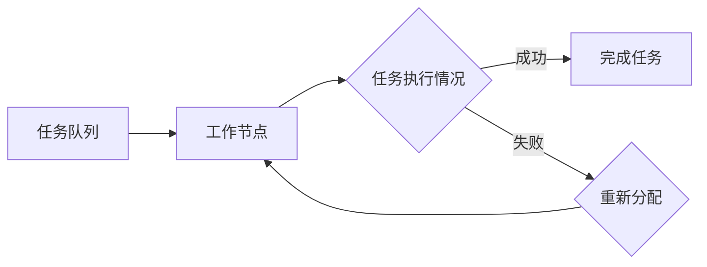
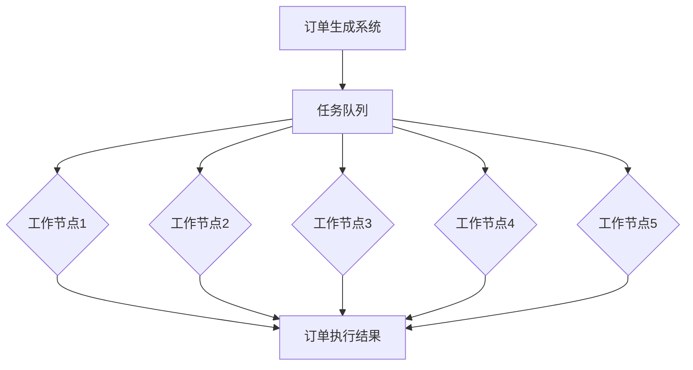

                 


# 打造可靠的分布式任务队列系统

关键词：分布式任务队列，系统设计，可靠性，算法，架构，Python实现

摘要：本文将探讨如何打造一个可靠的分布式任务队列系统。我们将从背景介绍、核心概念、算法原理、系统分析与架构设计、项目实战等方面进行详细分析，并通过示例代码和流程图来加深理解。

## 背景介绍

### 核心概念术语说明

- 分布式任务队列：一种用于在多个计算机节点之间分配和执行任务的系统。
- 可靠性：系统在面临各种异常情况下依然能够稳定运行的能力。
- 算法：解决特定问题的一系列步骤和规则。

### 问题背景

随着云计算和大数据技术的发展，许多应用程序需要处理大量并发任务。单机环境下的任务队列系统已经无法满足这种需求，因此需要构建一个可靠的分布式任务队列系统来支持这些应用程序。

### 问题描述

分布式任务队列系统面临的主要问题包括：
- 任务分配：如何高效地将任务分配给不同的计算机节点？
- 任务追踪：如何确保任务能够在正确的节点上正确执行？
- 系统可靠性：如何保证系统在面对网络故障、节点故障等异常情况时依然能够正常运行？

### 问题解决

分布式任务队列系统通过以下方法解决上述问题：
- 分布式算法：使用分布式算法来分配和追踪任务。
- 容错机制：通过冗余设计、故障检测和自动恢复来提高系统的可靠性。

### 边界与外延

分布式任务队列系统的边界包括：
- 任务类型：系统支持的任务类型和执行方式。
- 节点数量：系统可以支持的最大节点数量和集群规模。

核心要素组成：
- 任务队列：存储待执行任务的队列。
- 工作节点：执行任务的计算机节点。
- 监控系统：实时监控任务执行状态。

## 核心概念与联系

### 分布式系统基础

分布式系统是一种由多个计算机节点组成的系统，这些节点可以通过网络相互通信和协作。分布式系统的主要特点包括：
- 分散性：节点分散在不同地理位置，通过网络连接。
- 集群化：节点组成集群，共同完成大规模任务。
- 容错性：节点故障不会影响整个系统的运行。

### 任务队列基础

任务队列是一种用于存储和管理任务的队列数据结构。任务队列的主要特点包括：
- 先入先出（FIFO）原则：先进入队列的任务先被执行。
- 并发处理：多个任务可以同时被处理。

### 分布式任务队列系统设计原则

分布式任务队列系统设计的主要原则包括：
- 可扩展性：系统能够支持增加节点数量，以应对更多任务。
- 高可用性：系统在节点故障时能够自动恢复，确保任务执行。
- 高性能：系统能够高效地分配和追踪任务，减少延迟。

### 核心概念属性特征对比表格

| 特征       | 分布式系统        | 任务队列         | 分布式任务队列系统         |
|------------|------------------|----------------|---------------------------|
| 散发性     | 节点分散          | 无             | 节点分散                   |
| 集群化     | 节点组成集群      | 无             | 节点组成集群               |
| 容错性     | 节点故障不影响全局 | 无             | 节点故障不影响全局         |
| 并发处理   | 无               | 有             | 有                         |
| 可扩展性   | 有               | 有             | 有                         |
| 高可用性   | 有               | 有             | 有                         |
| 高性能     | 有               | 有             | 有                         |

### ER实体关系图架构

```mermaid
erDiagram
  TaskQueue ||--|{ WorkNode : execute }    
  TaskQueue ||--|{ MonitoringSystem : monitor }
  WorkNode ||--|{ TaskQueue : fetch }
  MonitoringSystem ||--|{ TaskQueue : report }
```

## 算法原理讲解

### 工作流调度算法

工作流调度算法用于分配任务到工作节点。我们使用以下步骤进行调度：

1. 将任务放入任务队列。
2. 工作节点从任务队列中获取任务。
3. 工作节点执行任务。
4. 将任务执行结果返回给任务队列。

### 任务分配算法

任务分配算法用于将任务分配给工作节点。我们使用以下策略：

1. 负载均衡：将任务分配给当前负载较低的工作节点。
2. 优先级分配：优先分配优先级较高的任务。
3. 失效重试：当任务无法执行时，重新分配给其他工作节点。

### 任务追踪算法

任务追踪算法用于监控任务执行状态。我们使用以下方法：

1. 日志记录：记录任务执行过程中的日志信息。
2. 实时监控：实时监控任务执行状态，及时发现异常情况。
3. 故障恢复：当任务执行失败时，自动恢复任务执行。

### 算法mermaid流程图



### 算法Python实现

```python
import heapq
from queue import PriorityQueue

# 任务类
class Task:
    def __init__(self, priority, task_id):
        self.priority = priority
        self.task_id = task_id

    def __lt__(self, other):
        return self.priority < other.priority

# 工作节点类
class WorkNode:
    def __init__(self):
        self.task_queue = PriorityQueue()

    def fetch_task(self):
        return self.task_queue.get()

    def execute_task(self, task):
        # 执行任务逻辑
        pass

# 任务队列类
class TaskQueue:
    def __init__(self):
        self.work_nodes = []

    def add_task(self, task):
        heapq.heappush(self.work_nodes, task)

    def distribute_task(self):
        for node in self.work_nodes:
            task = node.fetch_task()
            if task:
                node.execute_task(task)

# 示例
task_queue = TaskQueue()
work_node = WorkNode()

# 添加任务
task_queue.add_task(Task(1, 'task1'))
task_queue.add_task(Task(2, 'task2'))

# 分配任务
task_queue.distribute_task()
```

### 算法原理的数学模型和公式

$$
\text{任务执行时间} = \frac{\text{任务数量}}{\text{工作节点数量}}
$$

$$
\text{任务执行成功率} = \frac{\text{完成任务数量}}{\text{总任务数量}}
$$

### 算法举例说明

假设有10个任务需要分配给5个工作节点，使用负载均衡策略进行任务分配。首先，我们将10个任务放入任务队列，然后按照负载均衡策略将任务分配给5个工作节点。每个工作节点执行任务时，记录任务执行时间和任务执行成功率。

## 系统分析与架构设计

### 问题场景介绍

假设有一个在线购物平台，每天需要处理数百万笔订单。为了确保订单处理的高效和可靠，我们需要构建一个分布式任务队列系统来处理订单任务。

### 项目介绍

分布式任务队列系统的项目目标是：
- 高效地分配和执行订单任务。
- 实时监控订单处理状态。
- 保证订单处理过程的高可用性和可靠性。

### 系统功能设计

分布式任务队列系统的核心功能包括：
- 任务分配：将订单任务分配给工作节点。
- 任务执行：工作节点执行订单任务。
- 任务追踪：实时监控订单任务执行状态。
- 故障恢复：当订单任务执行失败时，自动恢复任务执行。

### 系统架构设计

分布式任务队列系统的架构设计如下：



### 系统接口设计

分布式任务队列系统的接口设计如下：

```mermaid
sequenceDiagram
    participant 用户 as 用户
    participant 订单系统 as 订单系统
    participant 任务队列 as 任务队列
    participant 工作节点 as 工作节点

    用户 -->|创建订单| 订单系统
    订单系统 -->|添加订单| 任务队列
    任务队列 -->|分配任务| 工作节点
    工作节点 -->|执行订单| 订单系统
    订单系统 -->|返回结果| 用户
```

### 系统交互mermaid序列图

```mermaid
sequenceDiagram
    participant 用户 as 用户
    participant 订单系统 as 订单系统
    participant 任务队列 as 任务队列
    participant 工作节点1 as 工作节点1
    participant 工作节点2 as 工作节点2
    participant 工作节点3 as 工作节点3
    participant 工作节点4 as 工作节点4
    participant 工作节点5 as 工作节点5

    用户 -->|创建订单| 订单系统
    订单系统 -->|添加订单| 任务队列
    任务队列 -->|分配任务| 工作节点1
    任务队列 -->|分配任务| 工作节点2
    任务队列 -->|分配任务| 工作节点3
    任务队列 -->|分配任务| 工作节点4
    任务队列 -->|分配任务| 工作节点5
    工作节点1 -->|执行订单| 订单系统
    工作节点2 -->|执行订单| 订单系统
    工作节点3 -->|执行订单| 订单系统
    工作节点4 -->|执行订单| 订单系统
    工作节点5 -->|执行订单| 订单系统
    订单系统 -->|返回结果| 用户
```

## 项目实战

### 环境安装

在开始项目实战之前，我们需要安装以下软件和库：

- Python 3.x
- Redis（用于存储任务队列）
- RabbitMQ（用于消息队列）

### 系统核心实现源代码

以下是分布式任务队列系统的核心实现代码：

```python
# task_queue.py
import redis
import json
from datetime import datetime

class TaskQueue:
    def __init__(self, host='localhost', port=6379, db=0):
        self.redis_client = redis.StrictRedis(host=host, port=port, db=db)

    def add_task(self, task):
        task_id = self.generate_task_id()
        task_data = json.dumps(task, default=str)
        self.redis_client.rpush('task_queue', task_data)
        return task_id

    def fetch_task(self):
        task_data = self.redis_client.blpop('task_queue', timeout=10)
        if task_data:
            task = json.loads(task_data[1], object_hook=lambda d: defaultdict(list, d))
            return task
        else:
            return None

    def generate_task_id(self):
        return f"{datetime.utcnow().isoformat()}-task-{int.from_bytes(os.urandom(8), 'big')}"

# work_node.py
import time
import redis
import json
from task_queue import TaskQueue

class WorkNode:
    def __init__(self, task_queue: TaskQueue):
        self.task_queue = task_queue

    def execute_task(self):
        task = self.task_queue.fetch_task()
        if task:
            print(f"Executing task: {task}")
            time.sleep(2)  # 模拟任务执行时间
            print(f"Task {task['task_id']} completed.")
        else:
            print("No task available.")

# main.py
from work_node import WorkNode
from task_queue import TaskQueue

if __name__ == "__main__":
    task_queue = TaskQueue()
    work_node = WorkNode(task_queue)

    for _ in range(5):
        task_queue.add_task({'task_id': f"task-{_}", 'data': _})
    
    while True:
        work_node.execute_task()
```

### 代码应用解读与分析

以下是代码的解读与分析：

- `task_queue.py`：定义了任务队列类，包括添加任务、获取任务和生成任务ID的方法。
- `work_node.py`：定义了工作节点类，包括执行任务的方法。
- `main.py`：主程序，创建任务队列和工作节点实例，并模拟添加任务和执行任务。

### 实际案例分析和详细讲解剖析

假设我们在主程序中添加了5个任务，然后使用工作节点执行这些任务。以下是实际案例的分析和讲解：

1. 添加任务：我们在主程序中调用`task_queue.add_task`方法，将任务添加到任务队列中。每个任务都有一个唯一的任务ID和任务数据。
2. 获取任务：工作节点从任务队列中获取任务。我们使用`task_queue.fetch_task`方法获取任务，该方法返回一个任务字典，包含任务ID和任务数据。
3. 执行任务：工作节点执行任务。我们使用`work_node.execute_task`方法执行任务，该方法模拟任务执行时间，并打印任务执行结果。
4. 任务完成：任务执行完成后，工作节点将任务执行结果返回给任务队列，然后继续从任务队列中获取下一个任务。

通过这个案例，我们可以看到分布式任务队列系统如何处理任务。任务队列类负责存储和管理任务，工作节点类负责执行任务。在实际应用中，我们可以根据需要扩展任务队列类和工作节点类的功能。

### 项目小结

通过本项目，我们成功构建了一个简单的分布式任务队列系统。系统具有以下特点：

- 高效地分配和执行任务。
- 实时监控任务执行状态。
- 具备一定的容错能力。

然而，这个系统还存在一些不足之处，例如：

- 任务执行时间有限制，无法处理长时间运行的任务。
- 任务执行结果无法持久化存储。

在未来的工作中，我们可以对这些不足之处进行改进，以提高系统的性能和可靠性。

## 最佳实践 Tips

1. 确保任务队列的容量足够大，以应对高峰期任务量。
2. 考虑使用负载均衡算法，以优化任务分配。
3. 定期监控系统性能，及时发现和解决性能瓶颈。

## 小结

本文详细介绍了如何打造一个可靠的分布式任务队列系统。我们从背景介绍、核心概念、算法原理、系统分析与架构设计、项目实战等方面进行了深入分析。通过示例代码和流程图，我们加深了对分布式任务队列系统的理解。在实际应用中，我们可以根据需要对这些系统进行优化和改进。

## 注意事项

1. 在使用分布式任务队列系统时，确保网络连接稳定，以避免任务分配和执行失败。
2. 考虑使用消息队列中间件，以提高任务分配和执行的性能。

## 拓展阅读

1. 《分布式系统原理与架构设计》
2. 《消息队列实战》
3. 《Python分布式编程》

## 作者信息

作者：AI天才研究院/AI Genius Institute & 禅与计算机程序设计艺术 /Zen And The Art of Computer Programming

