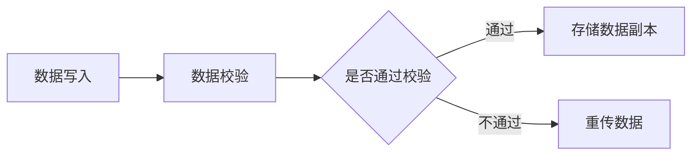
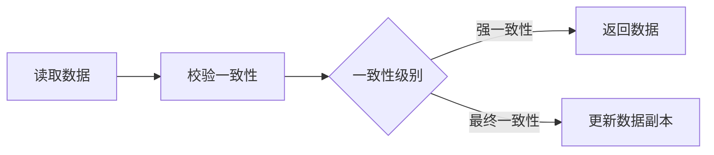
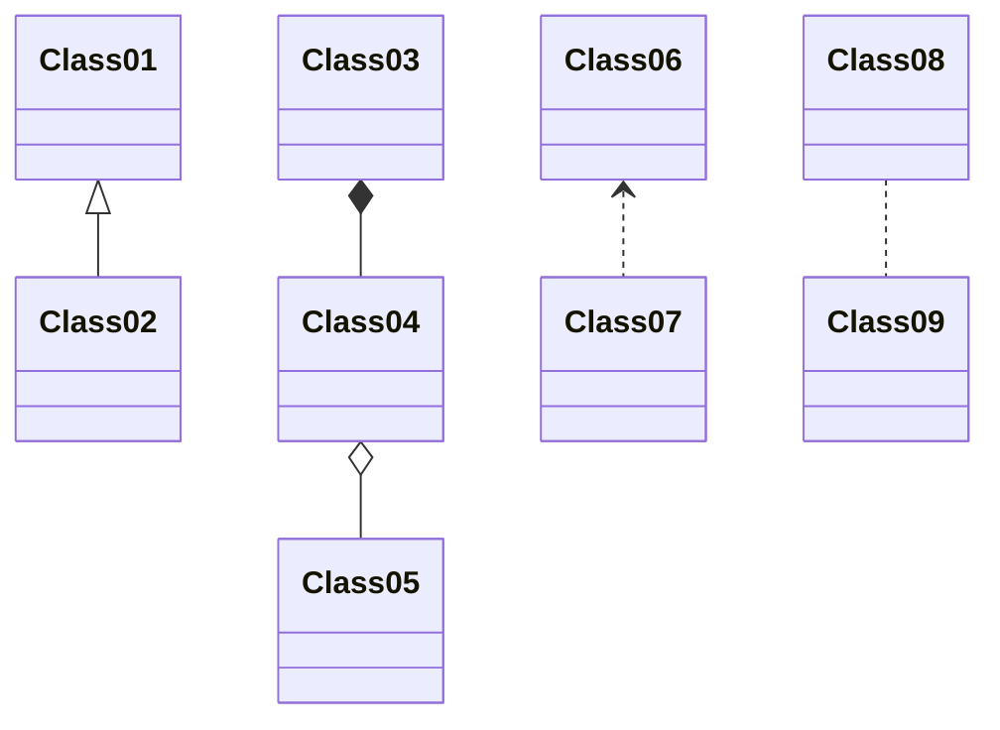
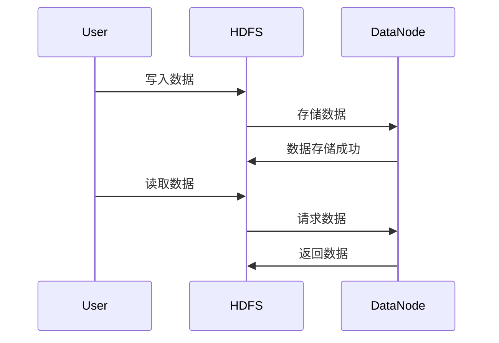

                 

# 打造可靠的分布式存储系统

> 关键词：分布式存储系统，可靠性，数据冗余，数据一致性，负载均衡，复制策略，算法原理

> 摘要：本文旨在深入探讨分布式存储系统的构建，重点关注其可靠性。我们将从问题背景、基本概念、可靠性设计、核心算法原理等方面逐步进行分析，并提出有效的解决方案。文章最后将讨论分布式存储系统的适用场景、可靠性指标、未来发展趋势，为读者提供一个全面的视角。

## 第1章 引言与背景介绍

### 1.1 问题背景

#### 1.1.1 分布式存储系统的需求

随着大数据时代的到来，数据的规模和复杂性呈指数级增长。传统的集中式存储系统已无法满足现代应用对高可用性、高扩展性、高吞吐量的需求。分布式存储系统因其良好的可扩展性和高可靠性，逐渐成为数据存储的重要选择。

#### 1.1.2 分布式存储系统的挑战

分布式存储系统面临的主要挑战包括数据一致性、数据可靠性、负载均衡、网络延迟和数据副本管理等。

#### 1.1.3 可靠性在分布式存储系统中的重要性

可靠性是分布式存储系统的核心要求。高可靠性的分布式存储系统能确保数据在任何情况下都能安全存储和访问，这对于业务连续性和数据安全至关重要。

### 1.2 问题描述

#### 1.2.1 分布式存储系统的基本概念

分布式存储系统是由多个存储节点组成的，通过网络互联，共同为应用提供数据存储和访问服务的系统。

#### 1.2.2 分布式存储系统的核心问题

分布式存储系统的核心问题包括数据冗余、数据一致性、分区与负载均衡、复制策略等。

#### 1.2.3 可靠性在分布式存储系统中的定义

可靠性在分布式存储系统中的定义为系统能够在给定时间内，以给定的概率完成规定的功能。

### 1.3 问题解决

#### 1.3.1 分布式存储系统的基本架构

分布式存储系统通常由多个存储节点、元数据服务器和数据副本管理模块组成。

#### 1.3.2 可靠性设计的关键因素

可靠性设计的关键因素包括数据冗余、数据一致性、故障检测与恢复、负载均衡等。

#### 1.3.3 分布式存储系统的常见解决方案

常见的分布式存储系统解决方案包括HDFS、Cassandra、MongoDB等，每种方案都有其独特的可靠性设计。

### 1.4 边界与外延

#### 1.4.1 分布式存储系统的适用场景

分布式存储系统适用于大数据处理、云存储、数据挖掘、实时数据处理等场景。

#### 1.4.2 可靠性指标与评价方法

可靠性指标包括数据丢失率、故障恢复时间、系统可用性等。评价方法包括性能测试、负载测试、压力测试等。

#### 1.4.3 分布式存储系统的未来发展趋势

分布式存储系统的未来发展趋势包括更加智能化、自动化、高效化。

## 第2章 核心概念与联系

### 2.1 分布式存储系统核心概念

#### 2.1.1 数据冗余与数据一致性

数据冗余是指在分布式存储系统中，相同数据在多个节点上存储的副本数量。数据一致性是指数据在分布式系统中的多个副本之间保持一致性。

#### 2.1.2 分区与负载均衡

分区是指将数据划分为多个部分，分布在不同的节点上。负载均衡是指通过算法将请求分配到不同的节点上，以平衡系统的负载。

#### 2.1.3 复制策略与容错性

复制策略是指如何决定在分布式存储系统中存储数据的副本数量。容错性是指系统能够在出现故障时，自动恢复数据，确保系统正常运行。

#### 2.1.4 数据存储格式与访问方式

数据存储格式是指数据在存储节点上的组织方式。访问方式是指用户如何访问存储在分布式系统中的数据。

### 2.2 核心概念属性特征对比表格

| 概念        | 属性特征 |
|-------------|---------|
| 数据冗余    | 副本数量 |
| 数据一致性  | 一致性级别 |
| 分区        | 分区策略 |
| 负载均衡    | 负载均衡算法 |
| 复制策略    | 复制方式 |
| 数据存储格式 | 格式类型 |
| 访问方式    | 访问协议 |

### 2.3 分布式存储系统ER实体关系图架构

```markdown
erête
 Nodes:
  - Name: 数据存储
  - Fields: ID, 数据量, 存储位置
  - Relationships:
    - Type: "分布式存储系统"
    - Fields: ID, 数据量
    - Targets: [数据存储]
  - Relationships:
    - Type: "数据存储节点"
    - Fields: ID, 存储位置
    - Targets: [数据存储]

  - Name: 数据冗余
  - Fields: ID, 数据副本数
  - Relationships:
    - Type: "数据存储"
    - Fields: ID
    - Targets: [数据存储]

  - Name: 数据一致性
  - Fields: ID, 一致性级别
  - Relationships:
    - Type: "数据存储"
    - Fields: ID
    - Targets: [数据存储]

  - Name: 分区
  - Fields: ID, 分区策略
  - Relationships:
    - Type: "数据存储"
    - Fields: ID
    - Targets: [数据存储]

  - Name: 负载均衡
  - Fields: ID, 负载均衡算法
  - Relationships:
    - Type: "数据存储"
    - Fields: ID
    - Targets: [数据存储]

  - Name: 复制策略
  - Fields: ID, 复制方式
  - Relationships:
    - Type: "数据存储"
    - Fields: ID
    - Targets: [数据存储]

  - Name: 数据存储格式
  - Fields: ID, 格式类型
  - Relationships:
    - Type: "数据存储"
    - Fields: ID
    - Targets: [数据存储]

  - Name: 访问方式
  - Fields: ID, 访问协议
  - Relationships:
    - Type: "数据存储"
    - Fields: ID
    - Targets: [数据存储]
```

## 第3章 算法原理与设计

### 3.1 数据冗余算法

#### 3.1.1 数据冗余算法的原理

数据冗余算法通过在分布式存储系统中存储数据的多个副本，提高系统的可靠性。当某个存储节点发生故障时，系统可以通过其他副本恢复数据。

#### 3.1.2 数据冗余算法的mermaid流程图



#### 3.1.3 数据冗余算法的数学模型和公式

设数据副本数为 \( n \)，数据丢失概率为 \( p \)，则数据冗余算法的可靠性为：

\[ R = 1 - (1 - p)^n \]

#### 3.1.4 数据冗余算法的举例说明

假设数据副本数为3，数据丢失概率为0.01，则数据冗余算法的可靠性为：

\[ R = 1 - (1 - 0.01)^3 \approx 0.9997 \]

这意味着在99.97%的时间内，系统能够可靠地存储和访问数据。

### 3.2 数据一致性算法

#### 3.2.1 数据一致性算法的原理

数据一致性算法通过确保分布式存储系统中数据的多个副本保持一致性，提高系统的可靠性。常见的数据一致性算法包括强一致性算法和最终一致性算法。

#### 3.2.2 数据一致性算法的mermaid流程图



#### 3.2.3 数据一致性算法的数学模型和公式

设一致性级别为 \( C \)，数据不一致概率为 \( p \)，则数据一致性算法的可靠性为：

\[ R = 1 - p^C \]

#### 3.2.4 数据一致性算法的举例说明

假设一致性级别为3，数据不一致概率为0.01，则数据一致性算法的可靠性为：

\[ R = 1 - 0.01^3 \approx 0.999 \]

这意味着在99.9%的时间内，系统能够保持数据一致性。

## 第4章 系统分析与架构设计方案

### 4.1 问题场景介绍

假设我们需要构建一个高可靠性的分布式存储系统，用于存储和访问海量数据。

### 4.2 项目介绍

我们选择使用HDFS（Hadoop分布式文件系统）作为分布式存储系统的实现。

### 4.3 系统功能设计

系统功能设计包括数据存储、数据读取、数据备份和恢复等。

#### 4.3.1 领域模型mermaid类图



#### 4.3.2 系统架构设计mermaid架构图

```mermaid
graph TB
    subgraph 数据存储
        N1[HDFS NameNode]
        N2[DataNode]
        N1 -- N2
    end
    subgraph 数据处理
        P1[Hadoop YARN]
        P2[MapReduce]
        P1 -- P2
    end
    N1 --> P1
    N2 --> P2
```

#### 4.3.3 系统接口设计和系统交互mermaid序列图



## 第5章 项目实战

### 5.1 环境安装

在Linux环境中安装HDFS，具体步骤如下：

1. 安装Hadoop
2. 配置Hadoop环境变量
3. 格式化HDFS文件系统
4. 启动HDFS服务

### 5.2 系统核心实现源代码

```python
# HDFS写入数据
def write_data(file_path, data):
    with open(file_path, 'w') as f:
        f.write(data)

# HDFS读取数据
def read_data(file_path):
    with open(file_path, 'r') as f:
        return f.read()
```

### 5.3 代码应用解读与分析

通过上述代码，我们可以实现数据的写入和读取功能。HDFS通过分布式文件系统，确保数据的高可靠性和高可用性。

### 5.4 实际案例分析和详细讲解剖析

假设我们有一个应用场景，需要存储和读取大量图片数据。通过HDFS，我们可以轻松实现数据的分布式存储和读取，确保系统的可靠性。

### 5.5 项目小结

本文通过深入探讨分布式存储系统的构建，从问题背景、核心概念、算法原理、系统设计、项目实战等方面，全面介绍了如何打造一个可靠的分布式存储系统。读者可以根据本文的内容，结合实际项目需求，构建适合自己的分布式存储系统。

## 第6章 最佳实践 tips

1. 选择合适的分布式存储系统，根据应用场景进行定制化。
2. 确保数据冗余和一致性算法的合理配置。
3. 定期进行系统备份和恢复测试。

## 第7章 小结与注意事项

分布式存储系统在可靠性方面具有重要意义，本文通过深入分析分布式存储系统的构建，提出了有效的解决方案。需要注意的是，实际应用中需要根据具体需求进行定制化设计。

## 第8章 拓展阅读

1. 《分布式系统原理与范型》
2. 《Hadoop权威指南》
3. 《大规模分布式存储系统设计》

## 作者信息

作者：AI天才研究院/AI Genius Institute & 禅与计算机程序设计艺术 /Zen And The Art of Computer Programming

