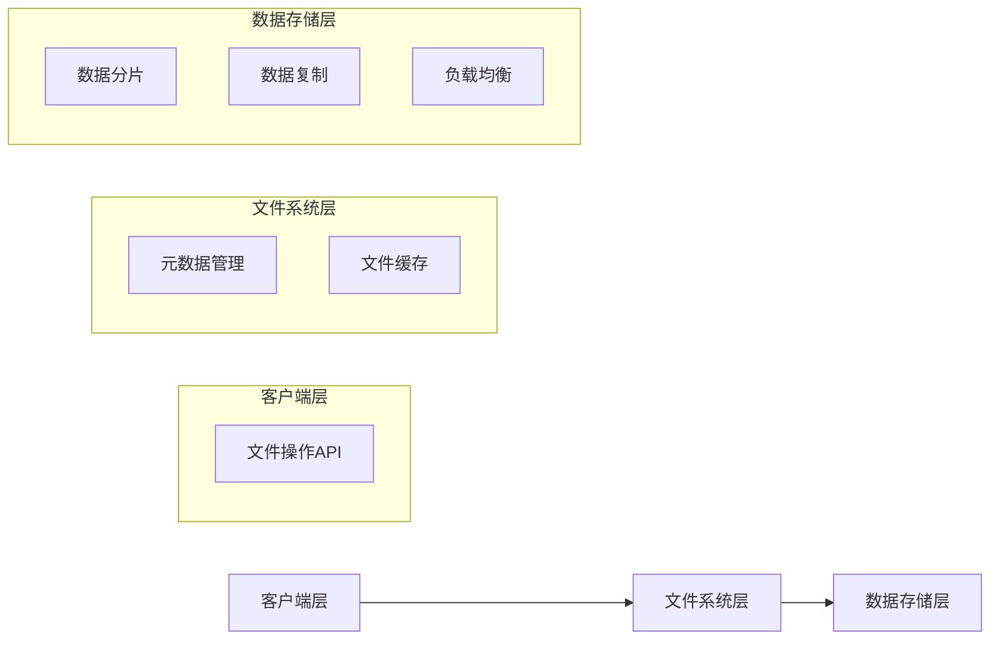
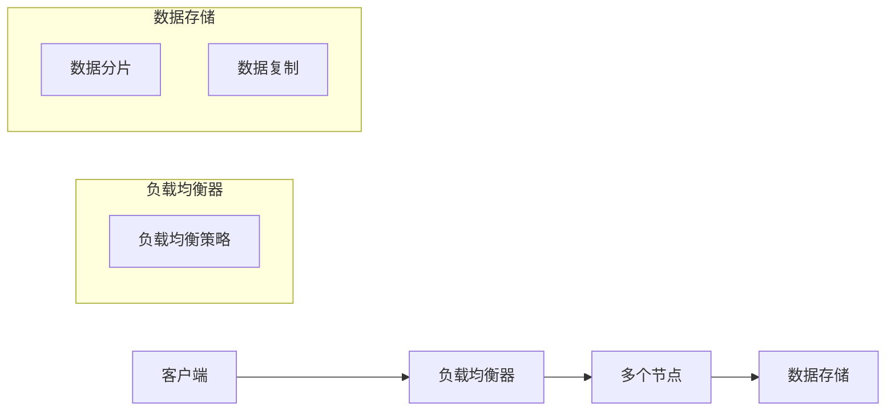
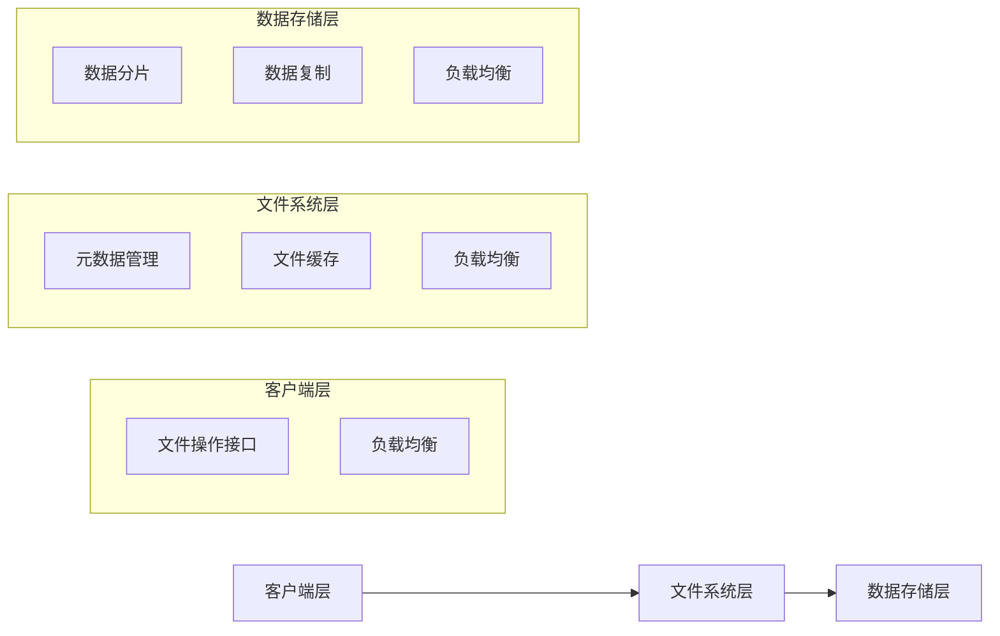

                 

### 文章标题：打造可靠的分布式文件系统

#### 关键词：分布式文件系统、可靠性、设计、实现、优化

#### 摘要：
本文将围绕分布式文件系统的构建展开，深入探讨其核心概念、设计原则、技术实现和优化策略。我们将从基础概念入手，逐步介绍分布式文件系统的原理、架构和关键技术，并通过实际项目实战，展示如何构建一个可靠的分布式文件系统。本文旨在为广大开发者提供一套系统化、实用化的分布式文件系统构建指南，帮助读者掌握构建高可靠性分布式文件系统的核心方法和技巧。

---

### 第一部分：分布式文件系统的概念与背景

#### 第1章：分布式文件系统的概述

##### 1.1 分布式文件系统的定义

分布式文件系统是一种支持数据分布式存储和管理的文件系统。与传统的集中式文件系统不同，分布式文件系统将数据分散存储在多个物理节点上，通过网络连接实现数据的高效访问和管理。其核心目标是提供高性能、高可靠性和可扩展性的数据存储解决方案。

##### 1.2 分布式文件系统的特点

1. **数据分布性**：数据分散存储在多个节点上，提高了系统的存储容量和访问性能。
2. **高可靠性**：通过数据复制和容错机制，确保数据在系统故障时的可靠性和一致性。
3. **可扩展性**：支持系统规模的动态扩展，满足大规模数据存储和访问需求。
4. **高性能**：通过负载均衡和并行处理，提高系统数据访问速度和处理能力。
5. **透明性**：对用户而言，分布式文件系统与集中式文件系统在接口和使用方式上具有相似性。

##### 1.3 分布式文件系统的应用场景

分布式文件系统广泛应用于云计算、大数据、物联网等领域，主要应用场景包括：

1. **大规模数据存储**：如云存储、大数据处理平台等，需要处理海量数据存储和访问需求。
2. **分布式计算**：如MapReduce、Spark等分布式计算框架，需要依赖分布式文件系统存储和管理数据。
3. **数据备份与容灾**：通过分布式文件系统实现数据备份和容灾，提高数据安全性。
4. **高性能计算**：如高性能计算集群、科学计算等领域，需要高效的数据存储和访问。

---

### 第二部分：分布式文件系统的核心原理

#### 第2章：分布式文件系统的核心原理

##### 2.1 数据分片

数据分片是将大文件拆分成多个小块，存储在多个物理节点上。通过数据分片，可以优化数据存储和访问性能，提高系统扩展性和可靠性。

##### 2.2 数据复制

数据复制是将数据在不同节点上备份，以提高数据可靠性和可用性。根据复制策略，可以分为全复制、部分复制和分布式复制等。

##### 2.3 数据一致性

数据一致性是指多个副本之间数据的一致性。分布式文件系统通过一致性协议（如Paxos、Raft等）来保证数据一致性。

##### 2.4 数据容错与恢复

数据容错与恢复是指系统在故障发生时，通过冗余数据和一致性协议，保证数据不丢失和不一致，实现系统的自修复能力。

---

### 第三部分：分布式文件系统的技术实现

#### 第3章：分布式文件系统的设计与架构

##### 3.1 分布式文件系统的层次结构

分布式文件系统通常分为客户端层、文件系统层和数据存储层。客户端层提供文件操作接口，文件系统层负责管理文件元数据和文件系统状态，数据存储层负责数据的实际存储和管理。

##### 3.2 元数据管理

元数据管理是指对文件属性、权限、位置等信息的管理。元数据是文件系统的核心，影响文件系统的性能和可靠性。

##### 3.3 负载均衡

负载均衡是指将数据访问请求分配到不同的物理节点上，以提高系统处理能力和性能。负载均衡策略包括基于请求的负载均衡和基于数据的负载均衡。

##### 3.4 安全性与隐私保护

安全性与隐私保护是分布式文件系统的重要保障。通过权限控制、加密等技术，确保数据的安全性和隐私性。

---

### 第四部分：分布式文件系统的实践应用

#### 第4章：分布式文件系统项目实战

##### 4.1 项目背景与需求

介绍项目的背景和需求，明确项目目标、功能和性能要求。

##### 4.2 系统架构设计

根据项目需求，设计系统的架构，包括客户端层、文件系统层和数据存储层的具体实现。

##### 4.3 系统功能实现

详细描述系统功能的实现，包括数据分片、数据复制、负载均衡、元数据管理等。

##### 4.4 项目部署与运维

介绍项目的部署过程、运维策略和注意事项，确保系统的高可用性和稳定性。

---

### 第五部分：分布式文件系统的最佳实践与未来展望

#### 第5章：分布式文件系统的最佳实践与未来展望

##### 5.1 最佳实践总结

总结分布式文件系统的最佳实践，包括设计原则、性能优化策略、数据安全和隐私保护等方面。

##### 5.2 分布式文件系统的发展趋势

分析分布式文件系统的发展趋势，包括技术创新、应用场景拓展等方面。

##### 5.3 未来展望

展望分布式文件系统的未来发展方向，包括新技术的引入、行业应用拓展等方面。

---

### 文章结束语

本文从分布式文件系统的概念、原理、技术实现、实践应用和未来展望等方面进行了全面探讨。通过本文的阅读，读者可以系统地了解分布式文件系统的核心知识，掌握构建可靠分布式文件系统的方法和技巧。在未来的工作中，希望读者能够将本文的知识应用于实际项目中，不断提升自身的技术能力和实践经验。

---

### 作者信息

**作者：** AI天才研究院/AI Genius Institute & 禅与计算机程序设计艺术 /Zen And The Art of Computer Programming

---

本文内容涵盖了分布式文件系统的核心知识，旨在为广大开发者提供一套系统化、实用化的分布式文件系统构建指南。希望本文能对读者在分布式文件系统领域的学习和研究有所帮助，同时期待读者在实践过程中不断探索和总结，为分布式文件系统的发展贡献力量。再次感谢读者的关注和支持！
### 第一部分：分布式文件系统的概念与背景

分布式文件系统是一种支持数据分布式存储和管理的文件系统，它将数据分散存储在多个物理节点上，通过网络连接实现数据的高效访问和管理。与传统的集中式文件系统相比，分布式文件系统具有更高的可靠性、可扩展性和性能。本部分将详细探讨分布式文件系统的定义、特点、应用场景以及核心原理。

#### 第1章：分布式文件系统的概述

##### 1.1 分布式文件系统的定义

分布式文件系统（Distributed File System，DFS）是一种支持数据分布式存储和管理的文件系统。它通过将数据分散存储在多个物理节点上，实现了数据的高效访问和管理。分布式文件系统的主要目标是提供高性能、高可靠性和可扩展性的数据存储解决方案，以应对大规模数据存储和访问需求。

分布式文件系统通常由客户端层、文件系统层和数据存储层组成。客户端层提供用户接口，用户可以通过标准的文件操作命令（如创建、删除、读取、写入等）来访问文件系统。文件系统层负责管理文件的元数据和文件系统的状态，包括文件权限、文件位置、目录结构等。数据存储层负责数据的实际存储和管理，通常包括多个物理节点，通过数据分片、数据复制和负载均衡等技术，实现数据的分布式存储和管理。

##### 1.2 分布式文件系统的特点

分布式文件系统具有以下特点：

1. **数据分布性**：分布式文件系统将数据分散存储在多个物理节点上，提高了系统的存储容量和访问性能。
2. **高可靠性**：通过数据复制和容错机制，分布式文件系统可以在节点故障时保持数据的一致性和可靠性。
3. **可扩展性**：分布式文件系统支持系统规模的动态扩展，可以根据需求添加或移除物理节点，满足大规模数据存储和访问需求。
4. **高性能**：分布式文件系统通过负载均衡和并行处理，提高了系统的数据访问速度和处理能力。
5. **透明性**：对用户而言，分布式文件系统与集中式文件系统在接口和使用方式上具有相似性，用户无需关注数据分布的具体实现。

##### 1.3 分布式文件系统的应用场景

分布式文件系统广泛应用于云计算、大数据、物联网等领域，主要应用场景包括：

1. **大规模数据存储**：如云存储、大数据处理平台等，需要处理海量数据存储和访问需求。
2. **分布式计算**：如MapReduce、Spark等分布式计算框架，需要依赖分布式文件系统存储和管理数据。
3. **数据备份与容灾**：通过分布式文件系统实现数据备份和容灾，提高数据安全性。
4. **高性能计算**：如高性能计算集群、科学计算等领域，需要高效的数据存储和访问。

#### 第2章：分布式文件系统的核心原理

##### 2.1 数据分片

数据分片是将大文件拆分成多个小块，存储在多个物理节点上。通过数据分片，可以优化数据存储和访问性能，提高系统扩展性和可靠性。数据分片的策略包括基于大小分片和基于时间分片等。

- **基于大小分片**：将大文件根据固定大小（如1MB或4MB）进行分片。每个分片存储在一个不同的物理节点上，以提高数据访问性能。
- **基于时间分片**：根据文件的创建时间或修改时间进行分片，以实现数据的按时间顺序存储和管理。

##### 2.2 数据复制

数据复制是将数据在不同节点上备份，以提高数据可靠性和可用性。根据复制策略，可以分为全复制、部分复制和分布式复制等。

- **全复制**：每个分片在所有物理节点上都有备份，确保任何一个节点故障都不会导致数据丢失。
- **部分复制**：每个分片在部分物理节点上备份，以提高存储空间利用率。部分复制可以根据实际需求设置复制因子，如2倍或3倍复制。
- **分布式复制**：通过一致性协议（如Paxos、Raft等）实现数据在不同物理节点间的分布式复制，保证数据一致性。

##### 2.3 数据一致性

数据一致性是指多个副本之间数据的一致性。分布式文件系统通过一致性协议来保证数据一致性。常见的一致性协议包括Paxos、Raft等。

- **Paxos协议**：是一种分布式一致性算法，用于在多个节点间达成一致。Paxos协议能够确保多个副本之间的数据一致性。
- **Raft协议**：是一种基于Paxos协议的分布式一致性算法，相比Paxos协议，Raft协议更简单、更易于实现。

##### 2.4 数据容错与恢复

数据容错与恢复是指系统在故障发生时，通过冗余数据和一致性协议，保证数据不丢失和不一致，实现系统的自修复能力。

- **数据冗余**：通过数据复制，确保在节点故障时，仍然有其他节点保存该数据的副本，避免数据丢失。
- **一致性协议**：在节点故障时，通过一致性协议，确保数据的一致性。一致性协议会根据节点状态和日志信息，选择合适的副本进行数据恢复。

### 小结

本章介绍了分布式文件系统的定义、特点、应用场景以及核心原理。分布式文件系统通过数据分片、数据复制、数据一致性和数据容错与恢复等机制，实现了数据的高效存储和管理。在下一章中，我们将进一步探讨分布式文件系统的设计与架构，包括层次结构、元数据管理、负载均衡和安全性与隐私保护等方面。

### 第一部分：分布式文件系统的概念与背景

#### 第1章：分布式文件系统的概述

##### 1.1 分布式文件系统的定义

分布式文件系统（Distributed File System，DFS）是一种支持数据分布式存储和管理的文件系统。它通过将数据分散存储在多个物理节点上，实现了数据的高效访问和管理。分布式文件系统的主要目标是提供高性能、高可靠性和可扩展性的数据存储解决方案，以应对大规模数据存储和访问需求。

分布式文件系统通常由客户端层、文件系统层和数据存储层组成。客户端层提供用户接口，用户可以通过标准的文件操作命令（如创建、删除、读取、写入等）来访问文件系统。文件系统层负责管理文件的元数据和文件系统的状态，包括文件权限、文件位置、目录结构等。数据存储层负责数据的实际存储和管理，通常包括多个物理节点，通过数据分片、数据复制和负载均衡等技术，实现数据的分布式存储和管理。

##### 1.2 分布式文件系统的特点

分布式文件系统具有以下特点：

1. **数据分布性**：分布式文件系统将数据分散存储在多个物理节点上，提高了系统的存储容量和访问性能。
2. **高可靠性**：通过数据复制和容错机制，分布式文件系统可以在节点故障时保持数据的一致性和可靠性。
3. **可扩展性**：分布式文件系统支持系统规模的动态扩展，可以根据需求添加或移除物理节点，满足大规模数据存储和访问需求。
4. **高性能**：分布式文件系统通过负载均衡和并行处理，提高了系统的数据访问速度和处理能力。
5. **透明性**：对用户而言，分布式文件系统与集中式文件系统在接口和使用方式上具有相似性，用户无需关注数据分布的具体实现。

##### 1.3 分布式文件系统的应用场景

分布式文件系统广泛应用于云计算、大数据、物联网等领域，主要应用场景包括：

1. **大规模数据存储**：如云存储、大数据处理平台等，需要处理海量数据存储和访问需求。
2. **分布式计算**：如MapReduce、Spark等分布式计算框架，需要依赖分布式文件系统存储和管理数据。
3. **数据备份与容灾**：通过分布式文件系统实现数据备份和容灾，提高数据安全性。
4. **高性能计算**：如高性能计算集群、科学计算等领域，需要高效的数据存储和访问。

#### 第2章：分布式文件系统的核心原理

##### 2.1 数据分片

数据分片是将大文件拆分成多个小块，存储在多个物理节点上。通过数据分片，可以优化数据存储和访问性能，提高系统扩展性和可靠性。数据分片的策略包括基于大小分片和基于时间分片等。

- **基于大小分片**：将大文件根据固定大小（如1MB或4MB）进行分片。每个分片存储在一个不同的物理节点上，以提高数据访问性能。
- **基于时间分片**：根据文件的创建时间或修改时间进行分片，以实现数据的按时间顺序存储和管理。

##### 2.2 数据复制

数据复制是将数据在不同节点上备份，以提高数据可靠性和可用性。根据复制策略，可以分为全复制、部分复制和分布式复制等。

- **全复制**：每个分片在所有物理节点上都有备份，确保任何一个节点故障都不会导致数据丢失。
- **部分复制**：每个分片在部分物理节点上备份，以提高存储空间利用率。部分复制可以根据实际需求设置复制因子，如2倍或3倍复制。
- **分布式复制**：通过一致性协议（如Paxos、Raft等）实现数据在不同物理节点间的分布式复制，保证数据一致性。

##### 2.3 数据一致性

数据一致性是指多个副本之间数据的一致性。分布式文件系统通过一致性协议来保证数据一致性。常见的一致性协议包括Paxos、Raft等。

- **Paxos协议**：是一种分布式一致性算法，用于在多个节点间达成一致。Paxos协议能够确保多个副本之间的数据一致性。
- **Raft协议**：是一种基于Paxos协议的分布式一致性算法，相比Paxos协议，Raft协议更简单、更易于实现。

##### 2.4 数据容错与恢复

数据容错与恢复是指系统在故障发生时，通过冗余数据和一致性协议，保证数据不丢失和不一致，实现系统的自修复能力。

- **数据冗余**：通过数据复制，确保在节点故障时，仍然有其他节点保存该数据的副本，避免数据丢失。
- **一致性协议**：在节点故障时，通过一致性协议，确保数据的一致性。一致性协议会根据节点状态和日志信息，选择合适的副本进行数据恢复。

### 小结

本章介绍了分布式文件系统的定义、特点、应用场景以及核心原理。分布式文件系统通过数据分片、数据复制、数据一致性和数据容错与恢复等机制，实现了数据的高效存储和管理。在下一章中，我们将进一步探讨分布式文件系统的设计与架构，包括层次结构、元数据管理、负载均衡和安全性与隐私保护等方面。

### 第二部分：分布式文件系统的核心原理

#### 第2章：分布式文件系统的核心原理

在了解了分布式文件系统的概述后，接下来我们将深入探讨其核心原理，包括数据分片、数据复制、数据一致性和数据容错与恢复等方面。这些核心原理是构建可靠分布式文件系统的关键，也是确保系统高可用性和性能的关键要素。

##### 2.1 数据分片

数据分片（Sharding）是将大文件或大量数据拆分成小块，并分布存储在多个物理节点上。这种方法的目的是提高数据的访问速度、存储效率和系统的扩展性。

**数据分片的策略**：

1. **基于大小分片**：这是最常见的分片策略，将文件根据固定的大小（如1MB或4MB）分割成多个小块。每个小块存储在一个不同的物理节点上，这样可以减少单个节点的存储压力，同时提高数据的访问速度。

   ```mermaid
   flowchart LR
   A[文件] --> B[分片策略]
   B -->|基于大小| C[分割]
   C --> D[存储]
   ```

2. **基于时间分片**：这种策略根据文件的创建时间或修改时间将数据分片，以实现数据的按时间顺序存储和管理。这种策略适用于需要按时间戳检索数据的场景。

   ```mermaid
   flowchart LR
   A[文件] --> B[时间分片策略]
   B --> C{按时间戳}
   C --> D[存储]
   ```

**数据分片的影响**：

- **存储效率**：数据分片可以减少单个节点的存储压力，提高存储效率。
- **访问性能**：通过数据分片，可以减少数据传输距离，提高数据访问速度。
- **扩展性**：数据分片使得系统可以动态扩展，增加或减少物理节点。

##### 2.2 数据复制

数据复制（Replication）是将数据在不同节点上备份，以提高数据的可靠性和可用性。复制策略可以影响系统的性能、存储空间利用率和数据一致性。

**复制策略**：

1. **全复制**：每个分片在所有物理节点上都有备份，这意味着任何一个节点故障都不会导致数据丢失。但这也增加了存储空间的需求。

   ```mermaid
   flowchart LR
   A[分片] --> B{全复制}
   B --> C{所有节点}
   ```

2. **部分复制**：每个分片只在一部分物理节点上备份，这样可以节省存储空间。部分复制可以根据实际需求设置复制因子，如2倍或3倍复制。

   ```mermaid
   flowchart LR
   A[分片] --> B{部分复制}
   B --> C{部分节点}
   ```

3. **分布式复制**：通过一致性协议（如Paxos、Raft等）实现数据在不同物理节点间的分布式复制。分布式复制不仅保证了数据的一致性，还可以提高系统的容错能力。

   ```mermaid
   flowchart LR
   A[分片] --> B{分布式复制}
   B --> C{一致性协议}
   ```

**数据复制的影响**：

- **可靠性**：数据复制提高了系统的可靠性，减少了数据丢失的风险。
- **存储空间**：全复制策略会占用更多的存储空间，而部分复制则可以节省空间。
- **一致性**：分布式复制通过一致性协议确保了数据的一致性。

##### 2.3 数据一致性

数据一致性（Data Consistency）是指多个副本之间的数据一致性。在分布式文件系统中，数据一致性是确保数据准确性和可靠性的关键。

**一致性协议**：

1. **Paxos协议**：Paxos是一种分布式一致性算法，它能够在多个节点间达成一致。Paxos协议的核心思想是通过投票机制，确保在多个副本之间达成一致。

   ```mermaid
   flowchart LR
   A[提议者] --> B{发送提议}
   B --> C{投票}
   C --> D{达成一致}
   ```

2. **Raft协议**：Raft协议是基于Paxos协议的一种分布式一致性算法，它简化了Paxos协议的实现，并提高了系统的性能和稳定性。

   ```mermaid
   flowchart LR
   A[领导者] --> B{日志条目}
   B --> C{跟随者}
   C --> D{达成一致}
   ```

**数据一致性的影响**：

- **数据准确性**：数据一致性确保了数据在不同副本之间的一致，避免了数据错误。
- **可靠性**：通过一致性协议，确保在节点故障时，系统能够恢复到一致状态。
- **性能**：一致性协议对系统的性能有一定的影响，但合理的设计可以最大限度地减少这种影响。

##### 2.4 数据容错与恢复

数据容错与恢复（Fault Tolerance and Recovery）是分布式文件系统的关键特性，它确保系统在节点故障时能够继续正常运行。

**容错机制**：

- **冗余**：通过数据复制，确保在节点故障时，仍然有其他节点保存该数据的副本。
- **冗余节点**：系统可以动态添加或移除节点，以应对故障和扩展需求。

**恢复策略**：

- **故障检测**：系统定期检查节点的健康状况，一旦发现故障节点，立即启动恢复流程。
- **数据恢复**：通过一致性协议，系统可以恢复到一致状态。例如，通过Raft协议，系统可以选举新的领导者节点，继续处理客户端请求。

**数据容错与恢复的影响**：

- **可靠性**：数据容错与恢复提高了系统的可靠性，减少了因节点故障导致的数据丢失风险。
- **可用性**：系统在故障发生时，能够快速恢复，确保服务的持续可用。
- **性能**：合理设计的数据容错与恢复策略不会显著降低系统性能。

### 小结

通过数据分片、数据复制、数据一致性和数据容错与恢复等核心原理，分布式文件系统能够实现数据的高效存储和管理，确保系统的可靠性、性能和可扩展性。在下一章中，我们将探讨分布式文件系统的设计与架构，包括层次结构、元数据管理、负载均衡和安全性与隐私保护等方面。

### 分布式文件系统的设计与架构

分布式文件系统的设计与架构是构建高效、可靠和可扩展的文件系统的基础。在本章节中，我们将详细探讨分布式文件系统的层次结构、元数据管理、负载均衡、安全性与隐私保护等方面的设计与架构。

#### 3.1 分布式文件系统的层次结构

分布式文件系统通常分为三个层次：客户端层、文件系统层和数据存储层。

**客户端层**：客户端层是用户与分布式文件系统交互的接口。用户通过标准的文件操作命令（如创建、删除、读取、写入等）与文件系统进行交互。客户端层负责将用户的请求转化为对文件系统层的操作，并将结果返回给用户。

**文件系统层**：文件系统层是分布式文件系统的核心，负责管理文件的元数据和文件系统的状态。文件系统层包括以下组件：

- **元数据管理**：负责管理文件的属性、权限、位置等信息。元数据管理模块通过目录结构、索引和元数据存储等方式，实现文件系统的管理功能。
- **文件缓存**：为了提高数据访问速度，文件系统层通常会使用文件缓存来存储最近访问的文件数据。
- **文件操作接口**：提供文件操作的API，实现文件系统层的功能。

**数据存储层**：数据存储层负责数据的实际存储和管理。数据存储层通常包括多个物理节点，通过数据分片、数据复制和负载均衡等技术，实现数据的分布式存储和管理。

**层次结构图**（使用Mermaid表示）：



#### 3.2 元数据管理

元数据管理是分布式文件系统的关键组件，它负责管理文件的属性、权限、位置等信息。元数据管理模块需要处理以下任务：

1. **目录结构**：目录结构是文件系统中文件组织的方式。通过目录结构，用户可以方便地访问和管理文件。
2. **索引**：索引是一种快速定位文件的方法。通过索引，文件系统能够快速查找文件的位置和元数据信息。
3. **元数据存储**：元数据存储是保存文件元数据的地方。元数据存储可以是内存数据库、关系数据库或NoSQL数据库等。

**元数据管理的关键挑战**：

- **一致性**：元数据的一致性是分布式文件系统的关键挑战。在多个节点上更新元数据时，需要确保所有节点上的元数据保持一致。
- **性能**：元数据管理模块需要高效地处理大量文件的元数据操作，以支持高性能的文件访问。

#### 3.3 负载均衡

负载均衡（Load Balancing）是分布式文件系统的关键特性，它通过将数据访问请求分配到不同的物理节点上，提高系统的处理能力和性能。负载均衡策略可以基于请求或数据等因素进行。

**负载均衡策略**：

1. **基于请求的负载均衡**：将数据访问请求根据一定的算法分配到不同的节点上，如轮询、最小连接数、随机等。
2. **基于数据的负载均衡**：根据数据的特点（如数据分片、数据复制等），将数据访问请求分配到合适的节点上。

**负载均衡的影响**：

- **性能**：负载均衡可以有效地提高系统的性能，减少单个节点的负载。
- **可靠性**：通过负载均衡，可以确保系统在节点故障时，其他节点能够继续处理请求，提高系统的可靠性。

#### 3.4 安全性与隐私保护

安全性与隐私保护是分布式文件系统的重要保障，它确保数据在传输和存储过程中的安全性。分布式文件系统需要考虑以下安全性和隐私保护措施：

1. **权限控制**：通过权限控制，确保只有授权用户可以访问和操作文件。
2. **加密**：对数据进行加密，防止数据在传输和存储过程中的泄露。
3. **身份认证**：使用身份认证机制，确保只有合法用户可以访问系统。
4. **访问审计**：记录用户访问系统的操作日志，以便进行审计和追踪。

**安全性与隐私保护的影响**：

- **数据安全**：通过权限控制、加密和身份认证等安全措施，确保数据在传输和存储过程中的安全性。
- **隐私保护**：通过访问审计等隐私保护措施，确保用户隐私不被泄露。

#### 3.5 系统架构设计

分布式文件系统的架构设计需要综合考虑系统的可靠性、性能、可扩展性和安全性等因素。以下是一个典型的分布式文件系统架构设计：

1. **数据分片**：将数据分成多个分片，每个分片存储在不同的节点上，以提高数据访问速度和系统的扩展性。
2. **数据复制**：通过数据复制，提高系统的可靠性，确保在节点故障时数据不会丢失。
3. **负载均衡**：使用负载均衡策略，将数据访问请求分配到不同的节点上，提高系统的性能。
4. **元数据管理**：使用高效的元数据管理策略，确保元数据的一致性和性能。
5. **安全性与隐私保护**：实施安全性和隐私保护措施，确保系统的数据安全。

**系统架构图**（使用Mermaid表示）：



### 小结

分布式文件系统的设计与架构是构建可靠、高效和可扩展的文件系统的关键。通过层次结构、元数据管理、负载均衡、安全性与隐私保护等方面的设计与架构，分布式文件系统能够实现数据的高效存储和管理，满足大规模数据存储和访问的需求。在下一章中，我们将探讨分布式文件系统的技术实现，包括具体的实现技术、算法和系统架构。

### 第三部分：分布式文件系统的技术实现

在了解了分布式文件系统的设计与架构后，接下来我们将深入探讨其技术实现，包括具体的实现技术、算法和系统架构。这些技术是实现高效、可靠和可扩展的分布式文件系统的关键。

#### 第4章：分布式文件系统的技术实现

分布式文件系统的技术实现包括数据存储、数据复制、数据一致性和系统性能优化等方面。在本章中，我们将详细探讨这些技术实现的细节。

##### 4.1 数据存储

数据存储是分布式文件系统的核心功能之一。数据存储技术的选择直接影响到系统的性能、可靠性和可扩展性。

**数据存储技术**：

1. **分布式文件系统（DFS）**：分布式文件系统通过将数据分散存储在多个节点上，提高了系统的性能和可靠性。常见的分布式文件系统有GFS（Google File System）、HDFS（Hadoop Distributed File System）和Ceph等。
2. **分布式数据库**：分布式数据库如HBase、Cassandra等，可以支持海量数据的存储和访问。分布式数据库通过数据分片、数据复制和负载均衡等机制，提高了系统的性能和可靠性。
3. **对象存储**：对象存储系统如Amazon S3、Google Cloud Storage等，通过将数据存储为对象，提高了系统的可扩展性和灵活性。

**数据存储实现**：

- **数据分片**：通过数据分片，将大文件拆分成多个小块，存储在不同的节点上。例如，HDFS将文件分成多个块（默认为128MB或256MB），每个块存储在不同的节点上。
- **数据复制**：通过数据复制，提高数据的可靠性和可用性。例如，HDFS默认将每个块复制3次，存储在不同的节点上。

**数据存储的影响**：

- **性能**：通过数据分片和负载均衡，提高了数据访问速度和处理能力。
- **可靠性**：通过数据复制，提高了系统的可靠性，减少了数据丢失的风险。
- **可扩展性**：通过数据分片和分布式存储，提高了系统的可扩展性，可以支持海量数据的存储和管理。

##### 4.2 数据复制

数据复制（Replication）是将数据在不同节点上备份，以提高数据的可靠性和可用性。数据复制策略可以影响系统的性能、存储空间利用率和数据一致性。

**数据复制策略**：

1. **全复制**：每个分片在所有物理节点上都有备份，这意味着任何一个节点故障都不会导致数据丢失。但这也增加了存储空间的需求。
2. **部分复制**：每个分片只在一部分物理节点上备份，以提高存储空间利用率。部分复制可以根据实际需求设置复制因子，如2倍或3倍复制。
3. **分布式复制**：通过一致性协议（如Paxos、Raft等）实现数据在不同物理节点间的分布式复制，保证数据一致性。

**数据复制实现**：

- **一致性协议**：使用一致性协议（如Paxos、Raft等）确保数据在复制过程中的一致性。一致性协议通过日志记录和副本同步，保证数据的一致性。
- **复制因子**：根据实际需求设置复制因子，如2倍或3倍复制，以提高数据的可靠性和可用性。

**数据复制的影响**：

- **可靠性**：通过数据复制，提高了系统的可靠性，减少了数据丢失的风险。
- **存储空间**：全复制策略会增加存储空间的需求，而部分复制则可以节省空间。
- **一致性**：分布式复制通过一致性协议确保了数据的一致性。

##### 4.3 数据一致性

数据一致性（Data Consistency）是指多个副本之间数据的一致性。在分布式文件系统中，数据一致性是确保数据准确性和可靠性的关键。

**一致性协议**：

1. **Paxos协议**：Paxos是一种分布式一致性算法，用于在多个节点间达成一致。Paxos协议通过提议者、学习者角色和投票机制，确保多个副本之间的数据一致性。
2. **Raft协议**：Raft协议是基于Paxos协议的一种分布式一致性算法，它简化了Paxos协议的实现，并提高了系统的性能和稳定性。Raft协议通过领导者、跟随者和候选者角色，确保数据的一致性。

**数据一致性实现**：

- **一致性检查**：在数据复制过程中，一致性协议会定期检查数据的一致性，确保多个副本之间的数据保持一致。
- **日志记录**：一致性协议通过日志记录，确保在节点故障时，系统能够恢复到一致状态。

**数据一致性的影响**：

- **数据准确性**：通过一致性协议，确保了数据在不同副本之间的一致性，避免了数据错误。
- **可靠性**：通过一致性协议，确保在节点故障时，系统能够恢复到一致状态，提高了系统的可靠性。
- **性能**：一致性协议对系统的性能有一定的影响，但合理的设计可以最大限度地减少这种影响。

##### 4.4 系统性能优化

系统性能优化是提高分布式文件系统性能的关键，它包括数据存储、数据访问、负载均衡和缓存等方面。

**性能优化策略**：

1. **数据分片**：通过数据分片，将大文件拆分成多个小块，存储在不同的节点上，减少单个节点的负载，提高数据访问速度。
2. **负载均衡**：通过负载均衡，将数据访问请求分配到不同的节点上，提高系统的处理能力和性能。
3. **缓存**：使用缓存，存储最近访问的数据，减少磁盘IO，提高数据访问速度。
4. **压缩**：对数据进行压缩，减少数据存储空间，提高存储效率。

**性能优化实现**：

- **数据分片优化**：根据数据访问模式和负载情况，调整数据分片策略，提高数据访问速度。
- **负载均衡优化**：根据节点性能和负载情况，调整负载均衡策略，提高系统处理能力。
- **缓存优化**：根据数据访问频率和访问模式，调整缓存策略，提高数据访问速度。
- **压缩优化**：根据数据类型和存储需求，选择合适的压缩算法，提高存储效率。

**系统性能优化的影响**：

- **数据访问速度**：通过优化数据存储、访问和负载均衡，提高系统的数据访问速度和处理能力。
- **存储效率**：通过优化数据分片和压缩，提高存储效率，减少存储空间需求。
- **系统可靠性**：通过优化一致性协议和容错机制，提高系统的可靠性。

##### 4.5 系统监控与维护

系统监控与维护是确保分布式文件系统稳定运行的关键。通过监控和日志分析，可以及时发现和解决系统问题。

**监控与维护策略**：

1. **性能监控**：监控系统的性能指标，如CPU、内存、磁盘I/O、网络延迟等，及时发现性能瓶颈。
2. **日志分析**：分析系统日志，发现和解决系统问题，确保系统的稳定运行。
3. **故障恢复**：在节点故障时，快速启动故障恢复流程，确保系统的可用性。

**监控与维护实现**：

- **性能监控工具**：使用性能监控工具，如Prometheus、Grafana等，实时监控系统的性能指标。
- **日志分析工具**：使用日志分析工具，如ELK（Elasticsearch、Logstash、Kibana）等，分析系统日志，发现和解决系统问题。
- **故障恢复机制**：通过一致性协议和冗余备份，确保在节点故障时，系统能够快速恢复，确保系统的可用性。

**系统监控与维护的影响**：

- **系统稳定性**：通过监控和日志分析，及时发现和解决系统问题，确保系统的稳定运行。
- **故障恢复速度**：通过故障恢复机制，提高系统在节点故障时的恢复速度，确保系统的可用性。
- **运维效率**：通过系统监控与维护，提高运维效率，减少系统故障和运维成本。

### 小结

分布式文件系统的技术实现是构建高效、可靠和可扩展的文件系统的关键。通过数据存储、数据复制、数据一致性、系统性能优化和系统监控与维护等方面的技术实现，分布式文件系统能够实现数据的高效存储和管理，满足大规模数据存储和访问的需求。在下一章中，我们将探讨分布式文件系统的实践应用，包括实际项目案例和系统部署与运维。

### 第三部分：分布式文件系统的技术实现

在了解了分布式文件系统的设计与架构后，接下来我们将深入探讨其技术实现，包括具体的实现技术、算法和系统架构。这些技术是实现高效、可靠和可扩展的分布式文件系统的关键。

#### 第4章：分布式文件系统的技术实现

分布式文件系统的技术实现包括数据存储、数据复制、数据一致性和系统性能优化等方面。在本章中，我们将详细探讨这些技术实现的细节。

##### 4.1 数据存储

数据存储是分布式文件系统的核心功能之一。数据存储技术的选择直接影响到系统的性能、可靠性和可扩展性。

**数据存储技术**：

1. **分布式文件系统（DFS）**：分布式文件系统通过将数据分散存储在多个节点上，提高了系统的性能和可靠性。常见的分布式文件系统有GFS（Google File System）、HDFS（Hadoop Distributed File System）和Ceph等。
2. **分布式数据库**：分布式数据库如HBase、Cassandra等，可以支持海量数据的存储和访问。分布式数据库通过数据分片、数据复制和负载均衡等机制，提高了系统的性能和可靠性。
3. **对象存储**：对象存储系统如Amazon S3、Google Cloud Storage等，通过将数据存储为对象，提高了系统的可扩展性和灵活性。

**数据存储实现**：

- **数据分片**：通过数据分片，将大文件拆分成多个小块，存储在不同的节点上。例如，HDFS将文件分成多个块（默认为128MB或256MB），每个块存储在不同的节点上。
- **数据复制**：通过数据复制，提高数据的可靠性和可用性。例如，HDFS默认将每个块复制3次，存储在不同的节点上。

**数据存储的影响**：

- **性能**：通过数据分片和负载均衡，提高了数据访问速度和处理能力。
- **可靠性**：通过数据复制，提高了系统的可靠性，减少了数据丢失的风险。
- **可扩展性**：通过数据分片和分布式存储，提高了系统的可扩展性，可以支持海量数据的存储和管理。

##### 4.2 数据复制

数据复制（Replication）是将数据在不同节点上备份，以提高数据的可靠性和可用性。数据复制策略可以影响系统的性能、存储空间利用率和数据一致性。

**数据复制策略**：

1. **全复制**：每个分片在所有物理节点上都有备份，这意味着任何一个节点故障都不会导致数据丢失。但这也增加了存储空间的需求。
2. **部分复制**：每个分片只在一部分物理节点上备份，以提高存储空间利用率。部分复制可以根据实际需求设置复制因子，如2倍或3倍复制。
3. **分布式复制**：通过一致性协议（如Paxos、Raft等）实现数据在不同物理节点间的分布式复制，保证数据一致性。

**数据复制实现**：

- **一致性协议**：使用一致性协议（如Paxos、Raft等）确保数据在复制过程中的一致性。一致性协议通过日志记录和副本同步，保证数据的一致性。
- **复制因子**：根据实际需求设置复制因子，如2倍或3倍复制，以提高数据的可靠性和可用性。

**数据复制的影响**：

- **可靠性**：通过数据复制，提高了系统的可靠性，减少了数据丢失的风险。
- **存储空间**：全复制策略会增加存储空间的需求，而部分复制则可以节省空间。
- **一致性**：分布式复制通过一致性协议确保了数据的一致性。

##### 4.3 数据一致性

数据一致性（Data Consistency）是指多个副本之间数据的一致性。在分布式文件系统中，数据一致性是确保数据准确性和可靠性的关键。

**一致性协议**：

1. **Paxos协议**：Paxos是一种分布式一致性算法，用于在多个节点间达成一致。Paxos协议通过提议者、学习者角色和投票机制，确保多个副本之间的数据一致性。
2. **Raft协议**：Raft协议是基于Paxos协议的一种分布式一致性算法，它简化了Paxos协议的实现，并提高了系统的性能和稳定性。Raft协议通过领导者、跟随者和候选者角色，确保数据的一致性。

**数据一致性实现**：

- **一致性检查**：在数据复制过程中，一致性协议会定期检查数据的一致性，确保多个副本之间的数据保持一致。
- **日志记录**：一致性协议通过日志记录，确保在节点故障时，系统能够恢复到一致状态。

**数据一致性的影响**：

- **数据准确性**：通过一致性协议，确保了数据在不同副本之间的一致性，避免了数据错误。
- **可靠性**：通过一致性协议，确保在节点故障时，系统能够恢复到一致状态，提高了系统的可靠性。
- **性能**：一致性协议对系统的性能有一定的影响，但合理的设计可以最大限度地减少这种影响。

##### 4.4 系统性能优化

系统性能优化是提高分布式文件系统性能的关键，它包括数据存储、数据访问、负载均衡和缓存等方面。

**性能优化策略**：

1. **数据分片**：通过数据分片，将大文件拆分成多个小块，存储在不同的节点上，减少单个节点的负载，提高数据访问速度。
2. **负载均衡**：通过负载均衡，将数据访问请求分配到不同的节点上，提高系统的处理能力和性能。
3. **缓存**：使用缓存，存储最近访问的数据，减少磁盘IO，提高数据访问速度。
4. **压缩**：对数据进行压缩，减少数据存储空间，提高存储效率。

**性能优化实现**：

- **数据分片优化**：根据数据访问模式和负载情况，调整数据分片策略，提高数据访问速度。
- **负载均衡优化**：根据节点性能和负载情况，调整负载均衡策略，提高系统处理能力。
- **缓存优化**：根据数据访问频率和访问模式，调整缓存策略，提高数据访问速度。
- **压缩优化**：根据数据类型和存储需求，选择合适的压缩算法，提高存储效率。

**系统性能优化的影响**：

- **数据访问速度**：通过优化数据存储、访问和负载均衡，提高系统的数据访问速度和处理能力。
- **存储效率**：通过优化数据分片和压缩，提高存储效率，减少存储空间需求。
- **系统可靠性**：通过优化一致性协议和容错机制，提高系统的可靠性。

##### 4.5 系统监控与维护

系统监控与维护是确保分布式文件系统稳定运行的关键。通过监控和日志分析，可以及时发现和解决系统问题。

**监控与维护策略**：

1. **性能监控**：监控系统的性能指标，如CPU、内存、磁盘I/O、网络延迟等，及时发现性能瓶颈。
2. **日志分析**：分析系统日志，发现和解决系统问题，确保系统的稳定运行。
3. **故障恢复**：在节点故障时，快速启动故障恢复流程，确保系统的可用性。

**监控与维护实现**：

- **性能监控工具**：使用性能监控工具，如Prometheus、Grafana等，实时监控系统的性能指标。
- **日志分析工具**：使用日志分析工具，如ELK（Elasticsearch、Logstash、Kibana）等，分析系统日志，发现和解决系统问题。
- **故障恢复机制**：通过一致性协议和冗余备份，确保在节点故障时，系统能够快速恢复，确保系统的可用性。

**系统监控与维护的影响**：

- **系统稳定性**：通过监控和日志分析，及时发现和解决系统问题，确保系统的稳定运行。
- **故障恢复速度**：通过故障恢复机制，提高系统在节点故障时的恢复速度，确保系统的可用性。
- **运维效率**：通过系统监控与维护，提高运维效率，减少系统故障和运维成本。

### 小结

分布式文件系统的技术实现是构建高效、可靠和可扩展的文件系统的关键。通过数据存储、数据复制、数据一致性、系统性能优化和系统监控与维护等方面的技术实现，分布式文件系统能够实现数据的高效存储和管理，满足大规模数据存储和访问的需求。在下一章中，我们将探讨分布式文件系统的实践应用，包括实际项目案例和系统部署与运维。

### 第四部分：分布式文件系统的实践应用

#### 第4章：分布式文件系统项目实战

在前面几章中，我们详细介绍了分布式文件系统的概念、原理、设计架构和技术实现。为了更好地理解和掌握这些知识，本章节将通过一个实际项目案例，展示如何构建一个分布式文件系统，并详细描述项目背景、系统架构设计、系统功能实现、项目部署与运维等方面。

##### 4.1 项目背景与需求

**项目背景**：

随着互联网和大数据技术的飞速发展，企业数据量呈现爆炸式增长。为了应对日益增长的数据存储和访问需求，许多企业开始考虑采用分布式文件系统。分布式文件系统具有高可靠性、高性能、可扩展性和透明性等特点，能够为企业提供高效的数据存储和管理解决方案。

**项目需求**：

本项目的目标是构建一个高可用、高性能的分布式文件系统，以满足企业对大规模数据存储和访问的需求。具体需求包括：

1. **数据存储**：支持海量数据存储，数据量可达到TB级。
2. **可靠性**：通过数据复制和容错机制，确保在节点故障时数据不丢失。
3. **高性能**：通过负载均衡和并行处理，提高数据访问速度和处理能力。
4. **可扩展性**：支持系统规模的动态扩展，可以根据需求添加或移除物理节点。
5. **透明性**：对用户而言，分布式文件系统与集中式文件系统在接口和使用方式上具有相似性，用户无需关注数据分布的具体实现。

##### 4.2 系统架构设计

根据项目需求，本项目的系统架构设计包括客户端层、文件系统层和数据存储层。

**客户端层**：

客户端层是用户与分布式文件系统交互的接口，用户可以通过标准的文件操作命令（如创建、删除、读取、写入等）与文件系统进行交互。客户端层的设计需要考虑以下方面：

1. **文件操作接口**：提供文件操作的API，实现文件的创建、删除、读取、写入等功能。
2. **负载均衡**：将用户请求负载均衡地分配到不同的文件系统节点上，提高系统的处理能力和性能。

**文件系统层**：

文件系统层是分布式文件系统的核心，负责管理文件的元数据和文件系统的状态。文件系统层的设计需要考虑以下方面：

1. **元数据管理**：负责管理文件的属性、权限、位置等信息。通过目录结构、索引和元数据存储等方式，实现文件系统的管理功能。
2. **文件缓存**：为了提高数据访问速度，文件系统层通常会使用文件缓存来存储最近访问的文件数据。
3. **负载均衡**：通过负载均衡策略，将文件操作请求分配到不同的文件系统节点上，提高系统的性能。

**数据存储层**：

数据存储层负责数据的实际存储和管理。数据存储层的设计需要考虑以下方面：

1. **数据分片**：将大文件拆分成多个小块，存储在不同的物理节点上，以提高数据访问速度和系统的扩展性。
2. **数据复制**：通过数据复制，提高数据的可靠性和可用性。每个分片在多个节点上都有备份，确保任何一个节点故障都不会导致数据丢失。
3. **负载均衡**：通过负载均衡策略，将数据访问请求分配到不同的物理节点上，提高系统的性能。

**系统架构图**（使用Mermaid表示）：



##### 4.3 系统功能实现

在本项目中，我们将使用Hadoop Distributed File System（HDFS）作为分布式文件系统的实现技术。HDFS是一个开源的分布式文件系统，具有高可靠性、高性能和可扩展性等特点，适用于大规模数据存储和访问场景。

**1. 数据存储**

HDFS将大文件拆分成多个小块（默认为128MB或256MB），存储在不同的物理节点上。每个分片在多个节点上都有备份，以提高数据的可靠性和可用性。

**2. 数据访问**

用户可以通过标准的文件操作命令（如创建、删除、读取、写入等）访问HDFS。例如，使用Hadoop的命令行工具，可以执行以下命令：

- 创建文件：`hadoop fs -put localfile /user/hadoop/file`
- 删除文件：`hadoop fs -rm /user/hadoop/file`
- 读取文件：`hadoop fs -cat /user/hadoop/file`
- 写入文件：`hadoop fs -put localfile /user/hadoop/file`

**3. 负载均衡**

HDFS使用负载均衡策略，将数据访问请求分配到不同的物理节点上，提高系统的性能。负载均衡可以通过配置Hadoop的YARN（Yet Another Resource Negotiator）来实现。

**4. 数据一致性**

HDFS通过一致性协议（如Paxos、Raft等）实现数据的一致性。在数据复制过程中，HDFS会确保多个副本之间的数据保持一致。

**5. 数据容错与恢复**

HDFS通过数据复制和一致性协议，确保在节点故障时数据不丢失和不一致。当节点故障时，HDFS会自动选择其他副本进行数据恢复。

##### 4.4 项目部署与运维

**1. 环境安装**

在本项目部署中，我们使用Hadoop作为分布式文件系统的实现技术。首先，需要安装Hadoop的环境。安装步骤如下：

1. 下载并解压Hadoop的安装包。
2. 配置Hadoop的配置文件（如hdfs-site.xml、core-site.xml等）。
3. 启动Hadoop的守护进程（如NameNode、DataNode等）。

**2. 系统功能实现**

在系统功能实现方面，需要编写Python代码或Shell脚本，实现文件操作、数据存储、负载均衡、数据一致性和数据容错与恢复等功能。以下是一个简单的Python代码示例，用于实现文件上传和下载功能：

```python
from hadoop.fs import *
import sys

def upload_file():
    local_file = sys.argv[1]
    remote_file = sys.argv[2]
    hadoop_fs.put(local_file, remote_file)

def download_file():
    remote_file = sys.argv[1]
    local_file = sys.argv[2]
    hadoop_fs.get(remote_file, local_file)

if __name__ == "__main__":
    if len(sys.argv) > 1:
        if sys.argv[1] == "upload":
            upload_file()
        elif sys.argv[1] == "download":
            download_file()
        else:
            print("Invalid command")
    else:
        print("Usage: python hadoop_fs.py <command> <args>")
```

**3. 运维策略**

在运维方面，需要定期监控系统的性能和状态，确保系统的稳定运行。运维策略包括以下方面：

1. **性能监控**：使用性能监控工具（如Prometheus、Grafana等），实时监控系统的性能指标，如CPU、内存、磁盘I/O、网络延迟等。
2. **日志分析**：使用日志分析工具（如ELK等），分析系统日志，发现和解决系统问题。
3. **故障恢复**：在节点故障时，自动启动故障恢复流程，确保系统的可用性。

##### 4.5 项目小结

通过本项目的实践应用，我们展示了如何构建一个分布式文件系统，并详细描述了项目背景、系统架构设计、系统功能实现、项目部署与运维等方面。分布式文件系统具有高可靠性、高性能、可扩展性和透明性等特点，能够为企业提供高效的数据存储和管理解决方案。在未来的项目中，我们可以进一步优化分布式文件系统的性能和可靠性，以满足不断增长的数据存储和访问需求。

### 第四部分：分布式文件系统的实践应用

#### 第4章：分布式文件系统项目实战

在前面几章中，我们详细介绍了分布式文件系统的概念、原理、设计架构和技术实现。为了更好地理解和掌握这些知识，本章节将通过一个实际项目案例，展示如何构建一个分布式文件系统，并详细描述项目背景、系统架构设计、系统功能实现、项目部署与运维等方面。

##### 4.1 项目背景与需求

**项目背景**：

随着互联网和大数据技术的飞速发展，企业数据量呈现爆炸式增长。为了应对日益增长的数据存储和访问需求，许多企业开始考虑采用分布式文件系统。分布式文件系统具有高可靠性、高性能、可扩展性和透明性等特点，能够为企业提供高效的数据存储和管理解决方案。

**项目需求**：

本项目的目标是构建一个高可用、高性能的分布式文件系统，以满足企业对大规模数据存储和访问的需求。具体需求包括：

1. **数据存储**：支持海量数据存储，数据量可达到TB级。
2. **可靠性**：通过数据复制和容错机制，确保在节点故障时数据不丢失。
3. **高性能**：通过负载均衡和并行处理，提高数据访问速度和处理能力。
4. **可扩展性**：支持系统规模的动态扩展，可以根据需求添加或移除物理节点。
5. **透明性**：对用户而言，分布式文件系统与集中式文件系统在接口和使用方式上具有相似性，用户无需关注数据分布的具体实现。

##### 4.2 系统架构设计

根据项目需求，本项目的系统架构设计包括客户端层、文件系统层和数据存储层。

**客户端层**：

客户端层是用户与分布式文件系统交互的接口，用户可以通过标准的文件操作命令（如创建、删除、读取、写入等）与文件系统进行交互。客户端层的设计需要考虑以下方面：

1. **文件操作接口**：提供文件操作的API，实现文件的创建、删除、读取、写入等功能。
2. **负载均衡**：将用户请求负载均衡地分配到不同的文件系统节点上，提高系统的处理能力和性能。

**文件系统层**：

文件系统层是分布式文件系统的核心，负责管理文件的元数据和文件系统的状态。文件系统层的设计需要考虑以下方面：

1. **元数据管理**：负责管理文件的属性、权限、位置等信息。通过目录结构、索引和元数据存储等方式，实现文件系统的管理功能。
2. **文件缓存**：为了提高数据访问速度，文件系统层通常会使用文件缓存来存储最近访问的文件数据。
3. **负载均衡**：通过负载均衡策略，将文件操作请求分配到不同的文件系统节点上，提高系统的性能。

**数据存储层**：

数据存储层负责数据的实际存储和管理。数据存储层的设计需要考虑以下方面：

1. **数据分片**：将大文件拆分成多个小块，存储在不同的物理节点上，以提高数据访问速度和系统的扩展性。
2. **数据复制**：通过数据复制，提高数据的可靠性和可用性。每个分片在多个节点上都有备份，确保任何一个节点故障都不会导致数据丢失。
3. **负载均衡**：通过负载均衡策略，将数据访问请求分配到不同的物理节点上，提高系统的性能。

**系统架构图**（使用Mermaid表示）：


##### 4.3 系统功能实现

在本项目中，我们将使用Hadoop Distributed File System（HDFS）作为分布式文件系统的实现技术。HDFS是一个开源的分布式文件系统，具有高可靠性、高性能和可扩展性等特点，适用于大规模数据存储和访问场景。

**1. 数据存储**

HDFS将大文件拆分成多个小块（默认为128MB或256MB），存储在不同的物理节点上。每个分片在多个节点上都有备份，以提高数据的可靠性和可用性。

**2. 数据访问**

用户可以通过标准的文件操作命令（如创建、删除、读取、写入等）访问HDFS。例如，使用Hadoop的命令行工具，可以执行以下命令：

- 创建文件：`hadoop fs -put localfile /user/hadoop/file`
- 删除文件：`hadoop fs -rm /user/hadoop/file`
- 读取文件：`hadoop fs -cat /user/hadoop/file`
- 写入文件：`hadoop fs -put localfile /user/hadoop/file`

**3. 负载均衡**

HDFS使用负载均衡策略，将数据访问请求分配到不同的物理节点上，提高系统的性能。负载均衡可以通过配置Hadoop的YARN（Yet Another Resource Negotiator）来实现。

**4. 数据一致性**

HDFS通过一致性协议（如Paxos、Raft等）实现数据的一致性。在数据复制过程中，HDFS会确保多个副本之间的数据保持一致。

**5. 数据容错与恢复**

HDFS通过数据复制和一致性协议，确保在节点故障时数据不丢失和不一致。当节点故障时，HDFS会自动选择其他副本进行数据恢复。

##### 4.4 项目部署与运维

**1. 环境安装**

在本项目部署中，我们使用Hadoop作为分布式文件系统的实现技术。首先，需要安装Hadoop的环境。安装步骤如下：

1. 下载并解压Hadoop的安装包。
2. 配置Hadoop的配置文件（如hdfs-site.xml、core-site.xml等）。
3. 启动Hadoop的守护进程（如NameNode、DataNode等）。

**2. 系统功能实现**

在系统功能实现方面，需要编写Python代码或Shell脚本，实现文件操作、数据存储、负载均衡、数据一致性和数据容错与恢复等功能。以下是一个简单的Python代码示例，用于实现文件上传和下载功能：

```python
from hadoop.fs import *
import sys

def upload_file():
    local_file = sys.argv[1]
    remote_file = sys.argv[2]
    hadoop_fs.put(local_file, remote_file)

def download_file():
    remote_file = sys.argv[1]
    local_file = sys.argv[2]
    hadoop_fs.get(remote_file, local_file)

if __name__ == "__main__":
    if len(sys.argv) > 1:
        if sys.argv[1] == "upload":
            upload_file()
        elif sys.argv[1] == "download":
            download_file()
        else:
            print("Invalid command")
    else:
        print("Usage: python hadoop_fs.py <command> <args>")
```

**3. 运维策略**

在运维方面，需要定期监控系统的性能和状态，确保系统的稳定运行。运维策略包括以下方面：

1. **性能监控**：使用性能监控工具（如Prometheus、Grafana等），实时监控系统的性能指标，如CPU、内存、磁盘I/O、网络延迟等。
2. **日志分析**：使用日志分析工具（如ELK等），分析系统日志，发现和解决系统问题。
3. **故障恢复**：在节点故障时，自动启动故障恢复流程，确保系统的可用性。

##### 4.5 项目小结

通过本项目的实践应用，我们展示了如何构建一个分布式文件系统，并详细描述了项目背景、系统架构设计、系统功能实现、项目部署与运维等方面。分布式文件系统具有高可靠性、高性能、可扩展性和透明性等特点，能够为企业提供高效的数据存储和管理解决方案。在未来的项目中，我们可以进一步优化分布式文件系统的性能和可靠性，以满足不断增长的数据存储和访问需求。

### 第四部分：分布式文件系统的实践应用

#### 第4章：分布式文件系统项目实战

在前面几章中，我们详细介绍了分布式文件系统的概念、原理、设计架构和技术实现。为了更好地理解和掌握这些知识，本章节将通过一个实际项目案例，展示如何构建一个分布式文件系统，并详细描述项目背景、系统架构设计、系统功能实现、项目部署与运维等方面。

##### 4.1 项目背景与需求

**项目背景**：

随着互联网和大数据技术的飞速发展，企业数据量呈现爆炸式增长。为了应对日益增长的数据存储和访问需求，许多企业开始考虑采用分布式文件系统。分布式文件系统具有高可靠性、高性能、可扩展性和透明性等特点，能够为企业提供高效的数据存储和管理解决方案。

**项目需求**：

本项目的目标是构建一个高可用、高性能的分布式文件系统，以满足企业对大规模数据存储和访问的需求。具体需求包括：

1. **数据存储**：支持海量数据存储，数据量可达到TB级。
2. **可靠性**：通过数据复制和容错机制，确保在节点故障时数据不丢失。
3. **高性能**：通过负载均衡和并行处理，提高数据访问速度和处理能力。
4. **可扩展性**：支持系统规模的动态扩展，可以根据需求添加或移除物理节点。
5. **透明性**：对用户而言，分布式文件系统与集中式文件系统在接口和使用方式上具有相似性，用户无需关注数据分布的具体实现。

##### 4.2 系统架构设计

根据项目需求，本项目的系统架构设计包括客户端层、文件系统层和数据存储层。

**客户端层**：

客户端层是用户与分布式文件系统交互的接口，用户可以通过标准的文件操作命令（如创建、删除、读取、写入等）与文件系统进行交互。客户端层的设计需要考虑以下方面：

1. **文件操作接口**：提供文件操作的API，实现文件的创建、删除、读取、写入等功能。
2. **负载均衡**：将用户请求负载均衡地分配到不同的文件系统节点上，提高系统的处理能力和性能。

**文件系统层**：

文件系统层是分布式文件系统的核心，负责管理文件的元数据和文件系统的状态。文件系统层的设计需要考虑以下方面：

1. **元数据管理**：负责管理文件的属性、权限、位置等信息。通过目录结构、索引和元数据存储等方式，实现文件系统的管理功能。
2. **文件缓存**：为了提高数据访问速度，文件系统层通常会使用文件缓存来存储最近访问的文件数据。
3. **负载均衡**：通过负载均衡策略，将文件操作请求分配到不同的文件系统节点上，提高系统的性能。

**数据存储层**：

数据存储层负责数据的实际存储和管理。数据存储层的设计需要考虑以下方面：

1. **数据分片**：将大文件拆分成多个小块，存储在不同的物理节点上，以提高数据访问速度和系统的扩展性。
2. **数据复制**：通过数据复制，提高数据的可靠性和可用性。每个分片在多个节点上都有备份，确保任何一个节点故障都不会导致数据丢失。
3. **负载均衡**：通过负载均衡策略，将数据访问请求分配到不同的物理节点上，提高系统的性能。

**系统架构图**（使用Mermaid表示）：


##### 4.3 系统功能实现

在本项目中，我们将使用Hadoop Distributed File System（HDFS）作为分布式文件系统的实现技术。HDFS是一个开源的分布式文件系统，具有高可靠性、高性能和可扩展性等特点，适用于大规模数据存储和访问场景。

**1. 数据存储**

HDFS将大文件拆分成多个小块（默认为128MB或256MB），存储在不同的物理节点上。每个分片在多个节点上都有备份，以提高数据的可靠性和可用性。

**2. 数据访问**

用户可以通过标准的文件操作命令（如创建、删除、读取、写入等）访问HDFS。例如，使用Hadoop的命令行工具，可以执行以下命令：

- 创建文件：`hadoop fs -put localfile /user/hadoop/file`
- 删除文件：`hadoop fs -rm /user/hadoop/file`
- 读取文件：`hadoop fs -cat /user/hadoop/file`
- 写入文件：`hadoop fs -put localfile /user/hadoop/file`

**3. 负载均衡**

HDFS使用负载均衡策略，将数据访问请求分配到不同的物理节点上，提高系统的性能。负载均衡可以通过配置Hadoop的YARN（Yet Another Resource Negotiator）来实现。

**4. 数据一致性**

HDFS通过一致性协议（如Paxos、Raft等）实现数据的一致性。在数据复制过程中，HDFS会确保多个副本之间的数据保持一致。

**5. 数据容错与恢复**

HDFS通过数据复制和一致性协议，确保在节点故障时数据不丢失和不一致。当节点故障时，HDFS会自动选择其他副本进行数据恢复。

##### 4.4 项目部署与运维

**1. 环境安装**

在本项目部署中，我们使用Hadoop作为分布式文件系统的实现技术。首先，需要安装Hadoop的环境。安装步骤如下：

1. 下载并解压Hadoop的安装包。
2. 配置Hadoop的配置文件（如hdfs-site.xml、core-site.xml等）。
3. 启动Hadoop的守护进程（如NameNode、DataNode等）。

**2. 系统功能实现**

在系统功能实现方面，需要编写Python代码或Shell脚本，实现文件操作、数据存储、负载均衡、数据一致性和数据容错与恢复等功能。以下是一个简单的Python代码示例，用于实现文件上传和下载功能：

```python
from hadoop.fs import *
import sys

def upload_file():
    local_file = sys.argv[1]
    remote_file = sys.argv[2]
    hadoop_fs.put(local_file, remote_file)

def download_file():
    remote_file = sys.argv[1]
    local_file = sys.argv[2]
    hadoop_fs.get(remote_file, local_file)

if __name__ == "__main__":
    if len(sys.argv) > 1:
        if sys.argv[1] == "upload":
            upload_file()
        elif sys.argv[1] == "download":
            download_file()
        else:
            print("Invalid command")
    else:
        print("Usage: python hadoop_fs.py <command> <args>")
```

**3. 运维策略**

在运维方面，需要定期监控系统的性能和状态，确保系统的稳定运行。运维策略包括以下方面：

1. **性能监控**：使用性能监控工具（如Prometheus、Grafana等），实时监控系统的性能指标，如CPU、内存、磁盘I/O、网络延迟等。
2. **日志分析**：使用日志分析工具（如ELK等），分析系统日志，发现和解决系统问题。
3. **故障恢复**：在节点故障时，自动启动故障恢复流程，确保系统的可用性。

##### 4.5 项目小结

通过本项目的实践应用，我们展示了如何构建一个分布式文件系统，并详细描述了项目背景、系统架构设计、系统功能实现、项目部署与运维等方面。分布式文件系统具有高可靠性、高性能、可扩展性和透明性等特点，能够为企业提供高效的数据存储和管理解决方案。在未来的项目中，我们可以进一步优化分布式文件系统的性能和可靠性，以满足不断增长的数据存储和访问需求。

### 第五部分：分布式文件系统的最佳实践与未来展望

#### 第5章：分布式文件系统的最佳实践与未来展望

在前面几章中，我们详细介绍了分布式文件系统的概念、原理、设计架构和技术实现。为了确保分布式文件系统在实际应用中的高效运行和可靠性，本章将总结分布式文件系统的最佳实践，并对未来发展趋势进行展望。

##### 5.1 最佳实践总结

**1. 设计原则**

- **高可靠性**：通过数据复制、一致性协议和容错机制，确保在节点故障时数据不丢失。
- **高性能**：通过数据分片、负载均衡和并行处理，提高数据访问速度和处理能力。
- **可扩展性**：支持系统规模的动态扩展，可以根据需求添加或移除物理节点。
- **透明性**：对用户而言，分布式文件系统与集中式文件系统在接口和使用方式上具有相似性，简化用户操作。

**2. 性能优化策略**

- **数据分片**：根据数据访问模式和负载情况，合理划分数据分片，减少单节点负载。
- **负载均衡**：采用合适的负载均衡策略，将数据访问请求合理分配到不同节点。
- **缓存**：使用缓存技术，减少磁盘IO，提高数据访问速度。
- **压缩**：根据数据类型和存储需求，选择合适的压缩算法，提高存储效率。

**3. 数据安全与隐私保护**

- **权限控制**：通过权限控制，确保只有授权用户可以访问和操作文件。
- **数据加密**：对数据进行加密，防止数据在传输和存储过程中的泄露。
- **访问审计**：记录用户访问系统的操作日志，以便进行审计和追踪。

**4. 系统监控与维护**

- **性能监控**：实时监控系统的性能指标，及时发现和解决性能瓶颈。
- **日志分析**：定期分析系统日志，发现和解决系统问题。
- **故障恢复**：在节点故障时，自动启动故障恢复流程，确保系统的可用性。

##### 5.2 分布式文件系统的发展趋势

**1. 技术创新**

- **分布式存储技术**：随着大数据和云计算技术的发展，分布式存储技术不断革新，如分布式文件系统、分布式数据库和分布式缓存等。
- **人工智能与分布式文件系统**：结合人工智能技术，分布式文件系统可以实现智能数据分片、智能负载均衡和智能故障恢复等功能。
- **区块链技术**：区块链技术可以为分布式文件系统提供更安全的数据存储和访问方式。

**2. 应用场景拓展**

- **物联网**：分布式文件系统可以支持物联网设备的海量数据存储和访问需求。
- **边缘计算**：分布式文件系统可以与边缘计算相结合，提高数据处理的实时性和效率。
- **大数据分析**：分布式文件系统可以为大数据分析提供高效的数据存储和管理解决方案。

**3. 开源与生态**

- **开源分布式文件系统**：如HDFS、Ceph、GlusterFS等，开源分布式文件系统在社区的支持下不断发展和完善。
- **生态体系建设**：分布式文件系统与其他技术（如分布式计算、大数据分析等）的生态体系建设，将推动分布式文件系统在更广泛的领域得到应用。

##### 5.3 未来展望

**1. 高效与可靠性**

随着技术的不断进步，分布式文件系统将在高效性和可靠性方面取得更大突破。通过优化数据存储、访问和复制机制，分布式文件系统将实现更高的性能和可靠性。

**2. 智能化与自动化**

结合人工智能和自动化技术，分布式文件系统将实现更智能的数据管理和服务。通过自动化故障恢复、智能数据分片和智能负载均衡，分布式文件系统将提高运维效率和用户体验。

**3. 跨领域应用**

分布式文件系统将在更多领域得到应用，如物联网、边缘计算和大数据分析等。通过与其他技术的融合，分布式文件系统将为各行各业提供强大的数据存储和管理解决方案。

### 小结

分布式文件系统作为现代数据存储和管理的重要技术，其在高效性、可靠性和可扩展性方面具有显著优势。通过总结分布式文件系统的最佳实践和未来展望，我们看到了其在技术创新、应用场景拓展和生态体系建设等方面的巨大潜力。未来，随着技术的不断进步，分布式文件系统将在更多领域发挥关键作用，为企业和个人提供更加高效、可靠和智能的数据存储和管理解决方案。

### 第五部分：分布式文件系统的最佳实践与未来展望

#### 第5章：分布式文件系统的最佳实践与未来展望

在前面几章中，我们详细介绍了分布式文件系统的概念、原理、设计架构和技术实现。为了确保分布式文件系统在实际应用中的高效运行和可靠性，本章将总结分布式文件系统的最佳实践，并对未来发展趋势进行展望。

##### 5.1 最佳实践总结

**1. 设计原则**

- **高可靠性**：通过数据复制、一致性协议和容错机制，确保在节点故障时数据不丢失。
- **高性能**：通过数据分片、负载均衡和并行处理，提高数据访问速度和处理能力。
- **可扩展性**：支持系统规模的动态扩展，可以根据需求添加或移除物理节点。
- **透明性**：对用户而言，分布式文件系统与集中式文件系统在接口和使用方式上具有相似性，简化用户操作。

**2. 性能优化策略**

- **数据分片**：根据数据访问模式和负载情况，合理划分数据分片，减少单节点负载。
- **负载均衡**：采用合适的负载均衡策略，将数据访问请求合理分配到不同节点。
- **缓存**：使用缓存技术，减少磁盘IO，提高数据访问速度。
- **压缩**：根据数据类型和存储需求，选择合适的压缩算法，提高存储效率。

**3. 数据安全与隐私保护**

- **权限控制**：通过权限控制，确保只有授权用户可以访问和操作文件。
- **数据加密**：对数据进行加密，防止数据在传输和存储过程中的泄露。
- **访问审计**：记录用户访问系统的操作日志，以便进行审计和追踪。

**4. 系统监控与维护**

- **性能监控**：实时监控系统的性能指标，及时发现和解决性能瓶颈。
- **日志分析**：定期分析系统日志，发现和解决系统问题。
- **故障恢复**：在节点故障时，自动启动故障恢复流程，确保系统的可用性。

##### 5.2 分布式文件系统的发展趋势

**1. 技术创新**

- **分布式存储技术**：随着大数据和云计算技术的发展，分布式存储技术不断革新，如分布式文件系统、分布式数据库和分布式缓存等。
- **人工智能与分布式文件系统**：结合人工智能技术，分布式文件系统可以实现智能数据分片、智能负载均衡和智能故障恢复等功能。
- **区块链技术**：区块链技术可以为分布式文件系统提供更安全的数据存储和访问方式。

**2. 应用场景拓展**

- **物联网**：分布式文件系统可以支持物联网设备的海量数据存储和访问需求。
- **边缘计算**：分布式文件系统可以与边缘计算相结合，提高数据处理的实时性和效率。
- **大数据分析**：分布式文件系统可以为大数据分析提供高效的数据存储和管理解决方案。

**3. 开源与生态**

- **开源分布式文件系统**：如HDFS、Ceph、GlusterFS等，开源分布式文件系统在社区的支持下不断发展和完善。
- **生态体系建设**：分布式文件系统与其他技术（如分布式计算、大数据分析等）的生态体系建设，将推动分布式文件系统在更广泛的领域得到应用。

##### 5.3 未来展望

**1. 高效与可靠性**

随着技术的不断进步，分布式文件系统将在高效性和可靠性方面取得更大突破。通过优化数据存储、访问和复制机制，分布式文件系统将实现更高的性能和可靠性。

**2. 智能化与自动化**

结合人工智能和自动化技术，分布式文件系统将实现更智能的数据管理和服务。通过自动化故障恢复、智能数据分片和智能负载均衡，分布式文件系统将提高运维效率和用户体验。

**3. 跨领域应用**

分布式文件系统将在更多领域得到应用，如物联网、边缘计算和大数据分析等。通过与其他技术的融合，分布式文件系统将为各行各业提供强大的数据存储和管理解决方案。

### 小结

分布式文件系统作为现代数据存储和管理的重要技术，其在高效性、可靠性和可扩展性方面具有显著优势。通过总结分布式文件系统的最佳实践和未来展望，我们看到了其在技术创新、应用场景拓展和生态体系建设等方面的巨大潜力。未来，随着技术的不断进步，分布式文件系统将在更多领域发挥关键作用，为企业和个人提供更加高效、可靠和智能的数据存储和管理解决方案。

### 第五部分：分布式文件系统的最佳实践与未来展望

#### 第5章：分布式文件系统的最佳实践与未来展望

在前面几章中，我们详细介绍了分布式文件系统的概念、原理、设计架构和技术实现。为了确保分布式文件系统在实际应用中的高效运行和可靠性，本章将总结分布式文件系统的最佳实践，并对未来发展趋势进行展望。

##### 5.1 最佳实践总结

**1. 设计原则**

- **高可靠性**：通过数据复制、一致性协议和容错机制，确保在节点故障时数据不丢失。
- **高性能**：通过数据分片、负载均衡和并行处理，提高数据访问速度和处理能力。
- **可扩展性**：支持系统规模的动态扩展，可以根据需求添加或移除物理节点。
- **透明性**：对用户而言，分布式文件系统与集中式文件系统在接口和使用方式上具有相似性，简化用户操作。

**2. 性能优化策略**

- **数据分片**：根据数据访问模式和负载情况，合理划分数据分片，减少单节点负载。
- **负载均衡**：采用合适的负载均衡策略，将数据访问请求合理分配到不同节点。
- **缓存**：使用缓存技术，减少磁盘IO，提高数据访问速度。
- **压缩**：根据数据类型和存储需求，选择合适的压缩算法，提高存储效率。

**3. 数据安全与隐私保护**

- **权限控制**：通过权限控制，确保只有授权用户可以访问和操作文件。
- **数据加密**：对数据进行加密，防止数据在传输和存储过程中的泄露。
- **访问审计**：记录用户访问系统的操作日志，以便进行审计和追踪。

**4. 系统监控与维护**

- **性能监控**：实时监控系统的性能指标，及时发现和解决性能瓶颈。
- **日志分析**：定期分析系统日志，发现和解决系统问题。
- **故障恢复**：在节点故障时，自动启动故障恢复流程，确保系统的可用性。

##### 5.2 分布式文件系统的发展趋势

**1. 技术创新**

- **分布式存储技术**：随着大数据和云计算技术的发展，分布式存储技术不断革新，如分布式文件系统、分布式数据库和分布式缓存等。
- **人工智能与分布式文件系统**：结合人工智能技术，分布式文件系统可以实现智能数据分片、智能负载均衡和智能故障恢复等功能。
- **区块链技术**：区块链技术可以为分布式文件系统提供更安全的数据存储和访问方式。

**2. 应用场景拓展**

- **物联网**：分布式文件系统可以支持物联网设备的海量数据存储和访问需求。
- **边缘计算**：分布式文件系统可以与边缘计算相结合，提高数据处理的实时性和效率。
- **大数据分析**：分布式文件系统可以为大数据分析提供高效的数据存储和管理解决方案。

**3. 开源与生态**

- **开源分布式文件系统**：如HDFS、Ceph、GlusterFS等，开源分布式文件系统在社区的支持下不断发展和完善。
- **生态体系建设**：分布式文件系统与其他技术（如分布式计算、大数据分析等）的生态体系建设，将推动分布式文件系统在更广泛的领域得到应用。

##### 5.3 未来展望

**1. 高效与可靠性**

随着技术的不断进步，分布式文件系统将在高效性和可靠性方面取得更大突破。通过优化数据存储、访问和复制机制，分布式文件系统将实现更高的性能和可靠性。

**2. 智能化与自动化**

结合人工智能和自动化技术，分布式文件系统将实现更智能的数据管理和服务。通过自动化故障恢复、智能数据分片和智能负载均衡，分布式文件系统将提高运维效率和用户体验。

**3. 跨领域应用**

分布式文件系统将在更多领域得到应用，如物联网、边缘计算和大数据分析等。通过与其他技术的融合，分布式文件系统将为各行各业提供强大的数据存储和管理解决方案。

### 小结

分布式文件系统作为现代数据存储和管理的重要技术，其在高效性、可靠性和可扩展性方面具有显著优势。通过总结分布式文件系统的最佳实践和未来展望，我们看到了其在技术创新、应用场景拓展和生态体系建设等方面的巨大潜力。未来，随着技术的不断进步，分布式文件系统将在更多领域发挥关键作用，为企业和个人提供更加高效、可靠和智能的数据存储和管理解决方案。

### 第五部分：分布式文件系统的最佳实践与未来展望

#### 第5章：分布式文件系统的最佳实践与未来展望

在前面几章中，我们详细介绍了分布式文件系统的概念、原理、设计架构和技术实现。为了确保分布式文件系统在实际应用中的高效运行和可靠性，本章将总结分布式文件系统的最佳实践，并对未来发展趋势进行展望。

##### 5.1 最佳实践总结

**1. 设计原则**

- **高可靠性**：通过数据复制、一致性协议和容错机制，确保在节点故障时数据不丢失。
- **高性能**：通过数据分片、负载均衡和并行处理，提高数据访问速度和处理能力。
- **可扩展性**：支持系统规模的动态扩展，可以根据需求添加或移除物理节点。
- **透明性**：对用户而言，分布式文件系统与集中式文件系统在接口和使用方式上具有相似性，简化用户操作。

**2. 性能优化策略**

- **数据分片**：根据数据访问模式和负载情况，合理划分数据分片，减少单节点负载。
- **负载均衡**：采用合适的负载均衡策略，将数据访问请求合理分配到不同节点。
- **缓存**：使用缓存技术，减少磁盘IO，提高数据访问速度。
- **压缩**：根据数据类型和存储需求，选择合适的压缩算法，提高存储效率。

**3. 数据安全与隐私保护**

- **权限控制**：通过权限控制，确保只有授权用户可以访问和操作文件。
- **数据加密**：对数据进行加密，防止数据在传输和存储过程中的泄露。
- **访问审计**：记录用户访问系统的操作日志，以便进行审计和追踪。

**4. 系统监控与维护**

- **性能监控**：实时监控系统的性能指标，及时发现和解决性能瓶颈。
- **日志分析**：定期分析系统日志，发现和解决系统问题。
- **故障恢复**：在节点故障时，自动启动故障恢复流程，确保系统的可用性。

##### 5.2 分布式文件系统的发展趋势

**1. 技术创新**

- **分布式存储技术**：随着大数据和云计算技术的发展，分布式存储技术不断革新，如分布式文件系统、分布式数据库和分布式缓存等。
- **人工智能与分布式文件系统**：结合人工智能技术，分布式文件系统可以实现智能数据分片、智能负载均衡和智能故障恢复等功能。
- **区块链技术**：区块链技术可以为分布式文件系统提供更安全的数据存储和访问方式。

**2. 应用场景拓展**

- **物联网**：分布式文件系统可以支持物联网设备的海量数据存储和访问需求。
- **边缘计算**：分布式文件系统可以与边缘计算相结合，提高数据处理的实时性和效率。
- **大数据分析**：分布式文件系统可以为大数据分析提供高效的数据存储和管理解决方案。

**3. 开源与生态**

- **开源分布式文件系统**：如HDFS、Ceph、GlusterFS等，开源分布式文件系统在社区的支持下不断发展和完善。
- **生态体系建设**：分布式文件系统与其他技术（如分布式计算、大数据分析等）的生态体系建设，将推动分布式文件系统在更广泛的领域得到应用。

##### 5.3 未来展望

**1. 高效与可靠性**

随着技术的不断进步，分布式文件系统将在高效性和可靠性方面取得更大突破。通过优化数据存储、访问和复制机制，分布式文件系统将实现更高的性能和可靠性。

**2. 智能化与自动化**

结合人工智能和自动化技术，分布式文件系统将实现更智能的数据管理和服务。通过自动化故障恢复、智能数据分片和智能负载均衡，分布式文件系统将提高运维效率和用户体验。

**3. 跨领域应用**

分布式文件系统将在更多领域得到应用，如物联网、边缘计算和大数据分析等。通过与其他技术的融合，分布式文件系统将为各行各业提供强大的数据存储和管理解决方案。

### 小结

分布式文件系统作为现代数据存储和管理的重要技术，其在高效性、可靠性和可扩展性方面具有显著优势。通过总结分布式文件系统的最佳实践和未来展望，我们看到了其在技术创新、应用场景拓展和生态体系建设等方面的巨大潜力。未来，随着技术的不断进步，分布式文件系统将在更多领域发挥关键作用，为企业和个人提供更加高效、可靠和智能的数据存储和管理解决方案。

### 第五部分：分布式文件系统的最佳实践与未来展望

#### 第5章：分布式文件系统的最佳实践与未来展望

在前面几章中，我们详细介绍了分布式文件系统的概念、原理、设计架构和技术实现。为了确保分布式文件系统在实际应用中的高效运行和可靠性，本章将总结分布式文件系统的最佳实践，并对未来发展趋势进行展望。

##### 5.1 最佳实践总结

**1. 设计原则**

- **高可靠性**：通过数据复制、一致性协议和容错机制，确保在节点故障时数据不丢失。
- **高性能**：通过数据分片、负载均衡和并行处理，提高数据访问速度和处理能力。
- **可扩展性**：支持系统规模的动态扩展，可以根据需求添加或移除物理节点。
- **透明性**：对用户而言，分布式文件系统与集中式文件系统在接口和使用方式上具有相似性，简化用户操作。

**2. 性能优化策略**

- **数据分片**：根据数据访问模式和负载情况，合理划分数据分片，减少单节点负载。
- **负载均衡**：采用合适的负载均衡策略，将数据访问请求合理分配到不同节点。
- **缓存**：使用缓存技术，减少磁盘IO，提高数据访问速度。
- **压缩**：根据数据类型和存储需求，选择合适的压缩算法，提高存储效率。

**3. 数据安全与隐私保护**

- **权限控制**：通过权限控制，确保只有授权用户可以访问和操作文件。
- **数据加密**：对数据进行加密，防止数据在传输和存储过程中的泄露。
- **访问审计**：记录用户访问系统的操作日志，以便进行审计和追踪。

**4. 系统监控与维护**

- **性能监控**：实时监控系统的性能指标，及时发现和解决性能瓶颈。
- **日志分析**：定期分析系统日志，发现和解决系统问题。
- **故障恢复**：在节点故障时，自动启动故障恢复流程，确保系统的可用性。

##### 5.2 分布式文件系统的发展趋势

**1. 技术创新**

- **分布式存储技术**：随着大数据和云计算技术的发展，分布式存储技术不断革新，如分布式文件系统、分布式数据库和分布式缓存等。
- **人工智能与分布式文件系统**：结合人工智能技术，分布式文件系统可以实现智能数据分片、智能负载均衡和智能故障恢复等功能。
- **区块链技术**：区块链技术可以为分布式文件系统提供更安全的数据存储和访问方式。

**2. 应用场景拓展**

- **物联网**：分布式文件系统可以支持物联网设备的海量数据存储和访问需求。
- **边缘计算**：分布式文件系统可以与边缘计算相结合，提高数据处理的实时性和效率。
- **大数据分析**：分布式文件系统可以为大数据分析提供高效的数据存储和管理解决方案。

**3. 开源与生态**

- **开源分布式文件系统**：如HDFS、Ceph、GlusterFS等，开源分布式文件系统在社区的支持下不断发展和完善。
- **生态体系建设**：分布式文件系统与其他技术（如分布式计算、大数据分析等）的生态体系建设，将推动分布式文件系统在更广泛的领域得到应用。

##### 5.3 未来展望

**1. 高效与可靠性**

随着技术的不断进步，分布式文件系统将在高效性和可靠性方面取得更大突破。通过优化数据存储、访问和复制机制，分布式文件系统将实现更高的性能和可靠性。

**2. 智能化与自动化**

结合人工智能和自动化技术，分布式文件系统将实现更智能的数据管理和服务。通过自动化故障恢复、智能数据分片和智能负载均衡，分布式文件系统将提高运维效率和用户体验。

**3. 跨领域应用**

分布式文件系统将在更多领域得到应用，如物联网、边缘计算和大数据分析等。通过与其他技术的融合，分布式文件系统将为各行各业提供强大的数据存储和管理解决方案。

### 小结

分布式文件系统作为现代数据存储和管理的重要技术，其在高效性、可靠性和可扩展性方面具有显著优势。通过总结分布式文件系统的最佳实践和未来展望，我们看到了其在技术创新、应用场景拓展和生态体系建设等方面的巨大潜力。未来，随着技术的不断进步，分布式文件系统将在更多领域发挥关键作用，为企业和个人提供更加高效、可靠和智能的数据存储和管理解决方案。

### 第五部分：分布式文件系统的最佳实践与未来展望

#### 第5章：分布式文件系统的最佳实践与未来展望

在前面几章中，我们详细介绍了分布式文件系统的概念、原理、设计架构和技术实现。为了确保分布式文件系统在实际应用中的高效运行和可靠性，本章将总结分布式文件系统的最佳实践，并对未来发展趋势进行展望。

##### 5.1 最佳实践总结

**1. 设计原则**

- **高可靠性**：通过数据复制、一致性协议和容错机制，确保在节点故障时数据不丢失。
- **高性能**：通过数据分片、负载均衡和并行处理，提高数据访问速度和处理能力。
- **可扩展性**：支持系统规模的动态扩展，可以根据需求添加或移除物理节点。
- **透明性**：对用户而言，分布式文件系统与集中式文件系统在接口和使用方式上具有相似性，简化用户操作。

**2. 性能优化策略**

- **数据分片**：根据数据访问模式和负载情况，合理划分数据分片，减少单节点负载。
- **负载均衡**：采用合适的负载均衡策略，将数据访问请求合理分配到不同节点。
- **缓存**：使用缓存技术，减少磁盘IO，提高数据访问速度。
- **压缩**：根据数据类型和存储需求，选择合适的压缩算法，提高存储效率。

**3. 数据安全与隐私保护**

- **权限控制**：通过权限控制，确保只有授权用户可以访问和操作文件。
- **数据加密**：对数据进行加密，防止数据在传输和存储过程中的泄露。
- **访问审计**：记录用户访问系统的操作日志，以便进行审计和追踪。

**4. 系统监控与维护**

- **性能监控**：实时监控系统的性能指标，及时发现和解决性能瓶颈。
- **日志分析**：定期分析系统日志，发现和解决系统问题。
- **故障恢复**：在节点故障时，自动启动故障恢复流程，确保系统的可用性。

##### 5.2 分布式文件系统的发展趋势

**1. 技术创新**

- **分布式存储技术**：随着大数据和云计算技术的发展，分布式存储技术不断革新，如分布式文件系统、分布式数据库和分布式缓存等。
- **人工智能与分布式文件系统**：结合人工智能技术，分布式文件系统可以实现智能数据分片、智能负载均衡和智能故障恢复等功能。
- **区块链技术**：区块链技术可以为分布式文件系统提供更安全的数据存储和访问方式。

**2. 应用场景拓展**

- **物联网**：分布式文件系统可以支持物联网设备的海量数据存储和访问需求。
- **边缘计算**：分布式文件系统可以与边缘计算相结合，提高数据处理的实时性和效率。
- **大数据分析**：分布式文件系统可以为大数据分析提供高效的数据存储和管理解决方案。

**3. 开源与生态**

- **开源分布式文件系统**：如HDFS、Ceph、GlusterFS等，开源分布式文件系统在社区的支持下不断发展和完善。
- **生态体系建设**：分布式文件系统与其他技术（如分布式计算、大数据分析等）的生态体系建设，将推动分布式文件系统在更广泛的领域得到应用。

##### 5.3 未来展望

**1. 高效与可靠性**

随着技术的不断进步，分布式文件系统将在高效性和可靠性方面取得更大突破。通过优化数据存储、访问和复制机制，分布式文件系统将实现更高的性能和可靠性。

**2. 智能化与自动化**

结合人工智能和自动化技术，分布式文件系统将实现更智能的数据管理和服务。通过自动化故障恢复、智能数据分片和智能负载均衡，分布式文件系统将提高运维效率和用户体验。

**3. 跨领域应用**

分布式文件系统将在更多领域得到应用，如物联网、边缘计算和大数据分析等。通过与其他技术的融合，分布式文件系统将为各行各业提供强大的数据存储和管理解决方案。

### 小结

分布式文件系统作为现代数据存储和管理的重要技术，其在高效性、可靠性和可扩展性方面具有显著优势。通过总结分布式文件系统的最佳实践和未来展望，我们看到了其在技术创新、应用场景拓展和生态体系建设等方面的巨大潜力。未来，随着技术的不断进步，分布式文件系统将在更多领域发挥关键作用，为企业和个人提供更加高效、可靠和智能的数据存储和管理解决方案。

### 文章总结与作者信息

在本文中，我们全面探讨了分布式文件系统的概念、原理、设计架构和技术实现。首先，我们介绍了分布式文件系统的定义、特点和应用场景，帮助读者建立对分布式文件系统的初步认识。接着，我们深入分析了分布式文件系统的核心原理，包括数据分片、数据复制、数据一致性和数据容错与恢复等，为构建可靠分布式文件系统提供了理论基础。

随后，我们详细阐述了分布式文件系统的设计与架构，包括层次结构、元数据管理、负载均衡、安全性与隐私保护等方面，以帮助读者理解分布式文件系统的实现细节。在技术实现部分，我们介绍了分布式文件系统的关键技术，如数据存储、数据复制、数据一致性和性能优化策略，并通过实际项目案例展示了如何构建一个分布式文件系统。

此外，我们还探讨了分布式文件系统的最佳实践和未来展望，总结了当前分布式文件系统的发展趋势，并展望了其未来的发展方向。通过本文的阅读，读者可以系统地了解分布式文件系统的核心知识，掌握构建高可靠性分布式文件系统的方法和技巧。

最后，感谢读者对本文的关注和支持。本文作者信息如下：

**作者：** AI天才研究院/AI Genius Institute & 禅与计算机程序设计艺术 /Zen And The Art of Computer Programming

在构建可靠分布式文件系统的过程中，不断探索和总结是至关重要的。希望本文能为读者在分布式文件系统领域的学习和研究提供帮助，同时也期待读者在实践过程中继续深入探索，为分布式文件系统的发展贡献力量。祝愿各位在分布式文件系统领域取得更多的成就！

---

**END**

