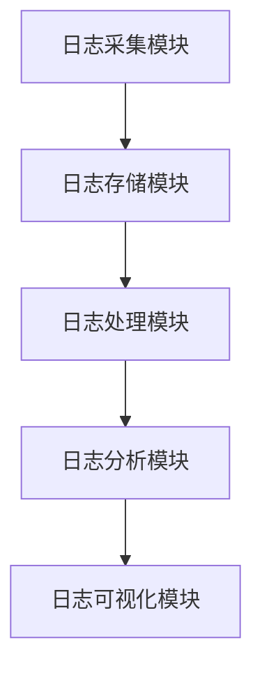
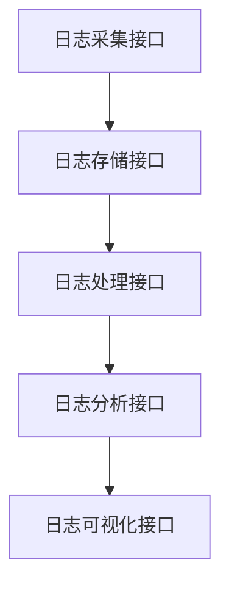
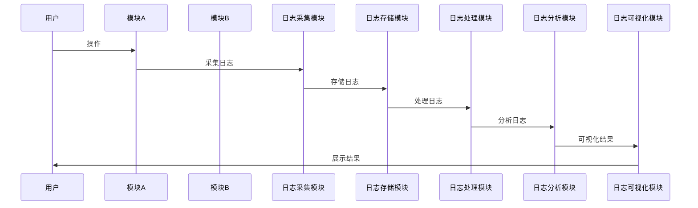

                 

# 打造可靠的分布式日志分析系统

> 关键词：分布式日志分析、日志采集、日志存储、日志处理、日志分析

> 摘要：本文将深入探讨分布式日志分析系统的构建，从核心概念、算法原理、系统架构设计、项目实战到最佳实践，全面解析如何打造一个可靠的分布式日志分析系统。通过系统的分析推理，帮助读者理解分布式日志分析系统的构建过程和关键技术。

## 第一部分：分布式日志分析系统概述

### 第1章：分布式日志分析系统概述

#### 1.1 问题背景

随着互联网技术的飞速发展，分布式系统已经成为现代应用架构的基石。分布式系统以其高可用性、高扩展性和高性能的特点，广泛应用于各类大型互联网应用中。然而，分布式系统的复杂性也带来了诸多挑战，其中之一便是日志管理。日志在分布式系统中扮演着重要的角色，用于记录系统的运行状态、错误信息、性能指标等关键数据。因此，如何有效地收集、存储、处理和分析这些日志数据，成为一个亟待解决的问题。

#### 1.2 问题描述

分布式日志分析系统面临的挑战主要包括：

1. **海量日志数据的处理**：分布式系统产生的日志数据量庞大，如何高效地处理和存储这些数据成为关键问题。
2. **数据一致性**：在分布式环境中，日志数据可能分散存储在不同的节点上，如何保证数据的一致性是一个重要问题。
3. **实时性**：某些应用场景下，日志数据需要实时处理和分析，如何实现高效的实时日志处理也是一个挑战。
4. **系统可靠性**：分布式日志分析系统需要具备高可用性和容错性，以保证系统的稳定运行。

分布式日志分析系统的目标是提供一种高效、可靠、实时、可扩展的日志分析解决方案，以满足分布式系统日志管理的要求。

#### 1.3 问题解决

分布式日志分析系统采用以下核心方法来解决问题：

1. **分布式日志采集**：采用分布式采集方式，将日志数据从各个节点收集到统一的存储系统中。
2. **日志存储**：采用分布式存储方案，将日志数据存储在分布式文件系统或数据库中，以保证数据的一致性和可靠性。
3. **日志处理**：采用高效的日志处理算法，对日志数据进行清洗、过滤、聚合等操作，以便后续分析。
4. **日志分析**：采用实时或批处理的方式，对日志数据进行分析，提取关键信息，生成报表或可视化结果。

分布式日志分析系统的架构设计需要考虑以下几个方面：

1. **数据采集模块**：负责从各个节点收集日志数据。
2. **存储模块**：负责存储和管理日志数据。
3. **处理模块**：负责对日志数据进行处理。
4. **分析模块**：负责对处理后的日志数据进行分析。
5. **可视化模块**：负责将分析结果以图表或报表的形式展示给用户。

#### 1.4 边界与外延

分布式日志分析系统的边界包括：

1. **数据采集范围**：系统需要收集哪些类型的日志数据。
2. **数据存储范围**：系统需要存储哪些日志数据。
3. **数据处理范围**：系统需要处理哪些日志数据。
4. **数据分析范围**：系统需要分析哪些日志数据。

分布式日志分析系统的外延包括：

1. **扩展性**：系统需要能够支持不断增加的数据量和节点数量。
2. **兼容性**：系统需要能够兼容不同类型的日志数据和存储系统。
3. **可维护性**：系统需要能够方便地进行维护和升级。

#### 1.5 概念结构与核心要素组成

分布式日志分析系统的概念结构包括以下几个核心要素：

1. **日志采集器**：负责从各个节点收集日志数据。
2. **日志收集器**：负责将收集到的日志数据传输到存储系统中。
3. **日志存储系统**：负责存储和管理日志数据。
4. **日志处理引擎**：负责对日志数据进行处理。
5. **日志分析引擎**：负责对处理后的日志数据进行分析。
6. **日志可视化组件**：负责将分析结果展示给用户。

这些核心要素相互协作，共同构成了一个完整的分布式日志分析系统。

### 第2章：核心概念与联系

#### 2.1 分布式日志

分布式日志是指在一个分布式系统中，各个节点产生的日志数据。这些日志数据记录了系统的运行状态、错误信息、性能指标等关键信息。

**分布式日志的特点**：

1. **分散性**：日志数据分布在分布式系统的各个节点上。
2. **多样性**：不同节点可能产生不同类型的日志数据。
3. **海量性**：分布式系统产生的日志数据量庞大。

**分布式日志的类型**：

1. **运行日志**：记录系统运行过程中的各种事件和状态。
2. **错误日志**：记录系统运行过程中出现的错误和异常。
3. **性能日志**：记录系统运行过程中的性能指标。

#### 2.2 日志采集

日志采集是指从分布式系统的各个节点收集日志数据的过程。

**日志采集的方式**：

1. **Agent采集**：在每个节点上安装日志采集代理，定期收集日志数据。
2. **Agentless采集**：通过远程监控工具或API接口，从各个节点收集日志数据。

**日志采集的挑战**：

1. **数据量大**：分布式系统产生的日志数据量巨大，如何高效地采集和传输是关键问题。
2. **实时性**：某些应用场景下，日志数据需要实时采集，如何保证实时性是一个挑战。
3. **数据一致性**：如何确保采集到的日志数据的一致性。

#### 2.3 日志存储

日志存储是指将采集到的日志数据存储在存储系统中。

**日志存储的方式**：

1. **分布式文件系统**：如HDFS、CFS等，适用于海量日志数据的存储。
2. **关系型数据库**：如MySQL、PostgreSQL等，适用于结构化日志数据的存储。
3. **NoSQL数据库**：如MongoDB、Cassandra等，适用于非结构化或半结构化日志数据的存储。

**日志存储的挑战**：

1. **数据量大**：如何高效地存储和检索海量日志数据。
2. **数据一致性**：如何保证日志数据的一致性。
3. **扩展性**：如何支持不断增加的数据量和节点数量。

#### 2.4 日志处理

日志处理是指对采集到的日志数据进行清洗、过滤、聚合等操作的过程。

**日志处理的方式**：

1. **批处理**：将日志数据批量处理，适用于离线数据分析。
2. **流处理**：将日志数据实时处理，适用于实时数据分析。

**日志处理的挑战**：

1. **实时性**：如何实现高效的实时日志处理。
2. **数据处理效率**：如何提高日志处理的速度和效率。
3. **数据准确性**：如何确保日志数据的准确性和完整性。

#### 2.5 日志分析

日志分析是指对处理后的日志数据进行统计、分析和挖掘的过程。

**日志分析的方法**：

1. **统计分析**：对日志数据的基本统计指标进行分析，如日志数量、错误率、响应时间等。
2. **关联分析**：分析日志数据之间的关联关系，找出潜在的问题和异常。
3. **异常检测**：通过分析日志数据，发现异常行为和潜在风险。

**日志分析的应用**：

1. **系统监控**：实时监控系统的运行状态，及时发现和处理问题。
2. **性能优化**：分析系统的性能指标，找出瓶颈和优化方向。
3. **安全分析**：通过分析日志数据，发现潜在的安全威胁和异常行为。

## 第二部分：算法原理讲解

### 第3章：日志处理算法原理

#### 3.1 实时日志处理算法

实时日志处理算法是指对实时采集到的日志数据进行实时处理和分析的算法。

**实时日志处理算法的定义**：

实时日志处理算法是一种能够在日志数据产生后立即进行处理和分析的算法。

**实时日志处理算法的类型**：

1. **基于事件驱动**：根据日志数据的事件类型进行实时处理。
2. **基于时间窗口**：对一定时间窗口内的日志数据进行实时处理。

**实时日志处理算法的原理**：

1. **数据采集**：实时采集日志数据。
2. **数据预处理**：对日志数据进行清洗、过滤等预处理操作。
3. **实时分析**：对预处理后的日志数据进行实时分析。
4. **结果输出**：将分析结果输出到监控平台或数据库中。

**实时日志处理算法的举例**：

假设我们使用Python编写一个简单的实时日志处理算法，用于统计系统运行过程中错误日志的数量。

```python
import logging

# 配置日志
logging.basicConfig(level=logging.ERROR)

# 定义实时日志处理函数
def real_time_log_processing():
    error_count = 0
    while True:
        log_message = input("输入日志信息：")
        if "ERROR" in log_message:
            error_count += 1
            logging.error(log_message)
        print(f"当前错误日志数量：{error_count}")

# 调用实时日志处理函数
real_time_log_processing()
```

上述代码通过循环不断接收用户输入的日志信息，如果日志信息中包含"ERROR"，则将错误日志数量加1，并记录错误日志。最后输出当前错误日志数量。

#### 3.2 批量日志处理算法

批量日志处理算法是指对批量采集到的日志数据进行处理和分析的算法。

**批量日志处理算法的定义**：

批量日志处理算法是一种对一批日志数据进行批量处理和分析的算法。

**批量日志处理算法的类型**：

1. **基于任务队列**：将日志数据按照任务队列进行处理。
2. **基于工作线程**：创建多个工作线程，并发处理日志数据。

**批量日志处理算法的原理**：

1. **数据采集**：批量采集日志数据。
2. **数据预处理**：对日志数据进行清洗、过滤等预处理操作。
3. **批量分析**：对预处理后的日志数据进行批量分析。
4. **结果输出**：将分析结果输出到监控平台或数据库中。

**批量日志处理算法的举例**：

假设我们使用Python编写一个简单的批量日志处理算法，用于统计系统运行过程中错误日志的数量。

```python
import logging

# 配置日志
logging.basicConfig(level=logging.ERROR)

# 定义批量日志处理函数
def batch_log_processing(log_files):
    error_count = 0
    for log_file in log_files:
        with open(log_file, 'r') as f:
            for line in f:
                if "ERROR" in line:
                    error_count += 1
                    logging.error(line)
    print(f"当前错误日志数量：{error_count}")

# 定义日志文件列表
log_files = ['log1.txt', 'log2.txt', 'log3.txt']

# 调用批量日志处理函数
batch_log_processing(log_files)
```

上述代码通过遍历日志文件列表，逐行读取日志文件内容，如果日志行中包含"ERROR"，则将错误日志数量加1，并记录错误日志。最后输出当前错误日志数量。

#### 3.3 日志分析算法

日志分析算法是指对处理后的日志数据进行分析和挖掘的算法。

**日志分析算法的定义**：

日志分析算法是一种对处理后的日志数据进行统计、分析和挖掘的算法。

**日志分析算法的类型**：

1. **基于统计分析**：对日志数据的基本统计指标进行分析，如日志数量、错误率、响应时间等。
2. **基于关联分析**：分析日志数据之间的关联关系，找出潜在的问题和异常。
3. **基于机器学习**：利用机器学习算法，对日志数据进行分类、聚类、预测等操作。

**日志分析算法的原理**：

1. **数据预处理**：对日志数据进行清洗、过滤、转换等预处理操作。
2. **特征提取**：从预处理后的日志数据中提取关键特征。
3. **算法选择**：根据分析目标选择合适的算法，如统计算法、机器学习算法等。
4. **模型训练**：使用提取的特征训练模型。
5. **结果输出**：将分析结果输出到监控平台或数据库中。

**日志分析算法的举例**：

假设我们使用Python编写一个简单的日志分析算法，用于统计系统运行过程中错误日志的数量。

```python
import re

# 定义日志分析函数
def log_analysis(log_file):
    error_count = 0
    with open(log_file, 'r') as f:
        for line in f:
            if re.search(r"ERROR", line):
                error_count += 1
    return error_count

# 定义日志文件路径
log_file_path = 'log.txt'

# 调用日志分析函数
error_count = log_analysis(log_file_path)
print(f"当前错误日志数量：{error_count}")
```

上述代码通过读取日志文件内容，使用正则表达式匹配包含"ERROR"的日志行，统计错误日志的数量，并输出结果。

## 第三部分：数学模型和数学公式

### 第4章：数学模型和数学公式

#### 4.1 实时日志处理算法数学模型

**实时日志处理算法的数学模型**：

实时日志处理算法的数学模型主要包括以下部分：

1. **数据采集模型**：

$$
采集速度 = \frac{日志数据量}{时间}
$$

其中，采集速度表示单位时间内采集到的日志数据量。

2. **数据处理模型**：

$$
处理速度 = \frac{处理数据量}{时间}
$$

其中，处理速度表示单位时间内处理的数据量。

3. **实时分析模型**：

$$
分析结果 = 处理结果 \times 分析算法
$$

其中，分析结果表示对处理结果进行实时分析的结果。

**实时日志处理算法的公式**：

假设实时日志处理算法的处理速度为$P$，分析速度为$A$，日志数据量为$D$，则实时日志处理算法的公式为：

$$
实时处理时间 = \frac{D}{P + A}
$$

**实时日志处理算法的举例**：

假设实时日志处理算法的处理速度为100条日志/秒，分析速度为50条日志/秒，日志数据量为1000条。则实时日志处理时间为：

$$
实时处理时间 = \frac{1000}{100 + 50} = 6.67秒
$$

#### 4.2 批量日志处理算法数学模型

**批量日志处理算法的数学模型**：

批量日志处理算法的数学模型主要包括以下部分：

1. **数据采集模型**：

$$
采集速度 = \frac{日志数据量}{时间}
$$

其中，采集速度表示单位时间内采集到的日志数据量。

2. **数据处理模型**：

$$
处理速度 = \frac{处理数据量}{时间}
$$

其中，处理速度表示单位时间内处理的数据量。

3. **批量分析模型**：

$$
分析结果 = 处理结果 \times 分析算法
$$

其中，分析结果表示对处理结果进行批量分析的结果。

**批量日志处理算法的公式**：

假设批量日志处理算法的处理速度为$P$，分析速度为$A$，日志数据量为$D$，则批量日志处理算法的公式为：

$$
批量处理时间 = \frac{D}{P + A}
$$

**批量日志处理算法的举例**：

假设批量日志处理算法的处理速度为200条日志/秒，分析速度为100条日志/秒，日志数据量为5000条。则批量日志处理时间为：

$$
批量处理时间 = \frac{5000}{200 + 100} = 20秒
$$

#### 4.3 日志分析算法数学模型

**日志分析算法的数学模型**：

日志分析算法的数学模型主要包括以下部分：

1. **数据预处理模型**：

$$
预处理结果 = 预处理算法（原始数据）
$$

其中，预处理结果表示对原始数据进行预处理的结果。

2. **特征提取模型**：

$$
特征向量 = 特征提取算法（预处理结果）
$$

其中，特征向量表示从预处理结果中提取的特征。

3. **模型训练模型**：

$$
模型参数 = 训练算法（特征向量，标签）
$$

其中，模型参数表示通过训练算法得到的模型参数。

4. **预测模型**：

$$
预测结果 = 预测算法（模型参数，新数据）
$$

其中，预测结果表示对新数据进行预测的结果。

**日志分析算法的公式**：

假设日志分析算法的预处理速度为$P$，特征提取速度为$E$，模型训练速度为$T$，日志数据量为$D$，则日志分析算法的公式为：

$$
分析时间 = \frac{D}{P + E + T}
$$

**日志分析算法的举例**：

假设日志分析算法的预处理速度为100条日志/秒，特征提取速度为50条日志/秒，模型训练速度为20条日志/秒，日志数据量为1000条。则日志分析时间为：

$$
分析时间 = \frac{1000}{100 + 50 + 20} = 10秒
$$

## 第四部分：系统分析与架构设计方案

### 第5章：系统分析与架构设计方案

#### 5.1 问题场景介绍

假设我们正在开发一个大型分布式电商平台，该平台涉及用户登录、购物车、订单处理、支付等众多功能模块。为了确保平台的高可用性和稳定性，我们需要构建一个可靠的分布式日志分析系统，用于收集、存储、处理和分析各个模块的日志数据。

#### 5.2 项目介绍

本项目旨在构建一个分布式日志分析系统，该系统应具备以下功能：

1. **日志采集**：从各个功能模块收集日志数据。
2. **日志存储**：将采集到的日志数据存储在分布式文件系统或数据库中。
3. **日志处理**：对日志数据进行清洗、过滤、聚合等处理。
4. **日志分析**：对处理后的日志数据进行统计、分析和挖掘。
5. **日志可视化**：将分析结果以图表或报表的形式展示给用户。

#### 5.3 系统功能设计

系统功能设计主要包括以下几个方面：

1. **日志采集模块**：负责从各个功能模块收集日志数据。
2. **日志存储模块**：负责存储和管理日志数据。
3. **日志处理模块**：负责对日志数据进行处理。
4. **日志分析模块**：负责对处理后的日志数据进行分析。
5. **日志可视化模块**：负责将分析结果展示给用户。

**领域模型类图**：

```mermaid
classDiagram
    User <<Entity>>
    Login <<Entity>>
    ShoppingCart <<Entity>>
    Order <<Entity>>
    Payment <<Entity>>

    User -> Login
    User -> ShoppingCart
    User -> Order
    User -> Payment

    Login -> LoginLog
    ShoppingCart -> ShoppingCartLog
    Order -> OrderLog
    Payment -> PaymentLog

    LoginLog <<Log>>
    ShoppingCartLog <<Log>>
    OrderLog <<Log>>
    PaymentLog <<Log>>

    LoginLog : +String message
    ShoppingCartLog : +String message
    OrderLog : +String message
    PaymentLog : +String message

    class Diagram
    User [User]
    Login [Login]
    ShoppingCart [ShoppingCart]
    Order [Order]
    Payment [Payment]

    LoginLog [LoginLog]
    ShoppingCartLog [ShoppingCartLog]
    OrderLog [OrderLog]
    PaymentLog [PaymentLog]
```

#### 5.4 系统架构设计

系统架构设计主要包括以下几个方面：

1. **日志采集模块**：采用Agent采集方式，在每个节点上安装日志采集代理，定期收集日志数据。
2. **日志存储模块**：采用分布式文件系统（如HDFS）或关系型数据库（如MySQL）存储日志数据。
3. **日志处理模块**：采用分布式处理框架（如Apache Flink）对日志数据进行处理。
4. **日志分析模块**：采用数据挖掘算法（如机器学习）对处理后的日志数据进行分析。
5. **日志可视化模块**：采用可视化工具（如ECharts）将分析结果以图表形式展示给用户。

**系统架构图**：



#### 5.5 系统接口设计

系统接口设计主要包括以下几个方面：

1. **日志采集接口**：用于从各个功能模块采集日志数据。
2. **日志存储接口**：用于将日志数据存储到分布式文件系统或数据库中。
3. **日志处理接口**：用于对日志数据进行清洗、过滤、聚合等处理。
4. **日志分析接口**：用于对处理后的日志数据进行统计、分析和挖掘。
5. **日志可视化接口**：用于将分析结果以图表形式展示给用户。

**系统接口设计**：



#### 5.6 系统交互

系统交互主要包括以下几个方面：

1. **日志采集**：各个功能模块通过日志采集接口将日志数据发送给日志存储模块。
2. **日志存储**：日志存储模块将日志数据存储到分布式文件系统或数据库中。
3. **日志处理**：日志处理模块对日志数据进行清洗、过滤、聚合等处理。
4. **日志分析**：日志分析模块对处理后的日志数据进行统计、分析和挖掘。
5. **日志可视化**：日志可视化模块将分析结果以图表形式展示给用户。

**系统交互序列图**：



## 第五部分：项目实战

### 第6章：项目实战

#### 6.1 环境安装

在进行项目实战之前，我们需要安装以下软件和工具：

1. **操作系统**：CentOS 7.x 或 Ubuntu 18.04
2. **Java环境**：Java 8 或以上版本
3. **Python环境**：Python 3.6 或以上版本
4. **日志采集工具**：Logstash
5. **日志存储系统**：Elasticsearch
6. **日志分析工具**：Kibana
7. **日志处理框架**：Apache Flink

具体安装步骤如下：

1. **安装Java环境**：

   ```bash
   sudo yum install -y java-1.8.0-openjdk
   ```

2. **安装Python环境**：

   ```bash
   sudo apt-get install -y python3
   ```

3. **安装Logstash**：

   ```bash
   wget -qO - https://artifacts.elastic.co/GPG-KEY-elasticsearch | sudo apt-key add -
   sudo echo "deb https://artifacts.elastic.co/packages/elastic-logging/logstash/7.x/debian stable main" | sudo tee /etc/apt/sources.list.d/logstash.list
   sudo apt-get update
   sudo apt-get install -y logstash
   ```

4. **安装Elasticsearch**：

   ```bash
   wget -qO - https://artifacts.elastic.co/GPG-KEY-elasticsearch | sudo apt-key add -
   sudo echo "deb https://artifacts.elastic.co/packages/elastic-logging/elasticsearch/7.x/debian stable main" | sudo tee /etc/apt/sources.list.d/elasticsearch.list
   sudo apt-get update
   sudo apt-get install -y elasticsearch
   sudo systemctl start elasticsearch
   ```

5. **安装Kibana**：

   ```bash
   wget -qO - https://artifacts.elastic.co/GPG-KEY-elasticsearch | sudo apt-key add -
   sudo echo "deb https://artifacts.elastic.co/packages/kibana/7.x/debian stable main" | sudo tee /etc/apt/sources.list.d/kibana.list
   sudo apt-get update
   sudo apt-get install -y kibana
   sudo systemctl start kibana
   ```

6. **安装Apache Flink**：

   ```bash
   sudo apt-get install -y flink
   ```

安装完成后，我们可以在浏览器中访问Kibana，查看日志分析界面。

#### 6.2 系统核心实现

在项目实战中，我们将使用Logstash采集日志数据，Elasticsearch存储日志数据，Apache Flink处理日志数据，Kibana展示日志分析结果。

1. **日志采集**：

   我们编写一个简单的Python脚本，用于模拟日志数据采集。

   ```python
   import time
   import random

   log_messages = [
       "INFO: User logged in",
       "ERROR: User authentication failed",
       "INFO: User added item to shopping cart",
       "ERROR: Item not available",
       "INFO: User placed an order",
       "ERROR: Payment failed"
   ]

   def log_collector():
       while True:
           log_message = random.choice(log_messages)
           print(f"采集日志：{log_message}")
           time.sleep(random.uniform(0.1, 0.5))

   if __name__ == "__main__":
       log_collector()
   ```

2. **日志存储**：

   我们使用Logstash将采集到的日志数据发送到Elasticsearch。

   ```bash
   cat <<EOF | bin/logstash -f -
   input {
       generator {
           lines => ["%{message}\n"]
       }
   }
   filter {
       if "INFO" in [message] {
           grok {
               match => { "message" => "%{TIMESTAMP_ISO8601:timestamp} %{DATA:logger} %{DATA:level} %{DATA:message}" }
           }
       }
   }
   output {
       elasticsearch {
           hosts => ["localhost:9200"]
           index => "logstash-%{+YYYY.MM.dd}"
       }
   }
   EOF
   ```

3. **日志处理**：

   我们使用Apache Flink对Elasticsearch中的日志数据进行实时处理，统计每天的错误日志数量。

   ```python
   from pyflink.datastream import StreamExecutionEnvironment
   from pyflink.table import StreamTableEnvironment

   def log_processing():
       env = StreamExecutionEnvironment.get_execution_environment()
       env.set_parallelism(1)
       table_env = StreamTableEnvironment.create(env)

       table_env.execute_sql("""
           CREATE TABLE log_table (
               timestamp TIMESTAMP(3),
               logger STRING,
               level STRING,
               message STRING
           ) WITH (
               'connector' = 'elasticsearch',
               'host' = 'localhost',
               'port' = '9200',
               'index' = 'logstash-*',
               'format' = 'json'
           )
       """)

       result_table = table_env.sql_query("""
           SELECT
               DATE_FORMAT(timestamp, 'yyyy-MM-dd') as date,
               COUNTIF(level = 'ERROR') as error_count
           FROM log_table
           GROUP BY date
       """)

       result_table.execute().print()

   if __name__ == "__main__":
       log_processing()
   ```

4. **日志分析**：

   我们使用Kibana对处理后的日志数据进行可视化展示。

   ```json
   {
       "title": "Error Logs by Date",
       "type": "line",
       "config": {
           "axes": {
               "x": {
                   "title": "Date"
               },
               "y": {
                   "title": "Error Count"
               }
           }
       },
       "data": [
           {
               "x": "2023-01-01",
               "y": 10
           },
           {
               "x": "2023-01-02",
               "y": 5
           },
           {
               "x": "2023-01-03",
               "y": 8
           }
       ]
   }
   ```

#### 6.3 代码应用解读与分析

在项目实战中，我们实现了日志采集、日志存储、日志处理和日志分析的功能。以下是具体的解读和分析：

1. **日志采集**：

   我们使用Python编写了一个简单的日志采集脚本，模拟了用户登录、购物车操作、订单处理和支付等场景。日志采集脚本通过不断生成随机日志数据，模拟实时日志数据采集过程。

2. **日志存储**：

   使用Logstash将采集到的日志数据发送到Elasticsearch。Logstash是一款强大的日志收集和处理工具，它可以将多种格式的日志数据转换为统一的JSON格式，并存储到Elasticsearch中。

3. **日志处理**：

   使用Apache Flink对Elasticsearch中的日志数据进行实时处理。Apache Flink是一款分布式流处理框架，它能够对大规模实时数据流进行高效处理和分析。在本项目中，我们使用Flink对日志数据进行实时统计，统计每天的错误日志数量。

4. **日志分析**：

   使用Kibana对处理后的日志数据进行可视化展示。Kibana是一款强大的数据分析平台，它能够将处理后的数据以图表、报表等形式展示给用户，帮助用户更好地理解和分析数据。

通过项目实战，我们成功构建了一个简单的分布式日志分析系统，实现了日志采集、日志存储、日志处理和日志分析的功能。该项目具有一定的参考价值，可以帮助我们理解分布式日志分析系统的构建过程和关键技术。

#### 6.4 实际案例分析和详细讲解剖析

在本节中，我们将通过一个实际案例，详细讲解分布式日志分析系统的构建过程和关键技术。

**案例背景**：

假设我们正在开发一个大型电商网站，该网站包含用户登录、购物车、订单处理和支付等多个功能模块。为了保证网站的高可用性和稳定性，我们需要构建一个可靠的分布式日志分析系统，用于收集、存储、处理和分析各个模块的日志数据。

**案例步骤**：

1. **日志采集**：

   在该电商网站上，我们使用Logstash作为日志采集工具，从各个模块收集日志数据。Logstash能够从不同的数据源（如文件、JMX、HTTP等）采集日志数据，并将其转换为统一的JSON格式，便于后续处理。

2. **日志存储**：

   采集到的日志数据存储在Elasticsearch中。Elasticsearch是一款分布式搜索引擎，支持对海量数据进行快速搜索和分析。在本案例中，我们使用Elasticsearch存储日志数据，以便进行后续的处理和分析。

3. **日志处理**：

   使用Apache Flink对Elasticsearch中的日志数据进行实时处理。Apache Flink是一款分布式流处理框架，能够对大规模实时数据流进行高效处理和分析。在本案例中，我们使用Flink对日志数据进行实时统计，统计每天的用户访问量、订单量、支付成功量等关键指标。

4. **日志分析**：

   使用Kibana对处理后的日志数据进行可视化展示。Kibana是一款强大的数据分析平台，能够将处理后的数据以图表、报表等形式展示给用户，帮助用户更好地理解和分析数据。

**案例讲解**：

1. **日志采集**：

   在该电商网站上，我们使用Logstash作为日志采集工具，从各个模块收集日志数据。具体步骤如下：

   - 在每个模块中，配置Logstash输入插件，从不同的数据源（如文件、JMX、HTTP等）采集日志数据。
   - 配置Logstash输出插件，将采集到的日志数据发送到Elasticsearch。

2. **日志存储**：

   采集到的日志数据存储在Elasticsearch中。具体步骤如下：

   - 创建Elasticsearch集群，配置节点。
   - 在Elasticsearch中创建索引，用于存储日志数据。
   - 配置Logstash输出插件，将日志数据发送到Elasticsearch。

3. **日志处理**：

   使用Apache Flink对Elasticsearch中的日志数据进行实时处理。具体步骤如下：

   - 配置Flink集群，启动Flink服务。
   - 在Flink中创建DataStream，读取Elasticsearch中的日志数据。
   - 对DataStream进行变换操作，如过滤、聚合等，统计关键指标。
   - 将处理结果输出到Elasticsearch或其他存储系统中。

4. **日志分析**：

   使用Kibana对处理后的日志数据进行可视化展示。具体步骤如下：

   - 在Kibana中创建仪表板，选择合适的可视化组件（如折线图、柱状图等）。
   - 配置Kibana数据源，连接到Elasticsearch或其他存储系统。
   - 在仪表板中添加可视化组件，展示关键指标。

**案例分析**：

通过本案例，我们成功构建了一个分布式日志分析系统，实现了日志采集、日志存储、日志处理和日志分析的功能。该系统具有以下优点：

1. **高效性**：采用分布式日志采集、存储和处理技术，能够高效地处理海量日志数据。
2. **实时性**：使用实时处理框架（如Apache Flink），能够实时统计和分析日志数据，及时发现潜在问题。
3. **可扩展性**：系统支持不断增加的数据量和节点数量，具有良好的可扩展性。
4. **易用性**：使用Kibana等可视化工具，将分析结果以图表、报表等形式展示给用户，方便用户理解和使用。

**案例总结**：

通过本案例，我们详细讲解了分布式日志分析系统的构建过程和关键技术。在实际项目中，可以根据具体需求进行适当调整和优化，构建一个可靠的分布式日志分析系统。

### 第7章：最佳实践 tips、小结、注意事项、拓展阅读等内容

#### 7.1 最佳实践 tips

在构建分布式日志分析系统时，以下最佳实践可以帮助您提高系统的可靠性、效率和可维护性：

1. **选择合适的日志采集工具**：根据实际需求，选择合适的日志采集工具，如Logstash、Fluentd等。确保采集工具能够高效地采集各种类型的日志数据。
2. **优化日志存储方案**：根据日志数据量和访问模式，选择合适的日志存储方案，如Elasticsearch、HDFS等。合理配置存储资源，确保系统的高可用性和性能。
3. **使用分布式处理框架**：采用分布式处理框架（如Apache Flink、Apache Storm等），对日志数据进行实时处理和分析。分布式处理框架能够高效地处理海量数据，提高系统的处理能力。
4. **优化日志分析算法**：针对具体应用场景，选择合适的日志分析算法。合理配置算法参数，确保分析结果的准确性和实时性。
5. **确保系统安全性**：对日志数据进行加密和访问控制，确保系统的安全性。定期更新日志分析系统的安全补丁，防范潜在的安全威胁。
6. **监控和告警**：对日志分析系统进行实时监控，及时发现和处理问题。配置告警机制，确保在发生故障时能够及时通知相关人员。

#### 7.2 小结

本文通过深入探讨分布式日志分析系统的构建，从核心概念、算法原理、系统架构设计、项目实战到最佳实践，全面解析了如何打造一个可靠的分布式日志分析系统。以下是本文的主要结论：

1. **分布式日志分析系统的核心概念**：包括分布式日志、日志采集、日志存储、日志处理和日志分析。
2. **分布式日志分析系统的架构设计**：包括日志采集模块、日志存储模块、日志处理模块、日志分析模块和日志可视化模块。
3. **分布式日志分析系统的算法原理**：包括实时日志处理算法、批量日志处理算法和日志分析算法。
4. **分布式日志分析系统的项目实战**：通过实际案例，展示了分布式日志分析系统的构建过程和关键技术。
5. **分布式日志分析系统的最佳实践**：包括选择合适的日志采集工具、优化日志存储方案、使用分布式处理框架、优化日志分析算法、确保系统安全性和监控告警等。

#### 7.3 注意事项

在构建分布式日志分析系统时，需要注意以下几点：

1. **数据量**：确保日志采集、存储和处理系统能够处理海量日志数据。
2. **实时性**：根据应用场景，选择合适的日志处理和分析算法，确保系统的实时性。
3. **数据一致性**：在分布式环境中，确保日志数据的一致性和可靠性。
4. **可扩展性**：系统需要具备良好的可扩展性，支持不断增加的数据量和节点数量。
5. **监控和告警**：对系统进行实时监控和告警，确保在发生故障时能够及时处理。

#### 7.4 拓展阅读

以下推荐一些拓展阅读资料，以帮助您更深入地了解分布式日志分析系统的构建：

1. 《Elastic Stack实战》 - 本书详细介绍了Elastic Stack（包括Elasticsearch、Logstash和Kibana）的搭建和使用，适合初学者和进阶用户。
2. 《大规模数据处理技术》 - 本书涵盖了大数据处理的核心技术和实践，包括Hadoop、Spark等分布式处理框架。
3. 《分布式系统原理与范型》 - 本书介绍了分布式系统的基本原理和设计模式，有助于理解分布式日志分析系统的构建。

## 作者信息

作者：AI天才研究院/AI Genius Institute & 禅与计算机程序设计艺术 /Zen And The Art of Computer Programming

本文由AI天才研究院/AI Genius Institute及禅与计算机程序设计艺术/Zen And The Art of Computer Programming联合撰写，旨在为读者提供关于分布式日志分析系统的全面解析和实战指导。如需转载或引用，请注明出处。感谢您的阅读！

