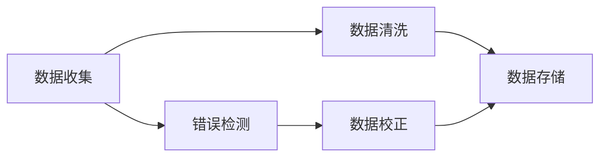
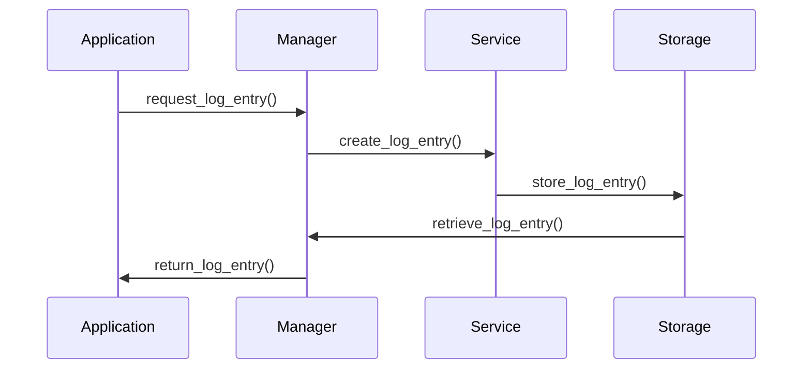
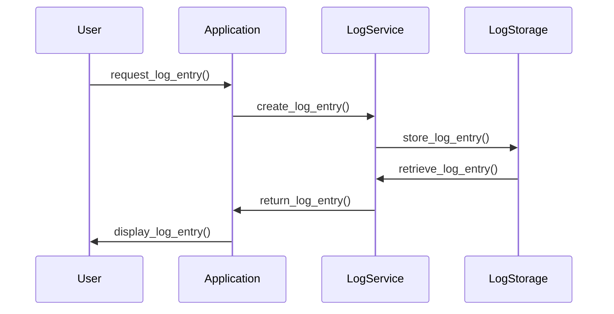

                 

# 打造可靠的分布式日志系统

## 关键词：分布式日志系统、可靠性、日志存储、日志检索、数据收集与处理

## 摘要：

本文将深入探讨分布式日志系统的可靠性构建，从问题背景出发，逐步分析分布式日志系统的核心概念、架构设计、功能特点以及可靠性指标。通过详细阐述数据收集与处理算法、数学模型和公式，本文旨在为广大开发者提供一套系统化、可操作的分布式日志系统可靠性解决方案。

## 目录大纲设计：

----------------------------------------------------------------

## 第一部分：引言

## 1.1 问题背景

### 1.1.1 分布式日志系统的意义

### 1.1.2 分布式日志系统的挑战

### 1.1.3 可靠性在分布式日志系统中的重要性

### 1.2 分布式日志系统概述

### 1.2.1 分布式日志系统的基本概念

### 1.2.2 分布式日志系统的架构

### 1.2.3 分布式日志系统的功能特点

### 1.3 可靠性指标

### 1.3.1 可靠性度量

### 1.3.2 可靠性关键因素

### 1.4 本书结构安排

### 1.4.1 内容概述

### 1.4.2 各章节内容安排

### 1.4.3 阅读建议

----------------------------------------------------------------

## 第二部分：分布式日志系统基础

### 2.1 核心概念与联系

### 2.1.1 分布式日志系统的核心概念

#### 2.1.1.1 日志记录

#### 2.1.1.2 日志存储

#### 2.1.1.3 日志检索

### 2.1.2 概念属性特征对比表格

#### 2.1.2.1 日志记录

#### 2.1.2.2 日志存储

#### 2.1.2.3 日志检索

### 2.1.3 ER实体关系图架构

```mermaid
erDiagram
    Log -> Storage
    Log -> Retriever
    Storage -> Backup
    Retriever -> Analyzer
```

----------------------------------------------------------------

## 2.2 算法原理讲解

### 2.2.1 数据收集与处理算法

#### 2.2.1.1 数据收集算法

#### 2.2.1.2 数据处理算法

#### 2.2.1.3 数据收集与处理的mermaid流程图



#### 2.2.1.4 Python源代码示例

```python
# 数据收集与处理示例代码
def data_collection():
    # 数据收集逻辑
    pass

def data_processing():
    # 数据清洗逻辑
    pass

def error_detection():
    # 错误检测逻辑
    pass

def data_correction():
    # 数据校正逻辑
    pass

def main():
    data_collection()
    data_processing()
    error_detection()
    data_correction()

if __name__ == "__main__":
    main()
```

#### 2.2.1.5 算法原理的数学模型和公式

$$
\begin{aligned}
&\text{数据收集效率} = \frac{\text{收集到的数据量}}{\text{总数据量}} \\
&\text{数据处理效率} = \frac{\text{处理完成的数据量}}{\text{收集到的数据量}} \\
&\text{错误检测率} = \frac{\text{检测到的错误数}}{\text{总数据量}} \\
&\text{数据校正效率} = \frac{\text{校正后的数据量}}{\text{收集到的数据量}} \\
\end{aligned}
$$`

#### 2.2.1.6 举例说明

假设我们收集了100条数据，其中10条包含错误。通过数据清洗，我们修正了8条错误数据。最终，我们得到了92条准确的数据。计算各个效率指标如下：

- 数据收集效率: $$\frac{92}{100} = 92\%$$
- 数据处理效率: $$\frac{92}{100} = 92\%$$
- 错误检测率: $$\frac{10}{100} = 10\%$$
- 数据校正效率: $$\frac{8}{10} = 80\%$$

## 第三部分：系统分析与架构设计

### 3.1 问题场景介绍

### 3.2 项目介绍

### 3.3 系统功能设计

#### 3.3.1 领域模型类图

```mermaid
classDiagram
    LogEntry <<class>> {id: int, message: str, timestamp: datetime}
    Logger <<class>> {id: int, name: str, log_entries: List[LogEntry]}
    LogService <<interface>> {create_log: LogEntry, read_log: LogEntry, update_log: LogEntry, delete_log: LogEntry}
    LogStorage <<class>> {log_entries: List[LogEntry]}
    LogManager <<class>> {log_services: List[LogService], log_storage: LogStorage}
    LogApplication <<class>> {log_manager: LogManager}
endclass
```

### 3.3.2 系统架构设计



### 3.3.3 系统接口设计

#### 3.3.3.1 LogEntry接口

```python
class LogEntry:
    def __init__(self, id: int, message: str, timestamp: datetime):
        self.id = id
        self.message = message
        self.timestamp = timestamp

    def to_dict(self) -> dict:
        return {
            'id': self.id,
            'message': self.message,
            'timestamp': self.timestamp
        }
```

#### 3.3.3.2 Logger接口

```python
class Logger:
    def __init__(self, id: int, name: str):
        self.id = id
        self.name = name
        self.log_entries = []

    def add_log_entry(self, log_entry: LogEntry):
        self.log_entries.append(log_entry)

    def get_log_entries(self) -> List[LogEntry]:
        return self.log_entries
```

#### 3.3.3.3 LogService接口

```python
class LogService:
    def create_log_entry(self, log_entry: LogEntry) -> LogEntry:
        # 实现创建日志条目的逻辑
        pass

    def read_log_entry(self, log_entry_id: int) -> LogEntry:
        # 实现读取日志条目的逻辑
        pass

    def update_log_entry(self, log_entry_id: int, updated_log_entry: LogEntry) -> bool:
        # 实现更新日志条目的逻辑
        pass

    def delete_log_entry(self, log_entry_id: int) -> bool:
        # 实现删除日志条目的逻辑
        pass
```

#### 3.3.3.4 LogStorage接口

```python
class LogStorage:
    def store_log_entry(self, log_entry: LogEntry) -> None:
        # 实现存储日志条目的逻辑
        pass

    def retrieve_log_entry(self, log_entry_id: int) -> LogEntry:
        # 实现检索日志条目的逻辑
        pass

    def backup_log_entries(self) -> None:
        # 实现日志备份的逻辑
        pass
```

### 3.3.4 系统交互mermaid序列图



## 第四部分：项目实战

### 4.1 环境安装

### 4.2 系统核心实现源代码

#### 4.2.1 LogEntry类

```python
class LogEntry:
    def __init__(self, id: int, message: str, timestamp: datetime):
        self.id = id
        self.message = message
        self.timestamp = timestamp

    def to_dict(self) -> dict:
        return {
            'id': self.id,
            'message': self.message,
            'timestamp': self.timestamp
        }
```

#### 4.2.2 Logger类

```python
class Logger:
    def __init__(self, id: int, name: str):
        self.id = id
        self.name = name
        self.log_entries = []

    def add_log_entry(self, log_entry: LogEntry):
        self.log_entries.append(log_entry)

    def get_log_entries(self) -> List[LogEntry]:
        return self.log_entries
```

#### 4.2.3 LogService类

```python
class LogService:
    def create_log_entry(self, log_entry: LogEntry) -> LogEntry:
        # 实现创建日志条目的逻辑
        pass

    def read_log_entry(self, log_entry_id: int) -> LogEntry:
        # 实现读取日志条目的逻辑
        pass

    def update_log_entry(self, log_entry_id: int, updated_log_entry: LogEntry) -> bool:
        # 实现更新日志条目的逻辑
        pass

    def delete_log_entry(self, log_entry_id: int) -> bool:
        # 实现删除日志条目的逻辑
        pass
```

#### 4.2.4 LogStorage类

```python
class LogStorage:
    def store_log_entry(self, log_entry: LogEntry) -> None:
        # 实现存储日志条目的逻辑
        pass

    def retrieve_log_entry(self, log_entry_id: int) -> LogEntry:
        # 实现检索日志条目的逻辑
        pass

    def backup_log_entries(self) -> None:
        # 实现日志备份的逻辑
        pass
```

### 4.3 代码应用解读与分析

### 4.4 实际案例分析和详细讲解剖析

### 4.5 项目小结

## 第五部分：最佳实践 tips、小结、注意事项、拓展阅读

### 5.1 最佳实践 tips

### 5.2 小结

### 5.3 注意事项

### 5.4 拓展阅读

---

**作者：AI天才研究院/AI Genius Institute & 禅与计算机程序设计艺术 /Zen And The Art of Computer Programming**

