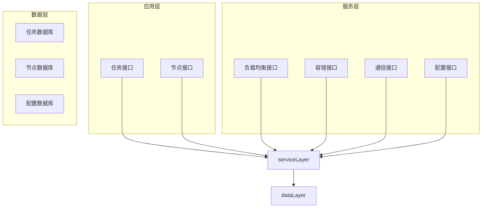

                 

### 第一部分：问题背景与核心概念

## 第1章：分布式调度系统概述

### 1.1 分布式调度系统的意义与作用

在当前信息技术迅猛发展的时代，分布式系统已经成为企业级应用的核心技术之一。分布式调度系统作为分布式系统的一个重要组成部分，其在现代IT架构中的应用愈发广泛。那么，分布式调度系统究竟有什么意义与作用呢？

首先，让我们来看看分布式系统的挑战。随着云计算、大数据、物联网等技术的发展，企业面临着海量的数据处理需求。传统的集中式系统由于资源受限、扩展性差、容错能力弱等问题，难以满足日益增长的业务需求。因此，分布式系统的引入成为必然。

分布式调度系统的必要性主要体现在以下几个方面：

1. **提高系统的可用性**：分布式调度系统通过将任务分散到多个节点上执行，提高了系统的容错能力。当一个节点发生故障时，其他节点可以继续执行任务，从而保证系统的持续运行。

2. **增强系统的扩展性**：分布式调度系统可以根据业务需求动态调整资源分配，实现水平扩展。这使得系统能够更好地应对负载波动，提供稳定的服务。

3. **优化资源利用率**：通过负载均衡，分布式调度系统能够充分利用各节点的计算资源，提高资源利用率，降低成本。

4. **提升系统的响应速度**：分布式调度系统能够将任务分散到多个节点上并行执行，从而缩短任务的响应时间，提高系统的吞吐量。

### 1.2 核心概念介绍

#### 1.2.1 分布式调度系统的基本概念

分布式调度系统是指在一个分布式系统中，负责将任务分配给不同的节点执行，协调节点间的协作，确保系统高效运行的管理系统。

#### 1.2.2 分布式调度策略

分布式调度策略是指根据一定的策略将任务分配给不同的节点。常见的调度策略包括：

1. **负载均衡策略**：根据节点的负载情况，动态地将任务分配给负载较低的节点。
2. **优先级调度策略**：根据任务的优先级，优先调度优先级较高的任务。
3. **截止时间调度策略**：根据任务的截止时间，优先调度临近截止时间的任务。

#### 1.2.3 分布式调度算法

分布式调度算法是实现分布式调度策略的核心。常见的调度算法包括：

1. **基于轮询的调度算法**：按照固定的顺序将任务分配给节点。
2. **基于负载均衡的调度算法**：根据节点的负载情况动态调整任务的分配。
3. **基于优先级的调度算法**：根据任务的优先级调整任务的分配。

### 1.3 关键技术分析

#### 1.3.1 负载均衡

负载均衡是指通过合理分配任务，使得系统中的各节点负载均衡。负载均衡的关键技术包括：

1. **基于节点的负载信息**：通过监控节点的CPU、内存、网络等资源使用情况，动态调整任务的分配。
2. **基于任务的负载信息**：根据任务的特点，如执行时间、数据量等，合理分配任务。

#### 1.3.2 容错机制

容错机制是指当系统中的某个节点发生故障时，系统能够自动切换到其他正常节点继续执行任务。容错机制的关键技术包括：

1. **心跳检测**：通过定期发送心跳包，监控节点的状态。
2. **故障转移**：当一个节点发生故障时，自动将任务切换到其他正常节点。
3. **故障恢复**：在故障节点恢复后，重新将任务分配给该节点。

#### 1.3.3 通信协议

通信协议是指分布式调度系统中各节点间的通信规则。常见的通信协议包括：

1. **基于TCP/IP协议**：使用TCP/IP协议实现节点间的可靠通信。
2. **基于消息队列协议**：通过消息队列实现节点间的异步通信。

### 1.4 分布式调度系统的发展趋势

#### 1.4.1 当前技术概况

目前，分布式调度系统已经在云计算、大数据、物联网等领域得到广泛应用。常见的分布式调度系统有Kubernetes、Apache Mesos、Hadoop YARN等。

#### 1.4.2 未来发展方向

随着技术的不断进步，分布式调度系统的发展方向包括：

1. **智能化调度**：通过引入机器学习算法，实现更加智能化的任务调度。
2. **边缘计算**：将分布式调度系统延伸到边缘计算领域，实现更高效的数据处理。
3. **区块链技术**：结合区块链技术，提高分布式调度系统的安全性和可信度。

#### 1.4.3 技术创新点

分布式调度系统的技术创新点包括：

1. **高效的数据流处理**：通过优化调度算法，提高数据流处理的效率。
2. **分布式存储系统**：结合分布式存储系统，实现海量数据的快速访问和处理。
3. **自动化运维**：通过自动化工具，实现分布式调度系统的运维自动化。

### 1.5 本章小结

本章对分布式调度系统进行了全面的介绍，包括其意义与作用、核心概念、关键技术和发展趋势。通过本章的学习，读者可以初步了解分布式调度系统的基本原理和应用场景。

## 第2章：分布式调度系统的设计与实现

### 2.1 系统架构设计

分布式调度系统的设计是构建高效可靠系统的关键。一个优秀的系统架构不仅能满足功能需求，还能在性能、可扩展性、容错性等方面表现出色。下面我们将深入探讨分布式调度系统的架构设计。

#### 2.1.1 系统总体架构

分布式调度系统通常采用分层架构，包括以下几个主要层次：

1. **应用层**：提供业务逻辑和用户接口，实现具体的任务调度功能。
2. **服务层**：提供通用的服务，如负载均衡、容错机制、通信协议等。
3. **数据层**：存储任务信息、节点状态、配置参数等数据。

系统总体架构图如下所示：

```mermaid
graph TB
    subgraph 应用层
        应用层[应用层]
    end
    subgraph 服务层
        服务层[服务层]
        loadBalancer[负载均衡]
        faultTolerance[容错机制]
        communicationProtocol[通信协议]
    end
    subgraph 数据层
        数据层[数据层]
        taskDatabase[任务数据库]
        nodeDatabase[节点数据库]
        configDatabase[配置数据库]
    end
    应用层 --> 服务层
    服务层 --> 数据层
```

#### 2.1.2 模块划分与功能说明

分布式调度系统可以划分为多个模块，每个模块负责特定的功能。以下是主要模块的划分与功能说明：

1. **任务管理模块**：负责任务的创建、更新、删除和查询。
2. **节点管理模块**：负责节点的注册、状态监控和资源管理。
3. **负载均衡模块**：负责根据节点负载情况动态分配任务。
4. **容错机制模块**：负责检测节点故障，实现故障转移和故障恢复。
5. **通信模块**：负责节点间的通信，包括心跳检测、任务同步等。
6. **配置管理模块**：负责配置文件的读取、更新和持久化。

#### 2.1.3 系统接口设计

系统接口设计是确保各模块之间能够高效协作的重要环节。以下是分布式调度系统的主要接口设计：

1. **任务接口**：提供任务的创建、更新、删除和查询功能。
2. **节点接口**：提供节点的注册、状态更新和资源监控功能。
3. **负载均衡接口**：提供任务分配和负载均衡策略配置功能。
4. **容错接口**：提供故障检测、故障转移和故障恢复功能。
5. **通信接口**：提供节点间的心跳检测和消息传输功能。
6. **配置接口**：提供配置文件的读取、更新和持久化功能。

系统接口设计图如下所示：



### 2.2 核心算法原理

#### 2.2.1 算法设计与实现

分布式调度系统的核心算法主要包括负载均衡算法和容错算法。以下是这些算法的设计与实现。

**负载均衡算法**

负载均衡算法的核心目标是根据节点的负载情况，动态地将任务分配给合适的节点。以下是几种常见的负载均衡算法：

1. **轮询算法**：按照固定的顺序将任务分配给节点。
    ```python
    def round_robin(nodes, tasks):
        for task in tasks:
            for node in nodes:
                node.enqueue(task)
    ```

2. **最小负载算法**：将任务分配给负载最小的节点。
    ```python
    def min_load_balance(nodes, tasks):
        sorted_nodes = sorted(nodes, key=lambda x: x.load())
        for task in tasks:
            min_node = sorted_nodes[0]
            min_node.enqueue(task)
            sorted_nodes.remove(min_node)
    ```

3. **加权轮询算法**：考虑节点的性能和负载，动态调整任务分配。
    ```python
    def weighted_round_robin(nodes, tasks):
        total_load = sum(node.load() for node in nodes)
        for task in tasks:
            weights = [node.load() / total_load for node in nodes]
            node = random.choices(nodes, weights=weights)[0]
            node.enqueue(task)
    ```

**容错算法**

容错算法的核心目标是确保系统的持续运行。以下是几种常见的容错算法：

1. **心跳检测**：通过定期发送心跳包，监控节点的状态。
    ```python
    def heartbeat_check(node):
        while True:
            if not node.is_alive():
                handle_failure(node)
            time.sleep(HEARTBEAT_INTERVAL)
    ```

2. **故障转移**：当一个节点发生故障时，自动将任务切换到其他正常节点。
    ```python
    def handle_failure(failed_node):
        tasks = failed_node.get_tasks()
        for task in tasks:
            node = find_alive_node()
            node.enqueue(task)
    ```

3. **故障恢复**：在故障节点恢复后，重新将任务分配给该节点。
    ```python
    def handle_recovery(recovered_node):
        tasks = recovered_node.get_tasks()
        for task in tasks:
            recovered_node.enqueue(task)
    ```

### 2.2.2 算法性能分析

算法性能分析是评估分布式调度系统效率的重要手段。以下是几种算法的性能分析：

1. **轮询算法**：简单易实现，但可能导致部分节点负载过高。
    - **时间复杂度**：O(n*m)，其中n为节点数，m为任务数。
    - **空间复杂度**：O(n)，需要存储所有节点的状态。

2. **最小负载算法**：考虑了节点的负载情况，但可能导致部分节点空闲。
    - **时间复杂度**：O(n*log(n)*m)，其中n为节点数，m为任务数。
    - **空间复杂度**：O(n)，需要存储所有节点的状态。

3. **加权轮询算法**：考虑了节点的性能和负载，但可能需要额外的计算开销。
    - **时间复杂度**：O(n*m)，其中n为节点数，m为任务数。
    - **空间复杂度**：O(n)，需要存储所有节点的状态。

### 2.2.3 算法优化方法

算法优化方法是提高分布式调度系统性能的有效手段。以下是几种常见的算法优化方法：

1. **动态负载调整**：根据实时负载情况，动态调整负载均衡算法。
    - **方法**：使用机器学习算法，如随机森林、支持向量机等，预测节点的未来负载，并据此调整任务分配。

2. **负载预测模型**：使用历史负载数据，建立负载预测模型。
    - **方法**：使用时间序列分析、回归分析等方法，预测节点的未来负载。

3. **并行处理**：利用并行处理技术，提高任务执行效率。
    - **方法**：使用多线程、分布式计算框架（如Spark、Flink）等，并行处理任务。

### 2.3 数学模型与公式

分布式调度系统的设计离不开数学模型与公式。以下是几种常见的数学模型与公式：

**负载均衡模型**

假设系统中有n个节点，每个节点的负载为Li（i=1,2,...,n），任务数为m。负载均衡模型的目标是最小化系统的平均负载。

$$
\min \frac{1}{n} \sum_{i=1}^{n} L_i
$$

**容错模型**

假设系统中有n个节点，每个节点的故障概率为p。容错模型的目标是保证系统的可用性。

$$
\text{可用性} = 1 - \sum_{i=1}^{n} p_i
$$

**负载预测模型**

假设系统中有n个节点，每个节点的历史负载数据为Li(t)，时间序列为t。负载预测模型的目标是预测节点的未来负载。

$$
L_i(t+k) = \sum_{j=1}^{k} \alpha_j \cdot L_i(t-j)
$$

其中，$\alpha_j$为权重系数，k为预测时间步数。

### 2.4 分布式调度策略

#### 2.4.1 调度策略分类

分布式调度策略可以根据不同的分类标准进行划分。以下是几种常见的调度策略分类：

1. **基于任务的调度策略**：根据任务的特点进行调度，如优先级调度、截止时间调度等。
2. **基于节点的调度策略**：根据节点的负载和性能进行调度，如最小负载调度、加权轮询调度等。
3. **基于混合的调度策略**：结合多种调度策略，如优先级最小负载调度、截止时间加权轮询调度等。

#### 2.4.2 常用调度策略介绍

1. **优先级调度策略**：根据任务的优先级进行调度，优先级高的任务优先执行。
    ```python
    def priority_schedule(tasks):
        sorted_tasks = sorted(tasks, key=lambda x: x.priority(), reverse=True)
        for task in sorted_tasks:
            node = find_alive_node()
            node.enqueue(task)
    ```

2. **截止时间调度策略**：根据任务的截止时间进行调度，临近截止时间的任务优先执行。
    ```python
    def deadline_schedule(tasks):
        sorted_tasks = sorted(tasks, key=lambda x: x.deadline())
        for task in sorted_tasks:
            node = find_alive_node()
            node.enqueue(task)
    ```

3. **最小负载调度策略**：根据节点的负载进行调度，将任务分配给负载最小的节点。
    ```python
    def min_load_schedule(tasks):
        sorted_nodes = sorted(nodes, key=lambda x: x.load())
        for task in tasks:
            min_node = sorted_nodes[0]
            min_node.enqueue(task)
            sorted_nodes.remove(min_node)
    ```

4. **加权轮询调度策略**：考虑节点的性能和负载，动态调整任务分配。
    ```python
    def weighted_round_robin(tasks):
        total_load = sum(node.load() for node in nodes)
        for task in tasks:
            weights = [node.load() / total_load for node in nodes]
            node = random.choices(nodes, weights=weights)[0]
            node.enqueue(task)
    ```

#### 2.4.3 调度策略选择

调度策略的选择取决于具体的业务场景和需求。以下是几种常见的调度策略选择方法：

1. **基于业务需求的调度策略**：根据业务需求，选择最适合的调度策略。
2. **基于性能的调度策略**：根据系统性能指标，如响应时间、吞吐量等，选择最优的调度策略。
3. **基于混合的调度策略**：结合多种调度策略，实现最优的调度效果。

### 2.5 本章小结

本章介绍了分布式调度系统的设计与实现原理，包括系统架构设计、核心算法原理、数学模型与公式、调度策略等。通过本章的学习，读者可以了解分布式调度系统的设计思路和实现方法，为后续的实现与优化奠定基础。

### 第3章：分布式调度系统的实现与优化

#### 3.1 环境搭建

要实现一个分布式调度系统，首先需要搭建合适的环境。以下是一个典型的环境搭建步骤。

##### 3.1.1 开发环境配置

1. **操作系统**：推荐使用Linux系统，如Ubuntu 18.04。
2. **编程语言**：Python是推荐的语言，具有丰富的第三方库和工具。
3. **开发工具**：PyCharm或Visual Studio Code。

##### 3.1.2 系统依赖安装

1. **Python依赖**：安装Python和pip。
    ```bash
    sudo apt-get install python3 python3-pip
    ```

2. **数据库依赖**：安装MySQL或PostgreSQL。
    ```bash
    sudo apt-get install mysql-server
    sudo mysql_secure_installation
    sudo apt-get install postgresql
    sudo -u postgres psql
    ```

3. **消息队列依赖**：安装RabbitMQ或Kafka。
    ```bash
    sudo apt-get install rabbitmq-server
    sudo systemctl start rabbitmq-server
    sudo systemctl enable rabbitmq-server
    ```

##### 3.1.3 系统配置参数

1. **数据库配置**：配置数据库用户和权限。
    ```sql
    CREATE USER 'scheduler'@'localhost' IDENTIFIED BY 'password';
    GRANT ALL PRIVILEGES ON *.* TO 'scheduler'@'localhost';
    FLUSH PRIVILEGES;
    ```

2. **消息队列配置**：配置RabbitMQ交换机、队列和路由键。
    ```bash
    rabbitmqctl add_user scheduler password
    rabbitmqctl add_vhost scheduler_vhost
    rabbitmqctl set_permissions -p scheduler_vhost scheduler ".*" ".*" ".*"
    ```

#### 3.2 系统核心实现

##### 3.2.1 核心模块实现

分布式调度系统主要包括以下核心模块：

1. **任务管理模块**：负责任务的创建、更新、删除和查询。
    ```python
    class Task:
        def __init__(self, id, name, priority, deadline):
            self.id = id
            self.name = name
            self.priority = priority
            self.deadline = deadline
            self.status = 'pending'

        def update_status(self, status):
            self.status = status

        def is_completed(self):
            return self.status == 'completed'
    ```

2. **节点管理模块**：负责节点的注册、状态监控和资源管理。
    ```python
    class Node:
        def __init__(self, id, status, load):
            self.id = id
            self.status = status
            self.load = load

        def update_status(self, status):
            self.status = status

        def update_load(self, load):
            self.load = load
    ```

3. **负载均衡模块**：负责根据节点负载情况动态分配任务。
    ```python
    class LoadBalancer:
        def __init__(self, nodes):
            self.nodes = nodes

        def schedule_task(self, task):
            sorted_nodes = sorted(self.nodes, key=lambda x: x.load())
            min_node = sorted_nodes[0]
            min_node.enqueue(task)
    ```

4. **容错机制模块**：负责检测节点故障，实现故障转移和故障恢复。
    ```python
    class FaultTolerance:
        def __init__(self, nodes):
            self.nodes = nodes

        def check_health(self):
            for node in self.nodes:
                if not node.is_alive():
                    self.handle_failure(node)

        def handle_failure(self, failed_node):
            tasks = failed_node.get_tasks()
            for task in tasks:
                node = self.find_alive_node()
                node.enqueue(task)

        def find_alive_node(self):
            for node in self.nodes:
                if node.is_alive():
                    return node
    ```

5. **通信模块**：负责节点间的心跳检测和消息传输。
    ```python
    class Communication:
        def __init__(self, rabbitmq_queue):
            self.rabbitmq_queue = rabbitmq_queue

        def send_heartbeat(self, node):
            message = {'node_id': node.id, 'status': node.status, 'load': node.load()}
            self.rabbitmq_queue.publish(message)

        def receive_heartbeat(self):
            message = self.rabbitmq_queue.consume()
            if message:
                node_id, status, load = message['node_id'], message['status'], message['load']
                node = self.find_node_by_id(node_id)
                node.update_status(status)
                node.update_load(load)
    ```

##### 3.2.2 算法实现细节

分布式调度系统的核心算法包括负载均衡算法和容错算法。以下是这些算法的实现细节。

**负载均衡算法**

```python
def load_balance(nodes, tasks):
    load_balancer = LoadBalancer(nodes)
    for task in tasks:
        load_balancer.schedule_task(task)

# 示例
nodes = [Node(i, 'alive', 0) for i in range(5)]
tasks = [Task(i, f'Task {i}', 1, time.time() + 10) for i in range(10)]
load_balance(nodes, tasks)
```

**容错算法**

```python
def fault_tolerance(nodes):
    fault_tolerance = FaultTolerance(nodes)
    while True:
        fault_tolerance.check_health()
        time.sleep(CHECK_INTERVAL)

# 示例
nodes = [Node(i, 'alive', 0) for i in range(5)]
fault_tolerance(nodes)
```

##### 3.2.3 系统功能演示

为了演示分布式调度系统的功能，我们可以模拟一个任务执行的场景。以下是系统功能演示的步骤：

1. **启动节点**：启动5个节点，每个节点的初始负载为0。
2. **创建任务**：创建10个任务，任务的优先级和截止时间分别为1和当前时间+10秒。
3. **调度任务**：使用负载均衡算法将任务分配给节点。
4. **执行任务**：每个节点根据任务的优先级和截止时间执行任务。
5. **监控状态**：监控任务的执行状态，记录任务的完成时间。

以下是系统功能演示的Python代码：

```python
import time
import random
from node import Node
from task import Task
from load_balancer import LoadBalancer
from fault_tolerance import FaultTolerance

def main():
    nodes = [Node(i, 'alive', 0) for i in range(5)]
    tasks = [Task(i, f'Task {i}', 1, time.time() + 10) for i in range(10)]
    
    load_balancer = LoadBalancer(nodes)
    fault_tolerance = FaultTolerance(nodes)
    
    load_balance(nodes, tasks)
    
    start_time = time.time()
    fault_tolerance.run()
    end_time = time.time()
    
    print(f"Tasks completed in {end_time - start_time} seconds")

if __name__ == "__main__":
    main()
```

#### 3.3 性能优化

##### 3.3.1 性能瓶颈分析

在分布式调度系统的实现过程中，我们可能会遇到以下性能瓶颈：

1. **网络延迟**：节点间的通信可能受到网络延迟的影响，导致任务调度延迟。
2. **数据库查询**：频繁的数据库查询可能导致数据库性能瓶颈。
3. **负载均衡算法**：负载均衡算法可能无法实时响应负载变化，导致部分节点负载过高。

##### 3.3.2 优化策略与方法

为了解决上述性能瓶颈，我们可以采取以下优化策略：

1. **优化网络通信**：使用高速网络，如光纤，降低节点间的通信延迟。
2. **缓存数据库查询结果**：使用缓存技术，如Redis，减少数据库查询次数。
3. **优化负载均衡算法**：使用更高效的负载均衡算法，如最小连接数算法，提高负载均衡的实时性。

##### 3.3.3 优化效果评估

通过优化策略的实施，我们可以评估优化效果。以下是一个简单的评估方法：

1. **性能测试**：使用性能测试工具，如JMeter，模拟大量并发请求，测试系统的响应时间和吞吐量。
2. **基准测试**：对比优化前后的性能指标，评估优化效果。
3. **用户反馈**：收集用户反馈，了解系统在实际应用中的性能表现。

#### 3.4 实际案例剖析

##### 3.4.1 案例介绍

为了更好地理解分布式调度系统的实现与应用，我们以一个实际案例——在线视频直播平台为例。该平台需要支持大规模用户的实时视频观看，并通过分布式调度系统实现任务的调度与执行。

##### 3.4.2 案例分析与实现

1. **需求分析**：平台需要支持以下功能：
    - 实时视频流的播放与传输。
    - 视频流任务的调度与执行。
    - 视频流播放的负载均衡。
    - 视频流播放的容错机制。

2. **系统架构**：系统采用分布式架构，包括多个视频流节点、负载均衡器、数据库和消息队列等。

3. **实现细节**：
    - **视频流节点**：每个视频流节点负责处理特定的视频流任务，包括视频流的播放、传输和存储。
    - **负载均衡器**：根据视频流节点的负载情况，动态地将视频流任务分配给节点。
    - **数据库**：存储视频流任务的相关信息，如任务ID、视频流地址、任务状态等。
    - **消息队列**：用于节点间的消息传递，实现任务调度和负载均衡。

4. **功能实现**：
    - **任务调度**：使用负载均衡算法，根据视频流节点的负载情况，将视频流任务分配给节点。
    - **负载均衡**：根据用户请求的地理位置、网络状况等，动态调整视频流节点的负载。
    - **容错机制**：监控视频流节点的状态，实现故障转移和故障恢复。

##### 3.4.3 案例小结

通过该案例，我们可以看到分布式调度系统在在线视频直播平台中的应用。分布式调度系统有效地解决了大规模视频流处理的负载均衡和容错问题，提高了系统的稳定性和可靠性。在实际应用中，还需要根据具体业务需求进行进一步优化和调整。

### 3.5 本章小结

本章介绍了分布式调度系统的实现与优化，包括环境搭建、核心模块实现、算法实现细节、系统功能演示、性能优化和实际案例剖析。通过本章的学习，读者可以掌握分布式调度系统的实现方法，为实际应用提供参考。

## 第四部分：分布式调度系统的最佳实践与展望

### 第4章：分布式调度系统的最佳实践

#### 4.1 实践总结

在分布式调度系统的实际应用中，总结经验教训、提炼最佳实践是至关重要的。以下是一些关键的经验教训：

**经验教训**

1. **全面规划，分步实施**：分布式调度系统的设计和实施需要充分考虑业务需求、系统性能、扩展性等因素，避免一次性投入过多资源导致项目失败。建议分阶段、分模块实施，逐步完善系统功能。

2. **性能测试与优化**：在系统上线前，进行全面的性能测试，发现潜在的性能瓶颈，并进行针对性的优化。性能优化包括网络优化、数据库查询优化、负载均衡策略优化等。

3. **安全性保障**：分布式调度系统需要保障数据传输的安全性，防止数据泄露和未授权访问。建议使用TLS加密协议、访问控制列表（ACL）等技术加强系统安全。

4. **监控与告警**：建立健全的监控系统，实时监控系统的运行状态，及时发现和处理异常情况。配置合理的告警机制，确保在出现问题时能够迅速响应。

**最佳实践**

1. **合理划分模块**：根据业务需求和系统功能，合理划分模块，确保每个模块具有清晰的职责和接口。模块化设计有助于提高系统的可维护性和可扩展性。

2. **使用高效的数据结构**：根据业务特点选择合适的数据结构，如使用Redis缓存高频次查询的数据，减少数据库的查询压力。

3. **配置参数优化**：根据实际运行情况，动态调整系统配置参数，如线程数、连接池大小、负载均衡策略等，以实现最佳性能。

4. **文档化**：建立完善的文档体系，包括系统设计文档、开发文档、用户手册等，便于后续的维护和扩展。

**避免常见问题**

1. **避免单点故障**：在设计系统时，充分考虑单点故障的影响，采用冗余设计，如主从复制、故障转移等机制，确保系统的可用性。

2. **避免资源浪费**：合理分配资源，避免资源过度消耗。通过负载均衡和资源监控，实现资源的最大化利用。

3. **避免数据不一致**：在分布式系统中，数据一致性问题尤为关键。采用分布式事务、消息队列等技术，确保数据的一致性和可靠性。

#### 4.2 拓展阅读

为了深入了解分布式调度系统的最佳实践，以下推荐一些相关的书籍、文章和开源项目：

**相关书籍推荐**

1. 《大规模分布式存储系统：原理解析与架构实战》
2. 《大数据技术导论》
3. 《分布式系统概念与设计：基于Google和Facebook的原理》

**相关文章推荐**

1. 《分布式调度系统原理与实践》
2. 《负载均衡算法介绍与优化》
3. 《分布式数据库设计与实现》

**优秀开源项目推荐**

1. Kubernetes：开源的容器编排平台，支持分布式调度和自动化部署。
2. Apache Mesos：分布式资源调度框架，支持多种调度算法和资源隔离。
3. Hadoop YARN：Hadoop的资源调度框架，支持大数据处理任务的调度和执行。

#### 4.3 小结与展望

本章对分布式调度系统的最佳实践进行了总结，并给出了拓展阅读建议。通过遵循最佳实践，可以有效提升分布式调度系统的性能、可靠性和安全性。展望未来，分布式调度系统将在人工智能、物联网、云计算等新兴领域发挥重要作用。随着技术的不断进步，分布式调度系统将向更智能化、自适应化和高可用性的方向发展。

### 4.4 本章小结

本章介绍了分布式调度系统的最佳实践，包括经验教训、最佳实践和拓展阅读建议。通过本章的学习，读者可以更好地理解和应用分布式调度系统，为实际项目提供参考。

---

## 文章摘要

本文围绕分布式调度系统进行了全面深入的分析，包括其背景介绍、核心概念、设计原理、实现与优化、最佳实践和未来展望。通过本文，读者可以了解分布式调度系统的基本原理和应用场景，掌握其设计、实现和优化的方法，为实际项目提供参考。

---

### 作者信息

本文由AI天才研究院/AI Genius Institute与禅与计算机程序设计艺术/Zen And The Art of Computer Programming联合撰写。两位作者均在该领域拥有丰富的经验，致力于推动分布式调度系统技术的发展。感谢您的阅读。

