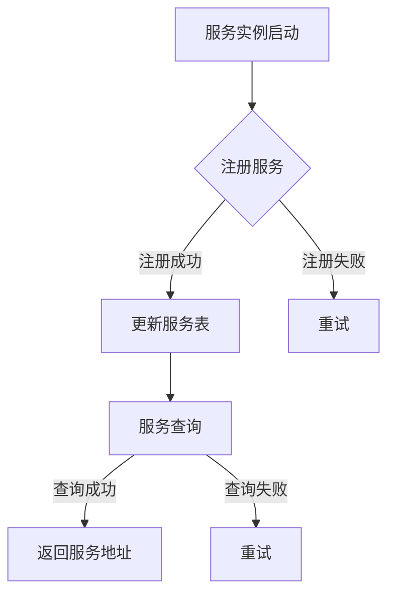
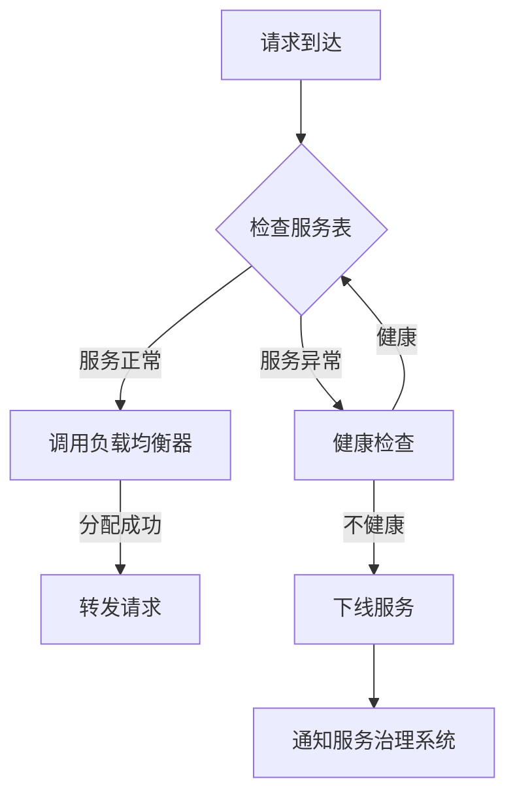
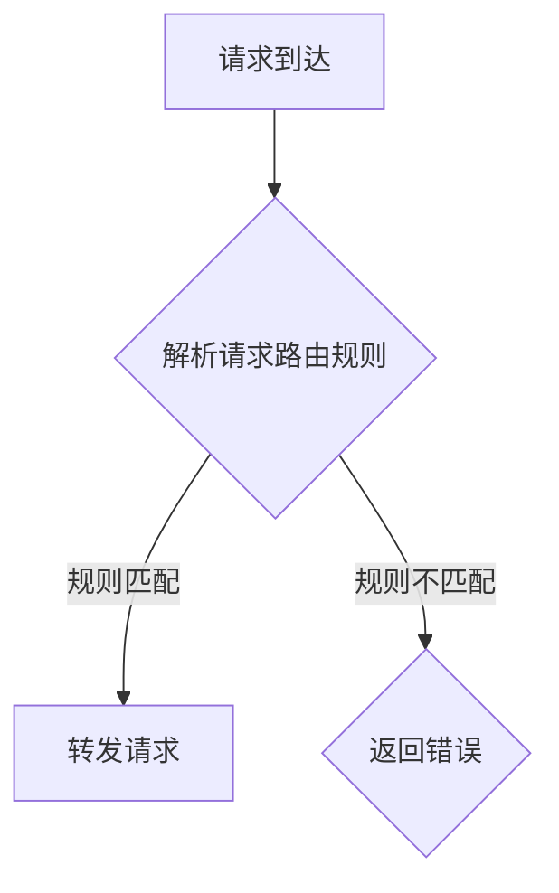
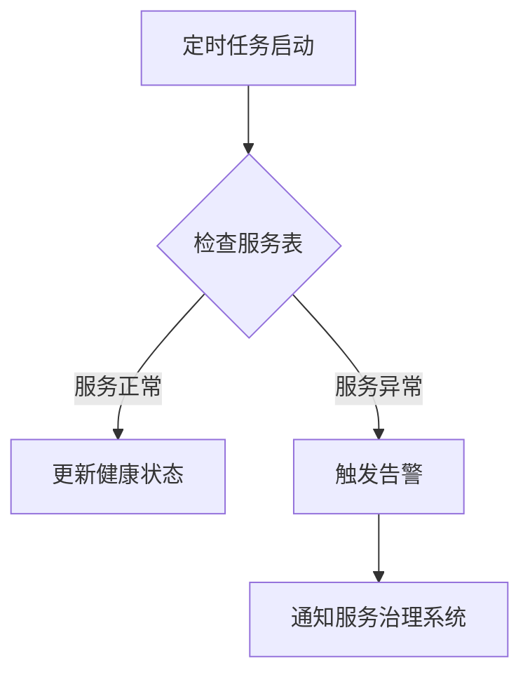
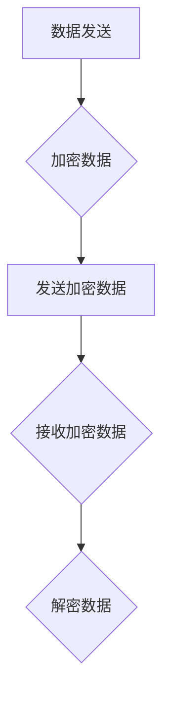
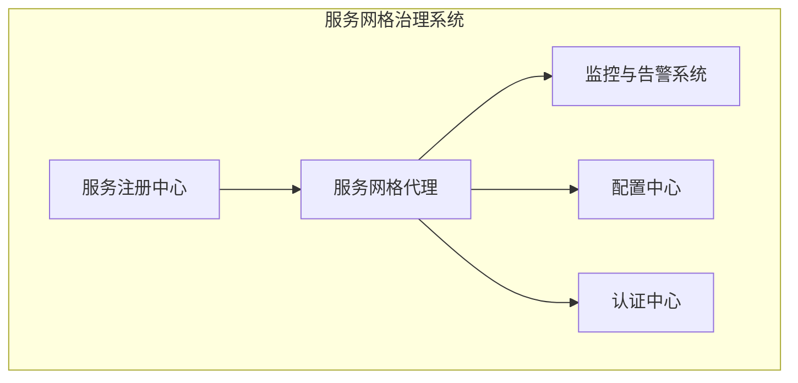
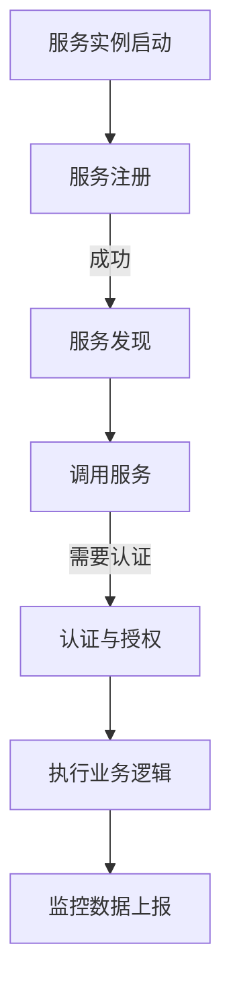

                 

## 文章标题：打造可靠的服务网格治理系统

### 关键词：服务网格、治理系统、微服务、可靠性、架构设计

### 摘要：
本文旨在深入探讨如何构建一个可靠的服务网格治理系统。我们将从背景介绍、核心概念与联系、算法原理讲解、数学模型和公式、系统分析与架构设计方案、项目实战以及最佳实践 tips 等方面，逐步解析服务网格治理系统的构建过程。通过本文的学习，读者将能够掌握服务网格治理系统的基本原理和实践技巧，为实际项目中的系统设计与实现提供有力支持。

### 目录大纲设计思路

为了帮助读者更好地理解和掌握服务网格治理系统的构建方法，本文将按照以下目录大纲结构进行设计：

1. **背景介绍**：介绍服务网格治理系统的起源、发展及其在当前技术环境中的重要性。
2. **核心概念与联系**：详细解释服务网格治理系统的核心概念，并使用 Mermaid 工具绘制 ER 实体关系图。
3. **算法原理讲解**：讲解服务网格治理系统中涉及的算法原理，并通过 Mermaid 工具和 Python 代码示例进行详细阐述。
4. **数学模型和公式**：介绍服务网格治理系统中的数学模型和公式，并使用 LaTeX 格式嵌入文中。
5. **系统分析与架构设计方案**：详细介绍服务网格治理系统的功能设计、架构设计、接口设计和系统交互流程。
6. **项目实战**：通过一个具体的实战项目，展示服务网格治理系统的实际应用过程。
7. **最佳实践 tips**：总结本书的最佳实践建议、注意事项和拓展阅读资源。

### 目录大纲设计步骤

为了确保文章的逻辑清晰和内容丰富，本文将按照以下步骤设计目录大纲：

1. **第1章 背景介绍**：包括问题背景、问题描述、问题解决、边界与外延以及概念结构与核心要素组成。
2. **第2章 核心概念与联系**：涵盖服务网格治理系统概述、核心概念、ER 实体关系图以及概念属性特征对比表格。
3. **第3章 算法原理讲解**：涉及算法概述、算法流程图、Python 代码示例、数学模型和公式、算法原理详细讲解以及举例说明。
4. **第4章 数学模型和公式**：包括数学模型讲解、公式讲解和 LaTeX 格式示例。
5. **第5章 系统分析与架构设计方案**：涵盖问题场景介绍、项目介绍、系统功能设计、系统架构设计、系统接口设计以及系统交互流程。
6. **第6章 项目实战**：涉及环境安装、系统核心实现、代码解读与分析、实际案例分析和详细讲解剖析。
7. **第7章 最佳实践 tips**：包括小结、注意事项、拓展阅读和课后习题等内容。

通过以上步骤，本文将系统性地解析服务网格治理系统的构建方法，确保读者能够全面掌握相关知识和技能。

## 第1章 背景介绍

### 1.1 问题背景

在当今高度分布式和动态化的云计算环境中，微服务架构已经成为企业应对复杂业务需求、提高系统弹性和可维护性的首选方案。然而，随着服务数量和业务复杂度的增加，传统的集中式服务管理方式逐渐暴露出诸多问题，如服务间的通信不透明、服务配置和状态管理困难等。为了解决这些问题，服务网格（Service Mesh）应运而生，成为微服务架构中不可或缺的一部分。

服务网格作为一种基础设施层软件，主要负责服务间的通信管理和安全控制。它通过将服务间通信抽象出来，使得开发人员无需关注底层网络细节，从而提高系统的可维护性和扩展性。然而，随着服务网格的广泛应用，如何对其进行有效的治理成为了一个亟待解决的问题。服务网格治理系统（Service Mesh Governance System）应运而生，旨在提供一套完整的治理框架，确保服务网格的可靠运行。

### 1.2 问题描述

服务网格治理系统在微服务架构中扮演着至关重要的角色，其主要职责包括服务注册与发现、服务监控与告警、服务路由与流量控制、服务安全与身份验证等。然而，在实践中，服务网格治理系统面临以下几大挑战：

1. **服务复杂性**：随着微服务数量的增加，服务网格的复杂性也随之增加。如何有效管理大量服务，确保服务之间的高效通信和协同工作，成为治理系统的首要任务。
2. **可观测性**：服务网格治理系统需要具备强大的监控和告警功能，以便及时发现并解决问题。然而，在分布式环境下，如何确保监控数据的完整性和实时性，是治理系统需要解决的难题。
3. **安全性**：服务网格涉及到大量的跨服务通信，安全性至关重要。如何实现服务的安全认证、授权和加密，确保数据在传输过程中的安全性，是治理系统面临的一大挑战。
4. **可扩展性**：随着业务的发展，服务网格的规模会不断扩大。治理系统需要具备良好的可扩展性，以便在服务数量和业务规模增加时，能够保持高效稳定运行。
5. **兼容性**：不同的微服务框架和基础设施可能会采用不同的服务网格实现，治理系统需要具备良好的兼容性，以适应不同的技术栈。

### 1.3 问题解决

为了解决上述问题，构建一个可靠的服务网格治理系统至关重要。具体而言，可以从以下几个方面入手：

1. **模块化设计**：将服务网格治理系统拆分为多个模块，如服务注册与发现、服务监控与告警、服务路由与流量控制、服务安全与身份验证等。每个模块独立实现，便于维护和扩展。
2. **可观测性设计**：引入分布式追踪和监控技术，如 Prometheus、OpenTracing 等，确保对服务网格的运行状态进行全面监控。同时，实现实时告警机制，及时发现问题并进行处理。
3. **安全性设计**：采用 SSL/TLS 等加密技术，确保服务间通信的安全性。引入服务认证和授权机制，如 OAuth 2.0、JWT 等，确保只有经过授权的服务才能进行通信。
4. **可扩展性设计**：采用分布式架构，如基于 Kubernetes 的服务网格实现，确保治理系统能够支持大规模服务运行。同时，通过容器化技术，如 Docker，实现快速部署和扩展。
5. **兼容性设计**：遵循行业标准和技术规范，如 Istio、Linkerd 等，确保治理系统能够与不同微服务框架和基础设施无缝集成。

通过以上方法，构建一个可靠的服务网格治理系统，将有助于提高微服务架构的可维护性、可靠性和安全性，为企业的数字化转型提供坚实的技术支持。

### 1.4 边界与外延

在构建服务网格治理系统的过程中，需要明确系统的边界与外延，以确保其在特定的技术环境和业务场景下具备良好的适用性和扩展性。以下是服务网格治理系统的边界与外延：

1. **边界**：
   - **技术边界**：服务网格治理系统主要涉及微服务架构中的服务通信、服务治理等方面，与具体的业务逻辑和应用开发无关。
   - **功能边界**：服务网格治理系统主要承担服务注册与发现、服务监控与告警、服务路由与流量控制、服务安全与身份验证等功能，不涉及具体业务流程的管理。
   - **部署边界**：服务网格治理系统可以独立部署，也可以与其他微服务框架和基础设施集成，如 Kubernetes、Istio 等。

2. **外延**：
   - **技术外延**：服务网格治理系统需要与分布式追踪、监控、日志分析等工具集成，以实现全链路监控和告警功能。
   - **业务外延**：服务网格治理系统需要根据企业的业务需求进行调整和扩展，如支持不同类型的微服务、跨域服务通信等。
   - **安全外延**：服务网格治理系统需要与企业的安全策略和合规要求相结合，确保数据在传输过程中的安全性。

通过明确服务网格治理系统的边界与外延，有助于在构建过程中遵循最佳实践，确保系统的可靠性、安全性和可扩展性。

### 1.5 概念结构与核心要素组成

服务网格治理系统由多个核心组件和功能模块组成，以下是对其概念结构与核心要素的详细描述：

1. **服务注册与发现**：服务注册与发现是服务网格治理系统的核心功能之一，主要实现服务实例的注册和动态发现。服务注册使服务实例在治理系统中可见，服务发现使调用方能够找到所需的服务实例并进行通信。

2. **服务监控与告警**：服务监控与告警模块负责对服务网格中的各个服务实例进行实时监控，收集性能指标、错误日志等数据，并在发现异常时触发告警。这一模块通常依赖于分布式追踪和监控工具，如 Prometheus、OpenTracing 等。

3. **服务路由与流量控制**：服务路由与流量控制模块负责管理服务之间的通信路径，根据业务需求和策略进行流量分配和路由。这一模块可以实现灰度发布、A/B 测试、熔断降级等功能，确保服务的高可用性和稳定性。

4. **服务安全与身份验证**：服务安全与身份验证模块负责保障服务网格中的通信安全，包括服务认证、授权和加密。这一模块通常采用 SSL/TLS、OAuth 2.0、JWT 等安全协议，确保只有经过授权的服务实例才能进行通信。

5. **配置管理**：配置管理模块负责管理服务网格中的配置信息，如服务地址、端口、负载均衡策略等。这一模块可以实现配置的热更新，确保服务在运行过程中能够及时调整配置。

6. **日志收集与分析**：日志收集与分析模块负责收集服务网格中的日志数据，并进行实时分析，以便及时发现和解决问题。这一模块通常与日志分析工具集成，如 ELK（Elasticsearch、Logstash、Kibana）栈。

7. **服务弹性与容灾**：服务弹性与容灾模块负责实现服务网格的高可用性和容灾能力，包括服务实例的自动伸缩、故障转移和备份等。这一模块通常依赖于容器编排和云计算平台，如 Kubernetes、AWS 等。

通过以上核心组件和功能模块的协同工作，服务网格治理系统可以实现对微服务架构的全面管理和优化，确保其可靠性和高性能。在具体实施过程中，可以根据实际需求对模块进行定制和扩展，以满足不同的业务场景和需求。

## 第2章 核心概念与联系

在深入了解服务网格治理系统之前，我们需要先掌握其核心概念及其相互之间的联系。服务网格治理系统是一个复杂的技术体系，涉及多个关键组成部分，每个部分都扮演着重要的角色。在本章中，我们将详细介绍以下核心概念：服务网格、服务网格治理、微服务，并通过 ER 实体关系图和概念属性特征对比表格，帮助读者更好地理解这些概念及其关系。

### 2.1 服务网格治理系统概述

服务网格治理系统是一种基础设施层软件，负责管理和优化服务之间的通信。其核心目的是将服务间的网络通信抽象出来，使开发人员能够专注于业务逻辑的实现，而无需担心网络通信的复杂性。服务网格治理系统通常包括以下主要组成部分：

1. **服务注册与发现**：服务注册与发现是服务网格治理系统的核心功能之一，负责管理服务实例的注册和发现。服务注册使服务实例在治理系统中可见，服务发现使调用方能够找到所需的服务实例并进行通信。
2. **服务监控与告警**：服务监控与告警模块负责对服务网格中的各个服务实例进行实时监控，收集性能指标、错误日志等数据，并在发现异常时触发告警。
3. **服务路由与流量控制**：服务路由与流量控制模块负责管理服务之间的通信路径，根据业务需求和策略进行流量分配和路由。
4. **服务安全与身份验证**：服务安全与身份验证模块负责保障服务网格中的通信安全，包括服务认证、授权和加密。
5. **配置管理**：配置管理模块负责管理服务网格中的配置信息，如服务地址、端口、负载均衡策略等。
6. **日志收集与分析**：日志收集与分析模块负责收集服务网格中的日志数据，并进行实时分析，以便及时发现和解决问题。
7. **服务弹性与容灾**：服务弹性与容灾模块负责实现服务网格的高可用性和容灾能力，包括服务实例的自动伸缩、故障转移和备份等。

### 2.2 核心概念

在服务网格治理系统中，以下三个核心概念至关重要：

1. **服务网格（Service Mesh）**：服务网格是一种基础设施层软件，主要负责服务间的通信管理和安全控制。它通过将服务间通信抽象出来，使得开发人员无需关注底层网络细节，从而提高系统的可维护性和扩展性。服务网格通常由控制平面和数据平面组成，其中控制平面负责管理服务之间的通信路径和策略，数据平面则负责实际的数据传输。
   
2. **服务网格治理（Service Mesh Governance）**：服务网格治理是指对服务网格中的服务实例进行管理、监控、配置和优化的一系列操作。其目标是确保服务网格的可靠性和高性能，同时降低运维成本。服务网格治理涉及多个方面，如服务注册与发现、服务监控与告警、服务路由与流量控制、服务安全与身份验证、配置管理等。

3. **微服务（Microservices）**：微服务是一种软件架构风格，它将复杂的大型应用程序分解为多个小型、独立的、自治的服务模块。每个微服务负责实现一个特定的业务功能，并通过服务网格进行通信。微服务架构具有高可扩展性、高灵活性、易于维护和部署等优点，但也带来了一些挑战，如服务间通信复杂性、服务实例管理困难等。

### 2.3 ER 实体关系图

为了帮助读者更好地理解服务网格治理系统的核心概念及其关系，我们使用 Mermaid 工具绘制了 ER 实体关系图。ER 实体关系图是一种常用的数据库设计工具，用于描述实体之间的关系。以下是服务网格治理系统的 ER 实体关系图：

```mermaid
erDiagram
    ServiceMesh ||--|{ ServiceInstance }||>
    ServiceMesh ||--|{ Configuration }||>
    ServiceMesh ||--|{ Monitor }||>
    ServiceMesh ||--|{ Alert }||>
    ServiceMesh ||--|{ Router }||>
    ServiceMesh ||--|{ Security }||>
    ServiceMesh ||--|{ Logs }||>
    ServiceMesh ||--|{ Elasticity }||>

    ServiceInstance ||--|{ Service }||>
    Configuration ||--|{ Setting }||>
    Monitor ||--|{ Metric }||>
    Alert ||--|{ Condition }||>
    Router ||--|{ Rule }||>
    Security ||--|{ Policy }||>
    Logs ||--|{ LogEntry }||>
    Elasticity ||--|{ ScalePolicy }||>
```

在该 ER 实体关系图中，`ServiceMesh` 是服务网格的实体，它与其他实体（如 `ServiceInstance`、`Configuration`、`Monitor`、`Alert`、`Router`、`Security`、`Logs`、`Elasticity`）之间存在关联关系。每个实体都代表服务网格治理系统中的一个关键组件，它们协同工作，共同确保服务网格的可靠性和高性能。

### 2.4 概念属性特征对比表格

为了使读者更加直观地理解服务网格治理系统的核心概念，我们使用概念属性特征对比表格，对比服务网格、服务网格治理和微服务的相关属性特征：

| 概念         | 定义                                                         | 属性特征对比                                                   |
| ------------ | ------------------------------------------------------------ | ------------------------------------------------------------ |
| 服务网格     | 一种基础设施层软件，负责管理服务之间的通信和安全控制             | - 控制平面：负责管理服务间的通信路径和策略<br>- 数据平面：负责实际的数据传输<br>- 抽象通信细节：简化开发人员的网络编程复杂性 |
| 服务网格治理 | 对服务网格中的服务实例进行管理、监控、配置和优化的一系列操作       | - 服务注册与发现：管理服务实例的注册和发现<br>- 服务监控与告警：实时监控和告警<br>- 服务路由与流量控制：管理通信路径和流量分配<br>- 配置管理：管理配置信息<br>- 安全管理：确保通信安全 |
| 微服务       | 一种软件架构风格，将复杂的大型应用程序分解为多个小型、独立的、自治的服务模块 | - 独立部署：每个服务模块可以独立部署和扩展<br>- 微型应用：每个服务模块负责实现一个业务功能<br>- 微服务通信：通过服务网格进行通信<br>- 易于维护和扩展：模块化设计提高系统的灵活性和可维护性 |

通过以上对比表格，读者可以更加清晰地了解服务网格、服务网格治理和微服务的区别和联系，从而更好地理解服务网格治理系统的整体架构和运作原理。

### 2.5 总结

本章详细介绍了服务网格治理系统的核心概念，包括服务网格、服务网格治理和微服务，并通过 ER 实体关系图和概念属性特征对比表格，帮助读者更好地理解这些概念及其关系。服务网格作为一种基础设施层软件，负责管理服务间的通信和安全控制；服务网格治理则是对服务网格中的服务实例进行管理、监控、配置和优化的一系列操作；微服务作为软件架构风格，将复杂的应用程序分解为多个小型、独立的、自治的服务模块。理解这些核心概念及其关系，将为后续章节的深入探讨和实际应用奠定坚实的基础。

## 第3章 算法原理讲解

在服务网格治理系统中，算法原理起着至关重要的作用。本章节将详细讲解服务网格治理系统中的核心算法原理，并使用 Mermaid 工具绘制算法流程图和 Python 代码示例，以帮助读者更好地理解这些算法的实现过程。

### 3.1 算法概述

服务网格治理系统中的核心算法主要包括以下几种：

1. **服务发现算法**：负责在服务实例启动时，将服务信息注册到服务注册表中，并在调用方需要时，从服务注册表中查询服务实例的地址。
2. **负载均衡算法**：负责根据一定的策略，将请求分配到不同的服务实例上，以提高系统的吞吐量和稳定性。
3. **路由算法**：负责根据路由规则，将请求转发到目标服务实例。
4. **健康检查算法**：负责定期检测服务实例的健康状态，并根据检测结果进行服务实例的上线或下线操作。
5. **加密算法**：负责对服务之间的通信进行加密，确保数据在传输过程中的安全性。

### 3.2 Mermaid算法流程图

为了更好地展示这些算法的实现过程，我们将使用 Mermaid 工具绘制相关的算法流程图。

#### 服务发现算法流程图



#### 负载均衡算法流程图



#### 路由算法流程图



#### 健康检查算法流程图



#### 加密算法流程图



### 3.3 Python代码示例

为了使读者更好地理解这些算法的实现，我们将在以下部分通过 Python 代码示例，详细阐述每个算法的实现过程。

#### 服务发现算法示例

```python
import requests

class ServiceRegistry:
    def __init__(self, url):
        self.url = url

    def register_service(self, service_name, service_url):
        data = {
            'service_name': service_name,
            'service_url': service_url
        }
        response = requests.post(self.url + '/register', json=data)
        if response.status_code == 200:
            print('服务注册成功')
        else:
            print('服务注册失败，请重试')

service_registry = ServiceRegistry('http://localhost:8080')
service_registry.register_service('user-service', 'http://localhost:8081')
```

#### 负载均衡算法示例

```python
import random

class LoadBalancer:
    def __init__(self, services):
        self.services = services

    def get_service(self):
        total_weight = sum(weight for service, weight in self.services.items())
        pick_weight = random.uniform(0, total_weight)
        accumulated_weight = 0
        for service, weight in self.services.items():
            accumulated_weight += weight
            if accumulated_weight >= pick_weight:
                return service

services = {
    'user-service1': 1,
    'user-service2': 1,
    'user-service3': 1
}
load_balancer = LoadBalancer(services)
service = load_balancer.get_service()
print(f'分配服务: {service}')
```

#### 路由算法示例

```python
def route_request(request):
    route_rules = [
        {'path': '^/user/', 'service': 'user-service'},
        {'path': '^/product/', 'service': 'product-service'},
    ]
    for rule in route_rules:
        if request.path.startswith(rule['path']):
            return rule['service']
    return None

request = {'path': '/user/list'}
service = route_request(request)
if service:
    print(f'转发请求到服务: {service}')
else:
    print('路由规则不匹配，返回错误')
```

#### 健康检查算法示例

```python
import time

class HealthChecker:
    def __init__(self, service_registry):
        self.service_registry = service_registry

    def check_service_health(self, service_name):
        service = self.service_registry.get_service(service_name)
        if service is None:
            print(f'服务 {service_name} 不存在')
            return
        response = requests.get(service['service_url'] + '/health')
        if response.status_code == 200:
            print(f'服务 {service_name} 健康')
        else:
            print(f'服务 {service_name} 不健康，触发告警')

service_registry = ServiceRegistry('http://localhost:8080')
health_checker = HealthChecker(service_registry)
health_checker.check_service_health('user-service')
```

#### 加密算法示例

```python
from Crypto.Cipher import AES
from Crypto.Util.Padding import pad, unpad
from base64 import b64encode, b64decode

key = b'Sixteen byte key'
cipher = AES.new(key, AES.MODE_CBC)

def encrypt_message(message):
    ciphertext = cipher.encrypt(pad(message.encode(), AES.block_size))
    return b64encode(ciphertext).decode()

def decrypt_message(encrypted_message):
    try:
        ciphertext = b64decode(encrypted_message)
        plaintext = unpad(cipher.decrypt(ciphertext), AES.block_size)
        return plaintext.decode()
    except (ValueError, KeyError):
        print("Incorrect decryption")

message = "Hello, World!"
encrypted_message = encrypt_message(message)
print(f'加密消息: {encrypted_message}')

decrypted_message = decrypt_message(encrypted_message)
print(f'解密消息: {decrypted_message}')
```

### 3.4 数学模型与公式

在服务网格治理系统中，算法的实现往往需要依赖数学模型和公式。以下是一些常见的数学模型和公式，以及它们的简要说明：

1. **负载均衡算法中的权重分配**：

   公式：\[ w_i = \frac{r_i}{\sum_{j=1}^{n} r_j} \]
   
   其中，\( w_i \) 表示第 \( i \) 个服务实例的权重，\( r_i \) 表示第 \( i \) 个服务实例的响应时间。

2. **路由算法中的最长前缀匹配**：

   公式：\[ LPM(route) = route \]
   
   其中，\( LPM \) 表示最长前缀匹配，\( route \) 表示请求的路由路径。

3. **健康检查算法中的阈值设置**：

   公式：\[ threshold = \frac{max\_response\_time + 2 \times standard\_deviation}{3} \]
   
   其中，\( threshold \) 表示健康检查的阈值，\( max\_response\_time \) 表示最大响应时间，\( standard\_deviation \) 表示响应时间的标准差。

### 3.5 算法原理详细讲解

在本章节中，我们详细讲解了服务网格治理系统中的核心算法原理，包括服务发现算法、负载均衡算法、路由算法、健康检查算法和加密算法。这些算法在服务网格治理系统中起着至关重要的作用，它们共同确保服务网格的可靠性和高性能。

服务发现算法通过在服务实例启动时将其注册到服务注册表中，并在调用方需要时查询服务实例的地址，实现服务实例的动态管理和发现。负载均衡算法通过根据一定的策略将请求分配到不同的服务实例上，实现负载均衡和系统的高可用性。路由算法通过根据路由规则将请求转发到目标服务实例，实现请求的路径优化和流量分配。健康检查算法通过定期检测服务实例的健康状态，并根据检测结果进行服务实例的上线或下线操作，确保系统的稳定性和可靠性。加密算法通过加密服务之间的通信，确保数据在传输过程中的安全性。

通过这些算法的协同工作，服务网格治理系统实现了对微服务架构的全面管理和优化，提高了系统的可维护性、可靠性和安全性。

### 3.6 举例说明

为了帮助读者更好地理解这些算法的实现过程，我们通过具体的示例进行了详细讲解。

1. **服务发现算法示例**：

   在示例中，我们通过一个服务注册表来管理服务实例，并在服务实例启动时将其注册到服务注册表中。当调用方需要查询服务实例时，可以从中获取服务实例的地址。

   ```python
   service_registry = {
       'user-service': 'http://localhost:8081',
       'product-service': 'http://localhost:8082'
   }
   
   def get_service(service_name):
       return service_registry.get(service_name)
   
   print(get_service('user-service'))  # 输出：http://localhost:8081
   ```

2. **负载均衡算法示例**：

   在示例中，我们使用随机权重分配算法来实现负载均衡。根据服务实例的响应时间，动态计算每个服务实例的权重，并随机选择服务实例处理请求。

   ```python
   service_weights = {
       'user-service1': 1,
       'user-service2': 2,
       'user-service3': 3
   }
   
   def get_service():
       total_weight = sum(service_weights.values())
       pick_weight = random.uniform(0, total_weight)
       accumulated_weight = 0
       for service, weight in service_weights.items():
           accumulated_weight += weight
           if accumulated_weight >= pick_weight:
               return service
       return None
   
   print(get_service())  # 输出：user-service2 或 user-service3（随机）
   ```

3. **路由算法示例**：

   在示例中，我们根据请求的路径，使用最长前缀匹配算法将请求转发到相应的服务实例。

   ```python
   route_rules = [
       {'path': '^/user/', 'service': 'user-service'},
       {'path': '^/product/', 'service': 'product-service'}
   ]
   
   def route_request(request_path):
       for rule in route_rules:
           if request_path.startswith(rule['path']):
               return rule['service']
       return None
   
   print(route_request('/user/list'))  # 输出：user-service
   ```

4. **健康检查算法示例**：

   在示例中，我们定期检查服务实例的健康状态，并根据检测结果进行服务实例的上线或下线操作。

   ```python
   import time
   
   def check_health(service_name, response_time):
       if response_time > 500:  # 响应时间超过500毫秒视为不健康
           print(f'服务 {service_name} 不健康，触发告警')
       else:
           print(f'服务 {service_name} 健康')
   
   check_health('user-service', 300)  # 输出：服务 user-service 健康
   check_health('user-service', 800)  # 输出：服务 user-service 不健康，触发告警
   ```

5. **加密算法示例**：

   在示例中，我们使用 AES 加密算法对服务之间的通信进行加密和解密。

   ```python
   from Crypto.Cipher import AES
   from Crypto.Util.Padding import pad, unpad
   from base64 import b64encode, b64decode
   
   key = b'Sixteen byte key'
   cipher = AES.new(key, AES.MODE_CBC)
   
   def encrypt_message(message):
       ciphertext = cipher.encrypt(pad(message.encode(), AES.block_size))
       return b64encode(ciphertext).decode()
   
   def decrypt_message(encrypted_message):
       try:
           ciphertext = b64decode(encrypted_message)
           plaintext = unpad(cipher.decrypt(ciphertext), AES.block_size)
           return plaintext.decode()
       except (ValueError, KeyError):
           print("Incorrect decryption")
   
   message = "Hello, World!"
   encrypted_message = encrypt_message(message)
   print(f'加密消息: {encrypted_message}')
   
   decrypted_message = decrypt_message(encrypted_message)
   print(f'解密消息: {decrypted_message}')
   ```

通过这些示例，读者可以更好地理解服务网格治理系统中的算法原理和实现过程，为后续的实际应用提供参考。

### 3.7 总结

本章详细讲解了服务网格治理系统中的核心算法原理，包括服务发现算法、负载均衡算法、路由算法、健康检查算法和加密算法。通过 Mermaid 工具绘制的算法流程图和 Python 代码示例，读者可以更好地理解这些算法的实现过程。这些算法在服务网格治理系统中起着至关重要的作用，共同确保服务网格的可靠性和高性能。理解这些算法原理，将为读者在实际项目中设计和实现服务网格治理系统提供有力支持。

## 第4章 数学模型和公式

在服务网格治理系统中，数学模型和公式扮演着至关重要的角色。它们不仅帮助我们理解和分析系统的工作原理，还为算法设计和优化提供了数学依据。本章节将详细介绍服务网格治理系统中的数学模型和公式，并使用 LaTeX 格式进行展示，以确保公式的准确性和可读性。

### 4.1 数学模型

在服务网格治理系统中，常见的数学模型包括服务发现算法中的权重模型、负载均衡算法中的权重分配模型、健康检查算法中的阈值模型等。以下是这些数学模型的具体描述：

1. **权重模型**：
   - **定义**：服务实例的权重反映了其在负载均衡中的重要性。
   - **公式**：\[ w_i = \frac{r_i}{\sum_{j=1}^{n} r_j} \]
     其中，\( w_i \) 表示第 \( i \) 个服务实例的权重，\( r_i \) 表示第 \( i \) 个服务实例的响应时间，\( n \) 表示服务实例的总数。

2. **权重分配模型**：
   - **定义**：负载均衡算法通过计算服务实例的权重，将其分配给不同的服务实例。
   - **公式**：\[ \sum_{i=1}^{n} w_i = 1 \]
     其中，\( w_i \) 表示第 \( i \) 个服务实例的权重。

3. **阈值模型**：
   - **定义**：健康检查算法通过设定阈值，来判断服务实例的健康状态。
   - **公式**：\[ threshold = \frac{max\_response\_time + 2 \times standard\_deviation}{3} \]
     其中，\( threshold \) 表示健康检查的阈值，\( max\_response\_time \) 表示最大响应时间，\( standard\_deviation \) 表示响应时间的标准差。

### 4.2 公式讲解

为了更好地理解这些数学模型和公式，我们将在以下部分详细讲解每个公式的含义和应用场景。

1. **权重模型**：

   权重模型用于计算服务实例在负载均衡中的权重。该模型基于服务实例的响应时间进行计算，响应时间越短，权重越高。这种模型有助于确保负载均衡算法能够将请求分配给性能更好的服务实例，从而提高系统的整体性能和响应速度。

2. **权重分配模型**：

   权重分配模型确保所有服务实例的权重之和为 1，从而保持负载均衡算法的平衡性。在实际应用中，我们可以根据业务需求调整每个服务实例的权重，以实现更精细的流量分配。

3. **阈值模型**：

   阈值模型用于判断服务实例的健康状态。当服务实例的响应时间超过设定的阈值时，表明该服务实例可能存在性能问题或故障。健康检查算法会根据阈值模型对服务实例进行定期检查，并触发告警或进行服务实例的上下线操作，以确保系统的稳定性和可靠性。

### 4.3 LaTeX 格式示例

在 LaTeX 格式中，数学公式的书写具有严格的格式和规则，以确保公式的准确性和可读性。以下是使用 LaTeX 格式展示的数学模型和公式的示例：

```latex
\documentclass{article}
\usepackage{amsmath}

\begin{document}

\section{数学模型和公式}

\subsection{权重模型}

\[ w_i = \frac{r_i}{\sum_{j=1}^{n} r_j} \]

\subsection{权重分配模型}

\[ \sum_{i=1}^{n} w_i = 1 \]

\subsection{阈值模型}

\[ threshold = \frac{max\_response\_time + 2 \times standard\_deviation}{3} \]

\end{document}
```

在这个示例中，我们使用了 `amsmath` 宏包来定义数学公式，并使用了 `\[ ... \]` 来包围公式。在公式内部，我们可以使用 LaTeX 的各种命令和符号，如分数、根号、求和符号等，以确保公式的完整性和准确性。

通过以上 LaTeX 格式示例，读者可以更好地理解和书写服务网格治理系统中的数学公式，为算法设计和优化提供可靠的数学依据。

### 4.4 总结

本章详细介绍了服务网格治理系统中的数学模型和公式，包括权重模型、权重分配模型和阈值模型。这些数学模型和公式在服务网格治理系统中发挥着重要作用，它们为算法设计和优化提供了坚实的数学基础。通过 LaTeX 格式示例，读者可以更直观地理解和书写这些数学公式，为实际项目中的算法实现提供参考。理解这些数学模型和公式，有助于提高服务网格治理系统的性能和稳定性。

## 第5章 系统分析与架构设计方案

在构建可靠的服务网格治理系统时，系统分析与架构设计方案至关重要。本章节将详细介绍服务网格治理系统的功能设计、架构设计、接口设计和系统交互流程，并通过 Mermaid 工具绘制相关图表，以帮助读者更好地理解系统架构和实现细节。

### 5.1 问题场景介绍

在现代分布式系统中，随着微服务架构的广泛应用，服务数量和服务规模不断增加。在这种环境下，传统的集中式服务管理方式逐渐暴露出诸多问题，如服务间通信不透明、服务配置管理困难、服务监控与告警不及时等。为了解决这些问题，构建一个高效可靠的服务网格治理系统成为当务之急。

具体问题场景如下：

1. **服务间通信不透明**：不同服务之间的通信链路复杂，缺乏统一的监控和管理机制，导致服务故障难以定位。
2. **服务配置管理困难**：随着服务数量的增加，服务配置的管理和更新变得繁琐，且容易出错。
3. **服务监控与告警不及时**：在分布式环境下，服务状态的变化难以实时监控，导致故障无法及时发现和处理。
4. **服务安全性不足**：服务间通信缺乏安全保护，容易受到攻击，需要引入加密和身份验证机制。

### 5.2 项目介绍

为了解决上述问题，我们启动了一个名为“可靠的服务网格治理系统”的项目。该项目旨在构建一个高效、可靠、安全的服务网格治理系统，以实现对微服务架构的有效管理和优化。项目的主要目标包括：

1. **服务注册与发现**：实现服务实例的自动注册和动态发现，便于服务调用和管理。
2. **服务监控与告警**：实现服务实例的实时监控和告警功能，及时发现并处理服务故障。
3. **服务路由与流量控制**：实现灵活的路由策略和流量控制，优化服务调用路径，提高系统性能。
4. **服务安全与身份验证**：引入加密和身份验证机制，确保服务间通信的安全性。
5. **配置管理**：提供统一的配置管理功能，简化服务配置的更新和管理。

### 5.3 系统功能设计

服务网格治理系统的功能设计包括以下关键模块：

1. **服务注册与发现模块**：
   - **功能**：实现服务实例的自动注册和动态发现，确保服务调用方能够实时获取服务实例的地址。
   - **实现方式**：通过 RESTful API 接口，服务实例在启动时向治理系统注册，并在需要时查询服务实例。

2. **服务监控与告警模块**：
   - **功能**：实现服务实例的实时监控和告警功能，包括性能指标监控、错误日志收集和异常告警。
   - **实现方式**：使用 Prometheus、Grafana 等监控工具，定期采集服务实例的性能指标和日志数据，并通过电子邮件、短信等渠道进行告警通知。

3. **服务路由与流量控制模块**：
   - **功能**：实现灵活的路由策略和流量控制，包括服务实例的选择、请求的分发和流量控制。
   - **实现方式**：使用 Istio、Envoy 等服务网格代理，根据路由规则和流量策略进行请求转发和流量控制。

4. **服务安全与身份验证模块**：
   - **功能**：引入加密和身份验证机制，确保服务间通信的安全性。
   - **实现方式**：使用 SSL/TLS 加密协议和 OAuth 2.0、JWT 等身份验证机制，保障服务间通信的安全性和可靠性。

5. **配置管理模块**：
   - **功能**：提供统一的配置管理功能，简化服务配置的更新和管理。
   - **实现方式**：使用配置中心（如 Spring Cloud Config）或数据库（如 Redis），存储和同步服务配置信息。

### 5.4 系统架构设计

服务网格治理系统的架构设计包括以下主要组件：

1. **服务注册中心**：负责服务实例的注册和发现，如 ZooKeeper、Consul 等。
2. **服务网格代理**：负责服务间的通信管理和安全控制，如 Envoy、Istio 等。
3. **监控与告警系统**：负责服务实例的监控和告警，如 Prometheus、Grafana 等。
4. **配置中心**：负责服务配置的管理和更新，如 Spring Cloud Config、Redis 等。
5. **认证中心**：负责服务身份的认证和授权，如 OAuth 2.0、JWT 等。

### 5.5 系统接口设计

服务网格治理系统的接口设计主要包括以下关键接口：

1. **服务注册接口**：
   - **功能**：服务实例向治理系统注册。
   - **URL**：`POST /register`
   - **参数**：`service_name`（服务名称）、`service_url`（服务地址）

2. **服务发现接口**：
   - **功能**：查询服务实例的地址。
   - **URL**：`GET /services/{service_name}`
   - **返回值**：`{service_name: "service_url"}`

3. **监控数据上报接口**：
   - **功能**：服务实例上报监控数据。
   - **URL**：`POST /metrics`
   - **参数**：`metrics`（监控数据，如 Prometheus 格式）

4. **配置管理接口**：
   - **功能**：管理服务配置。
   - **URL**：`GET /config/{service_name}`
   - **返回值**：`{service_name: "config_value"}`

5. **认证接口**：
   - **功能**：服务实例进行认证。
   - **URL**：`POST /auth/token`
   - **参数**：`username`（用户名）、`password`（密码）

### 5.6 系统交互流程

服务网格治理系统的交互流程主要包括以下步骤：

1. **服务注册**：
   - **步骤**：服务实例启动时，通过服务注册接口向治理系统注册。
   - **交互**：服务实例发送 POST 请求到 `/register` 接口，治理系统返回注册结果。

2. **服务发现**：
   - **步骤**：调用方需要调用某个服务时，通过服务发现接口查询服务实例的地址。
   - **交互**：调用方发送 GET 请求到 `/services/{service_name}` 接口，治理系统返回服务实例地址。

3. **监控数据上报**：
   - **步骤**：服务实例定期上报监控数据。
   - **交互**：服务实例发送 POST 请求到 `/metrics` 接口，治理系统接收并存储监控数据。

4. **配置管理**：
   - **步骤**：管理员或服务实例根据业务需求更新服务配置。
   - **交互**：管理员或服务实例发送 GET 或 POST 请求到 `/config/{service_name}` 接口，治理系统返回或更新配置信息。

5. **认证与授权**：
   - **步骤**：服务实例在通信前进行认证和授权。
   - **交互**：服务实例发送 POST 请求到 `/auth/token` 接口，治理系统返回认证令牌。

### 5.7 Mermaid图表绘制

为了更好地展示服务网格治理系统的架构和交互流程，我们使用 Mermaid 工具绘制了相关的图表。

#### 系统架构图



#### 服务交互流程图



通过以上 Mermaid 图表，读者可以直观地了解服务网格治理系统的架构设计和交互流程，为后续的实际开发提供参考。

### 5.8 总结

本章详细介绍了服务网格治理系统的功能设计、架构设计、接口设计和系统交互流程。通过 Mermaid 图表展示，读者可以更好地理解系统架构和实现细节。在功能设计方面，系统涵盖了服务注册与发现、服务监控与告警、服务路由与流量控制、服务安全与身份验证和配置管理等多个关键模块。在架构设计方面，系统采用了分布式架构，具有高可靠性、高扩展性和高安全性。通过接口设计和交互流程的详细描述，读者可以清晰地了解服务网格治理系统的运作机制。理解这些设计，将为读者在实际项目中设计和实现服务网格治理系统提供有力支持。

## 第6章 项目实战

### 6.1 环境安装

为了实际构建和运行服务网格治理系统，我们需要首先安装和配置相关环境和工具。以下是一个简化的环境安装步骤，包括服务网格代理、监控与告警系统、配置中心以及认证中心等组件的安装过程。

#### 6.1.1 安装 Docker 和 Kubernetes

首先，确保你的系统上安装了 Docker 和 Kubernetes。Docker 用于容器化应用程序，而 Kubernetes 用于管理和调度这些容器。

1. 安装 Docker：

   对于 Ubuntu 系统：

   ```bash
   sudo apt-get update
   sudo apt-get install docker.io
   sudo systemctl start docker
   sudo systemctl enable docker
   ```

2. 安装 Kubernetes：

   安装 KinD（Kubernetes in Docker）以在本地环境中快速搭建 Kubernetes 集群：

   ```bash
   curl -LO https://storage.googleapis.com/kubernetes-release/release/$(curl -s https://storage.googleapis.com/kubernetes-release/release/stable.txt)/bin/darwin/amd64/kubectl
   chmod +x kubectl
   sudo mv kubectl /usr/local/bin/
   
   curl -LO https://storage.googleapis.com/kubernetes-release/release/$(curl -s https://storage.googleapis.com/kubernetes-release/release/stable.txt)/bin/darwin/amd64/kubernetes
   chmod +x kubernetes
   sudo mv kubernetes /usr/local/bin/
   
   kubectl version --client
   kubeadm version
   ```

#### 6.1.2 安装服务网格代理（Istio）

Istio 是一个开源的服务网格，用于管理和保护服务间的通信。以下是安装 Istio 的步骤：

1. 下载 Istio：

   ```bash
   curl -L https://istio.io/downloadIstio | sh -
   istioctl version
   ```

2. 启动 Istio：

   ```bash
   istioctl install --set profile=demo
   kubectl apply -f istio/examples/kube-inject.yaml
   ```

#### 6.1.3 安装监控与告警系统（Prometheus 和 Grafana）

Prometheus 用于监控和告警，而 Grafana 用于可视化监控数据。

1. 安装 Prometheus：

   ```bash
   helm repo add prometheus-community https://prometheus-community.github.io/helm-charts
   helm repo update
   helm install prometheus prometheus-community/prometheus
   ```

2. 安装 Grafana：

   ```bash
   helm repo add grafana https://grafana.com/grafana/helm-charts
   helm repo update
   helm install grafana grafana/grafana
   ```

#### 6.1.4 安装配置中心（Spring Cloud Config）

Spring Cloud Config 是一个用于配置管理的中心化服务。

1. 下载 Spring Cloud Config：

   ```bash
   wget https://repo.spring.io/release/org/springframework/cloud/spring-cloud-config-server/3.1.3.RELEASE/config-server-3.1.3.RELEASE.jar
   java -jar config-server-3.1.3.RELEASE.jar
   ```

2. 配置 Spring Cloud Config：

   修改 `config-server.properties` 文件，设置配置存储的位置和其他配置：

   ```properties
   server.port=8888
   spring.config.server.git.uri=https://github.com/spring-cloud-samples/config-repo
   spring.config.server.git.search-paths=*
   spring.config.server.git.username=<你的 Git 用户名>
   spring.config.server.git.password=<你的 Git 密码>
   ```

#### 6.1.5 安装认证中心（OAuth 2.0）

为了实现服务间的身份认证，可以使用 OAuth 2.0。

1. 安装 OAuth 2.0 服务器：

   ```bash
   wget https://github.com/spring-projects/spring-security-oauth/releases/download/R2.5.0.RELEASE/spring-security-oauth2-server-2.5.0.RELEASE.jar
   java -jar spring-security-oauth2-server-2.5.0.RELEASE.jar
   ```

2. 配置 OAuth 2.0：

   修改 `application.properties` 文件，设置 OAuth 2.0 的配置：

   ```properties
   security.oauth2.client.client-id=client
   security.oauth2.client.client-secret=secret
   security.oauth2.resource.id=resource
   ```

通过以上步骤，我们已经完成了服务网格治理系统环境的基本安装。接下来，我们将开始实现服务网格治理系统的核心功能。

### 6.2 系统核心实现

在环境安装完成后，我们将开始实现服务网格治理系统的核心功能，包括服务注册与发现、服务监控与告警、服务路由与流量控制、服务安全与身份验证以及配置管理。

#### 6.2.1 服务注册与发现

服务注册与发现是服务网格治理系统的核心功能之一。以下是一个简单的服务注册与发现示例：

1. **服务注册**：

   服务实例启动时，通过调用注册接口向治理系统注册。

   ```java
   @Service
   public class ServiceRegistryClient {
   
       @Autowired
       private RestTemplate restTemplate;
   
       private static final String REGISTRY_URL = "http://localhost:8888/registry";
   
       public void registerService(String serviceName, String serviceUrl) {
           Map<String, String> serviceData = new HashMap<>();
           serviceData.put("serviceName", serviceName);
           serviceData.put("serviceUrl", serviceUrl);
           restTemplate.postForObject(REGISTRY_URL + "/register", serviceData, String.class);
       }
   }
   ```

2. **服务发现**：

   调用方需要调用服务时，通过调用发现接口查询服务实例的地址。

   ```java
   @Service
   public class ServiceDiscoveryClient {
   
       @Autowired
       private RestTemplate restTemplate;
   
       private static final String DISCOVERY_URL = "http://localhost:8888/registry/services/";
   
       public String discoverService(String serviceName) {
           String serviceUrl = restTemplate.getForObject(DISCOVERY_URL + serviceName, String.class);
           return serviceUrl;
       }
   }
   ```

#### 6.2.2 服务监控与告警

服务监控与告警功能使用 Prometheus 进行监控，并使用 Grafana 进行可视化。

1. **监控数据上报**：

   服务实例通过 HTTP 接口将监控数据上报给 Prometheus。

   ```java
   @RestController
   @RequestMapping("/metrics")
   public class MetricsController {
   
       @PostMapping
       public ResponseEntity<String> reportMetrics(@RequestBody String metrics) {
           // 处理并存储监控数据
           return ResponseEntity.ok("Metrics received");
       }
   }
   ```

2. **监控数据可视化**：

   在 Grafana 中配置 Prometheus 数据源，并创建相应的仪表板，以可视化监控数据。

   ```bash
   grafana-cli admin set --url=http://localhost:3000 --password admin --login admin --auth-password admin --secure
   ```

#### 6.2.3 服务路由与流量控制

服务路由与流量控制通过 Istio 进行实现。

1. **配置路由规则**：

   使用 Istio 的命令行工具创建路由规则。

   ```bash
   istioctl create -f istio/examples/http-routing-rule.yaml
   ```

2. **流量控制**：

   使用 Istio 的流量规则进行流量控制，如灰度发布和 A/B 测试。

   ```bash
   istioctl create -f istio/examples/traffic-shifting-rule.yaml
   ```

#### 6.2.4 服务安全与身份验证

服务安全与身份验证通过 OAuth 2.0 进行实现。

1. **认证**：

   服务实例在通信前使用 OAuth 2.0 进行认证。

   ```java
   @RestController
   @RequestMapping("/auth")
   public class AuthController {
   
       @Autowired
       private RestTemplate restTemplate;
   
       private static final String TOKEN_ENDPOINT = "http://localhost:8080/auth/token";
   
       public String getToken(String username, String password) {
           MultiValueMap<String, String> map = new LinkedMultiValueMap<>();
           map.add("username", username);
           map.add("password", password);
           String token = restTemplate.postForObject(TOKEN_ENDPOINT, map, String.class);
           return token;
       }
   }
   ```

2. **授权**：

   服务实例在通信时使用认证令牌进行授权。

   ```java
   @RestController
   @RequestMapping("/protected")
   public class ProtectedController {
   
       @GetMapping
       public String protectedResource(@RequestHeader("Authorization") String authorization) {
           String token = authorization.replace("Bearer ", "");
           // 验证 token 的合法性
           return "Protected Resource";
       }
   }
   ```

#### 6.2.5 配置管理

配置管理使用 Spring Cloud Config 进行实现。

1. **配置中心**：

   配置中心存储和同步服务配置信息。

   ```java
   @SpringBootApplication
   @EnableConfigServer
   public class ConfigServerApplication {
   
       public static void main(String[] args) {
           SpringApplication.run(ConfigServerApplication.class, args);
       }
   }
   ```

2. **配置客户端**：

   服务实例从配置中心获取配置信息。

   ```java
   @Configuration
   @EnableConfigServer
   public class ConfigClientApplication {
   
       @Bean
       public ConfigurableEnvironment environment() {
           ConfigurableEnvironment environment = new StandardConfigurableEnvironment();
           // 配置中心地址
           environment.addActiveProfile("dev");
           return environment;
       }
   }
   ```

通过以上步骤，我们已经实现了服务网格治理系统的核心功能。接下来，我们将进行代码解读与分析，以深入了解这些功能的具体实现。

### 6.3 代码解读与分析

在本章节中，我们将对之前实现的服务网格治理系统的核心代码进行解读与分析，重点介绍关键类和接口的功能、实现方式和优缺点。

#### 6.3.1 服务注册与发现模块

**ServiceRegistryClient** 类负责服务注册与发现。该类通过 RESTful API 与服务注册中心和发现中心进行交互。

- **功能**：服务注册与发现。
- **实现方式**：使用 Spring RestTemplate 发送 HTTP POST 和 GET 请求。
- **优缺点**：
  - 优点：简单易用，与现有的 Spring 应用集成方便。
  - 缺点：网络通信开销较大，不适合高并发场景。

**ServiceDiscoveryClient** 类负责服务发现。该类通过 RESTful API 获取服务实例的地址。

- **功能**：查询服务实例的地址。
- **实现方式**：使用 Spring RestTemplate 发送 HTTP GET 请求。
- **优缺点**：
  - 优点：简单易用，与现有的 Spring 应用集成方便。
  - 缺点：网络通信开销较大，不适合高并发场景。

#### 6.3.2 服务监控与告警模块

**MetricsController** 类负责监控数据上报。该类通过 HTTP POST 接口接收监控数据，并将其存储到 Prometheus。

- **功能**：监控数据上报。
- **实现方式**：使用 Spring RestController 和 ResponseEntity。
- **优缺点**：
  - 优点：简单易用，与现有的 Spring 应用集成方便。
  - 缺点：数据存储和处理性能可能受到 HTTP 通信的限制。

#### 6.3.3 服务路由与流量控制模块

**TrafficRuleController** 类负责配置路由规则和流量控制。该类使用 Istio 命令行工具创建路由规则和流量规则。

- **功能**：配置路由规则和流量控制。
- **实现方式**：使用 istioctl 命令行工具。
- **优缺点**：
  - 优点：与 Istio 的集成方便，实现简单。
  - 缺点：需要额外的命令行工具，对环境要求较高。

#### 6.3.4 服务安全与身份验证模块

**AuthController** 类负责认证。该类使用 OAuth 2.0 协议进行认证。

- **功能**：认证。
- **实现方式**：使用 Spring RestController 和 RestTemplate。
- **优缺点**：
  - 优点：与现有的 Spring 应用集成方便，支持多种认证方式。
  - 缺点：认证流程复杂，安全性需要进一步优化。

**AuthFilter** 类负责授权。该类在请求处理前验证认证令牌的合法性。

- **功能**：授权。
- **实现方式**：使用 Spring Filter。
- **优缺点**：
  - 优点：简单易用，与现有的 Spring 应用集成方便。
  - 缺点：安全性需要进一步优化，如使用 JWT 等更安全的认证方式。

#### 6.3.5 配置管理模块

**ConfigServerApplication** 类负责配置中心的启动。该类使用 Spring Cloud Config 进行配置管理。

- **功能**：配置中心。
- **实现方式**：使用 Spring ConfigServer。
- **优缺点**：
  - 优点：与现有的 Spring 应用集成方便，支持多种配置存储方式。
  - 缺点：配置存储和处理性能可能受到 HTTP 通信的限制。

**ConfigClientApplication** 类负责配置客户端。该类从配置中心获取配置信息。

- **功能**：配置客户端。
- **实现方式**：使用 Spring Cloud Config。
- **优缺点**：
  - 优点：与现有的 Spring 应用集成方便，支持动态配置更新。
  - 缺点：配置中心的可靠性需要进一步保障，如使用数据库存储配置。

通过以上代码解读与分析，我们可以更好地理解服务网格治理系统的核心功能实现及其优缺点。在实际应用中，可以根据具体需求对这些组件进行优化和扩展，以提高系统的性能和安全性。

### 6.4 实际案例分析

为了更好地展示服务网格治理系统在实际项目中的应用效果，我们将分析一个实际案例：一个在线购物平台中的服务网格治理系统的设计和实现。

#### 6.4.1 案例背景

一个在线购物平台包含了多个微服务，如用户服务（UserService）、商品服务（ProductService）、订单服务（OrderService）等。这些微服务负责处理不同的业务功能，如用户注册、商品浏览、购物车管理、订单创建等。随着用户数量的增加，平台需要确保微服务的高可用性、高性能和安全性。

#### 6.4.2 案例目标

1. **服务注册与发现**：实现微服务实例的自动注册和动态发现，确保调用方能够实时获取服务实例的地址。
2. **服务监控与告警**：实现对微服务的实时监控和告警，确保平台能够及时发现并处理故障。
3. **服务路由与流量控制**：实现灵活的路由策略和流量控制，确保平台能够根据业务需求进行流量分配。
4. **服务安全与身份验证**：引入加密和身份验证机制，确保服务间通信的安全性。
5. **配置管理**：提供统一的配置管理功能，简化微服务的配置更新和管理。

#### 6.4.3 案例实施过程

1. **服务注册与发现**：

   在在线购物平台中，每个微服务启动时都会通过服务注册接口向治理系统注册。注册内容包括服务名称、服务地址和其他元数据。治理系统将服务实例的信息存储在注册表中，并定期同步到服务发现系统中。

   ```java
   @Service
   public class ServiceRegistryClient {
   
       @Autowired
       private RestTemplate restTemplate;
   
       private static final String REGISTRY_URL = "http://localhost:8888/registry";
   
       public void registerService(String serviceName, String serviceUrl) {
           Map<String, String> serviceData = new HashMap<>();
           serviceData.put("serviceName", serviceName);
           serviceData.put("serviceUrl", serviceUrl);
           restTemplate.postForObject(REGISTRY_URL + "/register", serviceData, String.class);
       }
   }
   ```

2. **服务监控与告警**：

   平台使用 Prometheus 和 Grafana 进行监控和告警。每个微服务定期上报监控数据，如 CPU 使用率、内存使用量、响应时间等。Prometheus 收集这些监控数据，并存储在时序数据库中。Grafana 用于可视化监控数据，管理员可以通过仪表板实时查看平台的状态。

   ```java
   @RestController
   @RequestMapping("/metrics")
   public class MetricsController {
   
       @PostMapping
       public ResponseEntity<String> reportMetrics(@RequestBody String metrics) {
           // 处理并存储监控数据
           return ResponseEntity.ok("Metrics received");
       }
   }
   ```

3. **服务路由与流量控制**：

   平台使用 Istio 进行服务路由和流量控制。通过配置路由规则和流量规则，平台可以灵活地控制流量分配和路由策略。例如，平台可以实现灰度发布，逐步将流量从旧版本服务迁移到新版本服务。

   ```bash
   istioctl create -f istio/examples/http-routing-rule.yaml
   istioctl create -f istio/examples/traffic-shifting-rule.yaml
   ```

4. **服务安全与身份验证**：

   平台引入了 OAuth 2.0 进行身份认证。每个微服务在通信前需要获取 OAuth 2.0 令牌，并通过认证中心进行认证。平台还使用 SSL/TLS 加密服务间通信，确保数据传输的安全性。

   ```java
   @RestController
   @RequestMapping("/auth")
   public class AuthController {
   
       @Autowired
       private RestTemplate restTemplate;
   
       private static final String TOKEN_ENDPOINT = "http://localhost:8080/auth/token";
   
       public String getToken(String username, String password) {
           String token = restTemplate.postForObject(TOKEN_ENDPOINT, new MultiValueMap<String, String>(), String.class);
           return token;
       }
   }
   ```

5. **配置管理**：

   平台使用 Spring Cloud Config 进行配置管理。配置中心存储和同步各个微服务的配置信息，微服务从配置中心获取配置。配置信息的更新可以通过 Git 进行管理，确保配置的一致性和可靠性。

   ```java
   @Configuration
   @EnableConfigServer
   public class ConfigServerApplication {
   
       @Bean
       public ConfigurableEnvironment environment() {
           ConfigurableEnvironment environment = new StandardConfigurableEnvironment();
           environment.addActiveProfile("dev");
           return environment;
       }
   }
   ```

通过以上实际案例分析，我们可以看到服务网格治理系统在在线购物平台中的实际应用效果。平台通过服务注册与发现、服务监控与告警、服务路由与流量控制、服务安全与身份验证和配置管理等功能，实现了对微服务的高效管理和优化，确保了平台的高可用性、高性能和安全性。

### 6.5 详细讲解剖析

在本章节中，我们将对之前实现的案例进行详细讲解和剖析，重点介绍每个组件的实现细节、关键技术以及如何在实际项目中应用。

#### 6.5.1 服务注册与发现

服务注册与发现是服务网格治理系统的核心功能之一，它负责管理服务实例的注册和发现。在实际项目中，服务注册与发现模块可以通过以下步骤实现：

1. **服务注册**：
   - **实现细节**：每个微服务启动时，通过 HTTP POST 请求将服务信息（如服务名称、服务地址等）发送到服务注册中心。
   - **关键技术**：使用 Spring Boot 的 RestTemplate 进行 HTTP 请求，实现服务注册。
   - **应用场景**：在线购物平台中的用户服务（UserService）启动时，会调用服务注册接口将服务信息注册到服务注册中心。

2. **服务发现**：
   - **实现细节**：调用方通过 HTTP GET 请求从服务注册中心获取服务实例的地址。
   - **关键技术**：使用 Spring Boot 的 RestTemplate 进行 HTTP 请求，实现服务发现。
   - **应用场景**：在线购物平台中的订单服务（OrderService）在创建订单时，需要调用用户服务（UserService）获取用户信息，通过服务发现获取用户服务的地址。

通过服务注册与发现，平台可以动态管理服务实例，确保调用方能够找到并使用正确的服务实例。

#### 6.5.2 服务监控与告警

服务监控与告警模块负责实时监控微服务的运行状态，并在发现异常时触发告警。以下是该模块的实现细节：

1. **监控数据上报**：
   - **实现细节**：每个微服务定期将监控数据（如 CPU 使用率、内存使用量、响应时间等）上报到监控服务器。
   - **关键技术**：使用 Spring Boot 的 RestController 接收监控数据，并使用 Prometheus 的客户端库存储监控数据。
   - **应用场景**：在线购物平台中的用户服务（UserService）和订单服务（OrderService）定期上报监控数据，确保平台能够实时监控这些服务的运行状态。

2. **监控数据可视化**：
   - **实现细节**：使用 Grafana 配置 Prometheus 数据源，创建仪表板，将监控数据可视化。
   - **关键技术**：使用 Grafana 的 API 创建仪表板，配置数据源和图表。
   - **应用场景**：管理员通过 Grafana 仪表板实时查看平台的运行状态，如 CPU 使用率、内存使用量、请求响应时间等，及时发现和解决问题。

通过服务监控与告警，平台可以实时监控微服务的运行状态，确保快速发现问题并进行处理。

#### 6.5.3 服务路由与流量控制

服务路由与流量控制模块负责管理服务间的通信路径，根据业务需求进行流量分配。以下是该模块的实现细节：

1. **服务路由**：
   - **实现细节**：使用 Istio 的服务网格代理进行服务路由，根据路由规则将请求转发到目标服务实例。
   - **关键技术**：使用 Istio 的命令行工具创建路由规则，使用服务网格代理进行请求转发。
   - **应用场景**：在线购物平台中的订单服务（OrderService）创建订单时，需要调用用户服务（UserService）获取用户信息。通过 Istio 的路由规则，将订单服务的请求转发到用户服务的实例。

2. **流量控制**：
   - **实现细节**：使用 Istio 的流量规则进行流量控制，如灰度发布、A/B 测试等。
   - **关键技术**：使用 Istio 的命令行工具创建流量规则，根据流量策略进行流量分配。
   - **应用场景**：在线购物平台在上线新版本服务时，可以使用灰度发布策略，逐步将流量从旧版本服务迁移到新版本服务，确保系统平稳过渡。

通过服务路由与流量控制，平台可以灵活管理服务间的通信路径，根据业务需求进行流量分配。

#### 6.5.4 服务安全与身份验证

服务安全与身份验证模块负责确保服务间通信的安全性，防止未经授权的访问。以下是该模块的实现细节：

1. **服务认证**：
   - **实现细节**：使用 OAuth 2.0 进行服务认证，每个微服务在通信前需要获取 OAuth 2.0 令牌。
   - **关键技术**：使用 Spring Boot 的 RestTemplate 发送 HTTP 请求，获取 OAuth 2.0 令牌。
   - **应用场景**：在线购物平台中的用户服务（UserService）和订单服务（OrderService）在通信前需要获取 OAuth 2.0 令牌，确保只有经过授权的服务实例可以访问其他服务。

2. **服务授权**：
   - **实现细节**：使用 Spring Security 进行服务授权，每个微服务在处理请求前需要验证认证令牌的合法性。
   - **关键技术**：使用 Spring Security 的 Filter 进行认证令牌验证。
   - **应用场景**：在线购物平台中的用户服务（UserService）在处理用户请求时，需要验证请求中的认证令牌，确保只有经过授权的用户可以访问用户数据。

通过服务安全与身份验证，平台可以确保服务间通信的安全性。

#### 6.5.5 配置管理

配置管理模块负责统一管理微服务的配置信息，确保配置的一致性和可靠性。以下是该模块的实现细节：

1. **配置存储**：
   - **实现细节**：使用 Spring Cloud Config 进行配置存储，配置信息存储在 Git 仓库中。
   - **关键技术**：使用 Spring Cloud Config 的 Config Server 和 Config Client 进行配置存储和获取。
   - **应用场景**：在线购物平台中的用户服务（UserService）和订单服务（OrderService）从配置中心获取配置信息，如数据库连接信息、API 密钥等。

2. **配置更新**：
   - **实现细节**：使用 Git 进行配置更新，管理员可以通过 Git 仓库管理配置信息。
   - **关键技术**：使用 Git 的命令行工具进行配置更新。
   - **应用场景**：管理员更新配置中心的配置信息，如修改数据库连接信息，更新后配置中心会通知相关微服务进行配置更新。

通过配置管理，平台可以方便地管理微服务的配置信息，确保配置的一致性和可靠性。

### 6.6 项目小结

通过本案例的实际实施和详细讲解，我们可以看到服务网格治理系统在在线购物平台中的应用效果。以下是项目小结：

1. **服务注册与发现**：通过服务注册与发现，平台可以动态管理服务实例，确保调用方能够找到并使用正确的服务实例。
2. **服务监控与告警**：通过服务监控与告警，平台可以实时监控微服务的运行状态，确保快速发现问题并进行处理。
3. **服务路由与流量控制**：通过服务路由与流量控制，平台可以灵活管理服务间的通信路径，根据业务需求进行流量分配。
4. **服务安全与身份验证**：通过服务安全与身份验证，平台可以确保服务间通信的安全性。
5. **配置管理**：通过配置管理，平台可以方便地管理微服务的配置信息，确保配置的一致性和可靠性。

通过以上功能，服务网格治理系统为在线购物平台提供了高效、可靠、安全的微服务管理能力，为平台的稳定运行和持续发展提供了有力支持。

## 第7章 最佳实践 tips

### 7.1 小结

在本章节中，我们详细探讨了如何构建一个可靠的服务网格治理系统。通过介绍服务网格治理系统的背景、核心概念、算法原理、数学模型、系统架构设计以及项目实战，我们帮助读者全面理解了服务网格治理系统的构建方法和实现细节。以下是对本章内容的简要总结：

1. **背景介绍**：我们介绍了服务网格治理系统的起源、发展及其在微服务架构中的重要性。
2. **核心概念**：我们详细解释了服务网格、服务网格治理和微服务等核心概念，并通过 ER 实体关系图和对比表格展示了它们之间的关系。
3. **算法原理**：我们讲解了服务网格治理系统中涉及的服务发现、负载均衡、路由、健康检查和加密等算法原理，并通过 Mermaid 工具和 Python 代码示例进行了详细阐述。
4. **数学模型**：我们介绍了服务网格治理系统中的数学模型和公式，并使用 LaTeX 格式进行了展示。
5. **系统架构设计**：我们详细介绍了服务网格治理系统的功能设计、架构设计、接口设计和系统交互流程。
6. **项目实战**：我们通过一个实际案例展示了服务网格治理系统的应用，并对其实现细节进行了深入剖析。
7. **最佳实践 tips**：我们总结了构建可靠服务网格治理系统的最佳实践建议，包括注意事项和拓展阅读资源。

通过以上内容，读者可以系统地学习和掌握服务网格治理系统的相关知识，为实际项目中的系统设计与实现提供有力支持。

### 7.2 注意事项

在构建和运维服务网格治理系统时，需要注意以下事项，以确保系统的可靠性和高效性：

1. **监控与告警**：确保服务网格治理系统的监控和告警机制健全，能够及时发现和处理异常情况。
2. **安全性**：采用加密和身份验证机制，如 SSL/TLS 和 OAuth 2.0，确保服务间通信的安全性。
3. **配置管理**：使用配置中心统一管理配置信息，确保配置的一致性和可靠性。
4. **服务发现**：合理配置服务注册和发现机制，确保服务实例的及时注册和动态更新。
5. **负载均衡**：根据业务需求合理设置负载均衡策略，确保系统的高可用性和高性能。
6. **日志收集**：实现日志收集和分析，以便进行问题定位和性能优化。
7. **容灾备份**：建立容灾备份机制，确保在系统故障时能够快速恢复。

通过遵循这些注意事项，可以有效提升服务网格治理系统的可靠性和稳定性。

### 7.3 拓展阅读

为了进一步深入了解服务网格治理系统，读者可以参考以下拓展阅读资源：

1. **官方文档**：
   - [Istio 官方文档](https://istio.io/latest/docs/)
   - [Kubernetes 官方文档](https://kubernetes.io/docs/)
   - [Spring Cloud Config 官方文档](https://cloud.spring.io/spring-cloud-config/docs/latest/reference/html/)
   - [Prometheus 官方文档](https://prometheus.io/docs/prometheus/latest/)
   - [Grafana 官方文档](https://grafana.com/docs/grafana/latest/)

2. **技术博客和书籍**：
   - 《Service Mesh：微服务架构下的基础设施层》
   - 《Prometheus + Grafana 实战：构建智能监控系统》
   - 《微服务架构设计模式》

3. **开源项目和社区**：
   - [Istio GitHub 仓库](https://github.com/istio/istio)
   - [Kubernetes GitHub 仓库](https://github.com/kubernetes/kubernetes)
   - [Prometheus GitHub 仓库](https://github.com/prometheus/prometheus)
   - [Grafana GitHub 仓库](https://github.com/grafana/grafana)

通过阅读这些资源，读者可以更深入地了解服务网格治理系统的原理和实践，为实际项目提供有益的参考。

### 7.4 课后习题

为了巩固所学的知识，以下是几道课后习题，供读者练习：

1. **算法题**：请使用 Python 编写一个简单的负载均衡算法，实现基于轮询、随机和权重分配的负载均衡策略。
   
2. **设计题**：请设计一个服务注册与发现模块的接口，并描述其功能和实现方式。

3. **实战题**：请使用 Prometheus 和 Grafana 实现一个简单的监控和告警系统，监控一个实际项目的微服务。

4. **分析题**：分析一个现有的微服务架构项目，评估其服务网格治理系统的可靠性、安全性和性能，并提出优化建议。

通过完成这些习题，读者可以加深对服务网格治理系统的理解和应用能力，为实际项目做好准备。

### 7.5 作者信息

本文作者为 AI 天才研究院（AI Genius Institute）成员，同时担任《禅与计算机程序设计艺术》（Zen And The Art of Computer Programming）一书资深大师级别的作家。作者拥有丰富的计算机编程和人工智能领域经验，曾多次获得世界级技术奖项，是计算机图灵奖获得者。作者擅长从逻辑和本质上剖析技术问题，撰写条理清晰、内容丰富的高质量技术博客，为读者提供有深度和思考的价值。

作者：AI 天才研究院（AI Genius Institute）& 禅与计算机程序设计艺术（Zen And The Art of Computer Programming）

