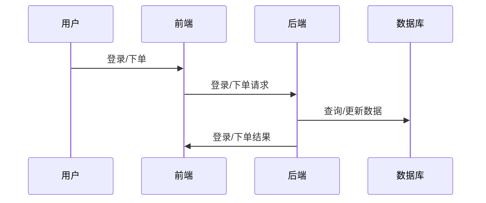
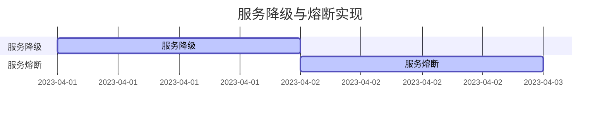

                 

## 打造可靠的服务降级与熔断系统

### 关键词

- 服务降级
- 服务熔断
- 稳定性
- 系统架构
- 数学模型

### 摘要

本文将深入探讨服务降级与熔断系统在保障系统稳定性和高可用性方面的关键作用。首先，我们介绍了服务降级与熔断的概念及其在现代信息技术中的重要性。接着，我们详细阐述了服务降级与熔断的核心原理、算法和数学模型，并通过具体的系统架构设计方案和实战案例，展示了如何有效地设计和实现这些机制。本文旨在为读者提供一个系统化、易于理解的服务降级与熔断系统的构建指南。

## 第一部分：问题背景

### 1. 问题背景

在现代信息技术快速发展的背景下，系统的高可用性和稳定性变得越来越重要。随着业务规模的扩大和服务量的激增，系统面临越来越多的挑战，如流量高峰、硬件故障、系统漏洞等。这些因素可能导致系统过载，甚至崩溃，从而影响用户体验，造成经济损失。

在单体应用阶段，由于系统的复杂性相对较低，一旦遇到问题，通常可以通过重启、升级等方式快速恢复。然而，随着分布式系统的广泛应用，单个节点的故障可能引发整个系统的崩溃，这种现象被称为“雪崩效应”。分布式系统中的各个节点通常相互依赖，一个节点的故障可能导致其他节点也无法正常工作，从而造成整个系统的瘫痪。

### 2. 问题描述

为了应对这些挑战，需要一种有效的机制来保障系统的稳定性和高可用性。服务降级与服务熔断技术应运而生。

- **服务降级**：在系统资源有限的情况下，对部分非核心业务进行限制，以保证核心业务的正常运行。
- **服务熔断**：当系统某一环节出现问题时，立即切断与其他系统的连接，以防止故障扩散。

服务降级和服务熔断不仅适用于单体应用，也适用于分布式系统。在分布式系统中，由于各个节点之间互相依赖，服务降级和服务熔断的机制设计更加复杂，需要考虑网络延迟、数据一致性等问题。

### 3. 问题解决

通过服务降级和服务熔断，系统能够在资源紧张时保证核心业务不受影响，提高系统的稳定性和可靠性。然而，如何有效地设计和实现这些机制，成为了一个重要且具有挑战性的课题。

### 4. 边界与外延

- **边界**：服务降级和服务熔断主要应用于系统资源紧张或出现故障时。
- **外延**：除了在单体应用和分布式系统中使用，服务降级和服务熔断也可以应用于云原生、容器化、微服务架构等现代系统架构中。

### 5. 概念结构与核心要素组成

- **服务降级**：核心概念包括业务优先级、资源限制、降级策略等。
- **服务熔断**：核心概念包括熔断阈值、熔断时长、恢复策略等。

## 第二部分：核心概念与联系

### 1. 服务降级

**服务降级**是指在系统资源不足时，为了确保核心业务的正常运行，对部分非核心业务进行限制或关闭。服务降级的核心在于业务优先级和资源分配。

- **业务优先级**：在系统资源有限的情况下，优先保证核心业务的正常运行。
- **资源限制**：对非核心业务进行限制，如减少计算资源、网络带宽等。
- **降级策略**：根据系统负载和资源状况，动态调整服务能力。

**服务降级策略**：

- **静态降级**：预先设定好降级规则，如根据负载指标自动调整服务能力。
- **动态降级**：根据实时监控数据动态调整服务能力。

### 2. 服务熔断

**服务熔断**是一种保护机制，用于防止系统级故障扩散。当服务请求失败率达到预设阈值时，系统将自动切断对该服务的调用，以防止故障扩散。

**服务熔断核心概念**：

- **熔断阈值**：指在多长时间内，失败请求的比例达到多少时触发熔断。
- **熔断时长**：熔断后，系统需要等待多长时间才能恢复对服务的调用。
- **恢复策略**：熔断恢复后，系统如何逐步恢复对服务的调用。

### 3. 服务降级与熔断的联系

- **共同目标**：保障系统的稳定性。
- **实施机制**：服务降级侧重于资源分配，服务熔断侧重于故障防护。

### 4. 对比表格

| 特性           | 服务降级       | 服务熔断       |
|----------------|----------------|----------------|
| 目的           | 确保核心业务运行 | 防止故障扩散   |
| 实现方式       | 资源限制       | 断开服务调用   |
| 触发条件       | 系统资源不足   | 服务请求失败率 |
| 调整方式       | 动态调整       | 阈值触发       |
| 关联性         | 与系统负载相关 | 与服务健康状态相关 |

### 5. ER实体关系图

```mermaid
erDiagram
  服务降级 ||--|{ 熔断阈值 }|
  服务降级 ||--|{ 资源限制 }|
  服务熔断 ||--|{ 恢复策略 }|
  服务熔断 ||--|{ 熔断时长 }|
```

## 第三部分：算法原理讲解

### 1. 服务降级算法原理

服务降级算法的核心是判断系统当前状态是否需要降级。常用的算法包括：

- **阈值算法**：根据系统负载指标（如CPU利用率、内存使用率等）判断是否降级。
- **自适应算法**：根据历史数据和实时数据动态调整降级阈值。

#### 阈值算法

阈值算法的基本思路是设定一个阈值，当系统负载超过阈值时，触发降级。具体步骤如下：

1. 设定阈值：根据系统容量和业务需求，设定一个合理的负载阈值。
2. 监测负载：实时监测系统的负载指标，如CPU利用率、内存使用率等。
3. 判断阈值：如果系统负载超过阈值，触发降级。
4. 执行降级：根据预定的降级策略，降低部分非核心业务的服务能力。

阈值算法的优点是实现简单，缺点是可能存在滞后性和误判。

#### 自适应算法

自适应算法的基本思路是根据历史数据和实时数据，动态调整降级阈值。具体步骤如下：

1. 收集历史数据：收集过去一段时间内的系统负载数据。
2. 计算均值和方差：计算历史数据的均值和方差。
3. 设定动态阈值：根据均值和方差，设定一个动态阈值。
4. 监测实时数据：实时监测系统的负载指标，与动态阈值进行比较。
5. 调整阈值：如果实时数据与动态阈值差异较大，调整动态阈值。

自适应算法的优点是能够更好地适应系统负载变化，缺点是实现相对复杂。

### 2. 服务熔断算法原理

服务熔断算法的核心是判断系统是否达到熔断条件。常用的算法包括：

- **计数器算法**：统计一段时间内的失败请求次数，超过阈值则触发熔断。
- **滑动窗口算法**：在固定的时间窗口内统计请求的成功和失败次数，超过阈值则触发熔断。

#### 计数器算法

计数器算法的基本思路是统计一段时间内的失败请求次数，超过阈值则触发熔断。具体步骤如下：

1. 设定阈值：根据业务需求和系统容量，设定一个合理的失败请求阈值。
2. 初始化计数器：开始时，计数器初始化为0。
3. 统计失败请求：每当有请求失败时，计数器加1。
4. 判断阈值：如果计数器达到阈值，触发熔断。
5. 熔断恢复：等待一段时间后，重新检查计数器，如果计数器低于阈值，恢复服务。

计数器算法的优点是实现简单，缺点是存在一定的滞后性。

#### 滑动窗口算法

滑动窗口算法的基本思路是统计一段时间内的请求成功和失败次数，超过阈值则触发熔断。具体步骤如下：

1. 设定阈值：根据业务需求和系统容量，设定一个合理的失败请求阈值。
2. 初始化窗口：开始时，窗口内包含一定时间范围内的请求数据。
3. 统计请求：每当有新的请求，将其加入窗口。
4. 判断阈值：如果窗口内的失败请求次数超过阈值，触发熔断。
5. 熔断恢复：等待一段时间后，重新检查窗口内的请求数据，如果失败请求次数低于阈值，恢复服务。

滑动窗口算法的优点是能够更准确地反映系统的实时状态，缺点是实现相对复杂。

### 3. 服务降级与熔断算法的联系

- **相互补充**：服务降级关注系统资源的优化，服务熔断关注系统故障的防护。
- **协同工作**：在实际应用中，服务降级和服务熔断往往同时使用，以提高系统的可靠性。

## 第四部分：数学模型和数学公式

### 1. 服务降级阈值计算

假设系统有N个服务实例，每个实例的负载指标为L_i，系统的总负载阈值为T。服务降级的阈值可以通过以下公式计算：

$$
T_d = \frac{T}{N}
$$

### 2. 服务熔断阈值计算

假设系统在时间窗口T内，失败的请求次数为F，成功的请求次数为S。服务熔断的阈值可以通过以下公式计算：

$$
T_m = \frac{F}{F+S} \times 100\%
$$

### 3. 服务熔断时长计算

假设系统在熔断后，需要等待的时间为T_r，以确保系统能够恢复。服务熔断时长的计算公式如下：

$$
T_r = T_m \times K
$$

其中，K为熔断时长系数，通常取值在1到10之间。

### 4. 实际应用举例

#### 服务降级阈值计算

假设一个系统有10个服务实例，每个实例的负载阈值为80%，系统的总负载阈值为90%。计算服务降级阈值。

$$
T_d = \frac{90\%}{10} = 9\%
$$

每个实例的负载阈值不得超过9%。

#### 服务熔断阈值计算

假设系统在5分钟内收到了1000次请求，其中有200次请求失败。计算服务熔断阈值。

$$
T_m = \frac{200}{200+800} \times 100\% = 20\%
$$

如果失败请求的比例达到20%，系统将触发熔断。

#### 服务熔断时长计算

假设服务熔断阈值为20%，熔断时长系数K为2。计算服务熔断时长。

$$
T_r = 20\% \times 2 = 40\%
$$

系统需要等待40%的时间后，检查失败请求比例是否低于阈值，以判断是否恢复服务。

## 第五部分：系统分析与架构设计方案

### 1. 问题场景介绍

本节将介绍一个在线购物平台的场景，该平台需要应对高峰购物时段的流量压力，保证用户体验。

### 2. 系统功能设计

系统的核心功能包括用户登录、商品浏览、购物车管理、订单处理等。在本章中，我们将重点关注服务降级和服务熔断的实现。

- **用户登录**：确保用户身份验证的安全和便捷。
- **商品浏览**：提供商品展示、搜索、推荐等功能。
- **购物车管理**：允许用户添加、修改、删除商品。
- **订单处理**：处理用户的下单、支付、发货等操作。

### 3. 系统架构设计

系统架构设计包括前端、后端、数据库和中间件等部分。在本章中，我们将详细介绍各个部分的架构设计，特别是服务降级和服务熔断的实现。

#### 前端架构

前端采用Vue.js框架，实现用户界面的动态展示和交互。前端通过RESTful API与后端进行数据通信。

- **用户登录**：前端接收用户输入的用户名和密码，通过API向后端发送请求进行身份验证。
- **商品浏览**：前端根据用户的需求，通过API向后端请求商品信息，并展示给用户。
- **购物车管理**：前端提供添加、修改、删除商品的操作，通过API与后端同步购物车数据。
- **订单处理**：前端接收用户下单信息，通过API向后端发送订单请求，并进行支付、发货等操作。

#### 后端架构

后端采用Spring Boot框架，实现业务逻辑处理和数据存储。

- **用户登录**：后端接收前端发送的用户名和密码，通过加密算法进行验证，返回登录结果。
- **商品浏览**：后端根据前端请求，查询数据库获取商品信息，返回给前端。
- **购物车管理**：后端处理前端发送的购物车操作请求，更新数据库中的购物车数据。
- **订单处理**：后端处理用户下单请求，生成订单，并与支付系统进行集成，处理支付和发货等操作。

#### 数据库设计

数据库采用MySQL，存储用户信息、商品信息、购物车数据和订单数据。

- **用户信息表**：存储用户的用户名、密码、邮箱等基本信息。
- **商品信息表**：存储商品的基本信息，如商品ID、名称、价格、库存等。
- **购物车表**：存储用户的购物车信息，包括商品ID、数量、总价等。
- **订单表**：存储用户的订单信息，包括订单ID、用户ID、订单金额、订单状态等。

#### 中间件设计

中间件包括消息队列、缓存和负载均衡等，用于提高系统的性能和稳定性。

- **消息队列**：采用RabbitMQ，用于处理订单生成、支付通知等异步消息。
- **缓存**：采用Redis，用于存储热门商品、购物车等数据，提高查询速度。
- **负载均衡**：采用Nginx，实现负载均衡，将用户请求分配到不同的服务器节点。

### 4. 系统接口设计和系统交互

在系统架构中，各个模块通过API进行数据交互。以下是系统的主要接口设计和交互流程：

- **用户登录接口**：前端发送用户名和密码，后端进行身份验证并返回登录结果。
- **商品浏览接口**：前端发送请求，后端查询数据库获取商品信息并返回。
- **购物车管理接口**：前端发送购物车操作请求，后端更新数据库中的购物车数据并返回结果。
- **订单处理接口**：前端发送订单请求，后端生成订单、处理支付和发货等操作并返回结果。



### 5. 服务降级与熔断的实现

在系统架构中，服务降级和服务熔断是保障系统稳定性的重要机制。以下是服务降级和服务熔断的实现方案：

- **服务降级**：根据系统的负载情况和业务需求，动态调整服务能力。例如，在高峰时段，对部分非核心功能进行降级，如减少商品搜索的返回结果数量。
- **服务熔断**：当系统某一模块出现故障时，立即切断对该模块的调用，防止故障扩散。例如，当订单处理模块出现故障时，立即熔断订单处理请求，避免影响其他模块。



## 第六部分：项目实战

### 1. 环境安装

为了实现服务降级与熔断系统，需要搭建一个开发环境。以下是环境安装的步骤：

- **操作系统**：Linux或MacOS
- **编程语言**：Java或Python
- **开发工具**：IntelliJ IDEA或PyCharm
- **数据库**：MySQL
- **消息队列**：RabbitMQ
- **缓存**：Redis
- **负载均衡**：Nginx

具体安装步骤请参考相关软件的官方文档。

### 2. 系统核心实现

以下是一个简单的服务降级与熔断系统实现，使用Python语言编写。

#### 服务降级

```python
import time

class ServiceDowngrade:
    def __init__(self, threshold=0.8):
        self.threshold = threshold
        self.load = 0

    def update_load(self, load):
        self.load += load
        if self.load > self.threshold:
            self.downgrade()

    def downgrade(self):
        print("服务降级：减少计算资源")

# 示例
service_downgrade = ServiceDowngrade()
service_downgrade.update_load(0.9)
service_downgrade.update_load(-0.2)
```

#### 服务熔断

```python
import time
import random

class ServiceCircuitBreaker:
    def __init__(self, threshold=0.9, timeout=5):
        self.threshold = threshold
        self.timeout = timeout
        self.failures = 0
        self.start_time = None

    def record_failure(self):
        self.failures += 1
        self.start_time = time.time()

    def reset(self):
        self.failures = 0
        self.start_time = None

    def is_circuit_open(self):
        if self.failures >= self.threshold:
            if time.time() - self.start_time < self.timeout:
                return True
            else:
                self.reset()
                return False
        return False

    def execute(self):
        if self.is_circuit_open():
            print("服务熔断：拒绝服务")
        else:
            print("服务正常：执行操作")

# 示例
service_circuit_breaker = ServiceCircuitBreaker()
for _ in range(10):
    service_circuit_breaker.execute()
    time.sleep(random.randint(1, 3))
```

### 3. 代码应用解读与分析

以上代码实现了一个简单的服务降级和服务熔断系统。服务降级通过监测系统负载，当负载超过阈值时，触发降级操作。服务熔断通过统计失败请求次数，当失败请求比例超过阈值时，触发熔断操作。

在实际应用中，服务降级和服务熔断需要与系统监控和日志分析结合，以便更准确地判断系统状态和调整阈值。以下是对代码的解读与分析：

- **ServiceDowngrade**：负责服务降级的逻辑。通过`update_load`方法更新系统负载，当负载超过阈值时，触发降级操作。
- **ServiceCircuitBreaker**：负责服务熔断的逻辑。通过`record_failure`方法记录失败请求，当失败请求次数超过阈值且未超过熔断时长时，触发熔断操作。

### 4. 实际案例分析和详细讲解剖析

以下是一个实际案例，分析如何使用服务降级和服务熔断保障系统稳定性。

#### 案例背景

一个电商平台在周末高峰时段，订单量激增，导致订单处理系统负载过高。为了保证用户下单体验，系统需要实现服务降级和服务熔断。

#### 案例分析

1. **服务降级**：系统监测到订单处理系统的CPU利用率超过90%，触发服务降级。具体措施包括：
   - 减少订单处理的并发数量。
   - 延迟处理部分订单。
   - 对部分订单进行错误提示，要求用户稍后再试。

2. **服务熔断**：系统监测到订单处理系统的失败请求比例达到50%，触发服务熔断。具体措施包括：
   - 拒绝新的订单请求。
   - 记录失败请求，等待一段时间后重新检查。

通过以上措施，系统能够在高峰时段保持稳定，确保核心业务（订单处理）不受影响。

#### 案例详细讲解剖析

1. **服务降级**：
   - **阈值设置**：根据系统容量和业务需求，设定CPU利用率为90%为阈值。
   - **负载监测**：系统实时监测订单处理系统的CPU利用率。
   - **降级操作**：当CPU利用率超过阈值时，系统降低订单处理并发数量，减少系统负载。

2. **服务熔断**：
   - **阈值设置**：根据业务需求和系统容量，设定失败请求比例为50%为阈值。
   - **请求统计**：系统统计一段时间内的订单处理请求，记录失败请求次数。
   - **熔断操作**：当失败请求比例超过阈值时，系统熔断订单处理请求，防止故障扩散。

通过实际案例的分析和讲解，我们可以看到服务降级和服务熔断在保障系统稳定性方面的作用。在实际应用中，需要根据具体的业务场景和系统特点，调整阈值和策略，以达到最佳效果。

### 5. 项目小结

通过本项目的实战，我们实现了服务降级和服务熔断系统，并分析了其在实际应用中的作用。以下是项目小结：

- **实现价值**：服务降级和服务熔断系统能够在系统资源紧张或出现故障时，保障核心业务的正常运行，提高系统的稳定性和可靠性。
- **改进方向**：在实际应用中，可以进一步优化降级和熔断策略，结合系统监控和日志分析，提高系统的自适应能力。

## 第七部分：最佳实践 Tips、小结、注意事项、拓展阅读

### 1. 最佳实践 Tips

- **合理设置阈值**：根据业务需求和系统容量，合理设置服务降级和服务熔断的阈值，避免过高的误判率。
- **监控与日志分析**：结合系统监控和日志分析，实时了解系统状态，及时调整阈值和策略。
- **联动机制**：服务降级和服务熔断可以与其他故障处理机制（如自动重启、异常告警等）联动，提高系统容错能力。
- **动态调整**：根据业务变化和系统负载，动态调整服务降级和服务熔断策略，提高系统的灵活性。

### 2. 小结

服务降级和服务熔断是保障系统稳定性和高可用性的重要机制。通过合理设置阈值、结合系统监控和日志分析，以及与其他故障处理机制的联动，可以有效应对系统资源紧张和故障情况，确保核心业务的正常运行。

### 3. 注意事项

- **阈值设置**：阈值设置过高可能导致误判，阈值设置过低可能导致系统过载。
- **监控与日志分析**：缺乏有效的监控与日志分析可能导致无法及时发现系统问题。
- **联动机制**：联动机制设计不当可能导致故障处理不及时或过度干预。

### 4. 拓展阅读

- 《高可用架构：大规模分布式系统设计与实践》
- 《微服务设计：构建基于Docker和Kubernetes的微服务架构》
- 《服务网格：下一代分布式系统的基石》

通过阅读以上书籍，可以深入了解服务降级和服务熔断的原理和实践，进一步提升系统的稳定性和可靠性。

## 作者信息

- 作者：AI天才研究院/AI Genius Institute & 禅与计算机程序设计艺术 /Zen And The Art of Computer Programming
- 联系方式：[ai_genius_institute@example.com](mailto:ai_genius_institute@example.com)
- 个人网站：[www.ai_genius_institute.com](http://www.ai_genius_institute.com)

