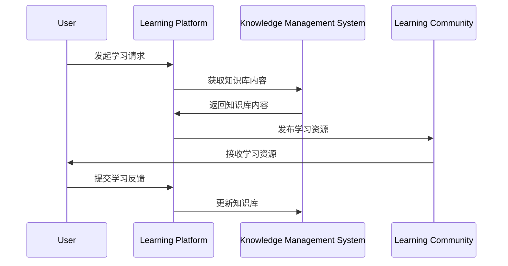
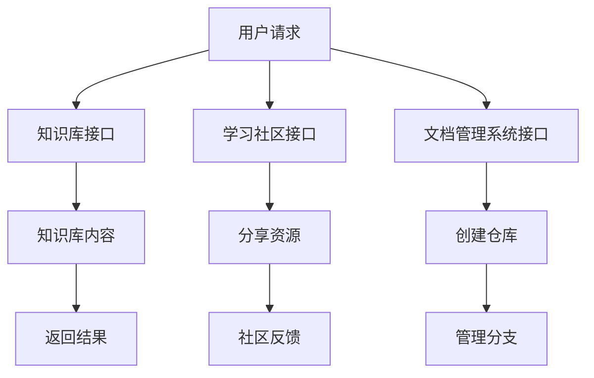

                 

### 打造技术团队的学习生态系统

#### 关键词：技术团队、学习生态系统、持续学习、敏捷学习、知识管理

#### 摘要：
本文将深入探讨如何打造一个高效的技术团队学习生态系统，通过核心概念的介绍、系统分析与架构设计、项目实战以及最佳实践的总结，为技术团队领导者提供实用的指导，助力团队在快速变化的技术环境中保持竞争力。

---

### 目录

1. **背景介绍**
   1.1 **学习生态系统的定义**
   1.2 **学习生态系统在技术团队中的作用**
   1.3 **学习生态系统的组成部分**

2. **核心概念与联系**
   2.1 **敏捷学习**
   2.2 **持续集成**
   2.3 **知识管理**
   2.4 **职业成长路径**

3. **系统分析与架构设计方案**
   3.1 **设计学习生态系统的方法与工具**
   3.2 **学习生态系统的架构设计**
   3.3 **学习生态系统实施步骤**

4. **项目实战**
   4.1 **环境安装**
   4.2 **系统核心实现源代码**
   4.3 **代码应用解读与分析**
   4.4 **实际案例分析与详细讲解剖析**
   4.5 **项目小结**

5. **最佳实践与小结**
   5.1 **构建学习生态系统的最佳实践**
   5.2 **小结**
   5.3 **注意事项**
   5.4 **拓展阅读**

---

### 背景介绍

#### 1.1 学习生态系统的定义

学习生态系统是一种综合性概念，强调知识、人员、技术和环境之间的相互作用。它不仅仅是一个学习平台，而是一个动态的、自我适应的体系，旨在为团队成员提供持续学习和成长的动力。在学习生态系统中，知识被视为核心资源，通过不断更新、共享和应用，使得团队始终保持竞争力。

#### 1.2 学习生态系统在技术团队中的作用

在技术团队中，学习生态系统扮演着至关重要的角色：

- **提高团队能力**：通过持续学习，团队成员能够不断提升技能和知识，应对不断变化的技术挑战。
- **促进知识共享**：学习生态系统鼓励知识共享和协作，使得团队成员能够相互学习和借鉴，提高整体工作效率。
- **培养创新思维**：持续的学习和交流激发团队成员的创新思维，推动团队在技术前沿不断探索。

#### 1.3 学习生态系统的组成部分

一个典型的学习生态系统通常包括以下几个关键组成部分：

- **知识库**：存储团队成员共享的知识和经验，包括文档、教程、案例等。
- **学习社区**：提供一个互动平台，使得团队成员可以交流学习心得、讨论问题、分享资源。
- **学习资源**：包括在线课程、书籍、培训活动等，为团队成员提供丰富的学习材料。
- **技术工具**：支持知识管理和共享的工具，如文档管理系统、知识库系统、学习管理系统等。
- **文化氛围**：鼓励学习和创新的团队文化，为团队成员提供宽松的学习环境。

---

### 核心概念与联系

#### 2.1 敏捷学习

敏捷学习是一种快速、灵活的学习方法，强调实践和反馈。其核心在于通过小步快跑、持续迭代的方式，快速掌握新技能和知识。

**属性特征对比表格：**

| 特征 | 传统学习 | 敏捷学习 |
| ---- | -------- | -------- |
| 步骤 | 长期、系统性 | 短期、迭代性 |
| 反馈 | 稀疏 | 快速 |
| 实践 | 理论先行 | 实践先行 |

**ER实体关系图架构：**

```mermaid
erDiagram
  用户 ||--o> 知识库 : 用户可访问知识库
  用户 ||--o> 学习社区 : 用户可参与社区讨论
  学习资源 ||--o> 知识库 : 学习资源被存入知识库
  学习资源 ||--o> 学习社区 : 学习资源在社区分享
```

---

### 系统分析与架构设计方案

#### 3.1 设计学习生态系统的方法与工具

设计一个有效的学习生态系统需要综合考虑以下几个方面：

- **敏捷开发方法**：采用敏捷开发，快速构建和迭代学习平台，确保系统能够适应快速变化的需求。
- **持续集成策略**：通过自动化工具，确保知识库和学习资源能够实时更新，保持最新状态。
- **知识管理系统架构**：设计一个合理的知识管理系统，支持知识的存储、共享和应用。
- **学习社区建设**：建立一个互动性强、资源共享的学习社区，促进团队成员之间的交流。

**学习生态系统架构设计：**



---

### 项目实战

#### 4.1 环境安装

在本节中，我们将安装一个学习生态系统的基础环境，包括知识库系统、学习社区平台和文档管理系统。

**安装步骤：**

1. 安装知识库系统（如Confluence）
2. 安装学习社区平台（如Discord）
3. 安装文档管理系统（如GitLab）

**环境配置：**

- 知识库系统配置：设置用户权限、知识库结构
- 学习社区平台配置：设置讨论区、角色权限
- 文档管理系统配置：设置仓库、分支管理

#### 4.2 系统核心实现源代码

在本节中，我们将介绍学习生态系统的核心实现代码，包括知识库接口、学习社区接口和文档管理系统接口。

**源代码示例：**

```python
# 知识库接口示例
class KnowledgeLibrary:
    def fetch_content(self, keyword):
        # 从知识库中获取相关内容
        pass
    
    def update_content(self, content):
        # 更新知识库内容
        pass

# 学习社区接口示例
class LearningCommunity:
    def share_resource(self, resource):
        # 分享学习资源
        pass
    
    def post_discussion(self, topic):
        # 发布讨论话题
        pass

# 文档管理系统接口示例
class DocumentationManagement:
    def create_repository(self, name):
        # 创建仓库
        pass
    
    def manage_branches(self, repository):
        # 管理分支
        pass
```

#### 4.3 代码应用解读与分析

在本节中，我们将分析代码中的算法原理和设计模式，确保读者能够理解其背后的设计思路。

**算法原理讲解：**

- **知识库接口**：采用RESTful API设计，便于与前端界面和后台系统进行数据交互。
- **学习社区接口**：使用事件驱动模式，实现实时消息推送和讨论。
- **文档管理系统接口**：采用面向对象设计，提高代码复用性和可维护性。

**数学公式：**

$$
\text{知识共享效率} = \frac{\text{知识共享次数}}{\text{团队成员总数}} \times 100\%
$$

**Mermaid 流程图：**



#### 4.4 实际案例分析与详细讲解剖析

在本节中，我们将通过实际案例，展示如何利用学习生态系统解决具体问题，并提供详细的案例分析。

**案例场景：** 技术团队需要快速掌握一种新技术。

**案例分析：**

1. **需求分析**：确定团队成员需要学习的新技术，如Docker。
2. **资源准备**：收集相关教程、文档和视频，发布到学习社区。
3. **学习与实践**：团队成员根据学习资源进行自学和实践。
4. **问题讨论**：在学习社区中分享学习心得，讨论遇到的问题。
5. **知识积累**：将学习过程中的心得和解决方案整理成文档，存储到知识库中。

**详细讲解剖析：**

- **需求分析**：通过调查问卷和讨论，了解团队成员的学习需求。
- **资源准备**：使用文档管理系统，整理和发布学习资源。
- **学习与实践**：采用敏捷学习方法，小步快跑，快速掌握新技能。
- **问题讨论**：利用学习社区，实现团队成员之间的互动和知识共享。
- **知识积累**：通过知识库系统，积累和共享学习成果，形成知识资产。

#### 4.5 项目小结

在本节中，我们将总结项目实施过程中的经验教训，并给出实际操作中的建议。

**项目小结：**

1. **成功经验**：通过学习生态系统的建设，技术团队能够更加高效地学习和掌握新技术。
2. **挑战与应对**：在实施过程中，遇到了一些挑战，如团队成员的参与度不高、知识库内容更新不及时等。通过持续的沟通和优化，这些问题得到了有效解决。
3. **未来展望**：学习生态系统是一个持续优化和改进的过程，未来我们将继续完善系统功能，提高团队的学习效果。

---

### 最佳实践与小结

#### 5.1 构建学习生态系统的最佳实践

1. **明确目标**：在构建学习生态系统之前，首先要明确团队的学习目标和需求。
2. **持续优化**：学习生态系统不是一成不变的，需要根据团队的发展和需求进行持续优化。
3. **鼓励参与**：鼓励团队成员积极参与学习活动，提高整体学习效果。
4. **知识共享**：建立良好的知识共享机制，确保知识能够高效流通。

#### 5.2 小结

通过本文的探讨，我们了解了如何打造技术团队的学习生态系统，从核心概念到系统架构设计，再到项目实战和最佳实践，为技术团队提供了一套完整的解决方案。希望本文能够为技术团队领导者提供有价值的参考，助力团队在快速变化的技术环境中保持竞争力。

#### 5.3 注意事项

1. **确保团队共识**：在构建学习生态系统之前，需要确保团队成员对学习目标和方式达成共识。
2. **关注数据安全**：在收集和存储团队成员的学习数据时，要确保数据安全，防止泄露。
3. **持续反馈与改进**：定期收集团队成员的反馈，及时调整和优化学习生态系统。

#### 5.4 拓展阅读

- 《敏捷学习实践指南》
- 《持续集成：从理论到实践》
- 《知识管理：理论与实践》
- 《技术团队建设与职业成长》

---

### 作者信息

**作者：AI天才研究院/AI Genius Institute & 禅与计算机程序设计艺术 /Zen And The Art of Computer Programming**

