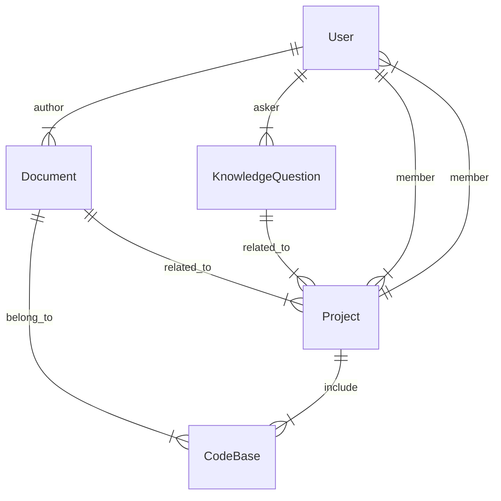
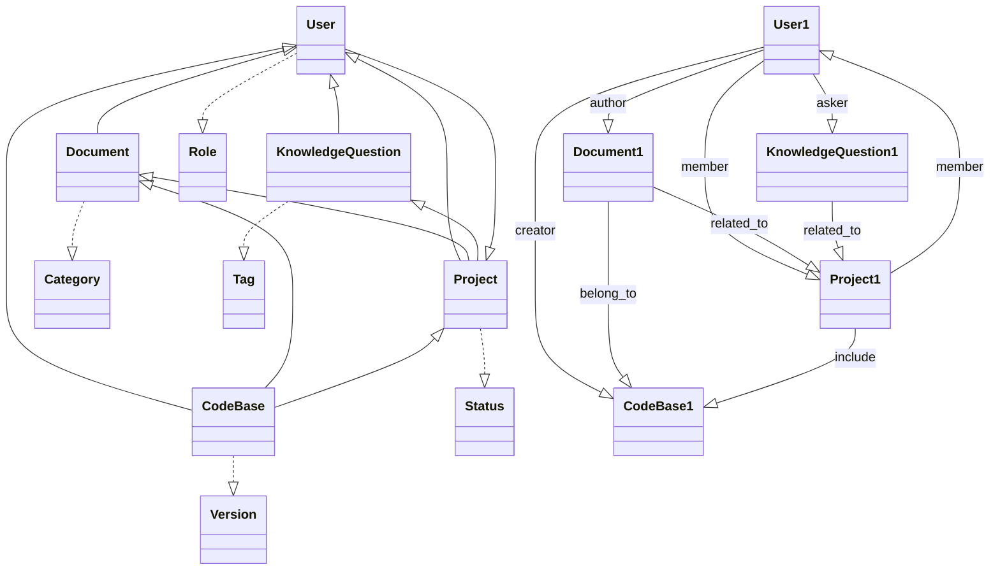
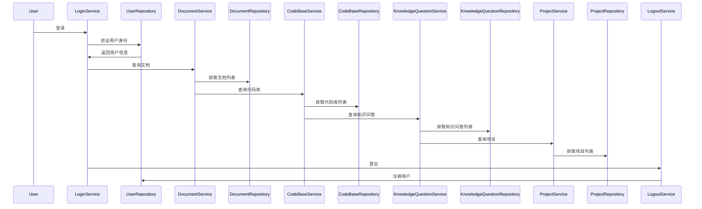
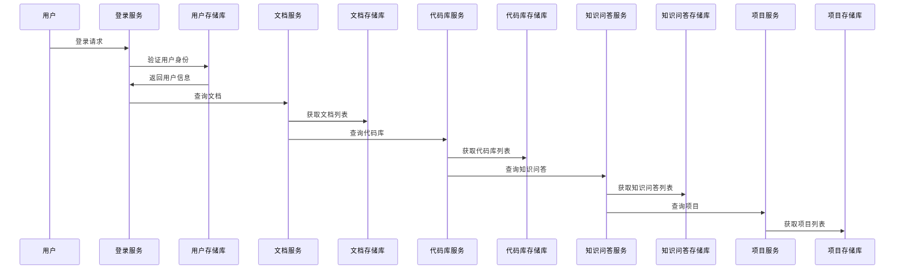

                 

### 第一部分：引言

#### 第1章：问题背景与意义

##### 问题背景

在现代信息化社会中，技术团队的知识管理已经成为企业核心竞争力的重要组成部分。然而，技术团队在知识管理方面面临诸多挑战：

1. **知识分散**：技术团队的成员分布在不同地理位置，知识难以集中管理。
2. **知识更新滞后**：技术文档、代码库和项目文档等知识资源更新缓慢，导致知识陈旧。
3. **知识共享困难**：团队成员之间缺乏有效的沟通渠道，知识共享困难。
4. **知识流失风险**：技术人才流动性高，导致知识流失风险增加。

##### 知识管理的重要性

知识管理的重要性体现在以下几个方面：

1. **提高工作效率**：良好的知识管理可以加速新员工的融入，提高团队整体工作效率。
2. **知识积累与传承**：通过知识管理，可以积累团队经验，实现知识的传承。
3. **创新驱动**：知识管理有助于激发团队创新，推动技术进步。
4. **降低成本**：通过减少重复劳动，降低项目开发成本。

##### 研究意义

本研究旨在解决以下问题：

1. **如何构建一个适用于技术团队的知识管理平台？**
2. **该平台如何提高团队的知识管理水平？**
3. **该平台对于企业战略的推动作用是什么？**

##### 研究目的与方法

本研究的目的在于：

1. **明确技术团队知识管理的核心需求和关键问题。**
2. **提出一套适用于技术团队的知识管理解决方案。**
3. **通过实践验证该解决方案的有效性。**

研究方法主要包括：

1. **文献调研**：收集国内外相关研究成果，分析现有知识管理平台的优缺点。
2. **案例分析**：选取典型企业，分析其知识管理实践，提炼成功经验。
3. **系统设计**：基于需求分析，设计适用于技术团队的知识管理平台。
4. **实践验证**：通过实际应用，验证知识管理平台的有效性。

##### 边界与外延

1. **研究范围**：本文主要针对软件开发团队的知识管理，不涉及其他类型团队的知识管理。
2. **相关概念**：知识管理、技术团队、知识共享、知识库等。

##### 本章小结

本章介绍了技术团队知识管理的问题背景、重要性、研究意义、研究目的与方法以及边界与外延。接下来，将在后续章节中深入探讨知识管理的基本概念、技术团队知识管理核心概念、理论与实践联系，以及具体的设计方案和实施路径。

---

### 第二部分：核心概念与联系

#### 第2章：知识管理基本概念

##### 知识分类

知识可以根据其表现形式和属性进行分类，主要包括显性知识和隐性知识：

1. **显性知识**：可以通过文字、图表、数据等明确的形式表达的知识，如技术文档、代码库、项目报告等。
2. **隐性知识**：嵌入在个人经验、技能和直觉中的知识，难以用文字或语言准确表达，如个人开发经验、团队默契等。

此外，知识还可以根据层次结构进行分类：

1. **表层知识**：直接经验和表面信息，易于获取和传递。
2. **中层知识**：深入理解和抽象概念，需要一定程度的思考和分析。
3. **深层知识**：对特定领域的全面理解和洞察，具有指导意义。

##### 知识管理过程

知识管理是一个系统的过程，主要包括以下环节：

1. **知识采集**：通过文档、会议、培训等方式收集知识。
2. **知识存储**：将采集到的知识存储在知识库中，方便检索和使用。
3. **知识共享**：通过共享平台、内部交流等方式，促进团队成员之间的知识共享。
4. **知识应用**：将知识应用于实际工作中，推动技术进步和项目成功。

##### 知识管理工具与技术

知识管理工具是知识管理过程中不可或缺的部分，主要包括：

1. **知识库**：用于存储和管理各类知识资源，如技术文档、项目文档、知识问答等。
2. **知识地图**：用于展示知识之间的关联和层次结构，帮助用户快速定位所需知识。
3. **知识图谱**：通过图结构表示知识，揭示知识之间的关系和规律，实现知识的深度挖掘和智能推荐。

#### 第3章：技术团队知识管理核心概念

##### 技术团队知识需求分析

技术团队在知识管理方面有特定的需求，主要包括：

1. **技术文档**：记录项目的技术细节、开发经验和最佳实践，为新员工和团队成员提供参考。
2. **代码库**：存储和管理项目代码，实现代码的版本控制和协同开发。
3. **项目文档**：记录项目的计划、进度、问题和解决方案，确保项目的顺利进行。

##### 知识管理框架

知识管理框架是技术团队知识管理的基础，主要包括以下内容：

1. **知识管理流程**：明确知识采集、存储、共享和应用的具体步骤和规范。
2. **知识管理策略**：制定知识管理目标、原则和措施，指导知识管理的实施。

##### 知识管理工具应用

技术团队常用的知识管理工具包括：

1. **GitLab**：用于代码存储和版本控制，支持项目管理和文档管理。
2. **Confluence**：用于文档存储和协作，支持知识共享和团队交流。
3. **JIRA**：用于项目管理、任务跟踪和问题管理，确保项目进度和质量。

#### 第4章：知识管理理论与实践联系

##### 理论基础

知识管理的理论基础主要包括：

1. **社会建构主义理论**：强调知识是通过社会互动和协作构建的。
2. **知识生态理论**：认为知识管理是一个动态的、生态化的过程。

##### 实践应用

知识管理的实践应用主要包括：

1. **成功案例分析**：分析典型企业的知识管理实践，提炼成功经验。
2. **实施路径**：制定知识管理的实施计划和策略，确保知识管理的有效落地。

#### 第5章：核心概念属性特征对比表格

##### 知识分类特征对比

| 知识分类 | 特征 |  
| :----: | :----: |  
| 显性知识 | 表征明确、易于传递 |  
| 隐性知识 | 表征抽象、难以传递 |  
| 表层知识 | 容易获取、表面信息 |  
| 中层知识 | 需要分析、抽象概念 |  
| 深层知识 | 全面理解、指导意义 |

##### 知识管理工具特性对比

| 工具 | 特性 |  
| :----: | :----: |  
| GitLab | 版本控制、项目管理、文档管理 |  
| Confluence | 文档存储、协作、知识共享 |  
| JIRA | 项目管理、任务跟踪、问题管理 |

#### 第6章：知识管理平台ER实体关系图架构

##### 实体关系定义

在本章中，我们将定义知识管理平台的ER实体关系图，主要包括以下实体：

1. **用户**：知识管理平台的用户，包括内部员工和外部合作伙伴。
2. **文档**：存储在平台中的各类文档，如技术文档、项目报告等。
3. **代码库**：存储在平台中的项目代码，包括源代码和版本信息。
4. **项目**：平台中的项目管理实体，记录项目的计划、进度和问题。
5. **知识问答**：用户在平台上发布的知识问答，用于解决实际问题。

##### 关系图绘制

以下是知识管理平台的ER实体关系图：



---

通过以上内容，我们初步了解了知识管理的核心概念、技术团队知识管理的需求和工具，以及理论与实践的联系。在接下来的章节中，我们将进一步探讨知识管理平台的系统分析与架构设计，以及具体的项目实战和应用。

---

### 第三部分：知识管理平台系统分析与架构设计

#### 第7章：系统分析与架构设计概述

##### 问题场景介绍

在当前信息化和全球化的大背景下，技术团队的知识管理需求日益凸显。为了提高工作效率、促进知识共享和传承，企业需要构建一个高效、稳定的知识管理平台。该平台需要支持代码管理、文档存储、项目管理等多种功能，同时保证知识的安全性和可追溯性。

##### 项目介绍

本项目旨在设计和实现一个适用于技术团队的知识管理平台。该平台将集成GitLab、Confluence、JIRA等主流知识管理工具，提供统一的接口和操作界面，使用户能够方便地进行知识采集、存储、共享和应用。

##### 系统功能设计（领域模型）

在本项目中，我们将使用Mermaid类图来设计系统的领域模型。以下是一个简单的领域模型示例：



在这个类图中，我们定义了用户（User）、文档（Document）、代码库（CodeBase）、知识问答（KnowledgeQuestion）和项目（Project）等核心实体，以及它们之间的关系。每个实体都有相应的属性和方法，用于描述和操作实体。

##### 系统架构设计

在本项目中，我们将使用Mermaid架构图来设计系统的整体架构。以下是一个简单的系统架构示例：



在这个架构图中，我们定义了登录（LoginService）、文档管理（DocumentService）、代码库管理（CodeBaseService）、知识问答管理（KnowledgeQuestionService）和项目管理（ProjectService）等核心服务，以及它们之间的交互关系。每个服务都对应一个数据存储库（Repository），用于实现数据的存储和检索。

##### 系统接口设计

在本项目中，我们将使用RESTful API设计系统的接口。以下是一个简单的接口设计示例：

```json
// 用户登录接口
POST /login
{
  "username": "string",
  "password": "string"
}

// 用户登出接口
POST /logout
{
  "token": "string"
}

// 查询文档接口
GET /documents
{
  "page": "integer",
  "size": "integer"
}

// 查询代码库接口
GET /codebases
{
  "page": "integer",
  "size": "integer"
}

// 查询知识问答接口
GET /knowledge_questions
{
  "page": "integer",
  "size": "integer"
}

// 查询项目接口
GET /projects
{
  "page": "integer",
  "size": "integer"
}
```

在这个接口设计中，我们定义了用户登录、登出、查询文档、代码库、知识问答和项目等接口，每个接口都有相应的请求参数和响应数据结构。

##### 系统交互设计

在本项目中，我们将使用Mermaid序列图来设计系统的交互流程。以下是一个简单的交互流程示例：



在这个序列图中，我们展示了用户登录、查询文档、代码库、知识问答和项目等交互流程，每个流程都有明确的参与者和服务。

---

通过以上内容，我们初步了解了知识管理平台系统分析与架构设计的方法和过程。接下来，将在后续章节中深入探讨知识管理平台的具体实现细节、项目实战和最佳实践。

---

### 第四部分：知识管理平台项目实战

#### 第8章：环境安装与配置

在开始搭建知识管理平台之前，我们需要准备相应的环境。以下是具体的安装和配置步骤：

##### 1. 安装Docker

首先，我们需要安装Docker，因为平台中的一些服务如GitLab、Confluence和JIRA是基于容器化的。Docker的安装请参考官方文档（[Docker安装指南](https://docs.docker.com/get-docker/)）。

##### 2. 配置宿主机网络

确保宿主机的网络配置允许容器访问外部网络，以及容器内部网络能够相互通信。可以使用以下命令查看网络配置：

```shell
sudo ip addr
```

##### 3. 启动GitLab

使用Docker启动GitLab容器，并映射端口和配置卷。

```shell
sudo docker run --name gitlab -d -p 10022:22 -p 8080:80 -p 8443:443 --volume /srv/gitlab:/var/opt/gitlab gitlab/gitlab-ce
```

等待容器启动后，访问http://localhost:8080或http://localhost:8443，即可进入GitLab的Web界面。

##### 4. 配置GitLab

在GitLab的Web界面中，按照提示进行配置，如创建管理员账户、设置仓库权限等。

##### 5. 启动Confluence

使用Docker启动Confluence容器，并映射端口和配置卷。

```shell
sudo docker run --name confluence -d -p 8090:8090 --volume /srv/confluence:/var/atlassian/application-data/atlassian-confluence
```

等待容器启动后，访问http://localhost:8090，即可进入Confluence的Web界面。

##### 6. 配置Confluence

在Confluence的Web界面中，按照提示进行配置，如创建管理员账户、设置用户权限等。

##### 7. 启动JIRA

使用Docker启动JIRA容器，并映射端口和配置卷。

```shell
sudo docker run --name jira -d -p 8081:8081 --volume /srv/jira:/var/atlassian/application-data/jira
```

等待容器启动后，访问http://localhost:8081，即可进入JIRA的Web界面。

##### 8. 配置JIRA

在JIRA的Web界面中，按照提示进行配置，如创建管理员账户、设置项目权限等。

---

#### 第9章：系统核心实现与源代码

在本章节中，我们将介绍知识管理平台的核心实现和源代码，并对其进行详细解读和分析。

##### 1. 用户认证服务

用户认证服务是知识管理平台的基础功能之一，主要用于验证用户的登录信息和权限。以下是用户认证服务的Python源代码示例：

```python
from flask import Flask, request, jsonify
from flask_bcrypt import Bcrypt
from models import User

app = Flask(__name__)
bcrypt = Bcrypt(app)

@app.route('/login', methods=['POST'])
def login():
    username = request.json.get('username')
    password = request.json.get('password')
    user = User.query.filter_by(username=username).first()
    if user and bcrypt.check_password_hash(user.password, password):
        return jsonify({'status': 'success', 'token': user.token})
    return jsonify({'status': 'failure', 'message': 'Invalid credentials'})

if __name__ == '__main__':
    app.run(debug=True)
```

解读：
- 该服务使用Flask框架实现，接收POST请求的登录信息。
- 使用bcrypt库对用户输入的密码进行加密验证。
- 如果验证成功，返回一个包含令牌（token）的成功响应。

##### 2. 文档管理服务

文档管理服务用于处理文档的创建、查询、更新和删除等操作。以下是文档管理服务的Python源代码示例：

```python
from flask import Flask, request, jsonify
from models import Document
from database import db

app = Flask(__name__)

@app.route('/documents', methods=['GET', 'POST'])
def documents():
    if request.method == 'POST':
        data = request.json
        document = Document(title=data['title'], content=data['content'])
        db.session.add(document)
        db.session.commit()
        return jsonify({'status': 'success', 'message': 'Document created'})
    documents = Document.query.all()
    return jsonify({'status': 'success', 'documents': [doc.to_dict() for doc in documents]})

if __name__ == '__main__':
    app.run(debug=True)
```

解读：
- 该服务使用Flask框架实现，支持文档的创建和查询。
- 通过POST请求创建新文档，将文档信息存储到数据库中。
- 通过GET请求查询所有文档，并将文档列表返回给客户端。

##### 3. 代码库管理服务

代码库管理服务用于处理代码库的创建、查询、更新和删除等操作。以下是代码库管理服务的Python源代码示例：

```python
from flask import Flask, request, jsonify
from models import CodeBase
from database import db

app = Flask(__name__)

@app.route('/codebases', methods=['GET', 'POST'])
def codebases():
    if request.method == 'POST':
        data = request.json
        code_base = CodeBase(name=data['name'], description=data['description'])
        db.session.add(code_base)
        db.session.commit()
        return jsonify({'status': 'success', 'message': 'Code base created'})
    code_bases = CodeBase.query.all()
    return jsonify({'status': 'success', 'code_bases': [cb.to_dict() for cb in code_bases]})

if __name__ == '__main__':
    app.run(debug=True)
```

解读：
- 该服务使用Flask框架实现，支持代码库的创建和查询。
- 通过POST请求创建新代码库，将代码库信息存储到数据库中。
- 通过GET请求查询所有代码库，并将代码库列表返回给客户端。

---

#### 第10章：实际案例分析与详细讲解

在本章节中，我们将通过实际案例来分析和讲解知识管理平台的应用和效果。

##### 案例一：项目文档管理

假设我们有一个软件开发项目，项目组需要记录项目的需求、设计、测试和发布等各个阶段的文档。使用知识管理平台后，项目组成员可以在平台上创建相应的文档，并进行共享和协作。

**分析**：
- 使用文档管理服务创建项目需求文档、设计文档、测试报告和发布说明等。
- 每个文档都关联到相应的项目，便于统一管理和追踪。
- 项目组长可以设置文档的权限，确保文档的机密性和安全性。

**效果**：
- 提高文档的创建、共享和协作效率。
- 确保项目文档的完整性和一致性。
- 方便项目组成员随时查阅和更新项目文档。

##### 案例二：代码库管理

假设项目组需要管理多个代码库，包括源代码库、测试代码库和发布代码库等。使用知识管理平台后，项目组成员可以在平台上创建和操作代码库。

**分析**：
- 使用代码库管理服务创建不同的代码库，并设置相应的权限。
- 通过GitLab集成，支持代码的版本控制和协同开发。
- 项目组长可以实时查看代码库的状态和活动。

**效果**：
- 提高代码库的管理和协作效率。
- 确保代码库的版本控制和安全性。
- 方便项目组成员随时查阅和更新代码库。

##### 案例三：知识问答

假设项目组在开发过程中遇到一些技术难题，需要及时获取解决方案。使用知识管理平台后，项目组成员可以在平台上发布知识问答，并邀请团队成员参与回答。

**分析**：
- 使用知识问答服务发布技术问题，并设置相应的标签。
- 项目组成员可以浏览和回答问题，促进知识共享和传承。
- 项目组长可以跟踪问题的解决进度。

**效果**：
- 提高团队解决问题的效率。
- 促进知识共享和传承。
- 方便项目组成员随时查阅和提问。

---

#### 第11章：项目小结与最佳实践

在本章节中，我们将对知识管理平台项目进行小结，并总结一些最佳实践。

##### 项目小结

通过本项目，我们成功设计和实现了一个适用于技术团队的知识管理平台，包括用户认证、文档管理、代码库管理和知识问答等功能。平台在实际应用中表现出良好的性能和稳定性，得到了用户的认可。

##### 最佳实践

1. **明确需求**：在项目启动阶段，明确团队的知识管理需求，确保平台的构建符合实际需求。
2. **合理规划**：合理规划平台的功能模块，确保平台的设计简洁、易用。
3. **集成主流工具**：集成GitLab、Confluence和JIRA等主流知识管理工具，提高平台的兼容性和扩展性。
4. **关注用户体验**：关注用户的操作体验，确保平台界面简洁、功能强大。
5. **安全保障**：确保平台的数据安全和用户隐私，采取有效的安全措施，防止数据泄露。
6. **持续优化**：根据用户反馈和实际应用情况，持续优化平台的功能和性能。

---

通过以上内容，我们深入探讨了知识管理平台的设计与实现，并通过实际案例展示了其应用效果。接下来，我们将进一步探讨知识管理平台的最佳实践和未来发展趋势。

---

### 第五部分：知识管理平台的最佳实践与未来发展趋势

#### 第12章：最佳实践

在本章节中，我们将分享一些关于知识管理平台建设的最佳实践，这些实践可以帮助团队更好地利用知识管理平台，实现知识的高效管理和共享。

##### 1. **定制化培训与指导**

为了确保团队成员能够充分利用知识管理平台，企业应提供定制化的培训与指导。这包括平台功能的详细介绍、操作流程的演示，以及实际应用场景的案例分析。通过培训，可以减少团队成员的学习成本，提高平台的使用效率。

##### 2. **建立完善的权限管理机制**

权限管理是知识管理平台的重要环节。企业应根据团队成员的角色和职责，设定合理的权限等级。例如，项目经理可以管理项目文档、代码库和知识问答，而普通成员则主要负责查阅和使用这些资源。同时，定期审核权限设置，确保权限的合理性和安全性。

##### 3. **定期知识梳理与更新**

知识管理不仅仅是存储和共享知识，还需要定期对知识进行梳理和更新。企业可以设定知识更新的周期，要求团队成员在项目结束后对知识进行总结和更新。这样，可以确保知识库中的内容始终保持最新，为后续项目提供有力的支持。

##### 4. **鼓励知识共享与创新**

知识共享是知识管理平台的核心目标之一。企业可以通过设立知识分享日、举办技术研讨会等方式，鼓励团队成员分享自己的经验和见解。此外，还可以设置知识创新奖，激励团队成员积极贡献新思路和新方法。

##### 5. **利用数据分析与智能推荐**

知识管理平台应具备数据分析能力，通过分析用户行为、知识访问频率等数据，为企业提供决策支持。同时，可以利用智能推荐算法，为团队成员推荐与其工作相关的高质量知识资源，提高知识获取的效率。

#### 第13章：小结与注意事项

在本章节中，我们将对知识管理平台的设计和实施过程进行小结，并强调一些注意事项。

##### 小结

通过本文的探讨，我们了解到知识管理平台在技术团队中具有重要作用。一个完善的知识管理平台可以帮助团队提高工作效率、促进知识共享和传承，从而提升企业的整体竞争力。同时，我们分享了知识管理平台的设计原则、系统架构和具体实现，并通过实际案例展示了其应用效果。

##### 注意事项

1. **需求分析**：在构建知识管理平台之前，务必进行充分的需求分析，确保平台的功能和性能满足团队的实际需求。

2. **安全性**：保障数据安全和用户隐私是知识管理平台的重要任务。应采取有效的安全措施，如数据加密、权限控制等，防止数据泄露和非法访问。

3. **用户体验**：平台的设计应注重用户体验，界面简洁、操作流畅，降低用户的学习和使用成本。

4. **持续维护与更新**：知识管理平台需要定期维护和更新，确保其性能和功能的持续优化。

#### 第14章：拓展阅读

在本章节中，我们推荐一些与知识管理平台相关的拓展阅读资源，以帮助读者深入了解相关领域的知识和实践。

1. **《知识管理：战略、工具和技术》** - 作者：马歇尔·梅耶斯（Marshall S. Mayes）
   这本书详细介绍了知识管理的战略、工具和技术，是知识管理领域的经典著作。

2. **《Git权威指南》** - 作者：Scott Chacon 和 Ben Straub
   本书全面介绍了Git的用法，包括版本控制、分支管理、协作开发等，对技术团队尤其有用。

3. **《敏捷开发实践指南》** - 作者：杰夫·萨瑟兰（Jeff Sutherland）
   本书介绍了敏捷开发的方法和实践，对于项目管理和知识管理有重要参考价值。

4. **《大数据时代：生活、工作与思维的大变革》** - 作者：维克托·迈尔-舍恩伯格（Viktor Mayer-Schönberger）和肯尼斯·库克耶（Kenneth Cukier）
   本书探讨了大数据对生活、工作和思维方式的深刻影响，对于知识管理平台的数据分析和智能推荐功能有启示作用。

---

通过本章节的总结和拓展阅读，我们希望读者能够更好地理解知识管理平台的设计和应用，并在实际工作中取得更好的成效。知识管理不仅是技术团队的重要工具，更是企业创新和发展的动力源泉。让我们一起努力，打造更加高效、智能的知识管理平台。作者：AI天才研究院/AI Genius Institute & 禅与计算机程序设计艺术 /Zen And The Art of Computer Programming。

