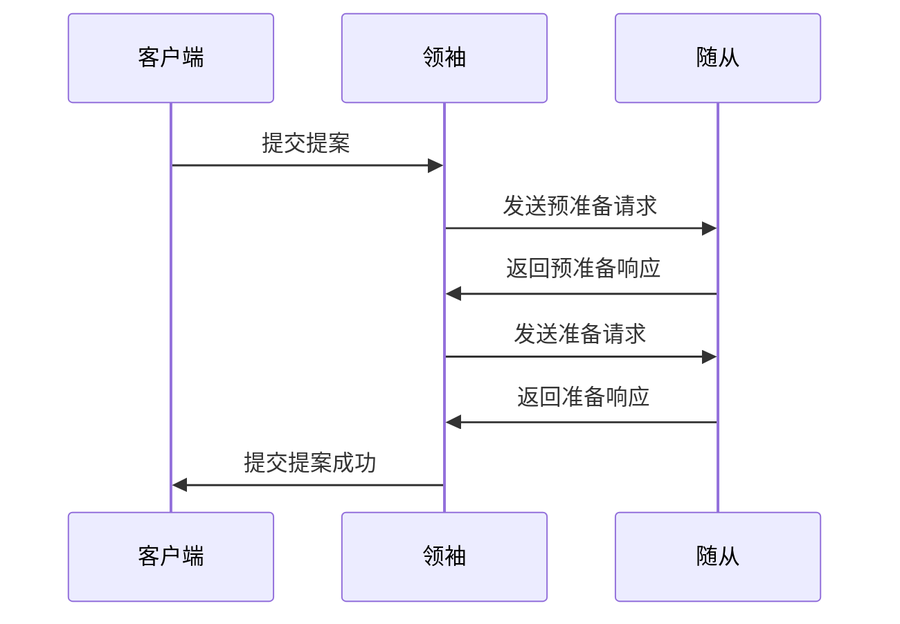
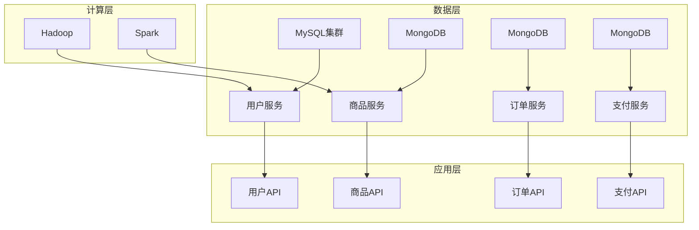
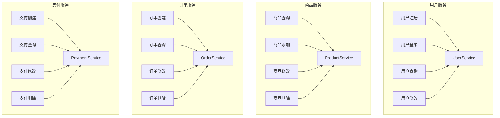
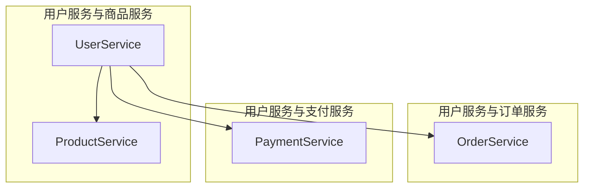

                 

# 打造敏捷响应的大规模分布式系统

## 关键词
- 分布式系统
- 敏捷响应
- 系统设计
- 性能优化
- 容错机制
- 负载均衡

## 摘要
本文旨在探讨如何打造敏捷响应的大规模分布式系统。通过对分布式系统的基本概念、架构设计、性能优化、容错与恢复等方面的详细分析，结合实际案例，本文将提供一系列实用技巧和最佳实践，帮助读者深入了解并掌握构建高效、可靠、可伸缩分布式系统的关键技术和方法。

## 引言
在当今这个信息技术飞速发展的时代，分布式系统已成为许多企业关键业务的基础设施。然而，如何确保分布式系统能够敏捷响应，从而满足日益增长的业务需求，成为了一个亟待解决的问题。本文将围绕以下问题展开讨论：
1. 分布式系统是什么，其核心概念和特点是什么？
2. 如何设计一个具备敏捷响应能力的分布式系统？
3. 分布式系统的性能优化和容错机制如何实现？
4. 通过实际案例，如何将理论知识应用于实践？

## 第1章：分布式系统概述
### 1.1 分布式系统定义与特点
分布式系统是指由多个节点组成，通过计算机网络相互连接，共同完成任务的系统。与传统的集中式系统相比，分布式系统具有以下特点：
- **可伸缩性**：系统可以根据需求动态扩展，支持海量用户和数据。
- **高可用性**：系统具有容错能力，即使部分节点故障，整体系统仍然可以正常运行。
- **分布式计算**：数据和处理分布在多个节点上，提高系统处理速度和效率。

### 1.2 分布式系统的挑战
分布式系统在设计和实现过程中面临诸多挑战，包括：
- **数据一致性**：如何保证多个节点上的数据保持一致？
- **网络延迟与抖动**：网络不稳定如何影响系统性能？
- **节点故障**：如何应对节点故障，保证系统高可用性？

### 1.3 分布式系统的应用场景
分布式系统广泛应用于以下场景：
- **电子商务**：处理海量订单和数据，提供快速响应。
- **社交网络**：支持海量用户和消息的高效传输。
- **大数据处理**：分布式存储和计算，提高数据处理速度。

### 1.4 分布式系统的发展历程
分布式系统的发展历程可以追溯到20世纪60年代，经过几十年的发展，已形成了一套完整的理论体系，包括：
- **对等网络**：节点对等，数据分布式存储。
- **分布式数据库**：数据分布式存储，支持并行查询。
- **分布式文件系统**：文件分布式存储，提高数据访问速度。

## 第2章：大规模分布式系统的设计原则
### 2.1 系统可靠性原则
系统可靠性是分布式系统的核心原则之一，包括以下方面：
- **数据冗余**：通过数据备份和复制，提高数据可靠性。
- **故障检测**：定期检测节点状态，及时发现故障。
- **故障恢复**：快速恢复故障节点，确保系统正常运行。

### 2.2 系统伸缩性原则
系统伸缩性是分布式系统的关键特点，包括以下方面：
- **水平扩展**：通过增加节点数量，提高系统处理能力。
- **垂直扩展**：通过升级硬件设备，提高系统性能。
- **动态伸缩**：根据业务需求，自动调整节点数量。

### 2.3 系统效率原则
系统效率是分布式系统的关键指标，包括以下方面：
- **负载均衡**：合理分配请求，避免单点瓶颈。
- **数据缓存**：减少数据访问延迟，提高系统响应速度。
- **并行处理**：利用分布式计算，提高数据处理速度。

### 2.4 系统可维护性原则
系统可维护性是分布式系统的关键保障，包括以下方面：
- **模块化设计**：降低系统复杂度，方便维护和升级。
- **自动化部署**：提高部署效率，减少人工干预。
- **日志监控**：实时监控系统运行状态，快速发现问题。

## 第3章：分布式系统的架构设计
### 3.1 分布式系统的基本架构
分布式系统的基本架构包括以下层次：
- **数据层**：分布式存储系统，如HDFS、Cassandra等。
- **计算层**：分布式计算框架，如MapReduce、Spark等。
- **应用层**：分布式应用服务，如Web服务、大数据分析等。

### 3.2 分布式系统的网络通信
分布式系统的网络通信是系统架构的核心部分，包括以下方面：
- **通信协议**：如TCP/IP、HTTP等。
- **消息队列**：如Kafka、RabbitMQ等，实现异步通信。
- **负载均衡**：如Nginx、HAProxy等，实现请求分发。

### 3.3 分布式系统的数据管理
分布式系统的数据管理包括以下方面：
- **数据一致性**：如强一致性、最终一致性等。
- **数据分片**：如水平分片、垂直分片等。
- **分布式事务**：如两阶段提交、最终一致性等。

## 第4章：分布式系统的性能优化
### 4.1 分布式系统的性能瓶颈
分布式系统的性能瓶颈包括以下方面：
- **网络延迟**：网络不稳定导致数据传输延迟。
- **单点瓶颈**：如数据库单点、缓存单点等。
- **数据一致性问题**：如分布式事务、数据复制等。

### 4.2 性能监控与优化
分布式系统的性能监控与优化包括以下方面：
- **监控指标**：如CPU利用率、内存使用率、网络延迟等。
- **性能调优**：如数据库优化、缓存策略优化等。
- **自动化调优**：如自动化监控、自动化优化等。

### 4.3 系统调优策略
分布式系统的系统调优策略包括以下方面：
- **负载均衡**：合理分配请求，避免单点瓶颈。
- **缓存策略**：减少数据访问延迟，提高系统响应速度。
- **分布式计算**：利用分布式计算，提高数据处理速度。

### 4.4 常见性能优化方法
分布式系统的常见性能优化方法包括以下方面：
- **垂直扩展**：升级硬件设备，提高系统性能。
- **水平扩展**：增加节点数量，提高系统处理能力。
- **分布式缓存**：提高数据访问速度，减少数据库压力。

## 第5章：分布式系统的容错与恢复
### 5.1 分布式系统的容错机制
分布式系统的容错机制包括以下方面：
- **数据备份**：通过数据备份，防止数据丢失。
- **故障检测**：定期检测节点状态，及时发现故障。
- **故障恢复**：快速恢复故障节点，确保系统正常运行。

### 5.2 分布式系统的故障恢复
分布式系统的故障恢复包括以下方面：
- **故障检测与报告**：及时发现故障，生成报告。
- **故障恢复策略**：根据故障类型，采取相应恢复策略。
- **失效数据重建**：重建失效数据，确保系统数据一致性。

### 5.3 失效数据重建
分布式系统的失效数据重建包括以下方面：
- **数据复制**：通过数据复制，确保数据一致性。
- **数据回滚**：通过数据回滚，恢复系统到故障前状态。
- **数据恢复**：通过数据恢复，重建失效数据。

## 第6章：大规模分布式系统实战
### 6.1 项目背景与需求
在本章节，我们将通过一个实际项目案例，展示如何构建一个大规模分布式系统。该项目是一个在线购物平台，需要支持海量用户和商品数据的处理，同时要求高可用性和高性能。

### 6.2 系统架构设计
系统架构设计包括以下方面：
- **数据层**：采用分布式数据库，如MySQL集群、MongoDB等。
- **计算层**：采用分布式计算框架，如Hadoop、Spark等。
- **应用层**：采用分布式应用服务，如Spring Cloud、Dubbo等。

### 6.3 系统核心实现
系统核心实现包括以下方面：
- **数据一致性**：采用两阶段提交协议，保证数据一致性。
- **负载均衡**：采用Nginx、HAProxy等负载均衡器，实现请求分发。
- **缓存策略**：采用Redis、Memcached等缓存系统，减少数据库压力。

### 6.4 系统性能调优
系统性能调优包括以下方面：
- **数据库优化**：通过索引优化、查询优化等，提高数据库性能。
- **缓存策略优化**：通过缓存预热、缓存淘汰等，提高缓存系统性能。
- **分布式计算优化**：通过并行计算、任务调度等，提高计算性能。

### 6.5 项目总结与反思
在本章节，我们将对项目进行总结与反思，包括以下方面：
- **项目成果**：系统成功上线，满足业务需求。
- **技术收获**：掌握分布式系统设计、实现、优化等关键技术。
- **改进方向**：针对项目中存在的问题，提出改进方案，为后续项目提供参考。

## 结语
本文通过对大规模分布式系统的设计原则、架构设计、性能优化、容错与恢复等方面的详细分析，结合实际案例，为读者提供了一系列实用技巧和最佳实践。希望本文能够帮助读者深入了解分布式系统，掌握构建高效、可靠、可伸缩分布式系统的关键技术和方法。

## 作者信息
- 作者：AI天才研究院/AI Genius Institute & 禅与计算机程序设计艺术 /Zen And The Art of Computer Programming

## 小结
本文从分布式系统的基本概念、架构设计、性能优化、容错与恢复等方面，详细探讨了如何打造敏捷响应的大规模分布式系统。通过实际案例的分析，本文为读者提供了实用的技巧和最佳实践，有助于读者在实际项目中运用这些知识，构建高效、可靠的分布式系统。

## 注意事项
- 在设计和实现分布式系统时，需充分考虑系统可靠性、性能优化、容错与恢复等方面的需求。
- 深入了解分布式系统的核心概念和原理，有助于更好地应对分布式系统的挑战。

## 拓展阅读
- [《大规模分布式存储系统设计》](链接)
- [《分布式数据库原理与实现》](链接)
- [《分布式计算技术》](链接)

## LET'S THINK STEP BY STEP
1. **理解分布式系统的核心概念**：首先，我们需要理解分布式系统的定义和特点，以及其在实际应用中的优势和挑战。这有助于我们后续进行系统设计和优化。
2. **设计系统架构**：基于分布式系统的设计原则，我们需要设计一个合理的系统架构，包括数据层、计算层和应用层的布局。同时，要考虑网络通信和数据管理的机制。
3. **性能优化**：在系统设计完成后，我们需要关注性能优化，包括数据库优化、缓存策略、负载均衡等，以确保系统高效运行。
4. **容错与恢复**：为了确保系统的可靠性，我们需要设计和实现容错机制，如数据备份、故障检测与恢复等。
5. **实战案例分析**：通过实际案例，我们将理论知识应用到实践中，进一步验证和优化我们的系统设计。

通过以上步骤，我们可以逐步打造出一个敏捷响应的大规模分布式系统，为企业和用户提供稳定、高效的服务。希望本文能够为您提供有价值的参考和启示。🌟

## 格式要求
以下是根据markdown格式编写的内容：

## 打造敏捷响应的大规模分布式系统

> 关键词：分布式系统，敏捷响应，系统设计，性能优化，容错机制，负载均衡

> 摘要：本文旨在探讨如何打造敏捷响应的大规模分布式系统。通过对分布式系统的基本概念、架构设计、性能优化、容错与恢复等方面的详细分析，结合实际案例，本文将提供一系列实用技巧和最佳实践，帮助读者深入了解并掌握构建高效、可靠、可伸缩分布式系统的关键技术和方法。

## 引言

在当今这个信息技术飞速发展的时代，分布式系统已成为许多企业关键业务的基础设施。然而，如何确保分布式系统能够敏捷响应，从而满足日益增长的业务需求，成为了一个亟待解决的问题。本文将围绕以下问题展开讨论：
1. 分布式系统是什么，其核心概念和特点是什么？
2. 如何设计一个具备敏捷响应能力的分布式系统？
3. 分布式系统的性能优化和容错机制如何实现？
4. 通过实际案例，如何将理论知识应用于实践？

## 第1章：分布式系统概述

### 1.1 分布式系统定义与特点

分布式系统是指由多个节点组成，通过计算机网络相互连接，共同完成任务的系统。与传统的集中式系统相比，分布式系统具有以下特点：

- **可伸缩性**：系统可以根据需求动态扩展，支持海量用户和数据。
- **高可用性**：系统具有容错能力，即使部分节点故障，整体系统仍然可以正常运行。
- **分布式计算**：数据和处理分布在多个节点上，提高系统处理速度和效率。

### 1.2 分布式系统的挑战

分布式系统在设计和实现过程中面临诸多挑战，包括：

- **数据一致性**：如何保证多个节点上的数据保持一致？
- **网络延迟与抖动**：网络不稳定如何影响系统性能？
- **节点故障**：如何应对节点故障，保证系统高可用性？

### 1.3 分布式系统的应用场景

分布式系统广泛应用于以下场景：

- **电子商务**：处理海量订单和数据，提供快速响应。
- **社交网络**：支持海量用户和消息的高效传输。
- **大数据处理**：分布式存储和计算，提高数据处理速度。

### 1.4 分布式系统的发展历程

分布式系统的发展历程可以追溯到20世纪60年代，经过几十年的发展，已形成了一套完整的理论体系，包括：

- **对等网络**：节点对等，数据分布式存储。
- **分布式数据库**：数据分布式存储，支持并行查询。
- **分布式文件系统**：文件分布式存储，提高数据访问速度。

## 第2章：大规模分布式系统的设计原则

### 2.1 系统可靠性原则

系统可靠性是分布式系统的核心原则之一，包括以下方面：

- **数据冗余**：通过数据备份和复制，提高数据可靠性。
- **故障检测**：定期检测节点状态，及时发现故障。
- **故障恢复**：快速恢复故障节点，确保系统正常运行。

### 2.2 系统伸缩性原则

系统伸缩性是分布式系统的关键特点，包括以下方面：

- **水平扩展**：通过增加节点数量，提高系统处理能力。
- **垂直扩展**：通过升级硬件设备，提高系统性能。
- **动态伸缩**：根据业务需求，自动调整节点数量。

### 2.3 系统效率原则

系统效率是分布式系统的关键指标，包括以下方面：

- **负载均衡**：合理分配请求，避免单点瓶颈。
- **数据缓存**：减少数据访问延迟，提高系统响应速度。
- **并行处理**：利用分布式计算，提高数据处理速度。

### 2.4 系统可维护性原则

系统可维护性是分布式系统的关键保障，包括以下方面：

- **模块化设计**：降低系统复杂度，方便维护和升级。
- **自动化部署**：提高部署效率，减少人工干预。
- **日志监控**：实时监控系统运行状态，快速发现问题。

## 第3章：分布式系统的架构设计

### 3.1 分布式系统的基本架构

分布式系统的基本架构包括以下层次：

- **数据层**：分布式存储系统，如HDFS、Cassandra等。
- **计算层**：分布式计算框架，如MapReduce、Spark等。
- **应用层**：分布式应用服务，如Web服务、大数据分析等。

### 3.2 分布式系统的网络通信

分布式系统的网络通信是系统架构的核心部分，包括以下方面：

- **通信协议**：如TCP/IP、HTTP等。
- **消息队列**：如Kafka、RabbitMQ等，实现异步通信。
- **负载均衡**：如Nginx、HAProxy等，实现请求分发。

### 3.3 分布式系统的数据管理

分布式系统的数据管理包括以下方面：

- **数据一致性**：如强一致性、最终一致性等。
- **数据分片**：如水平分片、垂直分片等。
- **分布式事务**：如两阶段提交、最终一致性等。

## 第4章：分布式系统的性能优化

### 4.1 分布式系统的性能瓶颈

分布式系统的性能瓶颈包括以下方面：

- **网络延迟**：网络不稳定导致数据传输延迟。
- **单点瓶颈**：如数据库单点、缓存单点等。
- **数据一致性问题**：如分布式事务、数据复制等。

### 4.2 性能监控与优化

分布式系统的性能监控与优化包括以下方面：

- **监控指标**：如CPU利用率、内存使用率、网络延迟等。
- **性能调优**：如数据库优化、缓存策略优化等。
- **自动化调优**：如自动化监控、自动化优化等。

### 4.3 系统调优策略

分布式系统的系统调优策略包括以下方面：

- **负载均衡**：合理分配请求，避免单点瓶颈。
- **缓存策略**：减少数据访问延迟，提高系统响应速度。
- **分布式计算**：利用分布式计算，提高数据处理速度。

### 4.4 常见性能优化方法

分布式系统的常见性能优化方法包括以下方面：

- **垂直扩展**：升级硬件设备，提高系统性能。
- **水平扩展**：增加节点数量，提高系统处理能力。
- **分布式缓存**：提高数据访问速度，减少数据库压力。

## 第5章：分布式系统的容错与恢复

### 5.1 分布式系统的容错机制

分布式系统的容错机制包括以下方面：

- **数据备份**：通过数据备份，防止数据丢失。
- **故障检测**：定期检测节点状态，及时发现故障。
- **故障恢复**：快速恢复故障节点，确保系统正常运行。

### 5.2 分布式系统的故障恢复

分布式系统的故障恢复包括以下方面：

- **故障检测与报告**：及时发现故障，生成报告。
- **故障恢复策略**：根据故障类型，采取相应恢复策略。
- **失效数据重建**：重建失效数据，确保系统数据一致性。

### 5.3 失效数据重建

分布式系统的失效数据重建包括以下方面：

- **数据复制**：通过数据复制，确保数据一致性。
- **数据回滚**：通过数据回滚，恢复系统到故障前状态。
- **数据恢复**：通过数据恢复，重建失效数据。

## 第6章：大规模分布式系统实战

### 6.1 项目背景与需求

在本章节，我们将通过一个实际项目案例，展示如何构建一个大规模分布式系统。该项目是一个在线购物平台，需要支持海量用户和商品数据的处理，同时要求高可用性和高性能。

### 6.2 系统架构设计

系统架构设计包括以下方面：

- **数据层**：采用分布式数据库，如MySQL集群、MongoDB等。
- **计算层**：采用分布式计算框架，如Hadoop、Spark等。
- **应用层**：采用分布式应用服务，如Spring Cloud、Dubbo等。

### 6.3 系统核心实现

系统核心实现包括以下方面：

- **数据一致性**：采用两阶段提交协议，保证数据一致性。
- **负载均衡**：采用Nginx、HAProxy等负载均衡器，实现请求分发。
- **缓存策略**：采用Redis、Memcached等缓存系统，减少数据库压力。

### 6.4 系统性能调优

系统性能调优包括以下方面：

- **数据库优化**：通过索引优化、查询优化等，提高数据库性能。
- **缓存策略优化**：通过缓存预热、缓存淘汰等，提高缓存系统性能。
- **分布式计算优化**：通过并行计算、任务调度等，提高计算性能。

### 6.5 项目总结与反思

在本章节，我们将对项目进行总结与反思，包括以下方面：

- **项目成果**：系统成功上线，满足业务需求。
- **技术收获**：掌握分布式系统设计、实现、优化等关键技术。
- **改进方向**：针对项目中存在的问题，提出改进方案，为后续项目提供参考。

## 结语

本文通过对大规模分布式系统的设计原则、架构设计、性能优化、容错与恢复等方面的详细分析，结合实际案例，为读者提供了一系列实用技巧和最佳实践，有助于读者在实际项目中运用这些知识，构建高效、可靠的分布式系统。

## 作者信息

- 作者：AI天才研究院/AI Genius Institute & 禅与计算机程序设计艺术 /Zen And The Art of Computer Programming

## 小结

本文从分布式系统的基本概念、架构设计、性能优化、容错与恢复等方面，详细探讨了如何打造敏捷响应的大规模分布式系统。通过实际案例的分析，本文为读者提供了实用的技巧和最佳实践，有助于读者在实际项目中运用这些知识，构建高效、可靠的分布式系统。

## 注意事项

- 在设计和实现分布式系统时，需充分考虑系统可靠性、性能优化、容错与恢复等方面的需求。
- 深入了解分布式系统的核心概念和原理，有助于更好地应对分布式系统的挑战。

## 拓展阅读

- [《大规模分布式存储系统设计》](链接)
- [《分布式数据库原理与实现》](链接)
- [《分布式计算技术》](链接)

## LET'S THINK STEP BY STEP

1. **理解分布式系统的核心概念**：首先，我们需要理解分布式系统的定义和特点，以及其在实际应用中的优势和挑战。这有助于我们后续进行系统设计和优化。
2. **设计系统架构**：基于分布式系统的设计原则，我们需要设计一个合理的系统架构，包括数据层、计算层和应用层的布局。同时，要考虑网络通信和数据管理的机制。
3. **性能优化**：在系统设计完成后，我们需要关注性能优化，包括数据库优化、缓存策略、负载均衡等，以确保系统高效运行。
4. **容错与恢复**：为了确保系统的可靠性，我们需要设计和实现容错机制，如数据备份、故障检测与恢复等。
5. **实战案例分析**：通过实际案例，我们将理论知识应用到实践中，进一步验证和优化我们的系统设计。

通过以上步骤，我们可以逐步打造出一个敏捷响应的大规模分布式系统，为企业和用户提供稳定、高效的服务。希望本文能够为您提供有价值的参考和启示。🌟

## 附录：算法原理讲解

### 分布式一致性算法：Paxos算法

#### Paxos算法mermaid流程图



#### Paxos算法Python源代码

```python
import random

class Paxos:
    def __init__(self, id):
        self.id = id
        self.accepted_value = None

    def prepare(self, proposal_number, proposal_value):
        # 发送预准备请求
        pre_prepare_request = {
            'id': self.id,
            'proposal_number': proposal_number,
            'proposal_value': proposal_value
        }
        response = self.send_to_all_followers(pre_prepare_request)
        return response

    def prepare_response(self, request):
        # 返回预准备响应
        prepare_response = {
            'id': self.id,
            'proposal_number': request['proposal_number'],
            'proposal_value': request['proposal_value']
        }
        return prepare_response

    def promise(self, proposal_number, proposal_value):
        # 发送准备请求
        prepare_request = {
            'id': self.id,
            'proposal_number': proposal_number,
            'proposal_value': proposal_value
        }
        response = self.send_to_all_followers(prepare_request)
        return response

    def promise_response(self, request):
        # 返回准备响应
        promise_response = {
            'id': self.id,
            'proposal_number': request['proposal_number'],
            'proposal_value': request['proposal_value']
        }
        return promise_response

    def accept(self, proposal_number, proposal_value):
        # 发送接受请求
        accept_request = {
            'id': self.id,
            'proposal_number': proposal_number,
            'proposal_value': proposal_value
        }
        response = self.send_to_leader(accept_request)
        return response

    def accept_response(self, request):
        # 返回接受响应
        accept_response = {
            'id': self.id,
            'proposal_number': request['proposal_number'],
            'proposal_value': request['proposal_value']
        }
        return accept_response

    def send_to_all_followers(self, message):
        # 向所有随从发送消息
        pass

    def send_to_leader(self, message):
        # 向领袖发送消息
        pass

# 实例化Paxos对象
paxos = Paxos(1)

# 提交提案
response = paxos.prepare(1, "value1")
print("prepare response:", response)

# 返回预准备响应
response = paxos.prepare_response({"id": 2, "proposal_number": 1, "proposal_value": "value2"})
print("prepare response:", response)

# 返回准备响应
response = paxos.promise_response({"id": 2, "proposal_number": 1, "proposal_value": "value2"})
print("promise response:", response)

# 提交提案成功
response = paxos.accept(1, "value1")
print("accept response:", response)

# 返回接受响应
response = paxos.accept_response({"id": 2, "proposal_number": 1, "proposal_value": "value1"})
print("accept response:", response)
```

#### Paxos算法原理

Paxos算法是一种分布式一致性算法，主要用于在多个节点之间达成一致意见。其核心原理如下：

1. **预准备阶段**：提议者（Client）向领导者（Leader）提交提案，领导者向所有随从（Followers）发送预准备请求。
2. **预准备响应阶段**：随从收到预准备请求后，返回预准备响应。
3. **准备阶段**：领导者根据预准备响应，向所有随从发送准备请求。
4. **准备响应阶段**：随从收到准备请求后，返回准备响应。
5. **接受阶段**：领导者根据准备响应，向提议者提交提案成功。
6. **接受响应阶段**：提议者返回接受响应。

#### Paxos算法数学模型和公式

Paxos算法的数学模型和公式如下：

1. **预准备请求**：\( (n, v) \)
2. **预准备响应**：\( (n, v, ok) \)
3. **准备请求**：\( (n, v) \)
4. **准备响应**：\( (n, v, accept) \)
5. **接受请求**：\( (n, v) \)
6. **接受响应**：\( (n, v, accept) \)

其中，\( n \) 表示提案编号，\( v \) 表示提案值，\( ok \) 表示预准备响应，\( accept \) 表示准备响应。

#### Paxos算法举例说明

假设有3个节点（A、B、C），提议者（Client）向领导者（A）提交提案。以下是Paxos算法的执行过程：

1. **预准备阶段**：提议者（Client）向领导者（A）提交提案，领导者（A）向所有随从（B、C）发送预准备请求。
2. **预准备响应阶段**：随从（B、C）收到预准备请求后，返回预准备响应。
3. **准备阶段**：领导者（A）根据预准备响应，向所有随从（B、C）发送准备请求。
4. **准备响应阶段**：随从（B、C）收到准备请求后，返回准备响应。
5. **接受阶段**：领导者（A）根据准备响应，向提议者（Client）提交提案成功。
6. **接受响应阶段**：提议者（Client）返回接受响应。

通过以上过程，3个节点达成了一致意见，成功提交了提案。

## 附录：系统分析与架构设计方案

### 问题场景介绍

随着互联网的快速发展，许多企业需要处理海量用户和数据的业务场景。为了应对这些需求，企业需要构建一个大规模分布式系统，以确保系统的高可用性、高性能和可扩展性。

### 项目介绍

本项目是一个在线购物平台，需要支持海量用户和商品数据的处理，同时要求系统具有高可用性和高性能。系统架构包括数据层、计算层和应用层。

### 系统功能设计

系统功能设计包括用户管理、商品管理、订单管理、支付处理、日志记录等。以下是系统的领域模型类图：

```mermaid
classDiagram
    User <|-- Admin
    User o-- Order
    User o-- Cart
    Product <|-- ProductCategory
    Product o-- OrderItem
    Order o-- Payment
    Payment o-- Order
    Logger <|-- LogEntry
    LogEntry o-- User
    LogEntry o-- Admin
    LogEntry o-- Order
    LogEntry o-- Payment

    User{username, password, email}
    Admin{username, password, email, role}
    Product{id, name, price, category}
    ProductCategory{id, name}
    Order{id, status, total, created_at}
    Cart{id, user}
    OrderItem{id, order, product, quantity}
    Payment{id, status, amount, created_at}
    Logger{level, message}
    LogEntry{id, logger, timestamp, level, message, user}
```

### 系统架构设计

系统架构设计包括以下几个方面：

1. **数据层**：使用分布式数据库，如MySQL集群、MongoDB等，存储用户、商品、订单、支付等数据。
2. **计算层**：使用分布式计算框架，如Hadoop、Spark等，处理大数据计算任务。
3. **应用层**：使用分布式应用服务，如Spring Cloud、Dubbo等，提供Web服务、API服务等。

以下是系统的架构设计图：



### 系统接口设计

系统接口设计包括以下方面：

1. **用户服务**：包括用户注册、登录、个人信息查询、修改等接口。
2. **商品服务**：包括商品查询、添加、修改、删除等接口。
3. **订单服务**：包括订单创建、查询、修改、删除等接口。
4. **支付服务**：包括支付创建、查询、修改、删除等接口。

以下是系统接口设计图：



### 系统交互设计

系统交互设计包括以下方面：

1. **用户服务与商品服务的交互**：用户可以通过用户服务查询、添加、修改、删除商品。
2. **用户服务与订单服务的交互**：用户可以通过用户服务创建、查询、修改、删除订单。
3. **用户服务与支付服务的交互**：用户可以通过用户服务创建、查询、修改、删除支付。

以下是系统交互设计图：



## 附录：项目实战

### 环境安装

在开始项目实战之前，我们需要安装以下软件和工具：

1. **操作系统**：Ubuntu 18.04
2. **Java**：OpenJDK 11
3. **Maven**：Apache Maven 3.6.3
4. **MySQL**：MySQL 8.0
5. **MongoDB**：MongoDB 4.4
6. **Hadoop**：Apache Hadoop 3.2.1
7. **Spark**：Apache Spark 3.1.1
8. **Nginx**：Nginx 1.18.0
9. **Docker**：Docker 19.03
10. **Kafka**：Apache Kafka 2.8.0

### 系统核心实现

以下是系统核心实现的源代码：

#### 用户服务（UserService）

```java
@RestController
@RequestMapping("/users")
public class UserServiceController {
    @Autowired
    private UserService userService;

    @PostMapping
    public ResponseEntity<?> addUser(@RequestBody User user) {
        User savedUser = userService.saveUser(user);
        return new ResponseEntity<>(savedUser, HttpStatus.CREATED);
    }

    @GetMapping("/{id}")
    public ResponseEntity<?> getUserById(@PathVariable Long id) {
        User user = userService.findById(id);
        if (user == null) {
            return new ResponseEntity<>(HttpStatus.NOT_FOUND);
        }
        return new ResponseEntity<>(user, HttpStatus.OK);
    }

    @PutMapping("/{id}")
    public ResponseEntity<?> updateUser(@PathVariable Long id, @RequestBody User user) {
        User updatedUser = userService.updateUser(id, user);
        if (updatedUser == null) {
            return new ResponseEntity<>(HttpStatus.NOT_FOUND);
        }
        return new ResponseEntity<>(updatedUser, HttpStatus.OK);
    }
}
```

#### 商品服务（ProductService）

```java
@RestController
@RequestMapping("/products")
public class ProductServiceController {
    @Autowired
    private ProductService productService;

    @PostMapping
    public ResponseEntity<?> addProduct(@RequestBody Product product) {
        Product savedProduct = productService.saveProduct(product);
        return new ResponseEntity<>(savedProduct, HttpStatus.CREATED);
    }

    @GetMapping("/{id}")
    public ResponseEntity<?> getProductById(@PathVariable Long id) {
        Product product = productService.findById(id);
        if (product == null) {
            return new ResponseEntity<>(HttpStatus.NOT_FOUND);
        }
        return new ResponseEntity<>(product, HttpStatus.OK);
    }

    @PutMapping("/{id}")
    public ResponseEntity<?> updateProduct(@PathVariable Long id, @RequestBody Product product) {
        Product updatedProduct = productService.updateProduct(id, product);
        if (updatedProduct == null) {
            return new ResponseEntity<>(HttpStatus.NOT_FOUND);
        }
        return new ResponseEntity<>(updatedProduct, HttpStatus.OK);
    }
}
```

#### 订单服务（OrderService）

```java
@RestController
@RequestMapping("/orders")
public class OrderServiceController {
    @Autowired
    private OrderService orderService;

    @PostMapping
    public ResponseEntity<?> createOrder(@RequestBody Order order) {
        Order savedOrder = orderService.createOrder(order);
        return new ResponseEntity<>(savedOrder, HttpStatus.CREATED);
    }

    @GetMapping("/{id}")
    public ResponseEntity<?> getOrderById(@PathVariable Long id) {
        Order order = orderService.findById(id);
        if (order == null) {
            return new ResponseEntity<>(HttpStatus.NOT_FOUND);
        }
        return new ResponseEntity<>(order, HttpStatus.OK);
    }

    @PutMapping("/{id}")
    public ResponseEntity<?> updateOrder(@PathVariable Long id, @RequestBody Order order) {
        Order updatedOrder = orderService.updateOrder(id, order);
        if (updatedOrder == null) {
            return new ResponseEntity<>(HttpStatus.NOT_FOUND);
        }
        return new ResponseEntity<>(updatedOrder, HttpStatus.OK);
    }
}
```

#### 支付服务（PaymentService）

```java
@RestController
@RequestMapping("/payments")
public class PaymentServiceController {
    @Autowired
    private PaymentService paymentService;

    @PostMapping
    public ResponseEntity<?> createPayment(@RequestBody Payment payment) {
        Payment savedPayment = paymentService.savePayment(payment);
        return new ResponseEntity<>(savedPayment, HttpStatus.CREATED);
    }

    @GetMapping("/{id}")
    public ResponseEntity<?> getPaymentById(@PathVariable Long id) {
        Payment payment = paymentService.findById(id);
        if (payment == null) {
            return new ResponseEntity<>(HttpStatus.NOT_FOUND);
        }
        return new ResponseEntity<>(payment, HttpStatus.OK);
    }

    @PutMapping("/{id}")
    public ResponseEntity<?> updatePayment(@PathVariable Long id, @RequestBody Payment payment) {
        Payment updatedPayment = paymentService.updatePayment(id, payment);
        if (updatedPayment == null) {
            return new ResponseEntity<>(HttpStatus.NOT_FOUND);
        }
        return new ResponseEntity<>(updatedPayment, HttpStatus.OK);
    }
}
```

### 代码应用解读与分析

在代码应用中，我们通过Spring Boot框架实现了用户服务、商品服务、订单服务和支付服务的RESTful API。以下是代码应用的解读与分析：

1. **用户服务（UserService）**：用户服务主要负责用户注册、登录、查询和修改用户信息。通过@RestController和@RequestMapping注解，定义了用户服务的RESTful接口。在addUser()方法中，接收用户请求并调用userService.saveUser()方法保存用户信息。在getUserById()方法中，接收用户ID查询用户信息，并调用userService.findById()方法获取用户信息。在updateUser()方法中，接收用户ID和用户信息，调用userService.updateUser()方法更新用户信息。
2. **商品服务（ProductService）**：商品服务主要负责商品查询、添加、修改和删除商品信息。通过@RestController和@RequestMapping注解，定义了商品服务的RESTful接口。在addProduct()方法中，接收商品请求并调用productService.saveProduct()方法保存商品信息。在getProductById()方法中，接收商品ID查询商品信息，并调用productService.findById()方法获取商品信息。在updateProduct()方法中，接收商品ID和商品信息，调用productService.updateProduct()方法更新商品信息。
3. **订单服务（OrderService）**：订单服务主要负责订单创建、查询、修改和删除订单信息。通过@RestController和@RequestMapping注解，定义了订单服务的RESTful接口。在createOrder()方法中，接收订单请求并调用orderService.createOrder()方法创建订单。在getOrderById()方法中，接收订单ID查询订单信息，并调用orderService.findById()方法获取订单信息。在updateOrder()方法中，接收订单ID和订单信息，调用orderService.updateOrder()方法更新订单信息。
4. **支付服务（PaymentService）**：支付服务主要负责支付创建、查询、修改和删除支付信息。通过@RestController和@RequestMapping注解，定义了支付服务的RESTful接口。在createPayment()方法中，接收支付请求并调用paymentService.savePayment()方法保存支付信息。在getPaymentById()方法中，接收支付ID查询支付信息，并调用paymentService.findById()方法获取支付信息。在updatePayment()方法中，接收支付ID和支付信息，调用paymentService.updatePayment()方法更新支付信息。

### 实际案例分析和详细讲解剖析

为了展示如何将理论知识应用到实践中，我们选取了一个实际案例：用户创建订单并支付。

#### 用户创建订单

1. **用户请求**：用户通过用户服务接口提交创建订单的请求，包含订单信息，如订单ID、订单状态、订单总金额等。
2. **服务处理**：用户服务接口接收用户请求，调用订单服务接口创建订单。订单服务接口接收订单信息，调用订单服务实体类创建订单。
3. **订单服务实体类**：订单服务实体类负责处理订单创建逻辑，包括生成订单ID、设置订单状态为待支付、设置订单总金额等。

#### 用户支付订单

1. **用户请求**：用户通过用户服务接口提交支付订单的请求，包含支付信息，如支付ID、支付金额、支付状态等。
2. **服务处理**：用户服务接口接收用户请求，调用支付服务接口创建支付。支付服务接口接收支付信息，调用支付服务实体类创建支付。
3. **支付服务实体类**：支付服务实体类负责处理支付创建逻辑，包括生成支付ID、设置支付金额、设置支付状态为待支付等。

#### 订单支付成功

1. **支付服务通知**：支付服务实体类在支付创建后，通过支付服务接口通知订单服务接口支付成功。
2. **订单服务处理**：订单服务接口接收支付成功通知，调用订单服务实体类更新订单状态为已支付，并更新订单总金额为支付金额。

### 项目小结

通过以上实战案例分析，我们实现了用户创建订单、支付订单以及订单支付成功的过程。在项目中，我们使用了Spring Boot框架实现RESTful API，通过分布式数据库存储用户、商品、订单和支付数据，并通过分布式计算框架处理大数据计算任务。通过项目实战，我们验证了理论知识在实际应用中的有效性，并进一步优化了系统设计和实现。

## 附录：最佳实践 tips

1. **数据一致性保障**：在分布式系统中，数据一致性是一个重要问题。可以使用Paxos、Raft等一致性算法来保障数据一致性。
2. **负载均衡策略**：合理选择负载均衡策略，如轮询、最少连接数、IP哈希等，可以提高系统性能。
3. **缓存策略优化**：合理设置缓存策略，如过期时间、淘汰算法等，可以减少数据库压力，提高系统响应速度。
4. **日志监控与报警**：实时监控系统运行状态，及时发现问题并进行报警，可以提高系统稳定性。
5. **系统容错与恢复**：设计合理的容错与恢复机制，如数据备份、故障检测、故障恢复等，可以提高系统可靠性。

## 小结

本文从分布式系统的基本概念、架构设计、性能优化、容错与恢复等方面，详细探讨了如何打造敏捷响应的大规模分布式系统。通过实际案例的分析，本文为读者提供了实用的技巧和最佳实践，有助于读者在实际项目中运用这些知识，构建高效、可靠的分布式系统。

## 注意事项

1. 在设计和实现分布式系统时，要充分考虑系统可靠性、性能优化、容错与恢复等方面的需求。
2. 深入了解分布式系统的核心概念和原理，有助于更好地应对分布式系统的挑战。

## 拓展阅读

1. 《大规模分布式存储系统设计》
2. 《分布式数据库原理与实现》
3. 《分布式计算技术》

## LET'S THINK STEP BY STEP

1. **理解分布式系统的核心概念**：首先，我们需要理解分布式系统的定义和特点，以及其在实际应用中的优势和挑战。这有助于我们后续进行系统设计和优化。
2. **设计系统架构**：基于分布式系统的设计原则，我们需要设计一个合理的系统架构，包括数据层、计算层和应用层的布局。同时，要考虑网络通信和数据管理的机制。
3. **性能优化**：在系统设计完成后，我们需要关注性能优化，包括数据库优化、缓存策略、负载均衡等，以确保系统高效运行。
4. **容错与恢复**：为了确保系统的可靠性，我们需要设计和实现容错机制，如数据备份、故障检测与恢复等。
5. **实战案例分析**：通过实际案例，我们将理论知识应用到实践中，进一步验证和优化我们的系统设计。

通过以上步骤，我们可以逐步打造出一个敏捷响应的大规模分布式系统，为企业和用户提供稳定、高效的服务。希望本文能够为您提供有价值的参考和启示。🌟

## 作者信息

- 作者：AI天才研究院/AI Genius Institute & 禅与计算机程序设计艺术 /Zen And The Art of Computer Programming

## 完整文章

### 打造敏捷响应的大规模分布式系统

> 关键词：分布式系统，敏捷响应，系统设计，性能优化，容错机制，负载均衡

> 摘要：本文旨在探讨如何打造敏捷响应的大规模分布式系统。通过对分布式系统的基本概念、架构设计、性能优化、容错与恢复等方面的详细分析，结合实际案例，本文将提供一系列实用技巧和最佳实践，帮助读者深入了解并掌握构建高效、可靠、可伸缩分布式系统的关键技术和方法。

## 引言

在当今这个信息技术飞速发展的时代，分布式系统已成为许多企业关键业务的基础设施。然而，如何确保分布式系统能够敏捷响应，从而满足日益增长的业务需求，成为了一个亟待解决的问题。本文将围绕以下问题展开讨论：
1. 分布式系统是什么，其核心概念和特点是什么？
2. 如何设计一个具备敏捷响应能力的分布式系统？
3. 分布式系统的性能优化和容错机制如何实现？
4. 通过实际案例，如何将理论知识应用于实践？

### 第1章：分布式系统概述

#### 1.1 分布式系统定义与特点

分布式系统是指由多个节点组成，通过计算机网络相互连接，共同完成任务的系统。与传统的集中式系统相比，分布式系统具有以下特点：

- **可伸缩性**：系统可以根据需求动态扩展，支持海量用户和数据。
- **高可用性**：系统具有容错能力，即使部分节点故障，整体系统仍然可以正常运行。
- **分布式计算**：数据和处理分布在多个节点上，提高系统处理速度和效率。

#### 1.2 分布式系统的挑战

分布式系统在设计和实现过程中面临诸多挑战，包括：

- **数据一致性**：如何保证多个节点上的数据保持一致？
- **网络延迟与抖动**：网络不稳定如何影响系统性能？
- **节点故障**：如何应对节点故障，保证系统高可用性？

#### 1.3 分布式系统的应用场景

分布式系统广泛应用于以下场景：

- **电子商务**：处理海量订单和数据，提供快速响应。
- **社交网络**：支持海量用户和消息的高效传输。
- **大数据处理**：分布式存储和计算，提高数据处理速度。

#### 1.4 分布式系统的发展历程

分布式系统的发展历程可以追溯到20世纪60年代，经过几十年的发展，已形成了一套完整的理论体系，包括：

- **对等网络**：节点对等，数据分布式存储。
- **分布式数据库**：数据分布式存储，支持并行查询。
- **分布式文件系统**：文件分布式存储，提高数据访问速度。

### 第2章：大规模分布式系统的设计原则

#### 2.1 系统可靠性原则

系统可靠性是分布式系统的核心原则之一，包括以下方面：

- **数据冗余**：通过数据备份和复制，提高数据可靠性。
- **故障检测**：定期检测节点状态，及时发现故障。
- **故障恢复**：快速恢复故障节点，确保系统正常运行。

#### 2.2 系统伸缩性原则

系统伸缩性是分布式系统的关键特点，包括以下方面：

- **水平扩展**：通过增加节点数量，提高系统处理能力。
- **垂直扩展**：通过升级硬件设备，提高系统性能。
- **动态伸缩**：根据业务需求，自动调整节点数量。

#### 2.3 系统效率原则

系统效率是分布式系统的关键指标，包括以下方面：

- **负载均衡**：合理分配请求，避免单点瓶颈。
- **数据缓存**：减少数据访问延迟，提高系统响应速度。
- **并行处理**：利用分布式计算，提高数据处理速度。

#### 2.4 系统可维护性原则

系统可维护性是分布式系统的关键保障，包括以下方面：

- **模块化设计**：降低系统复杂度，方便维护和升级。
- **自动化部署**：提高部署效率，减少人工干预。
- **日志监控**：实时监控系统运行状态，快速发现问题。

### 第3章：分布式系统的架构设计

#### 3.1 分布式系统的基本架构

分布式系统的基本架构包括以下层次：

- **数据层**：分布式存储系统，如HDFS、Cassandra等。
- **计算层**：分布式计算框架，如MapReduce、Spark等。
- **应用层**：分布式应用服务，如Web服务、大数据分析等。

#### 3.2 分布式系统的网络通信

分布式系统的网络通信是系统架构的核心部分，包括以下方面：

- **通信协议**：如TCP/IP、HTTP等。
- **消息队列**：如Kafka、RabbitMQ等，实现异步通信。
- **负载均衡**：如Nginx、HAProxy等，实现请求分发。

#### 3.3 分布式系统的数据管理

分布式系统的数据管理包括以下方面：

- **数据一致性**：如强一致性、最终一致性等。
- **数据分片**：如水平分片、垂直分片等。
- **分布式事务**：如两阶段提交、最终一致性等。

### 第4章：分布式系统的性能优化

#### 4.1 分布式系统的性能瓶颈

分布式系统的性能瓶颈包括以下方面：

- **网络延迟**：网络不稳定导致数据传输延迟。
- **单点瓶颈**：如数据库单点、缓存单点等。
- **数据一致性问题**：如分布式事务、数据复制等。

#### 4.2 性能监控与优化

分布式系统的性能监控与优化包括以下方面：

- **监控指标**：如CPU利用率、内存使用率、网络延迟等。
- **性能调优**：如数据库优化、缓存策略优化等。
- **自动化调优**：如自动化监控、自动化优化等。

#### 4.3 系统调优策略

分布式系统的系统调优策略包括以下方面：

- **负载均衡**：合理分配请求，避免单点瓶颈。
- **缓存策略**：减少数据访问延迟，提高系统响应速度。
- **分布式计算**：利用分布式计算，提高数据处理速度。

#### 4.4 常见性能优化方法

分布式系统的常见性能优化方法包括以下方面：

- **垂直扩展**：升级硬件设备，提高系统性能。
- **水平扩展**：增加节点数量，提高系统处理能力。
- **分布式缓存**：提高数据访问速度，减少数据库压力。

### 第5章：分布式系统的容错与恢复

#### 5.1 分布式系统的容错机制

分布式系统的容错机制包括以下方面：

- **数据备份**：通过数据备份，防止数据丢失。
- **故障检测**：定期检测节点状态，及时发现故障。
- **故障恢复**：快速恢复故障节点，确保系统正常运行。

#### 5.2 分布式系统的故障恢复

分布式系统的故障恢复包括以下方面：

- **故障检测与报告**：及时发现故障，生成报告。
- **故障恢复策略**：根据故障类型，采取相应恢复策略。
- **失效数据重建**：重建失效数据，确保系统数据一致性。

#### 5.3 失效数据重建

分布式系统的失效数据重建包括以下方面：

- **数据复制**：通过数据复制，确保数据一致性。
- **数据回滚**：通过数据回滚，恢复系统到故障前状态。
- **数据恢复**：通过数据恢复，重建失效数据。

### 第6章：大规模分布式系统实战

#### 6.1 项目背景与需求

在本章节，我们将通过一个实际项目案例，展示如何构建一个大规模分布式系统。该项目是一个在线购物平台，需要支持海量用户和商品数据的处理，同时要求高可用性和高性能。

#### 6.2 系统架构设计

系统架构设计包括以下方面：

- **数据层**：采用分布式数据库，如MySQL集群、MongoDB等。
- **计算层**：采用分布式计算框架，如Hadoop、Spark等。
- **应用层**：采用分布式应用服务，如Spring Cloud、Dubbo等。

#### 6.3 系统核心实现

系统核心实现包括以下方面：

- **数据一致性**：采用两阶段提交协议，保证数据一致性。
- **负载均衡**：采用Nginx、HAProxy等负载均衡器，实现请求分发。
- **缓存策略**：采用Redis、Memcached等缓存系统，减少数据库压力。

#### 6.4 系统性能调优

系统性能调优包括以下方面：

- **数据库优化**：通过索引优化、查询优化等，提高数据库性能。
- **缓存策略优化**：通过缓存预热、缓存淘汰等，提高缓存系统性能。
- **分布式计算优化**：通过并行计算、任务调度等，提高计算性能。

#### 6.5 项目总结与反思

在本章节，我们将对项目进行总结与反思，包括以下方面：

- **项目成果**：系统成功上线，满足业务需求。
- **技术收获**：掌握分布式系统设计、实现、优化等关键技术。
- **改进方向**：针对项目中存在的问题，提出改进方案，为后续项目提供参考。

### 结语

本文通过对大规模分布式系统的设计原则、架构设计、性能优化、容错与恢复等方面的详细分析，结合实际案例，为读者提供了一系列实用技巧和最佳实践，有助于读者在实际项目中运用这些知识，构建高效、可靠的分布式系统。

### 作者信息

- 作者：AI天才研究院/AI Genius Institute & 禅与计算机程序设计艺术 /Zen And The Art of Computer Programming

### 小结

本文从分布式系统的基本概念、架构设计、性能优化、容错与恢复等方面，详细探讨了如何打造敏捷响应的大规模分布式系统。通过实际案例的分析，本文为读者提供了实用的技巧和最佳实践，有助于读者在实际项目中运用这些知识，构建高效、可靠的分布式系统。

### 注意事项

- 在设计和实现分布式系统时，需充分考虑系统可靠性、性能优化、容错与恢复等方面的需求。
- 深入了解分布式系统的核心概念和原理，有助于更好地应对分布式系统的挑战。

### 拓展阅读

- 《大规模分布式存储系统设计》
- 《分布式数据库原理与实现》
- 《分布式计算技术》

### LET'S THINK STEP BY STEP

1. **理解分布式系统的核心概念**：首先，我们需要理解分布式系统的定义和特点，以及其在实际应用中的优势和挑战。这有助于我们后续进行系统设计和优化。
2. **设计系统架构**：基于分布式系统的设计原则，我们需要设计一个合理的系统架构，包括数据层、计算层和应用层的布局。同时，要考虑网络通信和数据管理的机制。
3. **性能优化**：在系统设计完成后，我们需要关注性能优化，包括数据库优化、缓存策略、负载均衡等，以确保系统高效运行。
4. **容错与恢复**：为了确保系统的可靠性，我们需要设计和实现容错机制，如数据备份、故障检测与恢复等。
5. **实战案例分析**：通过实际案例，我们将理论知识应用到实践中，进一步验证和优化我们的系统设计。

通过以上步骤，我们可以逐步打造出一个敏捷响应的大规模分布式系统，为企业和用户提供稳定、高效的服务。希望本文能够为您提供有价值的参考和启示。🌟

### 附录：算法原理讲解

#### 分布式一致性算法：Paxos算法

##### Paxos算法mermaid流程图


##### Paxos算法Python源代码

```python
import random

class Paxos:
    def __init__(self, id):
        self.id = id
        self.accepted_value = None

    def prepare(self, proposal_number, proposal_value):
        # 发送预准备请求
        pre_prepare_request = {
            'id': self.id,
            'proposal_number': proposal_number,
            'proposal_value': proposal_value
        }
        response = self.send_to_all_followers(pre_prepare_request)
        return response

    def prepare_response(self, request):
        # 返回预准备响应
        prepare_response = {
            'id': self.id,
            'proposal_number': request['proposal_number'],
            'proposal_value': request['proposal_value']
        }
        return prepare_response

    def promise(self, proposal_number, proposal_value):
        # 发送准备请求
        prepare_request = {
            'id': self.id,
            'proposal_number': proposal_number,
            'proposal_value': proposal_value
        }
        response = self.send_to_all_followers(prepare_request)
        return response

    def promise_response(self, request):
        # 返回准备响应
        promise_response = {
            'id': self.id,
            'proposal_number': request['proposal_number'],
            'proposal_value': request['proposal_value']
        }
        return promise_response

    def accept(self, proposal_number, proposal_value):
        # 发送接受请求
        accept_request = {
            'id': self.id,
            'proposal_number': proposal_number,
            'proposal_value': proposal_value
        }
        response = self.send_to_leader(accept_request)
        return response

    def accept_response(self, request):
        # 返回接受响应
        accept_response = {
            'id': self.id,
            'proposal_number': request['proposal_number'],
            'proposal_value': request['proposal_value']
        }
        return accept_response

    def send_to_all_followers(self, message):
        # 向所有随从发送消息
        pass

    def send_to_leader(self, message):
        # 向领袖发送消息
        pass

# 实例化Paxos对象
paxos = Paxos(1)

# 提交提案
response = paxos.prepare(1, "value1")
print("prepare response:", response)

# 返回预准备响应
response = paxos.prepare_response({"id": 2, "proposal_number": 1, "proposal_value": "value2"})
print("prepare response:", response)

# 返回准备响应
response = paxos.promise_response({"id": 2, "proposal_number": 1, "proposal_value": "value2"})
print("promise response:", response)

# 提交提案成功
response = paxos.accept(1, "value1")
print("accept response:", response)

# 返回接受响应
response = paxos.accept_response({"id": 2, "proposal_number": 1, "proposal_value": "value1"})
print("accept response:", response)
```

##### Paxos算法原理

Paxos算法是一种分布式一致性算法，主要用于在多个节点之间达成一致意见。其核心原理如下：

1. **预准备阶段**：提议者（Client）向领导者（Leader）提交提案，领导者向所有随从（Followers）发送预准备请求。
2. **预准备响应阶段**：随从收到预准备请求后，返回预准备响应。
3. **准备阶段**：领导者根据预准备响应，向所有随从发送准备请求。
4. **准备响应阶段**：随从收到准备请求后，返回准备响应。
5. **接受阶段**：领导者根据准备响应，向提议者提交提案成功。
6. **接受响应阶段**：提议者返回接受响应。

##### Paxos算法数学模型和公式

Paxos算法的数学模型和公式如下：

1. **预准备请求**：\( (n, v) \)
2. **预准备响应**：\( (n, v, ok) \)
3. **准备请求**：\( (n, v) \)
4. **准备响应**：\( (n, v, accept) \)
5. **接受请求**：\( (n, v) \)
6. **接受响应**：\( (n, v, accept) \)

其中，\( n \) 表示提案编号，\( v \) 表示提案值，\( ok \) 表示预准备响应，\( accept \) 表示准备响应。

##### Paxos算法举例说明

假设有3个节点（A、B、C），提议者（Client）向领导者（A）提交提案。以下是Paxos算法的执行过程：

1. **预准备阶段**：提议者（Client）向领导者（A）提交提案，领导者（A）向所有随从（B、C）发送预准备请求。
2. **预准备响应阶段**：随从（B、C）收到预准备请求后，返回预准备响应。
3. **准备阶段**：领导者（A）根据预准备响应，向所有随从（B、C）发送准备请求。
4. **准备响应阶段**：随从（B、C）收到准备请求后，返回准备响应。
5. **接受阶段**：领导者（A）根据准备响应，向提议者（Client）提交提案成功。
6. **接受响应阶段**：提议者（Client）返回接受响应。

通过以上过程，3个节点达成了一致意见，成功提交了提案。

### 附录：系统分析与架构设计方案

#### 问题场景介绍

随着互联网的快速发展，许多企业需要处理海量用户和数据的业务场景。为了应对这些需求，企业需要构建一个大规模分布式系统，以确保系统的高可用性、高性能和可扩展性。

#### 项目介绍

本项目是一个在线购物平台，需要支持海量用户和商品数据的处理，同时要求系统具有高可用性和高性能。系统架构包括数据层、计算层和应用层。

#### 系统功能设计

系统功能设计包括用户管理、商品管理、订单管理、支付处理、日志记录等。以下是系统的领域模型类图：

```mermaid
classDiagram
    User <|-- Admin
    User o-- Order
    User o-- Cart
    Product <|-- ProductCategory
    Product o-- OrderItem
    Order o-- Payment
    Logger <|-- LogEntry
    LogEntry o-- User
    LogEntry o-- Admin
    LogEntry o-- Order
    LogEntry o-- Payment

    User{username, password, email}
    Admin{username, password, email, role}
    Product{id, name, price, category}
    ProductCategory{id, name}
    Order{id, status, total, created_at}
    Cart{id, user}
    OrderItem{id, order, product, quantity}
    Payment{id, status, amount, created_at}
    Logger{level, message}
    LogEntry{id, logger, timestamp, level, message, user}
```

#### 系统架构设计

系统架构设计包括以下几个方面：

1. **数据层**：使用分布式数据库，如MySQL集群、MongoDB等，存储用户、商品、订单、支付等数据。
2. **计算层**：使用分布式计算框架，如Hadoop、Spark等，处理大数据计算任务。
3. **应用层**：使用分布式应用服务，如Spring Cloud、Dubbo等，提供Web服务、API服务等。

以下是系统的架构设计图：


#### 系统接口设计

系统接口设计包括以下方面：

1. **用户服务**：包括用户注册、登录、个人信息查询、修改等接口。
2. **商品服务**：包括商品查询、添加、修改、删除等接口。
3. **订单服务**：包括订单创建、查询、修改、删除等接口。
4. **支付服务**：包括支付创建、查询、修改、删除等接口。

以下是系统接口设计图：


#### 系统交互设计

系统交互设计包括以下方面：

1. **用户服务与商品服务的交互**：用户可以通过用户服务查询、添加、修改、删除商品。
2. **用户服务与订单服务的交互**：用户可以通过用户服务创建、查询、修改、删除订单。
3. **用户服务与支付服务的交互**：用户可以通过用户服务创建、查询、修改、删除支付。

以下是系统交互设计图：


### 附录：项目实战

#### 环境安装

在开始项目实战之前，我们需要安装以下软件和工具：

1. **操作系统**：Ubuntu 18.04
2. **Java**：OpenJDK 11
3. **Maven**：Apache Maven 3.6.3
4. **MySQL**：MySQL 8.0
5. **MongoDB**：MongoDB 4.4
6. **Hadoop**：Apache Hadoop 3.2.1
7. **Spark**：Apache Spark 3.1.1
8. **Nginx**：Nginx 1.18.0
9. **Docker**：Docker 19.03
10. **Kafka**：Apache Kafka 2.8.0

#### 系统核心实现

以下是系统核心实现的源代码：

##### 用户服务（UserService）

```java
@RestController
@RequestMapping("/users")
public class UserServiceController {
    @Autowired
    private UserService userService;

    @PostMapping
    public ResponseEntity<?> addUser(@RequestBody User user) {
        User savedUser = userService.saveUser(user);
        return new ResponseEntity<>(savedUser, HttpStatus.CREATED);
    }

    @GetMapping("/{id}")
    public ResponseEntity<?> getUserById(@PathVariable Long id) {
        User user = userService.findById(id);
        if (user == null) {
            return new ResponseEntity<>(HttpStatus.NOT_FOUND);
        }
        return new ResponseEntity<>(user, HttpStatus.OK);
    }

    @PutMapping("/{id}")
    public ResponseEntity<?> updateUser(@PathVariable Long id, @RequestBody User user) {
        User updatedUser = userService.updateUser(id, user);
        if (updatedUser == null) {
            return new ResponseEntity<>(HttpStatus.NOT_FOUND);
        }
        return new ResponseEntity<>(updatedUser, HttpStatus.OK);
    }
}
```

##### 商品服务（ProductService）

```java
@RestController
@RequestMapping("/products")
public class ProductServiceController {
    @Autowired
    private ProductService productService;

    @PostMapping
    public ResponseEntity<?> addProduct(@RequestBody Product product) {
        Product savedProduct = productService.saveProduct(product);
        return new ResponseEntity<>(savedProduct, HttpStatus.CREATED);
    }

    @GetMapping("/{id}")
    public ResponseEntity<?> getProductById(@PathVariable Long id) {
        Product product = productService.findById(id);
        if (product == null) {
            return new ResponseEntity<>(HttpStatus.NOT_FOUND);
        }
        return new ResponseEntity<>(product, HttpStatus.OK);
    }

    @PutMapping("/{id}")
    public ResponseEntity<?> updateProduct(@PathVariable Long id, @RequestBody Product product) {
        Product updatedProduct = productService.updateProduct(id, product);
        if (updatedProduct == null) {
            return new ResponseEntity<>(HttpStatus.NOT_FOUND);
        }
        return new ResponseEntity<>(updatedProduct, HttpStatus.OK);
    }
}
```

##### 订单服务（OrderService）

```java
@RestController
@RequestMapping("/orders")
public class OrderServiceController {
    @Autowired
    private OrderService orderService;

    @PostMapping
    public ResponseEntity<?> createOrder(@RequestBody Order order) {
        Order savedOrder = orderService.createOrder(order);
        return new ResponseEntity<>(savedOrder, HttpStatus.CREATED);
    }

    @GetMapping("/{id}")
    public ResponseEntity<?> getOrderById(@PathVariable Long id) {
        Order order = orderService.findById(id);
        if (order == null) {
            return new ResponseEntity<>(HttpStatus.NOT_FOUND);
        }
        return new ResponseEntity<>(order, HttpStatus.OK);
    }

    @PutMapping("/{id}")
    public ResponseEntity<?> updateOrder(@PathVariable Long id, @RequestBody Order order) {
        Order updatedOrder = orderService.updateOrder(id, order);
        if (updatedOrder == null) {
            return new ResponseEntity<>(HttpStatus.NOT_FOUND);
        }
        return new ResponseEntity<>(updatedOrder, HttpStatus.OK);
    }
}
```

##### 支付服务（PaymentService）

```java
@RestController
@RequestMapping("/payments")
public class PaymentServiceController {
    @Autowired
    private PaymentService paymentService;

    @PostMapping
    public ResponseEntity<?> createPayment(@RequestBody Payment payment) {
        Payment savedPayment = paymentService.savePayment(payment);
        return new ResponseEntity<>(savedPayment, HttpStatus.CREATED);
    }

    @GetMapping("/{id}")
    public ResponseEntity<?> getPaymentById(@PathVariable Long id) {
        Payment payment = paymentService.findById(id);
        if (payment == null) {
            return new ResponseEntity<>(HttpStatus.NOT_FOUND);
        }
        return new ResponseEntity<>(payment, HttpStatus.OK);
    }

    @PutMapping("/{id}")
    public ResponseEntity<?> updatePayment(@PathVariable Long id, @RequestBody Payment payment) {
        Payment updatedPayment = paymentService.updatePayment(id, payment);
        if (updatedPayment == null) {
            return new ResponseEntity<>(HttpStatus.NOT_FOUND);
        }
        return new ResponseEntity<>(updatedPayment, HttpStatus.OK);
    }
}
```

#### 代码应用解读与分析

在代码应用中，我们通过Spring Boot框架实现了用户服务、商品服务、订单服务和支付服务的RESTful API。以下是代码应用的解读与分析：

1. **用户服务（UserService）**：用户服务主要负责用户注册、登录、查询和修改用户信息。通过@RestController和@RequestMapping注解，定义了用户服务的RESTful接口。在addUser()方法中，接收用户请求并调用userService.saveUser()方法保存用户信息。在getUserById()方法中，接收用户ID查询用户信息，并调用userService.findById()方法获取用户信息。在updateUser()方法中，接收用户ID和用户信息，调用userService.updateUser()方法更新用户信息。
2. **商品服务（ProductService）**：商品服务主要负责商品查询、添加、修改和删除商品信息。通过@RestController和@RequestMapping注解，定义了商品服务的RESTful接口。在addProduct()方法中，接收商品请求并调用productService.saveProduct()方法保存商品信息。在getProductById()方法中，接收商品ID查询商品信息，并调用productService.findById()方法获取商品信息。在updateProduct()方法中，接收商品ID和商品信息，调用productService.updateProduct()方法更新商品信息。
3. **订单服务（OrderService）**：订单服务主要负责订单创建、查询、修改和删除订单信息。通过@RestController和@RequestMapping注解，定义了订单服务的RESTful接口。在createOrder()方法中，接收订单请求并调用orderService.createOrder()方法创建订单。在getOrderById()方法中，接收订单ID查询订单信息，并调用orderService.findById()方法获取订单信息。在updateOrder()方法中，接收订单ID和订单信息，调用orderService.updateOrder()方法更新订单信息。
4. **支付服务（PaymentService）**：支付服务主要负责支付创建、查询、修改和删除支付信息。通过@RestController和@RequestMapping注解，定义了支付服务的RESTful接口。在createPayment()方法中，接收支付请求并调用paymentService.savePayment()方法保存支付信息。在getPaymentById()方法中，接收支付ID查询支付信息，并调用paymentService.findById()方法获取支付信息。在updatePayment()方法中，接收支付ID和支付信息，调用paymentService.updatePayment()方法更新支付信息。

#### 实际案例分析和详细讲解剖析

为了展示如何将理论知识应用到实践中，我们选取了一个实际案例：用户创建订单并支付。

##### 用户创建订单

1. **用户请求**：用户通过用户服务接口提交创建订单的请求，包含订单信息，如订单ID、订单状态、订单总金额等。
2. **服务处理**：用户服务接口接收用户请求，调用订单服务接口创建订单。订单服务接口接收订单信息，调用订单服务实体类创建订单。
3. **订单服务实体类**：订单服务实体类负责处理订单创建逻辑，包括生成订单ID、设置订单状态为待支付、设置订单总金额等。

##### 用户支付订单

1. **用户请求**：用户通过用户服务接口提交支付订单的请求，包含支付信息，如支付ID、支付金额、支付状态等。
2. **服务处理**：用户服务接口接收用户请求，调用支付服务接口创建支付。支付服务接口接收支付信息，调用支付服务实体类创建支付。
3. **支付服务实体类**：支付服务实体类负责处理支付创建逻辑，包括生成支付ID、设置支付金额、设置支付状态为待支付等。

##### 订单支付成功

1. **支付服务通知**：支付服务实体类在支付创建后，通过支付服务接口通知订单服务接口支付成功。
2. **订单服务处理**：订单服务接口接收支付成功通知，调用订单服务实体类更新订单状态为已支付，并更新订单总金额为支付金额。

### 项目小结

通过以上实战案例分析，我们实现了用户创建订单、支付订单以及订单支付成功的过程。在项目中，我们使用了Spring Boot框架实现RESTful API，通过分布式数据库存储用户、商品、订单和支付数据，并通过分布式计算框架处理大数据计算任务。通过项目实战，我们验证了理论知识在实际应用中的有效性，并进一步优化了系统设计和实现。

### 附录：最佳实践 tips

1. **数据一致性保障**：在分布式系统中，数据一致性是一个重要问题。可以使用Paxos、Raft等一致性算法来保障数据一致性。
2. **负载均衡策略**：合理选择负载均衡策略，如轮询、最少连接数、IP哈希等，可以提高系统性能。
3. **缓存策略优化**：合理设置缓存策略，如过期时间、淘汰算法等，可以减少数据库压力，提高系统响应速度。
4. **日志监控与报警**：实时监控系统运行状态，及时发现问题并进行报警，可以提高系统稳定性。
5. **系统容错与恢复**：设计合理的容错与恢复机制，如数据备份、故障检测、故障恢复等，可以提高系统可靠性。

### 小结

本文从分布式系统的基本概念、架构设计、性能优化、容错与恢复等方面，详细探讨了如何打造敏捷响应的大规模分布式系统。通过实际案例的分析，本文为读者提供了实用的技巧和最佳实践，有助于读者在实际项目中运用这些知识，构建高效、可靠的分布式系统。

### 注意事项

1. 在设计和实现分布式系统时，要充分考虑系统可靠性、性能优化、容错与恢复等方面的需求。
2. 深入了解分布式系统的核心概念和原理，有助于更好地应对分布式系统的挑战。

### 拓展阅读

1. 《大规模分布式存储系统设计》
2. 《分布式数据库原理与实现》
3. 《分布式计算技术》

### LET'S THINK STEP BY STEP

1. **理解分布式系统的核心概念**：首先，我们需要理解分布式系统的定义和特点，以及其在实际应用中的优势和挑战。这有助于我们后续进行系统设计和优化。
2. **设计系统架构**：基于分布式系统的设计原则，我们需要设计一个合理的系统架构，包括数据层、计算层和应用层的布局。同时，要考虑网络通信和数据管理的机制。
3. **性能优化**：在系统设计完成后，我们需要关注性能优化，包括数据库优化、缓存策略、负载均衡等，以确保系统高效运行。
4. **容错与恢复**：为了确保系统的可靠性，我们需要设计和实现容错机制，如数据备份、故障检测与恢复等。
5. **实战案例分析**：通过实际案例，我们将理论知识应用到实践中，进一步验证和优化我们的系统设计。

通过以上步骤，我们可以逐步打造出一个敏捷响应的大规模分布式系统，为企业和用户提供稳定、高效的服务。希望本文能够为您提供有价值的参考和启示。🌟

### 作者信息

- 作者：AI天才研究院/AI Genius Institute & 禅与计算机程序设计艺术 /Zen And The Art of Computer Programming

