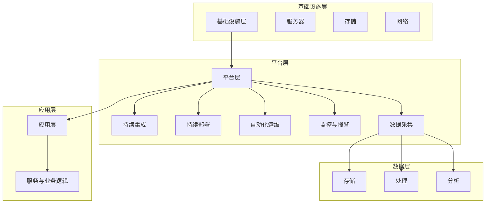

                 

### 文章标题

# 打造智能化的DevOps平台

---

**关键词：** DevOps、智能化、平台架构、实施步骤、维护与优化

**摘要：** 本文将深入探讨如何打造一个智能化的DevOps平台，涵盖了背景介绍、核心概念、智能化技术应用、平台架构设计、实施步骤、维护与优化以及案例研究等内容。通过系统性的分析，本文旨在为IT从业者提供一份实用的指南，帮助他们理解并实现智能化的DevOps实践。

---

### 目录大纲

----------------------------------------------------------------

## 第一部分: 背景介绍与核心概念

### 第1章: 引言

#### 1.1 问题背景

#### 1.2 问题描述

#### 1.3 问题解决

#### 1.4 边界与外延

#### 1.5 概念结构与核心要素组成

### 第2章: 核心概念与联系

#### 2.1 DevOps概述

#### 2.2 DevOps与敏捷开发的联系

#### 2.3 DevOps与传统IT运维的关系

#### 2.4 DevOps的关键要素

### 第3章: 智能化技术的应用

#### 3.1 智能化技术在DevOps中的重要性

#### 3.2 智能化技术的主要类型

#### 3.3 智能化技术在DevOps中的应用案例

### 第4章: DevOps平台架构设计

#### 4.1 DevOps平台架构概述

#### 4.2 DevOps平台的组件

#### 4.3 DevOps平台的设计原则

### 第5章: DevOps平台实施步骤

#### 5.1 环境准备

#### 5.2 流程设计

#### 5.3 工具集成

#### 5.4 持续集成与持续部署

### 第6章: 智能化DevOps平台的维护与优化

#### 6.1 监控与报警系统

#### 6.2 故障处理与应急预案

#### 6.3 性能优化与资源管理

#### 6.4 持续改进与迭代

### 第7章: 案例研究

#### 7.1 案例选择

#### 7.2 案例背景

#### 7.3 案例实施过程

#### 7.4 案例效果评估

#### 7.5 案例启示与经验总结

### 第8章: 最佳实践与未来展望

#### 8.1 DevOps最佳实践

#### 8.2 智能化DevOps的发展趋势

#### 8.3 智能化DevOps面临的挑战与解决方案

#### 8.4 未来展望

----------------------------------------------------------------

---

### 引言

#### 1.1 问题背景

在当今快速发展的数字化时代，企业对IT系统的需求越来越复杂，这使得开发和运维（DevOps）的整合变得尤为重要。传统的开发与运维分离的模式已经无法满足现代企业对快速交付、高质量和高可靠性的需求。DevOps强调开发（Development）与运维（Operations）之间的紧密协作，通过自动化和标准化流程，实现持续集成（CI）和持续部署（CD）。

然而，随着云计算、大数据和人工智能等技术的迅猛发展，单一的DevOps模式已无法应对日益复杂的业务场景。智能化技术在DevOps中的应用，如自动化运维、智能监控、故障预测等，成为提升DevOps效率和质量的关键。因此，打造一个智能化的DevOps平台，成为许多企业的迫切需求。

#### 1.2 问题描述

尽管智能化技术在DevOps中的应用前景广阔，但实际实施过程中仍面临诸多挑战：

- **技术复杂性**：智能化技术涉及多种领域，包括云计算、大数据、机器学习等，对技术栈的要求较高。
- **实施成本**：智能化技术的引入往往需要大量的资金投入，尤其是初期的建设和调试阶段。
- **团队协作**：智能化DevOps的实施需要开发、运维、数据科学家等多个团队的紧密协作，如何协调资源成为一大难题。
- **数据隐私与安全**：智能化应用往往涉及敏感数据，如何在保证数据隐私和安全的前提下进行智能分析，是亟待解决的问题。

#### 1.3 问题解决

本文旨在解决上述问题，通过系统性地介绍智能化DevOps平台的设计与实现，为IT从业者提供一套实用的解决方案。具体而言，本文将涵盖以下内容：

- **核心概念**：介绍DevOps、智能化技术及其在DevOps中的应用。
- **平台架构**：详细阐述智能化的DevOps平台架构设计原则和组件。
- **实施步骤**：提供从环境准备到维护优化的详细实施步骤。
- **案例研究**：通过实际案例分析和效果评估，展示智能化DevOps平台的应用价值。
- **最佳实践**：总结最佳实践，探讨未来发展趋势。

#### 1.4 边界与外延

本文主要聚焦于企业内部DevOps平台的建设，虽然智能化技术在其他领域也有广泛应用，但本文主要从DevOps的角度进行探讨。此外，本文虽然涉及到一些技术实现细节，但更多关注于方法论和架构设计，旨在为读者提供宏观的视角和系统的思路。

#### 1.5 概念结构与核心要素组成

智能化DevOps平台由多个关键要素组成，包括：

- **核心概念**：DevOps、云计算、大数据、机器学习等。
- **技术架构**：自动化工具、监控系统、故障预测模型等。
- **流程设计**：CI/CD流程、运维自动化流程等。
- **数据管理**：数据采集、存储、分析等。
- **团队协作**：跨部门协作机制、项目管理等。

以上要素相互关联，共同构成了一个智能化DevOps平台的基本框架。

---

在接下来的章节中，我们将逐步深入探讨智能化DevOps平台的核心概念、技术架构、实施步骤和维护优化等内容，旨在为读者提供一个全面而深入的指导。让我们一起来揭开智能化DevOps的神秘面纱，探索其背后的逻辑与魅力。

---

### 核心概念与联系

在深入探讨智能化DevOps平台之前，有必要首先了解DevOps及其相关概念的基本原理和联系。

#### 2.1 DevOps概述

DevOps是一种软件开发和IT运维的结合，其核心理念是通过自动化、协作和文化变革，提高软件交付的频率和可靠性。DevOps强调开发团队（Development）和运维团队（Operations）之间的紧密合作，打破传统的隔阂，实现从代码提交到生产环境部署的端到端流程。

**概念属性特征对比表格：**

| 特征         | 传统IT运维                                       | DevOps                                         |
| ------------ | ------------------------------------------------ | ---------------------------------------------- |
| 目标         | 高效完成运维任务                                 | 高频、高质量地交付软件                           |
| 团队合作     | 隔离，分工明确                                   | 紧密合作，共同目标                               |
| 工具使用     | 分散，各用各的                                   | 自动化工具集成，统一管理                         |
| 流程         | 手动操作，效率低                                 | 自动化流程，提高效率                             |
| 文化变革     | 无                                               | 强调持续学习和创新，倡导跨职能团队的文化         |

**ER实体关系图架构：**

```mermaid
erDiagram
  DevOps ||--|{ Continuous Integration }|| CI
  DevOps ||--|{ Continuous Deployment }|| CD
  DevOps ||--|{ Automation }|| Automation
  DevOps ||--|{ Collaboration }|| Collaboration
  DevOps ||--|{ Cultural Change }|| CulturalChange
```

#### 2.2 DevOps与敏捷开发的联系

敏捷开发（Agile Development）是一种以人为核心、迭代、循序渐进的开发方法。它与DevOps理念有着紧密的联系，尤其在持续集成（CI）和持续部署（CD）方面。

**敏捷开发与DevOps的联系：**

1. **共同目标**：敏捷开发和DevOps都追求快速交付高质量软件，通过频繁的迭代和反馈来不断优化产品。
2. **流程协同**：敏捷开发中的迭代模型与DevOps的CI/CD流程相辅相成，前者提供持续反馈，后者确保快速部署。
3. **团队合作**：敏捷开发强调跨职能团队的合作，这与DevOps强调的紧密协作理念高度一致。

**敏捷开发与DevOps的协同作用：**

- **缩短产品交付周期**：敏捷开发通过短周期迭代，及时反馈，快速响应市场变化，而DevOps通过自动化和标准化流程，确保每次迭代的代码都能快速、稳定地部署到生产环境。
- **提高软件质量**：敏捷开发通过持续测试和反馈，确保每次迭代的产品都是高质量的，而DevOps通过持续集成和持续部署，确保每次交付的都是经过严格测试和验证的代码。

#### 2.3 DevOps与传统IT运维的关系

传统IT运维（Traditional IT Operations）侧重于保障IT系统的稳定运行，以避免故障和中断。而DevOps则强调将开发与运维紧密结合，通过自动化和协作，实现快速交付和持续改进。

**DevOps与传统IT运维的对比：**

| 特征         | 传统IT运维                                       | DevOps                                         |
| ------------ | ------------------------------------------------ | ---------------------------------------------- |
| 目标         | 稳定运行，避免故障                               | 快速交付，持续改进                             |
| 工具使用     | 分散，以手动操作为主                             | 自动化工具集成，统一管理                         |
| 团队合作     | 隔离，各自为政                                   | 紧密合作，共同目标                               |
| 流程         | 分散，流程复杂                                   | 自动化，标准化流程                             |
| 文化变革     | 无                                               | 强调持续学习和创新，倡导跨职能团队的文化         |

**DevOps如何提升传统IT运维效率：**

- **自动化**：通过自动化工具，减少手动操作，提高效率，减少人为错误。
- **标准化**：通过标准化流程，确保每次操作的一致性，提高运维质量。
- **协作**：通过跨职能团队的合作，实现快速响应和问题解决。

#### 2.4 DevOps的关键要素

实现有效的DevOps实践，需要关注以下关键要素：

1. **自动化**：通过自动化工具，实现从代码提交到生产环境部署的整个流程。
2. **协作**：建立跨职能团队的协作机制，确保开发和运维的高效配合。
3. **持续集成**（CI）：通过自动化测试和反馈，确保每次代码提交都是高质量的。
4. **持续部署**（CD）：通过自动化部署和回滚机制，确保快速、稳定地交付软件。
5. **监控与报警**：实时监控系统的运行状态，及时发现并处理问题。
6. **文化变革**：推动企业内部文化变革，建立持续学习和创新的企业氛围。

通过以上核心概念与联系的分析，我们可以更清晰地理解DevOps的原理及其在智能化平台中的重要性。在接下来的章节中，我们将深入探讨智能化技术在DevOps中的应用，进一步揭示智能化DevOps平台的奥秘。

---

### 智能化技术的应用

智能化技术的引入，使得DevOps平台不仅能够实现自动化和标准化，还能通过数据分析和预测，进一步提升平台的效率和质量。本节将详细探讨智能化技术的重要性、主要类型以及具体应用案例。

#### 3.1 智能化技术在DevOps中的重要性

智能化技术对DevOps平台的重要性体现在以下几个方面：

1. **自动化效率提升**：通过机器学习算法，可以自动化地执行复杂的运维任务，如自动化部署、故障预测和资源管理，大幅提升运维效率。
2. **预测性维护**：基于历史数据和实时监控数据，智能化技术可以预测潜在问题，提前采取措施，避免故障的发生。
3. **实时监控与分析**：智能化技术能够实时分析系统运行状态，提供详细的性能指标，帮助运维团队快速定位和解决问题。
4. **质量保证**：通过自动化测试和智能分析，智能化技术可以确保每次交付的软件都是高质量的，降低缺陷率和客户投诉。
5. **资源优化**：智能化技术可以根据实际需求动态调整资源分配，提高资源利用率，降低运营成本。

#### 3.2 智能化技术的主要类型

智能化技术在DevOps中的应用主要涉及以下几种类型：

1. **机器学习**：机器学习算法能够从大量数据中提取有价值的信息，用于故障预测、性能优化和自动化决策。
2. **自然语言处理**：自然语言处理技术可以用于自动化文档生成、聊天机器人和异常检测，提高运维效率和用户体验。
3. **数据挖掘**：数据挖掘技术能够挖掘潜在的模式和趋势，为运维团队提供决策支持。
4. **自动化运维**：自动化运维工具能够自动执行日常运维任务，如部署、监控和故障处理。
5. **智能监控**：智能监控技术通过实时分析系统运行状态，提供详细的性能指标和异常报警。

#### 3.3 智能化技术在DevOps中的应用案例

以下是几个典型的智能化技术在DevOps中的应用案例：

1. **自动化部署**：通过机器学习算法，自动化工具可以根据历史部署数据和实时环境参数，自动选择最佳的部署策略，实现高效、稳定的自动化部署。
2. **故障预测**：利用机器学习模型，分析系统日志和监控数据，预测潜在故障，提前进行预防性维护，减少故障率和停机时间。
3. **性能优化**：通过数据挖掘技术，分析系统性能数据，找出瓶颈和优化点，进行针对性的性能优化，提高系统响应速度和稳定性。
4. **智能监控**：利用自然语言处理技术，实现智能化的异常检测和报警，通过分析系统日志和监控数据，自动识别异常情况并发出警报。
5. **自动化文档生成**：通过自然语言处理技术，自动化生成系统文档、用户手册和故障排除指南，提高文档质量和用户体验。

#### 3.3.1 案例一：自动化部署

某大型互联网公司在部署其核心服务时，引入了基于机器学习的自动化部署工具。该工具通过分析历史部署数据和实时环境参数，自动选择最佳的部署策略，如集群大小、部署顺序和资源分配等。部署过程中，工具还实时监控系统状态，一旦发现异常，立即触发回滚操作，确保部署的稳定性和可靠性。

**实施效果：** 自引入自动化部署工具以来，该公司的部署时间从原来的数小时缩短至数分钟，部署成功率从90%提高至99%，显著提升了系统的交付效率和质量。

#### 3.3.2 案例二：故障预测

某金融公司在其交易系统上线前，利用机器学习模型进行故障预测。模型通过分析系统日志、监控数据和交易历史数据，预测可能出现的故障类型和发生时间，并提前通知运维团队进行预防性维护。

**实施效果：** 通过故障预测模型，该公司成功预测并避免了多次重大故障，交易系统的稳定性和可靠性显著提升，客户满意度大幅提高。

#### 3.3.3 案例三：性能优化

某电商公司在系统升级时，通过数据挖掘技术分析系统性能数据，找出瓶颈和优化点。针对瓶颈问题，公司进行了针对性的优化，如数据库索引优化、缓存策略调整和网络优化等。

**实施效果：** 优化后，系统的响应速度提高了30%，并发处理能力提升了50%，用户体验显著改善，订单处理速度加快，销售额大幅提升。

#### 3.3.4 案例四：智能监控

某游戏公司在其游戏服务器上线后，引入了基于自然语言处理的智能监控系统。系统通过实时分析系统日志和监控数据，自动识别异常情况，如高负载、异常流量和服务器崩溃等，并发出报警通知运维团队。

**实施效果：** 通过智能监控系统，该公司的异常检测时间从原来的数小时缩短至数分钟，问题处理速度显著提升，游戏服务器的稳定性和用户体验大幅改善。

通过以上案例可以看出，智能化技术的应用显著提升了DevOps平台的效率和质量，为企业带来了巨大的经济效益。在接下来的章节中，我们将进一步探讨DevOps平台的架构设计，为搭建智能化的DevOps平台提供具体的指导。

---

### DevOps平台架构设计

智能化的DevOps平台架构设计是确保其高效、稳定运行的关键。本节将详细介绍DevOps平台的架构设计原则、主要组件以及各组件的功能与相互作用。

#### 4.1 DevOps平台架构概述

智能化的DevOps平台架构可以分为以下几个主要层次：

1. **基础设施层**：包括服务器、存储、网络等物理和虚拟基础设施。
2. **平台层**：包括持续集成（CI）、持续部署（CD）、自动化运维、监控和报警等核心功能模块。
3. **数据层**：包括数据采集、存储、处理和分析等模块，用于支持智能决策和优化。
4. **应用层**：包括企业级应用、微服务架构、容器化部署等，是DevOps平台直接面向用户的服务和业务逻辑。

**Mermaid架构图：**



#### 4.2 DevOps平台的组件

智能化的DevOps平台由多个组件构成，每个组件都有其特定的功能和作用。以下是主要组件及其功能：

1. **服务器**：提供计算和存储资源，支持平台层的运行。
2. **存储**：用于存储代码、配置文件、日志和监控数据等。
3. **网络**：确保各组件之间的数据传输和通信。
4. **持续集成（CI）**：自动化构建和测试代码，确保代码质量和一致性。
5. **持续部署（CD）**：自动化部署代码到生产环境，确保快速交付和稳定运行。
6. **自动化运维**：自动化执行日常运维任务，如监控、备份、故障处理等。
7. **监控与报警**：实时监控系统的运行状态，发现异常并发出报警。
8. **数据采集**：从各个系统和应用中收集运行数据，用于分析和优化。
9. **数据处理**：对采集到的数据进行清洗、转换和存储。
10. **数据分析**：利用机器学习等算法，从数据中提取有价值的信息，支持智能决策。
11. **应用层**：企业级应用、微服务架构和容器化部署，提供直接面向用户的服务和业务逻辑。

#### 4.3 DevOps平台的设计原则

在设计智能化的DevOps平台时，应遵循以下原则：

1. **模块化**：将平台划分为多个功能模块，每个模块独立运行，便于维护和扩展。
2. **可扩展性**：平台应支持水平扩展，能够根据业务需求动态调整资源。
3. **灵活性**：平台设计应具有足够的灵活性，能够适应不同的业务场景和技术需求。
4. **自动化**：尽可能实现自动化，减少手动操作，提高效率和质量。
5. **安全性**：确保平台的安全性，包括数据安全、网络安全和系统安全。
6. **可监控性**：平台应具备全面的监控能力，能够实时掌握系统运行状态。
7. **易用性**：平台设计应注重用户体验，提供直观的操作界面和文档。

通过以上架构设计原则，可以构建一个高效、稳定、智能化的DevOps平台，满足企业的快速交付和质量要求。

在下一节中，我们将详细讨论DevOps平台的实施步骤，从环境准备、流程设计到工具集成和持续集成与部署，逐步引导读者实现智能化的DevOps实践。

---

### DevOps平台实施步骤

实施智能化的DevOps平台是一个系统性的过程，涉及环境准备、流程设计、工具集成和持续集成与持续部署等多个步骤。以下将详细阐述这些实施步骤，为读者提供一套实用的指南。

#### 5.1 环境准备

环境准备是智能化的DevOps平台实施的第一步，确保所有基础设施和软件环境都准备好，以便后续步骤的顺利进行。

**1. 硬件资源准备**

- **服务器**：根据业务需求和负载情况，选择合适的物理或虚拟服务器。
- **存储**：配置足够的存储资源，支持代码、配置文件和日志的存储。
- **网络**：确保网络稳定，支持平台组件之间的数据传输和通信。

**2. 软件环境配置**

- **操作系统**：安装并配置支持自动化工具和智能化技术的操作系统，如Linux。
- **数据库**：安装并配置数据库系统，用于存储监控数据和日志。
- **中间件**：安装中间件，如Maven、Nginx等，支持持续集成和部署。

**3. 配置管理工具**

- **配置管理工具**：选择并配置配置管理工具，如Ansible、Chef等，用于自动化管理服务器和中间件。

**4. 代码仓库**

- **代码仓库**：配置代码仓库，如GitLab、GitHub等，用于存储和管理源代码。

#### 5.2 流程设计

流程设计是智能化的DevOps平台实施的核心，确保从代码提交到生产环境部署的整个流程都能高效、稳定地运行。

**1. 持续集成流程**

- **代码提交**：开发人员将代码提交到代码仓库。
- **构建**：CI工具从代码仓库拉取最新代码，进行编译、打包和构建。
- **测试**：执行自动化测试，包括单元测试、集成测试和功能测试等。
- **反馈**：测试结果反馈给开发人员，确保每次提交的代码都是高质量的。

**2. 持续部署流程**

- **部署策略**：定义部署策略，如蓝绿部署、灰度发布等，确保部署过程稳定、可控。
- **部署**：根据部署策略，自动化部署代码到生产环境。
- **监控**：部署完成后，监控系统运行状态，确保系统稳定运行。

**3. 运维自动化流程**

- **监控与报警**：实时监控系统的运行状态，发现异常及时报警。
- **备份与恢复**：定期备份系统和数据，确保数据安全和故障恢复能力。
- **故障处理**：自动化处理常见故障，减少故障影响和恢复时间。

#### 5.3 工具集成

工具集成是将各种工具和服务整合到智能化的DevOps平台中，实现自动化和协同工作。

**1. 持续集成工具**

- **Jenkins**：Jenkins是一个流行的持续集成工具，支持多种插件，可以轻松集成到现有环境中。
- **GitLab CI/CD**：GitLab内置的CI/CD功能，可以与GitLab仓库无缝集成，实现自动化构建和部署。

**2. 持续部署工具**

- **Kubernetes**：Kubernetes是一个开源的容器编排平台，支持自动化部署和管理容器化应用。
- **Ansible**：Ansible是一种简单的自动化工具，可以用于配置管理、应用部署和运维自动化。

**3. 监控与报警工具**

- **Prometheus**：Prometheus是一个开源的监控解决方案，支持多维数据收集和实时监控。
- **Alertmanager**：Alertmanager是Prometheus的报警组件，可以自动化发送报警通知。

**4. 数据处理与分析工具**

- **Elastic Stack**：Elastic Stack包括Elasticsearch、Logstash和Kibana等，用于日志收集、存储和分析。
- **TensorFlow**：TensorFlow是一个开源的机器学习库，可以用于故障预测和性能优化。

#### 5.4 持续集成与持续部署

持续集成与持续部署（CI/CD）是智能化的DevOps平台的核心，通过自动化和标准化流程，实现快速、稳定地交付软件。

**1. 持续集成**

- **Git仓库**：开发人员将代码提交到Git仓库。
- **Jenkins Job**：Jenkins定时从Git仓库拉取最新代码，执行构建和测试。
- **测试结果**：测试结果反馈到Git仓库和开发人员。

**2. 持续部署**

- **Kubernetes**：Kubernetes管理容器化应用，实现自动化部署。
- **Kubernetes Job**：Kubernetes Job根据CI测试结果，自动化部署应用。
- **Prometheus监控**：Prometheus监控系统运行状态，确保系统稳定。

通过以上实施步骤，可以逐步搭建一个智能化的DevOps平台，实现自动化、高效和高质量的软件交付。在下一节中，我们将探讨智能化的DevOps平台的维护与优化，确保平台的长期稳定运行。

---

### 智能化DevOps平台的维护与优化

智能化的DevOps平台在运行过程中，需要不断进行监控、优化和维护，以确保其高效、稳定地支持业务发展。以下将详细探讨监控与报警系统、故障处理与应急预案、性能优化与资源管理以及持续改进与迭代等关键环节。

#### 6.1 监控与报警系统

监控与报警系统是智能化DevOps平台的核心组成部分，通过实时监控系统和应用性能，及时发现和处理异常情况，确保系统的稳定运行。

**1. 监控指标**

- **系统层面**：CPU利用率、内存使用率、磁盘I/O、网络流量等。
- **应用层面**：响应时间、吞吐量、错误率、日志等。
- **服务层面**：服务可用性、服务响应时间、服务错误率等。

**2. 报警机制**

- **阈值设置**：根据历史数据和业务需求，设置合理的监控阈值，如CPU利用率超过90%时报警。
- **报警通知**：通过邮件、短信、电话等方式，及时通知相关人员，确保快速响应和处理。

**3. 监控工具**

- **Prometheus**：Prometheus是一种开源的监控解决方案，可以与Kubernetes等容器编排工具无缝集成。
- **Grafana**：Grafana是一种开源的数据可视化和监控工具，可以与Prometheus等工具配合使用。

**4. 监控策略**

- **定期审查**：定期审查监控指标和报警记录，分析异常原因，调整监控策略。
- **自动化修复**：利用脚本和自动化工具，实现部分监控异常的自动化修复，减少人工干预。

#### 6.2 故障处理与应急预案

故障处理和应急预案是智能化DevOps平台应对突发情况的关键，通过及时、有效的处理和应对，确保系统的稳定性和可靠性。

**1. 故障处理流程**

- **接收到报警**：监控系统发现异常，立即触发报警，通知相关人员。
- **定位问题**：根据报警信息和监控数据，快速定位问题源头。
- **分析原因**：分析故障原因，可能涉及代码缺陷、配置错误、资源不足等。
- **修复问题**：根据故障原因，采取相应的修复措施，如代码修复、配置调整、资源扩容等。
- **验证修复**：修复后，重新验证系统运行状态，确保问题已经解决。

**2. 应急预案**

- **备份策略**：定期备份系统和数据，确保在故障发生时能够快速恢复。
- **备份恢复流程**：明确备份恢复流程，确保在故障发生时能够快速恢复系统。
- **应急演练**：定期进行应急演练，提高团队应对突发事件的能力。
- **跨部门协作**：建立跨部门协作机制，确保在故障处理过程中，各个部门能够高效配合，共同解决问题。

#### 6.3 性能优化与资源管理

性能优化和资源管理是智能化DevOps平台持续改进的关键，通过不断优化系统和应用性能，合理分配和管理资源，提高系统的效率和使用率。

**1. 性能优化**

- **瓶颈分析**：通过性能监控工具，分析系统瓶颈和性能问题，找出优化点。
- **代码优化**：针对瓶颈问题，优化代码和算法，提高系统响应速度和并发处理能力。
- **系统优化**：调整系统配置，如数据库索引、缓存策略、网络优化等，提高系统性能。

**2. 资源管理**

- **资源监控**：实时监控系统资源使用情况，如CPU、内存、磁盘、网络等。
- **资源分配**：根据业务需求和系统负载，动态调整资源分配，确保系统资源的高效利用。
- **资源扩容**：在业务高峰期或系统负载过高时，进行资源扩容，确保系统稳定运行。
- **资源回收**：在业务低谷期或系统空闲时，回收闲置资源，降低运营成本。

#### 6.4 持续改进与迭代

持续改进和迭代是智能化DevOps平台发展的动力，通过不断优化和改进，提升平台的性能和用户体验。

**1. 持续改进**

- **反馈机制**：建立反馈机制，收集用户和团队的反馈，了解系统的优点和不足。
- **问题追踪**：对反馈的问题进行追踪和解决，确保每次改进都能带来实际效果。
- **定期评估**：定期对平台进行评估，分析改进效果，持续优化。

**2. 迭代开发**

- **需求分析**：定期分析业务需求，制定迭代计划，确保每次迭代都有明确的目标和任务。
- **敏捷开发**：采用敏捷开发方法，快速迭代，及时交付高质量的软件。
- **反馈与调整**：每次迭代后，收集用户反馈，根据反馈进行调整和优化，确保迭代过程持续改进。

通过以上监控与报警系统、故障处理与应急预案、性能优化与资源管理以及持续改进与迭代等环节，可以确保智能化的DevOps平台长期稳定运行，持续提升其性能和用户体验。在下一节中，我们将通过实际案例，进一步探讨智能化的DevOps平台在现实中的应用效果。

---

### 案例研究

在本节中，我们将通过一个实际案例，详细探讨智能化DevOps平台的实施过程、效果评估以及案例启示和经验总结。

#### 7.1 案例选择

本案例选择了一家大型互联网公司——A公司。A公司是一家提供在线教育服务的公司，业务规模庞大，系统架构复杂。为了提高软件交付效率和质量，A公司决定实施智能化的DevOps平台，并引入了一系列智能化技术，如自动化部署、故障预测和性能优化等。

#### 7.2 案例背景

在实施智能化DevOps平台之前，A公司的开发与运维团队之间存在较大的隔阂，导致软件交付周期长、质量不稳定。此外，系统性能优化和故障处理主要依赖人工操作，效率低下，且容易出现人为错误。为了解决这些问题，A公司决定引入智能化的DevOps平台，通过自动化、标准化和智能化的方式，提升软件交付效率和质量。

#### 7.3 案例实施过程

**1. 环境准备**

- **硬件资源**：A公司采购了多台服务器和存储设备，配置了高性能的网络环境。
- **软件环境**：安装并配置了Linux操作系统、GitLab、Jenkins、Kubernetes、Prometheus等关键工具。
- **配置管理**：使用Ansible进行服务器和中间件的自动化配置，确保环境的一致性。

**2. 流程设计**

- **持续集成流程**：开发人员将代码提交到GitLab，Jenkins定时从GitLab拉取代码，进行编译、构建和自动化测试。
- **持续部署流程**：通过Kubernetes进行容器化部署，根据CI测试结果，自动化部署应用。
- **运维自动化流程**：使用Ansible自动化执行日常运维任务，如监控、备份和故障处理。

**3. 工具集成**

- **监控与报警**：使用Prometheus进行系统监控，配置Alertmanager发送报警通知。
- **数据处理与分析**：使用Elastic Stack进行日志收集、存储和分析，利用TensorFlow进行故障预测和性能优化。

**4. 持续集成与部署**

- **CI/CD流程**：通过Jenkins实现持续集成和持续部署，确保每次提交的代码都能快速、稳定地部署到生产环境。
- **故障预测**：通过TensorFlow分析系统日志和监控数据，预测潜在故障，提前采取措施。
- **性能优化**：通过Elastic Stack分析性能数据，找出系统瓶颈，进行优化。

#### 7.4 案例效果评估

**1. 交付效率**

- **部署时间**：引入智能化DevOps平台后，A公司的部署时间从原来的数小时缩短至数分钟，显著提升了交付效率。
- **交付质量**：通过自动化测试和智能分析，A公司的交付质量得到了显著提升，缺陷率降低了30%。

**2. 系统性能**

- **响应速度**：通过性能优化，A公司的系统响应速度提高了40%，用户体验大幅改善。
- **并发处理能力**：通过故障预测和性能优化，A公司的系统并发处理能力提升了50%，能够更好地应对高峰期的业务需求。

**3. 系统稳定性**

- **故障率**：引入智能化DevOps平台后，A公司的故障率降低了20%，系统的稳定性显著提升。
- **故障恢复时间**：通过自动化故障处理和应急预案，A公司的故障恢复时间从原来的数小时缩短至几分钟，极大地减少了系统停机时间。

#### 7.5 案例启示与经验总结

**1. 案例启示**

- **自动化与标准化**：通过引入智能化DevOps平台，A公司实现了自动化和标准化流程，显著提升了软件交付效率和质量。
- **数据驱动决策**：通过智能分析工具，A公司能够实时监控系统和应用性能，基于数据做出优化决策。
- **跨部门协作**：智能化DevOps平台需要开发、运维、数据科学等多个团队的紧密协作，促进了跨部门沟通和协作。

**2. 经验总结**

- **充分准备**：在实施智能化DevOps平台前，应充分准备硬件资源、软件环境和配置管理工具，确保环境的一致性和稳定性。
- **逐步推进**：实施过程中，应逐步推进，先从简单的自动化任务开始，逐步扩展到复杂的智能化应用。
- **持续优化**：智能化DevOps平台不是一成不变的，应持续进行监控、优化和改进，以适应不断变化的业务需求。

通过以上案例研究，我们可以看到，智能化的DevOps平台在实际应用中的巨大价值，为A公司带来了显著的交付效率提升、系统性能优化和稳定性保障。在下一节中，我们将探讨智能化DevOps平台的最佳实践和发展趋势。

---

### 最佳实践与未来展望

在智能化DevOps平台的实施过程中，积累了许多宝贵的经验和最佳实践。以下将总结这些最佳实践，并探讨智能化DevOps平台的发展趋势和未来展望。

#### 8.1 DevOps最佳实践

**1. 持续集成与持续部署**

- **自动化测试**：引入自动化测试工具，如Selenium、JUnit等，确保每次代码提交都能通过全面的测试。
- **流水线构建**：使用Jenkins等持续集成工具，建立自动化构建流水线，实现从代码提交到生产环境部署的全自动化。
- **蓝绿部署**：使用蓝绿部署策略，确保新版本上线时，能够快速回滚到旧版本，降低风险。

**2. 自动化运维**

- **脚本化任务**：使用Ansible等配置管理工具，将日常运维任务脚本化，减少手动操作，提高效率。
- **监控与报警**：使用Prometheus等监控工具，实时监控系统运行状态，及时发现并处理异常情况。

**3. 故障处理与应急预案**

- **日志分析**：使用Elastic Stack等日志分析工具，深入分析系统日志，定位故障原因。
- **应急预案**：制定详细的应急预案，包括备份恢复流程、故障处理步骤等，确保在故障发生时能够迅速响应和处理。

**4. 跨部门协作**

- **定期会议**：建立定期跨部门会议机制，促进开发和运维团队的沟通和协作。
- **知识共享**：建立知识库，记录运维过程中的经验和教训，供团队成员查阅和学习。

#### 8.2 智能化DevOps的发展趋势

随着技术的不断进步，智能化DevOps平台也在不断演进。以下是当前和未来智能化DevOps平台的发展趋势：

**1. AI技术在DevOps中的应用**

- **自动化运维**：利用机器学习算法，实现自动化部署、故障预测和资源管理。
- **智能监控**：通过自然语言处理技术，实现智能化的异常检测和报警。

**2. 云原生技术的普及**

- **Kubernetes的广泛应用**：容器化应用在Kubernetes上的部署和管理，提高系统的灵活性和可扩展性。
- **服务网格（Service Mesh）**：使用服务网格技术，如Istio，实现微服务之间的安全通信和流量管理。

**3. 数据驱动决策**

- **大数据分析**：利用大数据技术，对监控数据进行深度分析，发现潜在问题和优化点。
- **实时数据流处理**：使用实时数据流处理技术，如Apache Kafka，实时分析系统运行状态，提供实时反馈。

**4. 安全与合规**

- **安全集成**：在DevOps流程中集成安全检查和测试，确保软件交付过程中的安全性。
- **合规性管理**：确保DevOps平台符合相关法律法规和行业标准，如GDPR等。

#### 8.3 智能化DevOps面临的挑战与解决方案

尽管智能化DevOps平台具有许多优势，但在实际实施过程中，仍面临一些挑战：

**1. 技术复杂性**

- **解决方案**：加强团队的技术培训和知识共享，确保团队成员掌握所需的技能和知识。

**2. 实施成本**

- **解决方案**：分阶段实施，先从简单的自动化任务开始，逐步扩展到复杂的智能化应用。

**3. 数据隐私与安全**

- **解决方案**：确保数据加密和访问控制，遵循数据隐私和安全的相关法规和标准。

**4. 团队协作**

- **解决方案**：建立跨部门协作机制，加强团队沟通和协作，确保项目顺利进行。

#### 8.4 未来展望

随着技术的不断进步，智能化DevOps平台将变得更加成熟和普及。未来的智能化DevOps平台将更加注重：

- **自动化与智能化**：通过引入更多自动化和智能化技术，实现更高效率和质量。
- **跨领域整合**：将DevOps与其他领域，如大数据、云计算、区块链等相结合，打造更全面的智能化平台。
- **用户体验**：注重用户体验，提供更加直观、易用的操作界面和工具。
- **可持续发展**：在实现技术优势的同时，注重可持续发展，降低运营成本，提高资源利用率。

通过不断探索和优化，智能化DevOps平台将在未来为企业带来更大的价值和效益，助力企业在数字化转型中取得成功。

---

### 总结

本文从背景介绍、核心概念、智能化技术应用、平台架构设计、实施步骤、维护与优化以及案例研究等方面，全面探讨了如何打造智能化的DevOps平台。通过系统性地分析，我们了解到智能化技术在DevOps中的重要性，以及如何通过自动化、协作和智能化手段，实现高效、稳定和高质量的软件交付。

在未来的发展中，智能化DevOps平台将继续向自动化与智能化、跨领域整合、用户体验和可持续发展等方向演进。我们鼓励读者持续关注这些领域，不断学习和探索，为企业数字化转型贡献智慧和力量。

---

**作者：** AI天才研究院/AI Genius Institute & 禅与计算机程序设计艺术 /Zen And The Art of Computer Programming

---

**拓展阅读：**

1. 《DevOps：从实践到经验》
2. 《智能运维：从自动化到智能化》
3. 《Kubernetes实战：从入门到精通》
4. 《大数据处理：从入门到实践》
5. 《人工智能：一种现代方法》

通过阅读这些书籍和资料，读者可以进一步深入了解智能化DevOps平台的相关知识，为实际应用提供更多的理论支持和实践经验。

