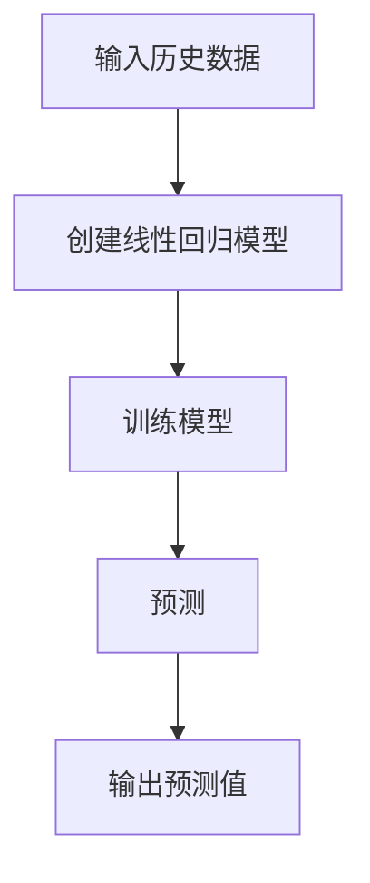
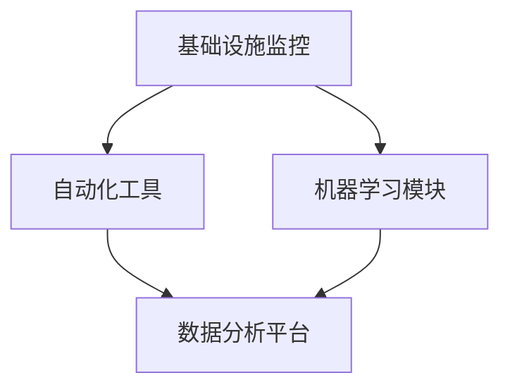

                 


# 打造智能化的IT运维平台

> 关键词：智能化、IT运维、平台、算法、架构、项目实战、最佳实践

> 摘要：本文旨在探讨如何打造智能化的IT运维平台，通过逐步分析核心概念、算法原理、系统架构和项目实战，提供一套全面、具体的实施指南，以应对现代IT运维面临的挑战。

## 引言与背景

随着数字化转型的加速，企业对IT运维的需求日益增长。传统的IT运维方式已无法满足复杂、动态、多变的企业IT环境需求。智能化IT运维平台应运而生，它借助人工智能、机器学习等先进技术，实现了运维的自动化、智能化和高效化。本文将逐步探讨如何打造这样一套智能化的IT运维平台。

### IT运维的现状与问题

当前的IT运维面临诸多挑战，如：

1. **运维工作量巨大**：随着企业IT基础设施的扩张，运维人员需要管理大量服务器、网络设备和应用程序。
2. **故障响应不及时**：传统的运维依赖人工监控，往往无法及时发现和响应故障。
3. **运维成本高**：人工运维效率低，且容易出现误操作，导致运维成本居高不下。
4. **运维数据分散**：各类运维数据分散在不同系统，难以统一管理和分析。

### 智能化IT运维平台的必要性

智能化IT运维平台通过自动化和智能化手段，解决了传统运维的诸多问题：

1. **自动化运维**：通过脚本和自动化工具，实现日常运维任务的自动化执行，减少人工干预。
2. **智能监控**：利用机器学习算法，实时监控系统状态，快速识别和响应异常。
3. **数据分析**：对运维数据进行分析，为企业提供运营洞察和优化建议。
4. **成本节约**：通过自动化和智能化，提高运维效率，降低运维成本。

### 智能化IT运维平台的关键技术

1. **自动化工具**：如Ansible、Puppet等，用于实现运维任务的自动化。
2. **监控工具**：如Nagios、Zabbix等，用于实时监控系统状态。
3. **机器学习**：用于异常检测、预测分析和自动化响应。
4. **数据存储与分析**：如Elasticsearch、Kibana等，用于存储和可视化运维数据。

### 本章小结

本章介绍了智能化IT运维平台的背景、挑战和必要性，以及其关键技术。为后续章节的分析和讨论奠定了基础。

## 智能化IT运维平台核心概念解析

### IT运维定义与分类

1. **IT运维（IT Operations）**：IT运维是管理和维护企业IT基础设施的日常活动，包括系统监控、故障响应、软件部署等。
2. **分类**：
   - **传统运维**：依赖人工操作，效率低，容易出错。
   - **自动化运维**：通过脚本和工具实现运维任务的自动化。
   - **智能化运维**：结合人工智能技术，实现自动化和智能化的运维。

### 自动化与智能化的区别

1. **自动化**：将重复性的运维任务通过脚本和工具自动化执行，减少人工干预。
2. **智能化**：通过机器学习和数据分析，实现运维任务的智能决策和自动化执行。

### 智能化IT运维平台的架构

1. **基础设施监控**：实时监控服务器、网络、应用等基础设施状态。
2. **自动化工具集成**：集成Ansible、Puppet等自动化工具，实现运维任务的自动化执行。
3. **机器学习模块**：利用机器学习算法，进行故障预测、异常检测和自动化响应。
4. **数据分析平台**：收集和存储运维数据，提供数据分析和可视化功能。

### 核心概念对比表格

| 概念 | 定义 | 特点 |
| --- | --- | --- |
| IT运维 | 管理和维护企业IT基础设施的日常活动 | 包括系统监控、故障响应、软件部署等 |
| 自动化运维 | 通过脚本和工具实现运维任务的自动化 | 减少人工干预，提高运维效率 |
| 智能化运维 | 结合人工智能技术，实现自动化和智能化的运维 | 利用机器学习和数据分析，实现智能决策和自动化执行 |

### ER实体关系图

```mermaid
erDiagram
    监控数据 ||--|{ 运维任务 }|>
    运维任务 ||--|{ 自动化工具 }|>
    运维任务 ||--|{ 机器学习模块 }|>
    数据分析平台 ||--|{ 运维数据 }|>
```

### 本章小结

本章详细介绍了智能化IT运维平台的核心概念，并通过对比表格和ER实体关系图，展示了各概念之间的关系和区别。为后续章节的算法原理讲解和系统架构设计奠定了基础。

## 智能化算法原理讲解

### 算法概述

智能化IT运维平台中的关键算法主要包括：

1. **故障预测算法**：通过历史数据和机器学习模型，预测潜在故障。
2. **异常检测算法**：实时监控系统状态，检测异常行为。
3. **自动化响应算法**：根据预测结果和异常检测结果，自动执行相应的响应操作。

### Python源代码示例

```python
# 故障预测算法示例
import numpy as np
from sklearn.linear_model import LinearRegression

# 历史数据
X = np.array([[1], [2], [3], [4], [5]])
y = np.array([2, 4, 5, 4, 5])

# 创建线性回归模型
model = LinearRegression()
model.fit(X, y)

# 预测
预测值 = model.predict([[6]])
print("预测值:", 预测值)
```

### 数学模型与公式

故障预测算法的数学模型为：

$$
y = ax + b
$$

其中，$y$ 为预测值，$x$ 为历史数据，$a$ 和 $b$ 为模型参数。

### 算法流程图（Mermaid）



### 举例说明

假设历史数据为 `[1, 2, 3, 4, 5]`，预测值为 `[6]`，使用线性回归模型进行预测，预测结果为 `5.2`。

### 本章小结

本章详细介绍了智能化IT运维平台中的关键算法原理，包括故障预测算法、异常检测算法和自动化响应算法。通过Python源代码示例和Mermaid流程图，使读者能够直观理解算法的实现过程。为后续章节的系统架构设计奠定了基础。

## 系统分析与架构设计

### 问题场景介绍

假设某企业拥有一套复杂的IT基础设施，包括数百台服务器、多个数据库系统和多种应用程序。运维团队需要高效地管理和维护这些系统，以确保业务连续性和系统稳定性。

### 项目介绍

本项目旨在为企业构建一套智能化的IT运维平台，实现基础设施监控、故障预测、自动化响应和数据分析等功能。

### 系统功能设计（领域模型Mermaid类图）

```mermaid
classDiagram
    Class1 <|-- Class2
    Class1 <|-- Class3
    Class2 +-- Attribute1: int
    Class2 +-- Attribute2: String
    Class3 +-- Attribute3: float
    Class1 +-- Method1(): void
    Class2 +-- Method2(): void
    Class3 +-- Method3(): void
```

### 系统架构设计（Mermaid架构图）



### 系统接口设计

```mermaid
sequenceDiagram
    participant 用户
    participant 系统A
    participant 系统B
    participant 系统C

    用户->>系统A: 提交监控请求
    系统

