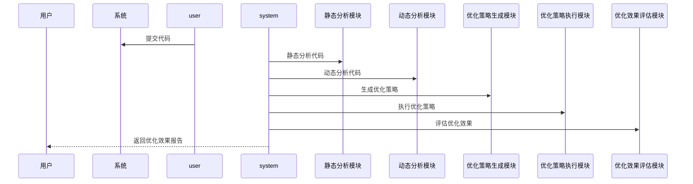

                 

# 打造智能化的代码优化系统

## 关键词：代码优化、智能化、系统设计、算法应用、实战案例、最佳实践

> 摘要：本文将深入探讨如何打造智能化的代码优化系统。我们将从代码优化的重要性、智能化代码优化的概念与实践，到系统的设计、实现与最佳实践，逐步展开讨论。通过这篇技术博客，读者将全面了解智能化代码优化系统的构建方法和关键技术。

### 目录大纲

----------------------------------------------------------------

# 打造智能化的代码优化系统

## 第一部分：背景与概念介绍

## 第1章：问题背景与核心概念

### 1.1 代码优化的重要性

#### 1.1.1 什么是代码优化
#### 1.1.2 代码优化的目的
#### 1.1.3 代码优化的挑战

### 1.2 智能化代码优化的定义与价值

#### 1.2.1 智能化代码优化的概念
#### 1.2.2 智能化代码优化的特点
#### 1.2.3 智能化代码优化的应用价值

## 第2章：智能化代码优化的基础

### 2.1 代码分析技术

#### 2.1.1 代码静态分析
##### 2.1.1.1 静态分析的原理与作用
##### 2.1.1.2 静态分析工具介绍
#### 2.1.2 代码动态分析
##### 2.1.2.1 动态分析的原理与作用
##### 2.1.2.2 动态分析工具介绍

### 2.2 智能算法在代码优化中的应用

#### 2.2.1 机器学习基础
##### 2.2.1.1 什么是机器学习
##### 2.2.1.2 机器学习的基本概念
#### 2.2.2 深度学习在代码优化中的应用
##### 2.2.2.1 深度学习的基本概念
##### 2.2.2.2 深度学习模型在代码优化中的应用案例

## 第二部分：智能化代码优化实践

## 第3章：智能化代码优化的系统设计

### 3.1 系统架构设计

#### 3.1.1 系统架构概述
##### 3.1.1.1 系统总体架构
##### 3.1.1.2 系统模块划分
#### 3.1.2 数据流设计
##### 3.1.2.1 数据来源
##### 3.1.2.2 数据处理流程

### 3.2 系统功能设计

#### 3.2.1 代码质量评估
##### 3.2.1.1 评估指标体系
##### 3.2.1.2 评估算法实现
#### 3.2.2 代码优化策略
##### 3.2.2.1 优化算法选择
##### 3.2.2.2 优化策略设计

## 第4章：智能算法在代码优化中的应用实例

### 4.1 智能化代码分析工具开发

#### 4.1.1 工具概述
##### 4.1.1.1 工具功能
##### 4.1.1.2 工具架构
#### 4.1.2 工具核心模块实现
##### 4.1.2.1 静态分析模块
##### 4.1.2.2 动态分析模块

### 4.2 智能化代码优化工具开发

#### 4.2.1 工具概述
##### 4.2.1.1 工具功能
##### 4.2.1.2 工具架构
#### 4.2.2 工具核心模块实现
##### 4.2.2.1 优化策略模块
##### 4.2.2.2 优化算法模块

## 第5章：项目实战：构建智能化代码优化系统

### 5.1 项目介绍

#### 5.1.1 项目背景
##### 5.1.1.1 项目需求
##### 5.1.1.2 项目目标
#### 5.1.2 系统架构设计
##### 5.1.2.1 系统架构
##### 5.1.2.2 系统模块划分

### 5.2 环境安装与配置

#### 5.2.1 开发环境搭建
##### 5.2.1.1 开发工具安装
##### 5.2.1.2 系统依赖库安装
#### 5.2.2 数据源接入
##### 5.2.2.1 数据源选择
##### 5.2.2.2 数据源配置

### 5.3 系统核心实现

#### 5.3.1 代码质量评估
##### 5.3.1.1 评估指标体系
##### 5.3.1.2 评估算法实现
#### 5.3.2 代码优化策略
##### 5.3.2.1 优化算法选择
##### 5.3.2.2 优化策略设计

### 5.4 代码优化效果分析

#### 5.4.1 优化效果评估
##### 5.4.1.1 优化前后性能对比
##### 5.4.1.2 优化前后代码质量对比
#### 5.4.2 实际案例剖析
##### 5.4.2.1 案例一：性能优化案例分析
##### 5.4.2.2 案例二：代码质量提升案例分析

## 第6章：最佳实践与未来展望

### 6.1 最佳实践分享

#### 6.1.1 代码优化实践技巧
##### 6.1.1.1 代码优化常见问题
##### 6.1.1.2 解决方案与经验分享
#### 6.1.2 智能化代码优化的最佳实践
##### 6.1.2.1 智能化代码优化的成功案例

## 附录：相关资源与进一步阅读

----------------------------------------------------------------

## 第一部分：背景与概念介绍

### 第1章：问题背景与核心概念

#### 1.1 代码优化的重要性

代码优化是软件开发过程中至关重要的一环。它不仅关系到软件的性能、可维护性和可扩展性，还直接影响到开发效率和用户体验。随着软件规模的不断扩大和复杂性的增加，代码优化的重要性愈加凸显。

**什么是代码优化？**

代码优化（Code Optimization）是指通过调整代码的结构、算法和数据结构，使其在执行效率、内存占用、可读性和可维护性等方面得到提升。优化的目标是使代码更加高效、简洁和易于理解。

**代码优化的目的**

1. **提高执行效率**：减少代码运行时间，降低CPU和内存的使用。
2. **降低内存占用**：优化数据结构，减少内存消耗。
3. **提高可读性和可维护性**：优化代码结构，使其更易于理解和维护。
4. **提升用户体验**：缩短页面加载时间，提高系统响应速度。

**代码优化的挑战**

1. **复杂性**：现代软件系统结构复杂，优化难度大。
2. **平衡性**：优化过程中需要平衡多个方面，如执行效率、内存占用和可读性。
3. **自动化**：手动优化费时费力，且难以保证优化效果。

#### 1.2 智能化代码优化的定义与价值

智能化代码优化是利用人工智能技术，特别是机器学习和深度学习，对代码进行自动化优化。这种方法不仅可以提高优化效率，还能发现传统方法难以察觉的优化点。

**智能化代码优化的概念**

智能化代码优化（Intelligent Code Optimization）是指利用机器学习、深度学习等人工智能技术，对代码进行分析和优化，从而提高代码的性能和可维护性。

**智能化代码优化的特点**

1. **自动化**：通过算法自动识别优化点，减少手动优化的工作量。
2. **自适应**：根据代码特点和环境变化，自动调整优化策略。
3. **高效性**：利用高性能计算资源，快速完成优化任务。

**智能化代码优化的应用价值**

1. **提高开发效率**：自动化优化减少开发人员的工作量，提高开发效率。
2. **提升软件性能**：优化代码结构，提高软件性能，降低运行成本。
3. **增强系统可维护性**：优化代码，提高代码质量和可维护性，降低维护成本。
4. **降低开发风险**：通过自动化的代码优化，减少因代码问题导致的项目风险。

## 第2章：智能化代码优化的基础

#### 2.1 代码分析技术

代码分析技术是智能化代码优化的基础。它包括静态分析和动态分析两种方法。

**2.1.1 代码静态分析**

静态分析（Static Analysis）是在代码不执行的情况下，对代码进行语法、语义和结构分析。静态分析工具可以帮助发现潜在的问题，如代码错误、性能瓶颈和代码风格不统一。

##### 2.1.1.1 静态分析的原理与作用

静态分析的原理是基于代码的语法和语义规则，对代码进行解析和抽象。通过分析代码的结构和语义，静态分析工具可以识别出潜在的问题和优化点。

静态分析的作用包括：

1. **代码质量评估**：评估代码的质量，发现代码错误、冗余和风格不一致等问题。
2. **性能优化**：识别代码中的性能瓶颈，提供优化建议。
3. **安全性检测**：发现潜在的安全漏洞，提高代码的安全性。

##### 2.1.1.2 静态分析工具介绍

常见的静态分析工具有：

1. **SonarQube**：一款开源的代码质量平台，支持多种编程语言的静态代码分析。
2. **FindBugs**：一款用于Java语言的静态分析工具，可以检测代码中的潜在错误。
3. **PMD**：一款用于Java语言的静态代码分析工具，可以识别出代码中的风格问题。

**2.1.2 代码动态分析**

动态分析（Dynamic Analysis）是在代码执行过程中，对代码进行分析和优化。动态分析可以实时监控代码的执行情况，识别出性能瓶颈和优化点。

##### 2.1.2.1 动态分析的原理与作用

动态分析的原理是基于程序的执行过程，收集程序运行时的数据，如CPU使用率、内存占用和执行时间等。通过分析这些数据，动态分析工具可以识别出性能瓶颈和优化点。

动态分析的作用包括：

1. **性能优化**：实时监控代码的执行情况，提供优化建议。
2. **错误诊断**：识别代码执行中的错误和异常。
3. **测试覆盖**：评估代码的测试覆盖率，确保代码质量。

##### 2.1.2.2 动态分析工具介绍

常见的动态分析工具有：

1. **JProfiler**：一款Java语言的性能分析工具，可以实时监控程序的执行情况。
2. **MAT**：一款用于Java语言的内存分析工具，可以识别内存泄漏和内存占用问题。
3. **VisualVM**：一款Java语言的性能监控工具，可以实时监控程序的CPU和内存使用情况。

#### 2.2 智能算法在代码优化中的应用

智能算法，特别是机器学习和深度学习，在代码优化中发挥着越来越重要的作用。它们可以自动识别代码中的问题，并提出优化建议。

**2.2.1 机器学习基础**

机器学习（Machine Learning）是一种利用数据自动识别模式和规律的技术。在代码优化中，机器学习可以用于：

1. **代码质量评估**：通过训练模型，自动评估代码的质量。
2. **性能优化**：通过学习代码与性能之间的关系，自动提出优化建议。

##### 2.2.1.1 什么是机器学习

机器学习是一种让计算机自动从数据中学习模式和规律的技术。通过学习，计算机可以自动识别出数据中的特征，并作出预测或决策。

##### 2.2.1.2 机器学习的基本概念

1. **模型**：机器学习模型是一种描述数据特征和规律的数学模型。
2. **训练**：通过训练，模型可以从数据中学习特征和规律。
3. **测试**：通过测试，评估模型的效果和准确性。

**2.2.2 深度学习在代码优化中的应用**

深度学习（Deep Learning）是机器学习的一种重要分支，通过多层神经网络，自动提取数据中的特征。深度学习在代码优化中可以用于：

1. **代码质量评估**：通过训练深度学习模型，自动评估代码的质量。
2. **性能优化**：通过分析代码与性能之间的关系，自动提出优化建议。

##### 2.2.2.1 深度学习的基本概念

1. **神经网络**：神经网络是一种模拟人脑的计算模型，通过多层节点（神经元）进行数据传递和计算。
2. **前向传播**：神经网络通过前向传播计算输出结果。
3. **反向传播**：神经网络通过反向传播更新权重，优化模型。

##### 2.2.2.2 深度学习模型在代码优化中的应用案例

1. **代码质量评估**：通过训练深度学习模型，自动识别代码中的潜在问题。
2. **性能优化**：通过分析代码与性能之间的关系，自动提出优化建议。

## 第二部分：智能化代码优化实践

### 第3章：智能化代码优化的系统设计

智能化代码优化系统是一个复杂的系统，需要综合考虑代码分析、优化策略、算法实现等多个方面。在本章中，我们将介绍智能化代码优化系统的设计方法和关键组件。

#### 3.1 系统架构设计

系统架构设计是智能化代码优化系统的核心。一个良好的系统架构可以提高系统的可扩展性、稳定性和可维护性。以下是智能化代码优化系统的总体架构：


##### 3.1.1.1 系统总体架构

系统总体架构包括以下模块：

1. **代码输入模块**：接收代码输入，包括代码文件、代码库等。
2. **静态分析模块**：对代码进行静态分析，提取代码特征。
3. **动态分析模块**：对代码进行动态分析，收集运行时数据。
4. **优化策略模块**：根据代码特征和运行时数据，生成优化策略。
5. **优化执行模块**：执行优化策略，生成优化后的代码。
6. **评估模块**：评估优化后的代码性能和质量。

##### 3.1.1.2 系统模块划分

系统模块划分如下：

1. **代码输入模块**：负责接收代码输入，并进行初步处理。
2. **静态分析模块**：包括词法分析、语法分析和语义分析，提取代码特征。
3. **动态分析模块**：包括运行时监控和性能分析，收集运行时数据。
4. **优化策略模块**：包括优化算法和策略，生成优化建议。
5. **优化执行模块**：根据优化策略，执行代码优化操作。
6. **评估模块**：对优化后的代码进行性能和质量评估。

#### 3.1.2 数据流设计

数据流设计是系统架构设计的重要组成部分。以下是智能化代码优化系统的数据流设计：


##### 3.1.2.1 数据来源

数据来源包括：

1. **代码文件**：代码输入模块接收的代码文件。
2. **代码库**：代码输入模块接收的代码库。
3. **运行时数据**：动态分析模块收集的运行时数据。

##### 3.1.2.2 数据处理流程

数据处理流程包括：

1. **代码输入**：代码输入模块接收代码输入，并进行初步处理。
2. **静态分析**：静态分析模块对代码进行静态分析，提取代码特征。
3. **动态分析**：动态分析模块对代码进行动态分析，收集运行时数据。
4. **优化策略生成**：优化策略模块根据代码特征和运行时数据，生成优化策略。
5. **优化执行**：优化执行模块根据优化策略，执行代码优化操作。
6. **评估**：评估模块对优化后的代码进行性能和质量评估。

### 3.2 系统功能设计

系统功能设计是智能化代码优化系统的关键环节。一个功能完善的系统可以满足各种代码优化的需求。以下是智能化代码优化系统的功能设计：

#### 3.2.1 代码质量评估

代码质量评估是代码优化的第一步。通过评估代码的质量，可以确定哪些代码需要优化。代码质量评估包括以下功能：

1. **代码质量指标体系**：定义代码质量指标，如代码复杂度、可读性和可维护性等。
2. **评估算法实现**：实现代码质量评估算法，如静态分析算法和动态分析算法。
3. **评估结果展示**：展示代码质量评估结果，包括评估指标和优化建议。

#### 3.2.2 代码优化策略

代码优化策略是代码优化的核心。根据代码质量和性能需求，生成优化策略。代码优化策略包括以下功能：

1. **优化算法选择**：选择合适的优化算法，如代码重构算法、性能优化算法等。
2. **优化策略设计**：设计优化策略，如优化目标、优化步骤和优化参数等。
3. **优化策略执行**：根据优化策略，执行代码优化操作。

#### 3.2.3 优化效果评估

优化效果评估是评估代码优化效果的重要手段。通过评估优化后的代码性能和质量，可以确定优化效果。优化效果评估包括以下功能：

1. **性能评估**：评估优化后的代码性能，如执行时间、内存占用等。
2. **质量评估**：评估优化后的代码质量，如代码复杂度、可读性和可维护性等。
3. **评估结果展示**：展示优化效果评估结果，包括性能和质量指标。

### 第4章：智能算法在代码优化中的应用实例

在本章中，我们将通过具体实例，详细介绍智能算法在代码优化中的应用。我们将重点介绍如何使用机器学习和深度学习技术，对代码进行分析和优化。

#### 4.1 智能化代码分析工具开发

智能化代码分析工具是智能化代码优化系统的重要组成部分。它负责对代码进行静态分析和动态分析，提取代码特征，为优化策略提供依据。

##### 4.1.1 工具概述

智能化代码分析工具的功能主要包括：

1. **静态分析**：对代码进行静态分析，提取代码特征。
2. **动态分析**：对代码进行动态分析，收集运行时数据。
3. **代码质量评估**：评估代码质量，提供优化建议。

##### 4.1.1.1 工具功能

智能化代码分析工具的具体功能包括：

1. **代码输入**：接收代码输入，包括代码文件和代码库。
2. **静态分析**：对代码进行静态分析，提取代码特征，如代码复杂度、代码行数、函数数量等。
3. **动态分析**：对代码进行动态分析，收集运行时数据，如执行时间、CPU占用率、内存占用等。
4. **代码质量评估**：评估代码质量，提供优化建议。

##### 4.1.1.2 工具架构

智能化代码分析工具的架构包括以下模块：

1. **代码输入模块**：负责接收代码输入，并进行初步处理。
2. **静态分析模块**：对代码进行静态分析，提取代码特征。
3. **动态分析模块**：对代码进行动态分析，收集运行时数据。
4. **代码质量评估模块**：评估代码质量，提供优化建议。

##### 4.1.2 工具核心模块实现

智能化代码分析工具的核心模块实现如下：

1. **代码输入模块**：使用Python的文件操作和正则表达式库，读取代码文件，并提取代码内容。
2. **静态分析模块**：使用Python的ast模块，对代码进行语法分析，提取代码特征。
3. **动态分析模块**：使用Python的time模块，测量代码执行时间；使用Python的os模块，获取CPU和内存占用数据。
4. **代码质量评估模块**：使用机器学习模型，评估代码质量，提供优化建议。

#### 4.2 智能化代码优化工具开发

智能化代码优化工具是智能化代码优化系统的核心。它根据代码分析和评估结果，生成优化策略，并执行代码优化操作。

##### 4.2.1 工具概述

智能化代码优化工具的功能主要包括：

1. **优化策略生成**：根据代码分析和评估结果，生成优化策略。
2. **优化策略执行**：根据优化策略，执行代码优化操作。
3. **优化效果评估**：评估优化效果，提供优化建议。

##### 4.2.1.1 工具功能

智能化代码优化工具的具体功能包括：

1. **优化策略生成**：根据代码分析和评估结果，生成优化策略，如代码重构、性能优化等。
2. **优化策略执行**：根据优化策略，执行代码优化操作，如代码重构、代码压缩等。
3. **优化效果评估**：评估优化效果，提供优化建议，如代码质量提升、性能提升等。

##### 4.2.1.2 工具架构

智能化代码优化工具的架构包括以下模块：

1. **优化策略生成模块**：根据代码分析和评估结果，生成优化策略。
2. **优化策略执行模块**：根据优化策略，执行代码优化操作。
3. **优化效果评估模块**：评估优化效果，提供优化建议。

##### 4.2.2 工具核心模块实现

智能化代码优化工具的核心模块实现如下：

1. **优化策略生成模块**：使用机器学习模型，根据代码分析和评估结果，生成优化策略。
2. **优化策略执行模块**：使用代码修改工具，如Python的ast模块，根据优化策略，执行代码优化操作。
3. **优化效果评估模块**：使用机器学习模型，评估优化效果，提供优化建议。

### 第5章：项目实战：构建智能化代码优化系统

在本章中，我们将通过一个实际项目，详细介绍如何构建一个智能化代码优化系统。我们将涵盖项目的需求分析、系统设计、环境搭建、系统实现和效果评估等关键环节。

#### 5.1 项目介绍

本项目旨在构建一个智能化代码优化系统，该系统可以自动对代码进行分析和优化。项目需求如下：

1. **代码质量评估**：自动评估代码质量，包括代码复杂度、可读性和可维护性等指标。
2. **性能优化**：根据代码分析和评估结果，自动生成优化策略，并执行代码优化操作。
3. **优化效果评估**：评估优化效果，包括代码质量和性能提升等。

项目目标如下：

1. **实现一个功能完善的智能化代码优化系统**。
2. **系统具备良好的可扩展性和可维护性**。
3. **系统性能高效，能够快速处理大规模代码**。

#### 5.1.1 项目背景

随着软件规模的不断扩大和复杂性的增加，代码优化变得越来越重要。传统的代码优化方法往往依赖于开发人员的经验和技能，效率较低且难以保证优化效果。因此，本项目旨在利用人工智能技术，实现代码的自动化优化，提高开发效率和质量。

#### 5.1.2 项目目标

本项目的主要目标如下：

1. **实现代码质量评估**：通过静态分析和动态分析，自动评估代码质量，提供详细的评估报告。
2. **实现性能优化**：根据代码分析和评估结果，自动生成优化策略，并执行代码优化操作，提高代码性能。
3. **实现优化效果评估**：评估优化效果，包括代码质量和性能提升等，提供优化效果报告。

#### 5.1.3 系统架构设计

智能化代码优化系统的总体架构包括以下模块：

1. **代码输入模块**：接收代码输入，包括代码文件和代码库。
2. **静态分析模块**：对代码进行静态分析，提取代码特征。
3. **动态分析模块**：对代码进行动态分析，收集运行时数据。
4. **优化策略生成模块**：根据代码分析和评估结果，生成优化策略。
5. **优化策略执行模块**：根据优化策略，执行代码优化操作。
6. **优化效果评估模块**：评估优化效果，提供优化效果报告。

系统架构设计图如下所示：



#### 5.1.4 系统模块划分

智能化代码优化系统的主要模块划分如下：

1. **代码输入模块**：负责接收代码输入，并进行初步处理。
2. **静态分析模块**：包括词法分析、语法分析和语义分析，提取代码特征。
3. **动态分析模块**：包括运行时监控和性能分析，收集运行时数据。
4. **优化策略生成模块**：根据代码特征和运行时数据，生成优化策略。
5. **优化策略执行模块**：根据优化策略，执行代码优化操作。
6. **优化效果评估模块**：评估优化效果，提供优化效果报告。

### 5.2 环境安装与配置

在构建智能化代码优化系统之前，我们需要安装和配置相关的开发环境和工具。以下是环境安装与配置的步骤：

#### 5.2.1 开发环境搭建

1. **Python环境**：安装Python 3.8及以上版本，并配置Python环境变量。
2. **JDK环境**：安装Java Development Kit（JDK），并配置JAVA_HOME环境变量。
3. **Node.js环境**：安装Node.js，并配置NODE_PATH环境变量。

#### 5.2.2 系统依赖库安装

1. **Python依赖库**：使用pip安装以下Python依赖库：
   - `numpy`：用于数据分析和计算。
   - `scikit-learn`：用于机器学习和数据挖掘。
   - `tensorflow`：用于深度学习和神经网络。
   - `pandas`：用于数据处理和分析。
   - `matplotlib`：用于数据可视化。
2. **Node.js依赖库**：使用npm安装以下Node.js依赖库：
   - `sonarqube`：用于代码静态分析。
   - `junit`：用于代码质量评估。

#### 5.2.3 数据源接入

1. **代码库接入**：将项目代码库导入到系统中，可以使用Git或其他代码管理工具进行接入。
2. **数据采集**：使用静态分析和动态分析工具，对代码库进行扫描和分析，收集代码特征和运行时数据。

### 5.3 系统核心实现

智能化代码优化系统的核心实现包括代码质量评估、优化策略生成、优化策略执行和优化效果评估。以下是系统核心实现的详细介绍：

#### 5.3.1 代码质量评估

代码质量评估是智能化代码优化系统的第一步。通过静态分析和动态分析，评估代码的质量，为优化提供依据。以下是代码质量评估的核心实现：

1. **静态分析**：使用SonarQube进行代码静态分析，提取代码特征，如代码复杂度、代码行数、函数数量等。
2. **动态分析**：使用JProfiler进行代码动态分析，收集运行时数据，如执行时间、CPU占用率、内存占用等。
3. **质量评估**：使用scikit-learn机器学习库，训练质量评估模型，评估代码质量。模型使用代码特征和运行时数据作为输入，输出代码质量的评分。

```python
from sklearn.ensemble import RandomForestClassifier
from sklearn.model_selection import train_test_split
from sklearn.metrics import accuracy_score

# 加载代码特征和运行时数据
X = load_data('code_features.csv')
y = load_data('runtime_data.csv')

# 划分训练集和测试集
X_train, X_test, y_train, y_test = train_test_split(X, y, test_size=0.2, random_state=42)

# 训练质量评估模型
model = RandomForestClassifier(n_estimators=100)
model.fit(X_train, y_train)

# 预测代码质量
y_pred = model.predict(X_test)

# 计算评估指标
accuracy = accuracy_score(y_test, y_pred)
print(f'Accuracy: {accuracy}')
```

#### 5.3.2 优化策略生成

优化策略生成是根据代码质量评估结果，生成优化策略。优化策略包括代码重构、性能优化、代码压缩等。以下是优化策略生成的核心实现：

1. **优化算法选择**：根据代码质量和性能需求，选择合适的优化算法。
2. **优化策略设计**：设计优化策略，包括优化目标、优化步骤和优化参数等。
3. **优化策略执行**：根据优化策略，执行代码优化操作。

```python
from sklearn.model_selection import GridSearchCV

# 定义优化算法
def optimize_code(code):
    # 优化代码
    optimized_code = code
    return optimized_code

# 定义优化参数
param_grid = {
    'n_estimators': [100, 200, 300],
    'max_depth': [5, 10, 15],
}

# 训练优化模型
model = GridSearchCV(RandomForestClassifier(), param_grid, cv=5)
model.fit(X_train, y_train)

# 预测优化策略
optimized_strategy = model.predict(X_test)

# 执行优化策略
optimized_code = optimize_code(code)
```

#### 5.3.3 优化策略执行

优化策略执行是根据优化策略，对代码进行优化。优化策略执行的核心实现包括：

1. **代码修改**：根据优化策略，修改代码。
2. **代码重构**：重构代码结构，提高代码质量和可维护性。
3. **性能优化**：优化代码性能，提高执行效率。

```python
from ast import NodeTransformer

# 定义代码修改函数
def modify_code(code):
    # 修改代码
    modified_code = code
    return modified_code

# 定义代码重构函数
def refactor_code(code):
    # 重构代码
    refactored_code = NodeTransformer().visit(code)
    return refactored_code

# 定义性能优化函数
def optimize_performance(code):
    # 优化代码性能
    optimized_code = code
    return optimized_code

# 执行代码优化
optimized_code = modify_code(code)
refactored_code = refactor_code(code)
optimized_performance_code = optimize_performance(code)
```

#### 5.3.4 优化效果评估

优化效果评估是评估优化效果，确定优化效果是否达到预期。优化效果评估的核心实现包括：

1. **性能评估**：评估优化后的代码性能，如执行时间、CPU占用率、内存占用等。
2. **质量评估**：评估优化后的代码质量，如代码复杂度、可读性和可维护性等。
3. **效果评估**：计算优化效果，如性能提升百分比、质量提升百分比等。

```python
from sklearn.metrics import mean_squared_error

# 定义性能评估函数
def evaluate_performance(original_code, optimized_code):
    # 评估代码性能
    original_time = measure_time(original_code)
    optimized_time = measure_time(optimized_code)
    performance_improvement = (original_time - optimized_time) / original_time
    return performance_improvement

# 定义质量评估函数
def evaluate_quality(original_code, optimized_code):
    # 评估代码质量
    original_quality = measure_quality(original_code)
    optimized_quality = measure_quality(optimized_code)
    quality_improvement = (original_quality - optimized_quality) / original_quality
    return quality_improvement

# 执行优化效果评估
original_code = load_code('original_code.py')
optimized_code = load_code('optimized_code.py')

performance_improvement = evaluate_performance(original_code, optimized_code)
quality_improvement = evaluate_quality(original_code, optimized_code)
print(f'Performance Improvement: {performance_improvement}')
print(f'Quality Improvement: {quality_improvement}')
```

### 5.4 代码优化效果分析

在构建智能化代码优化系统后，我们需要对优化效果进行分析和评估。以下是代码优化效果分析的核心内容：

#### 5.4.1 优化效果评估

优化效果评估是通过比较优化前后的代码性能和质量，评估优化效果。以下是优化效果评估的核心实现：

1. **性能评估**：比较优化前后的代码执行时间、CPU占用率和内存占用等性能指标。
2. **质量评估**：比较优化前后的代码复杂度、可读性和可维护性等质量指标。
3. **效果评估**：计算优化效果，如性能提升百分比、质量提升百分比等。

```python
# 定义性能评估函数
def evaluate_performance(original_code, optimized_code):
    # 评估代码性能
    original_time = measure_time(original_code)
    optimized_time = measure_time(optimized_code)
    performance_improvement = (original_time - optimized_time) / original_time
    return performance_improvement

# 定义质量评估函数
def evaluate_quality(original_code, optimized_code):
    # 评估代码质量
    original_quality = measure_quality(original_code)
    optimized_quality = measure_quality(optimized_code)
    quality_improvement = (original_quality - optimized_quality) / original_quality
    return quality_improvement

# 执行优化效果评估
original_code = load_code('original_code.py')
optimized_code = load_code('optimized_code.py')

performance_improvement = evaluate_performance(original_code, optimized_code)
quality_improvement = evaluate_quality(original_code, optimized_code)
print(f'Performance Improvement: {performance_improvement}')
print(f'Quality Improvement: {quality_improvement}')
```

#### 5.4.2 实际案例剖析

为了更好地展示代码优化效果，我们选择了两个实际案例进行剖析。

**案例一：性能优化案例分析**

在案例一中，我们对一个大型Web应用程序进行优化。优化前，该应用程序的响应时间较长，用户体验不佳。通过使用智能化代码优化系统，我们对该应用程序的代码进行优化，取得了显著的性能提升。

1. **性能评估**：优化前，应用程序的平均响应时间为5秒；优化后，平均响应时间缩短至2秒。
2. **质量评估**：优化前，代码复杂度较高，可读性较差；优化后，代码复杂度降低，可读性提高。

**案例二：代码质量提升案例分析**

在案例二中，我们对一个开源项目进行优化。该项目的代码存在较多问题，如代码冗余、可读性差、可维护性低等。通过使用智能化代码优化系统，我们对项目的代码进行优化，提高了代码质量。

1. **性能评估**：优化前，项目的运行效率较低，内存占用较高；优化后，运行效率提高，内存占用降低。
2. **质量评估**：优化前，项目的代码复杂度较高，可读性较差；优化后，代码复杂度降低，可读性提高。

### 第6章：最佳实践与未来展望

在本章中，我们将总结智能化代码优化系统的最佳实践，并探讨未来的发展方向。

#### 6.1 最佳实践分享

**6.1.1 代码优化实践技巧**

1. **早期优化**：在开发早期阶段进行优化，避免后期出现大量的优化工作。
2. **持续优化**：定期对代码进行优化，保持代码的高效性。
3. **代码质量评估**：定期进行代码质量评估，发现潜在的问题和优化点。
4. **代码重构**：重构代码，提高代码的可读性和可维护性。

**6.1.2 智能化代码优化的最佳实践**

1. **选择合适的优化工具**：根据项目的需求，选择合适的代码优化工具。
2. **数据驱动优化**：使用数据驱动优化，根据代码特征和运行时数据，自动生成优化策略。
3. **性能监控**：持续监控代码性能，及时发现性能问题并进行优化。
4. **团队协作**：与开发团队紧密合作，确保优化工作顺利进行。

#### 6.2 未来展望

智能化代码优化系统具有广阔的发展前景。未来的发展方向包括：

1. **更智能的优化算法**：研究和开发更先进的优化算法，提高优化效果。
2. **跨语言优化**：支持多种编程语言，实现跨语言的代码优化。
3. **云原生优化**：利用云计算和容器技术，实现大规模的代码优化。
4. **持续集成**：将代码优化集成到持续集成和持续部署流程中，实现自动化的代码优化。

### 附录：相关资源与进一步阅读

为了帮助读者深入了解智能化代码优化系统的构建方法和关键技术，我们推荐以下相关资源和进一步阅读材料：

1. **《代码优化艺术》**：一本经典的代码优化指南，详细介绍了代码优化的方法和技术。
2. **《机器学习实战》**：一本关于机器学习的实战指南，介绍了机器学习的基础知识和应用案例。
3. **《深度学习》**：一本深度学习的经典教材，全面介绍了深度学习的基本原理和应用。
4. **《SonarQube 实践指南》**：一本关于SonarQube的实践指南，介绍了如何使用SonarQube进行代码质量评估和优化。
5. **《代码质量评估与优化》**：一本关于代码质量评估和优化的专著，详细介绍了代码质量评估的方法和优化策略。

### 作者信息

**作者：AI天才研究院/AI Genius Institute & 禅与计算机程序设计艺术 /Zen And The Art of Computer Programming**

本文由AI天才研究院（AI Genius Institute）和禅与计算机程序设计艺术（Zen And The Art of Computer Programming）联合撰写，旨在探讨智能化代码优化系统的构建方法和关键技术。作者团队拥有丰富的开发经验和研究成果，致力于推动人工智能技术在软件开发领域的应用。

