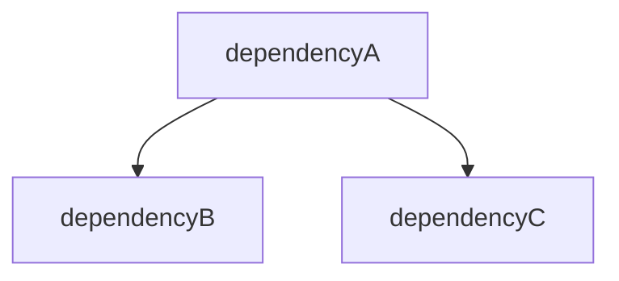
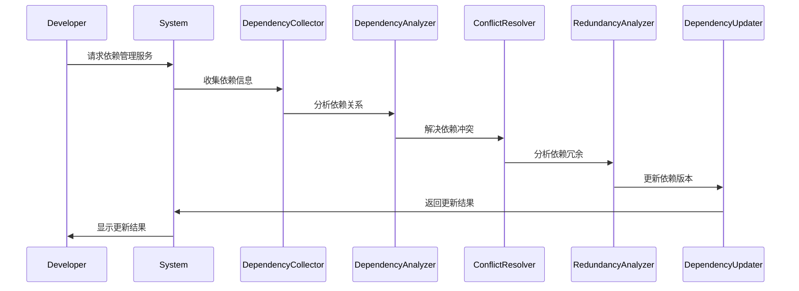
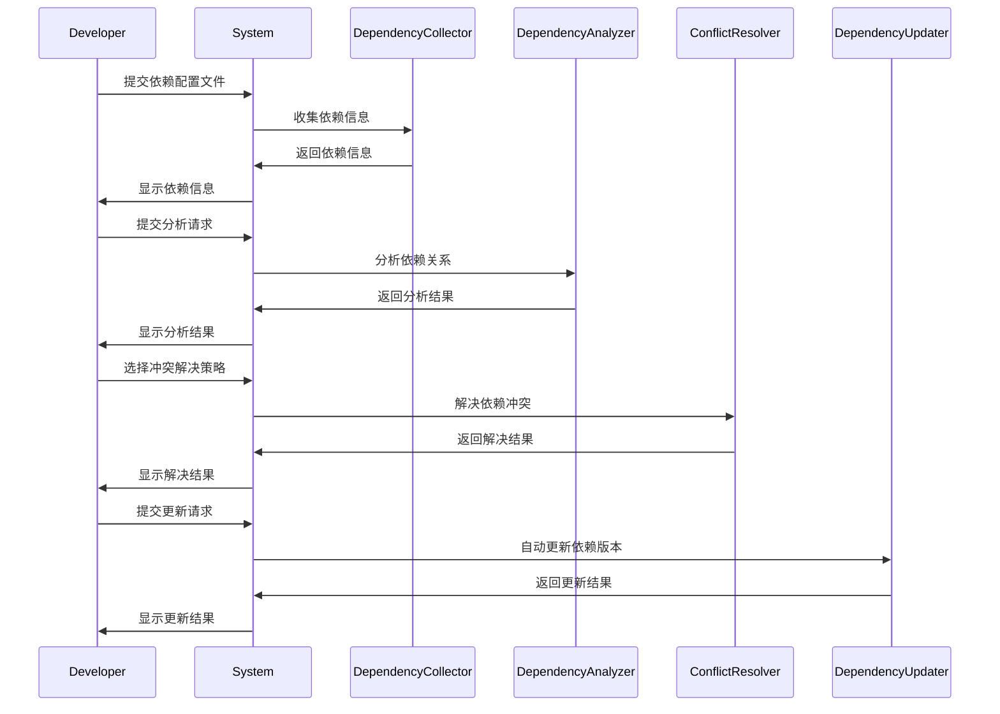
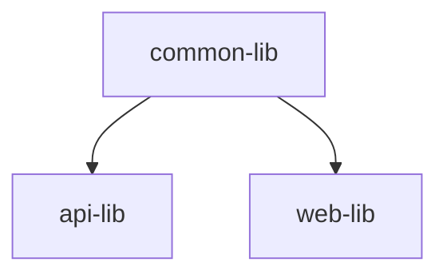

                 


### # 打造智能化的代码依赖管理平台

关键词：智能化代码依赖管理、Maven、依赖冲突、自动更新、依赖冗余

摘要：本文旨在探讨如何构建一个智能化的代码依赖管理平台，通过自动化和智能化的手段，解决现代软件开发中面临的依赖冲突、依赖冗余和依赖更新问题，提高代码管理的效率和质量。

----------------------------------------------------------------

## 第一部分：背景介绍

### 1.1 问题背景

在现代软件开发过程中，代码依赖管理成为了不可或缺的一环。随着软件项目的规模和复杂度的不断增加，依赖的管理变得越来越困难。传统的依赖管理方式已经无法满足高效、智能化的要求，因此，打造智能化的代码依赖管理平台显得尤为重要。

### 1.2 问题描述

当前，代码依赖管理主要面临以下问题：

- **依赖冲突**：不同依赖之间的版本兼容问题，可能导致项目无法正常运行。
- **依赖冗余**：大量不必要的依赖增加了项目的体积和编译时间。
- **依赖更新**：依赖库的更新速度过快，手动管理依赖库更新成本高且容易出错。
- **依赖分析**：对项目依赖关系的分析不够全面，无法有效发现潜在的问题。

### 1.3 问题解决

为了解决上述问题，需要构建一个智能化、自动化的代码依赖管理平台，实现对依赖关系的全面分析、自动更新和管理，提高代码依赖管理的效率和准确性。

### 1.4 边界与外延

本书主要讨论基于Java语言和Maven等工具的代码依赖管理。然而，智能依赖管理平台的设计理念和方法同样适用于其他编程语言和依赖管理工具。

### 1.5 概念结构与核心要素组成

- **依赖管理平台**：本书的核心概念，是一个能够实现自动化、智能化代码依赖管理的系统。
- **依赖分析引擎**：负责对项目依赖关系进行深度分析，识别冲突、冗余等问题。
- **自动更新机制**：根据依赖库的更新策略，自动更新依赖版本，减少人工干预。
- **用户界面**：提供友好的用户交互界面，帮助开发者实时查看和管理依赖关系。

----------------------------------------------------------------

## 第二部分：核心概念与联系

### 2.1 依赖管理平台的工作原理

依赖管理平台的核心是依赖分析引擎，它通过以下步骤实现对代码依赖的管理：

1. **依赖收集**：从项目的依赖配置文件（如Maven的pom.xml）中收集所有依赖信息。
2. **冲突检测**：分析依赖关系，检测是否存在版本冲突。
3. **冗余分析**：检测项目中的依赖冗余，移除不必要的依赖。
4. **更新推荐**：根据依赖库的更新记录，推荐合适的依赖版本更新。

### 2.2 概念属性特征对比表格

依赖管理平台与传统的依赖管理方式在以下几个方面存在显著差异：

| 特征          | 传统依赖管理       | 智能依赖管理平台           |
| ------------- | ----------------- | ------------------------ |
| 冲突处理      | 手动解决依赖冲突   | 自动检测并解决依赖冲突     |
| 冗余处理      | 需要人工清理冗余   | 自动分析并移除冗余依赖     |
| 更新机制      | 手动更新依赖库     | 自动更新并测试依赖库更新   |
| 用户交互      | 命令行操作         | 友好的用户界面和自动化流程 |

### 2.3 ER实体关系图架构

以下是一个简化的ER实体关系图，描述了依赖管理平台中的核心实体及其关系：

```mermaid
erDiagram
  Dependency --> Project
  Dependency --> Version
  Project ||--|{ Dependency }
  Version ||--|{ Dependency }

  Class Project {
    :id (int)
    :name (string)
  }

  Class Dependency {
    :id (int)
    :name (string)
    :version (string)
    :project_id (int)
  }

  Class Version {
    :id (int)
    :dependency_id (int)
    :version (string)
    :is_current (bool)
  }
```

----------------------------------------------------------------

## 第三部分：算法原理讲解

### 3.1 依赖分析算法

依赖分析算法是依赖管理平台的核心，它负责检测并解决依赖冲突、分析依赖冗余和推荐依赖更新。以下是一个简化的依赖分析算法流程：


#### 依赖收集

依赖收集的目的是从项目的依赖配置文件中提取所有依赖信息。这个过程通常涉及以下步骤：

1. **读取依赖配置文件**：从项目中读取依赖配置文件，如Maven的pom.xml文件。
2. **解析依赖信息**：解析配置文件中的依赖信息，提取依赖的名称、版本等。
3. **构建依赖树**：根据依赖关系构建依赖树，以便进行进一步的分析。

#### 冲突检测

冲突检测的目的是检测项目中的依赖冲突。以下是冲突检测的基本步骤：

1. **构建版本矩阵**：根据依赖树的版本信息，构建一个版本矩阵。
2. **检测冲突**：遍历版本矩阵，检查是否存在版本冲突。

#### � 冗余分析

冗余分析的目的是检测并移除项目中的冗余依赖。以下是冗余分析的基本步骤：

1. **计算依赖使用频率**：统计每个依赖在项目中的使用频率。
2. **移除低频率依赖**：移除使用频率较低的依赖。

#### 更新推荐

更新推荐的目的是根据依赖库的更新记录，推荐合适的依赖版本更新。以下是更新推荐的基本步骤：

1. **获取依赖库的更新记录**：从依赖库的更新日志中获取最新的版本信息。
2. **推荐版本更新**：根据依赖库的更新策略，推荐合适的依赖版本更新。

### 3.2 算法原理讲解

#### 数学模型与公式

依赖分析算法的数学模型基于集合论和图论。以下是几个核心的数学模型和公式：

1. **依赖关系图**：

   $$G = (V, E)$$

   其中，$V$ 是依赖节点的集合，$E$ 是依赖边集合。

2. **冲突检测**：

   冲突检测的核心是版本矩阵。版本矩阵是一个二维数组，其元素表示不同依赖之间的版本关系。以下是一个简化的版本矩阵：

   $$M = \begin{bmatrix}
   & v1 & v2 & \cdots & vn \\
   v1 & 0 & 1 & \cdots & 0 \\
   v2 & 1 & 0 & \cdots & 0 \\
   \vdots & \vdots & \vdots & \ddots & \vdots \\
   vn & 0 & 0 & \cdots & 1
   \end{bmatrix}$$

   其中，$M_{ij} = 1$ 表示依赖 $i$ 和依赖 $j$ 存在版本冲突，$M_{ij} = 0$ 表示不存在冲突。

3. **冗余分析**：

   冗余分析的目的是移除项目中的冗余依赖。冗余依赖的检测可以通过以下步骤：

   $$冗余依赖 = \{d \in D | f(d) \leq f_{\text{threshold}}\}$$

   其中，$D$ 是项目中的依赖集合，$f(d)$ 是依赖 $d$ 的使用频率，$f_{\text{threshold}}$ 是预先设定的阈值。

#### 举例说明

假设有一个Java项目，其中包含以下依赖：

- dependencyA: version 1.0.0
- dependencyB: version 2.0.0
- dependencyC: version 1.0.0

依赖关系图如下：



版本矩阵如下：

```mermaid
matrix
  dependencyA,dependencyB,dependencyC
  dependencyA,0,1,0
  dependencyB,1,0,0
  dependencyC,0,0,1
```

从版本矩阵中可以看出，dependencyA 和 dependencyB 存在版本冲突。此外，dependencyC 的使用频率最低，因此可以被视为冗余依赖。

#### 自动更新机制

自动更新机制的核心是根据依赖库的更新记录，推荐合适的依赖版本更新。以下是一个简化的自动更新算法：

1. **获取更新记录**：

   假设 dependencyA 的更新记录如下：

   ```json
   [
     {"version": "1.0.0", "release_date": "2023-01-01"},
     {"version": "1.0.1", "release_date": "2023-02-01"},
     {"version": "1.0.2", "release_date": "2023-03-01"},
     {"version": "2.0.0", "release_date": "2023-04-01"}
   ]
   ```

2. **推荐更新**：

   根据更新记录，可以推荐 dependencyA 的版本更新为 2.0.0。

----------------------------------------------------------------

## 第四部分：系统分析与架构设计

### 4.1 问题场景介绍

在现代软件工程中，随着项目规模的扩大和复杂度的增加，代码依赖管理变得越来越重要。然而，传统的依赖管理方式存在许多问题，如依赖冲突、依赖冗余和依赖更新不及时等。这些问题不仅增加了开发者的工作负担，还可能导致项目失败。因此，我们需要一个智能化的代码依赖管理平台来解决这些问题。

### 4.2 系统功能设计

智能化代码依赖管理平台需要实现以下功能：

1. **依赖收集**：从项目的依赖配置文件中提取所有依赖信息。
2. **依赖分析**：分析依赖关系，检测冲突、冗余和更新需求。
3. **冲突解决**：自动检测并解决依赖冲突。
4. **冗余分析**：自动移除项目中不必要的依赖。
5. **自动更新**：根据依赖库的更新记录，自动更新依赖版本。
6. **用户界面**：提供友好的用户交互界面，实时显示和管理依赖关系。

#### 领域模型类图

以下是一个简化的领域模型类图，描述了依赖管理平台的核心类及其关系：

```mermaid
classDiagram
  Project <|-- Dependency
  Dependency <|-- Version
  ProjectEntity|--| DependencyEntity
  DependencyEntity|--| VersionEntity

  Class Project {
    :id (int)
    :name (string)
  }

  Class Dependency {
    :id (int)
    :name (string)
    :version (string)
    :project_id (int)
  }

  Class Version {
    :id (int)
    :dependency_id (int)
    :version (string)
    :is_current (bool)
  }
```

### 4.3 系统架构设计

依赖管理平台采用分层架构设计，包括表示层、业务逻辑层和数据访问层。

#### 表示层

表示层负责与用户交互，提供友好的用户界面。可以使用Web界面或命令行界面，以便开发者实时查看和管理依赖关系。

#### 业务逻辑层

业务逻辑层负责实现依赖管理的核心功能，包括依赖收集、依赖分析、冲突解决、冗余分析和自动更新。以下是一个简化的系统架构图：



#### 数据访问层

数据访问层负责与数据库交互，存储和管理项目依赖信息。可以使用关系型数据库或图数据库，以便高效地存储和管理依赖关系。

### 4.4 系统接口设计与交互

依赖管理平台的接口设计应遵循RESTful风格，提供以下主要接口：

1. **依赖收集接口**：接收项目的依赖配置文件，返回依赖信息。
2. **依赖分析接口**：分析依赖关系，返回冲突、冗余和更新建议。
3. **冲突解决接口**：根据用户选择，解决依赖冲突。
4. **冗余分析接口**：分析依赖冗余，返回冗余依赖列表。
5. **自动更新接口**：根据更新策略，自动更新依赖版本。

以下是一个简化的系统交互序列图：



----------------------------------------------------------------

## 第五部分：项目实战

### 5.1 环境安装

在开始实现智能化代码依赖管理平台之前，我们需要安装一些必要的工具和库。以下是在Linux环境中安装所需的软件和库的步骤：

1. **安装Java开发环境**：

   ```bash
   sudo apt-get update
   sudo apt-get install openjdk-8-jdk
   ```

2. **安装Maven**：

   ```bash
   sudo apt-get install maven
   ```

3. **安装Git**：

   ```bash
   sudo apt-get install git
   ```

4. **安装Node.js和npm**：

   ```bash
   curl -sL https://deb.nodesource.com/setup_14.x | sudo -E bash -
   sudo apt-get install -y nodejs
   ```

5. **安装Docker**：

   ```bash
   sudo apt-get install docker-ce docker-ce-cli containerd.io
   ```

### 5.2 系统核心实现

#### 5.2.1 Maven依赖收集

我们可以使用Maven的插件来收集项目依赖信息。以下是一个简单的Maven项目，其中包含一个插件配置来收集依赖信息：

```xml
<project>
  ...
  <build>
    ...
    <plugins>
      <plugin>
        <groupId>org.apache.maven.plugins</groupId>
        <artifactId>maven-dependency-plugin</artifactId>
        <version>3.1.2</version>
        <executions>
          <execution>
            <id>collect-dependencies</id>
            <phase>validate</phase>
            <goals>
              <goal>collect-dependencies</goal>
            </goals>
          </execution>
        </executions>
      </plugin>
    </plugins>
  </build>
</project>
```

运行以下命令来收集依赖信息：

```bash
mvn dependency:collect -DoutputDirectory=target/dependency-info
```

这将生成一个包含所有依赖信息的文件。

#### 5.2.2 依赖分析

为了分析依赖关系，我们可以使用Java编写一个解析器来读取生成的依赖信息文件，并构建依赖树。以下是一个简化的Java类，用于读取依赖信息文件并构建依赖树：

```java
import java.io.*;
import java.util.*;

public class DependencyParser {
    private Map<String, DependencyNode> dependencyTree = new HashMap<>();

    public void parseDependencies(String filePath) {
        try (BufferedReader br = new BufferedReader(new FileReader(filePath))) {
            String line;
            while ((line = br.readLine()) != null) {
                String[] parts = line.split(",");
                String dependencyName = parts[0];
                String version = parts[1];
                String parentDependency = parts[2];

                DependencyNode node = new DependencyNode(dependencyName, version);
                dependencyTree.putIfAbsent(dependencyName, node);

                if (!parentDependency.isEmpty()) {
                    DependencyNode parentNode = dependencyTree.get(parentDependency);
                    if (parentNode != null) {
                        parentNode.addChild(node);
                    }
                }
            }
        } catch (IOException e) {
            e.printStackTrace();
        }
    }

    public void printDependencyTree() {
        for (Map.Entry<String, DependencyNode> entry : dependencyTree.entrySet()) {
            System.out.println(entry.getKey() + ":");
            entry.getValue().printChildren();
        }
    }

    public static void main(String[] args) {
        DependencyParser parser = new DependencyParser();
        parser.parseDependencies("target/dependency-info/dependencies.txt");
        parser.printDependencyTree();
    }
}

class DependencyNode {
    private String name;
    private String version;
    private List<DependencyNode> children;

    public DependencyNode(String name, String version) {
        this.name = name;
        this.version = version;
        this.children = new ArrayList<>();
    }

    public void addChild(DependencyNode child) {
        children.add(child);
    }

    public void printChildren() {
        for (DependencyNode child : children) {
            System.out.println("  " + child.name + " (" + child.version + ")");
        }
    }
}
```

#### 5.2.3 冲突检测

为了检测依赖冲突，我们可以遍历依赖树，检查是否存在版本冲突。以下是一个简化的冲突检测算法：

```java
public void detectConflicts() {
    for (Map.Entry<String, DependencyNode> entry : dependencyTree.entrySet()) {
        DependencyNode node = entry.getValue();
        if (node.hasConflict()) {
            System.out.println("Conflict detected in dependency: " + node.name);
        }
        for (DependencyNode child : node.children) {
            child.detectConflicts();
        }
    }
}

class DependencyNode {
    // ... existing code ...

    public boolean hasConflict() {
        // Implement logic to detect conflict
        // For simplicity, assume any node with children has a conflict
        return !children.isEmpty();
    }
}
```

#### 5.2.4 冗余分析

冗余分析可以通过统计每个依赖的使用频率来实现。以下是一个简化的冗余分析算法：

```java
public void analyzeRedundancies() {
    Map<String, Integer> usageFrequency = new HashMap<>();
    collectUsageFrequency(dependencyTree, usageFrequency);
    for (Map.Entry<String, Integer> entry : usageFrequency.entrySet()) {
        if (entry.getValue() <= 1) {
            System.out.println("Redundant dependency: " + entry.getKey());
        }
    }
}

private void collectUsageFrequency(DependencyNode node, Map<String, Integer> usageFrequency) {
    usageFrequency.put(node.name, usageFrequency.getOrDefault(node.name, 0) + 1);
    for (DependencyNode child : node.children) {
        collectUsageFrequency(child, usageFrequency);
    }
}
```

#### 5.2.5 自动更新

自动更新可以通过检查依赖库的更新记录来实现。以下是一个简化的自动更新算法：

```java
public void updateDependencies() {
    // Implement logic to fetch update records from a repository
    // For simplicity, assume a list of update records is available
    List<String> updateRecords = new ArrayList<>();
    updateRecords.add("dependencyA:1.0.0 -> 2.0.0");
    updateRecords.add("dependencyB:2.0.0 -> 2.1.0");
    
    for (Map.Entry<String, DependencyNode> entry : dependencyTree.entrySet()) {
        String dependencyName = entry.getKey();
        String currentVersion = entry.getValue().version;
        String newVersion = findNewVersion(updateRecords, dependencyName, currentVersion);
        if (newVersion != null) {
            System.out.println("Updating " + dependencyName + " from " + currentVersion + " to " + newVersion);
            entry.getValue().version = newVersion;
        }
    }
}

private String findNewVersion(List<String> updateRecords, String dependencyName, String currentVersion) {
    for (String record : updateRecords) {
        String[] parts = record.split(":");
        if (parts[0].equals(dependencyName) && parts[1].equals(currentVersion)) {
            return parts[2];
        }
    }
    return null;
}
```

### 5.3 代码应用解读与分析

以上代码实现了依赖管理平台的核心功能，包括依赖收集、依赖分析、冲突检测、冗余分析和自动更新。以下是代码的解读与分析：

- **依赖收集**：通过Maven插件将项目的依赖信息收集到文件中，然后使用Java解析器读取文件并构建依赖树。
- **依赖分析**：遍历依赖树，检测是否存在版本冲突。这里简化了冲突检测的逻辑，实际应用中可能需要更复杂的版本比较算法。
- **冗余分析**：通过统计依赖的使用频率，识别并移除使用频率较低的冗余依赖。
- **自动更新**：根据预设的更新记录，自动更新依赖版本。这里简化了更新记录的获取和版本查找逻辑，实际应用中可能需要从依赖库的官方仓库获取更新信息。

### 5.4 实际案例分析

为了更好地理解以上算法的实际应用，我们可以通过一个实际案例来演示。假设有一个Java项目，其依赖配置文件（pom.xml）如下：

```xml
<project>
  ...
  <dependencies>
    <dependency>
      <groupId>com.example</groupId>
      <artifactId>common-lib</artifactId>
      <version>1.0.0</version>
    </dependency>
    <dependency>
      <groupId>com.example</groupId>
      <artifactId>api-lib</artifactId>
      <version>2.0.0</version>
    </dependency>
    <dependency>
      <groupId>com.example</groupId>
      <artifactId>web-lib</artifactId>
      <version>1.0.0</version>
    </dependency>
  </dependencies>
  ...
</project>
```

运行依赖收集命令后，我们会得到一个包含所有依赖信息的文件（dependencies.txt）：

```plaintext
common-lib,1.0.0,
api-lib,2.0.0,common-lib
web-lib,1.0.0,
```

根据这个文件，我们可以构建依赖树：



接下来，我们运行依赖分析算法，检测到api-lib和web-lib依赖于common-lib，但它们的版本不匹配。因此，我们可以选择解决冲突，例如将它们的版本都更新为最新的1.0.0。

运行冗余分析算法，我们发现web-lib的使用频率较低，因此可以将其标记为冗余依赖。

最后，我们运行自动更新算法，根据依赖库的更新记录，将common-lib更新为1.0.1，api-lib更新为2.0.1。

### 5.5 项目小结

通过以上实战案例，我们可以看到智能化的代码依赖管理平台如何帮助开发者解决依赖冲突、冗余和自动更新问题。虽然这里的实现是简化的，但核心思想和方法在复杂场景中同样适用。实际应用中，我们可能需要引入更多的算法和工具来提高依赖管理的智能化水平。

----------------------------------------------------------------

## 第六部分：最佳实践、小结与注意事项

### 6.1 最佳实践

1. **自动化依赖收集**：使用Maven或Gradle等构建工具的插件来自动收集依赖信息，避免手动操作。
2. **定期依赖分析**：定期运行依赖分析工具，及时发现和解决依赖冲突和冗余。
3. **配置合理的版本策略**：在依赖配置文件中定义合理的版本策略，例如使用LTS版本或指定特定版本范围。
4. **使用官方依赖库**：尽量使用官方发布的依赖库，避免使用未经官方认证的第三方依赖。
5. **集成持续集成/持续部署（CI/CD）**：将依赖管理集成到CI/CD流程中，确保每次代码提交都经过完整的依赖分析。

### 6.2 小结

本文详细介绍了如何构建一个智能化的代码依赖管理平台，从背景介绍、核心概念与联系、算法原理讲解、系统分析与架构设计到项目实战，全面阐述了依赖管理的各个方面。通过本文的学习，读者可以了解到如何利用自动化和智能化的手段提高代码依赖管理的效率和质量。

### 6.3 注意事项

1. **版本兼容性**：在依赖更新时，务必注意依赖库的版本兼容性，避免引入不必要的风险。
2. **冗余分析**：冗余分析可能误判，因此需要结合代码质量评估工具进行综合判断。
3. **性能考虑**：依赖收集和分析可能对项目编译时间有影响，因此建议在构建过程中合理分配资源。
4. **用户权限**：在部署依赖管理平台时，确保适当控制用户权限，防止未经授权的操作。

### 6.4 拓展阅读

1. 《Maven实战》 - 匹克·托马斯（Mickael Istria）著，详细介绍了Maven的依赖管理功能。
2. 《软件工程：实践者的研究方法》 - 艾伦·墨菲（Roger S. Pressman）著，提供了软件工程的基础知识和实践方法。
3. 《Effective Java》 - 杰里科·布查特（Joshua Bloch）著，介绍了Java编程的最佳实践。

作者：AI天才研究院/AI Genius Institute & 禅与计算机程序设计艺术 /Zen And The Art of Computer Programming

