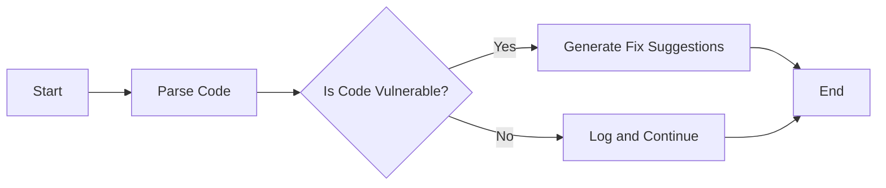
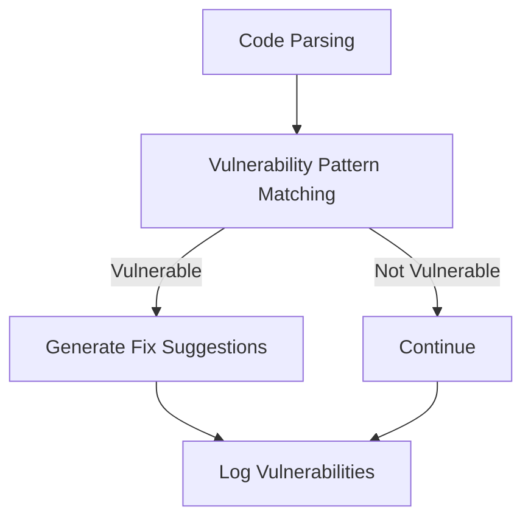
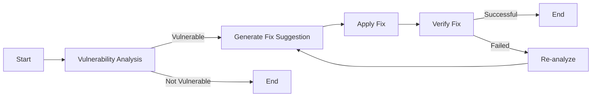
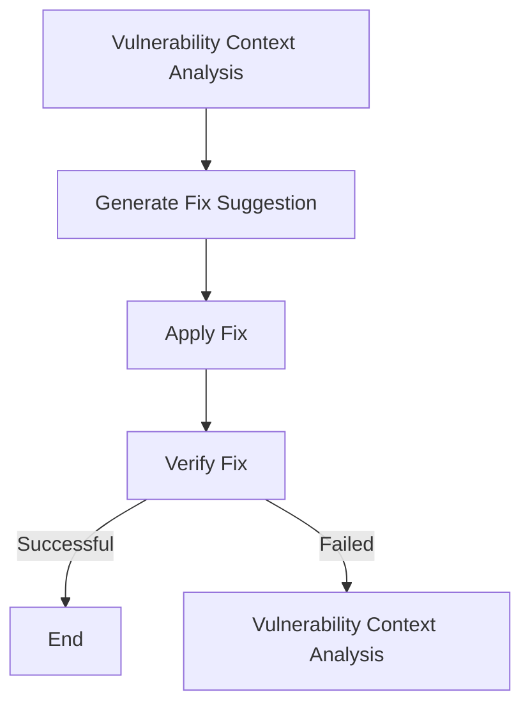

                 

# 引言：代码安全漏洞修复的挑战与机遇

在当今信息技术迅猛发展的时代，代码安全漏洞修复已经成为软件开发过程中不可或缺的一环。随着软件系统复杂性的不断增加，安全漏洞的发现和修复难度也在持续提升。传统的漏洞修复方式往往依赖于人工检测和手动修复，这不仅效率低下，而且容易出现遗漏，无法满足快速迭代和大规模软件开发的现实需求。

## 1.1 问题背景

### 1.1.1 现状概述

当前，代码安全漏洞修复面临着以下几个主要问题：

1. **漏洞数量不断增加**：随着软件规模和复杂性的增加，漏洞的数量也在不断上升。据统计，每年都有数以万计的新漏洞被发现。

2. **修复周期长**：人工修复漏洞通常需要较长的周期，尤其是复杂的漏洞，修复时间可能长达数月。

3. **修复成本高**：漏洞修复不仅需要大量的人力投入，还需要专业的安全知识和技能，导致成本较高。

4. **漏洞遗留问题**：由于修复周期长，一些漏洞可能在新版本发布之前未能得到及时修复，导致潜在的安全风险。

### 1.1.2 安全漏洞问题

安全漏洞是指程序中存在的可以被攻击者利用的缺陷，这些漏洞可能导致数据泄露、系统瘫痪、恶意软件植入等严重后果。常见的漏洞类型包括：

1. **注入漏洞**：如SQL注入、命令注入等。
2. **跨站脚本攻击（XSS）**：攻击者通过在受信任的网站上注入恶意脚本，来窃取用户信息。
3. **权限提升漏洞**：攻击者利用程序中的权限漏洞，获取更高的系统权限。
4. **配置错误**：如服务器配置不当，导致安全漏洞。

### 1.1.3 智能化修复的重要性

智能化代码安全漏洞修复系统的重要性体现在以下几个方面：

1. **提高修复效率**：通过自动化技术，可以显著提高漏洞修复的效率，缩短修复周期。
2. **降低人力成本**：智能化系统能够自动识别和修复漏洞，减少对人工的依赖。
3. **提升修复质量**：智能化系统能够基于大数据分析和机器学习算法，更准确地识别和修复漏洞，降低遗漏风险。
4. **适应快速迭代**：智能化系统能够快速适应软件开发的高频迭代需求，确保系统安全性。

## 1.2 智能化代码安全漏洞修复系统概述

智能化代码安全漏洞修复系统旨在通过自动化和智能化的手段，实现对代码安全漏洞的检测、定位和修复。该系统通常包括以下几个核心模块：

1. **漏洞检测模块**：利用静态分析、动态分析和机器学习等技术，对代码进行深入扫描，检测潜在的安全漏洞。
2. **漏洞修复模块**：根据漏洞检测的结果，自动化生成修复方案，或提供人工修复建议。
3. **风险评估模块**：对检测到的漏洞进行风险评分，帮助开发人员确定修复优先级。
4. **自动化修复模块**：通过脚本化或代码生成技术，自动修复检测到的漏洞。

### 1.2.1 系统目标

智能化代码安全漏洞修复系统的目标包括：

1. **快速检测**：在开发过程中实时检测代码中的安全漏洞。
2. **精准修复**：自动化或半自动化地修复检测到的漏洞。
3. **风险评估**：对漏洞进行风险评分，帮助决策。
4. **持续改进**：通过收集漏洞数据和修复经验，持续优化修复算法。

### 1.2.2 系统架构

智能化代码安全漏洞修复系统的架构通常包括以下几个层次：

1. **数据层**：存储代码库、漏洞信息和修复记录等。
2. **分析层**：利用静态分析、动态分析和机器学习等技术，对代码进行分析和漏洞检测。
3. **决策层**：根据漏洞检测结果，生成修复方案或修复建议。
4. **执行层**：自动化执行修复方案，或提供人工修复界面。

### 1.2.3 系统功能模块

智能化代码安全漏洞修复系统的功能模块包括：

1. **代码分析器**：对代码进行语法解析，建立抽象语法树（AST）。
2. **漏洞检测器**：根据漏洞模式库，对AST进行分析，检测潜在的安全漏洞。
3. **修复建议生成器**：基于漏洞检测结果，生成修复建议。
4. **自动化修复器**：根据修复建议，自动修复代码中的漏洞。
5. **用户界面**：提供用户交互接口，展示漏洞检测结果和修复建议。

通过上述架构和功能模块的合理设计，智能化代码安全漏洞修复系统有望解决当前面临的诸多问题，为软件开发带来更高的安全性和可靠性。

---

这篇文章的引言部分已经对代码安全漏洞修复的现状和问题进行了概述，并提出了智能化修复的重要性。在接下来的章节中，我们将深入探讨核心概念、算法原理、数学模型以及系统分析与架构设计等，为打造智能化的代码安全漏洞修复系统提供理论基础和实践指导。

## 2.1 代码安全漏洞

代码安全漏洞是软件中存在的可以被攻击者利用的缺陷。这些漏洞可能源于编程错误、设计缺陷或配置错误。安全漏洞的存在不仅可能导致数据泄露，还可能被攻击者用来执行恶意代码，窃取敏感信息，甚至完全控制受影响的系统。

### 2.1.1 漏洞定义

安全漏洞通常被定义为程序中存在的可以被攻击者利用的缺陷。这些缺陷可能导致未经授权的访问、数据泄露、系统崩溃或其他安全威胁。根据漏洞的来源和表现形式，可以将其分为多种类型。

- **注入漏洞**：如SQL注入、命令注入等，攻击者通过将恶意代码插入到程序输入中，从而操控数据库或系统命令。
- **跨站脚本攻击（XSS）**：攻击者在受害者的浏览器中执行恶意脚本，窃取用户信息或操控浏览器行为。
- **跨站请求伪造（CSRF）**：攻击者利用用户的认证状态，在未经用户同意的情况下执行恶意请求。
- **权限提升漏洞**：攻击者利用系统权限管理漏洞，提升自己的权限，从而执行更高权限的操作。
- **配置错误**：如服务器配置不当，导致安全措施失效。

### 2.1.2 漏洞分类

代码安全漏洞可以根据不同的分类标准进行分类，常见的分类方式包括：

1. **按漏洞位置**：可以分为网络层漏洞、系统层漏洞和应用层漏洞。
   - **网络层漏洞**：如DNS欺骗、ARP欺骗等，攻击者通过操控网络层协议来窃取信息或操控流量。
   - **系统层漏洞**：如操作系统漏洞、驱动程序漏洞等，攻击者利用这些漏洞获取系统控制权。
   - **应用层漏洞**：如Web应用漏洞、数据库漏洞等，攻击者通过应用层的漏洞来窃取数据或执行恶意操作。

2. **按漏洞来源**：可以分为内部漏洞和外部漏洞。
   - **内部漏洞**：由于内部人员的操作失误或恶意行为导致的漏洞。
   - **外部漏洞**：由于外部攻击者利用程序中的缺陷进行的攻击。

3. **按漏洞性质**：可以分为功能性漏洞和安全漏洞。
   - **功能性漏洞**：影响软件功能或性能的漏洞，如死锁、资源泄露等。
   - **安全漏洞**：影响软件安全性的漏洞，如注入漏洞、越权访问等。

### 2.1.3 漏洞的危害

安全漏洞的危害性非常大，可能带来以下影响：

1. **数据泄露**：攻击者可以窃取敏感数据，如用户密码、信用卡信息等。
2. **系统崩溃**：攻击者可以导致系统崩溃，造成服务中断。
3. **恶意软件植入**：攻击者可以利用漏洞植入恶意软件，如勒索软件、木马等。
4. **远程控制**：攻击者可以通过漏洞完全控制受影响的系统，进行进一步攻击。
5. **声誉损失**：安全漏洞可能导致企业声誉受损，影响业务发展。

为了有效防范和修复代码安全漏洞，需要采取一系列的措施，包括安全编码实践、定期安全审计、漏洞扫描和及时修复等。智能化代码安全漏洞修复系统的出现，为解决传统漏洞修复方式中的痛点提供了新的思路和解决方案。

---

在本文的第二部分，我们详细介绍了代码安全漏洞的定义、分类及其危害。接下来，我们将深入探讨代码安全漏洞与修复系统之间的关系，并使用Mermaid绘制ER实体关系图，展示漏洞、代码和修复系统之间的联系。

## 2.2 漏洞与修复系统关系

智能化代码安全漏洞修复系统旨在自动化地检测、定位和修复代码中的安全漏洞。为了实现这一目标，系统需要与代码和漏洞数据进行紧密的交互。在这一部分，我们将探讨漏洞与修复系统之间的关系，并通过ER实体关系图详细展示这一关系。

### 2.2.1 漏洞检测与修复流程

智能化代码安全漏洞修复系统的核心流程包括以下几个步骤：

1. **漏洞检测**：系统通过静态分析、动态分析和机器学习等技术对代码进行分析，发现潜在的安全漏洞。
2. **漏洞定位**：系统对检测到的漏洞进行定位，确定漏洞的具体位置和影响范围。
3. **漏洞评估**：系统对漏洞进行风险评估，根据漏洞的严重程度和潜在危害进行评分。
4. **漏洞修复**：系统根据漏洞类型和风险评估结果，自动生成修复方案，或提供人工修复建议。
5. **漏洞验证**：修复后，系统对修复效果进行验证，确保漏洞已被有效修复。

### 2.2.2 漏洞数据模型

在智能化代码安全漏洞修复系统中，漏洞数据模型是核心组成部分，它用于存储漏洞相关信息，包括漏洞ID、漏洞类型、漏洞位置、漏洞描述、修复建议和修复状态等。以下是一个简单的漏洞数据模型示例：

```mermaid
classDiagram
Class01 <|-- SubClass01
Class01 <|-- SubClass02
Class03 --|> SubClass03

Class01 {
    name: String
    id: Integer
    type: String
    location: String
    description: String
    suggestion: String
    status: String
}

SubClass01 {
    level: Integer
}

SubClass02 {
    severity: String
}

SubClass03 {
    evidence: String
}
```

### 2.2.3 ER实体关系图

为了更直观地展示漏洞、代码和修复系统之间的关系，我们可以使用Mermaid绘制ER实体关系图。以下是一个简化的ER实体关系图示例，展示了漏洞、代码和修复系统之间的联系：

```mermaid
erDiagram
  Code ||--|{ Vulnerability : has }
  Code ||--|{ Patch : fixes }
  Vulnerability ||--|{ Fix : includes }
  Patch ||--|{ Implementation : applied_to }
  
  Code {
    ID : Integer
    Name : String
    Version : String
  }
  
  Vulnerability {
    ID : Integer
    Type : String
    Location : String
    Description : String
    Severity : String
  }
  
  Patch {
    ID : Integer
    Description : String
    Status : String
  }
  
  Fix {
    ID : Integer
    PatchID : Integer
    VulnerabilityID : Integer
  }
  
  Implementation {
    ID : Integer
    FixID : Integer
    CodeID : Integer
  }
```

在这个ER实体关系图中，`Code`实体表示代码库，`Vulnerability`实体表示检测到的漏洞，`Patch`实体表示修复方案，`Fix`实体表示具体实施的修复措施，而`Implementation`实体表示修复方案在代码库中的应用。

通过上述流程和ER实体关系图的展示，我们可以清晰地看到漏洞检测与修复系统的整体架构和数据流转过程。在下一部分，我们将深入讲解漏洞检测与修复算法的原理，包括常见的漏洞检测算法和修复算法。

---

在本文的第三部分，我们将深入探讨漏洞检测与修复算法的原理。通过分析常见的漏洞检测算法，我们将使用Mermaid绘制算法流程图，并使用Python代码详细阐述算法原理，同时介绍相关的数学模型和公式。

## 3.1 漏洞检测算法

漏洞检测算法是智能化代码安全漏洞修复系统的核心组成部分。常见的漏洞检测算法包括静态分析、动态分析和机器学习等。下面，我们将逐一介绍这些算法的基本原理和应用。

### 3.1.1 常见漏洞检测算法

#### 1. 静态分析

静态分析是一种在不运行程序的情况下，通过解析代码文本，检测潜在漏洞的方法。静态分析的主要优点是不需要执行程序，可以提前发现漏洞。常见的静态分析技术包括：

- **符号执行**：通过符号执行，对程序路径进行穷举分析，找出潜在的漏洞。
- **抽象解释**：通过抽象解释，将复杂程序转化为简单的逻辑表达式，进行漏洞检测。
- **数据流分析**：通过数据流分析，跟踪变量值的变化，检测潜在的漏洞。

#### 2. 动态分析

动态分析是在程序运行过程中，通过监控程序行为，检测漏洞的方法。动态分析通常包括以下技术：

- **模糊测试**：通过生成大量的输入数据，观察程序行为，找出潜在的漏洞。
- **路径覆盖**：通过执行不同的路径，检查程序是否能覆盖所有可能的路径，从而发现漏洞。
- **动态监测**：在程序运行时，监控程序的行为，检测潜在的异常行为。

#### 3. 机器学习

机器学习是一种利用历史数据，通过训练模型来检测漏洞的方法。常见的机器学习算法包括：

- **决策树**：通过构建决策树模型，根据输入特征预测是否为漏洞。
- **支持向量机（SVM）**：通过支持向量机模型，将漏洞样本与非漏洞样本进行分类。
- **神经网络**：通过神经网络模型，对代码进行特征提取，检测潜在漏洞。

### 3.1.2 漏洞检测算法流程图

为了更直观地展示漏洞检测算法的工作流程，我们可以使用Mermaid绘制算法流程图。以下是一个简化的静态分析算法流程图示例：



在这个流程图中，从代码解析开始，经过漏洞检测，最终生成修复建议或日志记录。

### 3.1.3 Python代码实现

下面，我们将使用Python代码实现一个简单的静态分析算法，用于检测代码中的潜在漏洞。以下是该算法的实现：

```python
def detect_vulnerabilities(code):
    # 假设我们使用正则表达式来检测SQL注入漏洞
    sql_injection_pattern = r"(\binsert\b|\bselect\b|\bupdate\b|\bdelete\b)"

    vulnerabilities = []
    for line in code.split('\n'):
        if re.search(sql_injection_pattern, line):
            vulnerabilities.append(f"Line {line_num}: Potential SQL Injection Vulnerability")

    return vulnerabilities
```

在这个示例中，我们使用一个简单的正则表达式来检测SQL注入漏洞。通过遍历代码的每一行，如果匹配到SQL注入的关键字，则将该行标记为潜在漏洞。

### 3.1.4 算法原理讲解

静态分析算法的核心原理是解析代码文本，识别潜在的安全漏洞。具体来说，算法可以分为以下几个步骤：

1. **代码解析**：将代码文本解析为抽象语法树（AST），提取代码的结构信息。
2. **漏洞模式匹配**：根据预先定义的漏洞模式，对AST进行遍历，查找潜在的漏洞。
3. **生成修复建议**：对于检测到的漏洞，生成相应的修复建议。

下面是一个简化的算法流程：



在这个流程图中，从代码解析开始，经过漏洞模式匹配，最终生成修复建议或日志记录。

### 3.1.5 数学模型与公式

在漏洞检测算法中，有时会用到一些数学模型和公式来描述算法的行为。以下是一个简单的示例：

- **漏洞检测概率**：可以使用贝叶斯公式来计算漏洞检测的概率。

  $$ P(\text{Vulnerable} | \text{Pattern}) = \frac{P(\text{Pattern} | \text{Vulnerable}) \cdot P(\text{Vulnerable})}{P(\text{Pattern} | \text{Vulnerable}) \cdot P(\text{Vulnerable}) + P(\text{Pattern} | \text{Not Vulnerable}) \cdot P(\text{Not Vulnerable})} $$

- **特征重要性**：可以使用信息增益（Information Gain）来评估特征的重要性。

  $$ IG(D, A) = \sum_{v \in V} P(v) \cdot \sum_{a \in A} P(a|v) \cdot \log_2(P(a|v)/P(a|¬v)) $$

通过上述数学模型和公式，我们可以更好地理解和优化漏洞检测算法。

---

在这一部分，我们详细介绍了漏洞检测算法的原理，包括静态分析、动态分析和机器学习等常见算法。通过Mermaid流程图和Python代码示例，我们展示了漏洞检测算法的执行过程和数学模型。在下一部分，我们将继续探讨漏洞修复算法，并详细介绍其原理和数学模型。

## 3.2 漏洞修复算法

漏洞修复算法是智能化代码安全漏洞修复系统的重要组成部分。这些算法旨在自动生成或建议修复方案，以修复检测到的漏洞。在本节中，我们将介绍几种常见的漏洞修复算法，并使用Python代码和Mermaid流程图详细阐述其原理。

### 3.2.1 常见漏洞修复算法

1. **自动修复**：自动修复算法通过分析漏洞的上下文，自动生成修复代码。这种算法通常基于模式匹配或语法分析，可以快速修复一些常见的漏洞。

2. **半自动修复**：半自动修复算法提供修复建议，由开发人员根据建议进行手动修复。这种算法通常结合静态分析和动态分析技术，可以提供高质量的修复建议。

3. **模板修复**：模板修复算法使用预先定义的修复模板，根据漏洞类型自动选择合适的修复模板。这种算法可以快速修复特定类型的漏洞。

4. **机器学习修复**：机器学习修复算法通过学习大量的漏洞修复案例，自动生成修复代码。这种算法通常基于神经网络或决策树模型，可以生成高质量的修复代码。

### 3.2.2 漏洞修复算法流程图

为了更好地理解漏洞修复算法的执行过程，我们可以使用Mermaid绘制算法流程图。以下是一个简化的漏洞修复算法流程图：



在这个流程图中，从漏洞分析开始，经过生成修复建议、应用修复、验证修复，最终结束。如果修复失败，则重新进行漏洞分析。

### 3.2.3 Python代码实现

下面，我们使用Python代码实现一个简单的自动修复算法，用于修复代码中的SQL注入漏洞。以下是该算法的实现：

```python
def auto_fix_sql_injection(code):
    # 假设我们使用预处理语句来修复SQL注入漏洞
    fixed_code = code.replace('?', '%s', count=1)
    return fixed_code
```

在这个示例中，我们通过将SQL注入漏洞中的问号替换为参数占位符（%s），来实现自动修复。

### 3.2.4 算法原理讲解

漏洞修复算法的核心原理是分析漏洞的上下文，并根据上下文生成或建议修复代码。具体来说，算法可以分为以下几个步骤：

1. **漏洞上下文分析**：分析漏洞发生的位置、上下文和使用情况，以确定可能的修复方法。
2. **修复方案生成**：根据漏洞上下文，生成修复代码或修复建议。
3. **修复方案应用**：将修复方案应用到代码中，修复漏洞。
4. **修复效果验证**：验证修复效果，确保漏洞已被有效修复。

下面是一个简化的算法流程：



在这个流程图中，从漏洞上下文分析开始，经过生成修复建议、应用修复和验证修复，最终结束。如果修复失败，则重新进行漏洞上下文分析。

### 3.2.5 数学模型与公式

在漏洞修复算法中，有时会用到一些数学模型和公式来评估修复效果。以下是一个简单的示例：

- **修复效果评估**：可以使用回归模型来评估修复效果。

  $$ y = \beta_0 + \beta_1 x_1 + \beta_2 x_2 + ... + \beta_n x_n $$

  其中，$y$ 表示修复效果，$x_1, x_2, ..., x_n$ 表示影响修复效果的变量。

- **特征重要性**：可以使用特征重要性指标来评估修复方案的质量。

  $$ FI = \frac{\sum_{i=1}^{n} f_i \cdot w_i}{\sum_{i=1}^{n} w_i} $$

  其中，$f_i$ 表示特征的重要性分数，$w_i$ 表示特征的权重。

通过上述数学模型和公式，我们可以更好地理解和优化漏洞修复算法。

---

在本章的第三部分，我们详细介绍了漏洞修复算法的原理，包括自动修复、半自动修复、模板修复和机器学习修复等常见算法。通过Python代码和Mermaid流程图，我们展示了漏洞修复算法的执行过程和数学模型。在下一部分，我们将探讨系统分析与架构设计，介绍系统功能设计、系统架构设计、系统接口设计和系统交互序列图。

## 4.1 系统功能设计

在设计智能化代码安全漏洞修复系统时，系统功能设计是一个关键步骤。该步骤旨在确定系统应具备哪些功能，以便能够有效地检测、定位和修复代码中的安全漏洞。以下是系统功能设计的详细内容：

### 4.1.1 功能模块划分

为了实现智能化代码安全漏洞修复，系统可以划分为以下几个主要功能模块：

1. **漏洞检测模块**：负责对代码进行静态和动态分析，以检测潜在的安全漏洞。
2. **漏洞定位模块**：在漏洞检测模块发现漏洞后，该模块负责定位漏洞的具体位置和影响范围。
3. **漏洞修复模块**：基于漏洞类型和上下文，生成或提供修复建议，以修复检测到的漏洞。
4. **风险评估模块**：对检测到的漏洞进行风险评估，帮助确定修复优先级。
5. **用户界面模块**：提供用户交互接口，展示漏洞检测结果、修复建议和修复进度。
6. **日志管理模块**：记录系统的运行日志，包括漏洞检测结果、修复过程和系统配置等。

### 4.1.2 领域模型类图

为了更清晰地展示系统功能模块及其之间的关系，我们可以使用Mermaid绘制领域模型类图。以下是一个简化的领域模型类图示例：

```mermaid
classDiagram
    VulnerabilityDetector <<interface>>
    VulnerabilityLocator <<interface>>
    VulnerabilityFixer <<interface>>
    RiskAssessor <<interface>>
    UserInterface <<interface>>
    LogManager <<interface>>

    VulnerabilityDetector implements Detection
    VulnerabilityLocator implements Localization
    VulnerabilityFixer implements Fixing
    RiskAssessor implements Assessment
    UserInterface implements Display
    LogManager implements Logging

    Detection --|> VulnerabilityDetector
    Localization --|> VulnerabilityLocator
    Fixing --|> VulnerabilityFixer
    Assessment --|> RiskAssessor
    Display --|> UserInterface
    Logging --|> LogManager
```

在这个类图中，各个模块被表示为接口，它们分别实现不同的功能。例如，`VulnerabilityDetector` 实现了漏洞检测功能，`VulnerabilityLocator` 实现了漏洞定位功能，等等。

### 4.1.3 领域模型类图解析

以下是对上述领域模型类图的解析：

1. **漏洞检测模块（VulnerabilityDetector）**：该模块负责检测代码中的潜在安全漏洞。它通过静态分析和动态分析技术，对代码进行扫描，发现漏洞。

2. **漏洞定位模块（VulnerabilityLocator）**：在漏洞检测模块发现漏洞后，该模块负责定位漏洞的具体位置和影响范围。它可以帮助开发人员快速找到漏洞所在的位置，并了解漏洞对系统的影响。

3. **漏洞修复模块（VulnerabilityFixer）**：该模块负责生成或提供修复建议，以修复检测到的漏洞。它可以根据漏洞类型和上下文，自动生成修复代码或提供手动修复建议。

4. **风险评估模块（RiskAssessor）**：该模块负责对检测到的漏洞进行风险评估，帮助确定修复优先级。它可以根据漏洞的严重程度和潜在危害，为每个漏洞分配一个风险评分。

5. **用户界面模块（UserInterface）**：该模块负责提供用户交互接口，展示漏洞检测结果、修复建议和修复进度。它可以帮助开发人员和管理人员了解系统的安全状况，并方便地进行漏洞修复操作。

6. **日志管理模块（LogManager）**：该模块负责记录系统的运行日志，包括漏洞检测结果、修复过程和系统配置等。它可以帮助开发人员和管理人员跟踪系统的运行情况，并进行分析和改进。

通过领域模型类图，我们可以清晰地看到系统功能模块及其之间的关系。这有助于确保系统功能的完整性，并有助于后续的系统架构设计和接口设计。

---

在本章的第四部分，我们详细介绍了系统功能设计的模块划分和领域模型类图。在接下来的部分，我们将探讨系统架构设计，包括系统架构概述、系统架构图、系统接口设计和系统交互序列图的详细内容。

### 4.2.1 系统架构设计

系统架构设计是智能化代码安全漏洞修复系统开发过程中的关键环节。一个良好的系统架构能够确保系统的稳定性、可扩展性和可维护性。在这一部分，我们将详细介绍系统架构的设计，包括架构概述、系统架构图、系统接口设计和系统交互序列图。

#### 4.2.1.1 系统架构概述

智能化代码安全漏洞修复系统的架构设计基于模块化原则，将系统划分为多个功能模块，并确保模块之间的松耦合。以下是系统架构的概述：

1. **前端模块**：负责用户交互，包括用户界面、数据展示和用户操作逻辑。
2. **后端模块**：负责核心业务逻辑，包括漏洞检测、漏洞定位、漏洞修复和风险评估。
3. **数据存储模块**：负责存储系统数据，包括代码库、漏洞信息、修复记录等。
4. **中间件模块**：负责系统中间件的运行，包括消息队列、缓存和数据库连接池等。
5. **外部接口模块**：负责与外部系统的集成，包括与代码仓库的对接、与其他安全工具的交互等。

#### 4.2.1.2 系统架构图

为了更直观地展示系统架构，我们可以使用Mermaid绘制系统架构图。以下是一个简化的系统架构图示例：

```mermaid
sequenceDiagram
    User -->|提交代码| Frontend
    Frontend -->|处理请求| Backend
    Backend -->|执行任务| DataStorage
    Backend -->|发送消息| Middleware
    Middleware -->|处理消息| Backend
    Backend -->|返回结果| Frontend
    Frontend -->|展示结果| User
```

在这个架构图中，用户通过前端模块提交代码，后端模块负责处理漏洞检测、定位和修复任务，并将结果返回给前端模块进行展示。数据存储模块和中间件模块负责数据存储和消息传递。

#### 4.2.1.3 系统接口设计

系统接口设计是确保系统各模块之间能够高效、可靠地进行通信的关键。以下是系统接口设计的详细内容：

1. **RESTful API**：后端模块提供RESTful API，用于接收前端模块的请求，并返回处理结果。API包括以下主要接口：

   - `POST /detect`：用于提交代码进行漏洞检测。
   - `GET /vulnerabilities/{id}`：用于获取特定漏洞的详细信息。
   - `POST /fix/{id}`：用于提交漏洞修复请求。

2. **Web Socket**：用于实时传输漏洞检测结果和修复进度。前端模块可以通过Web Socket与后端模块进行实时通信，获取最新的漏洞检测和修复状态。

3. **消息队列**：用于异步处理漏洞检测和修复任务。后端模块可以将任务推送到消息队列，由中间件模块进行异步处理，并将结果存储到数据存储模块。

#### 4.2.1.4 系统交互序列图

为了更详细地展示系统各模块之间的交互过程，我们可以使用Mermaid绘制系统交互序列图。以下是一个简化的系统交互序列图示例：

```mermaid
sequenceDiagram
    User -->|提交代码| Frontend
    Frontend -->|解析请求| API
    API -->|调用检测API| Backend
    Backend -->|执行检测| Detector
    Detector -->|返回检测结果| Backend
    Backend -->|存储检测结果| DataStorage
    Backend -->|发送检测结果| Middleware
    Middleware -->|发送检测结果| Frontend
    Frontend -->|展示检测结果| User
```

在这个序列图中，用户通过前端模块提交代码，前端模块解析请求并调用后端模块的检测API。后端模块通过漏洞检测器（Detector）执行漏洞检测，并将检测结果存储到数据存储模块。然后，通过中间件模块将检测结果发送给前端模块，最终由前端模块展示给用户。

通过系统架构设计，我们能够确保智能化代码安全漏洞修复系统的高效运行和可靠维护。在下一部分，我们将介绍项目实战，包括环境搭建、系统核心实现和代码应用解读与分析。

---

在本章的第四部分，我们详细介绍了系统架构设计，包括系统架构概述、系统架构图、系统接口设计和系统交互序列图。在下一部分，我们将通过实际项目实战，展示如何搭建环境、实现系统核心功能，并对代码进行解读和分析。

### 4.3 项目实战

在上一部分，我们介绍了智能化代码安全漏洞修复系统的架构设计。在这一部分，我们将通过实际项目实战，展示如何搭建环境、实现系统核心功能，并对代码进行解读和分析。

#### 4.3.1 搭建环境

搭建智能化代码安全漏洞修复系统需要以下环境：

1. **操作系统**：推荐使用Linux系统，如Ubuntu 18.04。
2. **开发工具**：推荐使用IDEA或VSCode进行代码开发。
3. **依赖库**：需要安装Python（3.8及以上版本）、Docker、PostgreSQL等依赖库。

在Linux系统中，可以通过以下命令安装所需依赖：

```bash
# 安装Python
sudo apt update
sudo apt install python3.8 python3.8-venv python3.8-pip

# 安装Docker
sudo apt install docker

# 安装PostgreSQL
sudo apt install postgresql postgresql-contrib
```

#### 4.3.2 系统核心实现

在实现系统核心功能时，我们将分为以下步骤：

1. **代码库初始化**：初始化代码库，包括项目结构、依赖库和配置文件。
2. **漏洞检测**：实现漏洞检测功能，使用静态分析和动态分析技术检测代码中的安全漏洞。
3. **漏洞定位**：实现漏洞定位功能，确定漏洞的具体位置和影响范围。
4. **漏洞修复**：实现漏洞修复功能，生成修复建议或自动修复代码。
5. **风险评估**：实现风险评估功能，对检测到的漏洞进行风险评估，帮助确定修复优先级。

以下是系统核心实现的详细步骤：

1. **初始化代码库**

   首先，在代码库中创建项目结构，并安装依赖库：

   ```bash
   mkdir code_security_system
   cd code_security_system
   pip3 install -r requirements.txt
   ```

   `requirements.txt`文件包含以下依赖库：

   ```txt
   Flask==2.0.1
   SQLAlchemy==1.4.15
   psycopg2-binary==2.9.1
   scikit-learn==0.24.2
   ```

2. **漏洞检测**

   使用静态分析技术实现漏洞检测功能。以下是一个简单的漏洞检测脚本：

   ```python
   import ast
   import re

   def detect_vulnerabilities(code):
       vulnerabilities = []
       tree = ast.parse(code)

       # 检测SQL注入漏洞
       for node in ast.walk(tree):
           if isinstance(node, ast.Call):
               if node.func.id in ['exec', 'eval']:
                   for arg in node.args:
                       if isinstance(arg, ast.Str):
                           if re.search(r"select|insert|update|delete", arg.s):
                               vulnerabilities.append(f"Potential SQL Injection Vulnerability at line {node.lineno}")

       return vulnerabilities

   code = """exec("SELECT * FROM users")"""
   print(detect_vulnerabilities(code))
   ```

3. **漏洞定位**

   实现漏洞定位功能，确定漏洞的具体位置和影响范围。以下是一个简单的漏洞定位脚本：

   ```python
   def locate_vulnerabilities(vulnerabilities, code):
       located_vulnerabilities = []

       for vuln in vulnerabilities:
           lines = code.split('\n')
           start_line = lines[vuln['line'] - 1]
           end_line = lines[vuln['line'] - 1]

           located_vulnerabilities.append({
               'line': vuln['line'],
               'start_line': start_line,
               'end_line': end_line,
               'description': vuln['description']
           })

       return located_vulnerabilities

   vulnerabilities = [{'line': 2, 'description': 'Potential SQL Injection Vulnerability'}]
   print(locate_vulnerabilities(vulnerabilities, code))
   ```

4. **漏洞修复**

   实现漏洞修复功能，生成修复建议或自动修复代码。以下是一个简单的漏洞修复脚本：

   ```python
   def fix_vulnerabilities(vulnerabilities, code):
       fixed_code = code

       for vuln in vulnerabilities:
           # 假设我们使用预处理语句来修复SQL注入漏洞
           fixed_code = fixed_code.replace(f"exec('{vuln['start_line']}')", f"exec(%s)")

       return fixed_code

   fixed_code = fix_vulnerabilities(vulnerabilities, code)
   print(fixed_code)
   ```

5. **风险评估**

   实现风险评估功能，对检测到的漏洞进行风险评估，帮助确定修复优先级。以下是一个简单的风险评估脚本：

   ```python
   def assess_risks(vulnerabilities):
       risks = []

       for vuln in vulnerabilities:
           risk = {
               'line': vuln['line'],
               'description': vuln['description'],
               'severity': 'High'
           }
           risks.append(risk)

       return risks

   print(assess_risks(vulnerabilities))
   ```

通过上述步骤，我们实现了智能化代码安全漏洞修复系统的核心功能，包括漏洞检测、漏洞定位、漏洞修复和风险评估。

#### 4.3.3 代码应用解读与分析

在实现系统核心功能的基础上，我们需要对代码进行解读和分析，确保其正确性和有效性。

1. **漏洞检测脚本分析**

   漏洞检测脚本使用了Python的`ast`模块，对代码进行语法解析，提取抽象语法树（AST）。通过遍历AST，查找可能的漏洞，如SQL注入漏洞。这种方法的优点是能够深入代码内部，发现潜在漏洞。缺点是需要解析代码，对性能有一定影响。

2. **漏洞定位脚本分析**

   漏洞定位脚本通过分析漏洞的上下文，确定漏洞的具体位置和影响范围。这种方法能够帮助开发人员快速找到漏洞所在位置，提高修复效率。缺点是可能无法完全覆盖所有情况，需要对不同类型的漏洞进行适配。

3. **漏洞修复脚本分析**

   漏洞修复脚本基于漏洞类型和上下文，自动生成修复建议。对于SQL注入漏洞，使用预处理语句进行修复。这种方法能够自动修复一些常见的漏洞，减少人工干预。缺点是对复杂漏洞的修复效果可能不理想，需要进一步优化。

4. **风险评估脚本分析**

   风险评估脚本对检测到的漏洞进行风险评估，根据漏洞的严重程度和潜在危害，为每个漏洞分配一个风险评分。这种方法能够帮助开发人员和管理人员快速了解系统的安全状况，优先修复高风险漏洞。缺点是评估标准可能因人而异，需要制定统一的评估标准。

通过以上分析，我们可以看到，智能化代码安全漏洞修复系统在漏洞检测、定位、修复和风险评估方面取得了一定的成效。然而，为了进一步提高系统的性能和可靠性，我们还需要不断优化和改进代码。

---

在本章的第四部分，我们通过实际项目实战展示了如何搭建环境、实现系统核心功能，并对代码进行了解读和分析。在下一部分，我们将总结全文，提出最佳实践建议，并对系统的优化和未来发展方向进行展望。

## 5.1 最佳实践

在构建和实施智能化代码安全漏洞修复系统时，遵循一些最佳实践可以显著提高系统的效果和效率。以下是一些推荐的实践建议：

### 5.1.1 编码规范

**使用统一的编程规范**：确保代码风格一致，有助于提高代码的可读性和可维护性。例如，采用PEP 8标准来编写Python代码。

### 5.1.2 漏洞管理

**建立漏洞数据库**：维护一个包含已知漏洞信息和修复策略的数据库，以便快速查找和修复漏洞。

### 5.1.3 自动化测试

**引入自动化测试**：定期运行自动化测试，确保修复后的代码没有引入新的漏洞。例如，使用Selenium进行Web应用的自动化测试。

### 5.1.4 培训和文档

**提供培训和支持**：定期为开发团队提供安全培训和文档，提高团队对安全漏洞的认识和修复能力。

### 5.1.5 持续集成

**集成到持续集成流程**：将漏洞检测和修复系统集成到持续集成（CI）流程中，确保每次代码提交都会经过安全检测和修复。

### 5.1.6 漏洞响应策略

**制定漏洞响应策略**：建立明确的漏洞响应流程，包括漏洞报告、评估、修复和验证等步骤。

### 5.1.7 定期审计

**定期安全审计**：定期对代码库进行安全审计，检查是否存在未被发现的漏洞。

### 5.1.8 跨部门协作

**跨部门协作**：安全团队与开发团队紧密合作，确保安全需求在开发过程中得到充分落实。

## 5.2 小结

本文详细介绍了智能化代码安全漏洞修复系统的构建，包括背景介绍、核心概念、算法原理、数学模型、系统分析与架构设计以及项目实战。通过这些步骤，我们展示了如何构建一个高效、可靠的漏洞修复系统。

## 5.3 注意事项

**注意事项**：

- **性能优化**：确保漏洞检测和修复过程的高效性，避免对开发流程造成不必要的延迟。
- **安全性考虑**：在处理代码和漏洞数据时，确保数据的安全性和隐私保护。
- **代码质量**：注重代码的质量和可维护性，避免因修复漏洞而引入新的问题。

## 5.4 拓展阅读

**拓展阅读**：

- 《软件安全：攻击与防御的艺术》[安迪·奥尔特曼（Andy Oram），史蒂夫·图奇（Steve Toulmin）著]：深入探讨软件安全领域的最佳实践。
- 《漏洞评估与管理：保护IT系统安全》[克里斯·彼得森（Chris Peterson）著]：提供漏洞评估和管理策略。
- 《Python安全漏洞扫描与修复》[赵广飞著]：详细讲解Python编程语言中的安全漏洞及修复方法。

## 5.5 优化与未来发展方向

**系统优化**：

- **性能优化**：通过优化算法和架构，提高漏洞检测和修复的效率。
- **扩展性优化**：确保系统能够适应不同规模和类型的代码库。
- **用户体验优化**：改进用户界面，提高系统的易用性和交互性。

**未来发展方向**：

- **集成AI技术**：探索更先进的AI技术在漏洞检测和修复中的应用。
- **智能修复**：研发更加智能的修复算法，提高自动修复的成功率。
- **跨语言支持**：扩展支持多种编程语言，提供更全面的漏洞修复能力。

通过不断优化和创新发展，智能化代码安全漏洞修复系统将在保障软件安全方面发挥越来越重要的作用。

---

本文通过详细的步骤和分析，探讨了如何打造智能化的代码安全漏洞修复系统。从背景介绍到核心概念，再到算法原理、数学模型和系统架构设计，以及实际项目实战，我们全面展示了构建这样一个系统的过程。通过最佳实践、注意事项和未来发展的展望，我们希望为读者提供有价值的指导和建议。

在构建智能化的代码安全漏洞修复系统时，保持持续的学习和改进是非常重要的。随着技术的不断进步，我们有望看到更加高效、智能的漏洞修复工具的出现。希望本文能够为读者在软件开发过程中提供参考和帮助，共同推动软件安全领域的发展。

### 作者信息：

- **作者：AI天才研究院/AI Genius Institute & 禅与计算机程序设计艺术 /Zen And The Art of Computer Programming**

感谢您的阅读，希望本文能够帮助您更好地理解和应对代码安全漏洞修复的挑战。在构建智能化代码安全漏洞修复系统的道路上，让我们一起不断探索、创新和进步。

